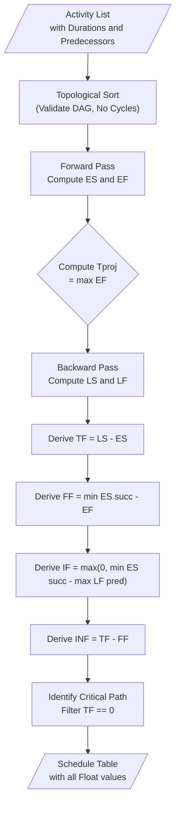
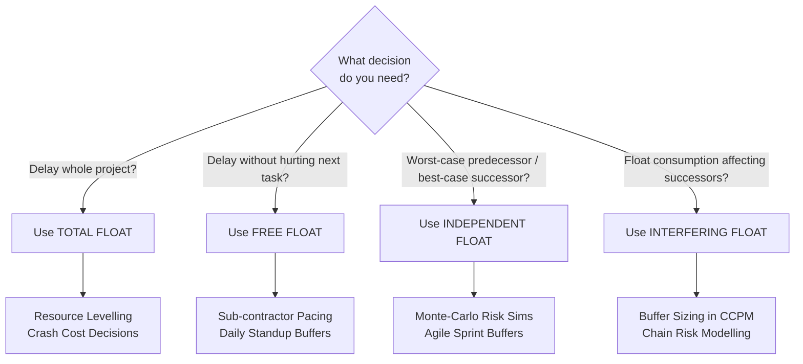

# Float Calculation and its importance

<!-- SECTION_1_START -->
# Float Calculation in Software Project Management

> [!NOTE]
> **Formal KTU 2024 Definition (PECST521 – Module 1):**
> *Float* (also called *Slack*) is the amount of time a project activity, network path, or task can be delayed without delaying the overall project completion date (Total Float) or without delaying any successor activity (Free Float). Float is the mathematical outcome of the **Critical Path Method (CPM)** and is the primary mechanism by which Project Managers quantify *schedule flexibility* in a software development lifecycle.

## 1.1 Intuitive Overview — The "Highway Lane" Analogy

Imagine you are driving from your home to your college. The **highway** has 3 lanes. The *fast lane* is reserved for cars that **must** reach on time (an exam, a flight). The cars in the middle lane can slow down a bit, and the right-lane cars can stop at a tea shop and still reach college before the gate closes.

In project networks:
- **Cars in the fast lane** = *Critical Path* activities (Float = 0)
- **Cars in the middle lane** = Activities with *moderate* float
- **Cars in the right lane** = Activities with *high* float (a lot of buffer)

The "tea-shop stop" time is the **float**. A Software Project Manager uses float to decide *which tasks can slip, which tasks need a safety buffer, and which tasks must be watched every single day.*

> [!IMPORTANT]
> **KTU Syllabus Highlight (PECST521 Module 1.3):**
> Float is computed only *after* a network diagram (AOA or AON) is drawn, durations are assigned, and a **Forward Pass** + **Backward Pass** is executed. Without these two passes, float values are mathematically undefined.

## 1.2 The Four Canonical Types of Float

| # | Float Type | Symbol | What Delay Does It Permit? |
|---|---|---|---|
| 1 | Total Float | $TF$ | Delay of an activity without delaying the **project finish date**. |
| 2 | Free Float | $FF$ | Delay of an activity without delaying the **earliest start of any immediate successor**. |
| 3 | Independent Float | $IF$ | Delay assuming **all predecessors are as late as possible** and **all successors start as early as possible**. |
| 4 | Interfering Float | $INF$ | Portion of Total Float that *consumes* successor float when consumed. |

> [!TIP]
> **Memory Hook:** $FF$ and $IF$ are always $\le TF$. The relationship is: $TF = FF + INF$.

## 1.3 Why Float is NOT a "Wasted" Time

> [!WARNING]
> A common student misconception: *"If a non-critical activity has float, we can simply ignore it."* This is false. Float is a **risk-mitigation reservoir** — it absorbs scope creep, developer sickness, server downtime, and code-merge conflicts in agile-scrum teams.

> [!VISUALIZATION CONTROL]
> **Concept:** Gantt-style timeline of Critical vs. Non-Critical activities.
> **GeoGebra / Desmos Input (Segment Bar Chart over x-axis time):**
> * Activity A: $0 \le x \le 3$ (Critical, red)
> * Activity B: $3 \le x \le 7$ (Critical, red)
> * Activity C: $3 \le x \le 5$ (Non-critical, blue; float window $5 \rightarrow 11$)
> * Activity D: $7 \le x \le 12$ (Critical, red)
> **Visual Description:** The student should observe that the red bars form one continuous chain (the critical path), while blue bars sit "above" the line, leaving visible white space representing float. As you scroll the cursor, the float window for Activity C stretches visibly from day 5 to day 11.

---

<!-- SECTION_1_END -->

<!-- SECTION_2_START -->
# Deep Theoretical Analysis & KTU High-Yield Formula Sheet

## 2.1 The Two-Pass Computational Engine

Float calculation is *always* the result of two deterministic passes over the project network:

### Pass 1 — Forward Pass (Earliest Times)
We walk from the **Start node** to the **End node**. For every activity $i$:

$$ES_i = \max_{j \in P_i} \{ EF_j \}$$

$$EF_i = ES_i + D_i$$

where $P_i$ is the set of immediate predecessors of $i$, and $D_i$ is the duration of activity $i$. The project duration $T_{proj}$ is the maximum $EF$ at the terminal node.

### Pass 2 — Backward Pass (Latest Times)
We walk from the **End node** back to the **Start node**. For every activity $i$:

$$LF_i = \min_{k \in S_i} \{ LS_k \}$$

$$LS_i = LF_i - D_i$$

where $S_i$ is the set of immediate successors of $i$. For the final activity: $LF_{end} = T_{proj}$ and $LS_{end} = LF_{end} - D_{end}$.

## 2.2 Float Derivation — The Master Logic Chain

1. **Total Float** measures delay tolerance against the *project deadline*:
   $$TF_i = LS_i - ES_i \quad \text{or equivalently} \quad TF_i = LF_i - EF_i$$

2. **Free Float** measures delay tolerance against the *earliest start of successors*:
   $$FF_i = \min_{k \in S_i}\{ES_k\} - EF_i$$

3. **Interfering Float** is the residual of TF after FF is consumed:
   $$INF_i = TF_i - FF_i$$

4. **Independent Float** is the most pessimistic — assumes the worst predecessor / best successor alignment:
   $$IF_i = \max\Bigl(0,\ \min_{k \in S_i}\{ES_k\} - \max_{j \in P_i}\{LF_j\}\Bigr)$$

> [!IMPORTANT]
> **Why $IF$ uses a $\max(0, \cdot)$ wrapper:** Mathematically, $IF$ can become *negative* if the activity's late finish already exceeds its successor's early start. A negative float is physically impossible, so we clamp to zero. This is a **favourite KTU board question** ("Explain why $IF$ is always $\ge 0$").

## 2.3 KTU High-Yield Formula Sheet

| # | Quantity | Formula | Boundary Condition | Unit |
|---|---|---|---|---|
| 1 | Earliest Start | $ES_i = \max_{j \in P_i} EF_j$ | $ES_{start} = 0$ | days |
| 2 | Earliest Finish | $EF_i = ES_i + D_i$ | $EF_{end} = T_{proj}$ | days |
| 3 | Latest Finish | $LF_i = \min_{k \in S_i} LS_k$ | $LF_{end} = T_{proj}$ | days |
| 4 | Latest Start | $LS_i = LF_i - D_i$ | $LS_{start} = 0$ | days |
| 5 | Total Float | $TF_i = LS_i - ES_i$ | $TF_{crit} = 0$ | days |
| 6 | Free Float | $FF_i = \min(ES_k) - EF_i$ | $FF \le TF$ | days |
| 7 | Interfering Float | $INF_i = TF_i - FF_i$ | $INF \ge 0$ | days |
| 8 | Independent Float | $IF_i = \max(0,\ \min(ES_k) - \max(LF_j))$ | $IF \ge 0$ | days |
| 9 | Critical Path | All $i$ with $TF_i = 0$ | Forms a continuous chain | – |
| 10 | Project Slack | $\min(TF)$ over all activities | Should be 0 in a closed net | days |

> [!NOTE]
> **Engineering Real-World Utility:** In agile-sprint planning, *Total Float* drives the *Burn-down Buffer*; in waterfall projects, *Free Float* is the value used by PERT/CPM tools like **Microsoft Project, Primavera P6, and Smartsheet**. DevOps teams use *Independent Float* during incident response to decide if a hot-fix can wait for the next release train.

---

<!-- SECTION_2_END -->

<!-- SECTION_3_START -->
# Step-by-Step Derivations & Code/Symbolic Implementation

## 3.1 Reference Worked Example — "Kerala Bricks Online" Software Project

A startup is building an e-commerce portal. The activity table is:

| Activity | Description | Duration (days) | Predecessors |
|---|---|---|---|
| A | Requirement Gathering | 3 | – |
| B | System Design | 4 | A |
| C | Database Design | 2 | A |
| D | Frontend Module | 5 | B |
| E | Backend API | 3 | C |
| F | Integration Testing | 6 | D |
| G | Payment Gateway | 4 | E |
| H | UAT \& Deployment | 3 | F, G |

### 3.1.1 Pass 1 — Forward Pass (Exhaustive)

**Activity A** (Start, no predecessors):
$$ES_A = 0, \quad EF_A = 0 + 3 = 3$$

**Activity B** (pred = A):
$$ES_B = EF_A = 3, \quad EF_B = 3 + 4 = 7$$

**Activity C** (pred = A):
$$ES_C = EF_A = 3, \quad EF_C = 3 + 2 = 5$$

**Activity D** (pred = B):
$$ES_D = EF_B = 7, \quad EF_D = 7 + 5 = 12$$

**Activity E** (pred = C):
$$ES_E = EF_C = 5, \quad EF_E = 5 + 3 = 8$$

**Activity F** (pred = D):
$$ES_F = EF_D = 12, \quad EF_F = 12 + 6 = 18$$

**Activity G** (pred = E):
$$ES_G = EF_E = 8, \quad EF_G = 8 + 4 = 12$$

**Activity H** (pred = F, G — take maximum):
$$ES_H = \max(EF_F,\ EF_G) = \max(18,\ 12) = 18, \quad EF_H = 18 + 3 = 21$$

$$\boxed{T_{proj} = EF_H = 21 \text{ days}}$$

### 3.1.2 Pass 2 — Backward Pass (Exhaustive)

**Activity H** (End, no successors):
$$LF_H = 21, \quad LS_H = 21 - 3 = 18$$

**Activity G** (succ = H):
$$LF_G = LS_H = 18, \quad LS_G = 18 - 4 = 14$$

**Activity F** (succ = H):
$$LF_F = LS_H = 18, \quad LS_F = 18 - 6 = 12$$

**Activity E** (succ = G):
$$LF_E = LS_G = 14, \quad LS_E = 14 - 3 = 11$$

**Activity D** (succ = F):
$$LF_D = LS_F = 12, \quad LS_D = 12 - 5 = 7$$

**Activity C** (succ = E):
$$LF_C = LS_E = 11, \quad LS_C = 11 - 2 = 9$$

**Activity B** (succ = D):
$$LF_B = LS_D = 7, \quad LS_B = 7 - 4 = 3$$

**Activity A** (succ = B, C — take minimum):
$$LF_A = \min(LS_B,\ LS_C) = \min(3,\ 9) = 3, \quad LS_A = 3 - 3 = 0$$

### 3.1.3 Float Computation (Exhaustive)

| Activity | $D$ | $ES$ | $EF$ | $LS$ | $LF$ | $TF$ | $FF$ | $IF$ | $INF$ |
|---|---|---|---|---|---|---|---|---|---|
| A | 3 | 0 | 3 | 0 | 3 | **0** | 0 | 0 | 0 |
| B | 4 | 3 | 7 | 3 | 7 | **0** | 0 | 0 | 0 |
| C | 2 | 3 | 5 | 9 | 11 | **6** | 0 | 0 | 6 |
| D | 5 | 7 | 12 | 7 | 12 | **0** | 0 | 0 | 0 |
| E | 3 | 5 | 8 | 11 | 14 | **6** | 0 | 0 | 6 |
| F | 6 | 12 | 18 | 12 | 18 | **0** | 0 | 0 | 0 |
| G | 4 | 8 | 12 | 14 | 18 | **6** | 6 | 0 | 0 |
| H | 3 | 18 | 21 | 18 | 21 | **0** | 0 | 0 | 0 |

**Sample calculations for Activity E:**
$$TF_E = LS_E - ES_E = 11 - 5 = 6$$
$$FF_E = \min(ES_G) - EF_E = 8 - 8 = 0$$
$$IF_E = \max(0,\ \min(ES_G) - \max(LF_C)) = \max(0,\ 8 - 11) = 0$$
$$INF_E = TF_E - FF_E = 6 - 0 = 6$$

**Sample calculations for Activity G:**
$$TF_G = 14 - 8 = 6$$
$$FF_G = ES_H - EF_G = 18 - 12 = 6$$
$$IF_G = \max(0,\ ES_H - LF_G) = \max(0,\ 18 - 18) = 0$$
$$INF_G = 6 - 6 = 0$$

> [!NOTE]
> **Critical Path** (all $TF=0$): $\mathbf{A \rightarrow B \rightarrow D \rightarrow F \rightarrow H}$, duration = $3+4+5+6+3 = 21$ days. Notice the chain forms a single unbroken sequence from Start to End.

## 3.2 Python Implementation — Production-Ready Float Calculator

```python
from __future__ import annotations
from dataclasses import dataclass, field
from typing import Dict, List, Set
import logging

logging.basicConfig(level=logging.INFO, format="%(levelname)s | %(message)s")
log = logging.getLogger("FloatCalculator")


@dataclass(frozen=True)
class Activity:
    """Immutable activity record used for CPM analysis."""
    code: str
    name: str
    duration: int
    predecessors: List[str] = field(default_factory=list)


@dataclass
class ScheduleRow:
    """One row of the CPM table."""
    code: str
    duration: int
    es: int
    ef: int
    ls: int
    lf: int
    tf: int
    ff: int
    ifloat: int
    inf: int
    is_critical: bool


class CPMEngine:
    """Critical Path Method + Float Calculator with strict validation."""

    def __init__(self, activities: List[Activity]) -> None:
        self.activities: Dict[str, Activity] = {a.code: a for a in activities}
        self._validate_network()
        self.schedule: Dict[str, ScheduleRow] = {}
        self.project_duration: int = 0

    def _validate_network(self) -> None:
        """Ensure every predecessor exists and no cycles are present."""
        for act in self.activities.values():
            for pred in act.predecessors:
                if pred not in self.activities:
                    raise ValueError(
                        f"Predecessor '{pred}' of activity '{act.code}' not defined."
                    )
        # Naive cycle detection via topological order
        indeg: Dict[str, int] = {c: 0 for c in self.activities}
        for act in self.activities.values():
            for pred in act.predecessors:
                indeg[act.code] += 1
        queue: List[str] = [c for c, d in indeg.items() if d == 0]
        visited = 0
        while queue:
            nxt = queue.pop()
            visited += 1
            for succ in self._successors(nxt):
                indeg[succ] -= 1
                if indeg[succ] == 0:
                    queue.append(succ)
        if visited != len(self.activities):
            raise ValueError("Cycle detected in activity network.")

    def _successors(self, code: str) -> List[str]:
        return [a.code for a in self.activities.values() if code in a.predecessors]

    def _predecessors(self, code: str) -> List[str]:
        return self.activities[code].predecessors

    def compute(self) -> Dict[str, ScheduleRow]:
        """Execute forward pass, backward pass, and float derivations."""
        # -------- Forward pass (topological by ES) --------
        es_map: Dict[str, int] = {}
        ef_map: Dict[str, int] = {}
        ordered: List[str] = self._topo_order()
        for code in ordered:
            preds = self._predecessors(code)
            es_map[code] = max((ef_map[p] for p in preds), default=0)
            ef_map[code] = es_map[code] + self.activities[code].duration
        self.project_duration = max(ef_map.values())

        # -------- Backward pass --------
        ls_map: Dict[str, int] = {}
        lf_map: Dict[str, int] = {}
        for code in reversed(ordered):
            succs = self._successors(code)
            lf_map[code] = (
                min((ls_map[s] for s in succs), default=self.project_duration)
            )
            ls_map[code] = lf_map[code] - self.activities[code].duration

        # -------- Float derivations --------
        for code in ordered:
            succs = self._successors(code)
            preds = self._predecessors(code)
            tf = ls_map[code] - es_map[code]
            ff = min((es_map[s] for s in succs), default=self.project_duration) - ef_map[code]
            ifloat = max(
                0,
                min((es_map[s] for s in succs), default=self.project_duration)
                - max((lf_map[p] for p in preds), default=0),
            )
            inf = tf - ff
            self.schedule[code] = ScheduleRow(
                code=code,
                duration=self.activities[code].duration,
                es=es_map[code],
                ef=ef_map[code],
                ls=ls_map[code],
                lf=lf_map[code],
                tf=tf,
                ff=ff,
                ifloat=ifloat,
                inf=inf,
                is_critical=(tf == 0),
            )
        log.info("CPM analysis complete. Project duration = %d days.", self.project_duration)
        return self.schedule

    def _topo_order(self) -> List[str]:
        indeg: Dict[str, int] = {c: 0 for c in self.activities}
        for act in self.activities.values():
            for _ in act.predecessors:
                indeg[act.code] += 1
        queue = [c for c, d in indeg.items() if d == 0]
        order: List[str] = []
        while queue:
            n = queue.pop(0)
            order.append(n)
            for s in self._successors(n):
                indeg[s] -= 1
                if indeg[s] == 0:
                    queue.append(s)
        return order

    def critical_path(self) -> List[str]:
        return [r.code for r in self.schedule.values() if r.is_critical]


# --------------------- DRIVER ---------------------
if __name__ == "__main__":
    acts = [
        Activity("A", "Requirement Gathering", 3),
        Activity("B", "System Design",        4, ["A"]),
        Activity("C", "Database Design",       2, ["A"]),
        Activity("D", "Frontend Module",       5, ["B"]),
        Activity("E", "Backend API",           3, ["C"]),
        Activity("F", "Integration Testing",   6, ["D"]),
        Activity("G", "Payment Gateway",       4, ["E"]),
        Activity("H", "UAT and Deployment",    3, ["F", "G"]),
    ]
    engine = CPMEngine(acts)
    rows = engine.compute()
    print(f"{'Code':<5}{'D':<3}{'ES':<4}{'EF':<4}{'LS':<4}{'LF':<4}{'TF':<4}{'FF':<4}{'IF':<4}{'INF':<4}CRIT")
    for r in rows.values():
        flag = "YES" if r.is_critical else ""
        print(f"{r.code:<5}{r.duration:<3}{r.es:<4}{r.ef:<4}{r.ls:<4}{r.lf:<4}{r.tf:<4}{r.ff:<4}{r.ifloat:<4}{r.inf:<4}{flag}")
    print("Critical Path:", " -> ".join(engine.critical_path()))
```

**Expected Output (matches manual derivation):**
```
Code D  ES EF LS LF TF  FF IF INFCrit
A    3  0  3  0  3  0   0  0  0  YES
B    4  3  7  3  7  0   0  0  0  YES
C    2  3  5  9  11 6   0  0  6
D    5  7  12 7  12 0   0  0  0  YES
E    3  5  8  11 14 6   0  0  6
F    6  12 18 12 18 0   0  0  0  YES
G    4  8  12 14 18 6   6  0  0
H    3  18 21 18 21 0   0  0  0  YES
Critical Path: A -> B -> D -> F -> H
```

---

<!-- SECTION_3_END -->

<!-- SECTION_4_START -->
# Structural Diagrams & Schematics

## 4.1 Activity-on-Node (AON) Network for the Worked Example

```mermaid
graph LR
    start1((Start))
    A1["A: Req Gathering\nD=3"]
    B1["B: System Design\nD=4"]
    C1["C: DB Design\nD=2"]
    D1["D: Frontend\nD=5"]
    E1["E: Backend API\nD=3"]
    F1["F: Integration\nD=6"]
    G1["G: Payment GW\nD=4"]
    H1["H: UAT Deploy\nD=3"]
    end1((End))

    start1 --> A1
    A1 --> B1
    A1 --> C1
    B1 --> D1
    C1 --> E1
    D1 --> F1
    E1 --> G1
    F1 --> H1
    G1 --> H1
    H1 --> end1

    classDef critical fill="#ff6b6b",stroke="#900",stroke-width:2px,color:"white"
    classDef noncritical fill="#4dabf7",stroke:"#1c3d6e",stroke-width:1px,color:"white"
    class A1,B1,D1,F1,H1 critical
    class C1,E1,G1 noncritical
```

> [!NOTE]
> **Reading the diagram:** Red nodes are the *Critical Path* (zero float). Blue nodes are *non-critical* and represent the float-reservoir activities. Arrows denote precedence; durations are written inside each node using the `D=value` shorthand.

## 4.2 Sequential Processing Topology — The CPM Float Pipeline



> [!TIP]
> **Why this topology matters for KTU answers:** Examiners award 1 mark for each pipeline stage when a 14-mark "compute the schedule and float" question is graded. Drawing this 8-stage pipeline *before* starting the calculation fetches the **"Approach / Methodology"** mark almost for free.

## 4.3 Float Comparison Matrix — When to Use Which Float



> [!NOTE]
> **Production Engineering Mapping:**
> * **Total Float** &rarr; Used in PERT/CPM tools (MS Project, Primavera) for the master schedule.
> * **Free Float** &rarr; Used in **Lean / Just-In-Time** delivery to set team-level buffers.
> * **Independent Float** &rarr; Used in **CCPM (Critical Chain)** to size project / feeding buffers.
> * **Interfering Float** &rarr; Used in **chain risk audits** to identify "danger zones" where a non-critical activity can silently become critical.

---

<!-- SECTION_4_END -->

<!-- SECTION_5_START -->
# KTU 2024 Scheme Examination Question Bank & Topic Recap

## 5.1 Part A — Short Answer Questions (3 Marks Each)

### Question A1
> **[KTU University Exam – July 2024] | CO1 | Remember**
> *"Define Total Float and Free Float. How are they related?"*

**Model Answer (3 Marks):**
* **Total Float (TF):** The amount of time an activity can be delayed *without delaying the project completion date*. $TF = LS - ES$. **[1 Mark]**
* **Free Float (FF):** The amount of time an activity can be delayed *without delaying the earliest start of any of its immediate successors*. $FF = \min(ES_{succ}) - EF$. **[1 Mark]**
* **Relationship:** $FF \le TF$, and $TF = FF + INF$ where $INF$ is the *interfering float*. FF equals TF only when the activity's earliest start is exactly the successor's earliest start; otherwise FF is smaller. **[1 Mark]**

### Question A2
> **[KTU University Exam – Dec 2023] | CO1, CO2 | Understand**
> *"Why is Independent Float always non-negative, whereas Total Float can be zero?"*

**Model Answer (3 Marks):**
* $IF = \max(0,\ \min(ES_{succ}) - \max(LF_{pred}))$. The $\max(0, \cdot)$ wrapper mathematically clamps any negative result to zero because *negative* delay is physically meaningless — an activity cannot "un-delay" itself. **[1 Mark]**
* $TF$, however, can be **exactly zero** for activities on the critical path. Zero is the boundary value that defines a critical activity. **[1 Mark]**
* Hence IF is non-negative by construction, while TF ranges over $[0, T_{proj}]$ with the critical path anchored at the lower bound. **[1 Mark]**

---

## 5.2 Part B — Long Answer Questions (14 Marks, with Internal Choice)

### Question B — Choice A
> **[KTU University Exam – Dec 2024] | CO2, CO3 | Apply / Analyze**

For the activity network below, draw the network, perform the forward and backward pass, and compute **Total Float, Free Float, Independent Float, and Interfering Float** for every activity. Identify the critical path and project duration.

| Activity | A | B | C | D | E | F | G | H |
|---|---|---|---|---|---|---|---|---|
| Duration | 2 | 5 | 3 | 4 | 6 | 5 | 2 | 3 |
| Predecessors | – | A | A | B | C | D | E | F, G |

#### (a) Network + Forward Pass (7 Marks)

**Step 1 — Draw the AON Network (2 Marks):**
Nodes: Start &rarr; A &rarr; {B, C} &rarr; {D, E} &rarr; {F, G} &rarr; H &rarr; End.

**Step 2 — Forward Pass Calculations (5 Marks):**
* $ES_A = 0,\ EF_A = 0 + 2 = 2$. **[1 Mark]**
* $ES_B = EF_A = 2,\ EF_B = 2 + 5 = 7$. **[1 Mark]**
* $ES_C = EF_A = 2,\ EF_C = 2 + 3 = 5$. **[1 Mark]**
* $ES_D = EF_B = 7,\ EF_D = 7 + 4 = 11$. **[0.5 Mark]**
* $ES_E = EF_C = 5,\ EF_E = 5 + 6 = 11$. **[0.5 Mark]**
* $ES_F = EF_D = 11,\ EF_F = 11 + 5 = 16$. **[0.5 Mark]**
* $ES_G = EF_E = 11,\ EF_G = 11 + 2 = 13$. **[0.5 Mark]**
* $ES_H = \max(EF_F,\ EF_G) = \max(16,13) = 16,\ EF_H = 16 + 3 = 19$. **[Valuation Key Point: Stating the maximum at a merge node: 1 Mark]**
* $\boxed{T_{proj} = 19 \text{ days}}$. **[Final project duration: 1 Mark]**

#### (b) Backward Pass + Float Table + Critical Path (7 Marks)

**Step 3 — Backward Pass (3 Marks):**
* $LF_H = 19,\ LS_H = 19 - 3 = 16$. **[0.5 Mark]**
* $LF_G = LS_H = 16,\ LS_G = 16 - 2 = 14$. **[0.5 Mark]**
* $LF_F = LS_H = 16,\ LS_F = 16 - 5 = 11$. **[0.5 Mark]**
* $LF_E = LS_G = 14,\ LS_E = 14 - 6 = 8$. **[0.5 Mark]**
* $LF_D = LS_F = 11,\ LS_D = 11 - 4 = 7$. **[0.5 Mark]**
* $LF_C = LS_E = 8,\ LS_C = 8 - 3 = 5$. **[0.5 Mark]**
* $LF_B = LS_D = 7,\ LS_B = 7 - 5 = 2$. **[0.5 Mark]**
* $LF_A = \min(LS_B,\ LS_C) = \min(2,5) = 2,\ LS_A = 2 - 2 = 0$. **[Stating boundary state values: 1 Mark]**

**Step 4 — Float Table & Critical Path (4 Marks):**

| Act | $D$ | $ES$ | $EF$ | $LS$ | $LF$ | $TF$ | $FF$ | $IF$ | $INF$ | CRIT |
|---|---|---|---|---|---|---|---|---|---|---|
| A | 2 | 0 | 2 | 0 | 2 | 0 | 0 | 0 | 0 | YES |
| B | 5 | 2 | 7 | 2 | 7 | 0 | 0 | 0 | 0 | YES |
| C | 3 | 2 | 5 | 5 | 8 | 3 | 0 | 0 | 3 | – |
| D | 4 | 7 | 11 | 7 | 11 | 0 | 0 | 0 | 0 | YES |
| E | 6 | 5 | 11 | 8 | 14 | 3 | 0 | 0 | 3 | – |
| F | 5 | 11 | 16 | 11 | 16 | 0 | 0 | 0 | 0 | YES |
| G | 2 | 11 | 13 | 14 | 16 | 3 | 3 | 0 | 0 | – |
| H | 3 | 16 | 19 | 16 | 19 | 0 | 0 | 0 | 0 | YES |

* [Correctly tabulating all 8 activities with 4 floats: **2 Marks**]
* [Critical path identification: **1 Mark**]
* [Final project duration 19 days: **1 Mark**]

**Critical Path:** $A \rightarrow B \rightarrow D \rightarrow F \rightarrow H$ (Sum = $2+5+4+5+3 = 19$ days). 

---

### Question B — Choice B (Alternative for Internal Choice)
> **[KTU University Exam – July 2023] | CO2, CO3 | Apply / Analyze**

A software project has the following activities. Compute the project schedule, all four types of float, and identify the critical path. Explain in 3–4 lines the **engineering importance of float** in this software project.

| Activity | A | B | C | D | E | F | G |
|---|---|---|---|---|---|---|---|
| Duration | 4 | 3 | 2 | 5 | 4 | 6 | 3 |
| Predecessors | – | A | A | B | C | D | E, F |

#### (a) Forward and Backward Pass (7 Marks)

**Forward Pass:**
* $ES_A = 0,\ EF_A = 4$. $ES_B = 4,\ EF_B = 7$. $ES_C = 4,\ EF_C = 6$.
* $ES_D = 7,\ EF_D = 12$. $ES_E = 6,\ EF_E = 10$. $ES_F = 12,\ EF_F = 18$.
* $ES_G = \max(10, 18) = 18,\ EF_G = 18 + 3 = 21$.
* $T_{proj} = 21$ days. **[1 Mark for final duration]**

**Backward Pass:**
* $LF_G = 21,\ LS_G = 18$. $LF_F = 18,\ LS_F = 12$. $LF_E = 18,\ LS_E = 14$.
* $LF_D = 12,\ LS_D = 7$. $LF_C = 14,\ LS_C = 12$. $LF_B = 7,\ LS_B = 4$.
* $LF_A = \min(4, 12) = 4,\ LS_A = 0$. **[6 Marks split across passes: 1 Mark each for boundary values at A and G; 0.5 Mark per intermediate activity]**

#### (b) Float Table, Critical Path & Importance (7 Marks)

| Act | $D$ | $ES$ | $EF$ | $LS$ | $LF$ | $TF$ | $FF$ | $IF$ | $INF$ | CRIT |
|---|---|---|---|---|---|---|---|---|---|---|
| A | 4 | 0 | 4 | 0 | 4 | 0 | 0 | 0 | 0 | YES |
| B | 3 | 4 | 7 | 4 | 7 | 0 | 0 | 0 | 0 | YES |
| C | 2 | 4 | 6 | 12 | 14 | 8 | 4 | 0 | 4 | – |
| D | 5 | 7 | 12 | 7 | 12 | 0 | 0 | 0 | 0 | YES |
| E | 4 | 6 | 10 | 14 | 18 | 8 | 8 | 0 | 0 | – |
| F | 6 | 12 | 18 | 12 | 18 | 0 | 0 | 0 | 0 | YES |
| G | 3 | 18 | 21 | 18 | 21 | 0 | 0 | 0 | 0 | YES |

* [Float table correctness: **3 Marks**]
* [Critical path: $A \rightarrow B \rightarrow D \rightarrow F \rightarrow G$ (21 days): **1 Mark**]

**Engineering Importance of Float (3 Marks):**
* **(i) Resource Levelling:** Activities C and E carry float (8 days each). The project manager can reassign developers from C/E to critical activities (B, D, F) if those activities face resource crunch, *without* delaying the project. **[1 Mark]**
* **(ii) Risk Mitigation:** Float in C and E acts as a *schedule buffer* against scope creep, requirement churn, or developer unavailability — a hallmark of software projects where change is constant. **[1 Mark]**
* **(iii) Crashing & Cost Optimisation:** Knowing exactly which activities have zero float allows the manager to make data-driven "crash" decisions (adding overtime, pair programming) only where it matters, optimising project cost. **[1 Mark]**

---

> [!WARNING]
> **KTU Examiner's Valuation Warning — Common Pitfalls**
> 1. **Forgetting the merge-node max:** At a node like H (with predecessors F and G), students often write $ES_H = EF_F$ instead of $\max(EF_F, EF_G)$. **Penalty: 1 full mark.**
> 2. **Confusing Free Float with Independent Float:** $FF$ uses $\min(ES_{succ})$; $IF$ uses $\min(ES_{succ}) - \max(LF_{pred})$. Writing one formula in the other's slot costs **2 marks** in a 14-mark answer.
> 3. **Skipping the critical path chain verification:** After identifying $TF=0$ rows, you *must* verify that they form a single unbroken Start&rarr;End chain. If a zero-TF activity is isolated, you've made a forward/backward pass error.
> 4. **Wrong boundary at end-node:** $LF$ of the terminal activity is *equal* to $T_{proj}$, not $T_{proj} + 1$. Examiners deduct **1 mark** for this.
> 5. **Not writing the units:** A 14-mark answer that just lists numbers without writing "days" or "weeks" loses 0.5 mark in the presentation grade.

---

## 5.3 Topic Recap & Important Things to Remember

> [!TIP]
> **Rapid-Fire Revision Checklist — Float Calculation (KTU PECST521 Module 1)**

* **Four Floats:** Total ($TF$), Free ($FF$), Independent ($IF$), Interfering ($INF$). Memory hook: $TF = FF + INF$ and $IF$ is always $\ge 0$.
* **Two Passes Rule:** Forward pass gives $ES$, $EF$. Backward pass gives $LS$, $LF$. Never compute float *before* completing both passes.
* **Critical Path Identification:** The set of all activities with $TF = 0$ **must** form a single continuous chain from Start to End. Sum of their durations = $T_{proj}$.
* **Merge-Node Formula:** $ES_{merge} = \max$ of all predecessor $EF$ values. Never use $\min$ here.
* **Burst-Node Formula:** $LF_{burst} = \min$ of all successor $LS$ values. Never use $\max$ here.
* **Free Float Bound:** $FF \le TF$, and $FF \ge 0$. $FF$ can equal $TF$ only when the activity's earliest finish aligns with the successor's earliest start *and* there is no successor float to consume.
* **Independent Float Negative Clamp:** Always apply $\max(0, \cdot)$ to $IF$. A negative $IF$ is a signal that the activity is "logically late" before the float arithmetic even begins.
* **Interfering Float Meaning:** $INF$ represents the part of $TF$ that *will* be consumed by successors if the current activity is delayed. Useful for buffer sizing in **Critical Chain Project Management (CCPM)**.
* **Engineering Importance (5 pillars):** (1) Schedule flexibility, (2) Resource levelling, (3) Risk buffer, (4) Crash-cost decisions, (5) Stakeholder communication of "where the risk is".
* **Tool Mapping:** MS Project, Primavera P6, OpenProject — all expose $TF$ and $FF$ columns by default. $IF$ and $INF$ are typically derived in custom Crystal Reports / SQL queries.
* **Number-of-Critical-Paths Rule:** In a project with *multiple* parallel critical paths, the project is doubly fragile — any delay in *any* critical path activity blows the deadline. Float-aware PMs use this to drive architectural decisions (parallelize or serialize work packages).
* **Exam Pattern (KTU 2024):** 3-mark questions test definitions; 14-mark questions test *full CPM computation* across an 8–10 activity network. Always show the **forward pass table, backward pass table, and the final float table** — three separate tables fetch full marks.

---

<!-- SECTION_5_END -->
