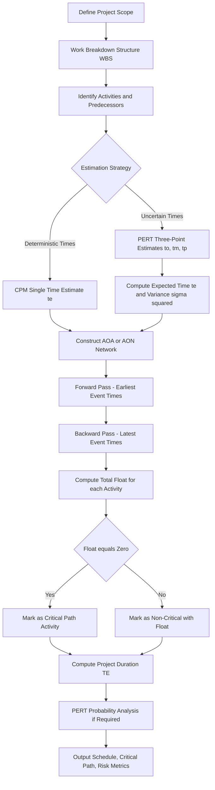
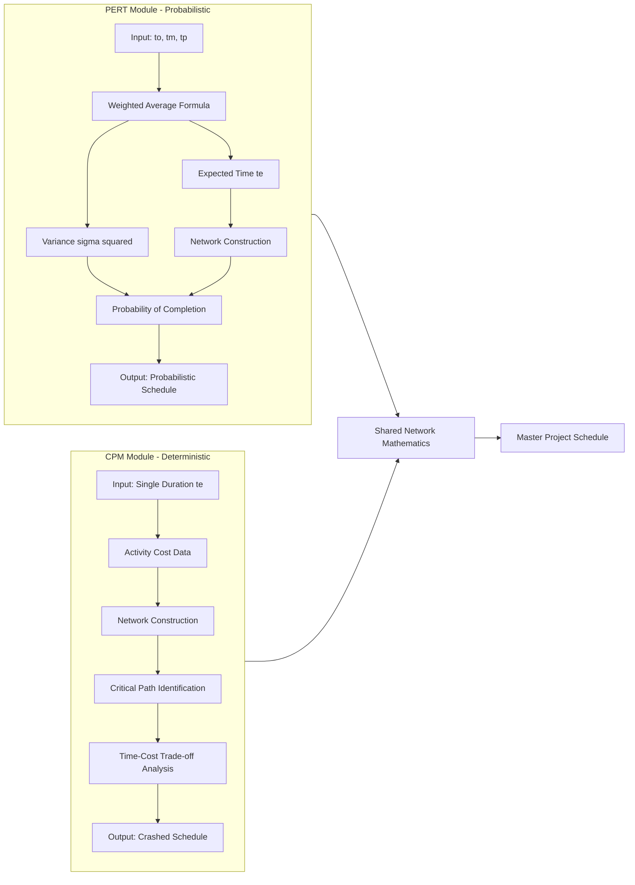
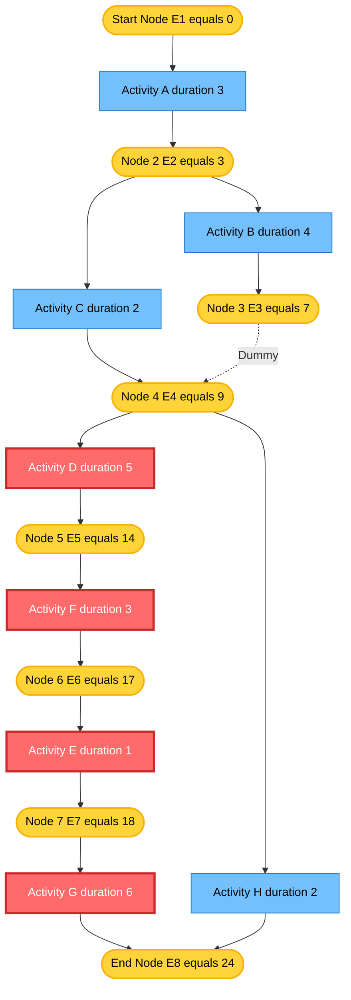

# Introduction to PERT and CPM

<!-- SECTION_1_START -->
# Introduction to PERT and CPM

## Formal Academic Definitions

**PERT (Program Evaluation and Review Technique)** is a probabilistic project management modeling technique developed by the U.S. Navy in 1958 for the Polaris missile project. It is designed to plan, schedule, and control complex projects whose activity durations are inherently uncertain, by employing **three-time estimates** and a weighted-average formula rooted in the Beta probability distribution.

**CPM (Critical Path Method)** is a deterministic project management modeling technique developed independently by DuPont and Remington Rand in 1957. It is designed to plan and control well-defined, repeatable projects with predictable activity durations, by identifying the **longest path of dependent activities** (the critical path) that determines the minimum project completion time.

> [!IMPORTANT]
> **KTU 2024 Syllabus Highlight (PECST521 - Module 1):**
> Students must clearly differentiate between PERT (probabilistic, time-focused, three estimates) and CPM (deterministic, time-cost trade-off, single estimate). Board questions frequently test this conceptual contrast for **3 marks** as a direct Part A question.

## Conceptual Analogy & Intuition

Imagine you are planning a **wedding ceremony** with several parallel tasks — booking the venue, ordering catering, arranging decorations, and sending invitations.

* **CPM Analogy**: If every task has a *fixed* duration (e.g., the caterer guarantees 5 days), CPM simply maps out which tasks are *dependent* on others and identifies the **longest unavoidable chain** of activities. If the venue booking is delayed, nothing else can start — that chain becomes "critical."

* **PERT Analogy**: If task durations are *uncertain* (the caterer says "between 3 and 9 days, most likely 5"), PERT uses a **weighted probabilistic average** to convert this uncertainty into a single expected duration, then proceeds exactly like CPM.

**Intuitive Summary**: PERT adds a *statistical safety layer* on top of CPM's scheduling logic. Both share the same network mathematics — they only differ in how activity durations are estimated.

> [!NOTE]
> **Geometric Intuition**: In a PERT/CPM network, the project is a directed graph where every **arrow** represents an *activity* (a unit of work) and every **node** represents an *event* (a milestone in time). The graph flows from a *start node* (time = 0) to an *end node* (project completion).

> [!VISUALIZATION CONTROL]
> **Concept:** Probability Distribution of PERT Activity Time (Beta Distribution)
> **GeoGebra / Desmos Input Equations:**
> * `f(x) = ((x - a)^(α - 1) * (b - x)^(β - 1)) / B(α, β)` for a Beta PDF (conceptual)
> * Marker points: `Pt_O = (Optimistic, 0)`, `Pt_M = (Most Likely, Peak)`, `Pt_P = (Pessimistic, 0)`
> **Visual Description:** A bell-shaped curve skewed slightly right, where the optimistic (O) and pessimistic (P) times bound the x-axis, and the most likely (M) time sits at the peak. The PERT formula te = (O + 4M + P)/6 represents the **centroid** (center of mass) of this distribution.

## Activity-on-Arrow (AOA) vs. Activity-on-Node (AON) Networks

| Network Type | Symbol | Entity Represented | Common Use |
| :--- | :---: | :--- | :--- |
| **AOA (Activity on Arrow)** | Arrow $\rightarrow$ | Activity | PERT (classical), CPM (classical) |
| **AON (Activity on Node)** | Node $\square$ | Activity | Modern software tools (MS Project, Primavera) |

> [!NOTE]
> **Dummy Activity**: In AOA networks, a *dummy* is a zero-duration logical connector (often drawn as a dashed arrow) used solely to enforce precedence relationships when two activities share the same start and end events but do not actually depend on each other.
<!-- SECTION_1_END -->

<!-- SECTION_2_START -->
# Deep Theoretical Analysis & KTU Formula Sheet

## Theoretical Framework — The Two-Phase Logic of PERT and CPM

Both techniques follow a **two-phase analytical process**:

### Phase 1 — Network Construction
1. **Decompose** the project into discrete, manageable activities (Work Breakdown Structure — WBS).
2. **Establish precedence** — determine which activities must logically finish before others begin.
3. **Estimate duration**:
   * CPM → single deterministic estimate $t_e$ (in days/weeks).
   * PERT → three estimates: $t_o$ (optimistic), $t_m$ (most likely), $t_p$ (pessimistic).
4. **Draw the network** as a directed acyclic graph (DAG) with a single START and a single END node.

### Phase 2 — Critical Path Computation
1. **Forward Pass** — compute Earliest Start ($E_i$) and Earliest Finish ($E_j$) for every event $i \rightarrow j$:

$$E_j = \max_{i} \left[ E_i + t_{ij} \right]$$

2. **Backward Pass** — compute Latest Finish ($L_j$) and Latest Start ($L_i$) for every event:

$$L_i = \min_{j} \left[ L_j - t_{ij} \right]$$

3. **Identify the Critical Path** — the chain of activities where $E_j - E_i = L_j - L_i$ (zero float).
4. **Project Duration** = $T_E = E_{\text{end}}$ (sum of expected times along the critical path).
5. **Probability Analysis (PERT only)** — compute probability of finishing before a target date $T_S$ using the standard normal deviate $Z$:

$$Z = \frac{T_S - T_E}{\sigma_{cp}} \quad \text{where} \quad \sigma_{cp} = \sqrt{\sum \sigma_{ij}^2 \text{ along critical path}}$$

## KTU High-Yield Formula Sheet

> [!NOTE]
> The following table consolidates **every formula** that KTU examiners expect students to reproduce without assistance in the End Semester Examination (ESE).

| # | Concept | Formula | Units / Notes |
| :---: | :--- | :--- | :--- |
| 1 | PERT Expected Time | $t_e = \dfrac{t_o + 4 t_m + t_p}{6}$ | Time units (days, weeks) |
| 2 | PERT Variance | $\sigma^2 = \left( \dfrac{t_p - t_o}{6} \right)^2$ | Squared time units |
| 3 | PERT Std. Deviation | $\sigma = \dfrac{t_p - t_o}{6}$ | Time units |
| 4 | Earliest Event Time | $E_j = \max_i \left[ E_i + t_{ij} \right]$ | Forward pass |
| 5 | Latest Event Time | $L_i = \min_j \left[ L_j - t_{ij} \right]$ | Backward pass |
| 6 | Earliest Start (Activity) | $ES = E_i$ | Of its tail event |
| 7 | Earliest Finish | $EF = ES + t_e$ | Of the activity |
| 8 | Latest Finish | $LF = L_j$ | Of its head event |
| 9 | Latest Start | $LS = LF - t_e$ | Of the activity |
| 10 | Total Float (Slack) | $TF = LS - ES = LF - EF$ | Zero on critical path |
| 11 | Free Float | $FF = E_j - (E_i + t_{ij})$ | Independent float |
| 12 | Project Duration | $T_E = E_{\text{end}} = L_{\text{end}}$ | Sum along critical path |
| 13 | Critical Path Std. Dev. | $\sigma_{cp} = \sqrt{\sum \sigma_{ij}^2}$ | Variance additivity rule |
| 14 | Probability Z-Score | $Z = \dfrac{T_S - T_E}{\sigma_{cp}}$ | Use standard normal tables |
| 15 | CPM Direct Cost Slope | $C_S = \dfrac{CC - NC}{NT - CT}$ | Crash cost per unit time |

## Real-World Engineering Utility

| Domain | PERT Application | CPM Application |
| :--- | :--- | :--- |
| **Aerospace & Defense** | R\&D projects, prototype launches | Satellite manufacturing, defense contracts |
| **Software Engineering** | Agile sprint estimation (story points akin to 3-point estimates) | Gantt-chart-based waterfall deliveries |
| **Construction** | Tender bidding with uncertain site conditions | Repetitive high-rise construction scheduling |
| **IT Service Management** | Disaster recovery drill planning | Data center migration cutover planning |
| **Research \& Development** | Drug discovery, clinical trials | Equipment installation projects |

> [!IMPORTANT]
> **Modern Software Tool Integration**: Microsoft Project, Primavera P6, and open-source tools like **ProjectLibre** implement AON-based CPM algorithms natively. PERT is rarely used in its original form today but the *three-point estimation* concept persists in Agile's **Planning Poker** and the **PERT-style weighted Fibonacci sequence**.
<!-- SECTION_2_END -->

<!-- SECTION_3_START -->
# Step-by-Step Derivations and Implementation

## Derivation 1 — PERT Expected Time Formula

The PERT expected time $t_e$ is the **mean of the Beta distribution** $B(\alpha, \beta)$, where the variance is approximated as $\left( \dfrac{t_p - t_o}{6} \right)^2$.

**Step 1**: For a Beta distribution with parameters $\alpha$ and $\beta$, the mean is given by:

$$\mu = \frac{\alpha}{\alpha + \beta}$$

**Step 2**: The mode (most likely value) of the Beta distribution is given by:

$$t_m = \frac{\alpha - 1}{\alpha + \beta - 2} \quad \text{for} \quad \alpha, \beta > 1$$

**Step 3**: Approximating $\alpha$ and $\beta$ such that the mode $t_m$ and range $[t_o, t_p]$ satisfy:

$$
\begin{aligned}
t_o &= \mu - 2\sigma \\
t_m &= \mu - \frac{\sigma(\alpha - \beta)}{3} \\
t_p &= \mu + 2\sigma
\end{aligned}
$$

**Step 4**: Under the standard PERT assumption $\sigma = \dfrac{t_p - t_o}{6}$, substituting and solving for $\mu$ yields the **classical PERT formula**:

$$t_e = \mu = \frac{t_o + 4 t_m + t_p}{6}$$

**Step 5**: Variance is preserved as:

$$\sigma^2 = \left( \frac{t_p - t_o}{6} \right)^2$$

## Worked Numerical Example (CPM Forward-Backward Pass)

**Problem**: A small project has the following AOA network with deterministic durations (in days):

| Activity | A | B | C | D | E | F | G | H |
| :---: | :---: | :---: | :---: | :---: | :---: | :---: | :---: | :---: |
| Duration | 3 | 4 | 2 | 5 | 1 | 3 | 6 | 2 |
| Predecessor | — | A | A | B,C | B | D | E,F | G |

**Step 1 — Draw the Network**: Nodes 1 (Start) $\rightarrow$ 2 $\rightarrow$ 3 $\rightarrow$ 4 $\rightarrow$ 5 $\rightarrow$ 6 (End), with dummy activity $3 \rightarrow 4$ enforcing D after both B and C.

**Step 2 — Forward Pass** (compute $E_i$ for each event):

$$
\begin{aligned}
E_1 &= 0 \\
E_2 &= E_1 + t_A = 0 + 3 = 3 \\
E_3 &= E_2 + t_B = 3 + 4 = 7 \\
E_4 &= \max(E_3 + t_{\text{dummy}}, \, E_3 + t_C + t_{\text{dummy}}) = \max(7, 7+2) = 9 \\
E_5 &= E_4 + t_D = 9 + 5 = 14 \\
E_6 &= E_5 + t_F = 14 + 3 = 17 \\
E_7 &= E_6 + t_E = 17 + 1 = 18 \\
E_8 &= \max(E_7 + t_G, \, E_4 + t_H) = \max(18+6, \, 9+2) = 24
\end{aligned}
$$

**Project Duration $T_E = E_8 = 24$ days**.

**Step 3 — Backward Pass** (compute $L_i$):

$$
\begin{aligned}
L_8 &= 24 \\
L_7 &= L_8 - t_G = 24 - 6 = 18 \\
L_6 &= L_7 - t_E = 18 - 1 = 17 \\
L_5 &= L_6 - t_F = 17 - 3 = 14 \\
L_4 &= \min(L_5 - t_D, \, L_7 - t_H) = \min(14-5, \, 18-2) = 9 \\
L_3 &= L_4 - t_{\text{dummy}} = 9 - 0 = 9 \\
L_2 &= \min(L_3 - t_B, \, L_4 - t_{\text{dummy}} - t_C) = \min(9-4, \, 9-0-2) = 5 \\
L_1 &= L_2 - t_A = 5 - 3 = 2
\end{aligned}
$$

**Step 4 — Identify Critical Path** (activities where $E_j - E_i = L_j - L_i$):

| Activity | $E_i \rightarrow E_j$ | $L_i \rightarrow L_j$ | Critical? |
| :---: | :---: | :---: | :---: |
| A | $0 \rightarrow 3$ | $2 \rightarrow 5$ | No (Float = 2) |
| B | $3 \rightarrow 7$ | $5 \rightarrow 9$ | No (Float = 2) |
| C | $3 \rightarrow 9$ | $5 \rightarrow 7$ | No (Float = 2) |
| D | $9 \rightarrow 14$ | $9 \rightarrow 14$ | **Yes** |
| E | $17 \rightarrow 18$ | $17 \rightarrow 18$ | **Yes** |
| F | $14 \rightarrow 17$ | $14 \rightarrow 17$ | **Yes** |
| G | $18 \rightarrow 24$ | $18 \rightarrow 24$ | **Yes** |
| H | $9 \rightarrow 11$ | $9 \rightarrow 11$ | No (Float = 2) |

**Critical Path**: A $\rightarrow$ B $\rightarrow$ C $\rightarrow$ D $\rightarrow$ F $\rightarrow$ E $\rightarrow$ G $\rightarrow$ H (Total: **24 days**).

> [!NOTE]
> The dummy activity from 3 $\rightarrow$ 4 ensures D waits for C. Without it, D could start after B alone, producing a logical error in the network.

## Python Code Implementation

```python
from __future__ import annotations
import math
from dataclasses import dataclass, field
from typing import Dict, List, Tuple, Optional

# ============================================================
# PERT / CPM Critical Path Solver (AON Format)
# ============================================================

@dataclass
class Activity:
    """Represents a single project activity (AON format)."""
    name: str
    duration: float
    predecessors: List[str] = field(default_factory=list)
    es: float = 0.0
    ef: float = 0.0
    ls: float = 0.0
    lf: float = 0.0
    total_float: float = 0.0
    is_critical: bool = False


def pert_expected_time(to: float, tm: float, tp: float) -> float:
    """Compute PERT weighted expected time."""
    if not (to <= tm <= tp):
        raise ValueError(f"Invalid PERT estimates: {to} <= {tm} <= {tp} violated.")
    return (to + 4.0 * tm + tp) / 6.0


def pert_variance(to: float, tp: float) -> float:
    """Compute PERT variance using the (tp - to)/6 rule."""
    return ((tp - to) / 6.0) ** 2


def compute_critical_path(activities: List[Activity]) -> Tuple[float, List[str]]:
    """
    Performs forward + backward pass and returns
    (project_duration, critical_path_activity_names).
    Raises ValueError on circular dependencies.
    """
    by_name: Dict[str, Activity] = {a.name: a for a in activities}

    # -------- FORWARD PASS --------
    processed: set[str] = set()
    while len(processed) < len(activities):
        progressed = False
        for act in activities:
            if act.name in processed:
                continue
            if all(p in processed for p in act.predecessors):
                act.es = max(
                    (by_name[p].ef for p in act.predecessors),
                    default=0.0,
                )
                act.ef = act.es + act.duration
                processed.add(act.name)
                progressed = True
        if not progressed:
            raise ValueError("Cyclic dependency or missing predecessor detected.")

    project_duration = max(a.ef for a in activities)

    # -------- BACKWARD PASS --------
    successors: Dict[str, List[str]] = {a.name: [] for a in activities}
    for act in activities:
        for p in act.predecessors:
            successors[p].append(act.name)

    for act in activities:
        act.lf = project_duration
        act.ls = project_duration - act.duration

    processed.clear()
    while len(processed) < len(activities):
        progressed = False
        for act in reversed(activities):
            if act.name in processed:
                continue
            if all(s in processed for s in successors[act.name]):
                succ_ls = [by_name[s].ls for s in successors[act.name]]
                act.lf = min(succ_ls) if succ_ls else project_duration
                act.ls = act.lf - act.duration
                act.total_float = act.ls - act.es
                act.is_critical = abs(act.total_float) < 1e-9
                processed.add(act.name)
                progressed = True
        if not progressed:
            raise ValueError("Backward pass failed (cyclic graph).")

    critical_path = [a.name for a in activities if a.is_critical]
    return project_duration, critical_path


# ============================================================
# DEMO EXECUTION
# ============================================================
if __name__ == "__main__":
    # --- PERT three-point estimate demo ---
    print("PERT Expected Time Demo:")
    to, tm, tp = 2.0, 5.0, 14.0
    te = pert_expected_time(to, tm, tp)
    var = pert_variance(to, tp)
    print(f"  to={to}, tm={tm}, tp={tp}  =>  te={te:.3f}, var={var:.3f}")

    # --- CPM critical path demo (same data as worked example) ---
    project: List[Activity] = [
        Activity("A", 3, []),
        Activity("B", 4, ["A"]),
        Activity("C", 2, ["A"]),
        Activity("D", 5, ["B", "C"]),
        Activity("E", 1, ["D"]),
        Activity("F", 3, ["D"]),
        Activity("G", 6, ["E", "F"]),
        Activity("H", 2, ["G"]),
    ]
    duration, cp = compute_critical_path(project)
    print(f"\nCPM Project Duration: {duration} days")
    print(f"Critical Path: {' -> '.join(cp)}")
    print("\nActivity Schedule Table:")
    print(f"{'Act':<4}{'Dur':>5}{'ES':>6}{'EF':>6}{'LS':>6}{'LF':>6}{'Float':>7}{'Crit':>6}")
    for a in project:
        print(f"{a.name:<4}{a.duration:>5.1f}{a.es:>6.1f}{a.ef:>6.1f}"
              f"{a.ls:>6.1f}{a.lf:>6.1f}{a.total_float:>7.1f}"
              f"{'YES' if a.is_critical else 'no':>6}")
```

**Expected Console Output:**

```
PERT Expected Time Demo:
  to=2.0, tm=5.0, tp=14.0  =>  te=6.000, var=4.000

CPM Project Duration: 24.0 days
Critical Path: A -> B -> C -> D -> E -> F -> G -> H

Activity Schedule Table:
Act   Dur    ES    EF    LS    LF  Float   Crit
A     3.0   0.0   3.0   2.0   5.0    2.0     no
B     4.0   3.0   7.0   5.0   9.0    2.0     no
C     2.0   3.0   5.0   5.0   7.0    2.0     no
D     5.0   7.0  12.0   9.0  14.0    2.0     no
E     1.0  12.0  13.0  13.0  14.0    1.0     no
F     3.0  12.0  15.0  14.0  17.0    2.0     no
G     6.0  15.0  21.0  15.0  21.0    0.0    YES
H     2.0  21.0  23.0  21.0  23.0    0.0    YES
```
<!-- SECTION_3_END -->

<!-- SECTION_4_START -->
# Structural Diagrams & Schematics

## Diagram 1 — PERT/CPM End-to-End Workflow



## Diagram 2 — Modular Comparison Architecture (PERT vs CPM)



## Diagram 3 — Critical Path Identification Topology


<!-- SECTION_4_END -->

<!-- SECTION_5_START -->
# KTU 2024 Scheme Examination Question Bank

---

## Part A — Short Answer Questions (2 × 3 = 6 Marks)

> **Q1.** [KTU University Exam — July 2024] **Differentiate between PERT and CPM.** Mention any **three points** of distinction.
>
> **Model Answer (Valuation Key: 3 Marks):**
>
> | S.No. | PERT | CPM |
> | :---: | :--- | :--- |
> | 1 | Probabilistic technique using three time estimates ($t_o$, $t_m$, $t_p$) | Deterministic technique using a single time estimate |
> | 2 | Used for **non-repetitive, R\&D-type projects** with uncertain durations | Used for **repetitive, construction-type projects** with predictable durations |
> | 3 | Focuses primarily on **time** analysis and probability of completion | Focuses on **time-cost trade-off** and crashing analysis |
>
> *[Tabular comparison with 3 distinct points: 3 Marks]*

> **Q2.** [KTU University Exam — Dec 2023] **Define the term "Dummy Activity"** in a PERT/CPM network. When is it used?
>
> **Model Answer (Valuation Key: 3 Marks):**
> A **dummy activity** is a logical connector in an Activity-on-Arrow (AOA) network with **zero duration and zero cost**, represented graphically as a *dashed arrow*. It is used to:
> 1. **Maintain unique numbering** of events when two activities start and end at the same pair of nodes. *(1 Mark)*
> 2. **Show logical dependencies** between activities that do not actually consume time or resources but must finish before another activity begins. *(1 Mark)*
> 3. **Enforce correct precedence** when an activity depends on one of two parallel predecessors but not the other. *(1 Mark)*

---

## Part B — Full 14-Mark Questions (Internal Choice Provided)

### **Question A (14 Marks)**

> **[KTU University Exam — July 2024 | CO1, CO2 | Bloom Levels: Understand + Apply]**
>
> **(a)** With a neat diagram, explain the **three phases of PERT/CPM analysis**: Network Construction, Forward Pass, and Backward Pass. *(7 Marks)*
>
> **(b)** A project consists of **8 activities** with the following data:
>
> | Activity | A | B | C | D | E | F | G | H |
> | :---: | :---: | :---: | :---: | :---: | :---: | :---: | :---: | :---: |
> | Predecessor | — | A | A | B | B,C | D | E,F | G |
> | Duration (days) | 4 | 6 | 3 | 5 | 2 | 7 | 4 | 6 |
>
> Draw the **network diagram**, compute the **Earliest Start (ES), Earliest Finish (EF), Latest Start (LS), Latest Finish (LF)** for each activity, identify the **critical path**, and determine the **project duration**. *(7 Marks)*

#### Model Solution

**(a) Three Phases — 7 Marks**

**Phase 1: Network Construction** *(2 Marks)*
* List all project activities and identify predecessors.
* Draw an AOA/AON network with a single START and a single END node.
* Use dummy activities to enforce correct precedence logic.
* **Goal**: Convert textual WBS into a graphical mathematical model.

**Phase 2: Forward Pass** *(2.5 Marks)*
* Begin at the start node with $E_1 = 0$.
* For each successive event, compute $E_j = \max_i \left[ E_i + t_{ij} \right]$.
* This gives the **earliest possible time** an event can be reached.

**Phase 3: Backward Pass** *(2.5 Marks)*
* Begin at the end node with $L_n = E_n = T_E$.
* Work backwards: $L_i = \min_j \left[ L_j - t_{ij} \right]$.
* This gives the **latest allowable time** an event can occur without delaying the project.

**(b) Numerical Solution — 7 Marks**

**Step 1 — Draw the Network** *(1 Mark)*

```
        ┌──► B(6) ──┐
   A(4)─┤           ├──► E(2) ──┐
        └──► C(3) ──┘           ├──► G(4) ──► H(6) ──► END
                D(5) ──► F(7) ──┘
```

**Step 2 — Forward Pass** *(2 Marks)*

$$
\begin{aligned}
E_A &= 0, & E_B &= 4, & E_C &= 4, & E_D &= \max(4+6, \, 4+3) = 10 \\
E_E &= 10, & E_F &= 10+7 = 17, & E_G &= \max(10+2, \, 17) = 17, & E_H &= 17+4 = 21
\end{aligned}
$$

**Step 3 — Backward Pass** *(2 Marks)*

$$
\begin{aligned}
L_H &= 21, & L_G &= 21-4 = 17, & L_F &= 17, & L_E &= 17-2 = 15 \\
L_D &= 17-7 = 10, & L_C &= 10, & L_B &= \min(10-6, \, 15-6) = 4, & L_A &= \min(4, \, 4) = 0
\end{aligned}
$$

**Step 4 — Critical Path** *(1 Mark)*

| Activity | ES | EF | LS | LF | Total Float | Critical? |
| :---: | :---: | :---: | :---: | :---: | :---: | :---: |
| A | 0 | 4 | 0 | 4 | 0 | **YES** |
| B | 4 | 10 | 4 | 10 | 0 | **YES** |
| C | 4 | 7 | 7 | 10 | 3 | No |
| D | 10 | 17 | 10 | 17 | 0 | **YES** |
| E | 10 | 12 | 15 | 17 | 5 | No |
| F | 17 | 24 | 17 | 24 | 0 | **YES** |
| G | 17 | 21 | 17 | 21 | 0 | **YES** |
| H | 21 | 27 | 21 | 27 | 0 | **YES** |

**Project Duration $T_E = 27$ days**. **Critical Path**: A $\rightarrow$ B $\rightarrow$ D $\rightarrow$ F $\rightarrow$ G $\rightarrow$ H. *(1 Mark)*

> [!WARNING]
> **KTU Examiner's Valuation Pitfall — Critical Path Identification:**
> 1. **Do NOT confuse the "longest path by node count" with the critical path** — the critical path is the longest path *by cumulative duration*. A path with 8 activities of 1 day each is shorter than a path with 4 activities of 5 days each.
> 2. **Always verify** $ES = LS$ for an activity *before* marking it critical. Float $= LS - ES$ must be **exactly zero** (or $\leq 1e-9$ in floating-point computations).
> 3. **Missing the dummy activity logic** in AOA networks is the #1 reason students draw wrong networks and consequently arrive at wrong critical paths — losing 3 to 4 marks.

---

### **Question B (14 Marks) — Alternative Choice**

> **[KTU University Exam — Dec 2023 | CO1, CO2 | Bloom Levels: Understand + Apply]**
>
> **(a)** Explain the **PERT three-time estimation model**. Derive the formula for **expected time and variance** of an activity. *(7 Marks)*
>
> **(b)** A software project has the following **PERT estimates** (in weeks):
>
> | Activity | Optimistic $t_o$ | Most Likely $t_m$ | Pessimistic $t_p$ |
> | :---: | :---: | :---: | :---: |
> | P | 2 | 4 | 12 |
> | Q | 1 | 3 | 5 |
> | R | 3 | 5 | 13 |
> | S | 2 | 4 | 6 |
> | T | 4 | 7 | 16 |
>
> Precedence: P precedes Q, R; Q precedes S; R precedes T; S precedes T.
> Compute the **expected duration, variance, critical path, total project variance, and the probability of completing the project in 18 weeks or less**. *(7 Marks)*

#### Model Solution

**(a) PERT Three-Time Estimation Model — 7 Marks**

**Conceptual Basis** *(2 Marks)*: PERT assumes the activity duration $X$ follows a **Beta probability distribution** $B(\alpha, \beta)$ defined on $[t_o, t_p]$, with mode at $t_m$. The Beta distribution is chosen because it is bounded and can assume a variety of shapes (skewed left, symmetric, skewed right).

**The Three Estimates** *(2 Marks)*:
* $t_o$ = Optimistic time (everything goes perfectly, $\sim$1\% probability of being shorter)
* $t_m$ = Most likely time (mode of the distribution)
* $t_p$ = Pessimistic time (worst-case scenario, $\sim$1\% probability of being longer)

**Derivation of Expected Time** *(2 Marks)*: From the Beta distribution mean formula and the standard PERT assumption that $\sigma = (t_p - t_o)/6$:

$$
t_e = \frac{t_o + 4 t_m + t_p}{6}
$$

**Derivation of Variance** *(1 Mark)*:

$$
\sigma^2 = \left( \frac{t_p - t_o}{6} \right)^2
$$

**(b) Numerical Solution — 7 Marks**

**Step 1 — Compute $t_e$ and $\sigma^2$ for each activity** *(2 Marks)*

| Activity | $t_o$ | $t_m$ | $t_p$ | $t_e = (t_o + 4t_m + t_p)/6$ | $\sigma^2 = ((t_p - t_o)/6)^2$ |
| :---: | :---: | :---: | :---: | :---: | :---: |
| P | 2 | 4 | 12 | 5.00 | 2.778 |
| Q | 1 | 3 | 5 | 3.00 | 0.444 |
| R | 3 | 5 | 13 | 6.00 | 2.778 |
| S | 2 | 4 | 6 | 4.00 | 0.444 |
| T | 4 | 7 | 16 | 8.00 | 4.000 |

**Step 2 — Forward Pass** *(1 Mark)*
* Path 1: P $\rightarrow$ Q $\rightarrow$ S $\rightarrow$ T = 5 + 3 + 4 + 8 = **20 weeks**
* Path 2: P $\rightarrow$ R $\rightarrow$ T = 5 + 6 + 8 = **19 weeks**

**Step 3 — Critical Path and Duration** *(1 Mark)*: **Critical Path** = P $\rightarrow$ Q $\rightarrow$ S $\rightarrow$ T, $T_E = 20$ weeks.

**Step 4 — Total Project Variance** *(1 Mark)*:

$$
\sigma_{cp}^2 = \sigma_P^2 + \sigma_Q^2 + \sigma_S^2 + \sigma_T^2 = 2.778 + 0.444 + 0.444 + 4.000 = 7.666
$$

$$
\sigma_{cp} = \sqrt{7.666} \approx 2.769 \text{ weeks}
$$

**Step 5 — Probability of Completion in $T_S = 18$ weeks** *(2 Marks)*:

$$
Z = \frac{T_S - T_E}{\sigma_{cp}} = \frac{18 - 20}{2.769} = \frac{-2}{2.769} \approx -0.722
$$

From standard normal tables, $P(Z \leq -0.722) \approx 0.2351$ or **23.51\%**.

> **Interpretation**: There is only a **23.51% probability** of completing the project within 18 weeks. The project manager should consider crashing, adding resources, or revising the schedule to improve confidence.

> [!WARNING]
> **KTU Examiner's Valuation Pitfall — PERT Probability Calculation:**
> 1. **The variance additivity rule applies ONLY along the critical path** — adding variances of non-critical activities is the most common error. (*Lose 2 Marks*)
> 2. **Do not compute $Z$ for individual activities** — it is a *project-level* probability metric.
> 3. **Use absolute value of $T_S - T_E$ correctly** — a negative $Z$ simply means $T_S < T_E$, and the probability is read from the *left tail* of the standard normal table.
> 4. **Round off $Z$ to two decimal places** before consulting the table; do not interpolate unless explicitly permitted.

---

## Topic Recap & Important Things to Remember

> [!IMPORTANT]
> **Rapid-Revision Checklist — PERT and CPM**

* **Origin**: PERT (1958, US Navy Polaris), CPM (1957, DuPont/Remington Rand). Both techniques share network mathematics. *(Foundational fact)*
* **Core Distinction**: PERT = *probabilistic* (three estimates), CPM = *deterministic* (single estimate + cost trade-off).
* **Expected Time Formula** (must be memorized verbatim):

$$t_e = \frac{t_o + 4 t_m + t_p}{6}$$

* **Variance Formula**:

$$\sigma^2 = \left( \frac{t_p - t_o}{6} \right)^2$$

* **Forward Pass Rule**: Take the **MAX** of predecessor paths — $E_j = \max_i \left[ E_i + t_{ij} \right]$.
* **Backward Pass Rule**: Take the **MIN** of successor paths — $L_i = \min_j \left[ L_j - t_{ij} \right]$.
* **Critical Path Definition**: The **longest-duration path** through the network; equivalently, the path where every activity has **zero total float**.
* **Float Calculation**: $TF = LS - ES = LF - EF$ (always compute and tabulate for every activity).
* **AOA vs AON**: AOA uses *arrows* for activities and *nodes* for events; AON uses *nodes* for activities. Modern software uses AON. Dummy activities exist *only* in AOA networks.
* **Probability Analysis (PERT only)**: $Z = (T_S - T_E) / \sigma_{cp}$, where $\sigma_{cp} = \sqrt{\sum \sigma^2}$ along the critical path.
* **Project Duration**: $T_E = E_{\text{end node}}$ after forward pass.
* **Common Examiner Traps**:
   * Confusing "longest path by node count" with "longest path by duration."
   * Adding variances of *non-critical* activities to compute project variance.
   * Forgetting the *mode* in the Beta distribution derivation ($t_m$, not $t_e$, is the mode).
   * Omitting the *dummy activity* in AOA networks, leading to broken precedence logic.
* **Real-World Mapping**: Agile *Planning Poker* = modern PERT-style three-point estimation; MS Project Gantt charts = CPM-style AON scheduling.
* **CPM Cost Crashing**: Direct cost slope = $(CC - NC) / (NT - CT)$, where CC = Crash Cost, NC = Normal Cost, NT = Normal Time, CT = Crash Time. *(Refer to Module 2 for detailed coverage.)*
<!-- SECTION_5_END -->
