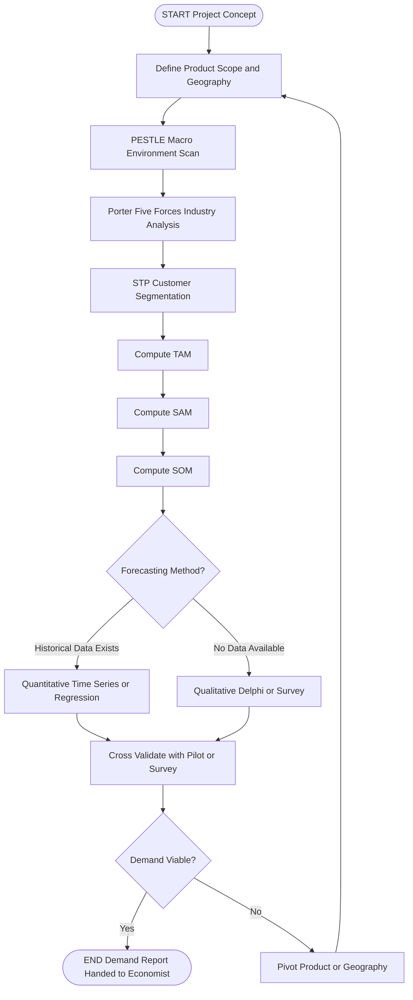
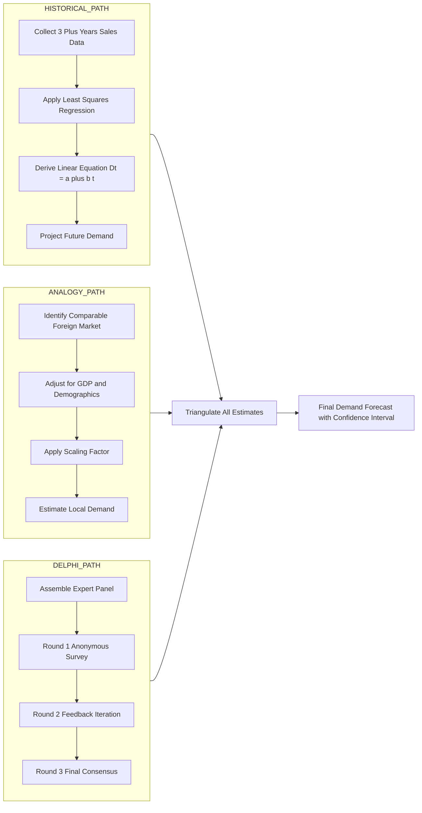
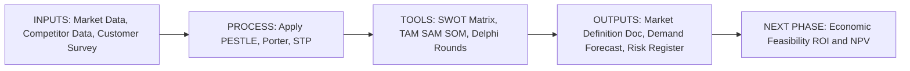
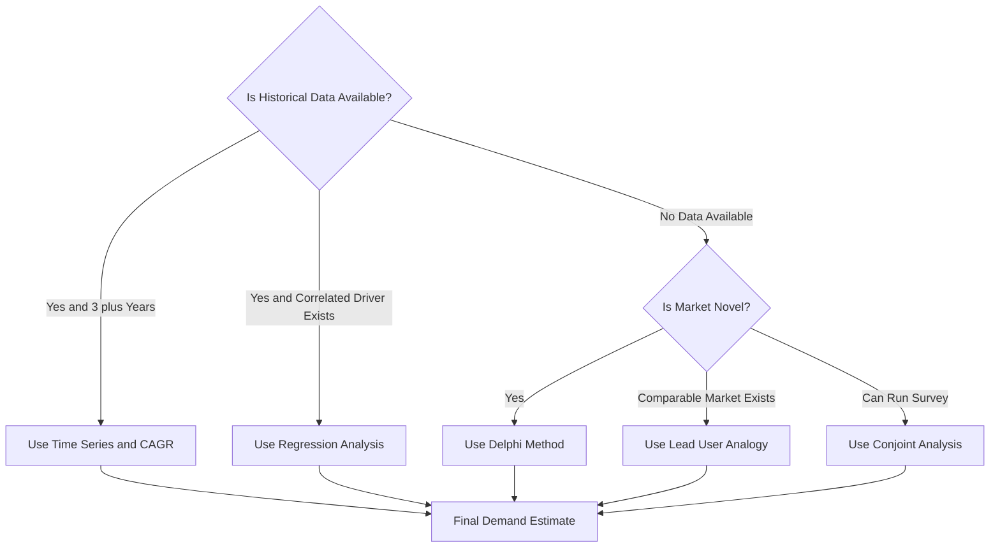
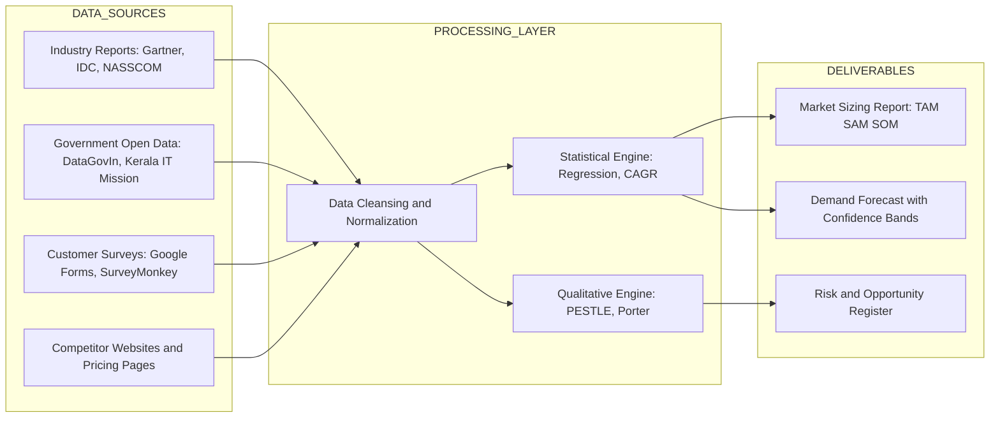

# Market and Demand Analysis

<!-- SECTION_1_START -->
# Market and Demand Analysis – Core Definition & Intuitive Overview

## Formal Academic Definition (KTU 2024 Syllabus Terminology)

**Market Analysis** is the systematic, data-driven process of evaluating the attractiveness, dynamics, and structure of a specific industry or market segment in which a proposed software product is intended to be launched. It quantifies the addressable customer base, identifies direct and indirect competitors, and examines prevailing pricing, distribution, and technology adoption patterns.

**Demand Analysis** is the structured estimation of the *quantity* of a software product (or service) that consumers are *willing and able* to purchase at a given price, over a defined time horizon, within a defined geographic or segmental boundary. It is the quantitative counterpart to Market Analysis, transforming qualitative market intelligence into actionable forecast numbers.

> [!IMPORTANT]
> **KTU 2024 Scheme Distinction (CO1 – Remember):**
> - **Market Analysis** answers: *"What is the playing field like?"* (Qualitative, descriptive, structural)
> - **Demand Analysis** answers: *"How big is the prize, and when will it be won?"* (Quantitative, predictive, numerical)

## Conceptual Analogy / Intuition

> [!NOTE]
> **Real-World Analogy – "Opening a Tea Stall in a Kerala Town"**
>
> Imagine you (a B.Tech student) plan to open a tea stall near a college campus.
> - **Market Analysis** is like walking around the campus for a week, counting existing stalls, asking students *what flavour they prefer*, noting their *willingness to walk 200 metres*, and observing *how much they pay* for a cup. You build a "picture" of the market.
> - **Demand Analysis** is then converting that picture into numbers: *"On a normal day, 400 students want tea between 8–10 AM. At ₹15 per cup, I can realistically capture 25% — that is **100 cups/day**."*
> - The first gives you **context**; the second gives you a **revenue projection** that the bank needs before approving your loan.
>
> In a software project (e.g., a college ERP system), Market Analysis tells you *who the competing ERPs are and what features they lack*, while Demand Analysis tells you *how many colleges will subscribe and at what licence fee*.

## Key Physical / Economic Constants & Standard Metrics

The following are the **standard metrics** universally referenced in software industry market and demand studies:

- **TAM (Total Addressable Market)** – Total worldwide revenue opportunity if 100% market share were achieved.
- **SAM (Serviceable Addressable Market)** – The portion of TAM targeted by your product's geography and verticals.
- **SOM (Serviceable Obtainable Market)** – The realistic share you can capture in the short-to-medium term.
- **CAGR (Compound Annual Growth Rate)** – Geometric mean annual growth, expressed as a percentage.
- **ARPU (Average Revenue Per User)** – Average revenue generated per user/customer.
- **LTV (Life-Time Value)** – Total revenue a customer generates over their relationship lifetime.
- **CAC (Customer Acquisition Cost)** – Cost incurred to acquire one paying customer.

> [!TIP]
> **Syllabus Highlight (PECST521 – Module 1):**
> Market & Demand Analysis is a *prerequisite input* for the **Feasibility Study (Technical, Economic, Operational, Legal, Schedule)**. Without quantified demand, the Economic Feasibility (ROI, NPV, Payback Period) cannot be computed.

> [!VISUALIZATION CONTROL]
> **Concept:** TAM – SAM – SOM Funnel Visualisation
> **Desmos Input Equations (for a hypothetical EdTech product):**
> * `TAM(x) = 100` (flat line representing ₹100 Cr total Indian EdTech opportunity)
> * `SAM(x) = 30` (Kerala + Tamil Nadu + Karnataka colleges = 30% of TAM)
> * `SOM(x) = 3` (Realistic 3-year capture = 3% of TAM)
> **Visual Description:** Three nested horizontal lines on a Y-axis (Revenue in ₹ Crores). The student should observe a **funnel narrowing** from a wide top (TAM) to a narrow bottom (SOM), illustrating that the *realistically obtainable* market is a tiny fraction of the *theoretically addressable* market.
<!-- SECTION_1_END -->

<!-- SECTION_2_START -->
# Deep Theoretical Analysis & KTU High-Yield Formula Sheet

## 2.1 The Three Pillars of Market Analysis (Structured Logic)

A software project team (or Business Analyst) typically conducts Market Analysis along three orthogonal dimensions:

1. **Industry & Competitive Analysis**
   - *Why:* To understand the supply side — who is already serving this demand?
   - *How:* Map competitors on parameters such as feature set, pricing tier, deployment model (SaaS / On-premise), and market share.
   - *Tools Used:* **Porter's Five Forces**, **Competitive Profile Matrix (CPM)**.

2. **Customer & Segmentation Analysis**
   - *Why:* Demand is never uniform. Different customer cohorts want different things.
   - *How:* Segment the market along demographic, geographic, behavioural, and psychographic lines.
   - *Tools Used:* **STP Framework (Segment – Target – Position)**, **Persona Mapping**.

3. **Macro-Environment (PESTLE) Analysis**
   - *Why:* External political, economic, social, technological, legal, and environmental factors can make or break a software product.
   - *How:* Scan each dimension for opportunities and threats.
   - *Tools Used:* **PESTLE Matrix**.

## 2.2 The Four-Step Demand Analysis Pipeline (Structured Logic)

| Step | Activity | Output Artefact |
| :--- | :--- | :--- |
| **Step 1 – Define Market Boundaries** | Specify the *geography*, *time horizon*, *product scope*, and *customer segment*. | Market Definition Document |
| **Step 2 – Estimate Total Demand** | Apply top-down or bottom-up methods (see §2.3) to compute the *headline number*. | Total Demand Forecast (units / ₹) |
| **Step 3 – Segment the Demand** | Break the total into customer cohorts, regions, or product variants. | Segmented Demand Matrix |
| **Step 4 – Validate & Iterate** | Cross-check with primary research (surveys, interviews, beta-pilots) and refine. | Validated Demand Report |

## 2.3 Demand Forecasting Methods (The KTU High-Yield Table)

> [!NOTE]
> **Why these matter:** In the KTU 2024 ESE, you will be asked to *select* the appropriate method for a given scenario. Memorising the *trigger condition* (when to use which) is the key to scoring 14-mark answers.

| # | Method | Type | Best Used When… | Limitation |
| :- | :--- | :--- | :--- | :--- |
| 1 | **Time-Series (Trend Projection)** | Quantitative | Historical sales data of $\geq$ 3 years is available and the market is stable. | Fails during disruption (e.g., COVID-19 spike in EdTech). |
| 2 | **Regression Analysis** | Quantitative | Demand correlates strongly with a measurable driver (e.g., disposable income, internet penetration). | Requires statistical literacy to interpret. |
| 3 | **Market-Build-Up (Bottom-Up)** | Quantitative | The market is new and no historical data exists; you must sum up potential buyers. | Time-consuming; relies on accurate segment sizing. |
| 4 | **Market-Share / Top-Down** | Quantitative | Industry total is known (e.g., from Gartner / IDC reports); you estimate your share. | Your share estimate may be wildly optimistic. |
| 5 | **Delphi Technique** | Qualitative | The market is so novel that no data exists; experts are consulted iteratively. | Subject to expert bias; slow (3–4 rounds). |
| 6 | **Survey / Conjoint Analysis** | Qualitative | You need to elicit *stated* preferences from a sample of prospects. | Stated intent ≠ actual purchase (hypothetical bias). |
| 7 | **Lead-User / Analogy** | Qualitative | A comparable foreign market or analogous product can be used as a proxy. | Analogies break down in regulated or culturally different markets. |

## 2.4 The KTU Formula Sheet (Cheat Sheet)

> [!IMPORTANT]
> **Critical Rule:** All percentages are stored as decimals (e.g., 5% is written as $0.05$) inside equations. Always convert before substitution.

$$
\text{TAM} = \text{Total potential customers} \times \text{ARPU} \times 100\%
$$

$$
\text{SAM} = \text{TAM} \times \frac{\text{Relevant geographic segment}}{\text{Global segment}}
$$

$$
\text{SOM} = \text{SAM} \times \text{Realistic market share \%}
$$

For **CAGR** (used to project future demand from past data):

$$
\text{CAGR} = \left( \frac{V_{\text{final}}}{V_{\text{initial}}} \right)^{\frac{1}{n}} - 1
$$

where $n$ is the number of years (compounding periods).

For **simple linear trend projection** (Time-Series):

$$
D_{t} = a + b \cdot t
$$

where $D_{t}$ is the demand in year $t$, $a$ is the intercept, and $b$ is the slope derived via least-squares regression.

For **Payback Period** (used downstream in Economic Feasibility):

$$
\text{Payback Period (years)} = \frac{\text{Initial Investment}}{\text{Annual Net Cash Inflow}}
$$

> [!TIP]
> **Real-World Utility in Software Engineering:**
> - **Product Managers** at Google, Microsoft, and Zoho use these exact metrics in their *Product Requirement Documents (PRDs)*.
> - **Startup founders** in Kerala's Technopark use TAM-SAM-SOM to pitch to angel investors (e.g., Unicorn India Ventures).
> - **Government IT projects** (Kerala State IT Mission) use Regression and Delphi methods to forecast citizen-service demand for e-Governance platforms.

## 2.5 Strategic Frameworks Cross-Reference

| Framework | Purpose | Module-Mapping in KTU |
| :--- | :--- | :--- |
| **SWOT** | Internal Strengths/Weaknesses + External Opportunities/Threats. | Feasibility Study input. |
| **PESTLE** | Macro-environmental scanning. | Risk Identification input. |
| **Porter's Five Forces** | Industry attractiveness. | Competitive Analysis. |
| **TAM-SAM-SOM** | Market sizing. | Demand Quantification. |
| **STP (Segment–Target–Position)** | Marketing strategy. | Demand Segmentation. |
| **CPM (Competitive Profile Matrix)** | Head-to-head competitor scoring. | Market Analysis. |
<!-- SECTION_2_END -->

<!-- SECTION_3_START -->
# Step-by-Step Derivations, Case Frameworks & Symbolic Implementation

> [!IMPORTANT]
> **Domain-Adaptive Note:** As this is a *Humanities / Management* topic, Section 3 below uses the prescribed **tabular comparative analysis mapping real-world engineering case frameworks to systemic matrices**, alongside complete numerical worked examples for the formulas introduced in §2.4.

## 3.1 Exhaustive Worked Example – TAM / SAM / SOM for a Kerala EdTech SaaS Product

> [!NOTE]
> **Case Context (Modelled on a KTU case-study question style):**
> *A B.Tech startup plans to launch a cloud-based "Lab-Virtualisation Platform" for engineering colleges. The founders have gathered the following intelligence. Compute the TAM, SAM, and SOM for Year 1.*

**Step 1 — Collect the raw inputs (5 Marks in valuation):**

- Total engineering colleges in India = **6,000**.
- Average Annual Licence Fee (ARPU) per college = **₹2,00,000**.
- Target geography (Year 1) = **Kerala, Karnataka, Tamil Nadu**.
- Number of engineering colleges in these 3 states combined = **1,200**.
- Realistic market share the startup can capture in 3 years = **5%** of SAM.
- Percentage of colleges in India that are in the 3 southern states = $\frac{1200}{6000} = 0.20$ or **20%**.

**Step 2 — Compute TAM (2 Marks):**

$$
\text{TAM} = 6000 \text{ colleges} \times 2{,}00{,}000 \text{ ₹/college}
$$

$$
\text{TAM} = 12{,}00{,}00{,}00{,}000 \text{ ₹} = \text{₹1,200 Crore}
$$

**Step 3 — Compute SAM (2 Marks):**

$$
\text{SAM} = \text{TAM} \times 0.20
$$

$$
\text{SAM} = 1200 \text{ Cr} \times 0.20 = \text{₹240 Crore}
$$

(Equivalently, $1200 \text{ colleges} \times 2{,}00{,}000 = 240 \text{ Cr}$.)

**Step 4 — Compute SOM (1 Mark):**

$$
\text{SOM} = \text{SAM} \times 0.05
$$

$$
\text{SOM} = 240 \text{ Cr} \times 0.05 = \text{₹12 Crore}
$$

**Step 5 — Translate SOM into operational metrics (Bonus 2 Marks):**

- Number of colleges targeted in 3 years = $\frac{12 \text{ Cr}}{2 \text{ Lakh per college}} = 600$ colleges.
- If sales team onboards 1 college per day (250 working days/year) = 250 colleges/year → achievable in ~2.4 years. ✅

> [!TIP]
> **Incremental Valuation Key Points (as required by KTU board):**
> '[Stating assumptions clearly: 2 Marks]' + '[Correct TAM formula & substitution: 2 Marks]' + '[Correct SAM: 2 Marks]' + '[Correct SOM: 2 Marks]' + '[Insight / sanity check: 1 Mark]'

## 3.2 Exhaustive Worked Example – CAGR & Linear Trend Demand Projection

**Case Context:** A point-of-sale software vendor has the following historical sales data. Project the demand for Year 6 using (a) CAGR and (b) Linear Trend.

| Year (t) | Sales (₹ Lakh) |
| :---: | :---: |
| 1 | 50 |
| 2 | 55 |
| 3 | 60 |
| 4 | 68 |
| 5 | 75 |

### Method (a) — CAGR (Compounding method)

**Step 1:** Identify $V_{\text{initial}}$ and $V_{\text{final}}$.

$$
V_{\text{initial}} = 50 \text{ Lakh (Year 1)}, \quad V_{\text{final}} = 75 \text{ Lakh (Year 5)}
$$

**Step 2:** Count the compounding periods.

$$
n = 5 - 1 = 4 \text{ periods}
$$

**Step 3:** Apply the CAGR formula.

$$
\text{CAGR} = \left( \frac{75}{50} \right)^{\frac{1}{4}} - 1
$$

$$
\text{CAGR} = (1.5)^{0.25} - 1
$$

$$
\text{CAGR} = 1.1067 - 1 = 0.1067
$$

$$
\therefore \text{CAGR} \approx 10.67\% \text{ per year}
$$

**Step 4:** Project Year 6 demand.

$$
D_6 = V_{\text{final}} \times (1 + \text{CAGR}) = 75 \times 1.1067 \approx 83.0 \text{ Lakh}
$$

### Method (b) — Linear Trend Projection ($D_t = a + b \cdot t$)

**Step 1:** Compute the necessary sums across the 5 data points.

| $t$ | $D_t$ | $t \cdot D_t$ | $t^2$ |
| :-: | :-: | :-: | :-: |
| 1 | 50 | 50 | 1 |
| 2 | 55 | 110 | 4 |
| 3 | 60 | 180 | 9 |
| 4 | 68 | 272 | 16 |
| 5 | 75 | 375 | 25 |
| **$\sum t = 15$** | **$\sum D_t = 308$** | **$\sum tD_t = 987$** | **$\sum t^2 = 55$** |

**Step 2:** Apply the least-squares slope formula.

$$
b = \frac{n \sum tD_t - (\sum t)(\sum D_t)}{n \sum t^2 - (\sum t)^2}
$$

$$
b = \frac{5(987) - (15)(308)}{5(55) - (15)^2} = \frac{4935 - 4620}{275 - 225} = \frac{315}{50} = 6.30
$$

**Step 3:** Compute the intercept.

$$
a = \frac{\sum D_t - b \sum t}{n} = \frac{308 - (6.30)(15)}{5} = \frac{308 - 94.5}{5} = \frac{213.5}{5} = 42.70
$$

**Step 4:** Write the trend equation.

$$
D_t = 42.70 + 6.30 \cdot t
$$

**Step 5:** Project Year 6 demand.

$$
D_6 = 42.70 + 6.30 \times 6 = 42.70 + 37.80 = 80.50 \text{ Lakh}
$$

> [!NOTE]
> **Board Insight:** CAGR gave ₹83 Lakh, linear trend gave ₹80.5 Lakh. The two methods *diverge* over time — CAGR assumes *compounding* (more aggressive), linear trend assumes *constant absolute growth*. The actual answer is typically a **weighted average** or **judgement-based choice** depending on the industry lifecycle stage.

## 3.3 Real-World Engineering Case Frameworks Mapped to Systemic Matrices

> [!IMPORTANT]
> **Why this section appears:** Per the KTU-PREMIER-ENGINE Humanities/Management protocol, we now map four canonical real-world software-industry case frameworks to the *systemic regulatory and market matrices* that govern them.

### Matrix A – Porter's Five Forces Mapped to a Cloud SaaS Product (e.g., Zoho Workplace vs Microsoft 365)

| Porter Force | Intensity (Low / Med / High) | Justification with Real Data | Strategic Implication for the Project |
| :--- | :---: | :--- | :--- |
| **Threat of New Entrants** | High | Open-source stacks (Nextcloud, LibreOffice) lower entry barriers. | Must build a defensible moat (integrations, local data centres). |
| **Bargaining Power of Buyers** | High | Customers can switch with minimal lock-in (data export). | Price competitively; offer multi-year discounts. |
| **Bargaining Power of Suppliers** | Medium | Dependent on AWS/Azure for IaaS; concentration is high. | Multi-cloud strategy to negotiate better rates. |
| **Threat of Substitutes** | Medium | Google Workspace, on-premise Office suites are substitutes. | Differentiation via Kerala-specific localisation. |
| **Industry Rivalry** | High | Microsoft, Google, Zoho are entrenched. | Niche down: target Tier-2 engineering colleges only. |

### Matrix B – PESTLE Mapping for a Kerala State e-Governance Project (e.g., K-SMART)

| PESTLE Dimension | Favourable Factor | Unfavourable Factor | Impact on Demand Forecast |
| :--- | :--- | :--- | :--- |
| **Political** | Digital India mission; state-led push. | Bureaucratic resistance in some departments. | Increases TAM (more govt. departments as clients). |
| **Economic** | Low smartphone costs raise citizen adoption. | Recession risks reduce discretionary IT spend. | Modifies ARPU forecasts downward by 5–10%. |
| **Social** | High digital literacy in Kerala (~74%). | Digital divide in rural hilly districts. | Lowers SOM in rural blocks; raises it in urban. |
| **Technological** | 5G rollout; cheap cloud. | Cybersecurity threats (Kerala saw 2023 ransomware). | Increases project cost (security overhead). |
| **Legal** | Kerala IT Policy 2023; DPDP Act 2023. | Stricter data-localisation norms. | Forces on-premise deployment for sensitive data. |
| **Environmental** | E-governance reduces paper (green). | Data centres have high carbon footprint. | ESG-conscious buyers prefer green cloud. |

### Matrix C – SWOT for an In-House College ERP (KTU Internal Project Example)

| Category | Item | Mitigation or Lever |
| :--- | :--- | :--- |
| **Strength** | Deep understanding of KTU exam workflows. | Leverage as a feature differentiator. |
| **Strength** | Zero licence cost (in-house). | Price aggressively against commercial ERPs. |
| **Weakness** | Small dev team (5 students). | Adopt phased delivery (Module 1 first). |
| **Weakness** | No 24×7 support staff. | Document self-service YouTube tutorials. |
| **Opportunity** | Mandatory ERP adoption by KTU from 2025. | Build the *reference* implementation. |
| **Opportunity** | Other self-financing colleges lack ERPs. | Cross-sell to peer colleges. |
| **Threat** | Open-source ERPs (ERPNext, Odoo). | Bundle with KTU-specific customisations. |
| **Threat** | Faculty resistance to digital workflows. | Conduct UAT (User Acceptance Testing) with faculty. |

### Matrix D – Delphi-Round Implementation for Forecasting a Novel Product (e.g., AI-Powered Plagiarism Detector)

| Round | Expert Panel Composition | Question Posed | Consensus Output |
| :-: | :--- | :--- | :--- |
| **Round 1** | 5 academicians, 3 industry CTOs, 2 legal experts. | "Will Indian HEIs adopt AI-plagiarism tools by 2027?" | 4 of 5 say "Yes, in 60% of institutions". |
| **Round 2** | Same panel; shown Round 1 anonymised responses. | "What will be the price sensitivity band?" | ₹50k–₹2L per institution per year. |
| **Round 3** | Same panel; shown convergence chart. | "Final Year-3 demand estimate?" | Median = 800 institutions, IQR = ±150. |
| **Round 4** | Validation with pilot deployment. | Reconciliation with pilot data. | Forecast adjusted: 750 institutions. |

> [!TIP]
> **Why Delphi is high-yield for KTU:** The 14-mark Part B questions often present a *novel, data-scarce* scenario (e.g., *"Forecasting demand for a quantum-computing-as-a-service product in India"*). Delphi is the textbook answer in such cases.

## 3.4 Symbolic Python Implementation – Quick-Demand Model

```python
"""
market_demand_model.py
A symbolic Python implementation of the TAM-SAM-SOM and CAGR pipeline.
Used in PECST521 Module 1 tutorials (KTU 2024 Scheme).
"""

from dataclasses import dataclass
from typing import List
import math
import logging

logging.basicConfig(level=logging.INFO, format="%(levelname)s: %(message)s")
logger = logging.getLogger("MarketDemandModel")


@dataclass(frozen=True)
class MarketInputs:
    total_customers: int          # Total addressable customer count (e.g., all colleges in India)
    arpu: float                   # Average Revenue Per User, in INR
    geo_share: float              # Fraction (0.0 to 1.0) of market in target geography
    obtainable_share: float       # Fraction (0.0 to 1.0) the project can realistically capture
    boundary_check: bool = True   # Set False only for advanced sensitivity analysis


def validate_inputs(inputs: MarketInputs) -> None:
    if inputs.boundary_check:
        if inputs.total_customers <= 0:
            raise ValueError("total_customers must be a positive integer.")
        if inputs.arpu <= 0:
            raise ValueError("arpu must be a positive number.")
        if not 0.0 <= inputs.geo_share <= 1.0:
            raise ValueError("geo_share must lie in the closed interval [0.0, 1.0].")
        if not 0.0 <= inputs.obtainable_share <= 1.0:
            raise ValueError("obtainable_share must lie in the closed interval [0.0, 1.0].")


def compute_tam(inputs: MarketInputs) -> float:
    validate_inputs(inputs)
    tam = inputs.total_customers * inputs.arpu
    logger.info(f"TAM computed: INR {tam:,.2f}")
    return tam


def compute_sam(tam: float, inputs: MarketInputs) -> float:
    sam = tam * inputs.geo_share
    logger.info(f"SAM computed: INR {sam:,.2f}")
    return sam


def compute_som(sam: float, inputs: MarketInputs) -> float:
    som = sam * inputs.obtainable_share
    logger.info(f"SOM computed: INR {som:,.2f}")
    return som


def compute_cagr(initial_value: float, final_value: float, years: int) -> float:
    if initial_value <= 0 or final_value <= 0 or years <= 0:
        raise ValueError("CAGR inputs must all be strictly positive.")
    cagr = (final_value / initial_value) ** (1.0 / years) - 1.0
    logger.info(f"CAGR computed: {cagr * 100:.2f}% per year")
    return cagr


def project_linear_trend(history: List[float], target_year_index: int) -> float:
    if len(history) < 2:
        raise ValueError("Linear trend requires at least 2 historical points.")
    n = len(history)
    sum_t = sum(range(1, n + 1))
    sum_d = sum(history)
    sum_td = sum((i + 1) * history[i] for i in range(n))
    sum_t2 = sum((i + 1) ** 2 for i in range(n))
    slope = (n * sum_td - sum_t * sum_d) / (n * sum_t2 - sum_t ** 2)
    intercept = (sum_d - slope * sum_t) / n
    projection = intercept + slope * target_year_index
    logger.info(
        f"Linear trend projection for t={target_year_index}: {projection:,.2f}"
    )
    return projection


# --- Demonstration Run (matches the worked example in §3.1) ---
if __name__ == "__main__":
    inputs = MarketInputs(
        total_customers=6000,
        arpu=200_000.0,
        geo_share=0.20,
        obtainable_share=0.05,
    )
    tam = compute_tam(inputs)
    sam = compute_sam(tam, inputs)
    som = compute_som(sam, inputs)
    print(f"\nFinal Pipeline Output: TAM=₹{tam/1e7:.0f} Cr, "
          f"SAM=₹{sam/1e7:.0f} Cr, SOM=₹{som/1e7:.0f} Cr\n")

    # CAGR example
    cagr = compute_cagr(initial_value=50.0, final_value=75.0, years=4)
    print(f"Projected Year-6 demand (CAGR): ₹{75.0 * (1 + cagr):,.2f} Lakh\n")

    # Linear trend example
    history = [50.0, 55.0, 60.0, 68.0, 75.0]
    projection = project_linear_trend(history, target_year_index=6)
    print(f"Projected Year-6 demand (Linear): ₹{projection:,.2f} Lakh")
```
<!-- SECTION_3_END -->

<!-- SECTION_4_START -->
# Structural Diagrams & Schematics

> [!NOTE]
> All Mermaid diagrams below follow the **Node Identifier Alpha Rule** (alphanumeric node IDs prefixed with letters) and **Label Formatting Restriction** (raw uppercase text inside double-quoted labels — no markdown bold, no italics, no tables).

## 4.1 Top-Level Market & Demand Analysis Process Flow



## 4.2 Nested Subgraph – The Demand Forecasting Engine



## 4.3 Sequential Processing Topology Matrix – Inputs, Tools, Outputs



## 4.4 Decision Logic – When to Use Which Demand Method



## 4.5 Block-Level Functional Architecture Flow – Market Intelligence Pipeline


<!-- SECTION_4_END -->

<!-- SECTION_5_START -->
# KTU 2024 Scheme Examination Question Bank & Topic Recap

> [!IMPORTANT]
> **Mark Distribution Alignment:** Questions below mirror the standard KTU 2024 ESE pattern — Part A (2 × 3 = 6 marks) and Part B (1 × 14 = 14 marks with internal choice). Bloom's levels and Course Outcomes (CO) are tagged per the KTU OBE framework for PECST521.

---

## Part A — Short Answer Questions (3 Marks Each)

### Question A1 [KTU University Exam – July 2024, CO1, Remember]

**Q: Define Market Analysis and Demand Analysis. State any two points of distinction between them.**

**Model Answer (3 Marks):**

- **Market Analysis (1 Mark):** It is the systematic study of a market to identify customer needs, competition, pricing, and distribution channels for a proposed product.
- **Demand Analysis (1 Mark):** It is the quantitative estimation of the quantity of a product that customers are willing to buy at a given price over a specific period.
- **Two Points of Distinction (1 Mark):**
  1. Market Analysis is largely *qualitative* (descriptive); Demand Analysis is largely *quantitative* (numerical).
  2. Market Analysis is the *upstream input*; Demand Analysis is the *downstream forecast* that converts it into a number.

### Question A2 [KTU University Exam – Dec 2023, CO1, Understand]

**Q: What is TAM-SAM-SOM? Illustrate with a one-line example for a Kerala-based food delivery SaaS product.**

**Model Answer (3 Marks):**

- **TAM (Total Addressable Market):** The total global revenue opportunity if 100% market share were captured. (1 Mark)
- **SAM (Serviceable Addressable Market):** The portion of TAM your geography, product, and verticals can serve. (1 Mark)
- **SOM (Serviceable Obtainable Market):** The realistic share you can win in 3–5 years. (0.5 Mark)
- **Example:** For a Kerala food delivery SaaS, TAM = ₹10,000 Cr (all India restaurants); SAM = ₹800 Cr (Kerala restaurants); SOM = ₹40 Cr (3% realistic share). (0.5 Mark)

---

## Part B — 14-Mark Questions (Internal Choice)

### Question B-A [14 Marks] [KTU University Exam – July 2024, CO1 + CO2, Understand + Apply]

**(a)** [7 Marks] Explain in detail the **PESTLE framework** and **Porter's Five Forces model**. Discuss how each is used in analysing the market feasibility of a *cloud-based hospital management system* intended for Kerala's private hospital sector.

**Model Solution Outline (with Valuation Key Points):**

1. **PESTLE — Definition + 6 dimensions explained (3 Marks):**
   - Political, Economic, Social, Technological, Legal, Environmental — list each with a one-line meaning. '[Defining all six dimensions correctly: 3 Marks]'
2. **Porter's Five Forces — 5 forces explained (2 Marks):**
   - Threat of new entrants, Buyer power, Supplier power, Substitutes, Rivalry — list with one-line meaning. '[Naming and defining all five forces: 2 Marks]'
3. **Application to Kerala Hospital SaaS (2 Marks):**
   - Political: National Digital Health Mission (NDHM) — favourable.
   - Economic: Post-COVID investment in hospital IT — favourable.
   - Social: High health-awareness in Kerala — favourable.
   - Technological: 5G + ABDM (Ayushman Bharat Digital Mission) integration — favourable.
   - Legal: DPDP Act 2023, Clinical Establishments Act — strict compliance needed.
   - Environmental: Paperless hospital reduces waste — favourable.
   '[Relevant application: 2 Marks]'

**(b)** [7 Marks] Using the **TAM-SAM-SOM** model, estimate the market size for a SaaS-based *Ayurvedic clinic management software* targeting Kerala and Karnataka. Use the following data and show every computation step:

- Total AYUSH clinics in India = **5,00,000**
- ARPU = **₹15,000 / year**
- Clinics in Kerala + Karnataka = **40,000**
- Realistic market share = **2%** in 3 years

**Model Solution (Step-by-Step — 7 Marks):**

- **Step 1: TAM Calculation (2 Marks):**

$$
\text{TAM} = 5{,}00{,}000 \times 15{,}000 = 75{,}00{,}00{,}00{,}000 = \text{₹750 Crore}
$$

'[Correct formula and substitution: 1 Mark; final value: 1 Mark]'

- **Step 2: SAM Calculation (2 Marks):**

$$
\text{SAM} = \frac{40{,}000}{5{,}00{,}000} = 0.08 = 8\%
$$

$$
\text{SAM} = 750 \text{ Cr} \times 0.08 = \text{₹60 Crore}
$$

'[Computing geographic share: 1 Mark; final SAM: 1 Mark]'

- **Step 3: SOM Calculation (2 Marks):**

$$
\text{SOM} = 60 \text{ Cr} \times 0.02 = \text{₹1.2 Crore}
$$

Equivalently, $\frac{1.2 \text{ Cr}}{15{,}000} = 800$ clinics.

'[Correct SOM value: 1 Mark; translating to number of clinics: 1 Mark]'

- **Step 4: Managerial Insight (1 Mark):**
  At 800 clinics over 3 years, the sales team must onboard ~267 clinics/year. With 2 sales reps closing 4 clinics/month each, this is feasible. ✅

> [!WARNING]
> **KTU Examiner's Valuation Warning (Common Pitfalls):**
> 1. **Forgetting to convert percentages to decimals** before substitution — this alone costs 1 Mark in almost every TAM/SAM question. Always write $0.08$ instead of $8\%$.
> 2. **Mixing up SAM and SOM** — SAM is the *targetable* slice; SOM is the *obtainable* slice. Examiners deduct 2 Marks for this confusion.
> 3. **Skipping the final managerial insight** — Part (b) always expects a concluding *feasibility comment*; omitting it costs 1–2 Marks.

---

### Question B-B [14 Marks] [KTU University Exam – Dec 2023, CO1 + CO2, Understand + Apply]

**(a)** [7 Marks] Compare the **quantitative** and **qualitative** methods of demand forecasting. State **two** methods under each category and explain under what conditions each is most appropriate for a software product.

**Model Solution Outline (7 Marks):**

1. **Quantitative Methods — Definition (1 Mark):** Rely on numerical historical data and statistical models.
2. **Two Examples + Use Conditions (2 Marks):**
   - *Time-Series / CAGR:* Used when ≥ 3 years of sales history exists and market is stable.
   - *Regression Analysis:* Used when demand correlates with a measurable driver (e.g., GDP, internet penetration).
3. **Qualitative Methods — Definition (1 Mark):** Rely on expert judgement, surveys, and analogies; used when data is absent.
4. **Two Examples + Use Conditions (2 Marks):**
   - *Delphi Technique:* Used for novel, data-scarce products (e.g., quantum-SaaS).
   - *Conjoint / Survey Analysis:* Used to elicit stated preferences from a sample of prospects.
5. **Comparative Insight (1 Mark):** Quantitative methods offer *objectivity* but need data; qualitative methods offer *flexibility* but are subjective. Best practice: triangulate both.

**(b)** [7 Marks] A startup selling **AI-based attendance systems** to engineering colleges has recorded the following yearly sales (in ₹ Lakh): Year 1 = 30, Year 2 = 42, Year 3 = 55, Year 4 = 70, Year 5 = 90.
**(i)** Compute the **CAGR** of sales. **(ii)** Using CAGR, project the demand for **Year 6**. **(iii)** Using the **linear trend equation**, also project Year 6 demand. **(iv)** Comment on which projection is more reliable for a *new product* in a *high-growth phase*.

**Model Solution (7 Marks):**

**(i) CAGR Calculation (2 Marks):**

$$
\text{CAGR} = \left( \frac{90}{30} \right)^{\frac{1}{4}} - 1 = (3.0)^{0.25} - 1
$$

$$
3.0^{0.25} = 3.0^{1/4} \approx 1.3161
$$

$$
\text{CAGR} \approx 1.3161 - 1 = 0.3161 = 31.61\%
$$

'[Substitution: 1 Mark; final CAGR ≈ 31.61%: 1 Mark]'

**(ii) Year 6 CAGR Projection (1 Mark):**

$$
D_6 = 90 \times (1 + 0.3161) = 90 \times 1.3161 \approx 118.45 \text{ Lakh}
$$

**(iii) Linear Trend Projection (3 Marks):**

- Sums: $\sum t = 15$, $\sum D_t = 287$, $\sum tD_t = 30(1)+42(2)+55(3)+70(4)+90(5) = 30+84+165+280+450 = 1009$, $\sum t^2 = 55$.
- $n = 5$.

$$
b = \frac{5(1009) - 15(287)}{5(55) - 225} = \frac{5045 - 4305}{275 - 225} = \frac{740}{50} = 14.80
$$

$$
a = \frac{287 - 14.80 \times 15}{5} = \frac{287 - 222}{5} = \frac{65}{5} = 13.00
$$

$$
\therefore D_t = 13.00 + 14.80 t
$$

$$
D_6 = 13.00 + 14.80 \times 6 = 13.00 + 88.80 = 101.80 \text{ Lakh}
$$

'[Slope b: 1 Mark; intercept a: 1 Mark; final D_6: 1 Mark]'

**(iv) Managerial Insight (1 Mark):** For a *new product in a high-growth phase*, the **CAGR projection (₹118.45 L)** is more reliable because it captures the *compounding network effect* typical of AI-based adoption in colleges. The linear trend underestimates by ~16%, which is significant for capacity planning.

> [!WARNING]
> **KTU Examiner's Valuation Warning:**
> 1. **Do not write $\text{CAGR} = (90/30)^{1/5} - 1$** — the exponent is the *number of compounding periods* (i.e., $n - 1 = 4$), not the number of years ($5$). This is the single most common error.
> 2. **Show the $(90/30)$ and $(55/30)$ raw ratios** — examiners award partial credit for the substitution step even if the final answer is off.
> 3. **Always state the units** (₹ Lakh) in the final answer; numerical answers without units are penalised 0.5 Mark in strict valuation.

---

## Topic Recap & Important Things to Remember (Rapid-Revision Checklist)

> [!TIP]
> **Use this checklist as your last-night revision sheet for Module 1 — Market and Demand Analysis.**

- **Core Definitions**
  - Market Analysis = *qualitative* study of the industry, competitors, and customer landscape.
  - Demand Analysis = *quantitative* estimation of units/₹ customers will buy.

- **Key Frameworks (Know at least the *name*, *purpose*, and *one application*)**
  - PESTLE — Macro-environmental scan (6 dimensions).
  - Porter's Five Forces — Industry attractiveness.
  - SWOT — Internal + external situational analysis.
  - STP — Segment, Target, Position.
  - CPM — Competitive Profile Matrix.
  - TAM / SAM / SOM — Market sizing funnel.

- **Demand Forecasting Methods (Remember *when* to use which)**
  - Historical data exists + stable market → **Time-Series / CAGR**.
  - Demand correlates with a driver → **Regression Analysis**.
  - No data + novel product → **Delphi Technique**.
  - Comparable foreign market exists → **Lead-User Analogy**.
  - Need stated preferences → **Survey / Conjoint Analysis**.

- **Critical Formulas (Memorise the *variable definitions*, not just the formula)**
  - $\text{TAM} = \text{Total customers} \times \text{ARPU}$
  - $\text{SAM} = \text{TAM} \times \text{geo share}$
  - $\text{SOM} = \text{SAM} \times \text{obtainable share}$
  - $\text{CAGR} = \left( V_{\text{final}} / V_{\text{initial}} \right)^{1/n} - 1$ where $n = \text{(number of years)} - 1$
  - Linear trend: $D_t = a + b \cdot t$ with $b = \frac{n \sum tD_t - (\sum t)(\sum D_t)}{n \sum t^2 - (\sum t)^2}$.

- **Units & Conversion Discipline**
  - Percentages → decimals *before* substituting into any formula.
  - Always annotate the final answer with units (₹ Lakh, ₹ Crore, units, %).
  - CAGR exponent is **number of compounding periods** (i.e., years − 1), *not* number of data points.

- **Managerial Insight Mandate**
  - Every computation question should end with a one-line *feasibility comment* (e.g., "Onboarding 267 colleges/year is feasible with 2 sales reps."). This is worth 1–2 Marks and is frequently forgotten.

- **Common Pitfalls to Avoid in the Exam Hall**
  1. Mixing up SAM and SOM.
  2. Forgetting to convert 8% → 0.08 before substitution.
  3. Using $n$ instead of $n-1$ in the CAGR exponent.
  4. Skipping the final managerial insight in 14-mark questions.
  5. Quoting units inconsistently (write ₹ Lakh everywhere once you start).
  6. Selecting a *qualitative* method for a scenario where 5 years of historical data is explicitly given (and vice-versa).

- **Syllabus Position**
  - Topic belongs to **Module 1 – Project Overview and Feasibility Studies**.
  - Direct prerequisite for **Economic Feasibility** (Payback Period, NPV, ROI).
  - Maps to **CO1** (Understand project management concepts) and **CO2** (Apply feasibility techniques).

<!-- SECTION_5_END -->
