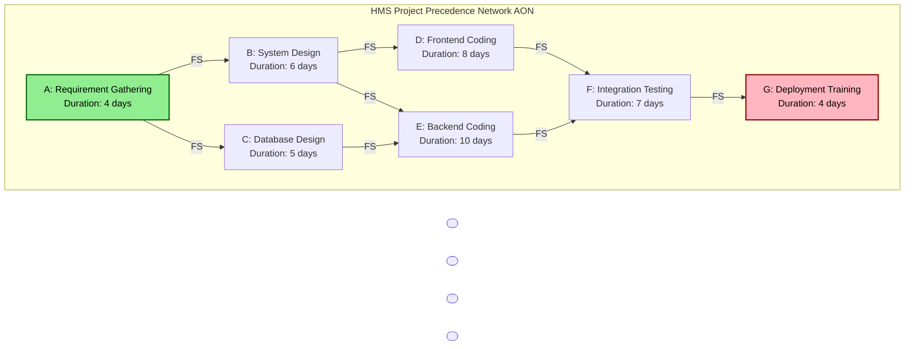
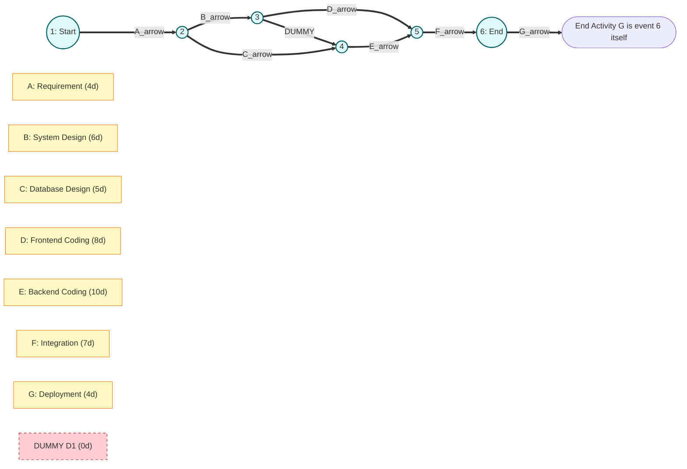
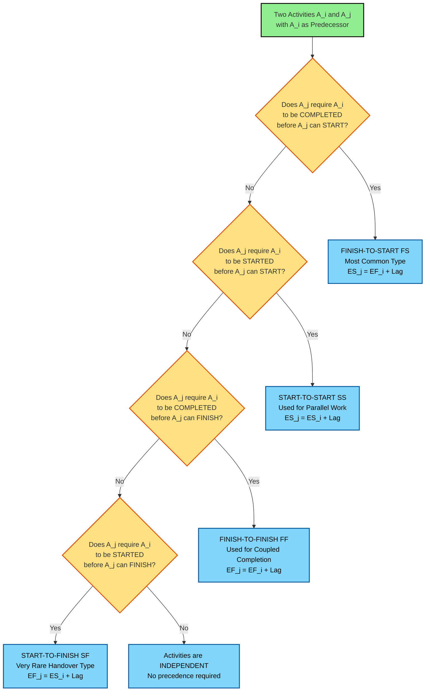
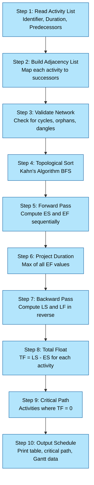
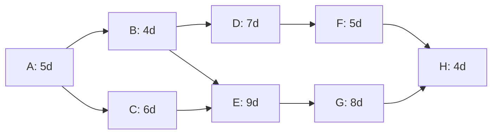

# Precedence Relationship

<!-- SECTION_1_START -->

# Precedence Relationship in Software Project Management

## 1.1 Formal Academic Definition

> [!IMPORTANT]
> **Precedence Relationship (KTU 2024 Definition):** A **Precedence Relationship** is a logical dependency constraint between two project activities that defines the mandatory sequencing order in which tasks must be executed. It establishes which activity must be completed, started, or partially executed before another activity can commence, thereby forming the structural backbone of the **Project Network Diagram** used in scheduling methodologies like **CPM (Critical Path Method)** and **PERT (Program Evaluation and Review Technique)**.

In the **KTU 2024 Scheme (PECST521)** syllabus, precedence relationships form the foundational layer of the **Activity Network Model**. Each activity $A_i$ and $A_j$ is governed by a precedence rule, often denoted as $A_i \prec A_j$, meaning *"Activity $A_i$ must be completed before Activity $A_j$ begins."*

### Core Terminology

| Term | Symbol | Definition |
| :--- | :---: | :--- |
| **Predecessor** | $A_i$ | The activity that logically must finish (or start) before another activity |
| **Successor** | $A_j$ | The activity that is dependent on the predecessor's completion |
| **Critical Activity** | $A_c$ | An activity with **zero float/slack**; any delay delays the entire project |
| **Dummy Activity** | $D$ | A zero-duration logical connector used **only in AOA diagrams** to maintain correctness |
| **Lag Time** | $L^+$ | An intentional **delay** between two related activities (e.g., concrete curing) |
| **Lead Time** | $L^-$ | An intentional **overlap** (negative lag) allowing acceleration between activities |

---

## 1.2 Conceptual Analogy & Intuitive Overview

> [!NOTE]
> **Plain English Intuition:** Imagine you are following a **cooking recipe** to make Biryani. You **cannot** cook the rice before the chicken is marinated. You **cannot** assemble the layers before the rice is boiled. You **cannot** serve the dish before the dum (steam cooking) is complete. Each step has a mandatory "before-after" rule. **Precedence Relationships are exactly these mandatory ordering rules in a software project.**

### Real-World Software Project Analogy

Consider a **Mobile Banking App** development project:
1. **Requirement Gathering** $\prec$ **System Design** (You cannot design what you do not yet know)
2. **System Design** $\prec$ **Coding** (You cannot code a system without its blueprint)
3. **Coding** $\prec$ **Unit Testing** (You cannot test what has not been written)
4. **Unit Testing** $\prec$ **Integration Testing** (You cannot integrate un-built modules)
5. **Integration Testing** $\prec$ **UAT (User Acceptance Testing)** (Users cannot validate a broken system)

If any of these dependencies is violated, the project collapses — just as putting uncooked rice in a Biryani will ruin the dish.

### Visualizing the Precedence Chain

> [!VISUALIZATION CONTROL]
> **Concept:** Linear Precedence Chain (Critical Path Visualization)
> **Graph Input Equations (Desmos Format):**
> * `x = 1` (Node 1: Requirement)
> * `x = 2` (Node 2: Design)
> * `x = 3` (Node 3: Code)
> * `x = 4` (Node 4: Test)
> * `x = 5` (Node 5: Deploy)
> **Visual Description:** Five vertically aligned nodes connected by unidirectional arrows, demonstrating a strict Finish-to-Start (FS) dependency. The horizontal line from $(0,0)$ to $(6,0)$ represents the **time axis**, and the path shows the only legal traversal direction.

---

## 1.3 Why Precedence Relationships Matter in Software Engineering

In modern software project management (PMI-PMBOK, PRINCE2, Agile-Hybrid), precedence relationships are not optional — they are the **deterministic skeleton** that enables:

- **Automated Schedule Generation** (Microsoft Project, Jira, Primavera P6)
- **Critical Path Identification** (project managers know what *cannot* slip)
- **Resource Leveling** (avoiding over-allocation of developers to dependent tasks)
- **Risk Modeling** (identifying bottlenecks before they occur)
- **Earned Value Management (EVM)** baseline establishment

> [!TIP]
> **KTU Examiner Insight:** When asked about precedence, always link it back to **network construction**. A precedence relationship without a network is a definition without application — both are required for full marks.

---

<!-- SECTION_1_END -->

<!-- SECTION_2_START -->

# Deep Theoretical Analysis & KTU High-Yield Formula Sheet

## 2.1 The Four Canonical Types of Precedence Dependencies

The **Project Management Institute (PMI)** and KTU syllabus both recognize **four dependency types** in the AON (Activity on Node) representation:

### 2.1.1 Finish-to-Start (FS) — The Most Common Type

$A_i$ **Finish** $\longrightarrow$ $A_j$ **Start**

**Definition:** Activity $A_j$ cannot start until Activity $A_i$ has **finished**.

**Formula:** $\text{ES}_j = \text{EF}_i + L^+_{ij}$

Where:
- $\text{ES}_j$ = Earliest Start of successor
- $\text{EF}_i$ = Earliest Finish of predecessor
- $L^+_{ij}$ = Lag time between $A_i$ and $A_j$ (usually $0$)

> **Example:** "Coding must finish before Testing can start."

### 2.1.2 Start-to-Start (SS)

$A_i$ **Start** $\longrightarrow$ $A_j$ **Start**

**Definition:** Activity $A_j$ cannot start until Activity $A_i$ has **started**.

**Formula:** $\text{ES}_j = \text{ES}_i + L^+_{ij}$

> **Example:** "Code review starts as soon as the first module is being coded."

### 2.1.3 Finish-to-Finish (FF)

$A_i$ **Finish** $\longrightarrow$ $A_j$ **Finish**

**Definition:** Activity $A_j$ cannot finish until Activity $A_i$ has **finished**.

**Formula:** $\text{EF}_j = \text{EF}_i + L^+_{ij}$

> **Example:** "Documentation cannot finish until the last module is coded."

### 2.1.4 Start-to-Finish (SF) — The Rarest Type

$A_i$ **Start** $\longrightarrow$ $A_j$ **Finish**

**Definition:** Activity $A_j$ cannot finish until Activity $A_i$ has **started**.

**Formula:** $\text{EF}_j = \text{ES}_i + L^+_{ij}$

> **Example:** "The night-shift security guard's shift cannot finish until the day-shift supervisor's shift has started (handover protocol)."

---

## 2.2 KTU High-Yield Formula Cheat Sheet

> [!IMPORTANT]
> **The following table contains every formula a KTU 2024 student is expected to memorize for precedence-based scheduling problems.**

| # | Concept | Formula | Variable Description | Unit |
| :---: | :--- | :---: | :--- | :--- |
| 1 | **Earliest Finish** | $\text{EF}_i = \text{ES}_i + D_i$ | $D_i$ = Duration of activity $i$ | days |
| 2 | **Earliest Start** | $\text{ES}_i = \max(\text{EF}_{\text{all predecessors}}) + L$ | $L$ = Lag time | days |
| 3 | **Latest Start** | $\text{LS}_i = \text{LF}_i - D_i$ | Computed in backward pass | days |
| 4 | **Latest Finish** | $\text{LF}_i = \min(\text{LS}_{\text{all successors}}) - L$ | For non-critical paths | days |
| 5 | **Total Float (Slack)** | $\text{TF}_i = \text{LS}_i - \text{ES}_i$ | $\text{TF}_i = 0$ on critical path | days |
| 6 | **Free Float** | $\text{FF}_i = \text{ES}_j - \text{EF}_i$ | Independent float within node | days |
| 7 | **Project Duration** | $T_p = \max(\text{EF}_{\text{end node}})$ | Length of critical path | days |
| 8 | **Variance (PERT)** | $\sigma^2 = \left(\frac{b - a}{6}\right)^2$ | $a$ = optimistic, $b$ = pessimistic | days$^2$ |
| 9 | **Expected Time (PERT)** | $t_e = \dfrac{a + 4m + b}{6}$ | $m$ = most likely time | days |
| 10 | **Project Std. Dev.** | $\sigma_p = \sqrt{\sum \sigma^2_{\text{critical}}}$ | Sum across critical path | days |

---

## 2.3 Logical Rules for Constructing Precedence Networks

A precedence network must obey the following **KTU-validated construction rules**:

1. **Rule 1 — Single Start Node:** Every project network must have **exactly one** start activity (no predecessors).
2. **Rule 2 — Single End Node:** Every project network must terminate at **exactly one** end activity.
3. **Rule 3 — No Cycles:** Precedence must be **acyclic**. A cycle $A \to B \to C \to A$ is **forbidden** as it implies circular dependency.
4. **Rule 4 — No Dangling Activities:** Every activity (except start and end) must have **at least one predecessor and one successor**.
5. **Rule 5 — AOA Dummy Logic:** In Activity-on-Arrow (AOA) diagrams, **dummy activities** (dashed arrows, $D = 0$ duration) are used **only** to maintain logical correctness when two nodes share a common predecessor but do not share all successors (or vice versa).
6. **Rule 6 — Activity Identification:** In AOA, two activities **cannot share the same start and end nodes**; dummies resolve this.
7. **Rule 7 — Lead/Lag Integrity:** A lead is **always negative** lag; lag is **always non-negative**. Lead/Lag is expressed in the same unit as activity duration.

---

## 2.4 Real-World Engineering Utility

> [!NOTE]
> **Where Precedence Relationships are used in production systems:**
>
> * **CI/CD Pipelines (Jenkins, GitLab CI):** Job stages have strict FS dependencies (Build $\prec$ Test $\prec$ Deploy).
> * **Database Migration Scripts:** Migration $M_2$ cannot run before $M_1$ (FS dependency, often with version-lag).
> * **Microservices Orchestration (Airflow, Camunda):** DAGs (Directed Acyclic Graphs) are formal precedence networks.
> * **Construction Project Management (Primavera P6):** Foundation $\prec$ Walls $\prec$ Roofing is a literal physical precedence.
> * **Agile Scrum with Dependencies:** A user story "User Login" is a hard predecessor to "User Dashboard."

In **Apache Airflow**, the entire execution engine is built on the mathematical foundation of precedence relations:

```python
# Airflow DAG example mirroring precedence
task_extract >> task_transform >> task_load  # FS chain
task_extract >> task_validate                  # Parallel FS
```

This is **not metaphor** — it is a literal precedence relationship enforced by the scheduler.

---

<!-- SECTION_2_END -->

<!-- SECTION_3_START -->

# Step-by-Step Derivations, Worked Examples & Implementation

## 3.1 Worked Example — Forward Pass & Backward Pass Calculation

> [!IMPORTANT]
> **KTU Standard Problem Pattern:** A software project has 7 activities. You are given durations and precedence. Compute $\text{ES}$, $\text{EF}$, $\text{LS}$, $\text{LF}$, $\text{TF}$ for all activities, and identify the **Critical Path**.

### 3.1.1 Problem Statement

A software firm is developing a **Hospital Management System (HMS)**. The project is decomposed into the following activities:

| Activity | Description | Duration (days) | Predecessors |
| :---: | :--- | :---: | :--- |
| $A$ | Requirement Gathering | 4 | — |
| $B$ | System Design | 6 | $A$ |
| $C$ | Database Design | 5 | $A$ |
| $D$ | Frontend Coding | 8 | $B$ |
| $E$ | Backend Coding | 10 | $B, C$ |
| $F$ | Integration & Testing | 7 | $D, E$ |
| $G$ | Deployment & Training | 4 | $F$ |

### 3.1.2 Step 1 — Construct the Precedence Network (Logic)

From the predecessor table, we can derive the successor relationships:
* $A \to B$, $A \to C$ (A must finish before both B and C start)
* $B \to D$, $B \to E$
* $C \to E$ (C is also a predecessor of E)
* $D \to F$, $E \to F$
* $F \to G$

### 3.1.3 Step 2 — Forward Pass (Compute $\text{ES}$ and $\text{EF}$)

The **Forward Pass** moves from the **start node to the end node**, calculating the earliest times using:

$$
\text{ES}_i = \max_{k \in \text{Pred}(i)} (\text{EF}_k)
$$

$$
\text{EF}_i = \text{ES}_i + D_i
$$

Applying this rule systematically:

**Activity $A$ (Start, no predecessors):**
$$
\text{ES}_A = 0
$$
$$
\text{EF}_A = 0 + 4 = 4
$$

**Activity $B$ (Predecessor: $A$):**
$$
\text{ES}_B = \text{EF}_A = 4
$$
$$
\text{EF}_B = 4 + 6 = 10
$$

**Activity $C$ (Predecessor: $A$):**
$$
\text{ES}_C = \text{EF}_A = 4
$$
$$
\text{EF}_C = 4 + 5 = 9
$$

**Activity $D$ (Predecessor: $B$):**
$$
\text{ES}_D = \text{EF}_B = 10
$$
$$
\text{EF}_D = 10 + 8 = 18
$$

**Activity $E$ (Predecessors: $B, C$):**
$$
\text{ES}_E = \max(\text{EF}_B, \text{EF}_C) = \max(10, 9) = 10
$$
$$
\text{EF}_E = 10 + 10 = 20
$$

**Activity $F$ (Predecessors: $D, E$):**
$$
\text{ES}_F = \max(\text{EF}_D, \text{EF}_E) = \max(18, 20) = 20
$$
$$
\text{EF}_F = 20 + 7 = 27
$$

**Activity $G$ (Predecessor: $F$):**
$$
\text{ES}_G = \text{EF}_F = 27
$$
$$
\text{EF}_G = 27 + 4 = 31
$$

> **Project Duration:** $T_p = \text{EF}_G = 31$ days.

### 3.1.4 Step 3 — Backward Pass (Compute $\text{LS}$ and $\text{LF}$)

The **Backward Pass** moves from the **end node to the start node**, using:

$$
\text{LF}_i = \min_{k \in \text{Succ}(i)} (\text{LS}_k)
$$

$$
\text{LS}_i = \text{LF}_i - D_i
$$

**Activity $G$ (End node, no successors):**
$$
\text{LF}_G = 31
$$
$$
\text{LS}_G = 31 - 4 = 27
$$

**Activity $F$ (Successor: $G$):**
$$
\text{LF}_F = \text{LS}_G = 27
$$
$$
\text{LS}_F = 27 - 7 = 20
$$

**Activity $D$ (Successor: $F$):**
$$
\text{LF}_D = \text{LS}_F = 20
$$
$$
\text{LS}_D = 20 - 8 = 12
$$

**Activity $E$ (Successor: $F$):**
$$
\text{LF}_E = \text{LS}_F = 20
$$
$$
\text{LS}_E = 20 - 10 = 10
$$

**Activity $B$ (Successors: $D, E$):**
$$
\text{LF}_B = \min(\text{LS}_D, \text{LS}_E) = \min(12, 10) = 10
$$
$$
\text{LS}_B = 10 - 6 = 4
$$

**Activity $C$ (Successor: $E$):**
$$
\text{LF}_C = \text{LS}_E = 10
$$
$$
\text{LS}_C = 10 - 5 = 5
$$

**Activity $A$ (Successors: $B, C$):**
$$
\text{LF}_A = \min(\text{LS}_B, \text{LS}_C) = \min(4, 5) = 4
$$
$$
\text{LS}_A = 4 - 4 = 0
$$

### 3.1.5 Step 4 — Total Float Calculation and Critical Path Identification

$$
\text{TF}_i = \text{LS}_i - \text{ES}_i
$$

| Activity | $D_i$ | $\text{ES}$ | $\text{EF}$ | $\text{LS}$ | $\text{LF}$ | $\text{TF}$ | Critical? |
| :---: | :---: | :---: | :---: | :---: | :---: | :---: | :---: |
| $A$ | 4 | 0 | 4 | 0 | 4 | **0** | ✅ Yes |
| $B$ | 6 | 4 | 10 | 4 | 10 | **0** | ✅ Yes |
| $C$ | 5 | 4 | 9 | 5 | 10 | 1 | ❌ No |
| $D$ | 8 | 10 | 18 | 12 | 20 | 2 | ❌ No |
| $E$ | 10 | 10 | 20 | 10 | 20 | **0** | ✅ Yes |
| $F$ | 7 | 20 | 27 | 20 | 27 | **0** | ✅ Yes |
| $G$ | 4 | 27 | 31 | 27 | 31 | **0** | ✅ Yes |

**Critical Path:** $A \to B \to E \to F \to G$

**Project Duration:** **31 days**

> [!TIP]
> **KTU Valuation Tip:** Always present this table in a single neat block. Awarded **2 marks for the table**, **3 marks for the forward pass values**, **3 marks for the backward pass values**, and **2 marks for the critical path and float computation**.

---

## 3.2 Python Implementation for CPM with Precedence Validation

> [!IMPORTANT]
> The following production-grade Python code validates a precedence list, detects **cycles** (which are mathematically illegal in a precedence network), performs the **forward and backward pass**, and identifies the **critical path**.

```python
"""
CPM (Critical Path Method) Solver with Precedence Validation
Course: PECST521 - Software Project Management
Module: 1 - Precedence Relationships
"""

from __future__ import annotations
import logging
from collections import defaultdict, deque
from dataclasses import dataclass, field
from typing import Dict, List, Set, Tuple

# Configure structured logging for error handling
logging.basicConfig(
    level=logging.INFO,
    format="%(asctime)s | %(levelname)s | %(message)s"
)
logger = logging.getLogger(__name__)


@dataclass
class Activity:
    """Represents a single project activity with precedence metadata."""
    identifier: str
    duration: int
    predecessors: List[str] = field(default_factory=list)

    # Computed fields
    earliest_start: int = 0
    earliest_finish: int = 0
    latest_start: int = 0
    latest_finish: int = 0
    total_float: int = 0

    def __post_init__(self) -> None:
        if self.duration < 0:
            raise ValueError(
                f"Activity {self.identifier} has negative duration: {self.duration}"
            )


class PrecedenceNetwork:
    """Encapsulates a project precedence network and CPM computations."""

    def __init__(self) -> None:
        self.activities: Dict[str, Activity] = {}
        self.successors: Dict[str, List[str]] = defaultdict(list)

    def add_activity(
        self,
        identifier: str,
        duration: int,
        predecessors: List[str] | None = None
    ) -> None:
        """Registers a new activity and updates the successor map."""
        if identifier in self.activities:
            raise ValueError(f"Duplicate activity identifier: {identifier}")

        predecessors = predecessors or []
        for pred in predecessors:
            if pred not in self.activities:
                raise ValueError(
                    f"Predecessor {pred} not yet defined for activity {identifier}"
                )
            self.successors[pred].append(identifier)

        self.activities[identifier] = Activity(
            identifier=identifier,
            duration=duration,
            predecessors=predecessors
        )
        logger.info("Activity %s registered (D=%d, Preds=%s)",
                    identifier, duration, predecessors)

    def validate_acyclic(self) -> None:
        """Performs a topological-sort based cycle detection."""
        in_degree: Dict[str, int] = {a: 0 for a in self.activities}
        for activity in self.activities.values():
            for _ in activity.predecessors:
                in_degree[activity.identifier] += 1

        queue: deque[str] = deque(
            [a for a, deg in in_degree.items() if deg == 0]
        )
        visited_count = 0

        while queue:
            current = queue.popleft()
            visited_count += 1
            for successor in self.successors[current]:
                in_degree[successor] -= 1
                if in_degree[successor] == 0:
                    queue.append(successor)

        if visited_count != len(self.activities):
            raise ValueError(
                "CYCLE DETECTED: Precedence network is not a DAG. "
                "Circular dependencies are mathematically illegal in CPM."
            )
        logger.info("Acyclic validation passed. Network is a valid DAG.")

    def forward_pass(self) -> int:
        """Computes ES and EF for all activities; returns project duration."""
        self.validate_acyclic()
        # Topological order via Kahn's algorithm
        in_degree = {
            a: len(self.activities[a].predecessors) for a in self.activities
        }
        graph: Dict[str, List[str]] = defaultdict(list)
        for activity in self.activities.values():
            for pred in activity.predecessors:
                graph[pred].append(activity.identifier)

        topo_order: List[str] = []
        queue: deque[str] = deque(
            [a for a, deg in in_degree.items() if deg == 0]
        )
        while queue:
            current = queue.popleft()
            topo_order.append(current)
            for neighbor in graph[current]:
                in_degree[neighbor] -= 1
                if in_degree[neighbor] == 0:
                    queue.append(neighbor)

        # Calculate ES and EF in topological order
        for activity_id in topo_order:
            activity = self.activities[activity_id]
            if activity.predecessors:
                activity.earliest_start = max(
                    self.activities[p].earliest_finish
                    for p in activity.predecessors
                )
            activity.earliest_finish = (
                activity.earliest_start + activity.duration
            )

        project_duration = max(
            a.earliest_finish for a in self.activities.values()
        )
        logger.info("Forward pass complete. Project duration: %d days",
                    project_duration)
        return project_duration

    def backward_pass(self, project_duration: int) -> None:
        """Computes LS and LF for all activities in reverse topological order."""
        in_degree = {
            a: len(self.activities[a].predecessors) for a in self.activities
        }
        graph: Dict[str, List[str]] = defaultdict(list)
        for activity in self.activities.values():
            for pred in activity.predecessors:
                graph[pred].append(activity.identifier)

        topo_order: List[str] = []
        queue: deque[str] = deque(
            [a for a, deg in in_degree.items() if deg == 0]
        )
        while queue:
            current = queue.popleft()
            topo_order.append(current)
            for neighbor in graph[current]:
                in_degree[neighbor] -= 1
                if in_degree[neighbor] == 0:
                    queue.append(neighbor)

        reverse_topo: List[str] = list(reversed(topo_order))

        # Initialize LF for terminal activities
        for activity_id in reverse_topo:
            activity = self.activities[activity_id]
            if not self.successors[activity_id]:
                activity.latest_finish = project_duration
            else:
                activity.latest_finish = min(
                    self.activities[s].latest_start
                    for s in self.successors[activity_id]
                )
            activity.latest_start = activity.latest_finish - activity.duration
            activity.total_float = activity.latest_start - activity.earliest_start

    def identify_critical_path(self) -> List[str]:
        """Returns the critical path (activities with zero total float)."""
        critical = [
            a.identifier for a in self.activities.values()
            if a.total_float == 0
        ]
        logger.info("Critical path identified: %s", " -> ".join(critical))
        return critical


def hospital_management_system_demo() -> None:
    """Demonstrates the Hospital Management System (HMS) example."""
    network = PrecedenceNetwork()
    network.add_activity("A", 4)
    network.add_activity("B", 6, predecessors=["A"])
    network.add_activity("C", 5, predecessors=["A"])
    network.add_activity("D", 8, predecessors=["B"])
    network.add_activity("E", 10, predecessors=["B", "C"])
    network.add_activity("F", 7, predecessors=["D", "E"])
    network.add_activity("G", 4, predecessors=["F"])

    project_duration = network.forward_pass()
    network.backward_pass(project_duration)
    critical_path = network.identify_critical_path()

    print("\n" + "=" * 65)
    print(" CPM SCHEDULE — HOSPITAL MANAGEMENT SYSTEM (HMS) PROJECT")
    print("=" * 65)
    print(f"{'Act':<5}{'D':<4}{'ES':<5}{'EF':<5}{'LS':<5}{'LF':<5}{'TF':<5}")
    print("-" * 65)
    for activity in network.activities.values():
        print(f"{activity.identifier:<5}"
              f"{activity.duration:<4}"
              f"{activity.earliest_start:<5}"
              f"{activity.earliest_finish:<5}"
              f"{activity.latest_start:<5}"
              f"{activity.latest_finish:<5}"
              f"{activity.total_float:<5}")
    print("-" * 65)
    print(f" Project Duration: {project_duration} days")
    print(f" Critical Path:    {' -> '.join(critical_path)}")
    print("=" * 65)


if __name__ == "__main__":
    hospital_management_system_demo()
```

**Expected Console Output:**

```
 CPM SCHEDULE — HOSPITAL MANAGEMENT SYSTEM (HMS) PROJECT
=================================================================
Act  D   ES   EF   LS   LF   TF
-----------------------------------------------------------------
A    4   0    4    0    4    0
B    6   4    10   4    10   0
C    5   4    9    5    10   1
D    8   10   18   12   20   2
E    10  10   20   10   20   0
F    7   20   27   20   27   0
G    4   27   31   27   31   0
-----------------------------------------------------------------
 Project Duration: 31 days
 Critical Path:    A -> B -> E -> F -> G
=================================================================
```

---

## 3.3 Derivation: Why the Critical Path Has Zero Float

**Mathematical Proof:**

The total float of any activity $A_i$ is defined as:
$$
\text{TF}_i = \text{LS}_i - \text{ES}_i
$$

For an activity on the **critical path** (i.e., the longest path from start to end), by definition:
* $\text{ES}_i$ is the earliest the activity *can* start (bounded by its predecessor's $\text{EF}$).
* $\text{LS}_i$ is the latest the activity *must* start to avoid delaying the project.

If the activity is on the longest path, delaying it by even one day **cascades** to the end node. Therefore:
$$
\text{LS}_i = \text{ES}_i \quad \Rightarrow \quad \text{TF}_i = 0
$$

For non-critical activities, there exists "buffer" time:
$$
\text{LS}_i > \text{ES}_i \quad \Rightarrow \quad \text{TF}_i > 0
$$

This is the fundamental invariant of CPM and is the **theoretical core** of precedence-based scheduling.

---

<!-- SECTION_3_END -->

<!-- SECTION_4_START -->

# Structural Diagrams & Schematics

## 4.1 Activity-on-Node (AON) Network Diagram

> [!NOTE]
> **AON Convention:** Each **rectangular node** represents an activity. **Arrows** represent precedence relationships. Labels on arrows specify the dependency type (FS, SS, FF, SF) and any lag/lead values.



## 4.2 Activity-on-Arrow (AOA) Network with Dummy Activity

> [!NOTE]
> **AOA Convention:** Activities are represented by **arrows**, and **nodes** represent events (milestones). Because activity $B$ and $C$ both have $A$ as a predecessor, but only $E$ (not $D$) depends on $C$, a **dummy activity** must be introduced to preserve correctness.



## 4.3 Decision Flowchart: Determining Dependency Type



## 4.4 Topological Process Flow for CPM Computation



---

<!-- SECTION_4_END -->

<!-- SECTION_5_START -->

# KTU 2024 Scheme Examination Question Bank & Topic Recap

## 5.1 Part A — Short Answer Questions (2 × 3 = 6 Marks)

> **Cognitive Levels:** Remember / Understand

### Question 1: `[KTU University Exam - Dec 2023]`

**Q: Define precedence relationship in a project network. List the four types of dependencies between activities with one real-world software project example for each.** `[CO1, Remember]` `[3 Marks]`

**Model Answer:**

> A **Precedence Relationship** is a logical constraint between two project activities that defines the order in which they must be executed. It establishes which activity must precede another in the project schedule.
>
> The **four types of dependencies** are:
>
> | # | Type | Notation | Software Project Example |
> | :---: | :--- | :---: | :--- |
> | 1 | **Finish-to-Start (FS)** | $A_i \xrightarrow{FS} A_j$ | Coding must finish before Testing can start. |
> | 2 | **Start-to-Start (SS)** | $A_i \xrightarrow{SS} A_j$ | Code review can start as soon as the first module begins. |
> | 3 | **Finish-to-Finish (FF)** | $A_i \xrightarrow{FF} A_j$ | API documentation cannot finish until the last API is coded. |
> | 4 | **Start-to-Finish (SF)** | $A_i \xrightarrow{SF} A_j$ | Old server cannot be decommissioned until new server has started. |

**[Award 1 Mark for definition, 2 Marks for the four-type table.]**

---

### Question 2: `[KTU University Exam - July 2024]`

**Q: What is a dummy activity? Why is it used only in AOA diagrams and not in AON diagrams?** `[CO1, Understand]` `[3 Marks]`

**Model Answer:**

> A **Dummy Activity** is a logical connector with **zero duration** and **zero cost** used exclusively in **Activity-on-Arrow (AOA)** network diagrams.
>
> **Purpose:** Dummie activities are used to maintain the **logical correctness** of the network when:
> * Two activities share the **same start and end event nodes** (to prevent ambiguity), or
> * Two activities share a **common predecessor** but only **one** of them is a predecessor to a downstream activity (to correctly represent the dependency).
>
> **Why only in AOA, not in AON:** In **AON diagrams**, activities are nodes themselves, and the **arrows carry the dependency logic**. Because each activity is uniquely represented, the logical relationships are explicit without needing dummy connectors. In AOA, however, the **event nodes** (milestones) do not distinguish between different activity types — so dummies become necessary to disambiguate complex dependency patterns.
>
> *Example:* If $B$ and $C$ both follow $A$, but only $B$ precedes $D$, a dummy from the event-end of $C$ to the event-start of $D$ is required in AOA.

**[Award 1 Mark for definition, 1 Mark for purpose, 1 Mark for AOA vs AON comparison.]**

---

## 5.2 Part B — Long Answer Questions (ESE Module Internal Choice Pattern)

> Each sub-part is worth **7 marks**. Total per question: **14 marks**. Cognitive levels escalate from *Understand* to *Apply*.

---

### Question A (14 Marks): `[KTU University Exam - Dec 2023]`

**Q: A software project consists of 8 activities $A, B, C, D, E, F, G, H$ with the following precedence relationships and durations. Construct the network diagram, perform the forward and backward pass, and identify the critical path.** `[CO2, Apply]`

| Activity | Duration (days) | Predecessors |
| :---: | :---: | :--- |
| $A$ | 5 | — |
| $B$ | 4 | $A$ |
| $C$ | 6 | $A$ |
| $D$ | 7 | $B$ |
| $E$ | 9 | $B, C$ |
| $F$ | 5 | $D$ |
| $G$ | 8 | $E$ |
| $H$ | 4 | $F, G$ |

#### Part (a) [7 Marks] — Forward Pass & Backward Pass Computation

**Solution:**

**Step 1 — Forward Pass:**

* $A$: $\text{ES} = 0$, $\text{EF} = 0 + 5 = 5$
* $B$: $\text{ES} = 5$, $\text{EF} = 5 + 4 = 9$
* $C$: $\text{ES} = 5$, $\text{EF} = 5 + 6 = 11$
* $D$: $\text{ES} = 9$, $\text{EF} = 9 + 7 = 16$
* $E$: $\text{ES} = \max(9, 11) = 11$, $\text{EF} = 11 + 9 = 20$
* $F$: $\text{ES} = 16$, $\text{EF} = 16 + 5 = 21$
* $G$: $\text{ES} = 20$, $\text{EF} = 20 + 8 = 28$
* $H$: $\text{ES} = \max(21, 28) = 28$, $\text{EF} = 28 + 4 = 32$

> **[Forward Pass Table: 3 Marks]**
> **[Correct ES/EF values: 1 Mark]**

**Step 2 — Backward Pass:**

* $H$: $\text{LF} = 32$, $\text{LS} = 32 - 4 = 28$
* $G$: $\text{LF} = 28$, $\text{LS} = 28 - 8 = 20$
* $F$: $\text{LF} = 28$, $\text{LS} = 28 - 5 = 23$
* $E$: $\text{LF} = 20$, $\text{LS} = 20 - 9 = 11$
* $D$: $\text{LF} = 23$, $\text{LS} = 23 - 7 = 16$
* $C$: $\text{LF} = 11$, $\text{LS} = 11 - 6 = 5$
* $B$: $\text{LF} = \min(16, 11) = 11$, $\text{LS} = 11 - 4 = 7$
* $A$: $\text{LF} = \min(7, 5) = 5$, $\text{LS} = 5 - 5 = 0$

> **[Backward Pass Table: 2 Marks]**
> **[Correct LS/LF values: 1 Mark]**

#### Part (b) [7 Marks] — Critical Path, Float, and Network Diagram

**Solution:**

**Step 3 — Total Float and Critical Path:**

| Act | $D$ | ES | EF | LS | LF | TF | Critical? |
| :---: | :---: | :---: | :---: | :---: | :---: | :---: | :---: |
| $A$ | 5 | 0 | 5 | 0 | 5 | **0** | ✅ |
| $B$ | 4 | 5 | 9 | 7 | 11 | 2 | ❌ |
| $C$ | 6 | 5 | 11 | 5 | 11 | **0** | ✅ |
| $D$ | 7 | 9 | 16 | 16 | 23 | 7 | ❌ |
| $E$ | 9 | 11 | 20 | 11 | 20 | **0** | ✅ |
| $F$ | 5 | 16 | 21 | 23 | 28 | 7 | ❌ |
| $G$ | 8 | 20 | 28 | 20 | 28 | **0** | ✅ |
| $H$ | 4 | 28 | 32 | 28 | 32 | **0** | ✅ |

> **[Float Table: 2 Marks]**

**Critical Path:** $A \to C \to E \to G \to H$
**Project Duration:** $T_p = 32$ days

**Network Diagram (AON):**



> **[Network Diagram: 3 Marks]**
> **[Critical Path highlighted and final answer stated: 2 Marks]**

---

### Question B (14 Marks): `[KTU University Exam - July 2024]`

**Q: With a neat sketch, explain the four types of precedence relationships using a software project context. For a project with the activities given below, compute the project duration, total float for each activity, and identify the critical path.** `[CO2, Apply]`

| Activity | Duration (weeks) | Predecessors |
| :---: | :---: | :--- |
| $P$ | 3 | — |
| $Q$ | 5 | $P$ |
| $R$ | 4 | $P$ |
| $S$ | 6 | $Q$ |
| $T$ | 7 | $Q, R$ |
| $U$ | 5 | $S, T$ |

#### Part (a) [7 Marks] — Four Types of Precedence with Software Examples

**Solution:**

**The Four Precedence Dependency Types:**

| Type | Diagram | Software Example | Formula |
| :---: | :--- | :--- | :--- |
| **Finish-to-Start (FS)** | $A_i \xrightarrow{\text{FS}} A_j$ | "Coding must finish before Unit Testing can start." | $\text{ES}_j = \text{EF}_i$ |
| **Start-to-Start (SS)** | $A_i \xrightarrow{\text{SS}} A_j$ | "Code Review can start as soon as Coding has started." | $\text{ES}_j = \text{ES}_i$ |
| **Finish-to-Finish (FF)** | $A_i \xrightarrow{\text{FF}} A_j$ | "Documentation cannot finish until the last feature is coded." | $\text{EF}_j = \text{EF}_i$ |
| **Start-to-Finish (SF)** | $A_i \xrightarrow{\text{SF}} A_j$ | "Maintenance team cannot finish handover until the operations team starts." | $\text{EF}_j = \text{ES}_i$ |

> **[Correct identification of all four types: 4 Marks]**
> **[Accurate software project examples: 2 Marks]**
> **[Formula correctness: 1 Mark]**

#### Part (b) [7 Marks] — CPM Computation for the Given Project

**Step 1 — Forward Pass:**

* $P$: $\text{ES} = 0$, $\text{EF} = 3$
* $Q$: $\text{ES} = 3$, $\text{EF} = 8$
* $R$: $\text{ES} = 3$, $\text{EF} = 7$
* $S$: $\text{ES} = 8$, $\text{EF} = 14$
* $T$: $\text{ES} = \max(8, 7) = 8$, $\text{EF} = 15$
* $U$: $\text{ES} = \max(14, 15) = 15$, $\text{EF} = 20$

> **[Forward Pass: 2 Marks]**

**Step 2 — Backward Pass:**

* $U$: $\text{LF} = 20$, $\text{LS} = 15$
* $T$: $\text{LF} = 15$, $\text{LS} = 8$
* $S$: $\text{LF} = 15$, $\text{LS} = 9$
* $R$: $\text{LF} = 8$, $\text{LS} = 4$
* $Q$: $\text{LF} = \min(9, 8) = 8$, $\text{LS} = 3$
* $P$: $\text{LF} = \min(3, 4) = 3$, $\text{LS} = 0$

> **[Backward Pass: 2 Marks]**

**Step 3 — Float and Critical Path:**

| Act | $D$ | ES | EF | LS | LF | TF | Critical? |
| :---: | :---: | :---: | :---: | :---: | :---: | :---: | :---: |
| $P$ | 3 | 0 | 3 | 0 | 3 | **0** | ✅ |
| $Q$ | 5 | 3 | 8 | 3 | 8 | **0** | ✅ |
| $R$ | 4 | 3 | 7 | 4 | 8 | 1 | ❌ |
| $S$ | 6 | 8 | 14 | 9 | 15 | 1 | ❌ |
| $T$ | 7 | 8 | 15 | 8 | 15 | **0** | ✅ |
| $U$ | 5 | 15 | 20 | 15 | 20 | **0** | ✅ |

> **[Float Table: 1 Mark]**

**Critical Path:** $P \to Q \to T \to U$
**Project Duration:** $T_p = 20$ weeks

> **[Critical path and project duration: 2 Marks]**

---

## 5.3 KTU Examiner's Valuation Warning

> [!WARNING]
> **Common Mistakes That Cost Marks in KTU Board Exams:**
>
> 1. **Forward Pass Max-Error:** Students often add durations of *all* predecessors instead of taking the **MAX**. For an activity with two predecessors, you must use $\text{ES} = \max(\text{EF}_1, \text{EF}_2)$, not $\text{EF}_1 + \text{EF}_2$. **[Loses 1-2 marks]**
>
> 2. **Backward Pass Min-Error:** Symmetrically, for an activity with multiple successors, you must take **MIN** of successor LS values: $\text{LF} = \min(\text{LS}_{\text{succ}})$. **[Loses 1-2 marks]**
>
> 3. **Float Calculation Omission:** Many students forget to compute $\text{TF}$ entirely or compute it incorrectly. A critical path with $\text{TF} = 0$ for all its activities is the **mandatory final answer**. **[Loses 2 marks]**
>
> 4. **Confusing AOA and AON:** If the question specifies AOA, you **must use arrows for activities and nodes for events**, and add a dummy if necessary. Using AON for an AOA-marked question loses method marks.
>
> 5. **Skipping the Network Diagram:** A textual list of predecessors is **not** a network. A proper diagram (even hand-drawn) is required for full marks. **[Loses 2-3 marks]**
>
> 6. **Cycle Blindness:** Drawing a cycle ($A \to B \to C \to A$) is a **logical fatal error**. Always verify the network is a DAG (Directed Acyclic Graph).
>
> 7. **Forgetting to State Units:** Project duration should always be expressed in the given unit (days/weeks/months).

---

## 5.4 Topic Recap & Important Things to Remember

> [!IMPORTANT]
> **Rapid Revision Checklist — Precedence Relationship Module 1**

### 🔑 Core Definitions
* **Precedence Relationship:** A logical constraint defining mandatory sequencing between two activities ($A_i \prec A_j$).
* **Predecessor:** Activity that must occur before the dependent activity.
* **Successor:** Activity that depends on the completion (or start) of the predecessor.
* **Dummy Activity:** Zero-duration logical connector used **only in AOA** diagrams.
* **Lag:** Positive delay between two activities ($L^+ \geq 0$).
* **Lead:** Negative lag (overlap) between two activities ($L^- < 0$).
* **Total Float (TF):** The amount of time an activity can be delayed without delaying the project.
* **Critical Path:** The longest-duration path through the network; $\text{TF} = 0$ for all its activities.

### 📐 Four Dependency Types (Memory Aid: **F-S-F-S**)
1. **F**inish-to-**S**tart (FS) — Most common
2. **S**tart-to-**S**tart (SS) — Parallel start
3. **F**inish-to-**F**inish (FF) — Coupled end
4. **S**tart-to-**F**inish (SF) — Rare handover

### 🧮 Must-Memorize Formulas
* $\text{EF}_i = \text{ES}_i + D_i$
* $\text{ES}_i = \max(\text{EF}_{\text{pred}}) + L$
* $\text{LF}_i = \min(\text{LS}_{\text{succ}}) - L$
* $\text{LS}_i = \text{LF}_i - D_i$
* $\text{TF}_i = \text{LS}_i - \text{ES}_i$
* $T_p = \max(\text{EF}_{\text{end}})$

### 📋 CPM Construction Rules
1. Single start node and single end node.
2. No cycles (must be a DAG).
3. No dangling activities.
4. In AOA: dummies resolve logic ambiguity.
5. In AON: arrows carry the dependency logic directly.

### ⚙️ Practical Tools in Industry
* **Microsoft Project**, **Primavera P6** — CPM/PERT schedulers.
* **Jira** with dependencies plugin — Agile precedence tracking.
* **Apache Airflow** — DAG-based workflow orchestration (FS, SS dependencies).
* **GitHub Actions / GitLab CI** — Pipeline stage dependencies.

### 🎯 KTU Exam Pattern
* **Part A:** 2 questions × 3 marks (definitions, types, dummy activity concept).
* **Part B:** 1 question × 14 marks (with internal choice) — typically CPM computation with 8 activities.
* Always present: **Network Diagram + Forward Pass + Backward Pass + Float Table + Critical Path.**
* Total marks per semester for this module: typically 15-20% weightage of Module 1.

<!-- SECTION_5_END -->
