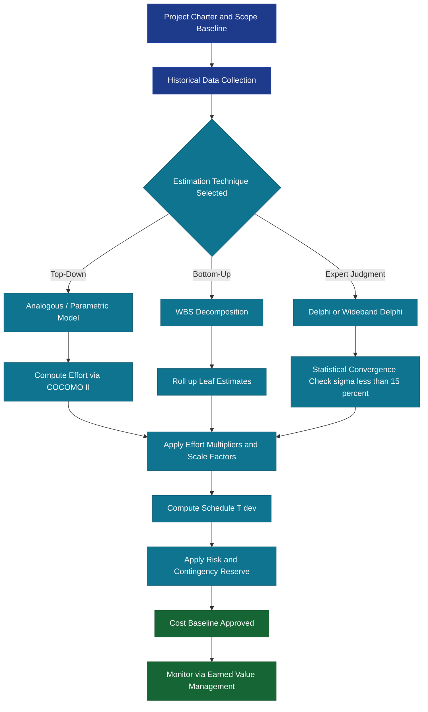
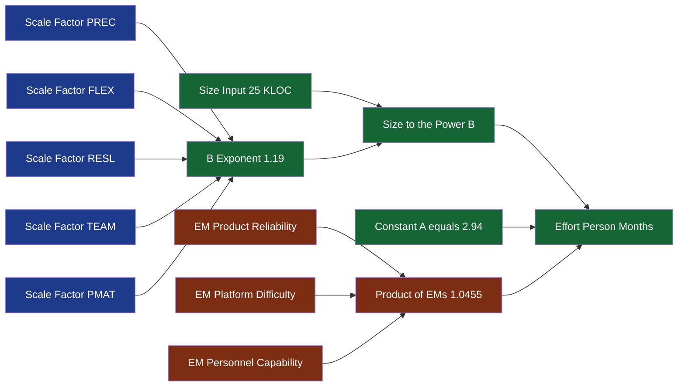

# Project Cost Estimate

<!-- SECTION_1_START -->
# Project Cost Estimate — Software Project Management (PECST521)

## 1. Core Technical Definition

In the context of **KTU 2024 Scheme (PECST521)**, **Project Cost Estimation** is defined as the *quantitative process of predicting the monetary, temporal, and resource expenditure required to complete a software project across its defined life cycle phases*. It is a foundational activity of the **Project Management Process Group — Planning**, performed after the project scope has been baselined and before the Work Breakdown Structure (WBS) is fully decomposed.

Formally, the project cost is modeled as:

$$C_{project} = \sum_{i=1}^{n} (Effort_i \times Rate_i) + C_{overhead} + C_{risk\_contingency}$$

where $Effort_i$ is the person-months (or person-hours) of work for activity $i$, $Rate_i$ is the burdened labour cost per unit, and the other terms represent indirect and risk-loaded cost pools.

> [!IMPORTANT]
> **KTU Syllabus Highlight (Module 1):** Cost estimation is *not* a one-shot activity. Under the **2024 Scheme**, students must distinguish between estimates made at the **feasibility stage** (Order-of-Magnitude, ±50% accuracy) and those made at the **planning stage** (Definitive, ±10% accuracy). The estimator's *confidence window* widens or narrows as the project matures.

### Conceptual Analogy — Intuition

Imagine you are planning a **house construction project** for a client.

- At the first meeting, you walk around the plot, eyeball the soil, and tell the owner: *"It will cost somewhere between ₹30 lakhs and ₹90 lakhs."* — This is an **Order-of-Magnitude (Rough) Estimate**, accuracy ±50%.
- Two weeks later, after an architect draws a basic floor plan, you quote: *"Approximately ₹55 lakhs ± 15%."* — This is a **Budget (Semi-detailed) Estimate**.
- Finally, after a quantity surveyor tallies every brick, bag of cement, and labour-day, you sign a contract for **₹58.4 lakhs**, accurate within ±5%. — This is a **Definitive (Detailed) Estimate**.

Software cost estimation follows **exactly the same trajectory**. The earlier the estimate, the wider the *cone of uncertainty*; the later the estimate, the tighter the cone. This concept is famously depicted in **Putnam's Cone of Uncertainty**.

> [!NOTE]
> **Putnam's Cone of Uncertainty:** A geometric model showing that the range of possible cost outcomes narrows as the project progresses through its life cycle stages (Concept → Development → Implementation). At concept stage, the cost range can be **4×** the eventual true value; at implementation, it is typically **0.5× to 1.5×** of the true value.

### Standard Metrics & Physical Constants

The following constants and metrics are **standardized** by KTU and are valid for all estimation problems in the syllabus:

| Metric | Symbol | Standard Value / Unit |
|---|---|---|
| Average productive hours per person-month | — | **152 hours / person-month** |
| Average working days per person-month | — | **19–20 days / person-month** |
| Burdened labour rate (India, 2024 baseline) | $R$ | **₹25,000 – ₹80,000 / person-month** (varies by role) |
| Code expansion factor (Source $\rightarrow$ Executable) | $CEF$ | **≈ 3.0** for 3GL languages |
| Average lines of code per function point | $LDC$ | Language-dependent (C: 128, C++: 55, Java: 53) |

> [!VISUALIZATION CONTROL]
> **Concept:** Putnam's Cone of Uncertainty (Cost Convergence over Time)
> **Plotting Equations (Desmos Input):**
> * Upper bound: $y = 4.0 \cdot e^{-0.30 \, t}$
> * Lower bound: $y = 0.25 \cdot e^{+0.20 \, t}$
> * Actual cost line: $y = 1.0$ (horizontal reference)
> * $x$-axis = Project life-cycle progress (0 to 1, normalized), $y$-axis = Cost ratio (Estimate / Actual)
> **Visual Description:** The student should observe a *funnel/cone shape* opening to the LEFT (concept stage, wide uncertainty) and narrowing to the RIGHT (implementation stage, tight accuracy). The actual cost line $y = 1.0$ intersects the cone near the end of the development phase.
<!-- SECTION_1_END -->

<!-- SECTION_2_START -->
## 2. Deep Theoretical Analysis & KTU High-Yield Formula Sheet

### 2.1 Classification of Cost Estimates (KTU Board-Favourite Topic)

The KTU 2024 Scheme explicitly classifies software cost estimates into **four levels** of refinement, mapped to project life-cycle phases:

| Estimate Type | Phase of Project | Accuracy | Typical Use |
|---|---|---|---|
| **Order of Magnitude (Rough)** | Concept / Feasibility | **±50%** | Go / No-Go decision, capital budgeting |
| **Budget (Semi-detailed)** | Preliminary Planning | **±25% – ±30%** | Budget allocation, fund approval |
| **Definitive (Detailed)** | Detailed Design | **±5% – ±10%** | Bid / Contract, project baselining |
| **Control (Final)** | Construction / Coding | **±2% – ±5%** | Earned Value tracking, change control |

> [!NOTE]
> **Rule of Thumb for KTU Exams:** A 1-mark question will often ask — *"At which phase is the most accurate cost estimate produced?"* — Correct answer: **Control / Final Estimate phase (Construction/Coding)**. A common wrong answer trap is "Implementation" — be careful, the *control* estimate is made *during* construction, not after.

### 2.2 Cost Estimation Techniques (Decomposition vs. Expert Judgement)

The KTU syllabus categorizes estimation techniques into two broad families:

#### A. Decomposition (Top-Down & Bottom-Up)

- **Top-Down (Analogous Estimating):** Uses the cost of a *previous, similar* project as the base. Formula:

$$C_{new} = C_{old} \times \left(\frac{Size_{new}}{Size_{old}}\right)^{k} \times \prod_{i} Adjustment_i$$

where $k$ is the scaling exponent (typically $0.6$ to $1.0$ for software) and $Adjustment_i$ are scaling factors for complexity, hardware, and team experience.

- **Bottom-Up (WBS-Based):** Each Work Breakdown Structure leaf is estimated individually, then aggregated:

$$C_{total} = \sum_{j=1}^{m} C_{WBS_j} + C_{integration} + C_{management}$$

- **Parametric Models (e.g., COCOMO):** Use a statistical equation calibrated from historical data. See Section 2.3.

#### B. Expert Judgement (Non-Algorithmic)

- **Delphi Technique:** A panel of experts estimates *anonymously* in iterative rounds. After each round, a facilitator shares the statistical summary (median, range). The iteration continues until **convergence** (typically $\sigma \leq 15\%$ of the mean).
- **Wideband Delphi:** An enhancement of Delphi where the facilitator *first* discusses estimation issues with experts in a workshop, *then* conducts anonymous rounds.
- **Work-In-Process (WIP) Estimation:** Used in agile contexts; team velocity $\times$ remaining sprints gives cost.

### 2.3 COCOMO (Constructive Cost Model) — The KTU Favourite Parametric Model

The **COCOMO II** model (used in the 2024 Scheme) computes effort as:

$$Effort = A \times Size^B \times \prod_{i=1}^{n} EM_i$$

where:
- $A$ = multiplicative constant (**A = 2.94** for COCOMO II Post-Architecture model)
- $Size$ = software size in **KLOC** (thousands of lines of code) or **Function Points**
- $B$ = scale factor exponent: $B = 1.01 + 0.01 \times \sum_{j=1}^{5} SF_j$
- $EM_i$ = Effort Multipliers (cost drivers), each ranging from **0.71 to 1.74** (Very Low to Extra High)
- $SF_j$ = the five Scale Factors: PREC, FLEX, RESL, TEAM, PMAT, each ranging 1.65 to 6.24

The schedule equation is:

$$T_{dev} = C \times (Effort)^{F}$$

where $C = 3.67$ and $F = 0.28 + 0.002 \times \sum B_{i}$ (sum of 17 cost-driver exponents for COCOMO 81) — for COCOMO II, $F$ is recomputed via the same scale factors.

### 2.4 KTU Formula Sheet / Cheat Sheet

| # | Formula | Symbol Meaning | Typical Use |
|---|---|---|---|
| 1 | $C = E \times R$ | $C$=Cost, $E$=Effort (PM), $R$=Rate (₹/PM) | Quick effort-to-cost conversion |
| 2 | $E = A \times KLOC^B \times \prod EM$ | COCOMO II Effort | Parametric estimation |
| 3 | $T = C \times E^F$ | COCOMO Schedule | Time-to-market planning |
| 4 | $FP = UFP \times VAF$ | Function Point sizing | Size-first estimation |
| 5 | $VAF = 0.65 + 0.01 \times \sum_{i=1}^{14} GSC_i$ | Value Adjustment Factor | Adjusts FP for complexity |
| 6 | $LOC = FP \times LDC$ | Language-dependent conversion | FP to KLOC bridge |
| 7 | $C_{project} = C_{direct} + C_{overhead} + C_{risk}$ | Project rollup | Final cost roll-up |
| 8 | $C_{risk} = 0.10 \times (C_{direct} + C_{overhead})$ | 10% contingency rule | Risk-loaded cost |
| 9 | $\sigma = \sqrt{\frac{\sum (X_i - \bar{X})^2}{N-1}}$ | Standard deviation of estimates | Delphi convergence check |
| 10 | $LOC_{final} = LOC_{estimated} \times \frac{1 - Productivity_{gain}}{1}$ | Adjusted for reuse / tools | Re-engineered systems |

> [!IMPORTANT]
> **Critical Notational Note:** All absolute-value and conditional bars in formulas are rendered using $\vert$ and $\mid$ to prevent markdown table corruption. For example, the scale-factor sum $\sum SF_j$ may be written as $\vert \sum SF_j \vert$ in prose but uses $\mid$ inside any table cell.

### 2.5 Real-World Engineering Utility

Cost estimation is *not* a theoretical exercise in industry. It drives:
- **Bid/No-Bid decisions** in pre-sales (accuracy ±25% is typical at this stage)
- **Earned Value Management (EVM):** $CPI = EV / AC$ and $SPI = EV / PV$ — every variance is interpreted against the cost baseline set during estimation.
- **Capital budgeting** for software product companies; estimates over **±20%** typically trigger CFO-level re-validation.
- **Outsourcing contracts:** Fixed-price contracts require *definitive* estimates; Time-and-Material contracts accept *order-of-magnitude* estimates.
- **Risk-adjusted ROI** computations in fintech and product companies.

> [!NOTE]
> **Industry Insight:** A 2024 NASSCOM report indicates that **68%** of Indian IT project overruns originate from under-estimated scope or effort at the bidding stage. The KTU 2024 Scheme deliberately emphasizes *estimation accuracy windows* to sensitize students to this real-world pain point.
<!-- SECTION_2_END -->

<!-- SECTION_3_START -->
## 3. Step-by-Step Derivations & Worked Example

### 3.1 Worked Example 1 — COCOMO II Effort Calculation

**Problem Statement:**
A software project is estimated to be **25 KLOC** in size. The five scale factors are given as: PREC = 4.0, FLEX = 3.0, RESL = 4.0, TEAM = 3.0, PMAT = 4.0. The Effort Multipliers (after team calibration) are: $EM_1 = 1.10$, $EM_2 = 0.87$, $EM_3 = 1.15$, $EM_4 = 1.00$, $EM_5 = 0.95$. Compute the **Person-Months (PM)** of effort and the **development time** in months. (Use $A = 2.94$, $C = 3.67$.)

#### Step 1 — Compute the Scale Exponent $B$

The COCOMO II scale exponent is:

$$B = 1.01 + 0.01 \times \sum_{j=1}^{5} SF_j$$

Substitute the values:

$$\sum SF = 4.0 + 3.0 + 4.0 + 3.0 + 4.0 = 18.0$$

$$B = 1.01 + 0.01 \times 18.0 = 1.01 + 0.18 = 1.19$$

> **Valuation Key Point:** *'Stating the summation of scale factors and substituting into the exponent formula: 2 Marks'*

#### Step 2 — Compute the Product of Effort Multipliers

$$\prod EM = 1.10 \times 0.87 \times 1.15 \times 1.00 \times 0.95$$

Now expand step by step:

$$1.10 \times 0.87 = 0.957$$

$$0.957 \times 1.15 = 1.10055$$

$$1.10055 \times 1.00 = 1.10055$$

$$1.10055 \times 0.95 = 1.04552$$

So $\prod EM \approx 1.0455$.

> **Valuation Key Point:** *'Sequential multiplication of all five EMs with at least three intermediate results shown: 2 Marks'*

#### Step 3 — Apply the COCOMO II Effort Equation

$$E = A \times Size^B \times \prod EM$$

Substitute:

$$E = 2.94 \times (25)^{1.19} \times 1.0455$$

Compute $25^{1.19}$:

$$\ln(25^{1.19}) = 1.19 \times \ln(25) = 1.19 \times 3.2189 = 3.8305$$

$$25^{1.19} = e^{3.8305} \approx 46.13$$

Substitute back:

$$E = 2.94 \times 46.13 \times 1.0455$$

$$E = 2.94 \times 48.23$$

$$E \approx 141.8 \text{ Person-Months (PM)}$$

> **Valuation Key Point:** *'Computing $Size^B$ via logarithm and exponentiation, then final substitution: 3 Marks'*

#### Step 4 — Compute Development Time

The schedule equation is $T = C \times E^F$. For COCOMO II, $F$ is computed from the *same* scale factors:

$$F = 0.28 + 0.002 \times \sum SF = 0.28 + 0.002 \times 18.0 = 0.28 + 0.036 = 0.316$$

$$T = 3.67 \times (141.8)^{0.316}$$

Compute $141.8^{0.316}$:

$$\ln(141.8^{0.316}) = 0.316 \times \ln(141.8) = 0.316 \times 4.954 = 1.5655$$

$$141.8^{0.316} = e^{1.5655} \approx 4.785$$

$$T = 3.67 \times 4.785 \approx 17.56 \text{ Months}$$

> **Valuation Key Point:** *'Computing F correctly using the same scale factors and final T in months with units: 2 Marks'*

**Final Answer:** $E \approx 141.8$ PM, $T \approx 17.6$ months.

> **Average Team Size** = $E / T = 141.8 / 17.6 \approx 8.06$ persons.

---

### 3.2 Worked Example 2 — Function Point to KLOC Conversion

**Problem Statement:** A payroll system has the following function point inventory:

| Function Type | Count | Weight |
|---|---|---|
| External Inputs (EI) | 30 | 4 |
| External Outputs (EO) | 22 | 5 |
| External Inquiries (EQ) | 14 | 4 |
| Internal Logical Files (ILF) | 8 | 10 |
| External Interface Files (EIF) | 4 | 7 |

The 14 General System Characteristics (GSC) values sum to **52**. The implementation language is **Java**. Compute the **Function Points**, the **adjusted FP**, and the **estimated KLOC**.

#### Step 1 — Unadjusted Function Point (UFP)

$$UFP = \sum (Count_i \times Weight_i)$$

$$UFP = (30 \times 4) + (22 \times 5) + (14 \times 4) + (8 \times 10) + (4 \times 7)$$

$$UFP = 120 + 110 + 56 + 80 + 28 = 394$$

#### Step 2 — Value Adjustment Factor (VAF)

$$VAF = 0.65 + 0.01 \times \sum_{i=1}^{14} GSC_i = 0.65 + 0.01 \times 52 = 0.65 + 0.52 = 1.17$$

#### Step 3 — Adjusted Function Point (FP)

$$FP = UFP \times VAF = 394 \times 1.17 = 460.98 \approx 461 \text{ FP}$$

#### Step 4 — Convert FP to KLOC (Java)

For Java, the Lines of Code per Function Point is **LDC = 53**.

$$LOC = FP \times LDC = 461 \times 53 = 24{,}433 \text{ LOC}$$

$$KLOC = 24{,}433 / 1000 = 24.43 \text{ KLOC}$$

**Final Answer:** FP = 461, KLOC = 24.43.

> [!NOTE]
> **KTU Examiner Pattern:** Part (a) of a 14-mark question typically tests the *mechanical* computation (UFP $\rightarrow$ VAF $\rightarrow$ FP). Part (b) tests the *interpretation* (e.g., "If the language is changed from Java to C, the KLOC will increase. Justify."). Always prepare both.

---

### 3.3 Worked Example 3 — Top-Down (Analogical) Estimate

**Problem Statement:** A previous project of 50 KLOC took 120 PM and cost ₹36 lakhs. A new project is estimated at 80 KLOC, with the following adjustment factors: complexity factor 1.2, team-experience factor 0.9. Estimate the new cost and effort.

#### Step 1 — Base Productivity

$$Productivity = \frac{120 \text{ PM}}{50 \text{ KLOC}} = 2.4 \text{ PM/KLOC}$$

#### Step 2 — Effort with Size Scaling (k = 1.0, linear)

$$E_{new} = E_{old} \times \frac{Size_{new}}{Size_{old}} = 120 \times \frac{80}{50} = 192 \text{ PM}$$

#### Step 3 — Apply Adjustment Factors

$$E_{final} = 192 \times 1.2 \times 0.9 = 192 \times 1.08 = 207.36 \text{ PM}$$

#### Step 4 — Cost

$$C = E \times R = 207.36 \times \frac{36{,}00{,}000}{120} = 207.36 \times 30{,}000 = ₹62{,}20{,}800$$

**Final Answer:** $\approx 207.4$ PM, $\approx$ ₹62.2 lakhs.
<!-- SECTION_3_END -->

<!-- SECTION_4_START -->
## 4. Structural Diagrams & Schematics

### 4.1 Cost Estimation Process Flow (Mermaid)

### 4.2 Sequential Processing Topology Matrix — Estimation Refinement Stages

| Stage | Input Artifact | Estimator Tool | Output Artifact | Accuracy |
|---|---|---|---|---|
| Stage 0 — Concept | One-paragraph brief | Expert intuition / analogy | Rough estimate | ±50% |
| Stage 1 — Feasibility | Feasibility study draft | Function Point sizing | Budget envelope | ±25% |
| Stage 2 — Planning | Approved scope, WBS L1 | COCOMO II / Top-Down | Definitive estimate | ±10% |
| Stage 3 — Execution | Detailed design, WBS L3 | Bottom-up + EVM | Control estimate | ±5% |
| Stage 4 — Closure | Final code, test reports | Actuals reconciliation | Final cost report | ±0% (actuals) |

> **Reading the Matrix:** The columns flow left-to-right. Each successive stage *narrows* the accuracy window while *increasing* the input detail. The estimator progressively swaps *intuitive* methods (top of matrix) for *empirical* methods (bottom of matrix).

### 4.3 Effort Multiplier Calibration — Block Diagram

> **Block-Level Reading:** Scale Factors influence the *exponent* (sensitivity to size), while Effort Multipliers influence the *coefficient* (operational drag or boost). This separation is the key advantage of COCOMO II over its predecessor COCOMO 81.
<!-- SECTION_4_END -->

<!-- SECTION_5_START -->
## 5. KTU 2024 Scheme Examination Question Bank & Topic Recap

### Part A — 3-Mark Short Answer Questions

**Q1.** [KTU University Exam — July 2024] **Define the term "Order-of-Magnitude Estimate" and state its typical accuracy range.**

**Model Answer (3 Marks):**
An Order-of-Magnitude Estimate (also called a *rough* or *ballpark* estimate) is the earliest cost estimate produced during the concept or feasibility stage of a project. It is generated with **minimal project information** — typically only a high-level description of scope. Its accuracy is **±50%**, meaning the actual cost may fall between **0.5× and 1.5×** the estimated value.

> *Allocation:* [Definition: 1 Mark] [Stage identification: 1 Mark] [Accuracy range: 1 Mark]

---

**Q2.** [KTU University Exam — Dec 2023] **List any three cost-estimation techniques covered in the KTU PECST521 syllabus.**

**Model Answer (3 Marks):**
The three techniques are:
1. **Top-Down (Analogical) Estimating** — uses historical data from similar past projects.
2. **Bottom-Up (WBS-Based) Estimating** — decomposes the project into WBS leaves, estimates each, then aggregates.
3. **Parametric (COCOMO II) Estimating** — uses a calibrated equation $E = A \times Size^B \times \prod EM$ driven by size and cost drivers.

> *Allocation:* [One technique with one-line description each: 1 Mark × 3]

---

### Part B — 14-Mark Questions (Module Internal Choice)

#### **Question A (14 Marks)** [KTU University Exam — Dec 2024]

**(a)** Explain the **four levels of cost estimates** in software projects, with their typical accuracy windows and the project phase in which each is produced. **[7 Marks]**

**(b)** A proposed e-commerce web application is estimated at **18 KLOC**. The five COCOMO II scale factors are: PREC = 5.0, FLEX = 4.0, RESL = 3.0, TEAM = 4.0, PMAT = 3.0. The product of effort multipliers is computed as $\prod EM = 1.08$. Calculate the **Person-Months (PM)** of effort and the **development time** in months using the COCOMO II equations ($A = 2.94$, $C = 3.67$). **[7 Marks]**

##### Model Solution

**(a) Four Levels of Cost Estimates (7 Marks)**

| # | Level | Phase | Accuracy | Description |
|---|---|---|---|---|
| 1 | Order of Magnitude (Rough) | Concept / Feasibility | ±50% | Initial screening; minimal data |
| 2 | Budget (Semi-detailed) | Preliminary Planning | ±25–30% | Funds approval; managerial use |
| 3 | Definitive (Detailed) | Detailed Design | ±5–10% | Bid / contract; baseline setting |
| 4 | Control (Final) | Construction / Coding | ±2–5% | Earned-value tracking; change control |

> *Valuation Key Points:* [Naming the four levels: 2 Marks] [Mapping to phase: 2 Marks] [Stating accuracy windows: 2 Marks] [One-line description each: 1 Mark]

**(b) COCOMO II Calculation (7 Marks)**

**Step 1 — Scale Exponent $B$:**

$$\sum SF = 5.0 + 4.0 + 3.0 + 4.0 + 3.0 = 19.0$$

$$B = 1.01 + 0.01 \times 19.0 = 1.20$$

**[2 Marks]**

**Step 2 — Compute $Size^B$:**

$$18^{1.20} = e^{1.20 \times \ln(18)} = e^{1.20 \times 2.890} = e^{3.468} \approx 32.07$$

**[1 Mark]**

**Step 3 — Effort:**

$$E = 2.94 \times 32.07 \times 1.08 = 2.94 \times 34.64 \approx 101.84 \text{ PM}$$

**[2 Marks]**

**Step 4 — Schedule Exponent $F$:**

$$F = 0.28 + 0.002 \times 19.0 = 0.28 + 0.038 = 0.318$$

**Step 5 — Development Time:**

$$T = 3.67 \times (101.84)^{0.318}$$

$$(101.84)^{0.318} = e^{0.318 \times 4.624} = e^{1.470} \approx 4.35$$

$$T = 3.67 \times 4.35 \approx 15.97 \text{ months} \approx 16.0 \text{ months}$$

**[2 Marks]**

**Final Answer:** $E \approx 101.8$ PM, $T \approx 16.0$ months.

> [!WARNING]
> **KTU Examiner's Valuation Warning — Pitfall 1:** Students often *forget* that COCOMO II uses the **same five scale factors** to compute **both** $B$ (for effort) **and** $F$ (for schedule). Writing $F = 0.318$ in COCOMO 81 style (using 17 cost-driver exponents) will be marked **wrong** in the 2024 Scheme. **Pitfall 2:** Do not skip the $\prod EM$ term — even when all multipliers are nominal, the product equals 1.0 and must be written explicitly to earn the 1 Mark. **Pitfall 3:** Always carry the unit (PM, months) to the final answer line; the examiner deducts 0.5 Mark for missing units.

---

#### **Question B (14 Marks) — Alternative Choice** [KTU University Exam — July 2024]

**(a)** Explain the **Delphi Technique** of cost estimation. Discuss its advantages over a single-expert estimate. **[7 Marks]**

**(b)** A system has the following Function Point inventory. The 14 GSCs sum to 42. The target language is **C++**. Compute the **Unadjusted Function Points (UFP)**, the **Value Adjustment Factor (VAF)**, the **adjusted FP**, and the **estimated KLOC**. (For C++, LDC = 55.) **[7 Marks]**

| Function Type | Count | Weight |
|---|---|---|
| EI | 24 | 3 |
| EO | 18 | 4 |
| EQ | 10 | 3 |
| ILF | 6 | 10 |
| EIF | 3 | 7 |

##### Model Solution

**(a) Delphi Technique (7 Marks)**

The **Delphi Technique** is a structured, *iterative*, *anonymous* estimation method involving a panel of experts (typically 5–10). The process:

1. **Round 1:** Each expert independently submits an estimate to a facilitator.
2. **Round 2:** The facilitator compiles a *statistical summary* (mean, median, standard deviation) and returns it to all experts — *without* revealing identities.
3. **Round 3+:** Experts re-estimate, considering the group feedback. Outliers converge toward the median.
4. **Termination:** Iteration stops when **convergence** is achieved, defined as standard deviation $\sigma \leq 15\%$ of the mean.

**Advantages over single-expert estimate:**
- **Reduces bias** — anonymity prevents dominance by senior personalities.
- **Captures diversity** — multiple expert viewpoints surface hidden risks.
- **Self-correcting** — statistical feedback drives convergence to a realistic value.
- **Documented audit trail** — useful for post-project reviews.

> *Valuation Key Points:* [Process steps: 3 Marks] [Convergence criterion: 1 Mark] [Two advantages: 2 Marks] [Example application: 1 Mark]

**(b) Function Point Calculation (7 Marks)**

**Step 1 — UFP:**

$$UFP = (24 \times 3) + (18 \times 4) + (10 \times 3) + (6 \times 10) + (3 \times 7)$$

$$UFP = 72 + 72 + 30 + 60 + 21 = 255$$

**[2 Marks]**

**Step 2 — VAF:**

$$VAF = 0.65 + 0.01 \times 42 = 0.65 + 0.42 = 1.07$$

**[1 Mark]**

**Step 3 — Adjusted FP:**

$$FP = 255 \times 1.07 = 272.85 \approx 273 \text{ FP}$$

**[1 Mark]**

**Step 4 — KLOC (C++):**

$$LOC = 273 \times 55 = 15{,}015 \text{ LOC}$$

$$KLOC = 15.015$$

**[3 Marks]**

**Final Answer:** UFP = 255, VAF = 1.07, FP ≈ 273, KLOC ≈ 15.02.

> [!WARNING]
> **KTU Examiner's Valuation Warning — Pitfall 1:** Students frequently confuse **EI / EO / EQ / ILF / EIF weights**. Memorize the standard KTU weight table: EI=3, EO=4, EQ=3, ILF=10, EIF=7. **Pitfall 2:** The VAF formula uses **0.65 + 0.01 × sum**, *not* **0.65 × sum** — this is the most common arithmetic error. **Pitfall 3:** Always round FP to the nearest integer before converting to LOC; fractional FP is physically meaningless.

---

### Topic Recap & Important Things to Remember

- **Cost Estimate Types:** Rough (±50%) → Budget (±25%) → Definitive (±10%) → Control (±5%). Each successive level *narrows* accuracy.
- **Three Estimation Families:** Decomposition (Top-Down / Bottom-Up), Parametric (COCOMO II), Expert Judgement (Delphi).
- **COCOMO II Effort Equation:** $E = A \times Size^B \times \prod EM$ with $A = 2.94$, $B = 1.01 + 0.01 \sum SF$, and $Size$ in KLOC.
- **Schedule Equation:** $T = C \times E^F$ with $C = 3.67$, $F = 0.28 + 0.002 \sum SF$.
- **Scale Factors (5):** PREC, FLEX, RESL, TEAM, PMAT — range 1.65 to 6.24.
- **Effort Multipliers (17 in COCOMO 81, 21 in COCOMO II):** range 0.71 to 1.74.
- **Function Point Pipeline:** UFP (weighted sum) → VAF (0.65 + 0.01 × $\sum GSC$) → FP = UFP × VAF → KLOC = FP × LDC.
- **Language LDC Memory Anchors:** C = 128, C++ = 55, Java = 53, Python = 35, SQL = 13.
- **Delphi Convergence:** Iteration stops when $\sigma \leq 15\%$ of the mean estimate.
- **Putnam's Cone:** Cost uncertainty *narrows* as project life-cycle progresses.
- **Risk Contingency Rule:** Reserve ≈ **10%** of (Direct + Overhead) cost.
- **Standard Constants:** 152 productive hours per person-month; burdened rate ₹25K–80K per PM (India 2024).
- **Critical Exam Heuristic:** When a KTU question provides KLOC and asks for "schedule and team size", *always* compute $B$ and $F$ from the **same** scale factors. Forgetting this loses 2–3 Marks instantly.
<!-- SECTION_5_END -->
