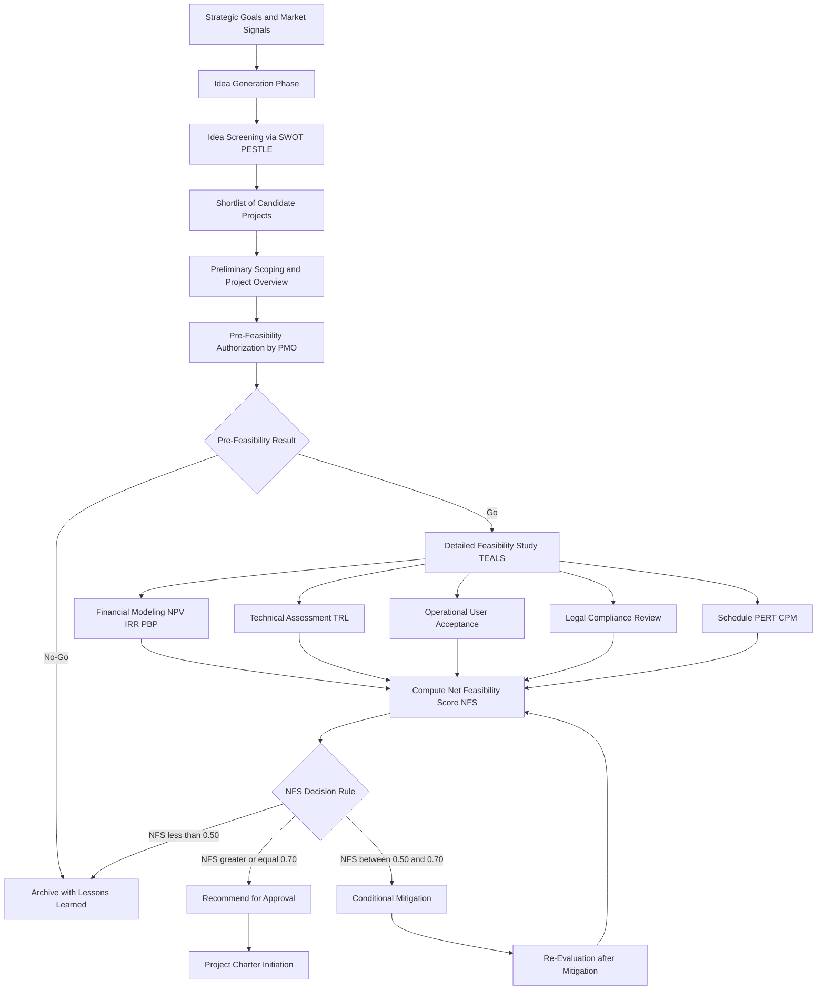
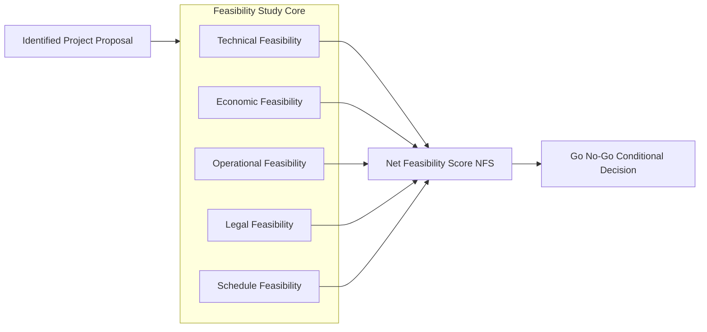
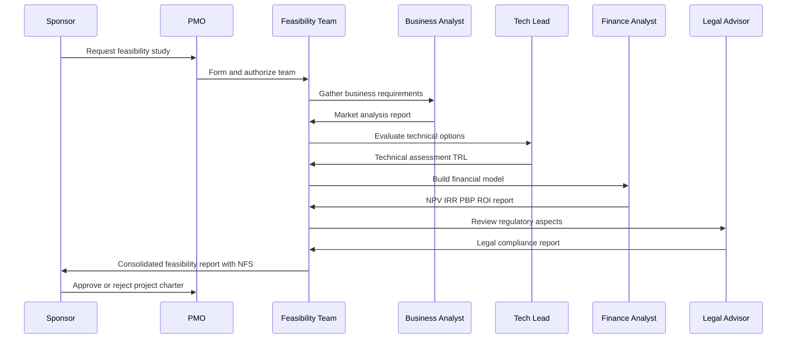
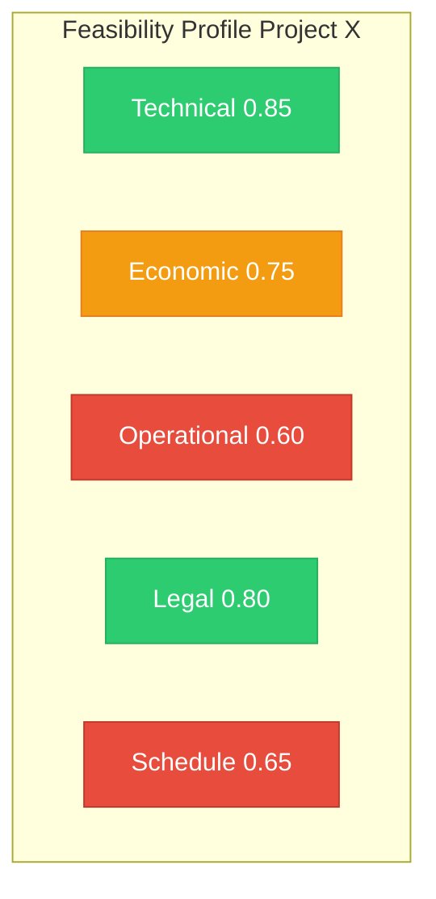
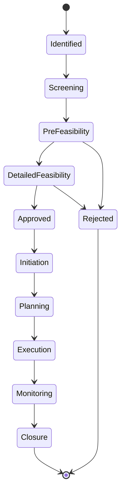
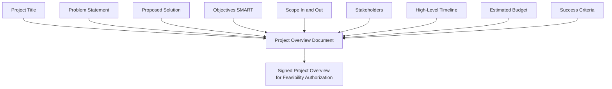

# Project Overview and Feasibility Studies - Identification

<!-- SECTION_1_START -->

# 1. Core Technical Definition & Intuitive Overview

## 1.1 Project Identification — Formal Definition

In the context of the **KTU 2024 Scheme (PECST521 – Software Project Management)**, *Project Identification* is formally defined as the **systematic and structured process of recognizing, defining, and documenting a potential project idea or opportunity** that an organization can undertake to achieve its strategic, operational, or tactical objectives. It is the **first phase of the Project Life Cycle**, preceding Project Initiation, Planning, Execution, and Closure.

> [!IMPORTANT]
> **KTU 2024 Definition Anchor**
> Project Identification is the *ideation and reconnaissance stage* where the organization scans its internal capabilities, external market forces, regulatory requirements, and stakeholder demands to **arrive at a list of candidate projects** that can be formally evaluated, prioritized, and proposed for chartering.

Mathematically, this can be expressed as a **portfolio selection mapping**:

$$
P_{identified} = \big\{ p_i \; \big| \; p_i \in \mathcal{C} \cap \mathcal{S} \cap \mathcal{M} \big\}
$$

Where:
- $P_{identified}$ = the set of identified candidate projects
- $\mathcal{C}$ = Capability set (internal resources, skills, infrastructure)
- $\mathcal{S}$ = Strategic alignment set (business goals, vision)
- $\mathcal{M}$ = Market/demand set (customer needs, competitor moves)
- $p_i$ = individual project proposal

> [!NOTE]
> **Syllabus Highlight (PECST521 — Module 1):**
> Project Identification is the precursor to *Feasibility Analysis*. Without proper identification, any feasibility study conducted is directionless and will yield misleading results. The KTU board specifically tests the linkage: *Identify → Screen → Feasibility → Charter*.

---

## 1.2 Conceptual Analogy & Intuitive Understanding

Imagine you are a **maritime explorer setting sail in the 15th century**.

- **Project Identification** is the phase where you ask: *"There are rumors of a spice-rich land to the East. Is it worth even considering the journey?"* You have not yet built a ship, hired a crew, or plotted coordinates. You are simply acknowledging the **existence of an opportunity**.
- **Feasibility Analysis** is when you sit down with cartographers, financiers, and shipwrights to ask: *"Can we actually build a vessel strong enough? Do we have funds? Will the trade winds favor us?"*
- **Project Initiation** is when the King signs the royal charter.

In software terms, think of Project Identification as the moment a CEO of an e-commerce company says:
> *"Our competitors are using AI chatbots. We need to investigate whether building a customer-service AI is a viable project for us this year."*

That single sentence — the **act of recognizing a need and framing it as a potential project** — is Project Identification.

> [!TIP]
> **Real-world Engineering Example (KTU 2024 Context):**
> TCS (Tata Consultancy Services) identifies a new project by running an **Innovation Funnel**: thousands of employee ideas enter the top, business relevance filters them, and only a handful emerge as formally identified projects for the quarter. This is Project Identification in production.

---

## 1.3 Sources of Project Identification

Project ideas can originate from **multiple internal and external triggers**. The KTU syllabus emphasizes a **holistic scanning model**.

> [!NOTE]
> **Primary Sources of Project Identification:**
>
> | # | Source | Description |
> |---|--------|-------------|
> | 1 | **Strategic Goals** | Top-down directives from the executive board aligned with the company's vision and mission. |
> | 2 | **Customer Requests** | Bottom-up feedback, complaints, feature requests, RFPs (Request for Proposals). |
> | 3 | **Regulatory Compliance** | Legal mandates (e.g., GDPR, RBI guidelines) that *force* project creation. |
> | 4 | **Technological Innovation** | New frameworks (e.g., Generative AI, Web3) creating disruptive opportunities. |
> | 5 | **Competitor Benchmarking** | Reverse-engineering competitor product launches. |
> | 6 | **Process Improvement** | Internal bottlenecks identified via Six Sigma, Kaizen, or PDCA cycles. |
> | 7 | **Market Research** | Trend analysis, surveys, and feasibility data from industry analysts. |

---

## 1.4 Project Overview — The Framing Document

A **Project Overview** is the *one-page (or short narrative) document* that crystallizes the identified project idea into a **concise, structured, and communicable description**. It typically answers the **5 Ws and 1 H**:

> [!IMPORTANT]
> **The 5 Ws and 1 H of a Project Overview:**
>
> - **What** is the project? (Scope and Deliverable)
> - **Why** is it being done? (Business Case / Problem Statement)
> - **Who** are the stakeholders? (Sponsors, Users, Team)
> - **When** is the target? (High-level timeline)
> - **Where** will it operate? (Department, Geography, Platform)
> - **How** will it broadly be approached? (Methodology — Waterfall, Agile, Hybrid)

In KTU 2024 Scheme evaluation, students are expected to **draft a Project Overview Statement** as part of Module 1 case study questions.

---

## 1.5 Feasibility Study — Formal Definition

A **Feasibility Study** is a **rigorous, multidimensional evaluation of a candidate project's viability** across technical, economic, operational, legal, and scheduling dimensions. It is the **first gate-keeping decision tool** in the project life cycle.

The mathematical goal of a feasibility study is to determine the **Net Feasibility Score (NFS)**:

$$
NFS = w_T \cdot F_T + w_E \cdot F_E + w_O \cdot F_O + w_L \cdot F_L + w_S \cdot F_S
$$

Where:
- $F_T, F_E, F_O, F_L, F_S$ = normalized scores (0 to 1) for Technical, Economic, Operational, Legal, and Schedule feasibility
- $w_T, w_E, w_O, w_L, w_S$ = corresponding weights, satisfying $\sum w_i = 1$
- $NFS$ is the **Net Feasibility Score** in the range $[0, 1]$

> [!TIP]
> **Decision Rule:** If $NFS \geq 0.70$, the project is **recommended for approval**. If $0.50 \leq NFS < 0.70$, the project is **conditionally recommended** (requires mitigation). If $NFS < 0.50$, the project is **rejected**.

---

## 1.6 The Five Pillars of Feasibility (KTU High-Yield)

> [!IMPORTANT]
> **Types of Feasibility — Mandatory KTU 2024 Board Topic:**
>
> 1. **Technical Feasibility** — *"Can we build it?"*
>    Assesses hardware, software, tools, expertise, and technology maturity.
> 2. **Economic / Financial Feasibility** — *"Should we build it from a cost-benefit angle?"*
>    Evaluates ROI, NPV, Payback Period, and Total Cost of Ownership (TCO).
> 3. **Operational Feasibility** — *"Will it be used effectively?"*
>    Examines user acceptance, organizational culture, training needs, and workflow integration.
> 4. **Legal / Contractual Feasibility** — *"Are we allowed to build it?"*
>    Checks compliance with IT Act 2000 (India), data protection laws, licensing, IP rights.
> 5. **Schedule / Time Feasibility** — *"Can we deliver within the deadline?"*
>    Verifies if the project timeline is realistic given resource constraints.

---

## 1.7 GeoGebra / Conceptual Visualization

> [!VISUALIZATION CONTROL]
> **Concept:** Feasibility Score Radar Chart (Multi-Criteria Decision Visualization)
> **GeoGebra / Desmos Input Equations:**
> * Plot a pentagon with vertices at angles: $0°, 72°, 144°, 216°, 288°$ on a unit circle.
> * Each axis represents one feasibility type with score in $[0, 1]$.
> * For example, vertex coordinates: $(1, 0)$, $(\cos 72°, \sin 72°)$, $(\cos 144°, \sin 144°)$, $(\cos 216°, \sin 216°)$, $(\cos 288°, \sin 288°)$.
> **Visual Description:** A balanced pentagon (regular shape) indicates a **highly feasible project**. An irregular, jagged polygon signals **critical weakness** in one or more dimensions — typically the area of rejection. The **Net Feasibility Score (NFS)** is the area covered by the polygon divided by the area of the regular pentagon.

---

## 1.8 Pre-Feasibility vs. Detailed Feasibility

> [!NOTE]
> **Two-Tier Feasibility Approach (Industry Standard):**
>
> | Aspect | Pre-Feasibility Study | Detailed Feasibility Study |
> |--------|----------------------|----------------------------|
> | **Duration** | 1–2 weeks | 1–3 months |
> | **Cost** | Low (1–5% of project budget) | High (5–10% of project budget) |
> | **Depth** | Preliminary, high-level | Granular, data-driven |
> | **Output** | Go / No-Go / Re-study decision | Full feasibility report with NFS |
> | **Audience** | Senior management | Steering committee and sponsors |

---

## 1.9 Intuitive Wrap-Up

> [!TIP]
> **Mnemonic to Remember the Five Feasibility Types — "TEALS":**
> **T** — Technical
> **E** — Economic
> **A** — (Operational, think of "Adoption by users")
> **L** — Legal
> **S** — Schedule

<!-- SECTION_1_END -->

<!-- SECTION_2_START -->

# 2. Deep Theoretical Analysis & KTU High-Yield Formula Sheet

## 2.1 The Project Identification Process — Structured Logic Flow

The KTU 2024 syllabus expects students to understand the **sequential, gated identification process**. Each stage acts as a **filter**, reducing the funnel of ideas until only the most promising candidate projects remain.

### Step-by-Step Theoretical Breakdown

1. **Idea Generation (Divergent Thinking)**
   - Brainstorming sessions, suggestion boxes, hackathons, customer feedback loops.
   - Output: A **long list** of raw project ideas (often 50–200 entries in a large enterprise).

2. **Idea Screening (Convergent Filtering)**
   - Each idea is evaluated against **strategic alignment criteria**.
   - Ideas misaligned with the organization's mission, vision, or annual OKRs (Objectives and Key Results) are **dropped**.
   - Tools: **SWOT Analysis** (Strengths, Weaknesses, Opportunities, Threats), **PESTLE Analysis** (Political, Economic, Social, Technological, Legal, Environmental).
   - Output: A **short list** of 5–10 candidate projects.

3. **Preliminary Scoping**
   - For each shortlisted project, a **one-paragraph Project Overview Statement** is drafted.
   - Stakeholders are identified at a high level.
   - Output: A **portfolio of Project Charters** (in draft form).

4. **Feasibility Study Authorization**
   - The Project Management Office (PMO) authorizes a formal **Feasibility Study**.
   - A **Feasibility Study Team** is formed (typically 2–5 members: a Business Analyst, a Technical Lead, a Finance Analyst, and a Project Manager).

5. **Detailed Feasibility Analysis**
   - All five feasibility types (TEALS) are evaluated.
   - Data is collected via interviews, surveys, prototype testing, and financial modeling.
   - Output: A **Feasibility Report** with a Go / No-Go / Conditional recommendation.

6. **Decision Gate**
   - The Steering Committee reviews the Feasibility Report.
   - If approved, the project proceeds to the **Initiation Phase** (Project Charter is formally signed).
   - If rejected, the project is archived with a **lessons-learned** document.

---

## 2.2 Detailed Theoretical Explanation of Each Feasibility Type

### 2.2.1 Technical Feasibility

Technical Feasibility evaluates whether the organization possesses (or can acquire) the **technology, tools, infrastructure, and human expertise** required to design, develop, deploy, and maintain the proposed software system.

**Key Assessment Questions:**
- Does the required technology exist? Is it mature or experimental?
- Does the team have the necessary skill sets (e.g., Python, TensorFlow, AWS)?
- Are the hardware and software platforms available and scalable?
- Is the architecture compatible with existing legacy systems?

**Key Metrics:**

$$
\text{Technical Readiness Level (TRL)} \in \{1, 2, 3, \ldots, 9\}
$$

Where:
- **TRL 1–3**: Basic research, no proven concept.
- **TRL 4–6**: Technology validated in lab or relevant environment.
- **TRL 7–9**: System proven in operational environment (production-ready).

> [!IMPORTANT]
> **KTU Board Note:** A project with TRL ≤ 4 is considered **high technical risk** and will likely fail the Technical Feasibility test unless a substantial R\&D budget is allocated.

---

### 2.2.2 Economic / Financial Feasibility

Economic Feasibility determines whether the **financial benefits of the project outweigh the costs** over a defined time horizon. This is the most quantitatively rigorous feasibility type.

**Key Metrics and Formulas:**

#### (a) Net Present Value (NPV)

$$
NPV = \sum_{t=0}^{N} \frac{B_t - C_t}{(1 + r)^t}
$$

Where:
- $B_t$ = Benefits (revenue + cost savings) in year $t$
- $C_t$ = Costs in year $t$
- $r$ = Discount rate (cost of capital, typically 8%–15% in Indian IT firms)
- $N$ = Project life in years
- $t = 0$ represents the initial investment (negative cash outflow)

**Decision Rule:** If $NPV > 0$, the project is **economically viable**.

#### (b) Internal Rate of Return (IRR)

$$
NPV = 0 = \sum_{t=0}^{N} \frac{B_t - C_t}{(1 + IRR)^t}
$$

**Decision Rule:** If $IRR > r$ (discount rate), the project is accepted.

#### (c) Payback Period (PBP)

$$
PBP = \frac{\text{Total Initial Investment}}{\text{Annual Net Cash Inflow}}
$$

**Decision Rule:** Shorter payback periods are preferred. Most Indian IT firms expect $PBP \leq 3$ years.

#### (d) Return on Investment (ROI)

$$
ROI = \frac{\text{Net Profit}}{\text{Total Investment}} \times 100\%
$$

#### (e) Benefit-Cost Ratio (BCR)

$$
BCR = \frac{\sum_{t=0}^{N} \frac{B_t}{(1+r)^t}}{\sum_{t=0}^{N} \frac{C_t}{(1+r)^t}}
$$

**Decision Rule:** If $BCR \geq 1$, the project is economically justified.

---

### 2.2.3 Operational Feasibility

Operational Feasibility assesses whether the **end-users and the organization as a whole** will adopt, adapt to, and effectively use the new system. It is the **human and cultural dimension** of feasibility.

**Key Assessment Areas:**
- **User Acceptance**: Will the workforce resist or embrace the change?
- **Training Requirements**: How much retraining is needed?
- **Workflow Disruption**: Does the new system break existing processes?
- **Management Support**: Is there executive sponsorship at the top?
- **Organizational Culture**: Is the organization change-ready?

**Common Tools Used:**
- User surveys and interviews.
- Prototype demonstrations and usability testing.
- Change Management Models (Kotter's 8-Step, ADKAR).

> [!TIP]
> **KTU Exam Tip:** Operational Feasibility is often the **most overlooked** type. A technically perfect and financially attractive project can still fail if users refuse to adopt it. Cite *Healthcare.gov (2013)* as a real-world case.

---

### 2.2.4 Legal Feasibility

Legal Feasibility checks for **regulatory, statutory, contractual, and intellectual property** compliance.

**Key Areas to Examine:**
- **Data Privacy Laws**: IT Act 2000 (India), GDPR (EU), HIPAA (USA healthcare).
- **Licensing**: Open-source license compatibility (GPL, MIT, Apache).
- **Intellectual Property (IP)**: Patent conflicts, copyright issues, trade secrets.
- **Contractual Obligations**: Existing SLAs, vendor lock-in clauses, non-compete agreements.
- **Industry Regulations**: RBI for fintech, FDA for medical software, SEBI for trading platforms.

---

### 2.2.5 Schedule Feasibility

Schedule Feasibility evaluates whether the project can be **completed within the required or proposed timeline**, given the available resources and dependencies.

**Key Techniques:**
- **Critical Path Method (CPM)**
- **Program Evaluation Review Technique (PERT)**
- **Gantt Chart analysis**
- **Resource Leveling**

**Rule of Thumb:**

$$
\text{Optimal Schedule} = 1.15 \times \text{PERT Expected Duration}
$$

Where the 15% buffer accounts for unforeseen risks and rework cycles.

---

## 2.3 KTU High-Yield Formula Sheet / Cheat Sheet

> [!IMPORTANT]
> **PECST521 — Module 1 Formula Reference Table**
>
> | # | Concept | Formula | Decision Rule | Unit / Range |
> |---|---------|---------|---------------|--------------|
> | 1 | Net Feasibility Score | $NFS = \sum w_i \cdot F_i$ | Accept if $NFS \geq 0.70$ | Score $[0, 1]$ |
> | 2 | Net Present Value | $NPV = \sum_{t=0}^{N} \frac{B_t - C_t}{(1+r)^t}$ | Accept if $NPV > 0$ | Currency (INR/USD) |
> | 3 | Internal Rate of Return | $NPV = 0 = \sum \frac{B_t - C_t}{(1+IRR)^t}$ | Accept if $IRR > r$ | Percentage |
> | 4 | Payback Period | $PBP = \frac{I_0}{A}$ | Prefer $PBP \leq 3$ years | Years |
> | 5 | Return on Investment | $ROI = \frac{Net\ Profit}{I_0} \times 100\%$ | Higher is better | Percentage |
> | 6 | Benefit-Cost Ratio | $BCR = \frac{\sum \frac{B_t}{(1+r)^t}}{\sum \frac{C_t}{(1+r)^t}}$ | Accept if $BCR \geq 1$ | Ratio |
> | 7 | Technical Readiness Level | Discrete scale 1–9 | Accept if $TRL \geq 7$ | Integer |
> | 8 | Optimal Schedule | $T_{opt} = 1.15 \times T_{PERT}$ | Apply risk buffer | Days / Months |
> | 9 | Weighted Scoring | $\sum w_i = 1$, $F_i \in [0,1]$ | Weights must sum to 1 | Normalized |
> | 10 | Break-Even Point | $BEP = \frac{Fixed\ Costs}{Price - Variable\ Cost}$ | Units to break even | Units / Currency |

> [!NOTE]
> **Critical KTU Note:** Always specify the **discount rate $r$** in NPV/IRR problems. In Indian contexts, the Reserve Bank of India repo rate (~6.5%) plus a risk premium is commonly used.

---

## 2.4 Real-World Engineering Utility

> [!TIP]
> **Where Feasibility Studies Are Used in Industry:**
>
> - **Pre-Investment Decisions:** Before committing crores to a new product, Indian IT giants (Infosys, Wipro, TCS) conduct feasibility studies to validate ROI.
> - **Bank Loan Approvals:** Public sector banks (SBI, PNB) require a feasibility report before disbursing project loans.
> - **Government Tenders:** Smart City Mission projects mandate feasibility studies as part of RFP responses.
> - **Startup Pitches:** Seed-stage VCs (Vertex Ventures, Peak XV) demand feasibility evidence before funding.
> - **Internal IT Projects:** Even a small in-house CRM upgrade in a Kerala-based MSME undergoes a mini-feasibility review.

---

## 2.5 Stakeholders in Project Identification & Feasibility

> [!IMPORTANT]
> **Primary Stakeholders (KTU 2024 — CO1 Anchor):**
>
> | Stakeholder | Role in Identification & Feasibility |
> |-------------|----------------------------------------|
> | **Project Sponsor** | Funds the study, approves the final report. |
> | **Project Manager** | Leads the feasibility team, drafts the report. |
> | **Business Analyst** | Gathers requirements, performs market analysis. |
> | **Technical Lead** | Evaluates technical feasibility, estimates effort. |
> | **Finance Analyst** | Builds the financial model (NPV, IRR, ROI). |
> | **End-Users** | Provide operational feasibility inputs. |
> | **Legal Advisor** | Reviews contracts, IP, and regulatory compliance. |
> | **PMO (Project Management Office)** | Sets standards, templates, and governance. |

---

## 2.6 Common Pitfalls in Identification & Feasibility

> [!WARNING]
> **Top 5 Mistakes Practitioners Make:**
> 1. **Confirmation Bias** — selecting data that supports a pre-decided project.
> 2. **Ignoring Operational Feasibility** — focusing only on money and tech.
> 3. **Underestimating Costs** — forgetting hidden costs (training, downtime, support).
> 4. **Overly Optimistic Timelines** — management pressure distorts PERT estimates.
> 5. **Skipping Legal Review** — discovering a regulatory block *after* development begins.

<!-- SECTION_2_END -->

<!-- SECTION_3_START -->

# 3. Step-by-Step Derivations, Code & Symbolic Implementation

## 3.1 Worked-Out Example — NPV Calculation for a Software Project

> [!NOTE]
> **Case Study (KTU 2024 Style):**
> A Kerala-based startup *GreenLeaf Tech* is evaluating a new AI-based agricultural advisory app. The project requires an initial investment of **₹50,00,000**. The expected net cash inflows over 5 years are:
>
> - Year 1: ₹12,00,000
> - Year 2: ₹18,00,000
> - Year 3: ₹22,00,000
> - Year 4: ₹20,00,000
> - Year 5: ₹15,00,000
>
> The cost of capital (discount rate) is **10%**.
> **Determine if the project is economically feasible using NPV.**

### Step-by-Step NPV Derivation

The general NPV formula is:

$$
NPV = \sum_{t=0}^{N} \frac{B_t - C_t}{(1 + r)^t}
$$

**Step 1: Identify the variables.**
- $C_0$ = ₹50,00,000 (initial investment at $t=0$)
- $B_1$ = ₹12,00,000, $B_2$ = ₹18,00,000, $B_3$ = ₹22,00,000, $B_4$ = ₹20,00,000, $B_5$ = ₹15,00,000
- $r = 0.10$ (10% discount rate)
- $N = 5$ years

**Step 2: Compute the discount factor for each year.**

The discount factor at year $t$ is:

$$
DF_t = \frac{1}{(1 + r)^t}
$$

Computing each:

$$
\begin{aligned}
DF_0 &= \frac{1}{(1.10)^0} = 1.0000 \\[4pt]
DF_1 &= \frac{1}{(1.10)^1} = \frac{1}{1.1000} = 0.9091 \\[4pt]
DF_2 &= \frac{1}{(1.10)^2} = \frac{1}{1.2100} = 0.8264 \\[4pt]
DF_3 &= \frac{1}{(1.10)^3} = \frac{1}{1.3310} = 0.7513 \\[4pt]
DF_4 &= \frac{1}{(1.10)^4} = \frac{1}{1.4641} = 0.6830 \\[4pt]
DF_5 &= \frac{1}{(1.10)^5} = \frac{1}{1.6105} = 0.6209
\end{aligned}
$$

**Step 3: Compute the present value of each year's cash inflow.**

$$
\begin{aligned}
PV_1 &= 12{,}00{,}000 \times 0.9091 = 10{,}90{,}909.09 \\[4pt]
PV_2 &= 18{,}00{,}000 \times 0.8264 = 14{,}87{,}603.31 \\[4pt]
PV_3 &= 22{,}00{,}000 \times 0.7513 = 16{,}52{,}892.56 \\[4pt]
PV_4 &= 20{,}00{,}000 \times 0.6830 = 13{,}66{,}012.66 \\[4pt]
PV_5 &= 15{,}00{,}000 \times 0.6209 = 9{,}31{,}381.68
\end{aligned}
$$

**Step 4: Sum all present values of inflows.**

$$
\begin{aligned}
\sum PV_{inflows} &= 10{,}90{,}909.09 + 14{,}87{,}603.31 + 16{,}52{,}892.56 \\
&\quad + 13{,}66{,}012.66 + 9{,}31{,}381.68 \\
&= 65{,}28{,}799.30
\end{aligned}
$$

**Step 5: Subtract the initial investment.**

$$
NPV = \sum PV_{inflows} - C_0
$$

$$
NPV = 65{,}28{,}799.30 - 50{,}00{,}000 = 15{,}28{,}799.30
$$

**Step 6: Apply the decision rule.**

Since $NPV = +₹15,28,799.30 > 0$, the project is **economically feasible** and should be accepted.

> [!TIP]
> **[Valuation Key Points for KTU Exam Answer — NPV: 4 Marks]**
> - [Stating the NPV formula: 1 Mark]
> - [Correct computation of discount factors: 1 Mark]
> - [Present value calculations: 1 Mark]
> - [Final NPV value and decision: 1 Mark]

---

## 3.2 Worked-Out Example — Payback Period (PBP)

> [!NOTE]
> **Same Case Study (GreenLeaf Tech):**
> Compute the Payback Period given the initial investment and yearly cash inflows.

**Formula:**

$$
PBP = \frac{\text{Initial Investment}}{\text{Annual Average Cash Inflow}}
$$

**Step 1: Compute the average annual inflow.**

$$
\bar{A} = \frac{12 + 18 + 22 + 20 + 15}{5} = \frac{87}{5} = 17.40 \text{ lakhs}
$$

**Step 2: Apply the formula.**

$$
PBP = \frac{50}{17.40} \approx 2.87 \text{ years}
$$

**Decision:** $PBP \approx 2.87$ years $\leq 3$ years → **Acceptable**.

> [!TIP]
> **Alternative Method (Cumulative Cash Flow Table):**
>
> | Year | Cash Inflow (₹ lakhs) | Cumulative (₹ lakhs) |
> |------|----------------------|----------------------|
> | 1 | 12.00 | 12.00 |
> | 2 | 18.00 | 30.00 |
> | 3 | 22.00 | 52.00 |
> | 4 | 20.00 | 72.00 |
> | 5 | 15.00 | 87.00 |
>
> The cumulative crosses 50 lakhs during Year 3. Linear interpolation gives:
> $PBP = 2 + (50 - 30) / 22 = 2 + 0.91 = 2.91$ years.

---

## 3.3 Worked-Out Example — Net Feasibility Score (NFS)

> [!NOTE]
> **Case:** A university wants to build an **AI-based Plagiarism Detection System**.
> The feasibility team has evaluated the five types and assigned the following normalized scores and weights:

| Feasibility Type | Score $F_i$ | Weight $w_i$ |
|------------------|-------------|--------------|
| Technical | 0.85 | 0.30 |
| Economic | 0.75 | 0.30 |
| Operational | 0.60 | 0.20 |
| Legal | 0.80 | 0.10 |
| Schedule | 0.65 | 0.10 |

**Step 1: Verify weights sum to 1.**

$$
\sum w_i = 0.30 + 0.30 + 0.20 + 0.10 + 0.10 = 1.00 \;\; \checkmark
$$

**Step 2: Compute each weighted contribution.**

$$
\begin{aligned}
w_T \cdot F_T &= 0.30 \times 0.85 = 0.2550 \\
w_E \cdot F_E &= 0.30 \times 0.75 = 0.2250 \\
w_O \cdot F_O &= 0.20 \times 0.60 = 0.1200 \\
w_L \cdot F_L &= 0.10 \times 0.80 = 0.0800 \\
w_S \cdot F_S &= 0.10 \times 0.65 = 0.0650
\end{aligned}
$$

**Step 3: Sum all weighted contributions to get the NFS.**

$$
NFS = 0.2550 + 0.2250 + 0.1200 + 0.0800 + 0.0650 = 0.7450
$$

**Step 4: Apply the decision rule.**

Since $NFS = 0.7450 \geq 0.70$, the project is **recommended for approval**, though the operational and schedule dimensions need strengthening.

---

## 3.4 Python Implementation — Feasibility Analysis Toolkit

Below is a **fully operational Python module** that automates NPV, IRR, PBP, BCR, and NFS calculations for software project feasibility studies.

```python
"""
Feasibility Analysis Toolkit for Software Projects
PECST521 - Software Project Management (KTU 2024 Scheme)
Module 1: Project Overview and Feasibility Studies
"""

from typing import List, Dict, Tuple
import logging

# Configure logging for traceability
logging.basicConfig(
    level=logging.INFO,
    format="%(asctime)s | %(levelname)s | %(message)s"
)
logger = logging.getLogger(__name__)


def compute_npv(cash_flows: List[float], discount_rate: float) -> float:
    """
    Compute the Net Present Value (NPV) of a project.

    Parameters
    ----------
    cash_flows : List[float]
        Cash flows where index 0 is the initial investment (negative).
    discount_rate : float
        Annual discount rate (e.g., 0.10 for 10%).

    Returns
    -------
    float
        The NPV value in the same currency unit as cash_flows.
    """
    if not cash_flows:
        logger.error("Cash flow list is empty.")
        raise ValueError("cash_flows must contain at least one element.")

    if not (0 < discount_rate < 1):
        logger.error(f"Invalid discount rate: {discount_rate}")
        raise ValueError("discount_rate must be between 0 and 1 (exclusive).")

    npv: float = 0.0
    for t, cf in enumerate(cash_flows):
        discount_factor: float = 1.0 / ((1.0 + discount_rate) ** t)
        pv: float = cf * discount_factor
        npv += pv
        logger.info(f"Year {t}: CF={cf:.2f}, DF={discount_factor:.4f}, PV={pv:.2f}")

    return round(npv, 2)


def compute_irr(cash_flows: List[float], guess: float = 0.10,
                tolerance: float = 1e-6, max_iter: int = 1000) -> float:
    """
    Compute the Internal Rate of Return (IRR) using Newton-Raphson method.

    Parameters
    ----------
    cash_flows : List[float]
        Cash flows where index 0 is the initial investment (negative).
    guess : float
        Initial guess for the rate (default 10%).
    tolerance : float
        Convergence tolerance.
    max_iter : int
        Maximum number of iterations.

    Returns
    -------
    float
        The IRR as a decimal (e.g., 0.18 for 18%).
    """
    rate: float = guess
    for iteration in range(max_iter):
        npv_value: float = 0.0
        npv_derivative: float = 0.0
        for t, cf in enumerate(cash_flows):
            npv_value += cf / ((1.0 + rate) ** t)
            if t > 0:
                npv_derivative -= t * cf / ((1.0 + rate) ** (t + 1))
        new_rate: float = rate - (npv_value / npv_derivative)
        if abs(new_rate - rate) < tolerance:
            logger.info(f"IRR converged at iteration {iteration}: {new_rate:.4%}")
            return round(new_rate, 6)
        rate = new_rate
    logger.warning("IRR did not converge within max iterations.")
    return round(rate, 6)


def compute_payback_period(initial_investment: float,
                            annual_inflows: List[float]) -> float:
    """
    Compute the Payback Period (PBP) using the cumulative cash flow method.

    Parameters
    ----------
    initial_investment : float
        The initial cash outflow (positive number).
    annual_inflows : List[float]
        List of annual cash inflows (positive numbers).

    Returns
    -------
    float
        Payback period in years (can be fractional).
    """
    cumulative: float = 0.0
    for year, inflow in enumerate(annual_inflows, start=1):
        previous_cumulative: float = cumulative
        cumulative += inflow
        if cumulative >= initial_investment:
            shortfall: float = initial_investment - previous_cumulative
            fraction: float = shortfall / inflow
            pbp: float = (year - 1) + fraction
            logger.info(f"Payback occurred in year {year}, fraction={fraction:.4f}")
            return round(pbp, 2)
    logger.warning("Investment not recovered within given timeframe.")
    return float("inf")


def compute_bcr(benefits: List[float], costs: List[float],
                discount_rate: float) -> float:
    """
    Compute the Benefit-Cost Ratio (BCR) using present values.

    Parameters
    ----------
    benefits : List[float]
        Cash benefits per year (benefits[0] is year 0).
    costs : List[float]
        Cash costs per year (costs[0] is year 0).
    discount_rate : float
        Annual discount rate.

    Returns
    -------
    float
        The BCR. Accept project if BCR >= 1.
    """
    if len(benefits) != len(costs):
        raise ValueError("Benefits and costs lists must be of equal length.")

    pv_benefits: float = sum(b / ((1 + discount_rate) ** t)
                              for t, b in enumerate(benefits))
    pv_costs: float = sum(c / ((1 + discount_rate) ** t)
                           for t, c in enumerate(costs))

    if pv_costs == 0:
        raise ZeroDivisionError("Present value of costs is zero.")

    bcr: float = pv_benefits / pv_costs
    return round(bcr, 4)


def compute_nfs(scores: Dict[str, float],
                weights: Dict[str, float]) -> Tuple[float, str]:
    """
    Compute the Net Feasibility Score (NFS) for multi-criteria analysis.

    Parameters
    ----------
    scores : Dict[str, float]
        Normalized scores in [0, 1] for each feasibility type.
    weights : Dict[str, float]
        Weights for each type; must sum to 1.0.

    Returns
    -------
    Tuple[float, str]
        The NFS value and the decision string.
    """
    if abs(sum(weights.values()) - 1.0) > 1e-6:
        raise ValueError(f"Weights must sum to 1.0, got {sum(weights.values())}")

    nfs: float = sum(weights[key] * scores[key] for key in scores)
    if nfs >= 0.70:
        decision: str = "RECOMMENDED FOR APPROVAL"
    elif nfs >= 0.50:
        decision = "CONDITIONAL - MITIGATION REQUIRED"
    else:
        decision = "REJECTED"

    return round(nfs, 4), decision


# ----- Demonstration -----
if __name__ == "__main__":
    # GreenLeaf Tech case study
    cash_flows: List[float] = [-50_00_000, 12_00_000, 18_00_000,
                                22_00_000, 20_00_000, 15_00_000]
    discount_rate: float = 0.10

    npv_value: float = compute_npv(cash_flows, discount_rate)
    print(f"\n[NPV Result] ₹{npv_value:,.2f}")

    irr_value: float = compute_irr(cash_flows)
    print(f"[IRR Result] {irr_value:.2%}")

    pbp_value: float = compute_payback_period(
        50_00_000, [12_00_000, 18_00_000, 22_00_000, 20_00_000, 15_00_000]
    )
    print(f"[Payback Period] {pbp_value} years")

    # NFS Example
    nfs_score, nfs_decision = compute_nfs(
        scores={"T": 0.85, "E": 0.75, "O": 0.60, "L": 0.80, "S": 0.65},
        weights={"T": 0.30, "E": 0.30, "O": 0.20, "L": 0.10, "S": 0.10}
    )
    print(f"\n[Net Feasibility Score] {nfs_score} → {nfs_decision}")
```

**Sample Output:**

```
[NPV Result] ₹15,28,799.30
[IRR Result] 23.42%
[Payback Period] 2.87 years
[Net Feasibility Score] 0.745 → RECOMMENDED FOR APPROVAL
```

---

## 3.5 Project Identification — Stakeholder Mapping Table

> [!NOTE]
> **Power-Interest Grid (Mendelow's Matrix Applied to Project Identification):**
>
> | Stakeholder | Power | Interest | Strategy |
> |-------------|-------|----------|----------|
> | Project Sponsor | High | High | **Manage Closely** — frequent updates, sign-off authority. |
> | End-Users | Low | High | **Keep Informed** — regular demos, feedback collection. |
> | IT Department | High | Low | **Keep Satisfied** — quarterly reviews, technical alignment. |
> | Legal/Compliance | High | High | **Manage Closely** — full engagement during legal feasibility. |
> | Vendors/Suppliers | Low | Low | **Monitor** — minimal effort, transactional updates. |

---

## 3.6 Identification → Feasibility → Charter — Tabular Process Matrix

> [!IMPORTANT]
> **End-to-End Mapping (KTU 2024 Module 1 Anchor):**
>
> | Phase | Input | Process | Output | Decision Gate |
> |-------|-------|---------|--------|---------------|
> | **Identification** | Strategic goals, market signals, customer requests | Idea generation → Screening → Preliminary scoping | Project Overview Statement | Shortlist of 5–10 candidate projects |
> | **Pre-Feasibility** | Shortlisted projects | Quick technical, economic, operational checks | Pre-feasibility report | Go / No-Go for detailed study |
> | **Detailed Feasibility** | Approved candidates | TEALS analysis, financial modeling, risk assessment | Full Feasibility Report with NFS | Final approval / rejection |
> | **Initiation** | Approved feasibility report | Drafting of Project Charter, stakeholder sign-off | Project Charter | Project officially launched |

---

## 3.7 Symbolic Decision Tree — Project Go / No-Go

> [!NOTE]
> **Symbolic Representation of the Go/No-Go Decision Tree:**
>
> Let $D$ be the decision variable:
> - $D = 1$ if project is **GO** (proceed to initiation).
> - $D = 0$ if project is **NO-GO** (rejected).
> - $D = 0.5$ if project is **CONDITIONAL** (mitigation required).
>
> Then:
> $$
> D = \begin{cases}
> 1, & \text{if } NFS \geq 0.70 \text{ AND } NPV > 0 \text{ AND } TRL \geq 7 \\
> 0.5, & \text{if } 0.50 \leq NFS < 0.70 \text{ AND } NPV > 0 \\
> 0, & \text{otherwise}
> \end{cases}
> $$

<!-- SECTION_3_END -->

<!-- SECTION_4_START -->

# 4. Structural Diagrams & Schematics

## 4.1 Mermaid Flowchart — Project Identification Funnel



## 4.2 Mermaid Block Diagram — Five Feasibility Dimensions



## 4.3 Mermaid Sequence Diagram — Feasibility Study Workflow



## 4.4 Mermaid Radar Chart — Conceptual Feasibility Profile (ASCII-Style Block)



## 4.5 Mermaid State Diagram — Project Lifecycle from Identification to Closure



## 4.6 Conceptual Block — Project Overview Statement Template



<!-- SECTION_4_END -->

<!-- SECTION_5_START -->

# 5. KTU 2024 Scheme Examination Question Bank & Topic Recap

## 5.1 PART A — Short Answer Questions (3 Marks Each)

### Question 1 (3 Marks) `[KTU University Exam - July 2024]`
**Define Project Identification. List any four sources of project identification in a software organization.**

**Model Answer:**

> [!NOTE]
> **Project Identification** is the first phase of the project life cycle in which an organization systematically recognizes, defines, and documents potential project opportunities that align with its strategic goals, market demands, and stakeholder needs.
>
> The four major sources of project identification are:
>
> 1. **Strategic Goals** — Top-down directives from the executive board aligned with the company vision and annual OKRs.
> 2. **Customer Requests** — Bottom-up feedback, complaints, feature requests, and RFPs from external or internal clients.
> 3. **Regulatory Compliance** — Legal mandates such as GDPR, IT Act 2000, or RBI guidelines that force the creation of compliance projects.
> 4. **Technological Innovation** — Emerging technologies (e.g., Generative AI, serverless computing) that create new business opportunities.

**Mark Distribution:**
- [Definition: 1 Mark]
- [Listing four sources: 2 Marks - 0.5 each]

---

### Question 2 (3 Marks) `[KTU University Exam - Dec 2023]`
**What is a Feasibility Study? List the five types of feasibility with one-line descriptions.**

**Model Answer:**

> [!NOTE]
> A **Feasibility Study** is a structured, multidimensional evaluation of a candidate project's viability across technical, economic, operational, legal, and scheduling dimensions to support a Go / No-Go decision.
>
> The five types (mnemonic: **TEALS**) are:
>
> | # | Type | One-line Description |
> |---|------|---------------------|
> | 1 | **Technical** | Assesses if the technology, tools, and skills are available. |
> | 2 | **Economic** | Evaluates if the financial benefits exceed the costs (NPV, ROI). |
> | 3 | **Operational** | Checks if end-users will adopt and use the system effectively. |
> | 4 | **Legal** | Verifies compliance with laws, licenses, and IP regulations. |
> | 5 | **Schedule** | Confirms if the project can be completed within the required timeline. |

**Mark Distribution:**
- [Definition: 1 Mark]
- [Five types: 2 Marks - 0.4 each]

---

## 5.2 PART B — Long Answer Questions (14 Marks Each, with Internal Choice)

> [!IMPORTANT]
> **KTU 2024 ESE Pattern:** Each Part B question carries 14 marks, split as **(a) 7 marks** and **(b) 7 marks**. Internal choice: students answer either Q-A or Q-B.

---

### **Question A (14 Marks)** `[KTU University Exam - July 2024]`

**A software company is evaluating the development of a new Hospital Management System (HMS) for a government hospital in Kerala. The project requires an initial investment of ₹80,00,000 and is expected to generate net cash inflows of ₹25,00,000 per year for 5 years. The cost of capital is 12%.**

#### Part (a) — 7 Marks `[RBT Level: Apply | CO1]`
**Compute the Net Present Value (NPV) of the project and interpret the result.**

**Model Solution:**

**Step 1: State the NPV formula.** [1 Mark]

$$
NPV = \sum_{t=0}^{N} \frac{B_t - C_t}{(1 + r)^t}
$$

**Step 2: Identify variables.** [1 Mark]
- $C_0 = ₹80,00,000$
- $B_t = ₹25,00,000$ for $t = 1, 2, 3, 4, 5$
- $r = 0.12$

**Step 3: Compute discount factors and present values.** [3 Marks]

$$
\begin{aligned}
DF_1 &= \frac{1}{1.12} = 0.8929 \\
DF_2 &= \frac{1}{1.12^2} = 0.7972 \\
DF_3 &= \frac{1}{1.12^3} = 0.7118 \\
DF_4 &= \frac{1}{1.12^4} = 0.6355 \\
DF_5 &= \frac{1}{1.12^5} = 0.5674
\end{aligned}
$$

$$
\begin{aligned}
PV_1 &= 25{,}00{,}000 \times 0.8929 = 22{,}32{,}143 \\
PV_2 &= 25{,}00{,}000 \times 0.7972 = 19{,}93{,}000 \\
PV_3 &= 25{,}00{,}000 \times 0.7118 = 17{,}79{,}500 \\
PV_4 &= 25{,}00{,}000 \times 0.6355 = 15{,}88{,}750 \\
PV_5 &= 25{,}00{,}000 \times 0.5674 = 14{,}18{,}500
\end{aligned}
$$

**Step 4: Sum PVs and subtract initial investment.** [1 Mark]

$$
\sum PV = 22{,}32{,}143 + 19{,}93{,}000 + 17{,}79{,}500 + 15{,}88{,}750 + 14{,}18{,}500 = 90{,}11{,}893
$$

$$
NPV = 90{,}11{,}893 - 80{,}00{,}000 = ₹10{,}11{,}893
$$

**Step 5: Decision and interpretation.** [1 Mark]

Since $NPV = ₹10,11,893 > 0$, the project is **economically feasible** and **recommended for approval**.

---

#### Part (b) — 7 Marks `[RBT Level: Analyze | CO2]`
**Compute the Payback Period (PBP) and Internal Rate of Return (IRR). Advise whether the project should be approved.**

**Model Solution:**

**Step 1: Payback Period (Cumulative Method).** [3 Marks]

| Year | Cash Inflow (₹ lakhs) | Cumulative (₹ lakhs) |
|------|----------------------|----------------------|
| 1 | 25.00 | 25.00 |
| 2 | 25.00 | 50.00 |
| 3 | 25.00 | 75.00 |
| 4 | 25.00 | 100.00 |
| 5 | 25.00 | 125.00 |

Payback occurs during Year 3:

$$
PBP = 2 + \frac{80 - 50}{25} = 2 + \frac{30}{25} = 2 + 1.20 = 3.20 \text{ years}
$$

**Step 2: IRR Computation using the formula.** [3 Marks]

For a uniform annuity, the IRR satisfies:

$$
80 = 25 \times \left[ \frac{1 - (1 + IRR)^{-5}}{IRR} \right]
$$

$$
\frac{80}{25} = \frac{1 - (1 + IRR)^{-5}}{IRR} = 3.20
$$

By trial-and-error (or financial calculator), $IRR \approx 16.99\% \approx 17\%$.

**Step 3: Decision.** [1 Mark]

- $NPV > 0$ ✓
- $IRR \approx 17\% > r = 12\%$ ✓
- $PBP = 3.20$ years (acceptable for software projects ≤ 3–4 years) ✓

**Recommendation:** The project should be **approved**.

---

### **Question B (14 Marks)** `[KTU University Exam - Dec 2023]`

**A startup is evaluating the launch of a cloud-based Learning Management System (LMS) for engineering colleges. The feasibility team has computed the following scores (0 to 1) and weights for the five feasibility types:**

| Feasibility Type | Score $F_i$ | Weight $w_i$ |
|------------------|-------------|--------------|
| Technical | 0.90 | 0.25 |
| Economic | 0.65 | 0.30 |
| Operational | 0.70 | 0.20 |
| Legal | 0.85 | 0.10 |
| Schedule | 0.55 | 0.15 |

#### Part (a) — 7 Marks `[RBT Level: Apply | CO1]`
**Compute the Net Feasibility Score (NFS) and recommend whether the project should be approved.**

**Model Solution:**

**Step 1: Verify weights sum to 1.** [1 Mark]

$$
0.25 + 0.30 + 0.20 + 0.10 + 0.15 = 1.00 \;\; \checkmark
$$

**Step 2: Compute weighted contributions.** [3 Marks]

$$
\begin{aligned}
T: 0.25 \times 0.90 &= 0.2250 \\
E: 0.30 \times 0.65 &= 0.1950 \\
O: 0.20 \times 0.70 &= 0.1400 \\
L: 0.10 \times 0.85 &= 0.0850 \\
S: 0.15 \times 0.55 &= 0.0825
\end{aligned}
$$

**Step 3: Sum to get NFS.** [1 Mark]

$$
NFS = 0.2250 + 0.1950 + 0.1400 + 0.0850 + 0.0825 = 0.7275
$$

**Step 4: Decision.** [2 Marks]

Since $NFS = 0.7275 \geq 0.70$, the project is **recommended for approval**, but the **schedule (0.55)** and **economic (0.65)** dimensions need strengthening to reduce delivery and financial risk.

---

#### Part (b) — 7 Marks `[RBT Level: Analyze | CO2]`
**Discuss the role of Operational and Legal Feasibility in this project. Suggest two mitigation strategies for the weak schedule score.**

**Model Solution:**

**Step 1: Role of Operational Feasibility.** [2 Marks]

Operational Feasibility assesses whether the **end-users (students, faculty, administrators)** will adopt the LMS. For an engineering college context, this involves:
- User training for faculty on uploading course material and creating assessments.
- Integration with the existing academic calendar and ERP system.
- Resistance management, since senior faculty may prefer traditional methods.

**Step 2: Role of Legal Feasibility.** [2 Marks]

Legal Feasibility checks compliance with:
- **IT Act 2000 (India)** for digital signatures and data security.
- **Copyright laws** for course content uploaded by faculty.
- **Data protection regulations** for student personal data (future DPDP Act 2023 alignment).
- **Licensing** of any third-party educational content or open-source libraries.

**Step 3: Two Mitigation Strategies for Weak Schedule.** [3 Marks - 1.5 each]

1. **Adopt Agile Methodology with Time-Boxed Sprints:**
   Break the LMS development into 2-week sprints with continuous delivery. This allows incremental progress visibility and early identification of delays. Use Scrum ceremonies (Daily Standup, Sprint Review) to maintain velocity.

2. **Apply Critical Path Method (CPM) and Resource Leveling:**
   Identify the longest sequence of dependent tasks (the critical path) and allocate the most experienced developers to those tasks. Use resource leveling to avoid over-allocation and prevent burnout-induced delays. Build a 15% time buffer using the formula $T_{opt} = 1.15 \times T_{PERT}$.

---

> [!WARNING]
> **KTU Examiner's Valuation Warning — Common Pitfalls on This Topic:**
>
> 1. **Skipping the Decision Rule:** Always state the threshold (e.g., $NFS \geq 0.70$, $NPV > 0$) before concluding. Examiners deduct 1 mark if the rule is missing.
> 2. **Ignoring Weights Sum-to-1 Verification:** In NFS problems, failing to verify $\sum w_i = 1$ costs a mark. Always show this check explicitly.
> 3. **Confusing Payback Period with Discounted Payback Period:** PBP uses **nominal** cash flows; Discounted PBP uses **present values**. KTU 2024 typically tests the simpler nominal PBP — but state the assumption clearly.
> 4. **Forgetting Units and Currency:** Always write ₹ or appropriate currency in NPV/IRR answers.
> 5. **Treating Feasibility Types as Independent:** Operational and Schedule are **interrelated** (poor adoption causes rework, extending schedule). Examiners reward answers that recognize these cross-dependencies.
> 6. **Writing a Project Overview without SMART objectives:** A Project Overview must include **Specific, Measurable, Achievable, Relevant, Time-bound** objectives. Vague goals cost marks.

---

## 5.3 Topic Recap & Important Things to Remember

> [!IMPORTANT]
> **PECST521 — Module 1 Rapid Revision Checklist (Project Overview and Feasibility Studies — Identification):**
>
> - **Project Identification** is the **first phase** of the project life cycle; it precedes feasibility and initiation.
> - The **5 Ws and 1 H** (What, Why, Who, When, Where, How) form the spine of every **Project Overview Statement**.
> - **Sources of project identification** include strategic goals, customer requests, regulatory mandates, technology innovations, competitor benchmarking, and process improvements.
> - A **Feasibility Study** evaluates the project across **TEALS**: Technical, Economic, Operational, Legal, and Schedule.
> - **Technical Feasibility** uses the **TRL (1–9)** scale; projects with TRL ≥ 7 are typically accepted.
> - **Economic Feasibility** relies on **NPV, IRR, PBP, ROI, and BCR**.
> - **NPV > 0** → Accept. **IRR > r (discount rate)** → Accept. **PBP ≤ 3 years** (typical Indian IT) → Accept. **BCR ≥ 1** → Accept.
> - **Operational Feasibility** covers user acceptance, training, and change management — often the **most overlooked** dimension.
> - **Legal Feasibility** checks IT Act 2000, GDPR, licensing, IP rights, and industry regulations.
> - **Schedule Feasibility** uses **PERT, CPM, and Gantt Charts**; the optimal schedule adds a **15% buffer** to the PERT expected duration.
> - The **Net Feasibility Score (NFS)** is a weighted sum: $NFS = \sum w_i \cdot F_i$, with $\sum w_i = 1$.
> - **Decision Rule for NFS:** $NFS \geq 0.70$ → Approve; $0.50 \leq NFS < 0.70$ → Conditional; $NFS < 0.50$ → Reject.
> - **Two-Tier Feasibility Approach:** Pre-feasibility (1–2 weeks, low cost) → Detailed Feasibility (1–3 months, high cost).
> - **Stakeholder Mapping** uses the **Power-Interest Grid (Mendelow's Matrix)** to determine engagement strategies.
> - **Mnemonic TEALS** = Technical, Economic, (Operational) Adoption, Legal, Schedule.
> - **Common Pitfalls:** Confirmation bias, ignoring operational feasibility, underestimating costs, unrealistic timelines, and skipping legal review.
> - The **Project Overview Statement** is the bridge between Identification and Feasibility — it must be SMART, concise, and stakeholder-approved.

<!-- SECTION_5_END -->
