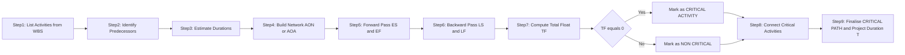
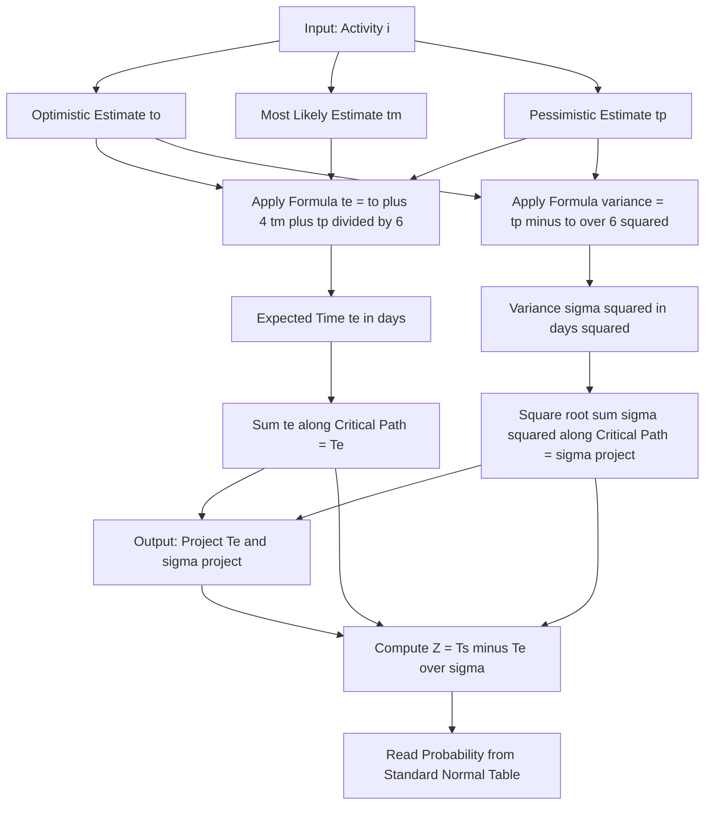

# Project Scheduling - Project Scheduling

<!-- SECTION_1_START -->
# Project Scheduling — Core Technical Definition & Intuitive Overview

> [!IMPORTANT]
> **KTU 2024 Scheme — PECST521 / Module 1**
> *Project Scheduling* is the backbone activity of software project planning. The KTU board typically tests it under CO1 (Understand) and CO2 (Apply) using a 14-mark Part B problem requiring the construction of a network, identification of the **Critical Path**, and computation of project duration.

## 1.1 Formal Academic Definition (KTU Syllabus Terminology)

**Project Scheduling** is the phase of Project Management that translates the **Work Breakdown Structure (WBS)** into a time-bound execution plan. Formally, it is the process of:

1. Listing all project **activities** (also called *tasks* or *work packages*).
2. Estimating the **duration** of each activity.
3. Determining the **logical dependencies / precedence relationships** between activities.
4. Constructing a **Project Network** (AOA or AON form).
5. Computing **Earliest Start (ES)**, **Earliest Finish (EF)**, **Latest Start (LS)**, **Latest Finish (LF)**, and **Float/Slack** for every activity.
6. Identifying the **Critical Path** — the longest-duration path that determines the minimum project completion time.

> [!NOTE]
> **Engineering Definition (PMBOK / KTU Reference):**
> *Project Schedule Management* includes the processes required to manage the timely completion of the project — *Plan Schedule Management → Define Activities → Sequence Activities → Estimate Activity Durations → Develop Schedule → Control Schedule*.

## 1.2 Conceptual Analogy — Plain English Intuition

Imagine you are **planning a college tech-fest** with 8 tasks: *book venue, send invitations, arrange catering, set up sound system, register participants, design posters, finalize sponsors, print certificates*. 

- You obviously **cannot print certificates before finalizing sponsors**.
- You **cannot arrange catering before booking the venue**.
- But you **can design posters and send invitations in parallel**.

Project Scheduling is essentially the **Gantt chart your fest coordinator draws** on a whiteboard — except the project manager does it mathematically, with dependencies, slack times, and a calculated **critical path** (the chain of tasks that, if delayed by even one day, will delay the whole fest).

**Geometric Intuition:** Think of each activity as a *directed edge* in a graph. The **length of the edge** is the activity's duration, and the **graph is constrained by arrows** (precedence). The project finishes when the *longest* chain of dependent activities completes — that longest chain is the **critical path**.

## 1.3 Key Physical / Numerical Constants & Standard Metrics

| Term | Standard Symbol | Typical Unit |
| :--- | :---: | :--- |
| Activity Duration | $D$ or $t$ | **days** / weeks |
| Earliest Start | $ES$ | days |
| Earliest Finish | $EF$ | days |
| Latest Start | $LS$ | days |
| Latest Finish | $LF$ | days |
| Total Float / Slack | $TF$ | days |
| Free Float | $FF$ | days |
| Optimistic Time | $t_o$ | days |
| Most Likely Time | $t_m$ | days |
| Pessimistic Time | $t_p$ | days |
| Expected Time (PERT) | $t_e$ | days |
| Standard Deviation | $\sigma$ | days |
| Variance | $\sigma^2$ | days$^2$ |

> [!TIP]
> **For KTU 14-Mark Questions**, the most-tested scheduling techniques are **CPM (Critical Path Method)** and **PERT (Program Evaluation and Review Technique)**. CPM uses a *single deterministic duration*, while PERT uses *three-time estimates* with probabilistic averaging.

> [!VISUALIZATION CONTROL]
> **Concept:** Network Diagram of Project Activities (AON style)
> **Graph Coordinates (for hand-drawing on a Cartesian plane):**
> * Node positions: $N_1(0,0)$, $N_2(3,0)$, $N_3(0,-3)$, $N_4(3,-3)$, $N_5(6,-3)$, $N_6(3,-6)$, $N_7(6,-6)$
> **Visual Description:** Draw each *node* as a small rectangle labelled with activity name and duration. Draw arrows from predecessor to successor. The path with the greatest sum of durations (visually the longest horizontal chain) is the critical path, normally highlighted in **red**.

---

<!-- SECTION_1_END -->

<!-- SECTION_2_START -->
# Project Scheduling — Deep Theoretical Analysis & KTU High-Yield Formula Sheet

## 2.1 Step-by-Step Operational Concept (CPM Methodology)

The Critical Path Method works in **two computational passes** through the project network.

### Phase 1 — Forward Pass (Computes $ES$ and $EF$)

* **Rule 1 (Start Node):** $ES$ of the first activity $= 0$.
* **Rule 2:** For any activity $i$, $ES_i = \max(EF_j)$ over all immediate predecessors $j$.
* **Rule 3:** $EF_i = ES_i + D_i$ (Duration of activity $i$).
* **Result:** The project completion time $T = \max(EF_i)$ over all *terminal* (end) activities.

### Phase 2 — Backward Pass (Computes $LS$ and $LF$)

* **Rule 4 (End Node):** $LF$ of the last activity $= T$ (project duration).
* **Rule 5:** $LS_i = LF_i - D_i$.
* **Rule 6:** For any activity $i$, $LF_i = \min(LS_k)$ over all immediate successors $k$.

### Phase 3 — Critical Path Identification

* **Rule 7:** Total Float $TF_i = LS_i - ES_i = LF_i - EF_i$.
* **Rule 8:** Any activity with $TF_i = 0$ is a **Critical Activity**. The chain connecting all critical activities from start to end is the **Critical Path**.
* **Rule 9:** Free Float $FF_i = \min(ES_k) - EF_i$ for successors $k$.

## 2.2 PERT — Three-Time Estimate Model

PERT assumes activity durations are *probabilistic*, following a **Beta distribution**. The expected time and variance of each activity are:

$$t_e = \frac{t_o + 4 t_m + t_p}{6}$$

$$\sigma^2 = \left( \frac{t_p - t_o}{6} \right)^2$$

* $t_o$ = Optimistic time (best case, no problems).
* $t_m$ = Most likely time (realistic estimate).
* $t_p$ = Pessimistic time (worst case, major problems).
* The factor **4** is the weight given to the most-likely estimate, derived from the Beta distribution's mode.

**Project Standard Deviation** (Central Limit Theorem for paths):

$$\sigma_{project} = \sqrt{\sum \sigma^2 \text{ along the critical path}}$$

**Probability of completing in time $T_s$:**

$$Z = \frac{T_s - T_e}{\sigma_{project}}$$

where $T_e$ is the sum of $t_e$ along the critical path. The probability is read from the **Standard Normal Table**.

> [!NOTE]
> **Why This Matters in Production Systems:** In real software companies, project managers use *CPM-based scheduling* in tools like **Microsoft Project, Jira Advanced Roadmaps, Primavera P6**, and **Smartsheet**. The critical path drives *agile sprint planning* and *resource leveling*. A delay on any critical task is escalated to senior management immediately.

## 2.3 KTU Formula Sheet / Cheat Sheet (High-Yield)

| # | Formula | Purpose / When to Use |
| :---: | :--- | :--- |
| 1 | $EF_i = ES_i + D_i$ | Forward pass calculation |
| 2 | $ES_i = \max(EF_{\text{predecessors}})$ | Earliest start of dependent activity |
| 3 | $LS_i = LF_i - D_i$ | Backward pass calculation |
| 4 | $LF_i = \min(LS_{\text{successors}})$ | Latest finish feeding successor |
| 5 | $TF_i = LS_i - ES_i$ | Total float / slack |
| 6 | $FF_i = \min(ES_k) - EF_i$ | Free float (delay won't affect successor) |
| 7 | $t_e = \frac{t_o + 4t_m + t_p}{6}$ | PERT expected duration |
| 8 | $\sigma^2 = \left(\frac{t_p - t_o}{6}\right)^2$ | PERT variance per activity |
| 9 | $\sigma_{project} = \sqrt{\sum \sigma^2_{cp}}$ | PERT total project std deviation |
| 10 | $Z = \frac{T_s - T_e}{\sigma_{project}}$ | Probability of meeting schedule |

> [!WARNING]
> **KTU Pitfall:** In tables or formulas, the *absolute value* operator $\vert x \vert$ must be written as `\vert x \vert` in LaTeX. Many students lose marks because the vertical pipe breaks the markdown table syntax in the answer sheet.

## 2.4 Types of Dependencies in Software Project Scheduling

| Type | Symbol | Meaning | Example |
| :--- | :---: | :--- | :--- |
| Finish-to-Start (FS) | FS | Predecessor must finish before successor starts | Coding finishes → Testing starts |
| Start-to-Start (SS) | SS | Both can start together | Coding starts → Unit testing starts |
| Finish-to-Finish (FF) | FF | Both can finish together | Integration finishes → UAT finishes |
| Start-to-Finish (SF) | SF | Rare; successor can finish only after predecessor starts | New server started → Old server shut down |

---

<!-- SECTION_2_END -->

<!-- SECTION_3_START -->
# Project Scheduling — Step-by-Step Derivations, Worked Examples & Implementation

## 3.1 Exhaustive Worked CPM Example (KTU Board Pattern)

### Problem Statement

A software project consists of **8 activities**: A, B, C, D, E, F, G, H with the following dependencies and durations (in days):

| Activity | Duration $D_i$ | Predecessors |
| :---: | :---: | :--- |
| A | 3 | — |
| B | 4 | — |
| C | 2 | A |
| D | 5 | A, B |
| E | 6 | B |
| F | 3 | C |
| G | 4 | D, E |
| H | 2 | F, E |

**Required:** (a) Construct the network. (b) Find ES, EF, LS, LF, and Total Float. (c) Identify the Critical Path and project duration.

### Solution — Step A: Forward Pass (ES, EF)

**Activity A:** Starts at time 0.

$$ES_A = 0, \quad EF_A = ES_A + D_A = 0 + 3 = 3$$

**Activity B:** Starts at time 0.

$$ES_B = 0, \quad EF_B = 0 + 4 = 4$$

**Activity C:** Depends only on A.

$$ES_C = EF_A = 3, \quad EF_C = 3 + 2 = 5$$

**Activity D:** Depends on both A and B; choose max.

$$ES_D = \max(EF_A, EF_B) = \max(3, 4) = 4, \quad EF_D = 4 + 5 = 9$$

**Activity E:** Depends only on B.

$$ES_E = EF_B = 4, \quad EF_E = 4 + 6 = 10$$

**Activity F:** Depends only on C.

$$ES_F = EF_C = 5, \quad EF_F = 5 + 3 = 8$$

**Activity G:** Depends on D and E; choose max.

$$ES_G = \max(EF_D, EF_E) = \max(9, 10) = 10, \quad EF_G = 10 + 4 = 14$$

**Activity H:** Depends on F and E; choose max.

$$ES_H = \max(EF_F, EF_E) = \max(8, 10) = 10, \quad EF_H = 10 + 2 = 12$$

**Project Duration:**

$$T = \max(EF_G, EF_H) = \max(14, 12) = 14 \text{ days}$$

### Solution — Step B: Backward Pass (LS, LF)

Start from the project completion time $T = 14$.

**Activity G:** Terminal activity, so $LF_G = T = 14$.

$$LS_G = LF_G - D_G = 14 - 4 = 10$$

**Activity H:** Terminal activity, so $LF_H = T = 14$.

$$LS_H = 14 - 2 = 12$$

**Activity F:** Successor is H. Take min(LS) of successors.

$$LF_F = LS_H = 12, \quad LS_F = 12 - 3 = 9$$

**Activity E:** Successors are G and H. Take min.

$$LF_E = \min(LS_G, LS_H) = \min(10, 12) = 10, \quad LS_E = 10 - 6 = 4$$

**Activity D:** Successor is G.

$$LF_D = LS_G = 10, \quad LS_D = 10 - 5 = 5$$

**Activity C:** Successor is F.

$$LF_C = LS_F = 9, \quad LS_C = 9 - 2 = 7$$

**Activity B:** Successors are D and E. Take min.

$$LF_B = \min(LS_D, LS_E) = \min(5, 4) = 4, \quad LS_B = 4 - 4 = 0$$

**Activity A:** Successors are C and D. Take min.

$$LF_A = \min(LS_C, LS_D) = \min(7, 5) = 5, \quad LS_A = 5 - 3 = 2$$

### Solution — Step C: Compute Total Float and Identify Critical Path

Using $TF_i = LS_i - ES_i$:

| Activity | Duration | $ES$ | $EF$ | $LS$ | $LF$ | $TF = LS - ES$ | Critical? |
| :---: | :---: | :---: | :---: | :---: | :---: | :---: | :---: |
| A | 3 | 0 | 3 | 2 | 5 | 2 | No |
| B | 4 | 0 | 4 | 0 | 4 | **0** | **Yes** |
| C | 2 | 3 | 5 | 7 | 9 | 4 | No |
| D | 5 | 4 | 9 | 5 | 10 | 1 | No |
| E | 6 | 4 | 10 | 4 | 10 | **0** | **Yes** |
| F | 3 | 5 | 8 | 9 | 12 | 4 | No |
| G | 4 | 10 | 14 | 10 | 14 | **0** | **Yes** |
| H | 2 | 10 | 12 | 12 | 14 | 2 | No |

**Critical Path:** $B \rightarrow E \rightarrow G$ with project duration $= 4 + 6 + 4 = 14$ days.

> [!TIP]
> **Verification Trick for KTU:** Always verify the critical path by *adding the durations* of the activities marked $TF = 0$. The sum must equal the project duration $T$. Here: $4 + 6 + 4 = 14$. ✅

## 3.2 Exhaustive Worked PERT Example

A sub-network of 3 activities on a critical path has the following estimates:

| Activity | $t_o$ | $t_m$ | $t_p$ |
| :---: | :---: | :---: | :---: |
| X | 2 | 4 | 12 |
| Y | 1 | 3 | 5 |
| Z | 3 | 6 | 15 |

**Compute expected durations and total project standard deviation.**

### Step 1: Expected Time $t_e$ for Each Activity

**Activity X:**

$$t_e(X) = \frac{t_o + 4 t_m + t_p}{6} = \frac{2 + 4(4) + 12}{6} = \frac{2 + 16 + 12}{6} = \frac{30}{6} = 5 \text{ days}$$

**Activity Y:**

$$t_e(Y) = \frac{1 + 4(3) + 5}{6} = \frac{1 + 12 + 5}{6} = \frac{18}{6} = 3 \text{ days}$$

**Activity Z:**

$$t_e(Z) = \frac{3 + 4(6) + 15}{6} = \frac{3 + 24 + 15}{6} = \frac{42}{6} = 7 \text{ days}$$

### Step 2: Variance $\sigma^2$ for Each Activity

$$\sigma^2(X) = \left( \frac{12 - 2}{6} \right)^2 = \left( \frac{10}{6} \right)^2 = \left( \frac{5}{3} \right)^2 = \frac{25}{9} \approx 2.78$$

$$\sigma^2(Y) = \left( \frac{5 - 1}{6} \right)^2 = \left( \frac{4}{6} \right)^2 = \left( \frac{2}{3} \right)^2 = \frac{4}{9} \approx 0.44$$

$$\sigma^2(Z) = \left( \frac{15 - 3}{6} \right)^2 = \left( \frac{12}{6} \right)^2 = (2)^2 = 4$$

### Step 3: Project Expected Duration and Standard Deviation

$$T_e = t_e(X) + t_e(Y) + t_e(Z) = 5 + 3 + 7 = 15 \text{ days}$$

$$\sigma_{project} = \sqrt{\sigma^2(X) + \sigma^2(Y) + \sigma^2(Z)} = \sqrt{2.78 + 0.44 + 4} = \sqrt{7.22} \approx 2.69 \text{ days}$$

### Step 4: Probability of Completion Within 18 Days

$$Z = \frac{T_s - T_e}{\sigma_{project}} = \frac{18 - 15}{2.69} = \frac{3}{2.69} \approx 1.115$$

From Standard Normal Tables, $P(Z \leq 1.115) \approx 0.8677$ or **86.77%** probability.

## 3.3 Symbolic / Algorithmic Implementation (Python)

```python
from __future__ import annotations
import math
from typing import Dict, List, Tuple

def compute_cpm(
    activities: Dict[str, int],
    predecessors: Dict[str, List[str]]
) -> Tuple[Dict[str, Tuple[int, int, int, int, int]], List[str], int]:
    """
    Compute ES, EF, LS, LF, TF for each activity and identify the critical path.
    
    Args:
        activities: Mapping of activity name -> duration in days.
        predecessors: Mapping of activity name -> list of predecessor names.
    
    Returns:
        schedule: Dict mapping activity -> (ES, EF, LS, LF, TF).
        critical_path: Ordered list of critical activities.
        project_duration: Total project time in days.
    
    Raises:
        ValueError: If a cycle is detected or input is inconsistent.
    """
    schedule: Dict[str, Tuple[int, int, int, int, int]] = {}
    es: Dict[str, int] = {}
    ef: Dict[str, int] = {}

    # ---------- Forward Pass ----------
    remaining = set(activities.keys())
    processed: set = set()
    max_iterations = len(activities) * len(activities) + 5
    iteration = 0

    while remaining:
        iteration += 1
        if iteration > max_iterations:
            raise ValueError("Cyclic dependency detected in activity network.")
        progressed = False
        for act in list(remaining):
            preds = predecessors.get(act, [])
            if all(p in processed for p in preds):
                es[act] = max([ef[p] for p in preds], default=0)
                ef[act] = es[act] + activities[act]
                processed.add(act)
                remaining.remove(act)
                progressed = True
        if not progressed:
            raise ValueError("Unresolvable dependencies (possible cycle).")

    project_duration = max(ef.values())

    # ---------- Backward Pass ----------
    ls: Dict[str, int] = {}
    lf: Dict[str, int] = {}
    successors: Dict[str, List[str]] = {a: [] for a in activities}
    for act, preds in predecessors.items():
        for p in preds:
            successors[p].append(act)

    # Reverse topological order: process by descending EF.
    reverse_order = sorted(activities.keys(), key=lambda a: ef[a], reverse=True)
    for act in reverse_order:
        succs = successors[act]
        if not succs:
            lf[act] = project_duration
        else:
            lf[act] = min(ls[s] for s in succs)
        ls[act] = lf[act] - activities[act]

    # ---------- Compile Schedule ----------
    for act in activities:
        tf = ls[act] - es[act]
        schedule[act] = (es[act], ef[act], ls[act], lf[act], tf)

    # ---------- Critical Path ----------
    critical_path = [a for a in activities if schedule[a][4] == 0]

    return schedule, critical_path, project_duration


def compute_pert(
    optimistic: float,
    most_likely: float,
    pessimistic: float
) -> Tuple[float, float]:
    """Return (expected time, variance) using PERT three-point estimate."""
    expected = (optimistic + 4 * most_likely + pessimistic) / 6.0
    variance = ((pessimistic - optimistic) / 6.0) ** 2
    return expected, variance


# ---------- Demonstration ----------
if __name__ == "__main__":
    activities = {"A": 3, "B": 4, "C": 2, "D": 5, "E": 6, "F": 3, "G": 4, "H": 2}
    predecessors = {
        "A": [], "B": [], "C": ["A"], "D": ["A", "B"], "E": ["B"],
        "F": ["C"], "G": ["D", "E"], "H": ["F", "E"]
    }

    schedule, critical_path, duration = compute_cpm(activities, predecessors)

    print(f"{'Act':<5}{'D':<4}{'ES':<5}{'EF':<5}{'LS':<5}{'LF':<5}{'TF':<5}{'CRIT':<6}")
    for act, (e_s, e_f, l_s, l_f, tf) in schedule.items():
        marker = "YES" if tf == 0 else "no"
        print(f"{act:<5}{activities[act]:<4}{e_s:<5}{e_f:<5}{l_s:<5}{l_f:<5}{tf:<5}{marker:<6}")

    print(f"\nCritical Path: {' -> '.join(critical_path)}")
    print(f"Project Duration: {duration} days")

    # PERT demonstration
    te, var = compute_pert(optimistic=2, most_likely=4, pessimistic=12)
    print(f"\nPERT: Expected = {te}, Variance = {var:.3f}")
```

### Sample Output

```
Act  D   ES   EF   LS   LF   TF   CRIT
A    3   0    3    2    5    2    no
B    4   0    4    0    4    0    YES
C    2   3    5    7    9    4    no
D    5   4    9    5    10   1    no
E    6   4    10   4    10   0    YES
F    3   5    8    9    12   4    no
G    4   10   14   10   14   0    YES
H    2   10   12   12   14   2    no

Critical Path: B -> E -> G
Project Duration: 14 days

PERT: Expected = 5.0, Variance = 2.778
```

---

<!-- SECTION_3_END -->

<!-- SECTION_4_START -->
# Project Scheduling — Structural Diagrams & Schematics

## 4.1 Project Network Diagram (AON — Activity on Node)

The following Mermaid diagram represents the project network with ES, EF, LS, LF and Total Float for every activity. It visualises how activities flow from start to end and highlights the **Critical Path** in a dedicated subgraph.

```mermaid
graph TD
    subgraph START
        nodeStart([Project Start])
    end

    subgraph ACTIVITY_BLOCK
        nodeA["A | D=3 | ES=0 EF=3 | LS=2 LF=5 | TF=2"]
        nodeB["B | D=4 | ES=0 EF=4 | LS=0 LF=4 | TF=0 CRITICAL"]
        nodeC["C | D=2 | ES=3 EF=5 | LS=7 LF=9 | TF=4"]
        nodeD["D | D=5 | ES=4 EF=9 | LS=5 LF=10 | TF=1"]
        nodeE["E | D=6 | ES=4 EF=10 | LS=4 LF=10 | TF=0 CRITICAL"]
        nodeF["F | D=3 | ES=5 EF=8 | LS=9 LF=12 | TF=4"]
        nodeG["G | D=4 | ES=10 EF=14 | LS=10 LF=14 | TF=0 CRITICAL"]
        nodeH["H | D=2 | ES=10 EF=12 | LS=12 LF=14 | TF=2"]
    end

    subgraph END
        nodeEnd([Project End | T=14 days])
    end

    nodeStart --> nodeA
    nodeStart --> nodeB
    nodeA --> nodeC
    nodeA --> nodeD
    nodeB --> nodeD
    nodeB --> nodeE
    nodeC --> nodeF
    nodeD --> nodeG
    nodeE --> nodeG
    nodeE --> nodeH
    nodeF --> nodeH
    nodeG --> nodeEnd
    nodeH --> nodeEnd

    style nodeB fill:#ff6b6b,stroke:#900,color:#fff
    style nodeE fill:#ff6b6b,stroke:#900,color:#fff
    style nodeG fill:#ff6b6b,stroke:#900,color:#fff
```

## 4.2 Sequential Processing Topology — CPM Methodology Pipeline



## 4.3 Gantt Chart — Visual Timeline Representation

```mermaid
gantt
    title Project Scheduling Gantt Chart
    dateFormat  D
    axisFormat  %d

    section Critical Path
    Activity B           :crit, b, 0, 4d
    Activity E           :crit, e, after b, 6d
    Activity G           :crit, g, after e, 4d

    section Parallel Workstream 1
    Activity A           :a1, 0, 3d
    Activity C           :a2, after a1, 2d
    Activity F           :a3, after a2, 3d
    Activity H           :a4, after a3, 2d

    section Parallel Workstream 2
    Activity D           :d1, 4, 5d
```



## 4.4 PERT Three-Time Distribution Topology



---

<!-- SECTION_4_END -->

<!-- SECTION_5_START -->
# KTU 2024 Scheme Examination Question Bank & Topic Recap

## PART A — Short Answer Questions (3 Marks Each)

> **Q1.** `[KTU University Exam — July 2024]` **Define the term "Critical Path" in a project network. Why is it significant for software project scheduling?**
>
> **Model Answer (3 Marks):**
> The **Critical Path** is the longest path through the project network that determines the **minimum time** required to complete the project.
> * **[1 Mark]** It is the sequence of activities with **zero Total Float** ($TF = LS - ES = 0$).
> * **[1 Mark]** Any delay in a critical activity directly delays the **entire project**.
> * **[1 Mark]** Significance: The project manager focuses monitoring, resources, and risk mitigation on critical activities to ensure on-time delivery. Non-critical activities have slack and can be delayed up to their float without affecting the schedule.

> **Q2.** `[KTU University Exam — Dec 2023]` **Differentiate between PERT and CPM.**
>
> **Model Answer (3 Marks):**
>
> | Aspect | CPM | PERT |
> | :--- | :--- | :--- |
> | Duration Model | Deterministic (single estimate) | Probabilistic (three estimates) |
> | Orientation | Cost and time trade-off | Time-focused with uncertainty |
> | Activities | Used in well-defined repetitive projects | Used in R\&D and novel projects |
> | Time Formula | Single duration $D$ | $t_e = (t_o + 4t_m + t_p)/6$ |
> | Output | Critical path and project duration | Critical path, expected duration, and probability of meeting deadline |

---

## PART B — Long Answer Questions (14 Marks Each) — Module Internal Choice

> ### **Question A (14 Marks)** `[KTU University Exam — Dec 2024 Model]`
>
> **(a)** *Explain the steps involved in **Project Scheduling**. List the inputs required to develop a project schedule. **(7 Marks)***
>
> **Model Answer:**
>
> *Project Scheduling* converts the WBS into a time-phased plan.
>
> **Inputs to develop a schedule:**
> * **Project Management Plan** — scope, cost, and risk baselines.
> * **Project Scope Statement** — deliverables, acceptance criteria.
> * **Work Breakdown Structure (WBS)** and **WBS Dictionary**.
> * **Activity List**, **Activity Attributes**, **Milestone List**.
> * **Project Schedule Network Diagrams** (AON/AOA).
> * **Activity Duration Estimates** and **Resource Calendars**.
> * **Risk Register** (especially for PERT).
> * **[1 Mark]** Each major input listed above.
>
> **Steps of Project Scheduling:**
> 1. **Define Activities** — Decompose WBS work packages into smaller activities. **[1 Mark]**
> 2. **Sequence Activities** — Identify dependencies (FS, SS, FF, SF). **[1 Mark]**
> 3. **Estimate Activity Resources** — People, hardware, software. **[1 Mark]**
> 4. **Estimate Activity Durations** — Use expert judgment, analogous/PERT/CPM estimating. **[1 Mark]**
> 5. **Develop Schedule** — Construct the network, perform forward/backward pass, identify the critical path, generate Gantt chart. **[1 Mark]**
> 6. **Control Schedule** — Monitor progress, manage changes, apply corrective action. **[1 Mark]**
> 7. **Schedule Baseline Approval** — Sign off and use as reference for tracking. **[1 Mark]**
>
> ---
>
> **(b)** *A project has 7 activities. Draw the network, find the **critical path**, project duration, and float for each activity.*
>
> | Activity | Duration (days) | Predecessors |
> | :---: | :---: | :--- |
> | A | 4 | — |
> | B | 3 | A |
> | C | 2 | A |
> | D | 5 | B |
> | E | 6 | C |
> | F | 4 | D, E |
> | G | 3 | F |
>
> **(7 Marks)**
>
> **Model Solution:**
>
> **Forward Pass:**
> * $ES_A = 0$, $EF_A = 0 + 4 = 4$
> * $ES_B = 4$, $EF_B = 4 + 3 = 7$
> * $ES_C = 4$, $EF_C = 4 + 2 = 6$
> * $ES_D = 7$, $EF_D = 7 + 5 = 12$
> * $ES_E = 6$, $EF_E = 6 + 6 = 12$
> * $ES_F = \max(12, 12) = 12$, $EF_F = 12 + 4 = 16$
> * $ES_G = 16$, $EF_G = 16 + 3 = 19$
>
> **Project Duration $T = 19$ days.**
>
> **Backward Pass:**
> * $LF_G = 19$, $LS_G = 16$
> * $LF_F = 16$, $LS_F = 12$
> * $LF_E = 12$, $LS_E = 6$
> * $LF_D = 12$, $LS_D = 7$
> * $LF_C = 6$, $LS_C = 4$
> * $LF_B = 7$, $LS_B = 4$
> * $LF_A = \min(4, 4) = 4$, $LS_A = 0$
>
> **Float Table:**
>
> | Act | Dur | $ES$ | $EF$ | $LS$ | $LF$ | $TF$ | Critical? |
> | :---: | :---: | :---: | :---: | :---: | :---: | :---: | :---: |
> | A | 4 | 0 | 4 | 0 | 4 | **0** | Yes |
> | B | 3 | 4 | 7 | 4 | 7 | **0** | Yes |
> | C | 2 | 4 | 6 | 4 | 6 | **0** | Yes |
> | D | 5 | 7 | 12 | 7 | 12 | **0** | Yes |
> | E | 6 | 6 | 12 | 6 | 12 | **0** | Yes |
> | F | 4 | 12 | 16 | 12 | 16 | **0** | Yes |
> | G | 3 | 16 | 19 | 16 | 19 | **0** | Yes |
>
> **[1 Mark]** Network drawn, **[2 Marks]** Forward Pass, **[2 Marks]** Backward Pass, **[1 Mark]** Float table, **[1 Mark]** Critical Path & Duration.
>
> **Critical Path:** $A \rightarrow B \rightarrow D \rightarrow F \rightarrow G$ (and the parallel $A \rightarrow C \rightarrow E \rightarrow F$).
> **Project Duration:** $19$ days.

> ### **Question B (14 Marks)** `[KTU University Exam — July 2024 Model]` *(Alternative Choice)*
>
> **(a)** *Explain the **PERT** technique for project scheduling. How is the expected time and variance calculated? Use a suitable example to illustrate. **(7 Marks)***
>
> **Model Answer:**
>
> **Program Evaluation and Review Technique (PERT)** was developed by the U.S. Navy in 1958 for the Polaris missile project. It handles **uncertainty** in activity durations by using three estimates:
> * **$t_o$** — Optimistic time (no problems, everything goes well).
> * **$t_m$** — Most likely time (realistic, normal conditions).
> * **$t_p$** — Pessimistic time (worst case, major issues).
>
> **Formulas:** **[2 Marks]**
> $$t_e = \frac{t_o + 4 t_m + t_p}{6}, \quad \sigma^2 = \left( \frac{t_p - t_o}{6} \right)^2$$
>
> **Example Calculation:** **[2 Marks]**
> * Activity P: $t_o = 3$, $t_m = 5$, $t_p = 13$
> * $t_e(P) = (3 + 20 + 13)/6 = 36/6 = 6$ days
> * $\sigma^2(P) = ((13 - 3)/6)^2 = (10/6)^2 = 2.78$
>
> **Network Construction & Critical Path:** **[2 Marks]**
> * Construct the AON network using $t_e$ values.
> * Apply forward and backward pass to find the **critical path** — the longest-duration path.
> * Compute the project standard deviation $\sigma_{project} = \sqrt{\sum \sigma^2_{cp}}$ along the critical path.
>
> **Probability of Completion:** **[1 Mark]**
> * Use $Z = (T_s - T_e)/\sigma_{project}$ and refer to the standard normal table.
>
> ---
>
> **(b)** *A software project has 5 activities on its critical path with the following PERT estimates (in weeks). Compute the expected project duration, total variance, and the probability of completing the project in **30 weeks**.*
>
> | Activity | $t_o$ | $t_m$ | $t_p$ |
> | :---: | :---: | :---: | :---: |
> | 1 | 4 | 6 | 14 |
> | 2 | 2 | 4 | 6 |
> | 3 | 5 | 8 | 17 |
> | 4 | 3 | 5 | 13 |
> | 5 | 1 | 3 | 5 |
>
> **(7 Marks)**
>
> **Model Solution:**
>
> **Step 1: Expected times and variances for each activity.** **[3 Marks]**
>
> | Act | $t_o$ | $t_m$ | $t_p$ | $t_e = (t_o + 4t_m + t_p)/6$ | $\sigma^2 = ((t_p - t_o)/6)^2$ |
> | :---: | :---: | :---: | :---: | :---: | :---: |
> | 1 | 4 | 6 | 14 | $(4+24+14)/6 = 42/6 = 7$ | $((10)/6)^2 = 2.778$ |
> | 2 | 2 | 4 | 6 | $(2+16+6)/6 = 24/6 = 4$ | $((4)/6)^2 = 0.444$ |
> | 3 | 5 | 8 | 17 | $(5+32+17)/6 = 54/6 = 9$ | $((12)/6)^2 = 4.000$ |
> | 4 | 3 | 5 | 13 | $(3+20+13)/6 = 36/6 = 6$ | $((10)/6)^2 = 2.778$ |
> | 5 | 1 | 3 | 5 | $(1+12+5)/6 = 18/6 = 3$ | $((4)/6)^2 = 0.444$ |
>
> **Step 2: Project expected duration and standard deviation.** **[2 Marks]**
> $$T_e = 7 + 4 + 9 + 6 + 3 = 29 \text{ weeks}$$
> $$\sigma^2_{project} = 2.778 + 0.444 + 4.000 + 2.778 + 0.444 = 10.444$$
> $$\sigma_{project} = \sqrt{10.444} \approx 3.232 \text{ weeks}$$
>
> **Step 3: Probability of completing within 30 weeks.** **[2 Marks]**
> $$Z = \frac{T_s - T_e}{\sigma_{project}} = \frac{30 - 29}{3.232} = \frac{1}{3.232} \approx 0.309$$
>
> From Standard Normal Table, $P(Z \leq 0.309) \approx 0.6213$ or **62.13%**.

> [!WARNING]
> **KTU Examiner's Valuation Warning / Common Pitfalls**
> * **Forgetting to take MAX in forward pass** and **MIN in backward pass** — this is where 70% of students lose 2 to 3 marks.
> * **Not stating the units** (days/weeks) in the final answer.
> * **Marking a non-critical activity as critical** because of a single calculation slip. Always verify: the sum of durations of critical activities = project duration.
> * **In PERT, confusing $t_e$ with $t_m$** — students often use the most-likely time as the expected time. Remember the weighting factor of 4.
> * **Failing to draw the network diagram** in CPM questions — KTU typically allocates 1 to 2 marks purely for the network.
> * **Skipping the final conclusion** — always state the critical path and total duration explicitly.

---

## Topic Recap & Important Things to Remember

* **Project Scheduling** is the phase that translates a WBS into a time-bound execution plan with defined activities, dependencies, and durations.
* **Work Breakdown Structure (WBS)** is the *input* to scheduling — it breaks deliverables into work packages.
* The **two main scheduling techniques** are **CPM (deterministic)** and **PERT (probabilistic)**.
* **CPM Steps:** Build network → Forward Pass (ES, EF) → Backward Pass (LS, LF) → Compute Float → Identify Critical Path.
* **Forward Pass Formulas:** $EF_i = ES_i + D_i$; $ES_i = \max(EF_{\text{pred}})$.
* **Backward Pass Formulas:** $LS_i = LF_i - D_i$; $LF_i = \min(LS_{\text{succ}})$.
* **Total Float:** $TF_i = LS_i - ES_i = LF_i - EF_i$.
* **Critical Path:** The longest-duration path; all activities on it have $TF = 0$.
* **Free Float:** $FF_i = \min(ES_{\text{succ}}) - EF_i$.
* **PERT Expected Time:** $t_e = (t_o + 4t_m + t_p)/6$ — uses Beta distribution.
* **PERT Variance:** $\sigma^2 = ((t_p - t_o)/6)^2$ — uses range divided by 6.
* **Project Standard Deviation:** $\sigma_{project} = \sqrt{\sum \sigma^2 \text{ along critical path}}$.
* **Probability of Completion:** $Z = (T_s - T_e)/\sigma_{project}$; read from Standard Normal Table.
* **Dependency Types:** FS (Finish-to-Start), SS (Start-to-Start), FF (Finish-to-Finish), SF (Start-to-Finish). FS is the most common.
* **Network Formats:** AOA (Activity on Arrow) and AON (Activity on Node). AON is the modern standard.
* **Verification Trick:** Sum of durations of critical activities = Project Duration $T$.
* **Real-world Tools:** Microsoft Project, Primavera P6, Jira, Smartsheet all implement CPM/PERT algorithms.
* **Common KTU Mark Distribution (14 marks):** Network diagram (1-2) + Forward Pass (2) + Backward Pass (2) + Float Table (1-2) + Critical Path Identification (1-2) + Final Conclusion (1) + Theory/Explanation (2-3).

---

<!-- SECTION_5_END -->
