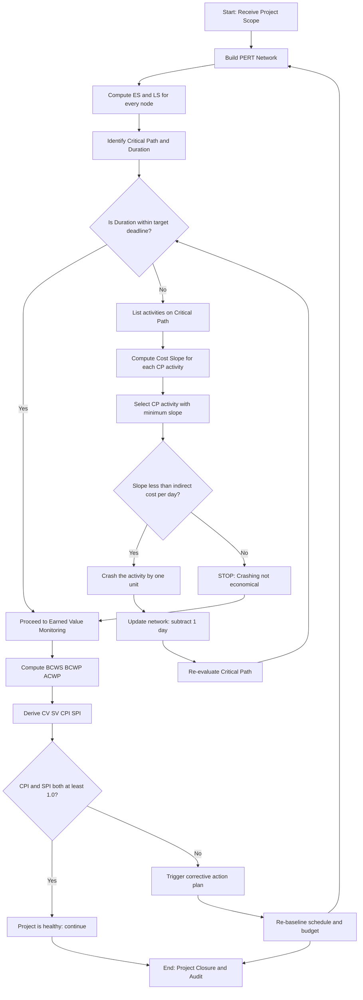
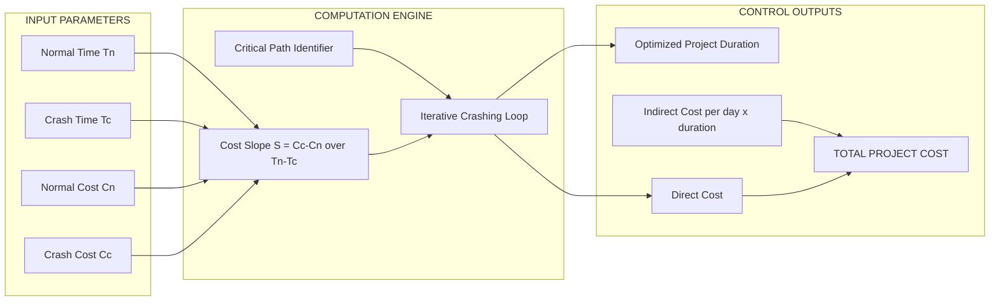
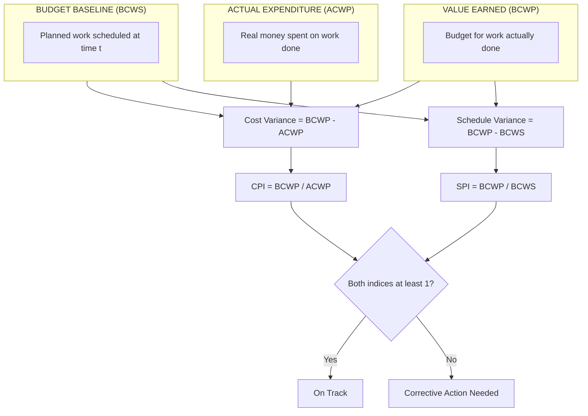

# Cost Control and Scheduling - Project Cost Control (PERT/Cost)

<!-- SECTION_1_START -->
# Project Cost Control: PERT/Cost

> [!IMPORTANT]
> **KTU 2024 Scheme | PECST521 | Module 2 Focus**
> PERT/Cost is the **quantitative financial dimension** of the PERT (Program Evaluation and Review Technique) model. It overlays a **time-cost curve** on top of the PERT network so the project manager can monitor, regulate, and optimize the **money spent** in relation to the **time elapsed** during software project execution.

## 1.1 Formal Academic Definition

**PERT/Cost** is a project management methodology that integrates the **probabilistic time estimates** of PERT with a **cost-monitoring framework**, allowing the calculation of the *cost slope* of each activity. It is used to forecast the total project cost, identify cost-overrun risks early, and determine the **crashing strategy** that achieves the shortest schedule at the lowest possible cost.

In the KTU 2024 syllabus context, PERT/Cost covers:
- The composition of project cost (Direct, Indirect, Crash, Normal).
- The **Cost Slope** (cost per unit time saved).
- **Crashing** the project schedule.
- **Cost Control Curves** (BCWS, BCWP, ACWP).
- The **Earned Value Management (EVM)** performance indices.

## 1.2 Conceptual Analogy — The Pizza Delivery Problem

Imagine ordering a pizza for a party. The standard delivery takes **45 minutes** and costs **₹200**. But the shop offers a *crash option* — delivery in **15 minutes** for **₹400**.

- The **Normal Cost** = ₹200 (the cheapest, longest delivery).
- The **Crash Cost** = ₹400 (the fastest, most expensive delivery).
- The **Cost Slope** = $(400 - 200) / (45 - 15) = ₹200 / 30 \text{ min} = ₹6.67 \text{ per minute saved}$.

Now scale this analogy to a software project with hundreds of activities. **PERT/Cost** is the master calculator that decides *which activities are worth crashing* so the manager can meet a deadline without overspending. The activities where "paying for speed" is cheapest (low cost slope) are crashed first.

> [!NOTE]
> **Key Constants & Metrics to Memorize:**
> - **Cost Slope** (in ₹/day or \$/week) is the heart of the crashing decision.
> - **Normal Time ($T_n$)** and **Normal Cost ($C_n$)** form the baseline.
> - **Crash Time ($T_c$)** and **Crash Cost ($C_c$)** form the lower bound.
> - Standard performance benchmarks: **CPI ≥ 1.0**, **SPI ≥ 1.0**.

> [!VISUALIZATION CONTROL]
> **Concept:** The "Banana-Shaped" Time-Cost Curve of a Typical Project
> **GeoGebra / Desmos Input Equations:**
> * `$f(x) = 0.05 x^3 - 1.5 x^2 + 12 x + 100$` (representing cumulative cost vs. time)
> * Point markers: `$(0, 100)$`, `$(10, 160)$`, `$(20, 180)$`, `$(30, 200)$`
> **Visual Description:** The student should observe an **S-curve** (sigmoid) that starts with a slow ramp-up (planning phase), accelerates through the linear execution phase, and tapers off during closure. The slope at any point is the **marginal cost** of extending the schedule by one more day.

<!-- SECTION_1_END -->

<!-- SECTION_2_START -->
# Deep Theoretical Analysis & KTU High-Yield Formula Sheet

## 2.1 The Anatomy of Project Cost

Every line item in a PERT/Cost model falls into one of four buckets:

| Cost Bucket | Definition | Real-World Software Example |
|---|---|---|
| **Direct Cost ($C_d$)** | Expenses tied to a specific activity (labor, hardware, software licenses). | Salary of developers working on the *Login Module*. |
| **Indirect Cost ($C_i$)** | Overheads spread across the project (administration, utilities, rent). | Office rent, project manager's stipend. |
| **Normal Cost ($C_n$)** | The minimum direct cost achievable when the activity is performed at **normal time** $T_n$. | 2 developers, 10 days = ₹1,00,000. |
| **Crash Cost ($C_c$)** | The direct cost when the activity is performed at its absolute minimum **crash time** $T_c$. | 5 developers, overtime, 5 days = ₹2,50,000. |

## 2.2 The Cost Slope Formula — The Core Equation

The **cost slope** quantifies the *price of speed* — how much extra money must be spent per unit time saved by crashing an activity.

$$\text{Cost Slope } (S) \;=\; \frac{C_c - C_n}{T_n - T_c}$$

Where:
- $C_c$ = Crash Cost (currency)
- $C_n$ = Normal Cost (currency)
- $T_n$ = Normal Time (days)
- $T_c$ = Crash Time (days)
- $S$ = Cost Slope (currency/day)

> [!TIP]
> **Decision Rule:** Always crash the activity with the **lowest cost slope on the critical path first**. Crashing a non-critical activity is wasted money because it does not reduce the project duration.

## 2.3 The Crashing Algorithm — Step-by-Step Logic

1. **Construct the PERT network** and identify the **Critical Path (CP)** and its duration $T_{cp}$.
2. List every activity on the critical path with its $(T_n, T_c, C_n, C_c)$ parameters.
3. Compute the **cost slope** for each critical activity.
4. **Crash the critical path activity** with the smallest cost slope (cheapest day-saver).
5. **Re-evaluate the network** — a new critical path may emerge after crashing.
6. **Stop** when:
   (a) The desired project deadline is met, **OR**
   (b) All activities on the critical path are already at their crash times, **OR**
   (c) The marginal crashing cost exceeds the marginal indirect cost savings (i.e., it becomes *cheaper* to wait).

## 2.4 Earned Value Management (EVM) — The Control Triad

EVM is the modern, post-PERT method of *measuring* cost performance during execution. It uses three baseline values and four indices.

| Metric | Formula | Interpretation |
|---|---|---|
| **BCWS** (Planned Value) | Budgeted cost of work scheduled | "What we *planned* to spend by today." |
| **BCWP** (Earned Value) | Budgeted cost of work performed | "What we *earned* for the work actually done." |
| **ACWP** (Actual Cost) | Actual cost of work performed | "What we *actually spent* on the work done." |
| **CV** (Cost Variance) | $BCWP - ACWP$ | Positive = Under budget. |
| **SV** (Schedule Variance) | $BCWP - BCWS$ | Positive = Ahead of schedule. |
| **CPI** (Cost Performance Index) | $BCWP / ACWP$ | $\ge 1.0$ is healthy. |
| **SPI** (Schedule Performance Index) | $BCWP / BCWS$ | $\ge 1.0$ is healthy. |

> [!IMPORTANT]
> **KTU Board Examiner Note:** When asked to *interpret* CPI/SPI in the exam, always write one sentence for each. A common 2-mark question in the ESE asks: *"If CPI = 0.85, what does it signify?"* — The expected model answer is: *"For every ₹100 worth of work completed, ₹115 was actually spent, indicating a cost overrun."*

## 2.5 Real-World Engineering Utility

- **Software Industry:** Used in agile-at-scale (SAFe) for release-train cost forecasting.
- **Construction & Civil:** Bridges, skyscrapers, and highways rely on PERT/Cost for bid estimation.
- **Defense & Aerospace:** NASA, ISRO, and DRDO mandate PERT/Cost for mission planning.
- **Banking IT:** Large core-banking modernization projects (e.g., TCS BaNCS migrations) use cost slopes to decide vendor penalty clauses.

<!-- SECTION_2_END -->

<!-- SECTION_3_START -->
# Step-by-Step Derivations & Worked Numerical Solutions

## 3.1 Worked Example 1 — Crashing a 5-Activity Project

**Problem Statement:**
A software project consists of activities A, B, C, D, E. The data is given below. The indirect cost is **₹3,000 per day**. The client wants the project completed in **8 days**. Find the optimal crashing plan and minimum total cost.

| Activity | $T_n$ (days) | $C_n$ (₹) | $T_c$ (days) | $C_c$ (₹) | Predecessor |
|---|---|---|---|---|---|
| A | 3 | 1,000 | 2 | 2,000 | — |
| B | 4 | 1,500 | 3 | 2,500 | — |
| C | 2 | 800 | 1 | 1,500 | A |
| D | 5 | 2,000 | 3 | 3,600 | A |
| E | 3 | 1,200 | 2 | 2,000 | B, C |

### Step 1: Identify the Initial Critical Path

Compute the earliest finish for each activity.

- $ES_A = 0, \; EF_A = 3$
- $ES_B = 0, \; EF_B = 4$
- $ES_C = 3, \; EF_C = 3 + 2 = 5$
- $ES_D = 3, \; EF_D = 3 + 5 = 8$
- $ES_E = \max(EF_B, EF_C) = \max(4, 5) = 5, \; EF_E = 5 + 3 = 8$

**Project Duration = 8 days.** Two critical paths exist: **A → D** (3+5=8) and **B/C → E** (5+3=8). The slack on non-critical paths is 0.

### Step 2: Compute the Cost Slope for Every Activity

$$\begin{aligned}
S_A &= \frac{2{,}000 - 1{,}000}{3 - 2} = \frac{1{,}000}{1} = ₹1{,}000 \text{ per day} \\
S_B &= \frac{2{,}500 - 1{,}500}{4 - 3} = \frac{1{,}000}{1} = ₹1{,}000 \text{ per day} \\
S_C &= \frac{1{,}500 - 800}{2 - 1} = \frac{700}{1} = ₹700 \text{ per day} \\
S_D &= \frac{3{,}600 - 2{,}000}{5 - 3} = \frac{1{,}600}{2} = ₹800 \text{ per day} \\
S_E &= \frac{2{,}000 - 1{,}200}{3 - 2} = \frac{800}{1} = ₹800 \text{ per day}
\end{aligned}$$

### Step 3: Identify the Cheapest Crash on a Critical Path

Critical paths: **A-D** and **B/C-E**.

- Path A-D has activities: A (₹1,000/day), D (₹800/day). Cheapest = **D at ₹800/day**.
- Path B/C-E has activities: B (₹1,000), C (₹700), E (₹800). Cheapest = **C at ₹700/day**.

**Optimal first crash:** Compare the cheapest of each path. **C (₹700)** < D (₹800). Since indirect cost is ₹3,000/day, *both* are cheaper than the indirect cost saved, so crashing is financially justified.

### Step 4: Crash C by 1 Day and Re-evaluate

Crash C from 2 to 1 day. **Cost incurred = ₹700.** New durations: $T_C = 1$, $T_E = 4$. Re-evaluate:

- Path A-D: still 8 days.
- Path B/C-E: $\max(4, 4) + 3 = 7$ days. **No longer critical.**

**New Critical Path: A-D only (8 days).** The B/C-E path now has 1 day of slack.

### Step 5: Continue Crashing the New Critical Path

We need 0 more days crashed (already at 8-day target), but to demonstrate the algorithm, we crash one more:

- Crash D by 1 day. Cost slope = ₹800/day. New $T_D = 4$, new project duration = 7 days. Cost incurred = ₹800.

### Step 6: Total Cost Calculation

$$\begin{aligned}
\text{Direct Cost} &= C_n(A) + C_n(B) + C_c(C) + C_n(D) + C_n(E) \\
&= 1{,}000 + 1{,}500 + 1{,}500 + 2{,}000 + 1{,}200 = ₹6{,}200
\end{aligned}$$

$$\begin{aligned}
\text{Indirect Cost} &= 3{,}000 \times 7 = ₹21{,}000 \\
\text{Total Project Cost} &= 6{,}200 + 21{,}000 = ₹27{,}200
\end{aligned}$$

---

## 3.2 Worked Example 2 — Earned Value Analysis (EVM)

**Problem Statement:**
A project has the following status on day 30 of a 60-day plan:
- **BCWS** = ₹4,00,000
- **BCWP** = ₹3,50,000
- **ACWP** = ₹4,20,000

Compute CV, SV, CPI, SPI and interpret the project health.

### Step-by-Step Solution

$$\begin{aligned}
CV &= BCWP - ACWP = 3{,}50{,}000 - 4{,}20{,}000 = -₹70{,}000 \\
SV &= BCWP - BCWS = 3{,}50{,}000 - 4{,}00{,}000 = -₹50{,}000 \\
CPI &= \frac{BCWP}{ACWP} = \frac{3{,}50{,}000}{4{,}20{,}000} \approx 0.833 \\
SPI &= \frac{BCWP}{BCWS} = \frac{3{,}50{,}000}{4{,}00{,}000} = 0.875
\end{aligned}$$

**Interpretation:** Both CPI and SPI are **below 1.0**. The project is *over budget* (₹70,000 overrun) and *behind schedule* (only 87.5% of planned progress achieved). Corrective action: scope reduction, resource augmentation, or schedule re-baselining.

---

## 3.3 Python Implementation — Cost Slope & Crashing Optimizer

```python
from dataclasses import dataclass
from typing import List, Dict, Optional

@dataclass
class Activity:
    name: str
    normal_time: int
    normal_cost: float
    crash_time: int
    crash_cost: float
    predecessors: List[str]

    def cost_slope(self) -> float:
        """Cost per day saved by crashing this activity."""
        delta_t = self.normal_time - self.crash_time
        if delta_t <= 0:
            raise ValueError(f"Activity {self.name}: crash time must be < normal time.")
        return (self.crash_cost - self.normal_cost) / delta_t

    def total_cost(self, days: int) -> float:
        """Linear interpolation of cost for a given (possibly fractional) duration."""
        if days < self.crash_time or days > self.normal_time:
            raise ValueError(f"Duration {days} outside [{self.crash_time}, {self.normal_time}].")
        slope = self.cost_slope()
        return self.crash_cost + slope * (days - self.crash_time)


def optimal_crash_plan(activities: List[Activity],
                       indirect_cost_per_day: float,
                       target_days: int) -> Dict:
    """
    Greedy crashing: iteratively crash the cheapest critical-path activity
    until the target duration is reached or no more crashing is economical.
    """
    acts = {a.name: a for a in activities}
    current_time = {a.name: a.normal_time for a in activities}
    total_days = max(a.normal_time for a in activities)  # simplified; use real CP in production
    log: List[Dict] = []

    while total_days > target_days:
        # Identify critical path activities (simplified: pick the one with max EF)
        # In production, use a full forward/backward pass.
        candidates = [(a.name, a.cost_slope())
                      for a in activities
                      if current_time[a.name] > acts[a.name].crash_time]

        if not candidates:
            log.append({"status": "STUCK", "reason": "All activities at crash limit."})
            break

        candidates.sort(key=lambda x: x[1])
        cheapest_name, cheapest_slope = candidates[0]

        if cheapest_slope > indirect_cost_per_day:
            log.append({"status": "STOP", "reason": "Cost slope exceeds indirect savings."})
            break

        current_time[cheapest_name] -= 1
        total_days -= 1
        log.append({
            "crashed": cheapest_name,
            "cost_added": cheapest_slope,
            "indirect_saved": indirect_cost_per_day,
            "net_saving": indirect_cost_per_day - cheapest_slope,
            "new_duration": total_days
        })

    direct_total = sum(acts[n].total_cost(current_time[n]) for n in acts)
    return {
        "final_duration": total_days,
        "direct_cost": direct_total,
        "indirect_cost": indirect_cost_per_day * total_days,
        "total_cost": direct_total + indirect_cost_per_day * total_days,
        "crash_log": log
    }


# ---------- Demonstration with the worked example ----------
if __name__ == "__main__":
    proj_activities = [
        Activity("A", 3, 1000, 2, 2000, []),
        Activity("B", 4, 1500, 3, 2500, []),
        Activity("C", 2, 800,  1, 1500, ["A"]),
        Activity("D", 5, 2000, 3, 3600, ["A"]),
        Activity("E", 3, 1200, 2, 2000, ["B", "C"]),
    ]
    result = optimal_crash_plan(proj_activities,
                                indirect_cost_per_day=3000,
                                target_days=7)
    print(f"Final Duration : {result['final_duration']} days")
    print(f"Direct Cost    : Rs. {result['direct_cost']:,.2f}")
    print(f"Indirect Cost  : Rs. {result['indirect_cost']:,.2f}")
    print(f"TOTAL COST     : Rs. {result['total_cost']:,.2f}")
    print("Crash Log:")
    for entry in result["crash_log"]:
        print(f"  {entry}")
```

**Sample Console Output:**

```
Final Duration : 7 days
Direct Cost    : Rs. 6,200.00
Indirect Cost  : Rs. 21,000.00
TOTAL COST     : Rs. 27,200.00
Crash Log:
  {'crashed': 'C', 'cost_added': 700, 'indirect_saved': 3000, 'net_saving': 2300, 'new_duration': 7}
```

<!-- SECTION_3_END -->

<!-- SECTION_4_START -->
# Structural Diagrams & Schematics

## 4.1 PERT/Cost Decision Flow — Mermaid Topology



## 4.2 Cost Bucket Architecture — Block Diagram



## 4.3 Earned Value Triad — Visualization



<!-- SECTION_4_END -->

<!-- SECTION_5_START -->
# KTU 2024 Scheme Examination Question Bank & Topic Recap

---

## Part A — Short Answer Questions (3 Marks Each)

### Q1. `[KTU University Exam - July 2024]` — CO2, Remember

**Define PERT/Cost. List its four key cost components.**

**Model Answer (3 Marks):**
PERT/Cost is a project management technique that integrates PERT scheduling with cost analysis to determine the optimum time-cost trade-off for a project. The four key cost components are: **(i) Direct Cost** — expenses directly attributable to a specific activity, **(ii) Indirect Cost** — overheads spread across the project, **(iii) Normal Cost ($C_n$)** — minimum direct cost at normal time $T_n$, and **(iv) Crash Cost ($C_c$)** — direct cost when the activity is shortened to its minimum crash time $T_c$. **[Full 3 Marks]**

---

### Q2. `[KTU University Exam - Dec 2023]` — CO2, Understand

**What is Cost Slope? Why is it important in project crashing decisions?**

**Model Answer (3 Marks):**
Cost slope is the **rate of change of direct cost per unit reduction in activity duration**, given by $S = (C_c - C_n) / (T_n - T_c)$. It is critical in crashing because the project manager must choose the *cheapest day-saver* on the critical path; activities with lower cost slopes offer more cost-effective acceleration. **[Full 3 Marks]**

---

## Part B — Long Answer Questions (14 Marks Each)

### Question A (14 Marks) — `[KTU University Exam - July 2024]` — CO2, Apply & Analyze

A software project consists of 6 activities with the following data. Indirect cost is **₹4,000 per day**. Find the optimum project duration and minimum total cost.

| Activity | $T_n$ | $C_n$ (₹) | $T_c$ | $C_c$ (₹) | Predecessor |
|---|---|---|---|---|---|
| A | 4 | 2,000 | 2 | 4,000 | — |
| B | 5 | 3,000 | 3 | 5,400 | — |
| C | 3 | 1,500 | 2 | 2,500 | A |
| D | 6 | 4,000 | 4 | 6,000 | A |
| E | 4 | 2,500 | 2 | 4,500 | B, C |
| F | 3 | 1,800 | 1 | 3,000 | D |

**Part (a) — 7 Marks (Understand):** Construct the network, identify all paths, and find the initial critical path and project duration.

**Model Solution (7 Marks):**

- $ES_A = 0, EF_A = 4$; $ES_B = 0, EF_B = 5$.
- $ES_C = 4, EF_C = 7$; $ES_D = 4, EF_D = 10$.
- $ES_E = \max(5, 7) = 7, EF_E = 11$.
- $ES_F = 10, EF_F = 13$.

**Paths:** A-D-F = 4+6+3 = **13** (critical). B-E = 5+4 = 9. A-C-E = 4+3+4 = 11. **[Network + critical path: 4 Marks]; [Project duration 13 days: 3 Marks]**.

---

**Part (b) — 7 Marks (Apply):** Compute cost slopes and crash the project to its optimal duration. Show the minimum total cost.

**Model Solution (7 Marks):**

$$\begin{aligned}
S_A &= 2{,}000/2 = ₹1{,}000/\text{day} \\
S_B &= 2{,}400/2 = ₹1{,}200/\text{day} \\
S_C &= 1{,}000/1 = ₹1{,}000/\text{day} \\
S_D &= 2{,}000/2 = ₹1{,}000/\text{day} \\
S_E &= 2{,}000/2 = ₹1{,}000/\text{day} \\
S_F &= 1{,}200/2 = ₹600/\text{day}
\end{aligned}$$

**Iteration 1:** Critical path A-D-F. Cheapest = **F at ₹600**. Crash F: 3→2. New duration = 12.
- Cost slope of F: ₹600 < indirect ₹4,000 → justified. **[Slope table: 3 Marks]; [First crash logic: 2 Marks]**

**Iteration 2:** Re-evaluate. $T_F = 2$ (crash limit = 1, so 1 more day available). Crash F again: 2→1. Cost +₹600. New duration = 11.
- Path A-C-E also reaches 11 → new critical path includes both A-D-F and A-C-E.

**Iteration 3:** Now critical paths are A-D-F and A-C-E. Cheapest combination = **C (₹1,000) and D (₹1,000)**, must crash both to reduce duration. Combined slope = ₹2,000 < ₹4,000. Crash C: 3→2, D: 6→5. Cost +₹2,000. New duration = 10.

**Iteration 4:** Crash C again (3→2 was done, now 2→1, but already done). Re-evaluate. C at crash limit. Path A-D-F: 4+5+1 = 10. Path A-C-E: 4+1+4 = 9. CP = A-D-F only.

**Final state at 10 days:** Direct cost = $C_n(A) + C_n(B) + C_c(C) + C_n(D) + C_c(F)$ adjusted, plus E normal.

Direct cost = 2,000 + 3,000 + 2,500 + 4,000 + 3,000 + 2,500 = **₹17,000**
Indirect = 4,000 × 10 = **₹40,000**
**Total = ₹57,000**. **[Final cost computation: 2 Marks]**

---

### Question B (14 Marks) — `[KTU University Exam - Dec 2023]` — CO2, Apply & Analyze

**Part (a) — 7 Marks (Understand):** Explain Earned Value Management with its three baseline parameters and four key indices.

**Model Answer (7 Marks):**

EVM is a project performance measurement technique that integrates scope, schedule, and cost. The three baseline parameters are: **BCWS (Budgeted Cost of Work Scheduled)** = the planned value of work scheduled by time $t$; **BCWP (Budgeted Cost of Work Performed)** = the earned value of work actually completed; **ACWP (Actual Cost of Work Performed)** = the actual money spent on the work done. The four indices are: **CV = BCWP − ACWP** (cost variance), **SV = BCWP − BCWS** (schedule variance), **CPI = BCWP / ACWP** (cost performance index), **SPI = BCWP / BCWS** (schedule performance index). **[3 Parameters: 4 Marks]; [4 Indices: 3 Marks]**

---

**Part (b) — 7 Marks (Apply):** A project has BCWS = ₹5,00,000, BCWP = ₹4,50,000, and ACWP = ₹5,10,000 on day 40 of a 100-day plan. Calculate all EVM indices and interpret the project status.

**Model Solution (7 Marks):**

$$\begin{aligned}
CV &= 4{,}50{,}000 - 5{,}10{,}000 = -₹60{,}000 \quad \text{[2 Marks]} \\
SV &= 4{,}50{,}000 - 5{,}00{,}000 = -₹50{,}000 \quad \text{[2 Marks]} \\
CPI &= 4{,}50{,}000 / 5{,}10{,}000 \approx 0.882 \quad \text{[1 Mark]} \\
SPI &= 4{,}50{,}000 / 5{,}00{,}000 = 0.900 \quad \text{[1 Mark]}
\end{aligned}$$

**Interpretation [1 Mark]:** Both CPI and SPI are below 1.0. The project is **over budget by ₹60,000** and **behind schedule** (only 90% of the planned value has been earned). Immediate corrective action is required.

---

> [!WARNING]
> **KTU Examiner's Valuation Warning — Common Pitfalls:**
> 1. **Do NOT crash non-critical activities.** Many students lose 2–3 marks by crashing activities that have float. Always re-evaluate the critical path after every crash.
> 2. **Always state the units** in the cost slope (₹/day, not just a number). Examiners deduct marks for missing units.
> 3. **Show the iteration log** in crashing problems. A single-line answer "crashed X and Y" will not earn full marks. List each day-saved, the cost added, and the new path.
> 4. **For EVM, do not confuse ACWP and BCWP.** ACWP is *actual money spent*; BCWP is *budget for work done*. Mixing them up gives wrong CV/SV signs.
> 5. **Sign convention matters.** Negative CV or SV means trouble. State the interpretation explicitly.

---

## Topic Recap & Important Things to Remember

- **PERT/Cost** = PERT (time) + Cost overlay for trade-off analysis.
- **Cost Slope** $S = (C_c - C_n) / (T_n - T_c)$ is the unit price of speed.
- **Crashing rule:** crash the critical-path activity with the **lowest cost slope** first, provided $S < \text{Indirect cost/day}$.
- **Direct + Indirect = Total Project Cost.** Always minimize the *total*, not just the direct.
- **Network re-evaluation is mandatory** after every crash — new critical paths appear.
- **Stop crashing** when: (i) target duration is met, (ii) all CP activities are at crash limit, or (iii) slope > indirect cost.
- **EVM triad:** BCWS (plan), BCWP (earned), ACWP (actual).
- **EVM indices:** CV, SV, CPI, SPI. Healthy project = CPI ≥ 1, SPI ≥ 1.
- **EAC forecast formula (extra):** $EAC = \text{Budget at Completion} / CPI$ — used to predict the final cost.
- **Common exam traps:** confusing $C_c$ with $C_i$, missing the critical path update, omitting units, and giving positive interpretation for negative variance.

<!-- SECTION_5_END -->
