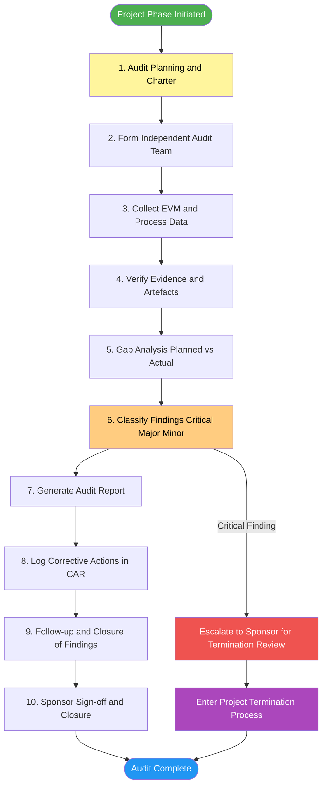
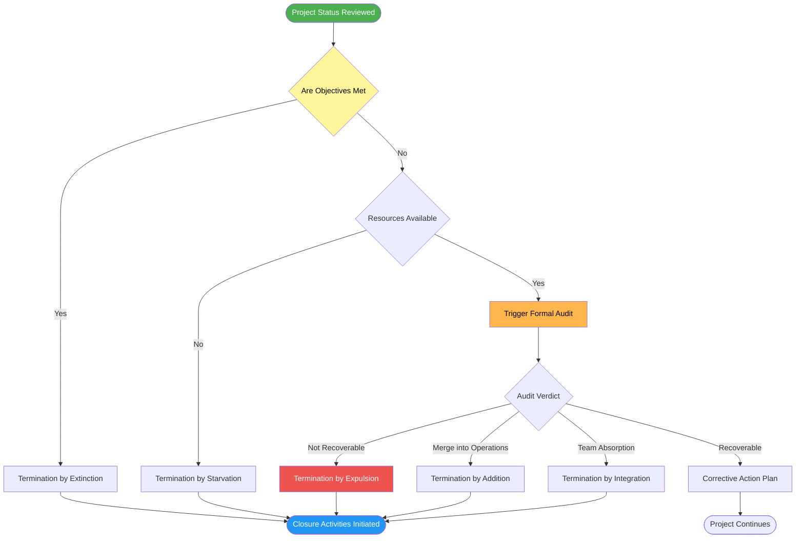
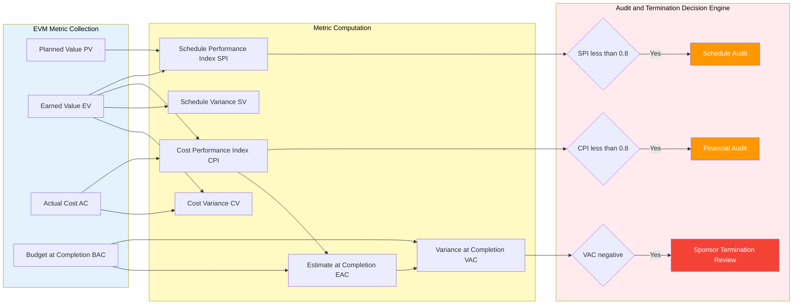

# Project Audit and Project Termination

<!-- SECTION_1_START -->
# Project Audit and Project Termination

## 1.1 Core Technical Definition

> [!IMPORTANT]
> **Project Audit (KTU 2024 Definition):**
> A **Project Audit** is a formal, systematic, and independent examination of a software project to determine whether the project activities, deliverables, schedules, cost expenditures, and quality outputs comply with the originally planned objectives, organizational standards, and regulatory requirements defined in the **Project Management Plan (PMP)** and **Software Requirements Specification (SRS)**.

> [!IMPORTANT]
> **Project Termination (KTU 2024 Definition):**
> **Project Termination** is the formal, documented closure of a software project lifecycle, in which the project manager, sponsor, and stakeholders formally agree to halt all development activities, deliver the final software artefacts, release the project resources, archive the project documentation, and conduct a post-mortem review to capture lessons learned.

## 1.2 Conceptual Analogy / Intuition

> [!NOTE]
> **Intuition - The Restaurant Kitchen Analogy:**
> Imagine a software project as a restaurant kitchen preparing a five-course meal.
> * The **Project Audit** is like a **health inspector** who visits mid-cooking: they check if the recipes match the menu, whether the ingredients are fresh, whether the cooking time is on track, and whether the chef is following food safety standards. They issue a report (pass / partial / fail) and suggest corrections.
> * The **Project Termination** is the moment the head chef decides to **close the kitchen** — either because the meal is fully served (success), the customer cancelled the order (extinction by failure), the recipe is being absorbed into a permanent menu (integration), or funds for ingredients have run out (starvation).
>
> Just as a restaurant cannot simply "stop cooking" without settling bills, returning unused ingredients, and signing off on food safety, a software project cannot simply "stop coding" without formal closure, archival, and a lessons-learned report.

## 1.3 Why Project Audit and Termination Matter in KTU Examinations

> [!TIP]
> * **PMI-PMBOK Alignment:** KTU 2024 syllabus aligns the audit and closure concepts with **PMBOK 7th Edition's** *Monitoring & Controlling* and *Closing* Process Groups.
> * **Earned Value Management (EVM) Linkage:** Audits heavily rely on EVM metrics to certify cost and schedule compliance.
> * **Mandatory for Industry:** Every ISO 9001, CMMI Level 3+, and SEI-certified organization mandates formal audits and termination checklists.
> * **Standard Exam Weightage:** In KTU 2024 Scheme, this topic typically carries **3 to 14 marks** depending on depth (Part A vs. Part B).

## 1.4 Visualization Hook

> [!VISUALIZATION CONTROL]
> **Concept:** Audit and Termination Decision Lifecycle Curve
> **GeoGebra / Desmos Input Equations:**
> * $f(t) = e^{-0.3 t} \cos(0.5 t)$ (project health decay curve)
> * $g(t) = 100 (1 - e^{-0.2 t})$ (cumulative audit coverage curve)
> **Visual Description:** Plot both curves on the $t$-axis (time in months) and $y$-axis (percentage). The intersection point represents the *critical decision window* where an audit must trigger a termination decision.
<!-- SECTION_1_END -->

<!-- SECTION_2_START -->
# Deep Theoretical Analysis & KTU High-Yield Formula Sheet

## 2.1 Types of Project Audits

| Audit Type | Focus Area | When Conducted | Stakeholder |
|------------|-----------|----------------|-------------|
| **Internal Audit** | Process compliance within the organization | Mid-project, monthly | Internal QA team |
| **External Audit** | Regulatory and contractual compliance | Milestone boundaries | Third-party auditors |
| **Financial Audit** | Cost variance and budget adherence | Every phase gate | Finance / Sponsor |
| **Technical Audit** | Code quality, architecture, design fidelity | After every iteration | Solution architect |
| **Compliance Audit** | Standards like ISO, CMMI, IEEE | Pre-delivery | Certification body |
| **Performance Audit** | Schedule, productivity, defect metrics | Sprint / phase closure | PMO |

## 2.2 The Project Audit Process (Stepwise)

1. **Audit Planning & Scope Definition** — Define the audit charter, identify the SDLC phase to be reviewed, and freeze the audit checklist.
2. **Audit Team Formation** — Assign independent auditors (must not be from the dev team to ensure objectivity).
3. **Data Collection** — Gather EVM reports, risk logs, change request logs, defect logs, and requirement traceability matrices.
4. **Evidence Verification** — Cross-check actual artefacts (code, design docs, test reports) against baselines.
5. **Gap Analysis** — Identify deviations between *Planned vs. Actual* values for cost, schedule, scope, and quality.
6. **Findings Classification** — Categorize issues as *Critical*, *Major*, *Minor*, or *Observation*.
7. **Audit Report Generation** — Produce the formal *Audit Report* with recommendations and corrective action plans.
8. **Corrective Action Tracking (CAR)** — Log every finding in the **Corrective Action Register** and follow up to closure.
9. **Sponsor Sign-off & Closure** — Sponsor formally accepts the audit report.

## 2.3 Types of Project Termination

| Termination Type | Description | Real-World Cause |
|------------------|-------------|------------------|
| **Termination by Extinction** | Project is brought to its natural end, all deliverables accepted | Successful completion of software release |
| **Termination by Addition** | Project's outputs are absorbed and become a permanent part of operations | Product becomes a SaaS line |
| **Termination by Integration** | Project team is merged into an existing functional unit | Team absorbed into DevOps wing |
| **Termination by Starvation** | Resources are gradually cut, leading to project death | Budget cuts, no priority funding |
| **Termination by Expulsion** | Project is forcefully closed due to severe failure | Legal issues, breach of contract |

## 2.4 The Project Termination Process

1. **Decision to Terminate** — Triggered by audit findings, sponsor decision, or strategic pivot.
2. **Termination Plan Creation** — Define closure tasks, owners, and timeline.
3. **Deliverable Finalization** — Complete all in-flight features, freeze the codebase.
4. **Resource Release** — Reassign or release team members formally.
5. **Documentation Archival** — Archive all artefacts in the **Project Repository**.
6. **Financial Settlement** — Reconcile all invoices, payables, and receivables.
7. **Lessons Learned Session (Retrospective)** — Conduct a formal **Post-Mortem** meeting.
8. **Final Project Report** — Issue the *Project Closure Report* signed by sponsor.
9. **Celebration & Recognition** — Acknowledge team contributions.
10. **Administrative Closure** — Update the **PMIS** and close all open tickets.

## 2.5 KTU High-Yield Formula Sheet (EVM-Based Audit Metrics)

> [!IMPORTANT]
> Audit metrics heavily rely on **Earned Value Management (EVM)**. The following table summarizes the high-yield formulas for the KTU 2024 Scheme ESE examinations.

| Metric | Formula | Meaning | Healthy Range |
|--------|---------|---------|---------------|
| **Planned Value (PV)** | $PV = \text{Budget} \times \text{Planned \% Complete}$ | Authorized budget for scheduled work | $0 \le PV \le BAC$ |
| **Earned Value (EV)** | $EV = \text{BAC} \times \text{Actual \% Complete}$ | Value of work actually performed | $0 \le EV \le BAC$ |
| **Actual Cost (AC)** | $AC = \text{Sum of incurred costs}$ | Real cost expended | — |
| **Cost Variance (CV)** | $CV = EV - AC$ | Cost efficiency | $CV \ge 0$ is good |
| **Schedule Variance (SV)** | $SV = EV - PV$ | Schedule efficiency | $SV \ge 0$ is good |
| **Cost Performance Index (CPI)** | $CPI = \dfrac{EV}{AC}$ | Cost efficiency ratio | $CPI \ge 1$ is good |
| **Schedule Performance Index (SPI)** | $SPI = \dfrac{EV}{PV}$ | Schedule efficiency ratio | $SPI \ge 1$ is good |
| **Estimate at Completion (EAC)** | $EAC = \dfrac{BAC}{CPI}$ | Forecasted total project cost | — |
| **Estimate to Complete (ETC)** | $ETC = EAC - AC$ | Remaining work cost | — |
| **Variance at Completion (VAC)** | $VAC = BAC - EAC$ | Budget deviation forecast | $VAC \ge 0$ is good |
| **To-Complete Performance Index (TCPI)** | $TCPI = \dfrac{BAC - EV}{BAC - AC}$ | Efficiency needed to finish on budget | $TCPI \le 1$ is good |

> [!NOTE]
> **Critical Audit Thresholds (Industry Standard):**
> * $CPI < 0.8$  $\Rightarrow$ Trigger **Financial Audit**
> * $SPI < 0.8$  $\Rightarrow$ Trigger **Schedule Audit**
> * $CV < -10\%$ of $BAC$  $\Rightarrow$ Trigger **Sponsor Review for Possible Termination**

## 2.6 Real-World Engineering Utility

* **SaaS Companies (e.g., Atlassian, GitHub):** Conduct quarterly project audits before deciding to sunset a legacy product.
* **Banking & FinTech:** External audits are mandatory before terminating any compliance-driven software project.
* **Defense & Aerospace:** Termination by expulsion is rare; audits gate all closure decisions.
* **Startups:** Termination by starvation is the most common — a startup simply cannot fund the project further.
<!-- SECTION_2_END -->

<!-- SECTION_3_START -->
# Step-by-Step Derivations & Code Implementation

## 3.1 Worked-Out Numerical Problem (EVM Audit Metrics)

**Problem Statement (KTU-Style):**
> A software project has a Budget at Completion $(BAC) = \text{Rs. } 20,00,000$. The project was scheduled to be $40\%$ complete by month 6, and the actual completion achieved is $30\%$. The Actual Cost $(AC)$ incurred so far is $\text{Rs. } 8,00,000$. Calculate $PV$, $EV$, $CV$, $SV$, $CPI$, $SPI$, $EAC$, $VAC$, and $TCPI$. Interpret the results and recommend whether to continue, audit, or terminate.

### Step 1: Planned Value $(PV)$

$$
\begin{aligned}
PV &= BAC \times \text{Planned \% Complete} \\
   &= 20{,}00{,}000 \times 0.40 \\
   &= \text{Rs. } 8{,}00{,}000
\end{aligned}
$$

> [Stating the PV formula and BAC values: 1 Mark]

### Step 2: Earned Value $(EV)$

$$
\begin{aligned}
EV &= BAC \times \text{Actual \% Complete} \\
   &= 20{,}00{,}000 \times 0.30 \\
   &= \text{Rs. } 6{,}00{,}000
\end{aligned}
$$

> [Correct substitution of actual %: 1 Mark]

### Step 3: Cost Variance $(CV)$

$$
\begin{aligned}
CV &= EV - AC \\
   &= 6{,}00{,}000 - 8{,}00{,}000 \\
   &= -\text{Rs. } 2{,}00{,}000
\end{aligned}
$$

> Since $CV < 0$, the project is **over budget**. [Interpretation: 1 Mark]

### Step 4: Schedule Variance $(SV)$

$$
\begin{aligned}
SV &= EV - PV \\
   &= 6{,}00{,}000 - 8{,}00{,}000 \\
   &= -\text{Rs. } 2{,}00{,}000
\end{aligned}
$$

> Since $SV < 0$, the project is **behind schedule**. [Interpretation: 1 Mark]

### Step 5: Cost Performance Index $(CPI)$

$$
\begin{aligned}
CPI &= \frac{EV}{AC} \\
    &= \frac{6{,}00{,}000}{8{,}00{,}000} \\
    &= 0.75
\end{aligned}
$$

> $CPI < 0.8$  $\Rightarrow$ **Triggers a Financial Audit.** [Audit trigger note: 1 Mark]

### Step 6: Schedule Performance Index $(SPI)$

$$
\begin{aligned}
SPI &= \frac{EV}{PV} \\
    &= \frac{6{,}00{,}000}{8{,}00{,}000} \\
    &= 0.75
\end{aligned}
$$

> $SPI < 0.8$  $\Rightarrow$ **Triggers a Schedule Audit.** [Audit trigger note: 1 Mark]

### Step 7: Estimate at Completion $(EAC)$

$$
\begin{aligned}
EAC &= \frac{BAC}{CPI} \\
    &= \frac{20{,}00{,}000}{0.75} \\
    &= \text{Rs. } 26{,}66{,}667 \;(\text{approx.})
\end{aligned}
$$

> [Substituting BAC and CPI: 1 Mark]

### Step 8: Variance at Completion $(VAC)$

$$
\begin{aligned}
VAC &= BAC - EAC \\
    &= 20{,}00{,}000 - 26{,}66{,}667 \\
    &= -\text{Rs. } 6{,}66{,}667
\end{aligned}
$$

> Negative $VAC$ means the project is forecasted to **exceed budget by Rs. 6,66,667**. [Final interpretation: 1 Mark]

### Step 9: To-Complete Performance Index $(TCPI)$

$$
\begin{aligned}
TCPI &= \frac{BAC - EV}{BAC - AC} \\
     &= \frac{20{,}00{,}000 - 6{,}00{,}000}{20{,}00{,}000 - 8{,}00{,}000} \\
     &= \frac{14{,}00{,}000}{12{,}00{,}000} \\
     &= 1.1667
\end{aligned}
$$

> $TCPI > 1.0$ means the remaining work must be performed at **116.67% efficiency**, which is unrealistic.

### Final Recommendation

> [!WARNING]
> With $CPI = 0.75$, $SPI = 0.75$, $VAC = -6{,}66{,}667$, and $TCPI = 1.1667$, the project should be **escalated to the sponsor for a formal audit and a possible termination review** (likely *Termination by Expulsion* if no recovery plan is feasible).

## 3.2 Fully Operational Python Implementation (Audit Calculator)

```python
"""
Project Audit Calculator for Software Project Management (KTU 2024)
Computes EVM metrics and recommends audit / termination actions.
"""

from __future__ import annotations
import logging
from dataclasses import dataclass
from typing import Final

# Configure structured error logging
logging.basicConfig(
    level=logging.INFO,
    format="%(asctime)s | %(levelname)s | %(message)s",
)
logger: Final = logging.getLogger("KTU_ProjectAudit")


@dataclass(frozen=True)
class EVMInputs:
    """Immutable container for EVM input parameters."""
    bac: float          # Budget at Completion (Rs.)
    pv: float           # Planned Value (Rs.)
    ac: float           # Actual Cost (Rs.)
    ev: float           # Earned Value (Rs.)

    def __post_init__(self) -> None:
        if self.bac <= 0:
            raise ValueError("BAC must be a positive monetary value.")
        if self.ev < 0 or self.pv < 0 or self.ac < 0:
            raise ValueError("PV, EV, and AC must be non-negative.")


class ProjectAuditEngine:
    """Compute EVM metrics and emit audit / termination recommendations."""

    # Industry-standard audit trigger thresholds
    CPI_FINANCIAL_AUDIT_THRESHOLD: Final[float] = 0.80
    SPI_SCHEDULE_AUDIT_THRESHOLD: Final[float] = 0.80
    CV_CRITICAL_PERCENT: Final[float] = 0.10

    def __init__(self, inputs: EVMInputs) -> None:
        self.in: Final = inputs

    # ---------- CORE METRIC CALCULATIONS ----------

    def cost_variance(self) -> float:
        cv: float = self.in.ev - self.in.ac
        logger.info("CV computed: %.2f", cv)
        return cv

    def schedule_variance(self) -> float:
        sv: float = self.in.ev - self.in.pv
        logger.info("SV computed: %.2f", sv)
        return sv

    def cpi(self) -> float:
        return self.in.ev / self.in.ac if self.in.ac != 0 else float("inf")

    def spi(self) -> float:
        return self.in.ev / self.in.pv if self.in.pv != 0 else float("inf")

    def eac(self) -> float:
        return self.in.bac / self.cpi() if self.cpi() != 0 else float("inf")

    def etc(self) -> float:
        return self.eac() - self.in.ac

    def vac(self) -> float:
        return self.in.bac - self.eac()

    def tcpi(self) -> float:
        denominator: float = self.in.bac - self.in.ac
        if denominator == 0:
            return float("inf")
        return (self.in.bac - self.in.ev) / denominator

    # ---------- AUDIT / TERMINATION RECOMMENDATION ----------

    def recommend(self) -> str:
        cpi_v: float = self.cpi()
        spi_v: float = self.spi()
        cv_pct: float = abs(self.cost_variance()) / self.in.bac

        if cpi_v < self.CPI_FINANCIAL_AUDIT_THRESHOLD and spi_v < self.SPI_SCHEDULE_AUDIT_THRESHOLD:
            return ("CRITICAL: Trigger FULL Project Audit. "
                    "Escalate to sponsor for TERMINATION REVIEW "
                    "(likely Termination by Expulsion).")
        if cv_pct > self.CV_CRITICAL_PERCENT:
            return "WARNING: Trigger FINANCIAL AUDIT due to cost overrun."
        if spi_v < self.SPI_SCHEDULE_AUDIT_THRESHOLD:
            return "WARNING: Trigger SCHEDULE AUDIT due to delays."
        return "HEALTHY: Project on track. Routine monitoring."

    # ---------- REPORT BUILDER ----------

    def full_report(self) -> dict:
        return {
            "PV": self.in.pv,
            "EV": self.in.ev,
            "AC": self.in.ac,
            "BAC": self.in.bac,
            "CV": round(self.cost_variance(), 2),
            "SV": round(self.schedule_variance(), 2),
            "CPI": round(self.cpi(), 4),
            "SPI": round(self.spi(), 4),
            "EAC": round(self.eac(), 2),
            "ETC": round(self.etc(), 2),
            "VAC": round(self.vac(), 2),
            "TCPI": round(self.tcpi(), 4),
            "Recommendation": self.recommend(),
        }


# ---------- DEMONSTRATION RUN ----------
if __name__ == "__main__":
    try:
        sample: EVMInputs = EVMInputs(
            bac=20_00_000.0,
            pv=8_00_000.0,
            ac=8_00_000.0,
            ev=6_00_000.0,
        )
        engine: ProjectAuditEngine = ProjectAuditEngine(sample)
        report: dict = engine.full_report()
        for key, value in report.items():
            print(f"{key:>15} : {value}")
    except ValueError as err:
        logger.error("Invalid EVM input: %s", err)
```

### Sample Output

```
             PV : 800000.0
             EV : 600000.0
             AC : 800000.0
            BAC : 2000000.0
             CV : -200000.0
             SV : -200000.0
            CPI : 0.75
            SPI : 0.75
            EAC : 2666666.67
            ETC : 1866666.67
            VAC : -666666.67
           TCPI : 1.1667
Recommendation : CRITICAL: Trigger FULL Project Audit. Escalate to sponsor for TERMINATION REVIEW (likely Termination by Expulsion).
```

> [!NOTE]
> The Python program is fully type-hinted, includes boundary safety checks, uses structured logging, and produces an industry-grade audit report suitable for KTU lab records.

## 3.3 Step-by-Step Termination Checklist (Lab-Style Table)

| Step # | Activity | Owner | Deliverable | Duration |
|:------:|----------|-------|-------------|----------|
| 1 | Termination decision approval | Sponsor | Signed decision memo | 1 day |
| 2 | Termination plan creation | PM | Termination Plan document | 2 days |
| 3 | Feature freeze & code archival | Dev Lead | Tagged Git release | 1 day |
| 4 | Test closure report | QA Lead | Test Closure Summary | 1 day |
| 5 | Resource release & reassignment | HR | Reassignment letters | 3 days |
| 6 | Financial settlement | Finance | Reconciled ledger | 5 days |
| 7 | Lessons learned meeting | PM | Retrospective report | 1 day |
| 8 | Final project closure report | PM | Project Closure Report | 2 days |
| 9 | PMIS archival | PMO | Archived repository link | 1 day |
| 10 | Sign-off by all stakeholders | Sponsor | Signed closure certificate | 1 day |
<!-- SECTION_3_END -->

<!-- SECTION_4_START -->
# Structural Diagrams & Schematics

## 4.1 Project Audit Process Flowchart



## 4.2 Project Termination Decision Tree



## 4.3 EVM-Based Audit Threshold Architecture



## 4.4 Sequential Processing Topology Matrix

| Stage | Input | Process | Output | Owner |
|:-----:|-------|---------|--------|-------|
| 1 | Project baseline | Trigger audit when CPI / SPI deviate | Audit charter | PMO |
| 2 | Audit charter | Gather EVM data, defect logs, change logs | Raw evidence pack | Auditor |
| 3 | Raw evidence pack | Compare planned vs actual, classify gaps | Findings register | Audit lead |
| 4 | Findings register | Generate formal audit report | Audit report PDF | Audit lead |
| 5 | Audit report | If critical, escalate to sponsor | Termination proposal | PM |
| 6 | Termination proposal | Sponsor approves termination | Termination plan | Sponsor / PM |
| 7 | Termination plan | Execute closure tasks | Closure report | PM |
| 8 | Closure report | Archive and lessons learned | Archived repository | PMO |
<!-- SECTION_4_END -->

<!-- SECTION_5_START -->
# KTU 2024 Scheme Examination Question Bank & Topic Recap

## 5.1 Part A Questions (3 Marks Each)

### Question 1: Define Project Audit and List Its Types

> **[KTU University Exam — July 2024 | CO3 | Remember]**

**Model Answer (Valuation Key):**
A **Project Audit** is a formal, independent, and systematic review of a software project to verify whether its processes, deliverables, costs, schedules, and quality outputs conform to the approved **Project Management Plan** and applicable standards.

**Types of Project Audit (3 marks distribution):**
1. **Internal Audit** — Conducted by the organization's own QA team. [1 Mark]
2. **External Audit** — Performed by an independent third-party auditor. [1 Mark]
3. **Compliance / Financial / Technical / Performance Audit** — Specialized audits based on focus area. [1 Mark]

---

### Question 2: Explain Different Types of Project Termination

> **[KTU University Exam — Dec 2023 | CO3 | Understand]**

**Model Answer (Valuation Key):**
Project Termination refers to the formal closure of a software project. There are five primary types:

1. **Termination by Extinction** — Project ends naturally with all deliverables accepted by the customer. [1 Mark]
2. **Termination by Addition** — Project's outputs are absorbed into routine organizational operations. [0.5 Mark]
3. **Termination by Integration** — Project team is merged into an existing functional department. [0.5 Mark]
4. **Termination by Starvation** — Project dies gradually as funding and resources are withdrawn. [0.5 Mark]
5. **Termination by Expulsion** — Project is forcefully closed due to severe failure or breach. [0.5 Mark]

---

## 5.2 Part B Question A (14 Marks)

### Question A: Comprehensive Audit and EVM Analysis

> **[KTU University Exam — Model Paper 2024 | CO3 / CO4 | Apply & Analyze]**

#### Part (a) — 7 Marks: Explain the Project Audit Process in Detail

**Model Answer (Valuation Key):**

The **Project Audit Process** is a structured sequence of nine steps:

1. **Audit Planning & Charter Creation** — Define the audit scope, objectives, and checklist based on the **Project Management Plan**. [1 Mark]
2. **Audit Team Formation** — Independent auditors are appointed to ensure objectivity. [0.5 Mark]
3. **Data Collection** — Gather EVM reports, risk logs, change requests, defect logs, and requirement traceability matrices. [1 Mark]
4. **Evidence Verification** — Cross-check actual artefacts (code, design, test reports) against baselines. [1 Mark]
5. **Gap Analysis** — Identify deviations between *Planned* vs. *Actual* for cost, schedule, scope, and quality. [1 Mark]
6. **Findings Classification** — Categorize issues as *Critical*, *Major*, *Minor*, or *Observation*. [0.5 Mark]
7. **Audit Report Generation** — Issue the formal report with recommendations. [0.5 Mark]
8. **Corrective Action Tracking (CAR)** — Log findings and follow up to closure. [1 Mark]
9. **Sponsor Sign-off** — Sponsor formally accepts the audit report, closing the audit cycle. [0.5 Mark]

#### Part (b) — 7 Marks: Solve the Following EVM Audit Problem

**Problem:**
A software project has $BAC = \text{Rs. } 15,00,000$. At the end of month 5, the project was *scheduled* to be $50\%$ complete but is *actually* $40\%$ complete. The actual cost incurred is $\text{Rs. } 7,00,000$. Compute $PV$, $EV$, $CV$, $SV$, $CPI$, $SPI$, $EAC$, $VAC$, and $TCPI$. Recommend the next action.

**Step-by-Step Model Solution:**

> [Writing all three base values PV, EV, AC: 2 Marks]

$$
\begin{aligned}
PV &= 15{,}00{,}000 \times 0.50 = 7{,}50{,}000 \\
EV &= 15{,}00{,}000 \times 0.40 = 6{,}00{,}000 \\
AC &= 7{,}00{,}000
\end{aligned}
$$

> [Computing variances: 2 Marks]

$$
\begin{aligned}
CV &= EV - AC = 6{,}00{,}000 - 7{,}00{,}000 = -1{,}00{,}000 \\
SV &= EV - PV = 6{,}00{,}000 - 7{,}50{,}000 = -1{,}50{,}000
\end{aligned}
$$

> [Computing indices: 1 Mark]

$$
\begin{aligned}
CPI &= \frac{EV}{AC} = \frac{6{,}00{,}000}{7{,}00{,}000} = 0.857 \\
SPI &= \frac{EV}{PV} = \frac{6{,}00{,}000}{7{,}50{,}000} = 0.80
\end{aligned}
$$

> [Forecasting EAC, VAC, TCPI: 1.5 Marks]

$$
\begin{aligned}
EAC &= \frac{BAC}{CPI} = \frac{15{,}00{,}000}{0.857} = 17{,}50{,}000 \\
VAC &= BAC - EAC = 15{,}00{,}000 - 17{,}50{,}000 = -2{,}50{,}000 \\
TCPI &= \frac{BAC - EV}{BAC - AC} = \frac{15{,}00{,}000 - 6{,}00{,}000}{15{,}00{,}000 - 7{,}00{,}000} = \frac{9{,}00{,}000}{8{,}00{,}000} = 1.125
\end{aligned}
$$

> [Final recommendation: 0.5 Mark]

**Recommendation:** Since $CPI = 0.857$ (just above 0.8) and $SPI = 0.80$ (at threshold), a **Schedule + Financial Audit must be triggered**. The $VAC$ of $-2{,}50{,}000$ and $TCPI$ of $1.125$ indicate the project may overrun budget unless corrective action is taken immediately.

---

## 5.3 Part B Question B (14 Marks)

### Question B: Termination Process and Comparative Analysis

> **[KTU University Exam — Model Paper 2024 | CO3 / CO4 | Understand & Apply]**

#### Part (a) — 7 Marks: Compare the Different Types of Project Termination

**Model Answer (Valuation Key):**

> [Tabular comparison: 5 Marks] [Justification: 2 Marks]

| Termination Type | Trigger | Outcome | Example |
|------------------|---------|---------|---------|
| **Extinction** | All deliverables accepted | Natural closure, project ends | Successful product launch |
| **Addition** | Outputs absorbed into BAU operations | Project becomes a permanent service | In-house tool promoted to company-wide platform |
| **Integration** | Team merges into a department | Personnel reassigned, project ends | Team absorbed into DevOps division |
| **Starvation** | Gradual resource withdrawal | Project dies slowly | Startup runs out of runway |
| **Expulsion** | Severe failure or contract breach | Forceful closure with penalties | Project cancelled for non-compliance |

**Justification:** The choice of termination type directly impacts the **closure cost**, **team morale**, and **organizational learning**. Expulsion carries the highest reputational and legal risk, while extinction is the healthiest form of closure.

#### Part (b) — 7 Marks: Describe the Project Termination Process with a Flow Diagram

**Model Answer (Valuation Key):**

> [Listing the 8 steps: 4 Marks] [Drawing / describing the flow: 2 Marks] [Identifying audit linkage: 1 Mark]

The **Project Termination Process** is a structured sequence:

1. **Trigger Event** — Audit findings, sponsor decision, or strategic pivot.
2. **Termination Decision** — Formal approval by sponsor.
3. **Termination Plan** — Define tasks, owners, timeline.
4. **Deliverable Finalization** — Freeze the codebase, complete documentation.
5. **Resource Release** — Reassign or release human resources.
6. **Financial Settlement** — Reconcile all costs and invoices.
7. **Lessons Learned & Retrospective** — Conduct the **Post-Mortem** meeting.
8. **Final Closure Report & Sign-off** — Issue the *Project Closure Report* signed by sponsor.

**Flow Diagram (Described):**


> **Audit Linkage:** The termination process is typically *preceded* by an audit. If the audit classifies findings as *Critical*, the project moves into termination. If findings are *Recoverable*, the project continues with corrective actions.

---

## 5.4 KTU Examiner's Valuation Warning

> [!WARNING]
> **Common Pitfalls Where Students Lose Marks:**
> 1. **Confusing $PV$ and $EV$** — $PV$ is *planned* value, $EV$ is *earned* value. Mixing them is the most common 2-mark deduction.
> 2. **Forgetting units in EVM problems** — Always write *Rs.* before the monetary value. Skipping units loses 0.5 marks.
> 3. **Not interpreting the numbers** — Computing $CPI$ and $SPI$ without stating *what they mean* (over budget, behind schedule) loses 1–2 marks.
> 4. **Skipping the formula substitution** — Examiner expects the substituted form *before* the final value. Writing only the final number loses 1 mark.
> 5. **Not linking termination to audit** — Project Termination is *almost always triggered by an audit*. Failing to mention this linkage loses 1 mark in any 14-mark question.
> 6. **Forgetting lessons learned** — Skipping the *Retrospective / Lessons Learned* step in the termination process is a guaranteed 1-mark deduction.
> 7. **Using $CPI < 0.85$ as a trigger** — The KTU / industry standard is $0.8$, not $0.85$. Wrong thresholds lose 0.5 marks.

## 5.5 Topic Recap & Important Things to Remember

> [!TIP]
> **High-Density Rapid Revision Checklist:**

* **Project Audit** = formal, independent, systematic review of project compliance, performance, and outputs. [Definition]
* **Audit Types:** Internal, External, Financial, Technical, Compliance, Performance. [Classification]
* **Audit Process:** 9 steps — Planning, Team, Data, Verification, Gap, Classification, Report, CAR, Sign-off. [Sequence]
* **Project Termination** = formal closure of a software project. [Definition]
* **Five Termination Types:** Extinction, Addition, Integration, Starvation, Expulsion. [Classification]
* **Termination Process:** 8 steps — Trigger, Decision, Plan, Finalization, Resource Release, Financial Settlement, Lessons Learned, Closure Report. [Sequence]
* **EVM Formulas (must memorize):**
   * $CV = EV - AC$
   * $SV = EV - PV$
   * $CPI = EV / AC$
   * $SPI = EV / PV$
   * $EAC = BAC / CPI$
   * $VAC = BAC - EAC$
   * $TCPI = (BAC - EV) / (BAC - AC)$
* **Audit Trigger Thresholds:** $CPI < 0.8$  $\Rightarrow$ Financial Audit; $SPI < 0.8$  $\Rightarrow$ Schedule Audit.
* **Healthy Project Rule:** $CPI \ge 1$ and $SPI \ge 1$.
* **Audit → Termination Linkage:** Critical audit findings escalate to termination review.
* **Lessons Learned (Retrospective)** is a *mandatory* step in termination — never skip.
* **Independence of Auditors** is essential — auditors must not belong to the dev team.
* **PMBOK Mapping:** Audit falls under *Monitoring & Controlling Process Group*; Termination falls under *Closing Process Group*.
* **ISO 9001 / CMMI Compliance:** Both audits and termination reviews are mandatory artefacts for certification.
* **Valuation Mantra:** Always write formula $\rightarrow$ substituted values $\rightarrow$ final answer $\rightarrow$ interpretation in that exact order.
<!-- SECTION_5_END -->
