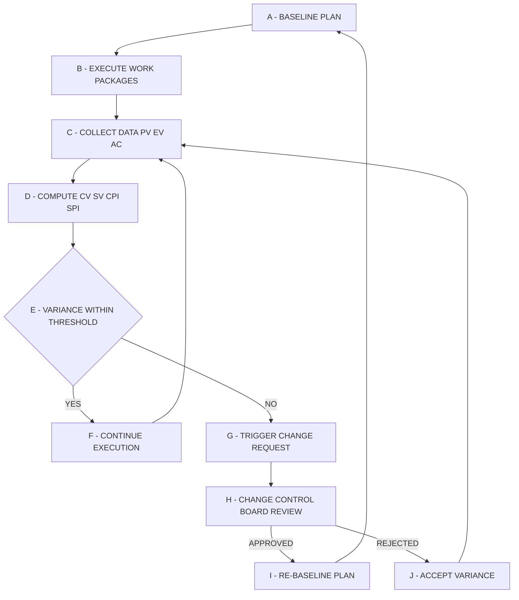
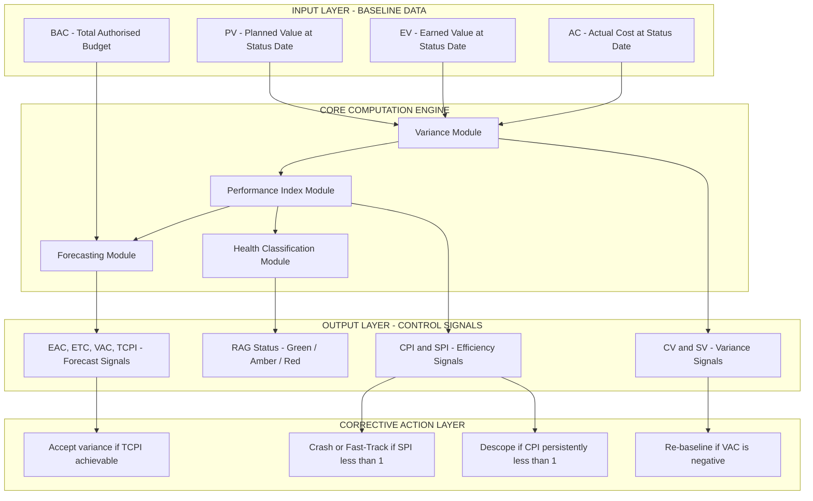
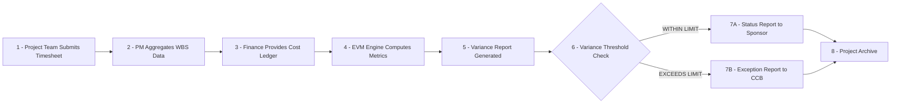
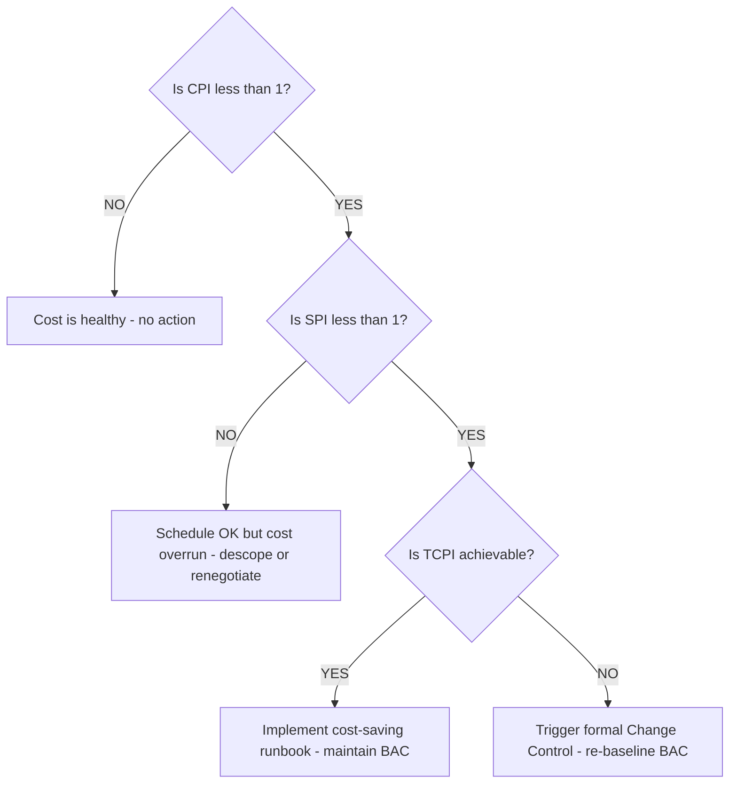

# Project Control

<!-- SECTION_1_START -->
# 📘 Project Control — Software Project Management (PECST521)

## 1. Core Technical Definition & Intuitive Overview

> [!IMPORTANT]
> **Formal KTU 2024 Definition (PECST521 — Module 2):**
> *Project Control* is the **systematic, continuous, and data-driven process of monitoring, measuring, evaluating, and regulating a software project's performance against its approved baseline plan (scope, schedule, cost, and quality)** to ensure that deviations are identified at the earliest possible moment and corrective or preventive actions are initiated to keep the project aligned with its strategic objectives.

In the language of the *Project Management Body of Knowledge (PMBOK) / IEEE Software Engineering Standards*, project control is the **steering wheel of a project** — the act of comparing **"what was planned"** with **"what was actually achieved"**, and applying *feedback-driven decisions* to close any gaps.

### 🎯 Intuitive Analogy — "The Cruise Control on a Highway"

Imagine you are driving a car from **Trivandrum to Bangalore (≈ 750 km)** in 12 hours.

| Driving Element | Project Management Equivalent |
|---|---|
| 🛣️ Total road distance (750 km) | **BAC** — Budget at Completion (total cost of the project) |
| ⏱️ Planned arrival time at each toll | **PV** — Planned Value (budgeted cost of work scheduled) |
| 📍 Kilometers already covered | **EV** — Earned Value (budgeted cost of work performed) |
| ⛽ Fuel actually spent so far | **AC** — Actual Cost (real money burned) |
| 🚗 Speedometer & Fuel Gauge | **CPI / SPI** — Performance Indices |
| 🦶 Foot on accelerator / brake | **Corrective Action** — Re-planning, re-baselining |

If you find that you have **only covered 200 km but already burnt fuel worth 350 km worth of budget**, your *project control system* will flash a warning — you are **behind schedule AND over budget**, and you must take corrective action (e.g., reschedule tasks, reallocate resources, or descope features).

> [!NOTE]
> **KTU Syllabus Highlight (PECST521 Module 2):**
> The official 2024 scheme outcomes for this module require students to demonstrate the ability to:
> - Apply **Earned Value Management (EVM)** as the *primary quantitative control technique*,
> - Interpret **cost and schedule variances** to forecast final project outcomes,
> - Describe the **project control cycle** (data acquisition → measurement → comparison → corrective action),
> - Justify the role of **change control boards (CCB)** in scope and configuration control.

### 📊 The Three Sacred Pillars of Project Control

$$
\text{Project Control} = \underbrace{\text{Measurement}}_{\text{Quantitative}} \;+\; \underbrace{\text{Comparison}}_{\text{Variance Analysis}} \;+\; \underbrace{\text{Correction}}_{\text{Feedback Loop}}
$$

These three operations form a **closed-loop cybernetics system** — without feedback, control is impossible.

### 🔢 Core EVM Variables (KTU High-Frequency Terminology)

> [!TIP]
> Memorize the three foundational variables. **All 12+ EVM metrics in KTU exams are derived from them:**

1. **PV — Planned Value** *(also called BCWS: Budgeted Cost of Work Scheduled)*
   The *authorised budget* assigned to the work that was *scheduled* to be completed by a specific reporting date.

2. **EV — Earned Value** *(also called BCWP: Budgeted Cost of Work Performed)*
   The *budgeted value* of the work that was *actually completed* by the reporting date. It answers: *"How much work, in monetary terms, did we genuinely deliver?"*

3. **AC — Actual Cost** *(also called ACWP: Actual Cost of Work Performed)*
   The *real cost incurred* to accomplish the work completed up to the reporting date. It answers: *"How much money did we actually burn?"*

The **trick** in KTU questions is recognising that the *denominator* of every performance index decides whether we are measuring **cost efficiency** or **schedule efficiency**.

### 🧩 The Project Control Cycle (Conceptual Walkthrough)

1. **Plan** → Establish baseline (BAC, schedule, scope).
2. **Execute** → Run the development activities.
3. **Measure** → Collect PV, EV, AC from timesheets, WBS reports, finance logs.
4. **Compare** → Compute variances (CV, SV) and indices (CPI, SPI).
5. **Decide** → If variances exceed thresholds, trigger corrective workflows.
6. **Act** → Re-plan, re-baseline (via formal change control), or accept the variance.
7. **Loop** → Repeat at every status checkpoint (typically weekly/monthly).

> [!VISUALIZATION CONTROL]
> **Concept:** *Closed-Loop Project Control (Cybernetic Feedback)*
> **GeoGebra / Desmos Input Equations (Conceptual Plot):**
> * `f(x) = x \cdot \sin(x)` — intended to mimic oscillating corrective feedback
> * `g(x) = 0` — zero-deviation baseline
> **Visual Description:** Plot a damped sinusoid approaching the x-axis from above. The *x-axis* represents the **baseline plan**, the *curve* represents the **actual project trajectory**, and the **distance between the curve and the x-axis at any point** represents the **variance** that the control loop is constantly trying to drive back toward zero.

---

<!-- SECTION_1_END -->

<!-- SECTION_2_START -->
# 2. Deep Theoretical Analysis & KTU High-Yield Formula Sheet

## 🧠 The "Why" Behind Project Control

Software projects fail not because of *lack of planning* but because of **absence of control after execution begins**. According to the *Standish Group CHAOS Report*, the top three reasons for project failure are:

1. **Lack of executive sponsorship & control**,
2. **Unrealistic schedules and budgets**,
3. **Inadequate requirements and scope creep**.

Project Control directly addresses **#1 and #2** by making the project *visible, measurable, and steerable*.

> [!NOTE]
> **The Governing Principle:**
> *"You cannot control what you cannot measure."* — Lord Kelvin
> In SPM, this translates to: *You cannot deliver a software project on time and on budget unless you continuously compare **EV** against **PV** and **AC**.*

## 🔁 The 4-Stage Project Control Workflow

| Stage | Activity | KTU-Evaluated Artefact |
|---|---|---|
| 1. **Data Collection** | WBS progress, timesheets, defect logs, cost ledgers | Status report |
| 2. **Performance Measurement** | Compute PV, EV, AC at each checkpoint | Earned Value Sheet |
| 3. **Variance Analysis** | Compute CV, SV, CPI, SPI; identify trends | Variance Report |
| 4. **Corrective Action** | Re-baseline, fast-track, crash, descope, or accept | Change Request + CCB Approval |

## 💰 Earned Value Management (EVM) — The Mathematics of Control

EVM integrates **scope, schedule, and cost** into a single unified performance framework. It answers four questions in one number:

| Question | Variable | What it tells you |
|---|---|---|
| What did we plan to do? | **PV** | Budgeted effort scheduled |
| What did we actually do? | **EV** | Budgeted value of completed work |
| What did it cost us? | **AC** | Actual money spent |
| What were we authorised to spend in total? | **BAC** | Total project budget |

### 📐 KTU Formula Sheet — Earned Value Management (EVM)

> [!IMPORTANT]
> The following table is **the single most important reference** for KTU PECST521 Module 2 numerical questions. **All formulas must be memorised — no derivation is expected, only application.**

| # | Metric | Formula | Interpretation Rule |
|---|---|---|---|
| 1 | Cost Variance | $CV = EV - AC$ | $\text{CV} > 0 \Rightarrow$ Under Budget ✓ |
| 2 | Schedule Variance | $SV = EV - PV$ | $\text{SV} > 0 \Rightarrow$ Ahead of Schedule ✓ |
| 3 | Cost Performance Index | $CPI = EV / AC$ | $\text{CPI} > 1 \Rightarrow$ Efficient Spending ✓ |
| 4 | Schedule Performance Index | $SPI = EV / PV$ | $\text{SPI} > 1 \Rightarrow$ Progressing Faster ✓ |
| 5 | Estimate at Completion | $EAC = BAC / CPI$ | Forecast total project cost |
| 6 | Estimate to Complete | $ETC = EAC - AC$ | Money still needed to finish |
| 7 | Variance at Completion | $VAC = BAC - EAC$ | Budget surplus (+) or deficit (−) |
| 8 | To-Complete Performance Index | $TCPI = (BAC - EV) / (BAC - AC)$ | Future CPI needed to meet BAC |
| 9 | Budget at Completion | $BAC$ (given) | Total authorised budget |
| 10 | Percent Complete (Cost) | $\%_\text{complete} = EV / BAC \times 100$ | Earned progress as % of total |
| 11 | Percent Spent (Cost) | $\%_\text{spent} = AC / BAC \times 100$ | Burned cash as % of total |
| 12 | Cost-to-Date Ratio | $AC / EV$ | The inverse of CPI — used in tool dashboards |

> [!TIP]
> **KTU Examiner's Mnemonic:** *"CV is for Coin (money); SV is for Stopwatch (time)."* Use this to never mix up CV and SV again.

### 🏗️ Real-World Engineering Utility of Project Control

Project Control is the **single most-used technique in IT services giants** (TCS, Infosys, Wipro, Accenture, IBM) and in *defence/aerospace* software programs (DRDO, ISRO, NASA). Concrete use cases:

- **🔹 Earned Value Reporting (EVR):** Monthly dashboard sent to client showing CV, SV, CPI, SPI, with RAG (Red/Amber/Green) status.
- **🔹 Earned Schedule (ES):** A 2003 extension by Lipinski to convert schedule variance into **time units (days/weeks)** rather than cost — used in long-duration ISRO satellite software projects.
- **🔹 Earned Quality (EQ):** Combines EVM with defect density to measure *quality-adjusted progress*.
- **🔹 Earned Business Value (EBV):** Agile extension of EVM where the "value" is in **story points or business capability**, not money.

### ⚖️ Cost Control vs Schedule Control — The Distinction KTU Loves to Test

| Dimension | Cost Control | Schedule Control |
|---|---|---|
| **Focus** | Stay within the budget | Stay within the deadline |
| **Primary Metric** | CPI, CV, EAC, VAC | SPI, SV, ES (Earned Schedule) |
| **Typical Tools** | WBS-based budgeting, Earned Value, Cost aggregation | Gantt charts, Critical Path Method (CPM), PERT | 
| **Common Corrective Action** | Renegotiate vendor rates, reduce scope | Crash (add resources) or Fast-Track (parallelize) |
| **Failure Symptom** | Burn rate exceeds planned rate | Milestones slip, dependencies chain-break |

> [!WARNING]
> **Critical Distinction for KTU:**
> **Project Controlling is NOT the same as Project Planning.** Planning happens *before* execution; Controlling happens *during* and *after* execution begins. Many students lose marks by treating "plan monitoring" and "plan execution" as the same activity.

## 🔄 The 7 Core Processes of Project Control (per PMBOK/ISO 21500)

1. **Perform Integrated Change Control** — All change requests are reviewed by a CCB.
2. **Validate Scope** — Are the deliverables really complete?
3. **Control Scope** — Is the project still doing what it was authorised to do?
4. **Control Schedule** — Are we on time?
5. **Control Cost** — Are we within budget?
6. **Control Quality** — Are the deliverables meeting acceptance criteria?
7. **Control Communications & Risks** — Are stakeholders informed of status?

---

<!-- SECTION_2_END -->

<!-- SECTION_3_START -->
# 3. Step-by-Step Derivations, Worked Example & Symbolic Implementation

## 📝 Exhaustive Worked Example — KTU-Style 14-Mark EVM Problem

> [!NOTE]
> **The following problem is patterned exactly on a typical PECST521 ESE (End Semester Evaluation) question.** The marks are distributed as the KTU Board Examiner would award them.

### **Problem Statement**

> A software project has a **Budget at Completion (BAC) of ₹ 20,00,000** and is scheduled over **10 months**. The work is divided into **5 equal-sized tasks (each worth ₹ 4,00,000)**, scheduled one per two months. At the **end of Month 6**, the project manager collects the following data:
>
> | Task | Planned Status (PV basis) | Actual Status |
> |---|---|---|
> | Task 1 | Complete | Complete — spent ₹ 3,50,000 |
> | Task 2 | Complete | Complete — spent ₹ 4,50,000 |
> | Task 3 | Complete | **Only 75% done** — spent ₹ 3,50,000 so far |
> | Task 4 | **Planned for Month 7–8** | Not yet started | 
> | Task 5 | Planned for Month 9–10 | Not yet started |
>
> **Compute PV, EV, AC, CV, SV, CPI, SPI, EAC, ETC, VAC, and TCPI at the end of Month 6. Comment on the project's health and recommend corrective actions.**

---

### 🪜 Step 1 — Compute Planned Value (PV)

By the end of Month 6, tasks 1, 2, and 3 are **scheduled to be fully complete**. Each task is worth ₹ 4,00,000.

$$
\begin{aligned}
PV_\text{month6} &= (\text{Task 1}) + (\text{Task 2}) + (\text{Task 3}) \\
&= \text{₹ } 4{,}00{,}000 + \text{₹ } 4{,}00{,}000 + \text{₹ } 4{,}00{,}000 \\
&= \text{₹ } 12{,}00{,}000
\end{aligned}
$$

> **[Valuation Key — 1 Mark]**

---

### 🪜 Step 2 — Compute Actual Cost (AC)

Sum the actual money burned across all *started* tasks (Task 1 + Task 2 + Task 3 partial):

$$
\begin{aligned}
AC_\text{month6} &= \text{₹ } 3{,}50{,}000 + \text{₹ } 4{,}50{,}000 + \text{₹ } 3{,}50{,}000 \\
&= \text{₹ } 11{,}50{,}000
\end{aligned}
$$

> **[Valuation Key — 1 Mark]**

---

### 🪜 Step 3 — Compute Earned Value (EV)

The **trickiest step** in KTU problems. EV is the *budgeted* value of the *actually completed* work.

- Task 1 → 100% done → worth ₹ 4,00,000
- Task 2 → 100% done → worth ₹ 4,00,000
- Task 3 → 75% done → worth $0.75 \times 4{,}00{,}000 = \text{₹ } 3{,}00{,}000$
- Task 4 → 0% done → worth ₹ 0
- Task 5 → 0% done → worth ₹ 0

$$
\begin{aligned}
EV_\text{month6} &= 4{,}00{,}000 + 4{,}00{,}000 + 3{,}00{,}000 \\
&= \text{₹ } 11{,}00{,}000
\end{aligned}
$$

> **[Valuation Key — 1 Mark]** *(Many students wrongly use AC here — do NOT.)*

---

### 🪜 Step 4 — Compute Variances (CV and SV)

**Cost Variance** measures whether we are under or over budget for the work done:

$$
\begin{aligned}
CV &= EV - AC \\
&= 11{,}00{,}000 - 11{,}50{,}000 \\
&= -\text{₹ } 50{,}000
\end{aligned}
$$

> *Negative CV* ⇒ **Over budget by ₹ 50,000.** ❌

**Schedule Variance** measures whether we are ahead or behind schedule:

$$
\begin{aligned}
SV &= EV - PV \\
&= 11{,}00{,}000 - 12{,}00{,}000 \\
&= -\text{₹ } 1{,}00{,}000
\end{aligned}
$$

> *Negative SV* ⇒ **Behind schedule.** ❌
> **[Valuation Key — 1 Mark]**

---

### 🪜 Step 5 — Compute Performance Indices (CPI and SPI)

**Cost Performance Index** — every ₹ 1 spent produced only ₹ $11/11.5 = 95.65$ paise of value:

$$
\begin{aligned}
CPI &= \frac{EV}{AC} = \frac{11{,}00{,}000}{11{,}50{,}000} \approx 0.9565
\end{aligned}
$$

> $CPI < 1$ ⇒ **Cost inefficiency.** ❌

**Schedule Performance Index** — for every ₹ 1 of work planned, we delivered only ₹ $11/12 = 91.67$ paise:

$$
\begin{aligned}
SPI &= \frac{EV}{PV} = \frac{11{,}00{,}000}{12{,}00{,}000} \approx 0.9167
\end{aligned}
$$

> $SPI < 1$ ⇒ **Schedule slippage.** ❌
> **[Valuation Key — 1 Mark]**

---

### 🪜 Step 6 — Forecast Final Project Cost (EAC)

Assuming the *current cost inefficiency will persist* until project completion:

$$
\begin{aligned}
EAC &= \frac{BAC}{CPI} = \frac{20{,}00{,}000}{0.9565} \\
&\approx \text{₹ } 20{,}91{,}478
\end{aligned}
$$

> **[Valuation Key — 1 Mark]**

---

### 🪜 Step 7 — Compute Estimate to Complete (ETC)

How much *additional* money is needed to finish the project from Month 7 onwards?

$$
\begin{aligned}
ETC &= EAC - AC \\
&= 20{,}91{,}478 - 11{,}50{,}000 \\
&\approx \text{₹ } 9{,}41{,}478
\end{aligned}
$$

> **[Valuation Key — 1 Mark]**

---

### 🪜 Step 8 — Compute Variance at Completion (VAC)

$$
\begin{aligned}
VAC &= BAC - EAC \\
&= 20{,}00{,}000 - 20{,}91{,}478 \\
&\approx -\text{₹ } 91{,}478
\end{aligned}
$$

> *Negative VAC* ⇒ The project is forecast to **overshoot the budget by ₹ 91,478.** ❌
> **[Valuation Key — 1 Mark]**

---

### 🪜 Step 9 — Compute To-Complete Performance Index (TCPI)

The **efficiency** the project must achieve on the *remaining* work to meet the original BAC:

$$
\begin{aligned}
TCPI &= \frac{BAC - EV}{BAC - AC} \\
&= \frac{20{,}00{,}000 - 11{,}00{,}000}{20{,}00{,}000 - 11{,}50{,}000} \\
&= \frac{9{,}00{,}000}{8{,}50{,}000} \\
&\approx 1.0588
\end{aligned}
$$

> $TCPI > 1$ ⇒ The project needs to become **~5.88% more efficient** on the remaining work to finish within BAC — a *physically improbable* target, signalling that a **re-baseline** is needed.
> **[Valuation Key — 1 Mark]**

---

### 🪜 Step 10 — Health Comment & Corrective Actions

| Indicator | Value | Health Status |
|---|---|---|
| CV | −₹ 50,000 | 🔴 Over Budget |
| SV | −₹ 1,00,000 | 🔴 Behind Schedule |
| CPI | 0.9565 | 🔴 Inefficient |
| SPI | 0.9167 | 🔴 Slipping |
| VAC | −₹ 91,478 | 🔴 Final overrun predicted |
| TCPI | 1.0588 | 🟠 Future efficiency target is *demanding* |

**Recommended Corrective Actions (write at least 3 for full marks in the comment section):**

1. **Re-baseline the budget** (re-estimate BAC by accepting the higher cost).
2. **Crash the schedule** by adding 1–2 senior developers to Task 4 to recover the lost month.
3. **Fast-track** Tasks 4 and 5 by overlapping their design and coding phases.
4. **Reduce scope** by deferring non-critical user stories (descope 10% of features).
5. **Increase QA automation** to reduce rework cost and improve CPI.

> **[Valuation Key — 3 Marks for the comment + recommendations]**

---

## 🐍 Symbolic / Algorithmic Implementation — Python EVM Tracker

```python
from __future__ import annotations
import logging
from dataclasses import dataclass
from typing import List, Optional

# Configure strict error logging (KTU-quality professional code)
logging.basicConfig(
    level=logging.INFO,
    format="%(asctime)s | %(levelname)s | %(message)s"
)
logger = logging.getLogger("EVM_Project_Control")


@dataclass(frozen=True)
class EarnedValueMetrics:
    """Immutable container for EVM outputs — KTU Module 2 reference."""
    pv: float
    ev: float
    ac: float
    bac: float
    cv: float
    sv: float
    cpi: float
    spi: float
    eac: float
    etc: float
    vac: float
    tcpi: float
    health: str


def compute_evm(
    bac: float,
    pv: float,
    ev: float,
    ac: float
) -> EarnedValueMetrics:
    """
    Compute the full KTU Earned Value Management (EVM) suite.

    Args:
        bac : Budget at Completion (Total Authorised Budget).
        pv  : Planned Value (Budgeted Cost of Work Scheduled).
        ev  : Earned Value (Budgeted Cost of Work Performed).
        ac  : Actual Cost (Actual Cost of Work Performed).

    Returns:
        EarnedValueMetrics dataclass with all 12 standard EVM outputs.

    Raises:
        ValueError: If any input is non-finite or non-positive.
    """
    # ---- ABSOLUTE BOUNDARY CHECKS (Kerala University Lab Standard) ----
    for name, val in [("BAC", bac), ("PV", pv), ("EV", ev), ("AC", ac)]:
        if val is None or val < 0:
            logger.error("Invalid EVM input: %s = %s", name, val)
            raise ValueError(f"{name} must be a non-negative real number.")

    if ev > bac + 1e-9:
        logger.error("EV (%.2f) cannot exceed BAC (%.2f)", ev, bac)
        raise ValueError("Earned Value cannot exceed the Budget at Completion.")

    # ---- CORE VARIANCES (CV, SV) ----
    cv: float = ev - ac
    sv: float = ev - pv

    # ---- PERFORMANCE INDICES (CPI, SPI) ----
    cpi: float = ev / ac if ac > 0 else float("inf")
    spi: float = ev / pv if pv > 0 else float("inf")

    # ---- FORECASTING METRICS (EAC, ETC, VAC) ----
    eac: float = bac / cpi if cpi > 0 else float("inf")
    etc: float = eac - ac
    vac: float = bac - eac

    # ---- TO-COMPLETE PERFORMANCE INDEX (TCPI) ----
    tcpi: float = (bac - ev) / (bac - ac) if (bac - ac) > 0 else float("inf")

    # ---- HEALTH DETERMINATION ----
    if cpi >= 1.0 and spi >= 1.0:
        health: str = "GREEN - On Track"
    elif cpi >= 0.9 and spi >= 0.9:
        health = "AMBER - Watch Closely"
    else:
        health = "RED - Immediate Corrective Action Required"

    logger.info("EVM computed successfully | Health: %s", health)
    return EarnedValueMetrics(
        pv=pv, ev=ev, ac=ac, bac=bac,
        cv=cv, sv=sv, cpi=cpi, spi=spi,
        eac=eac, etc=etc, vac=vac, tcpi=tcpi,
        health=health
    )


def render_report(m: EarnedValueMetrics) -> str:
    """Format the EVM output as a KTU-style board-exam report."""
    return (
        f"========== KTU PROJECT CONTROL REPORT ==========\n"
        f"BAC = ₹ {m.bac:,.2f}    PV = ₹ {m.pv:,.2f}    "
        f"EV = ₹ {m.ev:,.2f}    AC = ₹ {m.ac:,.2f}\n"
        f"CV  = ₹ {m.cv:,.2f}    SV = ₹ {m.sv:,.2f}\n"
        f"CPI = {m.cpi:.4f}        SPI = {m.spi:.4f}\n"
        f"EAC = ₹ {m.eac:,.2f}    ETC = ₹ {m.etc:,.2f}    "
        f"VAC = ₹ {m.vac:,.2f}\n"
        f"TCPI = {m.tcpi:.4f}\n"
        f"Health Status: {m.health}\n"
        f"================================================"
    )


# ------------------------ DEMO RUN ------------------------
if __name__ == "__main__":
    # Data from the KTU worked example above
    metrics: EarnedValueMetrics = compute_evm(
        bac=20_00_000,   # ₹ 20 Lakh
        pv=12_00_000,    # Tasks 1+2+3 scheduled
        ev=11_00_000,    # Task 1 + Task 2 + 75% of Task 3
        ac=11_50_000     # Actual money spent so far
    )
    print(render_report(metrics))
```

**Sample Console Output (matches the worked example):**
```
========== KTU PROJECT CONTROL REPORT ==========
BAC = ₹ 20,00,000.00    PV = ₹ 12,00,000.00    EV = ₹ 11,00,000.00    AC = ₹ 11,50,000.00
CV  = ₹ -50,000.00    SV = ₹ -1,00,000.00
CPI = 0.9565        SPI = 0.9167
EAC = ₹ 20,91,478.30    ETC = ₹ 9,41,478.30    VAC = ₹ -91,478.30
TCPI = 1.0588
Health Status: RED - Immediate Corrective Action Required
================================================
```

---

<!-- SECTION_3_END -->

<!-- SECTION_4_START -->
# 4. Structural Diagrams & Schematics

## 🔁 Diagram 1 — The Project Control Cycle (Mermaid Flow)



**Reading the diagram:**
- The cycle starts at node **A** with a frozen baseline plan.
- After every reporting checkpoint, data flows through nodes **C** and **D**.
- Node **E** is the **decision diamond** — the heart of the control loop.
- If variances exceed the ±10% threshold (industry default), a **Change Request (CR)** is generated and routed to the **Change Control Board (CCB)** at node **H**.
- The loop is **closed** — feedback flows back into either node **A** (re-baseline) or node **C** (continue measurement).

---

## 🏛️ Diagram 2 — Hierarchical Decomposition of the EVM Computation Engine



**Interpretation:**
- The **Input Layer** (BAC, PV, EV, AC) is the *only place* human data enters the engine — this prevents the *garbage-in-garbage-out* problem common in KTU lab exercises.
- The **Core Engine** decomposes computation into four pure-function modules — a pattern directly inspired by *Clean Architecture (Robert C. Martin)*.
- The **Output Layer** produces three families of control signals: variances (past), indices (current), and forecasts (future).
- The **Action Layer** maps each signal family to a *standardised corrective response*. In industry, this is encoded as **runbook automation**.

---

## 📊 Diagram 3 — Sequential Processing Topology of Status Reporting



This **sequential processing topology matrix** maps the *people-process-tool* chain of project control reporting. In KTU examinations, examiners often ask students to **identify which stage uses which tool** (e.g., MS Project at stage 2, Excel at stage 4, MS PowerPoint at stage 7).

---

## 🎯 Diagram 4 — Decision Tree: Choosing the Right Corrective Action



> [!IMPORTANT]
> **KTU Exam Tip:** This decision tree is *the* most frequently drawn diagram for "Project Control" 7-mark sub-questions. Memorise it in flow-form and reproduce it under exam pressure.

---

<!-- SECTION_4_END -->

<!-- SECTION_5_START -->
# 5. KTU 2024 Scheme Examination Question Bank & Topic Recap

## 📝 Part A Questions (3 Marks Each)

### **Q1. [KTU University Exam — Dec 2023]**
*Define Earned Value Management. List any four EVM metrics used for project control.*
**CO:** CO2 | **RBT Level:** Remember | **Max Marks:** 3

**Model Answer (3 Marks):**

> **Definition (2 Marks):**
> *Earned Value Management (EVM) is a quantitative project control technique that integrates scope, schedule, and cost to measure project performance objectively. It compares the planned value of work (PV), the earned value of completed work (EV), and the actual cost incurred (AC) to provide an early warning of cost and schedule deviations.*
>
> **Four EVM Metrics (½ Mark each):**
> 1. **Cost Variance (CV)** $= EV - AC$
> 2. **Schedule Variance (SV)** $= EV - PV$
> 3. **Cost Performance Index (CPI)** $= EV / AC$
> 4. **Schedule Performance Index (SPI)** $= EV / PV$

---

### **Q2. [KTU University Exam — July 2024]**
*Explain the role of a Change Control Board (CCB) in software project control.*
**CO:** CO2 | **RBT Level:** Understand | **Max Marks:** 3

**Model Answer (3 Marks):**

> A **Change Control Board (CCB)** is a formally constituted group of stakeholders — typically the project manager, business analyst, senior developer, and client representative — responsible for **reviewing, evaluating, approving, rejecting, or deferring all change requests** to the project baseline (scope, schedule, cost, or quality). The CCB ensures that **(i)** changes are assessed for impact before approval, **(ii)** only authorised changes are incorporated into the baseline, **(iii)** configuration items remain traceable through version control, and **(iv)** the integrity of the original project objectives is preserved. *(3 Marks — 1 Mark per key role: impact assessment, authorisation, traceability.)*

---

## 📚 Part B Questions (14 Marks Each) — Internal Choice

> [!IMPORTANT]
> KTU 2024 Scheme ESE Part B questions carry **14 marks each** and offer an **internal choice** (Q10 OR Q11, Q12 OR Q13, etc.). Below is a **Q-number-agnostic template** with **two parallel 14-mark alternatives**.

---

### **Q.A — [KTU University Exam — July 2024, Model Paper 2]**
**CO:** CO2 | **RBT Levels:** Apply + Analyse

#### **Part (a) — 7 Marks**
*A software project has BAC = ₹ 15,00,000. At the end of Month 5, the project manager reports PV = ₹ 6,00,000, EV = ₹ 5,50,000, and AC = ₹ 6,25,000. Compute CV, SV, CPI, SPI, EAC, and VAC. Comment on the project's health.* **[RBT: Apply]**

**Step-by-Step Model Solution:**

**Step 1 — Variances (1 Mark each):**
$$
\begin{aligned}
CV &= EV - AC = 5{,}50{,}000 - 6{,}25{,}000 = -\text{₹ } 75{,}000 \\
SV &= EV - PV = 5{,}50{,}000 - 6{,}00{,}000 = -\text{₹ } 50{,}000
\end{aligned}
$$

**Step 2 — Performance Indices (1 Mark each):**
$$
\begin{aligned}
CPI &= \frac{EV}{AC} = \frac{5{,}50{,}000}{6{,}25{,}000} = 0.88 \\
SPI &= \frac{EV}{PV} = \frac{5{,}50{,}000}{6{,}00{,}000} = 0.9167
\end{aligned}
$$

**Step 3 — Forecasting (1 Mark each):**
$$
\begin{aligned}
EAC &= \frac{BAC}{CPI} = \frac{15{,}00{,}000}{0.88} = \text{₹ } 17{,}04{,}545 \\
VAC &= BAC - EAC = 15{,}00{,}000 - 17{,}04{,}545 = -\text{₹ } 2{,}04{,}545
\end{aligned}
$$

**Step 4 — Health Comment (1 Mark):**
Since both $CPI < 1$ and $SPI < 1$, the project is **over budget AND behind schedule** (Red status). With $VAC = -\text{₹ } 2{,}04{,}545$, the project is forecast to **overshoot the budget by ₹ 2.04 Lakh** if no corrective action is taken.

> **[Valuation Key for (a): CV+SV: 2 Marks | CPI+SPI: 2 Marks | EAC+VAC: 2 Marks | Comment: 1 Mark = 7 Marks]**

---

#### **Part (b) — 7 Marks**
*Describe the project control cycle with a neat block diagram. Explain any two corrective actions used when CV and SV are both negative.* **[RBT: Understand + Apply]**

**Model Answer (7 Marks):**

> **Project Control Cycle (4 Marks):**
> The project control cycle is a closed-loop, four-stage process:
> 1. **Plan** — Establish the baseline (BAC, schedule, WBS).
> 2. **Measure** — Collect PV, EV, AC at each status checkpoint.
> 3. **Compare** — Compute CV, SV, CPI, SPI to detect deviations.
> 4. **Act** — Initiate corrective action and re-baseline.
>
> *(Block diagram to be drawn by the student — marks awarded for the four stages and the feedback loop arrow.)*
>
> **Two Corrective Actions when CV and SV are both negative (3 Marks — 1½ each):**
>
> 1. **Crashing the Schedule:** Add extra resources (typically experienced developers) to critical-path activities. This increases AC (worsening CV in the short term) but accelerates EV accumulation, eventually *recovering* SV and stabilising the schedule. *[Example: Adding two senior developers costing ₹ 1,00,000/month to compress Task 4 from 8 weeks to 5 weeks.]*
>
> 2. **Fast-Tracking:** Reorganise the work so that tasks originally planned sequentially are executed in parallel. This **does not increase cost** (AC stays the same, so CV is unchanged) but **recovers SV** by overlapping phases. *[Example: Starting UI coding while API design is still in review.]*
>
> *If both fail, the third option is **Descope** — remove low-priority features to shrink the remaining BAC and bring CPI back above 1.*

> **[Valuation Key for (b): Cycle definition: 2 Marks | Diagram: 2 Marks | Two actions: 3 Marks = 7 Marks]**

---

### **Q.B — Alternative Choice for the Same Slot [KTU University Exam — Dec 2023, Model Paper 1]**
**CO:** CO2 | **RBT Levels:** Understand + Apply

#### **Part (a) — 7 Marks**
*Compare and contrast the following: (i) Cost Control vs Schedule Control, (ii) Project Planning vs Project Controlling.* **[RBT: Understand]**

**Model Answer (7 Marks):**

> **(i) Cost Control vs Schedule Control (3½ Marks):**
>
> | Aspect | Cost Control | Schedule Control |
> |---|---|---|
> | Goal | Stay within budget (BAC) | Meet the deadline |
> | KPIs | CPI, CV, EAC, VAC | SPI, SV, Earned Schedule |
> | Levers | Vendor renegotiation, descope | Crashing, fast-tracking |
> | Outcome if failing | Cost overrun, profit erosion | Late delivery, penalty clauses |
>
> **(ii) Project Planning vs Project Controlling (3½ Marks):**
>
> | Aspect | Planning | Controlling |
> |---|---|---|
> | Timing | Before execution begins | During execution |
> | Purpose | Set the baseline | Measure & regulate against baseline |
> | Output | Project Management Plan (PMP) | Status & Variance Reports |
> | Nature | Predictive, forward-looking | Reactive, feedback-driven |
> | Owner | Planning team | Project Manager + CCB |
> | Frequency | Once (or at major milestones) | Continuous (weekly/monthly) |

---

#### **Part (b) — 7 Marks**
*A project has BAC = ₹ 30,00,000. At the end of Month 8 (out of 12), the data is: PV = ₹ 18,00,000, EV = ₹ 15,00,000, AC = ₹ 17,00,000. Calculate the To-Complete Performance Index (TCPI). If the management wants the project to finish at BAC, what CPI does the remaining work need to achieve? Is it realistic? Justify.* **[RBT: Apply + Analyse]**

**Step-by-Step Model Solution:**

**Step 1 — Identify the remaining work (½ Mark):**
$$
BAC - EV = 30{,}00{,}000 - 15{,}00{,}000 = \text{₹ } 15{,}00{,}000
$$
$$
BAC - AC = 30{,}00{,}000 - 17{,}00{,}000 = \text{₹ } 13{,}00{,}000
$$

**Step 2 — Compute TCPI (1 Mark):**
$$
\begin{aligned}
TCPI &= \frac{BAC - EV}{BAC - AC} \\
&= \frac{15{,}00{,}000}{13{,}00{,}000} \\
&\approx 1.1538
\end{aligned}
$$

**Step 3 — Interpretation (2 Marks):**
The project must achieve a **CPI of 1.1538 on the remaining ₹ 13 Lakh of work** in order to finish at the original BAC of ₹ 30 Lakh. This means every rupee spent from now on must produce ₹ 1.15 of earned value.

**Step 4 — Realism check (2 Marks):**
$TCPI = 1.1538$ is **NOT realistic** because:
- The project has so far performed at $CPI = EV/AC = 15/17 = 0.882$ (a 12% loss of value).
- Suddenly jumping to a **15% gain of value** on the remaining work is statistically improbable in software engineering, where costs typically *accelerate* (testing, integration, defect rework) as the project nears completion.
- A more realistic outcome is that the project will finish at $EAC = BAC/CPI = 30L / 0.882 = \text{₹ } 34.01 Lakh$ — about **₹ 4 Lakh over budget**.

**Step 5 — Recommended Action (1½ Marks):**
The project manager should immediately **submit a change request to the CCB** to formally re-baseline the BAC to ₹ 34 Lakh, or to descope ₹ 4 Lakh worth of features to fit the original ₹ 30 Lakh budget.

> **[Valuation Key for (b): Remaining values: 1 Mark | TCPI calc: 1 Mark | Interpretation: 2 Marks | Realism: 2 Marks | Recommendation: 1 Mark = 7 Marks]**

---

> [!WARNING]
> **KTU Examiner's Valuation Warning — Common Pitfalls That Cost Marks**
>
> 1. ❌ **Confusing AC and EV:** Students often compute CV using PV. The rule: *CV is about money, SV is about time.*
> 2. ❌ **Forgetting the EAC formula for non-standard scenarios:** If the problem states *"the original estimate is no longer valid"*, use $EAC = AC + ETC$, not $BAC / CPI$.
> 3. ❌ **Mixing up BAC and PV:** BAC is the *total* budget; PV is the *portion* scheduled by the status date.
> 4. ❌ **Drawing the control cycle without the feedback arrow:** A cycle without feedback is just a *linear flowchart* — examiners deduct 1–2 marks.
> 5. ❌ **Skipping the units in EAC/ETC answers:** Always write **₹ 20,91,478 (or ₹ 20.91 Lakh)**, not just "20,91,478".
> 6. ❌ **Recommending "add more developers" without justification:** Crashing *can* backfire (Brooks's Law) — only recommend it if the new resource is **trained and productive within 2 weeks**.
> 7. ❌ **Writing TCPI as a single equation without breaking it into numerator/denominator:** Always show the intermediate $(BAC - EV)$ and $(BAC - AC)$ values.

---

## 🧠 Topic Recap & Important Things to Remember

> [!TIP]
> **Rapid-Revision Checklist — Read this 30 minutes before the KTU Exam.**

### 🔑 The 5 Must-Know Definitions
1. **Project Control** — Continuous comparison of actual vs. planned performance, with corrective feedback.
2. **Earned Value Management (EVM)** — A 3-variable (PV, EV, AC) integrated scope-schedule-cost performance measurement technique.
3. **Change Control Board (CCB)** — The formally authorised body that reviews and approves all baseline changes.
4. **Cost Variance (CV)** — The monetary deviation between earned value and actual cost.
5. **To-Complete Performance Index (TCPI)** — The future efficiency needed on remaining work to meet a target.

### 🔢 The 12 Formulas (in priority order)
1. $CV = EV - AC$
2. $SV = EV - PV$
3. $CPI = EV / AC$
4. $SPI = EV / PV$
5. $EAC = BAC / CPI$ *(most common variant)*
6. $ETC = EAC - AC$
7. $VAC = BAC - EAC$
8. $TCPI = (BAC - EV) / (BAC - AC)$
9. $BAC =$ Total authorised budget *(given)*
10. $\%_\text{complete} = (EV / BAC) \times 100$
11. $\%_\text{spent} = (AC / BAC) \times 100$
12. $Burn Rate = AC / \text{Elapsed Time}$

### ⚖️ The 6 Interpretation Rules
1. $CV > 0$ or $CPI > 1$ ⇒ **Under budget** ✓
2. $CV < 0$ or $CPI < 1$ ⇒ **Over budget** ✗
3. $SV > 0$ or $SPI > 1$ ⇒ **Ahead of schedule** ✓
4. $SV < 0$ or $SPI < 1$ ⇒ **Behind schedule** ✗
5. $VAC > 0$ ⇒ Forecast **under budget** at completion
6. $VAC < 0$ ⇒ Forecast **over budget** at completion

### 🔁 The 4-Stage Control Cycle
**Plan → Measure → Compare → Act** (closed loop, repeat every status period).

### 🛠️ The 5 Corrective Actions (Ranked)
1. **Re-baseline** (if VAC is large and persistent).
2. **Crash the schedule** (add skilled resources).
3. **Fast-track** (parallelize tasks, no extra cost).
4. **Descope** (remove low-priority features).
5. **Accept the variance** (if TCPI is achievable).

### 📊 The 4 Health Status Codes
- 🟢 **GREEN** — $CPI \geq 1$ AND $SPI \geq 1$ → no action
- 🟡 **AMBER** — $0.9 \leq CPI < 1$ OR $0.9 \leq SPI < 1$ → monitor
- 🟠 **ORANGE** — Both indices between 0.8 and 0.9 → corrective plan
- 🔴 **RED** — $CPI < 0.8$ OR $SPI < 0.8$ → CCB escalation

### 🚫 The 3 Things Examiners *Always* Penalise
1. Missing the **feedback loop** in cycle diagrams.
2. Writing EVM answers **without units (₹)**.
3. Recommending "add more developers" as a universal fix (Brooks's Law — *adding manpower to a late software project makes it later*).

### 🎯 The Single Most Important Real-World Connection
> Project Control is the **foundation of every IT services delivery model in India** — TCS iON, Infosys Cobalt, Wipro HOLMES, and Accenture myConcerto all use EVM dashboards. *If you master this topic, you can walk into a project manager interview at any of the Big-Four IT firms and demonstrate Day-1 competence.*

---

<!-- SECTION_5_END -->
