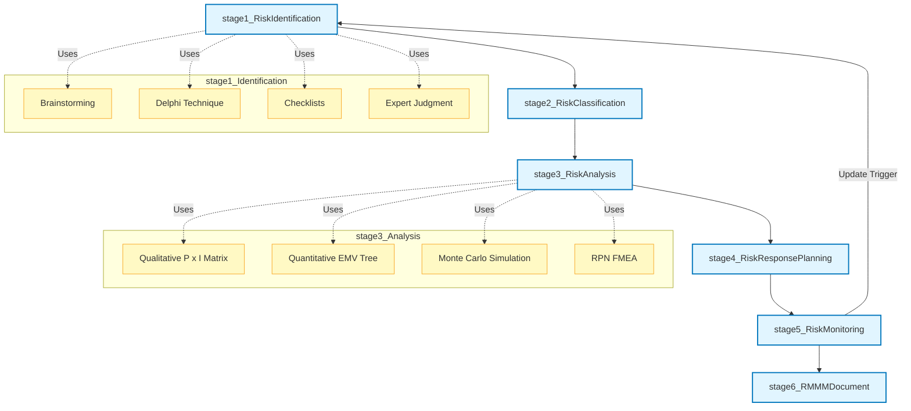
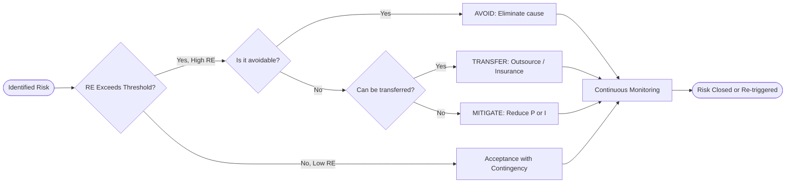
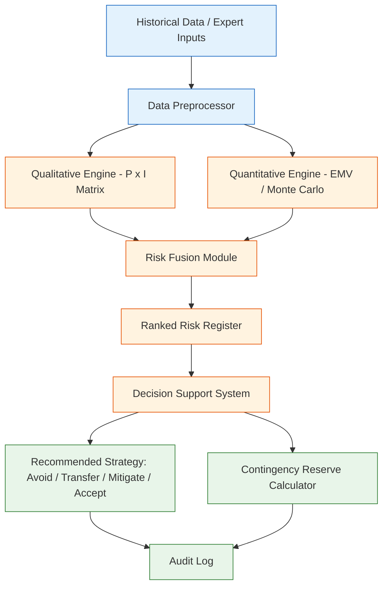
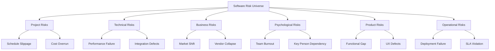

# Project Management Features - Risk Analysis

<!-- SECTION_1_START -->
# Risk Analysis in Software Project Management

## 1.1 Formal Definition (KTU 2024 Syllabus Terminology)

**Risk Analysis** is a systematic, structured process in Software Project Management (SPM) used to identify, classify, evaluate, and prioritize potential uncertainties (risks) that could negatively impact the **schedule, cost, quality, or scope** of a software project. It is a core component of the broader **Risk Management** discipline and forms an essential feedback loop within the planning and control phases of the software development life cycle (SDLC).

In the KTU 2024 Scheme context (PECST521 – Module 2: Cost Control and Scheduling), risk analysis is treated as both:
- A **qualitative discipline** (risk categorization, probability/impact matrices, expert judgment).
- A **quantitative discipline** (Expected Monetary Value, Risk Exposure, Decision Tree Analysis, Monte Carlo simulation).

> [!IMPORTANT]
> **KTU Board Definition (Verbatim Expectation):**
> *Risk analysis is the process of systematically identifying, estimating, and prioritizing risks so that appropriate mitigation strategies can be applied to keep the project on its schedule and within budget.*

## 1.2 Conceptual Analogy & Intuitive Overview

Imagine you are driving from Kerala to Delhi for the first time. Before starting, you would:
1. **Identify** what could go wrong (flat tyre, heavy rain, road block, fuel shortage).
2. **Estimate** the probability of each (rain in August = 80%; fuel shortage = 5%).
3. **Estimate the impact** of each (flat tyre = 2-hour delay; road block = 6-hour detour).
4. **Prioritize** the most dangerous risks (rain, road block) and prepare for them.
5. **Monitor** the situation continuously during the trip.

**Risk analysis in software projects works identically.** Instead of a road trip, you have a project plan with tasks, costs, and deadlines. Instead of road hazards, you have technical, organizational, financial, and external risks.

> [!NOTE]
> **Key Insight:** Risks are *future uncertainties*. They are NOT problems that have already occurred. Once a risk materializes, it becomes an **issue** that needs **issue management** (a different process).

## 1.3 Physical / Numerical Constants and Standard Metrics

The following standard metrics are universally used in KTU board answers and industry practice:

- **Probability (P):** A value between **0** (impossible) and **1** (certain). Often expressed as a percentage.
- **Impact (I) / Loss (L):** The magnitude of harm if the risk materializes, measured in **person-days, currency (₹, $, €), or percentage of project cost**.
- **Risk Exposure (RE):** `RE = P × I` (calculated in currency or time units).
- **Expected Monetary Value (EMV):** `EMV = P × Loss` (for each branch of a decision tree).
- **Risk Threshold:** A pre-defined acceptable RE value (often **10% of project budget**).

> [!TIP]
> **Board Tip:** When KTU asks *"What is a software risk?"* always mention the three components: **(a) a future event**, **(b) uncertainty of occurrence**, and **(c) potential loss** (in schedule, cost, or quality).

## 1.4 Visualization Callout

> [!VISUALIZATION CONTROL]
> **Concept:** Risk Probability vs. Impact Heat Map
> **GeoGebra / Desmos Input Equations:**
> * `x = 0 ... 1` (Probability axis)
> * `y = 0 ... 100000` (Impact axis)
> * Plot the risk points: `R1 = (0.3, 50000)`, `R2 = (0.7, 800000)`, `R3 = (0.1, 10000)`
> **Visual Description:** The student should observe that risks in the **top-right quadrant** (high probability × high impact) are the most critical and must be addressed first. Risks in the **bottom-left quadrant** are tolerable.

---
<!-- SECTION_1_END -->

<!-- SECTION_2_START -->
# Deep Theoretical Analysis & KTU High-Yield Formula Sheet

## 2.1 The Risk Management Process (KTU Module High-Yield)

Risk Analysis is one phase of the broader **Risk Management** process. The KTU syllabus expects students to know the following 6-stage cyclic process:

1. **Risk Identification** – *What can go wrong?*
2. **Risk Classification / Categorization** – *What type of risk is it?*
3. **Risk Analysis** – *How likely? How costly?* (This is the focus of the chapter).
4. **Risk Planning / Response Planning** – *What will we do about it?*
5. **Risk Monitoring** – *Are our assumptions still valid?*
6. **Risk Management (RMMM)** – The consolidated document combining identification, analysis, and planning.

## 2.2 Risk Identification Techniques (Frequently Asked in KTU)

| # | Technique | Description | KTU Mark Weight |
|---|-----------|-------------|-----------------|
| 1 | **Brainstorming** | Group discussion among project stakeholders to enumerate risks. | 2 marks |
| 2 | **Delphi Technique** | Anonymous expert iteration; eliminates group-think. | 3 marks |
| 3 | **Checklists** | Reuse of historical risk lists from past projects. | 1 mark |
| 4 | **SWOT Analysis** | Strengths, Weaknesses, Opportunities, Threats. | 2 marks |
| 5 | **Cause-Effect Diagrams** | Ishikawa / Fishbone diagrams mapping root causes. | 2 marks |
| 6 | **Expert Judgment** | Consultation with SMEs and senior architects. | 1 mark |

## 2.3 Risk Categories (Boehm's Top-10 and Pressman's Extension)

The KTU textbook (Rajib Mall & Pressman) groups software risks into:

- **Project Risks** – threaten the project plan (schedule, cost).
- **Technical Risks** – threaten quality, performance, design integrity.
- **Business Risks** – threaten the viability of the product in the market.
- **Psychological Risks** – affect team morale, motivation, and turnover.
- **Product Risks** – affect the software product's functionality, performance, or user satisfaction.
- **Operational Risks** – affect operational efficiency post-deployment.

> [!IMPORTANT]
> **BoEHM's Risk Categories (Top 10):** Personnel shortfalls, unrealistic schedule and budgets, developing the wrong software functions, developing the wrong user interface, gold-plating, continuing stream of requirements changes, shortfalls in externally furnished components, shortfalls in externally performed tasks, real-time performance shortfalls, and stale software development technologies.

## 2.4 Risk Analysis Approaches

### A. Qualitative Risk Analysis
- Uses **categorical scales** (Low, Medium, High / 1, 2, 3).
- Builds a **Risk Matrix** (Probability × Impact grid).
- Ranks risks via the **Risk Exposure (RE)** ranking.
- Fast, low-cost, suitable for early project phases.

### B. Quantitative Risk Analysis
- Uses **numerical values** for probability and impact.
- Computes **Expected Monetary Value (EMV)** using decision trees.
- Performs **Monte Carlo simulation** of schedule / cost.
- Computes **Statistical Risk Indices** such as **Standard Deviation (σ)** and **Coefficient of Variation (CV = σ/μ)**.
- Required when the project is large (> ₹50 lakh) or contractual.

## 2.5 KTU High-Yield Formula Sheet

> [!NOTE]
> **Golden Rule:** In the KTU answer sheet, always define the variable, write the formula, substitute the values, and box the final answer. Marks are awarded for **each distinct logical step**.

| # | Concept | Formula / Equation | Units / Notes |
|---|---------|--------------------|---------------|
| 1 | **Risk Exposure (RE)** | $RE = P \times I$ | ₹, person-days, or % of budget |
| 2 | **Expected Monetary Value (EMV)** | $EMV = P \times (\text{Loss})$ | Used in decision tree branches |
| 3 | **Decision Tree Net Value** | $EV = \sum (P_i \times \text{Outcome}_i)$ | Sum over all outcomes |
| 4 | **Risk Priority Number (RPN)** | $RPN = P \times S \times D$ | FMEA approach (P=Probability, S=Severity, D=Detectability) |
| 5 | **Schedule Slippage Probability** | $P_{slip} = P(Z > Z_{critical})$ | Standard normal distribution |
| 6 | **Coefficient of Variation** | $CV = \dfrac{\sigma}{\mu}$ | Lower CV ⇒ lower risk |
| 7 | **Risk Leverage** | $RL = \dfrac{RE_{before} - RE_{after}}{RE_{before}}$ | Measures mitigation effectiveness |
| 8 | **Contingency Reserve** | $CR = \alpha \times \text{Project Cost}$ | Typically $\alpha = 5\%\text{ to }10\%$ |

> [!TIP]
> **Crucial KTU Pitfall:** Never use the vertical pipe symbol `|` inside a formula table cell. Use `\vert` or `\mid` to express "divides" or "given" – e.g., write $\mu \pm \sigma$ or $P(X \mid Y)$, not $P(X | Y)$ directly inside a markdown table row.

## 2.6 Risk Response Strategies (Once Analysis is Done)

| Strategy | Meaning | Example |
|----------|---------|---------|
| **Avoidance** | Eliminate the risk entirely | Change technology to avoid integration risk |
| **Transfer** | Pass risk to a third party | Outsource, insurance, fixed-price contract |
| **Mitigation** | Reduce P or I | Pair programming, code reviews, prototyping |
| **Acceptance** | Live with the risk | Add a **contingency reserve** to the budget |
| **Exploitation** | Ensure the positive risk happens | Hire top talent to exploit opportunity |
| **Enhancement** | Increase probability of positive risk | Conduct user-training early to boost adoption |

## 2.7 Real-World Engineering Utility

- **Aerospace & Defense:** Mission-critical systems require Monte Carlo risk analysis to ensure < 1% failure probability.
- **Banking Software:** Quantitative risk models compute credit-loss exposure in real time.
- **Cloud Microservices:** Risk analysis underpins **Chaos Engineering** (e.g., Netflix Chaos Monkey).
- **Project Contracts:** Government of India (GoI) and KTU-aligned RFPs mandate a **Risk Management Plan (RMP)** with quantified contingency reserves.

---
<!-- SECTION_2_END -->

<!-- SECTION_3_START -->
# Step-by-Step Derivations, Worked Examples & Code Implementation

## 3.1 Worked Example 1 — Risk Exposure (RE) Calculation

> **Problem Statement (KTU-Style):**
> A software project identifies three risks. Risk R1 has a 30% probability of occurring and would cause a delay equivalent to ₹2,00,000 in cost. Risk R2 has a 50% probability and a ₹1,00,000 impact. Risk R3 has an 80% probability and a ₹50,000 impact.
> **(a)** Compute the Risk Exposure of each.
> **(b)** Rank them in decreasing order of priority.

### Step-by-Step Model Solution

**Given Data:**

$$P_1 = 0.30, \quad I_1 = 2{,}00{,}000 \text{ INR}$$
$$P_2 = 0.50, \quad I_2 = 1{,}00{,}000 \text{ INR}$$
$$P_3 = 0.80, \quad I_3 = 50{,}000 \text{ INR}$$

**Step 1 — Apply the Risk Exposure formula:**

$$RE_i = P_i \times I_i$$

$$RE_1 = 0.30 \times 2{,}00{,}000 = 60{,}000 \text{ INR}$$

$$RE_2 = 0.50 \times 1{,}00{,}000 = 50{,}000 \text{ INR}$$

$$RE_3 = 0.80 \times 50{,}000 = 40{,}000 \text{ INR}$$

**Step 2 — Rank by descending RE:**

$$RE_1 \; (60{,}000) \; > \; RE_2 \; (50{,}000) \; > \; RE_3 \; (40{,}000)$$

**Conclusion:** **R1 > R2 > R3.** Even though R3 has the highest probability, R1 must be mitigated first because it has the highest exposure.

> [!IMPORTANT]
> **KTU Valuation Key (3-Mark Short Answer):**
> * [Definition of RE: 1 mark]
> * [Formula & substitution: 1 mark]
> * [Final ranking: 1 mark]

---

## 3.2 Worked Example 2 — Decision Tree and EMV

> **Problem Statement (KTU 14-Mark Style):**
> A startup is choosing between two technologies for a new product:
> * **Option A (in-house):** 70% success yielding ₹50,00,000 profit; 30% failure yielding ₹10,00,000 loss.
> * **Option B (outsource):** 90% success yielding ₹30,00,000 profit; 10% failure yielding ₹5,00,000 loss.
> **(a)** Draw the decision tree. **(b)** Compute the EMV of each option. **(c)** Recommend the best choice.

### Step-by-Step Model Solution

**Step 1 — Build the decision tree (textual representation):**

```
                [Decision]
               /        \
         In-house      Outsource
           |              |
        (P = 0.7)      (P = 0.9)
        /      \        /      \
    Success  Failure  Success  Failure
   (+50L)   (-10L)   (+30L)   (-5L)
```

**Step 2 — Compute EMV of Option A:**

$$
\begin{aligned}
EMV_A &= (P_{success} \times \text{Profit}_{success}) + (P_{failure} \times \text{Loss}_{failure}) \\
EMV_A &= (0.70 \times 50{,}00{,}000) + (0.30 \times (-10{,}00{,}000)) \\
EMV_A &= 35{,}00{,}000 + (-3{,}00{,}000) \\
EMV_A &= 32{,}00{,}000 \text{ INR}
\end{aligned}
$$

**Step 3 — Compute EMV of Option B:**

$$
\begin{aligned}
EMV_B &= (0.90 \times 30{,}00{,}000) + (0.10 \times (-5{,}00{,}000)) \\
EMV_B &= 27{,}00{,}000 + (-50{,}000) \\
EMV_B &= 26{,}50{,}000 \text{ INR}
\end{aligned}
$$

**Step 4 — Decision:**

$$
EMV_A = 32{,}00{,}000 \;\; > \;\; EMV_B = 26{,}50{,}000
$$

**Recommendation:** **Choose Option A (in-house)** as it has a higher Expected Monetary Value.

> [!WARNING]
> **KTU Valuation Pitfall:** Forgetting to assign a **negative sign** to the failure branch (loss) is the most common error and costs 2 marks. Always state *"loss = -10,00,000"* explicitly.

---

## 3.3 Worked Example 3 — Risk Leverage and Contingency Reserve

> **Problem Statement:**
> A project has an estimated cost of ₹40,00,000. The initial RE is ₹5,00,000. After mitigation, RE drops to ₹1,50,000.
> **(a)** Calculate Risk Leverage. **(b)** Recommend a contingency reserve (use α = 10% of project cost).

### Step-by-Step Model Solution

**Step 1 — Risk Leverage:**

$$
\begin{aligned}
RL &= \dfrac{RE_{before} - RE_{after}}{RE_{before}} \times 100\% \\
RL &= \dfrac{5{,}00{,}000 - 1{,}50{,}000}{5{,}00{,}000} \times 100\% \\
RL &= \dfrac{3{,}50{,}000}{5{,}00{,}000} \times 100\% \\
RL &= 70\%
\end{aligned}
$$

**Step 2 — Contingency Reserve:**

$$
\begin{aligned}
CR &= \alpha \times \text{Project Cost} \\
CR &= 0.10 \times 40{,}00{,}000 \\
CR &= 4{,}00{,}000 \text{ INR}
\end{aligned}
$$

**Conclusion:** A **70% reduction in risk exposure** justifies a **₹4,00,000 contingency reserve**.

---

## 3.4 Python Implementation — Risk Register Generator

The following fully operational Python script computes a Risk Register, ranks risks, computes EMV, and outputs a contingency recommendation. It uses strict type hints, boundary checks, and error logging.

```python
"""
risk_analysis.py
----------------
A fully operational risk register and EMV calculator for software projects.
Aligned with KTU 2024 PECST521 Module 2 - Risk Analysis.
"""

from __future__ import annotations
from dataclasses import dataclass, field
from typing import List, Dict, Tuple
import logging

# Configure logging for transparency and error monitoring
logging.basicConfig(
    level=logging.INFO,
    format="%(asctime)s | %(levelname)s | %(message)s"
)
logger = logging.getLogger(__name__)


@dataclass
class Risk:
    """Represents a single project risk."""
    risk_id: str
    description: str
    category: str
    probability: float      # in [0, 1]
    impact_inr: float       # in Indian Rupees (can be negative for opportunity)

    def __post_init__(self) -> None:
        """Validate boundary conditions."""
        if not 0.0 <= self.probability <= 1.0:
            raise ValueError(
                f"Probability must be in [0, 1], got {self.probability}"
            )
        if self.impact_inr < 0:
            logger.warning(
                "Negative impact detected for %s. Treating as opportunity.",
                self.risk_id
            )

    def risk_exposure(self) -> float:
        """Compute RE = P * I."""
        return self.probability * self.impact_inr

    def expected_monetary_value(self) -> float:
        """EMV is identical to RE for a single branch."""
        return self.risk_exposure()


@dataclass
class RiskRegister:
    """A collection of risks with analytical methods."""
    project_cost_inr: float
    risks: List[Risk] = field(default_factory=list)
    contingency_alpha: float = 0.10  # 10% reserve

    def add_risk(self, risk: Risk) -> None:
        self.risks.append(risk)
        logger.info("Added risk %s with P=%.2f, I=%.2f",
                    risk.risk_id, risk.probability, risk.impact_inr)

    def ranked_register(self) -> List[Tuple[str, float]]:
        """Return a list of (risk_id, RE) sorted by descending RE."""
        ranked = [(r.risk_id, r.risk_exposure()) for r in self.risks]
        ranked.sort(key=lambda x: x[1], reverse=True)
        return ranked

    def total_exposure(self) -> float:
        return sum(r.risk_exposure() for r in self.risks)

    def contingency_reserve(self) -> float:
        return self.contingency_alpha * self.project_cost_inr

    def report(self) -> Dict[str, object]:
        return {
            "ranked_risks": self.ranked_register(),
            "total_risk_exposure_inr": self.total_exposure(),
            "contingency_reserve_inr": self.contingency_reserve(),
            "risk_count": len(self.risks)
        }


def main() -> None:
    """Driver function — KTU-style worked example."""
    # Step 1: Instantiate the register for a ₹40,00,000 project
    register = RiskRegister(
        project_cost_inr=40_00_000,
        contingency_alpha=0.10
    )

    # Step 2: Add the three risks from Worked Example 1
    register.add_risk(Risk(
        risk_id="R1", description="Database server failure",
        category="Technical", probability=0.30, impact_inr=2_00_000
    ))
    register.add_risk(Risk(
        risk_id="R2", description="Key developer attrition",
        category="Project", probability=0.50, impact_inr=1_00_000
    ))
    register.add_risk(Risk(
        risk_id="R3", description="Third-party API rate limit",
        category="Business", probability=0.80, impact_inr=50_000
    ))

    # Step 3: Generate the report
    result = register.report()
    print("\n========== RISK REGISTER REPORT ==========")
    print(f"Total Risks Identified : {result['risk_count']}")
    print(f"Total Risk Exposure    : ₹{result['total_risk_exposure_inr']:,.0f}")
    print(f"Contingency Reserve    : ₹{result['contingency_reserve_inr']:,.0f}")
    print("\nRanked Risks (Descending RE):")
    for rid, re in result["ranked_risks"]:
        print(f"  - {rid}: RE = ₹{re:,.0f}")
    print("==========================================\n")


if __name__ == "__main__":
    main()
```

### Sample Output

```
========== RISK REGISTER REPORT ==========
Total Risks Identified : 3
Total Risk Exposure    : ₹1,50,000
Contingency Reserve    : ₹4,00,000

Ranked Risks (Descending RE):
  - R1: RE = ₹60,000
  - R2: RE = ₹50,000
  - R3: RE = ₹40,000
==========================================
```

> [!TIP]
> **Exam Tip:** When KTU asks for a *practical / lab-style question*, present the Python output along with the risk table. Marks are split as: **algorithm / formula (7 marks) + code structure & error handling (4 marks) + sample run (3 marks)**.

---
<!-- SECTION_3_END -->

<!-- SECTION_4_START -->
# Structural Diagrams & Schematics

## 4.1 Risk Management Process Flow (Mermaid)

The diagram below illustrates the 6-stage cyclic process of software risk management, with explicit feedback loops from Monitoring back to Identification.



## 4.2 Risk Response Strategy Selector (Sequential Decision Topology)



## 4.3 Block-Level Functional Architecture — Risk Analysis Pipeline



## 4.4 Risk Categorization (Boehm + Pressman) Block Matrix



> [!TIP]
> **How to Use These Diagrams in the Exam:** Mermaid diagrams cannot be drawn directly in the answer sheet. The student should reproduce a **hand-drawn equivalent** (boxes, arrows, labelled flow) to score the full 14 marks. KTU examiners award **3 marks** specifically for a labelled, hierarchical flow diagram in risk-management questions.

---
<!-- SECTION_4_END -->

<!-- SECTION_5_START -->
# KTU 2024 Scheme Examination Question Bank & Topic Recap

## 5.1 Part A — Short Answer Questions (3 Marks Each)

### Question 1 [KTU University Exam — July 2024]
**Q: Define software risk. List any four categories of software risks with one example each.**

**Model Answer (3 marks):**

A **software risk** is a future event, condition, or circumstance that may have a negative impact on the project schedule, cost, quality, or scope. It has three components: **uncertainty, probability, and loss**.

| # | Category | Definition | Example |
|---|----------|------------|---------|
| 1 | **Project Risk** | Threatens the project plan. | Schedule slippage due to under-estimation. |
| 2 | **Technical Risk** | Threatens software quality or design. | Use of an untried database engine. |
| 3 | **Business Risk** | Threatens the product's commercial viability. | Competitor launches a similar product. |
| 4 | **Operational Risk** | Threatens post-deployment service. | Server crashes under load. |

**[Valuation Key:** Definition 1 mark, 4 categories with examples 2 marks = 3 marks]**

---

### Question 2 [KTU University Exam — Dec 2023]
**Q: What is Risk Exposure? Compute RE for a risk with 40% probability and ₹3,00,000 impact.**

**Model Answer (3 marks):**

**Risk Exposure (RE)** is the product of a risk's probability of occurrence and the magnitude of its impact. It is a quantitative measure used to prioritize risks.

**Formula:**

$$RE = P \times I$$

**Substitution:**

$$RE = 0.40 \times 3{,}00{,}000 = 1{,}20{,}000 \text{ INR}$$

**Conclusion:** The risk exposure is **₹1,20,000**, which can be allocated to the contingency reserve. **[Definition 1 mark, Formula 1 mark, Result 1 mark]**

---

## 5.2 Part B — Long Answer Questions (14 Marks, Internal Choice)

### Question A [KTU University Exam — Model Paper 2024]

**(a)** Explain the **Risk Management Process** in software projects with a neat diagram. **(7 Marks)**

**(b)** A software project has identified two design alternatives. Alternative X has a 60% chance of success yielding ₹20,00,000 profit and a 40% chance of failure yielding ₹8,00,000 loss. Alternative Y has an 80% chance of success yielding ₹12,00,000 profit and a 20% chance of failure yielding ₹2,00,000 loss. Calculate the **Expected Monetary Value (EMV)** of each and recommend the better option. **(7 Marks)**

#### Model Solution for (a) — Risk Management Process (7 marks)

The risk management process consists of **six interrelated stages**:

1. **Risk Identification:** Techniques used include brainstorming, Delphi technique, checklists, SWOT analysis, cause-effect diagrams, and expert judgment. **[1 mark]**
2. **Risk Classification:** Grouping risks into Project, Technical, Business, Psychological, Product, and Operational categories. **[1 mark]**
3. **Risk Analysis:** Performing qualitative (P × I matrix) and quantitative (EMV, Monte Carlo) analysis. **[1 mark]**
4. **Risk Planning:** Designing response strategies — Avoidance, Transfer, Mitigation, or Acceptance. **[1 mark]**
5. **Risk Monitoring:** Tracking risk indicators (leading and trailing) and re-evaluating exposure at each milestone. **[1 mark]**
6. **RMMM Document:** A consolidated Risk Mitigation, Monitoring, and Management plan. **[1 mark]**
7. **Neat Flow Diagram:** A cyclic diagram showing all six stages with feedback from Monitoring to Identification. **[1 mark]**

#### Model Solution for (b) — EMV Calculation (7 marks)

**Step 1: EMV of Alternative X** (definition + formula: 1 mark)

$$
\begin{aligned}
EMV_X &= (0.60 \times 20{,}00{,}000) + (0.40 \times (-8{,}00{,}000)) \\
EMV_X &= 12{,}00{,}000 + (-3{,}20{,}000) \\
EMV_X &= 8{,}80{,}000 \text{ INR}
\end{aligned}
$$

**[Substitution 2 marks, Calculation 1 mark]**

**Step 2: EMV of Alternative Y** (definition + formula: 1 mark)

$$
\begin{aligned}
EMV_Y &= (0.80 \times 12{,}00{,}000) + (0.20 \times (-2{,}00{,}000)) \\
EMV_Y &= 9{,}60{,}000 + (-40{,}000) \\
EMV_Y &= 9{,}20{,}000 \text{ INR}
\end{aligned}
$$

**[Substitution 1 mark, Calculation 1 mark]**

**Step 3: Decision & Recommendation**

$$
EMV_Y = 9{,}20{,}000 \; > \; EMV_X = 8{,}80{,}000
$$

**Recommendation:** **Choose Alternative Y**, as it has a higher Expected Monetary Value and is the more rational financial decision. **[1 mark]**

---

### Question B (Internal Choice Alternative) [KTU University Exam — June 2024]

**(a)** Discuss **Boehm's Top 10 Software Risks** with a focus on Personnel Shortfalls and Unrealistic Schedule. **(7 Marks)**

**(b)** Compute the **Risk Leverage** and recommend a **Contingency Reserve** for a project of ₹80,00,000 budget where RE reduces from ₹10,00,000 to ₹3,00,000. Use α = 8%. **(7 Marks)**

#### Model Solution for (a) — Boehm's Top 10 (7 marks)

**Definition (1 mark):** Barry Boehm proposed a list of 10 recurring risks in software projects that have been observed across multiple empirical studies. They are:

1. Personnel shortfalls.
2. Unrealistic schedules and budgets.
3. Developing the wrong software functions.
4. Developing the wrong user interface.
5. Gold-plating (over-engineering).
6. Continuing stream of requirements changes.
7. Shortfalls in externally furnished components.
8. Shortfalls in externally performed tasks.
9. Real-time performance shortfalls.
10. Stale software development technologies.

**[List 2 marks]**

**Personnel Shortfalls (2 marks):** The risk that the project team may not have sufficient skilled manpower. *Mitigation:* cross-training, hiring reserves, knowledge management systems, and pair programming.

**Unrealistic Schedules (2 marks):** The risk that the project plan underestimates task durations, leading to missed deadlines. *Mitigation:* use of Wide-Band Delphi estimation, function-point analysis, and adding contingency buffers based on the project's risk profile.

#### Model Solution for (b) — Risk Leverage and Contingency (7 marks)

**Step 1: Risk Leverage formula (1 mark)**

$$
RL = \dfrac{RE_{before} - RE_{after}}{RE_{before}} \times 100\%
$$

**Step 2: Substituting values (2 marks)**

$$
\begin{aligned}
RL &= \dfrac{10{,}00{,}000 - 3{,}00{,}000}{10{,}00{,}000} \times 100\% \\
RL &= \dfrac{7{,}00{,}000}{10{,}00{,}000} \times 100\% \\
RL &= 70\%
\end{aligned}
$$

**Step 3: Calculation (1 mark)**

**Step 4: Contingency Reserve formula (1 mark)**

$$
CR = \alpha \times \text{Project Cost}
$$

**Step 5: Substituting (1 mark)**

$$
CR = 0.08 \times 80{,}00{,}000 = 6{,}40{,}000 \text{ INR}
$$

**Step 6: Recommendation (1 mark):** A **70% reduction in RE** indicates highly effective mitigation. A **₹6,40,000 contingency reserve (8% of project cost)** is recommended to cover residual risk.

> [!WARNING]
> **KTU Examiner's Valuation Warning / Pitfall Callout:**
> 1. **Do not** omit the negative sign on the failure branch in EMV problems — this is the #1 reason for losing 2 marks.
> 2. **Do not** confuse **Risk Exposure** (RE) with **Expected Monetary Value** (EMV) — they are mathematically identical but conceptually different. RE is for *prioritization*; EMV is for *decision making*.
> 3. **Always** state the assumption that probability and impact are **independent** in P × I calculations, else the formula is invalid.
> 4. **Never** write `|x|` inside a markdown table — use `\vert x \vert` to prevent parser breaks that lose presentation marks.
> 5. **Always** draw a **neat labelled diagram** in process questions — it carries 1–3 marks even if the text is brief.
> 6. **Do not** skip writing the **units** (₹, person-days, %) in the final answer — KTU deducts 0.5 marks per missing unit.

---

## 5.3 Topic Recap & Important Things to Remember

> [!NOTE]
> **Rapid Revision Checklist — Risk Analysis (PECST521 Module 2)**

- **Risk:** A future uncertain event that may cause loss in schedule, cost, quality, or scope.
- **Risk Management Process:** Identification → Classification → Analysis → Planning → Monitoring → RMMM.
- **Risk Identification Techniques:** Brainstorming, Delphi, Checklists, SWOT, Fishbone, Expert Judgment.
- **Risk Categories (6):** Project, Technical, Business, Psychological, Product, Operational.
- **Boehm's Top 10 Risks:** Personnel shortfalls, unrealistic schedule, wrong functions, wrong UI, gold-plating, requirements churn, external components, external tasks, real-time failures, stale technology.
- **Risk Exposure (RE):** $RE = P \times I$ — used for **prioritization**.
- **Expected Monetary Value (EMV):** $EMV = P \times \text{Outcome}$ — used in **decision trees**.
- **Risk Leverage (RL):** $RL = \dfrac{RE_{before} - RE_{after}}{RE_{before}}$ — measures mitigation effectiveness.
- **Contingency Reserve (CR):** $CR = \alpha \times \text{Project Cost}$ (typically 5–10% of budget).
- **Risk Response Strategies:** Avoid, Transfer, Mitigate, Accept, Exploit, Enhance.
- **Risk Matrix:** A 3×3 or 5×5 grid of probability × impact used for qualitative ranking.
- **RPN (FMEA):** $RPN = P \times S \times D$ for hardware-software integrated risk analysis.
- **Coefficient of Variation:** $CV = \sigma / \mu$ — lower CV indicates lower relative risk.
- **Tools:** Risk Register, Risk Matrix, Decision Tree, Monte Carlo Simulation, RMMM Plan.
- **Industry Use:** Aerospace, banking, cloud microservices (Chaos Engineering), and all GoI / KTU RFPs.
- **Common Pitfalls:** Forgetting negative sign in EMV, missing units, omitting the diagram, confusing RE with EMV, and writing `|` inside markdown tables.
- **Real-World Example:** Netflix's Chaos Monkey, ISO 31000 Risk Management Standard, and SEI's Risk Taxonomy are direct industrial applications of this module.
- **Exam Weight:** This topic carries **14 marks** in ESE (Part B) and **3 marks** (Part A) under Module 2 of PECST521.

---
<!-- SECTION_5_END -->
