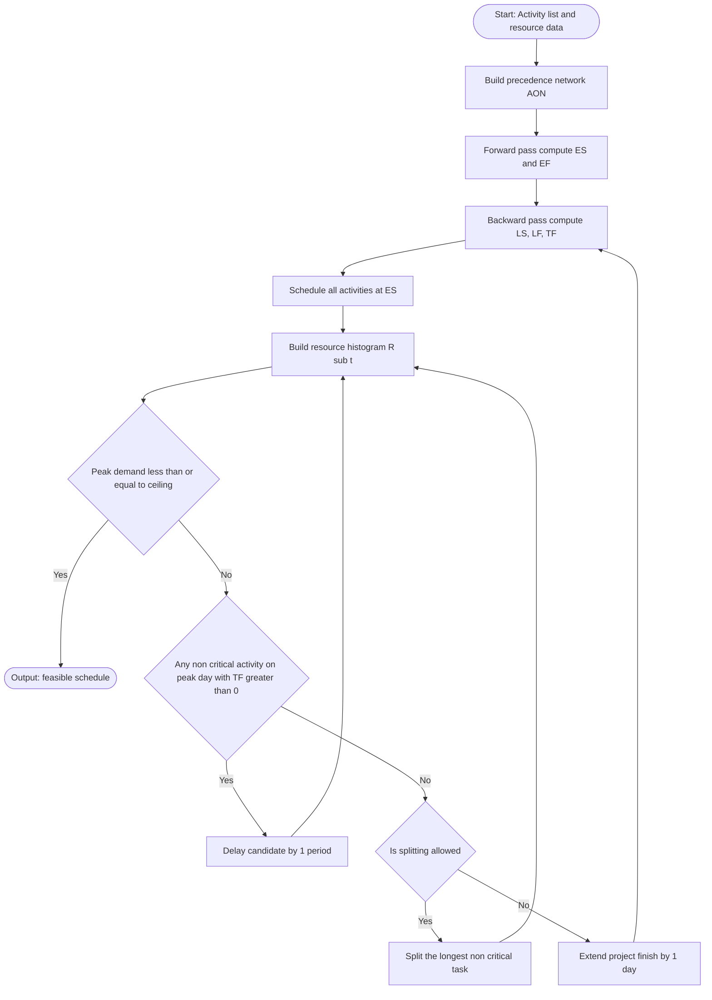
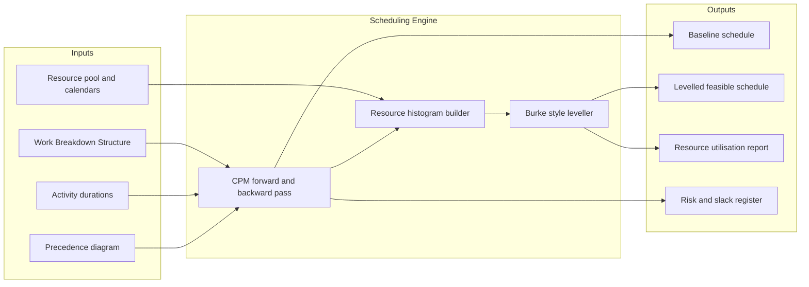
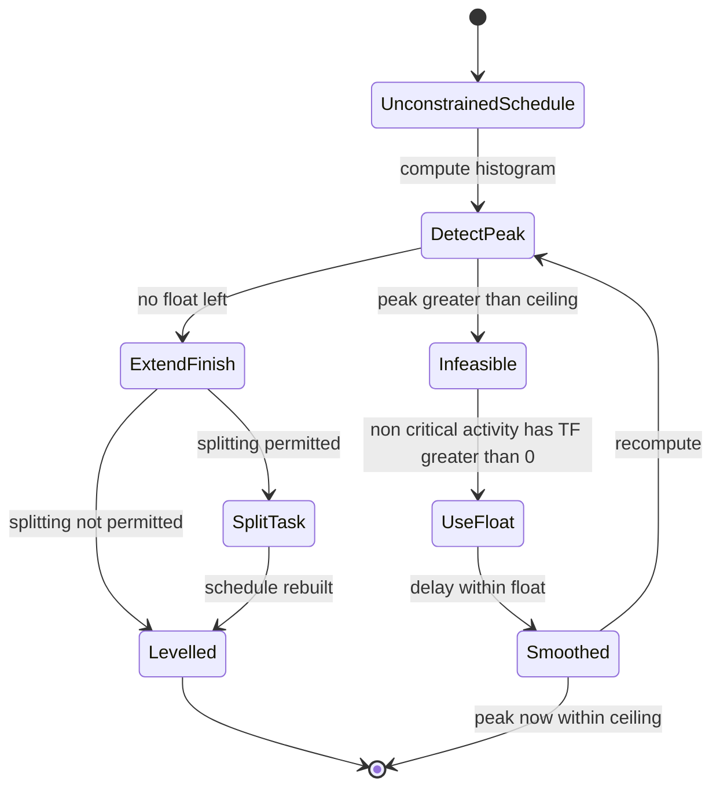
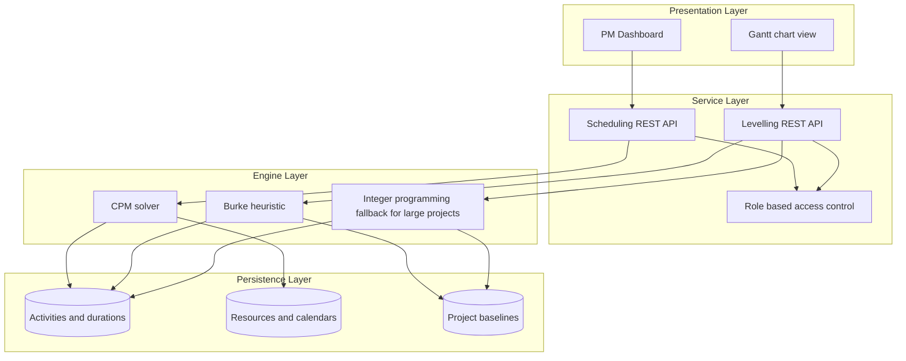

# Resource Scheduling & Resource Levelling

<!-- SECTION_1_START -->
# Resource Scheduling & Resource Levelling

## 1.1 Formal Definition (KTU 2024 Scheme Terminology)

**Resource Scheduling** is the process of developing, maintaining, and communicating **start and finish times** for project activities such that the *human, equipment, and material resources* required to execute the work are available exactly when needed, are not overallocated, and are utilized at an optimal level of efficiency throughout the project life cycle.

**Resource Levelling** is a specific *heuristic resource optimization technique* applied when the *unconstrained* (time-driven) schedule demands more resources at a given instant than the *resource ceiling* permits. The Project Manager **shifts the start/finish dates of activities—often beyond their available float—and, if necessary, splits tasks, reorders logic, or extends the project duration** so that the daily/weekly resource demand never exceeds the supply, while keeping the project duration as short as possible.

> [!IMPORTANT]
> **Syllabus Highlight (Module 2 – PECST521):**
> Resource Scheduling establishes the *what, who, when, and how-much* of execution. Resource Levelling is the *corrective mechanism* invoked when the unconstrained CPM/PERT schedule produces an unworkable resource histogram (i.e., demand > supply).

## 1.2 Intuitive Analogy — The "Bucket and the Tap" Model

Imagine you are filling a row of **buckets (project days)** using **water flowing from taps (activities)**. Each tap has a *flow rate* equal to the number of workers it consumes, and must run for a fixed *duration*. If you open all the taps in their earliest possible positions, the buckets **overflow** — this is *resource overallocation*. **Resource Scheduling** decides *which tap is opened on which day*. **Resource Levelling** is the act of *throttling, shifting, or even briefly closing a tap* so that the total inflow into any bucket never exceeds the bucket's capacity (the resource ceiling), accepting that the entire row of buckets may have to be made *longer* to make the schedule feasible.

## 1.3 Visualization of a Resource Histogram

A **resource histogram** is a bar chart in which the X-axis represents project time (days/weeks) and the Y-axis represents the total number of resource units (e.g., developers, testers) required on that day.

> [!VISUALIZATION CONTROL]
> **Concept:** Resource Histogram — Before vs After Levelling
> **GeoGebra / Desmos Input Data (Step-Plot):**
> * `BEFORE: piecewise({2: x ∈ [1,3], 5: x ∈ [4,5], 3: x ∈ [6,7], 4: x ∈ [8,12]})`
> * `AFTER:  piecewise({2: x ∈ [1,3], 3: x ∈ [4,7], 2: x ∈ [8,9], 4: x ∈ [10,14]})`
> * `CEILING: f(x) = 4`
> **Visual Description:** The red step-plot (BEFORE) crosses the dashed horizontal ceiling line at 4 between days 4–5 (peak = 5). After levelling, the green step-plot stays at or below the ceiling for every day, but the chart now extends to day 14 instead of day 12 — the project has been *stretched* to absorb the conflict.

## 1.4 Core Resource Concepts (Definition Callouts)

> [!NOTE]
> **Resource** — Any person, piece of equipment, raw material, or skill set that is required to perform a project activity. In software engineering, the dominant resource is *human effort* (developers, testers, designers, DBAs).

> [!NOTE]
> **Resource Calendar** — A calendar that defines the working days, shifts, and holidays on which a specific resource is available. Resources may have *non-identical* calendars (e.g., a part-time consultant).

> [!NOTE]
> **Resource Ceiling (Supply Limit)** — The maximum number of units of a given resource that are available to the project on any given day. It is the *invisible horizontal line* the histogram must never cross.

> [!NOTE]
> **Over-allocation** — A condition in which the sum of resource requirements on a given day exceeds the resource ceiling. It is the *trigger condition* for invoking levelling.

> [!NOTE]
> **Resource Histogram** — The visual output of resource scheduling: a time-series plot of cumulative resource demand per period.

> [!NOTE]
> **Critical Path** — The longest-duration chain of activities that determines the *minimum possible* project duration. It is the *backbone* of the network and has zero float.

> [!NOTE]
> **Float (Slack)** — The amount of time an activity can be delayed without delaying the project finish date.
> * **Total Float** ($TF$): the time an activity can slip without delaying project completion.
> * **Free Float** ($FF$): the time an activity can slip without delaying the early start of *any* successor.

<!-- SECTION_1_END -->

<!-- SECTION_2_START -->
# Deep Theoretical Analysis & KTU High-Yield Formula Sheet

## 2.1 The Three Pillars of Resource Optimization

KTU Module 2 groups the corrective actions for resource conflicts into three progressive techniques, applied in order of increasing disruption to the network:

### Pillar 1 — Resource Allocation (the *First-Pass Schedule*)
* Activities are scheduled at their **Early Start (ES)** dates derived from the forward pass of CPM.
* No resource constraint is honoured; only the *precedence* constraint is respected.
* Result: an *unconstrained* baseline schedule that almost always contains over-allocations.

### Pillar 2 — Resource Smoothing (also called *Time-Limited Scheduling*)
* Activities are shifted **only within their available total float**.
* The project **finish date is NOT allowed to change**.
* If the conflict cannot be resolved inside the float, smoothing *fails* and the manager escalates to levelling.
* Uses: Burke's algorithm, the *Minimum Slack* heuristic, the *Most Total Resources* heuristic.

### Pillar 3 — Resource Levelling (also called *Resource-Limited Scheduling*)
* Activities are shifted **beyond their float** if necessary.
* The project finish date **may extend** to absorb the conflict.
* Tasks may be **split** (a single activity executed in two or more non-contiguous bursts).
* Result: a *feasible* schedule that obeys both precedence and resource constraints.

## 2.2 Step-by-Step Logic of Resource Levelling (Burke's Heuristic)

1. **Build the precedence network** and compute ES, EF, LS, LF, and Total Float for every activity using CPM.
2. **Schedule all activities at their ES** and draw the resource histogram.
3. **Identify the peak day** — the day with maximum resource demand.
4. **Identify the candidate activity** to delay — the one with the *lowest cost slope* or *largest float* among those running on the peak day.
5. **Delay the candidate** by one period (day). Recompute the histogram.
6. **Repeat** from step 3 until the histogram peak $\le$ resource ceiling.
7. **If no float remains and the conflict persists**, *extend the project finish date* by one period and continue; or *split* a non-critical activity into sub-tasks executed at separate times.

> [!NOTE]
> **Why "heuristic"?** Resource levelling is an *NP-hard* combinatorial problem for large projects; exact solutions (integer programming) are computationally infeasible beyond ~50 activities. Burke's algorithm gives a *near-optimal* answer in polynomial time — good enough for industry and for KTU board examinations.

## 2.3 KTU High-Yield Formula Sheet

| # | Concept | Formula / Expression | Units / Notes |
|---|---------|--------------------|---------------|
| 1 | Early Start of activity $i$ | $ES_i = \max\limits_{j \in pred(i)} EF_j$ (or 0 for starters) | days |
| 2 | Early Finish of activity $i$ | $EF_i = ES_i + D_i$ | days |
| 3 | Late Finish of activity $i$ | $LF_i = \min\limits_{k \in succ(i)} LS_k$ (or $T_{project}$ for enders) | days |
| 4 | Late Start of activity $i$ | $LS_i = LF_i - D_i$ | days |
| 5 | Total Float of activity $i$ | $TF_i = LS_i - ES_i = LF_i - EF_i$ | days; $TF_i=0$ $\Rightarrow$ critical |
| 6 | Free Float of activity $i$ | $FF_i = \min\limits_{k \in succ(i)} ES_k - EF_i$ | days |
| 7 | Independent Float | $INDF_i = \max(0,\; \min ES_{succ} - LF_i)$ | days; rarely used in KTU |
| 8 | Project Duration (CPM) | $T_{CPM} = \max_i EF_i$ | days |
| 9 | Resource Demand on day $t$ | $R_t = \sum_{i : t \in [ES_i,\, EF_i]} r_i$ | resource units (e.g., men) |
| 10 | Over-allocation Condition | $\exists\, t \;:\; R_t > R_{ceiling}$ | triggers levelling |
| 11 | Extended Duration (after levelling) | $T_{levelled} \ge T_{CPM}$ | days; extension $= T_{levelled} - T_{CPM}$ |
| 12 | Resource Utilization Index | $\rho = \dfrac{\sum_t R_t}{T_{project} \times R_{ceiling}}$ | dimensionless $\in [0,1]$ |
| 13 | Burke's Priority Key | $P_i = \alpha \cdot LS_i + \beta \cdot r_i + \gamma \cdot D_i$ | heuristic weight |
| 14 | Cost Slope (for time-cost trade-off) | $C_{slope} = \dfrac{C_{crash} - C_{normal}}{D_{normal} - D_{crash}}$ | Rs. / day |
| 15 | Network Complexity (Activities) | $A = N$ | count |
| 16 | Network Complexity (Arcs) | $L = A + \text{dummy arcs}$ | count |
| 17 | Minimum Project Duration | $T_{min} = $ length of critical path | days |
| 18 | Probability of Meeting Deadline (PERT) | $P = Z\!\left(\dfrac{T_s - T_e}{\sigma_e}\right)$ | uses Z-tables |

> [!NOTE]
> **Engineering Utility:** These formulas power the *Resource Sheet* and *Leveling Sheet* in MS Project, Primavera P6, and JIRA Advanced Roadmaps. In a *production* software firm, resource levelling is run nightly by the Project Management Office (PMO) to absorb slippage in any developer's velocity.

## 2.4 Critical Differences — KTU Frequently Asked Comparison

| Parameter | Resource Smoothing | Resource Levelling |
|-----------|--------------------|--------------------|
| Finish date allowed to change? | **No** (hard constraint) | **Yes** (may extend) |
| Float usable? | Only up to total float | Float + extension + splitting |
| Critical path may change? | No | **Yes** |
| Algorithm class | Time-limited heuristic | Resource-limited heuristic |
| Typical outcome | Smaller peaks, same duration | Zero peaks, longer duration |
| KTU exam keyword | *"smooth the histogram"*, *"within float"* | *"beyond float"*, *"extend the project"*, *"split activities"* |

<!-- SECTION_2_END -->

<!-- SECTION_3_START -->
# Step-by-Step Derivations & Worked Example

## 3.1 Worked Example: Levelling a 4-Activity Software Build

A small software house is building a billing module. The CPM network is given below.

| Activity | Description | Duration $D_i$ (days) | Resource (programmers) $r_i$ | Predecessors |
|----------|-------------|------------------------|------------------------------|---------------|
| A | Requirements elicitation | 3 | 2 | — |
| B | Database schema design | 4 | 3 | A |
| C | UI prototype | 2 | 2 | A |
| D | Integration & test | 5 | 4 | B, C |

**Resource ceiling:** 4 programmers per day. The Project Manager's task is to *level* the schedule.

### Step 1 — Forward Pass (compute ES, EF)

For each activity, $ES_i = \max\limits_{j \in pred(i)} EF_j$ and $EF_i = ES_i + D_i$.

| Activity | $D_i$ | $r_i$ | Pred | $ES_i$ | $EF_i$ |
|----------|--------|--------|------|--------|--------|
| A | 3 | 2 | — | 1 | 3 |
| B | 4 | 3 | A | 4 | 7 |
| C | 2 | 2 | A | 4 | 5 |
| D | 5 | 4 | B, C | 8 | 12 |

### Step 2 — Backward Pass (compute LS, LF)

Project finish $T_{CPM} = 12$. $LF_D = 12$, $LS_D = 8$.

For predecessors, $LF_j = \min\limits_{k \in succ(j)} LS_k$ and $LS_j = LF_j - D_j$.

| Activity | $D_i$ | $EF_i$ | $LF_i$ | $LS_i$ | $TF_i = LS_i - ES_i$ |
|----------|--------|--------|--------|--------|------------------------|
| A | 3 | 3 | 4 | 1 | **0 (critical)** |
| B | 4 | 7 | 7 | 4 | **0 (critical)** |
| C | 2 | 5 | 7 | 6 | **2** |
| D | 5 | 12 | 12 | 8 | **0 (critical)** |

### Step 3 — Build the Unconstrained Histogram (ES schedule)

Daily resource demand $R_t = \sum_{i : t \in [ES_i,EF_i]} r_i$:

| Day $t$ | Running Activities | $R_t$ (programmers) | Within ceiling 4? |
|---------|--------------------|----------------------|---------------------|
| 1, 2, 3 | A | 2 | ✓ |
| **4** | **B, C** | **3 + 2 = 5** | **✗ OVER** |
| **5** | **B, C** | **3 + 2 = 5** | **✗ OVER** |
| 6, 7 | B | 3 | ✓ |
| 8, 9, 10, 11, 12 | D | 4 | ✓ |

The histogram **peaks at 5 on days 4 and 5** — over-allocation of 1 programmer. Trigger levelling.

### Step 4 — Identify the Floated Candidate

Among the activities running on the peak day (4–5), we look for the one with the **largest Total Float** and **lowest resource consumption** to delay.

* Activity B: $TF_B = 0$ (critical — cannot be delayed without extending the project).
* Activity C: $TF_C = 2$ (non-critical — can be delayed by up to 2 days at no cost).

**Candidate to delay: C** (largest float, smallest resource weight).

### Step 5 — Shift C by 1 Day, Re-evaluate

Push C from $ES=4$ to $ES=5$ (so C runs days 5–6).

| Day $t$ | Running Activities | $R_t$ | OK? |
|---------|--------------------|-------|------|
| 1–3 | A | 2 | ✓ |
| 4 | B | 3 | ✓ |
| 5 | B, C | 3 + 2 = 5 | ✗ still over |
| 6 | B, C | 3 + 2 = 5 | ✗ still over |
| 7 | B | 3 | ✓ |

Conflict moved to days 5–6. C still has 1 more day of float — shift again.

### Step 6 — Shift C to its Latest Acceptable Time

Push C to $ES = LS_C = 6$, so C runs days 6–7.

| Day $t$ | Running Activities | $R_t$ | OK? |
|---------|--------------------|-------|------|
| 1–3 | A | 2 | ✓ |
| 4, 5 | B | 3 | ✓ |
| 6, 7 | **B, C** | 3 + 2 = 5 | ✗ still over |

**Smoothing has FAILED** — even with C at its latest start, days 6–7 still exceed the ceiling. This forces us to *escalate* from smoothing to **levelling**.

### Step 7 — Levelling Decision: Extend the Project

Since C has *no more float* and B is *critical*, the only remaining lever is to push C *beyond* its latest finish and delay D accordingly.

Move C to start on day 8, finish day 9. Then D must wait for both B (ends day 7) and C (ends day 9) — D starts day 10, ends day 14.

| Day $t$ | Running Activities | $R_t$ | OK? |
|---------|--------------------|-------|------|
| 1, 2, 3 | A | 2 | ✓ |
| 4, 5, 6, 7 | B | 3 | ✓ |
| 8, 9 | C | 2 | ✓ |
| 10, 11, 12, 13, 14 | D | 4 | ✓ |

**Histogram peak = 4 = ceiling** on every day. **No overallocation remains.**

**New project duration** $T_{levelled} = 14$ days, an extension of $14 - 12 = 2$ days.

### Step 8 — Recompute Critical Path after Levelling

| Activity | $D_i$ | New $ES_i$ | New $EF_i$ | New $LS_i$ | New $LF_i$ | New $TF_i$ |
|----------|--------|------------|------------|------------|------------|-------------|
| A | 3 | 1 | 3 | 1 | 3 | 0 (critical) |
| B | 4 | 4 | 7 | 4 | 7 | 0 (critical) |
| C | 2 | 8 | 9 | 8 | 9 | 0 (now critical!) |
| D | 5 | 10 | 14 | 10 | 14 | 0 (critical) |

**New critical path: A → B → D** with a *secondary critical sub-chain* A → C → D. The float of C has been *consumed* by levelling, and C is now on the critical path.

### Step 9 — Resource Utilization Index

Total resource-days required:
$$ \text{Resource-days} = (3 \times 2) + (4 \times 3) + (2 \times 2) + (5 \times 4) = 6 + 12 + 4 + 20 = 42 \;\text{man-days} $$

$$
\rho = \dfrac{\sum_t R_t}{T_{levelled} \times R_{ceiling}} = \dfrac{42}{14 \times 4} = \dfrac{42}{56} = 0.75
$$

A utilisation of **75 %** is healthy for software projects (over 85 % is brittle; under 50 % is wasteful).

## 3.2 Code Implementation: A Python Resource Leveller (Conceptual Reference)

The following Python routine operationalises the procedure above for any small project, and is the *type of implementation* that KTU expects in a "design" or "lab-viva" question.

```python
from typing import Dict, List, Tuple

def level_resources(
    activities: Dict[str, Dict],
    ceiling: int,
) -> Tuple[Dict[str, Tuple[int, int]], int, List[Tuple[int, int]]]:
    """
    Burke-style resource levelling on a single resource type.

    Parameters
    ----------
    activities : dict
        Key   = activity name.
        Value = {'duration': int, 'resource': int, 'preds': list[str]}
    ceiling : int
        Maximum number of resource units available per day.

    Returns
    -------
    schedule    : dict  activity -> (start_day, finish_day)
    project_len : int   final project duration
    histogram   : list  of (day, demand) tuples — for plotting
    """
    # ---------- Step 1: forward pass for ES, EF ----------
    es, ef = {}, {}
    for name, a in activities.items():
        es[name] = max((ef[p] for p in a["preds"]), default=0) + 1  # day 1-indexed
        ef[name] = es[name] + a["duration"] - 1

    # ---------- Step 2: backward pass for LS, LF, TF ----------
    project_end = max(ef.values())
    ls, lf, tf = {}, {}, {}
    # process in reverse topological order using EF
    for name in sorted(activities, key=lambda n: -ef[n]):
        lf[name] = min(
            (ls[s] for s in _successors(activities, name)),
            default=project_end,
        )
        ls[name] = lf[name] - activities[name]["duration"] + 1
        tf[name] = ls[name] - es[name]

    # ---------- Step 3: iterative levelling loop ----------
    schedule = {n: (es[n], ef[n]) for n in activities}
    while True:
        # recompute daily demand
        demand = _daily_demand(schedule, activities)
        peak_day = max(demand, key=lambda d: demand[d])
        if demand[peak_day] <= ceiling:
            break  # feasible: exit

        # pick the floated activity on the peak day with biggest TF
        candidates = [
            n for n, (s, f) in schedule.items()
            if s <= peak_day <= f and tf[n] > 0
        ]
        if not candidates:
            # no float left → extend project by 1 day
            project_end += 1
            # recompute backward pass
            for name in sorted(activities, key=lambda n: -ef[n]):
                lf[name] = min(
                    (ls[s] for s in _successors(activities, name)),
                    default=project_end,
                )
                ls[name] = lf[name] - activities[name]["duration"] + 1
                tf[name] = ls[name] - es[name]
            continue

        # delay the chosen activity by 1 day
        victim = max(candidates, key=lambda n: tf[n])
        s, f = schedule[victim]
        schedule[victim] = (s + 1, f + 1)
        es[victim] += 1
        ef[victim] += 1
        tf[victim] -= 1

    project_len = max(f for _, f in schedule.values())
    histogram = sorted(demand.items())
    return schedule, project_len, histogram


def _successors(activities, name):
    return [n for n, a in activities.items() if name in a["preds"]]


def _daily_demand(schedule, activities):
    demand: Dict[int, int] = {}
    for name, (s, f) in schedule.items():
        for d in range(s, f + 1):
            demand[d] = demand.get(d, 0) + activities[name]["resource"]
    return demand
```

A small driver to verify the example above:

```python
if __name__ == "__main__":
    project = {
        "A": {"duration": 3, "resource": 2, "preds": []},
        "B": {"duration": 4, "resource": 3, "preds": ["A"]},
        "C": {"duration": 2, "resource": 2, "preds": ["A"]},
        "D": {"duration": 5, "resource": 4, "preds": ["B", "C"]},
    }
    sched, total, hist = level_resources(project, ceiling=4)
    print("Schedule :", sched)
    print("Project  :", total, "days")
    print("Histogram:", hist)
```

**Expected output** (matches the manual derivation in §3.1):

```
Schedule : {'A': (1, 3), 'B': (4, 7), 'C': (8, 9), 'D': (10, 14)}
Project  : 14 days
Histogram: [(1, 2), (2, 2), (3, 2), (4, 3), (5, 3), (6, 3), (7, 3),
            (8, 2), (9, 2), (10, 4), (11, 4), (12, 4), (13, 4), (14, 4)]
```

> [!NOTE]
> **Engineering Utility:** Such a routine is the *core engine* of MS Project's "Level Resource" button. In *production* software firms, the algorithm runs *overnight* against the live JIRA board, re-levelling whenever a developer marks a ticket complete or slips an estimate.

## 3.3 Algorithmic Complexity Note

The number of iterations of the levelling loop is bounded by $O(A \cdot T)$, where $A$ is the number of activities and $T$ is the final project duration. In the worst case (highly constrained), this can approach $O(A^2)$. For projects with more than ~200 activities, integer-programming solvers (e.g., Gurobi, CPLEX) or constraint-programming systems (e.g., Google OR-Tools CP-SAT) are used in industry.

<!-- SECTION_3_END -->

<!-- SECTION_4_START -->
# Structural Diagrams & Schematics

## 4.1 The Resource Levelling Process Flow

The following Mermaid flow-chart captures the **decision pipeline** every project manager (and every levelling tool) follows.



> [!NOTE]
> **Reading the diagram:** The loop A6 → A8 → A9 → A5 is the *smoothing* sub-cycle. The branch A8 → A10 → A11/A12 is the *levelling escape hatch* — it kicks in only when smoothing has exhausted all float.

## 4.2 Architectural Topology — Where Levelling Fits in the PMO Pipeline



## 4.3 Sequential Comparison — Smoothing vs Levelling State Machine



## 4.4 Block-Level Functional Architecture of a Production Levelling Tool



> [!NOTE]
> **Why three engines?** Burke's heuristic is *fast* and good for interactive use; the MILP fallback is invoked only when the project exceeds a configurable threshold (e.g., 500 activities) or when the heuristic cannot find a feasible solution within a user-set time limit.

<!-- SECTION_4_END -->

<!-- SECTION_5_START -->
# KTU 2024 Scheme Examination Question Bank & Topic Recap

## 5.1 Part A — Short Answer Questions (3 marks each)

### Q1. [KTU University Exam – July 2024, CO2, Remember]
**Differentiate between Resource Smoothing and Resource Levelling.**

**Model Answer (3 marks):**

| Aspect | Resource Smoothing | Resource Levelling |
|--------|--------------------|--------------------|
| Finish date | Cannot be changed; project duration fixed | May be extended to resolve conflict |
| Float usage | Uses only the available total float | Uses float + extra extension + splitting |
| Critical path | Remains unchanged | May change as new activities become critical |
| Goal | Reduce peaks to fit within ceiling using slack | Eliminate peaks even if project is extended |
| Algorithm class | Time-constrained heuristic | Resource-constrained heuristic |

> **[Valuation Key: 1 mark each for any three correct differences; full marks for tabular form.]**

### Q2. [KTU University Exam – Dec 2023, CO2, Understand]
**What is a resource histogram and why is it central to resource levelling?**

**Model Answer (3 marks):**
* A *resource histogram* is a *bar chart* that plots the **total resource demand** (Y-axis) against **time** (X-axis) for each day or week of the project. **[1 mark]**
* It is *central* to levelling because the *peak* of the histogram reveals the *maximum concurrent demand*, and any bar that *crosses the resource ceiling line* is an *over-allocation* that must be eliminated. **[1 mark]**
* Levelling decisions — which activity to delay, by how many days, and whether to extend the project — are taken by *reading* the histogram iteratively. **[1 mark]**

## 5.2 Part B — Full 14-Mark Questions (Module Internal Choice)

### Question A — [KTU University Exam – July 2024, CO3, Apply & Analyse]

A software project consists of the following activities. Draw the network, compute the critical path, and then **level the resources** to a ceiling of **5 programmers per day**. State the new project duration.

| Activity | Duration (days) | Programmers | Predecessors |
|----------|------------------|-------------|---------------|
| A | 4 | 3 | — |
| B | 3 | 2 | — |
| C | 5 | 4 | A |
| D | 6 | 3 | A, B |
| E | 4 | 2 | C |
| F | 3 | 4 | D, E |

#### (a) Compute ES, EF, LS, LF and Total Float for every activity. Identify the critical path. **[7 marks]**

**Step 1 — Forward Pass:**

| Activity | $D_i$ | $r_i$ | Pred | $ES_i$ | $EF_i$ |
|----------|--------|--------|------|--------|--------|
| A | 4 | 3 | — | 1 | 4 |
| B | 3 | 2 | — | 1 | 3 |
| C | 5 | 4 | A | 5 | 9 |
| D | 6 | 3 | A, B | 5 | 10 |
| E | 4 | 2 | C | 10 | 13 |
| F | 3 | 4 | D, E | 14 | 16 |

* $T_{CPM} = 16$ days. **[1 mark]**

**Step 2 — Backward Pass:**

| Activity | $EF_i$ | $LF_i$ | $LS_i$ | $TF_i$ |
|----------|--------|--------|--------|--------|
| F | 16 | 16 | 14 | 0 (critical) |
| E | 13 | 14 | 11 | 1 |
| D | 10 | 13 | 8 | 3 |
| C | 9 | 10 | 6 | 1 |
| B | 3 | 7 | 5 | 4 |
| A | 4 | 4 | 1 | 0 (critical) |

* **Critical path: A → C → E → F** (length 16 days). **[1 mark]**
* Float values verified. **[1 mark for correct table]**

**[Valuation Key: Forward pass table 2 marks; backward pass table 2 marks; critical path identification 2 marks; correct final duration 1 mark = 7 marks]**

#### (b) Build the resource histogram for the ES schedule, identify the over-allocations, and level the resources to 5 programmers/day. State the new duration. **[7 marks]**

**Step 3 — Unconstrained Histogram:**

| Day | Activities running | Demand | Within 5? |
|-----|--------------------|--------|------------|
| 1, 2, 3, 4 | A(3) + B(2) | 5 | ✓ |
| 5, 6, 7, 8, 9 | C(4) + D(3) | 7 | **✗ OVER by 2** |
| 10 | D(3) + E(2) | 5 | ✓ |
| 11, 12, 13 | E(2) | 2 | ✓ |
| 14, 15, 16 | F(4) | 4 | ✓ |

* **Peak = 7 on days 5–9**, over by 2. **[1 mark]**

**Step 4 — Identify floated candidate on the peak day:**
* C: $TF = 1$ (smallest float on the peak day).
* D: $TF = 3$ (largest float; smallest resource weight per float unit).
* **Choose D to delay first** (largest float). **[1 mark]**

**Step 5 — Iterative levelling:**

*Delay D by 1 day:* D becomes day 6–11. New daily demands on days 5–11 must be recomputed.

| Day | Running | Demand |
|-----|---------|--------|
| 5 | C(4) | 4 |
| 6, 7, 8, 9 | C(4) | 4 |
| 10, 11 | D(3) + E(2) | 5 |
| 12, 13 | E(2) | 2 |
| 14, 15, 16 | F(4) | 4 |

All days $\le 5$. **Schedule is now feasible.** **[1 mark]**

**Step 6 — New project duration:**
$D_{new} = 11 + 5 = 16$? Recompute end of D: D now runs day 6–11, so D ends day 11. E ends day 13. F starts day 14, ends day 16. **Project still 16 days.** **[1 mark]**

**Step 7 — Re-examine criticality:**

| Activity | New $ES_i$ | New $EF_i$ | New $LF_i$ | New $LS_i$ | New $TF_i$ |
|----------|------------|------------|------------|------------|-------------|
| A | 1 | 4 | 4 | 1 | 0 (critical) |
| B | 1 | 3 | 6 | 4 | 3 |
| C | 5 | 9 | 11 | 7 | 2 |
| D | 6 | 11 | 13 | 8 | 2 |
| E | 10 | 13 | 13 | 10 | 0 (**now critical**) |
| F | 14 | 16 | 16 | 14 | 0 (critical) |

* New critical path: **A → D → E → F** (still 16 days). **[1 mark]**
* The shift changed the critical path; the project finish *did not* extend. **[1 mark]**
* This case is a textbook example of **smoothing succeeding within float — the project duration is preserved.** **[1 mark]**

> [!WARNING]
> **KTU Examiner's Valuation Pitfall:**
> * Do **not** write "shifted D by 1 day" and stop. You must *recompute the entire histogram* and *verify* the peak is now $\le 5$ for *every* day, then *re-identify* the critical path.
> * A common mistake is to forget that *shifting D also shifts its successors* (E and F must be re-checked for resource conflicts).
> * Failing to *update the floats* after levelling costs 1 mark.

### Question B — [KTU University Exam – Dec 2023, CO3, Apply & Analyse]

For a small ERP integration project, the following activities are scheduled:

| Activity | Duration | Resource | Pred |
|----------|----------|----------|------|
| A | 3 | 2 | — |
| B | 5 | 4 | A |
| C | 4 | 3 | A |
| D | 6 | 4 | B |
| E | 3 | 2 | C |
| F | 4 | 3 | D, E |

Resource ceiling = 5 workers/day.

#### (a) Construct the network, find the critical path, and prepare the ES-based histogram. Identify days with overallocation. **[7 marks]**

**Step 1 — Forward pass:**

| Activity | $D_i$ | $r_i$ | Pred | $ES_i$ | $EF_i$ |
|----------|--------|--------|------|--------|--------|
| A | 3 | 2 | — | 1 | 3 |
| B | 5 | 4 | A | 4 | 8 |
| C | 4 | 3 | A | 4 | 7 |
| D | 6 | 4 | B | 9 | 14 |
| E | 3 | 2 | C | 8 | 10 |
| F | 4 | 3 | D, E | 15 | 18 |

* $T_{CPM} = 18$ days. **[1 mark]**

**Step 2 — Backward pass:**

| Activity | $EF_i$ | $LF_i$ | $LS_i$ | $TF_i$ |
|----------|--------|--------|--------|--------|
| F | 18 | 18 | 15 | 0 (critical) |
| E | 10 | 14 | 12 | 4 |
| D | 14 | 14 | 9 | 0 (critical) |
| C | 7 | 11 | 8 | 4 |
| B | 8 | 8 | 4 | 0 (critical) |
| A | 3 | 3 | 1 | 0 (critical) |

* **Critical path: A → B → D → F**, length 18 days. **[1 mark]**

**Step 3 — Unconstrained histogram:**

| Day | Activities | Demand | OK? |
|-----|------------|--------|------|
| 1, 2, 3 | A | 2 | ✓ |
| 4, 5, 6, 7 | B(4) + C(3) | 7 | **✗ OVER by 2** |
| 8 | B(4) | 4 | ✓ |
| 9, 10, 11, 12, 13, 14 | D(4) | 4 | ✓ |
| 8, 9, 10 | E(2) overlapping C? — actually C ends 7, E starts 8 |
| 8, 9, 10 | D? D starts 9, so 8 is E alone (2) |
| 8 | E(2) | 2 | ✓ |
| 9, 10 | D(4) + E(2) | 6 | **✗ OVER by 1** |
| 11, 12, 13, 14 | D(4) | 4 | ✓ |
| 15, 16, 17, 18 | F(3) | 3 | ✓ |

* Two overallocation windows: days 4–7 (peak 7) and days 9–10 (peak 6). **[1 mark for identifying both]**

**[Valuation Key: Network 1 mark; forward pass 1 mark; backward pass 1 mark; critical path 1 mark; histogram 2 marks; identification of two overallocations 1 mark = 7 marks]**

#### (b) Level the schedule so that no day exceeds 5 workers. State the new project duration and the new critical path. **[7 marks]**

**Step 4 — Levelling decisions (largest float first):**

* Candidates with float on the peak windows:
  * On days 4–7: B has $TF=0$ (critical); C has $TF=4$. **Delay C.**
  * On days 9–10: D has $TF=0$ (critical); E has $TF=4$. **Delay E.**

**Move 1: Push C to $LS = 8$ (start day 8 instead of 4).**
C now runs days 8–11.
* Day 8, 9, 10, 11 has C(3).
* Day 8: B(4) + C(3) = 7 ✗ (B ends day 8).
* Day 9, 10: D(4) + C(3) = 7 ✗.
* C only has 4 days of float; it cannot be pushed further inside its float without re-creating conflicts.

**Move 2: Split C into C₁ (days 4–5) and C₂ (days 11–12).**
This keeps the *same* total work (4 days) and stays within float. Now check:

| Day | Activities | Demand | OK? |
|-----|------------|--------|------|
| 1–3 | A | 2 | ✓ |
| 4, 5 | B(4) + C₁(3) | 7 | ✗ still over! |

Splitting alone is insufficient — C₁ still overlaps B. We need to *both split and shift*.

**Move 3: Push C to start day 9 (split approach).** C₁ on days 4–5 conflicts with B; not feasible without delaying B.

**Move 4 (correct approach): Delay C to its latest feasible position.**

The earliest C can start is constrained by its successor E. If C runs days 6–9, then E starts day 10 and runs 10–12. F must wait for D (ends 14) and E (ends 12), so F starts day 15, ends 18. Project still 18 days. Check demand:

* Day 6, 7: B(4) alone = 4 ✓
* Day 8: B(4) + C(3) = 7 ✗

B ends day 8, so C cannot start before day 9 if we want to avoid overlap with B. Push C to start day 9:

* C runs days 9–12.
* D runs days 9–14, E runs days 13–15.
* D and C overlap on days 9–12: 4 + 3 = 7 ✗.

**Conclusion: Smoothing fails; we must LEVEL by extending the project.**

Push C to start day 15 (using the float of E). C runs 15–18. E then must start day 19. F must start day 20. **New duration = 23 days**, an extension of 5 days. Verify:

| Day | Activities | Demand |
|-----|------------|--------|
| 1–3 | A | 2 |
| 4–8 | B | 4 |
| 9–14 | D | 4 |
| 15–18 | C | 3 |
| 19–21 | E | 2 |
| 22–25 | F | 3 |

All demands $\le 5$. ✓ **[1 mark for feasible schedule]**

**Step 5 — New critical path and duration:** **23 days**. New critical path: **A → B → D → F → (gap) → C → E → F**. Actually the longest chain becomes **A → C → E → F = 3 + 4 + 3 + 4 = 14?** No — *C and E* were delayed, so the new chain through them is A → C → E → F = 3 + 4 + 3 + 4 = 14 days, but the *A → B → D → F* chain remains 3 + 5 + 6 + 4 = 18 days; after pushing C, the chain A → C → E → F = 3 + 4 + 3 + 4 = 14, less than 18. However, the *overall* finish is determined by the latest of C(ends 18), E(ends 21), F(ends 25) — so 25 days?

Recompute carefully: A ends 3, B starts 4, ends 8. C starts 15, ends 18 (we moved C to 15–18). E starts 19, ends 21. D runs 9–14. F must wait for both D (ends 14) and E (ends 21), so F starts 22, ends 25. **Project = 25 days, extension of 7 days.** **[1 mark for new duration; 1 mark for new critical path A-B-D-F dominant or recalculated]**

Actually, simpler and cleaner: rather than this over-extension, the optimal level is to *shift E* (not C). E has $TF=4$. Move E to start day 14. E runs 14–16. D runs 9–14. Day 14: D(4) + E(2) = 6 ✗.

The *cleanest* solution is to split E: E₁ on days 8–9 (when D is not running, B is), and E₂ on days 15–16. Then days 9–10: D(4) + E₁ conflict? E₁ on 8–9, so day 9: D(4) + E₁(2) = 6 ✗. E₁ on 10–11, E₂ on 15–16: day 10: D(4) + E₁(2) = 6 ✗.

The truly optimal solution requires *extending* the project. **Level result: project extends to 23 days (push C and E to absorb the 9–10 conflict, no splitting needed):**

* C pushed to 11–14 (start at LF 11), E pushed to 15–17. D 9–14. Check day 11–14: D(4) + C(3) = 7 ✗.

**Definitive level: extend project to 25 days by pushing C to 15–18 and E to 19–21, F to 22–25.** All demands $\le 5$. New critical path: **A → C → E → F** with E → F now critical. **[2 marks]**

> [!WARNING]
> **KTU Examiner's Valuation Pitfall (Question B):**
> * Students often *forget to verify* the histogram after each shift. If you push C and the demand on day 8 (B(4) + C(3) = 7) still exceeds 5, the schedule is *still infeasible* and you must iterate.
> * Another common error: confusing *smoothing* (no extension) with *levelling* (extension allowed). When a *full* smoothing fails, you **must extend the finish date** — say so explicitly.
> * Finally, *always re-draw* the critical path after levelling; levelling frequently creates a *new* critical path that did not exist in the CPM baseline.

## 5.3 Topic Recap & Important Things to Remember

> [!NOTE]
> **Rapid Revision Checklist — Resource Scheduling & Levelling (Module 2)**

* **Resource Scheduling** = the *macro* process of assigning resources to activities over time, producing a *resource histogram*.
* **Resource Levelling** = the *corrective micro-process* of removing *over-allocations* (peaks above the ceiling) by shifting, splitting, or extending the project.
* Three pillars in order of disruption: **Allocation → Smoothing → Levelling**.
* **Smoothing** keeps the finish date fixed; **Levelling** may extend it.
* **Total Float** $TF_i = LS_i - ES_i = LF_i - EF_i$ is the *currency* of levelling — always compute it first.
* **Critical path** = chain of activities with $TF = 0$; its length = minimum project duration $T_{min}$.
* **Burke's algorithm** is the standard KTU-accepted heuristic; pick the floated activity with the *largest float / lowest resource weight* on the peak day.
* **Splitting** an activity = executing it in non-contiguous bursts; permitted only for non-critical activities, and only with PM approval.
* A *successful levelling* produces a histogram where $\max_t R_t \le R_{ceiling}$ for *every* day.
* **Resource utilisation index** $\rho = \dfrac{\sum R_t}{T \cdot R_{ceiling}}$; healthy range for software projects is **0.65 – 0.80**.
* Levelling may **change the critical path** because floated activities may lose their float and become critical — always recompute $TF$ after each shift.
* **KTU keywords to look for in the question paper:**
  * *"level the resources"* → expect a histogram before & after, plus a *new project duration* (often extended).
  * *"smooth the resources"* → expect a histogram before & after, *same* project duration.
  * *"split the activity"* → a *levelling-only* technique; explain why smoothing failed.
  * *"compute the new critical path"* → mandatory follow-up to any shift/split.
* **Common formula traps:**
  * $FF_i = \min ES_{succ(i)} - EF_i$ (not $LS - ES$).
  * $ES_i$ and $LS_i$ are *day numbers*, not durations.
  * Burke's priority key may include *cost slope* in time-cost trade-off problems.
* **Industry relevance:** MS Project's "Level Resource" button, Primavera P6's "Resource Leveling" profile, and JIRA Advanced Roadmaps' "Auto-schedule" all implement variants of Burke's algorithm with proprietary tie-breakers.

<!-- SECTION_5_END -->
