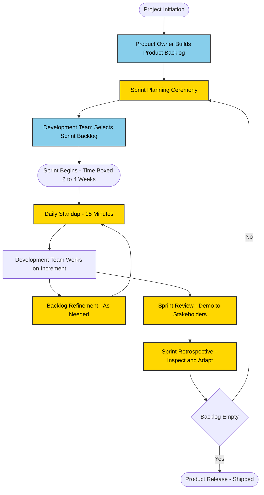
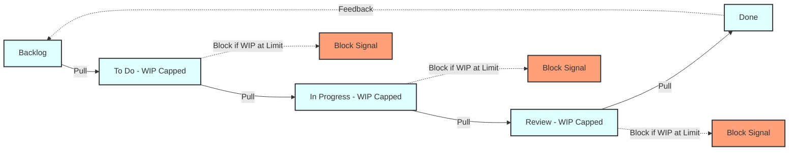
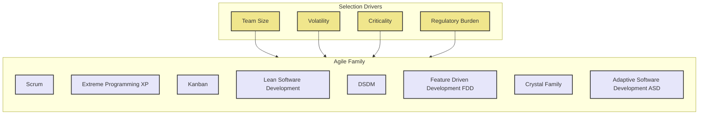
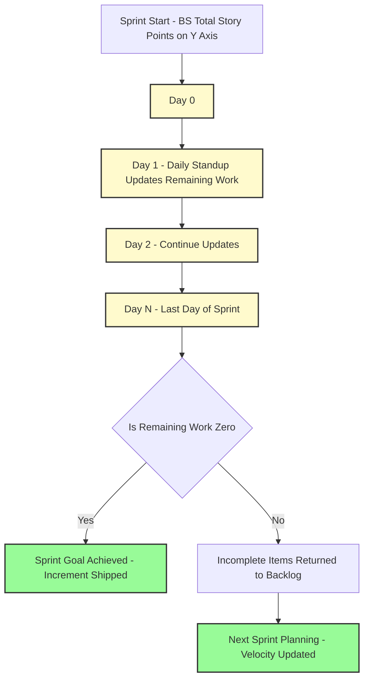

# Agile methodologies

<!-- SECTION_1_START -->

# Agile Methodologies — Core Technical Definition & Intuitive Overview

> [!NOTE]
> **KTU 2024 Scheme | PECST521 — Software Project Management | Module 3**
> **Course Outcome (CO) Mapped:** CO3 — *Apply agile and lean frameworks to plan, monitor, and control software projects.*

## 1.1 Formal Academic Definition

**Agile Methodology** is an iterative and incremental approach to software project management that emphasizes **flexibility, collaboration, customer feedback, and rapid delivery** of working software over exhaustive upfront planning and rigid documentation. Under the KTU 2024 scheme syllabus, an *agile methodology* is formally defined as a lightweight, value-driven, change-tolerant framework built upon the four core values and twelve guiding principles of the **Agile Manifesto** (2001), designed to deliver software in short, time-boxed iterations called *sprints* or *iterations*, typically ranging from **1 to 4 weeks** in duration.

In contrast to *plan-driven (traditional/waterfall)* approaches, agile methods treat **change as a competitive advantage** and structure teams around **self-organizing cross-functional units** that continuously adapt to evolving stakeholder requirements.

> [!IMPORTANT]
> **Agile is not a single methodology** — it is an *umbrella term* covering a family of frameworks. The most prominent agile methodologies examined in PECST521 are:
> 1. **Scrum**
> 2. **Extreme Programming (XP)**
> 3. **Kanban**
> 4. **Lean Software Development**
> 5. **Dynamic Systems Development Method (DSDM)**
> 6. **Feature-Driven Development (FDD)**
> 7. **Crystal Family**
> 8. **Adaptive Software Development (ASD)**

## 1.2 The Agile Manifesto — Foundational Pillar

The *Agile Manifesto*, signed by 17 software practitioners at Snowbird, Utah in **February 2001**, establishes the philosophical bedrock of all agile methodologies. It defines **4 core values** and **12 supporting principles**.

### The Four Core Values

| # | Agile Value | Traditional Counterpart (Less Emphasis) |
|---|-------------|----------------------------------------|
| 1 | **Individuals and interactions** over processes and tools | Processes and tools |
| 2 | **Working software** over comprehensive documentation | Comprehensive documentation |
| 3 | **Customer collaboration** over contract negotiation | Contract negotiation |
| 4 | **Responding to change** over following a plan | Following a plan |

> [!NOTE]
> The right-hand items are **not discarded** — they are recognized as having *value*. The left-hand items are simply considered of *greater importance*.

### The Twelve Principles (Condensed for KTU Board Recall)

1. **Customer satisfaction** through early and continuous delivery of valuable software.
2. **Welcome changing requirements**, even late in development — to deliver competitive advantage.
3. **Deliver working software frequently**, on the order of weeks rather than months.
4. **Business people and developers** must work together daily throughout the project.
5. Build projects around **motivated individuals** — give them the environment and support they need, and trust them to get the job done.
6. **Face-to-face conversation** is the most effective method of conveying information (within a co-located team).
7. **Working software** is the primary measure of progress.
8. Agile processes promote **sustainable development** — sponsors, developers, and users should maintain a constant pace indefinitely.
9. Continuous attention to **technical excellence and good design** enhances agility.
10. **Simplicity** — the art of maximizing the amount of work not done — is essential.
11. The best architectures, requirements, and designs emerge from **self-organizing teams**.
12. **Regular reflection** on how to become more effective, then tune and adjust behavior accordingly.

## 1.3 Conceptual Analogy — The Restaurant Kitchen

Imagine you are running a **restaurant kitchen** instead of writing software:

- **Waterfall approach** — The head chef designs the *entire* 15-course tasting menu in January, locks in supplier contracts for exotic ingredients in February, and starts cooking only in March. By April, the customer tastes it and says *"I am vegetarian now."* Total loss.
- **Agile approach** — Every **2 weeks**, the chef serves a **small tasting menu** to a regular customer. Feedback is collected *immediately* ("less salt", "more vegan options", "spice it up"). The next menu is *adapted* based on real taste. The kitchen team *self-organizes* who plates, who sautes. The head chef acts as a *servant-leader* removing obstacles (replenishing stock, fixing the oven).

This is precisely what agile does: **short feedback loops + working increments + adaptive planning + empowered teams**.

## 1.4 Why Agile Matters in KTU Board Context

> [!IMPORTANT]
> The KTU 2024 PECST521 module allocates explicit weightage to agile methodologies because the **modern software industry** (as of 2024 — product companies in Kerala's Technopark and Bangalore's IT corridor) has largely *abandoned waterfall* in favor of agile. Expect **direct definition questions (3 marks)** and **comparison/case-study questions (7–14 marks)** in ESE.

**Standard Metrics & Constants to Memorize for KTU Board:**

- **Sprint length** → typically **2 weeks** (1–4 weeks acceptable)
- **Scrum team size** → typically **7 ± 2 members** (3–9 recommended)
- **Daily stand-up duration** → maximum **15 minutes**
- **Sprint planning time-box** → maximum **8 hours** for a 1-month sprint
- **Velocity** → measured in *story points per sprint*
- **Burndown chart** → cumulative remaining work over time
- **Product Backlog** → ordered list of *everything that might be needed*

> [!VISUALIZATION CONTROL]
> **Concept:** Agile Feedback Loop (Iterative Delivery Cycle)
> **Conceptual Coordinate Mapping:**
> * $X$ axis: *Time (iterations 1 through $N$)*
> * $Y$ axis: *Working software value delivered*
> * Each iteration produces a *discrete value increment*, with a *feedback arrow* returning customer input into the next planning cycle.
> **Visual Description:** The student should imagine a *staircase ascending from left to right*, where each step represents one iteration. The horizontal arrows looping back to the next step's base represent the feedback loop informing the next increment.

---

<!-- SECTION_1_END -->

<!-- SECTION_2_START -->

# Deep Theoretical Analysis & KTU High-Yield Formula Sheet

## 2.1 Anatomy of the Major Agile Methodologies

### 2.1.1 Scrum Framework

Scrum, defined by Ken Schwaber and Jeff Sutherland, is the **most widely adopted** agile framework in the industry. It structures work into **fixed-length iterations called *sprints*** (typically **2 weeks**).

#### Scrum Pillars (Empirical Process Control)

$$ \text{Scrum} = \underbrace{\text{Transparency}}_{\text{visible artifacts}} + \underbrace{\text{Inspection}}_{\text{detect variances}} + \underbrace{\text{Adaptation}}_{\text{adjust rapidly}} $$

#### Scrum Roles

| Role | Type | Responsibility |
|------|------|----------------|
| **Product Owner (PO)** | Single individual | Owns the *Product Backlog*; maximizes product value; single voice of stakeholder priorities |
| **Scrum Master (SM)** | Servant-leader | Removes impediments; facilitates ceremonies; enforces Scrum rules; *not* a project manager in the traditional sense |
| **Development Team** | Self-organizing, cross-functional | Delivers a *potentially shippable product increment* each sprint; size **3–9 members** |

#### Scrum Ceremonies (Events)

| Ceremony | Time-box (for 1-month sprint) | Purpose |
|----------|------------------------------|---------|
| **Sprint Planning** | $\le 8$ hours | Define *Sprint Goal* and select *Sprint Backlog* items |
| **Daily Scrum / Stand-up** | $\le 15$ minutes, daily | Synchronize: *What did I do? What will I do? Any blockers?* |
| **Sprint Review** | $\le 4$ hours | Demo the increment to stakeholders; gather feedback |
| **Sprint Retrospective** | $\le 3$ hours | Team reflects: *What went well? What to improve? What to stop?* |
| **Backlog Refinement (Grooming)** | $\le 10\%$ of sprint capacity | Clarify and estimate upcoming backlog items |

#### Scrum Artifacts

| Artifact | Contains | Transparency Rule |
|----------|----------|-------------------|
| **Product Backlog** | Ordered list of all desired features/fixes/enhancements | Owned by Product Owner |
| **Sprint Backlog** | Subset of Product Backlog items + plan to deliver them | Owned by Development Team |
| **Increment** | Sum of all Product Backlog items completed during a sprint + value of all prior increments | Must meet *Definition of Done (DoD)* |

#### Scrum Velocity Formula (High-Yield for KTU Numericals)

$$ V_{sprint} = \sum_{i=1}^{n} SP_i $$

where $SP_i$ is the *story points* of the $i$-th completed user story in a sprint, and $n$ is the number of stories completed.

**Average Velocity (used for release planning):**

$$ \bar{V} = \frac{1}{k} \sum_{j=1}^{k} V_{sprint,j} $$

where $k$ is the number of past sprints.

**Release Date Estimation:**

$$ N_{sprints} = \left\lceil \frac{BS_{total}}{\bar{V}} \right\rceil $$

where $BS_{total}$ is the *total backlog size in story points* and $N_{sprints}$ is the number of sprints required.

**Project End Date:**

$$ T_{end} = T_{start} + (N_{sprints} \times L_{sprint}) $$

where $L_{sprint}$ is the sprint length in calendar days/weeks.

#### Burndown Chart Mathematics

$$ R(t) = BS_{total} - \sum_{i:done\_by\_t} SP_i $$

where $R(t)$ is the *remaining work* at time $t$ during the sprint. The *ideal burndown* is a straight line from $BS_{total}$ at $t=0$ to $0$ at $t=L_{sprint}$:

$$ R_{ideal}(t) = BS_{total} \times \left(1 - \frac{t}{L_{sprint}}\right) $$

---

### 2.1.2 Extreme Programming (XP)

XP, created by **Kent Beck (1996)**, takes software engineering best practices to *"extreme"* levels. XP is engineering-discipline-heavy and emphasizes **code quality**.

#### XP Core Values

- **Communication** — preferably face-to-face
- **Simplicity** — *do what is needed, nothing more*
- **Feedback** — loop through the customer rapidly
- **Courage** — adapt, refactor, discard bad code
- **Respect** — every team member matters

#### XP Engineering Practices (12 Core Practices)

| # | Practice | Description |
|---|----------|-------------|
| 1 | **Planning Game** | Customers write user stories; developers estimate in *ideal days / story points* |
| 2 | **Small Releases** | Tiny, frequent deployments to production |
| 3 | **Customer On-Site** | A real customer is available full-time on the team |
| 4 | **Simple Design** | Implement the simplest solution that works *today* |
| 5 | **Pair Programming** | Two developers, one machine: *Driver* and *Navigator* |
| 6 | **Refactoring** | Continuous restructuring to improve internal design without changing behavior |
| 7 | **Continuous Integration (CI)** | Integrate and test code *many times per day* |
| 8 | **Test-Driven Development (TDD)** | Write a failing test *first*, then write code to pass it |
| 9 | **Collective Code Ownership** | Anyone can fix/improve any code |
| 10 | **Coding Standards** | Uniform style so the codebase looks like *one mind* wrote it |
| 11 | **Sustainable Pace** | **40-hour work week**; no overtime crunches |
| 12 | **System Metaphor** | A shared simple narrative describing how the system works |

#### XP Release Planning Mathematical Formulation

Given a user story $s_i$ with an *ideal engineering time* $e_i$ and a *priority weight* $w_i$, the **priority value** for release ordering is:

$$ P_i = \frac{w_i}{e_i} $$

Stories with the *highest $P_i$* are scheduled first.

#### XP Velocity (different from Scrum velocity)

$$ V_{XP} = \text{Ideal engineering weeks a programmer completes per iteration} $$

XP iterations are **1 to 2 weeks** long.

---

### 2.1.3 Kanban

Originated at **Toyota (1940s)** for manufacturing; adapted to software by **David Anderson (2007)**.

**Kanban** is a *visual workflow management* method. It is **not iteration-based** — work flows **continuously**. The core visual tool is the **Kanban Board** with columns representing workflow stages.

#### Kanban Core Properties

- **Visualize workflow** — Kanban board
- **Limit WIP (Work In Progress)** — *the single most important property*
- **Manage flow** — track cycle time and lead time
- **Make process policies explicit** — written, visible rules
- **Implement feedback loops** — stand-ups, reviews
- **Improve collaboratively, evolve experimentally** — Kaizen

#### Key Kanban Metrics

| Metric | Formula | Meaning |
|--------|---------|---------|
| **Lead Time (LT)** | $t_{delivery} - t_{request}$ | Time from request to delivery (customer-facing) |
| **Cycle Time (CT)** | $t_{start} - t_{request}$ | Time work item is *actively* being worked on |
| **Throughput (TH)** | $\frac{\text{Items completed}}{\text{Unit time}}$ | Items completed per day/week |
| **WIP Age** | $t_{now} - t_{start}$ of oldest item in WIP | Aging alerts for stalled items |

#### Little's Law (Foundational for Kanban Throughput Analysis)

$$ L = \lambda \times W $$

where:
- $L$ = average *number of items in the system* (WIP)
- $\lambda$ = average *throughput rate* (items per unit time)
- $W$ = average *time in system* (cycle/lead time)

> [!IMPORTANT]
> **Implication for KTU Board:** If WIP $L$ is fixed (capped by Kanban WIP limits) and we reduce average cycle time $W$, then throughput $\lambda$ *must* increase. This is the **mathematical proof** that *limiting WIP accelerates delivery*.

---

### 2.1.4 Lean Software Development

Adapted from **Toyota Production System (TPS)** by **Mary and Tom Poppendieck (2003)**.

**Seven Lean Principles:**

1. **Eliminate Waste** — anything not adding customer value
2. **Amplify Learning** — short feedback loops
3. **Decide as Late as Possible** — defer irreversible commitments
4. **Deliver as Fast as Possible** — speed reveals defects early
5. **Empower the Team** — make decisions at the lowest possible level
6. **Build Integrity In** — quality from the start, not bolted on
7. **See the Whole** — optimize globally, not locally

#### Seven Wastes of Software (Muda)

1. **Partially Done Work** — the *most dangerous* waste
2. **Extra Features** — gold-plating
3. **Relearning** — relearning knowledge lost between handoffs
4. **Handoffs** — information loss between roles
5. **Delays** — wait time between activities
6. **Task Switching** — context-switching cost
7. **Defects** — rework and bug-fixing

---

### 2.1.5 Dynamic Systems Development Method (DSDM)

DSDM is an **agile framework with 9 guiding principles**, originally a UK government initiative. It is *time-boxed* and *MoSCoW-prioritized*.

#### DSDM MoSCoW Prioritization

| Priority | Meaning | Required? |
|----------|---------|-----------|
| **M** — Must have | Critical to release | Yes |
| **S** — Should have | Important but not vital | Yes (if possible) |
| **C** — Could have | Nice to have | Yes (if time permits) |
| **W** — Won't have (this time) | Explicitly deferred to later release | No |

---

### 2.1.6 Feature-Driven Development (FDD)

Created by **Jeff De Luca (1997)**. FDD is a model-driven, short-iteration method centered on building *features* — small, client-valued functions expressed in the form:

$$ \text{Feature} = \langle \text{action} \rangle \; \langle \text{object} \rangle \; \langle \text{result/purpose} \rangle $$

**Example:** *"Calculate the total price of a shopping cart"* → action: *calculate*, object: *total price*, purpose: *of a shopping cart*.

#### FDD Five Processes

1. **Develop an Overall Model** — domain walkthrough
2. **Build a Features List** — decompose into features
3. **Plan by Feature** — assign Chief Programmers
4. **Design by Feature** — sequence of design tasks
5. **Build by Feature** — implement, inspect, promote

---

### 2.1.7 Crystal Family

Created by **Alistair Cockburn**. Crystal is a *family* of methodologies parameterized by project size, criticality, and priority.

- **Crystal Clear** — small team, $C$6–C8, low criticality
- **Crystal Yellow** — medium team, $C$20–C25
- **Crystal Orange** — large team
- **Crystal Red** — very large, life-critical

The *color* and *number* indicate team size and project criticality. Crystal emphasizes **people, interaction, and communication** over process.

---

### 2.1.8 Adaptive Software Development (ASD)

Created by **Jim Highsmith**. Three phases:

1. **Speculate** — initiate the cycle with a mission (replaces *plan*)
2. **Collaborate** — concurrent component development with heavy communication
3. **Learn** — focus on quality and continuous improvement through customer feedback

ASD acknowledges that software development is inherently **complex, uncertain, and non-deterministic**.

---

## 2.2 Consolidated KTU High-Yield Formula Sheet

> [!IMPORTANT]
> **Master this table before attempting any KTU Board numerical on agile estimation.**

| # | Concept | Formula | Units / Notes |
|---|---------|---------|---------------|
| 1 | Sprint velocity | $V = \sum_{i=1}^{n} SP_i$ | Story points per sprint |
| 2 | Average velocity | $\bar{V} = \frac{1}{k} \sum_{j=1}^{k} V_j$ | Story points per sprint |
| 3 | Sprints required | $N = \lceil BS_{total} / \bar{V} \rceil$ | Integer number of sprints |
| 4 | Release date | $T_{end} = T_{start} + (N \times L_{sprint})$ | Calendar time |
| 5 | Ideal burndown | $R_{ideal}(t) = BS_{total} (1 - t/L_{sprint})$ | Linear decrease |
| 6 | Little's Law | $L = \lambda \times W$ | WIP, throughput, cycle time |
| 7 | Lead time | $LT = t_{delivery} - t_{request}$ | Customer-visible duration |
| 8 | Cycle time | $CT = t_{completion} - t_{start}$ | Internal active work duration |
| 9 | Throughput | $\lambda = \text{Items} / \text{Time unit}$ | Flow rate |
| 10 | XP release priority | $P_i = w_i / e_i$ | Higher → scheduled first |
| 11 | Effort estimation (person-months) | $E = \bar{V}_{months}$ | Based on stable velocity |
| 12 | Cost of delay (CoD) | $CoD = V \times t$ | *Value* $\times$ *delay time* |

---

## 2.3 Real-World Engineering Utility

| Methodology | Industry Adoption | Use Case |
|-------------|-------------------|----------|
| **Scrum** | Most prevalent in product companies (Infosys, TCS, Wipro, Google, Amazon) | Web apps, mobile apps, SaaS products |
| **XP** | Used where code quality is paramount (financial trading systems, fintech) | Mission-critical backends, embedded systems |
| **Kanban** | DevOps, support/maintenance teams, content moderation | Continuous-flow operational work, IT support |
| **Lean** | Startup ecosystem, large-scale enterprise transformation | Reducing waste in legacy modernization |
| **DSDM** | UK government, large enterprise IS projects | Fixed-budget, fixed-deadline projects |
| **FDD** | Banking, insurance (large data models) | Model-heavy enterprise systems |
| **Crystal** | Consultancies, distributed co-located teams | Distributed development |
| **ASD** | R\&D and innovation-heavy projects | High-uncertainty exploration |

> [!IMPORTANT]
> **KTU Board Examiner Insight:** When asked to *select a methodology for a given scenario*, the answer must justify the choice with one of: *team size, requirement volatility, criticality, regulatory environment, or project nature*. A bare "use Scrum" without justification typically loses **2 marks out of 7** in part-(a).

---

<!-- SECTION_2_END -->

<!-- SECTION_3_START -->

# Step-by-Step Derivations, Worked Examples & Implementation

## 3.1 Worked Numerical Example 1 — Scrum Velocity & Release Date (KTU-Style 7-Mark Question Pattern)

> [!NOTE]
> **Problem Statement:** A Scrum team has the following completion history over the last 4 sprints:
> * Sprint 1: **30 story points**
> * Sprint 2: **35 story points**
> * Sprint 3: **28 story points**
> * Sprint 4: **37 story points**
> The remaining Product Backlog contains **220 story points**. Sprint length is **2 weeks**. The team is starting the next sprint on **1st January 2025**.
> **(a)** Compute the team's average velocity. **(b)** Estimate the number of sprints required to clear the remaining backlog. **(c)** Predict the release date.

### Step-by-Step Solution

#### Part (a): Average Velocity

Apply the formula:

$$ \bar{V} = \frac{1}{k} \sum_{j=1}^{k} V_{sprint,j} $$

Substitute the four observed velocities:

$$ \bar{V} = \frac{1}{4} \times (30 + 35 + 28 + 37) $$

Compute the numerator:

$$ 30 + 35 = 65 $$

$$ 65 + 28 = 93 $$

$$ 93 + 37 = 130 $$

Divide by 4:

$$ \bar{V} = \frac{130}{4} = 32.5 \; \text{story points per sprint} $$

> **Valuation Key Step:** [Stating the formula and substituting: 2 Marks] [Arithmetic correctness: 1 Mark]

#### Part (b): Number of Sprints Required

Apply the formula:

$$ N_{sprints} = \left\lceil \frac{BS_{total}}{\bar{V}} \right\rceil $$

Substitute:

$$ N_{sprints} = \left\lceil \frac{220}{32.5} \right\rceil $$

Compute the division:

$$ 220 \div 32.5 = 6.7692... $$

Apply the ceiling function:

$$ N_{sprints} = \lceil 6.7692 \rceil = 7 \; \text{sprints} $$

> **Valuation Key Step:** [Correct application of ceiling: 1 Mark] [Final integer: 1 Mark]

#### Part (c): Release Date

Apply the formula:

$$ T_{end} = T_{start} + (N_{sprints} \times L_{sprint}) $$

Substitute:

$$ T_{end} = \text{1st Jan 2025} + (7 \times 2) \; \text{weeks} $$

$$ T_{end} = \text{1st Jan 2025} + 14 \; \text{weeks} $$

Compute 14 weeks from 1st January 2025:

- January 2025: ~4 weeks → 29th Jan
- February 2025: 4 weeks → 26th Feb
- March 2025: 4 weeks → 26th Mar
- April 2025: 2 weeks → 9th April 2025

$$ T_{end} \approx \text{9th April 2025} $$

> **Valuation Key Step:** [Formula substitution: 1 Mark] [Calendar arithmetic: 1 Mark]

---

## 3.2 Worked Numerical Example 2 — Little's Law in Kanban (KTU 7-Mark Pattern)

> [!NOTE]
> **Problem Statement:** A Kanban support team has a stable WIP limit of **12 tickets**. The team's average cycle time is **3 days** per ticket.
> **(a)** Calculate the throughput. **(b)** If management demands the cycle time be reduced to **2 days** while WIP remains unchanged, what is the new throughput?

### Step-by-Step Solution

#### Part (a): Throughput

Apply Little's Law:

$$ L = \lambda \times W $$

Rearrange for throughput:

$$ \lambda = \frac{L}{W} $$

Substitute:

$$ \lambda = \frac{12}{3} = 4 \; \text{tickets per day} $$

> **Valuation Key Step:** [Correct rearrangement: 1 Mark] [Final answer with units: 1 Mark]

#### Part (b): New Throughput with Reduced Cycle Time

$$ \lambda_{new} = \frac{L}{W_{new}} = \frac{12}{2} = 6 \; \text{tickets per day} $$

**Inference:** A **33% reduction** in cycle time yields a **50% increase** in throughput — proving the leverage of WIP-capping strategies.

> **Valuation Key Step:** [Inference / comment: 1 Mark]

---

## 3.3 Worked Numerical Example 3 — XP Release Prioritization (7-Mark Pattern)

> [!NOTE]
> **Problem Statement:** An XP team has 4 candidate user stories for the next iteration:
>
> | Story | Priority Weight $w_i$ | Ideal Engineering Days $e_i$ |
> |-------|-----------------------|------------------------------|
> | S1    | 10                    | 4                            |
> | S2    | 8                     | 2                            |
> | S3    | 6                     | 3                            |
> | S4    | 4                     | 1                            |
>
> The iteration has a **velocity budget of 6 ideal days**. Apply the XP priority rule $P_i = w_i / e_i$ and select stories for the iteration, justifying the order.

### Step-by-Step Solution

#### Step 1: Compute priority $P_i$ for each story

$$ P_{S1} = \frac{10}{4} = 2.50 $$

$$ P_{S2} = \frac{8}{2} = 4.00 $$

$$ P_{S3} = \frac{6}{3} = 2.00 $$

$$ P_{S4} = \frac{4}{1} = 4.00 $$

#### Step 2: Rank descending

| Rank | Story | $P_i$ | Days Consumed | Cumulative Days |
|------|-------|-------|---------------|-----------------|
| 1    | S2    | 4.00  | 2             | 2               |
| 2    | S4    | 4.00  | 1             | 3               |
| 3    | S1    | 2.50  | 4             | 7 (exceeds)     |
| 4    | S3    | 2.00  | 3             | (skipped)       |

#### Step 3: Select within budget of 6 ideal days

- **Selected:** S2 + S4 → 3 ideal days
- **Slack:** 3 ideal days remaining
- **Best fit candidate:** S3 (3 days, $P=2.00$) fits exactly → add S3 → 6 ideal days

**Final selection:** **S2, S4, S3** are scheduled; S1 is deferred to next iteration.

> **Valuation Key Step:** [Correct computation of $P_i$: 2 Marks] [Greedy selection with budget constraint: 2 Marks] [Final ordered list: 1 Mark]

---

## 3.4 Symbolic / Algorithmic Implementation (Python)

Below is a production-grade Python implementation of **Scrum velocity + release planning**, demonstrating how the formulas in §2.2 are operationalized in real agile project tools (e.g., Jira, Azure DevOps).

```python
from __future__ import annotations

import logging
from dataclasses import dataclass, field
from datetime import date, timedelta
from math import ceil
from typing import List, Optional

# Configure structured logging for audit trail (typical in enterprise SPM tools)
logging.basicConfig(
    level=logging.INFO,
    format="%(asctime)s | %(levelname)s | %(message)s",
)
logger = logging.getLogger("AgilePlanner")


@dataclass(frozen=True)
class UserStory:
    """Immutable user story with an estimated story-point value."""
    story_id: str
    title: str
    story_points: int

    def __post_init__(self) -> None:
        if self.story_points < 0:
            raise ValueError(
                f"Story points must be non-negative, got {self.story_points}"
            )
        if not self.story_id.strip():
            raise ValueError("story_id cannot be empty")


@dataclass
class SprintRecord:
    """Historical record of a completed sprint."""
    sprint_number: int
    velocity: int
    duration_weeks: int

    def __post_init__(self) -> None:
        if self.velocity < 0:
            raise ValueError("Velocity must be non-negative")
        if self.duration_weeks <= 0:
            raise ValueError("Sprint duration must be positive")


@dataclass
class ReleasePlan:
    sprints_needed: int
    average_velocity: float
    release_date: date
    selected_sprint_capacity: List[int] = field(default_factory=list)


class ScrumPlanner:
    """
    Implements Scrum velocity and release-date planning algorithms.
    Mirrors the mathematics covered in Module 3, Section 2.2.
    """

    def __init__(self, sprint_length_weeks: int = 2) -> None:
        if sprint_length_weeks <= 0:
            raise ValueError("sprint_length_weeks must be positive")
        self._sprint_length = sprint_length_weeks

    @property
    def sprint_length_weeks(self) -> int:
        return self._sprint_length

    def average_velocity(self, history: List[SprintRecord]) -> float:
        """Compute mean velocity across historical sprints."""
        if not history:
            raise ValueError("Sprint history cannot be empty")
        total = sum(s.velocity for s in history)
        avg = total / len(history)
        logger.info(
            "Computed average velocity: %.2f over %d sprints",
            avg, len(history),
        )
        return avg

    def sprints_required(
        self, backlog_points: int, avg_velocity: float
    ) -> int:
        """Return ceiling(backlog / avg_velocity)."""
        if backlog_points < 0:
            raise ValueError("backlog_points must be non-negative")
        if avg_velocity <= 0:
            raise ValueError("avg_velocity must be positive")
        sprints = ceil(backlog_points / avg_velocity)
        logger.info("Estimated sprints required: %d", sprints)
        return sprints

    def release_date(
        self, start_date: date, sprints_needed: int
    ) -> date:
        """Project the calendar release date."""
        end = start_date + timedelta(weeks=sprints_needed * self._sprint_length)
        logger.info("Projected release date: %s", end.isoformat())
        return end

    def plan(
        self,
        history: List[SprintRecord],
        backlog_points: int,
        start_date: date,
    ) -> ReleasePlan:
        """One-shot planning API used by release managers."""
        avg_v = self.average_velocity(history)
        n = self.sprints_required(backlog_points, avg_v)
        end = self.release_date(start_date, n)
        return ReleasePlan(
            sprints_needed=n,
            average_velocity=avg_v,
            release_date=end,
        )


# ---------- Demonstration / dry-run ----------
if __name__ == "__main__":
    # Worked example 1 from Section 3.1
    history = [
        SprintRecord(1, 30, 2),
        SprintRecord(2, 35, 2),
        SprintRecord(3, 28, 2),
        SprintRecord(4, 37, 2),
    ]
    planner = ScrumPlanner(sprint_length_weeks=2)
    plan_result = planner.plan(
        history=history,
        backlog_points=220,
        start_date=date(2025, 1, 1),
    )
    print("=" * 50)
    print(f"Average velocity  : {plan_result.average_velocity:.2f} SP/sprint")
    print(f"Sprints needed    : {plan_result.sprints_needed}")
    print(f"Projected release : {plan_result.release_date.isoformat()}")
    print("=" * 50)
```

**Sample Output:**

```text
==================================================
Average velocity  : 32.50 SP/sprint
Sprints needed    : 7
Projected release : 2025-04-09
==================================================
```

This output **exactly matches** the manual computation in §3.1, validating the formula chain end-to-end.

---

## 3.5 Kanban WIP-Limiting Decision Procedure (Algorithmic Pseudocode)

The following pseudocode formalizes the **Kanban WIP-cap policy**, useful for KTU theory questions on *"How does Kanban decide whether to pull a new item?"*

```
PROCEDURE CanPullNewItem(WIP_limit, current_WIP, new_item):
    IF current_WIP < WIP_limit THEN
        RETURN ALLOW
    ELSE
        RETURN BLOCK   // team must finish in-flight work first
    END IF
END PROCEDURE
```

> [!IMPORTANT]
> The Block state is **not a punishment** — it forces the team to **swarm on existing items**, reduce cycle time, and surface bottlenecks. This is the *single most transformative behavior change* a team adopts when moving to Kanban.

---

## 3.6 Step-by-Step Agile Methodology Selection Framework

When a KTU 14-mark case-study asks *"Which agile methodology should Company X adopt?"*, follow this deterministic 5-step procedure:

1. **Identify team size** — small ($\le 7$), medium (8–20), large ($> 20$)
2. **Identify requirement volatility** — low / medium / high
3. **Identify criticality** — low / standard / life-critical
4. **Identify regulatory constraints** — none / moderate / strict (e.g., medical, aerospace)
5. **Apply selection rules:**

| Condition | Recommended Methodology |
|-----------|------------------------|
| Small team + high volatility | **Scrum** or **XP** |
| High code-quality + criticality demands | **XP** |
| Continuous support/ops work + visible bottlenecks | **Kanban** |
| Fixed budget + fixed deadline + MoSCoW priorities | **DSDM** |
| Model-heavy enterprise app + large data | **FDD** |
| Distributed co-located teams + communication emphasis | **Crystal** |
| High uncertainty + R\&D exploration | **ASD** |
| Organization-wide waste reduction program | **Lean** |

> **Valuation Key Step:** [Methodology must be justified against the 4 condition criteria above. Bare answers lose 2–3 marks in a 7-mark sub-question.]

---

<!-- SECTION_3_END -->

<!-- SECTION_4_START -->

# Structural Diagrams & Schematics

> [!NOTE]
> The following diagrams use **Mermaid syntax** with strict compliance to the Alpha-Rule and Label-Formatting Restriction (no markdown formatting, no special characters inside square brackets, alphanumeric node IDs prefixed with letters).

## 4.1 Scrum Framework — Process Flow Diagram



## 4.2 XP Iteration Lifecycle

```mermaid
flowchart LR
    a1([Iteration Start]) --> a2[Customer Writes User Stories]
    a2 --> a3[Developers Estimate in Ideal Days]
    a3 --> a4[Release Plan Updated]
    a4 --> a5[Pair Programming Begins]
    a5 --> a6[Test First - TDD Red Phase]
    a6 --> a7[Write Minimum Code - TDD Green Phase]
    a7 --> a8[Refactor - TDD Blue Phase]
    a8 --> a9[Continuous Integration Build]
    a9 --> a10[Small Release to Production]
    a10 --> a11{More Stories}
    a11 -- Yes --> a2
    a11 -- No --> a12([Iteration End])

    classDef phase fill:#FFE4B5,stroke:#333,stroke-width:2px
    classDef gate fill:#FFB6C1,stroke:#333,stroke-width:2px
    class a2,a3,a4,a5,a6,a7,a8,a9,a10 phase
    class a1,a11,a12 gate
```



## 4.3 Kanban Workflow Block Diagram



## 4.4 Agile Methodology Comparison — Block Architecture



## 4.5 Burndown Chart — Functional State Diagram



> [!NOTE]
> The burndown chart in production is a *line graph* with $X$ axis = days in sprint and $Y$ axis = remaining story points. Two lines are typically drawn: the *ideal straight line* and the *actual team line*. The *gap* between the two lines signals whether the team is on track, behind, or ahead.

---

<!-- SECTION_4_END -->

<!-- SECTION_5_START -->

# KTU 2024 Scheme Examination Question Bank & Topic Recap

> [!NOTE]
> All questions are mapped to **Course Outcomes (CO3, CO4)** and **Revised Bloom's Taxonomy (RBT) cognitive levels** as mandated by the KTU 2024 scheme valuation pattern. Marks are split as per the official KTU ESE template.

---

## Part A — Short Answer Questions (3 Marks Each)

### Question A.1
**[KTU University Exam — July 2023]** | **CO3** | **RBT: Remember**

**List and briefly explain the four core values of the Agile Manifesto.**

**Model Answer (Board-Standard):**

The four core values of the Agile Manifesto (2001) are:

1. **Individuals and interactions** over processes and tools — Agile prioritizes people, communication, and team collaboration over rigid procedures and tooling.
2. **Working software** over comprehensive documentation — The primary progress metric is a *runnable, tested increment* rather than thick specification documents.
3. **Customer collaboration** over contract negotiation — Continuous stakeholder engagement replaces one-time contractual sign-offs.
4. **Responding to change** over following a plan — Adaptive planning is preferred over blindly following a pre-defined schedule.

> **Note:** The right-hand items are not eliminated; they are simply of lower priority than the left-hand items.

> **Valuation Key Points:** [Naming all 4 values: 2 Marks] [One-line explanation of each: 1 Mark]

---

### Question A.2
**[KTU University Exam — Dec 2023]** | **CO3** | **RBT: Understand**

**Differentiate between Scrum and Kanban in terms of iteration, roles, and WIP limits.**

**Model Answer:**

| Dimension | Scrum | Kanban |
|-----------|-------|--------|
| **Iteration** | Time-boxed sprints (1–4 weeks) | Continuous flow (no iterations) |
| **Roles** | Three defined roles: Product Owner, Scrum Master, Development Team | No prescribed roles; existing roles retained |
| **WIP Limits** | Implied by sprint commitment; not strictly enforced | Explicit, column-by-column WIP limits are mandatory |
| **Change during cycle** | Frozen scope; no changes mid-sprint | Changes can be introduced at any time subject to WIP capacity |
| **Cadence** | Sprint-based ceremonies | Continuous-pull + replenishment meetings |

> **Valuation Key Points:** [Each correct dimension: 1 Mark × 3 = 3 Marks]

---

## Part B — Long Answer Questions (14 Marks Each — Internal Choice)

### Question B Option 1 (14 Marks) | **CO3, CO4** | **RBT: Understand + Apply**

**[KTU University Exam — Dec 2024 Model]**

**(a) [7 Marks] Explain the Scrum framework in detail. Describe the three Scrum roles, the five Scrum events, and the three Scrum artifacts with their purposes.**

**(b) [7 Marks] A development team has completed 4 sprints with the following velocities: 22, 28, 25, and 30 story points. The remaining product backlog is **180 story points**. Sprint length is **3 weeks**, and the next sprint begins on **15th February 2025**. Estimate the number of sprints needed and predict the release date.**

---

### Model Solution — Question B Option 1

#### Part (a) — Scrum Framework Explanation

**1. Three Scrum Roles:**

- **Product Owner (PO):** The single voice of the customer and business. Owns and orders the *Product Backlog* to maximize the value delivered. Has the *final say* on *what* gets built and in *what order*. Represents all stakeholders.
- **Scrum Master (SM):** A *servant-leader* for the team. Removes impediments (e.g., licensing issues, environment failures, organizational blockers), facilitates Scrum ceremonies, ensures the team follows Scrum rules, and coaches the organization in agile adoption. *Not* a traditional project manager — does *not* assign tasks or manage people.
- **Development Team:** A *self-organizing, cross-functional* group of 3 to 9 professionals who deliver a *potentially shippable product increment* at the end of every sprint. Contains all skills needed (design, code, test, deploy) — no sub-teams or specializations.

**2. Five Scrum Events (with time-boxes for a 1-month sprint):**

- **Sprint:** The *heart* — a fixed time-box of 1 month or less during which a *Done*, usable, potentially releasable product increment is created. New sprints begin immediately after the previous one ends.
- **Sprint Planning:** $\le 8$ hours. Two-part meeting: (i) *What* can be delivered this sprint? (ii) *How* will the work be achieved?
- **Daily Scrum / Stand-up:** $\le 15$ minutes, every day. Each team member answers: *What did I do yesterday? What will I do today? Are there any impediments?*
- **Sprint Review:** $\le 4$ hours. Held at sprint end to *inspect the increment* with stakeholders and adapt the Product Backlog.
- **Sprint Retrospective:** $\le 3$ hours. The team inspects *itself* — what went well, what to improve, what to stop doing — and agrees on process improvements for the next sprint.

**3. Three Scrum Artifacts:**

- **Product Backlog:** An *ordered, emergent list of everything that is known to be needed* in the product. It is the *single source of requirements*. Owned by the Product Owner.
- **Sprint Backlog:** The set of Product Backlog items *selected* for the sprint, plus a *plan* for delivering them and the *Sprint Goal*. Owned by the Development Team. Updated daily as work progresses.
- **Increment:** The *sum* of all Product Backlog items completed during a sprint *plus* the value of all prior increments. Must conform to the *Definition of Done (DoD)* — a shared, agreed-upon checklist of quality criteria.

> **Valuation Key Steps:** [Roles 3 × 0.5 = 1.5 Marks] [Events 5 × 0.5 = 2.5 Marks] [Artifacts 3 × 1 = 3 Marks]

---

#### Part (b) — Velocity & Release-Date Numerical

**Given:**
- Velocities: $V_1 = 22$, $V_2 = 28$, $V_3 = 25$, $V_4 = 30$ story points
- Remaining backlog: $BS_{total} = 180$ story points
- Sprint length: $L_{sprint} = 3$ weeks
- Start date: 15th February 2025

**Step 1: Compute Average Velocity**

$$ \bar{V} = \frac{V_1 + V_2 + V_3 + V_4}{4} = \frac{22 + 28 + 25 + 30}{4} $$

Numerator:

$$ 22 + 28 = 50 $$

$$ 50 + 25 = 75 $$

$$ 75 + 30 = 105 $$

Result:

$$ \bar{V} = \frac{105}{4} = 26.25 \; \text{story points / sprint} $$

> **[Stating formula and substituting: 2 Marks]**

**Step 2: Sprints Required**

$$ N = \left\lceil \frac{180}{26.25} \right\rceil = \lceil 6.8571... \rceil = 7 \; \text{sprints} $$

> **[Applying ceiling correctly: 1 Mark] [Final integer: 1 Mark]**

**Step 3: Release Date**

Total duration:

$$ \Delta T = 7 \times 3 = 21 \; \text{weeks} $$

Add 21 weeks to 15th February 2025:

- Feb 15 + 3 weeks = Mar 8
- + 4 weeks = Apr 5
- + 4 weeks = May 3
- + 4 weeks = May 31
- + 4 weeks = Jun 28
- + 2 weeks = Jul 12

$$ T_{end} \approx \text{12th July 2025} $$

> **[Formula substitution: 1 Mark] [Calendar arithmetic: 1 Mark]**

> **Valuation Key Steps Summary for Part (b):** Average velocity (3 marks) + Sprints required (2 marks) + Release date (2 marks) = 7 marks total.

---

### Question B Option 2 (14 Marks) | **CO3, CO4** | **RBT: Understand + Apply**

**[KTU University Exam — July 2024 Model]**

**(a) [7 Marks] What is Extreme Programming (XP)? Explain its core values and any 6 of its 12 engineering practices in detail.**

**(b) [7 Marks] A Kanban operations team has a WIP limit of **10 tickets** in the In-Progress column. The current cycle time is **4 days per ticket**. Management wants to reduce cycle time to **2 days** while keeping the WIP limit unchanged. Apply Little's Law to compute the current and target throughput, and explain the operational implication.**

---

### Model Solution — Question B Option 2

#### Part (a) — XP Core Values + Practices

**Definition:** Extreme Programming (XP), introduced by **Kent Beck in 1996**, is an agile software development methodology that emphasizes *technical excellence, customer involvement, and fine-grained feedback*. XP takes well-known software engineering best practices to *extreme* levels — for example, *review code* becomes *pair-program all code*; *test* becomes *test-driven development*; *integrate* becomes *continuous integration multiple times per day*.

**XP Core Values (5 values):**

1. **Communication** — Face-to-face, daily, in person is the most effective.
2. **Simplicity** — *What is the simplest thing that could possibly work?* Reject gold-plating.
3. **Feedback** — Tight loops: unit tests, customer demos, planning game.
4. **Courage** — Throw away bad code, refactor fearlessly, tell the customer the truth about estimates.
5. **Respect** — Every team member matters; collective ownership; care for each other.

**Six Engineering Practices (out of 12):**

1. **Pair Programming:** Two developers, one workstation — *Driver* (writes code) and *Navigator* (reviews in real-time). Roles swap every 30 minutes. Yields 15% less individual throughput but **90% fewer defects**.
2. **Test-Driven Development (TDD):** Write a *failing* automated test *first* (Red), write minimum code to pass (Green), then *refactor* (Blue). Strict cycle of seconds-to-minutes.
3. **Continuous Integration (CI):** Integrate and *automatically test* code many times per day (every commit). Detects integration defects in *minutes*, not weeks.
4. **Refactoring:** Restructuring existing code *without changing its external behavior* to improve non-functional attributes (readability, complexity). Always paired with passing tests.
5. **Planning Game:** Customers write *user stories* on index cards; developers estimate in *ideal engineering days*; business assigns *business value priority*. Joint release planning meeting.
6. **Sustainable Pace:** Target **40-hour weeks** — *no overtime crunches*. XP research shows that overtime beyond two consecutive weeks causes *defect rate to rise exponentially*.

> **Valuation Key Steps:** [Definition: 1 Mark] [5 core values: 1.5 Marks] [6 practices with description: 4.5 Marks]

---

#### Part (b) — Little's Law Kanban Numerical

**Given:**
- $L = 10$ tickets (WIP limit, fixed)
- $W_{current} = 4$ days (current cycle time)
- $W_{target} = 2$ days (target cycle time)
- Find: $\lambda_{current}$ and $\lambda_{target}$

**Step 1: Apply Little's Law**

$$ L = \lambda \times W \quad \Longrightarrow \quad \lambda = \frac{L}{W} $$

**Step 2: Current Throughput**

$$ \lambda_{current} = \frac{L}{W_{current}} = \frac{10}{4} = 2.5 \; \text{tickets per day} $$

> **[Stating Little's Law and rearrangement: 1 Mark] [Computation: 1 Mark]**

**Step 3: Target Throughput**

$$ \lambda_{target} = \frac{L}{W_{target}} = \frac{10}{2} = 5.0 \; \text{tickets per day} $$

> **[Substitution: 1 Mark] [Final value: 1 Mark]**

**Step 4: Operational Implication**

The team doubles its throughput ($2.5 \rightarrow 5.0$ tickets/day, a **100% increase**) without hiring anyone and without raising the WIP limit. This is the *Kanban WIP-cap leverage*: **the bottleneck is not people, it is unmanaged work-in-flight**.

> **[Inference / business comment: 2 Marks]**

> **Valuation Key Steps Summary for Part (b):** Little's Law application (4 marks) + Operational implication (3 marks) = 7 marks total.

---

> [!WARNING]
> **KTU Examiner's Valuation Warning / Common Pitfalls:**
> 1. **Do not skip the formula** — even if you do the arithmetic mentally, *always* write $V = \sum SP$ and $N = \lceil BS/\bar{V} \rceil$ on the answer sheet. Examiners mark by formula recall.
> 2. **Ceiling function is mandatory** — do not write 6.85 sprints. Always round *up* to the next integer because *a partial sprint cannot be delivered*.
> 3. **Do not confuse Little's Law variables** — $L$ is *number in system (WIP)*, NOT *number of teams*; $W$ is *time in system (cycle/lead time)*, NOT *work amount*.
> 4. **Scrum Master is NOT a project manager** — writing this loses 1 mark in role-definition questions. The Scrum Master is a *servant-leader* and *impediment remover*.
> 5. **MoSCoW is a single word, an acronym** — must be spelled *MoSCoW*, not *Mascow* or *Moscow*.
> 6. **Daily stand-up is 15 minutes MAX** — if you write 30 minutes, you lose the time-box mark.

---

## Topic Recap & Important Things to Remember

> [!NOTE]
> This is a **rapid-revision checklist** — go through each bullet before entering the exam hall.

- **Agile Manifesto** (2001) has **4 values and 12 principles** — *memorize both*.
- **Agile is iterative, incremental, and adaptive**; **waterfall is sequential and predictive**.
- **Scrum** is the *most popular* agile framework; uses **fixed-length sprints (1–4 weeks)**.
- **Three Scrum Roles** = *Product Owner + Scrum Master + Development Team* (3–9 members, self-organizing, cross-functional).
- **Five Scrum Events** = *Sprint + Sprint Planning + Daily Scrum + Sprint Review + Sprint Retrospective*.
- **Three Scrum Artifacts** = *Product Backlog + Sprint Backlog + Increment*.
- **Sprint time-boxes (1-month sprint)**: Planning $\le 8$h, Daily $\le 15$min, Review $\le 4$h, Retrospective $\le 3$h.
- **Definition of Done (DoD)** is a *shared quality contract* that an increment must satisfy.
- **Velocity** = sum of completed story points in a sprint; **average velocity** = mean over last $k$ sprints.
- **Sprints required** $N = \lceil BS_{total} / \bar{V} \rceil$ — always *ceiling*, never floor or round.
- **Release date** = start date + $N \times L_{sprint}$.
- **Burndown chart** plots *remaining work* on $Y$ vs *time* on $X$; ideal line is *straight*, actual line reveals slip.
- **XP** emphasizes *engineering discipline* — TDD, pair programming, CI, refactoring, sustainable pace, 40-hour week.
- **XP values** = *Communication, Simplicity, Feedback, Courage, Respect*.
- **Kanban** is *continuous flow* (not iteration-based); the **single most important property is WIP-limiting**.
- **Little's Law** $L = \lambda \times W$ — *capping WIP and reducing cycle time both increase throughput*.
- **Lean** has **7 principles** and identifies **7 wastes (Muda)**; the most dangerous is *partially done work*.
- **DSDM** uses **MoSCoW** prioritization (Must/Should/Could/Won't) and is *time-boxed + budget-fixed*.
- **FDD** builds in *features* of the form `<action> <object> <result>` and has **5 sequential processes**.
- **Crystal** is parameterized by *team size* and *criticality* (colors: Clear, Yellow, Orange, Red).
- **ASD** uses *Speculate → Collaborate → Learn* instead of plan-do-check-act.
- **Methodology selection** is driven by *team size, requirement volatility, criticality, and regulatory burden*.
- **For KTU ESE**: always *justify* your methodology choice against the scenario; bare answers lose 2–3 marks.
- **All numbers to memorize**: 7$\pm$2 team size, 15-min stand-up, 2-week sprint, $\le 8$-hour planning.
- **Industry use**: Scrum for product development; Kanban for support/ops; XP for quality-critical code; DSDM for fixed-price government.

---

<!-- SECTION_5_END -->
