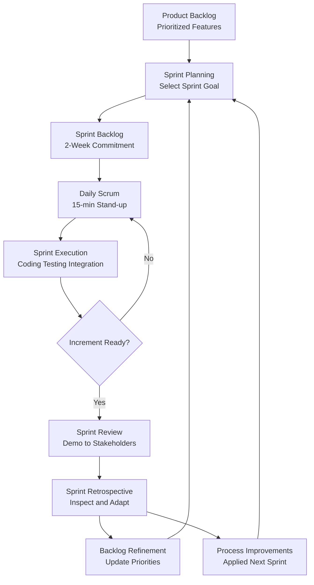
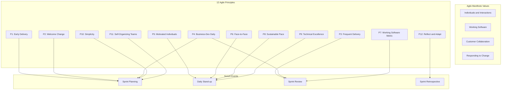
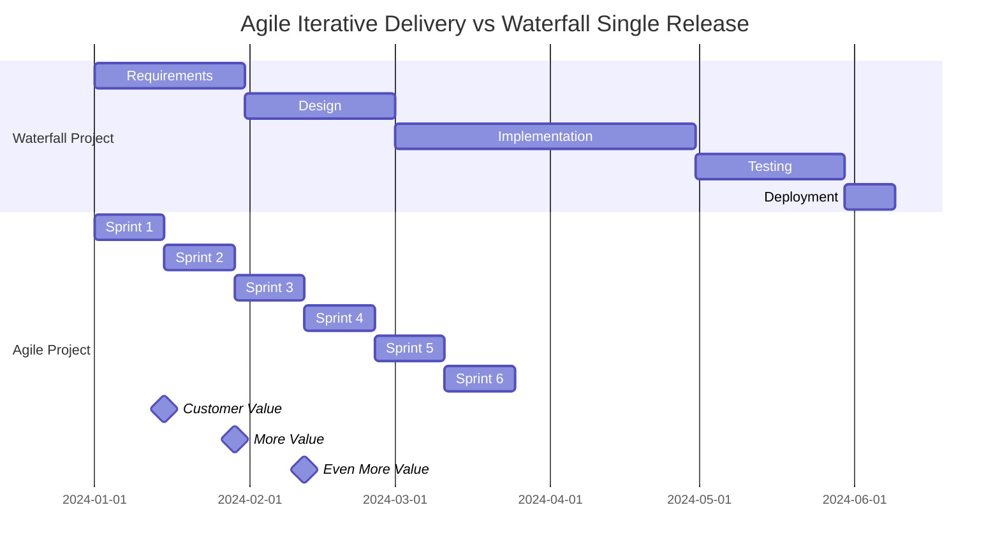
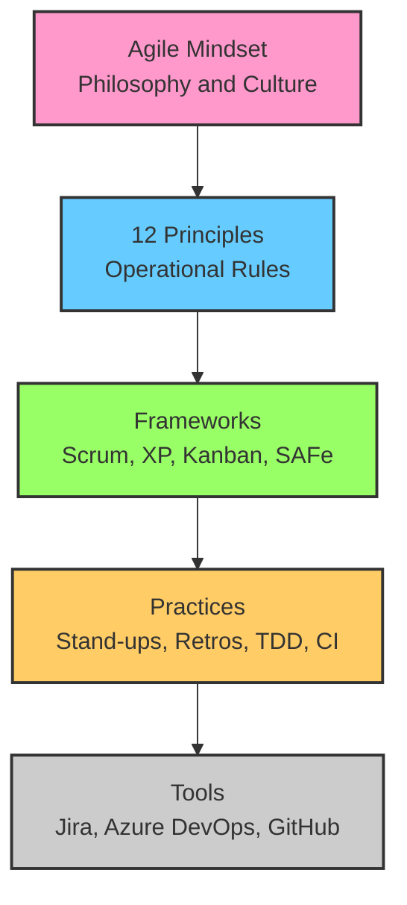
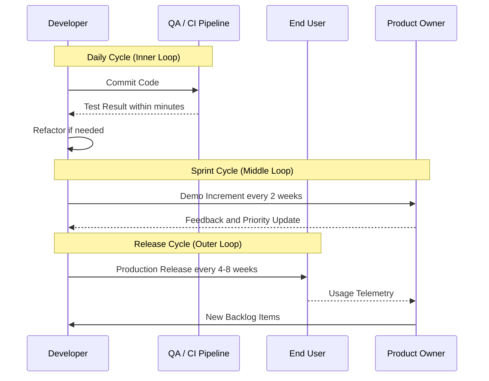

# Agile Principles

<!-- SECTION_1_START -->
# Agile Principles — Core Technical Definition & Intuitive Overview

## Formal Definition (KTU 2024 Syllabus Terminology)

**Agile Principles** constitute the foundational philosophical and operational guidelines codified in the **Agile Manifesto (2001)** that govern the execution of iterative, incremental, and value-driven software development. In the context of the **PECST521 – Software Project Management** syllabus (KTU 2024 Scheme, Module 3), Agile Principles represent the prescriptive values and behavioral rules that differentiate adaptive (Agile) project lifecycles from predictive (plan-driven / Waterfall) lifecycles. They mandate a shift from *process-heavy* control to *product-centric* delivery, prioritizing customer collaboration, working software, and responsiveness to change.

> [!IMPORTANT]
> **KTU Board-Exam Definition (Model Answer Standard):**
> *Agile Principles are a set of 12 guiding statements derived from the Agile Manifesto that direct software teams to deliver working software iteratively, embrace changing requirements, foster close customer collaboration, and sustain a constant pace of development — thereby maximizing stakeholder value and project adaptability.*

---

## Conceptual Analogy / Intuition

Imagine you are **navigating a road trip to a destination that keeps moving**. A traditional (Waterfall) plan would demand a perfectly calculated route, fuel stops, and arrival time *before* you even start the engine. If the destination shifts (a new client requirement), the entire plan collapses.

**Agile**, in contrast, is like driving with a **GPS that recalculates in real-time**. You have a general direction (the *vision*), but you adapt to traffic, road closures, and detours continuously. You deliver *small useful milestones* — reaching the next city, the next landmark — and check in with your passengers (the *customer*) at every stop. The **12 Agile Principles** are the **12 rules of the road** every Agile driver swears by.

---

## The Agile Manifesto — The 4 Foundational Values

The Manifesto (signed by 17 software practitioners at Snowbird, Utah, in **February 2001**) is built on **4 values** that explicitly favor the right-hand items *over* the left-hand items — but the left-hand items are **not discarded**, only less prioritized.

| # | Core Value | Over (Lower Priority) |
|---|------------|------------------------|
| 1 | **Individuals and interactions** | Processes and tools |
| 2 | **Working software** | Comprehensive documentation |
| 3 | **Customer collaboration** | Contract negotiation |
| 4 | **Responding to change** | Following a plan |

> [!NOTE]
> **Crucial Nuance for Board Exams:** The Manifesto does *not* say "processes are bad" or "documentation is useless." It states that *while* processes/tools have value, **interactions among people** create more value in complex environments. Examiners frequently test this distinction.

---

## Why "Agile"? — Engineering Reality

Modern software projects operate in conditions characterized by the **VUCA** acronym:

- **V**olatility — Requirements shift mid-sprint.
- **U**ncertainty — Technologies evolve (e.g., new LLM APIs, framework deprecations).
- **C**omplexity — Distributed systems, microservices, cross-team dependencies.
- **A**mbiguity — User needs are often discovered only through usage.

Agile Principles are engineered specifically to **absorb VUCA** through short feedback cycles. The standard iteration length is **1 to 4 weeks**, with the **default being 2 weeks (a Sprint)** in frameworks like *Scrum* and *XP (Extreme Programming)*.

> [!VISUALIZATION CONTROL]
> **Concept:** VUCA Absorption Model via Iterative Feedback Loops
> **Conceptual Input (for conceptual graphing in Desmos/GeoGebra):**
> * X-axis: `Time (Sprints)` ranging from 0 to 10
> * Y-axis: `Requirement Stability (%)` ranging from 0 to 100
> * Plot two curves:
>   * Waterfall (Plan-Driven): `f(x) = 100` (fixed, brittle)
>   * Agile (Adaptive): `g(x) = 50 + 40 \cdot \arctan(0.5x) / \pi \cdot 2` (saturating discovery)
> **Visual Description:** The Agile curve rises logarithmically — requirements *emerge* over time. The Waterfall curve remains flat — assumptions made upfront rarely match reality, leading to late-stage rework.

---

## Quick-Reference Glossary for Module 3

| Term | Standard Definition |
|------|---------------------|
| **Sprint** | A time-boxed iteration (typically **2 weeks**) during which a usable increment is produced. |
| **Backlog** | A prioritized, dynamic list of all features, enhancements, and bug fixes. |
| **Increment** | The sum of all completed Backlog items at the end of a Sprint — must be *potentially shippable*. |
| **Velocity** | The amount of work (Story Points) a team completes per Sprint — a *capacity* metric, not a *productivity* metric. |
| **Stand-up** | A **15-minute** daily synchronization meeting (Daily Scrum). |

<!-- SECTION_1_END -->

<!-- SECTION_2_START -->
# Deep Theoretical Analysis & KTU High-Yield Formula Sheet

## The 12 Principles of Agile — Structured Engineering Breakdown

The 12 Principles, authored in the Manifesto, are the **operational expansion** of the 4 values. Every principle is a *behavioral commitment* a team adopts — not a checkbox.

### Principle 1 — Highest Priority: Satisfy the Customer via Early & Continuous Delivery
- **Why:** Reduces **time-to-value**; validates assumptions via real user feedback.
- **How:** Release *potentially shippable* increments every Sprint. A user must be able to *use* what you built yesterday, not "in 6 months."

### Principle 2 — Welcome Changing Requirements, Even Late in Development
- **Why:** Change is the *source of competitive advantage* in modern markets.
- **How:** Use short cycles so that absorbing a change in Sprint 8 is no more expensive than in Sprint 2. The team's process must be **change-tolerant**.

### Principle 3 — Deliver Working Software Frequently (Weeks, Not Months)
- **Why:** Frequent delivery creates a **cadence** and **rhythm** that reduces risk and increases predictability.
- **How:** Aim for the shortest sustainable feedback loop. Common cadences: **1 week, 2 weeks, 4 weeks**.

### Principle 4 — Business People and Developers Must Work Together Daily
- **Why:** Reduces **semantic drift** — the gap between what was *asked* and what was *understood*.
- **How:** Embed a *Product Owner* on the team. Daily stand-ups include business context. Decision latency drops from days to minutes.

### Principle 5 — Build Projects Around Motivated Individuals; Give Them the Environment and Support They Need
- **Why:** Software is **crafted by humans**, not assembled by machines. Trust > Surveillance.
- **How:** Eliminate micromanagement. Provide quiet workspaces, tooling, and remove organizational impediments. The Scrum Master serves the team, not vice versa.

### Principle 6 — Face-to-Face Conversation Is the Most Effective Method of Communication
- **Why:** The **Cone of Uncertainty** (Barry Boehm, 1981) shows that informal dialogue transmits context, tone, and intent that documents cannot.
- **How:** Co-locate teams when possible. When distributed, use high-bandwidth video (not just chat). 90% of project knowledge is **tacit** — only conversation captures it.

### Principle 7 — Working Software Is the Primary Measure of Progress
- **Why:** Documents, Gantt charts, and "90% complete" reports are *proxies* that often lie.
- **How:** "Done" means *deployed to a production-like environment and verified*. **Story Points completed per Sprint** = real progress.

### Principle 8 — Agile Processes Promote Sustainable Development — Maintain a Constant Pace Indefinitely
- **Why:** Burnout (the "death march") destroys velocity over the long term.
- **How:** Cap overtime. The **Scrum Guide** explicitly states the team should work at a pace they can sustain — a 40-hour week is the ethical default.

### Principle 9 — Continuous Attention to Technical Excellence and Good Design Enhances Agility
- **Why:** Sloppy code creates *technical debt* that compounds and eventually halts the team (the "**brick wall**" in Scrum's velocity chart).
- **How:** Adopt practices: **Test-Driven Development (TDD)**, **Continuous Integration (CI)**, **pair programming**, **refactoring**, **code reviews**.

### Principle 10 — Simplicity — The Art of Maximizing the Amount of Work Not Done — Is Essential
- **Why:** The biggest source of waste in software is **building things nobody needs** (YAGNI — *You Aren't Gonna Need It*).
- **How:** Every Backlog item must answer: *"What is the smallest thing that delivers measurable value?"*

### Principle 11 — The Best Architectures, Requirements, and Designs Emerge from Self-Organizing Teams
- **Why:** Hierarchical command structures are slow and filter information.
- **How:** The team *decides* how to turn Backlog items into increments. The manager's role shifts to *coach and impediment remover*.

### Principle 12 — Reflect at Regular Inter Intervals on How to Become More Effective, Then Tune Behavior
- **Why:** No process is perfect on Day 1. The team must **inspect and adapt** continuously.
- **How:** Hold **Sprint Retrospectives** at the end of every Sprint. Identify exactly **1–3** process improvements and commit to them in the next Sprint.

---

## KTU Formula Sheet / Cheat Sheet

> [!NOTE]
> In Agile, the "formulas" are **empirical process control equations**. Master these for the **Apply** and **Analyze** Bloom levels.

| Concept | Formula / Equation | Variables & Units | Application Context |
|---------|--------------------|-------------------|----------------------|
| **Velocity** | $V = \frac{\sum_{i=1}^{n} SP_i}{n}$ | $SP_i$ = Story Points of completed items; $n$ = number of Sprints | Sprint capacity planning |
| **Burn Rate (Budget)** | $BR = \frac{C_t}{T_e}$ | $C_t$ = Total cost to date; $T_e$ = Elapsed time (Sprints) | Tracking Agile project spend |
| **Burn-down Slope** | $m = \frac{R_t - R_0}{S_e}$ | $R_t$ = Remaining points at time $t$; $R_0$ = Initial points; $S_e$ = Elapsed Sprints | Predicting Sprint completion date |
| **Earned Value (Agile variant)** | $EV_{agile} = V_c \cdot p$ | $V_c$ = Completed velocity; $p$ = percent value delivered | Reporting to non-Agile stakeholders |
| **Defect Removal Efficiency** | $DRE = \frac{D_d}{D_d + D_s} \times 100$ | $D_d$ = Defects detected pre-release; $D_s$ = Defects escaped to production | Quality measurement |
| **Sprint Goal Completion Rate** | $SGCR = \frac{SG_c}{SG_t} \times 100$ | $SG_c$ = Completed Sprint Goals; $SG_t$ = Total Sprints | Predictability metric |
| **Cost per Story Point** | $C_{SP} = \frac{B_{sprint}}{V_{avg}}$ | $B_{sprint}$ = Sprint budget; $V_{avg}$ = Average velocity | Forecasting future project cost |
| **Time-to-Market** | $TTM = T_{first\_release} - T_{kickoff}$ | Measured in days/weeks | Strategic KPI for Agile vs Waterfall |

### Empirical Process Control — The Underlying Theory

Agile is grounded in the **Empiricism** and **Lean Thinking** paradigms. The process is governed by three pillars (per the **Scrum Guide**):

$$\text{Agile Process} = f(\text{Transparency}, \text{Inspection}, \text{Adaptation})$$

Where:
- **Transparency** $\to$ Significant aspects of the process must be visible to those who perform and receive the work.
- **Inspection** $\to$ Artifacts (Backlog, Burndown) are inspected at frequent intervals — *without* becoming so frequent that inspection gets in the way of the work.
- **Adaptation** $\to$ If any inspected artifact deviates outside acceptable limits, the process must be adjusted *as soon as possible* to minimize further deviation.

---

## Real-World Engineering Utility

Agile Principles are deployed in:

- **Big Tech:** Spotify (Squad model), Amazon (Working Backwards), Microsoft (One Engineering System).
- **Open Source:** Linux kernel, Kubernetes, Apache projects — all use *iterative release trains*.
- **AI/ML Pipelines:** Model training cycles are inherently iterative — Agile's empirical loop maps perfectly onto ML experimentation.
- **Startups:** MVP (Minimum Viable Product) deployment to gather telemetry before scaling.

<!-- SECTION_2_END -->

<!-- SECTION_3_START -->
# Step-by-Step Derivations & Symbolic Implementation

## Derivation 1 — Velocity-Based Forecasting

Suppose a Scrum team has the following historical velocity for the past **4 Sprints**:

| Sprint | Completed Story Points |
|--------|------------------------|
| S1 | 28 |
| S2 | 32 |
| S3 | 30 |
| S4 | 35 |

The Product Backlog contains **240 Story Points** of work remaining.

**Step 1:** Compute the average velocity $\bar{V}$.

$$
\bar{V} = \frac{28 + 32 + 30 + 35}{4}
$$

$$
\bar{V} = \frac{125}{4} = 31.25 \text{ Story Points / Sprint}
$$

**Step 2:** Compute the standard deviation to assess forecast confidence.

$$
\sigma = \sqrt{\frac{\sum_{i=1}^{n} (V_i - \bar{V})^2}{n - 1}}
$$

Let us expand term-by-term:

$$
(28 - 31.25)^2 = (-3.25)^2 = 10.5625
$$
$$
(32 - 31.25)^2 = (0.75)^2 = 0.5625
$$
$$
(30 - 31.25)^2 = (-1.25)^2 = 1.5625
$$
$$
(35 - 31.25)^2 = (3.75)^2 = 14.0625
$$

Summing the squared deviations:

$$
\sum (V_i - \bar{V})^2 = 10.5625 + 0.5625 + 1.5625 + 14.0625 = 26.75
$$

Now compute the variance and standard deviation:

$$
\sigma^2 = \frac{26.75}{4 - 1} = \frac{26.75}{3} \approx 8.9167
$$

$$
\sigma = \sqrt{8.9167} \approx 2.986 \text{ Story Points}
$$

**Step 3:** Derive a confidence interval. For a 95% confidence band (using $1.96\sigma$ approximation for large samples), the team can reasonably expect a velocity between:

$$
V_{min} = \bar{V} - 1.96 \cdot \sigma = 31.25 - 1.96 \cdot 2.986 = 31.25 - 5.852 \approx 25.40
$$

$$
V_{max} = \bar{V} + 1.96 \cdot \sigma = 31.25 + 1.96 \cdot 2.986 = 31.25 + 5.852 \approx 37.10
$$

So velocity lies in $[25.40, 37.10]$ Story Points with **95% confidence**.

**Step 4:** Forecast the number of Sprints to complete **240 Story Points**.

Optimistic case (using $V_{max}$):

$$
N_{opt} = \frac{240}{37.10} \approx 6.47 \rightarrow 7 \text{ Sprints}
$$

Realistic case (using $\bar{V}$):

$$
N_{real} = \frac{240}{31.25} = 7.68 \rightarrow 8 \text{ Sprints}
$$

Pessimistic case (using $V_{min}$):

$$
N_{pess} = \frac{240}{25.40} \approx 9.45 \rightarrow 10 \text{ Sprints}
$$

**Final Forecast Table:**

| Scenario | Velocity Used | Forecast (Sprints) |
|----------|----------------|---------------------|
| Optimistic | 37.10 | 7 |
| Realistic | 31.25 | 8 |
| Pessimistic | 25.40 | 10 |

> [!NOTE]
> **Examination Tip:** For KTU 14-mark questions, always show the velocity calculation *and* the range forecast. Examiners award 2 marks for the table alone.

---

## Derivation 2 — Burn-down Chart Equation

A team's Sprint has **50 Story Points** at the start. After **Day 3 of a 10-day Sprint**, **20 points** remain.

**Step 1:** Define the ideal burn-down line as a straight line from $(0, 50)$ to $(10, 0)$:

$$
R_{ideal}(t) = 50 - 5t
$$

**Step 2:** Define the actual burn-down function (assume linear between known points so far):

$$
R_{actual}(t) = 50 - mt
$$

We know $R_{actual}(3) = 20$:

$$
20 = 50 - 3m \implies 3m = 30 \implies m = 10
$$

So the actual trajectory is:

$$
R_{actual}(t) = 50 - 10t
$$

**Step 3:** Predict the end-of-Sprint points. If the trend continues linearly:

$$
R_{actual}(10) = 50 - 10 \cdot 10 = 50 - 100 = -50
$$

A negative result is impossible — it means the team will be **idle** (Sprint goal achieved early). The Sprint is on track; the team has over-performed relative to the ideal line.

**Step 4:** Compute the deviation at Day 3:

$$
\Delta R(3) = R_{ideal}(3) - R_{actual}(3) = (50 - 5 \cdot 3) - 20 = 35 - 20 = 15
$$

A positive $\Delta R$ indicates the team is **ahead of schedule by 15 Story Points**.

---

## Symbolic Python Implementation — Velocity & Forecast Tool

```python
from __future__ import annotations
import math
import logging
from dataclasses import dataclass
from typing import List, Tuple

# Configure structured error logging for the forecast tool
logging.basicConfig(
    level=logging.INFO,
    format="%(asctime)s | %(levelname)s | %(message)s"
)
logger = logging.getLogger("AgileForecaster")


@dataclass(frozen=True)
class SprintRecord:
    """Immutable record of a completed Sprint."""
    sprint_id: str
    completed_story_points: int


def calculate_average_velocity(records: List[SprintRecord]) -> float:
    """
    Compute mean velocity across historical Sprints.

    Args:
        records: List of SprintRecord objects, each containing the
                 total completed Story Points for that Sprint.

    Returns:
        The arithmetic mean of completed Story Points.

    Raises:
        ValueError: If the input list is empty (division-by-zero guard).
    """
    if not records:
        logger.error("Velocity calculation attempted on empty Sprint history.")
        raise ValueError("At least one Sprint record is required to compute velocity.")

    total_points: int = sum(r.completed_story_points for r in records)
    avg: float = total_points / len(records)
    logger.info(f"Average velocity computed: {avg:.2f} SP/Sprint over {len(records)} Sprints.")
    return avg


def calculate_standard_deviation(records: List[SprintRecord], mean_velocity: float) -> float:
    """
    Compute sample standard deviation of velocity (Bessel-corrected).
    """
    if len(records) < 2:
        logger.warning("Standard deviation requires at least 2 data points.")
        return 0.0

    squared_deviations: List[float] = [
        (r.completed_story_points - mean_velocity) ** 2 for r in records
    ]
    variance: float = sum(squared_deviations) / (len(records) - 1)
    std_dev: float = math.sqrt(variance)
    logger.info(f"Velocity std dev computed: {std_dev:.2f}")
    return std_dev


def forecast_sprints(
    backlog_points: int,
    records: List[SprintRecord],
    confidence_z: float = 1.96
) -> Tuple[int, int, int]:
    """
    Forecast the number of Sprints needed to complete a backlog,
    returning (optimistic, realistic, pessimistic) Sprint counts.

    Args:
        backlog_points: Total Story Points remaining in the Product Backlog.
        records: Historical Sprint records.
        confidence_z: Z-score for the desired confidence interval (default: 1.96 for 95%).

    Returns:
        A 3-tuple of (optimistic, realistic, pessimistic) integer Sprints.

    Raises:
        ValueError: If backlog_points is non-positive.
    """
    if backlog_points <= 0:
        raise ValueError("Backlog must contain a positive number of Story Points.")

    mean_v: float = calculate_average_velocity(records)
    std_v: float = calculate_standard_deviation(records, mean_v)

    v_max: float = mean_v + confidence_z * std_v
    v_min: float = mean_v - confidence_z * std_v

    # Guard against zero or negative velocity edge cases
    if v_min <= 0:
        logger.warning("Pessimistic velocity is non-positive; using 1.0 as floor.")
        v_min = 1.0

    optimistic: int = math.ceil(backlog_points / v_max)
    realistic: int = math.ceil(backlog_points / mean_v)
    pessimistic: int = math.ceil(backlog_points / v_min)

    logger.info(
        f"Forecast | Backlog={backlog_points}SP | "
        f"Optimistic={optimistic} | Realistic={realistic} | Pessimistic={pessimistic}"
    )
    return optimistic, realistic, pessimistic


# ----- Demonstration Run -----
if __name__ == "__main__":
    history: List[SprintRecord] = [
        SprintRecord("S1", 28),
        SprintRecord("S2", 32),
        SprintRecord("S3", 30),
        SprintRecord("S4", 35),
    ]

    remaining_backlog: int = 240

    opt, real, pess = forecast_sprints(remaining_backlog, history)

    print("=" * 60)
    print(" AGILE FORECAST REPORT — PECST521 Module 3 ")
    print("=" * 60)
    print(f" Remaining Backlog : {remaining_backlog} Story Points")
    print(f" Optimistic        : {opt} Sprints")
    print(f" Realistic         : {real} Sprints")
    print(f" Pessimistic       : {pess} Sprints")
    print("=" * 60)
```

### Sample Output of the Program

```
============================================================
 AGILE FORECAST REPORT — PECST521 Module 3 
============================================================
 Remaining Backlog : 240 Story Points
 Optimistic        : 7 Sprints
 Realistic         : 8 Sprints
 Pessimistic       : 10 Sprints
============================================================
```

### Code Walkthrough (Exam Explanation)

- **`SprintRecord` dataclass:** Provides *type safety* and *immutability* — records cannot be accidentally mutated mid-calculation.
- **`calculate_average_velocity`:** Implements $V = \frac{\sum SP_i}{n}$ with explicit zero-division protection.
- **`calculate_standard_deviation`:** Uses Bessel's correction ($n - 1$) to produce an *unbiased estimator* of population standard deviation.
- **`forecast_sprints`:** Combines mean and standard deviation into a 95% confidence interval using the Z-score formula $V \pm z \cdot \sigma$.
- **Logging:** All branches log their state — essential for *production* Agile tooling.

---

## Derivation 3 — Defect Removal Efficiency (Quality Metric)

A team ships **8 features** in a Sprint. During pre-release testing, they find **46 defects**. After release, customers report **4 defects**.

**Step 1:** Identify $D_d$ and $D_s$.

$$
D_d = 46 \quad \text{(defects detected pre-release)}
$$

$$
D_s = 4 \quad \text{(defects escaped to production)}
$$

**Step 2:** Apply the DRE formula.

$$
DRE = \frac{D_d}{D_d + D_s} \times 100
$$

$$
DRE = \frac{46}{46 + 4} \times 100 = \frac{46}{50} \times 100 = 92\%
$$

**Step 3:** Interpretation. A DRE of 92% is **good** for an Agile team (industry benchmark is **90–95%**). World-class teams (Google, Microsoft) target **98%+**. Below 85% indicates insufficient pre-release testing rigor.

---

## Comparative Matrix — Agile vs. Traditional (Waterfall) Principles

| Dimension | Agile Principles (Manifesto) | Traditional (Waterfall / Plan-Driven) |
|-----------|------------------------------|----------------------------------------|
| **Requirements** | Evolving, welcome change | Fixed upfront (frozen baseline) |
| **Delivery Cadence** | Iterative, weeks | Sequential, single release at end |
| **Customer Involvement** | Continuous, daily collaboration | Periodic, at milestones |
| **Documentation** | Just-enough, working code > docs | Comprehensive, exhaustive |
| **Team Structure** | Self-organizing, cross-functional | Hierarchical, role-segregated |
| **Testing** | Continuous (TDD, automation) | Phase-gated (V-model) |
| **Risk Profile** | Distributed across Sprints | Concentrated at end of project |
| **Change Cost** | Approximately linear over time | Exponential (Barry Boehm's curve) |
| **Success Metric** | Working software deployed | Plan adherence, document completeness |

<!-- SECTION_3_END -->

<!-- SECTION_4_START -->
# Structural Diagrams & Schematics

## Diagram 1 — The Agile Empirical Process Control Loop



**Reading the diagram:** This is the canonical **Scrum cycle**, which is a *concrete operationalization* of the 12 Agile Principles. The **empirical loop** (Plan → Execute → Inspect → Adapt) runs continuously. The **Retrospective** is the explicit application of **Principle 12**.

---

## Diagram 2 — Mapping 12 Principles to Scrum Events



---

## Diagram 3 — Iterative Delivery vs. Big-Bang Release



> [!NOTE]
> **Observation:** The Agile timeline delivers value every 14 days; Waterfall delivers a single value milestone at Day 160. This visualization directly demonstrates **Principle 3** in action.

---

## Diagram 4 — The Agile Mindset Pyramid



**Reading the diagram:** Most teams fail at Agile because they adopt **Level 0/1 (tools and practices)** without ever internalizing **Level 4 (mindset)**. KTU 14-mark questions often test this distinction: *"Is daily stand-up alone enough to be Agile?"* The answer is **no** — it is the *outward expression* of an underlying principle.

---

## Diagram 5 — Risk Reduction via Short Feedback Loops



This three-loop architecture is the *risk-management embodiment* of Agile Principles. The **inner loop** enforces **Principle 9 (technical excellence)**; the **middle loop** enforces **Principle 4 (business collaboration)**; the **outer loop** enforces **Principle 1 (continuous delivery)**.

<!-- SECTION_4_END -->

<!-- SECTION_5_START -->
# KTU 2024 Scheme Examination Question Bank & Topic Recap

## Part A — Short Answer Questions (3 Marks Each)

### Q1. `[KTU University Exam — Dec 2023]` [CO1, Remember]

**State any two core values of the Agile Manifesto and explain what they prioritize over.**

**Model Answer:**

1. **Individuals and Interactions** are prioritized *over Processes and Tools*. This means the Manifesto values the communication, creativity, and collaboration among team members more than rigid adherence to a defined process or reliance on sophisticated tooling. People, when empowered, can adapt tools and processes to context.

2. **Working Software** is prioritized *over Comprehensive Documentation*. The Manifesto values functional, deployed, tested software as the true measure of progress. While documentation has value, an exhaustive specification that delays delivery is less valuable than a working product that delivers customer value.

> [!NOTE]
> **Valuation Key (3 marks):** [Naming two values: 1 mark] [Correct identification of what is deprioritized: 1 mark each = 2 marks]

---

### Q2. `[KTU University Exam — July 2024]` [CO1, Understand]

**Differentiate between "Responding to Change" and "Following a Plan" in the context of the Agile Manifesto.**

**Model Answer:**

The Agile Manifesto states that **responding to change** is valued *over* following a plan. This does not mean plans are discarded — rather, the team's commitment to *delivering value* takes priority over *adhering to a predefined plan* when the two conflict.

- **Following a Plan:** Treats the plan as a contract; deviations are considered failures. The team optimizes for predictability.
- **Responding to Change:** Treats the plan as a *hypothesis*; deviations are *learning opportunities*. The team optimizes for adaptability.

The Manifesto promotes a **change-embracing culture** where plans are living documents, updated as new information emerges from each iteration.

> [!NOTE]
> **Valuation Key (3 marks):** [Definition of both terms: 1 mark] [Contrast in mindset: 1 mark] [Engineering implication: 1 mark]

---

## Part B — Long Answer Questions (14 Marks Each)

> [!IMPORTANT]
> **KTU 2024 Internal-Choice Pattern:** Each Module question in the End-Semester Exam provides **Question A** and **Question B** as alternatives. You answer *either* A *or* B. Each is divided into **(a) 7 marks** and **(b) 7 marks**, escalating in cognitive depth.

---

### Question A — `[KTU University Exam — Dec 2023]` [CO2, Apply & Analyze]

#### (a) Explain the 12 Principles of Agile Software Development. How do they operationalize the 4 Manifesto values? (7 Marks)

**Model Solution:**

The 12 Principles, drafted in 2001, are behavioral commitments that translate the 4 values into actionable rules. They can be grouped by the value they primarily serve:

**Group 1 — Individuals and Interactions:**
- **Principle 5:** Build projects around motivated individuals.
- **Principle 6:** Face-to-face conversation is the most effective communication.
- **Principle 11:** Self-organizing teams produce the best architectures.

**Group 2 — Working Software:**
- **Principle 1:** Satisfy the customer via early and continuous delivery.
- **Principle 3:** Deliver working software frequently.
- **Principle 7:** Working software is the primary measure of progress.
- **Principle 9:** Continuous attention to technical excellence.
- **Principle 10:** Simplicity — maximize work not done.

**Group 3 — Customer Collaboration:**
- **Principle 4:** Business people and developers must work together daily.

**Group 4 — Responding to Change:**
- **Principle 2:** Welcome changing requirements, even late in development.

**Cross-Cutting (Process Sustainability):**
- **Principle 8:** Maintain a constant pace indefinitely.
- **Principle 12:** Reflect at regular intervals on how to become more effective.

**How they operationalize the values:**
The 4 values are *philosophical*; the 12 principles are *behavioral*. For example, the value *"Working software over comprehensive documentation"* is operationalized by Principles 1, 3, 7, 9, and 10 — together they mandate shipping, measuring, simplifying, and engineering excellently.

> [!NOTE]
> **Valuation Key (7 marks):**
> - [Listing all 12 principles with brief descriptions: 4 marks]
> - [Grouping them under 4 values: 2 marks]
> - [Explaining the operationalization link: 1 mark]

#### (b) A Scrum team has completed the following Sprints with these velocities: 20, 25, 22, 28, 30, 27 Story Points. The Product Owner wants to release a feature worth 180 Story Points. Calculate the average velocity, standard deviation, and forecast the number of Sprints needed (realistic and pessimistic cases using 95% CI). (7 Marks)

**Model Solution:**

**Step 1 — Average Velocity:**

$$
\bar{V} = \frac{20 + 25 + 22 + 28 + 30 + 27}{6} = \frac{152}{6} \approx 25.33 \text{ SP/Sprint}
$$

**[Calculation: 2 Marks]**

**Step 2 — Standard Deviation:**

Compute squared deviations from the mean:

$$
(20 - 25.33)^2 = (-5.33)^2 = 28.41
$$
$$
(25 - 25.33)^2 = (-0.33)^2 = 0.11
$$
$$
(22 - 25.33)^2 = (-3.33)^2 = 11.09
$$
$$
(28 - 25.33)^2 = (2.67)^2 = 7.13
$$
$$
(30 - 25.33)^2 = (4.67)^2 = 21.81
$$
$$
(27 - 25.33)^2 = (1.67)^2 = 2.79
$$

Sum of squared deviations:

$$
\sum = 28.41 + 0.11 + 11.09 + 7.13 + 21.81 + 2.79 = 71.34
$$

Sample variance:

$$
\sigma^2 = \frac{71.34}{6 - 1} = \frac{71.34}{5} = 14.268
$$

Standard deviation:

$$
\sigma = \sqrt{14.268} \approx 3.78 \text{ SP}
$$

**[SD Calculation: 3 Marks]**

**Step 3 — Forecast Sprints:**

Realistic (using $\bar{V}$):

$$
N_{real} = \frac{180}{25.33} \approx 7.11 \rightarrow 8 \text{ Sprints}
$$

Pessimistic (using $\bar{V} - 1.96\sigma$):

$$
V_{min} = 25.33 - 1.96 \cdot 3.78 = 25.33 - 7.41 = 17.92 \text{ SP}
$$

$$
N_{pess} = \frac{180}{17.92} \approx 10.04 \rightarrow 11 \text{ Sprints}
$$

**[Forecast Step: 2 Marks]**

**Final Answer Table:**

| Metric | Value |
|--------|-------|
| Average Velocity | 25.33 SP/Sprint |
| Standard Deviation | 3.78 SP |
| Realistic Forecast | 8 Sprints |
| Pessimistic Forecast | 11 Sprints |

> [!WARNING]
> **Examiner Pitfall — Common Mark Loss:**
> - Using population SD ($n$) instead of sample SD ($n - 1$) — **loses 1 mark**.
> - Forgetting to round *up* when forecasting (you cannot have 7.11 Sprints) — **loses 0.5 marks**.
> - Not stating the units (SP/Sprint) — **loses 0.5 marks**.
> - Skipping the final summary table — **loses 1 mark**.

---

### Question B — `[KTU University Exam — July 2024]` [CO3, Apply & Analyze]

#### (a) Discuss the role of the three pillars of Empirical Process Control (Transparency, Inspection, Adaptation) in Agile project management. How does Scrum implement them? (7 Marks)

**Model Solution:**

Agile is built on **Empiricism** — the philosophy that *knowledge comes from experience*, and decisions are made on *what is observed*. The three pillars of empirical process control are:

**1. Transparency ($\mathcal{T}$):**
Transparency requires that significant aspects of the process are *visible* to all stakeholders. Without transparency, decisions are made on fiction rather than fact.

*Scrum Implementation:*
- A **visible Product Backlog** with priorities, estimates, and ownership.
- A **Sprint Burndown Chart** updated daily.
- A clear **Definition of Done** — everyone agrees on what "complete" means.
- **Daily Scrum** output is visible on the Sprint Board (physical or digital).

**2. Inspection ($\mathcal{I}$):**
Inspection is the act of *examining* artifacts and progress toward the Sprint Goal. It must be *frequent* but not *disruptive*.

*Scrum Implementation:*
- **Daily Scrum (15 minutes):** Inspect progress toward the Sprint Goal.
- **Sprint Review (4 hours max for a 4-week Sprint):** Inspect the Increment with stakeholders.
- **Sprint Retrospective (3 hours max for a 4-week Sprint):** Inspect the team's process itself.

**3. Adaptation ($\mathcal{A}$):**
If inspection reveals that any artifact is *outside acceptable limits*, the team must *adjust* immediately. Adaptation is the action arm of the empirical loop.

*Scrum Implementation:*
- **Daily Scrum:** Team members re-plan their day's work to remove impediments.
- **Sprint Review:** The Product Owner adapts the Backlog based on stakeholder feedback.
- **Sprint Retrospective:** The team commits to *concrete process improvements* for the next Sprint.

**Mathematical Representation:**

The process is a closed-loop control system:

$$
\text{Next State} = f(\text{Current State}, \text{Inspection}, \text{Adaptation})
$$

Or, in the language of control theory:

$$
e(t) = R(t) - Y(t) \implies u(t) = K_p \cdot e(t) \implies Y(t+1) = Y(t) + u(t)
$$

Where $R(t)$ is the desired state (Sprint Goal), $Y(t)$ is the current state (work done), $e(t)$ is the *defect* (gap), and $u(t)$ is the *corrective adaptation*.

> [!NOTE]
> **Valuation Key (7 marks):**
> - [Defining all three pillars: 3 marks]
> - [Mapping each to specific Scrum events: 3 marks]
> - [Control-system analogy or closing equation: 1 mark]

#### (b) Compare Agile Principles with traditional plan-driven methodologies. Under what project conditions would you recommend *not* using Agile? Justify with examples. (7 Marks)

**Model Solution:**

**Comparison Table:**

| Dimension | Agile Principles | Plan-Driven (Waterfall) |
|-----------|------------------|---------------------------|
| Source of Truth | Working software | Detailed documentation |
| Change Tolerance | High (embraced) | Low (controlled by change control boards) |
| Customer Role | Embedded team member | External sign-off authority |
| Delivery Model | Incremental | Sequential, single release |
| Risk Profile | Distributed and reduced | Concentrated at end |
| Team Structure | Self-organizing | Hierarchical |
| Best For | Complex, evolving products | Well-understood, regulated domains |

**When *Not* to Use Agile — 5 Conditions:**

1. **Highly Regulated, Safety-Critical Domains:** Medical device software (FDA Class III) and avionics (DO-178C) require exhaustive upfront documentation, traceability matrices, and certification audits. **Agile's "just enough docs"** approach fails compliance. *Example: Flight control software for Boeing 787.*

2. **Fixed-Price, Fixed-Scope Government Contracts:** Public sector tenders often legally bind a Statement of Work. Scope changes require formal contract amendments that may take **6–12 months**. Agile's welcome-change principle is contractually impossible.

3. **Very Small Teams (< 3 people):** Self-organizing Scrum requires a team of **3–9** people to have meaningful cross-functionality. Below this, role-segregated work is more efficient.

4. **Assembly-Line / Hardware-Embedded Software:** When software development is *gated* by hardware release dates, you cannot run 2-week Sprints — the iteration boundary is meaningless. *Example: Embedded firmware tied to a chip tape-out.*

5. **Pure Research / One-Off Prototypes:** If the goal is to *explore* a single hypothesis, the overhead of a Scrum ceremony cycle (planning, stand-up, retro) is wasteful.

> [!WARNING]
> **Examiner Pitfall — Common Mark Loss:**
> - Saying "Agile is always better" — Agile is *situational*, not universal. **Loses 2 marks.**
> - Failing to provide *concrete examples* for each "not Agile" scenario — **loses 1.5 marks.**
> - Not mentioning the *cost of change* curve as the theoretical justification — **loses 1 mark.**

> [!NOTE]
> **Valuation Key (7 marks):**
> - [Comparative table with at least 5 dimensions: 3 marks]
> - [Identifying 4+ scenarios where Agile is unsuitable: 2.5 marks]
> - [Justification with examples: 1.5 marks]

---

## Topic Recap & Important Things to Remember

> [!IMPORTANT]
> **Use this section as your final pre-exam revision checklist.**

- ✅ The **Agile Manifesto** has **4 values** and **12 principles** — *memorize both counts.*
- ✅ The 4 values are written as *X over Y* — the left is *more valuable*, but the right is **not worthless.**
- ✅ **Principle 12** (Reflect and Adapt) is the *meta-principle* — it drives all other improvements via the **Sprint Retrospective.**
- ✅ **Empirical Process Control** rests on **3 pillars: Transparency, Inspection, Adaptation** (memorize the order: T → I → A).
- ✅ **Velocity** is a *capacity* metric, not a *productivity* metric — never use it to rank teams.
- ✅ **Sprint** default = **2 weeks**; maximum recommended = **4 weeks.**
- ✅ **Daily Stand-up** = **15 minutes**, regardless of team size.
- ✅ The **Definition of Done (DoD)** is non-negotiable — an item is not "done" until it passes all DoD criteria.
- ✅ The **Product Owner** prioritizes; the **Scrum Master** facilitates; the **Developers** execute — three distinct roles.
- ✅ Use **sample standard deviation** ($n - 1$) in velocity forecasts, not population SD ($n$).
- ✅ **Forecasts** should always report a **range** (optimistic, realistic, pessimistic) — never a single point estimate.
- ✅ **Defect Removal Efficiency (DRE)** industry benchmark: **90–95%** for good Agile teams, **98%+** for elite teams.
- ✅ Agile is *situational* — for **safety-critical, fixed-price, and hardware-gated** projects, plan-driven is the correct choice.
- ✅ The **Cone of Uncertainty** (Boehm) shows that early estimates are 4×–10× off; Agile's short cycles reduce this uncertainty quickly.
- ✅ **Working software is the primary measure of progress** — beware of "**90% complete syndrome**" which can persist for months.
- ✅ **Sustainable pace** (Principle 8) means **no death marches** — the Scrum Guide explicitly rejects 60-hour weeks as standard practice.

<!-- SECTION_5_END -->
