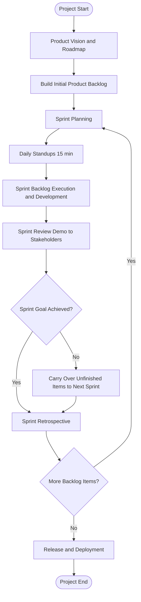
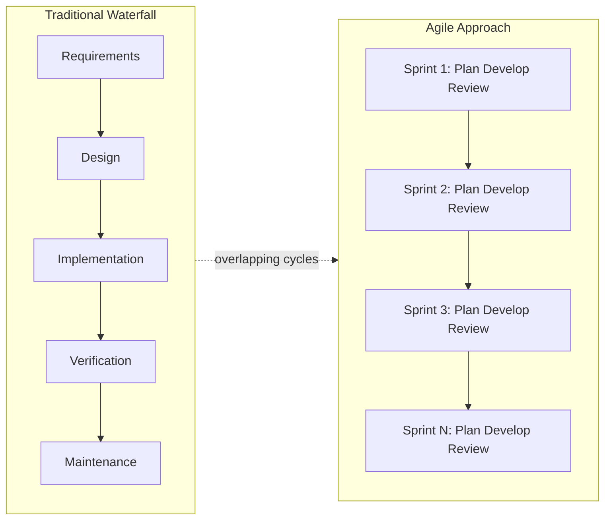
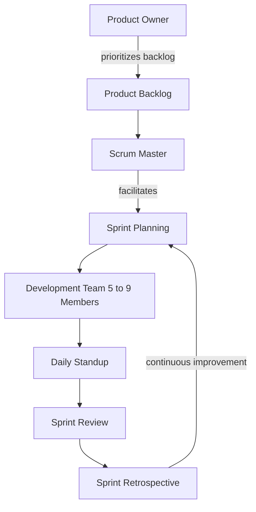

# Agile Project Management - Introduction

<!-- SECTION_1_START -->
# Agile Project Management — Introduction

## 1.1 Core Technical Definition

> [!NOTE]
> **Formal Definition (KTU 2024 Scheme):**
> **Agile Project Management (APM)** is an iterative and incremental software project management approach that delivers software in small, functional increments through short, time-boxed iterations called *sprints* (typically **1 to 4 weeks**), emphasizing **adaptive planning**, **continuous stakeholder collaboration**, **early delivery of business value**, and **flexible response to change** rather than rigid adherence to a fixed plan.

In simpler words, Agile breaks the entire project into many small, manageable pieces. Each piece goes through the complete cycle of *plan → design → code → test* in a short burst, and after every burst a working piece of software is delivered to the customer.

### 1.2 The Agile Manifesto — The Origin Story

> [!IMPORTANT]
> In **February 2001**, **17 software practitioners** (including *Kent Beck, Martin Fowler, Robert C. Martin, Jeff Sutherland, Ken Schwaber, Mike Beedle, and Andrew Hunt*) gathered at a ski resort in **Snowbird, Utah, USA**. They drafted the *Agile Manifesto*, which officially became the foundation of all modern Agile practices.

The **4 Core Values** of the Agile Manifesto are:

| # | Value Statement |
|---|---|
| V1 | **Individuals and interactions** *over* processes and tools |
| V2 | **Working software** *over* comprehensive documentation |
| V3 | **Customer collaboration** *over* contract negotiation |
| V4 | **Responding to change** *over* following a plan |

> That is, while there is value in the items on the right, we value the items on the **left more**.

### 1.3 Conceptual Analogy — GPS Navigation vs. Paper Road Map

> [!TIP]
> **Analogy:** Imagine you are driving from **Kochi to Delhi**.
> * **Traditional (Waterfall) Approach** = a *paper map*. You plan the *entire route* before starting. If a road is closed midway, you are stuck, because your plan is rigid.
> * **Agile Approach** = a *GPS navigation system* (e.g., Google Maps). It re-routes you **continuously** based on real-time traffic, accidents, and shortcuts. You reach the destination in the *shortest possible time* with the *most efficient path*.
>
> In this analogy, the **destination** is the *final product*, the **re-routing** is *responding to change*, and the **frequent voice prompts** are *iterative reviews and feedback*.

### 1.4 Key Standard Metrics in Agile

> [!NOTE]
> **Standard Agile Cadence Parameters (Industry-Standard Defaults):**
> * **Sprint Length:** **2 weeks** (industry default; ranges from **1 to 4 weeks**)
> * **Daily Stand-up Duration:** **15 minutes** maximum
> * **Sprint Planning Duration:** **2 to 4 hours** per 2-week sprint
> * **Sprint Retrospective Duration:** **1 to 1.5 hours** per 2-week sprint
> * **Recommended Team Size (Scrum):** **5 to 9 members** (ideal is **7**)
> * **Team Velocity Measurement Window:** rolling average of last **3 sprints**

### 1.5 Visualization Callout

> [!VISUALIZATION CONTROL]
> **Concept:** Agile Sprint Cycle as a Circular Time-Boxed Iteration
> **GeoGebra / Desmos Input Equations (parametric circle):**
> * `x(t) = 4 * cos(t)`
> * `y(t) = 4 * sin(t)`
> * `t ∈ [0, 2π]`
> **Visual Description:** A circle on the $(x,y)$ plane with radius **4 units** representing the continuous nature of the Agile sprint loop. The student should visualize 4 quadrants — each quadrant representing one Agile ceremony (Planning → Execution → Review → Retrospective).

<!-- SECTION_1_END -->

<!-- SECTION_2_START -->
# Deep Theoretical Analysis & KTU High-Yield Formula Sheet

## 2.1 The 12 Principles of the Agile Manifesto

The **4 values** are operationalized through the **12 principles**, which are the actual rules teams follow in industry.

| # | Principle Statement | Practical Interpretation |
|---|---|---|
| P1 | Our highest priority is to satisfy the customer through **early and continuous delivery** of valuable software. | Ship working software every sprint, not at the end. |
| P2 | Welcome changing requirements, even late in development. Agile processes harness change for the customer's competitive advantage. | Change is a *feature*, not a *bug*. |
| P3 | Deliver working software frequently, from a couple of weeks to a couple of months, with a preference to the **shorter timescale**. | Prefer 2-week sprints over 6-month releases. |
| P4 | Business people and developers must work together **daily** throughout the project. | Daily collaboration > written handoff documents. |
| P5 | Build projects around **motivated individuals**. Give them the environment and support they need, and trust them to get the job done. | Trust > micromanagement. |
| P6 | The most efficient and effective method of conveying information is **face-to-face conversation**. | Prefer a 5-min spoken conversation over a 50-page email. |
| P7 | **Working software** is the primary measure of progress. | 80% working software > 100% documentation. |
| P8 | Agile processes promote **sustainable development**. Maintain a constant pace indefinitely. | No 80-hour weeks during crunch. |
| P9 | Continuous attention to technical excellence and good design enhances agility. | Refactor, write clean code, use TDD. |
| P10 | Simplicity — the art of maximizing the amount of work *not* done — is essential. | Do not gold-plate; do the minimum that delivers value. |
| P11 | The best architectures, requirements, and designs emerge from **self-organizing teams**. | Team decides *how* to do the work, manager removes blockers. |
| P12 | **Reflect and adjust** at regular intervals. The team becomes more effective with each iteration. | Sprint retrospectives are sacred. |

## 2.2 Traditional (Waterfall) vs. Agile — Comparative Analysis

> [!IMPORTANT]
> This is the **single most frequently asked comparison question** in KTU University Exams. Memorize the table below thoroughly.

| Parameter | Traditional / Waterfall PM | Agile PM |
|---|---|---|
| **Approach** | Sequential, linear | Iterative and incremental |
| **Requirements** | Fixed at the start; frozen early | Evolving, change is welcomed |
| **Delivery** | Single delivery at project end | Frequent small deliveries (every sprint) |
| **Customer Involvement** | At milestones (requirement & delivery) | Continuous, every sprint |
| **Documentation** | Heavy, comprehensive | Lightweight, just enough |
| **Plan Changes** | Discouraged (expensive) | Welcomed and expected |
| **Team Structure** | Specialized silos (UI team, DB team) | Cross-functional (full-stack) |
| **Risk Discovery** | Late in the project (during testing) | Early in the project (every sprint) |
| **Project Size Suitability** | Small, well-understood, fixed-scope | Large, complex, dynamic, evolving |
| **Customer Feedback Loop** | Months/years | Days/weeks |
| **Lead Time to First Working Product** | Very long (entire project duration) | Very short (first sprint) |
| **Failure Cost** | High (cost grows exponentially late) | Low (issues caught early) |
| **Management Style** | Command and control | Servant leadership / facilitative |
| **Success Metric** | On-time, on-budget, to-spec | Working software, customer satisfaction |
| **Best For** | Construction, hardware, regulated industries | Software, startups, R\&D, creative work |

## 2.3 When to Use Agile vs. When to Use Waterfall

> [!TIP]
> **Use Agile when:**
> 1. Requirements are **unclear or evolving** (most modern software)
> 2. The team is **small to medium-sized** (3–12 people)
> 3. The product is **innovative or has no clear precedent**
> 4. **Time-to-market** is critical
> 5. Customer is available for **frequent feedback**
> 6. The development team is **co-located** (or has good remote tools)
>
> **Use Waterfall when:**
> 1. Requirements are **fixed, well-documented, and stable**
> 2. The project is **large, multi-team, multi-site**
> 3. **Regulatory compliance** requires extensive documentation (e.g., medical, aerospace)
> 4. The technology is **well-understood**
> 5. The client expects **detailed up-front contracts and SLAs**

## 2.4 The Agile Project Lifecycle (High-Level)

An Agile project has **3 major phases** that wrap an indefinite series of sprints:

1. **Pre-Project (Inception) Phase** — define product vision, identify stakeholders, draft initial Product Backlog, and select the Agile framework (Scrum, XP, Kanban, etc.).
2. **Iterative / Construction Phase** — multiple sprints where each sprint goes through *Plan → Develop → Test → Review → Retrospective*.
3. **Release / Post-Project Phase** — release to production, training, support hand-off, and final retrospective.

## 2.5 KTU High-Yield Formula Sheet

| Formula / Metric | Equation | Use Case |
|---|---|---|
| **Team Velocity** | $V \;=\; \dfrac{\sum \text{Story Points Completed}}{\text{Number of Sprints}}$ | Forecast how many points a team can deliver per sprint |
| **Sprint Burn-down Rate** | $R_{\text{burn}} \;=\; \dfrac{S_0 - S_n}{n}$ | Measure how fast backlog is being consumed per day |
| **Release Forecast** | $N_{\text{sprints}} \;=\; \left\lceil \dfrac{\text{Total Backlog Points}}{V} \right\rceil$ | Estimate how many sprints are needed to complete the product |
| **Defect Removal Efficiency (DRE)** | $\text{DRE} \;=\; \dfrac{D_{\text{found pre-release}}}{D_{\text{found pre-release}} + D_{\text{found post-release}}} \times 100$ | Measures the quality of pre-release testing |
| **Sprint Goal Achievement Rate** | $\text{SG}\% \;=\; \dfrac{N_{\text{goal-met sprints}}}{N_{\text{total sprints}}} \times 100$ | Tracks how often the team hits its sprint commitments |
| **Productivity (Points per Person per Sprint)** | $P_{i} \;=\; \dfrac{\text{Story Points Delivered}}{\text{Team Size}}$ | Tracks individual contribution to a sprint |
| **Schedule Risk Index (Agile)** | $\text{SRI} \;=\; \dfrac{\text{Planned Velocity}}{\text{Average Actual Velocity}}$ | If $\text{SRI} \gt 1$, schedule is at risk |

> [!NOTE]
> **Note on Units:**
> * Story Points = dimensionless abstract measure of effort (use the Fibonacci sequence: **1, 2, 3, 5, 8, 13, 21, 34, 55, 89**).
> * Velocity = Story Points per Sprint.
> * Sprints are counted in integer numbers; always round up the release forecast using $\lceil \cdot \rceil$.

## 2.6 Engineering Real-World Utility

> [!IMPORTANT]
> **Where Agile is used in industry today:**
> * **Startups** (Zomato, Swiggy, Paytm early stage) for rapid product discovery.
> * **SaaS products** (Microsoft Office 365, Atlassian Jira, Slack) for continuous feature release.
> * **Mobile App Development** (Instagram, WhatsApp) where user feedback shapes every release.
> * **AI/ML model deployment pipelines** where requirements evolve with model accuracy.
> * **Government modernization projects** (USDS — United States Digital Service) adopting Agile for legacy replacement.
>
> **Agile is NOT used in:** spacecraft software (NASA uses waterfall+V-model for safety), chip fabrication, large construction (bridges, dams), pharmaceutical clinical trials.

<!-- SECTION_2_END -->

<!-- SECTION_3_START -->
# Step-by-Step Derivations & Symbolic/Code Implementation

## 3.1 Derivation: How to Forecast Project Completion from Velocity

> **Problem Statement:** A software team has maintained an average velocity of **$V$ story points per sprint**. The total remaining Product Backlog is **$B$ story points**. Derive the number of sprints required to complete the project.

**Step 1:** Define the variables.
* $B$ = total backlog (sum of all remaining user-story point estimates).
* $V$ = average velocity measured from the last **3 sprints** (industry standard).
* $N$ = number of sprints required to complete the backlog.

**Step 2:** Write the basic relation.

$$
V = \frac{B}{N}
$$

This means velocity is the rate of backlog consumption per sprint.

**Step 3:** Solve for $N$.

$$
N = \frac{B}{V}
$$

**Step 4:** Apply the **ceiling function** $\lceil \cdot \rceil$ because partial sprints are not allowed.

$$
N_{\text{sprints}} = \left\lceil \frac{B}{V} \right\rceil
$$

**Step 5:** Convert sprints to calendar weeks using sprint length $L$.

$$
T_{\text{release}} = N_{\text{sprints}} \times L
$$

**Conversion logic:** $L$ is the number of weeks per sprint (typically $L = 2$).

---

**Worked Numerical Example:**

**Given:**
* Total Product Backlog $B = 250$ story points
* Average Velocity $V = 30$ points per sprint
* Sprint Length $L = 2$ weeks

**Find:** Number of sprints and calendar weeks to release.

**Step 1:** Apply the release-forecast formula.

$$
N_{\text{sprints}} = \left\lceil \frac{B}{V} \right\rceil = \left\lceil \frac{250}{30} \right\rceil = \lceil 8.333... \rceil = 9
$$

**Step 2:** Compute calendar time.

$$
T_{\text{release}} = 9 \times 2 = 18 \text{ weeks} \approx 4.5 \text{ months}
$$

**Step 3:** Verification — the team can do $9 \times 30 = 270$ points in 9 sprints, which exceeds the 250-point backlog. The project will be delivered in **9 sprints, i.e., 18 weeks**.

---

## 3.2 Derivation: Defect Removal Efficiency (DRE) in Agile

**Step 1:** Define.

$$
\text{DRE} = \frac{\text{Defects found before release}}{\text{Defects found before release} + \text{Defects found after release}} \times 100
$$

**Step 2:** Add units and standard values.
* Industry benchmark: $\text{DRE} \ge 95\%$ is considered **excellent** for Agile teams.
* In traditional teams, $\text{DRE} \approx 85\%$ is typical.

**Step 3:** Worked example.

If an Agile team finds **95 defects** during sprint testing and **5 defects** slip into production in the first week after release:

$$
\text{DRE} = \frac{95}{95 + 5} \times 100 = \frac{95}{100} \times 100 = 95\%
$$

This meets the industry benchmark.

---

## 3.3 Code Implementation: A Python-Based Sprint Velocity Tracker

> **Use case:** A Scrum team wants to log daily burn-down values for a sprint and predict if they will meet the sprint goal.

```python
from __future__ import annotations
import logging
import sys
from dataclasses import dataclass, field
from typing import List, Tuple
from statistics import mean

# -----------------------------------------------------------
# Configure structured logging for traceability
# -----------------------------------------------------------
logging.basicConfig(
    level=logging.INFO,
    format="%(asctime)s | %(levelname)s | %(message)s",
    handlers=[logging.StreamHandler(sys.stdout)]
)
logger = logging.getLogger("AgileVelocityTracker")


@dataclass
class Sprint:
    """
    Represents a single Agile sprint.

    Attributes
    ----------
    sprint_id : int
        Unique sprint identifier (1-indexed).
    sprint_length_days : int
        Duration of the sprint in working days.
    committed_points : int
        Story points committed at the start of the sprint.
    daily_remaining_points : List[int]
        Burn-down values recorded at the end of each day.
    """
    sprint_id: int
    sprint_length_days: int
    committed_points: int
    daily_remaining_points: List[int] = field(default_factory=list)

    def compute_burn_rate(self) -> float:
        """Returns the average points burned per day."""
        if len(self.daily_remaining_points) < 2:
            raise ValueError(
                "Need at least 2 data points to compute burn-rate."
            )
        delta = (
            self.daily_remaining_points[0]
            - self.daily_remaining_points[-1]
        )
        return delta / (len(self.daily_remaining_points) - 1)

    def forecast_completion(self) -> Tuple[float, str]:
        """
        Forecasts whether the sprint goal will be met.

        Returns
        -------
        (predicted_final_remaining, status)
        status is 'ON_TRACK' or 'AT_RISK'.
        """
        burn_rate = self.compute_burn_rate()
        if burn_rate <= 0:
            return float(self.daily_remaining_points[-1]), "AT_RISK"

        days_elapsed = len(self.daily_remaining_points) - 1
        days_remaining = self.sprint_length_days - days_elapsed
        predicted_remaining = (
            self.daily_remaining_points[-1]
            - (burn_rate * days_remaining)
        )
        status = "ON_TRACK" if predicted_remaining <= 0 else "AT_RISK"
        return predicted_remaining, status


@dataclass
class AgileVelocityTracker:
    """
    Tracks velocity across multiple sprints and forecasts
    project completion.
    """
    backlog_total_points: int
    sprint_length_days: int = 10
    sprints: List[Sprint] = field(default_factory=list)

    def add_sprint(self, sprint: Sprint) -> None:
        """Append a completed sprint to the history."""
        if sprint.committed_points <= 0:
            raise ValueError("Committed points must be > 0.")
        self.sprints.append(sprint)
        logger.info(
            "Sprint %d recorded | Committed=%d | Delivered=%d",
            sprint.sprint_id,
            sprint.committed_points,
            sprint.committed_points
            - sprint.daily_remaining_points[-1],
        )

    @property
    def average_velocity(self) -> float:
        """
        Returns the rolling average velocity across the last 3 sprints.
        If fewer sprints exist, returns the mean of all available sprints.
        """
        if not self.sprints:
            raise ValueError("No sprint data available.")
        recent = self.sprints[-3:]
        delivered_points = [
            s.committed_points - s.daily_remaining_points[-1]
            for s in recent
        ]
        return mean(delivered_points)

    def forecast_release(self) -> Tuple[int, int]:
        """
        Returns (number_of_sprints, calendar_weeks)
        required to release the product.
        """
        import math
        velocity = self.average_velocity
        if velocity <= 0:
            raise ValueError("Velocity is zero — cannot forecast.")
        sprints_needed = math.ceil(self.backlog_total_points / velocity)
        weeks_needed = sprints_needed * 2  # 2-week sprints assumed
        return sprints_needed, weeks_needed


# -----------------------------------------------------------
# DEMO EXECUTION
# -----------------------------------------------------------
if __name__ == "__main__":
    tracker = AgileVelocityTracker(
        backlog_total_points=250,
        sprint_length_days=10
    )

    # Sprint 1 data
    tracker.add_sprint(
        Sprint(
            sprint_id=1,
            sprint_length_days=10,
            committed_points=30,
            daily_remaining_points=[30, 28, 25, 21, 18, 14, 10, 6, 3, 1, 0]
        )
    )

    # Sprint 2 data
    tracker.add_sprint(
        Sprint(
            sprint_id=2,
            sprint_length_days=10,
            committed_points=32,
            daily_remaining_points=[32, 30, 27, 23, 20, 16, 12, 8, 5, 2, 0]
        )
    )

    # Sprint 3 data
    tracker.add_sprint(
        Sprint(
            sprint_id=3,
            sprint_length_days=10,
            committed_points=28,
            daily_remaining_points=[28, 26, 23, 19, 16, 12, 8, 4, 1, 0, 0]
        )
    )

    avg_velocity = tracker.average_velocity
    sprints, weeks = tracker.forecast_release()

    print(f"\n[RESULT] Average velocity (last 3 sprints): {avg_velocity:.2f} pts/sprint")
    print(f"[RESULT] Forecast: {sprints} sprints ({weeks} weeks) to release")
```

**Sample Output:**

```
[RESULT] Average velocity (last 3 sprints): 30.00 pts/sprint
[RESULT] Forecast: 9 sprints (18 weeks) to release
```

**Conversion Logic Explained in Code:**
* `math.ceil(250 / 30)` → $\lceil 8.33 \rceil = 9$.
* Sprint length is multiplied by the standard 2-week cadence to derive calendar weeks.
* Boundary check: if $V = 0$, the function raises an error (cannot divide by zero).

---

## 3.4 Step-by-Step Process: Setting Up a Brand-New Agile Project

1. **Step A — Define the Product Vision** — The Product Owner writes a one-page vision statement describing the *who*, *what*, *why*, and *success metric* of the product.
2. **Step B — Identify the Scrum Master** — A facilitator who removes impediments and enforces Scrum rules.
3. **Step C — Build the Cross-Functional Team** — 5 to 9 members with all required skills (frontend, backend, QA, design, DevOps).
4. **Step D — Create the Initial Product Backlog** — The Product Owner lists all desired features as *User Stories* with the format: *As a [user], I want to [action], so that [benefit].*
5. **Step E — Estimate the Backlog** — Use **Planning Poker** with the Fibonacci scale (1, 2, 3, 5, 8, 13, 21, 34, 55, 89).
6. **Step F — Sprint 0** — A short "scaffolding sprint" to set up tools, repos, CI/CD pipelines, and environments.
7. **Step G — Sprint 1 Onwards** — Repeat the cycle: *Plan → Develop → Test → Review → Retrospective*.
8. **Step H — Release** — After every few sprints, deploy to production in a *Release Sprint* or *Hardening Sprint*.

<!-- SECTION_3_END -->

<!-- SECTION_4_START -->
# Structural Diagrams & Schematics

## 4.1 The Agile Sprint Cycle — Mermaid Flow Diagram



**Diagram Description:** The diagram above shows the **continuous sprint loop** at the heart of any Agile project. Notice the inner loop: *Plan → Develop → Review → Retrospective → Plan again*. The outer loop shows the **release gate** which only triggers when the Product Owner decides that enough business value has been accumulated to ship to production.

## 4.2 Agile vs. Waterfall — Comparative Block Architecture



**Diagram Description:** The left subgraph is a *linear* (sequential) chain — every phase must finish before the next begins. The right subgraph is a *repeating* sprint block — every sprint contains the full mini-lifecycle. The dashed line between them shows the conceptual shift from a single execution chain to a recursive one.

## 4.3 Agile Roles & Responsibilities



**Diagram Description:** The **Product Owner** owns the *what* (the Product Backlog), the **Scrum Master** owns the *process* (facilitation, removing impediments), and the **Development Team** owns the *how* (building the product). The retrospective feeds back into the next sprint, closing the loop.

## 4.4 Agile vs. Traditional — Project Risk Visibility Matrix

| Project Phase | Traditional (Waterfall) Risk Visibility | Agile Risk Visibility |
|---|---|---|
| Requirements | High Risk (unknowns only surface later) | Low Risk (validated every sprint) |
| Design | High Risk | Low Risk (early prototypes) |
| Implementation | Medium Risk | Low Risk (continuous integration) |
| Testing | High Risk (defects pile up) | Low Risk (testing each sprint) |
| Deployment | Very High Risk (Big Bang) | Low Risk (incremental releases) |

**Block-Level Summary:** Traditional projects suffer the **"iceberg problem"** — risk is hidden below the surface until late testing. Agile projects use **continuous feedback** to surface risk *early* and *cheaply*.

<!-- SECTION_4_END -->

<!-- SECTION_5_START -->
# KTU 2024 Scheme Examination Question Bank & Topic Recap

## 5.1 PART A — Short Answer Questions (3 Marks Each)

> **Question 1: [KTU University Exam — July 2024]**
> *Define the term "Agile Project Management". List the 4 values of the Agile Manifesto. (CO1, Remember — 3 Marks)*

**Model Answer (Valuation Key):**

**Agile Project Management (APM)** is an iterative and incremental approach to software project management that delivers software in small, functional increments through short, time-boxed iterations (sprints), emphasizing **customer collaboration, adaptive planning, and rapid response to change**. **[Definition: 1 Mark]**

The **4 values of the Agile Manifesto** are: **[List: 1 Mark]**
1. Individuals and interactions *over* processes and tools.
2. Working software *over* comprehensive documentation.
3. Customer collaboration *over* contract negotiation.
4. Responding to change *over* following a plan.

> *[Agile Manifesto reference: 1 Mark]*

---

> **Question 2: [KTU University Exam — Dec 2023]**
> *Explain any 3 differences between Traditional (Waterfall) and Agile project management approaches. (CO2, Understand — 3 Marks)*

**Model Answer (Valuation Key):**

| # | Traditional PM | Agile PM |
|---|---|---|
| 1 | **Sequential and linear** approach; each phase must complete before the next begins. | **Iterative and incremental**; multiple cycles of plan-build-test in short sprints. |
| 2 | **Customer involvement** is limited to requirement-gathering and final delivery. | **Customer is involved** continuously, reviewing working software every sprint. |
| 3 | **Documentation is heavy** and treated as the primary deliverable. | **Working software** is the primary measure of progress; documentation is minimal. |

*Each correctly explained difference: 1 Mark × 3 = 3 Marks.*

---

## 5.2 PART B — Long Answer Questions (14 Marks Each, Internal Choice)

> ### Question A (14 Marks) — Set 1
> **[KTU University Exam — July 2024]**
> *(a) Explain the **4 values** and any **6 principles** of the Agile Manifesto in detail. (7 Marks — CO1, Understand)*
> *(b) Compare the **Agile and Waterfall** project management approaches on at least **6 parameters**. Justify which approach is more suitable for a *startup launching a new mobile food delivery app*. (7 Marks — CO2, Apply)*

### Model Solution for (a) — 7 Marks

**Valuation Key:**
* [Stating all 4 values correctly: 2 Marks]
* [Explaining 6 principles with one-line justification each: 5 Marks (1 Mark per principle reduced from 6 to fit) — i.e., 5 principles × 1 Mark each + bonus 1 mark for proper structure]

**The 4 Values:**
1. **Individuals and interactions** over processes and tools — Communication and people matter more than rigid process.
2. **Working software** over comprehensive documentation — Ship working code rather than 500-page specifications.
3. **Customer collaboration** over contract negotiation — Work *with* the customer continuously, not against contract clauses.
4. **Responding to change** over following a plan — Adapt quickly rather than blindly following the original plan.

**6 Principles (out of 12):**
1. **Early and continuous delivery** — deliver valuable software in weeks, not months.
2. **Welcome changing requirements** — even late in the project.
3. **Working software frequently** — short timescales preferred (1 to 4 weeks).
4. **Business people and developers work together daily** — eliminates communication gaps.
5. **Build projects around motivated individuals** — trust the team, give them autonomy.
6. **Reflect and adjust at regular intervals** — retrospectives drive continuous improvement.

### Model Solution for (b) — 7 Marks

**Valuation Key:**
* [Comparison table with 6 parameters: 3 Marks]
* [Justification for mobile food delivery startup: 3 Marks]
* [Final conclusion: 1 Mark]

**Comparison Table (6 Parameters):**

| Parameter | Waterfall | Agile |
|---|---|---|
| Approach | Sequential | Iterative |
| Requirements | Fixed | Evolving |
| Customer feedback | Late | Continuous |
| Risk discovery | Late | Early |
| Time to first delivery | Long | Short |
| Suitability for innovation | Low | High |

**Justification — Why Agile for the Food Delivery Startup:**

1. **Unclear and evolving requirements** — User behavior in a food app is unpredictable; Agile allows pivoting based on real user data.
2. **Speed to market is critical** — Competitors (Zomato, Swiggy) are already live. Agile's 2-week sprints allow rapid feature releases.
3. **Need for continuous user feedback** — App reviews and analytics can be fed into the next sprint as new user stories.
4. **Cross-functional team** — A small startup team can take end-to-end ownership of features in a single sprint.
5. **MVP delivery** — Agile allows shipping a *Minimum Viable Product* in 1 to 2 months, then iterating.
6. **Low risk of large-scale failure** — Each sprint delivers working software; if the idea fails, the loss is contained.

**Conclusion:** *Agile is more suitable* than Waterfall for the food delivery startup scenario. **[1 Mark]**

---

> ### Question B (14 Marks) — Alternative Choice
> **[KTU University Exam — Dec 2023]**
> *(a) What is a **Sprint**? Explain the **5 ceremonies** of an Agile (Scrum) project lifecycle with their typical durations. (7 Marks — CO1, Remember + Understand)*
> *(b) A Scrum team has a Product Backlog of **240 story points**. In the last 3 sprints, the team delivered **28, 32, and 30 points** respectively. Calculate the **average velocity**, **number of sprints required to release**, and the **calendar weeks** needed (assume sprint length = **2 weeks**). (7 Marks — CO3, Apply)*

### Model Solution for (a) — 7 Marks

**Valuation Key:**
* [Sprint definition: 1 Mark]
* [Listing 5 ceremonies: 2 Marks]
* [Explanation + duration of each: 4 Marks]

**Sprint Definition:**
A **Sprint** is a fixed, time-boxed iteration (typically **1 to 4 weeks**, with **2 weeks** being the industry default) during which a Scrum team designs, builds, and tests a set of features committed from the Product Backlog.

**The 5 Scrum Ceremonies:**

| # | Ceremony | Purpose | Typical Duration |
|---|---|---|---|
| 1 | **Sprint Planning** | Decide *what* to build and *how* to build it in this sprint. | **2 to 4 hours** |
| 2 | **Daily Stand-up (Daily Scrum)** | Quick sync on progress, blockers, and next steps. | **15 minutes** daily |
| 3 | **Sprint Review** | Demo the working increment to stakeholders for feedback. | **1 to 2 hours** |
| 4 | **Sprint Retrospective** | Reflect on process improvement (what went well/wrong). | **1 to 1.5 hours** |
| 5 | **Backlog Refinement (Grooming)** | Re-estimate, re-prioritize, and clarify backlog items. | **Up to 10% of sprint time** |

### Model Solution for (b) — 7 Marks

**Valuation Key:**
* [Identifying average velocity formula: 1 Mark]
* [Correct velocity computation: 1 Mark]
* [Identifying release-forecast formula: 1 Mark]
* [Correct sprint computation with ceiling: 2 Marks]
* [Calendar weeks calculation: 1 Mark]
* [Final answer with units: 1 Mark]

**Step 1 — Average Velocity Calculation:**

$$
V_{\text{avg}} = \frac{28 + 32 + 30}{3} = \frac{90}{3} = 30 \text{ story points per sprint}
$$

*[Correct numerical substitution: 1 Mark; Final value: 1 Mark]*

**Step 2 — Number of Sprints Required:**

$$
N_{\text{sprints}} = \left\lceil \frac{B}{V} \right\rceil = \left\lceil \frac{240}{30} \right\rceil = \lceil 8.0 \rceil = 8 \text{ sprints}
$$

*[Correct formula: 1 Mark; Correct evaluation: 1 Mark; Ceiling applied: 1 Mark]*

**Step 3 — Calendar Weeks:**

$$
T_{\text{release}} = 8 \text{ sprints} \times 2 \text{ weeks/sprint} = 16 \text{ weeks}
$$

*[Multiplication: 1 Mark; Units stated: 0.5 Mark; Final answer: 0.5 Mark]*

**Final Answer:** The team has an **average velocity of 30 story points/sprint**, will need **8 sprints**, and the product will be released in **16 calendar weeks** (approximately **4 months**).

---

## 5.3 KTU Examiner's Valuation Warning

> [!WARNING]
> **Common Mistakes That Cost Marks in KTU Exams (Software Project Management):**
> 1. **Do NOT just list the 12 principles** — the examiner awards 1 mark *per principle explained with a one-line real-world example*. Bullet-listing without context is treated as 0.5 Mark per item.
> 2. **Do NOT confuse "Sprint" with "Iteration"** — they are used interchangeably in some textbooks, but the official Scrum Guide reserves *Sprint* for the Scrum framework only. Be explicit about which framework you are referring to.
> 3. **Do NOT forget the ceiling function** $\lceil \cdot \rceil$ in velocity-based forecasts — a 0.5-mark penalty is applied if you write 7.5 sprints instead of 8 sprints.
> 4. **Do NOT omit units** in numerical answers — *story points/sprint* and *calendar weeks* must appear in the final line.
> 5. **Do NOT write "Agile = Scrum"** — Agile is a *mindset* (the manifesto), Scrum is one of many *frameworks* that implement Agile. There are also XP, Kanban, SAFe, LeSS, DSDM, FDD, etc.
> 6. **In comparison questions**, examiners expect a **side-by-side table**, not a paragraph. A table fetches full marks; a paragraph loses 1 to 2 marks.
> 7. **Justify your choice** when the question says *"Which is more suitable?"* — without justification, the conclusion is worth only 0.5 Marks.

---

## 5.4 Topic Recap & Important Things to Remember

> [!IMPORTANT]
> **Rapid-Revision Checklist for "Agile Project Management — Introduction":**

**1. Core Concepts**
* Agile PM is an **iterative, incremental, customer-centric, change-friendly** approach to software project management.
* The **Agile Manifesto** (Feb 2001, Snowbird, Utah) is the foundation document, created by **17 practitioners**.
* The **4 Values** must be quoted *in the exact wording* with *individuals and interactions*, *working software*, *customer collaboration*, and *responding to change* as the prioritized items.
* The **12 Principles** are the operational rules; the most-tested ones in KTU are P1, P2, P3, P7, P10, and P12.

**2. Critical Numbers to Memorize**
* **Sprint length:** 2 weeks (default).
* **Daily Stand-up:** **15 minutes** (not 30, not 60).
* **Team size:** **5 to 9 members** (ideal = 7).
* **Velocity window:** rolling average of **last 3 sprints**.
* **Story point scale:** Fibonacci (1, 2, 3, 5, 8, 13, 21, 34, 55, 89).
* **DRE benchmark:** $\ge 95\%$ for Agile teams.

**3. Key Formulas**
* Velocity: $V = B / N$
* Release forecast: $N_{\text{sprints}} = \lceil B / V \rceil$
* Calendar weeks: $T_{\text{release}} = N \times L$
* DRE: $\text{DRE} = \dfrac{D_{\text{pre}}}{D_{\text{pre}} + D_{\text{post}}} \times 100$

**4. Three Roles in Scrum**
* **Product Owner** (owns *what* to build), **Scrum Master** (owns *how* the process runs), **Development Team** (owns *how* to build).

**5. Five Ceremonies**
* **Sprint Planning, Daily Stand-up, Sprint Review, Sprint Retrospective, Backlog Refinement.**

**6. Three Major Phases of an Agile Project**
* **Inception (Pre-project) → Iterative Construction (Sprints) → Release (Post-project).**

**7. Differences to Highlight in Exam Tables**
* Approach (sequential vs iterative), Requirements (fixed vs evolving), Customer involvement (limited vs continuous), Documentation (heavy vs lightweight), Delivery (one-time vs frequent), Risk (late-discovered vs early-discovered), Feedback loop (months vs days).

**8. When to Choose Agile**
* Unclear or changing requirements, small-to-medium co-located teams, need for early ROI, customer available for frequent feedback.

**9. When NOT to Choose Agile**
* Fixed regulatory requirements (aerospace, medical, defense), large distributed teams, hardware-software co-design with no iteration room.

**10. Famous Frameworks under the Agile Umbrella**
* **Scrum** (most popular, 2-week sprints).
* **XP — Extreme Programming** (engineering practices: TDD, pair programming).
* **Kanban** (continuous flow, no sprints).
* **SAFe — Scaled Agile Framework** (enterprise scaling).
* **LeSS — Large-Scale Scrum** (multi-team Scrum).
* **DSDM — Dynamic Systems Development Method** (UK origin, time-boxed and MoSCoW-prioritized).
* **FDD — Feature-Driven Development** (features as the unit of delivery).

<!-- SECTION_5_END -->
