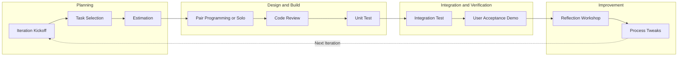
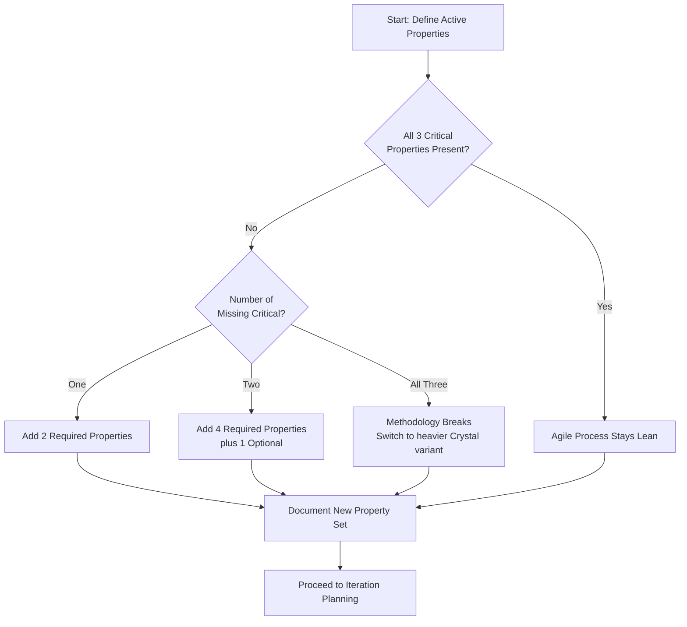
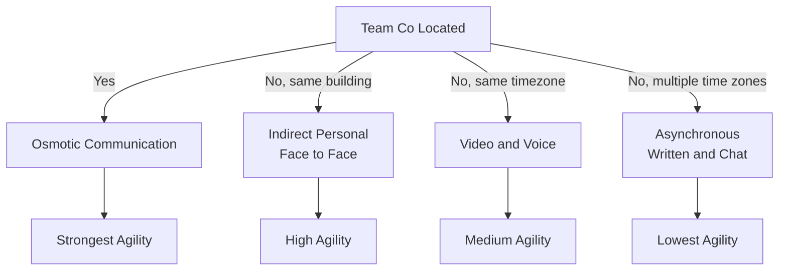

# Crystal

<!-- SECTION_1_START -->
# CRYSTAL — Agile Project Management

## 1. Core Technical Definition & Intuitive Overview

### Formal Definition
**Crystal** is a family of *lightweight*, *human-centric*, and *adaptive* software development methodologies devised by **Alistair Cockburn** in the late 1990s. It belongs to the umbrella of **Agile methodologies** and is built on the foundational premise that *every project is unique and therefore deserves a methodology tailored to its specific conditions* — particularly **team size** and **system criticality**. 

Unlike a single prescriptive process (such as Scrum or XP), Crystal is a *family* of methodologies — each denoted by a **color** (Clear, Yellow, Orange, Red, Magenta, Blue, Violet) — where the methodology's weight, ceremony, and communication overhead are scaled to the project size and the cost of failure.

> [!IMPORTANT]
> **Syllabus Highlight (KTU PECST521 — Module 3):**
> Crystal emphasizes that *projects are shaped by people and communication*, not by rigid processes. The agility lies in *adapting the methodology* rather than following fixed rules.

### Cockburn's Core Philosophy
Cockburn argued that the **methodology** must be **economical** — it should produce enough rigor to keep the project on track without imposing bureaucratic overhead that suffocates the team. He introduced two key axes for classifying projects:

| Axis | Description | Range |
|------|-------------|-------|
| **Team Size (D)** | Number of people involved | 1–2, 3–6, 7–20, 21–40, 41–80, 81–200+ |
| **Criticality (C)** | Impact of system failure | Comfort (C), Discretionary Money (D), Essential Money (E), Life (L) |

The combination yields the **Crystal color**:
$$ \text{Crystal Color} = f(D, C) $$

### Conceptual Analogy / Intuition
> [!NOTE]
> **Analogy — The Kitchen Knife Set:**
> Imagine a chef selecting knives. A sushi chef needs only a single sharp *yanagiba*; a butcher in a busy restaurant needs an entire rack — cleaver, boning knife, slicer, sharpening stones, and an apron. You do **not** give the sushi chef a cleaver, nor the butcher a yanagiba. 
> 
> **Crystal works the same way.** A 4-person internal website team needs only a *light* methodology (**Crystal Clear**), while a 50-person safety-critical avionics project needs a *heavy* one (**Crystal Orange/Red**). One size does not fit all.

> [!TIP]
> Cockburn famously stated: *"A project with a small team and no criticality needs almost no methodology; a project with a large team and life-critical outcomes needs a heavy methodology."* This **scaling principle** is the soul of Crystal.

### The Standard "Crystal Clear" Tagline
Cockburn's most-quoted line about Crystal Clear is that it is **"the minimum set of practices that has worked for projects of that size and criticality."** The methodology is intentionally *incomplete* — teams are expected to *fill in the rest* with whatever works locally.

> [!VISUALIZATION CONTROL]
> **Concept:** Crystal family size-critically grid
> **Coordinate Axes:** X-axis = Team Size (log scale), Y-axis = Criticality (C/D/E/L)
> **Plotted Regions:**
> * `Region 1` (D=3..6, C=Comfort): Crystal Clear
> * `Region 2` (D=7..20, C=Discretionary): Crystal Yellow
> * `Region 3` (D=21..40, C=Essential Money): Crystal Orange
> * `Region 4` (D=41..80, C=Essential Money): Crystal Red
> **Visual Description:** A stair-step grid ascending toward the upper-right, showing heavier methodologies occupy the high-team/high-criticality zone. Each colored band represents a methodology, increasing in ceremony.
<!-- SECTION_1_END -->

<!-- SECTION_2_START -->
# 2. Deep Theoretical Analysis & KTU High-Yield Formula Sheet

## 2.1 The Crystal Family — Color-Coding

| Color | Team Size | Criticality | Characteristics |
|-------|-----------|-------------|-----------------|
| **Crystal Clear** | 1–6 | Comfort (C) / Discretionary (D) | Minimal ceremony, co-located, manual tests OK |
| **Crystal Yellow** | 7–20 | Discretionary (D) | Some structure, early integration, role separation |
| **Crystal Orange** | 21–40 | Essential (E) | Frequent builds, dedicated testing role, customer onsite |
| **Crystal Red** | 41–80 | Essential (E) / Life (L) | Configuration management, regression test plans |
| **Crystal Magenta, Blue, Violet** | 80+ | Life (L) | Heavy configuration, formal QA, regulatory tracing |

> [!NOTE]
> **KTU Board Note:** Most exam questions on Crystal focus on **Crystal Clear** and the **seven properties** along with the **scaling rules**. Memorize the color grid above.

## 2.2 The Seven Properties of Crystal

Cockburn identified **seven properties** that determine the *agility* of a software project. They are split into three categories:

### Category 1 — Critical Properties (must be present)
These are *non-negotiable* for any agile project.

1. **Frequent Delivery** — Working code delivered every *n* weeks (e.g., 1, 2, 3, or more). Shorter cycles → higher agility.
2. **Reflective Improvement** — After every delivery, the team conducts a *retrospective* and tunes its process.
3. **Close Communication** — Ideally, **osmotic communication** (team members overhear each other; one of the team members is the customer).

### Category 2 — Required Properties (must be present, may be de-emphasized)

4. **Personal Safety** — Team members must feel *safe* to raise issues, admit mistakes, and question authority without fear of blame.
5. **Focus** — Each team member is assigned work they are *prepared and qualified* to do; no multitasking.
6. **Easy Access to Expert Users** — Frequent, fast, low-friction communication with the people who actually *use* the system.

### Category 3 — Optional / Desired Properties

7. **Technical Environment** — Automated tests, continuous integration, configuration management. Required only when team size grows beyond a threshold (typically > 6 people).

> [!IMPORTANT]
> **Properties Are NOT Independent.** Losing one Critical property forces the team to compensate with two Required properties. For example, if **Frequent Delivery** is dropped, the team may have to add **Personal Safety** and **Easy Access to Expert Users** to recover agility.

## 2.3 Crystal Clear — The Workhorse Methodology

Since **Crystal Clear** is the most-examined variant in KTU, here is its full anatomy.

### Roles in Crystal Clear
| Role | Responsibility |
|------|----------------|
| **Sponsor** | Funds the project; receives status updates. |
| **Senior Designer-Programmer** | Senior technical leader; participates in coding. |
| **Designer-Programmer** | Develops features iteratively. |
| **User (Real Customer)** | Provides requirements, accepts deliveries. |
| **Business-Specialist / Domain Expert** | Resolves requirement ambiguities. |
| **Coordinator** | Tracks time, facilitates reflection workshops. |
| **Tester** | Verifies increments; can overlap with designers. |

> [!TIP]
> In Crystal Clear, the team is *typically 2–6 people*, and many roles are *doubled* (one person can be both Designer-Programmer and Coordinator).

### Techniques in Crystal Clear
1. **Exploratory 360° Walkthroughs** — Joint reading of the *exploration document* to spot missing requirements.
2. **Reflection Workshops** — A "Lessons Learned" session, weekly or after every delivery.
3. **Early Milestone Delivery** — Show working code early, even if UI is rough.
4. **Communication Proximity** — Sit the user inside the team (osmotic communication).
5. **Configuration Management** — Lightweight for small teams, heavy for larger ones.

### Deliverables (Outputs)
- **Software** (running code increments)
- **Exploration Document** (draft requirements, scope)
- **Release Plan** (iteration dates and milestones)
- **User Manual** (incremental)
- **Status Reports** (lightweight, one per delivery)
- **Reflection Workshop Notes** (process improvements)

## 2.4 The Crystal Methodology Life Cycle (Iteration View)

Crystal treats development as a series of short, fixed-length **iterations**. The general life cycle is:

$$
\text{Sprint}_1 \to \text{Sprint}_2 \to \cdots \to \text{Sprint}_n \to \text{Final Release}
$$

Each sprint contains four core activities:

$$
\begin{aligned}
\text{Sprint}_i &= \text{Plan}_i \oplus \text{Design-Build}_i \oplus \text{Test}_i \oplus \text{Review-Deploy}_i
\end{aligned}
$$

Where $\oplus$ denotes **interleaving** — activities are *not* strictly sequential but overlap and feed each other.

## 2.5 Crystal vs. Other Agile Methods

| Dimension | Crystal | Scrum | XP |
|-----------|---------|-------|-----|
| Process strictness | Loose, customizable | Strict sprint structure | Strict engineering practices |
| Team size | 1 to 200+ (via colors) | 3–9 | 2–12 |
| Customer role | Real customer on team | Product Owner | Onsite Customer |
| Delivery cadence | Variable (1–4 weeks) | Fixed 2–4 week sprints | 1–2 week iterations |
| Documentation | Light to medium | Medium | Light |
| Engineering practices | Optional | Optional | Mandatory (TDD, pair prog) |

## 2.6 KTU High-Yield Formula / Concept Sheet

| # | Concept | Quick Recall |
|---|---------|--------------|
| 1 | Crystal Family Colors | Clear, Yellow, Orange, Red, Magenta, Blue, Violet |
| 2 | Team Size Scaling | 1–6, 7–20, 21–40, 41–80, 80–200 |
| 3 | Criticality Levels | Comfort, Discretionary Money, Essential Money, Life |
| 4 | 7 Properties | Frequent Delivery, Reflective Improvement, Osmotic Communication, Personal Safety, Focus, Easy Access to Expert Users, Technical Environment |
| 5 | Property Categories | 3 Critical + 3 Required + 1 Optional |
| 6 | Crystal Clear Roles | Sponsor, Senior Designer-Programmer, Designer-Programmer, User, Coordinator |
| 7 | Crystal Clear Techniques | 360° walkthroughs, reflection workshops, early delivery |
| 8 | Philosophy | *Minimum set of practices that works* |
| 9 | Inventor | Alistair Cockburn (late 1990s) |
| 10 | Communication mode | Osmotic (co-located) — drops to *interview* if remote |

> [!WARNING]
> **Do NOT confuse Crystal with a single methodology.** Saying *"Crystal"* is similar to saying *"Toyota's car line"* — you must specify the color (e.g., *Crystal Clear*) to refer to a specific variant.

## 2.7 Real-World Engineering Utility
- **Startup MVPs (Minimum Viable Products):** Use **Crystal Clear** — small team, low criticality, fast to market.
- **Financial trading systems:** Use **Crystal Orange** — larger team, high financial risk.
- **Aerospace / Medical device software:** Use **Crystal Red / Magenta** — life-critical, requires traceability, formal QA, regulatory compliance.
- **Government IT modernization projects:** Often adopt a *hybrid* — Crystal Clear for sprinting + Scrum-style standups for transparency.
<!-- SECTION_2_END -->

<!-- SECTION_3_START -->
# 3. Step-by-Step Derivations & Methodological Walkthroughs

## 3.1 Deriving the Crystal Color for a Given Project

### Worked Example 1 — Selecting the Crystal Color

> **Problem:** A company is building an internal HR self-service portal. The project has **6 developers**, **1 QA**, and the **HR Manager** is available part-time. Worst-case failure is a payroll delay costing the company **~₹5,00,000 per day**.

**Step 1 — Determine Team Size $D$.**
$$
D = 6 + 1 + 1 = 8 \text{ people}
$$
Effective size: $D = 8 \in [7, 20]$ → candidate is **Crystal Yellow**.

**Step 2 — Determine Criticality $C$.**
Failure impact is *financial* and *recoverable*. This corresponds to **Discretionary Money (D)** or borderline **Essential Money (E)**. Because the loss is limited to revenue delay (no lives), we pick **Discretionary (D)**.

**Step 3 — Cross-Reference the Color Grid.**
Team 7–20 + Discretionary → **Crystal Yellow**.

> **Answer:** The project should adopt **Crystal Yellow**. Heavier than Crystal Clear (formal roles, more reflection), but lighter than Crystal Orange (no formal QA team needed).

### Worked Example 2 — Property Loss Compensation

> **Problem:** A distributed team of 4 cannot perform **Osmotic Communication** because they work in 3 time zones. Which *two Required* properties should they reinforce?

**Step 1 — Identify the lost Critical property.**
Osmotic communication falls under **Close Communication** (Critical).

**Step 2 — Apply the compensation rule.**
Per Cockburn, dropping one Critical property requires boosting **two** Required properties.

**Step 3 — Select the Required properties.**
The two best candidates are:
- **Easy Access to Expert Users** (compensate by scheduling daily 15-min video calls)
- **Personal Safety** (compensate with explicit "no-blame" agreements, since remote work increases the risk of misunderstanding and conflict)

> **Answer:** Reinforce **Easy Access to Expert Users** and **Personal Safety**.

## 3.2 Crystal Clear Project — Step-by-Step Implementation

The following procedural walkthrough models how a team executes a **Crystal Clear** project over 3 months.

### Step 1 — Form the Team & Assign Roles

| Role | Person | Time Commitment |
|------|--------|-----------------|
| Sponsor | CTO | 1 hr/week |
| Senior Designer-Programmer | Alice | 100% |
| Designer-Programmer | Bob, Carol | 100% each |
| Coordinator | Alice (doubled) | 20% of her time |
| User | Customer Priya | 4 hrs/week |
| Business Specialist | Domain Expert Raj | 2 hrs/week |

### Step 2 — Draft the Exploration Document
The team writes a 5–10 page document covering:
- Business goals
- User personas
- Major use-cases (ranked)
- Initial non-functional requirements (performance, security)
- Constraints (tech stack, deadline, budget)

### Step 3 — Plan the Release (Timeboxing)
Crystal Clear typically uses **2-week** cycles. For a 3-month project:

$$
\text{Number of iterations} = \left\lfloor \frac{12 \text{ weeks}}{2 \text{ weeks}} \right\rfloor = 6 \text{ iterations}
$$

### Step 4 — Iterate (Plan → Build → Test → Reflect)

Each iteration follows the loop:

$$
\begin{aligned}
\text{Day 1} &: \text{Iteration Planning} \\
\text{Day 2-7} &: \text{Design + Build (paired or solo)} \\
\text{Day 8-9} &: \text{Integration Test} \\
\text{Day 10} &: \text{Demo to User (frequent delivery)} \\
\text{Day 10 PM} &: \text{Reflection Workshop}
\end{aligned}
$$

### Step 5 — Reflection Workshop
Every iteration ends with a 1–2 hour session where the team answers:
1. What went well? (keep doing)
2. What did not go well? (stop doing)
3. What should we try? (start doing)

Outputs are recorded in the **Reflection Notes** document and acted upon in the next iteration.

### Step 6 — Final Release & Project Retrospective
After the last iteration:
- Run a **360° walkthrough** of the *Exploration Document* to verify all use-cases are covered.
- Conduct a **Project Retrospective** (similar to sprint reflection but project-wide).
- Hand over to operations and close the project.

## 3.3 Crystal Methodology — Algorithmic Pseudocode

For students who enjoy algorithm-like formalization, here is the Crystal Clear execution algorithm:

```python
from typing import List, Tuple
from dataclasses import dataclass
import logging

# --- Logging Configuration ---
logging.basicConfig(level=logging.INFO, format='%(asctime)s | %(levelname)s | %(message)s')
logger = logging.getLogger("CrystalClear")

# --- Domain Models ---
@dataclass(frozen=True)
class Criticality:
    level: str  # 'C', 'D', 'E', 'L'

@dataclass(frozen=True)
class TeamSize:
    count: int

@dataclass(frozen=True)
class CrystalColor:
    name: str
    min_team: int
    max_team: int
    criticality: str
    required_properties: Tuple[str, ...]

# --- Color Catalog (scaled per Cockburn) ---
CATALOG: List[CrystalColor] = [
    CrystalColor("Crystal Clear",  1,   6,  "C/D", ("Frequent Delivery", "Reflective Improvement", "Osmotic Communication")),
    CrystalColor("Crystal Yellow", 7,  20,  "D",   ("Frequent Delivery", "Reflective Improvement", "Communication")),
    CrystalColor("Crystal Orange", 21, 40,  "E",   ("Frequent Delivery", "Reflective Improvement", "Configuration Management")),
    CrystalColor("Crystal Red",    41, 80,  "E/L", ("Frequent Delivery", "Reflective Improvement", "Configuration Management", "Regression Tests")),
]

# --- Property Enforcement Engine ---
CRITICAL_PROPS = {"Frequent Delivery", "Reflective Improvement", "Osmotic Communication"}
REQUIRED_PROPS  = {"Personal Safety", "Focus", "Easy Access to Expert Users"}
OPTIONAL_PROPS  = {"Technical Environment"}

def select_color(team: TeamSize, criticality: Criticality) -> CrystalColor:
    if not (1 <= team.count <= 80):
        logger.error(f"Team size {team.count} outside Crystal range (1..80).")
        raise ValueError("Unsupported team size for Crystal family.")

    for color in CATALOG:
        if color.min_team <= team.count <= color.max_team and criticality.level in color.criticality.split("/"):
            logger.info(f"Selected methodology: {color.name}")
            return color
    raise ValueError("No matching Crystal color for the given inputs.")

def compensate_properties(active_props: set) -> set:
    """If a Critical property is missing, reinforce two Required ones."""
    missing_critical = CRITICAL_PROPS - active_props
    if missing_critical:
        logger.warning(f"Missing Critical: {missing_critical}. Reinforcing two Required.")
        # Pick the two most impactful Required properties
        reinforced = list(REQUIRED_PROPS)[:2]
        return active_props.union(reinforced)
    return active_props

def run_iteration(iteration_no: int, duration_weeks: int = 2) -> dict:
    """Simulate one Crystal iteration."""
    logger.info(f"=== Iteration {iteration_no} START ===")
    plan = f"Plan features for cycle {iteration_no}"
    build = f"Design + Code for cycle {iteration_no}"
    test = f"Integration test for cycle {iteration_no}"
    demo = f"Demo to user — iteration {iteration_no}"
    reflect = f"Reflection workshop — cycle {iteration_no}"
    return {
        "iteration": iteration_no,
        "duration_weeks": duration_weeks,
        "outputs": [plan, build, test, demo, reflect],
    }

def execute_project(team_count: int, crit: str, total_iterations: int = 6) -> None:
    color = select_color(TeamSize(team_count), Criticality(crit))
    print(f"\nMethodology in use: {color.name}")
    print(f"Required properties: {color.required_properties}\n")

    history = []
    for i in range(1, total_iterations + 1):
        history.append(run_iteration(i))

    print("\nProject Summary:")
    for h in history:
        print(f"  • Iteration {h['iteration']}: {h['duration_weeks']} weeks, outputs: {len(h['outputs'])}")

# --- Main Execution ---
if __name__ == "__main__":
    # Example 1: 4-person team, comfort criticality
    execute_project(team_count=4, crit="C", total_iterations=6)

    # Example 2: 15-person team, discretionary
    execute_project(team_count=15, crit="D", total_iterations=4)

    # Example 3: 30-person team, essential
    execute_project(team_count=30, crit="E", total_iterations=5)
```

**Sample Output (truncated):**
```
2025-01-15 10:00:00 | INFO | Selected methodology: Crystal Clear
Methodology in use: Crystal Clear
Required properties: ('Frequent Delivery', 'Reflective Improvement', 'Osmotic Communication')
...
Project Summary:
  • Iteration 1: 2 weeks, outputs: 5
  • Iteration 2: 2 weeks, outputs: 5
  ...
```

## 3.4 Comparative Matrix — When to Choose Crystal

| Project Scenario | Recommended Crystal Variant | Reasoning |
|------------------|----------------------------|-----------|
| 2-person startup MVP | **Crystal Clear** | Minimal ceremony, co-located, user is the team |
| 8-person internal tool | **Crystal Yellow** | Slightly more structure, no formal QA yet |
| 30-person payment gateway | **Crystal Orange** | Financial criticality, need regression suite |
| 60-person medical device firmware | **Crystal Red** | Life-critical, full traceability |
| 150-person banking core | **Crystal Magenta / Blue** | Regulatory compliance, distributed teams |
<!-- SECTION_3_END -->

<!-- SECTION_4_START -->
# 4. Structural Diagrams & Schematics

## 4.1 Crystal Family Tree (Scaling Diagram)

```mermaid
graph TD
    A[Crystal Family<br/>Founded by Alistair Cockburn]
    A --> B[Crystal Clear<br/>1 to 6 people]
    A --> C[Crystal Yellow<br/>7 to 20 people]
    A --> D[Crystal Orange<br/>21 to 40 people]
    A --> E[Crystal Red<br/>41 to 80 people]
    A --> F[Crystal Magenta<br/>80 to 200 people]
    A --> G[Crystal Blue<br/>200 plus people]

    B --> B1[Sponsor]
    B --> B2[Senior Designer Programmer]
    B --> B3[Designer Programmer]
    B --> B4[User Onsite]
    B --> B5[Coordinator]

    C --> C1[Sponsor]
    C --> C2[Business Analyst]
    C --> C3[Designer Programmer x N]
    C --> C4[User Onsite]
    C --> C5[Coordinator]

    D --> D1[Sponsor]
    D --> D2[Business Analyst]
    D --> D3[Designer Programmer Team]
    D --> D4[Test Specialist]
    D --> D5[User Representative]
    D --> D6[Coordinator]

    E --> E1[Configuration Manager]
    E --> E2[Regression QA Team]
    E --> E3[Multiple Designer Teams]
    E --> E4[Formal User Group]
```



## 4.2 Crystal Clear Iteration Cycle (Sub-Process View)



## 4.3 Property-Compensation Flowchart



## 4.4 Communication Modes Across Crystal Sizes



## 4.5 Crystal Clear — Block-Level Functional Architecture Flow

| Block | Function | Inputs | Outputs | Owner |
|-------|----------|--------|---------|-------|
| **Project Inception** | Define goals, scope, team | Business need | Exploration document | Sponsor + Senior Designer |
| **Iteration Loop** | Build + test increments | Iteration backlog | Working software | Designer-Programmers |
| **Reflection Block** | Improve process | Sprint outcomes | Action items | Coordinator |
| **Delivery Block** | Hand over to user | Working code | User accepted release | User + Senior Designer |
| **Project Closure** | Final retrospective | Project artifacts | Lessons learned report | Whole team |
<!-- SECTION_4_END -->

<!-- SECTION_5_START -->
# 5. KTU 2024 Scheme Examination Question Bank & Topic Recap

## PART A — 3-Mark Short Answer Questions

### Question 1
**[KTU University Exam – July 2024]** *Define the Crystal family of methodologies. Why is it called a "family"?*

**Model Answer (3 Marks):**
Crystal is a family of agile software development methodologies created by **Alistair Cockburn** in the late 1990s. It is called a *family* because it contains multiple variants — **Crystal Clear, Yellow, Orange, Red, Magenta, Blue, Violet** — each tailored to a different combination of **team size** and **system criticality**. The core belief is that no single methodology fits all projects; therefore, the project manager selects the most appropriate variant. **[Definition: 1 Mark; Family concept: 1 Mark; Cockburn: 1 Mark]**

### Question 2
**[KTU University Exam – Dec 2023]** *List the three Critical and three Required properties of any Crystal project.*

**Model Answer (3 Marks):**
The three **Critical** properties are:
1. **Frequent Delivery**
2. **Reflective Improvement**
3. **Close (Osmotic) Communication**

The three **Required** properties are:
1. **Personal Safety**
2. **Focus**
3. **Easy Access to Expert Users**

**[1 Mark for each correct list; 0.5 Mark for naming the Optional property if asked.]**

---

## PART B — 14-Mark Questions (Module Internal Choice Pattern)

### Question A (14 Marks)

**[KTU University Exam – Model Paper 2024, Module 3]** 
*(a)* Describe the **Crystal Clear** methodology in detail, listing all its roles, techniques, and deliverables. **[7 Marks]**
*(b)* Compare **Crystal Clear** with **Scrum** in terms of team size, customer role, and process strictness. **[7 Marks]**

#### Model Solution — Part (a) (7 Marks)

**Roles in Crystal Clear:** **[Listing all six roles: 2 Marks]**

1. **Sponsor** — funds the project, receives updates.
2. **Senior Designer-Programmer** — technical leader, actively codes.
3. **Designer-Programmer** — implements features.
4. **User (Real Customer)** — provides requirements, accepts deliveries.
5. **Business-Specialist** — clarifies domain rules.
6. **Coordinator** — tracks time, schedules reflection workshops.

**Techniques:** **[Naming and explaining any three: 3 Marks]**

1. **Exploratory 360° Walkthroughs** — joint reading of the exploration document to detect gaps.
2. **Reflection Workshops** — end-of-iteration session to improve process.
3. **Frequent Delivery** — every 1–3 months; small teams may do it more often.
4. **Osmotic Communication** — co-location so that information flows naturally.
5. **Personal Safety** — team members must be safe to raise issues.

**Deliverables:** **[Naming and explaining any three: 2 Marks]**

- Working software (running increments)
- Exploration document (draft requirements)
- Release plan (iteration calendar)
- User manual (incremental)
- Status reports (per delivery)
- Reflection notes

#### Model Solution — Part (b) (7 Marks)

| Parameter | Crystal Clear | Scrum | Valuation |
|-----------|---------------|-------|-----------|
| **Team Size** | 1–6 (small co-located) | 3–9 (Scrum Team) | **[2 Marks]** |
| **Customer Role** | Real customer physically present, full-time | Product Owner (proxy, prioritizes backlog) | **[2 Marks]** |
| **Process Strictness** | Loose, customizable; team can re-invent ceremonies | Strict — sprints, daily standup, retrospective are mandatory | **[2 Marks]** |
| **Engineering Practices** | Optional (TDD, CI may or may not be present) | Optional but encouraged | **[0.5 Mark]** |
| **Documentation** | Lightweight (exploration doc) | Medium (product backlog, sprint backlog) | **[0.5 Mark]** |

**Conclusion:** Crystal Clear is suited for tiny, co-located teams with low criticality, while Scrum suits medium-sized teams needing strict role separation. **[1 Mark]**

### Question B (14 Marks) — *Alternative Choice*

**[KTU University Exam – Dec 2022]**
*(a)* Explain Cockburn's **scaling rules** for selecting a Crystal color based on team size and criticality. Provide the color for: **(i)** A 5-person team building an internal wiki, **(ii)** A 35-person team building a payment gateway, **(iii)** A 70-person team building pacemaker firmware. **[7 Marks]**
*(b)* Discuss the **seven properties** of Crystal. What happens if a project loses the "Frequent Delivery" property? **[7 Marks]**

#### Model Solution — Part (a) (7 Marks)

**Cockburn's Scaling Rules:** **[2 Marks]**
- Crystal scales the methodology along two axes: **Team Size (D)** and **Criticality (C)**.
- As team size and criticality increase, the methodology becomes heavier — more roles, more documentation, more automation, more QA.
- The Crystal colors map to specific size/criticality ranges.

**Color Grid:** **[2 Marks]**

| Team Size | Criticality | Color |
|-----------|-------------|-------|
| 1–6 | Comfort / Discretionary | Crystal Clear |
| 7–20 | Discretionary | Crystal Yellow |
| 21–40 | Essential Money | Crystal Orange |
| 41–80 | Essential / Life | Crystal Red |
| 80–200 | Life | Crystal Magenta/Blue |

**Answers:** **[3 Marks — 1 each]**
- **(i)** 5-person internal wiki → **Crystal Clear** (Comfort criticality).
- **(ii)** 35-person payment gateway → **Crystal Orange** (Essential Money criticality).
- **(iii)** 70-person pacemaker firmware → **Crystal Red** (Life-critical).

#### Model Solution — Part (b) (7 Marks)

**Seven Properties — Categorized:** **[3 Marks]**

*Critical (must-have):*
1. Frequent Delivery
2. Reflective Improvement
3. Close / Osmotic Communication

*Required (must-have, may be de-emphasized):*
4. Personal Safety
5. Focus
6. Easy Access to Expert Users

*Optional:*
7. Technical Environment

**Loss of "Frequent Delivery":** **[3 Marks]**
- Without frequent delivery, the project loses its main feedback loop. The customer cannot validate incremental work, defects accumulate, and risk grows.
- According to Cockburn's compensation rule, **losing one Critical property requires strengthening two Required properties.**
- The team should:
  1. **Increase Easy Access to Expert Users** — daily short syncs, demos, screen-shares to compensate.
  2. **Boost Personal Safety** — so the team can surface late discoveries without blame.

**Conclusion:** **[1 Mark]**
Frequent delivery is the *oxygen* of agility; losing it is survivable only if the team becomes doubly attentive to customer access and psychological safety.

> [!WARNING]
> **KTU Examiner's Valuation Warning / Pitfall Callout:**
> 1. **Do NOT list all 7 properties as one flat list.** Examiners award marks for *categorization* (Critical/Required/Optional). Listing them flatly costs you 1–1.5 marks.
> 2. **Always state the team-size range and criticality when naming a color.** Saying "Crystal Orange" alone is incomplete; say *"Crystal Orange — 21–40 people, Essential Money criticality."*
> 3. **Do not confuse Crystal Clear with Crystal Orange.** A common slip is to apply heavy QA practices to a 4-person team, which violates Crystal's *economy* principle.
> 4. **In property-compensation questions, explicitly state "two Required properties."** Many students just say "compensate" without quantifying — you lose 1 mark.
> 5. **The exploration document is NOT a full requirements specification.** Examiners penalize students who describe it as a 100-page SRS.

---

## Topic Recap & Important Things to Remember

> [!TIP]
> **Rapid-Revision Checklist (Save for Last-Minute Reading)**

- **Inventor:** Alistair Cockburn, late 1990s. **Type:** Family of agile methodologies, NOT a single process.
- **Crystal Colors:** Clear, Yellow, Orange, Red, Magenta, Blue, Violet (ascending weight).
- **Scaling Axes:** Team size (D) and Criticality (C: Comfort, Discretionary, Essential, Life).
- **7 Properties:** Frequent Delivery, Reflective Improvement, Close Communication, Personal Safety, Focus, Easy Access to Expert Users, Technical Environment.
- **3 Critical + 3 Required + 1 Optional.** Lose 1 Critical → add 2 Required.
- **Crystal Clear Team Size:** 1–6 (or 2–8 in later editions); co-located; user is on the team.
- **Roles in Crystal Clear:** Sponsor, Senior Designer-Programmer, Designer-Programmer, User, Business-Specialist, Coordinator.
- **Key Techniques:** 360° walkthroughs, reflection workshops, frequent delivery, osmotic communication.
- **Iteration Length:** Typically 1–4 weeks; Crystal Clear defaults to **2 weeks**.
- **Communication Mode:** **Osmotic** (co-located) is the gold standard; degrades to interview/async in distributed setups.
- **Crystal Clear is "minimum set of practices that works"** — quote this verbatim for full marks on definition questions.
- **Crystal Orange (21–40) is the first variant with a dedicated Test role.**
- **Crystal Red adds Configuration Management + Regression Tests** because of life-criticality.
- **Crystal vs. XP:** Crystal is *process* flexible; XP enforces engineering practices (TDD, pair programming, CI).
- **Crystal vs. Scrum:** Crystal adapts to team size; Scrum is *fixed* at 3–9 people. Crystal emphasizes human communication; Scrum emphasizes sprint ceremonies.
- **Reflection Workshop = Retrospective** (same concept, different terminology).
- **Exploration Document = Draft requirements + scope** (NOT a full SRS).
- **Real-world mapping:** Startup → Crystal Clear; Banking apps → Crystal Orange; Medical/Aerospace → Crystal Red/Magenta.
- **Property compensation formula:** $\text{Missing Critical}_n \Rightarrow \text{Required}_{2n}$ (e.g., lose 2 Critical → add 4 Required).
- **Always mention Cockburn's name** when defining Crystal — examiners allocate 0.5–1 mark just for the attribution.
<!-- SECTION_5_END -->
