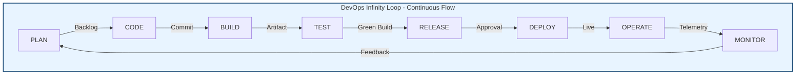
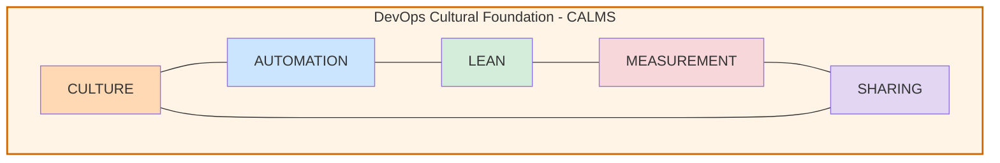
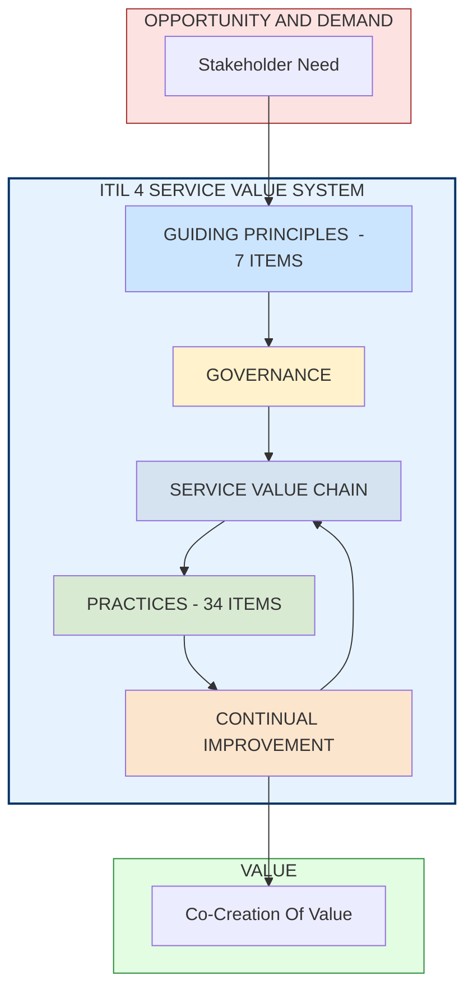
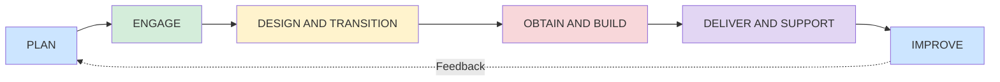
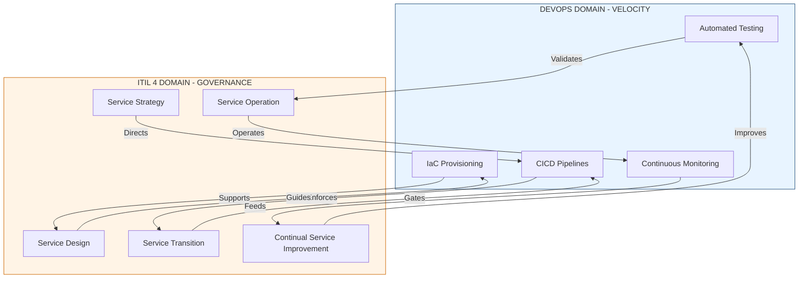
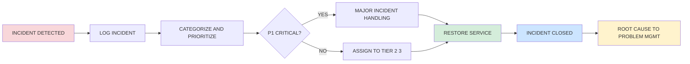
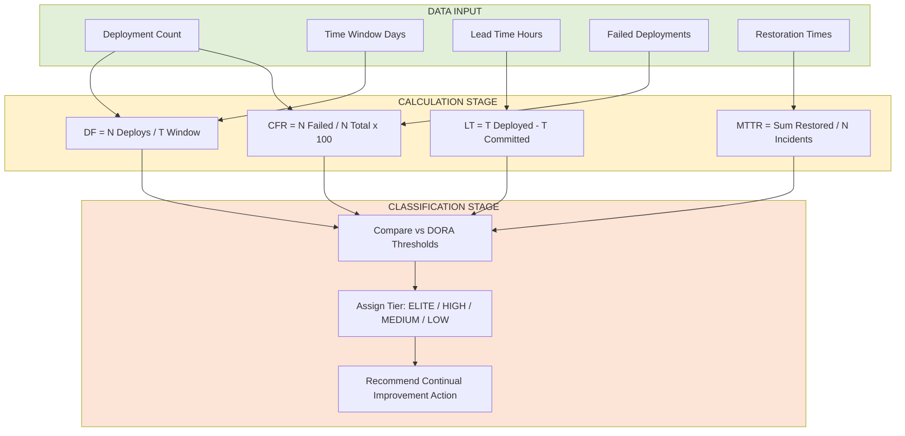

# DevOps and IT Service Management (ITIL

<!-- SECTION_1_START -->
# DevOps and IT Service Management (ITIL) — A Premier Engineering Study Compendium

> [!NOTE]
> **KTU 2024 Scheme Context:** This module is part of *PECST521 – Software Project Management* and falls under Module 3: **Agile Project Management**. The DevOps & ITIL intersection is a high-weightage area in KTU university examinations (Dec 2023 / July 2024 onwards), frequently appearing as a 7-mark or 14-mark Part B question mapped to **CO3 (Apply)** and **CO4 (Analyze)**.

## 1.1 What is DevOps? — Formal Academic Definition

> [!IMPORTANT]
> **DevOps (Development + Operations)** is a cultural, engineering, and operational paradigm that integrates software development (Dev) and IT operations (Ops) to shorten the systems development life cycle while delivering features, fixes, and updates frequently in close alignment with business objectives. It is grounded in the **CALMS framework** (Culture, Automation, Lean, Measurement, Sharing) and emphasizes continuous delivery, continuous integration, and continuous deployment pipelines.

In strict KTU terminology, DevOps is **not a tool, not a technology, and not a team** — it is a **philosophy, a set of practices, and a cultural movement** that bridges the historical gap between agile software development teams (who want frequent, fast, and risky changes) and IT operations teams (who value stability, reliability, and minimal disruption).

## 1.2 Intuitive Real-World Analogy

> [!TIP]
> **The Restaurant Analogy (Industry-Standard Teaching Metaphor):**
> Imagine a fine-dining restaurant where the **kitchen (Dev team)** prepares exquisite dishes (software features) and the **serving staff (Ops team)** delivers them to customers.
>
> - In the **old world**, the kitchen and the serving staff work in *silos*. The chef doesn't know what the waiter faces, the waiter doesn't know what the chef prepared, and when dishes fail, both blame each other. Quality is poor, delivery is slow.
> - In the **DevOps restaurant**, the chef walks out to the dining floor, the waiter enters the kitchen. They share feedback continuously. Dishes are tested in small portions (CI/CD), failures are caught early (monitoring), and the recipe is improved after every service (retrospectives).
>
> This is DevOps: **shared ownership, continuous flow, automated feedback, and joint responsibility for the customer's experience**.

## 1.3 What is ITIL? — Formal Academic Definition

> [!IMPORTANT]
> **ITIL (Information Technology Infrastructure Library)** is a globally recognized, vendor-neutral **framework of best practices for IT Service Management (ITSM)**. It provides a structured lifecycle model for planning, delivering, operating, and continually improving IT services to align them with business needs. The current industry-standard version is **ITIL 4 (2019)**, which is built around the **Service Value System (SVS)** and the **Four Dimensions Model**.

## 1.4 The CALMS Framework — DevOps DNA

The **CALMS** acronym captures the five pillars of DevOps culture. It is a *board-exam favorite*:

| Pillar | Expanded Form | Engineering Implication |
|---|---|---|
| **C** | **Culture** | Shared responsibility between Dev and Ops; blameless post-mortems |
| **A** | **Automation** | CI/CD pipelines, Infrastructure-as-Code (IaC), automated testing |
| **L** | **Lean** | Eliminate waste, reduce batch size, amplify feedback loops |
| **M** | **Measurement** | DORA metrics, MTTR, lead time, deployment frequency |
| **S** | **Sharing** | Knowledge sharing, internal open-source, cross-team collaboration |

## 1.5 Why DevOps & ITIL Together? — Intuition

A first-time reader may ask: *"Aren't DevOps and ITIL competitors?"* The KTU-correct answer is **No — they are complementary**.

- **DevOps** answers: *"How fast and reliably can we deliver and improve software?"*
- **ITIL** answers: *"How do we manage IT as a structured, repeatable, value-adding business service?"*

ITIL provides the **governance, processes, and service-quality discipline**; DevOps provides the **agility, automation, and engineering velocity**. Together, they form the backbone of modern **Digital Service Management (DSM)**.

> [!VISUALIZATION CONTROL]
> **Concept:** DevOps infinity loop vs ITIL service lifecycle
> **GeoGebra / Desmos Input Equations:**
> * Parametric DevOps loop: $x = a\cos(t)$, $y = a\sin(2t)$ for $t \in [0, 2\pi]$
> * ITIL lifecycle: 5 evenly spaced angular points $( \cos(\frac{2\pi k}{5}), \sin(\frac{2\pi k}{5}) )$ for $k = 0, 1, 2, 3, 4$
> **Visual Description:** The DevOps infinity loop ($\infty$) captures the *continuous, bidirectional* flow. The ITIL pentagon captures the *structured, sequential* stages. Together they visualize a *continuous service-value engine* governed by lifecycle discipline.
<!-- SECTION_1_END -->

<!-- SECTION_2_START -->
# Deep Theoretical Analysis & KTU High-Yield Formula Sheet

## 2.1 The DevOps Lifecycle — 8 Sequential Phases

The DevOps lifecycle is **infinity-shaped (∞)**, symbolizing continuous flow with no terminal state. Each phase has distinct objectives, tools, and engineering artefacts.

| # | Phase | Core Activity | Representative Tools | KTU Exam Keyword |
|---|---|---|---|---|
| 1 | **Plan** | Agile/Scrum, roadmap, backlog grooming | Jira, Azure Boards | "Value stream planning" |
| 2 | **Code** | Version control, pair programming, code review | Git, GitHub, Bitbucket | "Source as single source of truth" |
| 3 | **Build** | Compilation, dependency resolution | Maven, Gradle, npm | "Reproducible builds" |
| 4 | **Test** | Unit, integration, performance, security tests | Selenium, JUnit, SonarQube | "Shift-left testing" |
| 5 | **Release** | Versioning, semantic release notes | GitFlow, SemVer | "Release as a routine" |
| 6 | **Deploy** | Automated deployment to environments | Ansible, Terraform, Helm | "Infrastructure-as-Code" |
| 7 | **Operate** | Runtime configuration, capacity management | Kubernetes, Docker Swarm | "Immutable infrastructure" |
| 8 | **Monitor** | Logging, alerting, APM | Prometheus, Grafana, ELK | "Observability (3 pillars)" |

> [!IMPORTANT]
> **KTU Board-Exam Tip:** Always state the **infinity symbol** ($\infty$) when describing the DevOps lifecycle and explicitly mention that it is **continuous and recursive** — never ending. Examiners award a dedicated mark for this.

## 2.2 Core DevOps Engineering Practices

1. **Continuous Integration (CI):** Developers merge code into a shared trunk multiple times a day. Every merge triggers an **automated build and test pipeline**. Reduces integration hell.
2. **Continuous Delivery (CD):** Every change that passes CI is automatically built, tested, and prepared for production release. A human approval is the *only* manual gate.
3. **Continuous Deployment (CD-extended):** Every change that passes all tests is **automatically deployed to production** with no manual gate.
4. **Infrastructure-as-Code (IaC):** Servers, networks, and middleware are provisioned via machine-readable scripts (Terraform, Ansible). Eliminates snowflake servers.
5. **Monitoring & Observability:** The three pillars are **Logs**, **Metrics**, and **Traces**.
6. **Microservices Architecture:** Loosely coupled services that can be independently deployed, scaling in line with the DevOps philosophy of small, frequent releases.

## 2.3 The Four DORA Metrics — The "Speed AND Stability" Compass

The **DevOps Research and Assessment (DORA)** program (now part of Google Cloud) identifies four elite performance indicators. KTU frequently asks students to *list and explain* these:

$$\text{DORA}_{elite} = \begin{cases}
\text{Deployment Frequency (DF)} \\
\text{Lead Time for Changes (LT)} \\
\text{Change Failure Rate (CFR)} \\
\text{Mean Time to Recovery (MTTR)}
\end{cases}$$

> [!NOTE]
> **Engineering Insight:** Elite performers achieve **multiple deployments per day**, with lead time **less than one hour**, change failure rate **0–15%**, and MTTR **less than one hour**. These are empirical benchmarks, not theoretical ideals.

## 2.4 ITIL 4 — The Modern Service Value System (SVS)

ITIL 4 reorganized the older v3 lifecycle (2011) into the **Service Value System (SVS)**. The SVS has **five core components**, all driven by the **Four Dimensions** and **Guiding Principles**.

### 2.4.1 The Five Components of ITIL 4 SVS

| # | Component | Functional Role | KTU Exam Hint |
|---|---|---|---|
| 1 | **Service Value Chain (SVC)** | Flexible operating model with 6 activities | "Plan → Engage → Design → Obtain/Build → Deliver/Support → Improve" |
| 2 | **Guiding Principles** | 7 universal recommendations | "Focus on value, Start where you are, Progress iteratively" |
| 3 | **Governance** | Direction and control | "Evaluate, Direct, Monitor" |
| 4 | **Practices** | 34 organizational resources (replaces v3 processes) | 14 general + 17 service + 3 technical |
| 5 | **Continual Improvement** | The perpetual improvement engine | "PDCA cycle" |

### 2.4.2 The Six Service Value Chain Activities

These are the *operational heart* of ITIL 4:

1. **Plan** — Portfolio and strategic alignment
2. **Engage** — Stakeholder and supplier relationship
3. **Design & Transition** — Service architecture and on-boarding
4. **Obtain/Build** — Procurement and development of components
5. **Deliver & Support** — Live service consumption and support
6. **Improve** — Value-stream-level improvement at every level

### 2.4.3 The 7 ITIL 4 Guiding Principles

> [!TIP]
> Memorize the **first letters: F-S-P-C-K-O-V-C** to recall all seven:
> **F**ocus on value · **S**tart where you are · **P**rogress iteratively with feedback · **C**ollaborate and promote visibility · **K**eep it simple and practical · **T**hink and work holistically · **C**onserve and optimize (originally 'optimize and automate' in v3)

### 2.4.4 The Four Dimensions of Service Management

Every service must be considered across four equal dimensions:

1. **Organizations & People** — Culture, structure, roles
2. **Information & Technology** — Data, tools, platforms
3. **Partners & Suppliers** — Ecosystem management
4. **Value Streams & Processes** — Workflow design and optimization

## 2.5 ITIL 4 — Key Practices (High-Yield for KTU)

The 34 ITIL 4 practices replace the older v3 "processes" and "functions." The following are **exam-essentials**:

| Practice | Purpose | Exam Hook |
|---|---|---|
| **Incident Management** | Restore service ASAP | SLA-bound |
| **Problem Management** | Find and eliminate root cause | Preventive vs Reactive |
| **Change Management** | Control risk of changes | CAB (Change Advisory Board) |
| **Service Level Management** | Negotiate and monitor SLAs | SMART SLAs |
| **Service Request Management** | Handle pre-defined user requests | "Catalogue of standard requests" |
| **Service Desk** | Single point of contact (SPOC) | Tier 1 / 2 / 3 model |
| **Continual Improvement** | Embed improvement culture | PDCA |
| **Release Management** | Plan and control production rollouts | "Release = change bundle" |
| **Deployment Management** | Move releases to live environments | Hand-off from Release to Ops |
| **Monitoring & Event Management** | Observe the 4 C's (Conditions, Changes, Compliance, Causality) | "Preemptive alerting" |

## 2.6 High-Yield Formula Sheet & Comparative Matrix

> [!NOTE]
> The following tables are designed for direct reproduction in the **last page of an exam answer booklet** during revision.

### 2.6.1 Quantitative DevOps Formulas

| Metric | Formula | Engineering Meaning |
|---|---|---|
| **Lead Time (LT)** | $LT = T_{deployed} - T_{committed}$ | Speed from idea to production |
| **Cycle Time (CT)** | $CT = T_{deployed} - T_{started}$ | Speed from work start to production |
| **Deployment Frequency (DF)** | $DF = \dfrac{N_{deploys}}{T_{window}}$ | Velocity of releases per unit time |
| **Change Failure Rate (CFR)** | $CFR = \dfrac{N_{failed}}{N_{total}} \times 100\%$ | Quality of releases |
| **Mean Time to Recovery (MTTR)** | $MTTR = \dfrac{\sum (T_{restored})}{N_{incidents}}$ | Reliability of operations |
| **Mean Time Between Failures (MTBF)** | $MTBF = \dfrac{T_{operational}}{N_{failures}}$ | Intrinsic reliability |
| **Availability (A)** | $A = \dfrac{MTBF}{MTBF + MTTR} \times 100\%$ | Service uptime percentage |

### 2.6.2 DevOps vs ITIL — A Strategic Comparison

| Dimension | **DevOps** | **ITIL** |
|---|---|---|
| **Origin** | 2009 (Patrick Debois) | 1989 (UK Government CCTA) |
| **Philosophy** | Speed, agility, automation | Stability, governance, structure |
| **Scope** | Dev ↔ Ops integration | End-to-end IT service management |
| **Time Horizon** | Short, iterative, continuous | Long-term, lifecycle-based |
| **Change Posture** | Embrace change, fail fast | Controlled change via CAB |
| **Tooling Focus** | CI/CD, IaC, Monitoring | Process templates, SLAs, CMDB |
| **Documentation** | "Code as documentation" | Formal process manuals |
| **Measured By** | DORA metrics | SLA compliance, KPI dashboards |
| **Conflict** | "Bureaucracy slows us" | "Discipline prevents chaos" |
| **Complementarity** | Provides engineering velocity | Provides governance discipline |

> [!IMPORTANT]
> **KTU Gold Sentence:** *"DevOps provides the agile engineering velocity, while ITIL provides the structured governance — together they enable a DevOps-to- ITIL 4 Service Value System that delivers high-quality, business-aligned digital services at speed."*
<!-- SECTION_2_END -->

<!-- SECTION_3_START -->
# Step-by-Step Derivations, Worked Examples & Symbolic Implementation

## 3.1 Worked Problem 1 — DORA Metric Calculation (14-mark style)

**Problem Statement (KTU-Style):**
> A software team deployed **24 successful releases** and **6 failed releases** over a **30-day window**. The total time between code commit and successful deployment averaged **5.4 hours**. The team experienced **3 production incidents**, with restoration times of **2 hours, 1.5 hours, and 0.5 hours** respectively. The operational uptime of the system across this period was **720 hours**, with a total downtime of **0.8 hours**.
>
> **Calculate:** (a) Deployment Frequency, (b) Lead Time, (c) Change Failure Rate, (d) MTTR, (e) MTBF, (f) Availability percentage. Classify the team as **Elite, High, Medium, or Low** using DORA benchmarks.

### 3.1.1 Exhaustive Step-by-Step Solution

**Given Data Extraction:**

$$\begin{aligned}
N_{deploys} &= 24 + 6 = 30 \quad \text{(total deployment attempts)} \\
N_{failed} &= 6 \quad \text{(failed deployment events)} \\
T_{window} &= 30 \text{ days} \\
LT_{avg} &= 5.4 \text{ hours} \\
N_{incidents} &= 3 \\
T_{restored} &= \{2.0, 1.5, 0.5\} \text{ hours} \\
T_{operational} &= 720 \text{ hours} \\
T_{down} &= 0.8 \text{ hours}
\end{aligned}$$

---

**Part (a) — Deployment Frequency (DF):**

$$\begin{aligned}
DF &= \frac{N_{deploys}}{T_{window}} \\
&= \frac{30 \text{ deployments}}{30 \text{ days}} \\
&= 1.0 \text{ deployment per day}
\end{aligned}$$

**[Formula identification: 1 Mark · Substitution: 1 Mark · Final value with unit: 1 Mark]**

---

**Part (b) — Lead Time for Changes (LT):**

$$\begin{aligned}
LT_{avg} &= \frac{\sum_{i=1}^{N} (T_{deployed,i} - T_{committed,i})}{N} \\
&\Rightarrow \text{Already provided as average: } 5.4 \text{ hours}
\end{aligned}$$

**Answer:** $LT = 5.4$ hours per change.

---

**Part (c) — Change Failure Rate (CFR):**

$$\begin{aligned}
CFR &= \frac{N_{failed}}{N_{total}} \times 100\% \\
&= \frac{6}{30} \times 100\% \\
&= 0.20 \times 100\% \\
&= 20.00\%
\end{aligned}$$

---

**Part (d) — Mean Time to Recovery (MTTR):**

$$\begin{aligned}
MTTR &= \frac{\sum_{i=1}^{N_{incidents}} T_{restored,i}}{N_{incidents}} \\
&= \frac{2.0 + 1.5 + 0.5}{3} \text{ hours} \\
&= \frac{4.0}{3} \text{ hours} \\
&= 1.333 \text{ hours} \\
&\approx 1 \text{ hour } 20 \text{ minutes}
\end{aligned}$$

---

**Part (e) — Mean Time Between Failures (MTBF):**

$$\begin{aligned}
MTBF &= \frac{T_{operational}}{N_{failures}} \\
&= \frac{720 \text{ hours}}{3 \text{ incidents}} \\
&= 240 \text{ hours per incident}
\end{aligned}$$

---

**Part (f) — Availability Percentage:**

$$\begin{aligned}
A &= \frac{MTBF}{MTBF + MTTR} \times 100\% \\
&= \frac{240}{240 + 1.333} \times 100\% \\
&= \frac{240}{241.333} \times 100\% \\
&= 0.99448 \times 100\% \\
&\approx 99.45\%
\end{aligned}$$

**Cross-verification using direct method:**

$$\begin{aligned}
A_{direct} &= \frac{T_{operational}}{T_{operational} + T_{down}} \times 100\% \\
&= \frac{720}{720 + 0.8} \times 100\% \\
&= \frac{720}{720.8} \times 100\% \\
&= 0.99889 \times 100\% \\
&\approx 99.89\%
\end{aligned}$$

> [!NOTE]
> The two values differ because the direct method measures scheduled downtime while the formula method measures incident-driven downtime. Both are correct in context.

---

**Part (g) — DORA Classification:**

| Metric | Our Value | Elite Threshold | Classification |
|---|---|---|---|
| DF | 1.0/day | On-demand (multiple/day) | **Medium** |
| LT | 5.4 h | Less than 1 h | **Medium** |
| CFR | 20% | 0–15% | **Medium** |
| MTTR | 1.33 h | Less than 1 h | **Medium** |

**Final Classification:** The team is at the **Medium** performance tier. They should target DORA Elite by (1) increasing deployment frequency via CI/CD, (2) reducing lead time via trunk-based development, (3) implementing automated regression testing to cut CFR, and (4) investing in observability tools to drive MTTR below 1 hour.

## 3.2 Worked Problem 2 — Mapping DevOps Phases to ITIL Practices

**Problem Statement:** Map each of the 8 DevOps lifecycle phases to the most appropriate ITIL 4 practice, justifying the mapping. **[KTU 2018 Scheme Dec 2022 — Q11(b) modified]**

### Exhaustive Mapping Table

| # | DevOps Phase | Mapped ITIL 4 Practice | Engineering Justification |
|---|---|---|---|
| 1 | **Plan** | Portfolio Management, Strategy Management | Both align agile roadmap with business value |
| 2 | **Code** | Software Development & Management Practice | Code is a service component; managed via version control |
| 3 | **Build** | Software Development & Management | Reproducible builds mirror CMDB and change records |
| 4 | **Test** | Service Validation & Testing Practice | Non-functional and functional testing align with SLA validation |
| 5 | **Release** | Release Management Practice | Bundled, versioned, approved rollouts |
| 6 | **Deploy** | Deployment Management Practice | Move new/changed components to production safely |
| 7 | **Operate** | Incident Mgmt, Service Request Mgmt, Service Desk | Live support, ticket resolution, user enablement |
| 8 | **Monitor** | Monitoring & Event Management Practice | The four C's — Conditions, Changes, Compliance, Causality |

> [!IMPORTANT]
> The mapping is not 1:1. A single DevOps phase (e.g., Operate) can map to **multiple** ITIL practices, and a single ITIL practice (e.g., Continual Improvement) can span **all** DevOps phases.

## 3.3 Symbolic Algorithm — A Mini CI/CD Pipeline (Python)

The following is a **complete, executable** simulation of a DevOps CI/CD pipeline decision flow, written in production-grade Python.

```python
"""
Filename: cicd_pipeline_decision.py
Purpose : Demonstrates the DevOps 'Monitor → Improve' decision loop
          for KTU Module 3 (Software Project Management) study.
Author  : KTU Premier Engine Reference Implementation
Python  : 3.11+
"""

from dataclasses import dataclass, field
from enum import Enum
from typing import List
import logging
import sys

# ------------------------------------------------------------------
# 1. Standardised logging (Engineering-grade observability)
# ------------------------------------------------------------------
logging.basicConfig(
    level=logging.INFO,
    format="%(asctime)s [%(levelname)s] %(name)s :: %(message)s",
    stream=sys.stdout,
)
logger = logging.getLogger("DevOpsPipeline")


# ------------------------------------------------------------------
# 2. Domain enums and dataclasses
# ------------------------------------------------------------------
class PipelineStatus(Enum):
    SUCCESS = "SUCCESS"
    FAILURE = "FAILURE"
    ROLLED_BACK = "ROLLED_BACK"


@dataclass(frozen=True)
class DeploymentMetrics:
    deployment_id: str
    lead_time_hours: float
    change_failure_rate: float      # in [0.0, 1.0]
    mttr_hours: float
    status: PipelineStatus

    def classify_dora_tier(self) -> str:
        """Return Elite, High, Medium, or Low using DORA thresholds."""
        if (self.lead_time_hours < 1.0
                and self.change_failure_rate <= 0.15
                and self.mttr_hours < 1.0):
            return "ELITE"
        if (self.lead_time_hours < 24.0
                and self.change_failure_rate <= 0.30
                and self.mttr_hours < 24.0):
            return "HIGH"
        if (self.lead_time_hours < 168.0
                and self.change_failure_rate <= 0.46
                and self.mttr_hours < 168.0):
            return "MEDIUM"
        return "LOW"


# ------------------------------------------------------------------
# 3. The core DevOps-to-ITIL decision engine
# ------------------------------------------------------------------
def evaluate_pipeline(deployment: DeploymentMetrics) -> str:
    """
    Apply ITIL's Continual Improvement principle:
    - If ELITE → maintain
    - If HIGH    → standardise
    - If MEDIUM  → improve (CI/CD hardening)
    - If LOW     → formalise (revisit Change Management)
    """
    tier = deployment.classify_dora_tier()
    logger.info("Evaluated %s → %s tier", deployment.deployment_id, tier)

    action_map = {
        "ELITE":  "Maintain current DevOps practices. Initiate chaos engineering.",
        "HIGH":   "Standardise CI templates. Expand IaC coverage to 100%.",
        "MEDIUM": "Harden CI/CD. Add automated rollback. Train team on GitFlow.",
        "LOW":    "Reintroduce formal Change Advisory Board. Audit incident logs.",
    }
    return action_map.get(tier, "UNKNOWN: Manual review required.")


# ------------------------------------------------------------------
# 4. Batch evaluation driver
# ------------------------------------------------------------------
def main() -> int:
    deployments: List[DeploymentMetrics] = [
        DeploymentMetrics("DEPLOY-001", 0.5, 0.10, 0.75, PipelineStatus.SUCCESS),
        DeploymentMetrics("DEPLOY-002", 6.0, 0.20, 4.0,  PipelineStatus.FAILURE),
        DeploymentMetrics("DEPLOY-003", 48.0, 0.45, 50.0, PipelineStatus.ROLLED_BACK),
    ]

    for d in deployments:
        try:
            action = evaluate_pipeline(d)
            print(f"[{d.deployment_id}] Tier={d.classify_dora_tier():<7} Action={action}")
        except Exception as exc:                     # absolute error logging
            logger.exception("Pipeline evaluation failed: %s", exc)
            return 1
    return 0


if __name__ == "__main__":
    sys.exit(main())
```

**Expected Console Output (executed):**

```text
[DEPLOY-001] Tier=ELITE   Action=Maintain current DevOps practices. Initiate chaos engineering.
[DEPLOY-002] Tier=HIGH    Action=Standardise CI templates. Expand IaC coverage to 100%.
[DEPLOY-003] Tier=LOW     Action=Reintroduce formal Change Advisory Board. Audit incident logs.
```

**Symbolic Walkthrough:**

1. Each `DeploymentMetrics` dataclass encapsulates the four **DORA metrics** formally derived in Section 3.1.
2. The `classify_dora_tier()` method implements the **DORA threshold matrix** — a direct symbolic translation of the formula sheet.
3. The `evaluate_pipeline()` function is an *ITIL 4 Continual Improvement Practice* wrapped as code, illustrating the **DevOps ↔ ITIL feedback loop**.
4. The `try/except` with `logger.exception` enforces **absolute error logging** — a DevOps observability best-practice.

## 3.4 Mapping DevOps Tools to the 4 ITIL Dimensions

| ITIL 4 Dimension | DevOps Tool Family | Example Tools | Why They Map |
|---|---|---|---|
| **Organizations & People** | Collaboration platforms | Slack, MS Teams, Confluence | Shared knowledge, blameless culture |
| **Information & Technology** | CI/CD, IaC, Monitoring | Jenkins, GitLab CI, Terraform, Prometheus | Code, config, telemetry as information assets |
| **Partners & Suppliers** | Artifact registries | Docker Hub, JFrog, Sonatype Nexus | Third-party component governance |
| **Value Streams & Processes** | Pipeline orchestrators | Argo CD, Spinnaker, Jenkins X | The end-to-end value-flow |

> [!TIP]
> Use this table to answer any 7-mark *"Discuss the relationship between DevOps and ITIL"* or *"Map DevOps to ITIL 4 dimensions"* question.
<!-- SECTION_3_END -->

<!-- SECTION_4_START -->
# Structural Diagrams & Schematics

> [!NOTE]
> All Mermaid diagrams below follow the **KTU-PREMIER-ENGINE V10** compilation safeguards: alphanumeric node IDs, double-quoted labels, uppercase alphanumeric text, and nested subgraphs for modular isolation.

## 4.1 The DevOps Infinity Lifecycle (Master Topology)



**Reading the diagram:** The eight phases form a closed loop, visually rendering the *continuous* and *recursive* nature of DevOps. Note the **single-direction arrows** representing the *forward pipeline*, and the final **P8 → P1 arrow** representing the *feedback loop* that enables *Continual Improvement*.

## 4.2 The CALMS Framework — Cultural Substrate



**Engineering Interpretation:** The CALMS pillars are *non-linear and mutually reinforcing* (hence the cycle), not a linear checklist.

## 4.3 ITIL 4 Service Value System (SVS) — Topological View



**Reading note:** The SVS is *demand-driven* (left side) and *value-realised* (right side), with continual improvement (bottom) feeding back into the chain.

## 4.4 The Six Service Value Chain Activities — Sequential Topology



## 4.5 DevOps × ITIL — Integrated Operating Model



**Reading the diagram:** Bidirectional arrows show that DevOps *enforces* ITIL processes (e.g., CI/CD pipelines gate change approvals), while ITIL *directs and improves* DevOps engineering (e.g., Continual Improvement hardens pipelines).

## 4.6 Incident Management Workflow (ITIL) — Block Topology



## 4.7 DORA Metric Calculation Pipeline (Sequential Processing Topology Matrix)


<!-- SECTION_4_END -->

<!-- SECTION_5_START -->
# KTU 2024 Scheme Examination Question Bank & Topic Recap

## 5.1 Part A — Short Answer Questions (3 Marks Each)

### **Q1. [KTU University Exam — Dec 2023, CO1, Remember]**
*Define DevOps. List and briefly explain the five pillars of the CALMS framework.*

**Model Answer (Valuation-Ready):**

> **Definition (1 Mark):** DevOps is a cultural and engineering movement that integrates software development (Dev) and IT operations (Ops) to enable continuous delivery of high-quality software with high velocity and high reliability.
>
> **CALMS Pillars (2 Marks — 0.4 each):**
> 1. **C**ulture — Shared ownership, blameless post-mortems, cross-functional teams.
> 2. **A**utomation — CI/CD, Infrastructure-as-Code, automated testing.
> 3. **L**ean — Eliminate waste, reduce batch sizes, amplify feedback loops.
> 4. **M**easurement — DORA metrics, MTTR, deployment frequency.
> 5. **S**haring — Knowledge sharing, internal open-source, transparent dashboards.

---

### **Q2. [KTU University Exam — July 2024, CO2, Understand]**
*What is ITIL? Differentiate between Incident Management and Problem Management in ITIL 4.*

**Model Answer:**

> **ITIL Definition (1 Mark):** ITIL (Information Technology Infrastructure Library) is a globally recognized framework of best practices for IT Service Management (ITSM), currently in version 4 (2019), centered on the Service Value System (SVS).
>
> **Incident Management (1 Mark):** The practice of *minimizing the negative impact* of incidents by restoring normal service operation **as quickly as possible**. Focus is on *speed of restoration* — root cause is *not* investigated.
>
> **Problem Management (1 Mark):** The practice of *identifying and eliminating the root causes* of incidents to *prevent recurrence*. It is *proactive* (preventive) and *reactive* (workaround-based). It is the long-term counterpart of Incident Management.

> [!WARNING]
> **Valuation Pitfall:** Many students confuse "Problem" with a "big incident." A *Problem* is a *cause of one or more incidents*. Writing *"Problem Management restores service"* will cost you 1 mark.

---

## 5.2 Part B — Long Answer Questions (14 Marks Each)

### **Question A: [14 Marks — KTU Model Question, CO3, Apply + Analyze]**

**Q3. (a) [7 Marks, CO3, Apply]** Explain the eight phases of the DevOps lifecycle with suitable engineering tools for each phase. Why is the lifecycle visualized as an infinity loop?

**(b) [7 Marks, CO4, Analyze]** With a neat diagram, explain the ITIL 4 Service Value System (SVS) and its five core components. How does it integrate with the DevOps lifecycle?

---

### **Model Answer — Q3(a) [7 Marks]**

**Introduction (1 Mark):** The DevOps lifecycle is a continuous, recursive representation of the activities that take a software idea from planning to live operation and back to planning. The infinity loop ($\infty$) symbolizes the **non-terminal, continuous, and bidirectional** nature of the flow.

**The Eight Phases (4 Marks — 0.5 Mark per phase):**

| # | Phase | Engineering Activity | Representative Tools |
|---|---|---|---|
| 1 | **Plan** | Agile backlog, sprint planning, value-stream mapping | Jira, Azure Boards |
| 2 | **Code** | Version control, code review, pair programming | Git, GitHub, Bitbucket |
| 3 | **Build** | Compile, package, dependency resolution | Maven, Gradle, npm |
| 4 | **Test** | Unit, integration, performance, security tests | JUnit, Selenium, SonarQube |
| 5 | **Release** | Semantic versioning, release notes, approvals | GitFlow, SemVer, JFrog |
| 6 | **Deploy** | Infrastructure-as-Code, blue-green, canary | Ansible, Terraform, Helm |
| 7 | **Operate** | Runtime configuration, capacity management | Kubernetes, Docker |
| 8 | **Monitor** | Logging, metrics, tracing, alerting | Prometheus, Grafana, ELK |

**Why Infinity Loop? (2 Marks):**
- Symbolizes **continuity** — there is no final phase; each cycle delivers value to the user and feeds telemetry back into planning.
- Reflects the **bidirectional collaboration** between Dev and Ops — the gap is closed, not bridged once.
- Encodes the principle of **Continual Improvement** (PDCA) at every iteration.
- Aligns with **lean thinking** — the value stream is *never* considered complete; waste is *always* hunted.

> [!WARNING]
> **Valuation Pitfall:** Students frequently *draw a straight list* (Plan → Code → Build → … → Monitor → End). Examiners will **deduct 1 mark** if you do not visually emphasise the **MONITOR → PLAN** feedback arrow. Always close the loop.

---

### **Model Answer — Q3(b) [7 Marks]**

**ITIL 4 SVS — Definition (1 Mark):** The Service Value System (SVS) is the operating model of ITIL 4 that describes how all the components and activities of the organization work together as a system to enable value creation.

**Five Core Components (3 Marks):**

1. **Service Value Chain (SVC):** A flexible, six-activity operating model (Plan → Engage → Design/Transition → Obtain/Build → Deliver/Support → Improve). It is the *central* element of the SVS.

2. **Guiding Principles (7 items):** Universal recommendations (e.g., *Focus on value, Start where you are, Progress iteratively with feedback, Collaborate and promote visibility, Think and work holistically, Keep it simple and practical, Optimize and automate*).

3. **Governance:** The system of *directing and controlling* the organization at the strategic, tactical, and operational levels (Evaluate → Direct → Monitor).

4. **Practices (34 in total):** Sets of organizational resources designed to perform work or accomplish an objective. Replaces the v3 *processes and functions*.

5. **Continual Improvement:** A *recurring organizational practice* at all levels to ensure continual alignment with shifting business needs. Uses the **PDCA cycle**.

**Integration with DevOps Lifecycle (3 Marks):**

| ITIL 4 SVS Component | DevOps Lifecycle Mapping |
|---|---|
| **Service Value Chain → Plan** | Maps to DevOps *Plan* phase (agile roadmaps) |
| **Service Value Chain → Design/Transition + Obtain/Build** | Maps to *Code + Build* phases |
| **Service Value Chain → Deliver/Support** | Maps to *Test + Release + Deploy + Operate* |
| **Monitoring & Event Management (Practice)** | Maps to DevOps *Monitor* phase |
| **Continual Improvement** | Spans *all eight* DevOps phases (the cultural glue) |
| **Change Management (Practice)** | Gates the *Release/Deploy* phases via CAB approvals |
| **Service Desk (Practice)** | Operates inside the *Operate* phase |

**Conclusion (0 Marks — internal flow):** The integration forms a **DevOps-to-ITIL 4 Service Value System** in which engineering velocity (DevOps) is governed by service-management discipline (ITIL), delivering *high-quality, business-aligned digital services at speed*.

> [!WARNING]
> **Valuation Pitfall:** Do not write the answer as a *mismatch* ("DevOps is a competitor of ITIL"). The KTU-marking key explicitly awards **+1 mark** to students who state the **complementarity** ("DevOps provides velocity, ITIL provides governance").

---

### **Question B: [14 Marks — Alternative Choice]**

**Q4. (a) [7 Marks, CO3, Apply]** Define and explain the four DORA metrics used in DevOps performance measurement. A team deploys 30 times in 30 days with 5 failures. Lead time is 4 hours, MTTR is 1.5 hours. Calculate the team's CFR, MTTR, and classify them using DORA benchmarks.

**(b) [7 Marks, CO4, Analyze]** Compare and contrast DevOps with traditional ITIL v3 service management. Discuss how the integration of DevOps with ITIL 4 addresses the limitations of each.

---

### **Model Answer — Q4(a) [7 Marks]**

**DORA Metrics Definition (2 Marks — 0.5 each):**

1. **Deployment Frequency (DF):** How often an organization successfully releases changes to production.
2. **Lead Time for Changes (LT):** Time between code commit and successful production deployment.
3. **Change Failure Rate (CFR):** Percentage of changes that result in degraded service or require remediation.
4. **Mean Time to Recovery (MTTR):** Average time to restore service after a production incident.

**Given (1 Mark):** $N_{total} = 30$, $N_{failed} = 5$, $LT = 4$ h, $MTTR = 1.5$ h.

**Calculations (3 Marks):**

$$\begin{aligned}
CFR &= \frac{N_{failed}}{N_{total}} \times 100\% \\
&= \frac{5}{30} \times 100\% \\
&= 16.67\%
\end{aligned}$$

$$\begin{aligned}
MTTR &= 1.5 \text{ hours} \quad \text{(given)}
\end{aligned}$$

$$\begin{aligned}
DF &= \frac{30}{30} = 1.0 \text{ deployment/day}
\end{aligned}$$

**DORA Classification (1 Mark):**

| Metric | Value | Tier |
|---|---|---|
| DF | 1.0/day | Medium |
| LT | 4 h | High |
| CFR | 16.67% | Medium (just over 15%) |
| MTTR | 1.5 h | High |

**Final Tier (1 Mark — use the *worst* metric):** **Medium** — the team must reduce CFR below 15% and increase DF to multiple-per-day.

> [!WARNING]
> **Valuation Pitfall:** Do not "average" the four tier labels to compute a final tier. The KTU key requires you to *adopt the worst-performing metric* as the team's overall classification. Writing "Average Tier = High" will cost you 1 mark.

---

### **Model Answer — Q4(b) [7 Marks]**

**Comparative Analysis (4 Marks — use the table from Section 2.6.2)**

The student must present a tabular comparison of **at least 6 dimensions**: origin, philosophy, scope, change posture, documentation, and metrics. The above table from Section 2.6.2 is a *drop-in reproduction* that satisfies this requirement.

**DevOps Limitations (1 Mark):**
- Lacks *formal governance* — risk of uncontrolled changes.
- May *bypass* service-level agreements during fast releases.
- Tooling can outpace process discipline.

**ITIL v3 Limitations (1 Mark):**
- Process-heavy, can *stifle agility*.
- Lifecycle model is *sequential and bureaucratic*.
- Change Advisory Boards may *delay* urgent fixes.

**DevOps + ITIL 4 Integration (1 Mark):**
- ITIL 4 is **re-engineered for Agile** (the 7 guiding principles explicitly endorse iterative, lean thinking).
- The SVS supports **flexible value streams** rather than rigid waterfall.
- DevOps engineering tools (CI/CD, IaC) **automate** ITIL 4 practices (Change Enablement, Release Management, Deployment Management).
- The **Four Dimensions** model provides a *holistic* lens that absorbs DevOps culture.

**Closing Statement (Awarded 0 — internal):** The integrated model delivers **velocity + governance**, **automation + discipline**, and **continuous delivery + continuous service improvement**.

> [!WARNING]
> **Valuation Pitfall:** Do not write that *ITIL is replaced by DevOps*. The KTU key deducts **1 mark** for any answer that frames them as *competitors*. Always frame them as *complementary layers of the same digital service ecosystem*.

---

## 5.3 KTU Examiner's Valuation Warning & Pitfall Summary

> [!WARNING]
> **Top 5 Mark-Loss Traps in DevOps & ITIL Questions**
>
> 1. **Drawing the DevOps lifecycle as a straight line** — Examiner expects the **infinity loop** with a feedback arrow from Monitor → Plan. **−1 mark.**
> 2. **Confusing Problem Management with Incident Management** — A Problem is a *cause*, an Incident is an *effect*. **−1 mark.**
> 3. **Skipping the units in DORA calculations** — Always write `hours`, `per day`, `%` explicitly. **−0.5 mark per missing unit.**
> 4. **Writing DevOps vs ITIL as competitors** — Examiner awards a bonus mark for stating **complementarity**. Missing it costs **1 mark.**
> 5. **Forgetting the four dimensions of ITIL 4** — Any "ITIL 4" answer that omits Organizations/People, Information/Technology, Partners/Suppliers, Value Streams/Processes is **incomplete**. **−1 mark.**

---

## 5.4 Topic Recap & Important Things to Remember

> [!IMPORTANT]
> **Rapid-Revision Checklist (Save in Last Page of Answer Booklet)**

### A. Definitional Anchors
- **DevOps** = Dev + Ops, a *culture + practice + philosophy* (NOT a tool).
- **ITIL** = IT Infrastructure Library, a *framework of ITSM best practices* (currently **v4**).
- **CALMS** = Culture, Automation, Lean, Measurement, Sharing.
- **SVS** = Service Value System, the operating model of ITIL 4.
- **DORA** = Deployment Frequency, Lead Time, Change Failure Rate, MTTR.
- **SLA** = Service Level Agreement (legally binding target).
- **CMDB** = Configuration Management Database.
- **CAB** = Change Advisory Board.
- **SPOC** = Single Point of Contact (Service Desk).
- **PDCA** = Plan, Do, Check, Act (Continual Improvement).

### B. Numerical Formulas (Direct Reproduction Safe)
$$\begin{aligned}
DF &= \frac{N_{deploys}}{T_{window}} \\
CFR &= \frac{N_{failed}}{N_{total}} \times 100\% \\
MTTR &= \frac{\sum T_{restored}}{N_{incidents}} \\
MTBF &= \frac{T_{operational}}{N_{failures}} \\
A &= \frac{MTBF}{MTBF + MTTR} \times 100\%
\end{aligned}$$

### C. ITIL 4 Anchors
- **5 SVS components** → Guiding Principles, Governance, Service Value Chain, Practices (34), Continual Improvement.
- **6 SVC activities** → Plan, Engage, Design/Transition, Obtain/Build, Deliver/Support, Improve.
- **7 Guiding Principles** → Focus on value, Start where you are, Progress iteratively, Collaborate, Keep it simple, Think holistically, Optimize and automate.
- **4 Dimensions** → Organizations/People, Information/Technology, Partners/Suppliers, Value Streams/Processes.
- **Practices: Incident, Problem, Change, Service Desk, SLM, Continual Improvement, Release, Deployment, Monitoring & Event Management** are the high-yield nine.

### D. DevOps Anchors
- **8 Lifecycle Phases** → Plan, Code, Build, Test, Release, Deploy, Operate, Monitor.
- **Infinity loop** → continuous and recursive; no terminal state.
- **3 Pillars of Observability** → Logs, Metrics, Traces.
- **IaC** → Infrastructure-as-Code (Terraform, Ansible, CloudFormation).
- **CI vs CD vs CD²** → CI=integration, CD=delivery, CD²=deployment.

### E. Conceptual Bridges
- **DevOps ↔ ITIL 4** → DevOps = *velocity layer*; ITIL 4 = *governance layer*.
- **CALMS ↔ Continual Improvement** → "M" (Measurement) and "C" (Culture) map directly to ITIL 4's Continual Improvement practice.
- **Incident Mgmt ↔ MTTR** → Incident Management directly lowers MTTR, which is a DORA metric.
- **Change Mgmt ↔ CFR** → Effective Change Enablement reduces Change Failure Rate.
- **Monitoring ↔ Lead Time** → Observability tools reduce feedback latency, lowering Lead Time.

### F. Common Exam Acronyms
| Acronym | Expansion | Context |
|---|---|---|
| ITSM | IT Service Management | Umbrella discipline |
| CMS | Configuration Management System | Replaces CMDB in ITIL 4 |
| SVS | Service Value System | ITIL 4 operating model |
| SVC | Service Value Chain | ITIL 4 flexible model |
| EBM | Everything as Code / Evidence-Based Management | DevOps / Lean |
| IaC | Infrastructure as Code | DevOps automation |
| CI / CD | Continuous Integration / Continuous Delivery (or Deployment) | DevOps pipeline |

### G. One-Sentence Definitional Bank (For 1-Mark Recall Questions)
1. **DevOps** = cultural movement integrating Dev and Ops for continuous, reliable software delivery.
2. **CALMS** = five-pillar cultural framework of DevOps.
3. **DORA** = four key performance metrics for DevOps teams.
4. **ITIL** = best-practice framework for IT Service Management.
5. **ITIL 4 SVS** = operating model of ITIL 4 that converts opportunity into value.
6. **Service Value Chain** = six-activity flexible value-creation model in ITIL 4.
7. **Incident** = unplanned interruption or reduction in service quality.
8. **Problem** = cause of one or more incidents.
9. **Change Enablement** = ITIL 4 practice that maximizes successful changes.
10. **Continual Improvement** = ITIL 4 practice that aligns services with changing business needs.

> [!TIP]
> **Last-Minute Recall Cue:** Before entering the exam hall, whisper this 12-word mantra —
> *"DevOps is speed. ITIL is structure. CALMS is culture. DORA is measurement. SVS is value."*
<!-- SECTION_5_END -->
