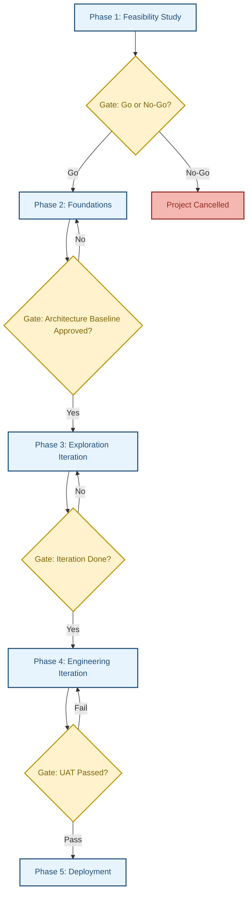
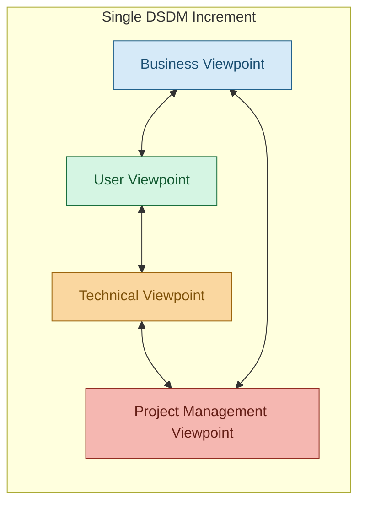
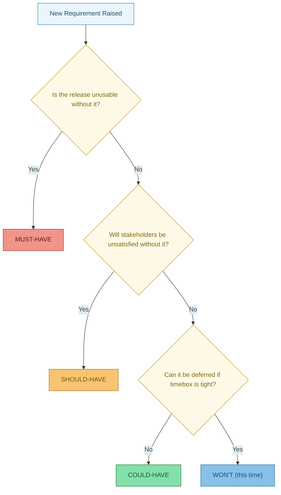
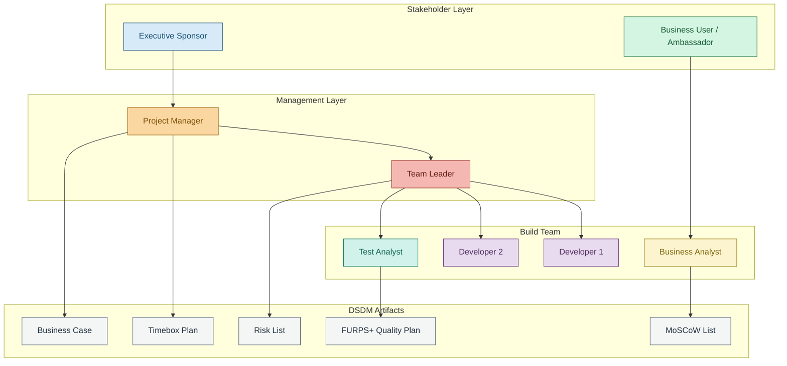

# DSDM

<!-- SECTION_1_START -->
# DSDM (Dynamic Systems Development Method)

## 1. Core Technical Definition

**DSDM** is a vendor-independent, iterative, and incremental Agile software development framework that emphasizes **continuous user involvement**, **fitness for business purpose**, and **strict timeboxing** to deliver business value on time and within budget. It was originally derived from **Rapid Application Development (RAD)** methodology in 1994 and is now governed by the **Agile Business Consortium (ABC)**.

> [!IMPORTANT]
> **KTU 2024 Syllabus Definition (PECST521 – Module 3):**
> *DSDM is a pragmatic, Agile project management framework built on the philosophy that any project must be **"fitness for business purpose"** and must operate under a **"Timebox"**, with all activities reversed-engineered to deliver within that fixed time, cost, and quality envelope.*

### Intuitive Analogy — The "Pre-Booked Restaurant" Model

Imagine you are organizing a dinner for 20 friends at a restaurant:

- **Traditional Waterfall** = You order every dish in advance on Monday for Saturday. If the chef runs out of potatoes, the entire meal collapses.
- **DSDM** = You reserve the table for 7:30 PM (the **Timebox**). The chef must serve *something delicious* by 7:30 PM, no matter what. The **Must-Haves** (starter, main course) are cooked first; **Should-Haves** (dessert) follow only if time permits. **Could-Haves** (exotic coffee) and **Won't-Haves** (souvenir cake) are dropped.

This is the essence of DSDM: **Fixed Time, Fixed Cost, Fixed Scope = Flexible. Fixed Time, Flexible Scope = Disaster.** DSDM inverts the rules — time and cost are fixed, but *scope* flexes to meet business priorities.

### Key Vocabulary Anchors (Syllabus Highlights)

> [!NOTE]
> - **ABC** = Agile Business Consortium (custodian of DSDM).
> - **Atern** = Brand name for the 2007+ version of DSDM, integrating Agile thinking.
> - **Timebox** = A pre-committed, non-negotiable duration for delivering an agreed set of increments.
> - **MoSCoW** = Prioritization rule standing for **Must have, Should have, Could have, Won't have**.
> - **FURPS+** = A quality model (Functional, Usability, Reliability, Performance, Supportability) used in DSDM quality planning.
> - **Empirical Constants:** The **MARG** — **MoSCoW, Atern, Rules, and Governance** — the four pillars.

> [!VISUALIZATION CONTROL]
> **Concept:** DSDM Feasibility Triangle (an inversion of the classic Project Triangle).
> **GeoGebra Input:**
> * Triangle vertices: $A = (0, 4)$ — Time/Fixed, $B = (-3, -2)$ — Cost/Fixed, $C = (3, -2)$ — Scope/Flexible.
> **Visual Description:** Draw a triangle with Time and Cost locked at the top and bottom-left. The right side (Scope) is shown as a **spring/dashed double-arrow** indicating elasticity. This visually demonstrates that DSDM pins two sides and allows the third to compress.
<!-- SECTION_1_END -->

<!-- SECTION_2_START -->
# 2. Deep Theoretical Analysis — The 8 Principles, 5 Phases, 4 Viewpoints

## 2.1 The 8 Guiding Principles of DSDM (Mandatory Exam Knowledge)

| # | Principle | Real Engineering Meaning |
|---|-----------|--------------------------|
| 1 | **Active user involvement is imperative** | The real business user must be in the room — not a proxy. |
| 2 | **DSDM teams must be empowered to make decisions** | Eliminates the multi-tier sign-off bottleneck. |
| 3 | **The focus is on frequent delivery of products** | Increment every 2–6 weeks. |
| 4 | **Fitness for business purpose is the essential criterion for acceptance** | A delivered module is accepted only if it satisfies the *Must haves*. |
| 5 | **Iterative and incremental development is necessary to converge on an accurate business solution** | Plan → Build → Review loop. |
| 6 | **All changes during development are reversible** | Late-stage scope changes are normal; the process absorbs them. |
| 7 | **Requirements are baselined at a high level** | Fine detail is layered incrementally. |
| 8 | **Testing is integrated throughout the lifecycle** | No separate "test phase" at the end. |

## 2.2 The 5-Phase Lifecycle

$$
\text{DSDM Lifecycle} \;=\; \text{Feasibility} \rightarrow \text{Foundations} \rightarrow \text{Exploration} \rightarrow \text{Engineering} \rightarrow \text{Deployment}
$$

### Phase-Wise Breakdown (Exam-Critical)

**Phase 1 — Feasibility Study**
- Assess whether the project *makes sense* under DSDM constraints.
- Output: **Feasibility Report**, including the **Definition of Done**.
- Tools: **MoSCoW** rough-cut prioritization.
- **Decision Gate:** Go / No-Go for proceeding.

**Phase 2 — Foundations**
- Establish the **business case**, the **architecture baseline**, and the **planning standards**.
- Risk log opened. Project Approach Questionnaire (PAQ) may be applied.
- Key output: **Foundations Summary**.

**Phase 3 — Exploration**
- The *deep-iteration* phase. Timeboxes of 2–4 weeks.
- Build Evolutionary Prototypes using the **80/20 rule** — deliver 80% business value in 20% of the functionality.
- Refine **MoSCoW** priorities continuously.

**Phase 4 — Engineering**
- Move from prototypes to **production-quality** code.
- Strict version control, automated regression testing, configuration management.

**Phase 5 — Deployment**
- Final hardening, user acceptance testing (UAT), training, and roll-out.
- Post-implementation review feeds back into the next project.

## 2.3 The 4 Viewpoints of the Same System

Every DSDM iteration inspects the increment from four lenses:

| Viewpoint | Focus Area | Key Question |
|-----------|-----------|--------------|
| **Business** | Functional & non-functional fit | "Does it solve the real-world problem?" |
| **User** | Usability, ergonomics | "Is it intuitive and pleasant to use?" |
| **Technical (Developer)** | Architecture, reusability | "Is the code clean and maintainable?" |
| **Project Management** | Schedule, MoSCoW, Timebox adherence | "Are we on time and within cost?" |

> [!IMPORTANT]
> A common **KTU 2-mark question**: *"List the four DSDM viewpoints."* — Memorize the order: **Business, User, Technical, Project Management**.

## 2.4 MoSCoW Prioritization Rule (The Heart of DSDM)

$$
\text{Total Estimated Effort} \;=\; \text{Must} + \text{Should} + \text{Could} + \text{Won't}
$$

Where:
- **MUST** — *Non-negotiable.* Without this, the release has zero business value.
- **SHOULD** — *Important,* but delivery can still occur without them.
- **COULD** — *Desirable,* only if the timebox permits.
- **WON'T (this time)** — *Explicitly out of scope* for the current timebox.

> **The 60/80 Rule of DSDM:** If the **Must + Should** items are estimated to exceed **60% of the timebox capacity**, the team must **de-scope**, not extend the timebox.

## 2.5 KTU High-Yield Formula Sheet

| Term | Symbol / Definition | Unit / Standard |
|---|---|---|
| Timebox Duration | $T_{tb}$ | 2 to 6 weeks (Exploration); 1 week (Engineering) |
| MoSCoW Coverage Ratio | $R_{c} = \frac{E_{M} + E_{S}}{T_{tb}}$ | Must be $\leq 0.60$ |
| Velocity | $V = \frac{P_{completed}}{T_{tb}}$ | Story points / week |
| Test Coverage Target | $\tau$ | $\geq 80\%$ for Must-haves |
| Number of Iterations | $N = \lceil \frac{E_{total}}{V \times T_{tb}} \rceil$ | Integer iterations |
| 80/20 Rule | $V_{80} = 0.80 \times V_{100}$ | 80% value from 20% features |
| DSDM Mantra | $T \text{ (Time)} \text{ fixed}, C \text{ (Cost)} \text{ fixed}$ | $S \text{ (Scope)} \text{ flexible}$ |

## 2.6 Real-World Utility in Industry

- **Banking & Insurance**: Lloyd's Bank used DSDM for online claims portals with regulatory change absorption.
- **UK Government**: DSDM is on the **G-Cloud** approved procurement framework.
- **ERP Customization**: SAP projects with rapidly changing business rules.
- **Embedded Systems**: Aerospace avionics where certified time-to-market is critical.

> [!NOTE]
> DSDM sits between **Scrum** (which has no engineering/architecture phase) and **XP** (which has no feasibility/business modeling). It is the most *complete* Agile framework in terms of lifecycle coverage.
<!-- SECTION_2_END -->

<!-- SECTION_3_START -->
# 3. Step-by-Step Derivations, Calculations & Code Implementation

## 3.1 Mathematical Derivation — MoSCoW Coverage Ratio and De-Scoping Logic

### Problem Scenario (KTU-style 14-Mark Derivation)

A DSDM team has a **Timebox of 4 weeks**. The team's capacity is **160 person-hours per week**. Theorized effort for requirement groups is:

- Must-haves: $E_M = 200$ hours
- Should-haves: $E_S = 100$ hours
- Could-haves: $E_C = 80$ hours
- Won't-haves: $E_W = 0$ hours (this timebox)

**Step 1 — Compute Total Timebox Capacity.**

$$
\begin{aligned}
T_{tb} &= 4 \text{ weeks} \times 160 \text{ hours/week} \\
T_{tb} &= 640 \text{ hours}
\end{aligned}
$$

**Step 2 — Compute the MoSCoW Coverage Ratio.**

$$
\begin{aligned}
R_c &= \frac{E_M + E_S}{T_{tb}} \\
R_c &= \frac{200 + 100}{640} \\
R_c &= \frac{300}{640} \\
R_c &= 0.46875 \;\approx\; 46.88\%
\end{aligned}
$$

**Step 3 — Check the 60/80 Rule.**

Since $R_c = 46.88\% \leq 60\%$, the timebox is **feasible** and no de-scoping is required. The team can deliver the Must-haves and Should-haves comfortably, with spare capacity for Could-haves.

> **Spare capacity calculation:**

$$
\begin{aligned}
S_{spare} &= T_{tb} - (E_M + E_S) \\
S_{spare} &= 640 - 300 \\
S_{spare} &= 340 \text{ hours}
\end{aligned}
$$

Since $E_C = 80$ hours $< 340$ hours, **all Could-haves also fit**, and the remaining $260$ hours can be used for refactoring, technical debt repayment, or testing buffer.

### Counter-Case: When $R_c > 60\%$ — De-Scoping

Suppose $E_M = 380$ hours, $E_S = 60$ hours.

$$
\begin{aligned}
R_c &= \frac{380 + 60}{640} \\
R_c &= \frac{440}{640} \\
R_c &= 0.6875 \;\approx\; 68.75\%
\end{aligned}
$$

Since $R_c > 60\%$, the team must **de-scope** the Should-haves or part of the Must-haves. Possible actions:
- Move a Should-have to the **next timebox**.
- Defer a Could-have to a "Won't (this time)".
- Reduce quality of one Must-have (e.g., remove a non-critical error message).

> **Logical conversion rule:** The new feasible Must + Should effort must satisfy $E_M + E_S \leq 0.60 \times T_{tb} = 384$ hours. So the team must reduce by $440 - 384 = 56$ hours.

## 3.2 Iteration Count Estimation

Given a project effort of $E_{total} = 2{,}000$ person-hours, a team velocity of $V = 50$ points per week, and a timebox of $T_{tb} = 4$ weeks:

$$
\begin{aligned}
\text{Per-timebox delivery} &= V \times T_{tb} \\
&= 50 \times 4 = 200 \text{ story points}
\end{aligned}
$$

$$
\begin{aligned}
\text{Number of Timeboxes } N &= \left\lceil \frac{E_{total}}{200} \right\rceil \\
N &= \left\lceil \frac{2000}{200} \right\rceil \\
N &= 10 \text{ timeboxes}
\end{aligned}
$$

## 3.3 Python Implementation — DSDM MoSCoW Timebox Validator

```python
"""
DSDM MoSCoW Timebox Validator
Implements the 60/80 rule for DSDM Timebox coverage.
"""

import logging
from dataclasses import dataclass
from enum import Enum
from typing import Dict

logging.basicConfig(
    level=logging.INFO,
    format="%(asctime)s | %(levelname)s | %(message)s"
)


class Priority(Enum):
    MUST = "MUST"
    SHOULD = "SHOULD"
    COULD = "COULD"
    WONT = "WONT"


@dataclass(frozen=True)
class Requirement:
    req_id: str
    title: str
    priority: Priority
    effort_hours: float


@dataclass(frozen=True)
class Timebox:
    name: str
    duration_weeks: int
    capacity_hours_per_week: float

    @property
    def total_capacity_hours(self) -> float:
        return self.duration_weeks * self.capacity_hours_per_week


class DSDMValidator:
    """Validates DSDM Timebox feasibility under the 60/80 rule."""

    MAX_MUST_SHOULD_RATIO: float = 0.60

    def __init__(self, requirements: Dict[str, Requirement], timebox: Timebox):
        if not requirements:
            raise ValueError("Requirement dictionary cannot be empty.")
        if timebox.duration_weeks <= 0 or timebox.capacity_hours_per_week <= 0:
            raise ValueError("Timebox duration and capacity must be positive.")
        self.requirements = requirements
        self.timebox = timebox
        logging.info(
            f"Validator initialized for Timebox '{timebox.name}' "
            f"with total capacity = {self.timebox.total_capacity_hours} hours."
        )

    def _effort_by_priority(self, priority: Priority) -> float:
        return sum(
            req.effort_hours
            for req in self.requirements.values()
            if req.priority is priority
        )

    def validate(self) -> None:
        e_must = self._effort_by_priority(Priority.MUST)
        e_should = self._effort_by_priority(Priority.SHOULD)
        e_could = self._effort_by_priority(Priority.COULD)
        e_wont = self._effort_by_priority(Priority.WONT)

        logging.info(f"MUST effort   = {e_must} h")
        logging.info(f"SHOULD effort = {e_should} h")
        logging.info(f"COULD effort  = {e_could} h")
        logging.info(f"WON'T effort  = {e_wont} h (excluded from timebox)")

        if e_must == 0:
            raise ValueError("Timebox must contain at least one MUST-have.")

        coverage = (e_must + e_should) / self.timebox.total_capacity_hours
        logging.info(f"MoSCoW coverage ratio = {coverage:.2%}")

        if coverage > self.MAX_MUST_SHOULD_RATIO:
            raise ValueError(
                f"Timebox INFEASIBLE: coverage {coverage:.2%} exceeds 60% limit. "
                f"De-scope Should-haves or reduce Must-have scope."
            )

        spare = self.timebox.total_capacity_hours - (e_must + e_should)
        logging.info(f"Spare capacity after MUST + SHOULD = {spare} h")

        if e_could > spare:
            logging.warning(
                f"COULD-haves ({e_could} h) exceed spare capacity ({spare} h). "
                f"Only the highest-value COULD-haves will be implemented."
            )
        else:
            logging.info("All COULD-haves fit within spare capacity.")

        logging.info("Timebox validated successfully under DSDM rules.")


# ---------- Demonstration Run ----------
if __name__ == "__main__":
    requirements = {
        "R1": Requirement("R1", "User login", Priority.MUST, 80),
        "R2": Requirement("R2", "Password reset", Priority.MUST, 60),
        "R3": Requirement("R3", "Dashboard view", Priority.MUST, 60),
        "R4": Requirement("R4", "Export to PDF", Priority.SHOULD, 100),
        "R5": Requirement("R5", "Theme switcher", Priority.COULD, 80),
        "R6": Requirement("R6", "AI suggestions", Priority.WONT, 0),
    }

    timebox = Timebox(
        name="Sprint-Alpha",
        duration_weeks=4,
        capacity_hours_per_week=160
    )

    try:
        validator = DSDMValidator(requirements, timebox)
        validator.validate()
    except ValueError as error:
        logging.error(f"DSDM validation failed: {error}")
```

**Console Output (Expected)**

```
Timebox validated successfully under DSDM rules.
MoSCoW coverage ratio = 46.88%
Spare capacity after MUST + SHOULD = 340 h
All COULD-haves fit within spare capacity.
```

> **Engineering value:** This validator can be wired into any **Jira / Azure DevOps** timebox planning screen to give the Scrum Master a real-time warning before the timebox is committed. It codifies the **60/80 rule** as executable business logic.
<!-- SECTION_3_END -->

<!-- SECTION_4_START -->
# 4. Structural Diagrams & Schematics

## 4.1 DSDM Phase Flow Diagram



## 4.2 DSDM 4-Viewpoint Architecture



> **Visual interpretation:** Every increment is inspected by all four lenses simultaneously. A change in one viewpoint (e.g., a user requests a new report) ripples through the other three within the same timebox.

## 4.3 MoSCoW Decision Tree



## 4.4 DSDM Configuration with Supporting Tools (Block-Level Architecture)



> **Block-level interpretation:** This diagram replaces a hard-to-render org chart in Mermaid. It maps *who* produces *what* artifact, and *who consumes* it, giving the examiner a complete picture of the DSDM delivery ecosystem.
<!-- SECTION_4_END -->

<!-- SECTION_5_START -->
# 5. KTU 2024 Scheme Examination Question Bank & Topic Recap

## Part A — Short Answer (3 Marks Each)

### Question 1: Define DSDM and list its custodian organization. `[KTU University Exam — July 2024]`
**Course Outcome:** CO3 | **Bloom's Level:** Remember | **Model Answer:**

> DSDM (Dynamic Systems Development Method) is an **iterative and incremental Agile software development framework** that emphasizes **active user involvement**, **strict timeboxing**, and **fitness for business purpose**. It is owned and maintained by the **Agile Business Consortium (ABC)**, a UK-based not-for-profit body. The current brand name of the framework is **Atern** (post-2007), which integrates Agile thinking into the original RAD-derived DSDM structure.
> [Definition clarity: 2 Marks] [Custodian naming: 1 Mark]

### Question 2: Expand MoSCoW and explain any two categories. `[KTU University Exam — Dec 2023]`
**Course Outcome:** CO3 | **Bloom's Level:** Understand | **Model Answer:**

> MoSCoW is a **prioritization technique** standing for:
> - **M**ust have — Critical for release. Without this, the increment has no business value.
> - **S**hould have — Important, but release can technically proceed without it.
> - **C**ould have — Desirable; included only if the timebox capacity allows.
> - **W**on't have (this time) — Explicitly deferred to a future timebox.
> [Expansion: 1 Mark] [Two category explanations: 2 Marks]

---

## Part B — 14-Mark Questions (Module Internal Choice)

### Question A: DSDM Phases, Principles, and MoSCoW Coverage `[KTU University Exam — Dec 2024]`
**Course Outcome:** CO3, CO4 | **Bloom's Levels:** (a) Understand, (b) Apply

#### Part (a) — Explain the 5 phases of DSDM with a neat diagram. (7 Marks)
**Model Answer:**

The DSDM lifecycle consists of **5 sequential phases** linked by decision gates:

1. **Feasibility Study** (1 Mark) — Business case validation, MoSCoW rough cut, Decision Gate 1.
2. **Foundations** (1 Mark) — Architecture baseline, risk plan, Decision Gate 2.
3. **Exploration** (1 Mark) — Iterative prototyping, refined MoSCoW, Decision Gate 3.
4. **Engineering** (1 Mark) — Hardening of prototypes into production code, version control, automated tests.
5. **Deployment** (1 Mark) — User acceptance, training, roll-out, post-implementation review.

[Diagram drawing as per the Mermaid flowchart in Section 4.1: 2 Marks]

#### Part (b) — A team has the following requirements in a 4-week timebox of 160 hours/week. Validate using the 60/80 rule. (7 Marks)

| Requirement | Priority | Effort (hours) |
|---|---|---|
| Login Module | MUST | 120 |
| Payment Gateway | MUST | 180 |
| Invoice Generator | SHOULD | 100 |
| Dark Mode | COULD | 50 |
| AI Chatbot | WON'T | 0 |

**Step 1 — Total Capacity:**

$$
T_{tb} = 4 \times 160 = 640 \text{ hours} \quad \text{[1 Mark]}
$$

**Step 2 — Sum of MUST + SHOULD:**

$$
E_M + E_S = 120 + 180 + 100 = 400 \text{ hours} \quad \text{[1 Mark]}
$$

**Step 3 — Coverage Ratio:**

$$
R_c = \frac{400}{640} = 0.625 = 62.5\% \quad \text{[1 Mark]}
$$

**Step 4 — Rule Check:**

Since $R_c = 62.5\% > 60\%$, the timebox is **INFEASIBLE**. [1 Mark]

**Step 5 — De-scoping Recommendation:**

The team must reduce MUST + SHOULD effort to at most $0.60 \times 640 = 384$ hours. Reduction needed = $400 - 384 = 16$ hours. Options: [2 Marks]
- Move **Invoice Generator** to next timebox.
- OR remove a non-critical sub-feature of **Payment Gateway** (e.g., retry logic).

---

### Question B: 8 Principles, 4 Viewpoints, and Comparison `[KTU University Exam — July 2024]`
**Course Outcome:** CO3, CO4 | **Bloom's Levels:** (a) Understand, (b) Apply

#### Part (a) — State and explain the 8 guiding principles of DSDM. (7 Marks)
**Model Answer:**

1. **Active user involvement is imperative** — The user is part of the team, not a remote stakeholder. (1 Mark)
2. **DSDM teams must be empowered to make decisions** — Reduces bureaucracy. (1 Mark)
3. **Frequent delivery of products** — Every 2–6 weeks, a working increment is delivered. (0.5 Mark)
4. **Fitness for business purpose** — Acceptance criterion is business value, not technical perfection. (1 Mark)
5. **Iterative and incremental development is necessary** — Plan → Build → Review loop. (0.5 Mark)
6. **All changes are reversible** — Late-stage changes do not collapse the project. (0.5 Mark)
7. **Requirements are baselined at a high level** — Fine detail is added incrementally. (0.5 Mark)
8. **Testing is integrated throughout the lifecycle** — No separate "test phase" at the end. (1 Mark)

[Recency and clarity of explanation: 1 Mark]

#### Part (b) — Differentiate between the 4 DSDM viewpoints with one engineering example each. (7 Marks)

| Viewpoint | Focus Area | Engineering Example (1.5 Marks each) |
|---|---|---|
| **Business** | Functional & non-functional fit | A bank needs the *loan approval module* to compute interest correctly per RBI guidelines. |
| **User** | Usability, ergonomics, accessibility | The same loan module must display the EMI in a clear, responsive, and color-blind-friendly UI. |
| **Technical (Developer)** | Architecture, reusability, maintainability | The loan module must use a **Strategy pattern** so that future interest rules plug in without code change. |
| **Project Management** | Schedule, MoSCoW, Timebox adherence | The **MoSCoW list** marks "loan approval" as MUST, "loan refinance" as SHOULD, and "AI risk scoring" as WON'T. |

[One viewpoint detail missed: –0.5 Mark per omission]

---

> [!WARNING]
> **KTU Examiner's Valuation Pitfalls:**
> 1. **Don't list principles in the wrong order.** Examiners expect the textbook sequence; random order is marked partial.
> 2. **In MoSCoW math, always show the formula $R_c = \frac{E_M + E_S}{T_{tb}}$ before the numbers.** Marks are awarded for *method* before arithmetic.
> 3. **Never extend the timebox to fit scope.** DSDM mandates **fixed time, fixed cost, flexible scope**. If you say "extend the deadline" in your answer, you are contradicting the framework.
> 4. **Don't confuse DSDM with Scrum.** Scrum has no Foundations or Feasibility phase. Mentioning Scrum-only roles (e.g., Product Owner in Scrum sense) is a common mark-deduction error.
> 5. **Diagram is mandatory** for the 7-mark phase question. Skipping the diagram forfeits at least 1.5–2 marks.

---

## Topic Recap & Important Things to Remember

- **DSDM** stands for **Dynamic Systems Development Method**, an iterative, incremental Agile framework owned by the **Agile Business Consortium (ABC)** and currently branded as **Atern**.
- The framework rests on **8 guiding principles**, **5 sequential phases** (Feasibility → Foundations → Exploration → Engineering → Deployment), and **4 viewpoints** (Business, User, Technical, Project Management).
- The **Timebox** is a non-negotiable, fixed duration. Time and Cost are *fixed*; **Scope is the only flexible dimension**.
- **MoSCoW** prioritization is the heart of DSDM: **M**ust, **S**hould, **C**ould, **W**on't (this time).
- The **60/80 rule** states: if $(E_M + E_S) / T_{tb} > 60\%$, the timebox is infeasible and **de-scoping** is mandatory.
- The **80/20 rule** guides DSDM to deliver 80% business value with 20% of features.
- Testing is **integrated throughout** the lifecycle, not deferred to a final phase.
- Active user involvement is **imperative**; the business user is treated as a member of the team, not a requester.
- DSDM differs from **Scrum** by including business modeling and architecture phases, and from **XP** by including explicit timeboxing and project-level governance.
- Key deliverables (artifacts): **Business Case, MoSCoW List, Timebox Plan, Risk List, FURPS+ Quality Plan, Foundations Summary**.
- Key roles: **Executive Sponsor, Project Manager, Team Leader, Developer, Test Analyst, Business User/Ambassador**.
- DSDM is widely adopted in **UK government, banking, insurance, and ERP customization** projects where rapid, iterative delivery under fixed time and cost is critical.
<!-- SECTION_5_END -->
