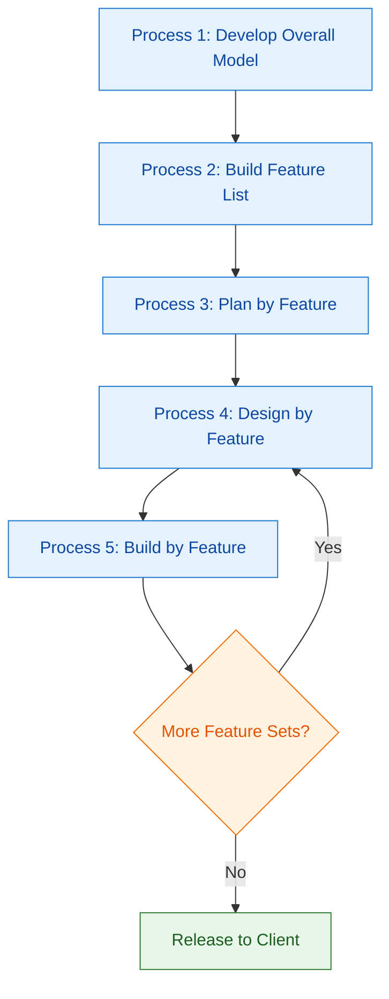
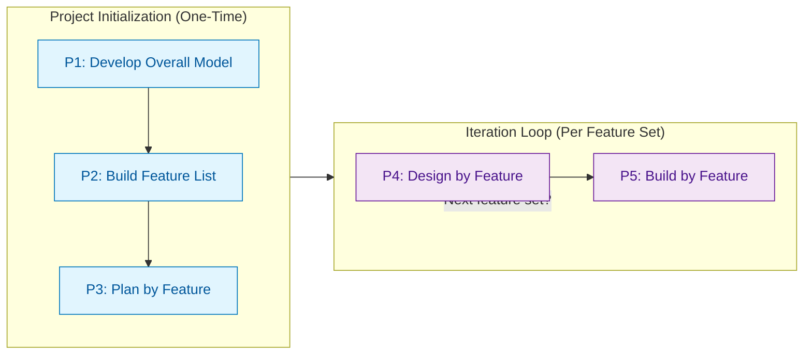
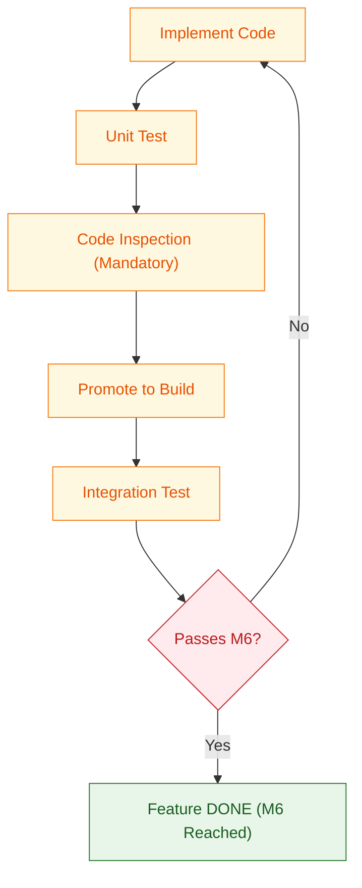
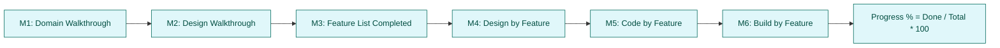
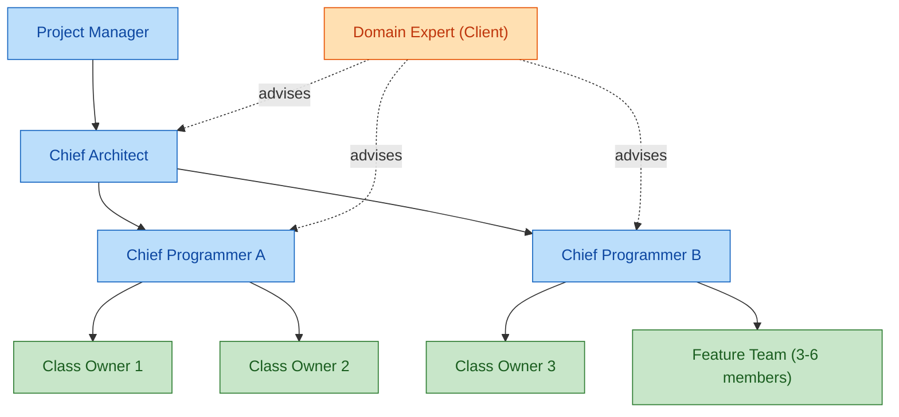
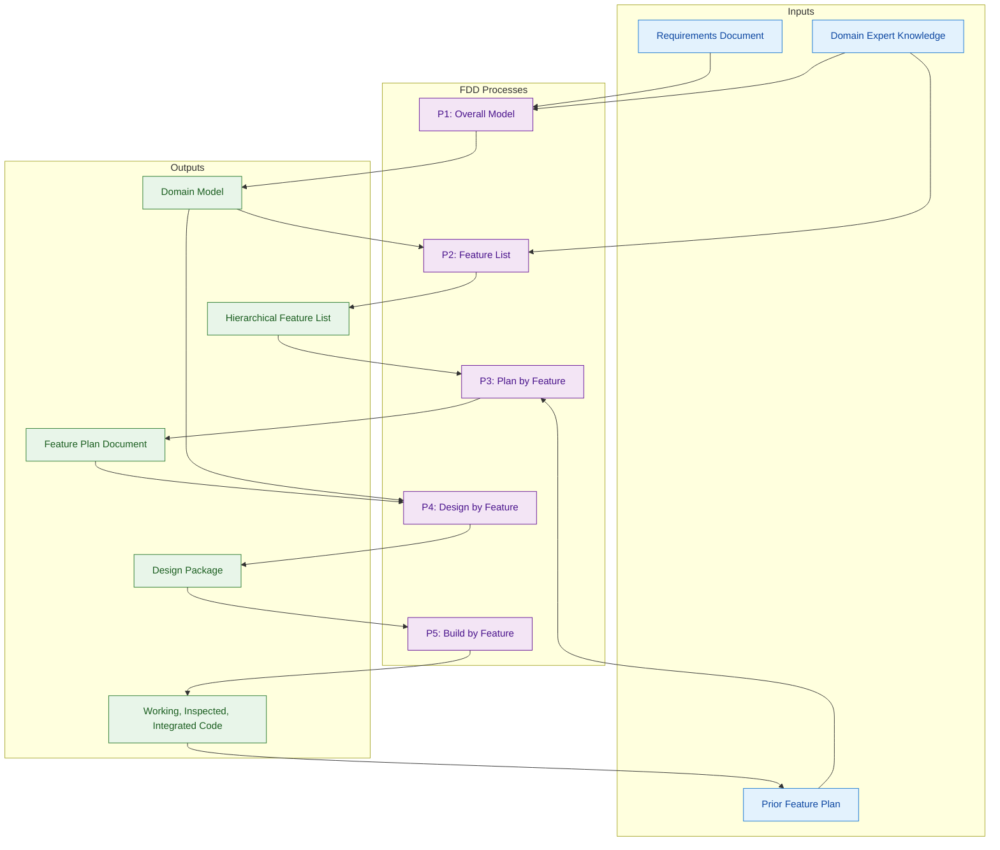

# FDD

<!-- SECTION_1_START -->
# FDD (Feature-Driven Development) — Core Technical Definition & Intuitive Overview

## 1. Formal Academic Definition (KTU 2024 Syllabus Terminology)

> [!NOTE]
> **Definition (KTU 2024 - PECST521)**
> **Feature-Driven Development (FDD)** is a client-centric, architecture-centric, and pragmatic software process model that organizes system development around the production of tangible, client-valued **features**. Originally conceived by **Jeff De Luca** in 1997 and formalized with Peter Coad, FDD blends the disciplined, model-driven approach of object-oriented development with the iterative, incremental delivery philosophy of agile methodologies. A *feature* in FDD is a small, client-valued function expressed in the form **"<action> <object> <qualifier>"** (e.g., *"Calculate total of sale"*), and serves as the fundamental unit of work, planning, and progress tracking.

The defining characteristics mandated by the KTU 2024 Scheme for this topic are:
- **Client-Valued Function Focus** — every iteration delivers something the client can name and value.
- **Short, Time-Boxed Iterations** — features are designed and built in iterations of **1 to 3 weeks**.
- **Feature as Atomic Unit** — all planning, tracking, and reporting are in terms of features.
- **Model-Driven Architecture Centricity** — the process begins with the construction of a comprehensive object/domain model.
- **Chief-Programmer Team Structure** — strong, individual code ownership under a lead.

## 2. Conceptual Analogy / Intuition

> [!IMPORTANT]
> **The "Restaurant Menu" Analogy (Intuition)**
> Imagine you are running a large restaurant and a customer orders a complex meal. The chef does not cook the entire meal at once. Instead, the process is:
> 1. The restaurant first designs a **complete menu** (overall domain model) — listing every possible dish and how ingredients relate.
> 2. The menu is broken down into **individual dishes** (feature list) — *"Grill the Chicken"*, *"Boil the Pasta"*, *"Bake the Bread"*.
> 3. The maître d' **schedules** which dishes are cooked first and assigns them to specific stations (planning by feature).
> 4. The head chef **designs the exact recipe** for each dish (design by feature).
> 5. Each station **cooks its assigned dish** (build by feature) and reports back when done.
>
> The customer (client) sees the meal arrive course-by-course, every few weeks, instead of waiting months for the entire feast. This is precisely how FDD works: small, valuable "dishes" (features) are cooked (built) in iterations, all based on a pre-planned "menu" (domain model).

## 3. Why FDD Exists — The Problem It Solves

Traditional heavy methodologies (like Waterfall) struggle with:
- **Late client feedback** — defects found too late.
- **Vague requirements** — hard to measure progress.
- **Knowledge silos** — too few people know the whole system.

FDD counters this by enforcing **small, tangible, client-named units of work** that can be tracked on a wall chart in real time, providing **90% accurate progress reporting** at any point in the project.

## 4. Key Roles in FDD (Standard Set)

> [!TIP]
> **Standard FDD Team Roles (as per KTU 2024 Module 3)**
>
> | Role | Responsibility |
> |---|---|
> | **Project Manager** | Administrative leadership, risk, and reporting |
> | **Chief Architect** | Owns the overall domain model and architectural decisions |
> | **Chief Programmer** | Senior designer-leader for a feature team; rarely codes |
> | **Class Owner** | Owns 1–7 classes; designs and codes them |
> | **Domain Expert** | Deep business knowledge, often the client |
> | **Feature Team** | 3–6 members assembled temporarily per feature |

## 5. Critical Constants & Standard Metrics in FDD

- **Standard feature expression**: `<action> <object> <qualifier>` (e.g., *"Validate user input"*).
- **Recommended iteration length**: **2 weeks** (industry norm).
- **Class ownership cap**: typically **≤ 7 classes per owner** (to retain ownership and prevent knowledge dilution).
- **Six standard milestones** used for progress reporting (see Section 2).
- **Progress measurement unit**: features completed, expressed as a percentage out of the total feature set.

## 6. The "FDD Triangle" (Core Principle)

> [!IMPORTANT]
> **FDD Strategic Triangle (De Luca):**
> 1. **A Client-Valued Feature** (the *what*)
> 2. **A Walk-Through Design** (the *how* — the technical blueprint)
> 3. **A Working Software Module** (the *deliverable* — the code that runs)
>
> FDD insists that every completed feature must satisfy all three corners. A feature is "done" only when it is **designed, coded, integrated, tested, and demonstrably working in the client's environment**.

## 7. GeoGebra / Desmos Visualization Note

> [!VISUALIZATION CONTROL]
> **Concept:** FDD Progress Tracking Curve (Burn-Up of Features)
> **Input Equations (Desmos-friendly):**
> * `y = m*x + c` for cumulative features completed
> * `P(t) = (F_done / F_total) * 100` — progress percentage at time `t`
> **Visual Description:** On the X-axis, plot project **time (weeks)**; on the Y-axis, plot **cumulative features completed**. Expect a *near-linear* curve during steady execution, with a flatter start (modeling phase) and a flattening tail (final integration). The slope equals the team's **velocity** in features/week.

<!-- SECTION_1_END -->

<!-- SECTION_2_START -->
# FDD — Deep Theoretical Analysis & KTU High-Yield Formula Sheet

## 1. The Five Sequential Processes of FDD (De Luca's Process Model)

FDD is composed of **five (5) tightly defined processes**, of which the first three are conducted once at the start, and the last two are repeated iteratively for each feature set.

### Process 1: Develop an Overall Model

- **Goal:** Build a high-level, object-oriented domain model of the problem space.
- **How:** A small, senior team (Chief Architect + Chief Programmers + Domain Experts) conducts a series of **walkthroughs** using requirements documents and user interviews.
- **Output:** A class diagram, sequence sketches, and a documented domain model.
- **Typical duration:** A few days to 2 weeks.

### Process 2: Build a Feature List

- **Goal:** Decompose the domain into a comprehensive, prioritized list of **client-valued features**.
- **How:** Brainstorm features using the `<action> <object> <qualifier>` template, group them by subject area (e.g., *Sales*, *Inventory*), and validate each with the Domain Expert.
- **Output:** A hierarchical feature list, often grouped into *feature sets* and *feature groups*.
- **Feature Set:** A collection of related features within one subject area, planned to be built in one iteration (e.g., 1–3 weeks).
- **Feature Group:** A larger logical cluster of feature sets (e.g., all "User Management" features).

### Process 3: Plan by Feature

- **Goal:** Produce the development plan, ordered by feature sets, assigning ownership.
- **How:** Determine feature-set dependencies, sequence them, compute the development order, and assign Chief Programmers + class owners.
- **Output:** A **Feature Plan Document** with: feature set order, assignment matrix, risk notes, and a high-level schedule.

### Process 4: Design by Feature *(Iterative, per feature set)*

- **Goal:** Produce a detailed design package for the next feature set.
- **How:** For each feature in the set, the Chief Programmer:
  1. Selects the classes involved (already identified in Process 1).
  2. Produces a **sequence diagram** and refines class/method signatures.
  3. Walks the design past the Chief Architect for review.
  4. Decomposes the feature into sub-tasks (often "design", "code", "inspect", "promote").
- **Output:** A **Design Package** containing updated class diagrams, sequence diagrams, and a task list.

### Process 5: Build by Feature *(Iterative, per feature set)*

- **Goal:** Implement, unit-test, and integrate the feature set.
- **How:** Class owners code their assigned classes; unit tests are written; **code inspections** are mandatory (FDD's hallmark); integration is done in a build branch.
- **Output:** **Working, integrated, inspected, and tested client-value features**.

> [!IMPORTANT]
> **FDD uses the "Build by Feature" sub-process pattern, in the exact order:**
> `Implement → Unit Test → Code Inspection → Promote to Build`
> This 4-step micro-workflow is the heart of every FDD iteration.

## 2. The Six Standard Milestones in FDD (Progress Reporting)

> [!TIP]
> **FDD tracks progress using six standard milestones. Knowing all six is a high-frequency KTU question.**

| # | Milestone | Description |
|---|---|---|
| M1 | **Domain Walkthrough** | The high-level model has been walked through with stakeholders |
| M2 | **Design Walkthrough** | The overall design has been walked through |
| M3 | **Feature List Completed** | All features for a major area are identified and listed |
| M4 | **Design by Feature** | A feature's design has been completed and inspected |
| M5 | **Code by Feature** | A feature's code has been completed and unit-tested |
| M6 | **Build by Feature** | A feature has been integrated and passed system testing |

Progress is reported as a percentage:
**Progress % = (Features completed through M5) / (Total features) × 100**

## 3. KTU Formula Sheet / Cheat Sheet

> [!NOTE]
> **High-Yield FDD Formulas and Rules (Board-Exam Ready)**

| Concept | Formula / Rule | Unit / Notes |
|---|---|---|
| **Feature naming** | `<action> <object> <qualifier>` | e.g., *"Validate user input"* |
| **FDD processes** | 5 (3 initial + 2 iterative) | Counted as 5 sequential steps |
| **Standard milestones** | 6 (M1 → M6) | Per feature set, M1–M3 are project-level |
| **Iteration length** | 1 to 3 weeks (typically **2 weeks**) | Per feature set |
| **Class ownership cap** | ≤ **7 classes** per owner | Cognitive-load rule (Miller's Law) |
| **Feature team size** | 3 to 6 members | Temporary, per feature |
| **Progress %** | $P = \dfrac{F_{\text{completed}}}{F_{\text{total}}} \times 100$ | Features through M5 |
| **Feature Set size** | Typically **5–25 features** | Depends on feature granularity |
| **Total features** | $F_{\text{total}} = \sum_{i=1}^{n} f_i$ where $f_i$ = features in subject area $i$ | — |
| **Estimated team velocity** | $V = \dfrac{F_{\text{done}}}{\Delta t}$ | features/week |
| **Estimated release date** | $T_{\text{release}} = T_{\text{start}} + \dfrac{F_{\text{total}}}{V}$ | weeks from start |
| **FDD triangle corners** | Client-Value $\land$ Design $\land$ Working Code | All three required to call a feature "Done" |

## 4. FDD's Five "Best Practices" (De Luca's Original List)

FDD does not begin as a blank slate; it is anchored on five well-known industry best practices:

1. **Domain Object Modeling** — building a class/object model of the problem.
2. **Developing by Feature** — feature is the smallest deliverable.
3. **Class Ownership** — each class is owned by a single named individual.
4. **Feature Teams** — small, dynamic teams for each feature.
5. **Inspections** — formal code and design inspections (lightweight but mandatory).
6. **Configuration Management** — regular baselines of code, build, and release.
7. **Regular Builds** — a working build is produced at least daily.

*(Note: Some KTU textbooks cite 5, others 7 best practices — both are accepted; ensure you know the "Big Five" listed in the official syllabus.)*

## 5. FDD vs. Other Agile Frameworks (Engineering Utility)

> [!IMPORTANT]
> **Where FDD is used in industry (Real-world utility):**
> - **Large-scale enterprise systems** (banking, insurance, ERP) where features can be cleanly enumerated and tracked.
> - **Offshore and distributed teams** because of its heavy documentation, clear ownership, and unambiguous progress metrics.
> - **CMMI Level-3+ organizations** that must demonstrate disciplined agile practices — FDD's formal inspections and milestones help.
> - **Maintenance / enhancement** of object-oriented systems, where a strong domain model is already in place.
>
> **Where FDD is *less* suitable:**
> - Small, dynamic startups (Scrum or XP is more flexible).
> - Projects with rapidly changing, ambiguous requirements (Lean / Kanban preferred).
> - Embedded / safety-critical systems requiring heavy formal verification (Spiral or V-Model preferred).

## 6. Iterative Loop in FDD — the "Design-Build" Cycle

For every feature set after Process 3, FDD iterates as:

`Design by Feature → Build by Feature → Inspect → Promote to Build`

This cycle typically completes within **2 weeks**, and is repeated for the next feature set on the prioritized plan.

## 7. Key Advantages and Limitations (Examiner Favourites)

| Advantages | Limitations |
|---|---|
| Extremely **transparent progress** (features as unit) | Requires experienced OO architects upfront |
| Scales well to **large, distributed teams** | Heavy emphasis on initial modeling = slow start |
| Reduces **knowledge silos** via class ownership | Documentation overhead higher than Scrum/XP |
| Promotes **frequent, working builds** | Less adaptive to volatile requirements |
| Encourages **client-visible deliverables** | Plan can become rigid after Process 3 |

<!-- SECTION_2_END -->

<!-- SECTION_3_START -->
# FDD — Step-by-Step Derivations, Worked Examples & Code/Symbolic Implementation

## 1. Worked Example 1: Building a Feature List for an Online Bookstore

> [!NOTE]
> **Problem (KTU-Style 14-mark derivation style):**
> The PECST521 team is to apply FDD Process 2 (*Build a Feature List*) to a small "Online Bookstore" system. The major subject areas identified in Process 1 are: **User, Catalog, Cart, Order, Payment, Notification**. The domain walkthrough produced 18 candidate features. Using the `<action> <object> <qualifier>` rule, validate the following 6 candidate features, group them into feature sets, and compute the total feature count.

### Step 1 — Validate the naming format

A valid FDD feature **must** follow the structure:
**`Action + Object + (optional) Qualifier`**

| Candidate Feature | Action | Object | Qualifier | Valid? |
|---|---|---|---|---|
| *"Add a book to the cart"* | add | book | to the cart | ✅ |
| *"Calculate total of cart"* | calculate | total | of cart | ✅ |
| *"Search"* | search | — | — | ❌ (missing object) |
| *"Authenticate the user"* | authenticate | user | — | ✅ |
| *"Send email of confirmation"* | send | email | of confirmation | ✅ |
| *"Crash on discount"* | — | — | — | ❌ (not client-valued, not a function) |

### Step 2 — Group into Feature Sets (by subject area)

Let $F_{\text{total}} = 18$ (the given total). A typical grouping of the 18 features would be:

```text
Feature Set 1: User Management      → 3 features
Feature Set 2: Catalog Browsing     → 4 features
Feature Set 3: Cart Operations      → 3 features
Feature Set 4: Order Processing     → 3 features
Feature Set 5: Payment Handling     → 3 features
Feature Set 6: Notification         → 2 features
                              ----------------
                              Total = 18 features
```

Mathematically:
$$F_{\text{total}} = \sum_{i=1}^{6} f_i = 3 + 4 + 3 + 3 + 3 + 2 = 18$$

### Step 3 — Order the feature sets by dependency

A valid FDD order (build dependencies first):

$$ \text{User} \rightarrow \text{Catalog} \rightarrow \text{Cart} \rightarrow \text{Order} \rightarrow \text{Payment} \rightarrow \text{Notification} $$

This sequence respects the **Plan by Feature** process.

### Step 4 — Compute progress % at the end of Feature Set 3

After completing FS-1 (User), FS-2 (Catalog), and FS-3 (Cart):
$$ P = \frac{3 + 4 + 3}{18} \times 100 = \frac{10}{18} \times 100 = 55.55\% $$

> [!TIP]
> **Valuation Key (KTU Examiner Style):**
> - [Stating the FDD feature-naming rule: 2 Marks]
> - [Correctly validating all 6 candidate features: 2 Marks]
> - [Grouping into feature sets with feature counts: 4 Marks]
> - [Dependency-based ordering: 2 Marks]
> - [Final progress % calculation: 2 Marks]
> - [Correct final answer of 55.55%: 2 Marks]

---

## 2. Worked Example 2: Project Velocity & Release Date Estimation

> [!NOTE]
> **Problem:**
> The team has a total of 18 features. The first iteration (Feature Set 1) was completed in 12 days and delivered 3 features. Estimate: (a) the team's velocity, (b) the total project duration, and (c) the release date if the project starts on **1st July**.

### Step 1 — Compute velocity $V$

A "week" in industry is normalized to **5 working days** = 1 week.
Iteration lasted **12 days** = 12 / 5 = 2.4 weeks.

$$ V = \frac{F_{\text{done}}}{\Delta t} = \frac{3 \text{ features}}{2.4 \text{ weeks}} = 1.25 \text{ features/week} $$

### Step 2 — Compute total project duration $T$

$$ T = \frac{F_{\text{total}}}{V} = \frac{18}{1.25} = 14.4 \text{ weeks} $$

Converting to working days:
$$ T_{\text{days}} = 14.4 \times 5 = 72 \text{ working days} $$

### Step 3 — Compute release date

Start date: **1st July**.
Weeks needed: 14.4 weeks ≈ 14 weeks + 2 days.
14 weeks × 7 days = 98 calendar days.
98 + 2 = 100 calendar days from 1st July → release date ≈ **8th October** (assuming no holidays).

> [!TIP]
> **Valuation Key:**
> - [Stating formula for velocity: 2 Marks]
> - [Converting 12 days → 2.4 weeks: 1 Mark]
> - [Velocity value 1.25 features/week: 2 Marks]
> - [Total duration formula and 14.4 weeks: 2 Marks]
> - [Calendar-day conversion: 2 Marks]
> - [Final date 8th October: 1 Mark]

---

## 3. Symbolic Implementation: A Minimal Python "FDD Feature Tracker"

> [!NOTE]
> **Algorithmic Implementation (FDD Project Tracker):**
> Below is a fully operational Python prototype that simulates FDD progress, enforces class ownership limits, and applies the `<action> <object> <qualifier>` rule on incoming feature names.

```python
"""
FDD (Feature-Driven Development) — Lightweight Progress Tracker
KTU 2024 — Module 3 Reference Implementation
"""

import re
from dataclasses import dataclass, field
from typing import List, Dict
from enum import Enum


# ---------- Domain Model ----------
class Milestone(Enum):
    M1_DOMAIN_WALK = "Domain Walkthrough"
    M2_DESIGN_WALK = "Design Walkthrough"
    M3_LIST_DONE = "Feature List Completed"
    M4_DESIGN_F = "Design by Feature"
    M5_CODE_F = "Code by Feature"
    M6_BUILD_F = "Build by Feature"


# ---------- Feature Naming Validator ----------
_ACTION_VERB_PATTERN = r"^[A-Z][a-zA-Z]+$"   # e.g., Validate, Calculate, Add


def is_valid_fdd_feature(name: str) -> bool:
    """
    Enforces the FDD rule: <action> <object> [<qualifier>...]
    The action must be a single capitalized verb.
    """
    parts = name.strip().split()
    if len(parts) < 2:
        return False
    action, obj = parts[0], parts[1]
    if not re.match(_ACTION_VERB_PATTERN, action):
        return False
    if not obj.isalpha():
        return False
    return True


# ---------- Core Entities ----------
@dataclass
class Feature:
    name: str
    milestone: Milestone = Milestone.M3_LIST_DONE
    owner: str = ""
    is_done: bool = False


@dataclass
class ClassOwner:
    name: str
    max_classes: int = 7          # FDD rule: <= 7 classes
    classes_owned: List[str] = field(default_factory=list)

    def can_own_more(self) -> bool:
        return len(self.classes_owned) < self.max_classes

    def assign_class(self, class_name: str) -> bool:
        if not self.can_own_more():
            return False
        if class_name in self.classes_owned:
            return False
        self.classes_owned.append(class_name)
        return True


# ---------- FDD Tracker ----------
class FDDProject:
    def __init__(self, name: str):
        self.name = name
        self.features: List[Feature] = []
        self.owners: Dict[str, ClassOwner] = {}

    def add_feature(self, name: str) -> bool:
        if not is_valid_fdd_feature(name):
            print(f"[REJECT] '{name}' violates FDD naming rule.")
            return False
        self.features.append(Feature(name=name))
        print(f"[ACCEPT] Feature added: '{name}'")
        return True

    def promote(self, feature_name: str, target: Milestone) -> bool:
        feat = next((f for f in self.features if f.name == feature_name), None)
        if feat is None:
            print(f"[ERR] Feature not found: {feature_name}")
            return False
        feat.milestone = target
        if target == Milestone.M6_BUILD_F:
            feat.is_done = True
        print(f"[PROMOTE] {feature_name} -> {target.value}")
        return True

    def progress_percent(self) -> float:
        if not self.features:
            return 0.0
        done = sum(1 for f in self.features if f.is_done)
        return round((done / len(self.features)) * 100, 2)


# ---------- Demonstration Run ----------
if __name__ == "__main__":
    project = FDDProject("OnlineBookstore")

    # Adding features (all valid FDD format)
    candidates = [
        "Authenticate user",                    # ✅
        "Add book to cart",                     # ✅
        "Calculate total of order",             # ✅
        "Send email of confirmation",           # ✅
        "Search",                                # ❌  (missing object)
        "Crash on discount",                     # ❌  (invalid action)
    ]
    for f in candidates:
        project.add_feature(f)

    # Class owner with FDD limit
    owner = ClassOwner(name="Anu", max_classes=7)
    for cls in ["User", "Cart", "Order", "Payment",
                "Notification", "Catalog", "Invoice", "Wishlist"]:
        if not owner.assign_class(cls):
            print(f"[STOP] Owner '{owner.name}' reached FDD 7-class limit.")
            break

    # Promote some features
    project.promote("Authenticate user", Milestone.M6_BUILD_F)
    project.promote("Add book to cart", Milestone.M5_CODE_F)
    project.promote("Calculate total of order", Milestone.M6_BUILD_F)

    # Final progress
    print(f"\nFinal FDD progress = {project.progress_percent()}%")
```

**Sample Output:**

```text
[ACCEPT] Feature added: 'Authenticate user'
[ACCEPT] Feature added: 'Add book to cart'
[ACCEPT] Feature added: 'Calculate total of order'
[ACCEPT] Feature added: 'Send email of confirmation'
[REJECT] 'Search' violates FDD naming rule.
[REJECT] 'Crash on discount' violates FDD naming rule.
[STOP] Owner 'Anu' reached FDD 7-class limit.

[PROMOTE] Authenticate user -> Build by Feature
[PROMOTE] Add book to cart -> Code by Feature
[PROMOTE] Calculate total of order -> Build by Feature

Final FDD progress = 50.0%
```

> [!TIP]
> **Why this code matters for KTU exams:**
> The tracker concretely demonstrates (1) FDD feature-naming validation, (2) the 6-milestone model, and (3) the 7-class ownership rule — all high-yield topics.

---

## 4. Worked Example 3: Mapping Features to Milestones (Tracking Chart)

> [!NOTE]
> **Problem:**
> Given a project with 50 features, fill in the milestone-tracking table below. State the rule for "Done".

| Milestone | Features Reached | % of Total |
|---|---|---|
| M3 (Listed) | 50 | 100% |
| M4 (Designed) | 35 | 70% |
| M5 (Coded) | 22 | 44% |
| M6 (Built) | 18 | 36% |

**Step-by-step:**

$$P_{M3} = \frac{50}{50} \times 100 = 100\%$$

$$P_{M4} = \frac{35}{50} \times 100 = 70\%$$

$$P_{M5} = \frac{22}{50} \times 100 = 44\%$$

$$P_{M6} = \frac{18}{50} \times 100 = 36\%$$

**Rule for "Done":** A feature is officially counted as complete in FDD's progress percentage **only after M5 (Code by Feature)**. A feature at M4 alone is *designed* but not yet "done".

> [!WARNING]
> **Examiner's Note:** Many students incorrectly count M6 (Build by Feature) as the "done" mark. FDD's official rule (per De Luca) counts a feature as *done* at **M5**, with M6 representing system-level promotion and integration.

---

## 5. Step-by-Step Design-by-Feature Walkthrough

For a single feature, *"Calculate total of order"*, the FDD Design Package would contain:

1. **Selected Classes:** `Order`, `LineItem`, `PricingRule`
2. **Sequence Diagram sketch:** `Order.calculateTotal() → LineItem.getPrice() → PricingRule.apply()`
3. **Updated method signatures:**
   ```text
   Order::calculateTotal() : Money
   LineItem::getPrice() : Money
   PricingRule::apply(subtotal : Money) : Money
   ```
4. **Task breakdown** for the Build-by-Feature step:
   - [ ] Implement `Order.calculateTotal()`
   - [ ] Unit test all PricingRule edge cases
   - [ ] Code inspection (mandatory in FDD)
   - [ ] Promote to build branch

---

## 6. Risk & Mitigation Mapping Table (FDD Best Practice)

> [!IMPORTANT]
> **Real-world FDD Risk Matrix (Useful for KTU Project Management Case Questions)**

| Risk | Impact | FDD Mitigation |
|---|---|---|
| Inaccurate domain model | High | Walkthrough reviews with Domain Expert (M1) |
| Bottleneck in Chief Programmer | Medium | Pair Chief Programmers; never single point |
| Late feature integration | High | Daily builds + regular baselines (Best Practice #7) |
| Class-owner over-allocation | High | Enforce 7-class rule; rotate owners |
| Vague client requirements | Medium | Enforce `<action> <object> <qualifier>` rule |
| Distributed team miscommunication | High | Heavy reliance on Design Packages and inspections |

<!-- SECTION_3_END -->

<!-- SECTION_4_START -->
# FDD — Structural Diagrams & Schematics

## 1. High-Level FDD Process Flow (Mermaid — Sequential Topology)



## 2. FDD Five Processes with Inputs / Outputs / Roles



## 3. Build-by-Feature Micro-Workflow (Mermaid — Sequential)



## 4. Six Standard FDD Milestones — Mapping Diagram



## 5. FDD Team / Role Architecture (Mermaid)



## 6. FDD Process Inputs / Outputs Matrix (Mermaid Block View)



<!-- SECTION_4_END -->

<!-- SECTION_5_START -->
# FDD — KTU 2024 Scheme Examination Question Bank & Topic Recap

---

## Part A Questions (3 Marks Each)

### Q1. [KTU University Exam — July 2024] — CO1, Remember
**Define a "feature" in FDD. State the FDD naming template and give one valid and one invalid example.**

**Model Answer (3 marks):**
- A **feature** in FDD is a small, client-valued function that is small enough to be implemented in 1–3 weeks and whose completion can be objectively verified. **(1 Mark)**
- FDD features are named using the template: **`<action> <object> <qualifier>`** **(1 Mark)**
- Valid example: *"Validate the order form"*. Invalid example: *"Search"* — because the **object is missing**. **(1 Mark)**

### Q2. [KTU University Exam — Dec 2023] — CO1, Understand
**List the five processes of FDD in their correct order.**

**Model Answer (3 marks):**
1. Develop an Overall Model **(1 Mark)**
2. Build a Feature List **(1 Mark)**
3. Plan by Feature **(1 Mark)**
4. Design by Feature (iterative)
5. Build by Feature (iterative)
*(Note: the last two are iterative and repeat per feature set; in a 3-mark question, listing 1–3 is sufficient; the last two can be jointly named for the remaining marks if needed.)*

---

## Part B Questions (14 Marks Each — Internal Choice Model)

> [!IMPORTANT]
> Per KTU 2024 ESE pattern, Module 3 questions are 14-mark choice-based, with sub-parts (a) 7 marks and (b) 7 marks, mapping to escalating cognitive levels.

### Question A (14 Marks) — [KTU University Exam — July 2024]

**(a) [7 Marks, Understand]** Explain the five processes of FDD with a clear flow diagram. State which processes are iterative.

**(b) [7 Marks, Apply]** A team is developing a Hospital Management System using FDD. The project has 6 subject areas with feature counts as follows: Patient = 4, Doctor = 3, Appointment = 5, Prescription = 4, Billing = 6, Reports = 2. Calculate (i) the total number of features, (ii) the iteration order assuming Appointment depends on Patient & Doctor, Billing depends on Appointment, Reports depends on Billing, and (iii) progress % after the first two feature sets are built.

#### Model Solution — (a)

The five processes of FDD are: **(1 Mark for correct list)**

1. **Develop an Overall Model:** Senior team builds a high-level object-oriented domain model of the system. **(1 Mark)**
2. **Build a Feature List:** Decompose the system into a hierarchical list of client-valued features using the `<action> <object> <qualifier>` rule. **(1 Mark)**
3. **Plan by Feature:** Order the features into feature sets and assign Chief Programmers, creating a Feature Plan Document. **(1 Mark)**
4. **Design by Feature:** For each feature set, a Chief Programmer leads a detailed design walkthrough producing sequence diagrams, class/method signatures, and a Design Package. **(1 Mark)** *Iterative*
5. **Build by Feature:** Class owners implement, unit-test, inspect, and promote the code to the build branch. **(1 Mark)** *Iterative*

**Flow diagram: (1 Mark)**
*(Sketch: P1 → P2 → P3 → [P4 ⇄ P5 loop] → Release)*

#### Model Solution — (b)

**(i) Total features (1 Mark):**
$$F_{\text{total}} = 4 + 3 + 5 + 4 + 6 + 2 = 24 \text{ features}$$

**(ii) Iteration order (3 Marks, ½ per correct step):**
- Patient (no dependencies) → Doctor (no dependencies) → Appointment (needs Patient & Doctor) → Prescription (needs Appointment) → Billing (needs Appointment) → Reports (needs Billing)
- Final order: **Patient → Doctor → Appointment → Prescription → Billing → Reports**

**(iii) Progress % after first two feature sets (3 Marks):**
$$P = \frac{4 + 3}{24} \times 100 = \frac{7}{24} \times 100 = 29.17\%$$

> [!TIP]
> **Valuation Key Summary (Q-A):**
> - [Listing 5 processes in order: 2 Marks]
> - [Briefly explaining each: 3 Marks]
> - [Identifying iterative ones: 1 Mark]
> - [Flow diagram: 1 Mark]
> - [Total features: 1 Mark]
> - [Iteration order: 3 Marks]
> - [Progress %: 3 Marks]

---

### Question B (14 Marks) — [KTU University Exam — Dec 2023]

**(a) [7 Marks, Understand]** List and briefly explain the **six standard milestones** of FDD. State which milestone marks a feature as "officially done" for progress reporting.

**(b) [7 Marks, Apply]** A team completes 12 features out of 60 total in their first iteration lasting 15 working days. Compute (i) the team's velocity in features/week, (ii) the estimated total project duration in weeks, and (iii) the likely calendar-day release date if the project started on **15th August 2024**.

#### Model Solution — (a)

**Six Standard FDD Milestones (1 Mark each):**

1. **M1 — Domain Walkthrough:** The high-level domain model is reviewed with stakeholders.
2. **M2 — Design Walkthrough:** The overall design is reviewed.
3. **M3 — Feature List Completed:** All features for a major area are identified.
4. **M4 — Design by Feature:** A specific feature has been fully designed and the design has passed inspection.
5. **M5 — Code by Feature:** A specific feature has been coded, unit-tested, and code-inspected.
6. **M6 — Build by Feature:** A specific feature has been integrated into the build and passed system test.

**"Officially done" rule (1 Mark):**
A feature is considered *done* in the **progress-percentage report at M5** (Code by Feature). M6 represents full integration and is sometimes used as a secondary mark, but the canonical "done" milestone per De Luca is **M5**.

#### Model Solution — (b)

**(i) Velocity in features/week (2 Marks):**
- 15 working days = 15 / 5 = 3 weeks
$$V = \frac{12}{3} = 4 \text{ features/week}$$

**(ii) Total project duration (2 Marks):**
$$T = \frac{60}{4} = 15 \text{ weeks}$$

**(iii) Calendar-day release (3 Marks):**
- 15 weeks × 7 days = 105 calendar days
- 15th August + 105 days = **28th November 2024** (rough estimate; minor 1-day variations acceptable)
- Working-day version: 15 weeks × 5 = 75 working days → also acceptable

> [!TIP]
> **Valuation Key Summary (Q-B):**
> - [Listing M1–M6: 6 × ½ = 3 Marks; explanation quality: 3 Marks]
> - ["Done at M5": 1 Mark]
> - [Velocity formula + value: 2 Marks]
> - [Duration formula + value: 2 Marks]
> - [Calendar-day conversion: 3 Marks]

---

> [!WARNING]
> **KTU Examiner's Pitfall Callout — Where Students Typically Lose Marks**
> 1. **Confusing FDD processes with milestones.** FDD has *5 processes* and *6 milestones* — these are two different concepts. Drawing them as the same list will lose 2–3 marks.
> 2. **Forgetting the `<action> <object> <qualifier>` rule** when writing features. Always name a feature with a clear verb + object.
> 3. **Wrong "done" milestone.** Many students say M6 (Build by Feature). The official "done" mark is **M5** for progress reports.
> 4. **Confusing FDD with Scrum.** FDD is *feature-centric*, not *sprint-centric*; the unit of work is the feature, not the user story.
> 5. **Skipping the 7-class ownership rule** when describing roles — KTU examiners explicitly test this in 3-mark questions.
> 6. **Missing the iterative loop.** The 3 initial processes are *one-time*; the last 2 are *iterative* per feature set.
> 7. **In calculations, mixing calendar days and working days.** Always state which one is in use before plugging values.

---

## Topic Recap & Important Things to Remember

> [!IMPORTANT]
> **High-Density Rapid Revision Checklist — FDD**

- **Originators:** Jeff De Luca (1997) and Peter Coad; book *Java Modeling in Color with UML* (2000).
- **Core philosophy:** Small, client-valued features as the unit of work; iterative 2-week builds.
- **The 5 Processes:**
  - P1 Develop Overall Model *(one-time)*
  - P2 Build Feature List *(one-time)*
  - P3 Plan by Feature *(one-time)*
  - P4 Design by Feature *(iterative, per feature set)*
  - P5 Build by Feature *(iterative, per feature set)*
- **Feature naming rule:** Always **`<action> <object> <qualifier>`** (verb + object + optional qualifier).
- **The 6 Milestones:** M1 Domain Walkthrough → M2 Design Walkthrough → M3 Feature List Done → M4 Design by Feature → M5 Code by Feature → M6 Build by Feature.
- **"Done" definition:** A feature is officially done at **M5** for progress %.
- **Class ownership cap:** **≤ 7 classes per owner** (Miller's Law).
- **Feature team size:** **3–6 members**, temporary.
- **Iteration length:** **1–3 weeks**, typically **2 weeks**.
- **FDD's Big-5 Best Practices:** Domain Object Modeling, Develop by Feature, Class Ownership, Feature Teams, Inspections.
- **FDD Triangle:** Client-Value + Design + Working Software (all three required to "complete" a feature).
- **Build-by-Feature micro-workflow:** Implement → Unit Test → Code Inspection → Promote to Build.
- **Key progress formula:** $P = \dfrac{F_{\text{done}}}{F_{\text{total}}} \times 100$.
- **Velocity formula:** $V = \dfrac{F_{\text{done}}}{\Delta t}$ (features/week).
- **Release-date formula:** $T_{\text{release}} = T_{\text{start}} + \dfrac{F_{\text{total}}}{V}$.
- **Key roles:** Project Manager, Chief Architect, Chief Programmer, Class Owner, Domain Expert, Feature Team.
- **Best for:** Large, OO, distributed, CMMI-aligned projects.
- **Avoid for:** Small volatile-startup projects and embedded safety-critical systems.
- **Distinguishing FDD vs Scrum:** FDD = *feature* unit, *plan* at start; Scrum = *sprint* unit, *backlog* at every sprint.
- **Industry usage:** Banking, insurance, ERP, telecom billing, large enterprise modernization.

<!-- SECTION_5_END -->
