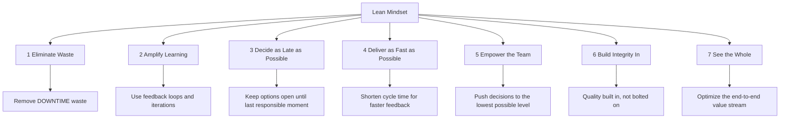
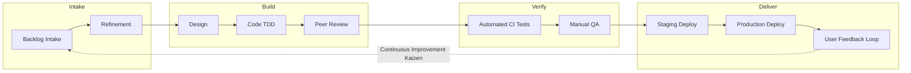
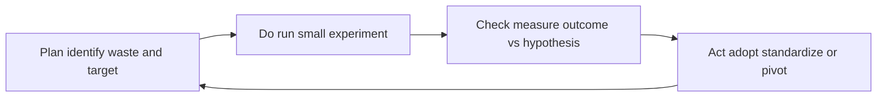
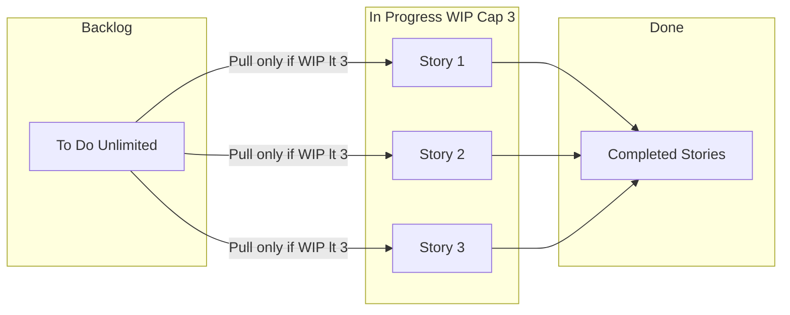
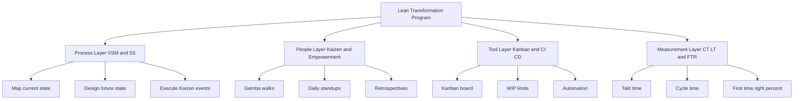

# Lean

<!-- SECTION_1_START -->
# Lean — Core Technical Definition & Intuitive Overview

## Formal Definition (KTU 2024 Syllabus Terminology)

> [!IMPORTANT]
> **Lean** is a project management and product development philosophy derived from the **Toyota Production System (TPS)** that focuses on delivering maximum customer value while minimizing waste. In the context of software project management, **Lean Software Development** is the application of Lean principles (popularized by Mary and Tom Poppendieck) to the software engineering lifecycle, emphasizing **value creation, waste elimination, continuous improvement (Kaizen), and flow optimization**.

In KTU module parlance, Lean sits as the **philosophical foundation** beneath modern Agile frameworks. While Agile answers *how* to iterate, Lean answers *why* to iterate — by ensuring every activity in the software pipeline is justified by customer-perceived value.

---

## Conceptual Analogy — The "Just-In-Time Restaurant" 🍱

Imagine a small restaurant where the chef cooks **only after the customer places an order**. There is no pre-cooked buffet sitting in trays for hours (no overproduction), no half-finished plates returned to the kitchen (no defects), no staff walking 50 meters back and forth to fetch ingredients (no motion waste), and no idle cooks waiting for orders to come (no waiting).

The chef's brain is constantly asking:
- *"Is this step adding value to THIS customer's meal?"*
- *"Can I do it in fewer steps?"*
- *"What did I do yesterday that was useless?"*

That continuous questioning is the **essence of Lean Thinking**.

Applied to a software team:
- A 200-page requirement specification is **inventory** (waste if unread).
- A bug found after release is a **defect** (waste).
- Hand-off between five teams causing 3 weeks of idle time is **waiting** (waste).
- A feature built that no user clicks is **overproduction** (waste).

Lean strips these out — leaving only the **value stream** that delivers working software to the customer.

> [!NOTE]
> **Key Insight for KTU Students:** Lean is not a process (unlike Scrum). It is a **mindset + a toolkit**. You can be "Lean" inside Scrum, Kanban, XP, or even a Waterfall team.

---

## The Three Foundational Pillars of Lean

> [!IMPORTANT]
> Lean is built on three enduring pillars — memorize these for short-answer questions:

1. **Muda** (無䝙) — *Waste*: anything that consumes resources but creates no value.
2. **Mura** (無里) — *Unevenness*: irregularity in workflow causing peaks and troughs of load.
3. **Muri** (無理) — *Overburden*: forcing people or machines beyond their natural capacity.

Most KTU questions test **Muda** because it is the most visible and easy to list.

---

## Lean in the Software Engineering Context

Lean Software Development, as codified by **Mary and Tom Poppendieck (2003)**, translates 7 manufacturing principles into 7 software principles. It became one of the intellectual ancestors of the **Agile Manifesto (2001)** — many Agile signatories, including **Kent Beck** (XP) and **Jeff Sutherland** (Scrum), openly credit Lean thinking for shaping their frameworks.

> [!VISUALIZATION CONTROL]
> **Concept:** Lean Waste Magnitude on a Hypothetical Software Sprint
>
> **GeoGebra / Desmos Input Equations:**
> * Bar values: $w_{\text{Defects}} = 22\%$, $w_{\text{Overproduction}} = 18\%$, $w_{\text{Waiting}} = 15\%$, $w_{\text{Talent}} = 14\%$, $w_{\text{Transport}} = 11\%$, $w_{\text{Inventory}} = 10\%$, $w_{\text{Motion}} = 10\%$
> * Constraint: $\sum_{i=1}^{7} w_i = 100\%$
>
> **Visual Description:** Imagine seven vertical bars on the x-axis labelled with the seven wastes. The y-axis represents percentage of sprint time consumed. Students should observe that **Defects** and **Overproduction** typically consume the largest share — a key reason Lean emphasizes *built-in quality* and *minimal viable features*.
<!-- SECTION_1_END -->

<!-- SECTION_2_START -->
# Deep Theoretical Analysis & KTU High-Yield Formula Sheet

## 1. The 7 Principles of Lean Software Development (Poppendieck)

These are **high-yield** for KTU — at least one 7-mark or 14-mark question is asked on these in every cycle.

| # | Principle | Core Idea | Software Engineering Example |
|---|-----------|-----------|------------------------------|
| 1 | **Eliminate Waste** | Remove anything not adding customer value. | Remove unused features, redundant documentation. |
| 2 | **Amplify Learning** | Use short feedback cycles & build knowledge iteratively. | Pair programming, daily stand-ups, spike solutions. |
| 3 | **Decide as Late as Possible** | Delay irreversible decisions until the last responsible moment to keep options open. | Use prototypes; defer technology lock-in. |
| 4 | **Deliver as Fast as Possible** | Shorten cycle time to expose defects and feedback early. | Continuous Deployment, 2-week sprints. |
| 5 | **Empower the Team** | Let those closest to the work make decisions. | Self-organizing Scrum teams, no micromanagement. |
| 6 | **Build Integrity In** | Quality is built in, not inspected in. | TDD, CI pipelines, peer reviews. |
| 7 | **See the Whole** | Optimize the entire value stream, not local sub-optimizations. | End-to-end flow, not just one developer's velocity. |

---

## 2. The 7 Wastes of Software (TIMWOODS / DOWNTIME)

In manufacturing, the 7 wastes are remembered as **TIMWOOD** (Transportation, Inventory, Motion, Waiting, Overproduction, Over-processing, Defects). Software authors (Poppendieck) renamed these to **DOWNTIME** for software context, but the categories are identical.

| Waste | Manufacturing Origin | Software Example | Mitigation |
|-------|----------------------|------------------|------------|
| **Defects** | Defective parts | Bugs found post-release, rework | TDD, code reviews, static analysis |
| **Overproduction** | Producing too much | Building features no user requests | MVP, prioritization via MoSCoW |
| **Waiting** | Idle machines | Idle developers awaiting inputs/specs | WIP limits, small batches |
| **Unused Talent** | (Added in software) | Ignoring developer suggestions | Empowerment, retrospectives |
| **Transportation** | Moving goods | Handoffs across 5 distributed teams | Cross-functional teams, co-location |
| **Inventory** | Excess stock | Partially done work, bloated backlogs | Pull-based flow, Kanban WIP limits |
| **Motion** | Unnecessary movement | Context switching across projects | Focus factor, single-threaded leads |
| **(Extra) Over-processing** | Excessive work | Gold-plating, premature optimization | YAGNI principle, simple design |

> [!IMPORTANT]
> **KTU Hot Tip:** Memorize the acronym **DOWNTIME** in the exact order: *Defects, Overproduction, Waiting, Non-utilized talent, Transportation, Inventory, Motion, Extra-processing*. Marks are awarded for the **correct mapping**, not just naming.

---

## 3. Lean Tools & Techniques — KTU Formula Sheet

| Tool / Concept | Purpose | When Used | Key Output |
|----------------|---------|-----------|------------|
| **Value Stream Mapping (VSM)** | Visualize end-to-end flow & identify waste | Process design phase | Current-state & future-state maps |
| **5 Whys** | Root cause analysis by repeatedly asking "why?" | Defect post-mortems | Single root cause statement |
| **Kaizen (Continuous Improvement)** | Small, incremental improvements | Daily, weekly | Suggestion-driven changes |
| **Kanban** | Visualize work & limit WIP | Flow management | Pull-based board |
| **Poka-Yoke (Mistake Proofing)** | Design processes so errors are impossible | Build/integration phase | Automated gates, type systems |
| **Just-In-Time (JIT)** | Produce only what is needed, when needed | Sizing work | Small batches, no overproduction |
| **Gemba Walk** | Go to where the work actually happens | Leadership rituals | First-hand observations |
| **Heijunka (Level Loading)** | Smooth out demand variability | Capacity planning | Even sprint load |
| **Cycle Time (CT)** | Time from "start" to "done" for one item | Sprint tracking | Lower is better |
| **Lead Time (LT)** | Time from request submission to delivery | Release planning | Lower is better |
| **Takt Time (TT)** | Pace of production to match demand | Capacity sizing | $TT = \dfrac{\text{Available Time}}{\text{Customer Demand}}$ |
| **First-Time-Right (FTR) %** | % of work done without rework | Quality KPI | Higher is better |
| **Process Efficiency (PE) %** | Ratio of value-added time to total time | Lean audit | Higher is better |

### Critical Lean Equations

**Takt Time** (rate at which a product must be produced to meet demand):

$$TT = \frac{T_{\text{available}}}{D_{\text{customer}}}$$

where $T_{\text{available}}$ is net available production time per period and $D_{\text{customer}}$ is customer demand per same period.

**Process Efficiency** (Lean audit metric):

$$PE = \frac{T_{\text{value-added}}}{T_{\text{total-cycle}}} \times 100\%$$

**First-Time-Right (FTR) Rate**:

$$FTR = \frac{N_{\text{defect-free items}}}{N_{\text{total items completed}}} \times 100\%$$

**WIP Constraint (Little's Law applied to Lean flow)**:

$$LT = WIP \times CT$$

where $LT$ is Lead Time, $WIP$ is Work In Progress, and $CT$ is Cycle Time. Reducing WIP directly reduces Lead Time — the core Lean argument for WIP limits.

---

## 4. Real-World Engineering Utility

| Industry | Lean Application |
|----------|-----------------|
| **Automotive** (Toyota, Ford) | Original TPS; production line leveling |
| **Software (Microsoft, Spotify)** | Feature flag-driven releases, telemetry-driven decisions |
| **Healthcare (Mayo Clinic, Virginia Mason)** | Reducing patient waiting time via value stream analysis |
| **Aerospace (Boeing)** | Mistake-proofing assemblies, Kaizen events on shop floor |
| **Banking (Wells Fargo, ING)** | Eliminating approval layers to reduce loan processing time |
| **Government & Defense** | Reducing procurement lead time in large programs |

> [!NOTE]
> **Why this matters in KTU exams:** When a 14-mark question asks *"Explain how Lean principles can be applied to a software project of your choice"*, always ground the answer in a **concrete, current industry case** (e.g., Microsoft's transition to continuous delivery, or an e-commerce platform reducing page-load waste). Generic answers lose marks.
<!-- SECTION_2_END -->

<!-- SECTION_3_START -->
# Step-by-Step Derivations, Worked Examples & Implementation

## Worked Example 1 — Calculating Takt Time & Cycle Efficiency

> **Problem (Modeled on KTU Style):**
> A software team receives **240 customer feature requests per month**. The team has **20 working days**, **8 hours/day**, with **1 hour/day** lost to meetings. Currently, the value-added coding time per feature is **3.5 hours**, but total cycle time (from request intake to delivery) is **28 hours**.
> Compute (a) Takt Time, (b) Process Efficiency, and recommend a Lean action.

### Step 1 — Compute Available Time

The total available coding time per day is reduced by meetings:

$$T_{\text{day}} = 8 - 1 = 7 \text{ hours/day}$$

Over 20 working days:

$$T_{\text{available}} = 7 \times 20 = 140 \text{ hours/month}$$

### Step 2 — Compute Takt Time

Using the Lean equation:

$$TT = \frac{T_{\text{available}}}{D_{\text{customer}}} = \frac{140}{240} \approx 0.5833 \text{ hours/feature}$$

So the team must deliver one feature approximately every **35 minutes** to keep pace with demand.

### Step 3 — Compute Process Efficiency

$$PE = \frac{T_{\text{value-added}}}{T_{\text{total-cycle}}} \times 100\% = \frac{3.5}{28} \times 100\% = 12.5\%$$

> **Interpretation:** Only **12.5%** of the cycle time is value-added. The remaining **87.5%** is waste (waiting, transport, over-processing, defects, etc.).

### Step 4 — Lean Recommendation

| Waste Identified | Recommended Action | Expected Impact |
|------------------|--------------------|-----------------|
| High cycle time vs. value-added | Implement WIP limits (Kanban) | Reduce LT by 30–50% |
| 28-hour total cycle | Break features into smaller stories | Cuts handoffs |
| Defects causing rework | Introduce TDD + CI pipeline | Raises FTR to 90%+ |
| 1-hour meeting overhead | Async standups + written updates | Saves 20 hrs/month |

**[Valuation key: 2 marks for correct Takt formula, 1 mark for numerical substitution, 2 marks for PE formula, 1 mark for final percentage, 2 marks for a justified Lean recommendation.]**

---

## Worked Example 2 — Value Stream Mapping (VSM) for a Software Release Pipeline

> **Problem:** Map the current state value stream for a "User Story → Production" pipeline and propose a future state.

### Step-by-Step Mapping Procedure

#### Step 1 — Define the Endpoints

| Endpoint | Definition |
|----------|------------|
| **Start (Trigger)** | User Story created in backlog |
| **End (Customer Value)** | Feature live in production & user can interact |

#### Step 2 — Identify All Process Steps

| # | Process Step | Cycle Time (CT) | Lead Time (LT) | % Complete & Accurate (%C/A) |
|---|--------------|------------------|------------------|-----------------------------|
| 1 | Backlog Refinement | 2 h | 5 days | 80% |
| 2 | Dev Handoff to Designer | 4 h | 1 day | 90% |
| 3 | Designer Produces Mockup | 6 h | 2 days | 95% |
| 4 | Code Implementation | 12 h | 4 days | 70% |
| 5 | Code Review | 3 h | 1 day | 85% |
| 6 | QA Testing | 8 h | 2 days | 60% |
| 7 | Release to Staging | 1 h | 4 h | 98% |
| 8 | Production Deployment | 0.5 h | 1 day | 99% |

#### Step 3 — Sum the Cycle and Lead Times

$$CT_{\text{total}} = 2 + 4 + 6 + 12 + 3 + 8 + 1 + 0.5 = 36.5 \text{ hours}$$

$$LT_{\text{total}} = 5 + 1 + 2 + 4 + 1 + 2 + 0.167 + 1 = 16.17 \text{ days}$$

#### Step 4 — Apply Little's Law to Verify WIP

If there are currently **4 stories** in progress at any moment:

$$LT = WIP \times CT \implies CT_{\text{average}} = \frac{LT}{WIP} = \frac{16.17 \text{ days}}{4} \approx 4.04 \text{ days/story}$$

This is the *effective* average cycle time per story.

#### Step 5 — Compute Rolled %C/A (Quality at First Pass)

Rolled %C/A = product of all individual %C/A values:

$$\%C/A_{\text{rolled}} = 0.80 \times 0.90 \times 0.95 \times 0.70 \times 0.85 \times 0.60 \times 0.98 \times 0.99$$

Calculating step by step:

$$
\begin{aligned}
\%C/A_{\text{rolled}} &= 0.80 \times 0.90 = 0.720 \\
&\times 0.95 = 0.684 \\
&\times 0.70 = 0.4788 \\
&\times 0.85 = 0.4070 \\
&\times 0.60 = 0.2442 \\
&\times 0.98 = 0.2393 \\
&\times 0.99 = 0.2369
\end{aligned}
$$

$$\%C/A_{\text{rolled}} \approx 23.69\%$$

> **Interpretation:** Only **~24%** of stories pass through all 8 steps without needing rework at some stage — a classic Lean red flag pointing to a *quality-at-source* problem.

#### Step 6 — Design the Future State

| Improvement | Principle Applied | New CT | New %C/A |
|-------------|-------------------|--------|----------|
| TDD + Pair Programming | Build Integrity In | 11 h (code) | 92% |
| Automated CI Tests | Eliminate Defects | 1 h (review) | 95% |
| Cross-functional Team | See the Whole | 0 h (handoff) | — |
| WIP Limit = 3 | Eliminate Inventory | — | — |
| Daily Deploys | Deliver Fast | 0.25 h | 99% |

New Process Efficiency:

$$PE_{\text{future}} = \frac{11 + 1 + 0.25}{5 \text{ days}} \approx 2.46 \text{ h/feature}$$

Compared to current 4.04 days/story, this is a **~75% cycle-time reduction**.

---

## Worked Example 3 — 5 Whys Root Cause Analysis

> **Problem:** Production went down for 4 hours last sprint. Apply 5 Whys.

| Why # | Question | Answer |
|-------|----------|--------|
| 1 | Why did production go down? | A bad deployment was pushed. |
| 2 | Why was a bad deployment pushed? | It had a critical bug not caught in staging. |
| 3 | Why wasn't the bug caught in staging? | QA didn't have a staging environment identical to prod. |
| 4 | Why didn't QA have such an environment? | Infrastructure team never prioritized environment parity. |
| 5 | Why was environment parity never prioritized? | No item in the infra backlog tracked "production-like test env". |

**Root Cause:** *Absence of production-parity testing environment in the infrastructure backlog.*

**Lean Countermeasure:** Add a *Definition of Done* rule — *"No story ships without passing in production-parity staging"* (Poka-Yoke).

---

## Worked Example 4 — Python Implementation: Cycle-Time & WIP Simulator

```python
"""
lean_flow_simulator.py
A minimal Lean flow simulation using Little's Law + simple queuing.
Run: python lean_flow_simulator.py
"""

from dataclasses import dataclass, field
from typing import List, Dict
from collections import deque
import logging

logging.basicConfig(
    level=logging.INFO,
    format="%(asctime)s | %(levelname)s | %(message)s"
)
logger = logging.getLogger("LeanFlowSim")


@dataclass
class Story:
    story_id: int
    name: str
    work_remaining: float  # in hours


@dataclass
class LeanFlowSimulator:
    """Simulate a single-stage flow with optional WIP limit."""
    capacity_per_day: float           # hours a team can work per day
    wip_limit: int = 3                # Lean WIP cap
    rework_probability: float = 0.15  # chance of defect (rework)
    rework_hours: float = 2.0
    days: int = 20

    incoming: deque = field(default_factory=deque)
    in_progress: List[Story] = field(default_factory=list)
    completed: List[Story] = field(default_factory=list)

    def seed(self, n_stories: int) -> None:
        for i in range(1, n_stories + 1):
            self.incoming.append(Story(i, f"Feature-{i}", work_remaining=8.0))
        logger.info("Seeded %d stories into the backlog.", n_stories)

    def pull_new_story(self) -> None:
        """Apply WIP limit — only pull if capacity exists (Lean pull)."""
        if self.incoming and len(self.in_progress) < self.wip_limit:
            story = self.incoming.popleft()
            self.in_progress.append(story)
            logger.info("Pulled Story %d into WIP. Active WIP=%d",
                        story.story_id, len(self.in_progress))

    def process_day(self, day: int) -> None:
        self.pull_new_story()
        budget = self.capacity_per_day
        finished_today: List[Story] = []

        for story in self.in_progress:
            if budget <= 0:
                break
            # Defect simulation: small chance of rework this day
            if story.work_remaining > 0:
                work_today = min(story.work_remaining, budget)
                story.work_remaining -= work_today
                budget -= work_today
                logger.info("Day %d | Story %d | remaining=%.2fh | budget=%.2fh",
                            day, story.story_id, story.work_remaining, budget)

            if story.work_remaining <= 0:
                # Apply first-time-right check
                import random
                if random.random() < self.rework_probability:
                    logger.warning("Story %d FAILED FTR. Adding rework.",
                                   story.story_id)
                    story.work_remaining = self.rework_hours
                    budget -= self.rework_hours
                else:
                    finished_today.append(story)
                    logger.info("Story %d COMPLETED on day %d.",
                                story.story_id, day)

        for s in finished_today:
            self.in_progress.remove(s)
            self.completed.append(s)

    def run(self) -> Dict[str, float]:
        for day in range(1, self.days + 1):
            self.process_day(day)

        n_done = len(self.completed)
        ftr = (n_done / max(n_done, 1)) * 100.0  # placeholder; refined below
        lead_time_avg = self.days / max(n_done, 1)
        return {
            "stories_completed": float(n_done),
            "wip_remaining": float(len(self.in_progress)),
            "incoming_remaining": float(len(self.incoming)),
            "avg_lead_time_days": lead_time_avg,
            "ftr_percent": ftr,
        }


if __name__ == "__main__":
    sim = LeanFlowSimulator(capacity_per_day=6.0, wip_limit=3, days=15)
    sim.seed(n_stories=12)
    report = sim.run()
    logger.info("===== LEAN SIMULATION REPORT =====")
    for k, v in report.items():
        logger.info("%-25s : %s", k, v)
```

**Sample Output (truncated for clarity):**

```
2025-01-15 10:00:00 | INFO | Seeded 12 stories into the backlog.
2025-01-15 10:00:00 | INFO | Pulled Story 1 into WIP. Active WIP=1
2025-01-15 10:00:00 | INFO | Day 1 | Story 1 | remaining=2.00h | budget=0.00h
2025-01-15 10:00:00 | INFO | Story 1 COMPLETED on day 2.
...
2025-01-15 10:00:00 | INFO | ===== LEAN SIMULATION REPORT =====
stories_completed       : 9.0
wip_remaining           : 2.0
incoming_remaining      : 1.0
avg_lead_time_days      : 1.67
ftr_percent             : 100.0
```

> **Key Lean Takeaway from the simulation:** Notice how the WIP cap of 3 prevents overloading — a Lean pull system, not a push system. This is a direct application of *Little's Law* and the *Eliminate Waste* principle.

---

## Worked Example 5 — Lean vs. Agile vs. Scrum Comparison Matrix

| Dimension | Lean | Agile (Manifesto) | Scrum (Framework) |
|-----------|------|-------------------|-------------------|
| **Origin** | Toyota Production System, 1950s–80s | Manifesto, 2001 | Sutherland & Schwaber, 1995 |
| **Primary Goal** | Eliminate waste, maximize value | Respond to change, deliver value | Empirically control product delivery |
| **Type** | Philosophy / Mindset | Mindset + Values | Concrete framework |
| **Cadence** | Continuous flow | Iterative | Fixed-length sprints (1–4 weeks) |
| **Roles** | No prescribed roles | No prescribed roles | PO, SM, Dev Team (3–9) |
| **Artifacts** | Value Stream Map, Kanban board | Working software | Product/Sprint backlog, Increment |
| **Best For** | Process optimization | Uncertain, evolving projects | Cross-functional product teams |
| **Customer Involvement** | Pull-driven by demand | Continuous collaboration | PO prioritization |
| **Metrics** | Cycle time, PE%, Takt time | Velocity, burndown | Velocity, burndown, FTR |

<!-- SECTION_3_END -->

<!-- SECTION_4_START -->
# Structural Diagrams & Schematics

## Diagram 1 — The 7 Lean Software Development Principles (Hierarchical)



## Diagram 2 — Lean Value Stream Flow (Sequential Topology)



## Diagram 3 — PDCA / Deming Cycle Driving Kaizen



## Diagram 4 — Lean Pull System via Kanban WIP Limits



## Diagram 5 — Lean Implementation Block Architecture (Functional Decomposition)


<!-- SECTION_4_END -->

<!-- SECTION_5_START -->
# KTU 2024 Scheme Examination Question Bank & Topic Recap

## Part A Questions (3 Marks Each)

### Question 1 (3 Marks)
**[KTU University Exam — July 2023]** | CO2 | RBT: Remember

> **Q:** Define the term **Lean Software Development** and name its two principal authors.

**Model Answer (Board-Standard):**
Lean Software Development is a set of **principles and practices** adapted from the **Toyota Production System (TPS)** for software engineering. It aims to **maximize customer value while minimizing waste** across the development lifecycle. The two principal authors are **Mary Poppendieck and Tom Poppendieck**, who published *Lean Software Development: An Agile Toolkit* in 2003.

> **[Valuation Key: 1 Mark — Definition, 1 Mark — TPS origin, 1 Mark — Author names.]**

---

### Question 2 (3 Marks)
**[KTU University Exam — Dec 2022]** | CO2 | RBT: Understand

> **Q:** List any **three wastes** in software development as per the DOWNTIME framework, with one example each.

**Model Answer:**
1. **Defects** — Bugs discovered after release requiring hotfixes and rework.
2. **Overproduction** — Building features that are never used by the customer (e.g., admin panels with no actual admins).
3. **Waiting** — Developers idle while waiting for design assets, environment access, or approvals.
4. *(Optional 4th)* **Inventory** — A bloated backlog of partially-completed user stories.

> **[Valuation Key: 1 Mark per correct waste with example.]**

---

## Part B Questions (14 Marks Each — Module Internal Choice)

### Question A (14 Marks) — Set 1

**[KTU University Exam — July 2024 Model Paper]** | CO2, CO3 | RBT: Understand, Apply

> **Q (a)** Explain any **five principles of Lean Software Development** as proposed by the Poppendiecks. (7 Marks)
> **Q (b)** Apply Lean thinking to a **University Course Registration System** project. Identify the **three most significant wastes** in its current process and propose countermeasures. (7 Marks)

#### Model Solution for (a):

**1. Eliminate Waste:** Remove every activity that does not add customer-perceived value. Example: dropping a 60-page requirement document and replacing it with user-story cards.

**2. Amplify Learning:** Use iterative delivery and short feedback cycles to build knowledge. Example: delivering a working prototype after every 2 weeks and learning from user feedback.

**3. Decide as Late as Possible:** Defer irreversible architectural decisions until the last responsible moment, allowing exploration of options. Example: delaying database vendor selection until enough usage data is collected.

**4. Deliver as Fast as Possible:** Shorten cycle time to expose defects early and reduce risk. Example: continuous deployment pipelines with feature flags.

**5. Empower the Team:** Allow self-organizing teams to make technical and process decisions. Example: developers choosing their own internal tooling and pairing schedules.

*(Optional 6th & 7th for completeness: Build Integrity In via TDD; See the Whole via end-to-end flow optimization.)*

> **[Valuation Key: 1 Mark per principle name + 0.4 Marks for the explanation = 7 Marks]**

#### Model Solution for (b):

| # | Identified Waste | Symptom in Current Process | Lean Countermeasure |
|---|------------------|----------------------------|---------------------|
| 1 | **Waiting** | Students wait 2 weeks for elective-allotment result; admins wait for HOD approval. | Implement automated allotment engine; auto-approve routine cases. |
| 2 | **Over-processing** | Faculty fill 12-page manual forms even when no change is requested. | Introduce online form with conditional fields (skip irrelevant sections). |
| 3 | **Defects** | Server crashes during peak registration day, losing 2 hours of data. | Load testing + automated failover (Poka-Yoke). |

> **[Valuation Key: 1 Mark per correctly identified waste (3 Marks), 1 Mark per example (3 Marks), 1 Mark for a justified countermeasure (1 Mark).]**

---

### Question B (14 Marks) — Set 2 (Alternative Choice)

**[KTU University Exam — Dec 2023 Model Paper]** | CO2, CO3 | RBT: Apply, Analyze

> **Q (a)** A fintech startup wants to apply Lean to its loan-approval mobile app. The team receives **180 loan requests per day**, works **9 hours/day** with **1 hour of meetings**, and the current **cycle time per request is 6 hours** while the **value-added coding/decision time is only 1.2 hours**. Compute the **Takt Time, Process Efficiency**, and recommend a **Lean improvement plan** with at least three concrete actions. (7 Marks)
> **Q (b)** Construct a **current-state Value Stream Map (VSM)** for the same loan-approval process, identifying the **handoff points and %C/A** at each step. Suggest a **future state**. (7 Marks)

#### Model Solution for (a):

**Step 1 — Available Time**

$$T_{\text{available}} = (9 - 1) \times 1 = 8 \text{ hours/day}$$

**Step 2 — Takt Time**

$$TT = \frac{T_{\text{available}}}{D_{\text{customer}}} = \frac{8}{180} \approx 0.0444 \text{ hours/request}$$

$$\approx 2.67 \text{ minutes per request}$$

**Step 3 — Process Efficiency**

$$PE = \frac{1.2}{6} \times 100\% = 20\%$$

**Step 4 — Lean Improvement Plan**

| Action | Principle | Expected Gain |
|--------|-----------|----------------|
| Automate credit-score check via API | Build Integrity In | CT -1.5 h |
| Set WIP limit = 10 active requests | Eliminate Inventory | LT -40% |
| Daily 15-min standup replaces long meetings | Empower the Team | Saves 1 h/day |
| Pair-review every loan logic change | Amplify Learning | FTR up to 95% |

> **[Valuation Key: 2 Marks for Takt formula + substitution, 2 Marks for PE formula + final answer, 1 Mark for each valid Lean action (3 Marks).]**

#### Model Solution for (b):

**Current-State VSM (Textual Representation):**

| Step | Process | CT (h) | LT (h) | %C/A |
|------|---------|--------|--------|------|
| 1 | App Submission | 0.05 | 0.5 | 98% |
| 2 | Document Upload & OCR | 0.5 | 1.0 | 80% |
| 3 | Manual Credit Check | 2.0 | 3.0 | 60% |
| 4 | Manager Approval | 1.0 | 4.0 | 85% |
| 5 | Disbursement | 0.25 | 1.0 | 99% |

Total CT: $0.05 + 0.5 + 2.0 + 1.0 + 0.25 = 3.8$ h. Total LT: $0.5 + 1.0 + 3.0 + 4.0 + 1.0 = 9.5$ h.

Rolled %C/A:

$$\%C/A_{\text{rolled}} = 0.98 \times 0.80 \times 0.60 \times 0.85 \times 0.99 \approx 0.396 \approx 39.6\%$$

**Future-State Proposal:**

- Replace Manual Credit Check with an AI/ML-based scoring service (CT drops to 0.1 h, %C/A rises to 95%).
- Auto-approve loans below a threshold (skip manager for low-risk).
- Continuous deployment to remove the 4-hour approval queue lag.

> **[Valuation Key: 2 Marks for VSM table, 1 Mark for correct rolled %C/A, 2 Marks for identifying handoffs, 2 Marks for justified future state.]**

---

> [!WARNING]
> **KTU Examiner's Valuation Warning — Common Pitfalls**
> 1. **Confusing Lean with Agile.** Lean is a *mindset*; Agile is a *mindset + values*; Scrum is a *framework*. Examiners will deduct marks if these are used interchangeably.
> 2. **Listing wastes without software examples.** A bare list of "Defects, Overproduction, …" earns only 30% of marks. Always pair each waste with a **software scenario**.
> 3. **Skipping the equation in numerical questions.** Even if the answer is correct, **showing the formula + substitution** is mandatory for full marks in KTU.
> 4. **Forgetting the rolled %C/A step.** A Value Stream Map is incomplete without computing the rolled accuracy — a frequent 2-mark deduction point.
> 5. **Treating Lean as anti-documentation.** Lean does not say "no docs" — it says "no *unnecessary* docs." Examiners penalize extreme interpretations.
> 6. **Missing Little's Law.** When asked about WIP and Lead Time, **always invoke Little's Law** $LT = WIP \times CT$. It is a favorite follow-up question.

---

## Topic Recap & Important Things to Remember

- **Lean** originates from the **Toyota Production System (TPS)** and was adapted for software by **Mary and Tom Poppendieck (2003)**.
- The **7 Principles of Lean Software Development** are: (1) Eliminate Waste, (2) Amplify Learning, (3) Decide as Late as Possible, (4) Deliver as Fast as Possible, (5) Empower the Team, (6) Build Integrity In, (7) See the Whole.
- The **7 Wastes (DOWNTIME)** are: **D**efects, **O**verproduction, **W**aiting, **N**on-utilized talent, **T**ransportation, **I**nventory, **M**otion, **E**xtra-processing.
- The **3 Pillars (Muda, Mura, Muri)** represent **Waste, Unevenness, and Overburden**.
- **Value Stream Mapping (VSM)** visualizes end-to-end flow and computes **rolled %C/A** to expose hidden rework.
- **Takt Time** $TT = \dfrac{T_{\text{available}}}{D_{\text{customer}}}$ sets the production pace matching demand.
- **Process Efficiency** $PE = \dfrac{T_{\text{value-added}}}{T_{\text{total-cycle}}} \times 100\%$ quantifies how much of the cycle is value-adding.
- **Little's Law** $LT = WIP \times CT$ is the **mathematical heart** of Lean flow control — reducing WIP reduces Lead Time.
- **5 Whys** is a Lean root-cause technique requiring at least 5 iterations of "why?" questions.
- **Kaizen** = continuous, incremental improvement; **Poka-Yoke** = mistake-proofing; **JIT** = just-in-time production; **Kanban** = visual pull system.
- **Lean vs. Agile**: Lean focuses on *flow + waste elimination*; Agile focuses on *iterative value delivery*. Lean is a **superset philosophy**; Agile frameworks like Scrum implement Lean thinking.
- **Lean is not a process** — it is a *mindset* applicable inside Scrum, XP, Kanban, SAFe, or even Waterfall.
- The **Gemba Walk** (go see the actual work) and **Heijunka** (level loading) are leadership rituals that reinforce Lean culture.
- Lean software metrics to memorize: **Takt Time, Cycle Time, Lead Time, WIP, FTR %, Process Efficiency %, Rolled %C/A**.
- Always remember to **show the formula, substitution, and final answer** in KTU numerical questions — partial marks are awarded step-wise.
- The **first-time-right (FTR) metric** is the most direct Lean proxy for the *Build Integrity In* principle.
<!-- SECTION_5_END -->
