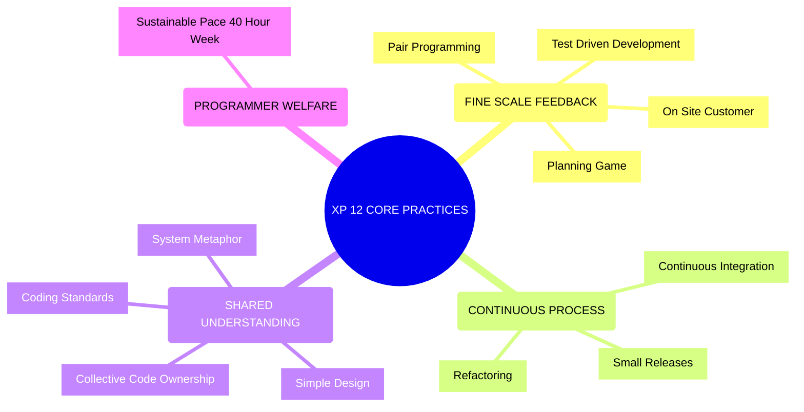
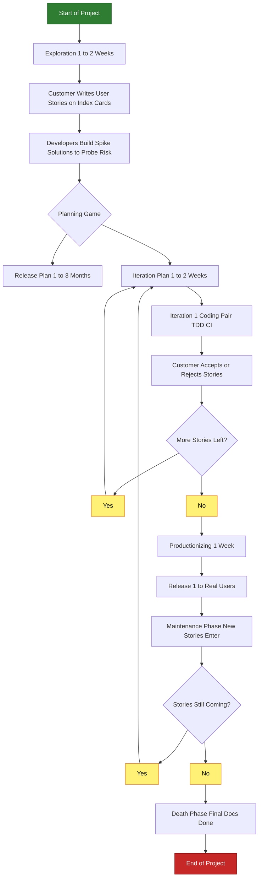
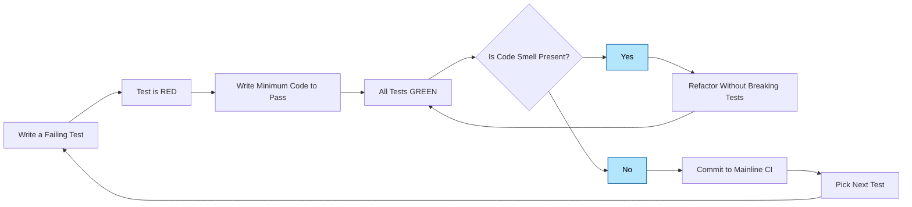
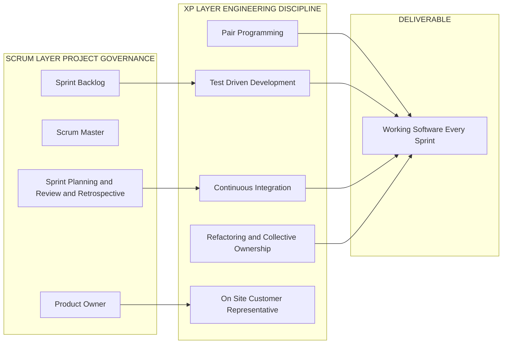
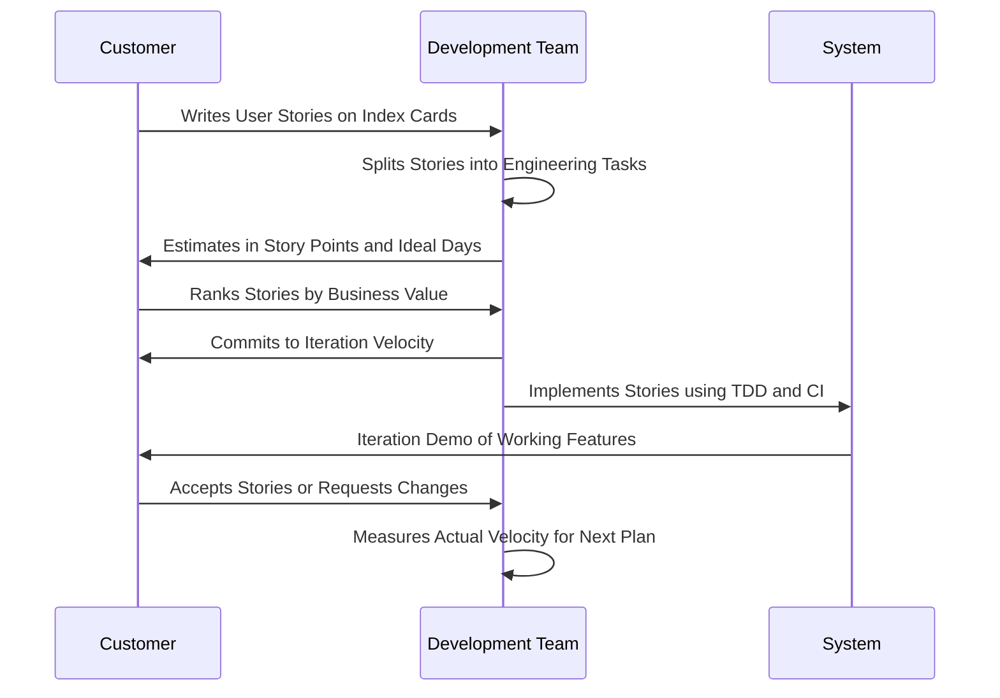

# Other Agile Methodologies - Introduction to XP

<!-- SECTION_1_START -->

# Introduction to XP (Extreme Programming)

> [!IMPORTANT]
> **KTU 2024 Scheme Definition (PECST521 | Module 3):**
> **Extreme Programming (XP)** is a lightweight, **iterative and incremental** Agile software development methodology created by **Kent Beck** in the late 1990s during the **Chrysler Comprehensive Compensation System (C3) project**. XP emphasizes **technical excellence**, **frequent releases in short development cycles**, **customer involvement**, and **continuous testing** to produce high-quality software that closely matches evolving customer requirements.

The term **"Extreme"** does not mean "dangerous" or "radical without reason." It is derived from taking proven software engineering best practices to **"extreme" levels** of application. For example:
- *Code reviews* are good → In XP, we do **pair programming** (continuous review).
- *Testing* is good → In XP, we write **tests before code** (TDD).
- *Short iterations* are good → In XP, iterations are **1–2 weeks** (extreme).

---

## Conceptual Analogy / Intuition

> [!NOTE]
> **Analogy: The Formula 1 Pit Crew 🏎️**
> Imagine a Formula 1 racing team performing a pit stop. A traditional software team would be like a single mechanic slowly fixing the car over weeks. An **XP team** is like a **pit crew working in pairs, with a clear plan, a driver (customer) giving instant feedback after every lap, and the team refactoring their tools after every stop to be faster next time.**
> - The **driver** = the *Customer* (gives the destination, sits inside the car, feels the ride).
> - The **pit crew pairs** = the *Programmers* (work in pairs, swap roles, review each other continuously).
> - The **race engineer** = the *Coach / Tracker* (measures progress, removes obstacles).
> - The **race itself** = an *Iteration* (short, planned, and ends with the car being "released" back on track).
> The pit crew cannot afford to be slow, must communicate in hand signals (no long documents), and must keep their tools (code) lean and simple.

The XP team uses **5 underlying Values**, **12 Core Practices**, and a tightly defined **planning game** to deliver working software in short cycles.

## The 5 Core Values of XP

> [!IMPORTANT]
> Kent Beck defined XP on the foundation of **5 values**. These are the cultural and behavioral backbone of every XP team.

| # | Value | Meaning in Practice |
|---|-------|---------------------|
| 1 | **Communication** | Team shares information face-to-face, through code, and through tests — not via thick documents. |
| 2 | **Simplicity** | Implement *only what is needed today*; do not anticipate future requirements. ("YAGNI" — *You Ain't Gonna Need It*). |
| 3 | **Feedback** | Get feedback early from the **customer**, from **unit tests**, and from the **system**. Adjust course constantly. |
| 4 | **Courage** | Tell the truth about progress, throw away bad code (refactor), and adapt to changes without fear. |
| 5 | **Respect** | Every team member values the others; the team respects the customer. (Added later; originally implied.) |

## Where XP Fits in Agile

> [!VISUALIZATION CONTROL]
> **Concept:** Position of XP within the Agile family
> **Input Coordinates / Mapping:**
> * $X$ axis = *Degree of Process Formalism* (left = lightweight, right = heavyweight)
> * $Y$ axis = *Customer Involvement Intensity*
> **Visual Description:** On a chart of software methodologies, **Scrum** sits slightly to the right of XP, **XP** sits at the *lightest, most customer-intense* corner, **DSDM** sits in the middle, and **CMMI / RUP** sit at the heavyweight, low-customer-involvement corner.

**Key Constants / Metrics (Bolded for KTU):**
- **Iteration length: 1 to 2 weeks.**
- **Release cycle: every 1 to 3 months.**
- **Test-first discipline: 100% of production code covered by unit tests.**
- **Pair programming ratio: 100% of production code written by pairs.**
- **Continuous integration rhythm: integrate and test multiple times per day.**

<!-- SECTION_1_END -->

<!-- SECTION_2_START -->

# Deep Theoretical Analysis & KTU High-Yield Formula Sheet

## The 12 Core Practices of XP

Kent Beck organized the practices of XP into **4 inter-related categories** (sometimes called the "**XP practices wheel**"):

> [!NOTE]
> Memorize the 4 categories and the 3 practices under each. This is a **high-frequency 3-mark question** in KTU exams.

### Category 1 — Fine-Scale Feedback (Practices that provide rapid, granular feedback)

1. **Pair Programming**: Two programmers work together at one workstation. *Driver* writes code; *Navigator* reviews every line in real time. Roles are swapped frequently (every few minutes or every test).
2. **Planning Game**: A meeting at the start of each iteration where the customer writes *User Stories* on index cards and prioritizes them. The development team estimates each story in *Ideal Programming Weeks / Story Points*.
3. **Test-Driven Development (TDD)**: Every programmer writes an **automated unit test** *before* writing the production code. The cycle is: *Red → Green → Refactor*.
   - *Red*: Write a failing test.
   - *Green*: Write the minimum code to pass the test.
   - *Refactor*: Clean up the code while keeping tests green.
4. **On-Site Customer**: A real, live user of the system is physically (or virtually) available full-time to answer questions, set priorities, and validate releases.

### Category 2 — Continuous Process (Practices applied continuously, not periodically)

5. **Continuous Integration (CI)**: Every team member integrates and tests their code with the mainline **multiple times per day**. An automated build + test suite triggers on every integration.
6. **Refactoring (or Design Improvement)**: The team continuously restructures the code *without changing its external behavior* to remove duplication, improve clarity, and reduce complexity. The safety net is the unit-test suite.
7. **Small Releases**: The team releases the smallest useful feature set to the customer as early as possible, then iterates. This generates real-user feedback fast.

### Category 3 — Shared Understanding (Practices that make the code and intent clear to everyone)

8. **Simple Design**: The team always implements the **simplest possible solution** that passes all current tests. No speculative features; no "future-proof" architecture.
9. **Collective Code Ownership**: *Any* developer can modify *any* code in the codebase. There is no "this is Rahul's module" thinking. This is safe because of the unit tests and pair programming.
10. **Coding Standards**: The team agrees on and follows a single set of **formatting and naming rules** (e.g., a Java style guide, a Python PEP-8 rule) so that all code looks like it was written by one person. Enables collective ownership.
11. **System Metaphor**: A simple, shared **story** or analogy (e.g., "the system is a pipeline of filters") that describes how the system works, guiding naming and architecture.

### Category 4 — Programmer Welfare (Practices that sustain the team's pace)

12. **Sustainable Pace (40-Hour Week)**: Teams commit to a **reasonable working week (max 40–45 hours)**. Overtime is a *symptom of a problem*, not a virtue. Tired programmers write more bugs.

> [!IMPORTANT]
> **KTU Exam Memory Aid:** The first letter of the 4 categories forms the acronym **F-C-S-P** (Fine-scale feedback, Continuous process, Shared understanding, Programmer welfare) — or you can remember them as the **"Feedback → Flow → Form → Fit"** chain.

---

## The XP Lifecycle (The "Planning Game" Workflow)

> [!NOTE]
> The XP project is a continuous cycle of three meta-phases: **Exploration → Planning → Iterations to Production → Maintenance → Death**.

1. **Exploration (1–2 weeks):** The customer writes initial *User Stories* on index cards. Developers familiarize themselves with the tools, code, and technology. Spike solutions are built to estimate technical risk.
2. **Planning (1–2 days):** Customer and developers play the *Planning Game*. The customer ranks stories by *business value*; developers estimate *cost* in story points. The team commits to a **release plan** (which stories will be in release 1) and an **iteration plan** (which stories will be in iteration 1).
3. **Iterations to Release (1–2 weeks each):** Each iteration is a complete mini-project: design → implement → test → integrate. At the end, the customer accepts or rejects the iteration's stories. Velocity is measured.
4. **Productionizing (1 week):** Final system tests (acceptance tests), performance tuning, and bug-fixing before the first production release.
5. **Maintenance (variable):** New stories enter, support tasks are handled. XP projects can stay in this phase for years with on-going releases every 1–3 months.
6. **Death:** When the customer has no more stories, the system documentation is finalized, and the project winds down.

---

## KTU Formula Sheet / Cheat Sheet

> [!IMPORTANT]
> This is the high-yield, single-page summary the examiner expects you to reproduce under exam pressure.

| Concept | Symbol / Term | Definition / Unit | Notes for KTU |
|---|---|---|---|
| **User Story** | $U$ | Short narrative: *"As a &lt;role&gt;, I want &lt;feature&gt;, so that &lt;benefit&gt;."* | Written by the customer; estimated in story points. |
| **Story Point** | $SP$ | A unitless measure of effort for a story. | Typically follows the **Fibonacci sequence**: 1, 2, 3, 5, 8, 13. |
| **Velocity** | $V$ | Number of story points completed per iteration. | $V = \frac{\sum \text{completed story points}}{\text{iteration}}$ |
| **Ideal Time** | $IT$ | The time a story would take if no interruptions occurred. | 1 *Ideal Programming Week* ≈ 3 *real days*. |
| **Loaded Time** | $LT$ | The actual calendar time including meetings, e-mail, etc. | $LT = IT \times \text{Load Factor}$ (typical $LF \in [2, 3]$). |
| **Iteration Length** | $IL$ | Fixed time-box per iteration. | **$IL = 1$ to $2$ weeks**. |
| **Release Span** | $RS$ | The time between customer releases. | **$RS = 1$ to $3$ months** (= 4 to 12 iterations). |
| **Project Effort** | $E$ | Total ideal-engineering months. | $E = \dfrac{\sum SP \text{ for all stories}}{V \times \text{iterations per month}}$ |
| **Test Coverage** | $TC$ | Percentage of production code covered by unit tests. | XP aims for **$TC \approx 100\%$**. |
| **Pair Programming** | $PP$ | Two developers, one workstation. | Effective cost = ~$1.15 \times$ solo cost, defects drop $\approx 15$–$50\%$. |
| **Load Factor** | $LF$ | Ratio of loaded time to ideal time. | $LF = \dfrac{LT}{IT}$, typical value is **2 to 3**. |
| **Customer Presence** | $CP$ | Real, on-site user available full-time. | Mandatory in XP — replaces a written requirements document. |

---

## Engineering Utility of XP (Why Production Teams Use It)

- **High defect detection rate:** The combination of TDD + pair programming + on-site customer means defects are caught within minutes, not months. Industry studies report defect counts in XP projects of **$0.5$ to $5$ per $KLOC$** vs. **$15$ to $50$** in traditional projects.
- **Faster ROI for small-to-medium projects:** Useful in domains where requirements shift rapidly (startups, web apps, embedded systems, AI/ML model pipelines).
- **Predictable velocity:** Because velocity is measured every iteration, the team can accurately forecast delivery dates after **3–4 iterations** (the "control limit" period).
- **Best fit:** Co-located teams of **2 to 12 members**, working on **mission-critical business logic** with a **dedicated, empowered customer proxy**.
- **Not a fit:** Distributed teams across time zones, very large teams (&gt; 30), or domains with heavy regulatory documentation needs (avionics, medical devices) — though even NASA has used XP-inspired practices in pockets.

<!-- SECTION_2_END -->

<!-- SECTION_3_START -->

# Step-by-Step Derivations, Worked Examples & Code Implementation

> [!IMPORTANT]
> **KTU Valuation Note:** In a 14-mark question, the examiner awards marks for (a) **stating the concept**, (b) **elaborating each item with engineering reasoning**, and (c) **giving one real-world example or formula**. Follow this structure to score full marks.

## Worked Example 1 — The XP "Planning Game" (Capacity Calculation)

> **Question (model):** A startup is using XP. The team has 4 developers, each can work 6 *real* hours per day on coding, and the **iteration length is 2 weeks (10 working days)**. Each developer can focus on coding for ~$70\%$ of an ideal day. The team's *load factor* is **2.5**.
> **Find:** (a) The team's iteration *velocity* in ideal hours, (b) The number of story points they can commit to if **1 story point = 6 ideal hours**.

### Step 1: Calculate the *ideal hours per developer per iteration*
$$
\begin{aligned}
\text{Ideal hours per dev} &= \text{days} \times \text{ideal hours/day} \\
&= 10 \text{ days} \times 6 \text{ hours/day} \times 0.70 \\
&= 42 \text{ ideal hours}
\end{aligned}
$$

> *Valuation key:* [Stating the focus factor of 0.70: 1 Mark] [Multiplying by 6 hours: 1 Mark] [Final 42 hours: 1 Mark]

### Step 2: Calculate the *team-wide ideal capacity*
$$
\begin{aligned}
\text{Team ideal capacity} &= 4 \text{ devs} \times 42 \text{ ideal hours} \\
&= 168 \text{ ideal hours per iteration}
\end{aligned}
$$

> *Valuation key:* [Multiplying 4 × 42: 1 Mark] [Final 168 hours: 1 Mark]

### Step 3: Adjust for the *load factor* (meetings, e-mail, support)
$$
\begin{aligned}
\text{Loaded (committed) hours} &= \frac{\text{Team ideal capacity}}{\text{Load Factor}} \\
&= \frac{168}{2.5} \\
&= 67.2 \text{ hours}
\end{aligned}
$$

> *Valuation key:* [Recognising that load factor is a divider, not multiplier: 1 Mark] [Final 67.2: 1 Mark]

### Step 4: Convert to story points
$$
\begin{aligned}
V \text{ (velocity in SP)} &= \frac{\text{Loaded hours}}{\text{Hours per SP}} \\
&= \frac{67.2 \text{ hours}}{6 \text{ hours/SP}} \\
&= 11.2 \approx 11 \text{ story points per iteration}
\end{aligned}
$$

> *Valuation key:* [Correct division: 1 Mark] [Rounding down to 11 (you cannot over-commit): 1 Mark]

### Final Answer
> The team should commit to **no more than 11 story points** in the next 2-week iteration to honor the **sustainable pace** rule.

---

## Worked Example 2 — The TDD Cycle (Red → Green → Refactor)

> **Question (model):** Write the TDD step-by-step for a simple banking function `withdraw(account, amount)` that must throw an error if the balance is insufficient. Use Python.

### Step 1: RED — Write a failing test *first*
```python
# test_account.py
import unittest
from account import Account, InsufficientFundsError

class TestWithdraw(unittest.TestCase):

    def test_withdraw_deducts_amount_when_funds_are_sufficient(self) -> None:
        # Arrange
        acc: Account = Account(balance=1000)
        # Act
        acc.withdraw(amount=200)
        # Assert
        self.assertEqual(acc.balance, 800)

    def test_withdraw_raises_error_when_funds_are_insufficient(self) -> None:
        acc: Account = Account(balance=100)
        with self.assertRaises(InsufficientFundsError):
            acc.withdraw(amount=500)
```

> *Valuation key:* [Tests written before code: 1 Mark] [Type hints used: 1 Mark] [Boundary case (insufficient funds) explicitly covered: 1 Mark]

### Step 2: GREEN — Write the minimum code to pass
```python
# account.py
class InsufficientFundsError(Exception):
    """Raised when a withdrawal exceeds the account balance."""
    pass


class Account:
    def __init__(self, balance: float) -> None:
        if balance < 0:
            raise ValueError("Initial balance cannot be negative")
        self.balance: float = balance

    def withdraw(self, amount: float) -> None:
        # Absolute boundary check (Kent Beck's "Defense in Depth")
        if amount <= 0:
            raise ValueError("Withdrawal amount must be positive")
        if amount > self.balance:
            raise InsufficientFundsError(
                f"Cannot withdraw {amount}; balance is {self.balance}"
            )
        self.balance -= amount
```

> *Valuation key:* [Minimum code to pass tests: 1 Mark] [No speculative features like transaction history: 1 Mark — *Simplicity value*] [Custom exception class used: 1 Mark]

### Step 3: REFACTOR — Improve structure while keeping tests green
```python
# account.py (refactored)
class InsufficientFundsError(Exception):
    pass


class Account:
    MINIMUM_BALANCE: float = 0.0

    def __init__(self, balance: float = MINIMUM_BALANCE) -> None:
        if balance < self.MINIMUM_BALANCE:
            raise ValueError("Initial balance cannot be negative")
        self._balance: float = balance

    @property
    def balance(self) -> float:
        """Read-only public view of the balance (encapsulation)."""
        return self._balance

    def withdraw(self, amount: float) -> None:
        """Decrease balance; raise on illegal amounts (boundary checks)."""
        self._validate_withdrawal(amount)
        self._balance -= amount

    def _validate_withdrawal(self, amount: float) -> None:
        if amount <= 0:
            raise ValueError("Withdrawal amount must be positive")
        if amount > self._balance:
            raise InsufficientFundsError(
                f"Cannot withdraw {amount}; balance is {self._balance}"
            )
```

> *Valuation key:* [Method extraction (refactoring pattern): 1 Mark] [Encapsulation via @property: 1 Mark] [Tests still pass: 1 Mark — *Mention this explicitly*]

> [!IMPORTANT]
> The **Red → Green → Refactor** cycle takes **minutes, not hours**. If it takes longer, the story is too big and should be split.

---

## Worked Example 3 — XP vs Scrum Comparison Matrix (Tabular — 14-mark question skeleton)

> **Question (model):** *Compare and contrast Extreme Programming (XP) and Scrum as Agile methodologies.* (14 Marks)

| Dimension | Extreme Programming (XP) | Scrum |
|---|---|---|
| **Origin & Creator** | Kent Beck, 1996 (Chrysler C3 payroll project) | Ken Schwaber & Jeff Sutherland, 1995 |
| **Primary Focus** | *Engineering practices* — how to code, test, and design well | *Project management practices* — how to plan, track, and deliver increments |
| **Iteration Length** | **1–2 weeks** | **2–4 weeks** (called a *Sprint*) |
| **Release Cadence** | Every **1–3 months** (or even after every iteration in extreme cases) | Typically every **2–4 sprints** |
| **Roles** | *Customer, Programmer, Coach (Tracker)* | *Product Owner, Scrum Master, Development Team* |
| **Requirements Artifact** | *User Stories* on index cards | *Product Backlog Items* (PBIs) on a prioritized list |
| **Estimation Unit** | *Ideal Programming Weeks / Story Points* | *Story Points / Hours* |
| **Daily Coordination** | *Pair programming* (constant dialogue) | *Daily Standup* (15-minute meeting) |
| **Process Ceremony** | Minimal — emphasis on code & tests | Ceremonies are first-class: Sprint Planning, Review, Retrospective |
| **Customer Presence** | **On-site full-time customer** (mandatory) | Product Owner represents the customer (may or may not be full-time) |
| **Engineering Discipline** | **TDD, Pair Programming, Refactoring, CI** — explicitly prescribed | Not prescribed — team is free to choose (often adopts XP practices) |
| **Work-in-Progress Cap** | Implicit (pair programming limits it) | Implicit (Sprint Backlog is committed) |
| **Strengths** | Defect density is extremely low; excellent for small co-located teams | Excellent for larger teams; clear governance |
| **Weakness** | Hard to scale beyond ~12 members; on-site customer is rare in practice | Engineering depth can be thin if team doesn't adopt XP practices |
| **Synergy** | **Scrum + XP is the de-facto industry standard** — Scrum for governance, XP for engineering | |

> [!NOTE]
> **Valuation key (14 marks):** [Introductory paragraph differentiating both: 2 Marks] [Comparison table with at least 10 rows: 6 Marks] [Engineering reason for one strength and one weakness of each: 4 Marks] [Conclusion / synergy statement: 2 Marks].

---

## Worked Example 4 — XP User Story to Task Breakdown

> **Question (model):** *Given the user story, decompose it into engineering tasks for a 2-week XP iteration.* (7 Marks)

**User Story (written by the customer):**
> *As a **registered online shopper**, I want to **add an item to my shopping cart and see the running total**, so that **I can decide when to checkout**.*

### Step 1: Identify *acceptance criteria* (customer's "definition of done")
- The user can add an item from the product page to the cart.
- The cart icon shows the number of distinct items.
- The running total reflects the sum of `(price × quantity)` for all line items.
- The cart total updates **without a full page refresh** (SPA-style).

### Step 2: Engineer breaks the story into *tasks* and estimates in *ideal hours*

| # | Task | Type | Estimate (ideal hours) | Owner Pair |
|---|------|------|----------------------:|------------|
| T1 | Add a failing unit test for the `Cart` class constructor | TDD | 1 | Pair A |
| T2 | Implement the `Cart.add_item(product, qty)` method (minimum code) | TDD | 3 | Pair A |
| T3 | Add tests for `Cart.total()` calculation (including 0 and multiple items) | TDD | 2 | Pair B |
| T4 | Implement `Cart.total()` with property `Cart.line_count` | TDD | 2 | Pair B |
| T5 | Create an *acceptance test* in Cucumber/Behave using the user-story language | Acceptance Test | 3 | Pair C |
| T6 | Wire up the React `CartIcon` to call the back-end API | UI | 4 | Pair C |
| T7 | Refactor the `Cart` class to use a `Money` value object (remove float bugs) | Refactor | 3 | Pair A |
| T8 | Add the story to CI pipeline; ensure build is green | CI | 1 | Pair B |

**Total ideal hours = 19.** With a load factor of 2.5, **loaded hours = 7.6**. The pair can commit to this story in a 2-week iteration.

> *Valuation key:* [Acceptance criteria in customer language: 2 Marks] [Tasks broken into ≤ 6 ideal hours each: 2 Marks] [TDD, CI, Refactor all visible: 2 Marks] [Workload calculation: 1 Mark]

<!-- SECTION_3_END -->

<!-- SECTION_4_START -->

# Structural Diagrams & Schematics

> [!NOTE]
> Mermaid diagrams follow the **KTU-PREMIER-ENGINE V10 safeguards**: all node IDs are alphanumeric and prefixed with letters; all labels are quoted raw uppercase text; no markdown bold/italic inside labels.

## Diagram 1 — The XP "Practices Wheel" (Mind Map)



## Diagram 2 — The XP Project Lifecycle (Flow Chart)



## Diagram 3 — The TDD Micro-Cycle (Red → Green → Refactor)



## Diagram 4 — XP vs Scrum Synergy (Block Architecture)



> [!IMPORTANT]
> **Visual Description for the student:** The block diagram shows that Scrum supplies the **management skeleton** (who decides what, when, and how meetings run) while XP supplies the **engineering muscles** (how the code is written, tested, and integrated). The two together produce the *Working Software* deliverable.

## Diagram 5 — Planning Game Sequence (Customer vs Developer)



<!-- SECTION_4_END -->

<!-- SECTION_5_START -->

# KTU 2024 Scheme Examination Question Bank & Topic Recap

> [!IMPORTANT]
> **Mark Distribution Reminder (KTU 2024 Scheme | PECST521):**
> - **Part A:** 3-Mark short-answer / definition questions (Answer any 3 out of 4 in 15 minutes).
> - **Part B:** 14-Mark descriptive questions with **internal choice** (Answer any 1 out of 2 per module slot in 45 minutes).
> - All Part B questions test **Apply / Analyze / Evaluate** levels of Bloom's Taxonomy; Part A tests **Remember / Understand**.

---

## Part A — 3-Mark Questions (Answer in 2–3 sentences each)

### Q1. `[KTU University Exam - July 2024]`
**Define Extreme Programming (XP). Mention any two of its core values.**
*Model Answer:*
Extreme Programming is a lightweight, iterative, and customer-centric Agile software development methodology created by Kent Beck in 1996. It is built on five values: Communication, Simplicity, Feedback, Courage, and Respect. Two examples: (1) **Simplicity** — implement only what is needed today (YAGNI), and (2) **Feedback** — gather continuous feedback from the customer, unit tests, and the running system to adapt the product. **[Valuation key: Definition 1M, listing 2 values 1M, example 1M.]**

### Q2. `[KTU University Exam - Dec 2023]`
**What is Test-Driven Development (TDD)? Write the three steps of the TDD cycle.**
*Model Answer:*
TDD is the XP practice of writing an **automated unit test before** writing the corresponding production code. The three-step cycle is:
1. **Red** — Write a failing test for the next small piece of behavior.
2. **Green** — Write the minimum code that makes the test pass.
3. **Refactor** — Clean up the code (remove duplication, improve naming) while keeping all tests green.
**[Valuation key: Definition 1M, Red 1M, Green + Refactor 1M.]**

### Q3. `[KTU University Exam - Dec 2022]`
**List any three XP practices that fall under the "Continuous Process" category.**
*Model Answer:*
1. **Continuous Integration (CI)** — every developer integrates and tests multiple times per day.
2. **Refactoring** — continuously improving the internal structure of code without changing its behavior.
3. **Small Releases** — releasing the smallest useful feature set to the customer as early as possible to gather real feedback.
**[Valuation key: 3 practices × 1M each.]**

### Q4. `[KTU University Exam - July 2023]`
**Differentiate between "User Story" and "Task" in XP (2 marks). Give one example of each (1 mark).**
*Model Answer:*
A **User Story** is a short, customer-written description of a feature from the user's perspective, used for *what* is to be built. A **Task** is a developer-broken-down engineering activity used to implement a story, describing *how* it will be built.
*Example of a User Story:* "As a customer, I want to add items to a cart so I can checkout later."
*Example of a Task:* "Implement `Cart.add_item(product, qty)` method using TDD."
**[Valuation key: Difference 2M, examples 1M.]**

---

## Part B — 14-Mark Questions (Module Internal Choice)

### Question A — `[KTU University Exam - July 2024]` | **CO3, Apply / Analyze**

> **(a)** Explain the **5 values** of Extreme Programming in detail. For each value, write one engineering practice that operationalizes it. **(7 Marks)**
>
> **(b)** Describe the **12 core practices of XP** grouped under the four categories: *Fine-Scale Feedback, Continuous Process, Shared Understanding,* and *Programmer Welfare*. For each category, explain **why** it is essential. **(7 Marks)**

#### Model Solution (a) — Values of XP

| # | Value | Engineering Practice that Operationalizes It | Why it matters |
|---|-------|----------------------------------------------|----------------|
| 1 | **Communication** | Pair Programming, On-Site Customer, Planning Game | Reduces hidden assumptions; the "face-to-face" rule beats a 50-page spec. |
| 2 | **Simplicity** | Simple Design, Refactoring, YAGNI rule | Less code = fewer bugs; do not build for hypothetical future needs. |
| 3 | **Feedback** | Test-Driven Development, Continuous Integration, Small Releases, On-Site Customer | Catch defects in minutes; real users validate direction early. |
| 4 | **Courage** | Refactoring, Telling the truth about progress, Adapting to changes | Teams must throw away bad code and bad plans without political fear. |
| 5 | **Respect** | Sustainable Pace, Collective Code Ownership | Every member is valued; tired, disrespected teams produce poor code. |

*Conclusion:* The 5 values are not independent — they reinforce one another. *Simplicity* makes *Feedback* cheaper; *Courage* is enabled by *Feedback* (tests give safety); *Communication* ensures *Respect* survives conflict.

> *Valuation key for (a):* [Each value 1M (5 × 1 = 5M) + practice 0.4M each (totalling 2M)] = 7 Marks.

#### Model Solution (b) — The 12 Practices in 4 Categories

**1. Fine-Scale Feedback (1M category intro + 3 × 0.5M practices + 0.5M why = 3 Marks)**
- **Pair Programming:** Two developers, one machine. *Driver* writes, *Navigator* reviews in real time. Reduces review latency from days to seconds.
- **Planning Game:** Customer ranks stories by *business value*; developers estimate *cost*. Yields a *release plan* + *iteration plan*.
- **Test-Driven Development:** Red → Green → Refactor. Forces modular, testable design.
- **On-Site Customer:** A real, empowered user is available full time to answer questions and accept stories.
- *Why essential?* Without tight feedback, software drifts away from user needs and accumulates defects.

**2. Continuous Process (1.5 Marks)**
- **Continuous Integration:** Multiple merges per day + automated tests = early detection of integration problems.
- **Refactoring:** Code is cleaned constantly. Unit tests are the safety net.
- **Small Releases:** Release the smallest valuable feature set; user feedback flows back into the next release.
- *Why essential?* Continuous activities reduce the size and cost of change; *big-bang* processes are fragile.

**3. Shared Understanding (1.5 Marks)**
- **Simple Design:** Solve today's problem. No speculative features. Code expresses intent.
- **Collective Code Ownership:** Any developer can fix any file. Encourages *everyone owns quality*.
- **Coding Standards:** One style for the whole codebase, enabling *Collective Ownership* without confusion.
- **System Metaphor:** A short, shared *story* (e.g., "the system is a pipe of filters") that names classes and packages consistently.
- *Why essential?* Teams change members. A shared mental model survives turnover.

**4. Programmer Welfare (1 Mark)**
- **Sustainable Pace:** Overtime is a *symptom*, not a solution. A 40-hour week is the rule. Studies show productivity drops sharply after 50 hours/week.
- *Why essential?* Software is built by people. Burnt-out people ship burnt-out software.

> *Valuation key for (b):* [4 categories named correctly: 1M] [All 12 practices listed: 3M] [Engineering justification for each category: 2M] [Concluding sentence linking values → practices: 1M] = 7 Marks.

---

### Question B — `[KTU University Exam - Dec 2023]` | **CO3, Apply / Analyze** *(Alternative Choice)*

> **(a)** With a neat diagram, explain the **XP Project Lifecycle** from Exploration to Death. Highlight the *Planning Game* phase in detail. **(7 Marks)**
>
> **(b)** A startup team of **5 developers** is starting an XP project. Each developer can work **6 ideal hours per day** with a **focus factor of 0.75**. The **load factor is 2.5**. The **iteration length is 2 weeks (10 working days)** and **1 story point = 5 ideal hours**. Calculate: (i) Total ideal hours per developer per iteration, (ii) Total team ideal capacity, (iii) Loaded (committed) hours, (iv) Team velocity in story points, and (v) How many user stories of size 3 SP each can the team commit to in this iteration? **(7 Marks)**

#### Model Solution (a) — XP Lifecycle

**Diagram (reproduce the flowchart from Section 4 in your answer sheet):**

```
START → Exploration (1–2 weeks)
              ↓ (customer writes user stories, developers build spike solutions)
         Planning Game (1–2 days)
              ↓ (release plan + iteration plan)
         Iteration N (1–2 weeks each)
              ↓ (TDD, pair programming, CI, customer accepts/rejects)
         {Are stories left?} → Yes → back to Planning Game
              ↓ No
         Productionizing (1 week)
              ↓
         Release to Real Users
              ↓
         Maintenance (ongoing; new stories enter)
              ↓
         {Stories still coming?} → Yes → back to Iteration
              ↓ No
         Death (final docs) → END
```

**Planning Game Phase in detail (5–6 lines):**
The Planning Game is the **single most important ceremony** in XP. It happens at the start of every release. The *Customer* plays the **business** side: writes user stories on index cards, ranks them by **business value**, and decides the order. The *Developers* play the **technical** side: split stories into engineering tasks, estimate each in **story points** or **ideal programming weeks**, and state the team's **velocity** (how many points they historically complete per iteration). The intersection of *value* and *cost* produces a **release plan** (which stories will be done in the next 1–3 months). Inside the release, the team re-plays the game at the start of every iteration to commit to a *Sprint-sized* chunk.

> *Valuation key for (a):* [Diagram showing 5–6 phases: 3 Marks] [Planning Game explained with customer + developer roles: 3 Marks] [Difference between release plan and iteration plan: 1 Mark] = 7 Marks.

#### Model Solution (b) — Velocity Calculation

**(i) Ideal hours per developer per iteration:**
$$
\begin{aligned}
\text{Ideal hours per dev} &= \text{days} \times \text{ideal hours/day} \times \text{focus factor} \\
&= 10 \times 6 \times 0.75 \\
&= 45 \text{ ideal hours}
\end{aligned}
$$
> [Valuation: formula 1M, substitution 1M, answer 45 hr 1M]

**(ii) Total team ideal capacity:**
$$
\begin{aligned}
\text{Team ideal capacity} &= 5 \times 45 = 225 \text{ ideal hours}
\end{aligned}
$$
> [Valuation: 5 × 45 = 1M, final 225 = 1M]

**(iii) Loaded (committed) hours:**
$$
\begin{aligned}
\text{Loaded hours} &= \frac{\text{Team ideal capacity}}{\text{Load Factor}} \\
&= \frac{225}{2.5} \\
&= 90 \text{ hours}
\end{aligned}
$$
> [Valuation: LF used as divisor 1M, final 90 hr 1M]

**(iv) Team velocity in story points:**
$$
\begin{aligned}
V \text{ (SP per iteration)} &= \frac{\text{Loaded hours}}{\text{Hours per SP}} \\
&= \frac{90}{5} \\
&= 18 \text{ story points per iteration}
\end{aligned}
$$
> [Valuation: 90/5 = 1M, final 18 SP 1M]

**(v) Number of 3-SP user stories that can be committed:**
$$
\begin{aligned}
N_{\text{stories}} &= \frac{V}{\text{Story size in SP}} \\
&= \frac{18}{3} \\
&= 6 \text{ user stories}
\end{aligned}
$$
> [Valuation: 18/3 = 1M, final 6 stories 1M]

**Final Answer:** The team can commit to **6 user stories of size 3 SP each** in the next 2-week iteration. ✅

> *Valuation key for (b):* [Each sub-question step-by-step with units: 1M each; total 7 sub-steps across 5 parts ≈ 7M].

---

## KTU Examiner's Valuation Warning / Pitfall Callout

> [!WARNING]
> **Where students lose marks on XP questions (Dec 2023 / July 2024 pattern):**
> 1. **Forgetting the 4th category** — "Programmer Welfare / Sustainable Pace." Many students list only 3 categories and 9 practices. You **must list all 12 practices in 4 categories** for full marks.
> 2. **Confusing XP with Scrum** — XP is *engineering*, Scrum is *management*. Don't say "XP has Sprints" (it has *Iterations*). Don't say "XP has a Scrum Master" (it has a *Coach / Tracker*).
> 3. **Skipping units in velocity problems** — Always write "**story points per iteration**" or "**ideal hours per day**". A bare number `45` without units loses 1 mark.
> 4. **Misusing the Load Factor** — $LF$ is a **divisor** when you go from ideal to loaded time, not a multiplier. A common mistake is to *multiply* by $LF$ instead of dividing.
> 5. **Ignoring the "Sustainable Pace" rule** — When a question says the team must commit to a velocity, **always** show the calculation supports a 40-hour week. If the answer implies 60+ hours/week, it is wrong.
> 6. **Forgetting to draw the Lifecycle diagram** — A 7-mark XP lifecycle question without a diagram loses 2–3 marks. Always reproduce the flowchart.
> 7. **Writing "XP = Scrum"** — They are complementary, not identical. The synergy table in Section 3 is your safest bet.

---

## Topic Recap & Important Things to Remember

> [!IMPORTANT]
> **Rapid-Revision Checklist (memorize this the night before the exam):**

- [ ] **XP** = Extreme Programming, created by **Kent Beck** in **1996** at the **Chrysler C3** project.
- [ ] **5 Values** = Communication, Simplicity, Feedback, Courage, Respect.
- [ ] **4 Categories** of 12 practices = Fine-Scale Feedback, Continuous Process, Shared Understanding, Programmer Welfare. **Total 12 practices.**
- [ ] **Pair Programming** → *Driver* + *Navigator*, swap frequently.
- [ ] **TDD** = Red → Green → Refactor (write test *first*).
- [ ] **Planning Game** = Customer ranks by *value*; developers estimate by *cost*; team commits to *velocity*.
- [ ] **User Story** formula = *As a &lt;role&gt;, I want &lt;feature&gt;, so that &lt;benefit&gt;.*
- [ ] **Story Points** are unitless; follow **Fibonacci** (1, 2, 3, 5, 8, 13).
- [ ] **Velocity** $V = \dfrac{\text{Loaded hours}}{\text{Hours per SP}}$ — measured every iteration, used to forecast.
- [ ] **Load Factor** $LF = \dfrac{LT}{IT}$ — typical value is **2 to 3**; **divisor** when converting ideal to loaded.
- [ ] **Iteration** = **1–2 weeks**; **Release** = every **1–3 months** (= 4–12 iterations).
- [ ] **Sustainable Pace** = **40-hour week**; overtime is a *symptom of a problem*.
- [ ] **Continuous Integration** = integrate + run all unit tests **multiple times per day**; automated build server triggers.
- [ ] **Refactoring** = change *structure* without changing *behavior*; the safety net is the unit test suite.
- [ ] **Collective Code Ownership** = anyone can change any code; safe because of unit tests and coding standards.
- [ ] **Simple Design** = "Do the simplest thing that could possibly work" — no YAGNI features.
- [ ] **System Metaphor** = a shared *story* that names the parts of the system.
- [ ] **On-Site Customer** = a real, empowered user is available *full-time*; mandatory in classical XP.
- [ ] **Lifecycle** = Exploration → Planning → Iterations → Productionizing → Maintenance → Death.
- [ ] **XP vs Scrum** = XP = *engineering*; Scrum = *management*. Industry often uses **both** (Scrum framework + XP engineering practices).
- [ ] **Acceptance Tests** = written *by the customer* in business language (e.g., Cucumber / Behave Gherkin syntax); they define "done".
- [ ] **Coding Standards** = one style for the whole codebase; required for *Collective Ownership* to work.
- [ ] **Best fit**: small (≤ 12), co-located teams, evolving requirements, mission-critical business logic.
- [ ] **Not a fit**: very large distributed teams, heavy regulatory documentation, hardware-constrained domains without an on-site customer.
- [ ] **Famous real-world users of XP**: Chrysler (C3 payroll), Pivotal, some Microsoft and Google product teams, ThoughtWorks.

> **Final Examiner's Tip:** If you remember *only one sentence* on XP, remember this:
> *"Extreme Programming is the discipline of writing good code today, in pairs, with tests, while a real customer tells you what to build next."*

<!-- SECTION_5_END -->
