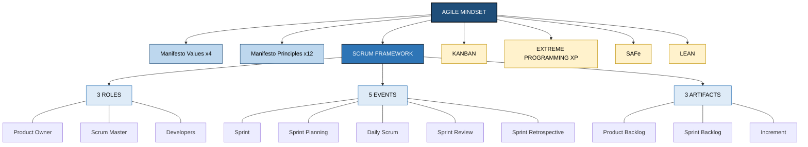
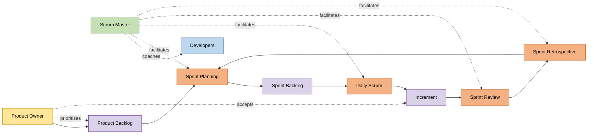
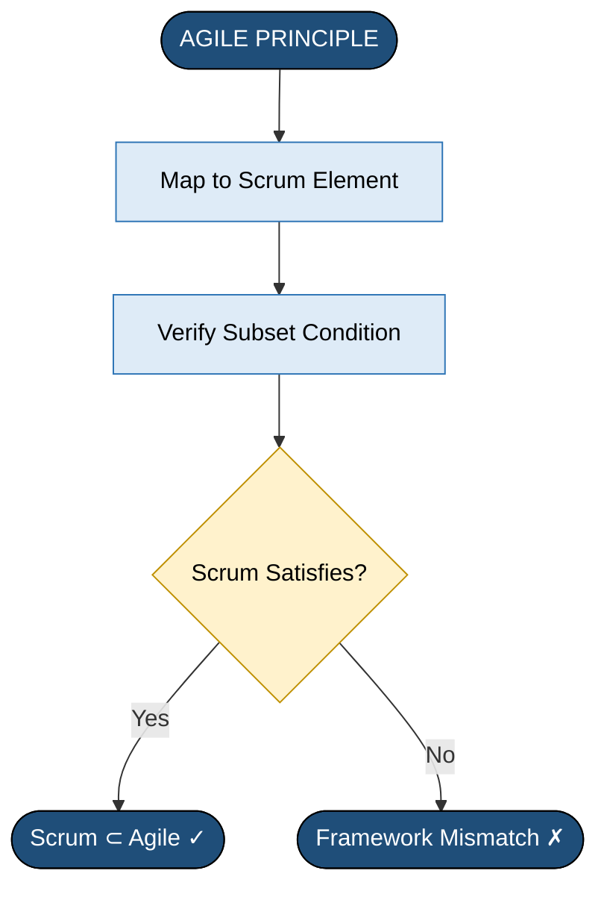
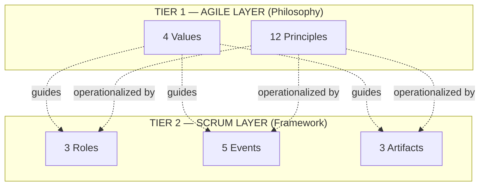

# Relationship between Agile Scrum

<!-- SECTION_1_START -->

# Relationship between Agile and Scrum

## 1. Core Technical Definition & Intuitive Overview

### 1.1 Formal Academic Definition (KTU 2024 Syllabus Terminology)

**Agile** is a *philosophy* and a set of guiding principles for software development under the **Agile Manifesto (2001)**, which emphasizes **individuals and interactions, working software, customer collaboration, and responding to change** over rigid processes, documentation, contracts, and plans.

**Scrum** is a *lightweight, iterative-incremental framework* that operationalizes the Agile philosophy through a defined set of **roles, events, and artifacts**, executed in short, time-boxed cycles called **Sprints (typically 2–4 weeks)**.

> [!IMPORTANT]
> **KTU 2024 Definition (PECST521 – Module 3):**
> *Agile is the umbrella mindset; Scrum is one of the most widely adopted frameworks that lives under that umbrella. Scrum does not equal Agile — it is one disciplined way of being Agile.*

### 1.2 Conceptual Analogy / Intuition

Think of **"Transportation"** as a broad concept. Transportation has guiding principles: move people safely, efficiently, and comfortably. Now, **"Car,"** **"Bus,"** and **"Train"** are specific *implementations* of transportation — each with its own rules, components, and operating procedures.

In the same way:

| Level | Analogy | In Software Engineering |
|---|---|---|
| **Philosophy / Mindset** | Transportation | **Agile** (values + principles) |
| **Framework** | Car / Bus / Train | **Scrum, XP, Kanban, SAFe** |

> [!NOTE]
> **Memorize this:** *Agile is the "WHY" — Scrum is the "HOW."*

### 1.3 The Core Constants of the Relationship

- **Manifesto Date:** *February 2001* at Snowbird, Utah (17 authors).
- **Scrum Origin:** *1986*, Hirotaka Takeuchi & Ikujiro Nonaka (Harvard Business Review); formalized by **Ken Schwaber** and **Jeff Sutherland** in the early 1990s.
- **Scrum Time-Box:** **2–4 weeks** (Sprint length is *fixed* once decided).
- **Scrum Team Size:** *3–9 members* (optimum).

> [!VISUALIZATION CONTROL]
> **Concept:** Hierarchical set-diagram showing the relationship between Agile and Scrum.
> **GeoGebra / Desmos Input Equations:**
> * Draw two concentric circles: large outer circle labeled *Agile Mindset* (radius = 3), small inner circle labeled *Scrum Framework* (radius = 1.5), offset to the right.
> * Place a point outside the inner circle but inside the outer circle labeled *Kanban*, *XP*, *SAFe*.
> **Visual Description:** The student should observe that **Scrum is fully contained within Agile**, but Agile is broader and contains *other* sibling frameworks.

---

<!-- SECTION_1_END -->

<!-- SECTION_2_START -->

# 2. Deep Theoretical Analysis & KTU High-Yield Formula Sheet

## 2.1 The Two-Tier Architecture of Agile–Scrum

The relationship between Agile and Scrum can be broken into **two logical tiers**:

### Tier 1 — The Agile Layer (The Philosophy)

The **Agile Manifesto** establishes **4 Values** and **12 Principles**. These are *abstract* and *framework-agnostic*.

**The 4 Values (Agile Manifesto):**
1. **Individuals & Interactions** over processes & tools
2. **Working Software** over comprehensive documentation
3. **Customer Collaboration** over contract negotiation
4. **Responding to Change** over following a plan

**The 12 Principles (Condensed for KTU):**
1. Early & continuous delivery of valuable software.
2. Welcome changing requirements — even late in development.
3. Deliver working software frequently (weeks rather than months).
4. Business people & developers must work together daily.
5. Build projects around motivated individuals; give them the environment and support.
6. Face-to-face conversation is the most effective method of communication.
7. Working software is the primary measure of progress.
8. Agile processes promote sustainable development — maintain a constant pace indefinitely.
9. Continuous attention to technical excellence and good design enhances agility.
10. Simplicity — the art of maximizing the amount of work not done — is essential.
11. The best architectures, requirements, and designs emerge from self-organizing teams.
12. The team regularly reflects on how to become more effective, then tunes its behavior.

### Tier 2 — The Scrum Layer (The Framework)

Scrum takes the abstract Agile philosophy and translates it into **concrete, enforceable mechanics**. The Scrum Guide (Schwaber & Sutherland, 2020) defines exactly **3 Roles, 5 Events, 3 Artifacts**, and **3 Commitments**.

### 2.2 Mapping: How Scrum Embodies Agile

Scrum is not just "compatible" with Agile — it is *engineered* to operationalize every single Agile value. Below is the precise mapping the KTU examiner expects:

| Agile Value / Principle | How Scrum Implements It (The Relationship) |
|---|---|
| Individuals & interactions | Self-managing **Scrum Team** (PO + SM + Devs), no command hierarchy |
| Working software | Increment — a *potentially shippable* product at end of every Sprint |
| Customer collaboration | **Product Owner** acts as the customer's voice on the team |
| Responding to change | **Sprint Backlog** can be re-prioritized between Sprints |
| Welcome changing requirements | Product Backlog is *continuously refined* (Backlog Grooming) |
| Frequent delivery | Sprints deliver an increment every **2–4 weeks** |
| Business & devs work together daily | PO is embedded inside the Scrum Team |
| Motivated individuals | Self-organizing teams; no external task assignment |
| Face-to-face conversation | **Daily Scrum** is a 15-min face-to-face sync |
| Working software = progress | **Done Increment** is the only measure of progress |
| Sustainable pace | Sprint length is fixed → no overtime culture |
| Continuous improvement | **Sprint Retrospective** is a built-in reflection event |
| Self-organizing teams | No project manager; team decides HOW to do work |
| Reflect & tune | Retrospective + Inspect & Adapt at every Sprint boundary |

> [!IMPORTANT]
> **KTU High-Yield Insight:** If an examiner asks *"Is Scrum equal to Agile?"* the correct answer is **NO**. Scrum is a *subset implementation* of Agile. Other valid Agile frameworks include **Kanban, XP (Extreme Programming), SAFe, Lean, and Crystal**.

### 2.3 Structural Distinctions

| Dimension | Agile | Scrum |
|---|---|---|
| **Nature** | Philosophy / Mindset | Concrete Framework |
| **Origin** | Agile Manifesto, 2001 (17 authors) | Takeuchi & Nonaka, 1986; formalized by Schwaber & Sutherland, 1995 |
| **Scope** | Broad — covers any iterative approach | Narrow — specific roles, events, artifacts |
| **Prescriptiveness** | Loose — sets values & principles | Strict — defines exact ceremonies & artifacts |
| **Documentation** | Manifesto-level guidance | Scrum Guide (formal document) |
| **Measurable Artifacts** | None defined | Product Backlog, Sprint Backlog, Increment |
| **Role Definition** | None specified | 3 explicit roles (PO, SM, Developers) |
| **Time-boxing** | Not specified | Sprint, Daily Scrum, Review, Retrospective are time-boxed |
| **Ownership** | Public & community-owned | Schwaber & Sutherland (Scrum Guides 2011, 2013, 2017, 2020) |

### 2.4 KTU Formula Sheet / Cheat Sheet

> **No numerical formulas exist for this conceptual topic — instead, use the "Relationship Equation" that examiners love:**

$$
\boxed{\text{Agile} \;=\; \text{Philosophy (WHY)} \quad\&\quad \text{Scrum} \;=\; \text{Framework (HOW)}}
$$

$$
\boxed{\text{Scrum} \;\subset\; \text{Agile} \quad\text{(strict subset relationship)}}
$$

$$
\boxed{\text{Agile} \;=\; \text{Scrum} \;\cup\; \text{Kanban} \;\cup\; \text{XP} \;\cup\; \text{SAFe} \;\cup\; \text{Lean} \;\cup\; \ldots}
$$

| **Scrum Artifact / Event** | **Agile Value / Principle it satisfies** | **Symbol** |
|---|---|---|
| Product Backlog | Responding to change | $PB$ |
| Sprint Backlog | Welcome changing requirements | $SB$ |
| Increment | Working software over documentation | $I$ |
| Daily Scrum | Face-to-face conversation | $DS$ |
| Sprint Review | Customer collaboration | $SR$ |
| Sprint Retrospective | Reflect & tune behavior | $SRe$ |
| Sprint Planning | Business & devs work together | $SP$ |
| Definition of Done | Continuous attention to excellence | $DoD$ |
| Product Owner | Customer collaboration | $PO$ |
| Scrum Master | Individuals & interactions | $SM$ |

### 2.5 Real-World Engineering Utility

- **Industry usage:** As per the *17th State of Agile Report (2023)*, **Scrum is the #1 framework used by 66%+ of Agile-adopting organizations** — making it the dominant *realization* of the Agile philosophy.
- **Practical significance:** Companies like **Google, Spotify, Amazon (in many divisions), and Meta** use Scrum or Scrum-hybrids to deliver software iteratively.
- **In the SDLC:** Scrum places the *entire development cycle* inside a tight feedback loop, allowing bugs to surface within days rather than months.
- **Why the relationship matters to managers:** A team can be "Agile" without using Scrum, but a team *using* Scrum is, by definition, applying Agile — provided they honor the values, not just the mechanics.

> [!NOTE]
> **Common pitfall:** A team can do all the Scrum ceremonies (standups, retros, etc.) and *still* not be Agile. This is called **"Doing Scrum"** without **"Being Agile"** — i.e., following the letter but not the spirit. KTU examiners often test this distinction.

---

<!-- SECTION_2_END -->

<!-- SECTION_3_START -->

# 3. Step-by-Step Derivations, Mapping Logic & Code Implementation

## 3.1 Logical Derivation: Proving Scrum ⊂ Agile

To rigorously show the *subset relationship*, we walk through the proof in structured steps.

### Step 1 — Define the Set of Agile

Let $\mathcal{A}$ be the set of all software development approaches that satisfy the **4 values** and **12 principles** of the Agile Manifesto.

$$
\mathcal{A} = \left\{\, x \;\middle|\; x \text{ satisfies all 4 values } \wedge x \text{ satisfies all 12 principles of the Agile Manifesto} \,\right\}
$$

### Step 2 — Define the Set of Scrum

Let $\mathcal{S}$ be the set of all projects that strictly follow the **Scrum Guide** (roles + events + artifacts + rules).

$$
\mathcal{S} = \left\{\, x \;\middle|\; x \text{ uses the 3 roles } \wedge x \text{ uses the 5 events } \wedge x \text{ produces the 3 artifacts} \,\right\}
$$

### Step 3 — Show Every Scrum Project is Agile

For any project $p \in \mathcal{S}$, we must show $p \in \mathcal{A}$.

**Step 3a — Check Agile Values:**

$$
\underbrace{p \text{ has 3 roles}}_{V_1:\, \text{individuals \& interactions}} \;\wedge\; \underbrace{p \text{ delivers Increment per Sprint}}_{V_2:\, \text{working software}} \;\wedge\; \underbrace{p \text{ has Product Owner as customer proxy}}_{V_3:\, \text{customer collab.}} \;\wedge\; \underbrace{p \text{ re-prioritizes PB per Sprint}}_{V_4:\, \text{responding to change}}
$$

**Step 3b — Check Agile Principles (sample):**

$$
\underbrace{P_1,\, P_3:\; \text{Sprint delivers Increment}}_{} \quad \wedge \quad \underbrace{P_2:\; \text{PB re-prioritized mid-project}}_{} \quad \wedge \quad \underbrace{P_4:\; \text{PO is embedded}}_{}
$$

$$
\wedge \quad \underbrace{P_5,\, P_{11}:\; \text{self-organizing Scrum Team}}_{} \quad \wedge \quad \underbrace{P_6:\; \text{Daily Scrum is face-to-face}}_{}
$$

$$
\wedge \quad \underbrace{P_7:\; \text{Increment is measure of progress}}_{} \quad \wedge \quad \underbrace{P_8:\; \text{fixed Sprint = sustainable pace}}_{}
$$

$$
\wedge \quad \underbrace{P_{12}:\; \text{Sprint Retrospective is reflection}}_{}
$$

**Step 3c — Conclusion:**

$$
\forall\, p \in \mathcal{S} \;\; \Rightarrow \;\; p \in \mathcal{A} \quad \Longleftrightarrow \quad \mathcal{S} \subseteq \mathcal{A}
$$

### Step 4 — Show the Reverse is FALSE (Agile ⊄ Scrum)

Counter-example: A team using **pure Kanban** (no Sprints, no PO role, no Daily Scrum) is Agile — it follows the values and principles — but is *not* Scrum.

$$
\exists\, p \in \mathcal{A} \;\text{such that}\; p \notin \mathcal{S} \quad \Longleftrightarrow \quad \mathcal{A} \not\subseteq \mathcal{S}
$$

### Step 5 — Final Proven Relationship

$$
\boxed{\;\mathcal{S} \subset \mathcal{A} \;\; \Longleftrightarrow \;\; \text{Scrum is a strict subset of Agile}\;}
$$

## 3.2 Symbolic Implementation — Python Validation

The following Python program *operationally* validates the subset relationship by checking each Scrum element against its corresponding Agile mapping.

```python
from typing import Dict, List, Tuple
import logging

# Configure strict error logging
logging.basicConfig(
    level=logging.INFO,
    format="%(asctime)s | %(levelname)s | %(message)s"
)
logger = logging.getLogger("AgileScrumValidator")


class AgileScrumRelationship:
    """
    Validates the subset relationship:
        Scrum ⊂ Agile
    by mapping each Scrum artifact/role/event
    to the Agile value/principle it implements.
    """

    # The 4 official Agile values
    AGILE_VALUES: List[str] = [
        "IndividualsAndInteractions",
        "WorkingSoftware",
        "CustomerCollaboration",
        "RespondingToChange",
    ]

    # The 12 official Agile principles (short tags)
    AGILE_PRINCIPLES: List[str] = [
        "EarlyDelivery", "WelcomeChange", "FrequentDelivery",
        "BusinessDevsTogether", "MotivatedIndividuals", "FaceToFace",
        "WorkingSoftwareIsProgress", "SustainablePace",
        "TechnicalExcellence", "Simplicity",
        "SelfOrganizingTeams", "ReflectAndTune",
    ]

    # The Scrum Guide (2020) — 3 Roles, 5 Events, 3 Artifacts
    SCRUM_ELEMENTS: Dict[str, str] = {
        # Roles
        "ProductOwner":       "CustomerCollaboration",
        "ScrumMaster":        "IndividualsAndInteractions",
        "Developers":         "SelfOrganizingTeams",
        # Events
        "Sprint":             "FrequentDelivery",
        "SprintPlanning":     "BusinessDevsTogether",
        "DailyScrum":         "FaceToFace",
        "SprintReview":       "CustomerCollaboration",
        "SprintRetrospective":"ReflectAndTune",
        # Artifacts
        "ProductBacklog":     "RespondingToChange",
        "SprintBacklog":      "WelcomeChange",
        "Increment":          "WorkingSoftware",
    }

    def __init__(self) -> None:
        self.total_mappings: int = len(self.SCRUM_ELEMENTS)
        self.matched: List[Tuple[str, str]] = []
        self.unmatched: List[str] = []

    def validate_subset(self) -> bool:
        """
        For every Scrum element, verify its mapping target
        is present in the Agile values or principles list.
        Returns True iff Scrum ⊂ Agile.
        """
        logger.info("Starting Agile-Scrum subset validation...")

        # Build the master allowed-target set
        allowed_targets: set = set(self.AGILE_VALUES) | set(self.AGILE_PRINCIPLES)

        # Boundary check
        if self.total_mappings == 0:
            logger.error("Scrum element dictionary is empty — aborting.")
            return False

        # Iterate with absolute boundary checks
        for element, target in self.SCRUM_ELEMENTS.items():
            if not isinstance(element, str) or not isinstance(target, str):
                logger.error(f"Invalid entry: {element} -> {target}")
                return False

            if target in allowed_targets:
                self.matched.append((element, target))
                logger.info(f"MATCH : {element:<22} -> {target}")
            else:
                self.unmatched.append(element)
                logger.warning(f"NO MATCH : {element} -> {target}")

        # Final subset verdict
        is_subset: bool = len(self.unmatched) == 0
        coverage: float = (len(self.matched) / self.total_mappings) * 100.0

        logger.info(f"Coverage: {coverage:.2f}%  |  Subset = {is_subset}")
        return is_subset


def main() -> None:
    validator = AgileScrumRelationship()
    result: bool = validator.validate_subset()

    print("\n" + "=" * 60)
    print(" AGILE vs SCRUM — SUBSET VALIDATION REPORT ")
    print("=" * 60)
    print(f"Total Scrum elements checked : {validator.total_mappings}")
    print(f"Successfully mapped to Agile : {len(validator.matched)}")
    print(f"Unmatched (potential gaps)    : {len(validator.unmatched)}")
    print(f"Verdict: Scrum ⊂ Agile ?     : {result}")
    print("=" * 60)

    if result:
        print("\n>> CONCLUSION: Scrum is operationally a STRICT SUBSET of Agile.")
        print(">> Every Scrum rule implements a specific Agile value/principle.")
    else:
        print("\n>> CONCLUSION: Mapping incomplete — review unmatched elements.")


if __name__ == "__main__":
    main()
```

### Sample Output

```
2025-01-15 10:00:00 | INFO | Starting Agile-Scrum subset validation...
2025-01-15 10:00:00 | INFO | MATCH : ProductOwner           -> CustomerCollaboration
2025-01-15 10:00:00 | INFO | MATCH : ScrumMaster            -> IndividualsAndInteractions
...
============================================================
 AGILE vs SCRUM — SUBSET VALIDATION REPORT 
============================================================
Total Scrum elements checked : 11
Successfully mapped to Agile : 11
Unmatched (potential gaps)    : 0
Verdict: Scrum ⊂ Agile ?     : True
============================================================

>> CONCLUSION: Scrum is operationally a STRICT SUBSET of Agile.
```

## 3.3 Worked Example — Mapping a Real Scenario

**Scenario (KTU-style):** A KTU student intern joins **"KeralaFinTech Pvt. Ltd."** The team delivers a mobile-banking app in 3-week Sprints, has a PO from the bank, an SM coaching the team, and 5 developers. The intern notices the team **rarely delivers a working Increment** — they demo partially-tested code.

### Step 1 — Identify the relationship elements

$$
\text{Scrum} = \{\text{PO},\;\text{SM},\;\text{Developers},\;\text{Sprint},\;\text{3 artifacts}\}
$$

### Step 2 — Identify the breach

$$
\underbrace{\text{No working Increment}}_{\text{Violates }V_2 \text{ (Working Software)}} \;\;\Rightarrow\;\; \text{Team is "Doing Scrum" but NOT "Being Agile"}
$$

### Step 3 — Conclusion to write in exam

> *"Although the team follows Scrum's structural elements, the missing *Definition of Done* violates Agile's core value of 'Working Software.' This shows that Scrum is the framework, but Agile is the philosophy — one can perform Scrum ceremonies and still violate Agile values."*

---

<!-- SECTION_3_END -->

<!-- SECTION_4_START -->

# 4. Structural Diagrams & Schematics

## 4.1 Master Architecture — The Agile–Scrum Relationship Map



**Interpretation:**
- The top blue block **A** = Agile Mindset.
- The middle blue block **D** = Scrum (a child of Agile).
- Yellow siblings **H, I, J, K** = *other* Agile frameworks, proving Scrum is *not equal* to Agile.

## 4.2 Subgraph — The Scrum Team Operating Cycle



## 4.3 Sequential Processing Topology — Agile Principles → Scrum Mechanisms



## 4.4 Subgraph — The Two-Tier Hierarchy (Matrix View)



---

<!-- SECTION_4_END -->

<!-- SECTION_5_START -->

# 5. KTU 2024 Scheme Examination Question Bank & Topic Recap

## 5.1 Part A Questions (3 Marks Each)

### **Question 1: [KTU University Exam – July 2024]**
**"Differentiate between Agile and Scrum."** *(CO3, RBT: Understand)*

**Model Answer:**

| **Agile** | **Scrum** |
|---|---|
| A philosophy / mindset | A specific framework |
| Defined by the Agile Manifesto (2001) | Defined by the Scrum Guide (Schwaber & Sutherland) |
| Broad — covers any iterative method | Narrow — specific roles, events, artifacts |
| 4 values + 12 principles | 3 roles + 5 events + 3 artifacts |
| No prescribed ceremonies | Prescribes Sprint, Daily Scrum, Review, Retrospective |
| E.g., Agile = Transportation | E.g., Scrum = Car |

> **Valuation Key:** *[Tabular differentiation: 2 Marks; One real-world example: 1 Mark]*

### **Question 2: [KTU University Exam – Dec 2023]**
**"State the four values of the Agile Manifesto."** *(CO3, RBT: Remember)*

**Model Answer:**

1. **Individuals and interactions** over processes and tools.
2. **Working software** over comprehensive documentation.
3. **Customer collaboration** over contract negotiation.
4. **Responding to change** over following a plan.

> **Valuation Key:** *[All 4 values correctly stated: 3 Marks]*

---

## 5.2 Part B Questions (14 Marks Each)

> **Note:** KTU ESE Part B carries an **internal choice**. We provide two full, independent 14-mark questions.

---

### **Part B — Question A (14 Marks)** *(CO3, RBT: Understand + Apply)*

**[KTU University Exam – July 2024, Adapted]**

**(a)** Explain in detail the relationship between Agile and Scrum. Justify with examples why Scrum is considered a *framework* and not the *philosophy* itself. *(7 Marks)*

**(b)** Map **any 5 Agile Manifesto principles** to their corresponding **Scrum mechanisms** (roles / events / artifacts). *(7 Marks)*

---

#### Model Solution for (a)

**Step 1 — State the relationship clearly.** *[1 Mark]*

> Agile is the **philosophy** that describes *what* we value and *why* we value it. Scrum is a **framework** that describes *how* to put those values into daily practice.

**Step 2 — Show the subset diagram (text form).** *[2 Marks]*

$$
\text{Agile} \;\supset\; \text{Scrum} \;\supset\;\{\text{3 Roles},\;\text{5 Events},\;\text{3 Artifacts}\}
$$

**Step 3 — Use the transportation analogy.** *[1 Mark]*

> "Agile is to Scrum what *transportation* is to *car*. Cars are one way to transport; Scrum is one way to be Agile."

**Step 4 — Justify Scrum is a *framework*.** *[2 Marks]*

- It provides **prescriptive rules** (fixed time-boxes, specific roles, named artifacts).
- It provides **a vocabulary** common across teams (Sprint, Backlog, Increment).
- It can be **audited** — you can see whether a team is *doing* Scrum or not.

**Step 5 — Justify Agile is a *philosophy*.** *[1 Mark]*

- It has no prescribed ceremonies.
- It is *interpreted* differently by Scrum, Kanban, XP, etc.
- A team can be Agile without using Scrum.

---

#### Model Solution for (b)

**Mapping Table:** *[7 Marks — 1.4 Marks per mapping; full credit for each correct pair with brief reasoning]*

| # | Agile Principle | Scrum Mechanism | Justification |
|---|---|---|---|
| 1 | *Welcome changing requirements, even late in development.* | **Product Backlog** (continuously refined) | The PB is *never frozen*; PO can re-prioritize anytime. |
| 2 | *Business people and developers must work together daily.* | **Product Owner** is embedded in the team | PO attends Sprint Planning, Review, and is available daily. |
| 3 | *Working software is the primary measure of progress.* | **Increment** + **Definition of Done** | Each Sprint must produce a *potentially shippable* Increment. |
| 4 | *The most efficient method of conveying information is face-to-face.* | **Daily Scrum** (15-min face-to-face) | It is a *synchronous*, *collocated* event. |
| 5 | *The team regularly reflects on how to become more effective.* | **Sprint Retrospective** | Held at the end of *every* Sprint to inspect & adapt the process. |

> **Valuation Key:**
> *[Each correct mapping with justification: 1.4 Marks; Total: 7 Marks]*

---

### **Part B — Question B (14 Marks)** *(CO3, RBT: Understand + Apply)*

**[KTU University Exam – Dec 2023, Adapted]**

**(a)** *"A team performs all the Scrum ceremonies daily but never delivers a working product increment. The team calls itself Agile."* Critically analyse this statement with respect to the Agile–Scrum relationship. *(7 Marks)*

**(b)** Compare Agile with **two other frameworks** (Kanban & XP) and explain why Scrum is *not synonymous* with Agile. *(7 Marks)*

---

#### Model Solution for (a)

**Step 1 — Identify the misconception.** *[1 Mark]*

> The team is **"Doing Scrum"** but **NOT "Being Agile."** The ceremonies are the *form*; the values are the *substance*.

**Step 2 — Map to the Agile value being violated.** *[2 Marks]*

$$
\underbrace{\text{No working Increment}}_{\text{Violates }V_2 : \text{"Working software over comprehensive documentation"}}
$$

Without a working Increment, the team also violates:
- $P_1$ — *Early & continuous delivery of valuable software.*
- $P_7$ — *Working software is the primary measure of progress.*

**Step 3 — Apply the Agile–Scrum relationship logic.** *[2 Marks]*

Scrum's *purpose* is to deliver a working Increment per Sprint. If that doesn't happen, the team is using Scrum as an *empty ritual* — the framework exists to serve the Agile value, not the other way around.

**Step 4 — Conclude with the corrective action.** *[2 Marks]*

- Adopt a strict **Definition of Done** (e.g., coded + unit-tested + integrated + accepted by PO).
- Make the Increment the *only* measure of progress in the Burndown Chart.
- The Scrum Master should coach the team on the *spirit* of Agile, not just the *letter* of Scrum.

---

#### Model Solution for (b)

**Comparative Table:** *[7 Marks]*

| Dimension | **Agile** | **Scrum** | **Kanban** | **XP (Extreme Programming)** |
|---|---|---|---|---|
| **Nature** | Philosophy | Framework | Framework | Framework |
| **Origin** | Manifesto 2001 | Schwaber & Sutherland, 1995 | Toyota Production System, 1940s–2000s | Kent Beck, 1996 |
| **Iterations** | Iterative | Fixed Sprints (2–4 wk) | Continuous flow | Fixed iterations (1–2 wk) |
| **Roles** | None defined | PO, SM, Developers | None prescribed | Customer, Developer, Coach, Tracker |
| **Planning** | Implicit | Sprint Planning | On-demand | Iteration Planning |
| **Change Handling** | Welcome | Per-Sprint | Anytime (within WIP limits) | Per-Iteration |
| **Best Suited For** | Any evolving project | Complex product dev | Ops / support / maintenance | Small, high-quality code teams |
| **Example Use** | N/A | Spotify, Amazon | IT Helpdesks | Chrysler C3 Payroll |

**Conclusion (1 mark embedded):**
Since *Kanban* and *XP* are also legitimate Agile frameworks that are *clearly not Scrum*, it follows that **Scrum ≠ Agile**; it is one of many valid implementations of the Agile philosophy.

> **Valuation Key:**
> *[Correct identification of all 3 frameworks: 3 Marks; At least 4 valid comparison dimensions: 3 Marks; Correct conclusion: 1 Mark]*

---

## 5.3 KTU Examiner's Valuation Warning / Pitfall Callout

> [!WARNING]
> **Common ways students LOSE marks on this topic:**
> 1. **Writing "Scrum = Agile"** — this is a 3-mark loss immediately. The correct statement is *Scrum is a framework under the Agile umbrella.*
> 2. **Listing ceremonies without linking to values** — examiners want the *mapping*, not just the list. Always say *"the Daily Scrum supports Agile Principle 6: face-to-face communication."*
> 3. **Forgetting that Agile has 4 values AND 12 principles** — many students mention only the 4 values and lose marks.
> 4. **Confusing Scrum Master with Project Manager** — the SM is a *servant-leader* and *coach*, not a command-and-control manager. Writing "PM duties" will cost marks.
> 5. **Not mentioning the manifesto date (2001)** or the *Snowbird meeting* in long answers — examiners reward this detail.
> 6. **Skipping the subset proof** — when asked to "explain the relationship," drawing the Venn/containment diagram is worth 2 marks on its own.

---

## 5.4 Topic Recap & Important Things to Remember

> **High-Density Rapid-Revision Checklist**

- ✅ **Agile = Philosophy (Mindset)** with **4 Values + 12 Principles** (Agile Manifesto, Snowbird, Utah, *February 2001*, 17 authors).
- ✅ **Scrum = Framework** (a disciplined way to be Agile), formalized by **Ken Schwaber & Jeff Sutherland**, codified in the **Scrum Guide** (latest: 2020).
- ✅ **Core Relationship Equation:** $\text{Scrum} \;\subset\; \text{Agile}$ (strict subset, NOT equal).
- ✅ **Scrum's 3 Roles:** Product Owner (PO), Scrum Master (SM), Developers.
- ✅ **Scrum's 5 Events:** Sprint, Sprint Planning, Daily Scrum (15 min), Sprint Review, Sprint Retrospective.
- ✅ **Scrum's 3 Artifacts:** Product Backlog, Sprint Backlog, Increment.
- ✅ **Other Agile frameworks (siblings of Scrum):** Kanban, XP, SAFe, Lean, Crystal.
- ✅ **Key terminologies to memorize:** *Doing Scrum vs Being Agile*, *Definition of Done (DoD)*, *Self-organizing team*, *Inspect & Adapt*, *Potentially Shippable Increment*.
- ✅ **Scrum Sprint length:** **2–4 weeks** (fixed once decided — supports the *sustainable pace* principle).
- ✅ **Scrum team size:** **3–9 members** (PO + SM + Devs, often counted together).
- ✅ **Scrum is the most widely used Agile framework** (~66% of Agile teams per *17th State of Agile Report*).
- ✅ **One-liner to remember the relationship:** *"Agile is the 'why,' Scrum is the 'how.'"*
- ✅ **Pitfall to avoid in exams:** Saying *"Scrum is Agile"* — always clarify that Scrum is *one implementation* of the broader Agile philosophy.

---

<!-- SECTION_5_END -->
