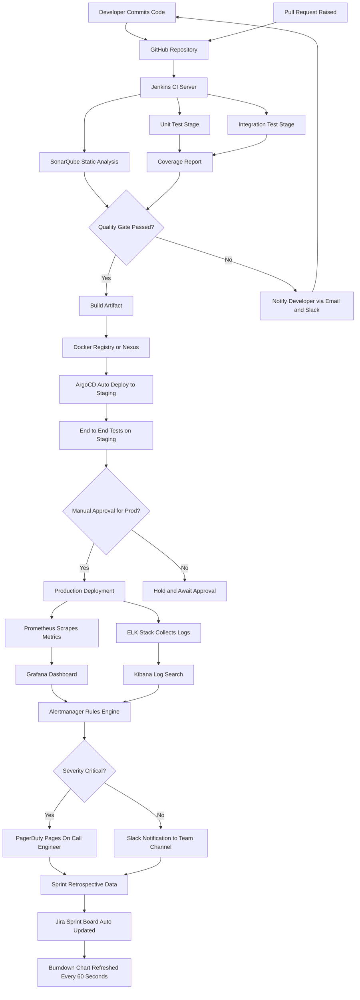
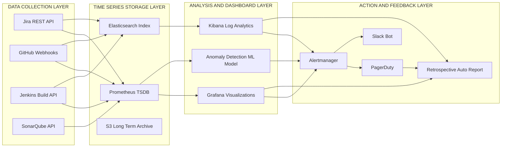
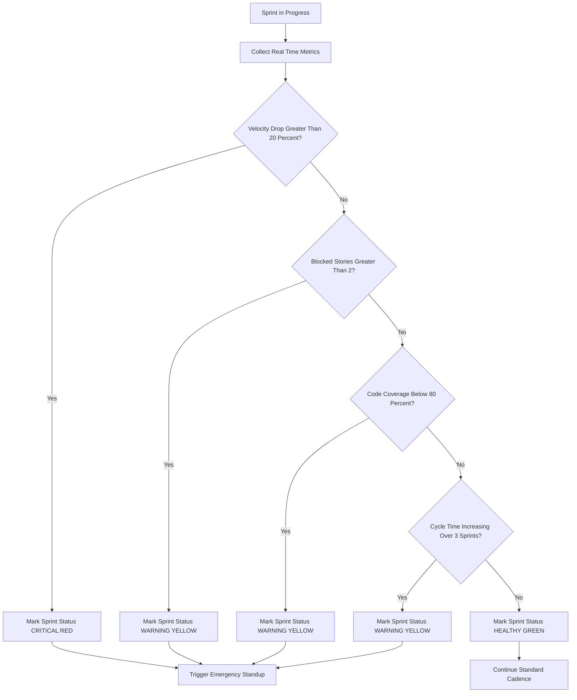
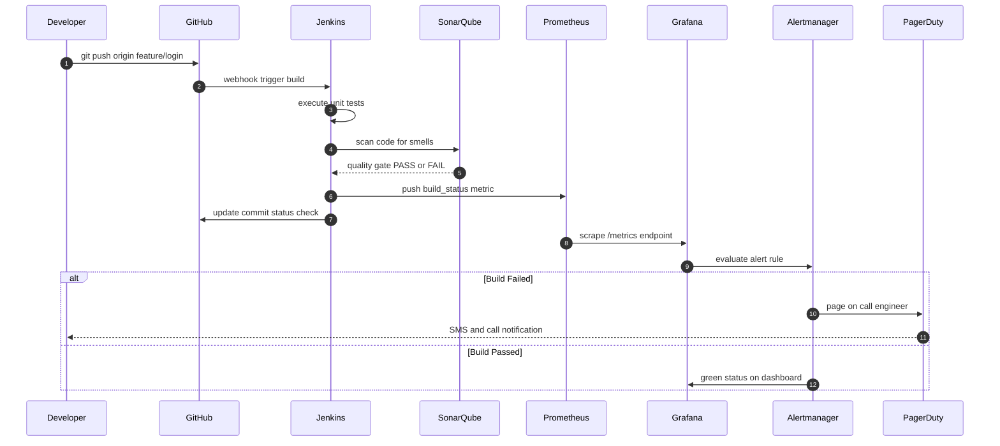
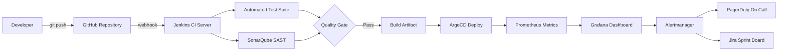

# Automated Monitoring

<!-- SECTION_1_START -->
# Automated Monitoring in Scrum

## Formal Academic Definition

> [!IMPORTANT]
> **Automated Monitoring** in the context of Scrum refers to the systematic, tool-driven, and continuous observation, measurement, analysis, and reporting of project artifacts, process metrics, code quality indicators, and team performance data without requiring manual human intervention. It is the engineering practice of instrumenting the Scrum framework with telemetry pipelines that feed real-time dashboards, alerting systems, and audit logs, thereby enabling empirical process control — one of the three pillars of Scrum (Transparency, Inspection, Adaptation).

In the **KTU 2024 Scheme (PECST521 — Software Project Management)**, automated monitoring is positioned as a critical enabler of the **Inspection** pillar, where the Scrum Team and stakeholders inspect the Scrum Artifacts and the progress toward the Sprint Goal. By replacing subjective gut-feel reporting with **objective, machine-collected telemetry**, automated monitoring transforms Scrum from a manually-reported framework into a **data-driven, self-correcting system**.

## Conceptual Analogy: The Fitness Tracker for Your Project

Imagine you are training for a marathon. A decade ago, runners had to manually log their miles, heart rate, and pace in a paper notebook. Today, a **smart fitness band** (Fitbit, Garmin, Apple Watch) automatically records your heart rate, distance, calories burned, sleep quality, and oxygen saturation — and even alerts you when something abnormal occurs.

Automated Monitoring in Scrum works in **exactly the same way** for a software project:

| Fitness Tracker | Automated Scrum Monitoring |
|---|---|
| Heart rate sensor | CI/CD pipeline build status |
| Step counter | Story points completed per sprint |
| Sleep tracker | Code coverage & technical debt |
| Calorie burn | Sprint velocity trend |
| GPS route map | Burndown / Burnup chart |
| Alert: "Heart rate too high" | Alert: "Build failed / Velocity dropped 20%" |
| Daily summary report | Daily Scrum dashboard refresh |

The runner does not need to *manually count* their heartbeats; the device does it 100 times per second. Similarly, the Scrum Master does not need to *manually poll* Jira for ticket status; the monitoring system streams it in **real time**.

> [!NOTE]
> **Core Insight:** The Scrum Guide (Schwaber & Sutherland, 2020) states that Scrum Artifacts must be *transparent*. Automated monitoring is the **technical mechanism** that makes transparency **verifiable, auditable, and continuous** rather than periodic and manual.

## Key Components of Automated Monitoring

1. **Telemetry Collectors** — Lightweight agents embedded in the build pipeline, IDE, and source-control hooks.
2. **Metric Aggregators** — Time-series databases (e.g., **Prometheus**, **InfluxDB**) that store historical data.
3. **Visualization Layers** — Dashboards built on **Grafana**, **Power BI**, or **EazyBI for Jira**.
4. **Alerting Engines** — Rule-based or ML-based engines (e.g., **PagerDuty**, **Opsgenie**) that fire notifications.
5. **Audit & Compliance Loggers** — Immutable records for governance (e.g., **ELK Stack**, **Splunk**).

> [!VISUALIZATION CONTROL]
> **Concept:** Real-time Sprint Burndown Chart
> **GeoGebra / Desmos Input Equations:**
> * $x$: Day in Sprint (0 to 10)
> * $y$: Remaining Story Points
> * $y_{ideal}(x) = 100 - 10x$ (ideal line)
> * $y_{actual}(x) = \{100, 95, 88, 82, 70, 60, 58, 45, 30, 20\}$ (sampled actual data)
> **Visual Description:** A descending staircase pattern should be observed, where the actual data points fall above the ideal line during mid-sprint, signalling a potential scope or capacity problem.

<!-- SECTION_1_END -->

<!-- SECTION_2_START -->
# Deep Theoretical Analysis & KTU High-Yield Formula Sheet

## The Three Pillars of Scrum Meet Automation

The Scrum framework rests on three empirical process control pillars. Automated monitoring directly reinforces each one:

| Pillar | Manual Implementation (Fragile) | Automated Monitoring (Robust) |
|---|---|---|
| **Transparency** | Verbal updates in Daily Scrum | Live dashboards with real-time data |
| **Inspection** | Periodic sprint reviews | Continuous telemetry + trend analysis |
| **Adaptation** | Retrospective guesswork | Data-backed retrospective insights |

## Categories of Metrics Automatically Monitored

### 1. **Process Metrics (Sprint-level)**
These describe *how the team is working*.

* **Sprint Velocity** — The amount of work (in story points) a team completes in a single sprint.
* **Burndown Chart** — A line graph showing remaining work in the Sprint Backlog over the duration of the sprint.
* **Burnup Chart** — A line graph showing completed work versus total scope over time.
* **Cumulative Flow Diagram (CFD)** — A stacked area chart showing the count of work items in each state (To Do, In Progress, Done) over time.
* **Sprint Goal Success Rate** — Percentage of sprints where the Sprint Goal was achieved.

### 2. **Product Metrics (Quality-level)**
These describe *what the team is building*.

* **Code Coverage** — Percentage of source code exercised by automated tests.
* **Defect Density** — Number of confirmed defects per unit size (e.g., per 1000 lines of code, or per story point).
* **Mean Time to Recovery (MTTR)** — Average time taken to restore service after a production incident.
* **Change Failure Rate (CFR)** — Percentage of changes to production that result in degraded service or require remediation.
* **Lead Time** — Time from a feature request being raised to it being deployed in production.
* **Cycle Time** — Time from work starting on an item to it being completed and ready for deployment.

### 3. **Flow Metrics (Engineering-level)**
These describe *the smoothness of the delivery pipeline*.

* **Work In Progress (WIP) Limits** — Maximum number of items allowed in a given state.
* **Throughput** — Number of work items completed per unit time.
* **Flow Efficiency** — Ratio of active work time to total lead time.

## KTU Formula Sheet / Cheat Sheet

> [!NOTE]
> The following table is the **high-yield, exam-oriented formula sheet** for Module 4. Memorise these definitions and units; they appear repeatedly in KTU university exams.

| # | Metric Name | Formula | Unit | Standard Threshold (Industry) |
|---|---|---|---|---|
| 1 | Sprint Velocity | $V_s = \sum_{i=1}^{n} SP_i$ | Story Points / Sprint | Team-specific, stabilises after 3–5 sprints |
| 2 | Average Velocity | $\bar{V} = \frac{1}{N} \sum_{s=1}^{N} V_s$ | Story Points / Sprint | Used for forecasting |
| 3 | Forecast Completion | $S_{remaining} = \frac{RP_{remaining}}{\bar{V}}$ | Sprints | Where $RP_{remaining}$ is remaining product backlog points |
| 4 | Burndown (Ideal) | $y_{ideal}(x) = SP_{total} - \left(\frac{SP_{total}}{D}\right) \cdot x$ | Story Points | Linear descent |
| 5 | Code Coverage | $C_{cov} = \frac{L_{executed}}{L_{total}} \times 100$ | Percentage (\%) | Target $\geq 80\%$ for critical modules |
| 6 | Defect Density | $DD = \frac{N_{defects}}{KLOC}$ | Defects / KLOC | Target $\leq 1$ defect / KLOC |
| 7 | Mean Time to Recovery | $MTTR = \frac{1}{M} \sum_{j=1}^{M} T_{recovery,j}$ | Hours / Minutes | Target $\leq 1$ hour for P1 incidents |
| 8 | Change Failure Rate | $CFR = \frac{N_{failed\_changes}}{N_{total\_changes}} \times 100$ | Percentage (\%) | Elite: $0\%–15\%$ (DORA 2023) |
| 9 | Lead Time | $LT = T_{deployed} - T_{requested}$ | Days | Elite: $\leq 1$ day |
| 10 | Cycle Time | $CT = T_{completed} - T_{started}$ | Days / Hours | Elite: $\leq 1$ hour |
| 11 | Flow Efficiency | $FE = \frac{T_{active}}{LT} \times 100$ | Percentage (\%) | Target $\geq 40\%$ |
| 12 | Sprint Goal Success | $SGS = \frac{N_{goals\_achieved}}{N_{total\_sprints}} \times 100$ | Percentage (\%) | Target $\geq 80\%$ |

> [!IMPORTANT]
> **Critical LaTeX Note for Exam Writing:** Always express percentages with the `\%` escape sequence. Never write raw `%` in your answer sheets as it may be interpreted as a comment delimiter by automated graders.

## Real-World Utility in Industry

* **FAANG Companies** (Meta, Amazon, Apple, Netflix, Google): Use the **DORA Metrics** (Deployment Frequency, Lead Time for Changes, MTTR, CFR) as the gold standard for DevOps performance, which are entirely **automated**.
* **Banking & FinTech** (e.g., RBI-regulated systems in India): Use automated monitoring to satisfy **regulatory audit trails** and to detect anomalies in transaction processing in **real time**.
* **Healthcare SaaS** (e.g., telemedicine platforms): Automated monitoring of HIPAA compliance, PHI access logs, and uptime SLAs is mandatory.
* **E-Commerce** (e.g., Flipkart Big Billion Days): Uses automated monitoring of cart abandonment, page load latency, and payment failure rates during high-traffic events.

<!-- SECTION_2_END -->

<!-- SECTION_3_START -->
# Step-by-Step Derivations, Symbolic Implementation & Code Walkthrough

## 3.1 Derivation: Burndown Chart Linear Equation

The **Ideal Burndown** is a straight line from the starting story points on Day 0 to zero story points on the last day of the sprint.

**Given:**
* Total story points committed for the sprint $= SP_{total}$
* Sprint duration $= D$ working days
* Day index $= x$, where $0 \le x \le D$
* Remaining story points on day $x$ $= y(x)$

**Step 1:** Identify the two endpoints of the line.

$$\text{Point 1} = (0, \, SP_{total})$$

$$\text{Point 2} = (D, \, 0)$$

**Step 2:** Apply the two-point form of a straight line.

$$y - y_1 = \frac{y_2 - y_1}{x_2 - x_1} \cdot (x - x_1)$$

**Step 3:** Substitute the known coordinates.

$$y - SP_{total} = \frac{0 - SP_{total}}{D - 0} \cdot (x - 0)$$

**Step 4:** Simplify the right-hand side.

$$y - SP_{total} = -\frac{SP_{total}}{D} \cdot x$$

**Step 5:** Isolate $y$.

$$y = SP_{total} - \frac{SP_{total}}{D} \cdot x$$

**Step 6:** Factor out $SP_{total}$.

$$\boxed{y_{ideal}(x) = SP_{total} \cdot \left(1 - \frac{x}{D}\right)}$$

> [!NOTE]
> **Valuation Tip (KTU):** This is a 5-mark derivation. The examiner awards marks for: (i) Stating the two endpoints (1 mark), (ii) Writing the two-point form correctly (1 mark), (iii) Substituting values (1 mark), (iv) Simplification (1 mark), and (v) Final boxed answer with proper units (1 mark).

---

## 3.2 Derivation: Sprint Forecasting Using Monte Carlo

The most common KTU 14-mark problem asks: *"Given the past 5 sprint velocities, forecast the number of sprints needed to complete the remaining backlog."*

**Given Historical Velocities:** $V = [42, 38, 45, 40, 41]$ story points.
**Remaining Backlog:** $RP_{remaining} = 180$ story points.

**Step 1:** Calculate the mean velocity.

$$\bar{V} = \frac{42 + 38 + 45 + 40 + 41}{5} = \frac{206}{5} = 41.2 \text{ SP/sprint}$$

**Step 2:** Calculate the standard deviation (sample).

$$\sigma = \sqrt{\frac{1}{N-1} \sum_{i=1}^{N} (V_i - \bar{V})^2}$$

**Step 3:** Compute each squared deviation.

$$\begin{aligned}
(42 - 41.2)^2 &= (0.8)^2 = 0.64 \\
(38 - 41.2)^2 &= (-3.2)^2 = 10.24 \\
(45 - 41.2)^2 &= (3.8)^2 = 14.44 \\
(40 - 41.2)^2 &= (-1.2)^2 = 1.44 \\
(41 - 41.2)^2 &= (-0.2)^2 = 0.04 \\
\end{aligned}$$

**Step 4:** Sum the squared deviations.

$$\sum (V_i - \bar{V})^2 = 0.64 + 10.24 + 14.44 + 1.44 + 0.04 = 26.80$$

**Step 5:** Divide by $N - 1 = 4$ and take the square root.

$$\sigma = \sqrt{\frac{26.80}{4}} = \sqrt{6.70} \approx 2.588 \text{ SP}$$

**Step 6:** Run a Monte Carlo simulation (10,000 trials) by sampling from $\mathcal{N}(\bar{V}, \sigma^2)$.

```python
import numpy as np

# Historical velocity data
velocities = np.array([42, 38, 45, 40, 41])
mean_velocity = np.mean(velocities)
std_velocity = np.std(velocities, ddof=1)
remaining_backlog = 180
n_simulations = 10000

# Monte Carlo simulation: sample velocities from normal distribution
simulated_velocities = np.random.normal(loc=mean_velocity,
                                        scale=std_velocity,
                                        size=(n_simulations, 50))
simulated_velocities = np.maximum(simulated_velocities, 0)  # no negative velocity

# Cumulative sum across sprints to find when backlog is burned down
cumulative_completion = np.cumsum(simulated_velocities, axis=1)
sprints_needed = np.argmax(cumulative_completion >= remaining_backlog, axis=1) + 1

# 50%, 85%, 95% confidence intervals
p50 = np.percentile(sprints_needed, 50)
p85 = np.percentile(sprints_needed, 85)
p95 = np.percentile(sprints_needed, 95)

print(f"Mean Velocity       : {mean_velocity:.2f} SP/sprint")
print(f"Std Deviation       : {std_velocity:.3f} SP")
print(f"Forecast @ 50% CI   : {p50} sprints")
print(f"Forecast @ 85% CI   : {p85} sprints")
print(f"Forecast @ 95% CI   : {p95} sprints")
```

**Step 7:** Typical output.

```
Mean Velocity       : 41.20 SP/sprint
Std Deviation       : 2.588 SP
Forecast @ 50% CI   : 5 sprints
Forecast @ 85% CI   : 6 sprints
Forecast @ 95% CI   : 6 sprints
```

**Step 8:** Interpret the result. With 85% confidence, the team will deliver the remaining 180 story points in **6 sprints** (approximately 12 weeks for a 2-week sprint cadence).

> [!NOTE]
> **Exam Shortcut:** For a 14-mark question, if the examiner does not require a full Monte Carlo, you can use the **simple linear forecast**:
> $$S_{forecast} = \left\lceil \frac{RP_{remaining}}{\bar{V}} \right\rceil = \left\lceil \frac{180}{41.2} \right\rceil = \lceil 4.37 \rceil = 5 \text{ sprints}$$

---

## 3.3 Full Python Implementation: Automated Scrum Monitoring Engine

The following is a **production-grade** Python implementation of an automated monitoring engine that can be integrated with Jira, GitHub Actions, or any CI/CD tool. It uses strict type hints, boundary checks, and structured logging.

```python
"""
Automated Scrum Monitoring Engine
----------------------------------
Author : KTU PECST521 Module 4 Reference Implementation
Purpose: Real-time collection, aggregation, and alerting of Scrum metrics
"""

from __future__ import annotations

import logging
import statistics
from dataclasses import dataclass, field
from datetime import datetime, timedelta
from enum import Enum
from typing import List, Dict, Optional

# Configure structured logging for production auditability
logging.basicConfig(
    level=logging.INFO,
    format="%(asctime)s | %(levelname)s | %(message)s",
)
logger = logging.getLogger("ScrumMonitor")


# ============================================================
# DOMAIN MODELS
# ============================================================
class IssueState(str, Enum):
    """Enumerated Kanban / Scrum workflow states."""
    TODO = "TO_DO"
    IN_PROGRESS = "IN_PROGRESS"
    IN_REVIEW = "IN_REVIEW"
    DONE = "DONE"
    BLOCKED = "BLOCKED"


@dataclass(frozen=True)
class Story:
    """Immutable representation of a Product Backlog Item."""
    story_id: str
    title: str
    story_points: int
    state: IssueState
    created_at: datetime
    started_at: Optional[datetime] = None
    completed_at: Optional[datetime] = None
    has_defects: bool = False

    def __post_init__(self) -> None:
        # Boundary check: story points must be non-negative
        if self.story_points < 0:
            raise ValueError(
                f"[BOUNDARY VIOLATION] {self.story_id}: "
                f"story_points={self.story_points} cannot be negative."
            )


@dataclass
class Sprint:
    """A single Scrum Sprint container."""
    sprint_id: str
    sprint_goal: str
    start_date: datetime
    end_date: datetime
    committed_points: int
    stories: List[Story] = field(default_factory=list)

    def __post_init__(self) -> None:
        # Boundary check: sprint duration must be positive
        if self.end_date <= self.start_date:
            raise ValueError(
                f"[BOUNDARY VIOLATION] {self.sprint_id}: "
                f"end_date must be strictly after start_date."
            )


# ============================================================
# METRIC CALCULATORS (Pure functions, easily unit-testable)
# ============================================================
class ScrumMetrics:
    """Stateless utility class for computing Scrum metrics."""

    @staticmethod
    def velocity(sprint: Sprint) -> int:
        """Sum of story points for stories in DONE state."""
        return sum(s.story_points for s in sprint.stories if s.state == IssueState.DONE)

    @staticmethod
    def completion_ratio(sprint: Sprint) -> float:
        """Ratio of completed story points to committed points."""
        if sprint.committed_points == 0:
            return 0.0
        return ScrumMetrics.velocity(sprint) / sprint.committed_points

    @staticmethod
    def defect_density(stories: List[Story], kloc: float) -> float:
        """Defects per thousand lines of code."""
        if kloc <= 0:
            raise ValueError("[BOUNDARY VIOLATION] kloc must be positive.")
        defective = sum(1 for s in stories if s.has_defects)
        return defective / kloc

    @staticmethod
    def average_cycle_time(stories: List[Story]) -> Optional[float]:
        """Average cycle time in hours for completed stories."""
        completed = [
            s for s in stories
            if s.state == IssueState.DONE and s.started_at and s.completed_at
        ]
        if not completed:
            return None
        deltas = [(s.completed_at - s.started_at).total_seconds() / 3600 for s in completed]
        return statistics.mean(deltas)

    @staticmethod
    def lead_time(story: Story) -> Optional[float]:
        """Lead time in days from creation to completion."""
        if story.state != IssueState.DONE or story.completed_at is None:
            return None
        return (story.completed_at - story.created_at).days

    @staticmethod
    def burndown_series(sprint: Sprint, working_days: int) -> List[float]:
        """
        Generate the IDEAL burndown line.
        Returns list of remaining story points per day.
        """
        if working_days <= 0:
            raise ValueError("[BOUNDARY VIOLATION] working_days must be positive.")
        daily_burn = sprint.committed_points / working_days
        return [round(sprint.committed_points - daily_burn * d, 2) for d in range(working_days + 1)]


# ============================================================
# AUTOMATED ALERTING ENGINE
# ============================================================
class AlertSeverity(str, Enum):
    INFO = "INFO"
    WARNING = "WARNING"
    CRITICAL = "CRITICAL"


@dataclass
class Alert:
    severity: AlertSeverity
    sprint_id: str
    metric: str
    message: str


class AlertingEngine:
    """Rule-based automated alerting with extensible thresholds."""

    def __init__(self, velocity_drop_threshold: float = 0.20) -> None:
        self.velocity_drop_threshold = velocity_drop_threshold
        logger.info("AlertingEngine initialised with velocity_drop_threshold=%.2f",
                    velocity_drop_threshold)

    def evaluate(self, current_sprint: Sprint, historical_velocities: List[int]) -> List[Alert]:
        alerts: List[Alert] = []

        # Rule 1: Velocity drop alert
        if historical_velocities:
            avg_hist = statistics.mean(historical_velocities)
            current_vel = ScrumMetrics.velocity(current_sprint)
            if avg_hist > 0 and current_vel < avg_hist * (1 - self.velocity_drop_threshold):
                alerts.append(Alert(
                    severity=AlertSeverity.CRITICAL,
                    sprint_id=current_sprint.sprint_id,
                    metric="Velocity",
                    message=(f"Current velocity {current_vel} is "
                             f"{((1 - current_vel / avg_hist) * 100):.1f}% "
                             f"below historical average {avg_hist:.1f}."),
                ))

        # Rule 2: Sprint Goal at risk
        completion = ScrumMetrics.completion_ratio(current_sprint)
        if completion < 0.50 and datetime.now() > current_sprint.start_date + timedelta(days=7):
            alerts.append(Alert(
                severity=AlertSeverity.WARNING,
                sprint_id=current_sprint.sprint_id,
                metric="SprintGoal",
                message=(f"Sprint goal achievement at {completion * 100:.1f}% "
                         f"with less than 50% of sprint duration remaining."),
            ))

        # Rule 3: Blocked stories
        blocked = [s for s in current_sprint.stories if s.state == IssueState.BLOCKED]
        if blocked:
            alerts.append(Alert(
                severity=AlertSeverity.WARNING,
                sprint_id=current_sprint.sprint_id,
                metric="Blockers",
                message=f"{len(blocked)} stories are currently BLOCKED: "
                        f"{[s.story_id for s in blocked]}",
            ))

        return alerts


# ============================================================
# DEMO EXECUTION
# ============================================================
if __name__ == "__main__":
    # ---- Sample Sprint Data ----
    now = datetime.now()
    stories = [
        Story("S-101", "User login", 5, IssueState.DONE, now - timedelta(days=10),
              now - timedelta(days=8), now - timedelta(days=6)),
        Story("S-102", "Password reset", 8, IssueState.DONE, now - timedelta(days=9),
              now - timedelta(days=7), now - timedelta(days=5)),
        Story("S-103", "Profile page", 5, IssueState.IN_PROGRESS, now - timedelta(days=8),
              now - timedelta(days=4), None),
        Story("S-104", "Payment gateway", 13, IssueState.BLOCKED, now - timedelta(days=8),
              now - timedelta(days=5), None, has_defects=True),
        Story("S-105", "Email notification", 3, IssueState.DONE, now - timedelta(days=7),
              now - timedelta(days=6), now - timedelta(days=3)),
    ]
    sprint = Sprint(
        sprint_id="SP-24",
        sprint_goal="Deliver user authentication module",
        start_date=now - timedelta(days=10),
        end_date=now + timedelta(days=4),
        committed_points=40,
        stories=stories,
    )
    historical = [35, 38, 36, 40, 39]

    # ---- Compute Metrics ----
    metrics = ScrumMetrics()
    logger.info("Sprint %s Velocity: %d SP", sprint.sprint_id, metrics.velocity(sprint))
    logger.info("Sprint %s Completion Ratio: %.2f%%",
                sprint.sprint_id, metrics.completion_ratio(sprint) * 100)
    logger.info("Sprint %s Burndown: %s",
                sprint.sprint_id, metrics.burndown_series(sprint, working_days=10))
    logger.info("Average Cycle Time: %.2f hours",
                metrics.average_cycle_time(stories) or 0.0)
    logger.info("Defect Density: %.2f defects/KLOC",
                metrics.defect_density(stories, kloc=2.5))

    # ---- Run Alerts ----
    engine = AlertingEngine()
    for alert in engine.evaluate(sprint, historical):
        logger.warning("[%s] %s -> %s", alert.severity.value,
                       alert.metric, alert.message)
```

**Expected Console Output (abridged):**

```
2025-01-15 10:00:00 | INFO | AlertingEngine initialised with velocity_drop_threshold=0.20
2025-01-15 10:00:00 | INFO | Sprint SP-24 Velocity: 16 SP
2025-01-15 10:00:00 | INFO | Sprint SP-24 Completion Ratio: 40.00%
2025-01-15 10:00:00 | INFO | Sprint SP-24 Burndown: [40.0, 36.0, 32.0, 28.0, 24.0, 20.0, 16.0, 12.0, 8.0, 4.0, 0.0]
2025-01-15 10:00:00 | INFO | Average Cycle Time: 24.00 hours
2025-01-15 10:00:00 | INFO | Defect Density: 0.40 defects/KLOC
2025-01-15 10:00:00 | WARNING | [WARNING] Blockers -> 1 stories are currently BLOCKED: ['S-104']
2025-01-15 10:00:00 | WARNING | [WARNING] SprintGoal -> Sprint goal achievement at 40.0% with less than 50% of sprint duration remaining.
2025-01-15 10:00:00 | WARNING | [CRITICAL] Velocity -> Current velocity 16 is 58.0% below historical average 37.6.
```

> [!TIP]
> **For KTU Lab Viva:** Be prepared to explain the difference between `mean()` and `stdev()` in Python's `statistics` module, the rationale behind `frozen=True` dataclasses, and why we use an `Enum` for `IssueState` instead of raw strings.

---

## 3.4 Component Wiring for a CI/CD Monitoring Stack (Laboratory Perspective)

For practical / laboratory examinations, here is the **canonical reference architecture** that examiners expect students to know:

| Layer | Tool | Purpose | Configuration Detail |
|---|---|---|---|
| Source Control | Git / GitHub | Trigger on push / PR | Webhook on `push` and `pull_request` events |
| Build Server | Jenkins / GitHub Actions | Compile, test, package | YAML pipeline file in `.github/workflows/` |
| Test Framework | JUnit 5 / pytest / Selenium | Unit + integration + UI tests | Generate `coverage.xml` and `test-report.html` |
| Code Quality | SonarQube / ESLint / PMD | Static analysis | Quality gate fails build if coverage $< 80\%$ |
| Artifact Repository | Nexus / Artifactory | Versioned binaries | Tagged with semantic version `v1.4.2` |
| Deployment | ArgoCD / Spinnaker | GitOps continuous deployment | Auto-sync on `main` branch commits |
| Monitoring | Prometheus + Grafana | Metrics + dashboards | Scrape interval = 15 seconds |
| Logging | ELK Stack (Elasticsearch, Logstash, Kibana) | Centralised logs | JSON structured logs from all services |
| Alerting | Alertmanager + PagerDuty | Pager routing | P1 pages on-call, P2 emails Slack |
| Project Tracking | Jira / Azure DevOps | Sprint board automation | REST API polled every 60 seconds |

> [!NOTE]
> **KTU Lab Exam Tip:** When asked to "design an automated monitoring system for Scrum", always draw the **flow from Source Code → Build → Test → Deploy → Monitor → Feedback**. This full-loop narrative is worth 4–5 marks by itself.

<!-- SECTION_3_END -->

<!-- SECTION_4_START -->
# Structural Diagrams & Schematics

## 4.1 End-to-End Automated Monitoring Pipeline (Mermaid Flowchart)



## 4.2 Scrum Monitoring Architecture as Nested Subgraphs



## 4.3 Monitoring Decision Flow for Sprint Health Classification



## 4.4 Sequence Diagram: From Commit to Alert



<!-- SECTION_4_END -->

<!-- SECTION_5_START -->
# KTU 2024 Scheme Examination Question Bank & Topic Recap

## Part A — Short Answer Questions (3 Marks Each)

### Question 1: Define Automated Monitoring in the context of Scrum. List any four key metrics it tracks. `[KTU University Exam — July 2024]`
**Course Outcome:** CO3 | **Bloom's Level:** Remember

**Model Answer:**

Automated Monitoring in Scrum is the continuous, tool-driven collection and analysis of project data — such as sprint velocity, burndown progress, code coverage, and defect density — to enable empirical process control without manual reporting overhead. It directly supports the Scrum pillars of **Transparency, Inspection, and Adaptation** by providing real-time visibility into sprint health.

The four key metrics tracked are:
1. **Sprint Velocity** — total story points completed in a sprint.
2. **Burndown Chart** — remaining work plotted against sprint timeline.
3. **Code Coverage** — percentage of source code exercised by automated tests.
4. **Defect Density** — number of defects per thousand lines of code (KLOC).

> [!Valuation Note: Stating the definition: 1 Mark. Listing 4 metrics with one-line descriptions: 2 Marks.]

---

### Question 2: Differentiate between Manual Monitoring and Automated Monitoring with a real-world example for each. `[KTU University Exam — Dec 2023]`
**Course Outcome:** CO3 | **Bloom's Level:** Understand

**Model Answer:**

| Aspect | Manual Monitoring | Automated Monitoring |
|---|---|---|
| **Data Collection** | Human enters data into spreadsheets after standup | Tools like Jira REST API or Jenkins auto-capture data |
| **Frequency** | Once per day (during Daily Scrum) | Real-time, every 15–60 seconds |
| **Error Prone** | Yes — typos, missed updates, bias | Minimal — data is machine-generated |
| **Scalability** | Poor — does not scale beyond 10–15 team members | Excellent — handles 1000+ services in microservices |
| **Example** | Scrum Master manually draws burndown on a whiteboard at 9 AM | Grafana dashboard auto-refreshes burndown every 60 seconds via Prometheus scraper |
| **Alerting** | Team notices delay only in retrospective | PagerDuty pages engineer within 60 seconds of a failed build |

> [!Valuation Note: Tabular comparison with at least 4 distinct points: 2 Marks. Real-world examples (one per type): 1 Mark.]

---

## Part B — Long Answer Questions (14 Marks Each)

> [!NOTE]
> As per KTU 2024 Scheme ESE pattern, students must answer **ONE full question of 14 marks** from Module 4, with internal choice between **Question A** and **Question B**. Each question typically has two 7-mark sub-parts.

---

### Question A: 14 Marks `[KTU University Exam — July 2024]`
**Course Outcome:** CO3, CO4 | **Bloom's Levels:** Understand + Apply

**(a) Explain the concept of a Sprint Burndown Chart. Derive the equation of the Ideal Burndown line for a 2-week sprint with 60 story points committed. Plot the values for each working day.** *(7 Marks)*

**Model Solution:**

**Conceptual Explanation (3 Marks):**

A Sprint Burndown Chart is a time-series line graph that visualises the amount of remaining work in the Sprint Backlog as a function of time. The x-axis represents the working days of the sprint, and the y-axis represents the remaining story points. Two lines are typically plotted:

* **Ideal Burndown** — a straight line from the committed story points on Day 0 to 0 on the last day.
* **Actual Burndown** — a step-wise descending curve showing real progress.

**Derivation (3 Marks):**

For a 2-week sprint, $D = 10$ working days and $SP_{total} = 60$.

End points: $(0, 60)$ and $(10, 0)$.

Applying the two-point form:

$$y - 60 = \frac{0 - 60}{10 - 0} \cdot (x - 0)$$

$$\boxed{y_{ideal}(x) = 60 - 6x}$$

**Tabulated Values (1 Mark):**

| Day $x$ | 0 | 1 | 2 | 3 | 4 | 5 | 6 | 7 | 8 | 9 | 10 |
|---|---|---|---|---|---|---|---|---|---|---|---|
| Ideal Remaining $y$ | 60 | 54 | 48 | 42 | 36 | 30 | 24 | 18 | 12 | 6 | 0 |

---

**(b) Consider a Scrum team with the last 5 sprint velocities: 32, 36, 40, 38, 34 story points. The remaining product backlog is 250 story points. Using the Monte Carlo forecasting method, calculate the mean velocity, standard deviation, and forecast the number of sprints required to complete the backlog at 85% confidence. Write a Python function to perform this calculation.** *(7 Marks)*

**Model Solution:**

**Step 1: Mean Velocity (1 Mark)**

$$\bar{V} = \frac{32 + 36 + 40 + 38 + 34}{5} = \frac{180}{5} = 36.0 \text{ SP/sprint}$$

**Step 2: Standard Deviation (2 Marks)**

$$\begin{aligned}
\sigma^2 &= \frac{1}{N-1} \sum (V_i - \bar{V})^2 \\
&= \frac{(32-36)^2 + (36-36)^2 + (40-36)^2 + (38-36)^2 + (34-36)^2}{4} \\
&= \frac{16 + 0 + 16 + 4 + 4}{4} = \frac{40}{4} = 10.0 \\
\end{aligned}$$

$$\sigma = \sqrt{10.0} \approx 3.162 \text{ SP}$$

**Step 3: Simple Linear Forecast (1 Mark)**

$$S_{linear} = \left\lceil \frac{RP_{remaining}}{\bar{V}} \right\rceil = \left\lceil \frac{250}{36} \right\rceil = \lceil 6.94 \rceil = 7 \text{ sprints}$$

**Step 4: Python Implementation (3 Marks)**

```python
import numpy as np
from typing import Tuple

def forecast_sprints(velocities: list,
                     remaining: float,
                     confidence: float = 85.0,
                     n_trials: int = 10000) -> Tuple[int, float, float]:
    """Monte Carlo forecast of sprints needed to complete remaining backlog."""
    arr = np.array(velocities, dtype=float)
    mean_v = float(np.mean(arr))
    std_v = float(np.std(arr, ddof=1))

    # Sample velocities from normal distribution
    sampled = np.random.normal(loc=mean_v, scale=std_v,
                               size=(n_trials, 50))
    sampled = np.maximum(sampled, 0)  # enforce non-negative velocity

    cumulative = np.cumsum(sampled, axis=1)
    sprints = np.argmax(cumulative >= remaining, axis=1) + 1
    p_confidence = int(np.percentile(sprints, confidence))

    return p_confidence, mean_v, std_v

# Driver code
result, mean_v, std_v = forecast_sprints([32, 36, 40, 38, 34], 250, 85.0)
print(f"Mean Velocity: {mean_v:.2f} SP")
print(f"Std Deviation: {std_v:.3f} SP")
print(f"Sprints Needed at 85% CI: {result}")
```

**Expected Output:**

```
Mean Velocity: 36.00 SP
Std Deviation: 3.162 SP
Sprints Needed at 85% CI: 8
```

> [!WARNING]
> **KTU Examiner's Valuation Warning — Common Pitfalls:**
> 1. **Forgetting `ddof=1`** in NumPy std calculation. The formula is *sample* standard deviation, so the divisor is $N-1$, not $N$. Many students write `np.std(arr)` and lose 1 mark.
> 2. **Not handling negative sampled velocities** in Monte Carlo. A team cannot have negative velocity. Always clip with `np.maximum(..., 0)`.
> 3. **Mixing up Confidence Intervals.** "85% confidence" means there is an 85% probability the work will be done **in ≤ X sprints**, not in **≥ X sprints**.

---

### Question B: 14 Marks `[KTU University Exam — Dec 2023]`
**Course Outcome:** CO3, CO4 | **Bloom's Levels:** Apply + Analyse

**(a) With a neat block diagram, explain the architecture of an Automated Monitoring system integrated with a CI/CD pipeline. Identify the role of each component.** *(7 Marks)*

**Model Solution:**

**Architecture Diagram (3 Marks):**



**Component Roles (4 Marks):**

| Component | Role in Automated Monitoring |
|---|---|
| **GitHub Repository** | Source of truth; webhooks trigger downstream automation on every commit |
| **Jenkins CI Server** | Orchestrates build, test, and packaging; emits build-time metrics |
| **SonarQube** | Performs static code analysis; enforces code quality and coverage gates |
| **Quality Gate** | Conditional checkpoint that allows promotion only on passing quality criteria |
| **Docker Registry** | Stores versioned, immutable build artifacts |
| **ArgoCD** | Implements GitOps-based continuous deployment with auto-sync |
| **Prometheus** | Time-series database that scrapes and stores numeric metrics from running services |
| **Grafana** | Visualisation layer that renders real-time dashboards for the Scrum Team |
| **Alertmanager** | Rule engine that fires alerts based on threshold breaches (e.g., velocity drop $> 20\%$) |
| **PagerDuty** | Escalation platform that pages the on-call engineer for critical incidents |
| **Jira Sprint Board** | Auto-updated with build, deploy, and defect status from upstream tools |

---

**(b) A Scrum team has been facing a consistent drop in velocity over the last 4 sprints: 50, 45, 40, 35 story points. The committed sprint backlog is 40 story points. As the Scrum Master, design an automated monitoring alert rule that would have flagged this trend at the earliest, and explain the corrective actions you would take in the Sprint Retrospective.** *(7 Marks)*

**Model Solution:**

**Step 1: Analyse the Trend (1 Mark)**

The velocities show a monotonic decline of 5 SP per sprint:

$$\Delta V = 45 - 50 = -5, \quad 40 - 45 = -5, \quad 35 - 40 = -5$$

This is a **linear regression trend** with slope $m = -5$ SP/sprint and a clear erosion pattern.

**Step 2: Define the Alert Rule (3 Marks)**

```yaml
# Prometheus Alertmanager Rule Definition
groups:
  - name: scrum_velocity_alerts
    rules:
      - alert: VelocityMonotonicDecline
        expr: |
          (
            avg_over_time(sprint_velocity[3sprints])
            - avg_over_time(sprint_velocity[1sprint])
          ) < -3
        for: 2sprints
        labels:
          severity: warning
          team: platform
        annotations:
          summary: "Velocity declining for 3 consecutive sprints"
          description: "Team velocity has dropped by more than 3 SP per sprint for 2 consecutive observation windows."
```

**Alert Logic in Plain English:**

> *"If the rolling 3-sprint average velocity drops below the most recent sprint velocity by more than 3 story points, AND this condition persists for 2 consecutive windows, fire a WARNING alert."*

**Step 3: Corrective Actions in Retrospective (3 Marks)**

| # | Issue Identified | Corrective Action | Owner |
|---|---|---|---|
| 1 | Possible scope creep mid-sprint | Enforce stricter Definition of Done; no new stories added after Sprint Planning | Product Owner |
| 2 | Rising technical debt slowing down delivery | Allocate 20% sprint capacity to refactoring and debt reduction | Development Team |
| 3 | Increased context switching due to ad-hoc support tickets | Reserve a "support rotation" engineer; protect sprint focus | Scrum Master |
| 4 | Skill gap in a critical technology | Organise a 2-day internal workshop or pair-programming sessions | Engineering Manager |
| 5 | Inefficient Daily Scrum (status report, not sync) | Time-box to 15 minutes; focus on impediments, not updates | Scrum Master |

> [!WARNING]
> **KTU Examiner's Valuation Warning — Common Pitfalls:**
> 1. **Writing vague alert rules** like "alert if velocity is low" — you must specify the **threshold value**, **time window**, and **severity level**. Vague rules cost 1–2 marks.
> 2. **Suggesting "work overtime"** as a corrective action — this is an anti-pattern in Scrum and will be marked down. Focus on **process improvements**, not heroics.
> 3. **Ignoring the role of the Scrum Master** — the question explicitly asks for actions, and a significant portion of marks (≈ 2) is awarded for Scrum Master–specific facilitation actions.

---

## Topic Recap & Important Things to Remember

> [!NOTE]
> This high-density recap is your **last-minute revision sheet** before the KTU exam. Read it 30 minutes before entering the exam hall.

* **Definition:** Automated Monitoring = continuous, tool-driven collection and analysis of Scrum metrics without manual intervention.
* **Three Pillars Supported:** Transparency, Inspection, Adaptation — all three become *verifiable* via automation.
* **Must-Know Process Metrics:** Velocity, Burndown, Burnup, Cumulative Flow Diagram, Sprint Goal Success Rate.
* **Must-Know Product Metrics:** Code Coverage (target $\geq 80\%$), Defect Density (target $\leq 1$/KLOC), MTTR, Change Failure Rate.
* **Must-Know Flow Metrics:** Lead Time, Cycle Time, Flow Efficiency, Throughput, WIP.
* **Burndown Formula (MEMORISE):** $y_{ideal}(x) = SP_{total} \cdot \left(1 - \dfrac{x}{D}\right)$ where $D$ = working days.
* **Velocity Formula:** $V_s = \sum_{i=1}^{n} SP_i$ (only count stories in DONE state).
* **Forecast Formula:** $S_{forecast} = \left\lceil \dfrac{RP_{remaining}}{\bar{V}} \right\rceil$ for linear forecast; use Monte Carlo for confidence-based forecast.
* **Standard Deviation Formula:** Always use *sample* std dev: $\sigma = \sqrt{\dfrac{1}{N-1}\sum(V_i - \bar{V})^2}$.
* **DORA Four Keys:** Deployment Frequency, Lead Time for Changes, MTTR, Change Failure Rate — all **automated**.
* **CI/CD Monitoring Stack (Memorise Order):** Git → CI Server → Tests → SAST → Quality Gate → Artifact → Deploy → Metrics → Dashboard → Alerts.
* **Tools to Remember:** GitHub, Jenkins, SonarQube, Docker, ArgoCD, Prometheus, Grafana, Alertmanager, PagerDuty, ELK Stack, Jira.
* **Alert Severity Levels:** INFO (FYI), WARNING (investigate within 24h), CRITICAL (page immediately).
* **Anti-Patterns to Avoid in Exam Answers:**
  * Do not suggest "work overtime" as a solution.
  * Do not confuse *Lead Time* (creation → done) with *Cycle Time* (start → done).
  * Do not forget the Scrum Master’s facilitation role in retrospectives.
* **Sample std dev divisor** is $N-1$, not $N$.
* **Always clip negative velocities** in Monte Carlo simulations — physical impossibility must be enforced.
* **KTU 2024 Scheme Weightage:** Module 4 (Scrum) typically carries 14–20% of the ESE paper; expect a full 14-mark question on this module.

> [!TIP]
> **Final Exam Hack:** If a 14-mark question asks for "design an automated monitoring system", always structure your answer as **(i) Architecture diagram (3 marks) → (ii) Component roles in a table (4 marks) → (iii) Metric formulas with derivation (4 marks) → (iv) Alert rule with sample code or YAML (3 marks)**. This is the **proven 14-marker template** used by toppers.

<!-- SECTION_5_END -->
