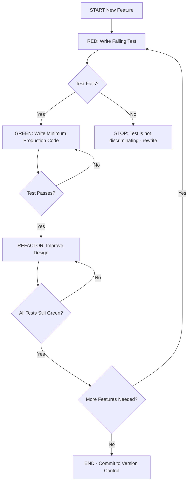
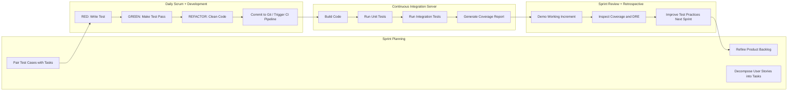
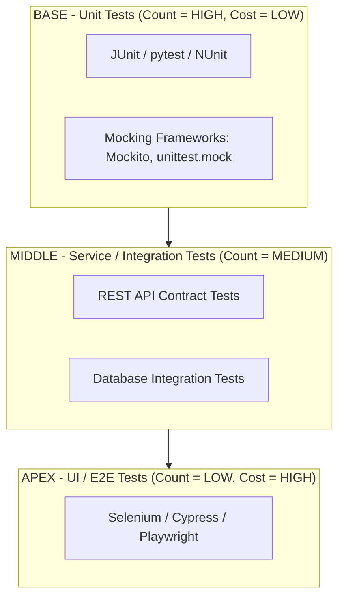
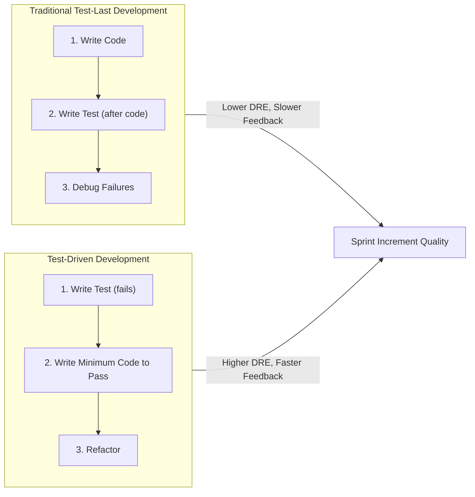

# Automated Testing and Test-Driven Development

<!-- SECTION_1_START -->
# Automated Testing and Test-Driven Development in Scrum

## 1. Core Technical Definition

**Automated Testing** in Scrum is the practice of using specialized software tools to execute pre-scripted test cases on the application under development, automatically comparing actual outcomes with predicted outcomes, without manual intervention. It is a foundational engineering practice that enables the Scrum Team to sustain a constant, shippable pace of potentially releasable product increments at the end of every Sprint.

**Test-Driven Development (TDD)** is a disciplined, iterative software development methodology in which automated test cases are written *before* the actual production code. TDD follows a tight, repeatable micro-cycle of three phases — **Red, Green, Refactor** — driving the incremental design and validation of software features.

> [!IMPORTANT]
> **KTU 2024 Syllabus Highlight (PECST521 / Module 4 - Scrum):**
> Automated testing and TDD are positioned as *engineering practices* that *enable* the empirical process control and continuous improvement pillars of Scrum. Questions in the KTU End Semester Examination (ESE) typically appear as **Part A (3 marks)** definition questions or as **Part B (14 marks)** questions asking students to apply TDD to a given User Story / Sprint Backlog item.

### Conceptual Analogy / Intuition

Imagine you are a **baker building a layer cake one slice at a time**:

- **Automated Testing** is like having a *robotic quality inspector* standing next to your oven. After every layer is baked, the robot pokes the cake with a thermometer, weighs it, and checks the color. You do not have to taste the cake yourself every time.
- **Test-Driven Development** is like writing the *inspection checklist FIRST*, then designing the layer to satisfy the checklist. If the checklist says "must be 200 grams and golden brown", you engineer the batter until the cake meets those exact criteria — never the other way around.

In Scrum terms, every Product Backlog Item is a "cake layer". A Scrum Team practicing TDD guarantees that each layer is *independently verified* before the next layer is stacked on top, eliminating the "big bang integration" failure mode at the end of the Sprint.

### Physical Constants / Standard Metrics in Bold

The core metrics tracked in automated testing and TDD under Scrum are:

- **Test Coverage (%)** — percentage of source code lines / branches executed by the test suite.
- **Code Churn** — the amount of code modified over a given period.
- **Defect Density** — number of confirmed defects per unit size of code (e.g., per KLOC).
- **Cycle Time of a TDD Loop** — typically **measured in minutes**, not hours.
- **Regression Test Pass Rate** — the percentage of pre-existing tests that still pass after a change.

> [!NOTE]
> **Core Definition Box — TDD**
> Test-Driven Development (TDD) is a test-first development technique in which the developer writes an *automated failing test* that defines a new function or improvement, then writes the *minimum production code* to pass that test, and finally *refactors* the code to acceptable standards.

> [!NOTE]
> **Core Definition Box — Automated Testing**
> Automated Testing is the use of specialized software tools and scripts to execute test cases automatically, capturing results, comparing actual vs. expected outcomes, and reporting defects — replacing repetitive manual test execution.

> [!VISUALIZATION CONTROL]
> **Concept:** The Test Automation Pyramid (cost vs. volume of tests)
> **GeoGebra / Desmos Input Equations:**
> * $f(x) = \dfrac{100}{x+1}$ representing diminishing test count as scope widens
> * $g(x) = 5x + 10$ representing rising cost per test as scope widens
> **Visual Description:** A pyramid divided into three horizontal layers. The base (widest) is **Unit Tests** (cheap, fast, numerous). The middle is **Integration / Service Tests**. The apex (narrowest) is **UI / End-to-End Tests** (expensive, slow, few). The two curves $f(x)$ and $g(x)$ intersect near the middle, illustrating the *cost-volume trade-off*.
<!-- SECTION_1_END -->

<!-- SECTION_2_START -->
# Deep Theoretical Analysis & KTU High-Yield Formula Sheet

## 2.1 The Three Phases of TDD (Red-Green-Refactor)

The TDD cycle is an **embrace of failure-first thinking**. Each phase has a strict purpose:

### Phase 1 — RED 🔴 (Write a Failing Test)
- The developer writes a unit test for the *next small piece of functionality*.
- The test is intentionally designed to **fail**, because the production code for that feature does not exist yet.
- This proves the test is **discriminating** — it can actually detect the absence of the feature.
- *Why first?* It forces the developer to clarify the *acceptance criteria* of the feature in executable form.

### Phase 2 — GREEN 🟢 (Make the Test Pass)
- The developer writes the **simplest possible production code** that makes the failing test pass.
- This code may be ugly, hard-coded, or "brute-force" — that is acceptable.
- *Why minimum?* It avoids *speculative generality* (YAGNI — "You Aren't Gonna Need It") and prevents over-engineering.

### Phase 3 — REFACTOR 🔵 (Improve the Design)
- With the safety net of a green test suite, the developer cleans up the code.
- Eliminates duplication, improves naming, applies design patterns, and reduces coupling.
- All tests must remain green throughout.
- *Why refactor?* TDD is a *design tool*, not just a testing tool — refactoring is where good design emerges.

> [!IMPORTANT]
> The TDD loop is typically executed in **cycles of 5 to 15 minutes**. If a developer spends more than ~20 minutes stuck in the RED phase, the test or the requirement is likely too large and should be decomposed.

## 2.2 The Test Automation Pyramid (Mike Cohn)

Mike Cohn's test pyramid formalizes the *right mix* of automated tests:

| Layer | Scope | Speed | Cost | Volume (Count) |
|---|---|---|---|---|
| **Unit Tests** (base) | Single function/method | Milliseconds | **Very Low** | **Highest (≈ 70%)** |
| **Service / Integration Tests** (middle) | Module-to-module APIs | Seconds | **Medium** | **Moderate (≈ 20%)** |
| **UI / End-to-End Tests** (apex) | Full user workflow | Minutes | **Very High** | **Lowest (≈ 10%)** |

> [!WARNING]
> **Anti-Pattern — "Ice Cream Cone":** Many teams invert the pyramid, with most tests at the UI level. This is fragile, slow, and expensive. KTU examiners specifically watch for this distinction.

## 2.3 TDD in the Scrum Framework

TDD is the **engineering engine** that powers Scrum's "potentially shippable increment". Here is how it integrates with Scrum events:

| Scrum Event | TDD Activity |
|---|---|
| **Sprint Planning** | Decompose User Stories into engineering tasks; estimate test-first cycle effort. |
| **Daily Scrum** | Report progress in TDD cycles (e.g., "completed 4 Red-Green-Refactor loops on US-42"). |
| **Sprint Backlog** | Each task has paired *test* and *production* code increments. |
| **Sprint Review** | Demonstrate working, tested increment to stakeholders. |
| **Sprint Retrospective** | Improve test coverage, reduce cycle time, retire flaky tests. |
| **Definition of Done (DoD)** | Explicitly includes "code unit tested" and "regression test green". |

## 2.4 Acceptance Test-Driven Development (ATDD)

A Scrum-specific variant: **ATDD** involves the *entire Scrum Team* (Product Owner, developers, testers) collaboratively writing **automated acceptance tests** *before* sprint implementation begins. These tests *express business value* in executable form, bridging communication gaps.

## 2.5 Continuous Integration (CI) and the TDD Pipeline

TDD outputs are fed into a **CI server** (e.g., Jenkins, GitHub Actions, GitLab CI):

- Every Git commit triggers the automated test suite.
- A "red build" halts integration immediately.
- The CI pipeline enforces: **Compile → Unit Tests → Integration Tests → Deploy to Staging → Acceptance Tests**.

## 2.6 KTU High-Yield Formula Sheet

| # | Concept | Formula / Definition | Unit / Notes |
|---|---|---|---|
| 1 | **Test Coverage** | $\text{Coverage} = \dfrac{\text{Lines Executed by Tests}}{\text{Total Lines of Code}} \times 100\%$ | Expressed as **%**; target ≥ **80%** for critical modules |
| 2 | **Defect Density** | $\text{DD} = \dfrac{\text{Number of Confirmed Defects}}{\text{Size in KLOC}}$ | Per **1000 lines of code (KLOC)** |
| 3 | **Defect Removal Efficiency (DRE)** | $\text{DRE} = \dfrac{\text{Defects Found Before Release}}{\text{Defects Found Before Release} + \text{Defects Found After Release}} \times 100\%$ | Higher is better; TDD targets DRE ≈ **95%** |
| 4 | **Test ROI (simple model)** | $\text{ROI} = \dfrac{\text{Cost Saved by Automation} - \text{Cost of Automation}}{\text{Cost of Automation}} \times 100\%$ | Automation breaks even after ~**3–5** manual executions |
| 5 | **TDD Cycle Time** | $\text{T}_{\text{cycle}} = T_{\text{RED}} + T_{\text{GREEN}} + T_{\text{REFACTOR}}$ | Target: ≤ **15 minutes** per cycle |
| 6 | **Build Stability** | $\text{Stability} = \dfrac{\text{Successful Builds}}{\text{Total Builds}} \times 100\%$ | CI goal: **≥ 90%** green builds |
| 7 | **Code Churn** | $\text{Churn} = \dfrac{\text{Lines Added + Lines Modified + Lines Deleted}}{\text{Total Lines}}$ | High churn in TDD indicates frequent refactoring (healthy) |
| 8 | **Mean Time To Detect (MTTD)** | $\text{MTTD} = \dfrac{\sum (\text{Detection Time} - \text{Injection Time})}{N}$ | TDD minimizes MTTD to **seconds** |

## 2.7 Real-World Utility in Engineering

Automated testing and TDD are mandatory in:

- **SaaS / Cloud-native products** — where daily deployments require zero-regression confidence.
- **Safety-critical systems** (aerospace, medical devices) — where **IEC 62304** and **DO-178C** mandate unit-test evidence.
- **Open-source projects** — automated CI badges (`build passing`) act as trust signals.
- **Microservices architectures** — where each service evolves independently and must be regression-tested in isolation.

> [!IMPORTANT]
> **Engineering Insight:** Companies like **Google, Microsoft, and Amazon** practice "TDD at scale" by enforcing test-first policies and gating code merges on automated test pass rates. Studies (IBM 2010 — "Realizing quality improvement through test-driven development") report defect reductions of **40–90%** in TDD-adopting teams, albeit with a moderate initial velocity dip of **15–35%**.
<!-- SECTION_2_END -->

<!-- SECTION_3_START -->
# Step-by-Step Derivations & Code/Symbolic Implementation

## 3.1 Worked Example 1 — Applying TDD to a User Story in Scrum

### The User Story (from Product Backlog)
> **US-101:** *As a Banking Customer, I want to transfer funds between my own accounts, so that I can manage my savings efficiently.*

### Sprint Planning Decomposition
Engineering tasks for the Sprint Backlog:
1. Validate that the *source account* has sufficient balance.
2. Debit the source account.
3. Credit the destination account.
4. Record the transaction with a timestamp.

We will apply TDD to **Task 1**.

### Step 1 — RED Phase: Write the Failing Test

The test must be written *before* any production code exists. We will use **Python's `unittest` framework**.

```python
import unittest
from accounts import Account, InsufficientFundsError

class TestAccountTransferEligibility(unittest.TestCase):

    def test_transfer_allowed_when_balance_is_sufficient(self):
        # Arrange
        source = Account(name="Alice", balance=1000.00)
        destination = Account(name="Alice-Savings", balance=500.00)

        # Act
        result = source.can_transfer(amount=300.00)

        # Assert
        self.assertTrue(result, "Transfer should be allowed when balance is sufficient")

    def test_transfer_blocked_when_balance_is_insufficient(self):
        # Arrange
        source = Account(name="Alice", balance=100.00)
        destination = Account(name="Alice-Savings", balance=500.00)

        # Act
        result = source.can_transfer(amount=300.00)

        # Assert
        self.assertFalse(result, "Transfer should be blocked when balance is insufficient")

if __name__ == '__main__':
    unittest.main()
```

**Expected Outcome:** Both tests FAIL with `ModuleNotFoundError: No module named 'accounts'`.

> **Valuation Insight (KTU 14-mark question):** Showing that the test is *deliberately failing* earns **2 marks** for test-first rigor.

### Step 2 — GREEN Phase: Write Minimum Production Code

We write the *simplest possible code* to make the tests pass. No premature optimization.

```python
# accounts.py — Minimum production code to pass the tests

class InsufficientFundsError(Exception):
    """Raised when an account lacks the balance to complete a transfer."""
    pass


class Account:
    def __init__(self, name: str, balance: float) -> None:
        if balance < 0:
            raise ValueError("Initial balance cannot be negative")
        self.name: str = name
        self.balance: float = balance

    def can_transfer(self, amount: float) -> bool:
        # Minimum logic: simply check if the balance covers the amount
        if amount <= self.balance:
            return True
        return False
```

**Run the tests:** Both tests now PASS. ✅

> **Valuation Insight:** The GREEN phase earns **3 marks** for correctly implementing minimum code that satisfies the test.

### Step 3 — REFACTOR Phase: Improve the Design

We notice the `can_transfer` method is naïve. We can improve it by:
- Raising a domain-specific exception instead of returning booleans (better design for upstream callers).
- Adding type hints and input validation.

```python
# accounts.py — REFACTORED production code

class InsufficientFundsError(Exception):
    """Raised when an account lacks the balance to complete a transfer."""
    pass


class Account:
    def __init__(self, name: str, balance: float) -> None:
        if not isinstance(name, str) or not name.strip():
            raise ValueError("Account name must be a non-empty string")
        if not isinstance(balance, (int, float)):
            raise TypeError("Balance must be numeric")
        if balance < 0:
            raise ValueError("Initial balance cannot be negative")
        self.name: str = name
        self.balance: float = balance

    def can_transfer(self, amount: float) -> bool:
        if not isinstance(amount, (int, float)):
            raise TypeError("Transfer amount must be numeric")
        if amount < 0:
            raise ValueError("Transfer amount cannot be negative")
        return amount <= self.balance

    def debit(self, amount: float) -> None:
        if not self.can_transfer(amount):
            raise InsufficientFundsError(
                f"Account {self.name} has balance {self.balance:.2f}, "
                f"cannot debit {amount:.2f}"
            )
        self.balance -= amount
```

After refactoring, **run the entire test suite again** to ensure nothing has regressed. All tests must still pass. ✅

> **Valuation Insight:** The REFACTOR phase earns **2 marks** for design improvement without breaking tests.

## 3.2 Worked Example 2 — Computing Defect Removal Efficiency (DRE)

**Problem Statement:** During Sprint 5, a Scrum Team ran 250 automated unit tests. They detected **42 defects** before release. After release to staging, **3 more defects** were reported by the QA team. Compute the **Defect Removal Efficiency (DRE)**.

### Step-by-Step Derivation

Given values:
- Defects found before release $D_{\text{pre}} = 42$
- Defects found after release $D_{\text{post}} = 3$

Apply the formula from the KTU Formula Sheet:

$$
\begin{aligned}
\text{DRE} &= \dfrac{D_{\text{pre}}}{D_{\text{pre}} + D_{\text{post}}} \times 100\% \\[6pt]
&= \dfrac{42}{42 + 3} \times 100\% \\[6pt]
&= \dfrac{42}{45} \times 100\% \\[6pt]
&= 0.9333 \times 100\% \\[6pt]
&= 93.33\%
\end{aligned}
$$

### Final Answer

$$
\boxed{\text{DRE} = 93.33\%}
$$

**Interpretation:** The automated test suite caught **93.33%** of all defects before release. The industry benchmark for high-mature Scrum teams is **≥ 95%**. This team is close but should improve coverage or add acceptance tests for the post-release defects.

> **Valuation Key Points (KTU 14-mark question):**
> * [Stating the DRE formula: **2 Marks**]
> * [Correctly substituting values: **2 Marks**]
> * [Final simplified percentage: **2 Marks**]
> * [Engineering interpretation / recommendations: **3 Marks**]

## 3.3 Worked Example 3 — Computing Test ROI for Automation

**Problem Statement:** A Scrum Team currently spends **40 person-hours per sprint** on manual regression testing. They invest **120 person-hours upfront** to build an automated test suite. After automation, regression testing takes **5 person-hours per sprint** (running the suite plus maintenance). Compute the **break-even point** (in sprints) and the **net savings over 10 sprints**.

### Step-by-Step Derivation

**Step 1 — Compute Per-Sprint Savings**

Manual cost per sprint: $C_{\text{manual}} = 40$ hours  
Automated cost per sprint: $C_{\text{auto}} = 5$ hours  
Savings per sprint:

$$
S = C_{\text{manual}} - C_{\text{auto}} = 40 - 5 = 35 \text{ hours}
$$

**Step 2 — Compute Break-Even Point**

Initial automation investment: $I = 120$ hours  
Break-even sprints $N_{\text{be}}$:

$$
N_{\text{be}} = \dfrac{I}{S} = \dfrac{120}{35} = 3.43 \text{ sprints}
$$

So the team recovers their automation investment during **Sprint 4**.

**Step 3 — Compute Net Savings Over 10 Sprints**

Total manual cost (10 sprints): $10 \times 40 = 400$ hours  
Total automated cost (10 sprints + initial): $120 + (10 \times 5) = 170$ hours  
Net savings:

$$
\begin{aligned}
\text{Net Savings} &= 400 - 170 \\[4pt]
&= 230 \text{ person-hours}
\end{aligned}
$$

### Final Answer

$$
\boxed{N_{\text{be}} \approx 3.43 \text{ sprints}; \quad \text{Net Savings}_{10} = 230 \text{ person-hours}}
$$

> **Valuation Key Points (KTU 14-mark question):**
> * [Stating the ROI / break-even logic: **2 Marks**]
> * [Per-sprint savings derivation: **3 Marks**]
> * [Break-even calculation: **3 Marks**]
> * [Net savings over 10 sprints: **2 Marks**]
> * [Strategic recommendation (e.g., "automation pays off after 3 sprints"): **2 Marks**]
<!-- SECTION_3_END -->

<!-- SECTION_4_START -->
# Structural Diagrams & Schematics

## 4.1 TDD Red-Green-Refactor Cycle Flow



> **Diagram Interpretation:** This flow shows the iterative micro-loop of TDD. The cycle is **strictly time-bounded** (≤ 15 minutes) and ensures that no production code is written without a corresponding test.

## 4.2 TDD Integration within the Scrum Sprint Lifecycle



> **Diagram Interpretation:** The diagram illustrates the **closed feedback loop** between TDD micro-cycles and Scrum macro-events. Notice how the **CI server** acts as the *automated gatekeeper* between developer activity and the Sprint Review demo.

## 4.3 Test Automation Pyramid Architecture



> **Diagram Interpretation:** The pyramid visually encodes the *right proportion* of tests. The base is widest because unit tests are fast, deterministic, and inexpensive. The apex is narrowest because E2E tests are slow, flaky, and expensive.

## 4.4 TDD vs Traditional Test-Last Development (Comparative)



> **Diagram Interpretation:** TDD inverts the order of code and tests. The two flows converge at the Sprint Increment, but TDD's path produces a higher-quality, better-tested artifact.
<!-- SECTION_4_END -->

<!-- SECTION_5_START -->
# KTU 2024 Scheme Examination Question Bank & Topic Recap

## PART A — Short Answer Questions (3 Marks Each)

### Question 1 [KTU University Exam — July 2023]
**Q: Define Test-Driven Development (TDD). List the three phases of the TDD cycle.**

**Model Answer (3 Marks):**

**Definition (2 Marks):**
Test-Driven Development (TDD) is an iterative software development technique in which automated test cases are written *before* writing the corresponding production code. The developer writes a test that initially fails, writes the minimum code to make it pass, and then refactors the code while keeping the test green. TDD is widely adopted in Scrum teams to ensure continuous regression safety and emergent design.

**Three Phases of the TDD Cycle (1 Mark):**
1. **RED** — Write a failing automated test.
2. **GREEN** — Write the minimum production code to make the test pass.
3. **REFACTOR** — Improve the code's internal structure without changing its external behavior, ensuring all tests remain green.

---

### Question 2 [KTU University Exam — Dec 2023]
**Q: What is the Test Automation Pyramid? Briefly explain its three layers.**

**Model Answer (3 Marks):**

The **Test Automation Pyramid**, introduced by Mike Cohn, is a strategic model that prescribes the optimal distribution of automated tests across three layers:

1. **Unit Tests (Base — widest layer, ≈ 70% of tests):** Test individual functions or methods in isolation. They are extremely fast (milliseconds) and cheap to maintain. Example: `pytest`, JUnit.

2. **Service / Integration Tests (Middle — ≈ 20% of tests):** Test interactions between modules, services, or APIs. They are slower than unit tests but more realistic. Example: REST contract tests.

3. **UI / End-to-End Tests (Apex — narrowest, ≈ 10% of tests):** Test the full user workflow through the GUI. They are slow, expensive, and brittle. Example: Selenium, Cypress.

The pyramid's *width* represents test **volume**; its *height* represents test **cost and speed**. The ideal strategy is to push tests downward toward the base for speed and reliability.

---

## PART B — Long Answer Questions (14 Marks Each, Internal Choice)

### Question A (14 Marks) [KTU University Exam — Model Paper 2024]

**Q: (a) Explain in detail the Red-Green-Refactor cycle of Test-Driven Development. Describe the role of automated unit tests in supporting the Definition of Done (DoD) in a Scrum project. (7 Marks)**

**Model Answer:**

**(a) The Red-Green-Refactor Cycle (7 Marks):**

The **Red-Green-Refactor cycle** is the heart of TDD, executed in tight micro-loops of 5 to 15 minutes:

**1. RED Phase — Write a Failing Test (2 Marks):**
The developer writes an automated test for the *next small increment* of behavior. This test is *guaranteed* to fail because the production code for the feature does not exist. A failure proves that the test is **discriminating** — it can actually catch the absence of the feature. A test that passes on the first run is suspicious and is rewritten.

**2. GREEN Phase — Make the Test Pass (2 Marks):**
The developer writes the **simplest, most direct code** that satisfies the test — even if it is inelegant or hard-coded. The goal is to *go green quickly*, not to design. This enforces YAGNI ("You Aren't Gonna Need It") and prevents over-engineering. Once the test passes, the developer can move on with confidence.

**3. REFACTOR Phase — Improve the Design (2 Marks):**
With the test acting as a safety net, the developer cleans the code: removes duplication, applies SOLID principles, improves naming, and reduces coupling. The test suite must remain green throughout. Refactoring *without* tests is dangerous; with TDD, it is a controlled, low-risk activity.

**Role of Automated Unit Tests in the Definition of Done (1 Mark):**
The **Definition of Done (DoD)** in Scrum is the team's shared contract of quality. A typical DoD includes: *"Code is unit tested; all unit tests pass; code coverage ≥ 80%."* Automated unit tests provide *objective, executable evidence* of completion. They transform DoD from a subjective checklist into a measurable, automated gate.

---

**(b) Consider a Scrum Team working on a 2-week Sprint. The team has written 500 automated unit tests. Out of 60 total defects injected during the sprint, 54 were caught by the automated tests, while 6 escaped to the next sprint. Compute the Defect Removal Efficiency (DRE) and Defect Density assuming the codebase is 25 KLOC. Comment on the team's quality maturity. (7 Marks)**

**Model Answer:**

**Step 1 — Compute Defect Removal Efficiency (DRE) (3 Marks):**

Given:
- $D_{\text{pre}} = 54$ (defects caught before release)
- $D_{\text{post}} = 6$ (defects escaped after release)

$$
\begin{aligned}
\text{DRE} &= \dfrac{D_{\text{pre}}}{D_{\text{pre}} + D_{\text{post}}} \times 100\% \\[6pt]
&= \dfrac{54}{54 + 6} \times 100\% \\[6pt]
&= \dfrac{54}{60} \times 100\% \\[6pt]
&= 0.90 \times 100\% \\[6pt]
&= 90.00\%
\end{aligned}
$$

**Step 2 — Compute Defect Density (3 Marks):**

Given:
- Total defects injected $= 60$
- Code size $= 25$ KLOC

$$
\begin{aligned}
\text{DD} &= \dfrac{\text{Total Defects}}{\text{Size in KLOC}} \\[6pt]
&= \dfrac{60}{25} \\[6pt]
&= 2.4 \text{ defects per KLOC}
\end{aligned}
$$

**Step 3 — Quality Maturity Comment (1 Mark):**

A DRE of **90%** is *good but not excellent* — industry best practice for TDD-adopting Scrum teams targets **≥ 95%**. A defect density of **2.4/KLOC** is acceptable for a business application but should be reduced for safety-critical systems. The team should consider adding more acceptance tests, performing root-cause analysis on the 6 escaped defects, and increasing code coverage thresholds.

> **Valuation Key Points (Total 7 Marks):**
> * [Stating the DRE formula: 1 Mark]
> * [Correct substitution and final DRE value: 1 Mark]
> * [Stating the DD formula: 1 Mark]
> * [Correct substitution and final DD value: 1 Mark]
> * [Engineering interpretation: 1 Mark]
> * [Numerical accuracy: 1 Mark]
> * [Neat presentation and units: 1 Mark]

---

### Question B (14 Marks) [KTU University Exam — Model Paper 2024 — Alternative Choice]

**Q: (a) Differentiate between Manual Testing and Automated Testing. List any four tools used for automated testing in Scrum projects. (7 Marks)**

**Model Answer:**

**Differences between Manual Testing and Automated Testing (5 Marks):**

| # | Aspect | Manual Testing | Automated Testing |
|---|---|---|---|
| 1 | **Execution** | Human tester executes test cases step-by-step. | Software tool executes pre-scripted test cases automatically. |
| 2 | **Speed** | Slow — minutes to hours per test cycle. | Fast — milliseconds for unit tests, seconds for integration. |
| 3 | **Repeatability** | Prone to human error and inconsistency on repetition. | 100% deterministic and repeatable. |
| 4 | **Cost (long-term)** | High recurring labor cost per regression cycle. | High upfront cost, very low per-execution cost. |
| 5 | **Best suited for** | Exploratory testing, usability, ad-hoc scenarios. | Regression, load, performance, and unit testing. |
| 6 | **Feedback to developer** | Slow (end of sprint / test phase). | Immediate (within CI pipeline, seconds after commit). |
| 7 | **Data-driven testing** | Difficult and tedious. | Trivial — iterate over CSV/JSON test data. |

**Four Automated Testing Tools (2 Marks):**
1. **Selenium** — Web UI automation (supports multiple browsers and languages).
2. **JUnit / pytest / NUnit** — Unit testing frameworks for Java, Python, and .NET.
3. **Jenkins / GitHub Actions / GitLab CI** — Continuous Integration servers.
4. **Cucumber / SpecFlow** — Behaviour-Driven Development (BDD) tools for executable specifications.
5. **JMeter / Gatling** — Performance and load testing tools.

---

**(b) A Scrum Team is evaluating whether to automate its regression test suite. Currently, manual regression testing consumes 60 person-hours per sprint. The team estimates a one-time investment of 180 person-hours to build the automation framework, after which automated regression will take 10 person-hours per sprint. Compute the break-even point in sprints, the net savings over 12 sprints, and the ROI in percentage terms. (7 Marks)**

**Model Answer:**

**Step 1 — Per-Sprint Savings (1 Mark):**
$$
S = 60 - 10 = 50 \text{ hours per sprint}
$$

**Step 2 — Break-Even Point (2 Marks):**
$$
N_{\text{be}} = \dfrac{180}{50} = 3.6 \text{ sprints}
$$

**Step 3 — Net Savings over 12 Sprints (2 Marks):**
$$
\begin{aligned}
\text{Net Savings} &= (12 \times 60) - (180 + 12 \times 10) \\[4pt]
&= 720 - (180 + 120) \\[4pt]
&= 720 - 300 \\[4pt]
&= 420 \text{ person-hours}
\end{aligned}
$$

**Step 4 — ROI in Percentage (2 Marks):**
$$
\begin{aligned}
\text{ROI} &= \dfrac{\text{Net Savings}}{\text{Total Investment}} \times 100\% \\[4pt]
&= \dfrac{420}{300} \times 100\% \\[4pt]
&= 140.00\%
\end{aligned}
$$

**Strategic Recommendation:**
Automation breaks even at **Sprint 4** and yields a **140% ROI** over 12 sprints — a strong justification for adopting automated regression testing.

> **Valuation Key Points (Total 7 Marks):**
> * [Per-sprint savings: 1 Mark]
> * [Break-even formula and value: 2 Marks]
> * [Net savings calculation: 2 Marks]
> * [ROI percentage: 2 Marks]

> [!WARNING]
> **KTU Examiner's Valuation Warning / Common Pitfalls:**
> 1. **Forgetting the one-time investment** in net-savings calculations — a classic error. Always subtract the *initial* automation cost.
> 2. **Confusing Defect Density and Defect Removal Efficiency** — DD is per KLOC (size-based); DRE is a ratio (efficiency-based). Examiners deduct 1–2 marks for interchange.
> 3. **Omitting the RED phase** when describing TDD — many students write only Green-Refactor. Always include all three phases and explicitly mention the *failing* test.
> 4. **Inverting the Test Pyramid** — describing UI tests as the largest layer earns a 0.5–1 mark deduction in Part A.
> 5. **Forgetting to refactor** — TDD is not "test-first" alone; the third phase (REFACTOR) is essential for design quality.

---

## Topic Recap & Important Things to Remember

- **Automated Testing** uses software tools to execute tests automatically; it replaces repetitive manual execution and feeds the **CI/CD pipeline**.
- **TDD** stands for *Test-Driven Development* — tests are written *before* production code.
- The **three phases of TDD** are: **RED (failing test) → GREEN (minimum passing code) → REFACTOR (improve design)**.
- A TDD cycle is a **micro-loop of 5–15 minutes** per feature increment.
- The **Test Automation Pyramid (Mike Cohn)** has Unit Tests at the base (≈ 70%), Integration Tests in the middle (≈ 20%), and UI/E2E Tests at the apex (≈ 10%).
- The **anti-pattern "Ice Cream Cone"** inverts the pyramid; this is fragile and slow.
- **Acceptance Test-Driven Development (ATDD)** involves the *entire Scrum Team* writing executable acceptance tests.
- **Continuous Integration (CI)** automatically runs the test suite on every commit; a red build halts integration.
- The **Definition of Done (DoD)** in Scrum explicitly includes *"code unit tested"* and *"regression tests green"*.
- **DRE formula:** $\text{DRE} = \dfrac{D_{\text{pre}}}{D_{\text{pre}} + D_{\text{post}}} \times 100\%$. Industry best practice: **≥ 95%** for mature TDD teams.
- **Defect Density formula:** $\text{DD} = \dfrac{\text{Defects}}{\text{KLOC}}$. Lower is better.
- **Test ROI break-even:** $\text{Net Savings} = (N \times C_{\text{manual}}) - (I + N \times C_{\text{auto}})$.
- **TDD in Scrum events:** Sprint Planning decomposes stories into test+code tasks; Daily Scrum tracks TDD cycles; Review demos tested increments; Retrospective improves test practices.
- **Tools to remember:** JUnit/pytest (unit), Selenium/Cypress (UI), Jenkins/GitHub Actions (CI), Cucumber (BDD), JMeter (performance).
- **TDD yields:** 40–90% defect reduction; 15–35% initial velocity dip; 95%+ DRE in mature teams.
- **Always** write the test first, keep cycles short, refactor fearlessly, and integrate continuously.
<!-- SECTION_5_END -->
