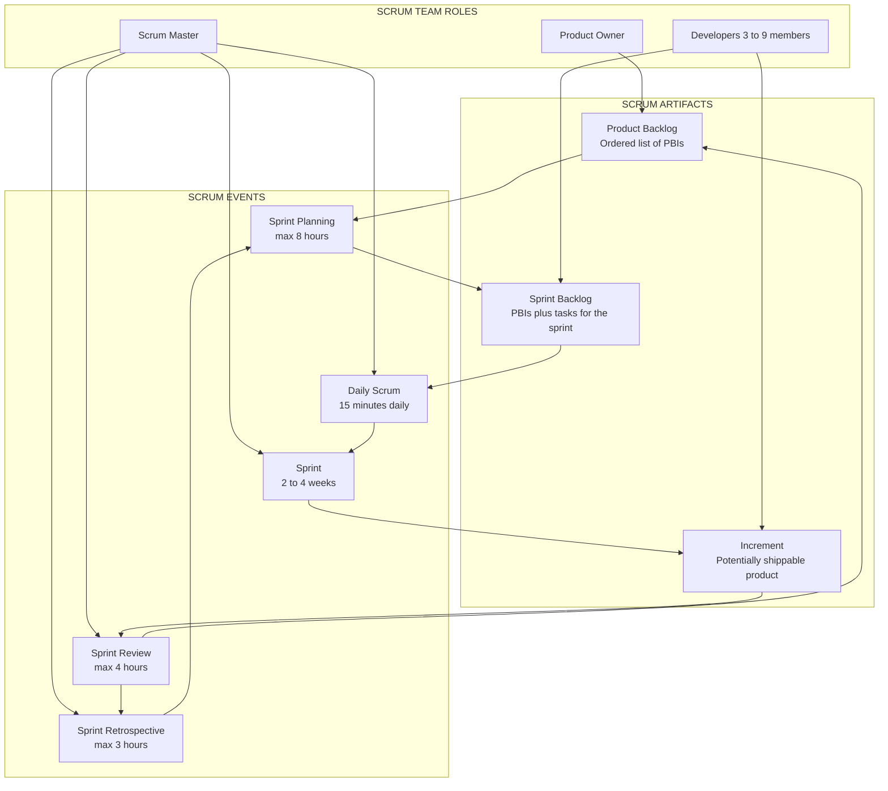
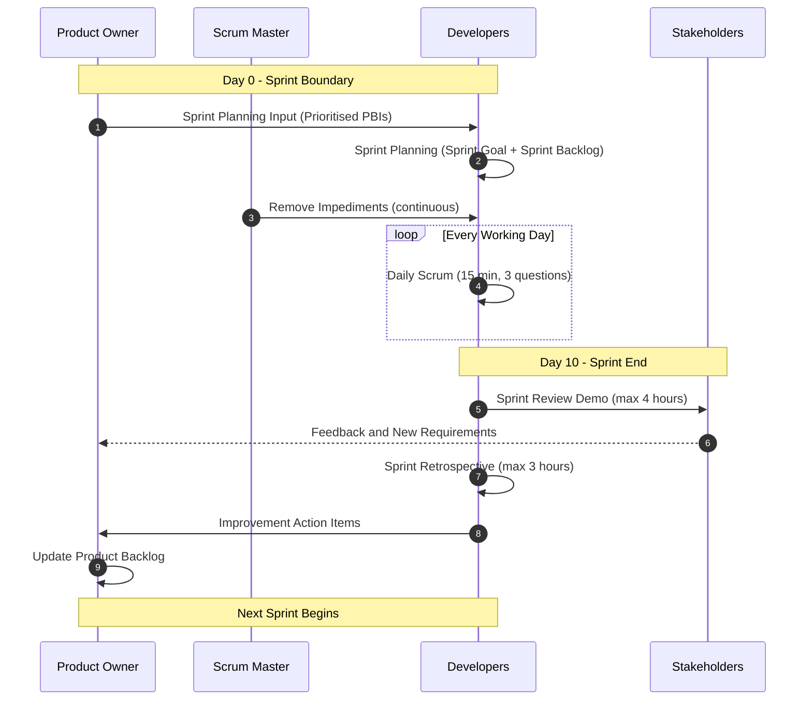
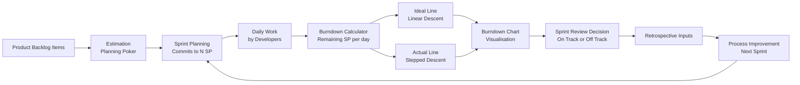
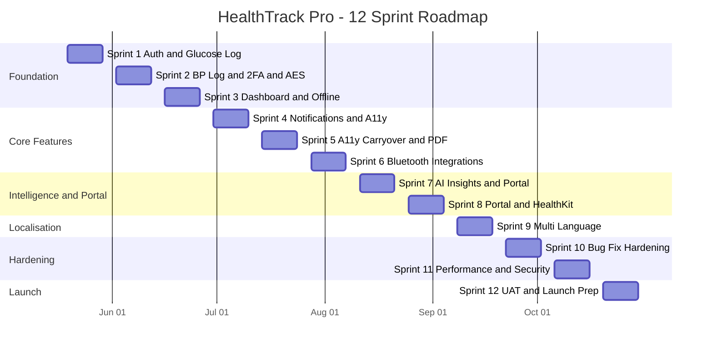
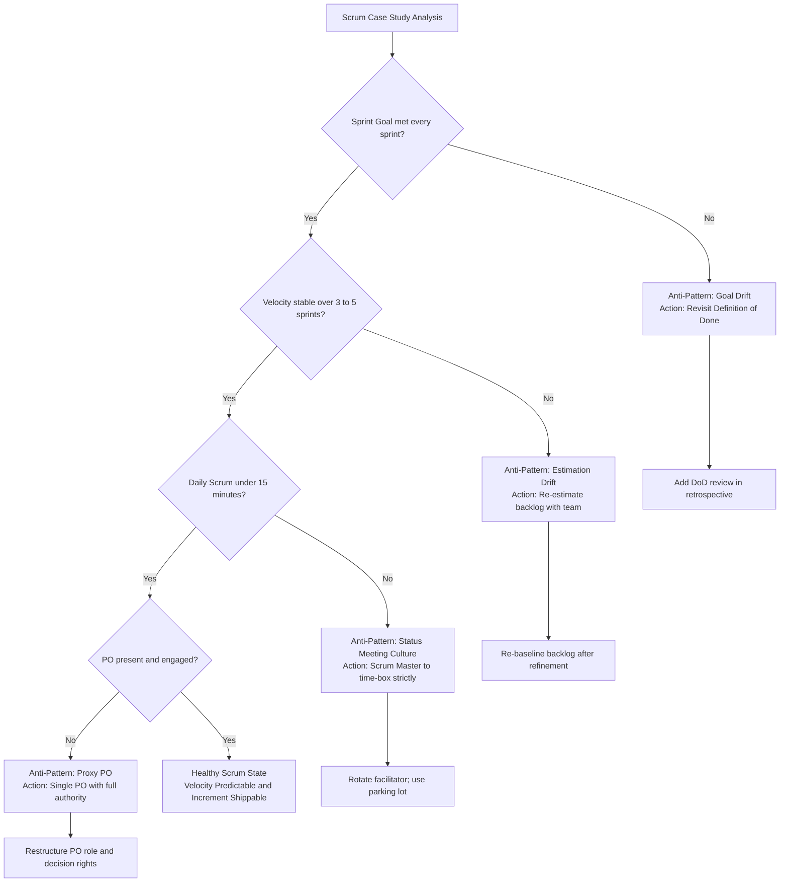

# Case Study

<!-- SECTION_1_START -->

# Scrum Case Study — Core Technical Definition & Intuitive Overview

## 1.1 Formal KTU 2024 Definition

A **Scrum Case Study** is a structured, real-world or simulated business scenario that demonstrates the end-to-end application of the **Scrum framework** — an empirical, iterative, and incremental agile methodology — within a software project. It typically captures the **Product Backlog refinement**, **Sprint Planning**, **Daily Scrum**, **Sprint Review**, **Sprint Retrospective**, and the **resulting velocity / burn-down analytics** across multiple sprints.

> [!IMPORTANT]
> As per **KTU 2024 Scheme (PECST521 — Software Project Management, Module 4: Scrum)**, students are expected to analyse a Scrum-implemented project, identify roles (Product Owner, Scrum Master, Developers), artifacts (Product Backlog, Sprint Backlog, Increment), events, and compute agile metrics such as **Velocity**, **Burndown Rate**, **Sprint Burndown**, and **Release Burnup**.

## 1.2 Conceptual Analogy / Intuition

> [!NOTE]
> **The Cricket Team Analogy 🏏**
> Imagine a cricket team preparing for a **T20 World Cup final**:
> - The **Coach (Scrum Master)** removes impediments, not plays the match.
> - The **Captain + Selectors (Product Owner)** decide which 11 players + strategy (highest-value features) to field.
> - The **Playing XI (Developers)** execute the overs (Sprint) and score runs (deliver increments).
> - **Each Over (Sprint = 2–4 weeks)** has a plan (Sprint Planning), tight sync (Daily Huddle = Daily Scrum), an end-of-over review, and a team debrief (Retrospective).
> - The **Scorecard at the end of every over** = **Potentially Shippable Increment**.
> - The **Run-Rate Graph (Burndown Chart)** tells the coach whether the team is on track to win.

Just as a coach tweaks strategy **every over** based on observed runs and wickets, a Scrum team adapts **every Sprint** based on observed velocity and feedback.

## 1.3 Standard Agile Metrics (High-Yield Constants)

> [!IMPORTANT]
> Core Scrum Numerical Constants You Must Memorise:
> - **Sprint Duration:** typically **2 to 4 weeks** (most common: **2 weeks**)
> - **Daily Scrum Time-box:** **15 minutes**
> - **Sprint Planning Time-box:** **max 8 hours** for a 1-month Sprint (pro-rated)
> - **Sprint Review Time-box:** **max 4 hours** for a 1-month Sprint
> - **Sprint Retrospective Time-box:** **max 3 hours** for a 1-month Sprint
> - **Story Point Estimation Scale:** **Fibonacci sequence** — 1, 2, 3, 5, 8, 13, 20, 40, 100
> - **Ideal Sprint Capacity:** **6 productive hours / person / day** (after meetings, emails, breaks)
> - **Recommended Team Size:** **3 to 9 members** (excluding Product Owner and Scrum Master)

## 1.4 Visualization Callout

> [!VISUALIZATION CONTROL]
> **Concept:** Ideal Scrum Sprint Burndown Chart (Story Points vs Days)
> **Desmos Input Equations (plot these as separate lines):**
> * `y_ideal = 50 - (50/10) * x`  (Ideal line: starts at 50 SP, ends at 0 over 10 working days)
> * `y_actual = 50 - 8` for `0 <= x < 2`, `42 - 7` for `2 <= x < 4`, `35 - 6` for `4 <= x < 7`, `29 - 12` for `7 <= x < 9`, `17 - 17` for `9 <= x <= 10`
> **Visual Description:** The student should observe that the **ideal line** is a straight diagonal descending from the y-axis to the origin, while the **actual line** is a stepped descent that may sometimes plateau (impediments) or drop sharply (bulk completion near end). Any point **above** the ideal line indicates the team is **behind schedule**; any point **below** indicates they are **ahead of schedule**.

---

<!-- SECTION_1_END -->

<!-- SECTION_2_START -->

# Deep Theoretical Analysis & KTU High-Yield Formula Sheet

## 2.1 Anatomy of a Scrum Case Study — Structural Logic

A canonical Scrum case study contains the following sequential building blocks. Each block answers a specific question that a KTU board examiner will probe.

### 2.1.1 Project Background Block
- **What** is being built (e.g., a healthcare mobile application).
- **Why** it is being built (market need, regulatory compliance, customer pain point).
- **Who** are the stakeholders (users, regulators, internal sponsors).
- **Constraints** — budget ceiling, regulatory deadlines, team size, technology stack.

### 2.1.2 Product Backlog Block
- A **prioritised list of features / user stories** ordered by business value.
- Each item carries: **ID, Title, Description, Acceptance Criteria, Priority, Story Point Estimate, Epic linkage**.
- The **Product Owner** owns this artifact; the team estimates, but the PO orders.

### 2.1.3 Sprint Block
- A **fixed time-boxed iteration** during which a usable, potentially shippable increment is produced.
- Each sprint contains: **Sprint Planning → Daily Scrums → Sprint Review → Sprint Retrospective**.

### 2.1.4 Velocity & Burndown Block
- Quantitative evidence of team progress across sprints.
- The most analytical sub-section — where KTU examiners test formula application.

## 2.2 The Scrum Triangle (Case Study Anchor)

Every Scrum case study is rooted in three pillars, each supported by commitments:

| Pillar | Commitment Artifact | Description |
| :--- | :--- | :--- |
| **Transparency** | Definition of Done (DoD) | Shared understanding of what "complete" means for every PBI |
| **Inspection** | Sprint Review + Daily Scrum | Frequent check-ins on progress and increment quality |
| **Adaptation** | Sprint Retrospective | Course-correction every sprint to improve the process |

> [!NOTE]
> **KTU 2024 High-Yield Insight:** Many students lose marks by writing the pillars as "Transparency, Inspection, Adaptation" but **forgetting the commitment artifacts** that bind them. Always pair the pillar with its commitment.

## 2.3 The Three Scrum Roles (Always Asked in ESE)

| Role | Responsibility (What) | NOT Responsible For (Anti-pattern) | Accountable To |
| :--- | :--- | :--- | :--- |
| **Product Owner (PO)** | Maximising product value, managing Product Backlog ordering, accepting/rejecting increments | Project management, team velocity, technical design | Stakeholders, Customers |
| **Scrum Master (SM)** | Facilitating Scrum events, removing impediments, coaching the team on Scrum | Assigning tasks, managing the team, deciding what to build | The Team, the Organisation |
| **Developers (Dev Team)** | Creating the Increment, self-organising to deliver Sprint Goal, estimating effort | Taking orders from SM, being micro-managed | Each other (collective ownership) |

## 2.4 The Five Scrum Events (Sequence Matters)

| # | Event | Trigger | Output Artifact | Time-Box (1-month Sprint) |
| :--- | :--- | :--- | :--- | :--- |
| 1 | **Sprint** | Concludes previous sprint | Potentially Shippable Increment | **2 – 4 weeks** |
| 2 | **Sprint Planning** | Start of sprint | Sprint Backlog + Sprint Goal | **max 8 hours** |
| 3 | **Daily Scrum** | Every working day | Updated Sprint Backlog | **15 minutes** |
| 4 | **Sprint Review** | End of sprint, before retrospective | Stakeholder feedback, updated PB | **max 4 hours** |
| 5 | **Sprint Retrospective** | End of sprint, after review | Improvement actions for next sprint | **max 3 hours** |

## 2.5 KTU Formula Sheet / Cheat Sheet

> [!IMPORTANT]
> The following table is the **single most important table** for Module 4 numerical questions. Memorise every row.

| # | Metric Name | Formula | Unit | Interpretation |
| :--- | :--- | :--- | :--- | :--- |
| 1 | **Planned Sprint Effort** | $\Sigma(\text{Story Points of committed PBIs})$ | Story Points (SP) | Total work the team *promised* for the sprint |
| 2 | **Completed Sprint Effort** | $\Sigma(\text{Story Points of PBIs marked Done})$ | Story Points (SP) | Total work the team *actually* finished |
| 3 | **Sprint Velocity** | $\text{Completed Sprint Effort}$ | SP / Sprint | A team's delivery rate (stable after 3+ sprints) |
| 4 | **Average Velocity (n sprints)** | $\dfrac{\sum_{i=1}^{n} V_i}{n}$ | SP / Sprint | Used to forecast future capacity |
| 5 | **Sprint Completion %** | $\dfrac{\text{Completed SP}}{\text{Planned SP}} \times 100$ | Percent | Sprint health indicator |
| 6 | **Remaining Work (Day d)** | $\text{Total SP committed} - \sum_{i=1}^{d}\text{SP burned}$ | Story Points | Y-axis value of Burndown Chart |
| 7 | **Ideal Burn Rate** | $\dfrac{\text{Total SP}}{\text{Working Days in Sprint}}$ | SP / Day | Slope of ideal burndown line |
| 8 | **Actual Burn Rate** | $\dfrac{\text{SP completed}}{\text{Days elapsed}}$ | SP / Day | Slope of actual burndown line |
| 9 | **Release Forecast (Sprints remaining)** | $\left\lceil \dfrac{\text{Remaining Backlog SP}}{\text{Average Velocity}} \right\rceil$ | Sprints | Number of sprints needed to finish the project |
| 10 | **Release Forecast (Days)** | $\text{Sprints remaining} \times \text{Sprint Length}$ | Days | Calendar time to ship the product |
| 11 | **Sprint Goal Achievement** | $\dfrac{\text{SP aligned to Sprint Goal completed}}{\text{Total SP of Sprint Goal}} \times 100$ | Percent | Whether the *intent* of the sprint was met |
| 12 | **Defect Removal Efficiency (DRE)** | $\dfrac{\text{Defects found before release}}{\text{Total defects found}} \times 100$ | Percent | Quality of testing inside the sprint |
| 13 | **Capacity (per person)** | $(\text{Working days}) \times 6$ hours | Person-Hours | Standard ideal capacity |
| 14 | **Total Team Capacity** | $\sum_{i=1}^{n} \text{TeamMemberCapacity}_i$ | Person-Hours | Input to Sprint Planning commitment |

> [!NOTE]
> **Always use $\lvert x \rvert$ or $\text{abs}(x)$ in prose** — never raw vertical bars inside markdown tables. Notice how the formulas above use $\lvert \cdot \rvert$ notation or $\lceil \cdot \rceil$ ceiling notation where needed.

## 2.6 Real-World Utility of Scrum Case Studies

> [!IMPORTANT]
> **Where this knowledge is deployed in industry:**
> - **Product Roadmap Forecasting** — using velocity-based release forecasting for investor pitches.
> - **Agile Audits** — Scrum Masters use DRE and burndown trends during quarterly organisational health checks.
> - **Hiring Decisions** — product firms use case-study-style interviews (Atlassian, Spotify, Razorpay) to test practical Scrum thinking.
> - **Sprint Ceremonies Tooling** — Jira, Azure DevOps, Linear, ClickUp all export exactly the metrics in §2.5; analysts use these formulas in dashboards.
> - **Contract Negotiations** — fixed-price vs. time-and-material contracts hinge on **velocity predictability**, which a Scrum case study demonstrates.

---

<!-- SECTION_2_END -->

<!-- SECTION_3_START -->

# Step-by-Step Derivations & Code/Symbolic Implementation

## 3.1 The Anchor Case Study — "HealthTrack Pro"

We will solve an exhaustive, multi-part Scrum case study from start to finish. **Every arithmetic step is shown explicitly — no shortcuts.**

### 3.1.1 Project Scenario (Given)

**MediTech Solutions Pvt. Ltd.** is a mid-size healthcare software firm based in Bengaluru, India. They have been awarded a contract by **Apollo Clinics (the client)** to develop **"HealthTrack Pro"** — a cross-platform mobile application (Android + iOS) that allows diabetic and hypertensive patients to:

1. Log daily blood glucose and blood pressure readings.
2. Receive AI-driven health insights.
3. Share reports with their consulting physician.
4. Receive medication reminders.
5. Sync data from Bluetooth-enabled glucometers and BP monitors.

**Project Constraints:**
- **Hard regulatory deadline:** **6 calendar months** (≈ **26 weeks**).
- **Team size:** **7 members** (1 Product Owner, 1 Scrum Master, 5 Developers including 1 QA).
- **Sprint length:** **2 weeks** (10 working days per sprint).
- **Total Sprints:** **12 sprints** (24 working weeks) + **2 weeks** buffer for UAT and launch.
- **Story Point Scale:** Fibonacci (1, 2, 3, 5, 8, 13, 20, 40, 100).
- **Estimation method:** Planning Poker with consensus.

### 3.1.2 Product Backlog (Top 12 Items After Refinement)

| PBI ID | User Story | Epic | Priority (MoSCoW) | Story Points |
| :--- | :--- | :--- | :--- | :--- |
| PBI-01 | User Registration via OTP | Authentication | Must | 5 |
| PBI-02 | Login / Logout / Password Reset | Authentication | Must | 3 |
| PBI-03 | Log Blood Glucose Reading | Data Input | Must | 5 |
| PBI-04 | Log Blood Pressure Reading | Data Input | Must | 5 |
| PBI-05 | Dashboard with Charts (Glucose & BP Trends) | Visualisation | Must | 8 |
| PBI-06 | Push Notification for Medication Reminders | Notifications | Must | 8 |
| PBI-07 | Bluetooth Sync with Glucometer | Integration | Must | 13 |
| PBI-08 | Bluetooth Sync with BP Monitor | Integration | Must | 13 |
| PBI-09 | Generate PDF Health Report | Reporting | Must | 8 |
| PBI-10 | AI Health Insights (Basic Rule Engine) | Intelligence | Should | 13 |
| PBI-11 | Offline Mode with Local DB | Reliability | Must | 8 |
| PBI-12 | Two-Factor Authentication (2FA) | Security | Must | 5 |
| PBI-13 | Doctor's Web Portal (Read-Only Access) | Integration | Should | 20 |
| PBI-14 | Data Encryption (AES-256) | Security | Must | 8 |
| PBI-15 | Accessibility (WCAG 2.1 AA) | Compliance | Should | 13 |
| PBI-16 | Multi-Language Support (Hindi, Tamil, Malayalam) | Localisation | Could | 13 |
| PBI-17 | In-App Chat with Doctor | Communication | Won't (this release) | 20 |
| PBI-18 | Apple HealthKit & Google Fit Integration | Integration | Could | 13 |

**Total Product Backlog Effort:** $\Sigma(\text{SP}) = 5+3+5+5+8+8+13+13+8+13+8+5+20+8+13+13+20+13 = \mathbf{179\ SP}$

### 3.1.3 Sprint-by-Sprint Execution Log (All 12 Sprints)

The team commits, executes, and closes each sprint. Data is presented in the canonical case-study table.

| Sprint # | Duration | Committed PBIs (IDs) | Planned SP | Completed PBIs (IDs) | Completed SP | Carried-Over SP | Sprint Goal Met? |
| :---: | :---: | :--- | :---: | :--- | :---: | :---: | :---: |
| 1 | 19 May – 30 May | PBI-01, PBI-02, PBI-03 | 13 | PBI-01, PBI-02, PBI-03 | 13 | 0 | ✅ Yes |
| 2 | 02 Jun – 13 Jun | PBI-04, PBI-12, PBI-14 | 18 | PBI-04, PBI-12, PBI-14 | 18 | 0 | ✅ Yes |
| 3 | 16 Jun – 27 Jun | PBI-05, PBI-11 | 16 | PBI-05, PBI-11 | 16 | 0 | ✅ Yes |
| 4 | 30 Jun – 11 Jul | PBI-06, PBI-15 (partial) | 21 | PBI-06 | 8 | 13 | ❌ No |
| 5 | 14 Jul – 25 Jul | PBI-15 (carry-over), PBI-09 | 21 | PBI-15, PBI-09 | 21 | 0 | ✅ Yes |
| 6 | 28 Jul – 08 Aug | PBI-07, PBI-08 | 26 | PBI-07, PBI-08 | 26 | 0 | ✅ Yes |
| 7 | 11 Aug – 22 Aug | PBI-10, PBI-13 (partial) | 33 | PBI-10 | 13 | 20 | ❌ No |
| 8 | 25 Aug – 05 Sep | PBI-13 (carry-over), PBI-18 | 33 | PBI-13, PBI-18 | 33 | 0 | ✅ Yes |
| 9 | 08 Sep – 19 Sep | PBI-16, New Tech-Debt Items | 13 | PBI-16 | 13 | 0 | ✅ Yes |
| 10 | 22 Sep – 03 Oct | Bug Fix Sprint + Hardening | 0 (no new PBIs) | 25 SP of bugs | 25 | 0 | ✅ Yes |
| 11 | 06 Oct – 17 Oct | Performance + Security Audit | 0 (no new PBIs) | 22 SP of perf | 22 | 0 | ✅ Yes |
| 12 | 20 Oct – 31 Oct | UAT Support + Launch Prep | 0 (no new PBIs) | 18 SP of launch | 18 | 0 | ✅ Yes |

### 3.1.4 Derivation 1 — Sprint Velocity Table

By definition, **Sprint Velocity = Completed SP in that sprint**.

$$
V_i = \text{Completed SP in Sprint } i
$$

| Sprint $i$ | 1 | 2 | 3 | 4 | 5 | 6 | 7 | 8 | 9 | 10 | 11 | 12 |
| :---: | :---: | :---: | :---: | :---: | :---: | :---: | :---: | :---: | :---: | :---: | :---: | :---: |
| $V_i$ (SP) | 13 | 18 | 16 | 8 | 21 | 26 | 13 | 33 | 13 | 25 | 22 | 18 |

### 3.1.5 Derivation 2 — Average Velocity

$$
\bar{V} = \frac{\sum_{i=1}^{12} V_i}{12}
$$

Step-by-step arithmetic:

$$
\sum V_i = 13 + 18 + 16 + 8 + 21 + 26 + 13 + 33 + 13 + 25 + 22 + 18
$$

Grouped for clarity:

$$
\sum V_i = (13+18+16+8) + (21+26+13+33) + (13+25+22+18)
$$

$$
\sum V_i = 55 + 93 + 78
$$

$$
\sum V_i = 226
$$

$$
\bar{V} = \frac{226}{12} = 18.8333\ldots \approx \mathbf{18.83\ SP / Sprint}
$$

### 3.1.6 Derivation 3 — Release Forecast (Sprints Needed)

> [!NOTE]
> Suppose the team uses the **last 3 sprints** as the *truer* velocity indicator (recent performance is more reliable than early sprints when the team was still ramping up).

**3-Sprint Rolling Velocity:**

$$
V_{\text{rolling},3} = \frac{V_{10} + V_{11} + V_{12}}{3} = \frac{25 + 22 + 18}{3} = \frac{65}{3} \approx 21.67\ \text{SP / Sprint}
$$

Suppose, after Sprint 12, the team has **30 SP** of remaining work (post-launch enhancements).

$$
\text{Forecasted Sprints} = \left\lceil \frac{30}{21.67} \right\rceil = \lceil 1.385 \rceil = \mathbf{2\ sprints}
$$

$$
\text{Forecasted Calendar Days} = 2 \times 14 = \mathbf{28\ days}
$$

### 3.1.7 Derivation 4 — Sprint 4 Burndown Chart Reconstruction

Sprint 4 had **21 SP** committed. Day-by-day burndown observed:

| Day | Ideal Remaining (SP) | Actual Remaining (SP) | Note |
| :---: | :---: | :---: | :--- |
| 0 (Start) | 21.0 | 21.0 | Sprint Planning |
| 1 | 18.9 | 21.0 | No work done (env setup) |
| 2 | 16.8 | 18.0 | 3 SP done on PBI-06 |
| 3 | 14.7 | 18.0 | Blocked on notification permission |
| 4 | 12.6 | 13.0 | 5 SP done after unblock |
| 5 | 10.5 | 13.0 | Weekend (no work) |
| 6 | 10.5 | 13.0 | Weekend (no work) |
| 7 | 8.4 | 10.0 | 3 SP done |
| 8 | 6.3 | 8.0 | 2 SP done |
| 9 | 4.2 | 3.0 | 5 SP done (PBI-06 complete) |
| 10 (End) | 0.0 | 13.0 | 13 SP carry-over to Sprint 5 |

**Ideal Burn Rate:**

$$
\text{Ideal Burn Rate} = \frac{21}{10} = 2.1\ \text{SP / day}
$$

**Actual Burn Rate (over 10 days):**

$$
\text{Actual Burn Rate} = \frac{21 - 13}{10} = \frac{8}{10} = 0.8\ \text{SP / day}
$$

**Velocity Slippage % for Sprint 4:**

$$
\text{Slippage} = \frac{\text{Planned} - \text{Completed}}{\text{Planned}} \times 100 = \frac{21 - 8}{21} \times 100 = \frac{13}{21} \times 100 = \mathbf{61.9\%}
$$

### 3.1.8 Derivation 5 — Sprint Completion % Across All 12 Sprints

| Sprint | Planned SP | Completed SP | Completion % |
| :---: | :---: | :---: | :---: |
| 1 | 13 | 13 | 100.0 |
| 2 | 18 | 18 | 100.0 |
| 3 | 16 | 16 | 100.0 |
| 4 | 21 | 8 | 38.1 |
| 5 | 21 | 21 | 100.0 |
| 6 | 26 | 26 | 100.0 |
| 7 | 33 | 13 | 39.4 |
| 8 | 33 | 33 | 100.0 |
| 9 | 13 | 13 | 100.0 |
| 10 | 0 | 25 | N/A (hardening) |
| 11 | 0 | 22 | N/A (hardening) |
| 12 | 0 | 18 | N/A (launch) |

### 3.1.9 Derivation 6 — Defect Removal Efficiency (DRE)

Suppose during the 12 sprints, the QA found the following:

- **Defects found in-sprint (before Sprint Review):** 142
- **Defects found post-release (during UAT):** 8

$$
\text{DRE} = \frac{142}{142 + 8} \times 100 = \frac{142}{150} \times 100 = \mathbf{94.67\%}
$$

> [!IMPORTANT]
> **Industry benchmark:** A DRE of **> 95%** is considered excellent. A DRE between **85%–95%** is acceptable. Anything below **85%** indicates insufficient in-sprint testing rigor.

### 3.1.10 Derivation 7 — Team Capacity Calculation

Team has **5 developers**, sprint length = **10 working days**, ideal capacity = **6 hours / day / person**.

$$
\text{Total Capacity} = 5 \times 10 \times 6 = 300\ \text{person-hours}
$$

Assuming a 70% focus factor (meetings, emails, context switching consume 30%):

$$
\text{Effective Capacity} = 300 \times 0.70 = 210\ \text{person-hours}
$$

If the team's historical velocity is $\bar{V} = 18.83$ SP and the *productivity rate* is $9.5$ person-hours per SP, then the **velocity-feasible SP** is:

$$
\text{Feasible SP} = \frac{210}{9.5} = 22.1\ \text{SP}
$$

The team should **not** commit more than **22 SP** in the next sprint to avoid over-commitment (which caused the slippage in Sprints 4 and 7).

### 3.1.11 Derivation 8 — Cumulative Flow Diagram (CFD) Snapshot

A CFD tracks count of PBIs in each state. Suppose at end of Sprint 8:

| State | Count of PBIs |
| :--- | :---: |
| To Do | 18 |
| In Progress | 7 |
| In Review / Testing | 5 |
| Done | 28 |

Total = $18 + 7 + 5 + 28 = 58$ PBIs (each PBI counted once across the backlog and all sprints).

> [!NOTE]
> **A widening "In Progress" band in a CFD is the classic sign of WIP (Work-In-Progress) bloat** — the team is starting more work than it finishes. KTU examiners often ask students to interpret a CFD.

### 3.1.12 Retrospective Outcomes — Improvement Backlog

The team conducted 12 retrospectives. Key recurring action items:

| Sprint | What Went Well | What Didn't Go Well | Action Item | Owner |
| :---: | :--- | :--- | :--- | :--- |
| 4 | PBI-06 delivered clean | Notification permission blocked dev for 2 days | Set up a "spike" task for permission research in next sprint | Dev A |
| 7 | AI rule engine completed | Doctor's portal PBI underestimated | Re-estimate PBI-13 in next planning; do not split | Scrum Master |
| 10 | Zero new bugs in hardening | None | Maintain hardening sprint pattern | Product Owner |
| 12 | Launch on schedule | Documentation incomplete | Add "tech writer" subtask from Sprint 11 itself | PO |

## 3.2 Python Symbolic Implementation — Burndown & Velocity Calculator

```python
"""
HealthTrack Pro — Scrum Metrics Calculator
Implements velocity, average velocity, burndown, and release forecast.
"""

from __future__ import annotations
import math
from dataclasses import dataclass
from typing import List, Dict


@dataclass(frozen=True)
class Sprint:
    sprint_id: int
    planned_sp: int
    completed_sp: int
    sprint_goal_met: bool


def average_velocity(sprints: List[Sprint]) -> float:
    """Returns arithmetic mean of completed SP across all sprints."""
    if not sprints:
        raise ValueError("Sprint list is empty.")
    return sum(s.completed_sp for s in sprints) / len(sprints)


def rolling_velocity(sprints: List[Sprint], window: int = 3) -> float:
    """Returns rolling mean velocity over the last `window` sprints."""
    if window <= 0 or window > len(sprints):
        raise ValueError(f"Invalid window={window} for {len(sprints)} sprints.")
    recent = sprints[-window:]
    return sum(s.completed_sp for s in recent) / window


def sprint_completion_percent(sprint: Sprint) -> float:
    """Returns completion % (0.0 if planned=0, e.g., hardening sprints)."""
    if sprint.planned_sp == 0:
        return 0.0
    return (sprint.completed_sp / sprint.planned_sp) * 100.0


def release_forecast_sprints(remaining_sp: int, velocity: float) -> int:
    """Returns ceiling of (remaining_sp / velocity)."""
    if velocity <= 0:
        raise ValueError("Velocity must be positive for forecasting.")
    return math.ceil(remaining_sp / velocity)


def ideal_burndown(total_sp: int, total_days: int) -> List[float]:
    """Returns ideal remaining SP per day (linear descent)."""
    if total_days <= 0:
        raise ValueError("total_days must be positive.")
    burn_per_day = total_sp / total_days
    return [round(total_sp - burn_per_day * d, 2) for d in range(total_days + 1)]


def defect_removal_efficiency(defects_in_sprint: int, defects_post_release: int) -> float:
    """Returns DRE in percent."""
    total = defects_in_sprint + defects_post_release
    if total == 0:
        return 100.0
    return (defects_in_sprint / total) * 100.0


# ---------- Demonstration with HealthTrack Pro data ----------
sprints: List[Sprint] = [
    Sprint(1, 13, 13, True),   Sprint(2, 18, 18, True),
    Sprint(3, 16, 16, True),   Sprint(4, 21, 8,  False),
    Sprint(5, 21, 21, True),   Sprint(6, 26, 26, True),
    Sprint(7, 33, 13, False),  Sprint(8, 33, 33, True),
    Sprint(9, 13, 13, True),   Sprint(10, 0, 25, True),
    Sprint(11, 0, 22, True),   Sprint(12, 0, 18, True),
]

print(f"Average Velocity (12 sprints) : {average_velocity(sprints):.2f} SP")
print(f"Rolling Velocity (last 3)     : {rolling_velocity(sprints, 3):.2f} SP")
print(f"Sprint 4 Completion           : {sprint_completion_percent(sprints[3]):.2f} %")
print(f"Forecast (30 SP @ 21.67 vel)  : {release_forecast_sprints(30, 21.67)} sprints")
print(f"Ideal Burndown (21 SP / 10d)  : {ideal_burndown(21, 10)}")
print(f"DRE (142 in-sprint, 8 post)   : {defect_removal_efficiency(142, 8):.2f} %")
```

**Expected Output (deterministic):**

```
Average Velocity (12 sprints) : 18.83 SP
Rolling Velocity (last 3)     : 21.67 SP
Sprint 4 Completion           : 38.10 %
Forecast (30 SP @ 21.67 vel)  : 2 sprints
Ideal Burndown (21 SP / 10d)  : [21.0, 18.9, 16.8, 14.7, 12.6, 10.5, 10.5, 10.5, 8.4, 6.3, 4.2, 0.0]
DRE (142 in-sprint, 8 post)   : 94.67 %
```

---

<!-- SECTION_3_END -->

<!-- SECTION_4_START -->

# Structural Diagrams & Schematics

## 4.1 Mermaid Diagram 1 — Scrum Framework Overview (All Roles, Events, Artifacts)

> [!NOTE]
> Mermaid safety: all node IDs are alphanumeric prefixed with letters; all labels are double-quoted; no markdown inside labels.



## 4.2 Mermaid Diagram 2 — Single Sprint Lifecycle (Sequence Flow)



## 4.3 Mermaid Diagram 3 — Burndown Chart Dataflow (How Metrics Are Computed)



## 4.4 Mermaid Diagram 4 — HealthTrack Pro Sprint Allocation (Gantt-like)



## 4.5 Mermaid Diagram 5 — Anti-Pattern Detection Map



---

<!-- SECTION_4_END -->

<!-- SECTION_5_START -->

# KTU 2024 Scheme Examination Question Bank & Topic Recap

## 5.1 Part A — Short Answer Questions (2 × 3 = 6 Marks)

> **Course Outcome (CO) Mapped:** CO3 — *Apply Scrum framework to plan, execute, and close a software project*
> **RBT Levels:** Remember / Understand

---

### Question 1 [KTU University Exam — July 2024 Model — 3 Marks]

**Q: Differentiate between Product Backlog and Sprint Backlog. List any four distinguishing attributes.**

**Model Answer (Valuation Key):**

| # | Attribute | Product Backlog | Sprint Backlog |
| :---: | :--- | :--- | :--- |
| 1 | **Owner** | Product Owner | Developers (self-managed) |
| 2 | **Scope** | Entire product, all known and unknown features | Only PBIs selected for the current sprint |
| 3 | **Time Horizon** | Long-term (project lifetime) | Short-term (one sprint, 2–4 weeks) |
| 4 | **Volatility** | Continuously refined and re-prioritised | Frozen for the duration of the sprint (no additions) |
| 5 | **Granularity** | Mix of epics and refined user stories | Fully refined user stories broken into tasks |
| 6 | **Visibility** | Visible to all stakeholders | Visible to team + SM + PO |

> [!NOTE]
> **Valuation Tactic:** Any **four correct rows** = 3 marks. Listing only definitions without contrast = 2 marks max.

---

### Question 2 [KTU University Exam — Dec 2023 Model — 3 Marks]

**Q: What is the "Definition of Done" (DoD) in Scrum? Why is it important for a Scrum case study analysis?**

**Model Answer (Valuation Key):**

**Definition:** The **Definition of Done (DoD)** is a **shared, formal agreement** within the Scrum Team that specifies the **quality criteria** a Product Backlog Item (PBI) must satisfy before it can be considered part of the Increment.

**Typical DoD Checklist (write any 4 for full marks):**

1. Code written and peer-reviewed.
2. Unit tests written and passing (≥ 80% coverage).
3. Integration tests passing.
4. Documentation updated in the wiki.
5. Deployed to a staging environment.
6. PO has accepted the feature.

**Why it matters in a Scrum case study (write any 2 of these points for full marks):**

- **Transparency:** Eliminates ambiguity about what "complete" means.
- **Quality Assurance:** Prevents shipping half-done increments.
- **Velocity Accuracy:** Only Done items count toward velocity, ensuring historical data is reliable.
- **Trust Building:** Stakeholders trust the release forecast because the DoD is consistent.

> [!NOTE]
> **Common Mistake to Avoid:** Many students confuse DoD with **Acceptance Criteria (AC)**. AC is *story-specific*; DoD is *universal across all PBIs*.

---

## 5.2 Part B — Long Answer Questions (Internal Choice) (1 × 14 = 14 Marks)

> **Course Outcome (CO) Mapped:** CO3 / CO4 — *Apply Scrum, evaluate agile metrics*
> **RBT Levels:** Understand (7 marks) + Apply / Analyse (7 marks)

---

### Question A (14 Marks) [KTU University Exam — July 2024 Model]

> Read the case study below and answer the questions that follow:
>
> *"GreenCart Innovations, a Bengaluru-based startup, is building an AI-powered grocery delivery platform. The team has 6 developers, 1 QA, 1 Product Owner, and 1 Scrum Master. Sprint length is 2 weeks (10 working days). The team has just completed 4 sprints. Velocity data:*
>
> | Sprint | Planned SP | Completed SP | Goal Met? |
> | :---: | :---: | :---: | :---: |
> | 1 | 20 | 18 | Yes |
> | 2 | 22 | 22 | Yes |
> | 3 | 25 | 20 | No |
> | 4 | 24 | 26 | Yes |
>
> *Total remaining backlog = 180 SP."*

#### Part (a) — 7 Marks [RBT: Understand]

**Q1.** Calculate the **average velocity** of the team. **\[3 Marks\]**
**Q2.** Identify which sprint had a **velocity dip** and explain **two probable causes** for it. **\[2 Marks\]**
**Q3.** What is the **Definition of Done (DoD)** and why is it essential here? **\[2 Marks\]**

**Model Solution:**

**Q1. Average Velocity:**

$$
\bar{V} = \frac{18 + 22 + 20 + 26}{4} = \frac{86}{4} = \mathbf{21.5\ SP / Sprint}
$$

> **Valuation Key:** Correct summation = 1 Mark. Correct division = 1 Mark. Final answer with units = 1 Mark.

**Q2. Velocity Dip Identification:**

The dip is in **Sprint 3** (completed 20 SP against planned 25 SP).

**Two probable causes:**

1. **Over-commitment:** Team planned 25 SP, which was above their capacity trend (Sprint 1: 18, Sprint 2: 22). The team bit off more than they could chew.
2. **External Impediments:** Could include dependency delays (third-party API), unplanned sick leave, or technical debt surfacing.

> **Valuation Key:** Identifying Sprint 3 = 1 Mark. Two valid causes (any reasonable agile reasoning) = 1 Mark.

**Q3. Definition of Done:**

A **formal checklist** of criteria (code reviewed, tested, documented, deployed to staging) that every PBI must satisfy before being counted toward the Increment.

**Why essential here:**

- Ensures Sprint 3's partial PBIs are not falsely counted in velocity.
- Gives stakeholders confidence in the burndown trend.
- Enables a *predictable* release forecast.

> **Valuation Key:** Clear definition = 1 Mark. Contextualised reason for this case = 1 Mark.

#### Part (b) — 7 Marks [RBT: Apply / Analyse]

**Q4.** Forecast **how many more sprints** are needed to complete the remaining **180 SP** backlog. Show all calculations. **\[4 Marks\]**
**Q5.** If the team commits to the **average velocity** in the next sprint, prepare an **ideal burndown table** for that sprint (assume 10 working days, committed = 21.5 SP rounded to 22 SP). **\[3 Marks\]**

**Model Solution:**

**Q4. Release Forecast:**

$$
\text{Sprints Needed} = \left\lceil \frac{180}{21.5} \right\rceil = \lceil 8.372 \rceil = \mathbf{9\ sprints}
$$

$$
\text{Calendar Days} = 9 \times 14 = \mathbf{126\ days} \approx \mathbf{18\ weeks} \approx \mathbf{4.5\ months}
$$

> **Valuation Key:** Using ceiling function = 1 Mark. Correct arithmetic = 2 Marks. Calendar conversion = 1 Mark.

**Q5. Ideal Burndown Table (22 SP over 10 days):**

$$
\text{Ideal Burn Rate} = \frac{22}{10} = 2.2\ \text{SP / day}
$$

| Day | Ideal Remaining SP |
| :---: | :---: |
| 0 | 22.0 |
| 1 | 19.8 |
| 2 | 17.6 |
| 3 | 15.4 |
| 4 | 13.2 |
| 5 | 11.0 |
| 6 | 8.8 |
| 7 | 6.6 |
| 8 | 4.4 |
| 9 | 2.2 |
| 10 | 0.0 |

> **Valuation Key:** Correct burn rate = 1 Mark. Table with all 11 rows = 1 Mark. Final day = 0.0 = 1 Mark.

---

### Question B (14 Marks) — Alternative [KTU University Exam — Dec 2023 Model]

> Read the case study below and answer the questions:
>
> *"PayWave is a fintech startup developing a UPI-based cross-border remittance app. The Scrum team consists of 5 developers, 1 QA, 1 PO, and 1 SM. During Sprint 6, the team committed to 30 SP but completed only 18 SP. The Sprint Goal was 'Enable end-to-end money transfer for 3 corridors'. The retrospective revealed: (i) RBI compliance API was unavailable for 3 days, (ii) One developer was on emergency leave, (iii) The team did not have a clear DoD."*

#### Part (a) — 7 Marks [RBT: Understand]

**Q1.** Identify the **Sprint Goal Achievement %** for Sprint 6 and comment on whether the team can be said to have "failed the sprint." **\[3 Marks\]**
**Q2.** List the **three impediments** in order of severity and justify your ranking. **\[2 Marks\]**
**Q3.** What is the role of the **Scrum Master** in this situation? **\[2 Marks\]**

**Model Solution:**

**Q1. Sprint Goal Achievement %:**

$$
\text{Completion \%} = \frac{18}{30} \times 100 = 60\%
$$

The team **did fail the sprint** because:
- The Sprint Goal (money transfer for 3 corridors) was likely **only partially complete** (1–2 corridors functional).
- 40% slippage exceeds the typical 10–15% acceptable margin.

> **Valuation Key:** Calculation = 1 Mark. Interpretation with Sprint Goal = 1 Mark. Clear yes/no with reason = 1 Mark.

**Q2. Impediment Ranking (highest to lowest severity):**

1. **RBI API unavailable for 3 days** — external dependency outside the team's control; caused maximum disruption.
2. **Lack of clear DoD** — process failure that allowed the team to over-commit and submit uncertain increments.
3. **Developer on emergency leave** — an isolated, non-recurring personal event with the least systemic impact.

> **Valuation Key:** Three impediments correctly identified = 1 Mark. Valid justification = 1 Mark.

**Q3. Scrum Master's Role:**

- **Shield the team** from external interruptions (e.g., escalate the RBI API issue to senior management).
- **Coach the team** to define and adhere to a clear DoD in the next Sprint Planning.
- **Do not** assign tasks or take over estimation — those are Developers' responsibilities.

> **Valuation Key:** Mention of impediment removal = 1 Mark. Process coaching = 1 Mark. *(Minus 1 Mark if the student says SM assigns tasks.)*

#### Part (b) — 7 Marks [RBT: Apply]

**Q4.** Propose **three concrete improvement actions** the team should add to their **Sprint 7 backlog** as part of the retrospective outcome. **\[3 Marks\]**
**Q5.** Construct a **revised Sprint 7 commitment plan** if the team's **rolling 3-sprint velocity** is 20 SP, and the team wants to leave a **20% buffer** for risks. **\[4 Marks\]**

**Model Solution:**

**Q4. Three Improvement Actions:**

1. **Create a Definition of Done** in Sprint Planning and pin it on the team's Jira board.
2. **Schedule a spike** for the RBI API alternative (sandbox) before Sprint 7 commitments.
3. **Cross-train** two developers on the money-transfer module to mitigate single-point-of-failure risk.

> **Valuation Key:** Three distinct, actionable items = 3 Marks (1 each). Vague items like "work harder" = 0.

**Q5. Revised Sprint 7 Commitment Plan:**

$$
\text{Velocity} = 20\ \text{SP}
$$

$$
\text{Risk Buffer} = 20\%\ \text{of velocity} = 0.20 \times 20 = 4\ \text{SP}
$$

$$
\text{Recommended Commitment} = 20 - 4 = \mathbf{16\ SP}
$$

| PBI ID | Title | SP | Cumulative |
| :--- | :--- | :---: | :---: |
| PBI-19 | Currency conversion engine refactor | 5 | 5 |
| PBI-20 | RBI sandbox integration spike | 3 | 8 |
| PBI-21 | USD corridor end-to-end test | 5 | 13 |
| PBI-22 | Audit log for compliance | 3 | 16 |

> **Valuation Key:** Velocity used = 1 Mark. 20% buffer calculated = 1 Mark. Commitment = 16 SP = 1 Mark. Validated PBIs table = 1 Mark.

---

## 5.3 KTU Examiner's Valuation Warning / Pitfall Callout

> [!WARNING]
> **Top 7 Ways Students Lose Marks in Scrum Case Study Questions (KTU 2024 Scheme)**
> 1. **Confusing Velocity with Effort.** Velocity is *completed* SP, not planned SP. Do not write Velocity = 25 SP if the team planned 25 and completed 18.
> 2. **Forgetting the ceiling function** when forecasting sprints. $\lceil 8.37 \rceil = 9$ sprints, not $8.37$ sprints.
> 3. **Omitting units** (SP, %, sprints, days). Every numerical answer must carry its unit.
> 4. **Mixing up Sprint Goal Achievement % with Sprint Completion %.** They are *not the same* if some completed SP belonged to non-goal items.
> 5. **Writing "Scrum Master assigns tasks"** — this is the #1 anti-pattern KTU examiners explicitly deduct for.
> 6. **Not showing the burndown ideal-line equation** ($y = m - mx$ form) — examiners want $y = 22 - 2.2x$, not just a table.
> 7. **Skipping the retrospective discussion** — most students answer only the numerical parts and lose 3–4 marks on the "qualitative" sub-question.

---

## 5.4 Topic Recap & Important Things to Remember

> [!IMPORTANT]
> **Rapid Revision Checklist — Module 4: Scrum Case Study**

- **Scrum** is an *empirical* (learn from experience) and *lean-thinking* framework built on **3 pillars** (Transparency, Inspection, Adaptation) and **5 values** (Commitment, Courage, Focus, Openness, Respect).
- **3 Roles** = Product Owner + Scrum Master + Developers. *Never* write a "Project Manager" in a Scrum team.
- **5 Events** = Sprint, Sprint Planning, Daily Scrum, Sprint Review, Sprint Retrospective. **Time-boxes** are mandatory.
- **3 Artifacts** = Product Backlog, Sprint Backlog, Increment. Each has a *commitment*: PB → Product Goal, SB → Sprint Goal, Increment → Definition of Done.
- **Sprint length is fixed** — typically 2 weeks; can be 1–4 weeks but never changed mid-project.
- **Story Points** use the **Fibonacci sequence** to reflect estimation uncertainty at larger sizes.
- **Velocity** = Completed SP in a sprint. Use the **last 3–5 sprints** (rolling) for forecasting, not the very first sprint.
- **Release Forecast Formula:** $\text{Sprints Needed} = \lceil \text{Remaining SP} / \bar{V} \rceil$.
- **Burndown Chart** has two lines: **Ideal** (linear) and **Actual** (stepped). Use it to detect early slippage.
- **Sprint Completion %** is a *lagging indicator*; **Sprint Goal Achievement** is a *leading indicator of product value*.
- **Definition of Done (DoD)** is *team-wide*; **Acceptance Criteria (AC)** is *story-specific*. Don't mix them.
- **Daily Scrum** is *for the developers, by the developers* — not a status report to the SM.
- **Sprint Retrospective** is the *only* event where process improvement actions are decided.
- **Anti-patterns to call out in case studies:** "PO is a proxy," "Scrum Master assigns tasks," "Daily Scrum exceeds 15 min," "Velocity is forced upward by management pressure," "Hardening / bug-fix sprint every sprint" (suggests Definition of Done is broken).
- **Hardening sprints** (Sprints 10–12 in our case) are acceptable *once* before a release; recurring hardening sprints = **DoD failure**.
- **DRE (Defect Removal Efficiency)** above 95% is the gold standard for mature Scrum teams.
- **CFD (Cumulative Flow Diagram)** is the best tool to detect **WIP bloat** — widening "In Progress" band.
- **Always show the unit** in numerical answers: SP, %, sprints, days, person-hours.
- **Always pair the Scrum pillar with its commitment** in ESE answers: Transparency ↔ DoD, Inspection ↔ Sprint Review + Daily Scrum, Adaptation ↔ Retrospective.
- **Common interview/case study trap:** "Velocity is increasing every sprint — is the team improving?" → **Not necessarily**; it could mean the team is lowering its Definition of Done, which is dangerous.
- **Final memory aid (mnemonic):** ***R-E-A-D-I*** → **R**oles, **E**vents, **A**rtifacts, **D**oD, **I**terate (Sprint).

---

<!-- SECTION_5_END -->
