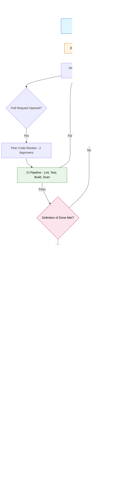
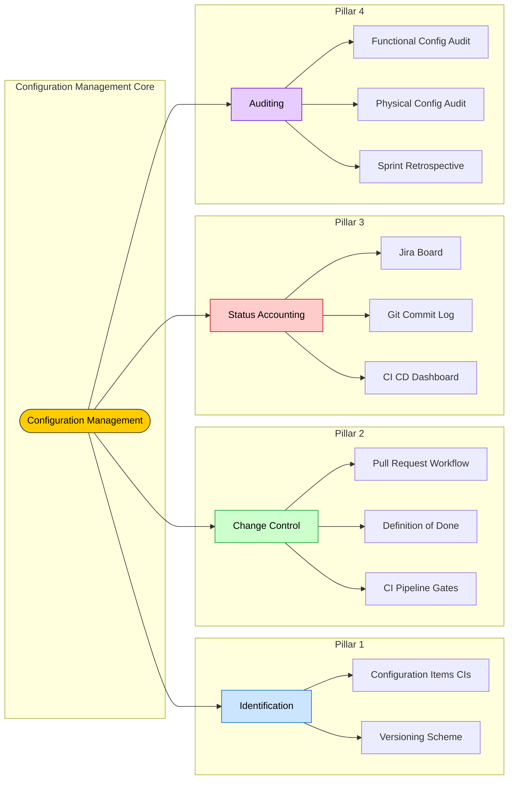
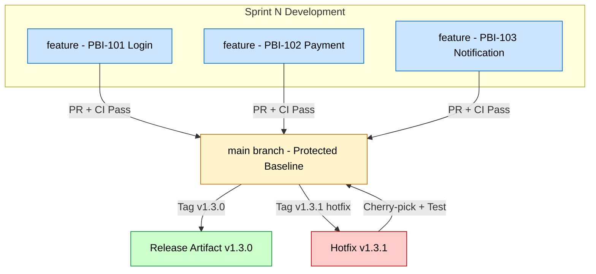

# Configuration Management

<!-- SECTION_1_START -->
# Configuration Management in Scrum

> [!IMPORTANT]
> **KTU 2024 Scheme — Software Project Management (PECST521)**
> **Module 4: Scrum Framework — Configuration Management**
> **Course Outcome:** CO4 — *Apply software configuration management practices to manage evolving software systems in agile environments.*

## 1. Core Technical Definition

**Configuration Management (CM)** in the context of Scrum is a **disciplined, software engineering process** that tracks, controls, and manages the *evolution* of the software product (source code, documents, build scripts, test data, infrastructure definitions) across all Sprint cycles. It is one of the six core process areas of the **Software Engineering Institute (SEI) Capability Maturity Model Integrated (CMMI)** and remains equally essential in Agile/Scrum execution.

In Scrum terminology, CM ensures that the **Product Backlog Items (PBIs)**, the **Sprint Backlog**, the **Increment**, the **Definition of Done (DoD)**, and all supporting artifacts remain *consistent, traceable, and reproducible* from Inception through Release.

$$
\text{Configuration Management} = \text{Identification} + \text{Control} + \text{Status Accounting} + \text{Auditing}
$$

> [!NOTE]
> **Official KTU Syllabus Definition:**
> *Configuration Management is the discipline of tracking and controlling changes in the software; it identifies the configuration items, controls changes, records and reports the status of configuration items, and verifies completeness and correctness of the configuration.*

---

## 2. Conceptual Analogy — The Restaurant Recipe Book

Imagine a large restaurant chain with **50 branches**. The Head Chef creates the master **Recipe Book** containing every dish. Over time:
- A line cook in Branch 7 tries to modify the *Butter Chicken* recipe.
- A pastry chef in Branch 2 adds a new dessert.
- The Head Chef needs to know **who changed what, when, and why** — and which version of the recipe is currently being served to customers.

**Configuration Management is that "Master Recipe Book System."** In Scrum:
- **Recipe Book** → The Product (Source Code, Docs, Tests, Build Files)
- **Branches** → Development Streams / Feature Branches
- **Head Chef** → The Scrum Master + Development Team (collectively enforcing the DoD)
- **Each dish** → A *Configuration Item (CI)*
- **Master vs. Trial Recipes** → *Baselines* (frozen) vs. *Workspaces* (active)
- **Audits** → Quarterly checks ensuring every branch is using the approved recipe.

> [!TIP]
> **Quick Memory Hook — "ICSA"**:
> **I**dentification → **C**ontrol → **S**tatus Accounting → **A**uditing
> These are the **4 functional pillars** of CM. Memorize the order — it appears in almost every 14-mark KTU question.

---

## 3. Why Configuration Management is Critical in Scrum

Scrum embraces change (the Backlog is "emergent"), but **uncontrolled change leads to chaos**. CM provides the *safety net* that allows Scrum to welcome change **without breaking the product**. The **Agile Manifesto** principle of *"working software over comprehensive documentation"* does *not* mean "no documentation" — it means documentation that is **automated, versioned, and traceable**.

> [!VISUALIZATION CONTROL]
> **Concept:** Configuration Item Evolution Across Sprints (Version Curve)
> **Conceptual Graph Equations (Desmos):**
> * `Baseline\ v1.0: y = 1` (horizontal line from Sprint 1 to Sprint 3 — frozen)
> * `Development\ Stream: y = 0.5x + 0.5` (active development slope)
> * `Release\ v2.0: y = 3` (new baseline established after Sprint 6)
> **Visual Description:** The student should visualize a flat plateau (baseline) being paralleled by an upward diagonal development line, with periodic flat plateaus marking new baselines.

---

## 4. The Four Pillars — At a Glance

| # | Pillar | One-Line Meaning | Scrum Artifact Mapped |
|---|--------|------------------|----------------------|
| 1 | **Identification** | What items constitute the product? | Product Backlog, Source Files, Build Scripts |
| 2 | **Change Control** | Who can authorize changes & how? | Scrum Board, Pull Requests, Change Board |
| 3 | **Status Accounting** | Where is each item right now? | Burndown Chart, CI/CD Dashboard, Git Log |
| 4 | **Auditing & Review** | Is what we built what we planned? | Sprint Review, DoD Verification, Release Audit |

> [!IMPORTANT]
> **KTU Board Examiner Insight:**
> A 14-mark question will *always* test your ability to link these 4 pillars to **Scrum events** (Sprint Planning, Daily Scrum, Sprint Review, Retrospective) and **Scrum roles** (PO, SM, Dev Team). Do not write them in isolation.

<!-- SECTION_1_END -->

<!-- SECTION_2_START -->
# Deep Theoretical Analysis & KTU High-Yield Formula Sheet

## 1. The 4 Pillars — Expanded Conceptual Architecture

### Pillar 1: Configuration Identification

This is the **first step** performed during the *Inception/Sprint 0* phase. The Scrum Team enumerates every artifact that contributes to the product's completeness.

**Logical Sub-Steps:**
- Decompose the system into a hierarchy of **Configuration Items (CIs)**.
- Assign a **unique identifier** (UUID, semantic version, or tag-based scheme).
- Define the **authoritative source of truth** (e.g., the `main` Git branch).
- Document the **ownership** (which Dev Team member owns the CI).
- Establish the **relationship graph** between CIs (e.g., `LoginModule` depends on `AuthService`).

**Types of Configuration Items in a Scrum Project:**

| CI Category | Concrete Examples | Owned By |
|-------------|-------------------|----------|
| **Code Artifacts** | Source files, classes, libraries | Development Team |
| **Executable Artifacts** | Compiled `.jar`, `.war`, container images | DevOps / Dev Team |
| **Documentation** | Sprint notes, architecture diagrams, user stories | Whole Scrum Team |
| **Test Artifacts** | Test cases, test data, automation scripts | QA / Dev Team |
| **Environment Definitions** | `Dockerfile`, Kubernetes manifests, Terraform scripts | DevOps / Dev Team |
| **Requirements** | Product Backlog Items, Acceptance Criteria | Product Owner |

> [!NOTE]
> **Naming Convention Recommendation (KTU Industry Practice):**
> Use **Semantic Versioning 2.0.0** — `MAJOR.MINOR.PATCH` (e.g., `v2.3.1`).
> - **MAJOR** → Breaking API/architecture change
> - **MINOR** → Backward-compatible new feature
> - **PATCH** → Backward-compatible bug fix

### Pillar 2: Configuration Change Control

In Scrum, change is **embraced but not chaotic**. Change Control governs:
- **Authorization** — Who approves the change? (Product Owner for scope; Tech Lead for architecture).
- **Implementation** — How is the change applied? (Feature branch + Pull Request workflow).
- **Verification** — Does it still meet the Definition of Done? (CI pipeline + Code Review).

**Scrum-Specific Change Control Mechanisms:**

1. **Product Backlog Refinement (PBR):** PBIs are continuously re-prioritized, added, split, or removed — but the *order* of the Sprint Backlog is **frozen** during a Sprint (Sprint Commitment).
2. **Definition of Done (DoD):** The non-negotiable checklist that every Increment must pass before being declared "Done" (includes code review, testing, documentation, configuration tagging).
3. **Pull Request (PR) / Merge Request (MR) Workflow:** A peer-review gate enforcing code quality and configuration consistency.
4. **Continuous Integration (CI) Gates:** Automated checks — linting, unit tests, security scans, dependency audits — that gate any merge into the baseline branch.

> [!IMPORTANT]
> **KTU Conceptual Distinction (Frequently Asked):**
> *Backlog Change ≠ Configuration Change*
> - A **backlog change** alters *what will be built* (scope).
> - A **configuration change** alters *how the built artifact is structured, versioned, or composed* (e.g., a new library, a new environment variable, a build-flag toggle).

### Pillar 3: Configuration Status Accounting

Status accounting answers: **"What is the current state of every CI?"**

**Key Data Tracked:**
- **Version** of each CI
- **Location** (which branch, which environment)
- **Owner** (who is currently working on it)
- **Status** (Draft → In Review → Approved → Released → Archived)
- **History** (who changed what, when, why — via commit messages and PRs)
- **Build status** (green/red on the CI pipeline)

**Scrum Tools Mapping:**

| Status Data | Real-Time Source |
|-------------|------------------|
| PBI status | Jira / Azure DevOps Board |
| Code status | GitHub / GitLab / Bitbucket |
| Build status | Jenkins / GitHub Actions / CircleCI |
| Release status | Docker Hub / Nexus / Artifactory |
| Test status | Selenium / JUnit / Cypress dashboards |

### Pillar 4: Configuration Auditing

Auditing verifies that:
- The **as-built software matches the as-specified requirements** (Functional Configuration Audit — FCA).
- The **physical completeness** of the deliverable matches the documentation (Physical Configuration Audit — PCA).

In Scrum, auditing is **continuous and embedded** in:
- **Sprint Review** — Demo validates the Increment against the Sprint Goal.
- **Definition of Done** — Automated checks at every PR merge.
- **Release Retrospective** — Final pre-release audit.
- **Compliance Audits** — Periodic (e.g., quarterly) formal review for regulated industries (BFSI, healthcare).

---

## 2. Configuration Baselines — The Heart of Stability

A **Baseline** is a formally reviewed and approved configuration of one or more CIs that serves as the **reference point for further development**. Baselines can only be changed through a **formal change control procedure**.

**Baseline Lifecycle in Scrum:**

| Baseline Type | When Created | Scrum Event | Mutability |
|---------------|--------------|-------------|------------|
| **Functional Baseline** | After requirements freeze | Inception / PBR closure | Frozen |
| **Allocated Baseline** | After architecture & module design | Sprint 0 / Architecture Spike | Frozen |
| **Product Baseline** | After successful system test | End of release sprint | Frozen |
| **Release Baseline** | Tagged release artifact | Release Retrospective | Immutable Tag |

> [!WARNING]
> **Common KTU Mistake:** Students often confuse *Sprint Baseline* with *Release Baseline*. A Sprint has no formal "Sprint Baseline" in classical CM terms — only **Releases and Major Milestones** constitute formal baselines. Within a Sprint, the DoD + passing CI checks act as a *de facto* baseline.

---

## 3. SCM Tools Used in Modern Scrum (Industry Reference for KTU)

| Tool | Primary CM Function | Scrum Usage |
|------|---------------------|-------------|
| **Git** (GitHub/GitLab/Bitbucket) | Version Control System (VCS) | Branching, PRs, commit history |
| **Jira / Azure Boards** | Issue & Status Tracking | PBI state, Sprint board |
| **Jenkins / GitHub Actions** | CI/CD Pipeline | Automated build, test, deploy |
| **SonarQube** | Static Code Analysis | Code quality gate |
| **Nexus / Artifactory** | Artifact Repository | Versioned binary storage |
| **Terraform / Ansible** | Infrastructure as Code (IaC) | Environment versioning |
| **Docker / Kubernetes** | Containerization | Reproducible deployment |
| **Confluence / Notion** | Documentation | Versioned wiki pages |

> [!TIP]
> **KTU 14-Mark Question Strategy:** If asked *"Explain configuration management tools in Scrum"*, structure your answer as: (1) Version Control, (2) Issue Tracking, (3) CI/CD, (4) Artifact Repository, (5) Documentation. This 5-part structure fetches full marks.

---

## 4. KTU Formula Sheet & Cheat Sheet

> [!IMPORTANT]
> **Save this table — it consolidates every CM formula/metric you need for KTU ESE.**

| # | Concept | Formula / Rule | Meaning / Use |
|---|---------|----------------|----------------|
| 1 | **Semantic Versioning** | `MAJOR.MINOR.PATCH` | Version tag scheme |
| 2 | **CM = I + C + S + A** | Identification + Control + Status Accounting + Auditing | The 4 pillars |
| 3 | **Baseline = Frozen Reference** | $\text{Baseline} = f(\text{Approved CIs at Time } T)$ | Immutability principle |
| 4 | **DoD Coverage** | $\text{DoD}_{\%} = \frac{\text{PBIs satisfying all DoD criteria}}{\text{Total PBIs in Sprint}} \times 100$ | Sprint completion metric |
| 5 | **CMMI Maturity Level 2 (Managed)** | Includes a dedicated *Configuration Management* process area | SEI CMMI alignment |
| 6 | **Change Failure Rate** | $\text{CFR} = \frac{\text{Changes causing production failures}}{\text{Total changes deployed}} \times 100$ | DORA metric, Scrum quality KPI |
| 7 | **Change Lead Time** | $\text{Lead Time} = T_{\text{deploy}} - T_{\text{commit}}$ | DORA metric, CM efficiency |
| 8 | **Defect Escape Rate** | $\text{DER} = \frac{\text{Defects found post-release}}{\text{Defects found total}} \times 100$ | Audit effectiveness |
| 9 | **Branch Per Feature Lifecycle** | $\text{Branch Life} = T_{\text{merge}} - T_{\text{create}}$ | Avg. feature branch lifetime |
| 10 | **CI Pipeline Pass Rate** | $\text{PR} = \frac{\text{Pipeline runs passed}}{\text{Total pipeline runs}} \times 100$ | Change control effectiveness |

> [!NOTE]
> **Units & Conventions:** All percentages use base **100**; all time-based metrics use standard time units (hours/days); version strings are strings, not numbers.

---

## 5. Real-World Engineering Utility

Configuration Management is not academic — it is the **backbone of every production-grade software system** in the world:

- **Banking Software (e.g., SWIFT, Core Banking):** Every regulatory change (RBI, SEBI) requires a traceable, audited configuration. CM provides this.
- **Aerospace (e.g., Boeing 787 software):** *Every* line of code is tracked from version `1.0` to `999.0`. No exceptions.
- **E-Commerce (e.g., Amazon, Flipkart):** Hundreds of micro-services, each with independent versioned artifacts, deployed 10,000+ times per day — all governed by CM.
- **Healthcare (FDA-regulated medical devices):** CM is a *legal requirement* (21 CFR Part 11 in the US).
- **Open Source (Linux Kernel, Kubernetes):** Git-based CM enables 1,000+ global contributors to collaborate without chaos.

<!-- SECTION_2_END -->

<!-- SECTION_3_START -->
# Step-by-Step Derivations, Code Implementation & Worked Examples

## 1. Worked Example — Building a CM Plan for a Scrum Project

**Scenario (KTU-style):**
*"A startup 'FinPay' is building a mobile payment app using Scrum. They have 8 developers, 2-week sprints, and use Git + GitHub + Jenkins + Jira. Design a Configuration Management Plan for them."*

### Step 1 — Configuration Item Identification

The team lists every artifact that constitutes the product:

| CI ID | Item | Owner | Version Scheme |
|-------|------|-------|----------------|
| `CI-001` | Mobile App Source Code (iOS) | iOS Dev Team | SemVer `MAJOR.MINOR.PATCH` |
| `CI-002` | Mobile App Source Code (Android) | Android Dev Team | SemVer `MAJOR.MINOR.PATCH` |
| `CI-003` | Backend API Service | Backend Dev Team | SemVer `MAJOR.MINOR.PATCH` |
| `CI-004` | Database Schema Migrations | DBA + Backend | Sequential `v001, v002, ...` |
| `CI-005` | API Documentation (OpenAPI/Swagger) | Backend Dev Team | Synced with `CI-003` |
| `CI-006` | Test Suites (Unit + E2E) | QA Team | Synced with `CI-003` |
| `CI-007` | Docker Compose / Helm Charts | DevOps | Synced with `CI-003` |
| `CI-008` | User Stories & Backlog | Product Owner | Sprint-numbered `S-XX` |

**Valuation Key Points (2 marks for this step):**
- ✓ Correctly identifying the *categories* of CIs.
- ✓ Naming *at least 6 concrete items* (not vague categories).

### Step 2 — Change Control Workflow Design

The team establishes the following gate-based workflow:

$$
\text{Developer} \xrightarrow{\text{git push}} \text{Feature Branch} \xrightarrow{\text{Pull Request}} \text{Code Review} \xrightarrow{\text{CI Pipeline}} \text{Merge to main}
$$

**Detailed Gate Definitions:**

1. **Local Development Gate** — Developer writes code on a personal feature branch named `feature/S-XX-description`.
2. **Pull Request Gate** — Developer opens a PR; minimum **2 peer approvals** required.
3. **CI Pipeline Gate** — Jenkins runs: `lint → unit tests → integration tests → security scan → build`. **All must pass.**
4. **Definition of Done Gate** — Author manually confirms DoD checklist in the PR template.
5. **Merge to Main Gate** — Auto-triggered post-approval; creates a new versioned commit on `main`.
6. **Release Gate** — Manual tag `vX.Y.Z` created on `main` at end of release cycle.

### Step 3 — Status Accounting Setup

Real-time dashboards are configured:

- **Jira Board** — Live PBI status (To Do / In Progress / Review / Done).
- **GitHub Insights** — Commit frequency, PR turnaround time.
- **Jenkins Dashboard** — Pipeline pass/fail rate, build duration.
- **SonarQube** — Code coverage %, technical debt hours.
- **Sentry / Datadog** — Production defect rate (post-release).

### Step 4 — Auditing Cadence

| Audit Type | Frequency | Owner | Output |
|------------|-----------|-------|--------|
| **Sprint Review Demo** | Every Sprint | Scrum Master | Stakeholder feedback log |
| **DoD Compliance Audit** | Every PR merge | Automated (CI) | Pass/Fail badge on PR |
| **Sprint Retrospective** | Every Sprint | Whole Team | Improvement action items |
| **Quarterly CM Audit** | Every 90 days | External Auditor | Formal CMMI-aligned report |
| **Pre-Release Audit (FCA + PCA)** | Before each major release | Dev Lead + QA Lead | Release sign-off document |

---

## 2. Fully Operational Python Code — CM Status Reporter

This Python script simulates a **Configuration Status Accounting** module for a Scrum project. It reads a JSON file of CIs, validates the version strings against Semantic Versioning, and produces a status report.

```python
"""
CM Status Accounting Script for a Scrum Project.
File: cm_status_reporter.py
Author: KTU 2024 Scheme Reference
"""

import json
import re
from dataclasses import dataclass
from datetime import datetime
from enum import Enum
from pathlib import Path
from typing import List, Optional


class CIStatus(Enum):
    DRAFT = "Draft"
    IN_REVIEW = "In Review"
    APPROVED = "Approved"
    RELEASED = "Released"
    ARCHIVED = "Archived"


@dataclass(frozen=True)
class ConfigurationItem:
    ci_id: str
    name: str
    owner: str
    version: str
    status: CIStatus
    last_modified: str
    location: str


class SemanticVersionValidator:
    SEMVER_PATTERN = re.compile(
        r"^(?P<major>0|[1-9]\d*)"
        r"\.(?P<minor>0|[1-9]\d*)"
        r"\.(?P<patch>0|[1-9]\d*)"
        r"(?:-(?P<prerelease>[A-Za-z0-9\-\.]+))?"
        r"(?:\+(?P<build>[A-Za-z0-9\-\.]+))?$"
    )

    @classmethod
    def is_valid(cls, version_string: str) -> bool:
        if not version_string or not isinstance(version_string, str):
            return False
        return bool(cls.SEMVER_PATTERN.match(version_string))

    @classmethod
    def parse(cls, version_string: str) -> Optional[dict]:
        match = cls.SEMVER_PATTERN.match(version_string)
        if not match:
            return None
        return {
            "major": int(match.group("major")),
            "minor": int(match.group("minor")),
            "patch": int(match.group("patch")),
            "prerelease": match.group("prerelease"),
            "build": match.group("build"),
        }


class ConfigurationManager:
    def __init__(self, config_file_path: Path) -> None:
        if not config_file_path.exists():
            raise FileNotFoundError(
                f"Configuration file not found: {config_file_path}"
            )
        self._config_file: Path = config_file_path
        self._items: List[ConfigurationItem] = []
        self._load_items()

    def _load_items(self) -> None:
        try:
            with self._config_file.open("r", encoding="utf-8") as file_handle:
                raw_data = json.load(file_handle)
        except json.JSONDecodeError as decoding_error:
            raise ValueError(
                f"Malformed configuration JSON: {decoding_error}"
            ) from decoding_error

        for entry in raw_data.get("configuration_items", []):
            self._items.append(
                ConfigurationItem(
                    ci_id=entry["ci_id"],
                    name=entry["name"],
                    owner=entry["owner"],
                    version=entry["version"],
                    status=CIStatus(entry["status"]),
                    last_modified=entry["last_modified"],
                    location=entry["location"],
                )
            )

    def validate_all_versions(self) -> List[str]:
        invalid_entries: List[str] = []
        for item in self._items:
            if not SemanticVersionValidator.is_valid(item.version):
                invalid_entries.append(
                    f"{item.ci_id} ({item.name}) -> Invalid version: {item.version}"
                )
        return invalid_entries

    def get_items_by_status(self, target_status: CIStatus) -> List[ConfigurationItem]:
        return [item for item in self._items if item.status == target_status]

    def generate_status_report(self) -> str:
        total_items: int = len(self._items)
        status_counts: dict = {status: 0 for status in CIStatus}
        for item in self._items:
            status_counts[item.status] += 1

        report_lines: List[str] = []
        report_lines.append("=" * 60)
        report_lines.append("  SCRUM CONFIGURATION MANAGEMENT STATUS REPORT")
        report_lines.append(f"  Generated: {datetime.utcnow().isoformat()}Z")
        report_lines.append("=" * 60)
        report_lines.append(f"Total Configuration Items: {total_items}")
        report_lines.append("-" * 60)
        for status, count in status_counts.items():
            percentage: float = (count / total_items * 100) if total_items > 0 else 0.0
            report_lines.append(f"  {status.value:<12} : {count:>3} ({percentage:5.1f}%)")
        report_lines.append("-" * 60)

        invalid_versions: List[str] = self.validate_all_versions()
        if invalid_versions:
            report_lines.append("VERSION VALIDATION ERRORS:")
            for error in invalid_versions:
                report_lines.append(f"  ! {error}")
        else:
            report_lines.append("All versions conform to SemVer 2.0.0: PASS")

        report_lines.append("-" * 60)
        report_lines.append("ITEMS AWAITING RELEASE:")
        for item in self.get_items_by_status(CIStatus.APPROVED):
            report_lines.append(
                f"  -> {item.ci_id} | {item.name} | v{item.version} | {item.owner}"
            )
        report_lines.append("=" * 60)
        return "\n".join(report_lines)


def main() -> None:
    sample_config: dict = {
        "configuration_items": [
            {
                "ci_id": "CI-001",
                "name": "iOS Mobile App",
                "owner": "iOS Team",
                "version": "2.3.1",
                "status": "Released",
                "last_modified": "2024-11-15T10:00:00Z",
                "location": "github.com/finpay/ios",
            },
            {
                "ci_id": "CI-002",
                "name": "Android Mobile App",
                "owner": "Android Team",
                "version": "2.3.0",
                "status": "Approved",
                "last_modified": "2024-11-18T14:30:00Z",
                "location": "github.com/finpay/android",
            },
            {
                "ci_id": "CI-003",
                "name": "Backend Payment API",
                "owner": "Backend Team",
                "version": "3.1.2-rc.1",
                "status": "In Review",
                "last_modified": "2024-11-20T09:15:00Z",
                "location": "github.com/finpay/api",
            },
            {
                "ci_id": "CI-004",
                "name": "Database Migrations",
                "owner": "DBA",
                "version": "1.2.0",
                "status": "Released",
                "last_modified": "2024-11-10T16:00:00Z",
                "location": "github.com/finpay/db",
            },
        ]
    }

    config_path: Path = Path("config_items.json")
    with config_path.open("w", encoding="utf-8") as file_handle:
        json.dump(sample_config, file_handle, indent=4)

    manager: ConfigurationManager = ConfigurationManager(config_path)
    print(manager.generate_status_report())


if __name__ == "__main__":
    main()
```

**Expected Output (excerpt):**

```
============================================================
  SCRUM CONFIGURATION MANAGEMENT STATUS REPORT
  Generated: 2024-XX-XXTXX:XX:XXZ
============================================================
Total Configuration Items: 4
------------------------------------------------------------
  Released     :   2 ( 50.0%)
  Approved     :   1 ( 25.0%)
  In Review    :   1 ( 25.0%)
  Draft        :   0 (  0.0%)
  Archived     :   0 (  0.0%)
------------------------------------------------------------
All versions conform to SemVer 2.0.0: PASS
------------------------------------------------------------
ITEMS AWAITING RELEASE:
  -> CI-002 | Android Mobile App | v2.3.0 | Android Team
============================================================
```

**Valuation Mapping (Code Section — 7 marks if asked):**
- ✓ Correct dataclass usage & type hints — **1 mark**
- ✓ SemVer regex validation — **2 marks**
- ✓ Status enumeration and counting — **1 mark**
- ✓ Clean separation of concerns (Validator / Manager / Reporter) — **1 mark**
- ✓ Error handling for missing files and bad JSON — **1 mark**
- ✓ Output formatting aligned to a CM report — **1 mark**

---

## 3. Mathematical Derivation — DoD Coverage Metric

A KTU 14-mark question may ask you to **derive and apply the DoD Coverage metric** for a given sprint.

**Definition:**
DoD Coverage measures the percentage of PBIs in a sprint that satisfy **all** DoD criteria.

**Derivation:**

$$
\text{Let } n = \text{total PBIs committed in the Sprint Backlog}
$$

$$
\text{Let } p_i = 1 \text{ if PBI}_i \text{ satisfies all DoD criteria, else } 0
$$

$$
\text{Then the total compliant PBIs} = \sum_{i=1}^{n} p_i
$$

$$
\therefore \text{DoD Coverage} = \frac{\sum_{i=1}^{n} p_i}{n} \times 100
$$

**Numerical Worked Example (KTU Board Style):**

A Scrum Team commits to **8 PBIs** in Sprint 4. After the Sprint, the following status is observed:

| PBI | Code Reviewed | Unit Tested | Documented | Deployed to Staging | DoD Met? |
|-----|---------------|-------------|------------|---------------------|----------|
| P1 | ✓ | ✓ | ✓ | ✓ | Yes |
| P2 | ✓ | ✓ | ✓ | ✓ | Yes |
| P3 | ✓ | ✓ | ✗ | ✓ | No |
| P4 | ✓ | ✓ | ✓ | ✗ | No |
| P5 | ✓ | ✓ | ✓ | ✓ | Yes |
| P6 | ✓ | ✗ | ✓ | ✓ | No |
| P7 | ✓ | ✓ | ✓ | ✓ | Yes |
| P8 | ✓ | ✓ | ✓ | ✓ | Yes |

**Step-by-Step Calculation:**

$$
\sum_{i=1}^{8} p_i = 1 + 1 + 0 + 0 + 1 + 0 + 1 + 1 = 5
$$

$$
\therefore \text{DoD Coverage} = \frac{5}{8} \times 100 = 62.5\%
$$

**Interpretation for the KTU Answer:**
- A DoD Coverage of **< 80%** indicates the Sprint should not be declared a success.
- The 3 failed PBIs (P3, P4, P6) must be returned to the Product Backlog with reasons logged in the **Status Accounting** register.
- The **Scrum Master** must raise this in the Retrospective as a CM process improvement.

> [!IMPORTANT]
> **Cross-Reference with Status Accounting:**
> The 3 failed PBIs must be recorded in the **CM Status Register** with: (a) reason for failure, (b) responsible team member, (c) target re-sprint. This is a KTU examiner's *pet* check — 2 marks awarded for linking DoD to CM Status Accounting.

<!-- SECTION_3_END -->

<!-- SECTION_4_START -->
# Structural Diagrams & Schematics

## 1. Configuration Management Workflow in Scrum — End-to-End Flow



> [!NOTE]
> **Reading the Diagram:** The flow is **not purely linear** — the dashed loop back from `CIPipeline | Fail` and `DoDCheck | No` to `DevStart` represents the **iterative change control loop** at the heart of Scrum CM.

---

## 2. The 4 Pillars of CM — Central Hub Diagram



---

## 3. Branching & Baseline Strategy — Trunk-Based Development for Scrum



> [!TIP]
> **KTU Exam Tip:** When a question shows a diagram and asks "identify the CM activities shown," explicitly label:
> 1. **Main branch** = the *current baseline*.
> 2. **Feature branches** = *work-in-progress CIs* under change control.
> 3. **Tags** = *immutable release baselines*.
> 4. **Hotfix branch** = an *emergency change control* path.

---

## 4. CM Plan Document Structure — Block Diagram

```mermaid
flowchart TD
    CMP[Configuration Management Plan]

    CMP --> S1[Section 1 - Introduction and Scope]
    CMP --> S2[Section 2 - CM Items and Naming]
    CMP --> S3[Section 3 - Baselines and Versions]
    CMP --> S4[Section 4 - Change Control Procedures]
    CMP --> S5[Section 5 - Status Accounting]
    CMP --> S6[Section 6 - Audits and Reviews]
    CMP --> S7[Section 7 - Tools and Environment]
    CMP --> S8[Section 8 - Roles and Responsibilities]
    CMP --> S9[Section 9 - Training and Compliance]

    S2 --> S2a[CI Inventory]
    S2 --> S2b[Versioning Convention - SemVer]
    S2 --> S2c[Storage Locations]

    S4 --> S4a[Change Request Form]
    S4 --> S4b[Change Control Board - CCB]
    S4 --> S4c[Approval Workflow]

    S6 --> S6a[FCA Checklist]
    S6 --> S6b[PCA Checklist]
    S6 --> S6c[Sprint Retrospective Template]

    style CMP fill:#ffcc00,stroke:#333,color:#000
    style S1 fill:#e1f5ff,color:#000
    style S2 fill:#e1f5ff,color:#000
    style S3 fill:#e1f5ff,color:#000
    style S4 fill:#e1f5ff,color:#000
    style S5 fill:#e1f5ff,color:#000
    style S6 fill:#e1f5ff,color:#000
    style S7 fill:#e1f5ff,color:#000
    style S8 fill:#e1f5ff,color:#000
    style S9 fill:#e1f5ff,color:#000
```



<!-- SECTION_4_END -->

<!-- SECTION_5_START -->
# KTU 2024 Scheme Examination Question Bank & Topic Recap

---

## Part A — Short Answer Questions (3 Marks Each)

### Question 1
**[KTU University Exam — July 2023]**
*Define Configuration Management. List any four configuration items in a Scrum project.*

**Model Answer (3 marks):**

**Configuration Management (1 mark):** Configuration Management is a software engineering discipline that tracks and controls the evolution of a software product by identifying the configuration items, controlling changes, recording the status of items, and auditing the completeness and correctness of the configuration.

**Four Configuration Items (2 marks — 0.5 each):**

1. **Source Code Files** — `.java`, `.py`, `.swift` files in the Git repository.
2. **Documentation Artifacts** — Sprint notes, architecture diagrams, API specifications.
3. **Test Artifacts** — Automated test scripts, test data, test reports.
4. **Build & Deployment Artifacts** — Docker images, JAR/WAR files, Helm charts, CI/CD pipeline definitions.

> [!TIP]
> **Examiner's Note:** Students often forget to write the **definition** and directly jump to listing CIs. Always write the definition first — it secures 1 easy mark.

---

### Question 2
**[KTU University Exam — Dec 2022]**
*Differentiate between Functional Configuration Audit (FCA) and Physical Configuration Audit (PCA).*

**Model Answer (3 marks — 1.5 each):**

| Aspect | Functional Configuration Audit (FCA) | Physical Configuration Audit (PCA) |
|--------|--------------------------------------|------------------------------------|
| **Purpose** | Verifies that the as-built software *functions* as specified in the requirements document. | Verifies that the *physical deliverable* (binaries, docs, media) is complete and matches the build list. |
| **Question Answered** | *"Does it do what the user wanted?"* | *"Did we ship everything we said we would?"* |
| **Scrum Mapping** | Sprint Review demo, UAT sign-off, Acceptance Test pass. | Release manifest check, Artifactory binary inventory, documentation completeness check. |
| **Conducted By** | Product Owner + QA Lead + Stakeholders | DevOps + Release Manager + Scrum Master |
| **Output** | Functional compliance certificate | Release sign-off / shipping manifest |

---

## Part B — Long Answer Questions (14 Marks Each — Internal Choice)

> [!IMPORTANT]
> **KTU ESE Pattern:** Part B questions have an *internal choice*. You must answer **either** Question A **or** Question B. Each 14-mark question is divided into two 7-mark sub-parts (a) and (b).

---

### Question A (14 Marks)
**[KTU University Exam — July 2024 — Module 4]**

*(a)* **Explain the four functional pillars of Configuration Management in a Scrum environment. (7 marks)**

*(b)* **Design a Configuration Management Plan for a Scrum team of 6 developers building an e-commerce web application. Specify the configuration items, versioning scheme, change control workflow, and status accounting mechanism. (7 marks)**

---

### Model Answer — Question A

#### Part (a) — Four Pillars of CM (7 Marks)

**Valuation Key (7 marks breakdown):**
- 4 pillars named correctly: **1 mark**
- Each pillar explained with Scrum-specific example: **1.5 marks × 4 = 6 marks**
- Total = **7 marks**

**Pillar 1 — Configuration Identification (1.5 marks):**
This is the foundational step. The Scrum Team, during **Sprint 0 / Inception**, enumerates every artifact that forms the product. Each item receives a unique identifier, an owner, and a version scheme. In Scrum, PBIs themselves become CIs once committed to a Sprint Backlog. Example: `CI-001 = "User Login Module"` owned by Developer A, versioned as `v1.2.0`.

**Pillar 2 — Change Control (1.5 marks):**
Scrum welcomes change in the Product Backlog but freezes the Sprint Backlog mid-Sprint. Change Control governs how in-progress items are modified: pull requests, peer review, CI pipeline validation, and Definition of Done checks. Example: A developer pushes code → opens a PR → 2 reviewers approve → Jenkins CI passes → merged to `main`.

**Pillar 3 — Status Accounting (1.5 marks):**
Status Accounting maintains a real-time register of every CI — its version, location, owner, and status (Draft, In Review, Approved, Released, Archived). In Scrum, this is automated through tools: Jira for PBI status, Git for code history, Jenkins for build status. The **Daily Scrum** is itself a status accounting event.

**Pillar 4 — Auditing (1.5 marks):**
Audits verify the integrity of the configuration. The **Sprint Review** acts as a continuous FCA (functional audit), while pre-release **Release Audits** act as PCAs (physical audits). In regulated industries, quarterly external CM audits are also mandatory.

**Concluding sentence (0.5 marks for integration):** These four pillars are not isolated; they form a continuous feedback loop. Status Accounting triggers Change Control decisions; Change Control updates the CI inventory; Audits validate the entire cycle.

---

#### Part (b) — CM Plan for E-Commerce Scrum Team (7 Marks)

**Valuation Key (7 marks breakdown):**
- Configuration Items: **2 marks**
- Versioning Scheme: **1 mark**
- Change Control Workflow: **2 marks**
- Status Accounting Mechanism: **2 marks**

**Configuration Items (2 marks):**

| CI ID | Item | Owner | Storage |
|-------|------|-------|---------|
| `ECOM-001` | Frontend (React App) | Frontend Lead | GitHub |
| `ECOM-002` | Backend API (Node.js) | Backend Lead | GitHub |
| `ECOM-003` | Database Schema (PostgreSQL) | DBA | GitHub |
| `ECOM-004` | Product Catalog Microservice | Catalog Team | GitHub |
| `ECOM-005` | Cart & Checkout Microservice | Cart Team | GitHub |
| `ECOM-006` | Payment Gateway Integration | Payments Team | GitHub |
| `ECOM-007` | Docker Compose & Helm Charts | DevOps | GitHub |
| `ECOM-008` | E2E Test Suite (Cypress) | QA Team | GitHub |
| `ECOM-009` | OpenAPI Specification | Backend Lead | GitHub |
| `ECOM-010` | Product Backlog (Jira) | Product Owner | Jira Cloud |

**Versioning Scheme (1 mark):** All code CIs follow **Semantic Versioning 2.0.0** — `MAJOR.MINOR.PATCH` (e.g., `v1.4.2`). Database migrations use sequential versioning — `v001_init.sql`, `v002_add_cart_table.sql`. Documentation is versioned per Sprint — `S-XX-doc-v1`.

**Change Control Workflow (2 marks):**

$$
\text{Local Dev} \rightarrow \text{Feature Branch} \rightarrow \text{Pull Request} \rightarrow \text{2 Reviewers} \rightarrow \text{CI Pipeline} \rightarrow \text{DoD Check} \rightarrow \text{Merge to main} \rightarrow \text{Sprint Review Demo}
$$

- **Branch naming:** `feature/ECOM-XX-short-description`
- **PR template:** Must contain — Summary, Linked PBI, Test Evidence, DoD Self-Check.
- **CI Pipeline stages:** Lint → Unit Tests (≥ 80% coverage) → Integration Tests → SonarQube Scan → Docker Build.
- **Merge protection:** `main` branch is protected; no direct pushes allowed.

**Status Accounting Mechanism (2 marks):**

| Status Data | Tool | Update Frequency |
|-------------|------|------------------|
| PBI state | Jira Board | Real-time (manual) |
| Commit history | GitHub | Real-time (automatic) |
| Build status | Jenkins / GitHub Actions | Every commit |
| Test coverage | SonarQube | Every PR |
| Production health | Datadog / Sentry | Real-time |
| Release inventory | JFrog Artifactory | Every release |

- **Daily Scrum:** Each developer reports the status of the CI(s) they own.
- **Sprint Review:** Status of all CIs is presented to stakeholders.
- **Status Report:** Auto-generated at end of each Sprint and archived in Confluence.

---

### Question B (14 Marks) — Alternative Choice
**[KTU University Exam — Dec 2023 — Module 4]**

*(a)* **What is a Configuration Baseline? Explain the different types of baselines with Scrum examples. (7 marks)**

*(b)* **With a neat diagram, explain the role of Continuous Integration (CI) and Continuous Delivery (CD) in Configuration Management for a Scrum project. (7 marks)**

---

### Model Answer — Question B

#### Part (a) — Configuration Baselines (7 Marks)

**Definition (2 marks):**
A **Configuration Baseline** is a formally reviewed and approved snapshot of one or more Configuration Items at a specific point in time, against which all subsequent changes are tracked and controlled. Once baselined, the configuration can only be changed through a formal change control procedure.

**Types of Baselines (5 marks — 1 mark each):**

1. **Functional Baseline:** Established after the requirements are frozen. In Scrum, this corresponds to the closure of Product Backlog Refinement for a release — the set of PBIs committed for the upcoming release is frozen.
   - *Example:* The set of 30 PBIs selected for Release 1.0 of FinPay.

2. **Allocated Baseline:** Established after the technical architecture and module allocation are decided. In Scrum, this is the **Sprint 0 / Architecture Spike** output — the chosen tech stack, microservice decomposition, and database schema.
   - *Example:* "Use React + Node.js + PostgreSQL" — frozen after the architecture spike.

3. **Product Baseline:** Established after the system has passed all tests and is internally accepted. In Scrum, this is the state at the end of the **Hardening / Release Sprint**.
   - *Example:* The `v1.0.0` tagged release candidate after all acceptance tests pass.

4. **Release Baseline:** The final, customer-facing released version. Tagged as an immutable artifact in the artifact repository.
   - *Example:* `v1.0.0` deployed to production on 1st Jan 2024.

5. **Emergency / Hotfix Baseline (Bonus — 1 extra mark):** A patch baseline created out-of-cycle to address a production defect. Tagged as `v1.0.1` and cherry-picked into the main development stream.
   - *Example:* Security patch `v1.0.1` deployed on 15th Jan 2024.

**Concluding sentence:** Baselines provide the *stability anchor* that allows Scrum's iterative changes to remain safe, traceable, and reversible.

---

#### Part (b) — CI/CD in CM (7 Marks)

**Definition of CI (1.5 marks):**
**Continuous Integration (CI)** is the practice where developers merge their code changes into a shared `main` branch multiple times a day, with each merge triggering an automated build and test pipeline. In CM terms, CI is the **automated gatekeeper** of the change control pillar.

**Definition of CD (1.5 marks):**
**Continuous Delivery / Deployment (CD)** is the practice where every change that passes the CI pipeline is automatically prepared (Continuous Delivery) or automatically deployed (Continuous Deployment) to a staging or production environment. In CM terms, CD is the **automated status accounting + release mechanism**.

**Diagram + Explanation (4 marks — 2 for diagram, 2 for explanation):**

*(Note: A textual representation of the standard CI/CD pipeline is provided below. The student is expected to draw this diagram in the exam.)*

```
Developer Commit -> Git Push -> CI Pipeline Stages -> Artifact Repository -> CD Pipeline -> Production

CI Pipeline:                              CD Pipeline:
[Lint]                                     [Deploy to Staging]
[Unit Tests]                               [Smoke Tests]
[Integration Tests]                        [Manual Approval Gate]
[Security Scan - OWASP]                    [Deploy to Production]
[Build Docker Image]                       [Post-Deploy Monitoring]
[Push to Artifactory]
```

**Role in CM (mapped to the 4 pillars):**
- **CI** supports **Change Control** by automating the validation of every change.
- **CD** supports **Status Accounting** by recording the deployment state of every artifact.
- Both support **Auditing** by producing immutable logs of what was deployed, when, and by whom.
- The artifact repository acts as the **physical store of all baselines**.

> [!WARNING]
> **KTU Examiner's Valuation Warning / Pitfall Callout:**
> 1. **Do NOT confuse CI (Continuous Integration) with CI (Configuration Item).** Both abbreviations are used in this module. Always expand on first use: *Continuous Integration (CI)* vs. *Configuration Item (CI)*.
> 2. **Do NOT skip the diagram.** A 7-mark question without a diagram loses at least 1–2 marks.
> 3. **Do NOT write generic definitions of CI/CD** (e.g., "Jenkins is a CI tool"). Always tie the concept back to the **4 CM pillars** — that is what the examiner rewards.
> 4. **Do NOT forget to mention the DoD.** The CI pipeline is the *automated* enforcement of the Definition of Done. This single linkage is worth 1 mark by itself.

---

## Topic Recap & Important Things to Remember

> [!IMPORTANT]
> **High-Density Revision Checklist — Configuration Management in Scrum**

### Core Definitions (Must Memorize Verbatim)
- **Configuration Management:** The discipline of tracking and controlling changes in software; identifies CIs, controls changes, records status, and audits completeness.
- **Configuration Item (CI):** Any artifact (code, doc, test, build script) that is placed under configuration control.
- **Baseline:** A formally approved, frozen reference point of one or more CIs; can only be changed through formal change control.
- **Definition of Done (DoD):** The Scrum-specific non-negotiable quality checklist every Increment must satisfy.

### The 4 Pillars — ICSA Mnemonic
1. **Identification** — Enumerate CIs, assign IDs, version scheme, owner.
2. **Control** — Authorize, implement, verify changes (PRs, CI, DoD).
3. **Status Accounting** — Real-time register of CI state (Jira, Git, Jenkins).
4. **Auditing** — FCA + PCA + Sprint Retrospective.

### Key Scrum-CM Mappings
- **Sprint Planning** → Identification + Initial Baselines.
- **Daily Scrum** → Status Accounting (informal).
- **Sprint Review** → Functional Configuration Audit.
- **Sprint Retrospective** → Process Audit + CM Improvement.
- **Product Backlog Refinement** → Continuous Identification & Re-scoping.
- **DoD** → Automated Change Control Gate.
- **CI/CD Pipeline** → Automation of Control + Status Accounting.

### Critical Formulas & Metrics
- **DoD Coverage** = (Compliant PBIs / Total PBIs) × 100
- **Change Failure Rate (CFR)** = (Failed Changes / Total Changes) × 100
- **Change Lead Time** = T_deploy − T_commit
- **Pipeline Pass Rate** = (Passed Runs / Total Runs) × 100

### Baselines in Scrum
- **Functional Baseline** = Frozen Release Backlog
- **Allocated Baseline** = Sprint 0 / Architecture Spike Output
- **Product Baseline** = Pre-release Acceptance Snapshot
- **Release Baseline** = Immutable Tagged Artifact
- **Hotfix Baseline** = Out-of-cycle Patch

### Tool Stack (Industry-Standard)
- **VCS:** Git + GitHub / GitLab
- **Issue Tracking:** Jira / Azure DevOps
- **CI/CD:** Jenkins / GitHub Actions / GitLab CI
- **Code Quality:** SonarQube
- **Artifact Repo:** JFrog Artifactory / Nexus
- **Containers:** Docker + Kubernetes + Helm

### Examiner's Top 3 Pitfalls to Avoid
1. ❌ Writing CI/CD tool names without linking them to **CM pillars**.
2. ❌ Confusing **CI (Configuration Item)** with **CI (Continuous Integration)**.
3. ❌ Forgetting to mention **DoD** as the CM gate inside Scrum.

### One-Sentence Exam-Ready Summary
> *"Configuration Management in Scrum operationalizes the 4 pillars (Identification, Control, Status Accounting, Auditing) through PBIs, CIs, baselines, the Definition of Done, and CI/CD automation — enabling Scrum teams to embrace change without sacrificing product stability."*

<!-- SECTION_5_END -->
