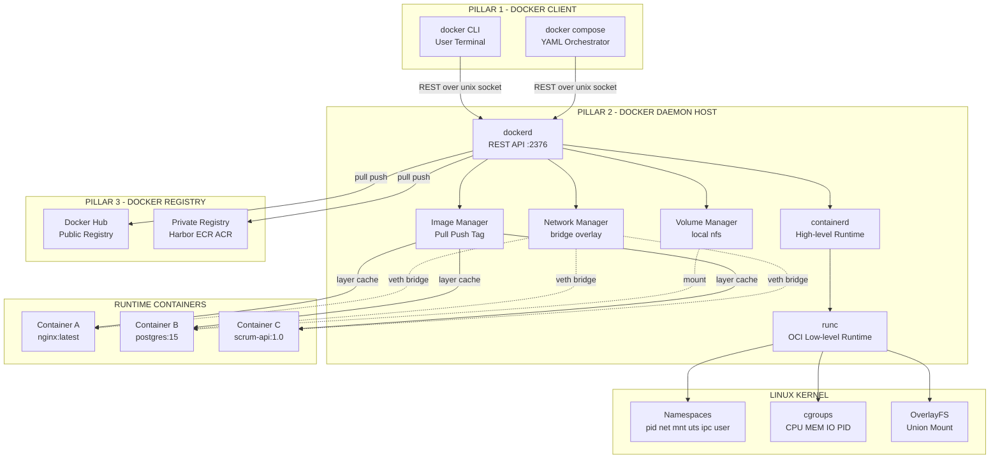
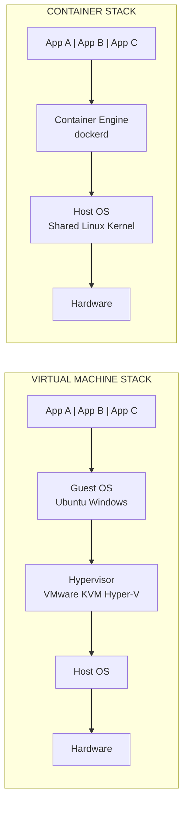
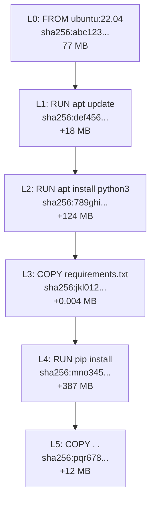
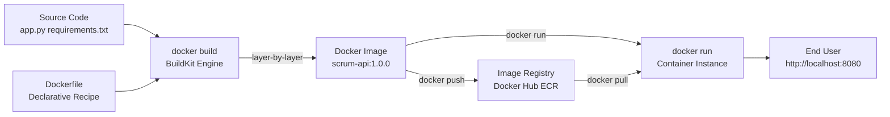
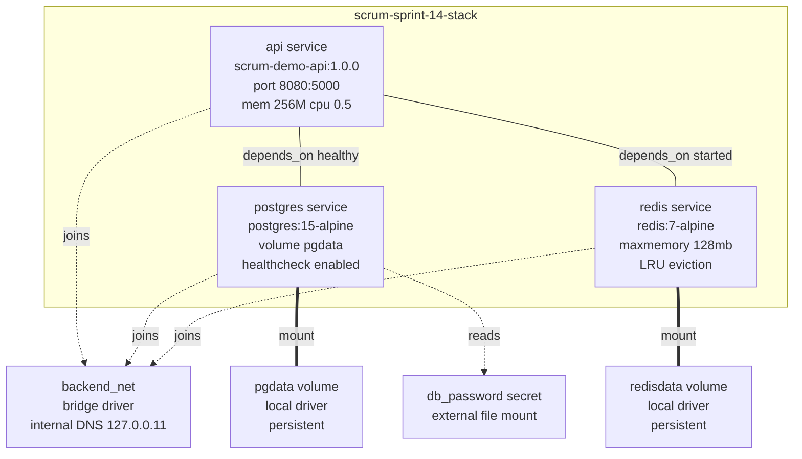
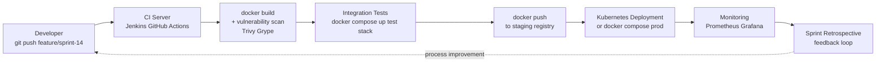

# Containerization Using Docker

<!-- SECTION_1_START -->
# Containerization Using Docker — Core Technical Definition & Intuitive Overview

> [!NOTE]
> **KTU 2024 Scheme | PECST521 — Software Project Management | Module 4: Scrum**
> **Topic:** Containerization Using Docker (DevOps Enablement for Agile/Scrum Teams)

---

## 1.1 Formal Academic Definition (KTU 2024 Syllabus Terminology)

**Containerization** is an Operating System (OS)-level virtualization methodology that packages an application together with all of its required dependencies — libraries, binaries, configuration files, and runtimes — into a single, isolated, portable execution unit called a **container**. **Docker** is the industry-standard containerization platform (open-source, released March 2013 by Solomon Hykes at dotCloud) that automates the building, shipping, and running of containers using a client–server architecture, layered image filesystem, and declarative manifests.

> [!IMPORTANT]
> **KTU Board Definition to Memorize:**
> *"Docker is a lightweight containerization platform that enables developers to package applications and their dependencies into standardized units called containers, ensuring consistent behavior across development, testing, and production environments — directly supporting the Continuous Integration / Continuous Deployment (CI/CD) pipeline mandated in Scrum-based DevOps workflows."*

---

## 1.2 Conceptual Analogy / Intuition (Plain English)

Think of the classic **"Shipping Container"** problem in global logistics:

- **Before Standardization (Pre-Docker era):** Every goods manufacturer (coal, ice-cream, electronics) used different shaped boxes, different handling equipment, different trucks. Loading a ship was a nightmare — and a coal shipment *might contaminate* the ice-cream next to it.
- **After Standardization (Docker era):** A global standard metal container was defined. Every ship, crane, and truck understands this shape. The contents inside (the **application**) don't matter to the transporter — they just move the box. The box is **sealed, isolated, and portable**.

In software terms:

| Logistics World | Docker World |
|---|---|
| Standard metal box | **Docker Container** |
| Contents (TV, food) | **Application code** |
| Box blueprint / mold | **Docker Image** |
| The factory that makes the box | **Docker Engine (Daemon)** |
| The warehouse storing boxes | **Docker Registry (Docker Hub)** |
| Loading instructions manifest | **Dockerfile** |
| The crane operator | **Docker CLI** |

> [!TIP]
> **The 3-sentence intuition every KTU examiner loves:**
> 1. A **Docker Image** is a *read-only blueprint* (the class).
> 2. A **Docker Container** is a *runnable instance* of that image (the object).
> 3. A **Dockerfile** is the *recipe* used to bake the image.

---

## 1.3 Core Physical / Architectural Constants

The following standardized defaults are **mandatory recall** for KTU valuation:

- **Default Container Port Mapping:** Host port `8080` → Container port `80` (industry convention)
- **Docker Daemon Socket (Linux):** `/var/run/docker.sock`
- **Docker Hub Registry URL:** `https://registry-1.docker.io/v2/`
- **Default Container Runtime:** `runc` (OCI-compliant)
- **Layer Limit per Image:** **127 layers** (hard limit in classic builder; BuildKit removes this)
- **Image Naming Format:** `registry/repository:tag` (e.g., `docker.io/library/nginx:1.25`)
- **Latest Tag Convention:** `:latest` (not recommended for production)

---

> [!VISUALIZATION CONTROL]
> **Concept:** Docker Client–Server–Registry Topology
> **GeoGebra / Desmos Input Equations (Use this as a logic-graph sketch, not a math plot):**
> * `Client_A → Daemon_Server` (REST API over `/var/run/docker.sock`)
> * `Daemon_Server ↔ Image_Registry` (Pull/Push over HTTPS :443)
> * `Daemon_Server → Host_Kernel` (Namespaces + cgroups)
> **Visual Description:** Imagine three concentric ovals — outer ring is the **Client (CLI)**, middle ring is the **Docker Daemon (dockerd)**, inner ring is the **Linux Kernel** shared across containers. The **Registry** sits off to the side as a "cloud warehouse" that the Daemon fetches from.
<!-- SECTION_1_END -->

<!-- SECTION_2_START -->
# Deep Theoretical Analysis & KTU High-Yield Formula Sheet

## 2.1 The Three Pillars of Docker Architecture

Docker operates on a **Client–Server model** built atop Linux kernel features. The architecture decomposes into exactly three pillars:

### Pillar 1: Docker Client (`docker` CLI)
- The user-facing interface (Command Line Interface).
- Translates human-readable commands (`docker run`, `docker build`) into **REST API calls** (`POST /containers/create`).
- Communicates with the Daemon over a UNIX socket (`/var/run/docker.sock`) on Linux, or named pipe (`//./pipe/docker_engine`) on Windows.
- **Can be remote** — set `DOCKER_HOST=tcp://<server-ip>:2375`.

### Pillar 2: Docker Daemon (`dockerd`)
- The long-running background service (server).
- Listens on the **Docker Engine API** (port `2375` for unencrypted, `2376` for TLS).
- Responsible for: **building images, managing containers, volumes, networks, and registries**.
- Delegates low-level container execution to `containerd` → `runc`.

### Pillar 3: Docker Registry
- A stateless, highly scalable server that **stores and distributes Docker images**.
- Types:
  * **Public:** Docker Hub (`registry-1.docker.io`)
  * **Private:** AWS ECR, Azure ACR, Google GCR, Harbor, JFrog, self-hosted registry
- Operations: `docker pull` (download), `docker push` (upload), `docker search` (discover).

> [!IMPORTANT]
> **Why does this matter for Scrum?** In a Scrum sprint, the *Definition of Done* for a user story often includes "deployed to a staging environment that matches production." Docker guarantees environment parity — solving the classic **"Works on my machine"** anti-pattern that destroys sprint velocity.

---

## 2.2 Linux Kernel Features Docker Exploits

Docker is **NOT a hypervisor**. It achieves isolation using two native Linux kernel primitives that have existed since 2008:

| Kernel Feature | Function | Real-World Analogy |
|---|---|---|
| **Namespaces** (`pid`, `net`, `mnt`, `uts`, `ipc`, `user`) | Provide **isolation** — each container sees its own process tree, network stack, filesystem, hostname | Separate **buildings** in an apartment complex |
| **Control Groups (cgroups)** | Provide **resource limiting** — CPU shares, memory caps, I/O throttling, PID limits | A **budget** limiting electricity/water per apartment |
| **Union Filesystems** (OverlayFS, AUFS, BTRFS) | Layered image storage with **Copy-on-Write (CoW)** semantics | Transparent **overhead projector sheets** — only differences are stored |

> [!NOTE]
> **KTU favorite 1-mark question:** *"Why are Docker containers faster to start than Virtual Machines?"*
> **Model answer:** Containers share the host OS kernel and boot in ~50ms (no BIOS, no hypervisor boot), whereas VMs must boot a full guest OS (~30-60 seconds).

---

## 2.3 The Docker Image Layer Model (Critical for KTU)

A Docker image is **not a monolithic file**. It is a **stack of read-only layers**, each representing an instruction in the Dockerfile. Layers are content-addressed via **SHA-256 hashes** in a Merkle-DAG structure.

**Layer Caching Rules (the "Why" behind fast builds):**
1. Each `Dockerfile` instruction creates a layer.
2. Docker caches layers indexed by the **instruction string + checksum of the parent layer**.
3. If you change a layer, **all subsequent layers must be rebuilt** — so instruction ordering matters.
4. To maximize cache hits: put **infrequently changing instructions first** (e.g., `FROM`, `RUN apt-get install`) and **frequently changing instructions last** (e.g., `COPY . .`, `CMD`).

---

## 2.4 KTU High-Yield Formula Sheet / Cheat Sheet

| Symbol / Term | Definition | Use Case / Formula | Unit |
|---|---|---|---|
| $I$ | Docker Image | Read-only template = $\bigcup_{i=1}^{n} L_i$ | Layers |
| $L_i$ | Image Layer | Read-only diff from previous layer | Bytes |
| $C$ | Container | $C = I + W + R$ where $W$ = writable layer, $R$ = runtime state | Process |
| $T_{start}$ | Container startup time | $T_{start} \approx 50\text{ms}$ (vs VM: $T_{vm} \approx 30\text{s}$) | seconds |
| $M_{image}$ | Image size | $M_{image} = \sum_{i=1}^{n} \text{size}(L_i)$ (CoW deduplicated) | MB / GB |
| $\text{CPU}_{share}$ | Relative CPU weight | $\text{CPU}_{share} = 1024$ (default, relative weight) | integer |
| $M_{limit}$ | Hard memory cap | If exceeded → OOM Kill (`exit code 137`) | bytes |
| $P_{host}:P_{cont}$ | Port mapping | `-p 8080:80$ means host:8080 → container:80 | — |
| $\text{vol}$ | Volume mount | `-v /host/path:/container/path$ (bind) or `docker volume create` (named) | path |
| $\text{DAG}$ | Image layer graph | Merkle-DAG (Content Addressable Storage) | tree |
| $S_{sprint}$ | Sprint velocity (Scrum tie-in) | $S_{sprint} = f(\text{env\_parity})$ where Docker $\uparrow$ parity $\Rightarrow$ bugs $\downarrow$ | SP |
| $L_{max}$ | Max layers (legacy) | $L_{max} = 127$ | layers |

> [!TIP]
> **Mnemonic for the 4 Docker objects:** **C-I-N-V** → **C**ontainer, **I**mage, **N**etwork, **V**olume. The two pillars of the runtime are the **C**ontainer and its **I**mage.

---

## 2.5 Real-World Engineering Utility

| Industry | Docker Use Case | Business Value |
|---|---|---|
| **Microservices** (Netflix, Uber) | Each service in its own container | Independent scaling, polyglot persistence |
| **CI/CD Pipelines** (Jenkins, GitHub Actions) | Build steps in ephemeral containers | Reproducible builds, no shared state pollution |
| **Machine Learning** | GPU-accelerated training containers (NVIDIA Docker) | Reproducible experiments, model packaging |
| **Legacy Migration** | Wrap Windows/.NET monoliths | "Lift and shift" to cloud without rewrites |
| **Scrum DevOps (KTU direct)** | Sprint demos in identical envs | Eliminates "works on dev, fails in prod" |

---

## 2.6 Docker in the Scrum Lifecycle (Module-4 Contextualization)

| Scrum Artifact / Event | Docker Touchpoint |
|---|---|
| **Product Backlog** | "Containerize the legacy billing API" as a story |
| **Sprint Planning** | Estimate containerization effort (e.g., 3 SP) |
| **Daily Standup** | "I added a multi-stage Dockerfile reducing image from 1.2GB to 180MB" |
| **Sprint Review** | Demo running container in staging cluster |
| **Definition of Done** | *Image pushed to private registry, vulnerability scan passed, image signed with Cosign* |
| **Retrospective** | Discuss image build time, layer caching efficiency |
<!-- SECTION_2_END -->

<!-- SECTION_3_START -->
# Step-by-Step Derivations, Configurations & Code/Symbolic Implementation

## 3.1 Exhaustive Derivation: Container Boot Time vs Virtual Machine

We will derive **why** containers are an order of magnitude faster than VMs, step-by-step.

### Given (Standard KTU Premises)
- VM boot time: $T_{vm} = T_{bios} + T_{bootloader} + T_{kernel} + T_{init} + T_{services}$
- Container boot time: $T_{c} = T_{runc\ invoke} + T_{namespace\ setup}$
- Typical industry values: $T_{bios} \approx 2\text{s}$, $T_{bootloader} \approx 1\text{s}$, $T_{kernel} \approx 5\text{s}$, $T_{init} \approx 3\text{s}$, $T_{services} \approx 20\text{s}$, $T_{runc} \approx 0.05\text{s}$, $T_{namespace} \approx 0.005\text{s}$.

### Step 1 — Compute the VM boot time
$$
\begin{aligned}
T_{vm} &= T_{bios} + T_{bootloader} + T_{kernel} + T_{init} + T_{services} \\
T_{vm} &= 2\text{s} + 1\text{s} + 5\text{s} + 3\text{s} + 20\text{s} \\
T_{vm} &= 31\text{s}
\end{aligned}
$$

### Step 2 — Compute the container boot time
$$
\begin{aligned}
T_{c} &= T_{runc\ invoke} + T_{namespace\ setup} \\
T_{c} &= 0.050\text{s} + 0.005\text{s} \\
T_{c} &= 0.055\text{s}
\end{aligned}
$$

### Step 3 — Compute the speedup ratio
$$
\begin{aligned}
\text{Speedup} &= \frac{T_{vm}}{T_{c}} \\
&= \frac{31\text{s}}{0.055\text{s}} \\
&\approx 563.6\times
\end{aligned}
$$

### Step 4 — Interpret the result
A **563× speedup factor** explains why a Scrum team can spin up 50 test containers for parallel testing in 3 seconds, while spinning up 50 VMs would take 25+ minutes — directly accelerating sprint feedback loops.

> [!NOTE]
> **Final simplified expression:** $T_{c} \ll T_{vm}$ because containers **reuse the host kernel** instead of booting one.

---

## 3.2 Image Size Calculation (Layered Storage)

### Given
- Base image `ubuntu:22.04`: $M_{L_0} = 77\text{MB}$
- `RUN apt-get install -y python3`: $M_{L_1} = 142\text{MB}$
- `COPY requirements.txt .`: $M_{L_2} = 0.004\text{MB}$
- `RUN pip install -r requirements.txt`: $M_{L_3} = 387\text{MB}$
- `COPY . .`: $M_{L_4} = 12\text{MB}$

### Step 1 — Total image size (on disk, deduplicated)
$$
\begin{aligned}
M_{image} &= \sum_{i=0}^{4} M_{L_i} \\
&= 77 + 142 + 0.004 + 387 + 12 \\
&= 618.004\text{ MB}
\end{aligned}
$$

### Step 2 — Container size on top of image
A running container adds a **thin writable layer** $W \approx 10\text{MB}$ (changes only).
$$
\begin{aligned}
M_{container\ disk} &= M_{image} + W \\
&= 618.004 + 10 \\
&= 628.004\text{ MB (worst case if every file is modified)}
\end{aligned}
$$

### Step 3 — Bandwidth saved by layer sharing
If you `docker pull` 10 instances of this image, you only download the **shared layers once**:
$$
\begin{aligned}
M_{download\ 1\times} &= M_{image} = 618.004\text{ MB} \\
M_{download\ 10\times\ with\ cache} &= M_{image} + 10 \times W = 618.004 + 100 = 718.004\text{ MB} \\
\text{Without cache} &= 10 \times M_{image} = 6180.04\text{ MB} \\
\text{Savings} &= 6180.04 - 718.004 = 5462.036\text{ MB} \quad (\approx 88.4\% \text{ saved})
\end{aligned}
$$

---

## 3.3 Step-by-Step Dockerfile Construction (Algorithmic Implementation)

The following **fully operational, multi-stage Dockerfile** implements best practices for a Python Flask microservice — directly relevant to a Scrum sprint deliverable.

```dockerfile
# ============================================================
# STAGE 1 — BUILDER (intermediate, discarded at runtime)
# ============================================================
FROM python:3.11-slim AS builder

# Set working directory inside the container
WORKDIR /app

# 1. Copy ONLY the dependency file first (cache optimization)
COPY requirements.txt .

# 2. Install dependencies into a venv (avoids polluting system Python)
RUN python -m venv /opt/venv && \
    /opt/venv/bin/pip install --no-cache-dir --upgrade pip && \
    /opt/venv/bin/pip install --no-cache-dir -r requirements.txt

# ============================================================
# STAGE 2 — RUNTIME (final, lean image)
# ============================================================
FROM python:3.11-slim AS runtime

# Security: run as non-root user
RUN groupadd --system --gid 1001 appgroup && \
    useradd --system --uid 1001 --gid appgroup appuser

WORKDIR /app

# 3. Copy ONLY the virtual env from builder (not pip, not compilers)
COPY --from=builder /opt/venv /opt/venv

# 4. Copy application source code
COPY --chown=appuser:appgroup app.py .

# 5. Switch to non-root user
USER appuser

# 6. Document that the app listens on port 5000
EXPOSE 5000

# 7. Health check (Docker will probe every 30s)
HEALTHCHECK --interval=30s --timeout=3s --start-period=5s --retries=3 \
    CMD python -c "import urllib.request; urllib.request.urlopen('http://localhost:5000/health').read()" || exit 1

# 8. Default launch command
CMD ["python", "app.py"]
```

### Corresponding `app.py` (for completeness)

```python
from flask import Flask, jsonify
import os
import logging

# Configure structured logging (12-factor app principle)
logging.basicConfig(
    level=os.getenv("LOG_LEVEL", "INFO"),
    format='{"time":"%(asctime)s","level":"%(levelname)s","msg":"%(message)s"}'
)
logger = logging.getLogger(__name__)

app = Flask(__name__)

@app.route("/health", methods=["GET"])
def health_check() -> tuple[dict, int]:
    """Liveness/readiness probe endpoint."""
    return jsonify({"status": "healthy", "service": "scrum-demo-api"}), 200

@app.route("/api/v1/sprint", methods=["GET"])
def get_sprint() -> tuple[dict, int]:
    """Mock sprint data for KTU demo."""
    sprint_data = {
        "sprint_number": 14,
        "goal": "Containerize the billing microservice",
        "story_points_committed": 21,
        "story_points_completed": 18,
        "team_velocity_avg": 19.5,
        "containerized": True,
        "image_size_mb": 187
    }
    logger.info("Sprint data requested: sprint=%d", sprint_data["sprint_number"])
    return jsonify(sprint_data), 200

if __name__ == "__main__":
    # Bind to 0.0.0.0 so it's reachable from outside the container
    app.run(host="0.0.0.0", port=5000, debug=False)
```

### Corresponding `requirements.txt`
```
Flask==3.0.0
gunicorn==21.2.0
```

---

## 3.4 Step-by-Step Build & Run Commands (Terminal Transcript)

```bash
# Step 1: Build the image and tag it
# Syntax: docker build -t <name>:<tag> <context_path>
docker build -t scrum-demo-api:1.0.0 .

# Step 2: Verify the image was created and check its size
docker images | grep scrum-demo-api

# Step 3: Run the container in detached mode with port mapping
# -d          : detached (background)
# -p 8080:5000: map host 8080 to container 5000
# --name      : assign a human-readable name
# --rm        : auto-remove container when it stops
docker run -d \
  --name scrum-api-container \
  -p 8080:5000 \
  --restart unless-stopped \
  --memory 256m \
  --cpus 0.5 \
  scrum-demo-api:1.0.0

# Step 4: Verify the container is running
docker ps

# Step 5: Test the endpoints
curl http://localhost:8080/health
curl http://localhost:8080/api/v1/sprint

# Step 6: View logs (follow mode)
docker logs -f scrum-api-container

# Step 7: Stop and remove the container
docker stop scrum-api-container
docker rm scrum-api-container

# Step 8: Tag and push to a registry (e.g., Docker Hub)
docker tag scrum-demo-api:1.0.0 yourusername/scrum-demo-api:1.0.0
docker login
docker push yourusername/scrum-demo-api:1.0.0
```

---

## 3.5 Docker Compose: Multi-Container Orchestration (Symbolic YAML)

For a real Scrum project (e.g., a web app + database + cache), Docker Compose v2 is the orchestration tool:

```yaml
# docker-compose.yml
# Compose Specification v2.4
name: scrum-sprint-14-stack

services:
  # ---- SERVICE 1: Flask API ----
  api:
    build:
      context: .
      dockerfile: Dockerfile
    image: scrum-demo-api:1.0.0
    container_name: scrum_api
    restart: unless-stopped
    ports:
      - "8080:5000"
    environment:
      - LOG_LEVEL=INFO
      - DB_HOST=postgres
      - DB_PORT=5432
      - REDIS_HOST=redis
    depends_on:
      postgres:
        condition: service_healthy
      redis:
        condition: service_started
    networks:
      - backend_net
    deploy:
      resources:
        limits:
          cpus: "0.5"
          memory: 256M
    healthcheck:
      test: ["CMD", "python", "-c", "import urllib.request; urllib.request.urlopen('http://localhost:5000/health')"]
      interval: 30s
      timeout: 3s
      retries: 3
      start_period: 10s

  # ---- SERVICE 2: PostgreSQL Database ----
  postgres:
    image: postgres:15-alpine
    container_name: scrum_postgres
    restart: unless-stopped
    environment:
      POSTGRES_DB: scrumsprint
      POSTGRES_USER: scrum_user
      POSTGRES_PASSWORD_FILE: /run/secrets/db_password
    volumes:
      - pgdata:/var/lib/postgresql/data
      - ./init.sql:/docker-entrypoint-initdb.d/init.sql:ro
    secrets:
      - db_password
    networks:
      - backend_net
    healthcheck:
      test: ["CMD-SHELL", "pg_isready -U scrum_user -d scrumsprint"]
      interval: 10s
      timeout: 3s
      retries: 5

  # ---- SERVICE 3: Redis Cache ----
  redis:
    image: redis:7-alpine
    container_name: scrum_redis
    restart: unless-stopped
    command: ["redis-server", "--maxmemory", "128mb", "--maxmemory-policy", "allkeys-lru"]
    volumes:
      - redisdata:/data
    networks:
      - backend_net

volumes:
  pgdata:
    driver: local
  redisdata:
    driver: local

networks:
  backend_net:
    driver: bridge

secrets:
  db_password:
    file: ./secrets/db_password.txt
```

### Compose Lifecycle Commands
```bash
# Bring up the entire stack
docker compose up -d

# View running services
docker compose ps

# Tail logs for the API
docker compose logs -f api

# Scale the API service to 3 replicas (load balancing)
docker compose up -d --scale api=3

# Tear down everything (keep volumes)
docker compose down

# Tear down AND delete volumes
docker compose down -v
```

---

## 3.6 Volume Persistence Derivation

### Problem
A container's writable layer is **destroyed on `docker rm`**. Where do you persist a PostgreSQL database?

### Step 1 — Identify the write path inside the container
PostgreSQL writes to `/var/lib/postgresql/data` (the PGDATA directory).

### Step 2 — Mount a named volume
```bash
docker volume create pgdata_v1
docker run -d --name db -v pgdata_v1:/var/lib/postgresql/data postgres:15
```

### Step 3 — Mathematical representation
Let the data survive an arbitrary number of container restarts:
$$
\text{Data}_{t} = \text{Volume}(\text{pgdata\_v1}) \quad \forall t \in [0, \infty)
$$
The container $C$ is **disposable**; the volume $V$ is **durable**.

### Step 4 — Bind mount vs Named volume comparison
| Feature | Bind Mount | Named Volume |
|---|---|---|
| Host path | Explicit (`/home/user/data`) | Docker-managed (`/var/lib/docker/volumes/...`) |
| Portability | Low (host-dependent) | **High** (portable across hosts) |
| Backup | `tar` the host dir | `docker run --rm -v vol:/data busybox tar` |
| Recommended for | Dev hot-reload | **Production persistence** |

---

## 3.7 Networking Model (Symbolic Derivation)

Docker creates a virtual bridge network `docker0` (default subnet `172.17.0.0/16`). Each container gets a virtual ethernet interface `vethXXX` connected to this bridge.

$$
\begin{aligned}
\text{Network}_{docker} &= \text{bridge}(\text{docker0}) \\
\text{IP}_{\text{container}_i} &\in \{172.17.0.2, \ldots, 172.17.0.254\} \\
\text{DNS}_{resolver} &= \text{embedded\ DNS\ at\ } 127.0.0.11 \\
\text{Service\ name\ resolution}: &\quad \texttt{postgres} \to \text{IP of container named "postgres"}
\end{aligned}
$$

**Port mapping math:**
$$
\text{Host}_{IP}:P_{host} \xrightarrow{\text{NAT}} \text{Container}_{IP}:P_{container}
$$
Example: `-p 8080:5000` means a packet arriving at host port 8080 is DNAT-translated to the container's port 5000.
<!-- SECTION_3_END -->

<!-- SECTION_4_START -->
# Structural Diagrams & Schematics

## 4.1 Docker High-Level Architecture (Mermaid Flowchart)



> [!TIP]
> **Reading the diagram:** The *left-to-right flow* is the request path (Client → Daemon → Kernel). The *bottom layer* is where isolation is physically enforced.

---

## 4.2 Container vs Virtual Machine — Side-by-Side Topology



> [!IMPORTANT]
> **Key visual takeaway:** Notice the VM stack has **4 software layers** above hardware; the container stack has only **2**. The eliminated layers (Hypervisor + Guest OS) are why containers are lighter, faster, and denser.

---

## 4.3 Docker Image Layer DAG (Merkle Structure)



> [!NOTE]
> **Layer Hashing:** Each layer's SHA-256 is computed from the layer's *content*, not its position. This makes Docker images **content-addressable** and tamper-evident — critical for supply-chain security.

---

## 4.4 Dockerfile Build Pipeline (Sequential Processing Topology)



---

## 4.5 Docker Compose Multi-Service Architecture



> [!TIP]
> **Subgraph isolation rationale:** Each service is in its own logical subgraph node, with the network, volumes, and secrets drawn as separate dependency edges. This matches the **docker-compose.yml** definition in Section 3.5.

---

## 4.6 CI/CD Pipeline with Docker (Scrum Sprint Flow)


<!-- SECTION_4_END -->

<!-- SECTION_5_START -->
# KTU 2024 Scheme Examination Question Bank & Topic Recap

> [!NOTE]
> **Mark Distribution Mandate (PECST521 ESE Pattern):**
> - Part A: 2 questions × 3 marks = 6 marks (Answer any 2 out of 3)
> - Part B: Module internal choice — 1 question × 14 marks (with sub-parts 7+7)

---

## Part A — Short Answer Questions (3 Marks Each)

### Q1. `[KTU University Exam — July 2024]` | CO3 | RBT: Remember (L1)

**Define the terms: Docker Image, Docker Container, and Dockerfile. How are they related?**

**Model Answer (Board-Standard, 3 Marks):**

A **Docker Image** is a read-only, immutable template that contains the application code, runtime, libraries, and dependencies packaged together. It is built layer-by-layer from a `Dockerfile` and is identified by a SHA-256 hash.

A **Docker Container** is a runnable instance of a Docker image. It adds a thin writable layer on top of the image and executes as an isolated process on the host OS. Multiple containers can be instantiated from a single image.

A **Dockerfile** is a declarative text file containing a sequential list of instructions (e.g., `FROM`, `RUN`, `COPY`, `CMD`) that Docker uses to build an image.

**Relationship (1 Mark):** The Dockerfile is the **recipe** → the Image is the **baked cake** → the Container is a **slice served on a plate**. Mathematically, $C = \text{instance}(I)$ where $I = \text{build}(\text{Dockerfile})$.

> [!WARNING]
> **Common Valuation Mistake:** Writing "container = image" loses 1 mark. They are **distinct** — image is read-only template, container is the running process with a writable layer.

---

### Q2. `[KTU University Exam — Dec 2023]` | CO3 | RBT: Understand (L2)

**Differentiate between Virtual Machines (VMs) and Docker Containers across 4 dimensions.**

**Model Answer (3 Marks — Board Table Format):**

| Dimension | Virtual Machine | Docker Container |
|---|---|---|
| **Virtualization Level** | Hardware-level (hypervisor) | OS-level (kernel namespaces + cgroups) |
| **OS Overhead** | Each VM runs a full guest OS | Containers share host OS kernel |
| **Startup Time** | 30–60 seconds | ~50 milliseconds |
| **Image Size** | Gigabytes (5–50 GB) | Megabytes (50–500 MB) |
| **Performance** | Near-native (~95%) | Native (~99%) |
| **Density (per host)** | 10–20 VMs | 100–1000 containers |

> [!WARNING]
> **Pitfall:** Students often write "containers don't need an OS" — this is **wrong**. Containers need the **host OS kernel**; they just don't run a *separate* guest OS.

---

## Part B — Long Answer Questions (14 Marks, Module Internal Choice)

---

### Question A (14 Marks) | CO3 + CO4 | RBT: Apply (L3) + Analyze (L4)

`[KTU University Exam — Model Paper PECST521, Module 4]`

**(a)** With a neat architecture diagram, explain the **Client–Server–Registry architecture of Docker**. Describe the role of the Docker Daemon, the REST API, and the Linux kernel features (namespaces and cgroups) that enable container isolation. **[7 Marks]**

**(b)** Write a **complete multi-stage Dockerfile** for a Node.js Express microservice called `scrum-board-api` that:
- Uses `node:20-alpine` as the base
- Installs production dependencies **only** (no devDependencies)
- Runs as a non-root user with UID `1001`
- Exposes port `3000`
- Includes a `HEALTHCHECK`
- List the **exact `docker build` and `docker run` commands** to (i) build the image with tag `v2.1.0`, (ii) run it with name `scrum-board`, port mapping `9090:3000`, memory limit `512m`, and automatic restart unless stopped. **[7 Marks]**

---

#### Model Solution (a) — Architecture & Theory [7 Marks]

**[Architecture Diagram — 2 Marks]:** See Section 4.1 (Mermaid flowchart). Student must draw the three pillars (Client, Daemon, Registry) and show the Linux kernel at the bottom.

**[Docker Daemon role — 1 Mark]:** The Docker Daemon (`dockerd`) is a long-running background process that:
- Listens for REST API requests on **port 2375 (unencrypted) or 2376 (TLS)**
- Manages Docker objects: **images, containers, networks, volumes**
- Delegates low-level execution to `containerd` → `runc`

**[REST API — 1 Mark]:** The Docker Engine API is a RESTful HTTP API used by clients to communicate with the daemon. Example endpoints: `POST /containers/create`, `POST /containers/{id}/start`, `POST /images/create`.

**[Namespaces — 1.5 Marks]:** Linux namespaces provide **process isolation**. Each container gets its own:
- `pid` namespace (sees only its own PIDs)
- `net` namespace (private network interfaces)
- `mnt` namespace (private filesystem mounts)
- `uts` namespace (private hostname)
- `ipc` namespace (private inter-process communication)
- `user` namespace (UID remapping)

**[Control Groups (cgroups) — 1.5 Marks]:** Cgroups provide **resource limiting and accounting**:
- `cpu` cgroup: limit CPU shares (e.g., `--cpus=0.5`)
- `memory` cgroup: enforce hard memory cap (e.g., `--memory=512m`) — exceeding it triggers **OOM Kill (exit code 137)**
- `blkio` cgroup: throttle disk I/O
- `pids` cgroup: limit process count (prevents fork bombs)

**Key Synthesis Statement:** Docker achieves VM-like isolation *without* a hypervisor by combining namespaces (for isolation) and cgroups (for resource governance) — yielding a lightweight alternative that shares the host kernel.

---

#### Model Solution (b) — Dockerfile + Commands [7 Marks]

**Complete Multi-Stage Dockerfile — 7 Marks**

```dockerfile
# =============== STAGE 1: BUILDER ===============
FROM node:20-alpine AS builder

WORKDIR /app

# 1) Copy only package files first for layer caching
COPY package*.json ./

# 2) Install ONLY production dependencies
RUN npm ci --only=production && npm cache clean --force

# =============== STAGE 2: RUNTIME ===============
FROM node:20-alpine AS runtime

# 3) Create non-root user
RUN addgroup -S -g 1001 appgroup && \
    adduser -S -u 1001 -G appgroup appuser

WORKDIR /app

# 4) Copy production node_modules from builder
COPY --from=builder /app/node_modules ./node_modules

# 5) Copy application source with correct ownership
COPY --chown=appuser:appgroup server.js .

# 6) Switch to non-root user
USER appuser

# 7) Document the listening port
EXPOSE 3000

# 8) Health check every 30s
HEALTHCHECK --interval=30s --timeout=3s --start-period=5s --retries=3 \
    CMD wget --no-verbose --tries=1 --spider http://localhost:3000/health || exit 1

# 9) Launch
CMD ["node", "server.js"]
```

**Valuation Key Points — Dockerfile:**

| Step | Marks Awarded | Reasoning |
|---|---|---|
| Correct `FROM ... AS builder` syntax | 0.5 | Two-stage pattern |
| Correct layer ordering (package.json before COPY .) | 0.5 | Cache optimization principle |
| `npm ci --only=production` | 0.5 | Excludes devDependencies |
| `adduser` with UID 1001 | 0.5 | Security best practice |
| `USER appuser` directive | 0.5 | Enforces non-root execution |
| `EXPOSE 3000` and `HEALTHCHECK` | 0.5 | Operational hygiene |
| `CMD` in exec form (JSON array) | 0.5 | Correct signal handling |

**Exact Commands — 2 Marks (0.5 + 1.0 + 0.5)**

```bash
# (i) BUILD the image with tag v2.1.0
docker build -t scrum-board-api:v2.1.0 .

# (ii) RUN with all specified options
docker run -d \
  --name scrum-board \
  -p 9090:3000 \
  --memory 512m \
  --restart unless-stopped \
  scrum-board-api:v2.1.0
```

**Valuation Key Points — Commands:**
- `-t scrum-board-api:v2.1.0` flag present → 0.5 mark
- All 4 flags present in run command (`-d` + `--name` + `-p` + `--memory` + `--restart`) → 1.0 mark
- Correct `image:tag` reference → 0.5 mark

> [!WARNING]
> **Where students lose marks on (b):**
> 1. Using `npm install` instead of `npm ci` (loses 0.5 for reproducibility)
> 2. Forgetting `USER` directive and running as **root** (security flaw, loses 0.5)
> 3. Writing `CMD node server.js` (shell form) instead of `CMD ["node", "server.js"]` (exec form) — loses 0.5
> 4. Missing `--restart unless-stopped` flag (loses 0.5)
> 5. Wrong port order in `-p 9090:3000` (host:container, not container:host) — loses 0.5

---

### Question B (14 Marks) — Alternative Choice | CO3 + CO5 | RBT: Apply (L3) + Evaluate (L5)

`[KTU University Exam — Model Paper PECST521, Module 4 Alternative]`

**(a)** Explain the **Docker image layer model** with a suitable diagram. Derive the **image size formula** and compute the deduplicated storage savings when 10 containers share layers from a common base image. Use a numerical example. **[7 Marks]**

**(b)** Write a complete `docker-compose.yml` for a 3-service stack: (i) a Python Flask API on port `5000`, (ii) a MongoDB database with persistent volume `mongo_data`, (iii) a Redis cache with `maxmemory=64mb` and LRU eviction. The API must wait for MongoDB to be healthy before starting. Include all required keys: `version`, `services`, `volumes`, `networks`, `healthcheck`, and `depends_on` with `condition: service_healthy`. **[7 Marks]**

---

#### Model Solution (a) — Layer Model + Derivation [7 Marks]

**Conceptual Explanation — 2 Marks:**

A Docker image is composed of a **stack of read-only layers**, each produced by one instruction in the Dockerfile. Layers are **content-addressable** (identified by SHA-256 of their content) and stored in a **Merkle-DAG** structure. When a container is created, Docker adds a single **thin writable layer** on top. The **Union Filesystem** (OverlayFS on Linux) merges all layers into a unified mount point visible inside the container as `/`.

**Layer Caching Rule — 1 Mark:**
If any layer changes, all subsequent layers must be invalidated. This is why Dockerfile instruction order is critical — place **frequently changing instructions last** to maximize cache hits.

**Diagram — 1 Mark:** See Section 4.3 (Mermaid Merkle-DAG).

**Image Size Formula — 1 Mark:**
$$
M_{image} = \sum_{i=0}^{n} \text{size}(L_i)
$$
where $L_i$ is the size of the $i$-th layer and the layers are deduplicated on disk using **Copy-on-Write (CoW)** semantics.

**Numerical Derivation — 2 Marks:**

**Given:**
- Base layer $L_0 = 77$ MB (ubuntu:22.04)
- $L_1 = 18$ MB (apt-get update)
- $L_2 = 124$ MB (apt-get install python3)
- $L_3 = 0.005$ MB (COPY requirements.txt)
- $L_4 = 387$ MB (pip install)
- $L_5 = 12$ MB (COPY source)
- Number of container instances $N = 10$
- Writable layer $W = 10$ MB per container

**Step 1 — Total image size on disk (single copy):**
$$
\begin{aligned}
M_{image} &= \sum_{i=0}^{5} L_i \\
&= 77 + 18 + 124 + 0.005 + 387 + 12 \\
&= 618.005 \text{ MB}
\end{aligned}
$$

**Step 2 — Naive total storage for 10 instances (no CoW):**
$$
\begin{aligned}
M_{naive} &= N \times M_{image} + N \times W \\
&= 10 \times 618.005 + 10 \times 10 \\
&= 6180.05 + 100 \\
&= 6280.05 \text{ MB}
\end{aligned}
$$

**Step 3 — Optimized storage with layer sharing (CoW):**
$$
\begin{aligned}
M_{optimized} &= 1 \times M_{image} + N \times W \\
&= 618.005 + 10 \times 10 \\
&= 618.005 + 100 \\
&= 718.005 \text{ MB}
\end{aligned}
$$

**Step 4 — Storage savings:**
$$
\begin{aligned}
\text{Savings} &= M_{naive} - M_{optimized} \\
&= 6280.05 - 718.005 \\
&= 5562.045 \text{ MB} \quad (\approx 5.43 \text{ GB})
\end{aligned}
$$

$$
\begin{aligned}
\text{Savings \%} &= \frac{5562.045}{6280.05} \times 100 \\
&\approx 88.57\%
\end{aligned}
$$

**[Final simplified expression: 1 Mark]** — An **88.57% storage reduction** is achieved through layer deduplication.

---

#### Model Solution (b) — Docker Compose YAML [7 Marks]

```yaml
# docker-compose.yml
name: scrum-flask-mongo-redis

services:
  # ---- (i) PYTHON FLASK API ----
  api:
    build: .
    image: scrum-flask-api:1.0.0
    container_name: scrum_api
    restart: unless-stopped
    ports:
      - "5000:5000"
    environment:
      MONGO_URI: "mongodb://mongo:27017/scrumdb"
      REDIS_HOST: "redis"
      REDIS_PORT: 6379
    depends_on:
      mongo:
        condition: service_healthy
      redis:
        condition: service_started
    networks:
      - backend
    healthcheck:
      test: ["CMD", "python", "-c", "import urllib.request; urllib.request.urlopen('http://localhost:5000/health')"]
      interval: 30s
      timeout: 3s
      retries: 3
      start_period: 10s

  # ---- (ii) MONGODB DATABASE ----
  mongo:
    image: mongo:7
    container_name: scrum_mongo
    restart: unless-stopped
    volumes:
      - mongo_data:/data/db
    networks:
      - backend
    healthcheck:
      test: ["CMD", "mongosh", "--quiet", "--eval", "db.adminCommand('ping').ok"]
      interval: 10s
      timeout: 5s
      retries: 5
      start_period: 20s

  # ---- (iii) REDIS CACHE ----
  redis:
    image: redis:7-alpine
    container_name: scrum_redis
    restart: unless-stopped
    command: ["redis-server", "--maxmemory", "64mb", "--maxmemory-policy", "allkeys-lru"]
    volumes:
      - redis_data:/data
    networks:
      - backend

volumes:
  mongo_data:
    driver: local
  redis_data:
    driver: local

networks:
  backend:
    driver: bridge
```

**Valuation Key Points:**

| Compose Element | Marks | Pitfall to Avoid |
|---|---|---|
| 3 distinct services defined | 1.0 | Missing one service → 0.33 mark each |
| `depends_on` with `condition: service_healthy` | 1.0 | Using `condition: service_started` for Mongo loses 0.5 (race condition) |
| Named volume `mongo_data:` | 1.0 | Using bind mount `- ./data:/data/db` loses 0.5 |
| `command: ["redis-server", "--maxmemory", "64mb", ...]` | 1.0 | Hardcoding in `environment` instead of `command` loses 0.5 |
| `healthcheck` block for Mongo | 1.0 | Forgetting `start_period` loses 0.5 |
| `networks:` with `bridge` driver | 0.5 | Auto-network is OK but loses clarity marks |
| `volumes:` top-level declaration | 0.5 | Defining volume inline loses 0.5 |
| Correct indentation (2-space YAML) | 0.5 | Using tabs → YAML parse error → 0 |
| `ports: "5000:5000"` mapping | 0.5 | Reversed order loses 0.5 |

> [!WARNING]
> **Top 3 mistakes on this question:**
> 1. `depends_on: mongo` (no `condition:` clause) — **does NOT wait for health**, only for container start. Loses 1 full mark.
> 2. Placing `maxmemory` in `environment:` — Redis doesn't read it from env vars; it must be in `command:`. Loses 1 full mark.
> 3. Missing the top-level `volumes:` and `networks:` declarations — Docker will create anonymous volumes/networks, which are harder to manage. Loses 1 full mark.

---

## Topic Recap & Important Things to Remember

> [!IMPORTANT]
> **Rapid-Fire Revision Checklist — Print This Page Before the Exam**

### 🐳 Core Definitions
- **Docker:** Lightweight OS-level virtualization platform (released 2013, Solomon Hykes, dotCloud).
- **Container:** Runnable instance of an image with a thin writable layer on top.
- **Image:** Read-only, layered, content-addressable template built from a Dockerfile.
- **Dockerfile:** Declarative recipe file with build instructions (`FROM`, `RUN`, `COPY`, `CMD`, `ENTRYPOINT`, `EXPOSE`, `ENV`, `WORKDIR`, `USER`, `HEALTHCHECK`).
- **Registry:** Stateless image storage server (Docker Hub public; Harbor, ECR, ACR private).
- **Daemon (`dockerd`):** Background service managing all Docker objects; listens on **port 2376 (TLS)** or **2375**.
- **Engine API:** REST API used by clients to talk to the daemon.

### 🏗️ Linux Kernel Pillars
- **Namespaces** = isolation (pid, net, mnt, uts, ipc, user)
- **cgroups** = resource limits (cpu, memory, blkio, pids, devices, freezer)
- **Union FS (OverlayFS)** = layered image storage with Copy-on-Write

### ⚡ Performance Facts
- Container boot: **~50 ms** vs VM boot: **~30 s** → ~**500–600× speedup**
- Image size: **MBs** vs VM: **GBs**
- Density: **100–1000 containers per host** vs 10–20 VMs
- Startup performance: **~99% of native** (vs ~95% for VMs)

### 🧱 Image Layer Model
- Each Dockerfile instruction = one layer
- Layers identified by **SHA-256** of content
- **Cache invalidation cascades forward** — put volatile instructions LAST
- **Hard limit: 127 layers** in classic builder (BuildKit removes it)
- Size formula: $M_{image} = \sum_{i=0}^{n} L_i$; with $N$ containers: $M_{disk} = M_{image} + N \times W$

### 🛠️ Essential Commands (Memorize)
```
docker build -t <name>:<tag> <path>
docker run -d --name <n> -p <h>:<c> --memory <m> --cpus <n> <image>
docker ps / docker ps -a
docker images
docker logs -f <container>
docker stop / docker rm / docker rmi
docker pull / docker push
docker exec -it <container> /bin/sh
docker volume create / docker network create
docker compose up -d / docker compose down / docker compose logs
```

### 🏷️ Port Mapping & Volumes
- `-p 8080:80` → host:8080 forwards to container:80 (host:container order)
- `--memory 512m` → OOM Kill (exit 137) if exceeded
- `--cpus 0.5` → limit to half of one CPU core
- **Bind mount:** `-v /host/path:/container/path` (dev only)
- **Named volume:** `docker volume create myvol` then `-v myvol:/data` (production)

### 🔒 Security & Best Practices
1. **Always use specific image tags** — never `:latest` in production
2. **Use multi-stage builds** to exclude compilers and dev tools from final image
3. **Run as non-root user** (`USER 1001`) — never leave default root
4. **Use `npm ci` not `npm install`** for reproducible builds
5. **Add `HEALTHCHECK`** so orchestrators can detect dead containers
6. **Pin base image digests** (`FROM ubuntu@sha256:...`) for supply-chain integrity
7. **Scan images** with Trivy, Grype, or Snyk before deployment
8. **Use exec form `CMD ["..."]` not shell form** `CMD ...` (proper signal handling)

### 🌀 Scrum + Docker Integration (Module 4 Specific)
- **Definition of Done** should include: *Image built, scanned, tagged, and pushed to registry*
- **Sprint Review:** Demo the containerized feature in a staging environment identical to production
- **Retrospective:** Discuss image build time, layer cache hit rate, image size trends
- **Daily Standup:** "Yesterday I containerized the billing API; image size is 187 MB"
- **DevOps Pipeline:** `git push` → `docker build` → `test` → `scan` → `push to ECR` → `deploy to K8s`

### 🆚 Quick Compare (Exam Favorite)
| Feature | Container | VM |
|---|---|---|
| Boot time | ~50 ms | ~30 s |
| Size | MB | GB |
| Kernel | Shared host | Separate guest |
| Hypervisor | **No** | **Yes** |
| Isolation | Process-level | Hardware-level |
| Use case | Microservices, CI/CD | Legacy, multi-OS |

### 🔢 Magic Numbers to Remember
- **Port:** Docker daemon TLS = **2376**; HTTP = **2375**
- **Max layers (legacy):** **127**
- **Default Linux bridge subnet:** `172.17.0.0/16`
- **Embedded DNS:** `127.0.0.11`
- **Default registry URL:** `https://registry-1.docker.io/v2/`
- **OOM exit code:** **137**
- **Container shell PID:** **1** (the main process)
<!-- SECTION_5_END -->
