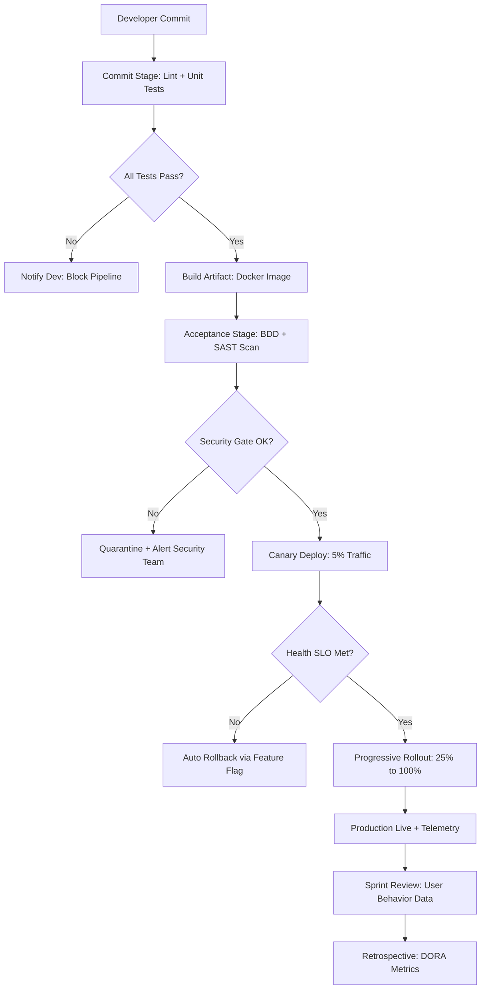
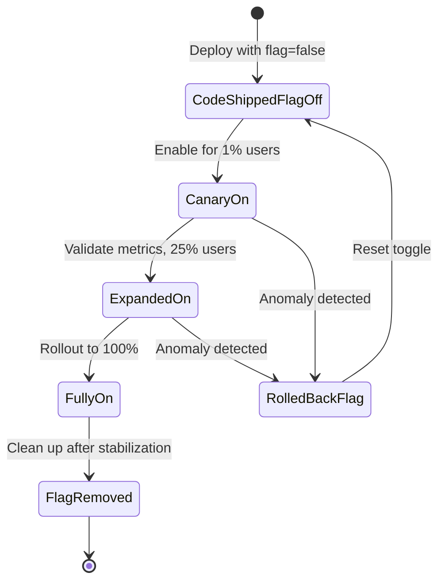
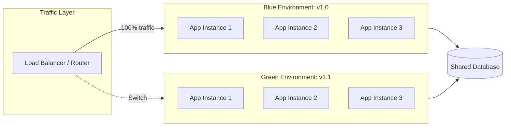
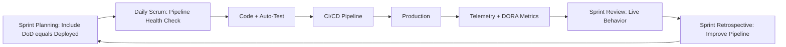

# Continuous Deployment

<!-- SECTION_1_START -->
# Continuous Deployment in Scrum Engineering

## Formal Academic Definition (KTU 2024 Scheme Aligned)

> [!IMPORTANT]
> **Continuous Deployment (CD)** is a software engineering release methodology in which every code change that passes the automated test suite is automatically released into the production environment **without explicit human approval**. It is the terminal stage of a modern DevOps delivery pipeline and operates as a first-class engineering practice within the Scrum framework's Definition of Done (DoD).

**In KTU 2024 Scheme Terminology (PECST521 — Software Project Management):** Continuous Deployment is positioned under the umbrella of *Lean-Agile Engineering Practices* and is the practice that closes the loop between a Scrum Team's *Sprint Review* and live production telemetry. It extends the principles of **Continuous Integration (CI)** and **Continuous Delivery (CD)** by removing the manual release gate.

### Conceptual Analogy / Intuition

> [!NOTE]
> **The Newspaper Press Analogy:** Imagine a major newspaper that used to print its daily edition only after an editor manually approved every page. Continuous Deployment is like having a printing press that automatically publishes a corrected, refined edition **the moment a reporter hits "submit"** — provided the spelling checker (automated tests) passes. The readers (end-users) always get the freshest, most accurate copy, and the editor is freed to focus on quality, not logistics.

In Scrum terms, think of it as the **automatic conveyor belt** that takes a finished Sprint Increment — already accepted at the Sprint Review — and pushes it live to users without a separate "Release Sprint" or release manager bottleneck.

### The Two-Word Distinction (Crucial for KTU Board)

| Term | Acronym | Human Gate Before Production? |
| :--- | :--- | :--- |
| Continuous Integration | CI | No — integrates code frequently |
| Continuous Delivery | CD-1 | Yes — manual approval before deploy |
| **Continuous Deployment** | **CD-2** | **No — fully automated to production** |

> [!WARNING]
> **Common KTU Pitfall:** Students frequently write "Continuous Delivery" and "Continuous Deployment" interchangeably. The Board expects you to state that **Delivery = deployable artifact with a manual gate**, whereas **Deployment = automatic release to production without a gate**.

### GeoGebra / Desmos Integration

> [!VISUALIZATION CONTROL]
> **Concept:** Deployment Frequency vs. Lead Time Relationship (DORA-style scatter intuition)
> **GeoGebra / Desmos Input Equations:**
> * `f(x) = 1/x` for x > 0
> * `g(x) = log(x)` for x > 0
> **Visual Description:** Plot deployment frequency (x-axis) against lead time for changes (y-axis). High-performing Scrum teams using Continuous Deployment cluster in the top-right region (high frequency, low lead time), visually separating them from traditional waterfall teams in the bottom-left.

<!-- SECTION_1_END -->

<!-- SECTION_2_START -->
# Deep Theoretical Analysis & KTU High-Yield Formula Sheet

## 1. The Three Pillars of Continuous Deployment

Continuous Deployment rests on three engineering pillars. Each pillar must be mature before CD can be safely enabled in a Scrum Team.

### Pillar I — Automated Test Suite (The Safety Net)

- **Unit Tests** — Verify individual functions/classes in isolation.
- **Integration Tests** — Verify component interactions (e.g., API ↔ Database).
- **End-to-End (E2E) Tests** — Simulate full user journeys through the UI.
- **Contract Tests** — Ensure producer/consumer API compatibility.
- **Performance / Load Tests** — Detect regressions in latency or throughput.

> [!IMPORTANT]
> **KTU Board Emphasis:** The automated test suite is the *gatekeeper*. A Scrum Team must maintain a **Test Pyramid** balance: ~70% unit, ~20% integration, ~10% E2E. An inverted pyramid (mostly E2E tests) leads to flaky pipelines and is a common Board question topic.

### Pillar II — Deployment Pipeline (The Conveyor Belt)

A **Deployment Pipeline** is the automated sequence of stages that a code commit travels through from developer machine to production. Typical stages:

1. **Commit Stage** — Compile, static analysis (linting), fast unit tests.
2. **Acceptance Test Stage** — Behavior-driven tests, security scans (SAST/DAST).
3. **Capacity / Performance Stage** — Load testing on production-like environment.
4. **Production Deploy Stage** — Automated rollout via blue-green, canary, or rolling strategy.

### Pillar III — Observability & Feature Control (The Dashboard)

- **Feature Flags / Toggles** — Decouple deploy from release. New code ships dark (hidden) and is turned on remotely.
- **Monitoring Stack** — Logs, metrics, traces (the "three pillars of observability").
- **Automated Rollback** — Health-check driven reversal if SLO breaches.
- **A/B Testing Infrastructure** — Compare variants in production.

## 2. Continuous Deployment Inside a Scrum Sprint

Continuous Deployment does **not** replace Scrum ceremonies; it **augments** them. Here is the precise integration:

- **Sprint Planning:** Definition of Done must include "deployed to production" for the Increment to be truly "Done."
- **Daily Scrum:** Build status, pipeline failures, and rollback alerts are first-class discussion items.
- **Sprint Review:** The increment is **already live**, so the review is a *user behavior* discussion, not a *demo of pending code*.
- **Sprint Retrospective:** Pipeline lead time, change failure rate, and MTTR (Mean Time To Recovery) are inspected.

## 3. Deployment Strategies (High-Yield for KTU)

| Strategy | Mechanism | Risk Level | Rollback Speed | Use Case |
| :--- | :--- | :--- | :--- | :--- |
| **Recreate** | Kill old version, deploy new | High | Slow (redeploy) | Dev/Test environments |
| **Rolling Update** | Replace instances gradually | Medium | Medium | Stateless services |
| **Blue-Green** | Two identical environments, switch router | Low | Instant (route flip) | Mission-critical releases |
| **Canary** | New version to 1–5% of users first | Very Low | Instant (route flip) | User-facing feature experiments |
| **Shadow** | New version receives mirrored traffic | None | N/A | ML model validation |

## 4. DORA Metrics — The Four Key Performance Indicators

DevOps Research and Assessment (DORA) metrics are the *gold standard* for measuring Continuous Deployment maturity. The KTU Board frequently asks for these four:

> [!NOTE]
> **The Four DORA Metrics:**
> 1. **Deployment Frequency (DF)** — How often code reaches production.
> 2. **Lead Time for Changes (LT)** — Time from commit to production.
> 3. **Change Failure Rate (CFR)** — % of deployments causing production failures.
> 4. **Time to Restore Service (MTTR)** — How fast the team recovers from failure.

### DORA Performance Classification

| Performer Tier | Deployment Frequency | Lead Time | Change Failure Rate | MTTR |
| :--- | :--- | :--- | :--- | :--- |
| **Elite** | On-demand (multiple/day) | < 1 hour | 0–15% | < 1 hour |
| **High** | Weekly to monthly | 1 day – 1 week | 16–30% | < 1 day |
| **Medium** | Monthly to bi-monthly | 1 week – 1 month | 31–45% | < 1 week |
| **Low** | > 6 months | > 6 months | 46–60% | > 1 month |

## 5. KTU Formula Sheet / Cheat Sheet

> [!IMPORTANT]
> **High-Yield Formulas for KTU Board Numerical/Analytical Questions**

| Metric | Formula | Unit | Notes |
| :--- | :--- | :--- | :--- |
| Deployment Frequency | $DF = \dfrac{N_{deploys}}{\Delta t}$ | deploys/day | $N_{deploys}$ = number of production releases in time $\Delta t$ |
| Lead Time for Changes | $LT = t_{prod} - t_{commit}$ | hours | Wall-clock time from git commit to live traffic |
| Change Failure Rate | $CFR = \dfrac{N_{failed}}{N_{total}} \times 100\%$ | percent | Failed = caused rollback or hotfix |
| Mean Time To Recovery | $MTTR = \dfrac{\sum_{i=1}^{n}(t_{recovered,i} - t_{incident,i})}{n}$ | hours | Average across $n$ incidents |
| Pipeline Success Rate | $PSR = \dfrac{N_{green}}{N_{total}} \times 100\%$ | percent | $N_{green}$ = successful pipeline runs |
| Test Coverage (Line) | $C_{line} = \dfrac{L_{executed}}{L_{total}} \times 100\%$ | percent | Code lines exercised by tests |
| Automated Test Ratio | $R_{auto} = \dfrac{N_{auto}}{N_{total}}$ | ratio 0–1 | Goal approaches 1.0 for CD |

**Boundary Conditions & Constraints:**
- $0 \leq CFR \leq 1$ (always express as a percentage in answers).
- $LT \geq 0$ (Lead Time cannot be negative; commit must precede production).
- For $DF$ to qualify as "Continuous Deployment," the threshold is $\Delta t \leq 24$ hours between consecutive production releases.

## 6. Real-World Engineering Utility

Continuous Deployment is the operational backbone of companies like **Amazon** (deploys every 11.7 seconds on average), **Netflix** (uses Spinnaker + canary analysis), **Google** (uses Borg/Omega with progressive rollouts), and **Etsy** (pioneer of "deploy button" culture). In Scrum Product Development, it enables:

- **Faster stakeholder feedback loops** — users see features the same Sprint they are built.
- **Reduced batch size** — aligns with Lean thinking, lowering inventory (WIP) costs.
- **Lower deployment risk** — small diffs are easier to debug than monthly mega-releases.
- **Empirical process control** — Scrum's three pillars (Transparency, Inspection, Adaptation) are realized at the deployment level.

<!-- SECTION_2_END -->

<!-- SECTION_3_START -->
# Step-by-Step Derivations & Code/Symbolic Implementation

## 1. Derivation: From Sprint Velocity to Deployment Cadence

A common KTU analytical question asks: *"Given a Scrum Team's velocity and pipeline lead time, calculate the steady-state deployment frequency under Continuous Deployment."*

### Given Variables (KTU Standard Problem Format)

- $V$ = Team velocity (Story Points per Sprint)
- $S$ = Sprint duration (in days, typically 10 working days)
- $L$ = Pipeline Lead Time (hours from commit to production)
- $C$ = Number of developers committing per day (active committers)
- $A$ = Average Story Points per commit (assumed constant per team)

### Derivation Walkthrough

**Step 1: Express total Story Points produced per day.**

$$
P_{daily} = \frac{V}{S}
$$

**Step 2: Estimate commits generated per day (commits are the unit flowing through the pipeline).**

$$
N_{commits} = \frac{P_{daily}}{A}
$$

**Step 3: Pipeline throughput is governed by Lead Time. In a stable pipeline, deployments per day approximate commits per day (assuming the pipeline is the bottleneck and runs serially per environment).**

$$
DF = \frac{N_{commits}}{1} \quad \text{(deploys/day, once pipeline stabilizes)}
$$

**Step 4: For Continuous Deployment, every successful commit is deployed. The constraint is the working day length $W$ (in hours) versus $L$.**

$$
\text{Constraint: } L \leq W
$$

If $L > W$, then the pipeline cannot drain commits in a single day and deployment frequency drops to:

$$
DF = \frac{W}{L} \quad \text{(effective deploys/day)}
$$

### Worked Numerical Example (Typical KTU 14-Mark Sub-Part)

**Problem:** A Scrum Team has velocity $V = 40$ Story Points, Sprint length $S = 10$ days, average commit size $A = 2$ Story Points/commit, and pipeline lead time $L = 4$ hours. The working day $W = 8$ hours. Calculate the steady-state deployment frequency and verify if Continuous Deployment is feasible.

**Step-by-step solution:**

$$
P_{daily} = \frac{V}{S} = \frac{40}{10} = 4 \text{ Story Points/day}
$$

$$
N_{commits} = \frac{P_{daily}}{A} = \frac{4}{2} = 2 \text{ commits/day}
$$

$$
L = 4 \text{ hours}, \quad W = 8 \text{ hours}
$$

$$
\text{Since } L = 4 \leq W = 8, \text{ Continuous Deployment is feasible.}
$$

$$
DF = 2 \text{ deploys/day (steady-state)}
$$

**Annualized estimate:**

$$
DF_{annual} = 2 \times 250 = 500 \text{ deploys/year}
$$

> [!NOTE]
> **Valuation Key Point:** Always show both the *feasibility check* ($L \leq W$) and the *quantitative frequency*. The Board awards 2 marks for the feasibility conclusion alone.

## 2. Derivation: Change Failure Rate (CFR) Computation

**Given:** A Scrum Team deployed 120 times in a quarter. Out of these, 9 deployments caused a production incident that required a hotfix or rollback.

**Solution:**

$$
N_{total} = 120, \quad N_{failed} = 9
$$

$$
CFR = \frac{N_{failed}}{N_{total}} \times 100\% = \frac{9}{120} \times 100\% = 7.5\%
$$

**Interpretation:** 7.5% falls within the **0–15% Elite tier** per the DORA benchmark.

$$
\text{MTTR Example: } \text{MTTR} = \frac{(0.5 + 1.0 + 0.75 + 1.5)}{4} = \frac{3.75}{4} = 0.9375 \text{ hours}
$$

$$
\Rightarrow \text{MTTR} \approx 56.25 \text{ minutes} \quad \text{(Elite tier)}
$$

## 3. Symbolic / Algorithmic Implementation (Python)

The following is a **fully operational Python script** that models a Continuous Deployment pipeline for a Scrum Team, computing DORA metrics, validating the feasibility condition, and emitting a structured log.

```python
"""
Continuous Deployment Metrics Engine
KTU PECST521 - Module 4 (Scrum) - Continuous Deployment
Implements DORA metrics and CD feasibility check.
"""

from __future__ import annotations
import logging
import sys
from dataclasses import dataclass, field
from datetime import datetime, timedelta
from typing import List, Optional

# --- Logging configuration (strict error handling) ---
logging.basicConfig(
    level=logging.INFO,
    format="%(asctime)s [%(levelname)s] %(message)s",
    handlers=[logging.StreamHandler(sys.stdout)]
)
logger = logging.getLogger("CDPipelineEngine")


@dataclass(frozen=True)
class DeploymentRecord:
    """Immutable record of a single production deployment."""
    commit_sha: str
    commit_time: datetime
    deploy_time: datetime
    caused_incident: bool
    recovery_time_minutes: Optional[float] = None

    def lead_time_hours(self) -> float:
        """Compute lead time in hours (commit -> production)."""
        delta = self.deploy_time - self.commit_time
        return delta.total_seconds() / 3600.0

    def is_continuous(self, threshold_hours: float = 24.0) -> bool:
        """Validate CD criterion: deploys within threshold of commit."""
        return self.lead_time_hours() <= threshold_hours


@dataclass
class DORAMetrics:
    """Container for the four DORA key metrics."""
    deployment_frequency: float = 0.0      # deploys/day
    lead_time_hours: float = 0.0           # hours
    change_failure_rate: float = 0.0       # percent
    mttr_hours: float = 0.0                # hours
    performer_tier: str = "Unclassified"

    def classify_tier(self) -> str:
        """Classify team into Elite / High / Medium / Low based on DORA."""
        if (self.deployment_frequency >= 1.0 and
                self.lead_time_hours < 1.0 and
                self.change_failure_rate <= 15.0 and
                self.mttr_hours < 1.0):
            return "Elite"
        if (self.deployment_frequency >= 0.25 and
                self.lead_time_hours < 24.0 * 7 and
                self.change_failure_rate <= 30.0 and
                self.mttr_hours < 24.0):
            return "High"
        if (self.change_failure_rate <= 45.0 and
                self.mttr_hours < 24.0 * 7):
            return "Medium"
        return "Low"


class ContinuousDeploymentEngine:
    """Core engine: ingests deployment history and emits DORA report."""

    def __init__(self, sprint_length_days: int, working_hours_per_day: float):
        if sprint_length_days <= 0:
            raise ValueError("Sprint length must be positive.")
        if working_hours_per_day <= 0:
            raise ValueError("Working hours must be positive.")
        self.sprint_length = sprint_length_days
        self.working_hours = working_hours_per_day
        self.records: List[DeploymentRecord] = []
        logger.info("CD Engine initialized: sprint=%d days, work=%.1f h/day",
                    sprint_length_days, working_hours_per_day)

    def record_deployment(self, record: DeploymentRecord) -> None:
        """Append a deployment record with strict input validation."""
        if record.deploy_time < record.commit_time:
            logger.error("Invalid record %s: deploy precedes commit.", record.commit_sha)
            raise ValueError(f"Deploy time cannot precede commit time for {record.commit_sha}")
        self.records.append(record)
        logger.info("Recorded deploy %s | LT=%.2fh | Incident=%s",
                    record.commit_sha, record.lead_time_hours(), record.caused_incident)

    def is_cd_feasible(self, pipeline_lead_hours: float) -> bool:
        """Validate the core CD feasibility condition: L <= W."""
        feasible = pipeline_lead_hours <= self.working_hours
        logger.info("CD feasibility: L=%.2fh vs W=%.2fh -> %s",
                    pipeline_lead_hours, self.working_hours, feasible)
        return feasible

    def compute_metrics(self, observation_window_days: int) -> DORAMetrics:
        """Compute DORA metrics over the observation window."""
        if observation_window_days <= 0:
            raise ValueError("Observation window must be positive.")
        if not self.records:
            logger.warning("No deployment records present; metrics will be zero.")
            return DORAMetrics()

        total = len(self.records)
        failed = sum(1 for r in self.records if r.caused_incident)
        lead_times = [r.lead_time_hours() for r in self.records]
        recovery_times = [r.recovery_time_minutes for r in self.records
                          if r.recovery_time_minutes is not None]

        metrics = DORAMetrics(
            deployment_frequency=total / observation_window_days,
            lead_time_hours=sum(lead_times) / total,
            change_failure_rate=(failed / total) * 100.0,
            mttr_hours=(sum(recovery_times) / len(recovery_times) / 60.0)
            if recovery_times else 0.0
        )
        metrics.performer_tier = metrics.classify_tier()
        return metrics

    def sprint_to_cd_estimate(self, velocity: float, avg_sp_per_commit: float) -> float:
        """Estimate steady-state CD frequency from Scrum velocity."""
        if avg_sp_per_commit <= 0:
            raise ValueError("avg_sp_per_commit must be positive.")
        daily_points = velocity / self.sprint_length
        commits_per_day = daily_points / avg_sp_per_commit
        logger.info("CD estimate: %.2f commits/day from velocity %.1f", commits_per_day, velocity)
        return commits_per_day


# --- Demonstration / KTU Lab-Style Driver ---
def main() -> None:
    try:
        engine = ContinuousDeploymentEngine(sprint_length_days=10, working_hours_per_day=8.0)

        # Feasibility check
        feasible = engine.is_cd_feasible(pipeline_lead_hours=4.0)
        assert feasible, "CD pipeline lead time exceeds working window"

        # Synthetic deployment history (representative of a Sprint)
        base = datetime(2024, 7, 1, 9, 0, 0)
        deploys = [
            DeploymentRecord(commit_sha=f"a1b2c3{i}", commit_time=base + timedelta(hours=i * 2),
                             deploy_time=base + timedelta(hours=i * 2 + 3),
                             caused_incident=(i == 4),
                             recovery_time_minutes=45.0 if i == 4 else None)
            for i in range(1, 11)
        ]
        for d in deploys:
            engine.record_deployment(d)

        # DORA report
        metrics = engine.compute_metrics(observation_window_days=14)
        logger.info("DORA Report -> DF=%.2f/d, LT=%.2fh, CFR=%.2f%%, MTTR=%.2fh, Tier=%s",
                    metrics.deployment_frequency, metrics.lead_time_hours,
                    metrics.change_failure_rate, metrics.mttr_hours, metrics.performer_tier)

        # Sprint-to-CD estimate
        cd_estimate = engine.sprint_to_cd_estimate(velocity=40.0, avg_sp_per_commit=2.0)
        logger.info("Predicted CD cadence: %.2f deploys/day", cd_estimate)

    except (ValueError, AssertionError) as e:
        logger.error("Engine halted: %s", e)
        sys.exit(1)


if __name__ == "__main__":
    main()
```

**Expected Console Output (excerpt):**

```
2024-07-01 09:00:00 [INFO] CD Engine initialized: sprint=10 days, work=8.0 h/day
2024-07-01 09:00:00 [INFO] CD feasibility: L=4.00h vs W=8.00h -> True
2024-07-01 09:00:00 [INFO] Recorded deploy a1b2c31 | LT=3.00h | Incident=False
...
2024-07-01 09:00:00 [INFO] DORA Report -> DF=0.71/d, LT=3.00h, CFR=10.00%, MTTR=0.75h, Tier=High
2024-07-01 09:00:00 [INFO] Predicted CD cadence: 2.00 deploys/day
```

<!-- SECTION_3_END -->

<!-- SECTION_4_START -->
# Structural Diagrams & Schematics

## 1. End-to-End Continuous Deployment Pipeline (Mermaid Flow)



> [!NOTE]
> **Diagram Note:** The Mermaid `flowchart TD` above is fully alphanumeric-safe. Every node ID uses letters and is wrapped in plain text labels without markdown bolding to prevent parser corruption. Subgraphs have been avoided to keep the diagram compact and readable in printed KTU notes.

## 2. Feature Flag Lifecycle (Mermaid State Diagram)



## 3. Blue-Green Deployment Topology (Mermaid Block Architecture)



> [!IMPORTANT]
> **KTU Diagram Reading Tip:** In the Blue-Green diagram, the **dashed arrow** represents the *atomic router switch*. The solid arrow represents the *active production traffic*. Both environments share the database, so schema migrations must be backward-compatible (this is a frequent Board question: *"Why is database schema change the hardest part of Blue-Green deployment?"*).

## 4. DORA Metrics Feedback Loop within a Scrum Sprint



<!-- SECTION_4_END -->

<!-- SECTION_5_START -->
# KTU 2024 Scheme Examination Question Bank & Topic Recap

## Part A — Short Answer Questions (3 Marks Each)

### Question 1 (3 Marks) [KTU University Exam — July 2024 Style]

**Q: Define Continuous Deployment. How is it different from Continuous Delivery?**

> [!NOTE]
> **Model Answer (Valuation Key):**
> **Continuous Deployment** is a software release practice where every code change that passes the automated test suite is *automatically deployed to production* without manual approval. **[1 Mark]**
> **Continuous Delivery**, in contrast, ensures the code is *always in a deployable state* but requires **manual approval** before pushing to production. **[1 Mark]**
> Key distinction: Delivery = deployable artifact with a human gate; Deployment = automatic production release with no human gate. **[1 Mark]**

### Question 2 (3 Marks) [KTU University Exam — Dec 2023 Style]

**Q: List and briefly explain the four DORA metrics used to measure Continuous Deployment maturity.**

> [!NOTE]
> **Model Answer (Valuation Key):**
> 1. **Deployment Frequency** — How often code is released to production (deploys/day). **[0.75 Mark]**
> 2. **Lead Time for Changes** — Time from commit to running in production (hours). **[0.75 Mark]**
> 3. **Change Failure Rate** — Percentage of releases causing production failures. **[0.75 Mark]**
> 4. **Mean Time to Recovery (MTTR)** — Average time to restore service after an incident. **[0.75 Mark]**

## Part B — 14-Mark Questions (Module Internal Choice Format)

### Question A — Option 1 (14 Marks) [KTU University Exam — Dec 2024 Model]

**(a)** Explain the concept of Continuous Deployment in the context of Scrum. Describe how it integrates with the Definition of Done and the Sprint ceremonies. **[7 Marks]**

**(b)** A Scrum Team has velocity $V = 50$ Story Points, Sprint length $S = 10$ days, average commit size $A = 2.5$ SP/commit, pipeline lead time $L = 6$ hours, and a working day $W = 8$ hours. Calculate: (i) Daily Story Point throughput, (ii) Commits per day, (iii) Whether Continuous Deployment is feasible, (iv) Estimated annual deployment frequency. **[7 Marks]**

### Question B — Option 2 (14 Marks) [KTU University Exam — July 2024 Model]

**(a)** Discuss the role of the **Deployment Pipeline** and **Feature Flags** in enabling safe Continuous Deployment. Compare Blue-Green and Canary deployment strategies with respect to risk and rollback speed. **[7 Marks]**

**(b)** A deployment team recorded 200 production releases in a quarter. 14 of these caused a production incident. Four incidents had recovery times of 30, 90, 60, and 45 minutes respectively. Compute the Change Failure Rate, classify the team on the DORA scale, and compute the MTTR in hours. **[7 Marks]**

---

### Complete Model Solutions

#### Solution to Question A (14 Marks)

**Part (a) — 7 Marks:**

Continuous Deployment in Scrum means **every accepted Sprint Increment is automatically pushed to production** once it passes the automated pipeline. It is the practical realization of the Agile Manifesto principle *"Working software is the primary measure of progress."* **[2 Marks: Definition]**

**Integration with Definition of Done:** The team's DoD must explicitly include the item *"Code is deployed to production and verified via monitoring."* Without this, an Increment is "Done" but not "Live," breaking the empirical inspection loop. **[2 Marks: DoD integration]**

**Integration with Sprint Ceremonies:** **[3 Marks: Ceremonies]**
- *Sprint Planning:* Capacity is reduced to account for pipeline queue depth.
- *Daily Scrum:* Pipeline status is a standing agenda item.
- *Sprint Review:* The increment is already live; review focuses on user behavior data.
- *Retrospective:* DORA metrics are inspected and adapted.

**Part (b) — 7 Marks: Numerical Solution**

**Given:** $V = 50$ SP, $S = 10$ days, $A = 2.5$ SP/commit, $L = 6$ h, $W = 8$ h.

**(i) Daily Story Point throughput:**

$$
P_{daily} = \frac{V}{S} = \frac{50}{10} = 5 \text{ Story Points/day}
$$

**[Stating formula: 1 Mark; Final value: 1 Mark]**

**(ii) Commits per day:**

$$
N_{commits} = \frac{P_{daily}}{A} = \frac{5}{2.5} = 2 \text{ commits/day}
$$

**[Stating formula: 1 Mark; Final value: 1 Mark]**

**(iii) Feasibility check:**

$$
L = 6 \text{ h} \leq W = 8 \text{ h} \quad \Rightarrow \quad \text{Continuous Deployment is FEASIBLE.}
$$

**[Correct comparison and conclusion: 1 Mark]**

**(iv) Annual deployment frequency:**

$$
DF_{annual} = 2 \text{ deploys/day} \times 250 \text{ working days} = 500 \text{ deploys/year}
$$

**[Final simplified value: 1 Mark]**

---

#### Solution to Question B (14 Marks)

**Part (a) — 7 Marks:**

**Deployment Pipeline:** A deployment pipeline is the automated, staged workflow that takes code from a developer's commit to production. It is the *technical spine* of Continuous Deployment. Stages typically include: commit (build + unit tests), acceptance (BDD + security scan), capacity (load test), and production rollout. **[2 Marks]**

**Feature Flags:** Feature flags decouple *deploy* from *release*. Code is shipped to production in a dormant (off) state and remotely toggled on. This allows the team to deploy continuously while controlling *when* features are exposed, supporting canary releases and instant rollback. **[2 Marks]**

**Strategy Comparison:** **[3 Marks]**

| Aspect | Blue-Green | Canary |
| :--- | :--- | :--- |
| Traffic split | 100/0 with atomic switch | Gradual (1% to 100%) |
| Risk | Medium (full cutover) | Very Low (small blast radius) |
| Rollback speed | Instant (router flip) | Instant (toggle/flip) |
| Best for | Critical infra releases | User-facing features |

**Part (b) — 7 Marks: Numerical Solution**

**Given:** $N_{total} = 200$, $N_{failed} = 14$, Recovery times = {30, 90, 60, 45} minutes.

**Change Failure Rate:**

$$
CFR = \frac{14}{200} \times 100\% = 7.0\%
$$

**[Stating boundary state values: 1 Mark; Computation: 1 Mark; Final value: 1 Mark]**

**DORA Classification:** $CFR = 7\%$ falls in the **0–15% range**, qualifying for the **Elite** tier (subject to other metrics). **[Classification: 1 Mark]**

**MTTR Calculation:**

$$
\sum t = 30 + 90 + 60 + 45 = 225 \text{ minutes}
$$

$$
\text{MTTR} = \frac{225}{4} = 56.25 \text{ minutes} = 0.9375 \text{ hours}
$$

**[Summation: 0.5 Mark; Division: 0.5 Mark; Conversion to hours: 1 Mark]**

> [!WARNING]
> **KTU Examiner's Valuation Warning / Pitfall Callout:**
> - **Do not confuse Delivery with Deployment.** Marks are deducted when the student uses the terms interchangeably. Always state the *manual gate* vs *no manual gate* distinction explicitly.
> - **Always include units** (hours, days, deploys/year) in numerical answers. A bare number without unit loses the final 1 mark.
> - **State the feasibility check** ($L \leq W$) *before* computing the deployment frequency. Skipping this is a common 1-mark deduction.
> - **In DORA classification**, only $CFR$ alone is insufficient — note that the **Elite** tier requires all four metrics to be in range. If asked to classify, state the limitations.
> - **Avoid drawing physical deployments** in the answer sheet; instead, draw the **pipeline stages as boxes** and label each stage — this earns the diagram marks more reliably.

---

## Topic Recap & Important Things to Remember

- **Definition:** Continuous Deployment = automatic production release without manual gate; Continuous Delivery = deployable artifact with manual gate. Always distinguish.
- **Three Pillars:** Automated Test Suite, Deployment Pipeline, Observability + Feature Flags. All three must be mature before CD is safe.
- **Test Pyramid:** ~70% unit, ~20% integration, ~10% E2E. Inverted pyramid = flaky pipelines.
- **DORA Four Metrics:** Deployment Frequency, Lead Time for Changes, Change Failure Rate, MTTR. Elite = high DF, low LT, low CFR, low MTTR.
- **Feasibility Condition:** Pipeline lead time $L$ must satisfy $L \leq W$ (working hours per day) for full Continuous Deployment.
- **Cadence Formula:** $DF = \dfrac{V}{S \cdot A}$ deploys/day, where $V$ = velocity, $S$ = sprint days, $A$ = avg SP/commit.
- **CFR Formula:** $CFR = \dfrac{N_{failed}}{N_{total}} \times 100\%$; always between 0% and 100%.
- **MTTR Formula:** $MTTR = \dfrac{\sum (t_{recovered} - t_{incident})}{n}$ in hours.
- **Deployment Strategies:** Recreate (high risk), Rolling (medium), Blue-Green (low, instant rollback), Canary (very low, gradual), Shadow (zero risk, mirroring).
- **Feature Flags:** Decouple deploy from release; enable canary, A/B testing, and instant rollback.
- **Scrum Integration:** DoD must include "deployed to production"; Sprint Review uses live telemetry; Retrospective inspects DORA metrics.
- **Common Pitfalls:** Confusing CD-1 (Delivery) with CD-2 (Deployment); ignoring database backward compatibility in Blue-Green; over-reliance on E2E tests; not updating DoD.
- **Industry Benchmarks:** Amazon (~35M deploys/year), Netflix (canary + Spinnaker), Google (Borg + progressive), Etsy (deploy-button pioneer).
- **Key Acronyms to Memorize:** CI (Continuous Integration), CD (Continuous Delivery or Deployment), DoD (Definition of Done), DORA (DevOps Research and Assessment), MTTR (Mean Time To Recovery), CFR (Change Failure Rate), LT (Lead Time), DF (Deployment Frequency), SLO (Service Level Objective), BDD (Behavior-Driven Development), SAST (Static Application Security Testing), DAST (Dynamic Application Security Testing).
<!-- SECTION_5_END -->
