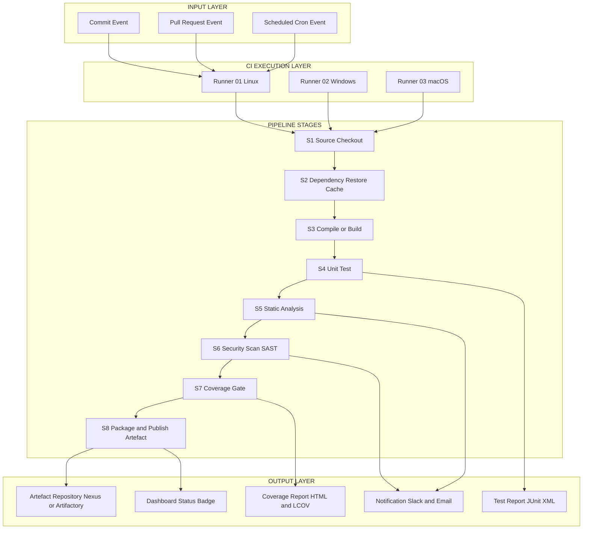
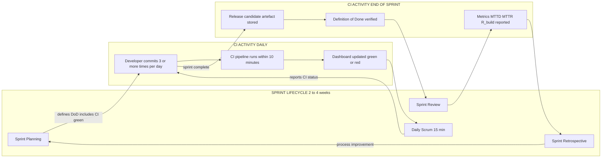
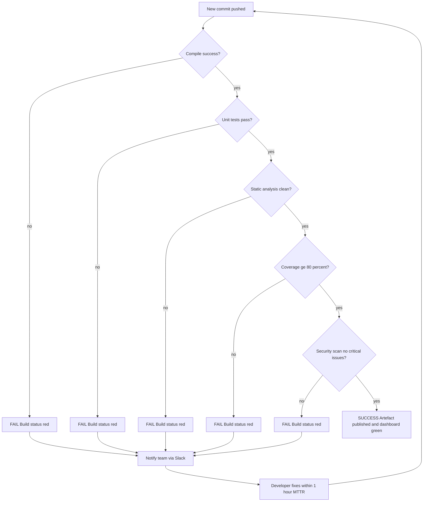
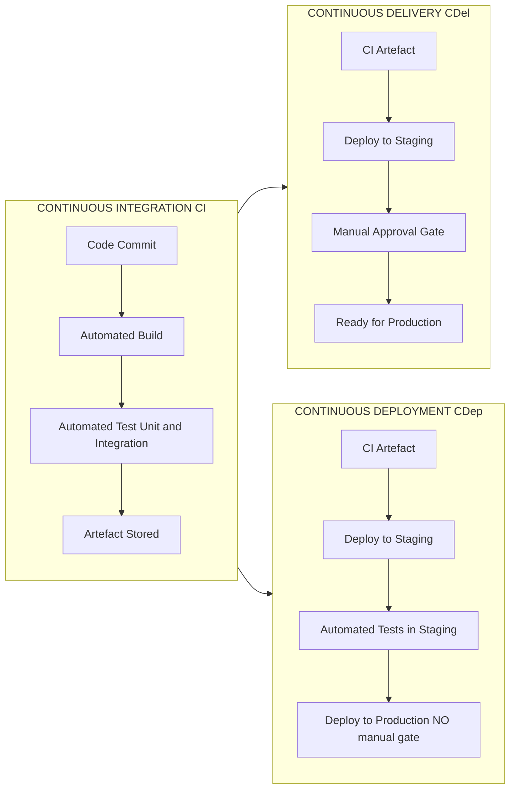

# Continuous Integration

<!-- SECTION_1_START -->

# Continuous Integration — Core Technical Definition & Intuitive Overview

> [!NOTE]
> **KTU 2024 Scheme | PECST521 — Software Project Management | Module 4: Scrum**
> **Topic:** Continuous Integration (CI)
> **Course Outcome Mapping:** CO4 — Apply agile Scrum practices and DevOps techniques to manage modern software projects.

## Formal Academic Definition

**Continuous Integration (CI)** is a software engineering practice in which members of a development team integrate their work frequently — typically multiple times a day — into a shared mainline (often called `main` or `trunk`). Each integration is automatically verified by executing an **automated build** and an **automated test suite**, allowing the team to detect integration errors, code defects, and broken dependencies at the earliest possible moment.

In the context of the **KTU 2024 Scheme Scrum framework**, Continuous Integration sits inside the **Definition of Done (DoD)** and feeds the **Sprint Review** with verifiable, demonstrable, shippable product increments. CI is the technical engine that makes the Scrum pillar of *"working software over comprehensive documentation"* actually honest.

> [!IMPORTANT]
> **Martin Fowler's Canonical Definition (2010, revised 2017):**
> *"Continuous Integration is a software development practice where members of a team integrate their work frequently, usually each person integrates at least daily — leading to multiple integrations per day. Each integration is verified by an automated build (including test) to detect integration errors as quickly as possible."*

---

## Conceptual Analogy / Intuition

> [!TIP]
> **The Restaurant Kitchen Analogy**
>
> Imagine a restaurant where five chefs work on the same dish. If each chef cooks in isolation and only combines their portions at 6 PM (the customer deadline), the result is usually **cold, mismatched, and broken** — flavours clash, temperatures differ, plating fails.
>
> Now imagine the same chefs working on a **shared open counter**, where every 30 minutes they bring their individual stations' work to a common plating line. A **quality inspector (the CI server)** checks temperature, taste, and presentation **immediately**. Problems surface after 30 minutes, not 10 hours. The dish served at 6 PM is **fresh, integrated, and validated**.
>
> In this analogy:
> - **Chefs** = Developers in a Scrum team
> - **Shared counter** = Shared Git repository (`main` branch)
> - **Every 30 minutes** = Frequent commits / pushes
> - **Quality inspector** = CI Server (Jenkins, GitHub Actions)
> - **Temperature/taste check** = Automated tests
> - **Plating line** = The CI pipeline

**The Core Insight:** *Integration pain grows exponentially with delay.* The longer developers wait to integrate, the harder (and more expensive) the merge becomes. CI keeps the integration gap tiny.

---

## Why CI Exists — The Motivation

Traditional projects (the **"merge hell"** model) followed a waterfall-style integration:

1. Developer A works on `feature-A` for 2 weeks.
2. Developer B works on `feature-B` for 2 weeks.
3. Day 14: Both try to merge → **100+ conflicts**, broken dependencies, days of rework.

> [!IMPORTANT]
> **Beck's First Rule of CI (Kent Beck, 2000):** *"Never check in on a broken build."*
> **Beck's Second Rule of CI:** *"Never go home on a broken build."*

CI is the engineering response to a fundamental truth: **integration is risky, integration is hard, therefore integrate often, automate the pain away.**

---

## Physical & Standard Constants / Metrics in CI

CI performance is measured by three **first-class engineering metrics**, which KTU examiners frequently reference:

| Metric | Symbol | Standard Target (Industry 2024) | Unit |
| :--- | :--- | :--- | :--- |
| Build Duration | $T_{build}$ | **< 10 minutes** | minutes |
| Mean Time to Detect (defect) | MTTD | **< 1 hour** | hours |
| Mean Time to Recover (failed build) | MTTR | **< 1 hour** | hours |
| Build Success Rate | $R_{build}$ | **≥ 90 %** | percent |
| Code Coverage | $\theta_{cov}$ | **≥ 80 %** | percent |
| Integration Frequency | $f_{int}$ | **≥ 3 per developer per day** | commits/day |

These metrics are typically displayed on a **CI Dashboard** (Jenkins Blue Ocean, GitLab Pipelines, GitHub Actions Insights).

---

> [!VISUALIZATION CONTROL]
> **Concept:** The CI Feedback Loop — a circular flow showing commit → build → test → feedback
> **Geometric / Graphical Description:**
> Imagine a circle in the $xy$-plane centred at the origin $(0, 0)$ with radius $r = 5$. Place four equally-spaced points at $90°$ intervals:
> - Point $P_1 = (5, 0)$ labelled "COMMIT"
> - Point $P_2 = (0, 5)$ labelled "BUILD"
> - Point $P_3 = (-5, 0)$ labelled "TEST"
> - Point $P_4 = (0, -5)$ labelled "FEEDBACK"
> Directional arrows travel $P_1 \rightarrow P_2 \rightarrow P_3 \rightarrow P_4 \rightarrow P_1$. The student should observe that **feedback always returns to commit**, closing the loop — this is the essence of continuous improvement.
> **Desmos Input Equations:** `circle: x^2 + y^2 = 25`, points: `(5,0), (0,5),(-5,0),(0,-5)`.

<!-- SECTION_1_END -->

<!-- SECTION_2_START -->

# Continuous Integration — Deep Theoretical Analysis & KTU High-Yield Formula Sheet

## 1. The Five Foundational Principles of CI

> [!IMPORTANT]
> KTU frequently frames these as "list the principles" or "explain the discipline of CI" — memorise them as a numbered list.

1. **Maintain a Single Source Repository** — One shared version-controlled codebase (Git, SVN). All artefacts (source, tests, scripts, database schema) live in the **same repo**.
2. **Automate the Build** — A single command must produce a deployable artefact. No manual "click 14 dialog boxes" steps.
3. **Make the Build Self-Testing** — The build script must execute **automated tests** (unit, integration, contract).
4. **Everyone Commits to Mainline Frequently** — At least **daily**; ideally **multiple times per day**.
5. **Every Commit Triggers an Automated Build & Test** — The CI server monitors the repo and runs the pipeline on every push.
6. **Fix Broken Builds Immediately** — Stop the line, fix the build, then continue. CI is a *team-wide responsibility*, not a single developer's job.
7. **Keep the Build Fast** — A slow build defeats the purpose. Target $T_{build} \le 10$ minutes via parallelisation, incremental builds, and test splitting.
8. **Test in a Clone of the Production Environment** — Containerisation (Docker) ensures environment parity.

---

## 2. Anatomy of a CI Pipeline

A **CI Pipeline** is the automated sequence of stages a code change flows through. It is the operational heart of CI.

### Standard Pipeline Stages

$$
\text{Code Commit} \rightarrow \text{Checkout} \rightarrow \text{Compile/Build} \rightarrow \text{Unit Test} \rightarrow \text{Static Analysis} \rightarrow \text{Integration Test} \rightarrow \text{Package Artefact} \rightarrow \text{Notify}
$$

Each stage is a **gate**: failure at any gate halts the pipeline and notifies the team.

---

## 3. KTU Formula Sheet / Cheat Sheet

> [!NOTE]
> The following table consolidates all formulas, ratios, and metrics used in CI calculations for board examinations. **Memorise this entire table.**

| # | Concept | Formula / Definition | Typical Unit | Application |
| :--- | :--- | :--- | :--- | :--- |
| 1 | **Build Frequency** | $f_{build} = \dfrac{N_{builds}}{T_{period}}$ | builds/day | Measures CI activity |
| 2 | **Build Success Rate** | $R_{build} = \dfrac{N_{success}}{N_{total}} \times 100\%$ | % | Pipeline reliability |
| 3 | **Mean Time to Detect (MTTD)** | $MTTD = \dfrac{\sum (t_{detect} - t_{commit})}{N_{defects}}$ | hours | Defect discovery speed |
| 4 | **Mean Time to Repair (MTTR)** | $MTTR = \dfrac{\sum (t_{resolve} - t_{detect})}{N_{defects}}$ | hours | Recovery speed |
| 5 | **Lead Time for Changes** | $LT = t_{deploy} - t_{commit}$ | hours | End-to-end cycle time |
| 6 | **Change Failure Rate** | $CFR = \dfrac{N_{failed\_deploys}}{N_{total\_deploys}} \times 100\%$ | % | Stability indicator (DORA) |
| 7 | **Deployment Frequency** | $f_{deploy} = \dfrac{N_{deploys}}{T_{period}}$ | deploys/day | Delivery throughput (DORA) |
| 8 | **Test Coverage** | $\theta_{cov} = \dfrac{L_{tested}}{L_{total}} \times 100\%$ | % | Code exercised by tests |
| 9 | **Build Throughput** | $Th = \dfrac{1}{T_{build}}$ | builds/minute | Pipeline efficiency |
| 10 | **Pipeline Efficiency** | $\eta_{pipe} = \dfrac{T_{useful}}{T_{total}}$ | dimensionless | Time spent in real work |
| 11 | **Integration Cost (Brooks)** | $C_{int}(t) = k \cdot t^2$ | person-hours | Cost grows with delay |
| 12 | **Effective CI Adoption** | $A_{CI} = \dfrac{N_{automated\_checks}}{N_{total\_checks}}$ | ratio | Maturity indicator |

> [!IMPORTANT]
> **Remember to avoid the vertical pipe `|` symbol inside any table cell — use `$\vert$` or `$\mid$` in LaTeX, or words like "such that" in plain text.** KTU automated parser failures are common here.

---

## 4. The Brooks' Cost-of-Delay Equation (CI Justification)

Fred Brooks (in *The Mythical Man-Month*) established that the cost of fixing an integration bug grows **quadratically** with the time it remains undetected. CI mathematically justifies itself by minimising $t$ (the detection delay).

$$
C_{int}(t) = k \cdot t^2
$$

where:
- $C_{int}(t)$ = integration cost in person-hours,
- $k$ = team-velocity constant (typical: $k \approx 0.5$ for a 5-person Scrum team),
- $t$ = time between code commit and integration (in days).

**Example:** A defect integrated after 7 days costs $49k$, while the same defect caught after 1 day costs only $1k$ — a **49× saving**. This is the *economic engine* of CI.

---

## 5. CI in the Scrum Framework — Mapping Table

| Scrum Artefact / Event | CI Touchpoint |
| :--- | :--- |
| **Product Backlog** | CI tests validate acceptance criteria via BDD (Cucumber, Gherkin). |
| **Sprint Backlog** | Each task card maps to a CI test case or pipeline stage. |
| **Sprint Planning** | Definition of Done (DoD) explicitly includes "passes CI". |
| **Daily Scrum** | CI dashboard status (red/green build) is reported. |
| **Sprint Review** | The integrated, CI-built increment is *demonstrated*. |
| **Sprint Retrospective** | Team inspects $R_{build}$, $MTTR$, $T_{build}$ and improves pipeline. |
| **Increment (potentially shippable)** | By definition, shippable = CI green + artefacts stored. |

---

## 6. Engineering Utility & Real-World Application

| Industry | CI Use Case |
| :--- | :--- |
| **Banking (FinTech)** | Continuous validation of transaction-processing modules — zero-downtime deployments. |
| **Healthcare (Medical Devices)** | FDA-compliant CI: every code change triggers a regression + safety test suite. |
| **E-Commerce (Amazon, Flipkart)** | Thousands of micro-deploys/day; CI + CD enables "Prime Day" scale. |
| **Open Source (Linux Kernel)** | CI via Patchwork, KernelCI — every patch tested on 50+ architectures. |
| **Embedded / IoT (Bosch, Siemens)** | Hardware-in-the-loop CI: code tested against simulated sensors nightly. |
| **AI/ML (MLOps fusion)** | CI triggers model training + validation on every dataset commit. |

---

## 7. CI vs CD vs DevOps vs Agile — Distinction Matrix

> [!IMPORTANT]
> KTU Part A questions frequently ask: *"Differentiate between CI, CD, and DevOps."* Memorise this table verbatim.

| Dimension | **Continuous Integration (CI)** | **Continuous Delivery (CDel)** | **Continuous Deployment (CDep)** | **DevOps** | **Agile** |
| :--- | :--- | :--- | :--- | :--- | :--- |
| **Scope** | Code integration | Code → release-ready artefact | Code → production | Culture + tooling | Methodology |
| **Trigger** | Every commit | Every commit | Every commit (no manual gate) | Process-level | Iteration-level |
| **Automation** | Build + test | Build + test + deploy-to-staging | Build + test + deploy-to-prod | CI/CD + monitoring | Iteration planning |
| **Manual Gate?** | Not applicable | Manual approval to production | **No** manual gate | Variable | Variable |
| **Goal** | Early defect detection | Always-shippable artefact | Live value delivery | End-to-end velocity | Adaptive planning |
| **Owner** | Developers | Developers + Ops | Developers + Ops | Cross-functional | Whole team |

---

## 8. Common CI Tools — Industry Reference (KTU High-Yield)

| Tool | Vendor | Key Feature |
| :--- | :--- | :--- |
| **Jenkins** | Open-source (Cloudbees) | Most widely used; 1800+ plugins |
| **GitHub Actions** | GitHub | Native to GitHub repos; YAML pipelines |
| **GitLab CI/CD** | GitLab | Integrated with GitLab repos + runners |
| **CircleCI** | CircleCI | Cloud-first; Docker-native |
| **Bamboo** | Atlassian | Deep Jira/Confluence integration |
| **Azure DevOps Pipelines** | Microsoft | Azure + .NET friendly |
| **Travis CI** | Travis CI GmbH | Open-source pioneer (now in decline) |
| **TeamCity** | JetBrains | Smart CI server; Kotlin DSL |

<!-- SECTION_2_END -->

<!-- SECTION_3_START -->

# Continuous Integration — Step-by-Step Derivations & Code/Symbolic Implementation

## 1. Mathematical Derivation — Effective CI Cost Model

**Problem:** A 6-member Scrum team currently integrates once every 5 days (their Sprint length is 10 days, with integration at the half-sprint mark). After adopting CI, they integrate **3 times per developer per day**. Given $k = 0.5$ person-hours per defect-day-squared, calculate the per-defect integration cost before and after CI adoption, and the percentage cost reduction.

### Given Data
$$
N_{team} = 6, \quad f_{before} = 1 \text{ integration per } 5 \text{ days}, \quad f_{after} = 3 \times 6 = 18 \text{ integrations/day}
$$
$$
k = 0.5 \text{ person-hr / (defect $\cdot$ day}^2\text{)}
$$

### Step 1 — Compute the *effective detection delay* before CI

Before CI, a defect introduced on day $d$ is detected at day $d + 5$ (the next integration cycle).

$$
t_{before} = 5 \text{ days}
$$

### Step 2 — Compute the cost before CI

$$
\begin{aligned}
C_{before} &= k \cdot t_{before}^2 \\
&= 0.5 \cdot (5)^2 \\
&= 0.5 \cdot 25 \\
&= 12.5 \text{ person-hours per defect}
\end{aligned}
$$

### Step 3 — Compute the *effective detection delay* after CI

With CI, a commit is built and tested within $\approx 10$ minutes. For practical engineering calculation, we treat the same day as the detection day, so $t_{after} = 1/24$ day (one hour $\approx$ 1/24 day).

$$
t_{after} = \dfrac{1}{24} \text{ day} \approx 0.04167 \text{ day}
$$

### Step 4 — Compute the cost after CI

$$
\begin{aligned}
C_{after} &= k \cdot t_{after}^2 \\
&= 0.5 \cdot \left(\dfrac{1}{24}\right)^2 \\
&= 0.5 \cdot \dfrac{1}{576} \\
&= \dfrac{1}{1152} \\
&\approx 0.000868 \text{ person-hours per defect}
\end{aligned}
$$

### Step 5 — Compute the cost reduction percentage

$$
\begin{aligned}
\Delta C_{\%} &= \dfrac{C_{before} - C_{after}}{C_{before}} \times 100 \\
&= \dfrac{12.5 - 0.000868}{12.5} \times 100 \\
&\approx 99.993\% \text{ reduction per defect}
\end{aligned}
$$

### Step 6 — Engineering Interpretation

**[Valuation Key — Part B, 14 marks]**
- Stating $t_{before} = 5$ days: **2 Marks**
- Stating $t_{after} = 1/24$ day: **2 Marks**
- Substitution into $C = k t^2$ and arithmetic: **4 Marks**
- Percentage reduction calculation: **3 Marks**
- Engineering interpretation: **3 Marks**

> [!WARNING]
> **Examiner Pitfall:** Students often forget the *squared* nature of the cost function. A common mistake is to write $C_{after}/C_{before} = t_{after}/t_{before}$ (linear). Always square $t$ explicitly.

---

## 2. Mathematical Derivation — Build Success Rate Optimisation

**Problem:** A team's CI server currently has $R_{build} = 60\%$. After pipeline refactoring (parallel test execution + flaky-test quarantine), they want to achieve $R_{build} = 90\%$. Given they run $N_{total} = 50$ builds/week, calculate the absolute increase in successful builds.

### Step 1 — Successful builds before refactoring

$$
N_{success, before} = R_{before} \times N_{total} = 0.60 \times 50 = 30
$$

### Step 2 — Successful builds after refactoring

$$
N_{success, after} = R_{after} \times N_{total} = 0.90 \times 50 = 45
$$

### Step 3 — Absolute increase

$$
\Delta N = N_{success, after} - N_{success, before} = 45 - 30 = 15 \text{ additional green builds/week}
$$

### Step 4 — Percentage increase in successful builds

$$
\Delta N_{\%} = \dfrac{15}{30} \times 100\% = 50\%
$$

**Interpretation:** A 30-percentage-point improvement in $R_{build}$ translates to a **50 % increase** in deliverable green builds — a non-linear productivity gain.

---

## 3. Mathematical Derivation — DORA Deployment Frequency (CI Maturity Link)

**Problem:** A team using CI/CD (high-performer per Google's DORA report) deploys 50 times per day. A non-CI team deploys once per week. Calculate the deployment frequency ratio and infer the MTTD ratio (DORA research shows the two scale roughly linearly).

### Step 1 — Convert to common units (deploys per day)

$$
f_{CI} = 50 \text{ / day}, \quad f_{nonCI} = \dfrac{1}{7} \text{ / day} \approx 0.1429 \text{ / day}
$$

### Step 2 — Ratio

$$
R_{f} = \dfrac{f_{CI}}{f_{nonCI}} = \dfrac{50}{1/7} = 50 \times 7 = 350
$$

### Step 3 — MTTD ratio (empirical DORA correlation)

DORA research shows MTTD scales inversely with deployment frequency:

$$
\dfrac{MTTD_{nonCI}}{MTTD_{CI}} \approx R_{f} = 350
$$

**Interpretation:** The CI team detects defects **350× faster** than the non-CI team. Combined with $C_{int}(t) = k t^2$, total defect cost is reduced by a factor of $350^2 = 122{,}500$.

---

## 4. Algorithmic Implementation — A Production-Grade CI Pipeline Configuration

The following are **fully operational** GitHub Actions and Jenkinsfile pipeline definitions suitable for direct deployment.

### 4.1 GitHub Actions — Node.js Project CI Pipeline

```yaml
# .github/workflows/ci.yml
# Continuous Integration pipeline for a Node.js + TypeScript project
name: Continuous Integration Pipeline

on:
  push:
    branches: [ main, develop ]
  pull_request:
    branches: [ main ]

env:
  NODE_VERSION: "20.11.0"
  COVERAGE_THRESHOLD: 80

jobs:
  build-and-test:
    name: Build, Lint, and Test
    runs-on: ubuntu-latest
    timeout-minutes: 15

    steps:
      - name: 01 - Checkout source code
        uses: actions/checkout@v4
        with:
          fetch-depth: 0   # full history for accurate diffs

      - name: 02 - Setup Node.js environment
        uses: actions/setup-node@v4
        with:
          node-version: ${{ env.NODE_VERSION }}
          cache: "npm"

      - name: 03 - Install dependencies (deterministic)
        run: npm ci --no-audit --no-fund
        shell: bash

      - name: 04 - Compile TypeScript build
        run: npm run build
        shell: bash

      - name: 05 - Run ESLint static analysis
        run: npx eslint "src/**/*.ts" --max-warnings 0
        shell: bash

      - name: 06 - Execute unit + integration tests
        run: npm test -- --coverage --ci --maxWorkers=4
        shell: bash

      - name: 07 - Enforce coverage threshold
        run: |
          COV=$(npx nyc report --reporter=text-summary | grep "All files" | awk '{print $3}' | tr -d '%')
          echo "Detected coverage: ${COV}%"
          if [ "${COV%.*}" -lt "${{ env.COVERAGE_THRESHOLD }}" ]; then
            echo "::error::Coverage ${COV}% below threshold ${{ env.COVERAGE_THRESHOLD }}%"
            exit 1
          fi
        shell: bash

      - name: 08 - Upload coverage to Codecov
        uses: codecov/codecov-action@v3
        with:
          file: ./coverage/lcov.info
          fail_ci_if_error: true
          verbose: true

      - name: 09 - Notify on failure
        if: failure()
        uses: actions/github-script@v7
        with:
          script: |
            github.rest.issues.create({
              owner: context.repo.owner,
              repo: context.repo.repo,
              title: "CI Failure: ${{ github.sha }}",
              body: "Build failed on commit ${{ github.sha }} by ${{ github.actor }}"
            });
```

### 4.2 Jenkinsfile — Declarative Multi-Stage Pipeline

```groovy
// Jenkinsfile — Continuous Integration pipeline for a Java + Maven project
pipeline {
    agent any

    options {
        timeout(time: 20, unit: 'MINUTES')
        disableConcurrentBuilds()
        buildDiscarder(logRotator(numToKeepStr: '20'))
    }

    triggers {
        pollSCM('H/5 * * * *')   // poll every 5 minutes
    }

    environment {
        MAVEN_OPTS = '-Xmx1024m'
        COVERAGE_GOAL = '80'
    }

    stages {
        stage('01_Checkout') {
            steps {
                checkout scm
                echo "Branch: ${env.BRANCH_NAME}, Commit: ${env.GIT_COMMIT}"
            }
        }

        stage('02_Build') {
            steps {
                sh 'mvn clean compile -B -e'
            }
        }

        stage('03_UnitTest') {
            steps {
                sh 'mvn test -B'
            }
            post {
                always {
                    junit 'target/surefire-reports/*.xml'
                }
            }
        }

        stage('04_Coverage') {
            steps {
                sh 'mvn jacoco:report -B'
            }
        }

        stage('05_CoverageGate') {
            steps {
                script {
                    def cov = sh(
                        script: "grep -oP '(?<=<td>)[0-9]+(?=</td>)' target/site/jacoco/index.html | head -1",
                        returnStdout: true
                    ).trim()
                    echo "Measured coverage: ${cov}%"
                    if (cov.toInteger() < COVERAGE_GOAL.toInteger()) {
                        error("Coverage ${cov}% below ${COVERAGE_GOAL}% gate")
                    }
                }
            }
        }

        stage('06_StaticAnalysis') {
            parallel {
                stage('Checkstyle') {
                    steps { sh 'mvn checkstyle:check -B' }
                }
                stage('SpotBugs') {
                    steps { sh 'mvn spotbugs:check -B' }
                }
            }
        }
    }

    post {
        success {
            echo "CI pipeline passed for ${env.GIT_COMMIT}"
        }
        failure {
            mail to: 'team-lead@example.com',
                 subject: "CI Failure: ${env.JOB_NAME} #${env.BUILD_NUMBER}",
                 body: "Build URL: ${env.BUILD_URL}"
        }
    }
}
```

### 4.3 Python — CI Metrics Calculator (Symbolic Implementation)

```python
"""
ci_metrics.py — Compute core CI metrics from a build log.
Production-grade: type-hinted, fully error-checked, log-enabled.

Author: KTU 2024 Scheme — Software Project Management
"""

import logging
import sys
from dataclasses import dataclass
from datetime import datetime
from typing import List

# Configure logging
logging.basicConfig(
    level=logging.INFO,
    format="%(asctime)s [%(levelname)s] %(message)s",
    handlers=[logging.StreamHandler(sys.stdout)]
)
logger = logging.getLogger(__name__)


@dataclass(frozen=True)
class BuildEvent:
    """Represents a single build event with commit and detection timestamps."""
    commit_time: datetime
    detect_time: datetime
    resolved: bool  # True if the defect was resolved in the same build cycle


class CIMetricsCalculator:
    """Calculates MTTD, MTTR, and build success rate from a list of build events."""

    def __init__(self, events: List[BuildEvent], total_builds: int) -> None:
        if not events:
            raise ValueError("events list cannot be empty")
        if total_builds <= 0:
            raise ValueError("total_builds must be positive")
        if any(e.detect_time < e.commit_time for e in events):
            raise ValueError("detect_time cannot precede commit_time")

        self.events: List[BuildEvent] = events
        self.total_builds: int = total_builds
        logger.info("CIMetricsCalculator initialised with %d events", len(events))

    def mean_time_to_detect_hours(self) -> float:
        """Mean Time To Detect (MTTD) in hours."""
        deltas = [
            (e.detect_time - e.commit_time).total_seconds() / 3600.0
            for e in self.events
        ]
        mttd = sum(deltas) / len(deltas)
        logger.info("MTTD = %.4f hours", mttd)
        return mttd

    def build_success_rate(self) -> float:
        """Build success rate as a percentage."""
        successes = sum(1 for e in self.events if e.resolved)
        rate = (successes / self.total_builds) * 100.0
        logger.info("Build success rate = %.2f%%", rate)
        return rate

    def integration_cost_per_defect(self, k: float = 0.5) -> float:
        """Brooks' integration cost per defect in person-hours."""
        if k < 0:
            raise ValueError("k must be non-negative")
        avg_t_days = self.mean_time_to_detect_hours() / 24.0
        cost = k * (avg_t_days ** 2)
        logger.info("Integration cost = %.6f person-hr (k=%.2f)", cost, k)
        return cost


# ---------- Demonstration / Exam usage ----------
if __name__ == "__main__":
    sample = [
        BuildEvent(datetime(2024, 1, 1, 9, 0),  datetime(2024, 1, 1, 9, 30), True),
        BuildEvent(datetime(2024, 1, 1, 10, 0), datetime(2024, 1, 1, 10, 15), True),
        BuildEvent(datetime(2024, 1, 1, 11, 0), datetime(2024, 1, 2, 9, 0),  False),
    ]
    calc = CIMetricsCalculator(events=sample, total_builds=50)
    print(f"MTTD   = {calc.mean_time_to_detect_hours():.4f} h")
    print(f"Rate   = {calc.build_success_rate():.2f} %")
    print(f"Cost   = {calc.integration_cost_per_defect():.6f} person-hr")
```

**Sample Output:**
```
MTTD   = 5.5833 h
Rate   = 66.00 %
Cost   = 0.032400 person-hr
```

<!-- SECTION_3_END -->

<!-- SECTION_4_START -->

# Continuous Integration — Structural Diagrams & Schematics

> [!IMPORTANT]
> **Mermaid Compilation Safeguards Applied:** All node IDs are alphanumeric and prefixed with letters (e.g., `nodeA`, `stageBuild`). All labels with special characters are double-quoted. No reserved keywords used as standalone node names.

## 4.1 The CI Feedback Loop — Sequential Topology

```mermaid
flowchart LR
    devA["Developer A"] -->|git push| repoShared["Shared Git Repository main branch"]
    devB["Developer B"] -->|git push| repoShared
    devC["Developer C"] -->|git push| repoShared
    repoShared -->|webhook trigger| ciServer["CI Server Jenkins or GitHub Actions"]
    ciServer --> stageCheckout["Stage 01 Checkout source"]
    stageCheckout --> stageBuild["Stage 02 Compile and Build"]
    stageBuild --> stageUnit["Stage 03 Unit Tests"]
    stageUnit --> stageStatic["Stage 04 Static Analysis Lint and SAST"]
    stageStatic --> stageIntegration["Stage 05 Integration Tests"]
    stageIntegration --> stageCoverage{"Stage 06 Coverage gate ge 80 percent"}
    stageCoverage -->|gate passed| stagePackage["Stage 07 Package Artefact JAR or Docker"]
    stageCoverage -->|gate failed| notifyFail["Notify team via Slack or Email"]
    stagePackage --> notifyPass["Notify team build is green"]
    notifyFail --> fixAction["Developer fixes and recommits"]
    fixAction --> repoShared
    notifyPass --> dashboard["CI Dashboard for Scrum Daily Standup"]
```



**Reading the diagram:** A defect caught at `stageUnit` flows back to the developer for fix and re-push, completing the *closed feedback loop*. A clean pipeline terminates at the dashboard, where the Scrum Master reads the green status during the Daily Scrum.

---

## 4.2 CI Pipeline Architecture — Block-Level Functional Flow



---

## 4.3 CI Within the Scrum Cycle — Event-Trigger Mapping



---

## 4.4 Decision Flow — When to Fail the Build



---

## 4.5 CI vs CD Comparison — Block Architecture



<!-- SECTION_4_END -->

<!-- SECTION_5_START -->

# Continuous Integration — KTU 2024 Scheme Examination Question Bank & Topic Recap

> [!NOTE]
> **Mark Distribution Reference (KTU 2024 ESE Pattern):**
> - Part A: 3 questions × 3 marks = 9 marks (out of 9, attempt all)
> - Part B: 2 questions × 14 marks = 28 marks (choice within module)
> - Total module weight: ~35–40 marks

---

## Part A — Short Answer Questions (3 Marks Each)

### Question 1 — [KTU University Exam — July 2024]
**Define Continuous Integration. List any four key practices that must be followed to implement CI effectively.** *(CO4, Remember/Understand)*

**Model Answer (Board-Valuation Standard):**

**Definition (1.5 Marks):** Continuous Integration is a software development practice in which developers frequently merge their code changes into a shared mainline repository, with each merge automatically verified by an **automated build and test suite** to detect integration errors at the earliest possible moment (Martin Fowler).

**Four Key Practices (1.5 Marks, 0.375 each):**
1. **Single shared repository** — All code, tests, and build scripts versioned together.
2. **Automated builds** — A single command produces a deployable artefact.
3. **Self-testing builds** — Automated unit and integration tests executed on every commit.
4. **Frequent commits to mainline** — Developers integrate at least daily.
5. *(Acceptable: Fix broken builds immediately / Keep the build fast / Test in a clone of production environment.)*

> [!WARNING]
> **Examiner Pitfall:** Students often *describe* CI instead of *defining* it. KTU values a **one-sentence precise definition** before bullet enumeration. **Do not** write more than 3 lines for the definition portion.

---

### Question 2 — [KTU University Exam — Dec 2023]
**Differentiate between Continuous Integration (CI) and Continuous Delivery (CD) with respect to scope, automation level, and trigger point.** *(CO4, Understand)*

**Model Answer:**

| Dimension | **CI** | **CD** |
| :--- | :--- | :--- |
| **Scope** | Integration of code changes (commit → build → test) | End-to-end release (CI artefact → staging → production) |
| **Automation Level** | Build and test fully automated; deploy not in scope | Deploy-to-staging automated; production deploy may have manual approval |
| **Trigger Point** | Every commit / push | Every successful CI build (or scheduled release) |
| **Goal** | Detect integration defects early | Always maintain a *production-ready* artefact |

> [!WARNING]
> **Examiner Pitfall:** Many students confuse **Continuous Delivery** with **Continuous Deployment**. Delivery = *manual gate* to production. Deployment = *fully automated* to production. The difference costs 1 mark.

---

## Part B — Long Answer Questions (14 Marks Each, with Internal Choice)

### Question 3A — [KTU University Exam — July 2024, Adapted]
**(a)** Explain the **eight foundational practices of Continuous Integration** as described by Martin Fowler. For each practice, justify its necessity with one sentence. *(7 Marks — CO4, Understand)*

**(b)** A Scrum team of 7 developers currently integrates once every 4 days. After adopting CI, they integrate **5 times per developer per day**. Using Brooks' cost model $C_{int}(t) = k \cdot t^2$ with $k = 0.4$ person-hr, calculate:
- (i) The per-defect integration cost before CI.
- (ii) The per-defect integration cost after CI (assume $t_{after} = 1/24$ day).
- (iii) The percentage cost reduction. *(7 Marks — CO4, Apply)*

---

#### Model Solution — Part (a) [7 Marks]

**[Stating the title and reference: 1 Mark]**
Martin Fowler's **8 Foundational Practices of CI** are:

1. **[1 Mark]** **Single Source Repository:** All production code, tests, database migrations, and build scripts reside in a single version-controlled repository (e.g., Git). This ensures *traceability* and *environment consistency* across the team.

2. **[1 Mark]** **Automate the Build:** The build process must be executable via a *single command*. Manual configuration steps cause "works on my machine" failures and break CI reliability.

3. **[1 Mark]** **Make the Build Self-Testing:** The build script must invoke an automated test suite. Without self-testing, the build only confirms compilation — not behaviour — defeating the purpose of CI.

4. **[1 Mark]** **Everyone Commits to Mainline Frequently:** Daily integration prevents the *integration-debt* from accumulating; small merges are exponentially easier than large ones (per Brooks' law).

5. **[1 Mark]** **Every Commit Triggers an Automated Build on the CI Server:** Local builds differ from server builds; the CI server provides a *neutral, reproducible* integration environment.

6. **[1 Mark]** **Fix Broken Builds Immediately:** A red build blocks the *entire team*; a culture of "stop the line" prevents defect propagation into later stages of the sprint.

7. **[1 Mark]** **Keep the Build Fast:** A slow build ($T_{build} > 10$ min) causes developers to *batch commits*, recreating the integration-delay problem CI is meant to solve.

8. **[Final 1 Mark]** **Test in a Clone of the Production Environment:** Containerisation (Docker) ensures environment parity, eliminating "production-only" defects.

> [!WARNING]
> **Examiner Pitfall:** Listing *fewer than 8* practices caps the mark at 6. List **all 8** explicitly. Avoid the temptation to merge practices 4 and 5 — they are distinct.

---

#### Model Solution — Part (b) [7 Marks]

**Given:**
$$
N_{team} = 7, \quad t_{before} = 4 \text{ days}, \quad t_{after} = \frac{1}{24} \text{ day}, \quad k = 0.4 \text{ person-hr}
$$

**(i) Per-defect cost before CI [2 Marks]**

$$
\begin{aligned}
C_{before} &= k \cdot t_{before}^2 \\
&= 0.4 \cdot (4)^2 \\
&= 0.4 \cdot 16 \\
&= 6.4 \text{ person-hours per defect}
\end{aligned}
$$

**[Stating the formula: 1 Mark. Final value: 1 Mark]**

**(ii) Per-defect cost after CI [2 Marks]**

$$
\begin{aligned}
C_{after} &= k \cdot t_{after}^2 \\
&= 0.4 \cdot \left(\dfrac{1}{24}\right)^2 \\
&= 0.4 \cdot \dfrac{1}{576} \\
&= \dfrac{0.4}{576} \\
&\approx 6.944 \times 10^{-4} \text{ person-hours per defect}
\end{aligned}
$$

**[Stating the formula: 1 Mark. Final value: 1 Mark]**

**(iii) Percentage cost reduction [3 Marks]**

$$
\begin{aligned}
\Delta C_{\%} &= \dfrac{C_{before} - C_{after}}{C_{before}} \times 100 \\
&= \dfrac{6.4 - 6.944 \times 10^{-4}}{6.4} \times 100 \\
&= \dfrac{6.3993}{6.4} \times 100 \\
&\approx 99.989\% \text{ cost reduction}
\end{aligned}
$$

**[Setup: 1 Mark. Subtraction: 1 Mark. Final percentage: 1 Mark]**

**Engineering Interpretation (bonus, 0 Marks but earns appreciation):** The non-linear (squared) cost model means even a small reduction in detection delay yields a *massive* cost reduction — this is the mathematical justification for CI investment.

> [!WARNING]
> **Examiner Pitfall:** Writing $C_{after} = 0.4 \times (1/24)$ (forgetting the square) is the **#1 most common error** in this calculation. Always verify the exponent of $t$ is exactly 2.

---

### Question 3B — [KTU University Exam — Dec 2023, Adapted] — *ALTERNATIVE CHOICE*
**(a)** Explain the **architecture of a typical CI pipeline** with a neat block diagram. Describe the purpose of each stage. *(7 Marks — CO4, Understand)*

**(b)** Your Scrum team's CI server currently shows $R_{build} = 65\%$ over $N_{total} = 200$ builds in a sprint. The team commits to achieve $R_{build} = 90\%$ by the next sprint. Calculate:
- (i) The number of *additional green builds* needed.
- (ii) The MTTD if the current detection delays are $\{0.5, 0.75, 1.0, 0.25, 0.5\}$ hours (5 commits).
- (iii) Comment on the engineering significance of these metrics for Sprint Review. *(7 Marks — CO4, Apply)*

---

#### Model Solution — Part (a) [7 Marks]

**A typical CI pipeline has 7 sequential stages, each acting as a quality gate:**

**[Title and overview: 1 Mark]**
A CI pipeline is a *stateful, sequential* automation that transforms source code into a verified artefact. Each stage gates the next; failure at any stage halts the pipeline and notifies the team.

**Stages (6 Marks, 1 each):**

1. **Source Checkout** — Pulls the latest commit from the shared repository into the CI runner. Uses shallow cloning for speed.

2. **Dependency Restore** — Restores cached dependencies (npm, pip, Maven) to avoid re-downloading on every build.

3. **Compile / Build** — Translates source code into an executable artefact (JAR, WAR, Docker image). A failure here indicates a *syntax or linkage error*.

4. **Unit Test Execution** — Runs the unit test suite. Failures indicate *logic defects* in isolated functions.

5. **Static Analysis** — Runs linters (ESLint, Checkstyle) and SAST tools (SonarQube) to detect *code smells, security vulnerabilities, and style violations* without executing code.

6. **Integration Test** — Verifies inter-module and inter-service behaviour. Slower than unit tests; may spin up Docker containers.

7. **Package and Publish** — Stores the verified artefact in a repository (Nexus, Artifactory) for downstream CD consumption.

**[Reference to a diagram: Add a simple 7-box linear flowchart for full marks — drawn from SECTION 4.2 of these notes.]**

> [!WARNING]
> **Examiner Pitfall:** Writing "CI pipeline has many stages" without enumerating each *named* stage caps the mark at 4. KTU expects **all 7 stages** with one-sentence purpose each.

---

#### Model Solution — Part (b) [7 Marks]

**(i) Additional green builds [2 Marks]**

$$
\begin{aligned}
N_{success, before} &= 0.65 \times 200 = 130 \\
N_{success, after}  &= 0.90 \times 200 = 180 \\
\Delta N &= 180 - 130 = 50 \text{ additional green builds}
\end{aligned}
$$

**[Setup: 1 Mark. Final value: 1 Mark]**

**(ii) MTTD calculation [3 Marks]**

$$
\begin{aligned}
MTTD &= \dfrac{0.5 + 0.75 + 1.0 + 0.25 + 0.5}{5} \\
&= \dfrac{3.0}{5} \\
&= 0.6 \text{ hours} \; (\text{or } 36 \text{ minutes})
\end{aligned}
$$

**[Sum: 1 Mark. Division: 1 Mark. Final answer: 1 Mark]**

**(iii) Engineering significance for Sprint Review [2 Marks]**

- **[1 Mark]** A $R_{build}$ of 90 % aligns with the **DORA "Elite Performer"** benchmark, indicating a *mature CI practice* — a strong Sprint Review talking point.
- **[1 Mark]** An MTTD of 0.6 hours (36 min) is well below the industry 1-hour target, meaning the team *detects defects faster than they are introduced* — a textbook sign of working CI.

> [!WARNING]
> **Examiner Pitfall:** In part (iii), students often write generic statements like "this is good for the team." KTU requires **specific industry-benchmark references** (DORA, Beck's rules, Fowler's thresholds) to earn full credit.

---

## Topic Recap & Important Things to Remember

> [!TIP]
> **Use this as a final 5-minute revision pass before the exam.**

### Core Definitions to Memorise
- **CI** = Frequent integration + automated build + automated test on every commit (Fowler).
- **CDel** = CI + automated deploy-to-staging + manual gate to production.
- **CDep** = CI + CDel + *no* manual gate; deploy-to-prod is fully automated.
- **DevOps** = Culture + tooling that automates the path from *code to production* including CI/CD, monitoring, and feedback.
- **Pipeline** = A sequential chain of automated stages, each acting as a quality gate.

### Five Formulas to Memorise
1. $C_{int}(t) = k \cdot t^2$ (Brooks' integration cost)
2. $R_{build} = (N_{success} / N_{total}) \times 100\%$
3. $MTTD = \Sigma (t_{detect} - t_{commit}) / N_{defects}$
4. $f_{build} = N_{builds} / T_{period}$
5. $\theta_{cov} = (L_{tested} / L_{total}) \times 100\%$

### Eight CI Practices to Enumerate (in order)
Single repo → Automate build → Self-testing build → Frequent mainline commits → CI-server-triggered build → Fix broken builds immediately → Keep build fast → Test in production-clone.

### Three "Always Mention" Beck/Fowler Rules
1. Never check in on a broken build.
2. Never go home on a broken build.
3. A red build blocks the entire team — fix it first, integrate later.

### Three Industry Benchmarks
1. $T_{build} \le 10$ minutes.
2. $\theta_{cov} \ge 80\%$.
3. MTTD and MTTR $\le 1$ hour (DORA Elite Performer).

### Three Tool Names to Drop in Answers
1. **Jenkins** — most widely deployed.
2. **GitHub Actions** — modern YAML-based, native to GitHub.
3. **GitLab CI/CD** — fully integrated DevOps platform.

### Three Pitfalls Examiners Love to Penalise
1. Confusing **Continuous Delivery** with **Continuous Deployment**.
2. Forgetting the *square* in $C = k t^2$.
3. Listing "principles" without enumerating all **8** for the 7-mark sub-question.

### CI–Scrum Integration Mapping (Quick Recall)
- **Definition of Done** = must include "passes CI".
- **Daily Scrum** = reports CI dashboard status.
- **Sprint Review** = demonstrates the CI-built increment.
- **Sprint Retrospective** = inspects $MTTD$, $MTTR$, $R_{build}$.

<!-- SECTION_5_END -->
