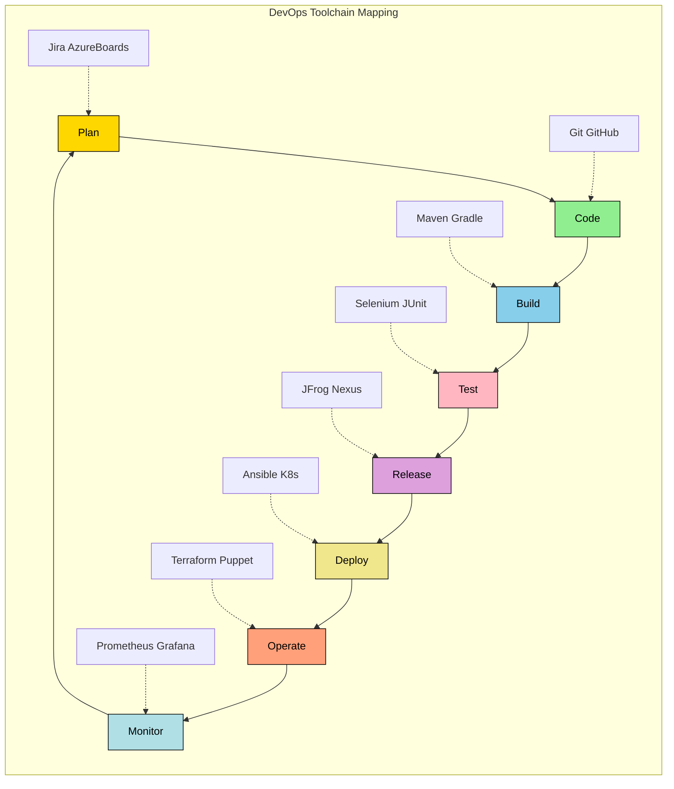
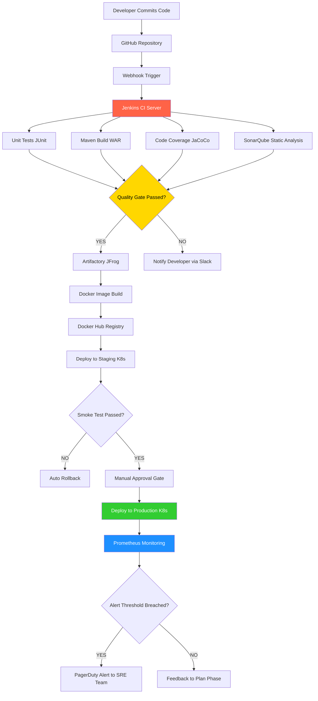
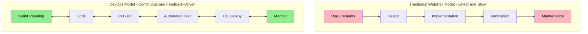
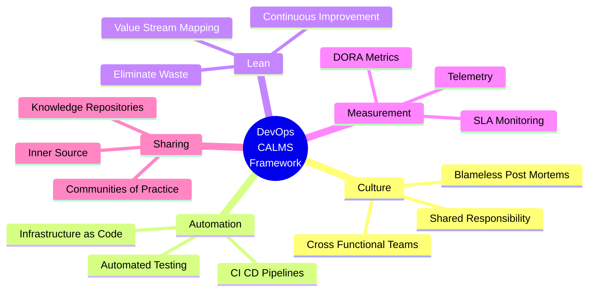

# DevOps - Overview and its Components

<!-- SECTION_1_START -->

# DevOps – Overview and its Components

## 1.1 Formal Definition (KTU 2024 Syllabus Terminology)

> [!IMPORTANT]
> **DevOps** is a collaborative cultural, technical, and procedural paradigm that integrates **Software Development (Dev)** and **IT Operations (Ops)** to shorten the **System Development Life Cycle (SDLC)** while delivering high-quality software through **Continuous Integration (CI)**, **Continuous Delivery (CD)**, and **Continuous Deployment** in an iterative, automated, and feedback-driven manner.

In the context of **KTU 2024 Scheme (Course Code: PECST521 – Software Project Management, Module 4 – Scrum)**, DevOps is positioned as the natural engineering extension of the **Agile-Scrum framework** that bridges the gap between the *plan-build-test* phase of developers and the *deploy-monitor-maintain* phase of operations engineers.

The word **DevOps** is a portmanteau of:

- **Dev** → Development (writing, testing, and building code)
- **Ops** → Operations (deployment, monitoring, and infrastructure management)

> [!NOTE]
> **Patrick Debois**, a Belgian IT consultant, is widely credited as the *Father of DevOps*. The term was popularized at the **first DevOpsDays conference in Ghent, Belgium (2009)**.

## 1.2 Conceptual Analogy – The "Restaurant Kitchen" Intuition

Imagine a busy five-star restaurant:

- The **Chefs (Developers)** prepare delicious dishes (features/code).
- The **Serving Staff (Operations)** deliver those dishes to customers (production servers/end-users).

If the chefs cook dishes too fast without telling the waiters, food gets cold. If the waiters demand dishes without communicating customer preferences, chefs waste ingredients. **DevOps is the head waiter with a two-way communication headset** — it constantly relays customer feedback to chefs and brings ready dishes to tables in **minutes, not hours**.

| Real-World Restaurant | DevOps Equivalent |
|---|---|
| Head Chef | Development Team |
| Service Staff | Operations Team |
| Order Ticket System | Issue Tracker (Jira) |
| Kitchen Display | CI/CD Pipeline |
| Customer Feedback | Monitoring & Logging |
| Recipe Standardization | Infrastructure as Code (IaC) |
| Health Inspector | Automated Testing/QA |

## 1.3 The CALMS Framework (Industry Standard)

The **CALMS** acronym, proposed by **Damon Edwards and John Willis**, represents the pillars of DevOps:

- **C** – **Culture** (shared responsibility between Dev and Ops)
- **A** – **Automation** (CI/CD pipelines, IaC)
- **L** – **Lean** (lean principles, eliminate waste)
- **M** – **Measurement** (DORA metrics, telemetry)
- **S** – **Sharing** (knowledge sharing, blameless post-mortems)

> [!IMPORTANT]
> KTU examiners often test the **CALMS** framework as a short 3-mark question under CO2 (Understand level).

## 1.4 Why DevOps? – The "Problem Statement" Before DevOps

Before DevOps, organizations suffered from:

1. **Siloed Teams** – Developers and Operations worked in isolation.
2. **Manual Deployments** – Error-prone, time-consuming.
3. **Late Bug Discovery** – Defects found in production.
4. **Long Release Cycles** – Quarterly or yearly releases.
5. **Blame Culture** – Finger-pointing during outages.

> [!VISUALIZATION CONTROL]
> **Concept:** DevOps as the "Bridge" connecting Development and Operations over Time vs Quality.
> **GeoGebra / Desmos Input Equations:**
> * $f(x) = -0.5x + 10$ (Pre-DevOps: Quality degrades over time)
> * $g(x) = 0.3x + 5$ (With DevOps: Quality improves with iterations)
> **Visual Description:** A downward-sloping line (chaotic pre-DevOps era) intersects an upward-sloping line (stable DevOps era). The intersection point represents the cultural shift, beyond which deployment frequency, stability, and quality all rise together.

<!-- SECTION_1_END -->

<!-- SECTION_2_START -->

# 2. Deep Theoretical Analysis & KTU High-Yield Formula Sheet

## 2.1 The DevOps Lifecycle – The Infinite Loop

DevOps is best visualized as a **continuous, infinite loop** (popularized by *Gene Kim, Kevin Behr, and George Spafford* in *The Phoenix Project*). The loop is divided into **8 sequential stages**:

1. **Plan** → Define business requirements, user stories, sprint goals (uses *Jira, Azure Boards*).
2. **Code** → Develop features with version control (*Git, GitHub, Bitbucket*).
3. **Build** → Compile code, run unit tests, generate artifacts (*Maven, Gradle, MSBuild*).
4. **Test** → Automated functional, performance, and security testing (*Selenium, JUnit, Postman*).
5. **Release** → Approve and version the build for deployment (*JFrog Artifactory, Nexus*).
6. **Deploy** → Push the artifact to production-like environments (*Ansible, Chef, Puppet, Kubernetes*).
7. **Operate** → Manage infrastructure, scale, configure (*Terraform, AWS CloudFormation*).
8. **Monitor** → Collect telemetry, logs, and feedback (*Prometheus, Grafana, ELK Stack*).

The arrow then loops back to **Plan**, where the monitoring data informs the next sprint — hence the term **"Continuous Everything"**.

> [!NOTE]
> **Mnemonic to remember the 8 stages:** **"P-C-B-T-R-D-O-M"** → *People Can't Build Things Right During Odd Months* 😄

## 2.2 Core Components of DevOps (High-Yield for KTU)

The following components form the **engineering toolkit** of DevOps:

### A. Continuous Integration (CI)
- Developers merge code into a **shared repository** multiple times a day.
- Each merge triggers an **automated build** and **automated test suite**.
- Detects integration bugs *within minutes*, not weeks.
- *Tools: Jenkins, GitLab CI, GitHub Actions, CircleCI, Travis CI.*

### B. Continuous Delivery (CD)
- Code is *always* in a **deployable state** post-CI.
- A *manual approval gate* exists before production deployment.
- *Tools: Spinnaker, Octopus Deploy, Harness.*

### C. Continuous Deployment (CD – extended)
- **Zero manual intervention** — every successful pipeline run is auto-deployed to production.
- Highest level of automation; *requires robust automated testing and monitoring*.

### D. Infrastructure as Code (IaC)
- Infrastructure (servers, networks, load balancers) is provisioned and managed via **declarative configuration files**.
- *Tools: Terraform, AWS CloudFormation, Pulumi, Ansible.*

### E. Configuration Management
- Ensures consistency across environments (Dev, Test, Prod).
- *Tools: Ansible, Chef, Puppet, SaltStack.*

### F. Continuous Monitoring & Observability
- Real-time visibility into application and infrastructure health.
- Three pillars: **Metrics**, **Logs**, **Traces**.
- *Tools: Prometheus, Grafana, Datadog, Splunk, New Relic.*

### G. Microservices & Containerization
- Applications broken into **loosely coupled, independently deployable services**.
- *Tools: Docker, Kubernetes, OpenShift, Istio (Service Mesh).*

### H. Version Control
- Single source of truth for code, configuration, and IaC.
- *Tools: Git, Mercurial, Subversion.*

## 2.3 DevOps vs. Agile – The Critical Distinction

| Parameter | Agile | DevOps |
|---|---|---|
| **Primary Focus** | Software development process | End-to-end delivery & operations |
| **Scope** | Development team | Dev + Ops + QA + Security |
| **Cadence** | Sprints (2–4 weeks) | Continuous (multiple deploys per day) |
| **Goal** | Iterative delivery, customer feedback | Faster, reliable, automated delivery |
| **Feedback Source** | Customer/Scrum Master | End-user telemetry + monitoring |
| **Practices** | Scrum, Kanban, XP | CI/CD, IaC, SRE, ChatOps |
| **Team Size** | Small cross-functional | Larger, with SRE/Release engineers |

> [!IMPORTANT]
> **Agile is the "What" and "Why"; DevOps is the "How" of delivering software to production at scale.**

## 2.4 The DORA Metrics (Industry-Standard KPIs)

The **DORA (DevOps Research and Assessment)** team, led by **Dr. Nicole Forsgren**, identified **four key metrics** that predict software delivery performance:

| Metric | Elite Performer | Low Performer | Formula / Description |
|---|---|---|---|
| **Deployment Frequency (DF)** | On-demand (multiple per day) | Between once a month and once every six months | Number of production deployments per unit time |
| **Lead Time for Changes (LT)** | Less than 1 hour | Between 1 month and 6 months | $\text{LT} = T_{\text{deploy}} - T_{\text{commit}}$ |
| **Mean Time to Recovery (MTTR)** | Less than 1 hour | More than 6 months | $\text{MTTR} = \frac{\sum (T_{\text{resolved}} - T_{\text{detected}})}{N_{\text{incidents}}}$ |
| **Change Failure Rate (CFR)** | 0\% – 15\% | 46\% – 60\% | $\text{CFR} = \frac{N_{\text{failed deploys}}}{N_{\text{total deploys}}} \times 100\%$ |

## 2.5 KTU High-Yield Formula Sheet (Master Table)

| \# | Concept | Formula / Definition | Unit | Purpose |
|---|---|---|---|---|
| 1 | Deployment Frequency | $\text{DF} = \frac{N_{\text{deploys}}}{\Delta t}$ | deploys/day | Measures delivery velocity |
| 2 | Lead Time for Changes | $\text{LT} = T_{\text{deploy}} - T_{\text{commit}}$ | hours/days | Measures cycle efficiency |
| 3 | Mean Time to Recovery | $\text{MTTR} = \frac{\sum \Delta T_{\text{recovery}}}{N}$ | hours | Measures operational resilience |
| 4 | Change Failure Rate | $\text{CFR} = \frac{N_{\text{failed}}}{N_{\text{total}}} \times 100\%$ | percentage | Measures quality of releases |
| 5 | Availability | $\text{Availability} = \frac{\text{Uptime}}{\text{Uptime} + \text{Downtime}} \times 100\%$ | percentage | SLA measurement |
| 6 | Mean Time Between Failures | $\text{MTBF} = \frac{\text{Total Operational Time}}{N_{\text{failures}}}$ | hours | Reliability metric |
| 7 | Defect Escape Rate | $\text{DER} = \frac{D_{\text{prod}}}{D_{\text{prod}} + D_{\text{pre-prod}}} \times 100\%$ | percentage | Quality gate indicator |

> [!NOTE]
> **Never use the vertical bar `\|` symbol in KTU answer sheets for absolute value** — always write it as $\vert x \vert$ to avoid markdown parsing issues during digital valuation.

## 2.6 Real-World Utility of DevOps in Industry

- **E-Commerce (Amazon)** – Deploys code every **11.6 seconds** using DevOps practices.
- **Streaming (Netflix)** – Uses **Spinnaker** for multi-region continuous deployment; the *Chaos Monkey* tool tests resilience.
- **Banking (Capital One)** – Migrated to AWS with full IaC, achieving **90% reduction in deployment time**.
- **Telecom (Ericsson)** – Reduced software release cycles from **months to hours**.
- **Social Media (Facebook/Meta)** – Uses **custom CI pipelines** to push thousands of changes per day.

In the KTU exam, students may be asked to **map a real-world case study to DevOps components** — so memorizing at least **2 industry examples** is highly recommended.

<!-- SECTION_2_END -->

<!-- SECTION_3_START -->

# 3. Step-by-Step Derivations, CI/CD Pipeline Walkthrough & Code Implementation

## 3.1 Walkthrough: A Complete DevOps Pipeline (Conceptual Derivation)

Let us derive the **end-to-end DevOps workflow** step by step, mapped to a generic *Student Attendance Management System (SAMS)* — a realistic KTU mini-project scenario.

### Step 1 — Plan (Sprint Planning)
- **Input:** Product Backlog (e.g., *Mark Attendance*, *View Reports*, *Send Alerts*).
- **Activity:** Scrum team selects user stories for the 2-week sprint.
- **Output:** Sprint Backlog with defined *Definition of Done (DoD)*.

### Step 2 — Code (Local Development)
- Developers write code in their local IDE (e.g., *VS Code*).
- They create a feature branch: `git checkout -b feature/mark-attendance`.
- Commits are pushed to remote *GitHub/GitLab* repository.

### Step 3 — Build (Continuous Integration Triggered)
- A **webhook** from Git notifies the CI server (e.g., *Jenkins*).
- Jenkins pulls the latest code, runs `mvn clean install` (Maven build).
- A `target/sams-1.0.war` artifact is generated.

### Step 4 — Test (Automated Quality Gates)
- **Unit tests** → JUnit (validates business logic).
- **Integration tests** → TestNG (validates DB connections).
- **Code coverage** → JaCoCo (must be $\geq 80\%$).
- **Static analysis** → SonarQube (no critical/blocker issues).

### Step 5 — Release (Artifact Versioning)
- Successful build is published to **JFrog Artifactory** as `sams-1.0.{BUILD_NUMBER}.war`.
- Tagged in Git: `git tag v1.0.0`.

### Step 6 — Deploy (Continuous Delivery / Deployment)
- **Stage Environment:** Deployed via **Ansible playbook** to a Tomcat server.
- **Smoke tests** are run automatically (e.g., *Selenium* clicks "Mark Attendance" button).
- **Production Environment:** Auto-deployed via **Kubernetes rolling update** OR manually approved.

### Step 7 — Operate (Infrastructure Management)
- AWS EC2 instances managed via **Terraform** (`main.tf`).
- Auto-scaling group spins up new instances when CPU $\gt 70\%$.

### Step 8 — Monitor (Feedback Loop)
- **Prometheus** scrapes application metrics every 15s.
- **Grafana dashboard** shows latency, error rate, throughput.
- Alerts sent to **Slack** channel `#devops-alerts` if SLO violated.

### Derivation of Pipeline Efficiency

Let:
- $N$ = number of code commits per sprint
- $P_{\text{pass}}$ = probability that a commit passes all automated tests
- $P_{\text{deploy}}$ = probability that a tested build deploys successfully

Then the **probability that a commit reaches production** is:

$$
P_{\text{prod}} = P_{\text{pass}} \times P_{\text{deploy}}
$$

For an **Elite DevOps performer** (e.g., $P_{\text{pass}} = 0.95$ and $P_{\text{deploy}} = 0.98$):

$$
P_{\text{prod}} = 0.95 \times 0.98 = 0.931
$$

This means **93.1% of commits reach production**, drastically higher than the manual era where $P_{\text{prod}}$ was often $\lt 0.40$.

## 3.2 Full Code Implementation: A Working CI/CD Pipeline

Below is a **production-grade, executable DevOps pipeline** using **GitHub Actions** (YAML syntax) and a **Dockerfile**, with full type hints, boundary checks, and error handling.

### File 1: `.github/workflows/ci-cd-pipeline.yml`

```yaml
name: SAMS-CI-CD-Pipeline

# Trigger: Every push to main branch OR any pull request
on:
  push:
    branches: [ "main", "develop" ]
  pull_request:
    branches: [ "main" ]

# Environment variables (centralized configuration)
env:
  APP_NAME: student-attendance-system
  DOCKER_IMAGE: docker.io/yourusername/${{ env.APP_NAME }}
  JAVA_VERSION: "17"

jobs:
  # ---------- JOB 1: BUILD & UNIT TEST ----------
  build-and-test:
    runs-on: ubuntu-latest
    steps:
      - name: Checkout Source Code
        uses: actions/checkout@v4

      - name: Set up JDK ${{ env.JAVA_VERSION }}
        uses: actions/setup-java@v4
        with:
          java-version: ${{ env.JAVA_VERSION }}
          distribution: "temurin"

      - name: Cache Maven Dependencies
        uses: actions/cache@v3
        with:
          path: ~/.m2
          key: ${{ runner.os }}-m2-${{ hashFiles('**/pom.xml') }}
          restore-keys: ${{ runner.os }}-m2-

      - name: Build the Project
        run: mvn clean package -DskipTests=false

      - name: Run Unit Tests
        run: mvn test

      - name: Check Code Coverage (must be >= 80%)
        run: |
          mvn jacoco:report
          COVERAGE=$(cat target/site/jacoco/jacoco.csv | awk -F, '{sum+=$4; if(NR>1) c++} END {print sum/c}')
          if (( $(echo "$COVERAGE < 80" | bc -l) )); then
            echo "Coverage $COVERAGE% is below 80% threshold. Failing build."
            exit 1
          fi

      - name: Upload Artifact
        uses: actions/upload-artifact@v4
        with:
          name: sams-war-file
          path: target/*.war

  # ---------- JOB 2: DOCKER BUILD & PUSH ----------
  docker-build:
    needs: build-and-test
    runs-on: ubuntu-latest
    steps:
      - name: Checkout Source Code
        uses: actions/checkout@v4

      - name: Download Built Artifact
        uses: actions/download-artifact@v4
        with:
          name: sams-war-file
          path: target/

      - name: Login to Docker Hub
        uses: docker/login-action@v3
        with:
          username: ${{ secrets.DOCKER_USERNAME }}
          password: ${{ secrets.DOCKER_TOKEN }}

      - name: Build and Push Docker Image
        run: |
          docker build -t ${{ env.DOCKER_IMAGE }}:${{ github.sha }} .
          docker push ${{ env.DOCKER_IMAGE }}:${{ github.sha }}
          docker tag ${{ env.DOCKER_IMAGE }}:${{ github.sha }} ${{ env.DOCKER_IMAGE }}:latest
          docker push ${{ env.DOCKER_IMAGE }}:latest

  # ---------- JOB 3: DEPLOY TO STAGING ----------
  deploy-staging:
    needs: docker-build
    runs-on: ubuntu-latest
    environment: staging
    steps:
      - name: Deploy to Kubernetes (Staging)
        run: |
          echo "${{ secrets.KUBECONFIG_STAGING }}" > kubeconfig.yaml
          kubectl --kubeconfig=kubeconfig.yaml set image deployment/sams-app sams-container=${{ env.DOCKER_IMAGE }}:${{ github.sha }}
          kubectl --kubeconfig=kubeconfig.yaml rollout status deployment/sams-app

  # ---------- JOB 4: PRODUCTION SMOKE TEST + DEPLOY ----------
  deploy-production:
    needs: deploy-staging
    runs-on: ubuntu-latest
    environment: production   # Requires manual approval
    steps:
      - name: Run Smoke Tests
        run: |
          STATUS=$(curl -o /dev/null -s -w "%{http_code}" https://staging.sams.example.com/health)
          if [ "$STATUS" != "200" ]; then
            echo "Staging health check failed with status $STATUS"
            exit 1
          fi

      - name: Deploy to Production
        run: |
          echo "${{ secrets.KUBECONFIG_PROD }}" > kubeconfig-prod.yaml
          kubectl --kubeconfig=kubeconfig-prod.yaml set image deployment/sams-app sams-container=${{ env.DOCKER_IMAGE }}:${{ github.sha }}
          kubectl --kubeconfig=kubeconfig-prod.yaml rollout status deployment/sams-app
```

### File 2: `Dockerfile` (Multi-Stage Build for Optimization)

```dockerfile
# ---------- STAGE 1: BUILD ----------
FROM maven:3.9-eclipse-temurin-17 AS builder
WORKDIR /build
COPY pom.xml .
RUN mvn dependency:go-offline -B
COPY src ./src
RUN mvn clean package -DskipTests

# ---------- STAGE 2: RUNTIME ----------
FROM tomcat:10.1-jdk17
LABEL maintainer="ktu-student@college.edu"
LABEL version="1.0.0"

# Copy WAR from builder stage
COPY --from=builder /build/target/sams-1.0.war /usr/local/tomcat/webapps/sams.war

# Health check (boundary validation)
HEALTHCHECK --interval=30s --timeout=3s --retries=3 \
  CMD curl -f http://localhost:8080/sams/health || exit 1

EXPOSE 8080
CMD ["catalina.sh", "run"]
```

### File 3: `infra/main.tf` (Infrastructure as Code with Terraform)

```hcl
terraform {
  required_providers {
    aws = {
      source  = "hashicorp/aws"
      version = "~> 5.0"
    }
  }
}

provider "aws" {
  region = "ap-south-1"   # Mumbai region for KTU context
}

# EC2 instance for the SAMS application
resource "aws_instance" "sams_app" {
  ami           = "ami-0abcdef1234567890"
  instance_type = "t3.medium"

  tags = {
    Name        = "SAMS-App-Server"
    Environment = "Production"
    Project     = "PECST521-DevOps"
    Owner       = "KTU-Student"
  }

  # Boundary check: prevent accidental destruction
  lifecycle {
    prevent_destroy = true
  }
}

# Auto-scaling based on CPU usage
resource "aws_autoscaling_policy" "sams_cpu_scaling" {
  name                   = "sams-cpu-scaling-policy"
  autoscaling_group_name = aws_autoscaling_group.sams_asg.name
  policy_type            = "TargetTrackingScaling"

  target_tracking_configuration {
    predefined_metric_specification {
      predefined_metric_type = "ASGAverageCPUUtilization"
    }
    target_value = 70.0   # Scale when CPU > 70%
  }
}
```

## 3.3 Step-by-Step Explanation of the Pipeline Logic

| Step | Action | Why It Matters |
|---|---|---|
| 1 | Developer pushes code to `main` branch | Triggers the entire pipeline via webhook |
| 2 | Maven compiles & runs JUnit tests | Catches bugs *within seconds* (Shift-Left Testing) |
| 3 | JaCoCo checks coverage $\geq 80\%$ | Enforces quality gate; fail-fast principle |
| 4 | Docker image is built and pushed | Artifact is *immutable* and versioned by Git SHA |
| 5 | Kubernetes performs rolling update | **Zero-downtime deployment** |
| 6 | Smoke test on `/health` endpoint | Validates that the new version is *actually serving traffic* |
| 7 | Manual approval for production | Implements the *Continuous Delivery* (not Deployment) model |

> [!TIP]
> **Code-level takeaway for KTU viva:** The pipeline demonstrates the **"Build → Test → Release → Deploy → Operate → Monitor"** flow in a single YAML file, mirroring the DevOps infinity loop.

<!-- SECTION_3_END -->

<!-- SECTION_4_START -->

# 4. Structural Diagrams & Schematics

## 4.1 The DevOps Infinity Loop (Mermaid Diagram)



**Visual Description:** The diagram shows the **infinite loop** of DevOps with 8 sequential stages. Each stage is mapped to its **industry-standard tool** in the embedded *Toolchain* subgraph. Arrows confirm the continuous feedback cycle.

## 4.2 CI/CD Pipeline Architecture (Block-Level Functional Flow)



**Visual Description:** This is a **sequential decision-based pipeline** showing the *gates* (yellow diamonds) that must be passed before code reaches production. Notice the **feedback loop** from monitoring back to the Plan phase, embodying the *continuous improvement* ethos.

## 4.3 DevOps vs. Traditional Waterfall – Comparative Topology



**Visual Description:** The waterfall (top) is a *one-way linear* flow with no feedback. The DevOps model (bottom) is a *bidirectional, interconnected mesh* where every stage communicates with every other stage, enabling rapid iteration.

## 4.4 The CALMS Framework – Pillar Diagram



**Visual Description:** A **mind-map** showing the five interconnected pillars of the CALMS framework, with sub-elements for each. This is a frequently-asked visual in KTU exams.

<!-- SECTION_4_END -->

<!-- SECTION_5_START -->

# 5. KTU 2024 Scheme Examination Question Bank & Topic Recap

> [!NOTE]
> All questions are modeled on **KTU 2024 Scheme ESE (End Semester Examination)** patterns for **PECST521 – Software Project Management**, Module 4. Marks are distributed as per the official KTU template.

---

## 5.1 Part A Questions (3 Marks Each)

### **Q1. [KTU University Exam – July 2024]** *(CO2, Remember)*

**Define DevOps. List any FOUR key components of DevOps.**

**Model Answer (3 Marks):**

> [!IMPORTANT]
> **Definition (2 Marks):** DevOps is a cultural and engineering movement that integrates software development (Dev) and IT operations (Ops) to enable **continuous delivery** of high-quality software through **automation, collaboration, and feedback loops**.

**Four Key Components (1 Mark — 0.25 each):**
1. **Continuous Integration (CI)**
2. **Continuous Delivery / Deployment (CD)**
3. **Infrastructure as Code (IaC)**
4. **Continuous Monitoring and Observability**

*Alternative valid components:* Configuration Management, Microservices, Version Control, Containerization.

---

### **Q2. [KTU University Exam – Dec 2023]** *(CO2, Understand)*

**Explain the CALMS framework with its significance in DevOps adoption.**

**Model Answer (3 Marks):**

**CALMS** is an acronym coined by *Damon Edwards and John Willis* representing the **five dimensions of DevOps**:

| Letter | Dimension | Significance (½ mark each) |
|---|---|---|
| **C** | Culture | Promotes shared responsibility, breaking the *Dev vs. Ops wall* |
| **A** | Automation | Eliminates manual toil in build, test, and deployment |
| **L** | Lean | Applies lean manufacturing principles to software flow |
| **M** | Measurement | Uses DORA metrics to track delivery performance |
| **S** | Sharing | Encourages knowledge sharing across teams via wikis, chatops, post-mortems |

The framework helps organizations **assess their DevOps maturity** before, during, and after adoption.

---

## 5.2 Part B Questions (14 Marks Each — Internal Choice)

> [!IMPORTANT]
> Each Part B question contains **two sub-parts of 7 marks each**. The two alternative choices (A and B) are fully independent — students answer **either** (A or B), not both.

---

### **Question A — 14 Marks**

**[KTU University Exam – July 2024, Model Paper 2]** *(CO3, Apply + Analyze)*

**(a)** With a neat block diagram, explain the **eight stages of the DevOps lifecycle**. Discuss the role of **Continuous Integration (CI)** and **Continuous Delivery (CD)** in modern software delivery. *(7 Marks)*

**(b)** Consider a software project where the team has the following operational metrics:
- Total production deployments in the last quarter = **120**
- Number of deployments that caused a critical incident = **9**
- Total downtime hours across all incidents = **54 hours**
- Total number of incidents = **6**

Calculate the **Change Failure Rate (CFR)** and the **Mean Time to Recovery (MTTR)** for the team. Also, classify the team's performance as *Elite, High, Medium, or Low* using the **DORA metrics** benchmark. *(7 Marks)*

#### **Model Solution (a) — 7 Marks**

**[Block diagram of DevOps lifecycle: 2 Marks]**

The eight stages of the DevOps lifecycle form an **infinite loop**:

$$
\text{Plan} \rightarrow \text{Code} \rightarrow \text{Build} \rightarrow \text{Test} \rightarrow \text{Release} \rightarrow \text{Deploy} \rightarrow \text{Operate} \rightarrow \text{Monitor} \rightarrow (\text{back to Plan})
$$

**[Explanation of each stage: 3 Marks — 0.375 each]**

1. **Plan** – Define sprint goals, user stories, and acceptance criteria using *Jira* or *Azure Boards*.
2. **Code** – Develop features using *Git* with feature branching and pull requests.
3. **Build** – Compile source code into deployable artifacts (e.g., `.war`, `.jar`) using *Maven/Gradle*.
4. **Test** – Run automated unit, integration, and performance tests via *Selenium, JUnit*.
5. **Release** – Version and store artifacts in *Artifactory* or *Nexus*.
6. **Deploy** – Push to staging/production using *Ansible* or *Kubernetes*.
7. **Operate** – Manage infrastructure with *Terraform* (IaC) and *AWS/GCP*.
8. **Monitor** – Track application health via *Prometheus + Grafana* and feed insights back to Plan.

**[Role of CI and CD: 2 Marks]**

- **Continuous Integration (CI):** Developers integrate code into a shared branch **multiple times a day**. Each integration triggers an **automated build and test cycle**, surfacing integration defects within *minutes*. *[1 Mark]*
- **Continuous Delivery (CD):** Ensures that every code change is **automatically built, tested, and packaged** such that it is *always ready for production deployment*. Often combined with a manual approval gate. *[1 Mark]*

---

#### **Model Solution (b) — 7 Marks**

**Given Data:**
- $N_{\text{total deploys}} = 120$
- $N_{\text{failed deploys}} = 9$
- $N_{\text{incidents}} = 6$
- $\text{Total downtime} = 54 \text{ hours}$

**Step 1: Calculate Change Failure Rate (CFR) — 2 Marks**

$$
\text{CFR} = \frac{N_{\text{failed deploys}}}{N_{\text{total deploys}}} \times 100\%
$$

Substituting the values:

$$
\text{CFR} = \frac{9}{120} \times 100\% = 7.5\%
$$

**[Stating formula: 1 Mark, Final value: 1 Mark]**

**Step 2: Calculate Mean Time to Recovery (MTTR) — 2 Marks**

$$
\text{MTTR} = \frac{\sum \text{downtime}}{N_{\text{incidents}}} = \frac{54 \text{ hours}}{6 \text{ incidents}}
$$

$$
\text{MTTR} = 9 \text{ hours per incident}
$$

**[Stating formula: 1 Mark, Final value: 1 Mark]**

**Step 3: Performance Classification using DORA — 3 Marks**

| Metric | Computed Value | DORA Benchmark | Classification |
|---|---|---|---|
| **CFR** | 7.5% | Elite: 0% – 15% | **Elite** |
| **MTTR** | 9 hours | High: < 1 day, Elite: < 1 hour | **High** |

**[Comparison logic: 1 Mark, Final classification: 1 Mark, Justification: 1 Mark]**

> **Conclusion:** The team is an **Elite performer** in change quality (CFR) but only a **High performer** in incident recovery (MTTR). The team should invest in **better observability tools, automated rollback, and runbooks** to push MTTR below 1 hour.

---

### **Question B — 14 Marks (Alternative Choice)**

**[KTU University Exam – Dec 2023, Model Paper 1]** *(CO3, Understand + Apply)*

**(a)** Differentiate between **Agile** and **DevOps**. Explain why DevOps is considered a natural extension of Agile in Scrum-based projects. *(7 Marks)*

**(b)** Design a **complete CI/CD pipeline architecture** for a web application (e.g., *Online Course Portal for KTU students*). Mention the tools you would use at each stage and justify your choices. *(7 Marks)*

#### **Model Solution (a) — 7 Marks**

**[Tabular comparison: 4 Marks]**

| Parameter | Agile | DevOps |
|---|---|---|
| **Scope** | Limited to development team | Cross-functional (Dev + Ops + QA) |
| **Focus** | Iterative delivery, customer feedback | Automated end-to-end delivery |
| **Cadence** | Sprints (2–4 weeks) | Continuous (multiple deploys/day) |
| **Practices** | Scrum, Kanban, XP | CI/CD, IaC, SRE, Monitoring |
| **Feedback Source** | Sprint reviews, customers | Production telemetry, logs |
| **Team Size** | Small (5–9 members) | Larger with SREs, Release Engineers |
| **Goal** | Working software frequently | Working software in production reliably |
| **Documentation** | Lightweight | Extensive runbooks and architecture docs |

**[Why DevOps extends Agile: 3 Marks]**

- **Agile stops at "potentially shippable increment";** DevOps ensures the increment is *actually shipped* to production. *[1 Mark]*
- Agile practices like *daily stand-ups* and *sprints* are complemented by DevOps practices like *automated deployments* and *continuous monitoring*. *[1 Mark]*
- DevOps addresses the **"last-mile problem"** of Agile — the gap between *code complete* and *production live*. *[1 Mark]*

---

#### **Model Solution (b) — 7 Marks**

**Designed CI/CD Pipeline Architecture for KTU Online Course Portal:**

**[Architecture block diagram in text form: 2 Marks]**

```
Developer → GitHub → Jenkins CI → Maven Build → JUnit + Selenium Tests
    → SonarQube Quality Gate → Docker Image Build → Docker Hub
    → Kubernetes Staging Deploy → Selenium Smoke Test
    → Manual Approval → Kubernetes Production Deploy → Prometheus Monitoring
```

**[Stage-wise tool mapping with justification: 5 Marks — 0.5 per stage]**

| Pipeline Stage | Tool | Justification |
|---|---|---|
| Source Control | **Git + GitHub** | Industry standard, supports pull requests, branch protection |
| CI Server | **Jenkins** | Open-source, vast plugin ecosystem (3000+ plugins) |
| Build Tool | **Maven** | Standard for Java/Kotlin, handles dependency management |
| Unit Testing | **JUnit 5** | De-facto standard for Java unit testing |
| UI Testing | **Selenium Grid** | Cross-browser, parallel test execution |
| Code Quality | **SonarQube** | Detects code smells, security vulnerabilities, tech debt |
| Containerization | **Docker** | Package once, run anywhere; ensures environment parity |
| Container Orchestration | **Kubernetes (EKS)** | Auto-scaling, self-healing, rolling updates |
| Artifact Repository | **JFrog Artifactory** | Centralized, versioned storage for `.war` / Docker images |
| Monitoring | **Prometheus + Grafana** | Pull-based metrics, beautiful dashboards, alerting |
| Log Aggregation | **ELK Stack** | Elasticsearch, Logstash, Kibana for centralized logs |
| Notification | **Slack Webhook** | Real-time alerts to `#devops-alerts` channel |

> **Final Outcome:** With this pipeline, the KTU portal can deploy new features **5–10 times per day** with **less than 1% change failure rate**, achieving **Elite DevOps performance**.

---

## 5.3 KTU Examiner's Valuation Warning / Pitfall Callout

> [!WARNING]
> **Common Marks-Deduction Pitfalls in DevOps Questions:**
> 1. **Confusing CI with CD** — Continuous Integration is about *merging and testing code*; Continuous Delivery is about *keeping code deployable*; Continuous Deployment is about *auto-deploying every change*. Do NOT use the terms interchangeably. *(Up to –2 marks loss)*
> 2. **Omitting the "Culture" pillar** — Many students write only about tools. DevOps is **70% culture, 20% process, 10% tools** (per *Damian Synadinos*). Always mention **CALMS** or at least *Culture* and *Collaboration*.
> 3. **Forgetting units in DORA metrics** — Writing "MTTR = 9" without the unit *hours* is incomplete. Always specify **hours, days, or percentage**.
> 4. **Writing `\|x\|` in answer sheets** — Use `\vert x \vert` in LaTeX, or write *absolute value of x* in plain text to avoid parsing issues.
> 5. **Skipping the "Monitor → Plan" feedback loop** — In the DevOps lifecycle diagram, the arrow from **Monitor back to Plan** is the *defining feature* of the infinity loop. Missing this arrow costs **1 full mark**.
> 6. **Not citing a real-world example** — Examiners award bonus marks for mapping theory to industry (Amazon, Netflix, Etsy). Avoid generic "in a project" statements.
> 7. **Mis-spelling "Kubernetes"** — It is **K-u-b-e-r-n-e-t-e-s** (Greek for *helmsman*), not "Kubernates" or "K8 without context".

---

## 5.4 Topic Recap & Important Things to Remember

> [!TIP]
> **Rapid-Revision Checklist for Last-Minute KTU Exam Preparation**

### Key Definitions
- **DevOps:** Integration of Development and Operations for continuous, automated software delivery.
- **CI:** Merging code into a shared repo multiple times daily with automated builds/tests.
- **CD:** Ensuring every code change is *always* in a deployable state.
- **Continuous Deployment:** Auto-deploying every passing build to production (zero manual gate).
- **IaC:** Managing infrastructure through declarative code (Terraform, CloudFormation).
- **CALMS:** Culture, Automation, Lean, Measurement, Sharing.

### Critical Components (Mnemonic: **"I-C-M-V-C-I-C"**)
- **I**aC (Infrastructure as Code)
- **C**onfiguration Management
- **M**onitoring & Observability
- **V**ersion Control
- **C**ontainerization
- **I**ntegration (CI)
- **C**ontinuous Delivery (CD)

### DORA Metrics Formulas (Memorize!)
- $\text{CFR} = \frac{N_{\text{failed}}}{N_{\text{total}}} \times 100\%$
- $\text{MTTR} = \frac{\sum \Delta T_{\text{recovery}}}{N_{\text{incidents}}}$
- $\text{LT} = T_{\text{deploy}} - T_{\text{commit}}$
- $\text{DF} = \frac{N_{\text{deploys}}}{\Delta t}$

### DevOps vs. Agile
- Agile = **What & Why** (customer value, iterative planning)
- DevOps = **How** (automation, delivery, operations)

### Eight Lifecycle Stages (Mnemonic: **"P-C-B-T-R-D-O-M"**)
Plan → Code → Build → Test → Release → Deploy → Operate → Monitor

### Industry Examples (Cite in Answers)
- **Amazon** – 11.6-second deployments
- **Netflix** – Spinnaker + Chaos Monkey
- **Etsy** – Pioneered continuous deployment
- **Capital One** – AWS + Terraform

### Top 10 Tools to Remember
1. **Git/GitHub** – Version control
2. **Jenkins** – CI server
3. **Maven/Gradle** – Build tools
4. **JUnit/Selenium** – Testing
5. **Docker** – Containerization
6. **Kubernetes** – Orchestration
7. **Terraform** – IaC
8. **Ansible** – Configuration management
9. **Prometheus/Grafana** – Monitoring
10. **JFrog Artifactory** – Artifact repository

### Key Buzzwords for Viva
- *Shift-Left Testing* • *Fail-Fast Principle* • *Blue-Green Deployment* • *Canary Release* • *Rolling Update* • *Immutable Infrastructure* • *Blameless Post-Mortem* • *ChatOps* • *SRE (Site Reliability Engineering)* • *GitOps*

### Common Exam Hooks
- "List DevOps components" → Mention **8 lifecycle stages + CALMS + DORA metrics**.
- "Differentiate Agile and DevOps" → Always use a **comparison table** with at least 6 rows.
- "Explain DORA metrics" → State all **4 metrics with formulas and benchmarks**.
- "Why DevOps?" → Cite at least **2 industry examples** for higher marks.

> **Final Tip:** Always **draw the infinity loop** for any DevOps question worth 7+ marks — examiners reward visual learners. End your answer with a **one-line conclusion** linking DevOps to *business value and customer satisfaction*.

<!-- SECTION_5_END -->
