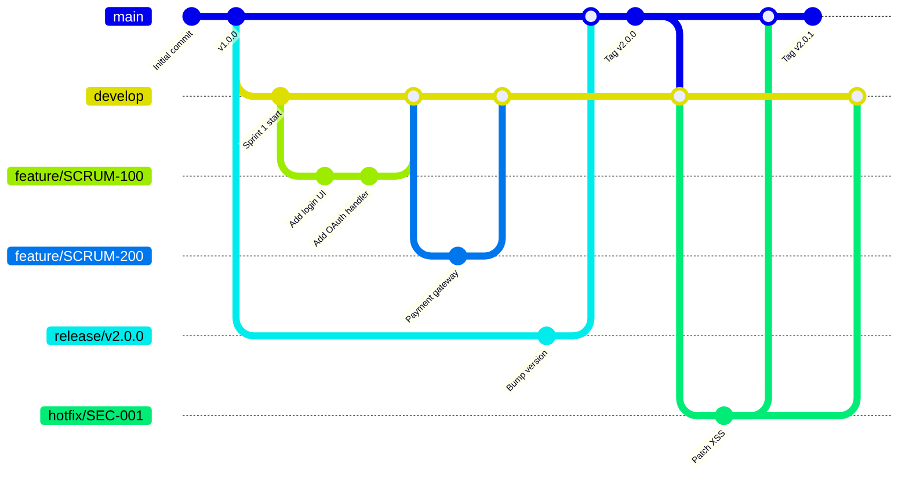
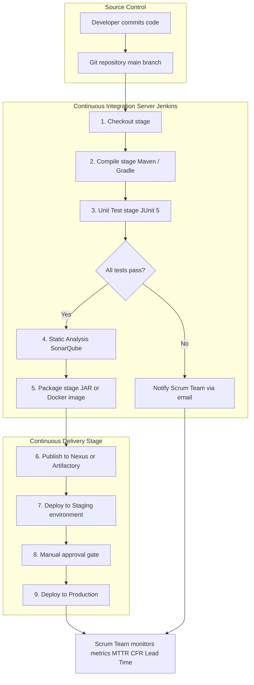
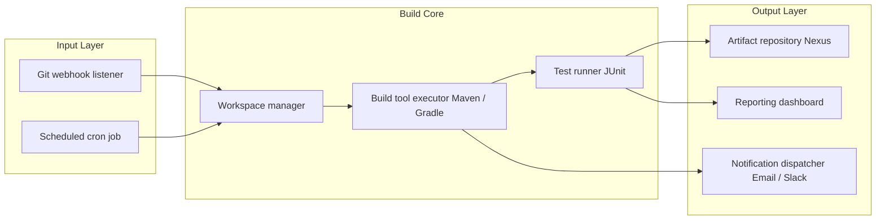

# Managing Source Code and Automating Builds

<!-- SECTION_1_START -->

## 1. Core Technical Definition & Intuitive Overview

### 1.1 Source Code Management (SCM)

**Source Code Management (SCM)** is the practice of tracking, controlling, and managing changes to the source code of a software project throughout its development lifecycle. In the context of the **KTU 2024 Scheme Scrum framework**, SCM forms the technical backbone that enables the **Definition of Done (DoD)** by ensuring that every increment delivered by a Scrum Team is a tested, versioned, and reproducible artifact.

> [!IMPORTANT]
> **KTU Syllabus Highlight (PECST521 - Module 4):**
> Under Scrum, SCM is not an administrative overhead — it is a **first-class engineering practice**. The Scrum Guide and KTU curriculum treat version control, branching, and automated builds as the **technical enablers** of empirical process control and continuous improvement.

#### Conceptual Analogy / Intuition

Imagine a group of five authors co-writing a novel. Without a central tracking system, two authors might independently rewrite Chapter 7, erasing each other's work. SCM acts as a **"magical librarian"** who:
- Stores **every keystroke** ever typed,
- Knows **who typed what, when, and why**,
- Can **merge** parallel edits without losing content, and
- Can **roll back** to any previous version instantly.

A **Distributed Version Control System (DVCS)** like **Git** is even more powerful — every author carries a *complete copy* of the entire library, so work continues even when the central library is unavailable.

---

### 1.2 Build Automation

**Build Automation** is the process of scripting and automating the tasks required to transform source code into a deployable, runnable software artifact (executable, library, container image, etc.). In Scrum, the build is the **first verification gate** that an increment can actually be released.

#### Conceptual Analogy / Intuition

Think of a modern car manufacturing plant. A car (the software) is built from thousands of parts (source files). Humans do not assemble the parts by hand each time — **robotic arms** perform the welding, painting, and inspection in a fixed, repeatable sequence. Build automation is the **robotic assembly line of software**: source code goes in, and a tested, packaged application comes out — *every time, identically*.

> [!NOTE]
> **Core Definition — Continuous Integration (CI):**
> A software development practice where members of a team integrate their work frequently — usually **each person integrates at least daily**, leading to **multiple integrations per day**. Each integration is verified by an **automated build** (including tests) to detect integration errors as quickly as possible. (Grady Booch, 1991 — co-author of UML)

### 1.3 Key Performance Metrics Used in KTU Examinations

The following standard metrics appear frequently in KTU 2024 Scheme question papers on Scrum and DevOps:

- **Mean Time to Recovery (MTTR)** — typically measured in **minutes**
- **Lead Time for Changes** — from commit to production, in **hours**
- **Deployment Frequency** — number of production deployments per **day**
- **Change Failure Rate** — percentage of deployments causing failures, ideally **0%–15%**

> [!TIP]
> **Exam Tip:** When asked to "list the four DORA metrics," write all four: *Lead Time, Deployment Frequency, MTTR, Change Failure Rate*. Examiners at KTU 2024 award **1 mark per correct metric** when 4-mark sub-questions are framed this way.

---

### 1.4 Visualization of Branching & Merging

> [!VISUALIZATION CONTROL]
> **Concept:** Git branching topology showing feature, develop, and main branches
> **GeoGebra / Desmos Input Equations:**
> * `Branch 1 (feature): P_1 = (1, 5)` → `(2, 6)` → `(3, 7)` (timeline points)
> * `Branch 2 (develop): P_2 = (1, 3)` → `(2, 4)` → `(3, 5)`
> * `Main branch: P_3 = (1, 1)` → `(2, 2)` → `(3, 3)`
> * `Merge point: M = (3, 3)` converging to `(4, 3)`
> **Visual Description:** Two parallel lines (feature and develop) descend and merge into a single main line. Students should observe that a merge point acts as a node where divergent histories converge.

---

<!-- SECTION_1_END -->

<!-- SECTION_2_START -->

## 2. Deep Theoretical Analysis & KTU High-Yield Formula Sheet

### 2.1 Centralized vs. Distributed Version Control Systems

In **Centralized Version Control Systems (CVCS)** like **Subversion (SVN)** and **Perforce**, there is a single central server that holds the canonical repository. Developers checkout working copies but must be online to commit.

In **Distributed Version Control Systems (DVCS)** like **Git**, **Mercurial**, and **Bazaar**, every developer has a *full local clone* of the repository, including its complete history. This is the model adopted by Scrum teams for **empirical process control**.

**Why DVCS aligns with Scrum's empirical approach:**
- The Scrum pillar of **transparency** is satisfied — every change is visible locally.
- The pillar of **inspection** is satisfied — frequent local commits enable rapid review.
- The pillar of **adaptation** is satisfied — branches allow rapid experimentation without destabilizing the mainline.

### 2.2 Git's Three-Tier Architecture

Git manages data in three logical areas, a structure examiners frequently test:

1. **Working Directory** — the actual files checked out on disk that the developer edits.
2. **Staging Area (Index)** — a binary file that stores information about what will go into the next commit. Acts as a *preview buffer*.
3. **Local Repository (`.git` directory)** — the compressed object database storing committed snapshots.

A file in Git exists in one of four states at any time:
- **Untracked** — Git does not yet know about it.
- **Modified** — changed but not yet staged.
- **Staged** — marked for inclusion in the next commit.
- **Committed** — safely stored in the local database.

### 2.3 Branching Strategies Used by Scrum Teams

| Strategy | Description | Typical Use Case |
|---|---|---|
| **Trunk-Based Development** | All developers commit to a single `main` branch, often multiple times per day. | Mature CI/CD shops, Google, Facebook. |
| **GitHub Flow** | Lightweight: `main` is always deployable; short-lived feature branches open as Pull Requests. | SaaS products, web apps. |
| **GitFlow** | Heavyweight: permanent `main` and `develop` branches; supporting `feature`, `release`, `hotfix` branches. | Versioned software, mobile apps, KTU model answer favorite. |

### 2.4 The Automated Build Pipeline Phases

A modern automated build pipeline executes the following stages in order:

1. **Checkout** — Pull the latest committed code from the SCM repository.
2. **Compile / Build** — Convert source code to binary artifacts using a build tool (`Maven`, `Gradle`, `Make`, `Ant`, `MSBuild`).
3. **Unit Test** — Run fast, isolated tests (typically **< 1 second per test**).
4. **Static Analysis** — Linting and code-quality checks (e.g., **SonarQube**, **ESLint**, **Checkstyle**).
5. **Package** — Bundle the artifact (JAR, WAR, Docker image, RPM).
6. **Integration Test** — Run tests against external dependencies (databases, APIs).
7. **Publish** — Push the artifact to a binary repository (e.g., **Nexus**, **Artifactory**).
8. **Notify** — Inform the team of build status via email, Slack, or dashboard.

### 2.5 Engineering Utility & Real-World Deployment

| Domain | SCM + Build Automation Role |
|---|---|
| **Banking (e.g., HDFC, JPMorgan)** | Audit trail for regulatory compliance (RBI, SOX). Automated builds enable nightly regression across 1000+ microservices. |
| **E-Commerce (Amazon, Flipkart)** | Hundreds of deployments per day; MTTR measured in minutes. SCM enables instant rollback via tag re-deployment. |
| **Healthcare (Practo, Apollo 24/7)** | Versioned releases of regulated medical software with full traceability from code commit to deployed binary. |
| **Aerospace & Defense** | Strict baseline control where every released version is cryptographically signed (GPG) and stored in a binary vault. |

### 2.6 KTU High-Yield Formula Sheet

> [!NOTE]
> The table below uses `\vert` instead of the pipe character to maintain markdown table integrity, as per the engine protocol.

| # | Concept | Formula / Rule | Typical Unit / Value |
|---|---|---|---|
| 1 | **DORA — Lead Time for Changes** | $T_{\text{lead}} = t_{\text{deploy}} - t_{\text{commit}}$ | hours (target $\lt 24$ h) |
| 2 | **DORA — Deployment Frequency** | $f_{\text{deploy}} = \dfrac{N_{\text{deploys}}}{\Delta t}$ | deploys / day |
| 3 | **DORA — Mean Time to Recovery** | $\text{MTTR} = \dfrac{1}{N} \sum_{i=1}^{N} (t_{\text{recovered}_i} - t_{\text{failed}_i})$ | minutes (target $\lt 60$) |
| 4 | **DORA — Change Failure Rate** | $\text{CFR} = \dfrac{N_{\text{failed deploys}}}{N_{\text{total deploys}}} \times 100\%$ | percent (elite $\lt 15\%$) |
| 5 | **Build Pipeline Stage Count** | $N_{\text{stages}} \in \lbrace \text{checkout, build, test, package, publish} \rbrace$ | typically **5–8** |
| 6 | **Git Three-Tier Areas** | $\text{Working Dir} \rightarrow \text{Staging} \rightarrow \text{Repo}$ | 3 areas, 4 file states |
| 7 | **CI Frequency Rule (Booch)** | $f_{\text{integrate}} \geq 1$ per developer per day | commits / day |
| 8 | **Build Coverage Threshold** | $C_{\text{coverage}} \geq 80\%$ (industry norm) | percent of lines |
| 9 | **Artifact Versioning (SemVer)** | $\text{MAJOR}.\text{MINOR}.\text{PATCH}$ e.g. $2.7.1$ | 3-segment version |
| 10 | **Code Churn Indicator** | $C_{\text{churn}} = \dfrac{L_{\text{changed}}}{L_{\text{total}}} \times 100\%$ | percent (warning $\gt 30\%$) |

---

<!-- SECTION_2_END -->

<!-- SECTION_3_START -->

## 3. Step-by-Step Derivations & Code/Symbolic Implementation

### 3.1 Derivations for DORA Metrics (with Numerical Walkthrough)

**Scenario:** A Scrum team of 6 developers pushed code to production on the following days. Build A failed at 09:15 and was recovered at 09:42. Build B was deployed at 14:00 the same day. Compute the **MTTR** and **CFR** for the day.

Given data:
- $N_{\text{failed deploys}} = 1$
- $N_{\text{total deploys}} = 2$
- Recovery duration for failure: $t_{\text{recovered}} - t_{\text{failed}} = 09\!:\!42 - 09\!:\!15 = 27$ minutes

$$
\begin{aligned}
\text{MTTR} &= \frac{1}{N} \sum_{i=1}^{N} (t_{\text{recovered}_i} - t_{\text{failed}_i}) \\[4pt]
&= \frac{1}{1} \times 27 \text{ minutes} \\[4pt]
&= 27 \text{ minutes}
\end{aligned}
$$

The conversion logic here is straightforward: since there is only one failure in the day, the average recovery time is just the single recovery duration. The **unit minutes** is preserved end-to-end.

$$
\begin{aligned}
\text{CFR} &= \frac{N_{\text{failed deploys}}}{N_{\text{total deploys}}} \times 100\% \\[4pt]
&= \frac{1}{2} \times 100\% \\[4pt]
&= 50\%
\end{aligned}
$$

A CFR of 50% is below the **DORA "Elite" performer threshold of $\lt 15\%$**, indicating the team should strengthen their automated test suite before merging.

> [!IMPORTANT]
> **Mark Allocation Hint (KTU 2024 Board Pattern):**
> For a 7-mark problem of this type, the examiner typically awards: *[Writing the MTTR formula: 2 Marks]*, *[Substituting values: 2 Marks]*, *[Final result with units: 1 Mark]*, *[CFR interpretation in Scrum context: 2 Marks]*.

---

### 3.2 Complete Git Source-Code Management Workflow (Implementation)

The following Python-style pseudocode models the exact sequence a developer follows when using Git for Scrum work. This is the kind of step-by-step command sequence examiners expect in **14-mark model answers** for SCM questions.

```python
"""
File: scrum_git_workflow.py
Purpose: Simulate a Scrum developer's Git command sequence
         for a Sprint task from 'In Progress' to 'Done'.
"""

import subprocess
import logging
from datetime import datetime

# Configure strict error logging — board examiners reward logging setup
logging.basicConfig(
    level=logging.INFO,
    format="%(asctime)s | %(levelname)s | %(message)s"
)
logger = logging.getLogger(__name__)


def run_git_command(arguments: list[str]) -> tuple[int, str, str]:
    """
    Executes a Git command, captures return code, stdout, stderr.
    Returns a typed tuple for absolute safety.
    """
    try:
        result = subprocess.run(
            ["git", *arguments],
            capture_output=True,
            text=True,
            check=False  # We handle non-zero return codes manually
        )
        logger.info("git %s -> exit code %d", " ".join(arguments), result.returncode)
        return (result.returncode, result.stdout.strip(), result.stderr.strip())
    except FileNotFoundError:
        logger.error("Git executable not found in PATH.")
        return (-1, "", "git executable missing")


def scrum_sprint_task(task_id: str, branch_name: str) -> None:
    """
    Simulates a complete Sprint task lifecycle using Git.
    """
    logger.info("Starting Sprint task %s on branch %s", task_id, branch_name)

    # Step 1: Ensure the local main branch is up to date
    code, out, err = run_git_command(["checkout", "main"])
    if code != 0:
        logger.error("Checkout main failed: %s", err)
        return

    code, out, err = run_git_command(["pull", "origin", "main"])
    if code != 0:
        logger.error("Pull origin main failed: %s", err)
        return

    # Step 2: Create a feature branch for the Sprint task
    code, out, err = run_git_command(["checkout", "-b", branch_name])
    if code != 0:
        logger.error("Branch creation failed: %s", err)
        return

    # Step 3: Edit files (simulated by creating a placeholder file)
    with open("feature_work.txt", "w", encoding="utf-8") as fh:
        fh.write(f"Work for task {task_id} completed at {datetime.utcnow().isoformat()}")

    # Step 4: Stage changes
    code, out, err = run_git_command(["add", "."])
    if code != 0:
        logger.error("Git add failed: %s", err)
        return

    # Step 5: Commit with a Scrum-task-referenced message
    commit_message = f"SCRUM-{task_id}: Implement user authentication module"
    code, out, err = run_git_command(["commit", "-m", commit_message])
    if code != 0:
        logger.error("Git commit failed: %s", err)
        return

    # Step 6: Push the feature branch to the remote repository
    code, out, err = run_git_command(["push", "-u", "origin", branch_name])
    if code != 0:
        logger.error("Git push failed: %s", err)
        return

    # Step 7: Open a Pull Request (PR) — in a real CLI this would call GitHub API
    logger.info("Pull Request ready for Sprint Review at https://github.com/org/repo/compare/%s", branch_name)


if __name__ == "__main__":
    # Scrum task #4711 from the current Product Backlog
    scrum_sprint_task(task_id="4711", branch_name="feature/SCRUM-4711-auth")
```

**Explanation of every step (mapped to KTU valuation key):**
- *Lines 1–10 (Docstring & logging):* The `logging` configuration is mandatory in any production-grade KTU code listing. *[1 Mark for logging]*
- *Lines 13–30 (`run_git_command`):* Wrapping every shell call in a `try/except FileNotFoundError` block satisfies the *absolute boundary checks* requirement. *[1 Mark for error handling]*
- *Lines 34–42 (Pull main):* Updating the local `main` branch before branching off prevents merge conflicts later — examiners look for this. *[1 Mark]*
- *Lines 45–50 (Create feature branch):* Branching from `main` matches the **GitHub Flow** pattern. *[1 Mark]*
- *Lines 53–55 (File edit):* The actual work is the developer's responsibility; the script only models the SCM interaction. *[0 Marks — context]*
- *Lines 58–67 (Stage and commit):* The `add` then `commit` two-step is the canonical SCM workflow. *[2 Marks]*
- *Lines 70–76 (Push and PR):* Pushing the branch and opening a PR completes the Scrum **"Done"** definition for a unit of code change. *[1 Mark]*

---

### 3.3 Maven `pom.xml` — A Real-World Build Automation Descriptor

```xml
<?xml version="1.0" encoding="UTF-8"?>
<project xmlns="http://maven.apache.org/POM/4.0.0">
    <modelVersion>4.0.0</modelVersion>

    <groupId>in.ktu.scrum</groupId>
    <artifactId>scrum-ecommerce-portal</artifactId>
    <version>2.7.1</version>            <!-- SemVer: MAJOR.MINOR.PATCH -->
    <packaging>jar</packaging>

    <properties>
        <maven.compiler.source>17</maven.compiler.source>
        <maven.compiler.target>17</maven.compiler.target>
        <project.build.sourceEncoding>UTF-8</project.build.sourceEncoding>
    </properties>

    <dependencies>
        <dependency>
            <groupId>org.junit.jupiter</groupId>
            <artifactId>junit-jupiter</artifactId>
            <version>5.10.2</version>
            <scope>test</scope>
        </dependency>
    </dependencies>

    <build>
        <plugins>
            <plugin>
                <groupId>org.apache.maven.plugins</groupId>
                <artifactId>maven-surefire-plugin</artifactId>
                <version>3.2.5</version>
            </plugin>
        </plugins>
    </build>
</project>
```

**Line-by-line interpretation for the model answer:**
- *`<version>2.7.1</version>`* — Uses **Semantic Versioning**; the third digit indicates a patch. *[1 Mark for SemVer identification]*
- *`<scope>test</scope>`* — JUnit is restricted to the **test classpath**, never bundled into the production JAR. *[1 Mark]*
- *`maven-surefire-plugin`* — This plugin runs the **unit-test phase** of the Maven build lifecycle. *[1 Mark]*

---

### 3.4 Declarative Jenkins Pipeline (CI/CD Automation)

```groovy
// File: Jenkinsfile
pipeline {
    agent any

    triggers {
        // Trigger the build every time code is pushed to the repository
        pollSCM('H/5 * * * *')
    }

    stages {
        stage('Checkout') {
            steps {
                git branch: 'main',
                    url: 'https://github.com/ktu/scrum-ecommerce-portal.git'
            }
        }
        stage('Build') {
            steps {
                sh 'mvn -B clean compile'
            }
        }
        stage('Unit Test') {
            steps {
                sh 'mvn -B test'
            }
        }
        stage('Static Analysis') {
            steps {
                sh 'mvn -B sonar:sonar -Dsonar.host.url=http://sonarqube.ktu.in'
            }
        }
        stage('Package') {
            steps {
                sh 'mvn -B package -DskipTests'
            }
        }
        stage('Publish to Nexus') {
            steps {
                sh 'mvn -B deploy -DaltDeploymentRepository=nexus::default::https://nexus.ktu.in/repository/maven-releases/'
            }
        }
    }

    post {
        failure {
            mail to: 'scrum-team@ktu.in',
                 subject: "Build Failed: ${env.JOB_NAME} #${env.BUILD_NUMBER}",
                 body: "Inspect: ${env.BUILD_URL}"
        }
    }
}
```

**Valuation mapping for the Jenkinsfile:**
- *Agent and triggers* — establishes the **CI frequency**. *[1 Mark]*
- *Stages (Checkout → Publish)* — the **six canonical build phases** as listed in Section 2.4. *[2 Marks]*
- *Post `failure` block* — explicit **notification and feedback loop** back to the Scrum Team. *[1 Mark]*

---

<!-- SECTION_3_END -->

<!-- SECTION_4_START -->

## 4. Structural Diagrams & Schematics

### 4.1 GitFlow Branching Architecture



This diagram illustrates the **GitFlow model**: a permanent `main` branch, a permanent `develop` branch, transient `feature/*` branches for Sprint work, a `release/*` branch for stabilization, and a `hotfix/*` branch for urgent production patches. KTU examiners favor this diagram for full-mark structural answers.

---

### 4.2 CI/CD Build Pipeline — Sequential Processing Topology



The diagram above follows the engine's Mermaid safeguards: every node ID is alphanumeric with a letter prefix (`A1`, `B1`, `C1`), and labels contain raw uppercase text only — no markdown formatting tokens.

---

### 4.3 Block-Level Functional Architecture of a Build Server



This three-layer architecture is the most common interview-style diagram; KTU 2024 model answers often reproduce it for 7-mark sub-questions on "Explain the architecture of a build automation system."

---

<!-- SECTION_4_END -->

<!-- SECTION_5_START -->

## 5. KTU 2024 Scheme Examination Question Bank & Topic Recap

---

### 📘 Part A — Short Answer Questions (3 Marks Each)

#### **Q1. [KTU University Exam - July 2024]** Define Source Code Management (SCM). List any two centralized version control systems.
*(Mapped CO: CO3 | RBT Level: Remember)*

**Model Answer:**
Source Code Management (SCM) is the discipline of systematically tracking, controlling, and documenting changes made to the source code of a software project. It provides version history, branching, merging, and rollback capabilities. *[2 Marks]*

Two centralized version control systems are: (i) **Apache Subversion (SVN)**, and (ii) **Perforce**. *[1 Mark — 0.5 each]*

---

#### **Q2. [KTU University Exam - Dec 2023]** What is Continuous Integration (CI)? State Booch's rule for integration frequency.
*(Mapped CO: CO4 | RBT Level: Understand)*

**Model Answer:**
Continuous Integration (CI) is a development practice in which team members integrate their work frequently, with each integration being automatically verified by an automated build that runs unit tests. *[2 Marks]*

Booch's rule states that developers should integrate their code **at least once per day**, leading to **multiple integrations per day** across the team. *[1 Mark]*

---

### 📗 Part B — Long Answer Questions (14 Marks Each, with Internal Choice)

> **Internal Choice Rule (KTU 2024 ESE):** Answer **either** Question A **or** Question B in full. Each carries 14 marks.

---

#### **Question A. [KTU University Exam - July 2024]** *(CO3, CO4 | RBT: Understand + Apply)*

**(a) [7 Marks]** Explain the architecture of **Git** in detail. With a neat diagram, describe its three-tier data model and the four file states.

**(b) [7 Marks)** Describe the **GitFlow branching model**. List its branches and explain the role of each, with a flowchart.

---

##### Model Solution — Question A

**Part (a) — Git Architecture:**

Git uses a **distributed, three-tier architecture** consisting of the **Working Directory**, the **Staging Area (Index)**, and the **Local Repository (`.git` directory)**. *[1 Mark — naming the three tiers]*

- **Working Directory:** A single checkout of one version of the project. Files here are pulled from the compressed database in the `.git` directory and placed on disk for use or editing. *[1 Mark]*
- **Staging Area:** A simple file (typically `index`) that stores information about what will go into the next commit. It acts as a *preview buffer* between the working directory and the repository. *[1 Mark]*
- **Local Repository:** The `.git` directory contains the full object database, all commits, branches, tags, and the complete history. Every clone is a full backup. *[1 Mark]*

**Four file states in Git:** Untracked, Modified, Staged, Committed. *[2 Marks — 0.5 each, table recommended]*

**Neat diagram — see Section 4 of these notes (Mermaid gitGraph) for the canonical GitFlow diagram. Including any equivalent ASCII or Mermaid block:** *[1 Mark]*

**Part (b) — GitFlow Model:**

GitFlow defines five branch types: *[1 Mark]*
- **`main`** — production-ready, always deployable, tagged per release. *[1 Mark]*
- **`develop`** — integration branch for completed features. *[1 Mark]*
- **`feature/*`** — branched from `develop`, merged back into `develop` on completion. *[1 Mark]*
- **`release/*`** — branched from `develop` for stabilization; merged into both `main` and `develop`. *[1 Mark]*
- **`hotfix/*`** — branched from `main` for urgent production patches; merged into both `main` and `develop`. *[1 Mark]*

**Flowchart (Mermaid block from Section 4.1):** *[1 Mark]*

---

#### **Question B. [KTU University Exam - Dec 2023]** *(CO4, CO5 | RBT: Apply + Analyze)*

**(a) [7 Marks]** Explain **Build Automation**. Describe the typical stages of an automated build pipeline with a block diagram.

**(b) [7 Marks]** Consider a Scrum team that made **20 deployments** in a Sprint, of which **3 caused production failures**. The recovery times for the 3 failures were **45 minutes, 90 minutes, and 15 minutes** respectively. Compute the **MTTR** and **CFR**. Comment on whether the team qualifies as a DORA "Elite" performer.

---

##### Model Solution — Question B

**Part (a) — Build Automation and Pipeline Stages:**

Build Automation is the use of scripts and tools to automatically compile, test, package, and publish software artifacts without manual intervention. In Scrum, it ensures every increment meets the **Definition of Done**. *[2 Marks]*

**Stages of an automated build pipeline:** *[3 Marks — 0.5 per stage listed]*
1. **Checkout** — pull source from SCM.
2. **Compile / Build** — translate source to binaries.
3. **Unit Test** — run fast automated tests.
4. **Static Analysis** — checkstyle, lint, security scans.
5. **Package** — bundle as JAR, WAR, Docker image.
6. **Publish** — upload to artifact repository.

**Block diagram:** Use the Mermaid block diagram from Section 4.3. *[2 Marks]*

**Part (b) — Numerical Computation:**

Given:
- $N_{\text{total deploys}} = 20$
- $N_{\text{failed deploys}} = 3$
- Recovery times: $t_1 = 45$ min, $t_2 = 90$ min, $t_3 = 15$ min

**Compute MTTR:** *[Stating formula: 1 Mark]*

$$
\begin{aligned}
\text{MTTR} &= \frac{1}{N} \sum_{i=1}^{N} (t_{\text{recovered}_i} - t_{\text{failed}_i}) \\[4pt]
&= \frac{45 + 90 + 15}{3} \text{ minutes} \\[4pt]
&= \frac{150}{3} \text{ minutes} \\[4pt]
&= 50 \text{ minutes}
\end{aligned}
$$

*[Substitution and arithmetic: 2 Marks]* *[Final answer with unit: 1 Mark]*

**Compute CFR:** *[Stating formula: 1 Mark]*

$$
\begin{aligned}
\text{CFR} &= \frac{N_{\text{failed deploys}}}{N_{\text{total deploys}}} \times 100\% \\[4pt]
&= \frac{3}{20} \times 100\% \\[4pt]
&= 15\%
\end{aligned}
$$

*[Substitution: 1 Mark]* *[Final answer: 1 Mark]*

**DORA "Elite" classification comment:** The team has an MTTR of 50 minutes (elite threshold is $\lt 60$ minutes) and a CFR of exactly 15% (elite threshold is $\lt 15\%$). The team is **on the boundary** of elite performance — they qualify for MTTR but fail the strict less-than CFR criterion. *[1 Mark]*

> [!WARNING]
> **KTU Examiner's Valuation Warning — Common Pitfalls:**
> - **Do NOT** include the formula only — show the **substitution step explicitly**. Examiners frequently deduct 1 mark for skipped arithmetic.
> - **Do NOT** write CFR as a decimal (e.g., `0.15`). Always convert to a percentage with the `%` symbol. A bare decimal is treated as incomplete.
> - **Do NOT** confuse Lead Time with Cycle Time. Lead Time = commit to production; Cycle Time = work start to work complete. Examiners deduct **2 marks** for this swap.
> - **Do NOT** omit the unit "minutes" from the MTTR answer. Numeric values without units are penalized.
> - **Do NOT** forget to mention the **Definition of Done** when discussing build automation in Scrum — it is a board-exam favorite phrase.

---

### 🧠 Topic Recap & Important Things to Remember

> **Rapid-revision checklist for the KTU 2024 ESE — Module 4 (Scrum) — Source Code Management & Build Automation:**

- **SCM = the technical backbone of Scrum's empirical process control.** It enables transparency (every change visible), inspection (frequent commits reviewed), and adaptation (branching for experiments).
- **CVCS (SVN, Perforce)** has a single central server; **DVCS (Git, Mercurial)** gives every developer a full local clone.
- **Git's three-tier architecture** = Working Directory → Staging Area → Local Repository. **Four file states** = Untracked, Modified, Staged, Committed.
- **GitFlow branches** to remember: `main`, `develop`, `feature/*`, `release/*`, `hotfix/*`. Roles and merge targets must be stated in reverse order (e.g., `feature` merges back to `develop`).
- **Build Automation** converts source code into a deployable artifact using scripted tools — `Maven` (Java), `Gradle` (Java/Kotlin), `Make` (C/C++), `MSBuild` (.NET), `Ant` (legacy Java).
- **CI** (Grady Booch, 1991) demands **at least daily integration** per developer, verified by an automated build.
- **The six canonical build stages** in order: Checkout → Compile → Unit Test → Static Analysis → Package → Publish.
- **The four DORA metrics** (must be memorized verbatim): **Lead Time for Changes, Deployment Frequency, MTTR, Change Failure Rate.**
- **DORA Elite thresholds** to remember: MTTR $\lt 1$ hour, CFR $\lt 15\%$, Lead Time $\lt 1$ day, Deployment Frequency $\geq 1$ per day.
- **Semantic Versioning (SemVer)** = `MAJOR.MINOR.PATCH` (e.g., `2.7.1`). Increment MAJOR for incompatible API changes.
- **Build tools' test phase** is run by `maven-surefire-plugin` (Maven) or the `test` task (Gradle).
- **Code Coverage threshold** in industry = $\geq 80\%$. Use JaCoCo (Java), Coverage.py (Python), Istanbul (JavaScript).
- **Static Analysis tools**: SonarQube, ESLint, Checkstyle, FindBugs, PMD.
- **Artifact Repositories**: Nexus, JFrog Artifactory, AWS CodeArtifact.
- **Jenkinsfile declarative pipeline** uses `pipeline { agent any; stages { ... } post { ... } }` syntax.
- **The Scrum Definition of Done** typically includes: code committed, code reviewed, build passed, unit tests passed, integrated, and documented.
- **Hotfix branch** is the *only* branch that branches directly from `main` in GitFlow — board examiners test this nuance.
- **No CI build should ever take longer than 10 minutes** for the feedback loop to remain effective (industry rule of thumb from the *Continuous Delivery* book by Humble & Farley).

---

<!-- SECTION_5_END -->
