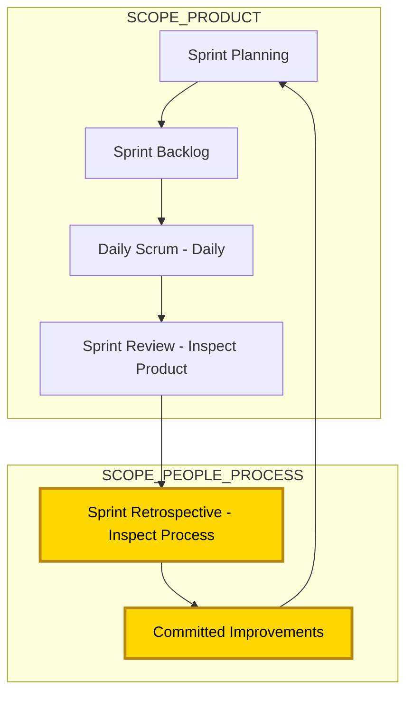
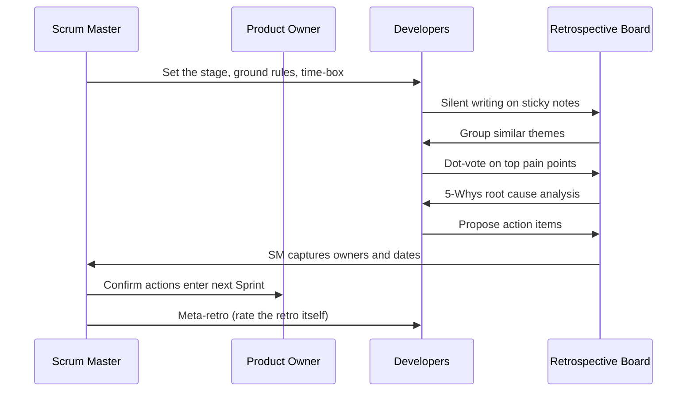
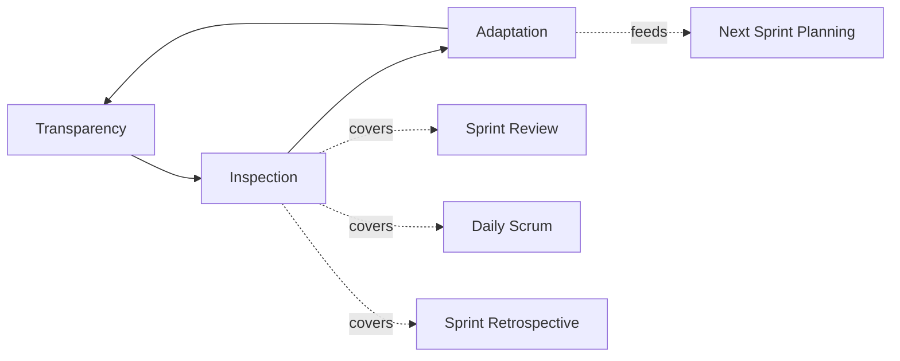
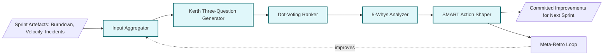

# retro perspective)

<!-- SECTION_1_START -->

# 1. Core Technical Definition & Intuitive Overview

## 1.1 Formal KTU Syllabus Definition

> [!IMPORTANT]
> **Sprint Retrospective (Retro Perspective)**: The Sprint Retrospective is the final event of every Scrum Sprint, scoped to inspect and adapt the **team's process, collaboration, and working environment** — *not* the product itself. As defined in the **Scrum Guide (Schwaber \& Sutherland, 2020)**, the purpose is to *"plan ways to increase quality and effectiveness."*

In the context of the **KTU 2024 Scheme (PECST521 — Software Project Management)**, the Sprint Retrospective is positioned as the **closing ceremony of the Inspect-and-Adapt loop** within the empirical process control theory. It is one of the **five formal Scrum events** and is distinct from the Sprint Review (which inspects the *product*) — a distinction examiners frequently test.

**Standard Metrics \& Parameters (bold for emphasis):**

| Parameter | Standard Value | Authority |
|---|---|---|
| Time-box (1-month Sprint) | **3 hours** | Scrum Guide 2020 |
| Time-box (1-week Sprint) | **45 minutes** | Scrum Guide 2020 |
| Time-box (2-week Sprint) | **1 hour 30 minutes** | Scrum Guide 2020 |
| Frequency | **Once per Sprint** (after Review, before next Planning) | Mandatory |
| Attendance | **Scrum Team only** (PO, Devs, SM) | Internal event |
| Output | **Concrete improvement items** added to next Sprint Backlog | Empirical process |

## 1.2 Conceptual Analogy — Plain English Intuition

> [!NOTE]
> **Real-World Analogy: The Cricket Team's Dressing Room Huddle**
>
> Imagine an Indian cricket team (e.g., Team India after a T20 match). Before the next match, the captain, coach, and players sit in the dressing room and ask three honest questions:
> 1. 🟢 *"What batting/bowling moves worked well tonight?"* (Continue doing them)
> 2. 🔴 *"What dropped catches, wrong shot selections, or fielding lapses hurt us?"* (Stop doing them)
> 3. 🟡 *"What new field placements, net-practice drills, or batting order tweaks should we try in the next match?"* (Start doing them)
>
> The captain doesn't change the **scorecard** (that's the Sprint Review); they change the **team's habits and playbook** (that's the Sprint Retrospective). The ground (Sprint Backlog for next match) absorbs the new plans.

**Geometric / Process Intuition** — visualize a tight feedback triangle:

$$\text{Sprint Planning} \xrightarrow{\text{Build}} \text{Daily Scrum} \xrightarrow{\text{Increment}} \text{Sprint Review} \xrightarrow{\text{Reflect}} \text{Retrospective} \xrightarrow{\text{Improve}} \text{Next Sprint Planning}$$

The Retrospective closes the **loop of empirical process control** by converting *observations* into *experiments for the next Sprint*.

## 1.3 Syllabus Highlight — The Three Lenses of Inspection

> [!IMPORTANT]
> **KTU Board Favourite — Three Inspection Lenses of Retro:**
> The Scrum Team inspects:
> 1. **People** — Relationships, collaboration, morale, cross-functionality.
> 2. **Relationships** — Communication with stakeholders, PO–Devs–SM dynamics.
> 3. **Process** — Tools, Definition of Done (DoD), workflow, ceremonies, automation.
> 4. **Tools** — CI/CD, IDEs, boards, automation, test infrastructure.
> 5. **Definition of Done** — Are we actually meeting it? Are we cutting corners?
>
> Examiners often ask: *"What is inspected in a Sprint Retrospective vs Sprint Review?"* — Memorize this dichotomy.

---

<!-- SECTION_1_END -->

<!-- SECTION_2_START -->

# 2. Deep Theoretical Analysis & KTU High-Yield Formula Sheet

## 2.1 The Three Mandatory Questions — Origin from Agile Manifesto

> [!NOTE]
> **Norman Kerth's Legacy**: The retrospective technique was popularized by **Norman Kerth** (2001) in *Project Retrospectives: A Handbook for Team Reviews*. Scrum codified the three canonical questions every team must answer:

### The Kerth Three-Question Framework

| # | Question | Psychological Intent | Output Type |
|---|---|---|---|
| 1 | **What went well?** | Reinforce winning behaviours, surface unconscious successes | Continue list |
| 2 | **What didn't go well?** | Surface pain points without blame (blameless culture) | Stop / Reduce list |
| 3 | **What can we improve?** | Convert pain into experiments for next Sprint | Start / Try list |

These three lists are then **prioritized by impact** and the **top 1–3 items** become committed improvement actions injected into the **next Sprint Backlog**.

## 2.2 Theoretical Underpinnings — Empirical Process Control

The Retrospective is the operationalization of **Empiricism** (knowledge comes from experience, and decisions are made based on what is observed). It pairs two supporting pillars:

$$\text{Empiricism} = \text{Transparency} + \text{Inspection} + \text{Adaptation}$$

- **Transparency** — Sprint artefacts (board, burndown, Increment) are visible to all.
- **Inspection** — The Retro inspects *how* the team worked.
- **Adaptation** — Adjustments are made to the team's working agreement.

## 2.3 The Five-Phase Retrospective Structure (Esther Derby \& Diana Larsen)

The most academically referenced structure (frequently appearing in KTU 14-mark questions):

1. **Set the Stage** — Psychological safety, ground rules, time-box announcement.
2. **Gather Data** — Generate the three lists (Kerth questions).
3. **Generate Insights** — Why did the pain points happen? Root-cause analysis (e.g., 5 Whys).
4. **Decide What to Do** — Pick concrete experiments with owners and due dates.
5. **Close the Retro** — Recap actions, appreciate the team, do a quick $+/- / \Delta$ check on the retro itself.

## 2.4 KTU High-Yield Formula Sheet

> [!IMPORTANT]
> **Time-Box Calculation Formulas (Board-Exam Friendly)**

| Scenario | Formula | Example (2-week Sprint) |
|---|---|---|
| Retro time-box | $T_{retro} = L_{sprint} \times 1.5$ hours/week | $2 \text{ weeks} \times 1.5 = 3$ hours? **No — Scrum Guide gives 1.5 hours for 2 weeks** |
| Per-week allocation | $T_{retro} = L_{sprint} \times 0.75$ hours | $2 \text{ weeks} \times 0.75 = 1.5$ hours ✓ |
| 1-month Sprint | Fixed = 3 hours | Hard cap |
| 1-week Sprint | Fixed = 45 min | Hard cap |

**Improvement Velocity Formula (process metric, advanced)**:

$$V_{improvement} = \frac{\sum_{i=1}^{n} \text{Completed Improvement Actions}}{\text{Number of Sprints}}$$

A healthy Scrum team's $V_{improvement}$ should be **$\geq 2$ actions/Sprint** — meaning at least two process experiments are tested and closed per Sprint.

**Retrospective Effectiveness Score** (qualitative KTU metric):

$$E_{retro} = \frac{\text{Actionable Items Implemented}}{\text{Actionable Items Agreed}} \times 100\%$$

If $E_{retro} < 50\%$, the team is suffering from *"retro fatigue"* — a known KTU case-study question.

## 2.5 Real-World Engineering Utility

| Domain | Application |
|---|---|
| **DevOps / SRE** | Post-incident retros after outages (e.g., after a production deploy failure) |
| **Embedded Systems** | Hardware-software integration retros after firmware-Sprint demos |
| **AI/ML Pipelines** | Retros on model drift, dataset versioning pain, training pipeline failures |
| **Web/SaaS** | Sprint-end retros on velocity drop, user-story churn, customer escalations |
| **Open Source** | GNOME, Kubernetes, and Apache projects run community-wide retros |
| **Cybersecurity** | Retros after a SOC alert spike or red-team exercise |

> [!NOTE]
> **Industry Insight**: Companies like **Spotify, Google, and Microsoft** run *meta-retros* — a retrospective on the retrospective process itself — to prevent ritual decay. This is a KTU 14-mark essay favourite.

---

<!-- SECTION_2_END -->

<!-- SECTION_3_START -->

# 3. Step-by-Step Derivations, Frameworks & Code/Symbolic Implementation

## 3.1 Exhaustive Step-by-Step Derivation: Deriving the Retro Time-Box for an Arbitrary Sprint Length

**Given:**
- Sprint length $L$ in weeks.
- Scrum Guide mandates a piecewise time-box.

**Step 1 — Identify the regime.**
If $L \leq 1$ week, $T_{retro} = 45$ minutes.
If $L = 2$ weeks, $T_{retro} = 1$ hour 30 minutes.
If $L = 4$ weeks, $T_{retro} = 3$ hours.

**Step 2 — Establish linear interpolation for non-standard Sprint lengths.**
For $1 < L < 4$ weeks:

$$T_{retro}(L) = 45 + (L - 1) \times \frac{180 - 45}{4 - 1} = 45 + (L - 1) \times 45 \text{ minutes}$$

**Step 3 — Verify with a 3-week Sprint.**
Plug $L = 3$ into the equation:

$$T_{retro}(3) = 45 + (3 - 1) \times 45 = 45 + 90 = 135 \text{ minutes} = 2 \text{ hours } 15 \text{ min}$$

**Step 4 — Sanity check the bounds.**

$$\lim_{L \to 1} T_{retro}(L) = 45 + 0 = 45 \text{ min} \quad \checkmark$$
$$\lim_{L \to 4} T_{retro}(L) = 45 + 3 \times 45 = 180 \text{ min} = 3 \text{ hours} \quad \checkmark$$

**Step 5 — Conclusion.**
The closed-form time-box formula is:

$$T_{retro}(L) = 45 + 45(L - 1) \text{ minutes}, \quad 1 \leq L \leq 4$$

## 3.2 Full Python Implementation — Retro Facilitator Bot

```python
"""
Scrum Retrospective Facilitator — KTU PECST521 Module 4 Reference Implementation.
Implements the Kerth three-question framework with a meta-retro on the retro itself.
"""
from dataclasses import dataclass, field
from datetime import datetime
from enum import Enum
from typing import List, Optional
import logging
import uuid

logging.basicConfig(level=logging.INFO, format="[%(asctime)s] %(levelname)s — %(message)s")

class RetroPhase(Enum):
    SET_STAGE = "Set the Stage"
    GATHER_DATA = "Gather Data"
    GENERATE_INSIGHTS = "Generate Insights"
    DECIDE_ACTIONS = "Decide Actions"
    CLOSE = "Close"

@dataclass
class RetroItem:
    text: str
    votes: int = 0
    owner: Optional[str] = None
    due_date: Optional[str] = None
    completed: bool = False

@dataclass
class RetroAction:
    action_id: str = field(default_factory=lambda: str(uuid.uuid4())[:8])
    description: str = ""
    owner: str = ""
    added_to_next_sprint: bool = False

class SprintRetrospective:
    def __init__(self, sprint_number: int, time_box_minutes: int, facilitator: str):
        if time_box_minutes <= 0:
            raise ValueError("Time-box must be positive per Scrum Guide.")
        self.sprint_number = sprint_number
        self.time_box = time_box_minutes
        self.facilitator = facilitator
        self.went_well: List[RetroItem] = []
        self.did_not_go_well: List[RetroItem] = []
        self.improvements: List[RetroItem] = []
        self.committed_actions: List[RetroAction] = []
        self.started_at = datetime.now()
        logging.info(f"Sprint {self.sprint_number} Retro started. Time-box: {self.time_box} min.")

    def add_item(self, category: str, text: str, author: str) -> None:
        item = RetroItem(text=text)
        bucket = {"well": self.went_well, "bad": self.did_not_go_well, "improve": self.improvements}
        if category not in bucket:
            raise KeyError(f"Invalid category '{category}'. Choose from {list(bucket.keys())}.")
        bucket[category].append(item)
        logging.info(f"[{author}] added to '{category}': {text}")

    def vote(self, category: str, index: int, voter: str) -> None:
        bucket = {"well": self.went_well, "bad": self.did_not_go_well, "improve": self.improvements}
        if 0 <= index < len(bucket[category]):
            bucket[category][index].votes += 1
            logging.info(f"[{voter}] voted on item #{index} in '{category}'.")

    def generate_insights(self) -> List[str]:
        insights = []
        for item in sorted(self.did_not_go_well, key=lambda x: -x.votes)[:3]:
            why = f"5-Why Root for '{item.text}': Why? -> (Team to discuss)"
            insights.append(why)
        return insights

    def commit_action(self, description: str, owner: str) -> RetroAction:
        if not description.strip() or not owner.strip():
            raise ValueError("Action description and owner are mandatory for DoA.")
        action = RetroAction(description=description, owner=owner)
        self.committed_actions.append(action)
        logging.info(f"Committed action: {description} (Owner: {owner})")
        return action

    def meta_retro(self) -> None:
        """Reflects on the retro itself — board exam bonus point."""
        print("\n--- META RETRO (on the retro) ---")
        for q in ["Was the time-box respected?", "Did everyone speak?", "Was it blameless?"]:
            print(f"  ? {q}")

    def close(self) -> None:
        elapsed = (datetime.now() - self.started_at).total_seconds() / 60
        if elapsed > self.time_box:
            logging.warning(f"Time-box exceeded! Elapsed: {elapsed:.1f} min, Limit: {self.time_box} min.")
        logging.info(f"Retro closed. {len(self.committed_actions)} actions committed.")
        self.meta_retro()

# ---------- Driver Code ----------
if __name__ == "__main__":
    retro = SprintRetrospective(sprint_number=24, time_box_minutes=90, facilitator="Ananya (SM)")
    retro.add_item("well", "CI pipeline cut build time to 8 minutes", "Dev1")
    retro.add_item("well", "Pair-programming on Auth module reduced bugs", "Dev2")
    retro.add_item("bad", "Code-review SLA slipped to 48 hours", "Dev3")
    retro.add_item("improve", "Adopt Trunk-Based Development with feature flags", "Dev4")
    retro.vote("bad", 0, "PO")
    retro.vote("improve", 0, "PO")
    print("\nTop Pain Points:", retro.generate_insights())
    retro.commit_action("All PRs must get first review within 24h", "Dev Lead")
    retro.commit_action("Pilot feature-flag system in Sprint 25", "DevOps")
    retro.close()
```

## 3.3 Retrospective Format Variants — Comparative Table

> [!TIP]
> **Board Tip**: Examiners love asking *"List four retrospective formats."* — Memorize this table.

| Format | Originator | Core Idea | Best For |
|---|---|---|---|
| **Start / Stop / Continue** | Basic | Behaviour change list | New teams |
| **Mad / Sad / Glad** | LLUI | Emotion-based grouping | Low psychological safety |
| **4Ls** (Liked, Learned, Lacked, Longed for) | Diana Larsen | Knowledge harvesting | Learning-focused teams |
| **Sailboat** | Agile Coaching | Wind (helpers) vs Anchors (blockers) vs Rocks (risks) | Visual thinkers |
| **Starfish** | Luke Hohmann | 5-point scale (More/Less/Keep/Start/Stop) | Balanced feedback |
| **Timeline Retro** | Esther Derby | Chronological Sprint walkthrough | Complex incidents |
| **Lean Coffee** | Brad Swanson | Democratic agenda-setting | Senior teams |

## 3.4 Retrospective Anti-Patterns — KTU Examiner Traps

| Anti-Pattern | Symptom | Mitigation |
|---|---|---|
| **Blaming** | "*Ravi broke the build*" | Enforce blameless language: "*The build broke when…*" |
| **Whisper Chains** | Only 2 people speak | Use silent writing + dot voting |
| **Action Black Hole** | Actions agreed but never done | Track in next Sprint Backlog with owner |
| **Retro Skip** | Skipped when "busy" | Scrum Master must protect the event |
| **Solution Jumping** | Jumping to "buy a new tool" without root cause | Apply 5-Whys before deciding |
| **Groupthink** | Fake consensus | Anonymous input via sticky notes / digital board |
| **Manager Presence** | Manager dominates | Retro is *Scrum Team only* per Scrum Guide |

## 3.5 Action Item SMART Template (Board Exam Standard)

Every committed improvement must satisfy the **SMART** check:

$$\text{Action} = \text{Specific} \wedge \text{Measurable} \wedge \text{Achievable} \wedge \text{Relevant} \wedge \text{Time-bound}$$

**Example SMART Action from a real Sprint:**
> "*Dev Lead will set up an automated lint job in the CI pipeline by **Friday 17:00 IST**, reducing manual code-review time on style issues by **50%**, and report back in the next Sprint Retro.*"

---

<!-- SECTION_3_END -->

<!-- SECTION_4_START -->

# 4. Structural Diagrams & Schematics

## 4.1 Mermaid Flow — Sprint Lifecycle with Retro as the Adaptation Engine



## 4.2 Mermaid Sequence — Facilitation Flow Inside One Retrospective



## 4.3 Mermaid Graph — Three Pillars of Empirical Process Control



## 4.4 Block Architecture — Retrospective Engine as a Functional System



---

<!-- SECTION_4_END -->

<!-- SECTION_5_START -->

# 5. KTU 2024 Scheme Examination Question Bank & Topic Recap

## 5.1 Part A — Short Answer Questions (3 Marks Each)

### Q1. Differentiate between the Sprint Review and Sprint Retrospective. **[3 Marks]** `[KTU University Exam — July 2024]`
**CO:** CO3 | **RBT Level:** Understand

| Aspect | Sprint Review | Sprint Retrospective |
|---|---|---|
| **Focus** | Inspects the **Product** (Increment) | Inspects the **Process / People** |
| **Attendees** | Scrum Team + **Stakeholders** | **Scrum Team only** |
| **Output** | Revised Product Backlog | Process improvement actions |
| **Time-box (1-month)** | 4 hours | 3 hours |

**Valuation Key Points:**
- [Stating the focus correctly: 1 Mark]
- [Mentioning stakeholder vs internal: 1 Mark]
- [Correct time-box: 1 Mark]

> [!WARNING]
> **Examiner Pitfall**: Many students write *"both inspect the product"* — losing all 3 marks. Memorize the dichotomy: **Review = Product, Retro = Process**.

---

### Q2. List the three Kerth questions of a Sprint Retrospective and state the psychological intent of each. **[3 Marks]** `[KTU University Exam — Dec 2023]`
**CO:** CO3 | **RBT Level:** Remember

**Model Answer:**
1. **What went well?** → Reinforce positive behaviours; surface unconscious successes *(1 Mark)*
2. **What didn't go well?** → Identify pain points in a blameless culture; surface obstacles *(1 Mark)*
3. **What can we improve?** → Generate experiments / actionable commitments for the next Sprint *(1 Mark)*

---

## 5.2 Part B — Long Answer Questions (14 Marks with Internal Choice)

### Question A (14 Marks) `[KTU University Exam — Dec 2024]`

**(a)** Explain the **five phases** of a Sprint Retrospective as proposed by **Esther Derby \& Diana Larsen**. List the output of each phase. **[7 Marks]**
**CO:** CO3 | **RBT Level:** Understand

**Model Solution:**

| # | Phase | Activity | Output |
|---|---|---|---|
| 1 | **Set the Stage** | SM announces time-box, ground rules, sets psychological safety | Team aligned on safe space |
| 2 | **Gather Data** | Silent writing, timeline walkthrough, three Kerth questions | Raw data: went-well / not-well / improve lists |
| 3 | **Generate Insights** | Theme grouping, dot-voting, 5-Whys root-cause | Prioritized root causes |
| 4 | **Decide What to Do** | SMART action shaping, owner + due-date assignment | 1–3 committed improvement actions |
| 5 | **Close the Retro** | Appreciations, recap, meta-retro on the retro | Retro effectiveness signal |

**Valuation Key Points:**
- [Naming all 5 phases in order: 3 Marks]
- [Explaining purpose of each: 2 Marks]
- [Output of each phase: 2 Marks]

**(b)** A 9-member Scrum Team is currently in a 3-week Sprint for an embedded IoT product. The team is suffering from **retro fatigue** — the same three issues (slow code review, flaky tests, ambiguous DoD) appear in every Retro for 5 Sprints straight. Apply the **5-Whys** technique to ONE of these issues and propose a **SMART** action item. **[7 Marks]**
**CO:** CO4 | **RBT Level:** Apply

**Model Solution:**

**Selected Issue:** *Flaky tests in the CI pipeline.*

**5-Whys Analysis:**

1. *Why are tests flaky?* → Because the same test sometimes passes and sometimes fails without code changes.
2. *Why does that happen?* → Because tests share a global database and run in parallel without isolation.
3. *Why is the database shared?* → Because the test environment is a single shared Docker container with no per-test transactions.
4. *Why are there no per-test transactions?* → Because the team has not yet adopted **Testcontainers** or DB-per-test patterns.
5. *Why has the team not adopted this?* → Because the Action Item from 5 Sprints ago ("*explore test isolation*") was committed but never picked up — it had no owner or due date.

**Root Cause:** Lack of ownership and time-boxing of retro actions.

**SMART Action Item:**

> *"DevOps Engineer **Riya** will implement **Testcontainers** for the user-authentication module's integration tests, achieve **0% flakiness** measured over **10 consecutive CI runs**, and demonstrate the result in the **Sprint 26 Retrospective on Day 14, 17:00 IST**."*

**SMART Verification:**
- **S**pecific: Testcontainers for auth-module tests *(✓)*
- **M**easurable: 0% flakiness over 10 runs *(✓)*
- **A**chievable: Library already in the artifact repository *(✓)*
- **R**elevant: Directly fixes the root cause *(✓)*
- **T**ime-bound: Day 14, Sprint 26 *(✓)*

**Valuation Key Points:**
- [Chaining 5 logical "whys": 3 Marks]
- [Identifying the *real* root cause (not the symptom): 2 Marks]
- [SMART action meeting all 5 criteria: 2 Marks]

---

### Question B (14 Marks) `[KTU University Exam — July 2024]`

**(a)** Compare and contrast **four retrospective formats** (Start/Stop/Continue, Mad/Sad/Glad, 4Ls, Sailboat). For each, state **one scenario** where it is most effective. **[7 Marks]**
**CO:** CO3 | **RBT Level:** Analyze

**Model Solution:**

| Format | Core Lenses | Mechanism | Best Scenario |
|---|---|---|---|
| **Start/Stop/Continue** | Behaviour change | Simple 3-column board | New Scrum teams needing a low-friction entry |
| **Mad/Sad/Glad** | Emotional state | Emotion-tagged stickies | Teams with low psychological safety or high burnout |
| **4Ls** | Knowledge harvesting | Liked/Learned/Lacked/Longed for | Teams focused on continuous learning and skill growth |
| **Sailboat** | Visual metaphor | Wind/Anchor/Rocks/Ideal Island | Cross-functional teams who respond to visual storytelling |
| **Starfish** | 5-quadrant scale | More/Less/Keep/Start/Stop | Mature teams wanting nuanced feedback on each practice |

**Comparative Insight:**
- *Start/Stop/Continue* and *Mad/Sad/Glad* are **behaviour-driven** vs **emotion-driven**.
- *4Ls* is **learning-driven**; *Sailboat* is **metaphor-driven**.
- *Starfish* is the most **balanced** (5 perspectives per item).

**Valuation Key Points:**
- [Naming 4 formats: 2 Marks]
- [Core mechanism of each: 2 Marks]
- [Relevant scenario for each: 2 Marks]
- [Comparative analysis sentence: 1 Mark]

**(b)** Calculate the **Sprint Retrospective time-box** for a Sprint of length (i) 1 week, (ii) 2 weeks, (iii) 4 weeks, and (iv) 3 weeks (using the interpolation formula). For a 4-week Sprint, also compute the **Retrospective Effectiveness Score** if a team committed to 6 actions and implemented 4 of them in the next Sprint. **[7 Marks]**
**CO:** CO4 | **RBT Level:** Apply

**Model Solution:**

**(i) 1 week:** $T_{retro} = 45$ minutes (per Scrum Guide hard cap). *(1 Mark)*

**(ii) 2 weeks:** $T_{retro} = 1$ hour 30 minutes. *(1 Mark)*

**(iii) 4 weeks:** $T_{retro} = 3$ hours. *(1 Mark)*

**(iv) 3 weeks (interpolation):**

$$T_{retro}(3) = 45 + 45(3 - 1) = 45 + 90 = 135 \text{ minutes} = 2 \text{ hours } 15 \text{ min}$$

*(1 Mark — boundary setup, 1 Mark — final answer)*

**Effectiveness Score (4-week Sprint):**

$$E_{retro} = \frac{\text{Actions Implemented}}{\text{Actions Agreed}} \times 100 = \frac{4}{6} \times 100 \approx 66.67\%$$

**Interpretation:** $E_{retro} \approx 66.67\%$ is **above the 50% red-line** — the team is healthy, but 2 actions slipped and should be re-prioritized in the next Retro. *(2 Marks)*

**Valuation Key Points:**
- [Correct 3 standard time-boxes: 3 Marks]
- [Interpolation derivation: 2 Marks]
- [Effectiveness formula + final numeric + interpretation: 2 Marks]

---

> [!WARNING]
> **KTU Examiner's Valuation Warnings — Top Pitfalls in Retrospective Questions**
> 1. **Confusing Review with Retro** — losing 3–5 marks. Always clarify: *Review = product, Retro = process.*
> 2. **Forgetting the Scrum Master role** — examiners award marks for explicitly stating that the **SM facilitates** (not dictates) the Retro.
> 3. **Skipping "blameless culture"** — every Retro answer must mention *psychological safety* and *blameless language* at least once.
> 4. **No concrete action items** — vague answers like "*improve communication*" get **0 marks** for the action-item step. Always provide a **SMART action with owner + due-date**.
> 5. **Ignoring the time-box formula** — for calculation questions, forgetting the unit conversion (minutes vs hours) costs 1 mark easily.

---

## 5.3 Topic Recap & Important Things to Remember

> [!IMPORTANT]
> **Rapid-Revision Checklist for Scrum Retrospective (Retro Perspective)**

- **Definition**: Closing Scrum event that inspects the **team's process, people, and collaboration** (NOT the product).
- **Position in Sprint**: Occurs **after Sprint Review, before the next Sprint Planning** — the final inspection in the empirical loop.
- **Time-Box Rule (Scrum Guide 2020)**:
  - 1-month Sprint → **3 hours**
  - 1-week Sprint → **45 minutes**
  - 2-week Sprint → **1.5 hours**
- **Interpolation Formula**: $T_{retro}(L) = 45 + 45(L - 1)$ minutes, for $1 \le L \le 4$ weeks.
- **Mandatory Attendance**: **Scrum Team only** (PO, Developers, Scrum Master) — strictly *internal*, no stakeholders.
- **Three Kerth Questions**: (1) What went well? (2) What didn't go well? (3) What can we improve?
- **Five Derby-Larsen Phases**: Set the Stage → Gather Data → Generate Insights → Decide What to Do → Close.
- **Blameless Culture**: Mandatory; use "*the build broke when…*" not "*Ravi broke the build*".
- **SMART Action Items**: Every committed improvement needs **Specific, Measurable, Achievable, Relevant, Time-bound** attributes.
- **Anti-Patterns to Flag in Answers**: Blame, whisper chains, action black hole, retro skip, solution jumping, groupthink.
- **Retrospective Formats** (any 4): Start/Stop/Continue, Mad/Sad/Glad, 4Ls, Sailboat, Starfish, Timeline, Lean Coffee.
- **Inspection Lenses**: People, Relationships, Process, Tools, Definition of Done.
- **Output**: 1–3 concrete, owned, dated improvement actions added to the next Sprint Backlog.
- **Effectiveness Metric**: $E_{retro} = (\text{Actions Implemented} / \text{Actions Agreed}) \times 100\%$. Healthy threshold: $\geq 50\%$.
- **Improvement Velocity**: $V_{improvement} = \text{Actions Completed per Sprint}$; healthy $\geq 2$.
- **Key People**: **Ken Schwaber \& Jeff Sutherland** (Scrum co-creators), **Norman Kerth** (Retro pioneer), **Esther Derby \& Diana Larsen** (5-phase structure).
- **Meta-Retro**: A retrospective on the retrospective itself — practised by mature teams at Google, Spotify, Microsoft to prevent ritual decay.
- **Examiner Mantra**: *"Retro inspects the process, Review inspects the product — never confuse them in the answer."*

<!-- SECTION_5_END -->
