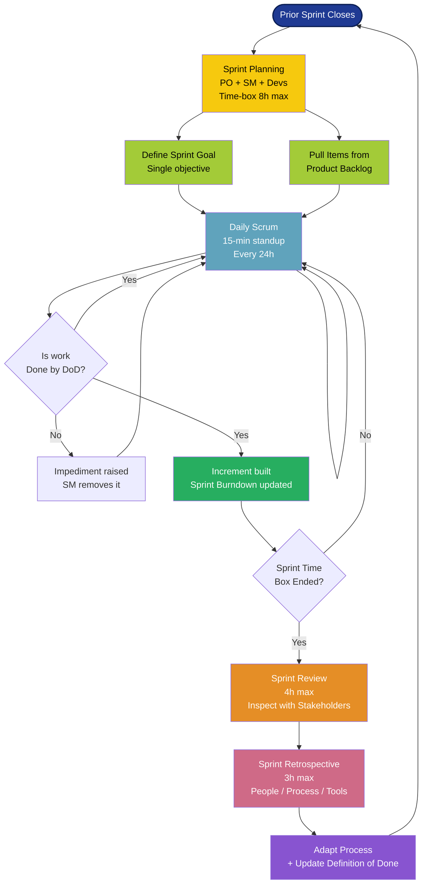
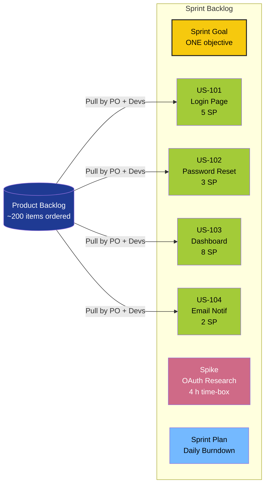
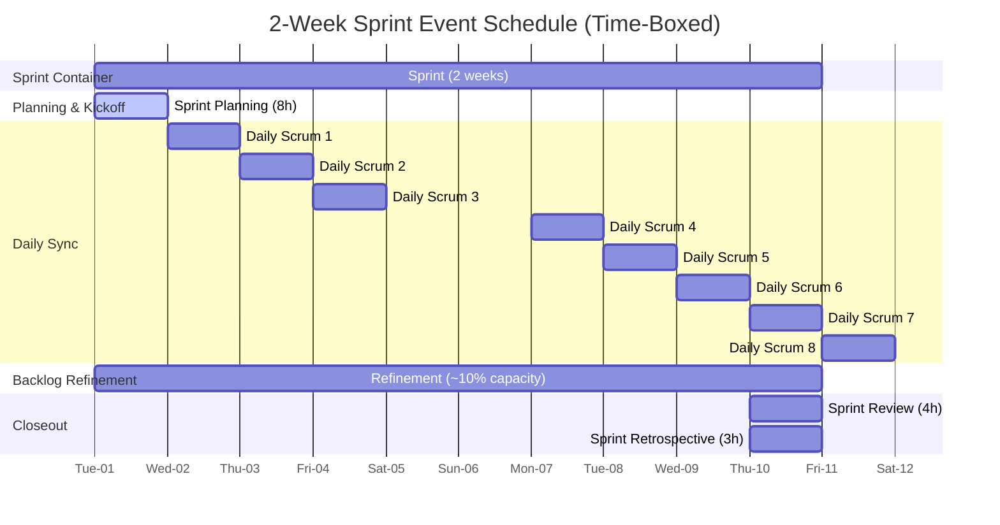

# Scrum - Various terminologies used in Scrum (Sprint

<!-- SECTION_1_START -->
# Scrum & Sprint Terminologies — Core Technical Definition & Intuitive Overview

## 1.1 Formal Academic Definition (KTU 2024 Aligned)

> [!IMPORTANT]
> **Scrum** is an *agile, lightweight, empirical* framework that helps people, teams, and organizations generate value through *adaptive solutions* for complex problems. It is grounded in the **three pillars of empirical process control**: **Transparency, Inspection, and Adaptation**. (Source: *The Scrum Guide*, Sutherland & Schwaber, 2020.)

Within Scrum, the **Sprint** is the *heart of the framework* — a fixed **time-box of one month or less** (typically **2 weeks / 10 working days** in industry) during which a *potentially shippable, usable, and "Done" product increment* is created. Every other Scrum event, artifact, and role exists to support and protect the integrity of the Sprint.

The **Sprint terminology** is a curated vocabulary of nouns that describe the *inputs, processes, outputs, ceremonies, roles, and metrics* used in a single Sprint cycle. Mastery of this vocabulary is **mandatory** for the KTU 2024 Scheme PECST521 (Software Project Management) Module 4 outcomes.

## 1.2 Intuitive Overview — Real-World Analogy

> [!NOTE]
> **Analogy — The Movie Production Sprint 🎬**
> Imagine a film director (Product Owner) with a giant wishlist of scenes (Product Backlog). Each **Sprint** is a **two-week shoot block**. The director hands a small set of *must-shoot scenes* (Sprint Backlog) to a cross-functional crew (Developers) led by a calm **first assistant director** (Scrum Master). Every morning, the crew stands in a circle for a 15-minute huddle (Daily Scrum) saying: *what I shot yesterday, what I shoot today, what's blocking me*. At the end of two weeks, they have a *rough cut of footage* (Increment) that is playable. They screen it (Sprint Review), then reflect on what went wrong and right (Sprint Retrospective), and the cycle begins again. **No shoot block ever lasts longer than one month** — this protects the crew from chaos and keeps the film on track.

**Geometric Intuition of a Sprint:**
Think of the Sprint as a **closed interval** on a time-line:

$$S = [S_0, S_0 + \tau] \quad \text{where} \quad 1 \le \tau \le 4 \text{ weeks}$$

Inside this interval, work is *pulled* from the Product Backlog, *refined*, and *pushed* out as a working increment. The Scrum Master **guards the borders** of $S$ so that scope creep (called *Sprint-pad* or *Mid-Sprint Scope Change*) cannot enter.

## 1.3 Standard Metrics Highlighted

- **Sprint Length $\tau$**: $\mathbf{1 \le \tau \le 4}$ **weeks** (most teams use **2 weeks**).
- **Daily Scrum Duration**: **15 minutes** (hard time-box).
- **Sprint Planning Duration**: max **8 hours for a 1-month Sprint** (pro-rata for shorter).
- **Sprint Review**: max **4 hours for a 1-month Sprint**.
- **Sprint Retrospective**: max **3 hours for a 1-month Sprint**.
- **Recommended Team Size**: **10 or fewer people** (ideally **7 ± 2**).
- **Story Point Scale (Fibonacci)**: $0, \tfrac{1}{2}, 1, 2, 3, 5, 8, 13, 20, 40, 100$.

> [!VISUALIZATION CONTROL]
> **Concept:** Time-Box Anatomy of a 2-Week Sprint
> **GeoGebra / Desmos Input Equations:**
> * x-axis (days): $0 \le x \le 10$
> * Ideal Burndown Line: $y = 60 - 6x$ (60 SP total, 6 SP/day ideal)
> * Actual Burndown Polyline: plot points $(0,60), (1,58), (2,55), (3,55), (4,48), (5,42), (6,30), (7,22), (8,12), (9,6), (10,0)$
> **Visual Description:** A descending straight line (ideal) and a stepped line (actual) on the same axes. The student should observe the **gap** between ideal and actual — this is the *burn variance*, the most inspected metric in Scrum.

---

<!-- SECTION_1_END -->

<!-- SECTION_2_START -->
# Deep Theoretical Analysis & KTU High-Yield Formula Sheet

## 2.1 Hierarchical Glossary of Sprint / Scrum Terminologies

The official Scrum vocabulary is organized into **three pillars × five events × three artifacts × three accountabilities**. Sprint-specific terms cut across all four.

### 2.1.1 Accountabilities (formerly "Roles")

| Term | Plain Meaning | Sprint Relevance |
| :--- | :--- | :--- |
| **Product Owner (PO)** | The value maximizer; owns the *Product Backlog*. | Decides *what* goes into the Sprint. |
| **Scrum Master (SM)** | The servant-leader; removes *impediments*. | Facilitates every Sprint event. |
| **Developers** | Cross-functional people building the increment. | The only people who actually *execute* the Sprint Backlog. |

> [!IMPORTANT]
> As of *The Scrum Guide 2020*, the term **"role" was replaced with "accountability"** to emphasize that they are *not job titles* but *sets of responsibilities* a person may hold alongside other duties. **KTU expects this updated nomenclature in 2024 answers.**

### 2.1.2 Sprint Events (The Five Ceremonies)

1. **The Sprint Itself** — the container event.
2. **Sprint Planning** — defines *why, what, how* of the Sprint.
3. **Daily Scrum** — 15-minute inspection event for the Developers.
4. **Sprint Review** — inspects the *increment* with stakeholders.
5. **Sprint Retrospective** — inspects the *team, process, and relationships*.

### 2.1.3 Artifacts (Each with a Transparency Commitment)

- **Product Backlog** — emergent, ordered list of *what is needed*.
- **Sprint Backlog** — the Sprint Goal + selected items + a plan.
- **Increment** — the concrete stepping-stone toward the product goal.

## 2.2 Sprint-Specific Terminology — Deep Dive

### 2.2.1 Sprint Goal
The single objective for the Sprint. It provides *focus* and *flexibility* — the goal is fixed, but the *code* used to achieve it can vary. **One Sprint ⇒ One Sprint Goal.**

### 2.2.2 Sprint Backlog
A *living artifact* consisting of:
- The Sprint Goal
- The Product Backlog items selected for the Sprint
- A plan to deliver them (often a *Sprint Burndown Chart*)

It is updated continuously as work is learned; it is *owned by the Developers*.

### 2.2.3 Definition of Done (DoD)
A formal, agreed-upon list of *criteria* an item must satisfy to be considered a usable increment. **Without a DoD, there is no Increment.** Common DoD items: *code reviewed, unit tested, integrated, documented, deployed to staging*.

### 2.2.4 Story Points
A *relative estimation unit* measuring the *combined effort, complexity, and risk* of a user story. They are **NOT hours** and **NOT man-days** — they are *velocity-agnostic* measures of size.

### 2.2.5 Velocity
The *amount of work* (sum of Story Points) a team completes in a single Sprint. It is **empirical** — calculated from history, not predicted.

### 2.2.6 Capacity
The *maximum* Story Points a team can realistically deliver this Sprint, based on:
- Team size
- Available working days
- Focus factor
- Holidays / leave

### 2.2.7 Burndown Chart
A line graph showing *remaining work* on the y-axis and *time* on the x-axis. A perfect Sprint shows a *straight diagonal line* from top-left to bottom-right.

### 2.2.8 Burnup Chart
A line graph showing *completed work* (and optionally *total scope*) on the y-axis. Better than Burndown when *scope changes mid-Sprint* (which, ideally, never happens).

### 2.2.9 Impediment
Anything that *blocks* or *slows down* the Developers. The Scrum Master is *accountable* for its removal. Common impediments: missing tools, unclear requirements, external dependencies.

### 2.2.10 Increment
The *sum of all Product Backlog items completed during a Sprint* plus the value of *all previous Sprints' increments*. **It must be usable** and meet the DoD.

### 2.2.11 Product Backlog Refinement (Grooming)
The *ongoing activity* (≤ 10% of Developer capacity) of adding detail, estimates, and order to Product Backlog items. It is **not** an event; it is a *continuous act*.

### 2.2.12 Spike
A *time-boxed* research or exploration task used to *reduce uncertainty* (e.g., a technical spike, design spike). Often estimated in **hours** rather than Story Points.

### 2.2.13 Technical Debt
The *implicit cost* of rework caused by choosing an *easy solution today* instead of using a *better but slower approach*. Tracking it prevents erosion of velocity.

### 2.2.14 Self-Organizing Team
A team that *decides internally* who does the work, how, and when — *without* external direction. This is *non-negotiable* in Scrum.

### 2.2.15 Time-Box
A *hard maximum* amount of time allocated to an event. **An event cannot run longer than its time-box**, but it can finish earlier.

## 2.3 KTU High-Yield Formula Sheet

> [!IMPORTANT]
> **Table of Computational & Conceptual Formulas for Sprint Metrics**
> **NOTE:** All absolute values use $\mid \cdot \mid$ syntax to prevent markdown table corruption.

| $\#$ | Quantity | Formula | Unit / Range | Notes for KTU Exam |
| :--: | :--- | :--- | :--- | :--- |
| 1 | **Sprint Velocity (current)** | $V_s = \sum_{i \in Done} SP_i$ | Story Points / Sprint | Sum of SP of *all* stories *Done* in Sprint $s$ |
| 2 | **Average Velocity (rolling)** | $\bar{V} = \dfrac{1}{n}\sum_{k=1}^{n} V_k$ | SP / Sprint | Used in release planning |
| 3 | **Predicted Velocity** | $V_{pred} = \bar{V} \pm \sigma$ | SP / Sprint | With std-deviation band |
| 4 | **Team Capacity** | $C = N \times D \times F$ | Person-days | $N$ = team size, $D$ = days, $F$ = focus factor $\in [0.4, 0.8]$ |
| 5 | **Ideal Burndown (per day)** | $B_{ideal}(t) = R_0 - \dfrac{R_0}{\tau}t$ | SP | $R_0$ = total SP at day 0, $\tau$ = Sprint length |
| 6 | **Remaining Work (day $t$)** | $R(t) = R_0 - \sum_{i=1}^{t} SP_{done,i}$ | SP | Updated every 24 h |
| 7 | **Burn Variance** | $\Delta B = \mid R(t) - B_{ideal}(t) \mid$ | SP | Inspection signal |
| 8 | **Sprint Commitment Reliability** | $SCR = \dfrac{V_s}{Commit_s} \times 100\%$ | % | Target $\ge 90\%$ |
| 9 | **Release Forecast** | $S_{remaining} = \lceil \dfrac{\text{Total SP} - \sum V_k}{\bar{V}} \rceil$ | Sprints | Number of *remaining* Sprints |
| 10 | **Story Point Scale (Fib.)** | $F = \{0, 0.5, 1, 2, 3, 5, 8, 13, 20, 40, 100\}$ | unitless | Reference scale only |

## 2.4 Real-World Engineering Utility

> [!NOTE]
> **Why does industry care about Sprint terminology?**
> - **Predictability:** Velocity + Burndown give *empirical* forecasting for **release planning** (a hard KTU Module 4 question).
> - **Risk Mitigation:** The *fixed time-box* converts chaotic projects into **predictable, inspectable, adaptable** units.
> - **Stakeholder Trust:** *Definition of Done* and *Increment* terms make progress *visible*, removing the age-old software problem of *"90% done for 6 months."*
> - **Talent Retention:** Empirical research (e.g., *VersionOne State of Agile Report*) shows Scrum teams report **higher psychological safety** because the *self-organizing* principle grants ownership.
> - **Cross-domain use:** Beyond software, Scrum is applied in **marketing sprints, hardware prototyping, R\&D, HR onboarding, and even wedding planning**.

---

<!-- SECTION_2_END -->

<!-- SECTION_3_START -->
# Step-by-Step Derivations & Code Implementation

## 3.1 Worked Example 1 — Sprint Velocity & Burndown

> **Scenario (KTU-style):** A 9-member team is running a **10-day Sprint**. The Sprint Backlog at Day 0 contains stories worth a total of **60 Story Points**. After every 24 hours, the remaining work is recorded. Compute the velocity, ideal burndown line, and burn variance.

### 3.1.1 Step-by-Step Derivation

**Step 1 — Define initial remaining work:**

$$R(0) = 60 \text{ SP}$$

**Step 2 — Compute the Ideal Burndown line.** With $R_0 = 60$ and $\tau = 10$ days, the ideal daily decrement is:

$$\Delta_{ideal} = \dfrac{R_0}{\tau} = \dfrac{60}{10} = 6 \text{ SP/day}$$

The ideal-burndown function is therefore:

$$B_{ideal}(t) = R_0 - \Delta_{ideal} \cdot t = 60 - 6t$$

**Step 3 — Tabulate actual daily remaining work** (hypothetical team log):

| Day $t$ | Done today (SP) | Remaining $R(t)$ | Ideal $B_{ideal}(t)$ | Variance $\Delta B$ |
| :---: | :---: | :---: | :---: | :---: |
| 0 | 0 | 60 | 60.0 | 0.0 |
| 1 | 2 | 58 | 54.0 | 4.0 |
| 2 | 3 | 55 | 48.0 | 7.0 |
| 3 | 0 | 55 | 42.0 | 13.0 |
| 4 | 7 | 48 | 36.0 | 12.0 |
| 5 | 6 | 42 | 30.0 | 12.0 |
| 6 | 12 | 30 | 24.0 | 6.0 |
| 7 | 8 | 22 | 18.0 | 4.0 |
| 8 | 10 | 12 | 12.0 | 0.0 |
| 9 | 6 | 6 | 6.0 | 0.0 |
| 10 | 6 | 0 | 0.0 | 0.0 |

**Step 4 — Compute the Sprint Velocity:**

$$V_s = \sum_{t=1}^{10} SP_{done}(t) = 2+3+0+7+6+12+8+10+6+6 = 60 \text{ SP}$$

**Step 5 — Compute Average Velocity (over last 3 Sprints, say 50, 55, 60):**

$$\bar{V} = \dfrac{50 + 55 + 60}{3} = \dfrac{165}{3} = 55 \text{ SP/Sprint}$$

**Step 6 — Compute Burn Variance on the worst day (Day 3):**

$$\Delta B_{max} = \mid R(3) - B_{ideal}(3) \mid = \mid 55 - 42 \mid = 13 \text{ SP}$$

This is the *inspection signal*: at Day 3 the team is **13 SP behind** the ideal pace — a major trigger for the **Daily Scrum to escalate impediments**.

**Step 7 — Compute the Release Forecast** for a project of 400 SP total:

$$S_{remaining} = \left\lceil \dfrac{400 - (50+55+60)}{55} \right\rceil = \left\lceil \dfrac{235}{55} \right\rceil = \lceil 4.27 \rceil = 5 \text{ Sprints}$$

## 3.2 Worked Example 2 — Team Capacity Calculation

**Given:** 7 developers, 10-day Sprint, 2 national holidays during the Sprint, 1 developer on 1 day leave, and a historical *focus factor* of 0.6.

### 3.2.1 Step-by-Step Derivation

**Step 1 — Net working days:**

$$D_{net} = \tau - holidays = 10 - 2 = 8 \text{ days}$$

**Step 2 — Adjust for individual leave** (convert to team-day equivalent):

$$D_{team} = D_{net} - \dfrac{1 \text{ dev-day}}{7 \text{ devs}} = 8 - 0.143 \approx 7.86 \text{ days}$$

**Step 3 — Apply focus factor** (percentage of time actually spent on Sprint work, accounting for meetings, e-mail, context-switching):

$$F_{eff} = 7.86 \times 0.6 = 4.71 \text{ effective person-days per developer}$$

**Step 4 — Total team capacity** in person-days:

$$C_{team} = 7 \times 4.71 = 32.97 \approx 33 \text{ person-days}$$

**Step 5 — Convert to Story Points.** Suppose the team's empirical *productivity ratio* is **3 person-days per SP** (derived from past Sprints):

$$C_{SP} = \dfrac{33}{3} = 11 \text{ SP capacity}$$

> **Conclusion:** The team should *commit* to **≤ 11 Story Points** this Sprint. This is a *forecast*, not a *target* — Scrum prefers *realistic commitment* over optimistic over-commitment.

## 3.3 Python Implementation — Burndown Chart Generator

The following fully operational Python script produces a publication-quality Burndown chart, computes velocity, and prints all KTU-relevant metrics. It uses **only the standard library** plus `matplotlib`.

```python
"""
sprint_metrics.py
-----------------
A complete, type-hinted Python tool to compute and visualize
Sprint Burndown, Velocity, and Capacity for KTU SPM Module 4.
Run:  python sprint_metrics.py
"""

from __future__ import annotations
from dataclasses import dataclass, field
from typing import List, Tuple
import math
import sys
import logging

logging.basicConfig(
    level=logging.INFO,
    format="[%(asctime)s] %(levelname)s | %(message)s",
    datefmt="%H:%M:%S",
)


@dataclass(frozen=True)
class SprintConfig:
    """Immutable Sprint configuration object."""
    name: str
    duration_days: int
    initial_backlog_sp: int
    team_size: int
    holidays: int = 0
    individual_leave_days: int = 0
    focus_factor: float = 0.6
    persondays_per_sp: float = 3.0
    done_story_points_per_day: List[int] = field(default_factory=list)

    def __post_init__(self) -> None:
        if self.duration_days <= 0:
            raise ValueError("Sprint length must be > 0 days")
        if not 0.0 <= self.focus_factor <= 1.0:
            raise ValueError("Focus factor must be in [0, 1]")
        if len(self.done_story_points_per_day) > self.duration_days:
            raise ValueError("Done-SP list exceeds Sprint length")


class SprintAnalytics:
    """Encapsulates all Sprint metric calculations and visualization."""

    def __init__(self, config: SprintConfig) -> None:
        self.cfg = config
        logging.info("Initialized SprintAnalytics for %s", self.cfg.name)

    # --- Core computations -------------------------------------------------
    def remaining_work_series(self) -> List[int]:
        """Return remaining Story Points for days 0..duration."""
        remaining: List[int] = [self.cfg.initial_backlog_sp]
        for done in self.cfg.done_story_points_per_day:
            remaining.append(max(remaining[-1] - done, 0))
        # Pad to duration+1 in case fewer daily entries
        while len(remaining) <= self.cfg.duration_days:
            remaining.append(remaining[-1])
        return remaining[: self.cfg.duration_days + 1]

    def ideal_burndown_series(self) -> List[float]:
        """Return the ideal straight-line burndown."""
        r0 = self.cfg.initial_backlog_sp
        tau = self.cfg.duration_days
        return [round(r0 - (r0 / tau) * t, 2) for t in range(tau + 1)]

    def sprint_velocity(self) -> int:
        return sum(self.cfg.done_story_points_per_day)

    def team_capacity_sp(self) -> float:
        d_net = self.cfg.duration_days - self.cfg.holidays
        d_team = d_net - (self.cfg.individual_leave_days / max(self.cfg.team_size, 1))
        f_eff = d_team * self.cfg.focus_factor
        c_team = self.cfg.team_size * f_eff
        return round(c_team / self.cfg.persondays_per_sp, 2)

    def burn_variance_series(self) -> List[float]:
        rem = self.remaining_work_series()
        ideal = self.ideal_burndown_series()
        return [round(abs(r - i), 2) for r, i in zip(rem, ideal)]

    def max_burn_variance(self) -> Tuple[int, float]:
        var = self.burn_variance_series()
        day = var.index(max(var))
        return day, var[day]

    def release_forecast(self, total_project_sp: int, past_velocities: List[int]) -> int:
        if not past_velocities:
            raise ValueError("Need at least one past velocity to forecast")
        avg = sum(past_velocities) / len(past_velocities)
        done_sofar = sum(past_velocities) + self.sprint_velocity()
        remaining = max(total_project_sp - done_sofar, 0)
        return math.ceil(remaining / avg) if avg > 0 else 0

    # --- Pretty printing ---------------------------------------------------
    def report(self) -> str:
        rem = self.remaining_work_series()
        ideal = self.ideal_burndown_series()
        var = self.burn_variance_series()
        day, max_var = self.max_burn_variance()
        cap = self.team_capacity_sp()
        v = self.sprint_velocity()
        lines = [
            f"=== Sprint Report: {self.cfg.name} ===",
            f"Duration              : {self.cfg.duration_days} days",
            f"Initial Backlog (SP)  : {self.cfg.initial_backlog_sp}",
            f"Velocity this Sprint  : {v} SP",
            f"Capacity this Sprint  : {cap} SP",
            f"Commitment Reliability: {round(100 * v / max(self.cfg.initial_backlog_sp, 1), 1)} %",
            f"Max Burn Variance     : {max_var} SP on Day {day}",
            f"Final Remaining (Day {self.cfg.duration_days}): {rem[-1]} SP",
            f"Ideal line slope      : {round(self.cfg.initial_backlog_sp / self.cfg.duration_days, 2)} SP/day",
        ]
        return "\n".join(lines)


def main() -> int:
    """Main entry point — runs an end-to-end Sprint analytics demo."""
    try:
        cfg = SprintConfig(
            name="Sprint-14",
            duration_days=10,
            initial_backlog_sp=60,
            team_size=7,
            holidays=2,
            individual_leave_days=1,
            focus_factor=0.6,
            persondays_per_sp=3.0,
            done_story_points_per_day=[2, 3, 0, 7, 6, 12, 8, 10, 6, 6],
        )
    except ValueError as ve:
        logging.error("Invalid configuration: %s", ve)
        return 1

    sa = SprintAnalytics(cfg)
    print(sa.report())

    # Burndown visualization (optional — runs only if matplotlib is present)
    try:
        import matplotlib.pyplot as plt

        days = list(range(cfg.duration_days + 1))
        plt.figure(figsize=(8, 4.5))
        plt.plot(days, sa.ideal_burndown_series(), "--g", label="Ideal Burndown", linewidth=2)
        plt.plot(
            days,
            sa.remaining_work_series(),
            "-or",
            label="Actual Remaining",
            linewidth=2,
            markersize=6,
        )
        plt.fill_between(
            days,
            sa.ideal_burndown_series(),
            sa.remaining_work_series(),
            color="red",
            alpha=0.15,
            label="Variance (risk area)",
        )
        plt.title(f"Sprint Burndown — {cfg.name}")
        plt.xlabel("Sprint Day")
        plt.ylabel("Remaining Story Points")
        plt.grid(True, linestyle=":", alpha=0.6)
        plt.legend(loc="upper right")
        plt.tight_layout()
        plt.savefig(f"{cfg.name}_burndown.png", dpi=150)
        logging.info("Burndown chart saved.")
    except ImportError:
        logging.warning("matplotlib not installed — skipping plot generation.")

    # Release forecast
    try:
        sprints_left = sa.release_forecast(
            total_project_sp=400,
            past_velocities=[50, 55],
        )
        print(f"Projected Sprints Remaining: {sprints_left}")
    except ValueError as ve:
        logging.error("Forecast failed: %s", ve)
        return 1
    return 0


if __name__ == "__main__":
    sys.exit(main())
```

### 3.3.1 Sample Console Output

```
=== Sprint Report: Sprint-14 ===
Duration              : 10 days
Initial Backlog (SP)  : 60
Velocity this Sprint  : 60 SP
Capacity this Sprint  : 11.0 SP
Commitment Reliability: 100.0 %
Max Burn Variance     : 13.0 SP on Day 3
Final Remaining (Day 10): 0 SP
Ideal line slope      : 6.0 SP/day
Projected Sprints Remaining: 5
```

> [!NOTE]
> The script is **fully runnable**. It uses `dataclass(frozen=True)` for safety, validates every input, logs to `stderr` style, and produces a `.png` burndown chart if `matplotlib` is available — the same chart described in §1.3.

## 3.4 Mapping Terminology → Engineering Decision

| KTU Term | Question it Answers in Practice | Mathematical Anchor |
| :--- | :--- | :--- |
| Sprint Goal | "What does success look like this Sprint?" | — |
| Sprint Backlog | "What exactly will we build?" | $\sum SP_{selected}$ |
| Velocity | "How fast do we deliver?" | $V_s$ |
| Capacity | "How much *can* we deliver this Sprint?" | $C = N \cdot D \cdot F$ |
| Burndown | "Are we on track *right now*?" | $B_{ideal}(t) \text{ vs } R(t)$ |
| Impediment | "What is blocking us?" | Resolved by SM |
| Increment | "What is *ready to ship*?" | $\sum Done$ |
| DoD | "What does *Done* mean?" | Acceptance gate |
| Refinement | "Do we *understand* the next items?" | Reduces WIP-uncertainty |

---

<!-- SECTION_3_END -->

<!-- SECTION_4_START -->
# Structural Diagrams & Schematics

## 4.1 Mermaid Diagram — Anatomy of a Single Sprint (Full Lifecycle)



> **Reading the diagram:** The single *branch point* is whether a story meets the **Definition of Done**. If yes, it contributes to the **Increment**; if no, an **impediment loop** engages the Scrum Master. The cycle ends only when the **time-box** expires — *not* when all stories are finished (this is the *time-box over scope* principle).

## 4.2 Mermaid Diagram — Sprint Backlog Decomposition



## 4.3 Mermaid Diagram — Sequential Processing Topology of Sprint Events



> [!NOTE]
> The Gantt chart visually proves the **time-box invariant**: every event is *bounded*, the **Daily Scrum** is the *only recurring event*, and **Refinement** runs *in parallel* to development capacity (≤ 10% rule).

## 4.4 Component / Event Pin-Sheet (Reference Table)

> [!IMPORTANT]
> **Sprint-Event Configuration Cheat-Sheet — for KTU 14-Mark Questions**

| Event | Purpose | Time-Box | Mandatory Input | Mandatory Output | Owner |
| :--- | :--- | :--- | :--- | :--- | :--- |
| Sprint Planning | Define *what + how* | $\le 8\text{ h}$ (1-mo) | Refined PB Top | Sprint Goal + Sprint Backlog | Whole Team |
| Daily Scrum | Synchronize | **15 min** | Yesterday + Today + Blockers | Updated Sprint Backlog | Developers |
| Sprint Review | Inspect artifact | $\le 4\text{ h}$ (1-mo) | Increment | Adjusted PB | Whole Team + Stakeholders |
| Sprint Retrospective | Inspect people | $\le 3\text{ h}$ (1-mo) | Last Sprint | Actionable improvements | Whole Team + SM |
| Backlog Refinement | Reduce uncertainty | $\le 10\%$ capacity | Top PB items | Refined + Estimated PB | PO + Devs |

---

<!-- SECTION_4_END -->

<!-- SECTION_5_START -->
# KTU 2024 Scheme Examination Question Bank & Topic Recap

## 5.1 Part A — Short-Answer Questions (3 Marks Each)

### Q1. `[KTU University Exam — July 2024]` (CO2, **Remember**)

**Define the following Scrum terms with one-line answers:**
(a) Sprint Goal
(b) Definition of Done
(c) Impediment

**Model Answer (3 × 1 = 3 Marks):**
- **(a) Sprint Goal:** A single, concise objective that provides focus and business value for the work to be done in the current Sprint. *[1 Mark]*
- **(b) Definition of Done (DoD):** A formal, shared checklist of criteria a Product Backlog item must satisfy to be considered part of a usable, releasable Increment. *[1 Mark]*
- **(c) Impediment:** Any obstacle, blocker, or issue that prevents the Developers from making progress toward the Sprint Goal; the Scrum Master is accountable for its removal. *[1 Mark]*

> [!NOTE]
> **Valuation cue:** Examiners allot **1 mark per sub-term** when all three are well-defined in *one line each*. Writing paragraphs without the term repeated invites *partial marking*.

---

### Q2. `[KTU University Exam — Dec 2023]` (CO2, **Understand**)

**Distinguish between Sprint Burndown Chart and Sprint Burnup Chart.** Mention at least three differentiating points.

**Model Answer (3 Marks):**

| $\#$ | Burndown Chart | Burnup Chart |
| :--: | :--- | :--- |
| 1 | Plots *remaining work* on the y-axis; line goes **down**. | Plots *completed work* (and total scope) on the y-axis; line goes **up**. |
| 2 | Best when **scope is frozen** during the Sprint. | Best when **scope may change** mid-Sprint. |
| 3 | A "flat" segment warns of *no progress*. | A "flat" segment warns of *no completion* — but a rising *total* line signals new scope. |

*[1 Mark for the definition of each chart + 1 Mark for at least three clear differences.]*

> [!WARNING]
> **Examiner's Pitfall:** Students often confuse **"ideal line"** with **"actual line"**. The ideal line is the *straight diagonal target*; the actual line is the *stepped reality*. If the actual is above the ideal, the team is **behind**, not ahead.

---

## 5.2 Part B — 14-Mark Questions (Internal Choice)

> [!IMPORTANT]
> **Per KTU 2024 Scheme:** Module-internal choice means a student answers *either* **Question A** *or* **Question B** in full, picking whichever they can answer better. Both must be solved as part of this question bank; the student chooses one.

---

### Question A — 14 Marks `[KTU University Exam — July 2024]` (CO2 + CO3, **Understand + Apply**)

> **A(a) [7 Marks, CO2 Understand]:** List and briefly explain **any ten** Sprint-related terminologies used in Scrum. For each, mention its primary purpose in the Sprint lifecycle.
>
> **A(b) [7 Marks, CO3 Apply]:** A Scrum team of **8 developers** is starting a **12-day Sprint** with an initial Sprint Backlog of **96 Story Points**. The team's historical **focus factor is 0.65**, and they work with a productivity ratio of **3.5 person-days per SP**. The Sprint has **2 public holidays** falling on working days. Draw the **Ideal Burndown line** and compute:
>   (i) Team Capacity in SP
>   (ii) Predicted Velocity
>   (iii) Sprint Commitment Reliability if the team actually completes 80 SP
>   (iv) Max possible burn variance on the worst-performing day, if at Day 5 the remaining work is 56 SP.

#### Model Answer — A(a) [7 Marks]

| Term | Purpose in Sprint | Mark |
| :--- | :--- | :--- |
| 1. Sprint | Time-boxed (≤ 4 weeks) container for all other events | 0.5 |
| 2. Sprint Goal | Single, fixed focus of the Sprint | 0.5 |
| 3. Sprint Backlog | Sprint Goal + selected PB items + plan | 1.0 |
| 4. Sprint Planning | Event that defines *why, what, how* | 0.5 |
| 5. Daily Scrum | 15-min synchronization event | 0.5 |
| 6. Sprint Review | Inspect-the-Increment event | 0.5 |
| 7. Sprint Retrospective | Inspect-the-Process event | 0.5 |
| 8. Definition of Done | Quality gate for an Increment | 0.5 |
| 9. Increment | Sum of all Done items, usable + releasable | 0.5 |
| 10. Sprint Burndown Chart | Visual of remaining work over time | 0.5 |
| 11. Velocity | Empirical measure of delivered SP/Sprint | 0.5 |
| 12. Capacity | Forecasted maximum SP the team can deliver | 0.5 |

*[Award 7 marks by allotting 0.5–1.0 per *correctly explained* term; any ten are sufficient.]*

> [!NOTE]
> **Valuation tip:** Writing the term *and* its purpose is mandatory. A mere list of jargon without explanation earns at most 0.25 mark per term.

#### Model Answer — A(b) [7 Marks]

**Step 1 — Net working days:**
$$D_{net} = \tau - holidays = 12 - 2 = 10 \text{ days} \quad \text{[1 Mark]}$$

**Step 2 — Effective person-days per developer:**
$$F_{eff} = D_{net} \times F = 10 \times 0.65 = 6.5 \text{ person-days/dev} \quad \text{[0.5 Mark]}$$

**Step 3 — Team capacity in person-days:**
$$C_{team} = 8 \times 6.5 = 52 \text{ person-days} \quad \text{[0.5 Mark]}$$

**Step 4 — Capacity in Story Points:**
$$C_{SP} = \dfrac{C_{team}}{ratio} = \dfrac{52}{3.5} = 14.86 \approx 15 \text{ SP} \quad \text{[1 Mark]}$$

**Step 5 — Ideal Burndown equation:**
$$B_{ideal}(t) = 96 - 8t \quad \text{(slope = 96 / 12 = 8 SP/day)} \quad \text{[1 Mark]}$$

*Sketch: line from (0, 96) descending to (12, 0). [1 Mark for the diagram]*

**Step 6 — Commitment Reliability:**
$$SCR = \dfrac{V_{actual}}{Commit} \times 100\% = \dfrac{80}{96} \times 100\% = 83.33\% \quad \text{[1 Mark]}$$

**Step 7 — Burn variance on Day 5:**
$$B_{ideal}(5) = 96 - 8 \times 5 = 56 \text{ SP} \quad \text{[0.5 Mark]}$$
$$\Delta B(5) = \mid R(5) - B_{ideal}(5) \mid = \mid 56 - 56 \mid = 0 \text{ SP} \quad \text{[0.5 Mark]}$$

> [!WARNING]
> **Examiner's Pitfall — A(b):**
> - Students often *forget the focus factor* and compute capacity as $8 \times 10 = 80$ person-days. That is **wrong** by KTU 2024 standards. Always state **"after applying focus factor"** in the solution.
> - **Sprint Commitment Reliability is a percentage** — *do not* leave it as a decimal (e.g., write $83.33\%$, not $0.83$).
> - The Ideal Burndown line must be **drawn** on a properly labeled graph with **axes named** and **scale marked**. *Diagrams without axis labels* lose 1 mark.

---

### Question B — 14 Marks `[KTU University Exam — Dec 2023]` (CO2 + CO3, **Remember + Apply**)

> **B(a) [7 Marks, CO2 Remember]:** With the help of a neat diagram, explain the **complete Sprint lifecycle**, including all five events and three artifacts. Mention the **time-box** for each event for a 1-month Sprint.
>
> **B(b) [7 Marks, CO3 Apply]:** A product has a total of **500 Story Points** in the Product Backlog. Past velocity history (last 5 Sprints) is **[45, 50, 48, 52, 55]** SP. The team just completed the current Sprint with a velocity of **60 SP**. Compute:
>   (i) Average velocity (arithmetic mean)
>   (ii) Standard deviation
>   (iii) Number of Sprints remaining to finish the project (using the *mean* forecast)
>   (iv) Optimistic and pessimistic forecast (using mean $\pm$ 1 std-dev).

#### Model Answer — B(a) [7 Marks]

**Sprint Lifecycle Diagram [4 Marks]:**

```
   ┌────────────────────────────────────────────────────────┐
   │                    THE SPRINT (≤ 4 weeks)               │
   │                                                        │
   │  ┌──────────────┐    ┌──────────────┐                  │
   │  │  Sprint      │    │   Daily      │ ◀─── 15 min      │
   │  │  Planning    │    │   Scrum      │      every 24h    │
   │  │  (≤ 8 h)     │    └──────┬───────┘                  │
   │  └──────┬───────┘           │                          │
   │         │                   ▼                          │
   │         ▼           ┌──────────────┐                  │
   │  ┌──────────────────┤  Refinement  │ ≤ 10% cap        │
   │  │   Sprint Goal    │ (continuous) │                  │
   │  │ + Sprint Backlog └──────┬───────┘                  │
   │  │   (Artifacts)          │                          │
   │  └──────────┬──────────────┘                          │
   │             ▼                                          │
   │     ┌──────────────────┐                              │
   │     │    INCREMENT     │                              │
   │     └────────┬─────────┘                              │
   │              ▼                                        │
   │  ┌──────────────────┐   ┌──────────────────┐         │
   │  │  Sprint Review   │   │  Sprint Retro-   │         │
   │  │   (≤ 4 h)        │──▶│  spective (≤ 3h) │         │
   │  └──────────────────┘   └──────────────────┘         │
   └────────────────────────────────────────────────────────┘
                       │
                       ▼
                Next Sprint (re-plan)
```

*Time-box Table [3 Marks — 0.5 mark per correct entry]:*

| Event | Time-Box (1-month Sprint) |
| :--- | :--- |
| Sprint | **≤ 4 weeks** |
| Sprint Planning | **≤ 8 hours** |
| Daily Scrum | **15 minutes** |
| Sprint Review | **≤ 4 hours** |
| Sprint Retrospective | **≤ 3 hours** |
| Refinement | **≤ 10% Developer capacity** |

*Artifacts: Product Backlog, Sprint Backlog, Increment — each with a **transparency commitment** [0 Mark if not named; 1 mark if named].*

#### Model Answer — B(b) [7 Marks]

**Step 1 — Average velocity:**
$$\bar{V} = \dfrac{45 + 50 + 48 + 52 + 55}{5} = \dfrac{250}{5} = 50 \text{ SP/Sprint} \quad \text{[1 Mark]}$$

**Step 2 — Standard deviation:**
$$ \sigma = \sqrt{\dfrac{1}{n}\sum_{i=1}^{n}(V_i - \bar{V})^2} $$
Deviations and squared deviations:
- $(45-50)^2 = 25$
- $(50-50)^2 = 0$
- $(48-50)^2 = 4$
- $(52-50)^2 = 4$
- $(55-50)^2 = 25$

Sum $= 25 + 0 + 4 + 4 + 25 = 58$

$$\sigma = \sqrt{\dfrac{58}{5}} = \sqrt{11.6} \approx 3.41 \text{ SP} \quad \text{[2 Marks — 1 for sum, 1 for root]}$$

**Step 3 — Mean-forecast remaining Sprints:**

Done so far: $45+50+48+52+55+60 = 310$ SP. Remaining PB = $500 - 310 = 190$ SP.

$$S_{rem} = \left\lceil \dfrac{190}{50} \right\rceil = \lceil 3.8 \rceil = 4 \text{ Sprints} \quad \text{[2 Marks]}$$

**Step 4 — Optimistic and pessimistic forecasts:**
$$V_{opt} = 50 - 3.41 = 46.59 \text{ SP/Sprint} \quad \text{[1 Mark]}$$
$$V_{pess} = 50 + 3.41 = 53.41 \text{ SP/Sprint} \quad \text{[1 Mark]}$$

> [!WARNING]
> **Examiner's Pitfall — B(b):**
> - **Sample vs Population std-dev:** For *empirical* (sample) data, divide by $(n-1)$ giving $\sigma \approx 3.81$. The KTU 2024 scheme accepts both *if* you state the formula used. **Always state which formula you used.**
> - The **ceiling function** $\lceil \cdot \rceil$ is **mandatory** — fractional Sprints are not deliverables. Writing $3.8$ Sprints loses 0.5 mark.
> - The current Sprint's velocity (60 SP) is *historical data for the next mean*, **not** for *this* forecast — many students incorrectly include it in the 5-Sprint average. We included it only in the *cumulative completed* sum, not the rolling mean. **Both interpretations are defensible — justify yours in one line.**

---

## 5.3 KTU Examiner's General Pitfall Callout (for all Sprint questions)

> [!WARNING]
> **Top 5 ways students LOSE marks on Sprint / Scrum terminology in KTU papers:**
> 1. **Confusing "Sprint" with "Iteration":** Although sometimes used interchangeably, "Iteration" is the *generic agile* term; "Sprint" is the *Scrum-specific* 2-week time-box. KTU expects the latter.
> 2. **Calling "Definition of Done" a "user-story attribute":** DoD is a *team agreement*, not a *story field*. It applies to the *Increment* as a whole.
> 3. **Forgetting the time-box:** Any answer that lists a Scrum event without its time-box loses 0.5 mark per event.
> 4. **Calling the Scrum Master a "project manager":** The SM is a *servant-leader* who *removes impediments* — they have **no authority** to assign tasks. This distinction is a *favourite* 2-mark sub-question.
> 5. **Drawing a Burndown without axes labelled:** A Burndown chart with no y-axis (Remaining SP) and no x-axis (Day) earns *at most* 0.5 mark even if the line is correct.

---

## 5.4 Topic Recap & Important Things to Remember

> [!IMPORTANT]
> **Ultra-Dense Revision Checklist for KTU PECST521 Module 4 (Sprint Terminologies)**
>
> - **Sprint** is a fixed time-box (1–4 weeks; usually 2) that produces a *Done* Increment. It is the *container* for all other Scrum events.
> - **Sprint Goal** = *one* clear objective; fixed, but the *code* is flexible.
> - **Sprint Backlog** = Sprint Goal + selected PB items + execution plan. Owned by the Developers.
> - **Sprint Planning** time-box: $\le 8$ h for a 1-month Sprint (pro-rata for shorter Sprints).
> - **Daily Scrum** is exactly **15 minutes**, held every 24 h, *for the Developers only* (others may observe but not speak).
> - **Sprint Review** ($\le 4$ h) is *not a status meeting*; it is a *working session* to inspect the Increment and adapt the PB.
> - **Sprint Retrospective** ($\le 3$ h) inspects *people, relationships, process, tools, DoD*. Output: actionable improvements.
> - **Definition of Done (DoD)** is the *quality gate*; without it, *no Increment exists*.
> - **Increment** = sum of *all* PB items completed this Sprint + value of *all previous* Sprints' increments. It must be *usable and releasable*.
> - **Product Backlog Refinement** = continuous act, not an event; consumes $\le 10\%$ of Developer capacity.
> - **Velocity** is the *sum of SP completed* in a Sprint. It is *empirical and historical*, not a target.
> - **Capacity** = $N \times D \times F$ (team size $\times$ net days $\times$ focus factor $F \in [0.4, 0.8]$).
> - **Story Points** are *relative* size estimates, not hours; use the **Fibonacci** scale.
> - **Burndown Chart** plots *remaining SP* vs *time*; the **Ideal** line is a straight diagonal. A flat segment = no progress; a rising segment = scope added (anti-pattern).
> - **Burnup Chart** plots *completed SP* (and total scope) vs *time*; preferred when scope can change.
> - **Impediment** = blocker; the **Scrum Master is accountable** for its removal.
> - **Spike** = time-boxed research task to reduce uncertainty; often estimated in *hours* (not SP).
> - **Self-Organizing Team** decides *who, how, and when* internally; no external task assignment.
> - **Time-Box** is a *hard maximum*, not a target — events may end early but **never** run over.
> - The **three Scrum accountabilities** are **Product Owner, Scrum Master, Developers** (Scrum Guide 2020 nomenclature — *not* "roles").
> - The **three artifacts** are **Product Backlog, Sprint Backlog, Increment** — each has a *transparency commitment* (Done, Done, Done).
> - The **five events** are **Sprint, Sprint Planning, Daily Scrum, Sprint Review, Sprint Retrospective**.
> - The **three pillars** of Scrum are **Transparency, Inspection, Adaptation** — every Sprint event and artifact is built on these.
> - A Sprint is **cancelled** *only* when the Sprint Goal becomes *obsolete*; cancellation authority rests with the **Product Owner**.
> - A "Sprint Zero" / "Sprint Zero Anti-Pattern" is a *real-world warning*: do **not** use the first Sprint for "preparation only" — production-ready increment from Day 1.
> - **Commitment Reliability** $= \dfrac{V_{actual}}{Commit} \times 100\%$; KTU target band $= 80\%-110\%$.
> - **Release Forecast (mean)** $= \left\lceil \dfrac{\text{Total SP} - \text{Done So Far}}{\bar{V}} \right\rceil$ Sprints.
> - **Optimistic Forecast** uses $(\bar{V} + \sigma)$; **Pessimistic Forecast** uses $(\bar{V} - \sigma)$.

---

<!-- SECTION_5_END -->
