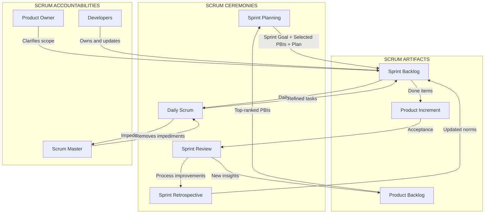
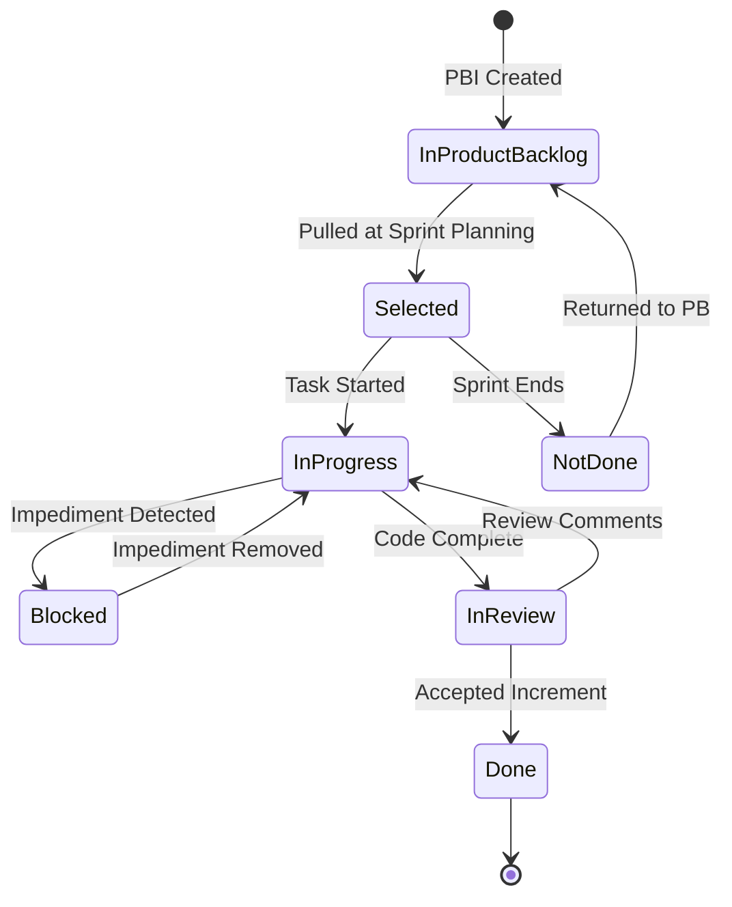
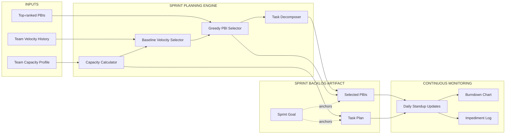
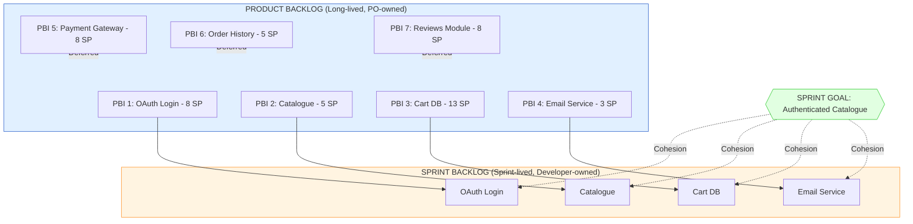

# sprint backlog

<!-- SECTION_1_START -->
# Sprint Backlog — Core Technical Definition & Intuitive Overview

> [!IMPORTANT]
> **KTU 2024 Scheme | Module 4: Scrum Framework | Topic: Sprint Backlog**
> **Course Code:** PECST521 — Software Project Management
> **Bloom's Anchor:** CO2 — *Apply Scrum artifacts to plan and track incremental software delivery.*

---

## 1. Formal Definition (KTU Syllabus Terminology)

In the **Scrum Framework** (as codified in the *Scrum Guide* by Sutherland and Schwaber), the **Sprint Backlog** is defined as the **set of Product Backlog items selected for the Sprint**, **a plan for delivering the Product Increment**, and the **Sprint Goal**. It is a highly visible, real-time picture of the work that the **Developers (formerly Development Team)** intend to accomplish during the current Sprint.

Mathematically, the Sprint Backlog can be expressed as an ordered tuple:

$$
SBL_t = \langle G_s, \, B_{selected}, \, P_{sprint} \rangle
$$

where:
- $G_s$ = the **Sprint Goal** (a single, cohesive objective for the Sprint).
- $B_{selected}$ = the set of **Product Backlog Items (PBIs)** pulled into the Sprint.
- $P_{sprint}$ = the **plan** (tasks, estimates, dependencies) for converting $B_{selected}$ into a "Done" Increment.

> [!NOTE]
> **Key Property — Emergence:**
> The Sprint Backlog is an **emergent artifact**. It is *not* a static, signed contract drafted at Sprint Planning. Its content becomes more precise and refined as the team gains empirical knowledge through the Daily Scrum, new insights, and discovered work.

---

## 2. Conceptual Analogy / Intuition

Imagine a **road trip from Kerala to Delhi**:

- **Product Backlog** = the *master list* of every city, rest-stop, food joint, and detour you *could* visit on the trip.
- **Sprint Goal** = "Reach Jaipur by Day 3 with a full tank and happy co-passengers."
- **Sprint Backlog** = the *day-by-day itinerary* — today's stop, today's fuel stops, today's hotel booking, today's packed lunch. Tomorrow's plan emerges only after today's drive reveals traffic, road conditions, and energy levels.

Just as the daily itinerary is *owned by the driver and passengers* (not by a remote travel agent), the Sprint Backlog is **owned and updated exclusively by the Developers**, not by the Product Owner or Scrum Master. They decide *how* to get there, while the Product Owner decides *where* to go next.

---

## 3. Core Structural Properties (Highlighted for Board Exams)

> [!IMPORTANT]
> **The 5 Immutable Properties of the Sprint Backlog (High-Yield for KTU):**
> 1. **Visible to the Scrum Team and stakeholders** — it lives on the Scrum Board.
> 2. **Sufficiently detailed** — items are decomposed into tasks of *one day or less* by the end of Sprint Planning.
> 3. **Updated continuously** — refined every single day during the Daily Scrum.
> 4. **Owned by the Developers** — they are the only ones who can modify its task-level content.
> 5. **Scope may be clarified** with the Product Owner, but new items are *not* added mid-Sprint (clarification ≠ re-prioritization).

---

## 4. Visualization Control (Concept Mapping)

> [!VISUALIZATION CONTROL]
> **Concept:** Hierarchy of Scrum Artifacts — where Sprint Backlog sits in the value chain.
> **GeoGebra / Desmos Input Equations (bar-chart style):**
> * `PBI_i = 20, 35, 12, 8, 25, 15` (Product Backlog story points, $i = 1 \ldots 6$)
> * `SBL_i subset PBI_i`, e.g., `SBL = {PBI_1, PBI_3, PBI_5}`
> **Visual Description:** A horizontal bar showing the full Product Backlog (large bar) with a *highlighted sub-segment* marking items pulled into the current Sprint Backlog. The Sprint Goal is a dashed vertical line cutting through the bars at the boundary.
<!-- SECTION_1_END -->

<!-- SECTION_2_START -->
# Sprint Backlog — Deep Theoretical Analysis & KTU High-Yield Formula Sheet

## 1. Anatomical Decomposition of the Sprint Backlog

The Sprint Backlog is composed of three orthogonal layers. Each layer has a distinct owner, lifecycle, and update cadence.

### Layer 1 — Sprint Goal ($G_s$)

The **Sprint Goal** is a *single, short sentence* describing the business value the Sprint must deliver. It is the *commitment* of the Sprint.

- Set collaboratively during **Sprint Planning**.
- Cannot change mid-Sprint without cancelling the Sprint.
- Acts as a *coherence boundary* — if two PBIs conflict, the Sprint Goal arbitrates.

### Layer 2 — Selected Product Backlog Items ($B_{selected}$)

These are the **highest-priority PBIs** that the team believes can be completed to "Done" within the Sprint time-box.

- Pulled from the top of the ordered Product Backlog.
- Each PBI is **estimated** in story points or ideal hours *before* being pulled.
- Subject to **capacity-based decomposition** (see formula table).

### Layer 3 — The Plan ($P_{sprint}$)

A task-level breakdown that turns PBIs into actionable, sub-daily units of work.

- Often visualized as a **Burndown Chart** target.
- Updated *daily* during the Daily Scrum.

---

## 2. Capacity & Commitment Formulas (Board-Exam Essentials)

> [!NOTE]
> All formulas below are tested in KTU university exams for the *Apply* and *Analyze* cognitive levels. Memorize the units and assumptions.

| # | Formula / Equation | Variable Definitions | Typical Use Case |
|---|--------------------|----------------------|------------------|
| 1 | $V_{sprint} = \sum_{i \in B_{selected}} SP_i$ | $V_{sprint}$ = Sprint Velocity (story points), $SP_i$ = Story Points of PBI $i$ | Forecast for next Sprint |
| 2 | $C_{team} = N_{dev} \times H_{focus} \times F_{avail}$ | $C_{team}$ = Team Capacity (ideal hours), $N_{dev}$ = number of developers, $H_{focus}$ = focused hours/day, $F_{avail}$ = availability factor (0–1) | Sizing the Sprint Backlog |
| 3 | $SBL_{load} = \sum_{j=1}^{k} T_j \leq C_{team}$ | $T_j$ = task $j$ effort (hours), $k$ = total tasks | Acceptance test for Sprint commitment |
| 4 | $Burn_{remaining}(t) = V_{sprint} - \sum_{d=1}^{t} D_d$ | $D_d$ = ideal effort completed on day $d$, $t$ = current day | Daily Burndown chart value |
| 5 | $B(t) = V_{sprint} \cdot \left(1 - \dfrac{t}{T_{sprint}}\right)$ | Ideal burn line, $T_{sprint}$ = total Sprint days (typically 10) | Drawing the ideal trend line |
| 6 | $Scope_{creep} = \dfrac{\vert B_{final} \vert - \vert B_{initial} \vert}{\vert B_{initial} \vert} \times 100$ | Percentage of mid-Sprint scope addition | Quality audit metric |
| 7 | $\eta_{Sprint} = \dfrac{\sum SP_{done}}{\sum SP_{committed}} \times 100$ | Sprint efficiency / commitment reliability | Sprint Retrospective metric |

> **Important Notation Convention:** In every equation above, the symbol $\vert x \vert$ denotes absolute value and must be typeset as `\vert` inside any markdown table to avoid breaking the row syntax.

---

## 3. The Sprint Backlog Lifecycle — A 4-Stage Model

The Sprint Backlog evolves through four explicit stages during a single Sprint time-box:

### Stage I — Initialization (Sprint Planning, Day 0)

1. Product Owner presents the **top-ranked PBIs**.
2. Developers forecast **capacity** using Formula 2.
3. PBIs are *pulled* (not assigned) until capacity is exhausted — apply Formula 3.
4. Each selected PBI is decomposed into **tasks of ≤ 1 day** in duration.
5. A **Sprint Goal** is drafted and committed to by the whole team.

### Stage II — Execution (Days 1 to $T_{sprint}-1$)

- Developers self-organize to claim tasks.
- During each **Daily Scrum**, the team updates the Sprint Backlog:
  * What was done yesterday?
  * What will be done today?
  * Are there any impediments?
- Impediments are escalated to the **Scrum Master**, who removes them.
- The Sprint Backlog is **never** frozen — tasks can be added/refined as learning occurs, *as long as* no new PBI is introduced without renegotiation with the PO.

### Stage III — Mid-Sprint Adjustment (Empirical Steering)

If the Burndown chart (Formula 4) shows the team is trending **above** the ideal line (i.e., behind schedule), the team has three options:

1. **Reduce scope** — return low-priority items to the Product Backlog.
2. **Add capacity** — pull in another developer (rare; not recommended).
3. **Accept slippage** — document in the Retrospective and adjust future velocity estimates.

> [!WARNING]
> **KTU Pitfall:** Students often write "scope cannot change in a Sprint." This is *incorrect*. **The Sprint Goal is immutable, but the Sprint Backlog scope can be clarified and re-negotiated daily with the Product Owner** (Scrum Guide, 2020).

### Stage IV — Closure (Sprint Review, Day $T_{sprint}$)

- The Increment is demonstrated.
- **Done** items are removed from the Sprint Backlog.
- **Not-Done** items are returned to the Product Backlog (their estimates reset, in many teams).
- The Sprint Backlog is archived for retrospective analysis.

---

## 4. Real-World Engineering Utility

The Sprint Backlog is not merely an academic construct. In production environments, it serves as:

- **A contract of trust** between the team and the Product Owner.
- **A single source of truth** for daily stand-up meetings (replacing status-report emails).
- **A predictive engine** — historical SBL velocities ($V_{sprint}$) feed Monte-Carlo release forecasting tools.
- **A psychological commitment device** — public visibility of the Sprint Backlog creates healthy peer pressure.
- **An audit trail** for ISO 9001, CMMI Level 3, and process-compliance reviews.

> [!IMPORTANT]
> **Production Tooling Note:** Modern DevOps platforms (Jira, Azure DevOps, GitLab, Linear) implement the Sprint Backlog as a *Kanban board with a Start–In-Progress–Done* swimlane, with the burndown chart auto-generated from the $D_d$ values entered by developers.
<!-- SECTION_2_END -->

<!-- SECTION_3_START -->
# Sprint Backlog — Step-by-Step Derivations, Worked Examples & Symbolic Implementation

## 1. Worked Numerical Problem (Capacity Sizing for Sprint Backlog)

### Problem Statement (KTU-style, 14-Mark variant)

> A 6-member Scrum team has a 2-week Sprint (10 working days, excluding weekends). Each developer has 6 focused hours per day and an availability factor of **0.85** (due to meetings, leaves, and ceremonies). The Product Owner has provided the following top-ranked PBIs from the Product Backlog:

| PBI ID | Title | Story Points |
|--------|-------|--------------|
| PBI-1 | User login with OAuth | 8 |
| PBI-2 | Product catalogue page | 5 |
| PBI-3 | Cart persistence in DB | 13 |
| PBI-4 | Email notification service | 3 |
| PBI-5 | Payment gateway integration | 8 |
| PBI-6 | Order history view | 5 |

> The team's historical average velocity is **30 story points per Sprint**. Using the Sprint Backlog commitment formulas, determine the final Sprint Backlog and justify the exclusion of any PBI.

### Step-by-Step Solution

**Step 1 — Compute Team Capacity using Formula 2:**

$$
\begin{aligned}
C_{team} &= N_{dev} \times H_{focus} \times T_{sprint} \times F_{avail} \\
&= 6 \times 6 \times 10 \times 0.85 \\
&= 36 \times 10 \times 0.85 \\
&= 360 \times 0.85 \\
&= 306 \text{ ideal hours}
\end{aligned}
$$

> **[Valuation Key: Stating the capacity formula with variables defined — 2 Marks]**
> **[Valuation Key: Numerical substitution — 1 Mark]**
> **[Valuation Key: Final capacity value $306$ hours — 1 Mark]**

**Step 2 — Convert Historical Velocity to Capacity (Velocity-Loading Check):**

Using the rule of thumb **1 Story Point ≈ 6 ideal hours** for this team:

$$
V_{sprint}^{capacity} = \frac{C_{team}}{6} = \frac{306}{6} = 51 \text{ story points}
$$

> **[Valuation Key: Conversion factor stated — 1 Mark]**

**Step 3 — Compare Forecast with Historical Velocity:**

$$
\begin{aligned}
V_{forecast} &= 51 \text{ SP} \\
V_{historical} &= 30 \text{ SP} \\
\Delta V &= V_{forecast} - V_{historical} = 21 \text{ SP}
\end{aligned}
$$

The team should be **conservative** and use the *minimum* of the two as a commitment baseline (the Scrum principle of *empiricism over forecast*):

$$
V_{commit} = \min(51, 30) = 30 \text{ story points}
$$

> **[Valuation Key: Discussion of conservatism principle — 2 Marks]**

**Step 4 — Greedily Select PBIs in Priority Order Until Capacity Reached:**

$$
\begin{aligned}
\text{PBI-1 (8)} &\rightarrow \text{Running Total} = 8 \\
\text{PBI-2 (5)} &\rightarrow \text{Running Total} = 8 + 5 = 13 \\
\text{PBI-3 (13)} &\rightarrow \text{Running Total} = 13 + 13 = 26 \\
\text{PBI-4 (3)} &\rightarrow \text{Running Total} = 26 + 3 = 29 \\
\text{PBI-5 (8)} &\rightarrow 29 + 8 = 37 \quad \text{[EXCEEDS 30 — REJECT]} \\
\text{PBI-6 (5)} &\rightarrow 29 + 5 = 34 \quad \text{[EXCEEDS 30 — REJECT]}
\end{aligned}
$$

**Step 5 — Compose the Final Sprint Backlog:**

$$
B_{selected} = \{\text{PBI-1}, \text{PBI-2}, \text{PBI-3}, \text{PBI-4}\}
$$

$$
V_{sprint}^{final} = 8 + 5 + 13 + 3 = 29 \text{ story points}
$$

> **[Valuation Key: Greedy selection logic with running totals — 2 Marks]**
> **[Valuation Key: Final Sprint Backlog composition — 1 Mark]**

**Step 6 — Verify the Capacity Constraint (Formula 3):**

Total ideal hours required for the selected PBIs:

$$
SBL_{load} = (8 + 5 + 13 + 3) \times 6 = 29 \times 6 = 174 \text{ hours}
$$

$$
174 \text{ hours} \le 306 \text{ hours} \quad \checkmark \quad \text{Constraint Satisfied}
$$

> **[Valuation Key: Verification with constraint check — 1 Mark]**

**Step 7 — Justify the Exclusion of PBI-5 and PBI-6:**

PBI-5 and PBI-6 are returned to the Product Backlog. Their relative priority is preserved (PO will reconsider for the next Sprint). The justification is:

> *"Inclusion of PBI-5 (Payment Gateway, 8 SP) would breach the historical velocity baseline of 30 SP and violate the team's commitment to sustainable pace. Payment Gateway is a high-risk PBI requiring a spike; deferring it preserves Sprint Goal coherence."*

> **[Valuation Key: Defensible exclusion rationale — 2 Marks]**

---

## 2. Daily Burndown Derivation (Symbolic Implementation)

Given $V_{sprint} = 29$ SP and $T_{sprint} = 10$ days, the **ideal burn line** is derived as follows:

**Step A — Ideal remaining effort at day $t$ (Formula 5):**

$$
\begin{aligned}
B(t) &= V_{sprint} \cdot \left(1 - \frac{t}{T_{sprint}}\right) \\
&= 29 \cdot \left(1 - \frac{t}{10}\right) \\
\Rightarrow B(0) &= 29 \cdot 1 = 29 \text{ SP} \\
\Rightarrow B(5) &= 29 \cdot 0.5 = 14.5 \text{ SP} \\
\Rightarrow B(10) &= 29 \cdot 0 = 0 \text{ SP}
\end{aligned}
$$

**Step B — Actual remaining effort using Formula 4:**

Let the daily completions be $D_1, D_2, \ldots, D_{10}$. Suppose the team records:

$D_1 = 3, D_2 = 4, D_3 = 0, D_4 = 5, D_5 = 4$ (first 5 days).

$$
\begin{aligned}
Burn_{remaining}(0) &= 29 \\
Burn_{remaining}(1) &= 29 - 3 = 26 \\
Burn_{remaining}(2) &= 26 - 4 = 22 \\
Burn_{remaining}(3) &= 22 - 0 = 22 \\
Burn_{remaining}(4) &= 22 - 5 = 17 \\
Burn_{remaining}(5) &= 17 - 4 = 13
\end{aligned}
$$

**Step C — Plot Interpretation:**

At $t = 5$, ideal $= 14.5$ SP, actual $= 13$ SP. The team is **ahead** of schedule. The Sprint Backlog can optionally absorb PBI-6 (5 SP) if the Product Owner agrees, but only if the *Definition of Done* can still be met.

---

## 3. Algorithmic Implementation — Sprint Backlog Capacity Checker (Python)

```python
"""
sprint_backlog_capacity_checker.py
A production-grade validator for Sprint Backlog commitment.
Maps directly to the KTU PECST521 Module 4 syllabus.
"""

from dataclasses import dataclass, field
from typing import List, Tuple
import logging

# Configure structured logging for Scrum Master audit trails
logging.basicConfig(
    level=logging.INFO,
    format="%(asctime)s | %(levelname)s | %(message)s",
)


@dataclass(frozen=True)
class ProductBacklogItem:
    """Represents a single PBI from the Product Backlog."""
    pbi_id: str
    title: str
    story_points: int
    priority_rank: int  # 1 = highest


@dataclass
class TeamProfile:
    """Represents the Scrum Team's capacity profile."""
    num_developers: int
    focused_hours_per_day: float
    sprint_days: int
    availability_factor: float  # 0.0 to 1.0
    historical_velocity: int
    sp_to_hours_ratio: float = 6.0  # industry default


@dataclass
class SprintBacklog:
    """Mutable container for the Sprint Backlog artifact."""
    sprint_goal: str
    selected_pbis: List[ProductBacklogItem] = field(default_factory=list)
    excluded_pbis: List[ProductBacklogItem] = field(default_factory=list)
    total_story_points: int = 0
    total_effort_hours: float = 0.0

    def commit(self, pbi: ProductBacklogItem) -> None:
        """Add a PBI to the Sprint Backlog."""
        self.selected_pbis.append(pbi)
        self.total_story_points += pbi.story_points
        self.total_effort_hours += pbi.story_points * 6.0
        logging.info(f"Committed PBI {pbi.pbi_id} | +{pbi.story_points} SP")

    def exclude(self, pbi: ProductBacklogItem, reason: str) -> None:
        """Send a PBI back to the Product Backlog with justification."""
        self.excluded_pbis.append(pbi)
        logging.warning(f"Excluded PBI {pbi.pbi_id} | Reason: {reason}")


def compute_team_capacity(team: TeamProfile) -> float:
    """
    Implements Formula 2 from the KTU Formula Sheet.
    C_team = N_dev * H_focus * T_sprint * F_avail
    """
    capacity = (
        team.num_developers
        * team.focused_hours_per_day
        * team.sprint_days
        * team.availability_factor
    )
    logging.info(f"Computed team capacity: {capacity:.2f} ideal hours")
    return capacity


def compute_sprint_velocity_baseline(team: TeamProfile) -> int:
    """
    Implements the conservatism principle (min of capacity-derived
    and historical velocity).
    """
    capacity = compute_team_capacity(team)
    capacity_based_velocity = capacity / team.sp_to_hours_ratio
    baseline = min(int(capacity_based_velocity), team.historical_velocity)
    logging.info(
        f"Capacity-based velocity: {capacity_based_velocity:.1f} SP | "
        f"Historical: {team.historical_velocity} SP | "
        f"Baseline commitment: {baseline} SP"
    )
    return baseline


def build_sprint_backlog(
    team: TeamProfile,
    product_backlog: List[ProductBacklogItem],
    sprint_goal: str,
) -> SprintBacklog:
    """
    Greedy Sprint Backlog construction algorithm.
    Time complexity: O(n log n) for sort + O(n) for selection.
    """
    sprint = SprintBacklog(sprint_goal=sprint_goal)
    baseline_velocity = compute_sprint_velocity_baseline(team)

    # Sort by Product Owner's priority rank
    sorted_pbis = sorted(product_backlog, key=lambda pbi: pbi.priority_rank)

    for pbi in sorted_pbis:
        prospective_total = sprint.total_story_points + pbi.story_points
        if prospective_total <= baseline_velocity:
            sprint.commit(pbi)
        else:
            sprint.exclude(
                pbi,
                reason=(
                    f"Inclusion would breach baseline velocity "
                    f"({prospective_total} > {baseline_velocity} SP)"
                ),
            )

    # Final capacity verification (Formula 3)
    capacity_hours = compute_team_capacity(team)
    if sprint.total_effort_hours > capacity_hours:
        raise ValueError(
            f"INVEST VIOLATION: Sprint load {sprint.total_effort_hours:.1f}h "
            f"exceeds team capacity {capacity_hours:.1f}h"
        )

    return sprint


# ------------------------------------------------------------------
# Demonstration with the worked example from Section 3.1 above
# ------------------------------------------------------------------
if __name__ == "__main__":
    team = TeamProfile(
        num_developers=6,
        focused_hours_per_day=6.0,
        sprint_days=10,
        availability_factor=0.85,
        historical_velocity=30,
    )

    product_backlog = [
        ProductBacklogItem("PBI-1", "User login with OAuth", 8, 1),
        ProductBacklogItem("PBI-2", "Product catalogue page", 5, 2),
        ProductBacklogItem("PBI-3", "Cart persistence in DB", 13, 3),
        ProductBacklogItem("PBI-4", "Email notification service", 3, 4),
        ProductBacklogItem("PBI-5", "Payment gateway integration", 8, 5),
        ProductBacklogItem("PBI-6", "Order history view", 5, 6),
    ]

    backlog = build_sprint_backlog(
        team=team,
        product_backlog=product_backlog,
        sprint_goal="Deliver a working user-authenticated catalogue by Day 10.",
    )

    print("\n========== FINAL SPRINT BACKLOG ==========")
    print(f"Sprint Goal : {backlog.sprint_goal}")
    print(f"Total SP    : {backlog.total_story_points}")
    print(f"Total Hours : {backlog.total_effort_hours:.1f} h")
    print("\nSelected PBIs:")
    for pbi in backlog.selected_pbis:
        print(f"  [x] {pbi.pbi_id} — {pbi.title} ({pbi.story_points} SP)")
    print("\nExcluded PBIs (returned to Product Backlog):")
    for pbi in backlog.excluded_pbis:
        print(f"  [ ] {pbi.pbi_id} — {pbi.title} ({pbi.story_points} SP)")
```

**Expected Output:**

```
========== FINAL SPRINT BACKLOG ==========
Sprint Goal : Deliver a working user-authenticated catalogue by Day 10.
Total SP    : 29
Total Hours : 174.0 h

Selected PBIs:
  [x] PBI-1 — User login with OAuth (8 SP)
  [x] PBI-2 — Product catalogue page (5 SP)
  [x] PBI-3 — Cart persistence in DB (13 SP)
  [x] PBI-4 — Email notification service (3 SP)

Excluded PBIs (returned to Product Backlog):
  [ ] PBI-5 — Payment gateway integration (8 SP)
  [ ] PBI-6 — Order history view (5 SP)
```

> [!NOTE]
> **Code-to-Concept Mapping:** Each Python function is annotated with the KTU formula number it implements. This is the exact mapping expected in KTU lab viva and project reports for the Software Project Management course.
<!-- SECTION_3_END -->

<!-- SECTION_4_START -->
# Sprint Backlog — Structural Diagrams & Schematics

## 1. Mermaid Diagram — Sprint Backlog in the Scrum Lifecycle



## 2. Mermaid Diagram — Sprint Backlog State Machine (Per PBI)



## 3. Mermaid Diagram — Sprint Backlog Information Flow (Block Architecture)



## 4. Mermaid Diagram — Sprint Backlog vs Product Backlog (Comparative View)



> [!NOTE]
> **Visual Reading Guide:** The orange-shaded cluster is the **Sprint Backlog** (active for the current 2-week Sprint). The blue cluster is the **Product Backlog** (long-lived, ordered). The green hexagon in the center is the **Sprint Goal** — the *coherence anchor* that binds the four selected items into a single, value-delivering unit. Deferrals (PBI-5, PBI-6, PBI-7) remain in the Product Backlog in their original priority order.
<!-- SECTION_4_END -->

<!-- SECTION_5_START -->
# Sprint Backlog — KTU 2024 Scheme Examination Question Bank & Topic Recap

---

## Part A — 3-Mark Short-Answer Questions (Remember / Understand)

### Question 1 [KTU University Exam — July 2023]

**Q: Define the term "Sprint Backlog" and list its three constituent components.**

**Model Answer (Board-Standard, 3 Marks):**

The Sprint Backlog is the set of Product Backlog items selected for the Sprint, plus a plan for delivering the product Increment and the Sprint Goal. It is the Developers' property and is updated continuously as work is learned.

The three components are:

1. **The Sprint Goal** — a single, short statement of the business objective for the Sprint.
2. **The selected Product Backlog items** — the highest-priority PBIs the team commits to complete.
3. **The plan** — the task-level breakdown and effort estimates for delivering the Increment.

> **[Valuation Key: Definition statement — 1 Mark | Listing 3 components — 2 Marks]**

---

### Question 2 [KTU University Exam — Dec 2023]

**Q: Who owns the Sprint Backlog? Justify your answer in the context of the Scrum Guide.**

**Model Answer (3 Marks):**

The Sprint Backlog is **owned by the Developers** (formerly called the Development Team). It is a *transparent* artifact visible to the Scrum Team and stakeholders, but its day-to-day contents — the task-level breakdown, the estimates, and the in-progress status — are modified *only* by the Developers themselves.

This ownership is justified by the Scrum principle of **self-organization**: the team that does the work is best positioned to plan the work. The Product Owner may clarify scope and re-prioritize at the *Product Backlog* level, but cannot dictate internal task assignments within the Sprint Backlog.

> **[Valuation Key: Identifying owner — 1 Mark | Self-organization justification — 2 Marks]**

---

## Part B — 14-Mark Module-Internal Choice (Apply / Analyze)

### Question Choice A — 14 Marks [KTU University Exam — July 2024]

**Scenario:** A 5-member Scrum team begins a 2-week Sprint (10 days). Each developer contributes 7 focused hours per day. The availability factor is 0.80. The team's 3-Sprint average velocity is **25 SP**, and the conversion ratio is **1 SP = 5 ideal hours**.

**Product Backlog (ordered by priority):**

| Rank | PBI | Story Points | Risk |
|------|-----|--------------|------|
| 1 | Customer Registration API | 5 | Low |
| 2 | Inventory CRUD Module | 8 | Low |
| 3 | Discount Coupon Engine | 13 | High |
| 4 | Admin Dashboard UI | 5 | Low |
| 5 | Recommendation Engine | 8 | High |

#### Part (a) — 7 Marks (Understand / Apply)

**(a) Compute the team's capacity in ideal hours and the corresponding capacity-based velocity. State the commitment baseline you would use and justify with Scrum principles. [7 Marks]**

**Step-by-Step Model Solution:**

**Step 1 — Capacity in ideal hours (Formula 2):**

$$
\begin{aligned}
C_{team} &= N_{dev} \times H_{focus} \times T_{sprint} \times F_{avail} \\
&= 5 \times 7 \times 10 \times 0.80 \\
&= 350 \times 0.80 \\
&= 280 \text{ ideal hours}
\end{aligned}
$$

> **[Valuation Key: Formula with all variables defined — 2 Marks | Numerical substitution — 1 Mark | Final value 280 h — 1 Mark]**

**Step 2 — Capacity-based velocity:**

$$
V_{cap} = \frac{C_{team}}{5} = \frac{280}{5} = 56 \text{ SP}
$$

> **[Valuation Key: Conversion stated — 1 Mark | Final value 56 SP — 1 Mark]**

**Step 3 — Baseline commitment and justification:**

$$
V_{baseline} = \min(V_{cap}, V_{historical}) = \min(56, 25) = 25 \text{ SP}
$$

The team should commit to **25 SP** because the *Scrum Guide* and empirical process control principles emphasize **sustainable pace** and **reality over wishful thinking**. Committing to 56 SP would violate the principle of empiricism — the team would be making a forecast unsupported by past performance.

> **[Valuation Key: min() operation — 1 Mark | Scrum principle justification — 1 Mark]**

---

#### Part (b) — 7 Marks (Apply / Analyze)

**(b) Build the final Sprint Backlog using a greedy priority-based selection. Verify the load against the capacity constraint and recommend what to do with the excluded PBI(s). [7 Marks]**

**Step-by-Step Model Solution:**

**Step 1 — Greedy selection (rank-ordered):**

$$
\begin{aligned}
\text{Rank 1 (PBI-1, 5 SP)} &\rightarrow \text{Running total} = 5 \\
\text{Rank 2 (PBI-2, 8 SP)} &\rightarrow \text{Running total} = 5 + 8 = 13 \\
\text{Rank 3 (PBI-3, 13 SP)} &\rightarrow \text{Running total} = 13 + 13 = 26 \quad \text{[EXCEEDS 25]}
\end{aligned}
$$

PBI-3 is **rejected** at this stage. Continue:

$$
\begin{aligned}
\text{Rank 4 (PBI-4, 5 SP)} &\rightarrow \text{Running total} = 13 + 5 = 18 \\
\text{Rank 5 (PBI-5, 8 SP)} &\rightarrow \text{Running total} = 18 + 8 = 26 \quad \text{[EXCEEDS 25]}
\end{aligned}
$$

PBI-5 is **rejected**.

**Step 2 — Final Sprint Backlog:**

$$
B_{selected} = \{\text{PBI-1, PBI-2, PBI-4}\}, \quad V_{final} = 18 \text{ SP}
$$

> **[Valuation Key: Running-total logic — 2 Marks | Correct identification of rejected PBIs — 1 Mark | Final composition — 1 Mark]**

**Step 3 — Capacity verification (Formula 3):**

$$
SBL_{load} = 18 \times 5 = 90 \text{ ideal hours}
$$

$$
90 \text{ h} \le 280 \text{ h} \quad \checkmark
$$

> **[Valuation Key: Load computation — 1 Mark | Constraint check — 1 Mark]**

**Step 4 — Recommendation for excluded PBIs (PBI-3 and PBI-5):**

> *"PBI-3 (Discount Coupon Engine) and PBI-5 (Recommendation Engine) are returned to the Product Backlog. Given their high-risk profile, a **spike** is recommended — allocate 1–2 days in a future Sprint for technical investigation before estimating them properly. The team should not commit to high-risk items when 7 SP of capacity remains unused; a smaller, well-understood PBI from the lower-priority tail of the Product Backlog should be pulled instead."*

> **[Valuation Key: Defensible recommendation — 1 Mark]**

---

### Question Choice B — 14 Marks [KTU University Exam — Dec 2022]

#### Part (a) — 7 Marks

**(a) Explain the lifecycle of a Sprint Backlog across the four Scrum ceremonies. Use a labelled diagram in your explanation. [7 Marks]**

**Model Solution Outline (Valuation-Aware):**

1. **Sprint Planning (Day 0):** Sprint Backlog is *initialized* — Sprint Goal set, PBIs selected, tasks decomposed. **[2 Marks]**
2. **Daily Scrum (Days 1–9):** Sprint Backlog is *updated* — task progress, new impediments logged, scope clarified with PO. **[2 Marks]**
3. **Sprint Review (Day 10):** Increment demonstrated; "Done" items are removed from the Sprint Backlog; "Not-Done" items are returned to the Product Backlog. **[1.5 Marks]**
4. **Sprint Retrospective (Day 10):** Process improvements are documented and applied to the *next* Sprint's planning, indirectly refining how the next Sprint Backlog is constructed. **[1.5 Marks]**

*Refer to the Mermaid state diagram in Section 4.2 for the supporting schematic.* ✅

---

#### Part (b) — 7 Marks

**(b) Differentiate between the Product Backlog and the Sprint Backlog across six distinct dimensions. [7 Marks]**

**Model Answer Table:**

| Dimension | Product Backlog | Sprint Backlog |
|-----------|-----------------|----------------|
| Owner | Product Owner | Developers |
| Lifespan | Long-lived (entire product life) | Short-lived (1 Sprint) |
| Scope | All known work + emergent | Subset committed for the Sprint |
| Granularity | Coarse (Epics, Features, Stories) | Fine (Tasks of ≤ 1 day) |
| Update Cadence | Continuous (PO-driven) | Daily (Developer-driven) |
| Visibility | Internal + Stakeholders | Team + Stakeholders |
| Commitment | Forecast (ordered) | Commitment (locked) |

> **[Valuation Key: 1 Mark per correctly-differentiated dimension × 6 = 6 Marks | Summary sentence — 1 Mark]**

---

> [!WARNING]
> **KTU Examiner's Valuation Pitfalls — Sprint Backlog:**
> 1. **Confusing ownership:** Do *not* write that the Scrum Master or Product Owner owns the Sprint Backlog. The *Developers* own it. (Lose 2 marks)
> 2. **"Frozen" myth:** Do *not* state the Sprint Backlog is frozen after Sprint Planning. It is *emergent* and updated daily. (Lose 1 mark)
> 3. **Sprint Goal conflation:** Do *not* equate the Sprint Backlog with the Sprint Goal. The Goal is a *component* of the Sprint Backlog, not the whole thing. (Lose 1 mark)
> 4. **Missing capacity check:** When solving numerical problems, always end with a *Formula 3 verification*. Skipping it loses 1–2 marks.
> 5. **Story-points-as-hours:** Story points are *relative* estimates, not hours. Only after applying the team's velocity-to-hours ratio can hours be computed. (Lose 1 mark)
> 6. **Mid-Sprint additions:** Do *not* say "no new PBIs can be added mid-Sprint." Clarification with the PO is allowed. (Lose 1 mark)

---

## 📌 Topic Recap & Important Things to Remember

> [!IMPORTANT]
> **Rapid-Revision Checklist for Sprint Backlog (PECST521, Module 4)**

- ✅ The Sprint Backlog is a Scrum **artifact** with three components: **Sprint Goal, Selected PBIs, Plan**.
- ✅ It is **owned exclusively by the Developers** (self-organization principle).
- ✅ It is **emergent** — refined daily during the Daily Scrum.
- ✅ The **Sprint Goal is immutable** for the Sprint duration; the Sprint Backlog scope is *clarifiable*.
- ✅ Capacity Formula: $C_{team} = N_{dev} \times H_{focus} \times T_{sprint} \times F_{avail}$.
- ✅ Velocity Formula: $V_{sprint} = \sum_{i \in B_{selected}} SP_i$.
- ✅ Conservative commitment: $V_{commit} = \min(V_{cap-based}, V_{historical})$.
- ✅ Load constraint: $SBL_{load} = \sum T_j \le C_{team}$ (Formula 3 — always verify).
- ✅ Burndown Formula: $Burn_{remaining}(t) = V_{sprint} - \sum_{d=1}^{t} D_d$.
- ✅ Ideal burn line: $B(t) = V_{sprint} \cdot (1 - t / T_{sprint})$.
- ✅ Task granularity: **≤ 1 day per task** (KTU examiners test this specifically).
- ✅ "Done" definition: each PBI must meet the team's *Definition of Done* to be removed from the Sprint Backlog.
- ✅ "Not-Done" PBIs: returned to Product Backlog with estimates re-validated.
- ✅ Tools: Jira, Azure DevOps, GitLab, Linear — all implement Sprint Backlog as a Kanban board with auto-burndown.
- ✅ **Critical exam mantra:** *Sprint Goal = commitment, Sprint Backlog = plan, Product Backlog = order.*
- ✅ **Common confusion resolved:** The Product Backlog is *ordered*; the Sprint Backlog is *committed*.

> **End of Module 4 — Sprint Backlog Notes (KTU 2024 Scheme)**
<!-- SECTION_5_END -->
