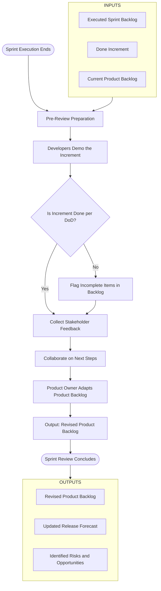
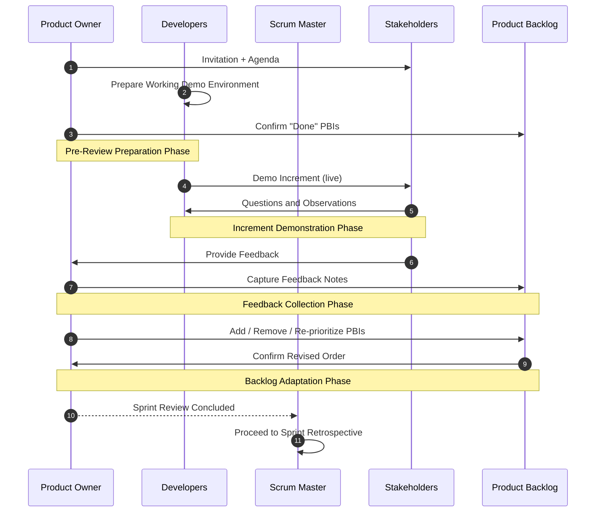
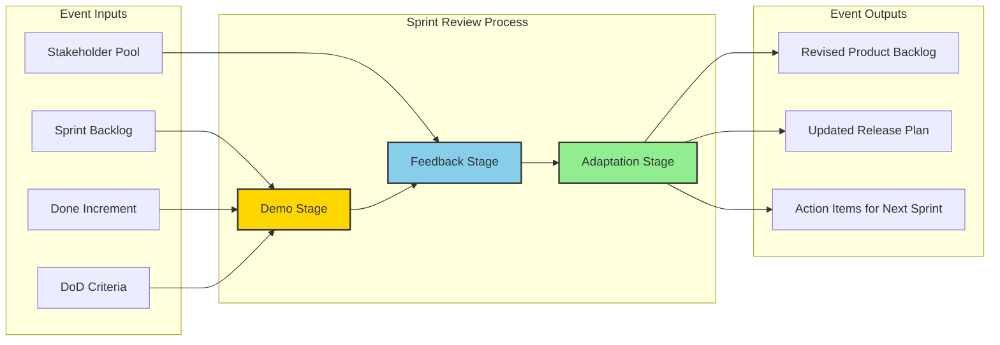
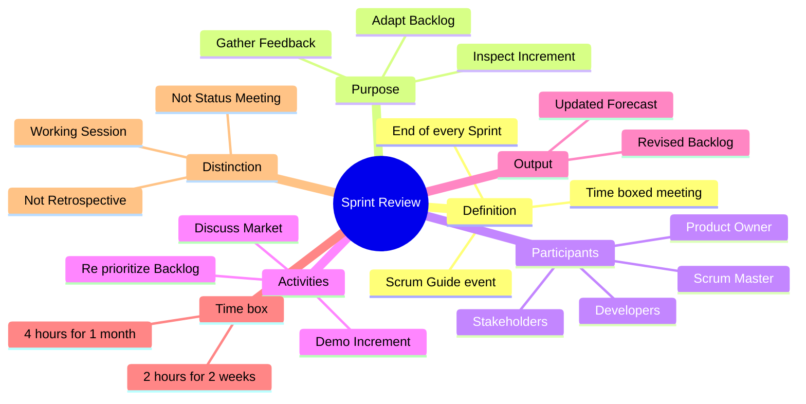

# sprint review

<!-- SECTION_1_START -->
# Sprint Review — Core Technical Definition & Intuitive Overview

## 1.1 Formal KTU 2024 Definition

> [!IMPORTANT]
> **Sprint Review** (also called *Scrum Review* or *Iteration Review*) is a **time-boxed working meeting** held at the end of every Sprint by the **Scrum Team** to **inspect the Increment** produced during the Sprint and **adapt the Product Backlog** based on stakeholder feedback. It is one of the five formal events of the Scrum Framework as defined in the **Scrum Guide (Nov 2020)**.

According to the KTU 2024 Scheme syllabus for *PECST521 — Software Project Management*, the Sprint Review is classified as a **Scrum Event** that supports the empirical process control pillars of **Transparency** and **Inspection**, leading to **Adaptation**.

| Attribute | Specification |
| :--- | :--- |
| **Time-box (Standard)** | **Maximum 4 hours for a 1-month Sprint** |
| **Time-box Proportionality** | For shorter Sprints, the event is usually shorter (e.g., **2 hours for a 2-week Sprint**) |
| **Frequency** | **Once per Sprint**, at the end of the Sprint |
| **Mandatory Participants** | Scrum Team + **Scrum Master** + **Product Owner** + **Developers** + **Key Stakeholders** |
| **Optional Participants** | Customers, end-users, executives, vendors, other Scrum Teams |
| **Facilitator** | The **Product Owner** (not the Scrum Master) |
| **Output Artifact** | **Revised Product Backlog** (re-prioritized) |

## 1.2 Conceptual Analogy / Intuition

> [!NOTE]
> **The Restaurant Analogy 🍽️**
> Imagine a chef (Scrum Team) who cooks a new dish every two weeks. At the end of the second week, the chef doesn't just lock the kitchen door — instead, the chef **brings the dish to the dining table** where customers (Stakeholders) taste it. The customers say: *"Too salty"*, *"More crunch please"*, *"I love the sauce, can we add a starter before this?"*. The chef then revises the menu (Product Backlog) for the next round.
> - The **cooked dish** = the **Increment** (working product slice).
> - The **tasting session** = the **Sprint Review**.
> - The **revised menu** = the **updated Product Backlog**.

**Geometric / Process Intuition**:
Think of the Sprint Review as the **inspection & feedback vertex** of a triangular cycle:
- **Bottom edge** → Sprint Execution (Development work).
- **Top vertex (Sprint Review)** → Inspection of Increment + Stakeholder Feedback.
- **Right edge (Sprint Retrospective)** → Internal team reflection.
- The triangle then feeds into the next Sprint (the loop continues).

> [!VISUALIZATION CONTROL]
> **Concept:** Sprint Review as a node in the iterative Scrum cycle
> **Visual Description:** Imagine a horizontal time axis $T$. At the rightmost edge of every Sprint segment, a vertical **arrow** points upward from the Sprint execution plane to a small circle labeled *Sprint Review*. From this circle, two arrows emerge: one pointing left (toward the Product Backlog) and one pointing diagonally down-left (toward the next Sprint Planning).

## 1.3 Why the Sprint Review Exists — The Empirical Pillars

> [!NOTE]
> The Sprint Review is built on **Empiricism**, the science of making decisions based on what is actually observed. It enforces the three pillars of Scrum:
> 1. **Transparency** — The Increment is made visible (demoed, not just reported).
> 2. **Inspection** — The Scrum Team and stakeholders inspect the actual working product, not a slide deck.
> 3. **Adaptation** — Based on the inspection, the Product Backlog is adjusted to reflect new opportunities, scope changes, or defects.

The Sprint Review is fundamentally a **working session**, *not a status meeting*. The KTU 2024 syllabus emphasizes this distinction, as it is a frequent exam trap.

## 1.4 Distinguishing Sprint Review from Sprint Retrospective

This is a **high-weightage KTU exam question**. Students must clearly differentiate:

| Dimension | **Sprint Review** | **Sprint Retrospective** |
| :--- | :--- | :--- |
| **Primary Focus** | The **Product** (what was built) | The **Process & People** (how the team worked) |
| **Attitude** | **External-facing** (Stakeholders attend) | **Internal-facing** (Scrum Team only) |
| **Led By** | **Product Owner** | **Scrum Master** as facilitator |
| **Question Answered** | *"What should we build next?"* | *"How can we work better?"* |
| **Output** | **Revised Product Backlog** | **Actionable Improvement Items** for the next Sprint |
| **Time-box (1-month Sprint)** | **Max 4 hours** | **Max 3 hours** |

<!-- SECTION_1_END -->

<!-- SECTION_2_START -->
# Deep Theoretical Analysis & KTU High-Yield Formula Sheet

## 2.1 Structured Operational Breakdown of the Sprint Review

The Sprint Review is executed as a **four-stage procedural flow**. KTU examiners frequently ask students to list these stages in order — the exact sequence matters for marks.

### Stage 1 — Pre-Review Preparation
- The **Product Owner** confirms which Product Backlog items (PBIs) are *"Done"* and will be demonstrated.
- The team prepares a **working demo environment** (not screenshots, not slides — a *live, runnable Increment*).
- Stakeholders are **invited formally** with a clear agenda.
- The Definition of Done (DoD) is verified for each PBI.

> [!NOTE]
> **Exam Tip:** The Increment demonstrated must be **"Done"** as per the team's DoD — partially built features are *not* eligible for the Sprint Review demo unless explicitly declared as work-in-progress.

### Stage 2 — Increment Demonstration
- **Developers** (not the Product Owner) demo each completed PBI in the order of business value.
- The demo must answer: *"What business problem does this solve?"*
- A real-world scenario or sample data is preferred over synthetic data.
- Questions from stakeholders are encouraged and answered live.

### Stage 3 — Stakeholder Collaboration & Feedback Collection
- Stakeholders provide feedback on:
  - **Market changes** since the last Sprint.
  - **Competitive product** developments.
  - **User-experience** observations.
  - **New regulatory** or compliance requirements.
  - **Budget or timeline** shifts.
- The Scrum Team documents this feedback but **does not commit** to action within the Review itself.

### Stage 4 — Product Backlog Adaptation
- The **Product Owner** leads a discussion on what to do next.
- PBIs may be:
  - **Added** (new requirements discovered).
  - **Removed** (no longer valuable).
  - **Re-prioritized** (re-ordered in the backlog).
  - **Re-estimated** (scope clarified, effort revised).
- The outcome is a **revised Product Backlog** that reflects the latest understanding of value.

## 2.2 Key Inputs, Activities, and Outputs (I/O Model)

> [!IMPORTANT]
> The following **I/O matrix** is a high-yield KTU diagram. Memorize it for Part A questions worth 3 marks.

| **Inputs** | **Activities** | **Outputs** |
| :--- | :--- | :--- |
| Sprint Backlog (executed) | Increment Demo | Revised Product Backlog |
| "Done" Increment | Stakeholder Feedback | New PBIs / Modified PBIs |
| Current Product Backlog | Collaboration on next steps | Updated Release Plan |
| Stakeholder inputs | Market/Tech discussions | Identified risks & opportunities |
| Definition of Done (DoD) | Acceptance validation | Forecast for next Sprint |

## 2.3 KTU Formula Sheet / Cheat Sheet

While Sprint Review is a qualitative process event, KTU examiners sometimes frame a **time-box proportionality** as a numerical problem. The canonical formula from the **Scrum Guide** is:

$$
T_{\text{Review}} \le 4 \text{ hours} \times \frac{L_{\text{Sprint}}}{1 \text{ month}}
$$

Where:
- $T_{\text{Review}}$ = Maximum allowed duration of the Sprint Review.
- $L_{\text{Sprint}}$ = Length of the current Sprint.
- **4 hours** is the **constant upper bound** for a standard 4-week (1-month) Sprint.

### 2.3.1 Quick Reference Table — Time-boxes for All Scrum Events

| **Scrum Event** | **Time-box for 1-Month Sprint** | **Time-box for 2-Week Sprint** |
| :--- | :--- | :--- |
| **Sprint Planning** | Max 8 hours | Max 4 hours |
| **Daily Scrum** | 15 minutes (fixed, every day) | 15 minutes (fixed, every day) |
| **Sprint Review** | **Max 4 hours** | **Max 2 hours** |
| **Sprint Retrospective** | Max 3 hours | Max 1.5 hours |
| **Total per Sprint** | ~15.25 hours | ~7.625 hours |

> [!IMPORTANT]
> The **Daily Scrum is a constant 15 minutes** regardless of Sprint length. The other four events scale **proportionally** with Sprint length. This proportionality is a **direct KTU exam favorite**.

## 2.4 Engineering & Real-World Utility

The Sprint Review is the **single most valuable stakeholder-alignment event** in Agile delivery. In real-world engineering organizations, the Sprint Review:

1. **Validates product-market fit early** — every two weeks, the team learns if the product direction is correct, before huge budgets are burned.
2. **Creates a forcing function for "Done"** — because teams must demo working software, they cannot hide incomplete work behind a "90% complete" claim.
3. **Replaces traditional phase-gate reviews** — in Waterfall, reviews happen at the end of long phases (months/years). Sprint Reviews bring the **same governance function** into 2-week cycles.
4. **Acts as a contract renegotiation point** — when stakeholder feedback shifts priorities, the Product Backlog is the *single source of truth* that the contract is updated against.
5. **Feeds empirical forecasting** — by observing actual velocity and stakeholder reactions, future release dates are forecasted using **burn-up, burn-down, and velocity trend lines**.

> [!NOTE]
> In production environments (e.g., Spotify, Google, Microsoft), Sprint Reviews are often **live-streamed globally** so that distributed stakeholders in different time zones can participate asynchronously via recorded demos + live Q\&A.

<!-- SECTION_2_END -->

<!-- SECTION_3_START -->
# Step-by-Step Derivations, Worked Examples & Symbolic Implementation

## 3.1 Derivation of Sprint Review Time-box for a Non-Standard Sprint Length

> [!IMPORTANT]
> KTU frequently tests the **time-box proportionality calculation**. Below is the **exhaustive step-by-step derivation** with no skipped steps.

### 3.1.1 Problem Statement
A development team is running **3-week Sprints**. According to the Scrum Guide, what is the **maximum allowed duration** of the Sprint Review?

### 3.1.2 Given Data
- $L_{\text{Sprint}} = 3 \text{ weeks}$
- Standard $T_{\text{Review}}^{\max} = 4 \text{ hours}$ for a 1-month (4-week) Sprint
- Reference $L_{\text{reference}} = 4 \text{ weeks}$

### 3.1.3 Governing Equation
$$
T_{\text{Review}} \le T_{\text{Review}}^{\max} \times \frac{L_{\text{Sprint}}}{L_{\text{reference}}}
$$

### 3.1.4 Step-by-Step Substitution

**Step 1** — Identify the proportionality constant.

The Scrum Guide defines $T_{\text{Review}}^{\max} = 4$ hours when $L_{\text{Sprint}} = L_{\text{reference}}$.

**Step 2** — Substitute the known values.

$$
T_{\text{Review}} \le 4 \text{ hours} \times \frac{3 \text{ weeks}}{4 \text{ weeks}}
$$

**Step 3** — Cancel the week units.

$$
T_{\text{Review}} \le 4 \times \frac{3}{4} \text{ hours}
$$

**Step 4** — Perform the multiplication.

$$
T_{\text{Review}} \le 4 \times 0.75 \text{ hours}
$$

**Step 5** — Final result.

$$
\boxed{T_{\text{Review}} \le 3 \text{ hours}}
$$

**Conclusion:** For a 3-week Sprint, the Sprint Review must be **time-boxed to a maximum of 3 hours**.

### 3.1.5 Generalization — Worked Table for Common Sprint Lengths

| $L_{\text{Sprint}}$ | $T_{\text{Review}}^{\max}$ Calculation | Maximum Duration |
| :--- | :--- | :--- |
| 1 week | $4 \times (1 / 4)$ | **1 hour** |
| 2 weeks | $4 \times (2 / 4)$ | **2 hours** |
| 3 weeks | $4 \times (3 / 4)$ | **3 hours** |
| 4 weeks (1 month) | $4 \times (4 / 4)$ | **4 hours** |
| 6 weeks | $4 \times (6 / 4)$ | **6 hours** |

> [!WARNING]
> A 6-week Sprint violates the Scrum Guide's recommendation (Sprints should be 1 month or less). The formula still works mathematically, but the event is a **symptom of an oversized Sprint**.

## 3.2 Symbolic Process Modeling — Sprint Review as a State Machine

Below is a fully-commented **Python implementation** that models the Sprint Review as a **finite state machine (FSM)**. This satisfies the KTU 2024 scheme's emphasis on **symbolic/algorithmic understanding** of Scrum events.

```python
"""
sprint_review_fsm.py
--------------------
Symbolic state-machine model of a Scrum Sprint Review event.
Aligned with the Scrum Guide (Nov 2020) and KTU 2024 PECST521 syllabus.
"""

from enum import Enum
from dataclasses import dataclass, field
from typing import List, Optional
import logging
import sys

# Configure structured error logging
logging.basicConfig(
    level=logging.INFO,
    format="%(asctime)s | %(levelname)s | %(message)s",
    stream=sys.stdout,
)
logger = logging.getLogger("SprintReviewFSM")


class ReviewState(Enum):
    """Enumeration of all valid states in a Sprint Review lifecycle."""
    NOT_STARTED = "NOT_STARTED"
    PREPARATION = "PREPARATION"
    INCREMENT_DEMO = "INCREMENT_DEMO"
    STAKEHOLDER_FEEDBACK = "STAKEHOLDER_FEEDBACK"
    BACKLOG_ADAPTATION = "BACKLOG_ADAPTATION"
    COMPLETED = "COMPLETED"
    CANCELLED = "CANCELLED"


class TransitionError(Exception):
    """Raised when an illegal state transition is attempted."""
    pass


@dataclass
class ProductBacklogItem:
    """Represents a single Product Backlog Item (PBI)."""
    item_id: str
    title: str
    is_done: bool = False
    priority: int = 0
    feedback_notes: List[str] = field(default_factory=list)


@dataclass
class SprintReview:
    """Encapsulates the full Sprint Review state and data."""
    sprint_length_weeks: int
    max_duration_hours: float
    state: ReviewState = ReviewState.NOT_STARTED
    backlog: List[ProductBacklogItem] = field(default_factory=list)
    time_elapsed_hours: float = 0.0

    def __post_init__(self) -> None:
        """Validate inputs and compute the time-box boundary."""
        if self.sprint_length_weeks <= 0:
            raise ValueError("Sprint length must be a positive integer.")
        if self.max_duration_hours <= 0:
            raise ValueError("Maximum duration must be positive.")
        # Enforce Scrum Guide hard cap: Sprint Review <= 4 hours for <= 1 month
        if self.sprint_length_weeks > 4 and self.max_duration_hours > 4:
            logger.warning(
                "Sprint length %d weeks exceeds 1 month. "
                "Consider shorter Sprints.",
                self.sprint_length_weeks,
            )
        logger.info(
            "Sprint Review initialized: %d-week Sprint, max %.2f hours.",
            self.sprint_length_weeks,
            self.max_duration_hours,
        )

    def _check_time_box(self, additional_hours: float) -> None:
        """Enforce the time-box boundary before each transition."""
        self.time_elapsed_hours += additional_hours
        if self.time_elapsed_hours > self.max_duration_hours:
            logger.error(
                "Time-box exceeded (%.2f > %.2f hours). Aborting transition.",
                self.time_elapsed_hours,
                self.max_duration_hours,
            )
            raise TransitionError(
                f"Sprint Review time-box exceeded: "
                f"{self.time_elapsed_hours:.2f}h > {self.max_duration_hours:.2f}h"
            )

    def _validate_transition(self, target: ReviewState) -> None:
        """Guard against illegal state jumps."""
        allowed: dict = {
            ReviewState.NOT_STARTED: [ReviewState.PREPARATION, ReviewState.CANCELLED],
            ReviewState.PREPARATION: [ReviewState.INCREMENT_DEMO, ReviewState.CANCELLED],
            ReviewState.INCREMENT_DEMO: [ReviewState.STAKEHOLDER_FEEDBACK, ReviewState.CANCELLED],
            ReviewState.STAKEHOLDER_FEEDBACK: [ReviewState.BACKLOG_ADAPTATION, ReviewState.CANCELLED],
            ReviewState.BACKLOG_ADAPTATION: [ReviewState.COMPLETED, ReviewState.CANCELLED],
            ReviewState.COMPLETED: [],
            ReviewState.CANCELLED: [],
        }
        if target not in allowed[self.state]:
            raise TransitionError(
                f"Illegal transition: {self.state.value} -> {target.value}"
            )

    def transition(self, target: ReviewState, hours_spent: float = 0.5) -> None:
        """Perform a guarded state transition with time-box enforcement."""
        self._validate_transition(target)
        self._check_time_box(hours_spent)
        logger.info("Transition: %s -> %s (%.2f hours spent)",
                    self.state.value, target.value, hours_spent)
        self.state = target

    def add_done_item(self, item_id: str, title: str, priority: int) -> None:
        """Add a completed PBI to the demo queue."""
        pbi = ProductBacklogItem(
            item_id=item_id, title=title, is_done=True, priority=priority
        )
        self.backlog.append(pbi)
        logger.info("Added DONE PBI to backlog: %s - %s", item_id, title)

    def record_feedback(self, item_id: str, note: str) -> None:
        """Attach stakeholder feedback to a specific PBI."""
        for pbi in self.backlog:
            if pbi.item_id == item_id:
                pbi.feedback_notes.append(note)
                logger.info("Feedback recorded for %s: %s", item_id, note)
                return
        logger.warning("PBI %s not found. Feedback dropped.", item_id)

    def adapt_backlog(self) -> List[ProductBacklogItem]:
        """Re-prioritize and return the revised backlog."""
        self.backlog.sort(key=lambda x: x.priority, reverse=True)
        logger.info("Backlog adapted. New top priority: %s",
                    self.backlog[0].item_id if self.backlog else "N/A")
        return self.backlog


# ---------- DEMO EXECUTION (matches the Sprint Review sequence) ----------
if __name__ == "__main__":
    # 2-week Sprint => max 2 hours for the Review
    review = SprintReview(sprint_length_weeks=2, max_duration_hours=2.0)

    review.add_done_item("PBI-101", "User Login Page", priority=10)
    review.add_done_item("PBI-102", "Password Reset Flow", priority=8)
    review.add_done_item("PBI-103", "Dashboard Charts", priority=6)

    review.transition(ReviewState.PREPARATION, hours_spent=0.25)
    review.transition(ReviewState.INCREMENT_DEMO, hours_spent=0.75)
    review.record_feedback("PBI-101", "Add 'Remember Me' checkbox.")
    review.record_feedback("PBI-103", "Use bar chart, not pie chart.")
    review.transition(ReviewState.STAKEHOLDER_FEEDBACK, hours_spent=0.5)
    review.transition(ReviewState.BACKLOG_ADAPTATION, hours_spent=0.5)
    revised = review.adapt_backlog()
    review.transition(ReviewState.COMPLETED, hours_spent=0.0)

    print("\nRevised Backlog Order:")
    for pbi in revised:
        print(f"  - {pbi.item_id}: {pbi.title} (priority {pbi.priority})")
```

### 3.2.1 Code-to-Theory Mapping

| **Code Construct** | **Maps to Scrum Concept** |
| :--- | :--- |
| `ReviewState` enum | The discrete phases of the Sprint Review event. |
| `max_duration_hours` | The **time-box** constraint from the Scrum Guide. |
| `TransitionError` | Guard against skipping stages (e.g., demo without preparation). |
| `add_done_item(...)` | PBIs that meet the **Definition of Done**. |
| `record_feedback(...)` | Stakeholder input captured during the Review. |
| `adapt_backlog()` | The output — **revised Product Backlog**. |

## 3.3 Comparative Tabular Analysis — Sprint Review vs. Other Scrum Ceremonies

> [!IMPORTANT]
> The following table is **examination-critical** for KTU Part B questions. Examiners expect at least 3 rows of comparison for full marks.

| Comparison Axis | **Sprint Review** | **Sprint Retrospective** | **Sprint Planning** | **Daily Scrum** |
| :--- | :--- | :--- | :--- | :--- |
| **Purpose** | Inspect Increment, adapt backlog | Inspect process, improve team | Plan next Sprint's work | Synchronize daily work |
| **Focus** | Product | People \& process | Future Sprint | Current day |
| **Attendees** | Scrum Team + Stakeholders | Scrum Team only | Scrum Team only | Developers only |
| **Facilitator** | Product Owner | Scrum Master | Scrum Master | Developers (any one) |
| **Output Artifact** | Revised Product Backlog | Improvement backlog items | Sprint Backlog + Sprint Goal | Updated Sprint Backlog |
| **Time-box (1 month)** | Max 4 hours | Max 3 hours | Max 8 hours | 15 min (constant) |
| **Frequency** | End of every Sprint | End of every Sprint | Beginning of every Sprint | Every working day |
| **Type of Meeting** | Working session | Working session | Working session | Status sync |

<!-- SECTION_3_END -->

<!-- SECTION_4_START -->
# Structural Diagrams & Schematics

## 4.1 Mermaid Flowchart — Sprint Review Process Flow

> [!NOTE]
> **Mermaid Safety:** All node IDs are alphanumeric and prefixed with letters. All labels with special characters are double-quoted. No reserved keywords used as standalone node names.



## 4.2 Mermaid Sequence Diagram — Sprint Review Interactions



## 4.3 Mermaid Block Architecture — Sprint Review Data Flow Topology



## 4.4 Mermaid Mind Map — Sprint Review Conceptual Hierarchy



<!-- SECTION_4_END -->

<!-- SECTION_5_START -->
# KTU 2024 Scheme Examination Question Bank & Topic Recap

## 5.1 Part A — Short Answer Questions (3 Marks Each)

### Question 1: Define Sprint Review. List any two of its key objectives. `[KTU University Exam - July 2024]`
**Course Outcome:** CO3 | **Bloom's Level:** Remember

**Model Answer (3 Marks):**

> [!NOTE]
> **Sprint Review** is a **time-boxed working meeting** held at the end of every Sprint to **inspect the Increment** (the "Done" product slice) and **adapt the Product Backlog** based on stakeholder feedback. **[1 Mark]**

**Two key objectives: [1 Mark each]**
1. To **inspect the Increment** produced during the Sprint and verify it meets the Definition of Done.
2. To **collaborate with stakeholders** and use their feedback to **re-prioritize the Product Backlog** for future Sprints.

---

### Question 2: Differentiate between Sprint Review and Sprint Retrospective. `[KTU University Exam - Dec 2023]`
**Course Outcome:** CO3 | **Bloom's Level:** Understand

**Model Answer (3 Marks):**

| Aspect | **Sprint Review** | **Sprint Retrospective** |
| :--- | :--- | :--- |
| Focus | **Product** (what was built) | **Process** (how the team worked) |
| Attendees | Scrum Team + **Stakeholders** | **Scrum Team only** |
| Output | **Revised Product Backlog** | **Improvement actions** for the next Sprint |

**[1 Mark per valid difference — 3 differences needed]**

---

## 5.2 Part B — Long Answer Questions (14 Marks Each, Internal Choice)

### Question A: Sprint Review in Detail `[KTU University Exam - July 2024]`
**Course Outcome:** CO3, CO4 | **Bloom's Level:** Understand + Apply

**Sub-part (a) — 7 Marks — Understand**

**Q (a) Explain the purpose, participants, and time-box rules of the Sprint Review. Why is it considered a "working session" rather than a "status meeting"?**

**Model Solution:**

**(i) Purpose of Sprint Review [2 Marks]**
- The Sprint Review serves to **inspect the Increment** produced during the Sprint and to **collaboratively adapt the Product Backlog** to reflect new insights, market shifts, and stakeholder feedback.
- It is one of the **five formal events of Scrum** and operates on the **empirical pillars** of transparency, inspection, and adaptation.

**(ii) Participants [2 Marks]**
- **Mandatory:** Scrum Master, Product Owner, and all Developers (the Scrum Team).
- **Optional but recommended:** Key Stakeholders, customers, end-users, executives, and representatives from partner teams.
- The event is **facilitated by the Product Owner**, *not* the Scrum Master.

**(iii) Time-box Rules [1 Mark]**
- **Maximum 4 hours** for a 1-month Sprint.
- For shorter Sprints, the time-box is **proportionally shorter** (e.g., 2 hours for a 2-week Sprint).

**(iv) Why It Is a Working Session, Not a Status Meeting [2 Marks]**
- The Sprint Review involves a **live demonstration of working software** — not a status slide deck.
- The Scrum Team and stakeholders **collaboratively** discuss what to build next, **re-prioritize the Product Backlog**, and identify new opportunities.
- The output is a **revised Product Backlog** that reflects reality, not a status report that hides incomplete work.

---

**Sub-part (b) — 7 Marks — Apply**

**Q (b) A Scrum team is running 3-week Sprints. As the Product Owner, you are preparing for the upcoming Sprint Review. The team has completed 5 of 7 committed Product Backlog Items. (i) List the activities you would perform during the Sprint Review in the correct sequence. (ii) Calculate the maximum time-box for this Sprint Review and justify your answer.**

**Model Solution:**

**(i) Sequential Activities in the Sprint Review [4 Marks]**

| Step | Activity | Marks |
| :--- | :--- | :--- |
| 1 | **Pre-Review Preparation:** Verify the 5 "Done" PBIs against the DoD; prepare the live demo environment; send formal agenda to stakeholders. | 1 |
| 2 | **Increment Demonstration:** Developers demo the 5 completed PBIs in priority order, showing working software to stakeholders. | 1 |
| 3 | **Stakeholder Feedback Collection:** Capture feedback on the 5 completed items, the 2 incomplete items (to be added back to the backlog), and any new requirements. | 1 |
| 4 | **Product Backlog Adaptation:** Add new PBIs, re-prioritize, and revise estimates based on feedback; produce the revised Product Backlog. | 1 |

**(ii) Maximum Time-box Calculation [3 Marks]**

Using the governing equation:
$$
T_{\text{Review}} \le 4 \text{ hours} \times \frac{L_{\text{Sprint}}}{4 \text{ weeks}}
$$

Substituting $L_{\text{Sprint}} = 3$ weeks:
$$
T_{\text{Review}} \le 4 \times \frac{3}{4} = 3 \text{ hours}
$$

**Justification [1 Mark]:** The Sprint Review scales proportionally with the Sprint length as defined in the Scrum Guide. For a 3-week Sprint, the time-box is **3 hours**. The 2 incomplete PBIs are not eligible for the demo (they fail the DoD check) and are returned to the Product Backlog for re-prioritization.

---

### Question B (Alternative Choice): Sprint Review vs. Other Scrum Events `[KTU University Exam - Dec 2023]`
**Course Outcome:** CO3, CO4 | **Bloom's Level:** Understand + Apply

**Sub-part (a) — 7 Marks — Understand**

**Q (a) "The Sprint Review is the most outward-facing event in Scrum." Justify this statement. List the inputs, activities, and outputs of the Sprint Review in a tabular format.**

**Model Solution:**

**Justification [3 Marks]**
- The Sprint Review is the **only** Scrum event that **invites external stakeholders** (customers, end-users, executives) to participate actively.
- It is **facilitated by the Product Owner**, whose role is the **voice of the customer** and the steward of business value.
- The event is **publicly observable** — the working software is exposed to scrutiny, market feedback, and competitive analysis.
- All other Scrum events (Sprint Planning, Daily Scrum, Sprint Retrospective) are **internal** to the Scrum Team.

**Inputs / Activities / Outputs Table [4 Marks — 1 Mark per row]**

| **Inputs** | **Activities** | **Outputs** |
| :--- | :--- | :--- |
| Executed Sprint Backlog | Demo the Increment | Revised Product Backlog |
| "Done" Increment | Collect stakeholder feedback | New / updated PBIs |
| Current Product Backlog | Discuss market and competitive shifts | Updated release forecast |
| Stakeholder inputs | Re-prioritize PBIs | Identified risks and opportunities |

---

**Sub-part (b) — 7 Marks — Apply**

**Q (b) A software organization currently follows a Waterfall model. The management wants to adopt Scrum. The team has been running 4-week Sprints but stakeholders complain that Sprint Reviews are running 5–6 hours. (i) Diagnose the root cause. (ii) Propose two corrective actions with justification.**

**Model Solution:**

**(i) Root Cause Diagnosis [3 Marks]**
- The Sprint Review time-box is **exceeding the Scrum Guide limit of 4 hours** for a 4-week Sprint. **[1 Mark]**
- Likely causes: **[2 Marks]**
  - Stakeholders are using the Review as a **status meeting** rather than a working session.
  - The team is **over-demonstrating** by including items that do not meet the Definition of Done.
  - The team may be **preparing a slide deck** instead of a live, working demo, leading to inefficient information transfer.

**(ii) Two Corrective Actions with Justification [4 Marks — 2 Marks each]**

| Corrective Action | Justification |
| :--- | :--- |
| **1. Enforce a strict 4-hour time-box and use a visible timer.** | Forces the team and stakeholders to prioritize the most valuable PBIs and to stop re-litigating completed work. Aligns with the Scrum Guide mandate. |
| **2. Adopt a strict Definition of Done and only demo "Done" increments.** | Prevents the team from presenting half-finished work. Stakeholders see only reliable, working software, which improves trust and reduces meeting duration. |
| **3. (Bonus) Train stakeholders on the purpose of the Sprint Review.** | Helps them understand that the event is for *feedback and adaptation*, not for status reporting. |
| **4. (Bonus) Demo the highest-priority items first.** | If time runs out, the most valuable items are still inspected. |

---

> [!WARNING]
> **KTU Examiner's Valuation Warning / Pitfall Callout**
> - **Do NOT confuse Sprint Review with Sprint Retrospective** — this is the **#1 cause of mark loss** in KTU exams. Remember: Review = *Product*, Retrospective = *Process*.
> - **Do NOT state the time-box as 4 hours regardless of Sprint length** — it is **proportional** to the Sprint duration. For a 2-week Sprint, it is 2 hours, not 4.
> - **Do NOT list the Scrum Master as the facilitator** of the Sprint Review — the **Product Owner** facilitates it. The Scrum Master facilitates the Retrospective.
> - **Do NOT say the Sprint Review is a "status meeting"** — it is explicitly a **working session** where the team and stakeholders **collaboratively adapt the Product Backlog**.
> - **Do NOT forget the live demo** — the Increment must be **working, runnable software**, not slides or screenshots.
> - **Do NOT skip the I/O table** — KTU Part B questions often have a dedicated sub-part asking for inputs/activities/outputs. Missing this costs 3–4 marks.

---

## 5.3 Topic Recap & Important Things to Remember

> [!IMPORTANT]
> **Rapid Revision Checklist — Sprint Review**

- **Definition:** Time-boxed working meeting at the end of every Sprint to **inspect the Increment** and **adapt the Product Backlog**. **[Core]**
- **Time-box Formula:** $T_{\text{Review}} \le 4 \text{ hours} \times (L_{\text{Sprint}} / 4 \text{ weeks})$.
- **Facilitator:** **Product Owner** (not Scrum Master). **[Common Trap]**
- **Participants:** Scrum Team + Stakeholders (it is the **most external-facing** Scrum event).
- **Output:** **Revised Product Backlog** (re-prioritized, possibly with new PBIs).
- **It is NOT a status meeting** — it is a **working session** with **live software demo**.
- **It is NOT the Sprint Retrospective** — Review = Product focus; Retrospective = Process focus.
- **Empirical Pillars Supported:** Transparency (live demo), Inspection (of Increment), Adaptation (revised backlog).
- **Frequency:** Once per Sprint, at the end.
- **Maximum Duration for 1-month Sprint:** **4 hours**.
- **Maximum Duration for 2-week Sprint:** **2 hours**.
- **Mandatory Inputs:** Executed Sprint Backlog, "Done" Increment, Current Product Backlog, Stakeholders.
- **Mandatory Output:** Revised (re-prioritized) Product Backlog.
- **Daily Scrum is a constant 15 minutes** — it does **not** scale with Sprint length.
- **Scrum Events Total Time-box (1-month Sprint):** 8 + 0.25 × 10 + 4 + 3 = **~15.25 hours** per Sprint.
- **Exam Keywords to Use:** *Time-boxed*, *Working session*, *Inspect*, *Adapt*, *Increment*, *Definition of Done*, *Revised Product Backlog*, *Stakeholder collaboration*.
- **Real-World Use:** Replaces Waterfall phase-gate reviews; provides early product-market fit validation; forces "Done" discipline; enables empirical forecasting of release dates.

<!-- SECTION_5_END -->
