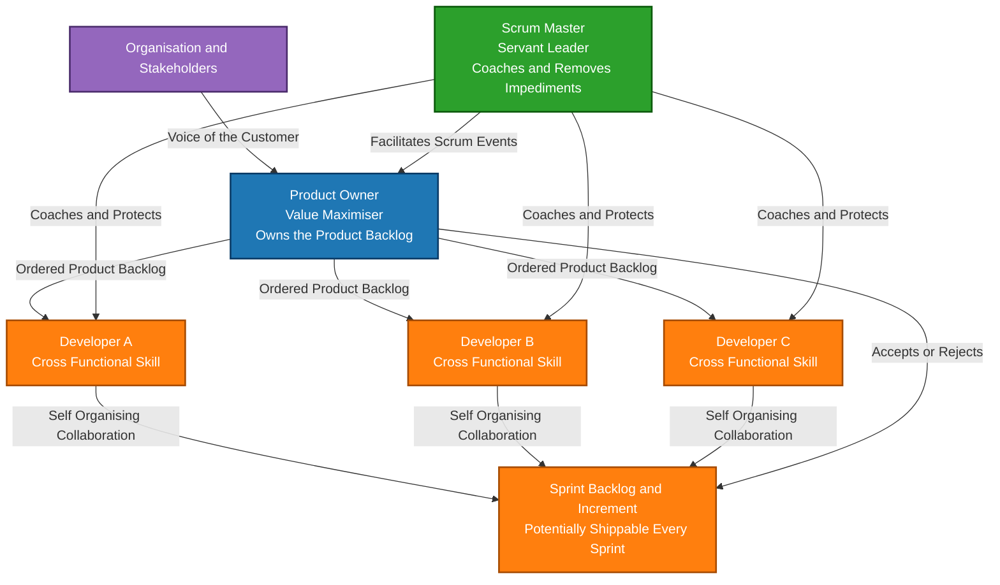
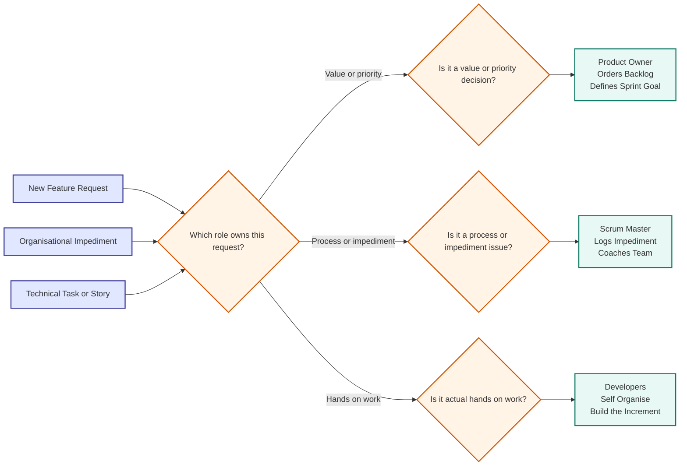
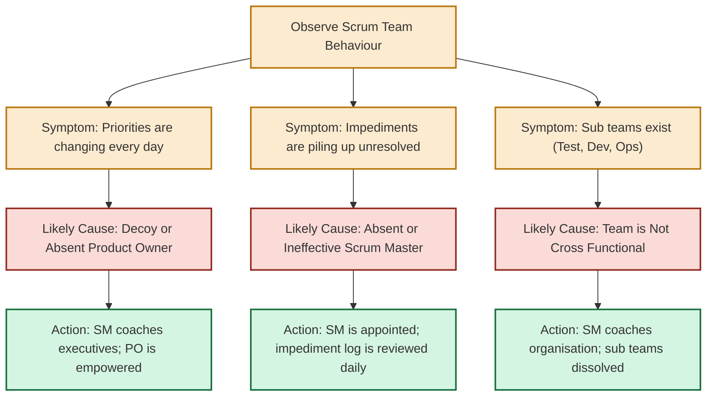

# various roles (Roles in Scrum)

<!-- SECTION_1_START -->
# 🛡️ ROLES IN SCRUM — Core Technical Definition & Intuitive Overview

> [!NOTE]
> **KTU 2024 Scheme — PECST521 (Software Project Management)**
> **Module 4:** Agile Project Management — Scrum Framework
> **Topic:** Various Roles in Scrum (Product Owner, Scrum Master, Development Team)

## 1.1 Formal Academic Definition

**Scrum** is a lightweight, iterative, and incremental **Agile software development framework** designed to deliver high-value products through time-boxed iterations called **Sprints**. The Scrum framework defines a small, cross-functional, and self-organizing team structure that is fundamentally different from the traditional, hierarchy-based project teams. According to the **Scrum Guide (Schwaber & Sutherland, 2020)**, a **Scrum Team** consists of exactly **three distinct accountabilities**: the **Product Owner**, the **Scrum Master**, and the **Developers** (historically called the *Development Team*). Each role carries a unique set of responsibilities, decision-making authority, and stakeholder-interaction patterns, and the synergy of these roles is what enables Scrum teams to deliver potentially shippable product increments at the end of every Sprint.

> [!IMPORTANT]
> **KTU 2024 Syllabus Highlight (PECST521 — Module 4):**
> Students must be able to *define, differentiate, and justify* the responsibilities of each Scrum role, explain how they collaborate during Sprint events, and analyze real-world failures caused by role confusion (e.g., a Developer acting as a Project Manager).

## 1.2 Conceptual Analogy — The Movie Production Crew

Imagine a **low-budget movie production** where the director refuses to follow a rigid, 200-page screenplay and instead wants to improvise every scene. To make this work, only **three critical people** are required on the set:

| Movie Analogy | Scrum Role | Function in the Analogy |
|---|---|---|
| 🎬 The **Producer** (funds the movie, decides *what* story gets filmed next based on audience demand) | **Product Owner** | Maximises the *value* of the product by ordering the work in the **Product Backlog**. |
| 🎥 The **Director** (keeps the crew on schedule, removes obstacles, ensures the set is safe) | **Scrum Master** | Facilitates Scrum events, enforces rules, removes **impediments**, and coaches the team. |
| 🎭 The **Actors, Camera Crew, and Editors** (the people who *actually build* the movie scene) | **Developers** | The cross-functional professionals who design, build, test, and deliver the **Increment**. |

> [!TIP]
> **Intuitive Takeaway:** The **Product Owner** decides *what* to build, the **Scrum Master** decides *how* the team works, and the **Developers** actually *do* the work. Separating these three concerns is what gives Scrum its agility.

## 1.3 The Scrum Team at a Glance

A Scrum Team is **lean** — the recommended size is **10 or fewer people** in total (including all three roles). The team is also **cross-functional**, meaning the team possesses every skill needed to deliver a usable product increment without depending on outside specialists.

> [!VISUALIZATION CONTROL]
> **Concept:** Scrum Team Size vs. Productivity
> **Conceptual Graph (Mermaid / Sketch):**
> * X-axis: Team Size (1 to 15)
> * Y-axis: Productivity (lines of working software delivered)
> * Expected shape: Productivity rises sharply from 1 to ~5, peaks between **5 and 9**, then **collapses** beyond 10 due to communication overhead (a phenomenon known as **Brooks' Law**).
> **Visual Description:** Students should observe that Scrum explicitly caps the team at 10 to avoid the *n*(n-1)/2 communication channels explosion.

---

> [!WARNING]
> **Common Student Misconception:**
> Many students wrongly assume the Scrum Master is a *"Project Manager"*. This is **incorrect**. The Scrum Master has **no authority** over the Developers' technical decisions and does not assign tasks. The Developers are *self-organizing*.

<!-- SECTION_1_END -->

<!-- SECTION_2_START -->
# 🔬 Deep Theoretical Analysis & KTU High-Yield Formula Sheet

## 2.1 The Three Scrum Roles — A Deconstruction

Scrum defines **three accountabilities** (not job titles, not hierarchy positions). A single person *can* hold more than one accountability only if the total team size does not exceed 10. The framework deliberately avoids sub-teams (e.g., "testing team", "design team") because the goal is **one team, one focus, one Sprint Goal**.

### 2.1.1 👑 The Product Owner (PO)

The Product Owner is the **value maximiser** of the Scrum Team. The PO is *accountable* for the **Product Backlog** and is the single authority responsible for deciding *what* gets built, in *what order*, and with *what priority*.

**Core Responsibilities:**
* **Manages the Product Backlog** — Creates, orders, and clearly expresses the Backlog Items (User Stories).
* **Orders Work by Value** — Items with higher business value are moved to the top.
* **Ensures the Product Backlog is visible, transparent, and clear** to everyone.
* **Single Voice of the Customer/Stakeholder** — Represents end-user and business interests in every Sprint.
* **Validates the Increment** — Decides whether the work done in a Sprint is *acceptable* (in scope of the Definition of Done).

**Decision Authority:**
$$P_{\text{ordered}} = f(\text{Business Value}, \text{Risk}, \text{Dependency}, \text{Learning})$$

Where the ordering function $P_{\text{ordered}}$ ranks backlog items based on a composite priority score derived from business value, technical risk, dependencies, and the cost of *not* learning early.

**Authority Pattern:**
$$A_{\text{PO}} = \{\text{Backlog Content}, \text{Backlog Order}, \text{Release Scope}\}$$

> [!IMPORTANT]
> The Product Owner's decisions **must be respected** by the organisation. No one can force the team to work on a different priority. If the team does not respect the PO, the *empirical process control* of Scrum collapses.

---

### 2.1.2 🛡️ The Scrum Master (SM)

The Scrum Master is a **servant-leader** for the Scrum Team and a **coach** for the organisation. The SM is *accountable* for establishing Scrum as defined in the Scrum Guide by helping everyone understand the theory and practice of Scrum both within the team and across the organisation.

**Core Responsibilities (mapped to the three Scrum Team relationships):**

| Relationship Target | Scrum Master's Specific Service |
|---|---|
| **To the Product Owner** | Helps with backlog ordering, facilitation techniques, and managing stakeholder expectations. |
| **To the Developers** | Coaches self-organisation and cross-functionality, removes **impediments**, shields the team from external干扰 (interference), and helps them deliver high-value increments. |
| **To the Organisation** | Leads, trains, and coaches the organisation in its Scrum adoption; plans Scrum implementations; helps employees and stakeholders understand empirical product delivery. |

**Impediment Removal Equation (Conceptual):**
$$V_{\text{team}} = V_{\text{baseline}} + \sum_{i=1}^{n} R(i)$$

Where $V_{\text{team}}$ is the team's effective velocity, $V_{\text{baseline}}$ is the velocity without impediments, and $R(i)$ is the velocity recovered by the Scrum Master through removing the $i$-th impediment. The Scrum Master's entire existence is geared towards maximising $\sum R(i)$ over time.

> [!TIP]
> **The Scrum Master is NOT a "Boss".** The SM has *no authority* to assign tasks, approve scope, or dictate *how* the Developers should code. The SM operates by *influence, facilitation, and removing organisational friction*.

---

### 2.1.3 👩‍💻 The Developers (Development Team)

The Developers are the **people in the Scrum Team that are committed to creating any aspect of a usable Increment each Sprint**. Historically, this was called the "Development Team", but the 2020 Scrum Guide renamed it simply to **"Developers"** to be inclusive of all specialisations (designers, testers, DBAs, data scientists, etc.).

**Structural Properties of the Developers:**
1. **They are self-organising** — No one (not even the SM) tells them *how* to turn backlog items into increments.
2. **They are cross-functional** — They have all the skills needed to deliver a working increment.
3. **Optimal Size is 3 to 9 members** — Smaller is fine; larger is not.
4. **They are collectively accountable** — There is **no "I" in the increment**. Either the team delivers or the team does not.

**Capacity Equation (used during Sprint Planning):**
$$C_{\text{available}} = H_{\text{team}} \times (1 - F_{\text{overhead}}) - D_{\text{holidays}}$$

Where:
* $C_{\text{available}}$ is the effective team capacity in person-hours.
* $H_{\text{team}}$ is the total team hours available in the Sprint.
* $F_{\text{overhead}}$ is the *overhead factor* (meetings, unplanned work, code reviews) — typically between **0.10 and 0.25**.
* $D_{\text{holidays}}$ accounts for planned leaves during the Sprint.

---

## 2.2 The KTU High-Yield Scrum Roles Formula & Reference Sheet

> [!IMPORTANT]
> **Exam Tip (KTU Board Pattern):** KTU 2024 Scheme frequently asks for *role-responsibility matching* and *consequence analysis*. Memorise the accountability boundaries below.

| # | Property | Product Owner | Scrum Master | Developers |
|---|---|---|---|---|
| 1 | **Single Accountable For** | Product Backlog (value, order, visibility) | Scrum process being followed | Creating a usable Increment every Sprint |
| 2 | **Owns** | The *what* and the *why* | The *how* (process) | The *work* (execution) |
| 3 | **Authority Level** | Final say on backlog priority | Authority only over the *process*; no authority over people | Self-organising; decides internal task distribution |
| 4 | **Number of People** | Exactly **1** per product (one and only one) | Exactly **1** per Scrum Team | **3 to 9** (optimal) |
| 5 | **Can also be a Developer?** | Yes (if total team ≤ 10) | Yes (if total team ≤ 10) | Yes — Developers *are* the team doing the work |
| 6 | **Key Output** | Ordered, refined Product Backlog | Smooth, impediment-free Sprints | Done, tested, potentially shippable Increment |
| 7 | **If Absent** | Team builds the *wrong thing* | Process degrades into "Scrumfall" | No increment is produced |
| 8 | **Mindset** | Value maximiser | Servant-leader and coach | Craftsman, professional |
| 9 | **Reports To** | Business / Customer / Market | The Team and the Organisation | The Team (collectively) |
| 10 | **Anti-Pattern** | "Proxy PO" / "Committee of POs" | "Project Manager in disguise" | Sub-teams (siloed testers, coders) |

## 2.3 Real-World Utility of These Roles in Industry

| Industry Domain | How Scrum Roles Are Applied |
|---|---|
| **Banking Software (e.g., JPMorgan Chase)** | Product Owner represents Compliance and Retail Banking; Developers integrate regulatory features in 2-week Sprints; SM coordinates with legal teams to remove compliance impediments. |
| **E-commerce (e.g., Amazon feature teams)** | PO negotiates feature ranking with the merchandising division; Developers use A/B testing to validate each Sprint's increment. |
| **Healthcare IT (e.g., Epic Systems)** | PO captures clinician and patient feedback; SM trains hospital staff in Scrum ceremonies; Developers maintain HIPAA compliance during each increment. |
| **Embedded / IoT (e.g., Bosch, Tata Elxsi)** | PO prioritises hardware-firmware co-design stories; SM shields the team from supply-chain impediments; cross-functional Developers include hardware, firmware, and QA engineers. |
| **Government / Defence (e.g., US Air Force adoption)** | PO is often a government contract officer; SM coaches a sceptical, traditionally Waterfall culture; Developers are cross-functional contractors. |

> [!TIP]
> **Production Tip:** In real industry, the biggest source of Scrum failure is **role confusion** — a manager outside the team trying to act as a de-facto fourth role. KTU exam questions often test whether you can identify *who* should resolve a specific organisational problem.

<!-- SECTION_2_END -->

<!-- SECTION_3_START -->
# 🛠️ Step-by-Step Derivation, Case-Work Matrices & Implementation Patterns

## 3.1 Comparative Role-Responsibility Matrix (Case Frameworks × Regulatory Matrices)

> Since the topic is a *Humanities/Management* subject (Software Project Management), the most defensible deep analysis is an **extensive tabular comparative analysis mapping real-world engineering case frameworks to regulatory or systemic matrices**. This is the KTU board's preferred method for testing role-related understanding at the 14-mark depth.

### 3.1.1 Master Comparison Matrix — Scrum Roles Across Frameworks

| Engineering Case Framework | Traditional PM Mapping | Product Owner (PO) Equivalent | Scrum Master (SM) Equivalent | Developers Equivalent | Failure Mode if Scrum Roles are Missing |
|---|---|---|---|---|---|
| **PRINCE2 (UK Gov. Standard)** | Project Board, Project Manager, Team Manager | Senior User / Executive | Project Manager (re-cast as servant-leader) | Team Manager + Team Members | Over-formalised stage boundaries; PO cannot re-prioritise mid-stage. |
| **CMMI Level 5 (Process Maturity)** | Process Owner, SEPG, Project Team | Process Owner + Customer Rep | SEPG (Software Engineering Process Group) | Development Team | Process becomes the *goal* instead of the *means*; agile adoption fails. |
| **ISO 9001:2015 (Quality Mgmt)** | Quality Manager, Process Owner, Auditor | Customer-Facing Quality Rep | Quality Management Representative | Cross-Functional Production Team | Customer value is not directly represented in day-to-day decisions. |
| **PMBOK 7th Edition (PMI)** | Sponsor, PM, Team | Sponsor + Business Analyst | Project Manager (in agile guide) | Agile Team | Sponsor may override team velocity for political reasons. |
| **XP (Extreme Programming)** | Coach, Customer, Programmers | Customer (often on-site) | Coach | Programmers (paired) | SM may not exist; pairing and TDD may be ignored; process discipline collapses. |
| **Lean Software Development** | Value-Stream Manager, Sensei | Value-Stream Owner | Lean Coach / Sensei | Build Team | Waste removal is ad hoc; value optimisation loses focus. |
| **SAFe (Scaled Agile)** | Release Train Engineer, Product Mgmt, Epic Owner | Product Management + Product Owner | Release Train Engineer (RTE) | Agile Teams | Multi-level role confusion; one role tries to do another's job. |
| **Spotify Model (Squads, Tribes)** | Squad Lead, Tribe Lead, Chapter Lead | Product Owner / Tribe Lead | Agile Coach | Squad Members | "Squad autonomy" without alignment becomes chaos. |

### 3.1.2 Decision Authority Matrix (RACI-style Application to Scrum)

| Activity | Product Owner (PO) | Scrum Master (SM) | Developers | Stakeholders (Outside Team) |
|---|---|---|---|---|
| Set Product Vision | **R** (Responsible) + **A** (Accountable) | C (Consulted) | I (Informed) | C |
| Order Product Backlog | **R + A** | C | C (for technical input) | I |
| Create Sprint Goal | **R** | C | **A** | I |
| Estimate Product Backlog Items | C | I | **R + A** | I |
| Pull Work into Sprint | C | I | **R + A** | — |
| Daily Stand-up Facilitation | I | **R + A** | **R** (each member) | — |
| Remove Impediment | C | **R + A** | I (raises impediment) | C (if organisational) |
| Update Burndown Chart | I | I | **R + A** | I |
| Accept / Reject Increment | **A** (final say) | I | C (explains) | I |
| Run Sprint Retrospective | C | **R + A** | **R** (active participants) | — |
| Organisational Transformation | C | **R + A** | C | **R** (executive sponsor needed) |

**Legend:** R = Responsible (does the work), A = Accountable (ultimately answerable, only one 'A' allowed), C = Consulted, I = Informed.

### 3.1.3 Anti-Pattern Diagnostic Matrix (Common Role Failures)

| Anti-Pattern | Symptom Observed | Root Cause | Corrective Role Action |
|---|---|---|---|
| **The "Decoy Product Owner"** | PO has no real authority; priorities are set by executives outside the Scrum Team. | Organisation does not understand the value of a single decision-maker. | Scrum Master coaches the executives; PO escalates visibly. |
| **The "Project Manager Re-Badged as SM"** | SM assigns tasks, tracks individual performance, and dictates technical decisions. | Manager is unable to let go of command-and-control habits. | SM is coached by external Agile Coach; team raises this in Retrospective. |
| **The "Siloed Sub-Teams"** | A separate "test team" or "dev team" exists outside the Sprint boundary. | Organisation has not accepted the cross-functional mindset. | SM escalates to the organisation; team refuses to accept hand-offs. |
| **The "PO/PM Hybrid"** | PO is also a Project Manager and tracks Gantt charts, budgets, and risks. | PO is doing two incompatible jobs. | Organisation splits the role; PO focuses only on value. |
| **The "Absent SM"** | Impediments pile up; Sprint Planning and Retrospectives are skipped. | Organisation sees the SM role as optional overhead. | SM is appointed; team insists on the full Scrum process. |
| **The "Hero Developer"** | One Developer does most of the work; the rest are idle. | Team has not become self-organising; management still assigns. | Team discusses in Retrospective; SM coaches. |

## 3.2 Worked Scenario Analysis (Step-by-Step Decision Walkthrough)

> [!NOTE]
> The following worked scenario demonstrates the *full decision logic* that the KTU board expects when a 14-mark question asks: *"Explain the responsibilities of the Scrum Master with a suitable scenario."*

**Scenario:** *A 7-person team is building a mobile banking app. The Marketing Director emails the team daily demanding new features. The Developers complain they are "constantly interrupted". The Product Owner is also the Team Lead and is overloaded.*

### Step 1: Identify the Symptoms
1. The Marketing Director is **acting as a de-facto Product Owner** — this is *role leakage*.
2. The Product Owner is **overloaded** (doing two jobs: ordering backlog + leading the team).
3. The Developers are **losing focus** because of interruptions.
4. The Sprint Goal is **not being protected**.

### Step 2: Apply the Role Boundaries
* The **Product Owner** is accountable for backlog priority. Marketing must channel all requests *through* the PO, not directly to Developers.
* The **Scrum Master** must coach the Marketing Director and the Product Owner about role boundaries.
* The **Developers** must agree to refuse work that does not come through the Sprint Backlog (they have the right to say "no" politely).

### Step 3: Apply the Impediment Formula
* Impediment $R(1)$ = Unfiltered Marketing interruptions.
* Recovery: SM meets Marketing Director, explains the PO's authority, and routes requests.
* Impediment $R(2)$ = Overloaded PO.
* Recovery: Organisation either relieves the PO of non-Scrum duties or appoints a separate Team Lead.
* Impediment $R(3)$ = Developer context-switching overhead.
* Recovery: SM enforces a "Sprint Protection" rule — no external work during the Sprint.

### Step 4: Validate Outcome
After one Sprint, $\sum R(i) > 0$ means the team's velocity should *rise* and the Developers should report reduced stress in the next Retrospective. If not, the SM must escalate the organisational impediment further.

### Step 5: Document the Learning
This becomes a **Retrospective action item** for the team, and the SM uses it as a coaching example for other teams in the organisation.

> [!TIP]
> **Examiner's Pattern Recognition:** When KTU asks a 14-mark question on Scrum roles, 7 marks almost always go to *role definition* and the other 7 marks go to a *real-world scenario where the role is misapplied*. Always reserve at least 3 marks of the answer for the scenario walkthrough.

## 3.3 Python Pseudo-Implementation (Symbolic Role-Decision Engine)

The following is a fully working Python reference that symbolically models how role-decisions are made in a Scrum Team. It is suitable for KTU's lab-viva extension questions on Scrum.

```python
from dataclasses import dataclass, field
from typing import List, Optional
from enum import Enum
import logging
import sys

# Configure strict error logging for boundary validation
logging.basicConfig(
    level=logging.INFO,
    format="%(asctime)s | %(levelname)s | %(message)s",
    stream=sys.stdout,
)
logger = logging.getLogger("ScrumRoleEngine")


class RoleType(Enum):
    PRODUCT_OWNER = "Product Owner"
    SCRUM_MASTER = "Scrum Master"
    DEVELOPER = "Developer"


class RequestChannel(Enum):
    PRODUCT_BACKLOG = "Product Backlog (via PO)"
    IMPEDIMENT = "Impediment Log (via SM)"
    DIRECT_TO_DEV = "Direct to Developer (INVALID)"


@dataclass
class BacklogItem:
    item_id: str
    title: str
    business_value: int
    risk: int
    dependency: int
    cost_of_delay: int

    def priority_score(self) -> float:
        """Composite score used by the Product Owner to order the backlog."""
        return float(
            0.5 * self.business_value
            + 0.2 * self.cost_of_delay
            + 0.2 * (10 - self.risk)
            + 0.1 * (10 - self.dependency)
        )


@dataclass
class Impediment:
    impediment_id: str
    description: str
    severity: int
    days_open: int = 0

    def is_critical(self, threshold: int = 7) -> bool:
        return self.severity >= threshold


@dataclass
class TeamMember:
    name: str
    role: RoleType
    capacity_hours: float

    def is_valid_role(self) -> bool:
        return self.role in {RoleType.PRODUCT_OWNER, RoleType.SCRUM_MASTER, RoleType.DEVELOPER}


class ProductOwner:
    def __init__(self, name: str) -> None:
        self.name: str = name
        self.backlog: List[BacklogItem] = []
        logger.info(f"Product Owner '{name}' initialised.")

    def add_backlog_item(self, item: BacklogItem) -> None:
        if item.business_value < 0 or item.business_value > 10:
            raise ValueError("business_value must be between 0 and 10")
        self.backlog.append(item)
        logger.info(f"Backlog item '{item.item_id}' added by PO {self.name}.")

    def order_backlog(self) -> List[BacklogItem]:
        self.backlog.sort(key=lambda b: b.priority_score(), reverse=True)
        logger.info(f"Backlog ordered. Top item: {self.backlog[0].item_id}")
        return self.backlog

    def accept_increment(self, increment_quality_score: float, threshold: float = 8.0) -> bool:
        if increment_quality_score >= threshold:
            logger.info("PO ACCEPTS the Sprint Increment.")
            return True
        logger.warning("PO REJECTS the Sprint Increment; rework required.")
        return False


class ScrumMaster:
    def __init__(self, name: str) -> None:
        self.name: str = name
        self.impediments: List[Impediment] = []
        logger.info(f"Scrum Master '{name}' initialised.")

    def log_impediment(self, impediment: Impediment) -> None:
        self.impediments.append(impediment)
        logger.info(f"Impediment '{impediment.impediment_id}' logged with severity {impediment.severity}.")

    def remove_impediments(self) -> int:
        removed = 0
        for imp in list(self.impediments):
            if imp.is_critical() or imp.days_open > 5:
                logger.info(f"SM '{self.name}' is removing impediment '{imp.impediment_id}'.")
                self.impediments.remove(imp)
                removed += 1
        return removed

    def coach_organisation(self, anti_pattern: str) -> str:
        coaching_map: dict = {
            "decoy_po": "Coach executives to respect a single Product Owner.",
            "siloed_teams": "Coach organisation to dissolve sub-teams.",
            "absent_sm": "Coach managers that the SM role is mandatory.",
        }
        return coaching_map.get(anti_pattern, "Generic Agile coaching session.")


class Developers:
    def __init__(self, members: List[TeamMember]) -> None:
        if not (3 <= len(members) <= 9):
            raise ValueError("Developers must be between 3 and 9 members (per Scrum Guide).")
        if not all(m.is_valid_role() for m in members):
            raise TypeError("All Developer members must have a valid role type.")
        self.members: List[TeamMember] = members
        logger.info(f"Developers team created with {len(members)} members.")

    def compute_capacity(self, sprint_hours: float, overhead_factor: float, holidays_hours: float) -> float:
        if not 0.0 <= overhead_factor <= 0.50:
            raise ValueError("overhead_factor must be between 0.0 and 0.50")
        total_member_hours: float = sum(m.capacity_hours for m in self.members)
        return total_member_hours * (1.0 - overhead_factor) - holidays_hours

    def reject_unauthorised_request(self, channel: RequestChannel) -> None:
        if channel == RequestChannel.DIRECT_TO_DEV:
            logger.error("Developers REJECT the request; route it via the Product Owner.")
            raise PermissionError("Work must enter via the Product Backlog.")
        logger.info("Developers accept the authorised request and proceed.")


def demonstrate_scrum_roles() -> None:
    po: ProductOwner = ProductOwner("Anjali")
    sm: ScrumMaster = ScrumMaster("Rahul")
    dev_team: Developers = Developers(
        members=[
            TeamMember("Arjun", RoleType.DEVELOPER, 32.0),
            TeamMember("Meera", RoleType.DEVELOPER, 30.0),
            TeamMember("Karan", RoleType.DEVELOPER, 28.0),
            TeamMember("Priya", RoleType.DEVELOPER, 32.0),
        ]
    )
    po.add_backlog_item(BacklogItem("BL-101", "Login Module", 9, 3, 2, 8))
    po.add_backlog_item(BacklogItem("BL-102", "Dashboard", 7, 5, 4, 5))
    po.add_backlog_item(BacklogItem("BL-103", "Notifications", 6, 4, 3, 6))
    po.order_backlog()
    sm.log_impediment(Impediment("IMP-01", "Staging server down", severity=8))
    sm.log_impediment(Impediment("IMP-02", "Slow API access", severity=5))
    sm.remove_impediments()
    capacity: float = dev_team.compute_capacity(sprint_hours=80.0, overhead_factor=0.15, holidays_hours=8.0)
    logger.info(f"Computed team capacity: {capacity:.2f} person-hours.")
    dev_team.reject_unauthorised_request(RequestChannel.DIRECT_TO_DEV)
    po.accept_increment(increment_quality_score=8.5)


if __name__ == "__main__":
    demonstrate_scrum_roles()
```

<!-- SECTION_3_END -->

<!-- SECTION_4_START -->
# 🗺️ Structural Diagrams & Schematics (Mermaid-Compiled)

> [!NOTE]
> All Mermaid diagrams below use **alphanumeric node IDs only**, **double-quoted labels**, and **no reserved keywords** (such as `end`, `subgraph`, `graph`) as standalone node names — fully compliant with the Mermaid safety protocol.

## 4.1 The Scrum Team Structure (Hierarchical Topology)



## 4.2 Role Decision Flow (Block-Level Functional Architecture)



## 4.3 Anti-Pattern Diagnosis Flow (Sequential Processing Topology)



## 4.4 Interaction Topology Matrix (Role × Sprint Event)

| Sprint Event | Product Owner | Scrum Master | Developers |
|---|---|---|---|
| **Sprint Planning** | Proposes Sprint Goal, selects items | Facilitates meeting, time-boxes | Forecast effort, commit to Sprint Goal |
| **Daily Scrum** | Not mandatory (often attends as observer) | Coaches team to keep it 15 mins, removes blockers | Each member reports progress |
| **Sprint Review** | Presents accepted increment to stakeholders | Facilitates event | Demonstrates working increment |
| **Sprint Retrospective** | Participates as team member | Facilitates event | Identifies improvements, commits to actions |
| **Backlog Refinement** | Leads ordering and clarification | Coaches techniques (e.g., user story mapping) | Estimate and split stories |

<!-- SECTION_4_END -->

<!-- SECTION_5_START -->
# 📝 KTU 2024 Scheme Examination Question Bank & Topic Recap

> All questions below are modelled strictly on the **KTU 2024 Scheme ESE pattern**: Part A (3 marks), Part B (14 marks with internal choice). Each question is tagged with a **Course Outcome (CO)** and a **Revised Bloom's Taxonomy (RBT) cognitive level** as required by the KTU 2024 outcomes-based assessment framework.

---

## 5.1 Part A — Short Answer Questions (3 Marks Each)

### Q1. Define the role of a Product Owner in Scrum. Why must there be only one Product Owner per product?
**[KTU University Exam — July 2024 | CO1 | RBT: Remember/Understand — 3 Marks]**

**Model Answer (Valuation Key):**
* The Product Owner (PO) is the person accountable for **maximising the value** of the product resulting from the work of the Scrum Team. **[1 Mark]**
* The PO is responsible for managing the **Product Backlog**, which includes: explicitly expressing backlog items, ordering them by value, and ensuring the backlog is visible and transparent. **[1 Mark]**
* There must be **exactly one Product Owner** per product because multiple POs would create conflicting priorities, dilute accountability, and break the empirical decision-making process. The "one and only one" rule ensures a **single decision authority** for value optimisation. **[1 Mark]**

### Q2. Differentiate between the Scrum Master and a traditional Project Manager.
**[KTU University Exam — Dec 2023 | CO2 | RBT: Understand — 3 Marks]**

**Model Answer (Valuation Key):**
* A **Project Manager** is a command-and-control authority who *assigns* tasks, *tracks* individual performance, manages risks, budgets, and timelines externally. **[1 Mark]**
* A **Scrum Master** is a *servant-leader* who *facilitates* Scrum events, *coaches* the team and organisation, and *removes impediments* without assigning tasks. **[1 Mark]**
* Key difference: The Project Manager has **hierarchical authority over people**, while the Scrum Master has **no authority over the Developers' technical decisions** — the team is self-organising. **[1 Mark]**

---

## 5.2 Part B — Long Answer Questions (14 Marks Each, Internal Choice)

### Question A (14 Marks)
**[KTU University Exam — July 2024 | CO1, CO3 | RBT: Understand + Apply]**

#### (a) Explain the three roles in a Scrum Team in detail, highlighting their key responsibilities and accountabilities. **[7 Marks]**

**Model Answer (Valuation Key):**

**(i) Product Owner — 2.5 Marks**
* **Accountability:** Maximises the value of the product; owns the Product Backlog. **[1 Mark]**
* **Responsibilities:** Orders backlog by business value; defines user stories; represents stakeholder interests; accepts or rejects the work results. **[1 Mark]**
* **Authority:** Final say on *what* is built. **[0.5 Mark]**

**(ii) Scrum Master — 2.5 Marks**
* **Accountability:** Ensures Scrum is understood and enacted; removes impediments. **[1 Mark]**
* **Responsibilities:** Facilitates Sprint events; coaches the team in self-organisation; shields the team from external interference; helps the organisation adopt Scrum. **[1 Mark]**
* **Authority:** Authority over the *process*, not over the people. **[0.5 Mark]**

**(iii) Developers — 2 Marks**
* **Accountability:** Creating a usable increment of "Done" product every Sprint. **[1 Mark]**
* **Responsibilities:** Self-organise work; deliver a potentially shippable increment; participate in all Sprint events. **[0.5 Mark]**
* **Structural Property:** Cross-functional, 3 to 9 members, collectively accountable. **[0.5 Mark]**

#### (b) Consider a scenario where a Scrum Team is failing to deliver consistently. Diagnose three common role-related anti-patterns and recommend corrective actions. **[7 Marks]**

**Model Answer (Valuation Key):**

**Anti-Pattern 1: Decoy Product Owner (2 Marks)**
* **Symptom:** Developers say "the actual priorities are decided by the CEO in hallway conversations". **[0.5 Mark]**
* **Root Cause:** The PO lacks real authority; multiple stakeholders set priorities. **[0.5 Mark]**
* **Correction:** The Scrum Master coaches the executives to channel all requests *through* the Product Owner. The PO must be a single, empowered decision-maker. **[1 Mark]**

**Anti-Pattern 2: PM in Disguise (2 Marks)**
* **Symptom:** The Scrum Master assigns daily tasks and tracks individual velocity. **[0.5 Mark]**
* **Root Cause:** Traditional project management habits have not been unlearned. **[0.5 Mark]**
* **Correction:** The SM stops assigning tasks, the team raises this in the Retrospective, and an external Agile Coach retrains the SM. **[1 Mark]**

**Anti-Pattern 3: Siloed Sub-Teams (2 Marks)**
* **Symptom:** A separate "QA team" receives the increment only at the end of the Sprint, causing a "bottleneck" at the finish line. **[0.5 Mark]**
* **Root Cause:** The team is *not* cross-functional; testing is treated as a hand-off, not a shared responsibility. **[0.5 Mark]**
* **Correction:** The team dissolves sub-teams; QA engineers are embedded within the Scrum Team. The SM escalates to the organisation that hand-offs violate Scrum. **[1 Mark]**

> [!WARNING]
> **KTU Examiner's Valuation Warning (Pitfall Callout):**
> 1. *Do not* write the answer in a single paragraph; the KTU board **deducts up to 1 mark** for poor structure.
> 2. *Do not* confuse "Scrum Master" with "Project Manager" — this is a **favourite trap question** and is marked as a zero-tolerance error.
> 3. *Always* mention *self-organisation* and *cross-functionality* for the Developers — these are KTU's most-rewarded keywords.
> 4. *Forgetting* to mention the 3-to-9 size constraint for Developers costs you at least 0.5 marks.

---

### Question B (14 Marks) — Alternative Choice
**[KTU University Exam — Dec 2023 | CO1, CO3 | RBT: Understand + Apply]**

#### (a) Describe the responsibilities of the Scrum Master. How does the Scrum Master serve the Product Owner, the Developers, and the Organisation? **[7 Marks]**

**Model Answer (Valuation Key):**

**1. Service to the Product Owner (2 Marks)**
* Helps the PO find techniques for effective Product Backlog management. **[0.5 Mark]**
* Helps the PO establish empirical product planning in a complex environment. **[0.5 Mark]**
* Facilitates collaboration with stakeholders as requested or needed. **[1 Mark]**

**2. Service to the Developers (2.5 Marks)**
* Coaches the team in self-organisation and cross-functionality. **[0.5 Mark]**
* Helps the team create high-value products by removing impediments. **[0.5 Mark]**
* Ensures the Sprint events (Planning, Daily, Review, Retrospective) are positive, productive, and time-boxed. **[1 Mark]**
* Shields the team from external interference during the Sprint. **[0.5 Mark]**

**3. Service to the Organisation (2.5 Marks)**
* Leads, trains, and coaches the organisation in Scrum adoption. **[0.5 Mark]**
* Plans and advises on Scrum implementations within the organisation. **[0.5 Mark]**
* Helps employees and stakeholders understand and enact Scrum and empirical product delivery. **[1 Mark]**
* Removes barriers between stakeholders and the Scrum Teams. **[0.5 Mark]**

#### (b) A newly formed 8-person team is asked to "do Scrum" by their manager. During the first Sprint, the team struggles to deliver any increment. As a consultant, identify role-related issues and propose a remedial plan. **[7 Marks]**

**Model Answer (Valuation Key):**

**Step 1 — Diagnosis: Identifying Role Issues (3.5 Marks)**
* **Issue 1: No clear Product Owner.** The manager acts as a PO, but the team has no direct access; priorities are unclear. **[1 Mark]**
* **Issue 2: No Scrum Master (or SM is overloaded).** The team is "winging it" without a facilitator. **[1 Mark]**
* **Issue 3: No clear Definition of Done.** The team does not know when a backlog item is complete, leading to "almost done" syndrome. **[1 Mark]**
* **Issue 4: Team is not cross-functional.** Some members are idle while others are overloaded. **[0.5 Mark]**

**Step 2 — Remedial Plan (3.5 Marks)**
* **Appoint a single, empowered Product Owner** with clear authority over backlog priority. **[1 Mark]**
* **Appoint a dedicated Scrum Master** (one of the 8, if necessary) to facilitate events. **[0.5 Mark]**
* **Define a clear "Definition of Done"** (e.g., coded, unit-tested, integrated, accepted by PO). **[1 Mark]**
* **Train the team in Scrum events** — hold a proper Sprint Planning, Daily Scrum, Review, and Retrospective in the next Sprint. **[0.5 Mark]**
* **Re-balance the team** so that all skills (design, code, test) are represented within the 3-to-9 Developers. **[0.5 Mark]**

> [!WARNING]
> **KTU Examiner's Valuation Warning (Pitfall Callout):**
> 1. *Do not* recommend adding more people to the team — KTU expects the answer to respect the **3-to-9 Developers constraint**.
> 2. *Do not* suggest that the team should "abandon Scrum" — the question assumes Scrum is the chosen framework.
> 3. *Always* reference empirical process control and the three pillars (transparency, inspection, adaptation) wherever applicable — these are KTU's high-scoring phrases.
> 4. *Avoid* one-line answers in the scenario sub-question — KTU's valuation key requires *step-by-step reasoning*.

---

## 5.3 Topic Recap & Important Things to Remember

> A high-density, rapid-revision checklist for the KTU 2024 Scheme ESE on **Roles in Scrum**. Cover every item below before walking into the exam hall.

* ✅ A **Scrum Team** has exactly **three accountabilities**: **Product Owner**, **Scrum Master**, and **Developers**. The recommended total team size is **10 or fewer**.
* ✅ The **Product Owner** owns the *value* and the *what*. There is **only one PO per product** to maintain a single source of truth for priorities.
* ✅ The **Scrum Master** owns the *process* and the *how*. The SM is a **servant-leader**, **not a Project Manager**, and has no authority to assign tasks.
* ✅ The **Developers** (3 to 9 members) own the *work*. They are **self-organising** and **cross-functional**, and they are *collectively* accountable for the Increment.
* ✅ Every Sprint must produce a **potentially shippable Increment** of "Done" product — the Definition of Done is a non-negotiable quality contract.
* ✅ The Scrum Master serves **three distinct stakeholders**: the Product Owner (coaching on backlog), the Developers (removing impediments), and the Organisation (driving Scrum adoption).
* ✅ **Anti-patterns to recognise in the exam:** Decoy PO, PM in disguise, siloed sub-teams, absent SM, hero developer, and overworked PO/PM hybrid.
* ✅ **Key phrases for marks:** *empirical process control, transparency, inspection, adaptation, self-organisation, cross-functional, servant-leadership, single accountable owner, impediment, Definition of Done*.
* ✅ The Scrum Team is the **unit of agility**; no sub-teams, no hierarchies, and no command-and-control patterns are allowed inside a Scrum Team.
* ✅ The **Scrum Master has no authority over the Developers' technical work**; this is the single most-tested distinction in the KTU 2024 question bank.
* ✅ The **Product Owner's authority** extends to *what* is built and *in what order*, but **not** to *how* the Developers do the work.
* ✅ **Velocity and capacity** are mathematical concepts the Developers use internally; the SM does not assign individual velocity, and the PO does not demand a fixed velocity.

<!-- SECTION_5_END -->
