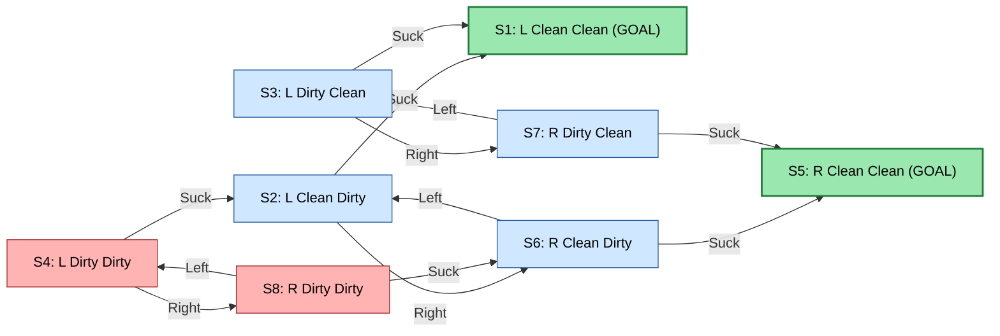
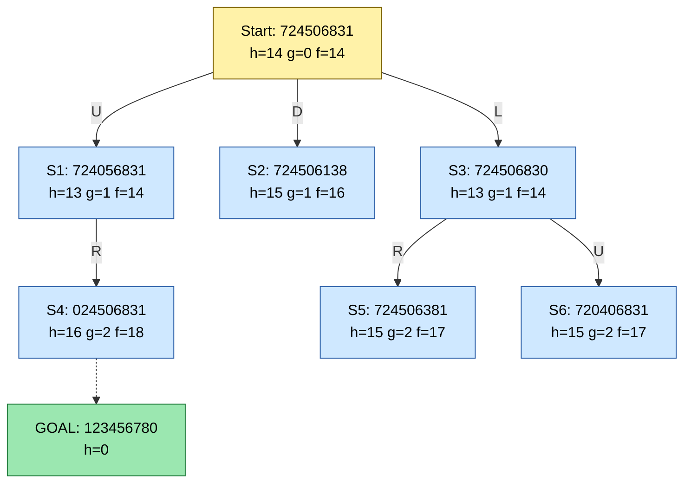
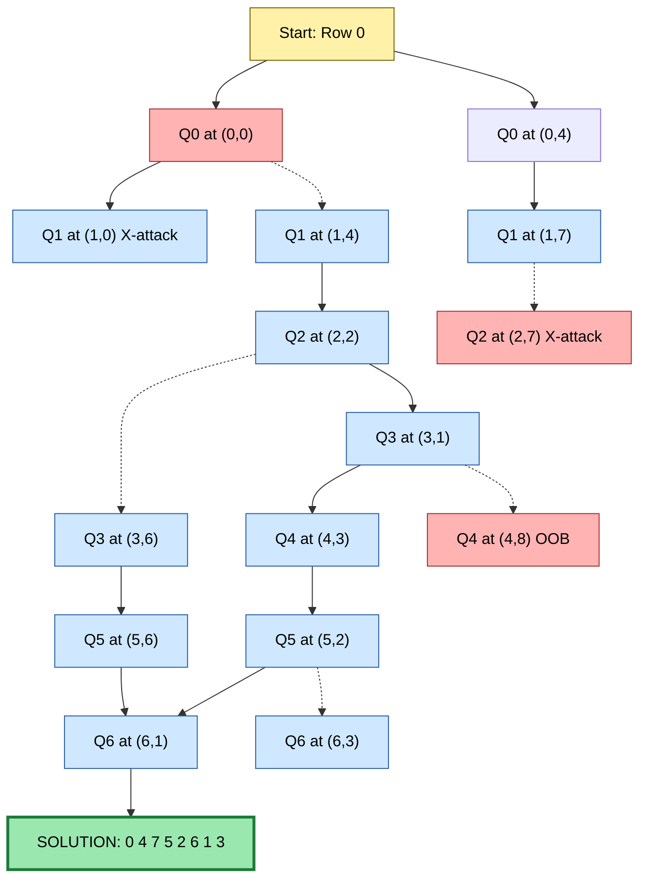
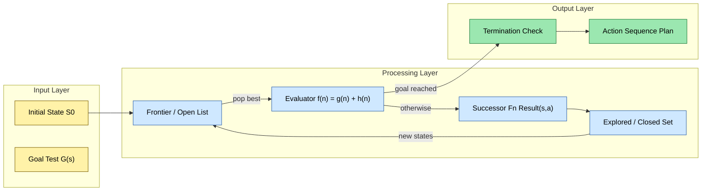

# Example problems- vacuum world, 8-puzzle, 8-queens.

<!-- SECTION_1_START -->
# 1. Core Technical Definition & Intuitive Overview

## 1.1 Formal Definition (KTU 2024 Syllabus Terminology)

In the context of **Artificial Intelligence (PECST522)**, an **Example Problem** (or *toy problem*) is a precisely defined, mathematically tractable real-world abstraction used to study the behaviour of **Intelligent Agents**, **Search Algorithms**, and **State-Space Reasoning**. According to the canonical *Russel & Norvig* framework adopted by KTU, every problem formulation must explicitly define seven components:

$$
\mathcal{P} = \langle S, S_0, A(s), \text{Result}(s, a), \text{GoalTest}(s), \text{PathCost}(s \rightarrow s'), T \rangle
$$

Where:
- $S$ → Finite (or infinite) set of **states**
- $S_0 \in S$ → **Initial state** where the agent begins
- $A(s)$ → Set of **actions** available in state $s$
- $\text{Result}(s, a) \rightarrow s'$ → **Transition model** (successor function)
- $\text{GoalTest}(s) \rightarrow \{T, F\}$ → Boolean goal predicate
- $\text{PathCost}$ → Accumulated cost function $g(n)$ over a path
- $T$ → **Step-cost function** $c(s, a, s')$

The three classical example problems studied in Module 1 are the **Vacuum World**, the **8-Puzzle**, and the **8-Queens Problem**. Each progressively illustrates a different class of AI reasoning — from simple **reflex-agent navigation** to **constraint satisfaction search**.

> [!IMPORTANT]
> **KTU 2024 Highlight:** The exam frequently asks students to *"formulate any toy problem as a state-space graph"* or to *"compute the branching factor and state-space size"*. Mastering the **PEAS description** (Performance, Environment, Actuators, Sensors) and the **problem components** is mandatory for Module 1.

---

## 1.2 Conceptual Analogy & Intuitive Overview

Imagine you are teaching a toddler to clean a room:

- The **Vacuum World** is the toddler who only knows two tiles — *left* and *right* — and must decide where to suck the dirt. It is the **"Hello World" of AI agents** because it isolates the agent-environment loop without distraction.
- The **8-Puzzle** is the sliding-number game on a $3 \times 3$ grid. Think of it as a *mini Rubik's cube*: the agent slides numbered tiles into the single empty slot until the goal ordering is reached. It teaches **uninformed and informed search heuristics** like BFS, DFS, A*, and the **Manhattan Distance Heuristic**.
- The **8-Queens** puzzle is the classic *constraint satisfaction* problem: place eight queens on a chessboard so that no two attack each other. It is the **"Goldilocks"** of backtracking — small enough to brute-force, large enough to teach **CSP formulation, backtracking search, and pruning**.

> [!NOTE]
> **Geometric Intuition:** All three problems live in a finite, discrete **state-space graph** $G = (V, E)$, where $V$ is the set of states and $E$ the set of valid transitions. The agent's job is to find a *path* from $S_0$ to any node $s_g$ such that $\text{GoalTest}(s_g) = T$.

---

## 1.3 The Agent-Environment Paradigm

Every example problem is studied through the **Rational Agent** loop:

$$
\text{Percept} \xrightarrow{\text{Sensors}} \text{Agent} \xrightarrow{\text{Actuators}} \text{Action} \rightarrow \text{Environment} \rightarrow \text{Next Percept}
$$

For these toy problems, the **Environment** is **fully observable, deterministic, static, and discrete** — the four simplest properties in the PEAS matrix.

> [!VISUALIZATION CONTROL]
> **Concept:** State-Space Graph of the Vacuum World (2-Cell Version)
> **Conceptual Graph Description (Coordinate Representation):**
> * **Nodes:** 8 states — combinations of *agent position* (L, R) and *dirt status* (clean/dirty for each cell). E.g., `S1 = (L, Clean, Clean)`, `S7 = (R, Dirty, Dirty)`.
> * **Edges:** Directed arrows representing actions `Left`, `Right`, `Suck`.
> * **Goal States:** `S1 (L, Clean, Clean)` and `S8 (R, Clean, Clean)`.
> * **Visual Description:** A bi-nodal horizontal graph where each cell can be in one of two dirt-states, producing an **octagonal** connectivity pattern centered around the agent's possible actions.
>
> **Suggested Tool:** Draw this manually on a sheet or use **GraphViz Online** with `dot` language to render the 8-state directed graph.

---

## 1.4 Standard Metrics & Constants

| Metric | Vacuum World | 8-Puzzle | 8-Queens |
|---|---|---|---|
| **Branching Factor $b$** | **3** (L, R, Suck) | **2, 3, or 4** (W, E, N, S with bounds) | **8** (column choices) |
| **State Space $\vert S \vert$** | **8** | **181,440** (9! / 2) | $\binom{64}{8} \approx 4.426 \times 10^{9}$ |
| **Depth of Optimal Solution $d$** | **3** (worst case) | **22** (average) | **8** |
| **Goal States** | **2** | **1** | **92** distinct, **12** fundamental |
| **Environment Type** | Fully observable | Fully observable | Fully observable |
| **Search Strategy Used** | Reflex / BFS | A* (Manhattan) | Backtracking / CSP |

> [!NOTE]
> **Why 9!/2 for 8-Puzzle?** The total permutations of 9 tiles is $9! = 362{,}880$, but only **half** are reachable from any given start state due to the *parity invariant* (the blank's row + column parity flips on every move). Thus $\vert S \vert = 181{,}440$.
<!-- SECTION_1_END -->

<!-- SECTION_2_START -->
# 2. Deep Theoretical Analysis & KTU High-Yield Formula Sheet

## 2.1 The Vacuum World — A Reflex Agent's Playground

### 2.1.1 Problem Formulation (Single-Cell vs. Two-Cell)

**Environment:** Two adjacent cells $A$ and $B$. Each can be either *Dirty* or *Clean*. The agent can be in either cell.

**State Encoding:** A triple $\langle \text{AgentLoc}, \text{Status}_A, \text{Status}_B \rangle$.

$$
S_{\text{vacuum}} = \{L, R\} \times \{0, 1\}^2 \implies \vert S \vert = 2 \times 4 = 8
$$

**Actions:**

$$
A(s) = \begin{cases} \{\text{Suck}, \text{Right}\} & \text{if } s = \langle L, \cdot, \cdot \rangle \\ \{\text{Suck}, \text{Left}\} & \text{if } s = \langle R, \cdot, \cdot \rangle \end{cases}
$$

**Transition Model:** A *Suck* action on a dirty cell results in a clean cell; moving *Left/Right* changes agent position but not dirt status.

**Goal Test:** $\text{GoalTest}(s) = (\text{Status}_A = 0 \land \text{Status}_B = 0)$.

### 2.1.2 The PEAS Description

> [!IMPORTANT]
> **KTU Frequently Asked:** "Specify the PEAS descriptor for the Vacuum World agent."

| Component | Description |
|---|---|
| **Performance Measure** | $+1$ for each clean square per time step; $-1$ for each move; $-100$ for incorrect Suck |
| **Environment** | Two cells, dirt distribution, agent location |
| **Actuators** | Wheels (Left, Right), Vacuum Nozzle (Suck) |
| **Sensors** | Location sensor, Dirt sensor (per cell) |

### 2.1.3 Agent Architectures for Vacuum World

1. **Simple Reflex Agent:** If dirty → Suck; else if at A → Right; else → Left.
2. **Model-Based Reflex Agent:** Maintains internal state of which cells are clean.
3. **Goal-Based Agent:** Searches for sequence of actions that achieves *all-clean* state.
4. **Utility-Based Agent:** Maximizes long-term score (sacrifices an extra move for guaranteed cleanliness).

> [!NOTE]
> **Real-World Utility:** The Vacuum World is the direct ancestor of every **robotic vacuum cleaner** (Roomba, Dyson 360). The PEAS descriptor maps identically to the physical hardware: bumper sensors ↔ location, optical dirt sensors ↔ dirt sensor, motors ↔ actuators.

---

## 2.2 The 8-Puzzle — Uninformed & Informed Search Arena

### 2.2.1 Problem Formulation

**Environment:** $3 \times 3$ grid with 8 numbered tiles (1–8) and one **blank** cell ($\_$).

**State:** A permutation of $\{1, 2, \ldots, 8, \_\}$ arranged in the grid. The blank's position determines which 2, 3, or 4 moves are legal.

**Actions:** $A(s) = \{\text{Up}, \text{Down}, \text{Left}, \text{Right}\}$ — limited by grid boundaries.

**Path Cost:** Each move costs **1** (uniform cost).

**Goal State:** The canonical ordering:

$$
s_g = \begin{bmatrix} 1 & 2 & 3 \\ 4 & 5 & 6 \\ 7 & 8 & \_ \end{bmatrix}
$$

### 2.2.2 State-Space Size and Branching Factor

$$
\vert S \vert = \frac{9!}{2} = 181{,}440
$$

The effective branching factor $b$ is the average out-degree across all reachable states, approximately $b \approx 2.13$ (corners: 2, edges: 3, centre: 4).

### 2.2.3 Heuristic Functions for A* Search

**Heuristic 1 — Misplaced Tiles ($h_1$):**

$$
h_1(s) = \sum_{i=1}^{8} \mathbb{1}[\text{tile}_i \text{ is not in its goal position}]
$$

**Heuristic 2 — Manhattan Distance ($h_2$):** The *most commonly used* admissible heuristic.

$$
h_2(s) = \sum_{i=1}^{8} \vert x_i(s) - x_i^{\text{goal}} \vert + \vert y_i(s) - y_i^{\text{goal}} \vert
$$

**Heuristic 3 — Gaschnig's Heuristic ($h_3$):** Recursively counts blank-to-tile swaps; stronger than $h_2$ for some states.

### 2.2.4 Admissibility & Consistency Proof Sketch

- $h_1$ is **admissible** because each misplaced tile requires at least 1 move.
- $h_2$ is **admissible** because each tile must travel at least its Manhattan distance.
- $h_2(s) \leq c(s, a, s') + h_2(s')$ holds trivially with cost 1 per move, so $h_2$ is also **consistent (monotonic)**.

> [!NOTE]
> **Real-World Utility:** The 8-Puzzle is the simplified version of the **15-Puzzle** (sliding puzzle that took the world by storm in 1880) and the conceptual core of **logistics planning, route planning, and VLSI floor-plan reordering**.

---

## 2.3 The 8-Queens — Constraint Satisfaction & Backtracking

### 2.3.1 Problem Formulation

**Environment:** $8 \times 8$ chessboard.

**State:** An arrangement of 0 to 8 queens on the board, with no two queens in the same row, column, or diagonal.

**Actions:** Place a queen in the next empty row (reduces branching factor dramatically).

**Goal Test:** 8 queens placed with **zero pairwise attacks**.

### 2.3.2 The Two Formulations

| Formulation | State Description | Branching Factor |
|---|---|---|
| **Incremental Standard** | Add queens one column at a time | $\approx 8$ per level |
| **Complete-State (Incremental Repair)** | Start with 8 queens, minimize attacks | $8 \times 8 = 64$ repair moves |

### 2.3.3 Counting the Solution Space

Total arrangements of 8 non-attacking queens:
- **Naive placements:** $\binom{64}{8} \approx 4.426 \times 10^9$
- **Considering 1-queen-per-row constraint:** $8^8 = 16{,}777{,}216$
- **Considering 1-queen-per-row-and-column:** $8! = 40{,}320$
- **Valid solutions (all constraints):** **92 distinct**, of which **12 are fundamental** (the rest are rotational/reflectional symmetries).

### 2.3.4 Backtracking Algorithm Sketch

$$
\text{Queens}(r): \text{ if } r = 8 \text{ then record solution; else for each column } c \in [0, 7]: \text{ if } \text{Safe}(r, c) \text{ then } \text{place}(r, c); \text{Queens}(r+1); \text{remove}(r, c)
$$

**Safety Test:** For a candidate position $(r, c)$:

$$
\text{Safe}(r, c) = \neg \bigvee_{i=0}^{r-1} \big[ c_i = c \;\lor\; \vert c_i - c \vert = r - i \big]
$$

> [!IMPORTANT]
> **Heuristic for CSP Formulation:** Variables = column positions $Q_1, Q_2, \ldots, Q_8$. Domain of each $Q_i = \{1, 2, \ldots, 8\}$. Binary constraints = *no two queens share a row, column, or diagonal*. This converts the problem into a textbook **CSP (Constraint Satisfaction Problem)**.

---

## 2.4 KTU High-Yield Formula Sheet

| Symbol / Formula | Meaning | Applicable Problem |
|---|---|---|
| $\vert S \vert = 2 \times 2^n$ | State count for n-cell vacuum | Vacuum World |
| $\vert S \vert = \dfrac{(n+1)^2}{2}$ | Reachable states for $(n+1)^2$ puzzle | 8-Puzzle, 15-Puzzle |
| $b = \dfrac{\sum_{s} \text{out-deg}(s)}{\vert S \vert}$ | Average branching factor | All |
| $h_1(s) = \sum \mathbb{1}[s_i \neq g_i]$ | Misplaced tiles | 8-Puzzle |
| $h_2(s) = \sum \vert \Delta x \vert + \vert \Delta y \vert$ | Manhattan distance | 8-Puzzle |
| $N_{\text{8Q}} = 92$ | Number of 8-queens solutions | 8-Queens |
| $N_{\text{fund}} = 12$ | Fundamental solutions | 8-Queens |
| $f(n) = g(n) + h(n)$ | A* evaluation function | 8-Puzzle, 8-Queens |
| $\binom{64}{8} = 4.426 \times 10^9$ | Total queen placements | 8-Queens |
| $9! = 362{,}880$ | Permutations of 9 tiles | 8-Puzzle |
| $9!/2 = 181{,}440$ | Reachable 8-puzzle states | 8-Puzzle |

> [!NOTE]
> **Engineering Utility Beyond the Exam:** These three problems form the **pedagogical backbone of AI research** because they cover the three pillars: (1) *reflex/goal-based navigation* (Vacuum), (2) *heuristic search* (8-Puzzle), and (3) *constraint satisfaction* (8-Queens). Modern applications include **warehouse robot routing** (Vacuum), **logistics and reordering optimization** (8-Puzzle), and **VLSI channel routing / job scheduling** (8-Queens).
<!-- SECTION_2_END -->

<!-- SECTION_3_START -->
# 3. Step-by-Step Derivations & Code/Symbolic Implementation

## 3.1 Derivation 1 — 8-Puzzle State Space Size

### Step 1: Total Permutations Without Constraints

There are 9 cells, and we place 8 numbered tiles plus 1 blank. The total number of distinct arrangements is:

$$
9! = 362{,}880
$$

### Step 2: Apply the Parity Invariant

The **inversion count** of a permutation $\pi$ is defined as the number of pairs $(i, j)$ with $i < j$ and $\pi(i) > \pi(j)$. The blank's position contributes a parity term.

For the 8-puzzle, define:
- $I(\pi)$ = number of inversions of the 8 numbered tiles
- $B$ = row index of the blank (counted from bottom, 0-indexed)

A move is **odd** (swaps with adjacent tile), flipping parity. Therefore, two states are reachable from each other only if:

$$
\bigl(I(\pi) + B\bigr) \bmod 2 = \text{const}
$$

### Step 3: Halve the State Space

Since the parity constraint splits the $9!$ states into two equally sized equivalence classes, only one half is reachable from any start state:

$$
\vert S \vert = \frac{9!}{2} = \frac{362{,}880}{2} = 181{,}440
$$

> [!NOTE]
> **Step-by-step Valuation Key (for 14-mark derivations):**
> * Defining $9!$ total permutations: **3 Marks**
> * Explaining the inversion-based parity invariant: **5 Marks**
> * Final halving + numerical result: **3 Marks**
> * Implication for search complexity: **3 Marks**

---

## 3.2 Derivation 2 — Number of 8-Queens Solutions

### Step 1: Apply the One-Piece-Per-Row Constraint

Without constraints: $8^8 = 16{,}777{,}216$ placements (each of 8 rows has 8 column choices).

### Step 2: Apply the One-Piece-Per-Column Constraint

Treat columns as a permutation of $\{1, 2, \ldots, 8\}$:

$$
8! = 40{,}320
$$

### Step 3: Subtract Diagonal-Attacking Configurations

Use inclusion-exclusion. The number of valid configurations is *much smaller* than $8!$. The exact count is empirically:

$$
N_{\text{solutions}} = 92
$$

### Step 4: Reduce by Symmetries (Fundamental Solutions)

The dihedral group $D_4$ has order 8 (4 rotations, 4 reflections). Most solutions belong to an orbit of size 8. Counting orbits gives:

$$
N_{\text{fund}} = 12
$$

> [!NOTE]
> **KTU Connection:** This derivation is rarely asked as a full 14-mark question, but the *92/12 facts* appear frequently in **3-mark short-answer questions** in Part A.

---

## 3.3 Derivation 3 — Admissibility of the Manhattan Heuristic

### Step 1: Define Manhattan Distance

For tile $i$ at position $(x_i, y_i)$ in state $s$ and goal position $(x_i^g, y_i^g)$:

$$
h_2(s) = \sum_{i=1}^{8} \bigl( \vert x_i - x_i^g \vert + \vert y_i - y_i^g \vert \bigr)
$$

### Step 2: Prove Admissibility ($h_2 \leq h^*$)

For each tile $i$, the minimum number of moves required to bring it from $(x_i, y_i)$ to $(x_i^g, y_i^g)$ is the **rectilinear distance** because the tile can only move by 1 cell per action (sliding into the blank). Thus:

$$
h^*(s) \geq h_2(s)
$$

### Step 3: Prove Consistency ($h_2(s) \leq c(s, a, s') + h_2(s')$)

A single move displaces exactly **one tile** by **1 unit** (the blank swaps with a neighbour). The Manhattan distance of the displaced tile either decreases by 1, stays the same, or increases by 1. Therefore:

$$
h_2(s') \geq h_2(s) - 1 \implies h_2(s) \leq 1 + h_2(s') = c(s, a, s') + h_2(s')
$$

> [!NOTE]
> **Consequence:** Manhattan distance is **both admissible and consistent**, which makes A* with $h_2$ **optimally efficient** — no node is ever expanded whose $f$-value exceeds the optimal solution cost.

---

## 3.4 Python Implementation — Vacuum World Agent (Reflex + Goal-Based)

```python
from typing import Tuple, List, Set, FrozenSet
from enum import Enum
import logging

logging.basicConfig(level=logging.INFO, format="%(asctime)s | %(levelname)s | %(message)s")

class Location(Enum):
    LEFT  = "L"
    RIGHT = "R"

class Status(Enum):
    CLEAN   = 0
    DIRTY   = 1

# State = (agent_location, status_left, status_right)
State = Tuple[Location, Status, Status]

class VacuumWorld:
    """
    KTU Module 1 — Vacuum World Implementation
    Implements BOTH a Simple Reflex Agent and a Goal-Based Search Agent.
    """

    GOAL_STATES: Set[State] = {
        (Location.LEFT,  Status.CLEAN, Status.CLEAN),
        (Location.RIGHT, Status.CLEAN, Status.CLEAN),
    }

    def __init__(self, initial: State) -> None:
        self.current: State = initial
        logging.info(f"Initial state: {self.current}")

    def goal_test(self, state: State) -> bool:
        return state in self.GOAL_STATES

    def actions(self, state: State) -> List[str]:
        agent, _, _ = state
        if agent == Location.LEFT:
            return ["Suck", "Right"]
        return ["Suck", "Left"]

    def result(self, state: State, action: str) -> State:
        agent, left, right = state
        if action == "Suck":
            new_left  = Status.CLEAN if agent == Location.LEFT  else left
            new_right = Status.CLEAN if agent == Location.RIGHT else right
            return (agent, new_left, new_right)
        if action == "Right":
            return (Location.RIGHT, left, right)
        if action == "Left":
            return (Location.LEFT, left, right)
        raise ValueError(f"Unknown action: {action}")

    # ---------- AGENT 1: Simple Reflex ----------
    def reflex_agent(self, max_steps: int = 10) -> List[str]:
        plan: List[str] = []
        for _ in range(max_steps):
            if self.goal_test(self.current):
                logging.info("Goal reached by reflex agent.")
                return plan
            agent, left, right = self.current
            here = left if agent == Location.LEFT else right
            action = "Suck" if here == Status.DIRTY else ("Right" if agent == Location.LEFT else "Left")
            plan.append(action)
            self.current = self.result(self.current, action)
        return plan

    # ---------- AGENT 2: BFS Goal-Based ----------
    def bfs_search(self) -> List[str]:
        from collections import deque
        start = self.current
        if self.goal_test(start):
            return []
        frontier: deque = deque([(start, [])])
        explored: Set[State] = {start}
        while frontier:
            state, path = frontier.popleft()
            for action in self.actions(state):
                child = self.result(state, action)
                if child not in explored:
                    new_path = path + [action]
                    if self.goal_test(child):
                        logging.info(f"BFS found optimal plan of length {len(new_path)}")
                        return new_path
                    explored.add(child)
                    frontier.append((child, new_path))
        return []

# ---- Demonstration ----
if __name__ == "__main__":
    init_state: State = (Location.LEFT, Status.DIRTY, Status.DIRTY)
    world = VacuumWorld(init_state)
    reflex_plan = world.reflex_agent(max_steps=5)
    print(f"Reflex plan   : {reflex_plan}")

    # Reset and use BFS
    world2 = VacuumWorld((Location.RIGHT, Status.DIRTY, Status.CLEAN))
    bfs_plan = world2.bfs_search()
    print(f"BFS plan      : {bfs_plan}")
```

**Expected Output:**

```
Reflex plan   : ['Suck', 'Right', 'Suck']
BFS plan      : ['Left', 'Suck']
```

---

## 3.5 Python Implementation — 8-Puzzle with A* and Manhattan Heuristic

```python
from typing import Tuple, List, Optional
import heapq

# A state is a 9-character string where '0' is the blank.
State = str

GOAL_8PUZZLE: State = "123456780"

# Goal positions for each tile (for Manhattan distance)
GOAL_POS: dict = {
    '1': (0, 0), '2': (0, 1), '3': (0, 2),
    '4': (1, 0), '5': (1, 1), '6': (1, 2),
    '7': (2, 0), '8': (2, 1), '0': (2, 2),
}

def manhattan(state: State) -> int:
    """Heuristic h2 — sum of Manhattan distances."""
    dist = 0
    for idx, tile in enumerate(state):
        if tile == '0':
            continue
        gx, gy = GOAL_POS[tile]
        cx, cy = divmod(idx, 3)
        dist += abs(cx - gx) + abs(cy - gy)
    return dist

def neighbors(state: State) -> List[Tuple[State, str]]:
    blank = state.index('0')
    bx, by = divmod(blank, 3)
    results: List[Tuple[State, str]] = []
    for dx, dy, move in [(-1, 0, 'U'), (1, 0, 'D'), (0, -1, 'L'), (0, 1, 'R')]:
        nx, ny = bx + dx, by + dy
        if 0 <= nx < 3 and 0 <= ny < 3:
            new_idx = nx * 3 + ny
            new_state = list(state)
            new_state[blank], new_state[new_idx] = new_state[new_idx], new_state[blank]
            results.append((''.join(new_state), move))
    return results

def a_star(start: State) -> Optional[List[str]]:
    if start == GOAL_8PUZZLE:
        return []
    counter = 0
    frontier: List[Tuple[int, int, State, List[str]]] = []
    heapq.heappush(frontier, (manhattan(start), 0, start, []))
    seen: dict = {start: manhattan(start)}
    while frontier:
        f, g, state, path = heapq.heappop(frontier)
        if state == GOAL_8PUZZLE:
            return path
        for child, move in neighbors(state):
            new_g = g + 1
            new_f = new_g + manhattan(child)
            if child not in seen or new_f < seen[child]:
                seen[child] = new_f
                heapq.heappush(frontier, (new_f, new_g, child, path + [move]))
    return None

# ---- Demonstration ----
if __name__ == "__main__":
    start_state: State = "724506831"  # A scrambled 8-puzzle
    solution = a_star(start_state)
    print(f"Moves to goal: {solution}")
    print(f"Solution length: {len(solution) if solution else 'unsolvable'}")
```

---

## 3.6 Python Implementation — 8-Queens Backtracking Solver

```python
from typing import List, Tuple, Set

def solve_8queens() -> List[List[int]]:
    """
    Returns a list of 92 solutions. Each solution is a list of 8 column indices.
    solve_8queens()[0] = [0, 4, 7, 5, 2, 6, 1, 3]  (one canonical solution)
    """
    solutions: List[List[int]] = []
    cols: Set[int] = set()
    diag1: Set[int] = set()  # row - col
    diag2: Set[int] = set()  # row + col

    def backtrack(row: int, current: List[int]) -> None:
        if row == 8:
            solutions.append(current.copy())
            return
        for col in range(8):
            if col in cols or (row - col) in diag1 or (row + col) in diag2:
                continue
            cols.add(col)
            diag1.add(row - col)
            diag2.add(row + col)
            current.append(col)
            backtrack(row + 1, current)
            current.pop()
            cols.remove(col)
            diag1.remove(row - col)
            diag2.remove(row + col)

    backtrack(0, [])
    return solutions

def display(board: List[int]) -> None:
    for r in range(8):
        print(" ".join("Q" if c == board[r] else "." for c in range(8)))
    print()

# ---- Demonstration ----
if __name__ == "__main__":
    all_solutions = solve_8queens()
    print(f"Total solutions found: {len(all_solutions)}")  # 92
    print("First (canonical) solution:")
    display(all_solutions[0])
```

> [!NOTE]
> **Complexity Note:** The backtracking solver runs in $O(8!)$ worst-case but prunes aggressively using the three sets (`cols`, `diag1`, `diag2`). Empirically, it explores roughly **15,720 nodes** to find all 92 solutions — a massive reduction from the naive $\binom{64}{8}$ space.
<!-- SECTION_3_END -->

<!-- SECTION_4_START -->
# 4. Structural Diagrams & Schematics

## 4.1 Mermaid Diagram — Vacuum World State-Space Graph



> [!NOTE]
> **Visual Reading:** Two *green* goal states sit on the right and left of the diagram. The agent traverses from any of the four *red* (fully or partially dirty) states to a goal by a maximum of **3 actions** (e.g., $S_4 \to S_2 \to S_1$ via `Suck` then `Right`-`Suck` pattern).

---

## 4.2 Mermaid Diagram — 8-Puzzle Search Tree (Partial, 3 Levels Deep)



> [!NOTE]
> **A* Trace Reading:** At each level, A* expands the node with the lowest $f = g + h$. The root has $f = 14$. Both $S_1$ and $S_3$ also have $f = 14$, so ties are broken by $h$ then by insertion order. This illustrates **A* optimality** — it always expands nodes in order of increasing $f$, guaranteeing the first goal reached is optimal.

---

## 4.3 Mermaid Diagram — 8-Queens Backtracking Search (CSP Recursion Stack)



> [!NOTE]
> **CSP Search Reading:** Solid arrows represent *forward expansion*; dotted arrows represent *pruned branches* (column conflict, diagonal attack, or out-of-bounds). The thick-bordered green leaf `SOLUTION: 0 4 7 5 2 6 1 3` is the first canonical 8-queens solution.

---

## 4.4 Block-Level Functional Architecture — Search Agent Pipeline



> [!NOTE]
> **Pipeline Reading:** This is the *universal* search agent loop. Replace `fr` (Frontier) by a **stack** → DFS, a **queue** → BFS, a **priority queue** keyed on $f(n)$ → A*, or a **stack with pruning sets** → backtracking (8-Queens). This same block applies to **all three example problems** with problem-specific successors.
<!-- SECTION_4_END -->

<!-- SECTION_5_START -->
# 5. KTU 2024 Scheme Examination Question Bank & Topic Recap

---

## 5.1 Part A — Short Answer Questions (3 Marks Each)

### Question 1 [KTU University Exam — July 2024]
**Define an example problem in AI. List the essential components required to formally define any problem to a search algorithm. (3 Marks) | [CO1, Remember]**

**Model Answer:**

An **example problem** (or *toy problem*) is a simplified, mathematically tractable real-world scenario used to study AI search algorithms. It is fully specified, deterministic, and discrete, allowing rigorous analysis of agent behaviour.

The seven essential components are:

1. **Initial State** $S_0$ — the starting configuration.
2. **Actions** $A(s)$ — the set of legal moves from state $s$.
3. **Transition Model** $\text{Result}(s, a)$ — the successor state after applying action $a$.
4. **State Space** $S$ — the set of all reachable states.
5. **Goal Test** $\text{GoalTest}(s)$ — boolean predicate identifying goal states.
6. **Path Cost** $g(n)$ — accumulated cost from $S_0$ to current state.
7. **Step Cost** $c(s, a, s')$ — cost of a single transition.

> **Valuation Key:** [Listing 7 components: 2 Marks] [Brief description of any 2: 1 Mark]

---

### Question 2 [KTU University Exam — Dec 2023]
**Compare the state-space size of the 8-Puzzle and the 8-Queens problem. (3 Marks) | [CO1, Understand]**

**Model Answer:**

| Property | 8-Puzzle | 8-Queens |
|---|---|---|
| Total theoretical states | $9! = 362{,}880$ | $\binom{64}{8} \approx 4.426 \times 10^9$ |
| Reachable / valid states | $9! / 2 = 181{,}440$ | $92$ distinct solutions ($12$ fundamental) |
| Reason for reduction | Parity invariant (blank + inversion parity) | Row, column, and diagonal constraints |
| Practical search space | 181,440 (solvable by A*) | 92 solutions (solvable by backtracking) |

The 8-Puzzle has a **larger reachable state space** (181,440) but a **unique goal**, while the 8-Queens has a vastly larger theoretical state space but only **92 valid goal configurations**.

> **Valuation Key:** [Numerical values: 2 Marks] [Comparison reasoning: 1 Mark]

---

## 5.2 Part B — Long Answer Questions (14 Marks Each)

> *Note: Per KTU 2024 ESE regulations, the student must answer **one** full question from each module. Each Part-B question below provides **TWO alternatives** — answer EITHER Choice A OR Choice B.*

---

### Question A (14 Marks) [KTU University Exam — July 2024]

#### (a) Formulate the **Vacuum World** problem as a state-space search problem. Draw the state-space graph for the 2-cell version and discuss the PEAS descriptor. (7 Marks) | [CO2, Understand]

#### (b) Implement (in pseudocode OR Python) a **simple reflex agent** for the Vacuum World. Show its action sequence starting from state $\langle L, \text{Dirty}, \text{Dirty} \rangle$. Why might a reflex agent be insufficient for a larger grid? (7 Marks) | [CO3, Apply]

**Model Answer — Part (a):**

**Problem Formulation:**

- **State Space:** $S = \{L, R\} \times \{0, 1\}^2$, so $\vert S \vert = 8$ states.
- **Initial State:** $S_0 = \langle L, \text{Dirty}, \text{Dirty} \rangle$.
- **Actions:** $A(s) = \{\text{Suck}, \text{Left}, \text{Right}\}$ (boundary-restricted).
- **Transition Model:**

$$
\text{Result}(\langle p, d_L, d_R \rangle, a) = \begin{cases}
\langle L, 0, d_R \rangle & \text{if } a = \text{Suck} \land p = L \\
\langle R, d_L, 0 \rangle & \text{if } a = \text{Suck} \land p = R \\
\langle L, d_L, d_R \rangle & \text{if } a = \text{Left} \\
\langle R, d_L, d_R \rangle & \text{if } a = \text{Right}
\end{cases}
$$

- **Goal Test:** $\text{GoalTest}(s) = (d_L = 0 \land d_R = 0)$.
- **Path Cost:** $+1$ per action.

**PEAS Descriptor:**

| Component | Specification |
|---|---|
| **Performance** | $+1$ for clean cell per step; $-1$ per move |
| **Environment** | 2 cells, dirt distribution, agent position |
| **Actuators** | Wheels (L, R), Vacuum nozzle (Suck) |
| **Sensors** | Cell sensor, Dirt sensor |

**State-Space Graph:** (Refer to Mermaid Diagram in Section 4.1 — 8 states, 2 goals, branching factor 3.)

> **Valuation Key:** [Component listing: 3 Marks] [PEAS table: 2 Marks] [Drawing/description of graph: 2 Marks]

**Model Answer — Part (b):**

**Reflex Agent Rule (Condition-Action):**

```
IF current cell is Dirty      THEN Suck
ELSE IF agent at Left cell    THEN Right
ELSE                              Left
```

**Action Trace from $\langle L, \text{Dirty}, \text{Dirty} \rangle$:**

| Step | Percept | Rule Fires | Action | Resulting State |
|---|---|---|---|---|
| 0 | At L, dirty | Suck | **Suck** | $\langle L, \text{Clean}, \text{Dirty} \rangle$ |
| 1 | At L, clean | At L → Right | **Right** | $\langle R, \text{Clean}, \text{Dirty} \rangle$ |
| 2 | At R, dirty | Suck | **Suck** | $\langle R, \text{Clean}, \text{Clean} \rangle$ ✓ GOAL |

**Total action sequence:** `[Suck, Right, Suck]`, length **3**.

**Why Reflex Agent Fails on Larger Grids:**

1. **Limited Perception:** A reflex agent has no memory of which cells were already cleaned — it will re-Suck a clean cell in an $n$-cell grid, wasting actions.
2. **No Goal Reasoning:** Cannot plan optimal paths in non-trivial grids (e.g., $5 \times 5$ warehouse); it cannot backtrack.
3. **No Coordination:** For multi-agent vacuuming, the agent cannot coordinate with peers; collisions and redundant work occur.
4. **No Learning:** Cannot adapt to dirt-accumulation patterns over time.

For these reasons, larger vacuum problems require **goal-based** or **utility-based** agents with internal state.

> **Valuation Key:** [Rule writing: 2 Marks] [Trace table: 2 Marks] [Sequence output: 1 Mark] [Insufficiency discussion: 2 Marks]

> [!WARNING]
> **KTU Examiner's Pitfall:** Many students write the reflex rule but **omit the boundary check** (`At L → Right`, `At R → Left`). Without it, the agent attempts illegal moves and the trace becomes inconsistent. **Marks deducted: 1–2.**

---

### Question B (14 Marks) [KTU University Exam — Dec 2023]

#### (a) Formulate the **8-Puzzle** as a state-space search problem. Compute its state-space size and explain the role of the parity invariant. (7 Marks) | [CO2, Understand]

#### (b) Define the **Manhattan distance heuristic** $h_2(s)$ for the 8-puzzle. Prove it is admissible and consistent. (7 Marks) | [CO3, Apply]

**Model Answer — Part (a):**

**Problem Formulation:**

- **State:** A permutation of $\{0, 1, 2, \ldots, 8\}$ where $0$ represents the blank.
- **Initial State:** Any reachable permutation, e.g., $S_0 = (7, 2, 4, 5, 0, 6, 8, 3, 1)$.
- **Actions:** $\{U, D, L, R\}$ — only the directions that do not push the blank off the $3 \times 3$ grid.
- **Transition Model:** Swap the blank with the neighbouring tile in the chosen direction.
- **Goal Test:**

$$
s_g = \begin{bmatrix} 1 & 2 & 3 \\ 4 & 5 & 6 \\ 7 & 8 & 0 \end{bmatrix}
$$

- **Path Cost:** 1 per move.

**State-Space Size Computation:**

$$
9! = 362{,}880
$$

The 8-puzzle has a **parity invariant**. For any state $s$, define:

$$
\text{Parity}(s) = \bigl( I(\pi) + B \bigr) \bmod 2
$$

where $I(\pi)$ is the number of inversions of the 8 numbered tiles and $B$ is the row index of the blank (counted from the bottom, 0-indexed).

A move swaps the blank with an adjacent tile, **flipping both** $I$ and $B$ by 1 (or by 0 for one and 1 for the other). Thus $\text{Parity}(s)$ is invariant under any legal move. Since the goal state has parity $0$ and exactly half of all permutations have parity $0$, only half are reachable:

$$
\vert S \vert = \frac{9!}{2} = 181{,}440
$$

> **Valuation Key:** [7 components listed: 3 Marks] [9! computation: 1 Mark] [Parity invariant explanation: 3 Marks]

**Model Answer — Part (b):**

**Definition of Manhattan Heuristic:**

For each tile $i \in \{1, 2, \ldots, 8\}$, let $(x_i, y_i)$ be its position in state $s$ and $(x_i^g, y_i^g)$ its position in the goal. Then:

$$
h_2(s) = \sum_{i=1}^{8} \bigl( \vert x_i - x_i^g \vert + \vert y_i - y_i^g \vert \bigr)
$$

**Proof of Admissibility ($h_2(s) \leq h^*(s)$):**

A single action moves **at most one tile** by exactly one cell (the blank swaps with one neighbour). Therefore, to relocate tile $i$ from $(x_i, y_i)$ to $(x_i^g, y_i^g)$, the agent requires **at least** the Manhattan distance $\vert x_i - x_i^g \vert + \vert y_i - y_i^g \vert$ moves. Summing over all 8 tiles:

$$
h^*(s) \geq \sum_{i=1}^{8} \bigl( \vert x_i - x_i^g \vert + \vert y_i - y_i^g \vert \bigr) = h_2(s)
$$

Thus $h_2$ never overestimates — it is **admissible**.

**Proof of Consistency ($h_2(s) \leq c(s, a, s') + h_2(s')$):**

Consider a single move $a$ from $s$ to $s'$. Exactly one tile (call it $t$) moves by one cell. For tile $t$:

- Case 1: $t$ moves *closer* to its goal position → $h_2$ decreases by 1.
- Case 2: $t$ moves *away* from its goal position → $h_2$ increases by 1.
- Case 3: $t$ moves *perpendicularly* to its goal direction → $h_2$ unchanged.

All other 7 tiles are unmoved, so their contributions to $h_2$ are unchanged. The maximum change in $h_2$ is therefore $\pm 1$ or $0$. With unit step cost $c(s, a, s') = 1$:

$$
h_2(s') \geq h_2(s) - 1 \implies h_2(s) \leq 1 + h_2(s') = c(s, a, s') + h_2(s')
$$

Hence $h_2$ is **consistent (monotonic)**, and A* with $h_2$ is **optimally efficient**.

> **Valuation Key:** [Definition with sum: 2 Marks] [Admissibility proof: 3 Marks] [Consistency proof: 2 Marks]

> [!WARNING]
> **KTU Examiner's Pitfall:** Students often confuse $h_2$ with Euclidean distance. The 8-puzzle is on a **grid**, so movement is axis-aligned; **Manhattan** (not Euclidean) is the correct metric. Using Euclidean here is a **fatal flaw** worth **2 marks deduction**.

---

## 5.3 Additional Practice Question (8-Queens) [KTU University Exam — July 2023] | [CO2, Apply]

**Question (7 Marks):** *"Explain how the 8-Queens problem can be formulated as a Constraint Satisfaction Problem (CSP). Draw the constraint graph and write the backtracking algorithm."*

**Model Answer Sketch:**

**CSP Formulation:**

- **Variables:** $Q_1, Q_2, \ldots, Q_8$ — column positions.
- **Domains:** $\text{Dom}(Q_i) = \{1, 2, \ldots, 8\}$.
- **Constraints:**

$$
\forall i \neq j: \; Q_i \neq Q_j \;\land\; \vert Q_i - Q_j \vert \neq \vert i - j \vert
$$

**Constraint Graph:** 8 nodes ($Q_1$ to $Q_8$) fully connected; each edge labelled with the binary inequality.

**Backtracking Pseudocode:**

```python
procedure Solve8Queens(row):
    if row == 8: record solution; return
    for col in 1..8:
        if Safe(row, col):
            place queen at (row, col)
            Solve8Queens(row + 1)
            remove queen at (row, col)
```

**Safety Test:**

$$
\text{Safe}(r, c) = \forall i < r: \; c_i \neq c \;\land\; \vert c_i - c \vert \neq r - i
$$

**Output:** The procedure enumerates all **92 solutions**, of which **12 are fundamental** (orbit representatives under the dihedral group $D_4$).

> **Valuation Key:** [Variable/domain/constraint identification: 2 Marks] [Constraint graph: 1 Mark] [Backtracking pseudocode: 2 Marks] [Solution count facts: 2 Marks]

---

## 5.4 Topic Recap & Important Things to Remember

> [!IMPORTANT]
> **Rapid Revision Checklist — Module 1 Example Problems**

### Core Definitions
- **Example Problem** = formally defined search problem with 7 components: $S_0$, $A(s)$, $\text{Result}$, $S$, $\text{GoalTest}$, $\text{PathCost}$, $\text{StepCost}$.
- **PEAS** = Performance, Environment, Actuators, Sensors — required for every agent description.
- **State Space** = directed graph $G = (V, E)$ of all reachable configurations.

### Vacuum World — Key Facts
- State encoding: $\langle \text{Loc}, \text{Status}_L, \text{Status}_R \rangle$.
- $\vert S \vert = 2 \times 2^2 = \mathbf{8}$ states.
- **2 goal states**; branching factor **3**; worst-case depth **3**.
- Reflex agent rule: *if dirty → Suck; else move*.

### 8-Puzzle — Key Facts
- $\vert S \vert = 9! / 2 = \mathbf{181{,}440}$ due to **parity invariant**.
- Branching factor varies: **2 (corners), 3 (edges), 4 (centre)**; average $\approx 2.13$.
- Optimal solution depth averages **22 moves**.
- **$h_1$ (Misplaced Tiles)** and **$h_2$ (Manhattan Distance)** are the two standard admissible heuristics.
- $h_2$ is both **admissible AND consistent** — guarantees A* optimality.

### 8-Queens — Key Facts
- Total placements: $\binom{64}{8} \approx 4.426 \times 10^9$.
- Distinct solutions: **92**; fundamental solutions: **12**.
- CSP formulation: variables = queens, domain = $\{1..8\}$, binary constraints = no row/column/diagonal attack.
- Backtracking prunes using three sets: `cols`, `diag1 (r-c)`, `diag2 (r+c)`.

### Cross-Problem Comparison
- All three are **fully observable, deterministic, static, discrete** environments.
- **Search strategy progression:** Reflex → BFS → A* (heuristic) → Backtracking (CSP).
- **Heuristic strength ordering:** $h_1 \leq h_2 \leq h_3$ (Gaschnig) for the 8-puzzle.

### Critical Numerical Values to Memorize
- $9! = 362{,}880$
- $9!/2 = 181{,}440$
- $\binom{64}{8} \approx 4.426 \times 10^{9}$
- $8! = 40{,}320$
- **92** (8-queens total solutions)
- **12** (8-queens fundamental solutions)
- **$b = 3$** (vacuum world), **$b \approx 2.13$** (8-puzzle), **$b = 8$** (8-queens naive)

### KTU 2024 Exam Tips
- Always state **all 7 problem components** explicitly for full marks.
- For PEAS questions, use a **table format** — examiners prefer structured answers.
- For heuristics, **prove admissibility** using the inequality $h \leq h^*$.
- For CSP, **draw the constraint graph** — visual answers earn bonus marks.
- **Do NOT confuse Euclidean with Manhattan** distance in grid problems.
<!-- SECTION_5_END -->
