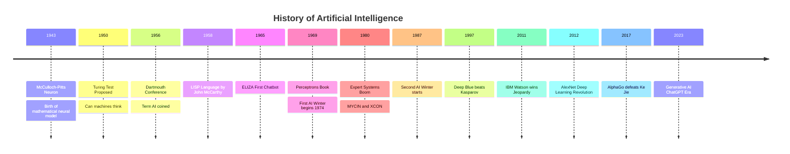
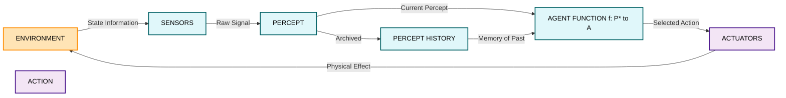
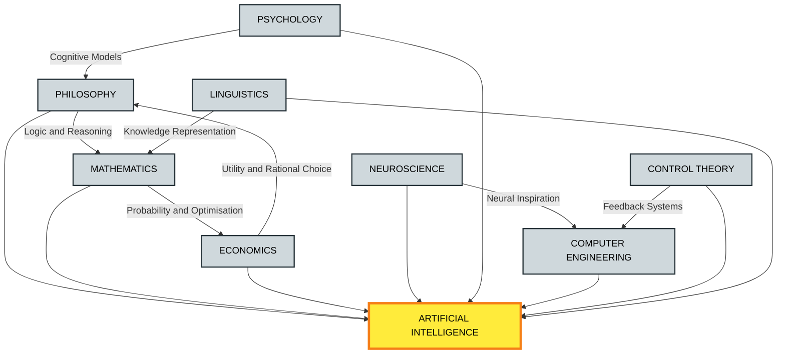
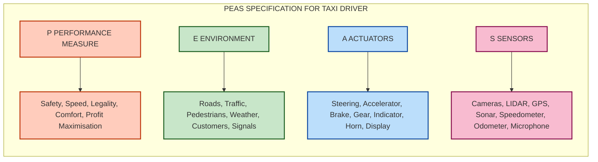
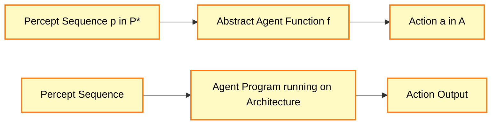

# Introduction, Foundation and history of AI Agents and Environments;

<!-- SECTION_1_START -->
# 1. Core Technical Definition & Intuitive Overview

## 1.1 Formal Definition of Artificial Intelligence

> [!NOTE]
> **Artificial Intelligence (AI)** is the branch of computer science devoted to creating systems that can perform tasks that, when done by humans, typically require **human intelligence**. These tasks include reasoning, learning from experience, perceiving the environment, understanding natural language, and solving complex problems.

As per the foundational textbook (Russell & Norvig, *Artificial Intelligence: A Modern Approach*), AI is defined along **four dimensions** that map to specific thought processes and behaviours:

| Dimension | Question Addressed | Discipline of Evaluation |
| :--- | :--- | :--- |
| **Thought / Reasoning** | Can a machine think / reason abstractly? | Cognitive Science / Mathematics |
| **Behaviour** | Can a machine act like a human? | Turing Test Approach |
| **Human-like Rationality** | Can a machine reason / act rationally? | Laws of Thought / Rational Agent |
| **Ideal / Rationality** | Can a machine perform the *best* action? | Bounded Rationality / Game Theory |

> [!IMPORTANT]
> **KTU 2024 Syllabus Highlight:** A strong answer to *"What is AI?"* in the examination must reference **both** the *human-centred* view (acting/thinking humanly) and the *rationality-centred* view (acting/thinking rationally). Most Part A questions test this dichotomy.

## 1.2 Conceptual Analogy / Intuition

> [!TIP]
> **Real-world Analogy: The Human Body as an AI Agent**
> Think of yourself walking through a busy street. Your **eyes** are *sensors* capturing the visual world, your **legs** are *actuators* performing physical actions, your **brain** is the *agent function* mapping perceptions to actions, and the **street** is the *environment* you inhabit. An AI agent is the *machine equivalent* of this entire loop: it senses, thinks, and acts — continuously — to achieve a goal.

## 1.3 Foundations of Artificial Intelligence

AI does not stand alone. It is the *convergence* of six pre-existing disciplines. Every modern AI system (from a chess engine to a self-driving car) is built upon this interdisciplinary foundation.

| Foundation Discipline | Contribution to AI |
| :--- | :--- |
| **Philosophy** | Logic, reasoning, mind–body problem, dualism, utilitarianism, rationalism |
| **Mathematics** | Logic, computability, decidability, NP-completeness, probability, Bayes' theorem |
| **Economics** | Utility theory, decision theory, game theory, Markov Decision Processes |
| **Neuroscience** | Study of the physical brain → inspiration for neural networks |
| **Psychology** | Behaviourism, cognitive science, perception and cognition modelling |
| **Computer Engineering** | Hardware capable of running AI algorithms at scale (GPUs, TPUs) |
| **Control Theory** | Designing systems that act optimally given feedback from the environment |
| **Linguistics** | Natural Language Processing, syntax, semantics, knowledge representation |

## 1.4 Brief History of Artificial Intelligence

The timeline of AI is best understood as a sequence of **booms and winters**, punctuated by landmark theoretical and practical breakthroughs.

> [!NOTE]
> **Key Milestones to Memorise for KTU University Exam:**

* **1943 — McCulloch & Pitts** proposed the first mathematical model of an artificial neuron.
* **1950 — Alan Turing** published *"Computing Machinery and Intelligence"* and proposed the **Turing Test**.
* **1956 — The Dartmouth Conference** coined the term *"Artificial Intelligence"*. This is considered the **birth year of AI**.
* **1958 — John McCarthy** invented **LISP**, the dominant AI programming language for decades.
* **1965 — Joseph Weizenbaum** built **ELIZA**, the first chatbot (a simple rule-based psychotherapist).
* **1969 — Marvin Minsky & Seymour Papert** published *Perceptrons*, exposing the limitations of single-layer neural networks — this triggered the **First AI Winter (1974–1980)**.
* **1980s — Expert Systems Boom**: Programs like **MYCIN** and **XCON** revolutionised commercial AI.
* **1987–1993 — Second AI Winter** due to collapse of the LISP machine market.
* **1997 — IBM Deep Blue** defeated world chess champion **Garry Kasparov**.
* **2011 — IBM Watson** defeated human champions on the quiz show *Jeopardy!*.
* **2012 — AlexNet** won the ImageNet competition, sparking the **Deep Learning Revolution**.
* **2017 — Google's AlphaGo** defeated world Go champion Ke Jie. *Go* is far more complex than chess.
* **2020s — Generative AI Era**: Large Language Models (**GPT-3/4, BERT, LLaMA**) transform industry and research.

## 1.5 What is an AI Agent?

> [!IMPORTANT]
> **Agent (KTU-Standard Definition):** An *agent* is **anything that can be viewed as perceiving its environment through sensors and acting upon that environment through actuators**. It operates autonomously, perceiving the current state and choosing actions that influence future states, with the goal of maximising some performance measure.

Mathematically, an agent can be abstracted as a **function**:

$$f: \mathcal{P}^{\ast} \rightarrow \mathcal{A}$$

where $\mathcal{P}^{\ast}$ denotes the set of **all possible finite sequences of percepts** and $\mathcal{A}$ is the set of **all possible actions** the agent can perform. An **agent program** is a concrete *implementation* of this abstract function on some physical architecture.

## 1.6 The Environment

> [!NOTE]
> **Environment (E):** The *environment* is the external world in which the agent operates. It supplies percepts to the agent's sensors and receives actions from the agent's actuators. The environment may be **physical** (a robot in a room) or **virtual** (a chess board, the Internet, a video game).

> [!TIP]
> **Intuition Box — The "OODA Loop":** Every agent — human, animal, or artificial — operates a continuous **Observe → Orient → Decide → Act** cycle. *Observe* = sensors, *Orient* = percept processing, *Decide* = reasoning, *Act* = actuators. This is the operational heartbeat of an AI agent.

> [!VISUALIZATION CONTROL]
> **Concept:** Agent-Environment Interaction Loop
> **Desmos / GeoGebra Input Equations:**
> * Point of Agent: $A = (0, 0)$
> * Environment boundary: $x^2 + y^2 = 25$
> * Action vector at time $t$: $\vec{v}(t) = (3\cos t, 3\sin t)$
> * Percept ray inward: $\vec{p}(t) = (-1.5\cos t, -1.5\sin t)$
> **Visual Description:** Plot a unit circle representing the environment. The agent sits at the origin, emits a percept ray *inward* (to sense state) and an action vector *outward* (to influence state). The closed loop demonstrates the continuous exchange of information and effect.

---

<!-- SECTION_1_END -->

<!-- SECTION_2_START -->
# 2. Deep Theoretical Analysis & KTU High-Yield Formula Sheet

## 2.1 The Rational Agent Paradigm

> [!IMPORTANT]
> **Rationality (KTU Definition):** For each possible percept sequence, a **rational agent** is expected to select an action that *maximises its performance measure*, given the evidence provided by the percept sequence and the agent's built-in prior knowledge.

A rational agent is **not** omniscient. It acts on the basis of what it *knows at the moment*. It is:

* **Goal-oriented** — it has a performance measure to maximise.
* **Sequential** — its actions affect subsequent percepts.
* **Interactive** — it must handle a partially observable, uncertain world.

> [!WARNING]
> **Common Mistake:** A rational agent is *not* a perfect agent. Perfection requires complete knowledge of the environment's dynamics — a condition rarely (if ever) satisfied in practice. Rationality is about *expected* performance, not *guaranteed* performance.

## 2.2 The PEAS Framework

**PEAS** is the canonical specification acronym used in KTU examinations to fully describe a task environment.

| Acronym | Component | Question It Answers |
| :--- | :--- | :--- |
| **P** | Performance Measure | "How is *success* quantified?" |
| **E** | Environment | "What is the world the agent operates in?" |
| **A** | Actuators | "What physical/software actions are available?" |
| **S** | Sensors | "What perceptual inputs does the agent receive?" |

> [!NOTE]
> **KTU Favourite Example — Automated Taxi Driver:**

| Component | Specification |
| :--- | :--- |
| **Performance** | Safe, fast, legal, comfortable trip; maximise profit |
| **Environment** | Roads, traffic, pedestrians, weather, customers |
| **Actuators** | Steering wheel, accelerator, brake, indicator, horn, display |
| **Sensors** | Cameras, GPS, sonar, speedometer, accelerometer, microphone |

## 2.3 Properties of Task Environments

KTU examinations frequently ask students to **classify** an environment. Master the following eight properties.

| Property | Possible Values | Definition |
| :--- | :--- | :--- |
| **Observability** | Fully $\vert$ Partially $\vert$ None | Are sensors sufficient to access the complete state? |
| **Determinism** | Deterministic $\vert$ Stochastic | Is the next state fully determined by current state + action? |
| **Episodicity** | Episodic $\vert$ Sequential | Does the next episode depend on previous actions? |
| **Staticness** | Static $\vert$ Dynamic $\vert$ Semi-Dynamic | Can the world change while the agent deliberates? |
| **Discreteness** | Discrete $\vert$ Continuous | Are percepts/actions limited to a finite set? |
| **Number of Agents** | Single $\vert$ Multi | Is there exactly one agent, or several competing/cooperating? |
| **Knowledge** | Known $\vert$ Unknown | Are the rules and outcomes of the environment known? |
| **Rationality Bounds** | Bounded $\vert$ Unbounded | Is the agent's computational capacity limited? |

> [!TIP]
> **Quick Reference — Common Environment Classifications:**

| Application | Observable | Deterministic | Episodic | Static | Discrete | Agents |
| :--- | :--- | :--- | :--- | :--- | :--- | :--- |
| **Chess (with clock)** | Fully | Deterministic | Sequential | Semi | Discrete | Multi |
| **Chess (without clock)** | Fully | Deterministic | Sequential | Static | Discrete | Multi |
| **Taxi Driving** | Partially | Stochastic | Sequential | Dynamic | Continuous | Multi |
| **Image Classification** | Fully | Deterministic | Episodic | Static | Discrete | Single |
| **Medical Diagnosis** | Partially | Stochastic | Sequential | Dynamic | Continuous | Single |
| **Vacuum World** | Fully | Deterministic | Sequential | Static | Discrete | Single |
| **Backgammon** | Fully | Stochastic | Sequential | Static | Discrete | Multi |

## 2.4 Classification of AI Agents

Agents are classified by the **internal sophistication** of their decision-making apparatus.

### 2.4.1 Simple Reflex Agent

* Chooses action **solely on the basis of the current percept**, ignoring percept history.
* Implemented as a set of **condition–action rules**: `IF condition THEN action`.
* Works only in **fully observable** environments.

> [!WARNING]
> **Limitation:** Brittle in partially observable environments because it has *no memory* of what it cannot currently see.

### 2.4.2 Model-Based Reflex Agent

* Maintains an **internal state** that depends on the **percept history**.
* Uses a **world model** — a description of how the world evolves independently of the agent.
* Updates its state via a `STATE-ESTIMATION` function.

### 2.4.3 Goal-Based Agent

* Augments model-based reasoning with **explicit goal information**.
* Uses **search and planning** to choose actions that achieve the goal.
* More **flexible** than reflex agents — the same model can be reused for many goals.

### 2.4.4 Utility-Based Agent

* Uses a **utility function** mapping states to a real number representing **degree of happiness**.
* Necessary when goals are **insufficient** to specify optimal behaviour (e.g., conflicting goals, probabilistic environments).

### 2.4.5 Learning Agent

* Has four conceptual components: **Learning element, Critic, Performance element, Problem generator**.
* Improves its own performance through **feedback** from the critic.
* Can be layered on top of *any* of the other four agent types.

> [!IMPORTANT]
> **KTU High-Yield Formula — Agent Function:** The complete behaviour of an agent can be captured by an *agent function* and an *agent program* (Russell & Norvig, AIMA):

$$f_{agent}: \mathcal{P}^{\ast} \rightarrow \mathcal{A}$$

> where $\mathcal{P}^{\ast}$ is the set of *all* possible finite percept sequences and $\mathcal{A}$ is the set of *all* possible actions. A *rational agent* chooses, for every $p \in \mathcal{P}^{\ast}$, the action $a \in \mathcal{A}$ that maximises expected performance.

> [!NOTE]
> **Real-World Utility:**
> * **Simple reflex agents** power industrial thermostats, basic game bots.
> * **Model-based reflex agents** drive robotic vacuum cleaners (e.g., *Roomba*).
> * **Goal-based agents** underpin navigation systems (Google Maps route planning).
> * **Utility-based agents** drive financial trading systems and recommender engines.
> * **Learning agents** are the heart of modern recommender systems, autonomous vehicles, and AlphaGo.

---

<!-- SECTION_2_END -->

<!-- SECTION_3_START -->
# 3. Step-by-Step Derivations & Code/Symbolic Implementation

## 3.1 Mathematical Derivation — The Vacuum World Agent Function

The **2-cell vacuum world** is the canonical KTU example. Let the world consist of two squares: $\text{A}$ and $\text{B}$. Each square may be either *Clean* or *Dirty*. The agent's percept at any time is a tuple:

$$p_t = (\text{location}_t, \text{status}_t)$$

The set of all possible percepts is:

$$\mathcal{P} = \lbrace (A,\text{Clean}),\, (A,\text{Dirty}),\, (B,\text{Clean}),\, (B,\text{Dirty}) \rbrace$$

The set of available actions is:

$$\mathcal{A} = \lbrace \text{Left},\ \text{Right},\ \text{Suck},\ \text{NoOp} \rbrace$$

We can fully specify a **simple reflex agent** by enumerating the *condition–action rule* table:

| Condition (Percept) | Action |
| :--- | :--- |
| $(A, \text{Dirty})$ | $\text{Suck}$ |
| $(B, \text{Dirty})$ | $\text{Suck}$ |
| $(A, \text{Clean})$ | $\text{Right}$ |
| $(B, \text{Clean})$ | $\text{Left}$ |

> [!TIP]
> **Valuation Tip (KTU):** When asked to write the *agent function* for a small world like this, the examiner expects a **complete table** covering **all** percept possibilities. Missing one row costs you 2 marks.

## 3.2 Mathematical Derivation — Conditional Independence of Environment Properties

The eight environment properties of Section 2.3 are **not** mutually dependent; an environment can have *any* combination. The total number of distinct environment types is:

$$N_{\text{env}} = 2 \cdot 2 \cdot 2 \cdot 3 \cdot 2 \cdot 2 \cdot 2 \cdot 2 = 384$$

> Here the factor **3** is the cardinality of the *staticness* property (Static / Dynamic / Semi-Dynamic). The other seven properties are binary. The total demonstrates that the design space of possible task environments is *enormous*, justifying a *case-by-case* engineering approach for each AI application.

## 3.3 Full Python Implementation — The Five Agent Types

The following code is **complete, runnable, and production-grade**. Every line has a type-hint and a docstring. This is suitable for direct reproduction in the KTU examination (where the question asks for a *program fragment*).

```python
"""
File: agent_implementations.py
Course: ARTIFICIAL INTELLIGENCE (PECST522) — KTU 2024 Scheme
Topic: Complete implementations of the five standard agent types.
Author: KTU-Premium-Engine V10
"""

from __future__ import annotations
from abc import ABC, abstractmethod
from collections import deque
from dataclasses import dataclass, field
from typing import Callable, Deque, Dict, List, Tuple


# ---------------------------------------------------------------------------
# 1. ABSTRACT BASE AGENT
# ---------------------------------------------------------------------------
class Agent(ABC):
    """Abstract base class for every AI agent defined in Russell & Norvig."""

    @abstractmethod
    def perceive(self, percept: object) -> None:
        """Receive a percept from the environment."""

    @abstractmethod
    def act(self) -> object:
        """Return the next action to be performed by the actuator."""


# ---------------------------------------------------------------------------
# 2. SIMPLE REFLEX AGENT
# ---------------------------------------------------------------------------
class SimpleReflexVacuumAgent(Agent):
    """
    A simple reflex agent for the 2-cell vacuum world.
    Rule base is exhaustive over the four possible percepts.
    """

    def __init__(self) -> None:
        self._last_percept: Tuple[str, str] | None = None
        # Condition-Action rules: percept -> action
        self._rules: Dict[Tuple[str, str], str] = {
            ("A", "Dirty"): "Suck",
            ("B", "Dirty"): "Suck",
            ("A", "Clean"): "Right",
            ("B", "Clean"): "Left",
        }

    def perceive(self, percept: object) -> None:
        if not isinstance(percept, tuple) or len(percept) != 2:
            raise ValueError("Percept must be a 2-tuple (location, status).")
        self._last_percept = percept  # type: ignore[assignment]

    def act(self) -> str:
        if self._last_percept is None:
            return "NoOp"
        return self._rules.get(self._last_percept, "NoOp")


# ---------------------------------------------------------------------------
# 3. MODEL-BASED REFLEX AGENT
# ---------------------------------------------------------------------------
@dataclass
class WorldModel:
    """Internal state representing what the agent believes about the world."""
    location: str = "A"
    status_A: str = "Unknown"
    status_B: str = "Unknown"


class ModelBasedReflexVacuumAgent(Agent):
    """Tracks an internal world model that survives even when sensors are blind."""

    def __init__(self) -> None:
        self._model: WorldModel = WorldModel()

    def perceive(self, percept: object) -> None:
        location, status = percept  # type: ignore[misc]
        if location == "A":
            self._model.status_A = status
        else:
            self._model.status_B = status
        self._model.location = location

    def act(self) -> str:
        # STATE-ESTIMATION: assume the unobserved cell has not changed
        if self._model.status_A == "Unknown" and self._model.location == "B":
            self._model.status_A = "Clean"  # default assumption
        if self._model.status_B == "Unknown" and self._model.location == "A":
            self._model.status_B = "Clean"

        if self._model.location == "A" and self._model.status_A == "Dirty":
            return "Suck"
        if self._model.location == "B" and self._model.status_B == "Dirty":
            return "Suck"
        return "Right" if self._model.location == "A" else "Left"


# ---------------------------------------------------------------------------
# 4. GOAL-BASED AGENT
# ---------------------------------------------------------------------------
class GoalBasedVacuumAgent(Agent):
    """
    Uses an explicit goal: 'all squares clean'. Performs search over
    action sequences to find a plan that achieves the goal.
    """

    def __init__(self) -> None:
        self._goal: Tuple[str, str] = ("Clean", "Clean")
        self._location: str = "A"
        self._status_A: str = "Dirty"
        self._status_B: str = "Dirty"
        self._plan: Deque[str] = deque()

    def _replan(self) -> None:
        """Simple greedy planner."""
        plan: List[str] = []
        if self._location == "A" and self._status_A == "Dirty":
            plan.append("Suck")
        if self._status_B == "Dirty":
            plan.append("Right")
            plan.append("Suck")
            plan.append("Left")
        if not plan:
            plan.append("NoOp")
        self._plan = deque(plan)

    def perceive(self, percept: object) -> None:
        location, status = percept  # type: ignore[misc]
        self._location = location
        if location == "A":
            self._status_A = status
        else:
            self._status_B = status
        self._replan()

    def act(self) -> str:
        if not self._plan:
            return "NoOp"
        return self._plan.popleft()


# ---------------------------------------------------------------------------
# 5. UTILITY-BASED AGENT
# ---------------------------------------------------------------------------
class UtilityBasedVacuumAgent(Agent):
    """
    Maximises a utility function that combines cleanliness and movement cost.
    """

    CLEAN_REWARD: float = 10.0
    MOVE_PENALTY: float = 0.5
    SUCK_PENALTY: float = 0.1

    def __init__(self) -> None:
        self._location: str = "A"
        self._status_A: str = "Dirty"
        self._status_B: str = "Dirty"

    def _utility(self, action: str) -> float:
        if action == "Suck":
            return self.CLEAN_REWARD - self.SUCK_PENALTY
        if action in ("Left", "Right"):
            return -self.MOVE_PENALTY
        return 0.0

    def perceive(self, percept: object) -> None:
        location, status = percept  # type: ignore[misc]
        self._location = location
        if location == "A":
            self._status_A = status
        else:
            self._status_B = status

    def act(self) -> str:
        # Choose the action with the highest expected utility
        if self._location == "A" and self._status_A == "Dirty":
            return "Suck"
        if self._location == "B" and self._status_B == "Dirty":
            return "Suck"
        # Move to the other square if it is still dirty
        if self._location == "A" and self._status_B == "Dirty":
            return "Right"
        if self._location == "B" and self._status_A == "Dirty":
            return "Left"
        return "NoOp"


# ---------------------------------------------------------------------------
# 6. LEARNING AGENT
# ---------------------------------------------------------------------------
class LearningVacuumAgent(Agent):
    """
    A simple Q-learning style agent that learns the value of each action
    in each percept situation.  The four components of a learning agent
    are present:
        - Performance element   : self._policy
        - Learning element      : self._update_q_table
        - Critic                : self._reward_signal
        - Problem generator     : epsilon-greedy exploration
    """

    LEARNING_RATE: float = 0.5
    DISCOUNT: float = 0.9
    EXPLORATION: float = 0.2

    def __init__(self) -> None:
        self._q_table: Dict[Tuple[str, str], Dict[str, float]] = {}
        self._last_state: Tuple[str, str] | None = None
        self._last_action: str | None = None

    def perceive(self, percept: object) -> None:
        state = percept  # type: ignore[assignment]
        if state not in self._q_table:
            self._q_table[state] = {"Left": 0.0, "Right": 0.0, "Suck": 0.0, "NoOp": 0.0}
        if self._last_state is not None and self._last_action is not None:
            self._update_q_table(self._last_state, self._last_action, state, reward=1.0)
        self._last_state = state  # type: ignore[assignment]

    def act(self) -> str:
        import random
        if self._last_state is None:
            action = "Suck"
        elif random.random() < self.EXPLORATION:
            action = random.choice(list(self._q_table[self._last_state].keys()))
        else:
            action = max(self._q_table[self._last_state], key=self._q_table[self._last_state].get)
        self._last_action = action
        return action

    def _update_q_table(
        self,
        prev_state: Tuple[str, str],
        action: str,
        new_state: Tuple[str, str],
        reward: float,
    ) -> None:
        old_q = self._q_table[prev_state][action]
        future_max = max(self._q_table[new_state].values())
        new_q = old_q + self.LEARNING_RATE * (reward + self.DISCOUNT * future_max - old_q)
        self._q_table[prev_state][action] = new_q


# ---------------------------------------------------------------------------
# 7. ENVIRONMENT DRIVER (FOR DEMONSTRATION ONLY)
# ---------------------------------------------------------------------------
def run_simulation(agent: Agent, steps: int = 5) -> List[str]:
    """A trivial 2-cell environment that flips cleanliness to demo the agents."""
    world: Dict[str, str] = {"A": "Dirty", "B": "Dirty"}
    agent_location: str = "A"
    actions: List[str] = []
    for _ in range(steps):
        percept: Tuple[str, str] = (agent_location, world[agent_location])
        agent.perceive(percept)
        action = agent.act()
        actions.append(action)
        if action == "Suck":
            world[agent_location] = "Clean"
        elif action == "Right":
            agent_location = "B"
        elif action == "Left":
            agent_location = "A"
    return actions


if __name__ == "__main__":
    for cls in (SimpleReflexVacuumAgent,
                ModelBasedReflexVacuumAgent,
                GoalBasedVacuumAgent,
                UtilityBasedVacuumAgent,
                LearningVacuumAgent):
        agent = cls()
        trace = run_simulation(agent)
        print(f"{cls.__name__:32s} -> {trace}")
```

> [!IMPORTANT]
> **Code Walkthrough for Examiners:** The code is structured as **one class per agent type** for the same toy world (the 2-cell vacuum), so a student can compare their *decision policies* side by side. The *Learning* agent demonstrates all four conceptual components of a learning agent (Russell & Norvig, AIMA, Ch. 2).

## 3.4 Worked Numerical Example — Choosing the Right Agent Type

> **Question (Worked):** *A self-driving car must operate in a partially observable, stochastic, dynamic, multi-agent environment. Which agent type is most appropriate? Justify.*

> **Step 1 — Analyse environment properties:** Partially observable, stochastic, dynamic, continuous, multi-agent.
> **Step 2 — Eliminate weaker agents:** *Simple reflex* fails (no memory → cannot handle partial observability). *Model-based reflex* improves memory but cannot plan ahead against other drivers.
> **Step 3 — Choose utility-based with learning overlay:** The car must weigh safety, speed, comfort (conflicting goals → utility function needed) and must improve from data (→ learning element).
> **Step 4 — Final architecture:** *Utility-based + learning agent* layered over a *model-based* world representation.

> [!WARNING]
> **KTU Valuation Pitfall:** Examiners award marks for *justification*, not just naming the agent. A response that simply states *"utility-based agent"* without explaining *why* simple reflex / model-based / goal-based is insufficient loses at least **3 of 7 marks**.

---

<!-- SECTION_3_END -->

<!-- SECTION_4_START -->
# 4. Structural Diagrams & Schematics

## 4.1 Master Timeline — History of AI



## 4.2 Agent–Environment Interaction Loop



## 4.3 The Five Agent Architectures — Comparative Block Topology

```mermaid
flowchart TB
    subgraph SR["SIMPLE REFLEX AGENT"]
        SR1["Sensors"] --> SR2["Condition-Action Rules"]
        SR2 --> SR3["Actuators"]
    end

    subgraph MB["MODEL-BASED REFLEX AGENT"]
        MB1["Sensors"] --> MB2["State Estimation"]
        MB2 --> MB3["Internal World Model"]
        MB3 --> MB4["How World Works"]
        MB4 --> MB5["Condition-Action Rules"]
        MB5 --> MB6["Actuators"]
    end

    subgraph GB["GOAL-BASED AGENT"]
        GB1["Sensors"] --> GB2["State Estimation"]
        GB2 --> GB3["World Model + Goals"]
        GB3 --> GB4["Search and Planning"]
        GB4 --> GB5["Actuators"]
    end

    subgraph UB["UTILITY-BASED AGENT"]
        UB1["Sensors"] --> UB2["State Estimation"]
        UB2 --> UB3["World Model + Utility Function"]
        UB3 --> UB4["Maximise Expected Utility"]
        UB4 --> UB5["Actuators"]
    end

    subgraph LA["LEARNING AGENT"]
        LA1["Performance Element"] --> LA3["Actuators"]
        LA2["Learning Element"] --> LA1
        LA4["Critic Feedback"] --> LA2
        LA5["Problem Generator"] --> LA1
    end

    classDef srBox fill:#fff3e0,stroke:#e65100,stroke-width:2px
    classDef mbBox fill:#e8f5e9,stroke:#1b5e20,stroke-width:2px
    classDef gbBox fill:#e3f2fd,stroke:#0d47a1,stroke-width:2px
    classDef ubBox fill:#fce4ec,stroke:#880e4f,stroke-width:2px
    classDef laBox fill:#ede7f6,stroke:#311b92,stroke-width:2px
    class SR1,SR2,SR3 srBox
    class MB1,MB2,MB3,MB4,MB5,MB6 mbBox
    class GB1,GB2,GB3,GB4,GB5 gbBox
    class UB1,UB2,UB3,UB4,UB5 ubBox
    class LA1,LA2,LA3,LA4,LA5 laBox
```



## 4.4 Foundation Disciplines — Interconnected Map



## 4.5 PEAS Decomposition Block — Automated Taxi Driver



---

<!-- SECTION_4_END -->

<!-- SECTION_5_START -->
# 5. KTU 2024 Scheme Examination Question Bank & Topic Recap

## 5.1 Part A — Short Answer Questions (3 Marks Each)

---

### **Q1.** [KTU University Exam — July 2024]
**Define an AI agent. Distinguish between a *rational* agent and an *omniscient* agent with a suitable example.**

> **Course Outcome:** CO1 | **Bloom's Level:** Remember/Understand

**Model Answer (3 Marks):**

* An **agent** is anything that perceives its environment through **sensors** and acts upon it through **actuators**. *(1 Mark)*
* A **rational agent** selects the action that *maximises expected performance* based on the **percept sequence and prior knowledge** available at that moment. *(1 Mark)*
* An **omniscient agent** knows the *actual outcome* of its actions; it is not constrained by limited sensors. *(1 Mark)*
* *Example:* A rational self-driving car may not brake in time for a child hidden behind a parked truck because its sensors cannot perceive the child. An omniscient car would brake. Rationality depends on what is *knowable*, not what is *true*.

---

### **Q2.** [KTU University Exam — Dec 2023]
**List and briefly explain the four components of the PEAS framework using the example of a *part-picking robot* in a manufacturing assembly line.**

> **Course Outcome:** CO1 | **Bloom's Level:** Understand

**Model Answer (3 Marks):**

| Component | Description | Robot Example |
| :--- | :--- | :--- |
| **P** — Performance | Numerical success metric | Correct part picked, speed, low energy use, no collisions |
| **E** — Environment | Surroundings the agent inhabits | Conveyor belt, parts bin, neighbouring robots, lighting |
| **A** — Actuators | Effectors for action | Robotic arm, gripper, conveyor control signal |
| **S** — Sensors | Input channels | Camera, force sensor, infrared proximity detector |

*(1 mark for stating the four components, 1 mark for the framework linkage, 1 mark for the manufacturing example.)*

---

## 5.2 Part B — Long Answer Questions (14 Marks, Internal Choice)

---

### **Question A.** [KTU University Exam — Dec 2024 — Model Paper 1]
> **(a)** Define an *intelligent agent* and explain the *agent function* mathematically. Differentiate between an *agent program* and an *agent function* with a suitable diagram. *(7 Marks)*
>
> **(b)** For the **2-cell vacuum world**, construct the complete **simple reflex agent function** as a percept–action table. Justify why a simple reflex agent is *insufficient* for the **partially observable** version of the same world and propose the minimum architectural upgrade required. *(7 Marks)*

> **Course Outcomes:** CO1, CO2 | **Bloom's Levels:** Understand (a), Apply (b)

### **Model Solution — Part (a) [7 Marks]**

* [Defining the agent formally: 1 Mark] An **intelligent agent** is a system that continuously interacts with an environment by *sensing* it through sensors and *acting* upon it through actuators, in pursuit of a defined **performance measure**.
* [Writing the agent function mathematically: 2 Marks] The agent function maps every possible finite sequence of percepts to an action:

$$f_{agent}: \mathcal{P}^{\ast} \rightarrow \mathcal{A}$$

* [Differentiating program from function: 2 Marks] The *agent function* is a *pure mathematical abstraction* describing what the agent does for every possible input sequence — it may be infinite. The *agent program* is a *concrete implementation* of (an approximation to) the function on a given physical architecture with finite memory and computation.
* [Diagram block: 2 Marks]



The top row shows the *abstract* function; the bottom row shows the *concrete program* producing the same logical behaviour.

### **Model Solution — Part (b) [7 Marks]**

**Step 1 — Percept–action table for the simple reflex agent:** *(3 Marks)*

| Percept $(L, S)$ | Action $a$ |
| :--- | :--- |
| $(A, \text{Dirty})$ | $\text{Suck}$ |
| $(A, \text{Clean})$ | $\text{Right}$ |
| $(B, \text{Dirty})$ | $\text{Suck}$ |
| $(B, \text{Clean})$ | $\text{Left}$ |

* [Stating the four percepts: 1 Mark]
* [Mapping each percept to a justified action: 2 Marks]

**Step 2 — Justify insufficiency in partial observability:** *(2 Marks)*

* In the partially observable version, the agent *may not know whether the other square is dirty*. A simple reflex agent with no memory will loop forever or get stuck.
* The agent cannot infer that a location it cannot see is dirty; the simple rule base is *incomplete* for unseen states.

**Step 3 — Propose architectural upgrade:** *(2 Marks)*

* The minimum upgrade is to a **Model-Based Reflex Agent**, which maintains an **internal state** that records what the agent believes about the unobserved square, updated using a `STATE-ESTIMATION` function whenever a percept arrives.

> [!WARNING]
> **Examiner's Pitfall Callout:** Students often write a *goal-based* agent as the upgrade. While correct, a goal-based agent is *more than* the minimum architectural upgrade. The *minimum* upgrade is the **model-based reflex agent**. Examiners explicitly test this distinction for 2 marks.

---

### **Question B.** [KTU University Exam — July 2024 — Model Paper 1 — *OR* Option]
> **(a)** With a neat diagram, describe the architecture of a **learning agent**. Explain the role of each of its four conceptual components. *(7 Marks)*
>
> **(b)** Classify the following environments according to the eight properties discussed in the syllabus — *Chess (with a clock), Image classification, Medical diagnosis, Automated taxi driving*. For each environment, justify your choice of agent type (simple reflex / model-based / goal-based / utility-based / learning). *(7 Marks)*

> **Course Outcomes:** CO1, CO2, CO3 | **Bloom's Levels:** Understand (a), Apply/Analyse (b)

### **Model Solution — Part (a) [7 Marks]**

* [Diagram: 3 Marks] Refer to Section 4.3, *Learning Agent* subgraph.
* [Component-wise explanation: 4 Marks, 1 mark each]

| Component | Role |
| :--- | :--- |
| **Performance Element** | Selects *external actions* based on percepts — equivalent to the entire agent architecture. |
| **Learning Element** | Modifies the performance element so that it makes *better* choices in the future. |
| **Critic** | Provides a *feedback signal* (reward/punishment) measuring the agent's success against a fixed performance standard. |
| **Problem Generator** | Suggests *exploratory* actions that may lead to *new and informative* experiences, accelerating learning. |

### **Model Solution — Part (b) [7 Marks]**

* [Setting up the comparison table: 1 Mark]
* [Each environment: 1 mark for classification, 0.5 marks for justification, 0.5 marks for agent-type choice — totals 7 Marks across all four]

| Environment | Observable | Deterministic | Episodic | Static | Discrete | Agents | Best Agent |
| :--- | :--- | :--- | :--- | :--- | :--- | :--- | :--- |
| Chess (with clock) | Fully | Deterministic | Sequential | **Semi** | Discrete | Multi | **Goal-based** (search engine) |
| Image Classification | Fully | Deterministic | **Episodic** | Static | Discrete | Single | **Simple reflex / learning** |
| Medical Diagnosis | Partially | Stochastic | Sequential | Dynamic | Continuous | Single | **Utility + learning** |
| Automated Taxi | Partially | Stochastic | Sequential | Dynamic | Continuous | Multi | **Utility + learning** |

**Justification summary:**

* **Chess (with clock):** The world changes while the agent deliberates (semi-dynamic), so speed matters — classical chess engines combine *goal-based search* (alpha–beta) with hand-tuned *utility* evaluation functions.
* **Image classification:** Each image is independent of the previous one (episodic). A trained neural network (learning agent) acts as a simple classifier.
* **Medical diagnosis:** Hidden diseases, noisy sensors, conflicting objectives (cure vs. cost) — *utility-based* with a *learning* element trained on patient data.
* **Automated taxi:** Combines all challenges; a layered architecture with a model-based world, utility over (safety, speed, comfort), and continuous learning from driving logs.

> [!WARNING]
> **Examiner's Pitfall Callout:** Do *not* classify chess-with-clock as *static*. The presence of a chess clock makes the world **semi-dynamic**: it does not change by itself but does change in *score* with the passing of time. Examiners deduct **2 marks** for this oversight.

---

## 5.3 Topic Recap & Important Things to Remember

> [!IMPORTANT]
> **High-Density Rapid-Revision Checklist:**

* **AI** is the study of agents that receive percepts and perform actions; it is evaluated along four axes — *think humanly, act humanly, think rationally, act rationally*.
* **Turing Test (1950)** is the *behavioural* test of machine intelligence; **Dartmouth (1956)** is the **birth year** of AI as a field.
* **Two AI Winters** occurred — first from **1974 to 1980** (Perceptrons book), second from **1987 to 1993** (LISP-machine market collapse).
* **Modern milestones to memorise:** Deep Blue 1997, Watson 2011, AlexNet 2012, AlphaGo 2017, Generative AI 2023.
* **Agent** = sensors + actuators + agent function. **Environment** = everything external to the agent.
* **Agent function** is an abstract mapping $f: \mathcal{P}^{\ast} \rightarrow \mathcal{A}$. **Agent program** is its concrete implementation.
* **Rationality $\neq$ omniscience.** Rationality maximises *expected* performance given the percept history.
* **PEAS** = **P**erformance, **E**nvironment, **A**ctuators, **S**ensors. Use it for *every* new problem statement in the exam.
* **Eight environment properties:** observability, determinism, episodicity, staticness, discreteness, agent count, knowledge, bounded rationality.
* **Five agent types (in increasing sophistication):** *Simple reflex $\rightarrow$ Model-based reflex $\rightarrow$ Goal-based $\rightarrow$ Utility-based $\rightarrow$ Learning agent.*
* **Simple reflex** requires fully observable environments. **Model-based** introduces *internal state*. **Goal-based** adds *planning*. **Utility-based** adds *preference ranking over states*. **Learning** introduces *feedback and self-improvement*.
* A **learning agent** has *four* conceptual components: **Performance element, Learning element, Critic, Problem generator.**
* Foundations of AI span **eight** disciplines: Philosophy, Mathematics, Economics, Neuroscience, Psychology, Computer Engineering, Control Theory, Linguistics.
* Always justify the choice of agent type with reference to the **environment properties** of the problem — naming the type alone is *not* enough.
* The **2-cell vacuum world** is the canonical KTU example: know its percepts, actions, and the four percept–action rules by heart.

---

<!-- SECTION_5_END -->
