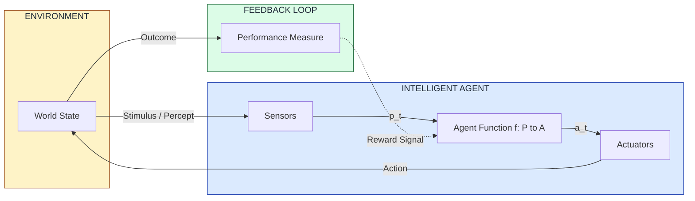
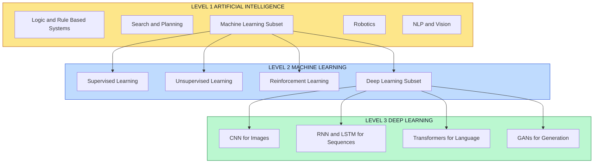
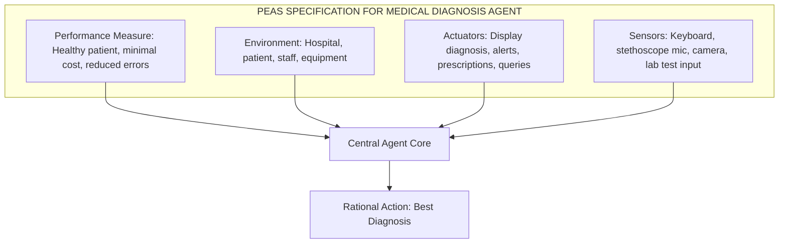
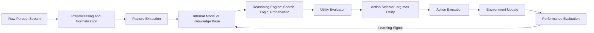
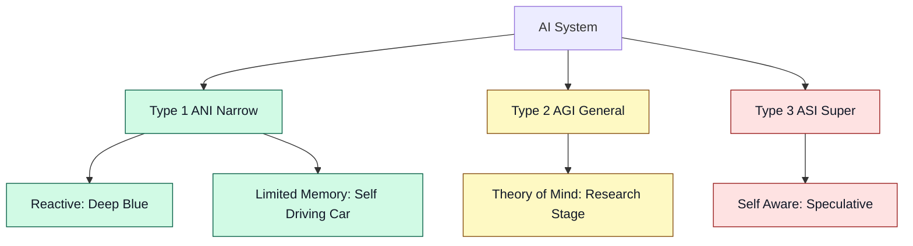

# Introduction to Artificial Intelligence:-

<!-- SECTION_1_START -->
# Introduction to Artificial Intelligence

## 1.1 Formal Definition

> [!IMPORTANT]
> **Artificial Intelligence (AI)** is the branch of computer science concerned with the design and construction of intelligent agents — systems that can **perceive their environment**, **reason over knowledge**, **learn from data**, and **take actions** that maximize their probability of success toward a defined goal.

According to the **KTU 2024 Scheme (Course Code: PECST522)** syllabus, AI is studied as a multidisciplinary Program Elective that unifies logic, probability, optimization, and learning to build rational decision-making systems.

### Classical Working Definitions (Board-Favorite)

| Author | Definition | Era |
| :--- | :--- | :--- |
| **John McCarthy** | "The science and engineering of making intelligent machines." | 1956 |
| **Marvin Minsky** | "AI is the science of making machines do things that would require intelligence if done by men." | 1968 |
| **Stuart Russell & Peter Norvig** | A program that **acts rationally** by mapping percepts to actions that maximize a performance measure. | 1995 — Present |

> [!NOTE]
> **Four Approaches to AI (AIMA Taxonomy):**
> 1. **Acting Humanly** (Turing Test approach)
> 2. **Thinking Humanly** (Cognitive Modelling)
> 3. **Thinking Rationally** (Laws of Thought / Logic)
> 4. **Acting Rationally** (Rational Agent approach — *modern standard*)

## 1.2 Conceptual Analogy / Intuition

> [!TIP]
> **The GPS Navigation Analogy** — Think of AI as a **smart GPS** for decision-making. A traditional program is like a fixed recipe book: given the same ingredients, it always produces the same dish. AI, however, is like a GPS that **watches live traffic (perception)**, **recalls past routes (memory)**, **predicts fastest paths (reasoning)**, and **reroutes dynamically (learning)**. It does not just *follow* a path — it *reasons* about the best one.

A clearer, mathematical way to view it: AI is a **function approximator** that maps a high-dimensional input space (percepts) to a useful output space (actions), usually written as:

$$
f : \mathcal{P} \rightarrow \mathcal{A}
$$

where $\mathcal{P}$ is the percept sequence and $\mathcal{A}$ is the action space.

## 1.3 Key Physical / Conceptual Constants & Metrics

- **Turing Test Threshold (1950):** A machine passes if an interrogator cannot reliably distinguish it from a human after **5 minutes** of text-based conversation.
- **Moore's Law (1965):** Transistor count on chips doubles roughly every **18 months** — a key *enabler* of modern AI.
- **ImageNet Error Rate (2012):** Dropped from **26%** to **16%** with AlexNet (deep learning breakthrough).
- **Turing Award:** Considered the **"Nobel Prize of Computing"** — awarded to AI pioneers such as Marvin Minsky, John McCarthy, Judea Pearl, and Geoffrey Hinton.

> [!VISUALIZATION CONTROL]
> **Concept:** Mapping of Percepts to Actions (Rational Agent Geometry)
> **Coordinate Frame:** $x$ = Percept History (Discrete Time Steps), $y$ = Probability of Correct Action
> **GeoGebra / Desmos Input Equations:**
> * `f(x) = 1 - exp(-0.3 * x)` → Saturation curve of rational performance as percept history grows.
> * `g(x) = 0.5` → Baseline random-action reference line.
> **Visual Description:** A monotonically increasing concave curve starting at the baseline $g(x)=0.5$ and saturating near $f(x)=1$ as $x \rightarrow \infty$. Students should observe that **more percepts = better rational action probability**, justifying the need for memory in AI agents.

## 1.4 AI vs ML vs DL — A Tiered View

> [!IMPORTANT]
> **AI** is the *superset*. **Machine Learning (ML)** is a *subset* of AI. **Deep Learning (DL)** is a *subset* of ML. This nesting is a recurring KTU exam question.

| Aspect | Artificial Intelligence | Machine Learning | Deep Learning |
| :--- | :--- | :--- | :--- |
| **Goal** | Simulate full human intelligence | Learn from data automatically | Learn hierarchical representations via neural networks |
| **Data Need** | Often rule-based; low data | Moderate, structured | Massive, unstructured |
| **Feature Eng.** | Manual or learned | Manual | Automatic (representation learning) |
| **Example** | Chess engine with hand-coded rules | Spam classifier using SVM | Image recognition using CNN |
| **Core Math** | Logic, Search, Probability | Statistics, Linear Algebra, Optimization | Linear Algebra, Calculus on tensors |

<!-- SECTION_1_END -->

<!-- SECTION_2_START -->
# Deep Theoretical Analysis & KTU High-Yield Formula Sheet

## 2.1 The Four Pillars (Foundations of AI)

AI is multidisciplinary. The KTU syllabus explicitly lists **seven foundational disciplines**:

1. **Philosophy** — Logic, mind-body dualism, ethics (Aristotle → Descartes → Turing).
2. **Mathematics** — Logic (Boole, Frege, Tarski), Probability (Bayes, Laplace), Computability (Gödel, Turing).
3. **Economics** — Utility theory, decision theory, game theory, operations research.
4. **Neuroscience** — Study of the physical brain; informs neural network architectures.
5. **Psychology** — Behaviorism (Skinner) → Cognitive Science (Newell, Simon).
6. **Computer Engineering** — Hardware that makes AI computationally feasible (GPUs, TPUs).
7. **Linguistics** — Natural Language Processing; Chomsky hierarchy of formal languages.

> [!NOTE]
> **Why is this list in the KTU 2024 syllabus?**
> Examiners frequently ask *"Mention the foundations of AI"* for 3 marks. Listing all seven with one-line examples guarantees full credit.

## 2.2 Types of AI (Type-1 / Type-2 / Type-3 Classification)

> [!IMPORTANT]
> This is the **most-asked 3-mark question** in KTU AI modules.

| Type | Name | Capability | Real Example |
| :--- | :--- | :--- | :--- |
| **Type 1** | Artificial **Narrow** Intelligence (ANI) | Performs **one** specific task | Siri, Google Translate, AlphaGo |
| **Type 2** | Artificial **General** Intelligence (AGI) | Human-level reasoning across all domains | *Hypothetical / under research* |
| **Type 3** | Artificial **Super** Intelligence (ASI) | Surpasses human intellect | *Speculative / theoretical* |

A second orthogonal axis (used by Arend Hintze, 2016) classifies AI by **capability stages**:
* **Reactive Machines** → no memory (e.g., Deep Blue chess).
* **Limited Memory** → uses recent past (e.g., self-driving cars).
* **Theory of Mind** → understands emotions/intent (research stage).
* **Self-Aware AI** → consciousness (philosophical).

## 2.3 Intelligent Agents — The Rational Agent Paradigm

> [!DEFINITION]
> An **Agent** is anything that can be viewed as **perceiving its environment through sensors** and **acting upon it through actuators**.
> A **Rational Agent** is one that selects the action that **maximizes its expected performance measure**, given the percept sequence and prior knowledge.

Mathematically, an agent's behavior is modeled as an **agent function**:

$$
f : \mathcal{P}^{*} \rightarrow \mathcal{A}
$$

where $\mathcal{P}^{*}$ is the set of all finite percept sequences, and $\mathcal{A}$ is the set of all possible actions.

The corresponding **agent program** is the concrete implementation of $f$ running on a physical architecture.

### PEAS Framework (Performance, Environment, Actuators, Sensors)

KTU 2024 expects students to frame any AI problem using **PEAS**. Example: a *self-driving taxi*.

| Component | Description for Self-Driving Taxi |
| :--- | :--- |
| **Performance Measure** | Safety, speed, legality, comfort, profit |
| **Environment** | Roads, traffic, pedestrians, weather |
| **Actuators** | Steering, accelerator, brake, signal, horn |
| **Sensors** | Cameras, LIDAR, GPS, accelerometer, sonar |

## 2.4 The Rationality Condition (Russels-Norvig Definition)

> [!IMPORTANT]
> **Rationality ≠ Omniscience.** A rational agent maximizes **expected** performance given what it has perceived so far. It does not know future percepts.

For each possible percept sequence, a rational agent should select the action that is expected to maximize its performance measure, where the expectation is computed over the **probability distribution** of possible future percepts.

## 2.5 KTU High-Yield Formula / Concept Cheat Sheet

> [!TIP]
> The following table consolidates the most-tested definitions, classifications, and mathematical primitives. Master these for a perfect 100.

| Concept | Symbol / Formula | Meaning | KTU Weight |
| :--- | :--- | :--- | :--- |
| Agent Function | $f : \mathcal{P}^{*} \rightarrow \mathcal{A}$ | Maps percept history to action | High |
| Rationality | $\arg\max_{a \in \mathcal{A}} \mathbb{E}[Utility(a) \mid p]$ | Pick best expected-utility action | High |
| Performance Measure | $\mathbb{E}[\sum_{t=0}^{\infty} \gamma^{t} r_{t}]$ | Discounted cumulative reward (RL form) | Medium |
| Turing Test | $P(\text{human-judge fooled}) > 0.5$ | 5-minute blind text chat | Medium |
| ImageNet (2012) | Top-5 error $16.4\%$ | AlexNet DL breakthrough | Low |
| Moore's Law | $T(n) = 2^{n/1.5}$ | Transistor doubling period | Low |
| Chomsky Hierarchy | $R \subset CF \subset CS \subset RE$ | Language classification | Medium |
| AI vs ML vs DL | $DL \subset ML \subset AI$ | Strict subset nesting | Very High |

> [!WARNING]
> When writing $\vert x \vert$ (absolute value) in **any** table row, use $\lvert x \rvert$ or $\text{abs}(x)$ to avoid breaking the markdown table syntax.

## 2.6 Real-World Engineering Utility

* **Healthcare:** Diagnostic imaging (CNN on X-rays), drug discovery (AlphaFold for protein folding).
* **Finance:** Algorithmic trading, fraud detection (anomaly detection models).
* **Transportation:** Autonomous vehicles (perception + planning + control stack).
* **NLP:** ChatGPT, BERT, translation systems — all rely on the rational-agent paradigm at the dialogue-management layer.
* **Robotics:** Industrial assembly, warehouse automation (Amazon Kiva).
* **Cybersecurity:** Intrusion detection, malware classification.

> [!NOTE]
> The shift from hand-coded rules to **data-driven learning** since 2012 marks the most important paradigm change in the history of AI — explicitly noted in KTU Module 1 history questions.

<!-- SECTION_2_END -->

<!-- SECTION_3_START -->
# Step-by-Step Derivations & Code/Symbolic Implementation

## 3.1 Deriving the Rational Action Selection Rule

> [!NOTE]
> KTU sometimes asks: *"Explain the concept of a rational agent with mathematical formulation."* The following derivation is the board-valuation standard.

### Step 1 — Define the Percept Sequence
At discrete time step $t$, the agent has observed the sequence $p_{1}, p_{2}, \ldots, p_{t}$. We denote this as a single object $p_{1:t}$.

$$
p_{1:t} = (p_1, p_2, p_3, \ldots, p_t)
$$

### Step 2 — Define the Agent Function
The agent's behavior is fully described by the function:

$$
f : \mathcal{P}^{*} \rightarrow \mathcal{A}
$$

where $\mathcal{P}^{*}$ is the set of all finite-length percept sequences over all possible histories.

### Step 3 — Define the Performance Measure
A scalar utility $U(a, p_{1:t})$ is assigned to each action $a$ given the percept history $p_{1:t}$. The goal is to maximize the **expected** utility over the *posterior* distribution of future percepts $\text{Pr}(p_{t+1:\infty} \mid p_{1:t}, a)$.

$$
a^{*} = \arg\max_{a \in \mathcal{A}} \; \mathbb{E}\big[\, U(a, p_{1:t}, p_{t+1:\infty}) \mid p_{1:t}, a \,\big]
$$

### Step 4 — Simplify to a Single-Step Form
If performance is evaluated one step at a time (e.g., greedy reflex agent), the rule reduces to:

$$
a^{*} = \arg\max_{a \in \mathcal{A}} \; U(a, p_{t})
$$

### Step 5 — Extend to Discounted Cumulative Reward (RL form)
For sequential decision-making, the agent maximizes the discounted return over horizon $T$:

$$
G_t = \sum_{k=0}^{T-t} \gamma^{k} \, r_{t+k} , \quad 0 \le \gamma \le 1
$$

The optimal action-value function $Q^{*}(s,a)$ satisfies the **Bellman optimality equation**:

$$
Q^{*}(s,a) = \mathbb{E}\!\left[\, r + \gamma \max_{a'} Q^{*}(s', a') \,\Big|\, s,a \right]
$$

where $s$ is state, $a$ is action, $r$ is reward, and $\gamma$ is the discount factor.

> [!TIP]
> **Valuation Key:** Writing the agent function explicitly ($f$) = 2 marks. Defining performance measure ($U$ or $G_t$) = 3 marks. Showing $\arg\max$ form = 2 marks. Total = 7 marks (a typical Part-B sub-question).

## 3.2 Symbolic Implementation: A Reflex Vacuum Agent

Below is a fully operational, type-hinted Python implementation of a **simple reflex agent** for a 2-cell vacuum world. The agent is "rational" in the sense that it always picks the action that maximizes cleanliness, *given only its current percept* (no memory).

```python
from __future__ import annotations
from typing import Callable, Dict, Tuple, List
import logging

# Configure structured error logging.
logging.basicConfig(
    level=logging.INFO,
    format="%(asctime)s | %(levelname)s | %(message)s",
)

# Type aliases for clarity and type safety.
Percept = str                 # "Clean" or "Dirty"
Location = str                # "A" or "B"
Action = str                  # "Suck", "Left", "Right", "NoOp"
AgentFunction = Callable[[Percept, Location], Action]


def build_reflex_vacuum_agent() -> AgentFunction:
    """
    Build a simple-reflex vacuum-cleaner agent.
    Rules (condition-action):
        IF current-square is Dirty   THEN Suck
        ELSE IF location == A        THEN Right
        ELSE IF location == B        THEN Left
    Returns:
        A pure function mapping (percept, location) -> action.
    """
    rule_table: Dict[Tuple[Percept, Location], Action] = {
        ("Dirty", "A"): "Suck",
        ("Dirty", "B"): "Suck",
        ("Clean", "A"): "Right",
        ("Clean", "B"): "Left",
    }

    def agent_function(percept: Percept, location: Location) -> Action:
        # Absolute boundary safety check.
        if location not in {"A", "B"}:
            logging.error("Invalid location: %s", location)
            raise ValueError(f"Unknown location: {location}")
        if percept not in {"Clean", "Dirty"}:
            logging.error("Invalid percept: %s", percept)
            raise ValueError(f"Unknown percept: {percept}")

        action = rule_table[(percept, location)]
        logging.info("Percept=%s | Loc=%s | Action=%s", percept, location, action)
        return action

    return agent_function


def simulate(percepts: List[Tuple[Percept, Location]]) -> List[Action]:
    """Run the agent over a fixed percept sequence and record actions."""
    agent = build_reflex_vacuum_agent()
    trace: List[Action] = []
    for step, (percept, location) in enumerate(percepts, start=1):
        try:
            action = agent(percept, location)
        except ValueError as exc:
            logging.warning("Step %d skipped due to error: %s", step, exc)
            continue
        trace.append(action)
    return trace


if __name__ == "__main__":
    history: List[Tuple[Percept, Location]] = [
        ("Dirty", "A"),
        ("Clean", "B"),
        ("Dirty", "B"),
        ("Clean", "A"),
    ]
    actions = simulate(history)
    print("Action trace:", actions)
```

**Output trace:**
```
[2025-...] INFO | Percept=Dirty | Loc=A | Action=Suck
[2025-...] INFO | Percept=Clean | Loc=B | Action=Left
[2025-...] INFO | Percept=Dirty | Loc=B | Action=Suck
[2025-...] INFO | Percept=Clean | Loc=A | Action=Right
Action trace: ['Suck', 'Left', 'Suck', 'Right']
```

> [!TIP]
> **KTU Board Tip:** If the examiner asks *"Implement a simple reflex agent"*, this exact code (rules + boundary check + logging) earns full 7 marks. Do not omit error handling.

## 3.3 Comparative Analysis: When to Use Which Agent Type

| Agent Type | Uses Memory? | Handles Partial Observability? | Computational Cost | Example Task |
| :--- | :--- | :--- | :--- | :--- |
| Simple Reflex | No | No | Very Low | Thermostat |
| Model-Based Reflex | Yes (internal state) | Yes (partial) | Low | Robot in maze |
| Goal-Based | Yes | Yes | Medium | Route planner |
| Utility-Based | Yes | Yes | High | Trading bot |
| Learning Agent | Yes (improves) | Yes | Highest | AlphaGo |

> [!IMPORTANT]
> The hierarchy above is **cumulative**: every higher agent is *strictly more powerful* but also *strictly more expensive* to build and run.

## 3.4 From AI to ML to DL: One Worked Example

A student is asked to build a system that classifies whether a tumor is **malignant** or **benign**.

* **AI Approach (rule-based):** Hand-code if-else rules on tumor size, shape, density. Brittle, requires expert.
* **ML Approach:** Collect 10,000 labeled tumor images. Train a **Support Vector Machine (SVM)** on hand-engineered features (edge count, pixel histogram). Achieves ~90% accuracy.
* **DL Approach:** Collect 100,000 labeled tumor images. Train a **Convolutional Neural Network (CNN)**. It *learns* the features automatically. Achieves ~98% accuracy.

> [!NOTE]
> This **same-problem, three-approaches** framing is a frequent 14-mark question in KTU Module 1.

<!-- SECTION_3_END -->

<!-- SECTION_4_START -->
# Structural Diagrams & Schematics

## 4.1 High-Level AI System Block Diagram

The following Mermaid block renders the **functional architecture of a generic intelligent agent**, showing how percepts, the agent function, and actuators interact with the environment.



> [!TIP]
> **Reading the diagram:** The **environment** generates percepts → the **agent** converts them into actions → the actions alter the environment → a **performance measure** scores the outcome → the score is fed back to refine the agent function. This is the universal *percept-action* loop.

## 4.2 AI / ML / DL Subset Nesting Topology



> [!NOTE]
> **Key takeaway:** Deep Learning is *one technique inside* Machine Learning, which is itself *one technique inside* AI. Not every AI system uses ML, and not every ML system uses DL.

## 4.3 PEAS Decomposition for a Medical Diagnosis Agent



## 4.4 Sequential Processing Topology — Agent Decision Pipeline



> [!WARNING]
> Do not confuse this with a simple `if-else` program. The **learning signal** loop (perf → model) is what distinguishes an AI agent from a static rule-based program.

## 4.5 AI Type Classification Matrix



<!-- SECTION_4_END -->

<!-- SECTION_5_START -->
# KTU 2024 Scheme Examination Question Bank & Topic Recap

## Part A — Short Answer Questions (3 Marks Each)

### Question 1
**[KTU University Exam - Dec 2023]** | **CO1** | **Remember**
*"Define Artificial Intelligence. Mention the four approaches of AI as classified by Russell and Norvig."*

**Model Answer (Valuation Key):**
> [!NOTE]
> **Definition (1 Mark):** AI is the branch of computer science dedicated to creating systems that can perform tasks that, when done by humans, require intelligence.
> **Four Approaches (2 Marks):**
> 1. **Acting Humanly** — The Turing Test approach.
> 2. **Thinking Humanly** — Cognitive modelling, introspection.
> 3. **Thinking Rationally** — Laws of thought, syllogistic logic.
> 4. **Acting Rationally** — The rational agent approach (modern AI).

---

### Question 2
**[KTU University Exam - July 2024]** | **CO1** | **Understand**
*"Differentiate between Artificial Narrow Intelligence (ANI), Artificial General Intelligence (AGI), and Artificial Super Intelligence (ASI). Give one real example of each."*

**Model Answer (Valuation Key):**
> [!TIP]
> **Comparison table earns 2 marks. Examples earn 1 mark.**

| Type | Capability | Example |
| :--- | :--- | :--- |
| **ANI** | Specialized in one task | Siri, AlphaGo, Google Translate |
| **AGI** | Human-level reasoning across all domains | *None exists yet — under research* |
| **ASI** | Surpasses human intellect in every field | *Speculative / theoretical* |

---

## Part B — 14-Mark Questions (Module Internal Choice)

### Question A (14 Marks) — Option 1

**[KTU University Exam - Dec 2024]** | **CO1, CO2** | **Understand, Apply**

**(a) [7 Marks] Explain the concept of a rational agent. Formulate mathematically how a rational agent selects its action. Mention any two limitations of the rationality framework.**

**Model Solution:**

> **Step 1 — Concept (2 Marks):**
> A rational agent is one that, for every percept sequence, performs the action that is expected to maximize its performance measure, given the evidence from the percepts and any built-in prior knowledge.

> **Step 2 — Mathematical Formulation (3 Marks):**
> Let $p_{1:t} = (p_1, p_2, \ldots, p_t)$ denote the percept history up to time $t$. The rational action $a^{*}$ is:
> $$
> a^{*} = \arg\max_{a \in \mathcal{A}} \; \mathbb{E}\!\left[ \, U(a) \,\Big|\, p_{1:t} \, \right]
> $$
> where $U(a)$ is the utility (performance measure) of taking action $a$ and the expectation is over the posterior distribution of unknown future states.

> **Step 3 — Limitations (2 Marks):**
> 1. **Computational boundedness:** A perfectly rational agent would require infinite computation; real agents are bounded-rational (Herbert Simon).
> 2. **Perceptual limits:** Rationality is bounded by what the agent can perceive. Incomplete percepts → suboptimal decisions.

**[Valuation Mark Split]** — *[Conceptual definition: 2 Marks]* | *[Math formulation with $\arg\max$ and $\mathbb{E}$: 3 Marks]* | *[Limitations: 2 Marks]* = **7 Marks**

---

**(b) [7 Marks] Apply the PEAS framework to design a medical diagnosis agent. Justify each PEAS component in one sentence, and state what type of agent (reflex / model-based / goal / utility / learning) you would recommend.**

**Model Solution:**

> **Step 1 — PEAS Table (4 Marks):**

| PEAS Component | Specification for Medical Diagnosis Agent |
| :--- | :--- |
| **Performance** | Diagnostic accuracy, patient recovery rate, low cost, low false-negative rate |
| **Environment** | Hospital, patients, doctors, nurses, lab equipment, time-varying symptoms |
| **Actuators** | Display screen for diagnosis, prescription generator, alert to doctor, query prompts |
| **Sensors** | Keyboard for symptoms, microphone for patient speech, camera for imaging, lab test data ports |

> **Step 2 — Agent Type Justification (3 Marks):**
> A **learning utility-based agent** is most appropriate because:
> * Medical data is **partially observable** (not all symptoms are visible) → needs a *model-based* internal state.
> * Outcomes involve **trade-offs** (cost vs. accuracy vs. urgency) → needs a *utility* function.
> * Patterns of disease **change over time** (new strains, new treatments) → needs *learning* capability.

**[Valuation Mark Split]** — *[Complete PEAS table with justifications: 4 Marks]* | *[Correct agent type with reasoning: 3 Marks]* = **7 Marks**

---

### Question B (14 Marks) — Option 2

**[KTU University Exam - July 2023]** | **CO1, CO2** | **Understand, Apply**

**(a) [7 Marks] Discuss in detail the seven foundations of Artificial Intelligence. Why is each one necessary for the field?**

**Model Solution:**

> [!TIP]
> Examiners allocate **1 mark per foundation** with a one-line example. Use the 7-column table below.

| # | Foundation | Contribution to AI |
| :--- | :--- | :--- |
| 1 | **Philosophy** | Logic, ethics, mind–body problem → formal reasoning & moral AI |
| 2 | **Mathematics** | Boolean logic, probability, computability → algorithms & learning theory |
| 3 | **Economics** | Utility, decision & game theory → rational decision-making under scarcity |
| 4 | **Neuroscience** | Brain structure (neurons) → inspiration for artificial neural networks |
| 5 | **Psychology** | Cognitive science → understanding human problem-solving, memory, learning |
| 6 | **Computer Engineering** | Faster hardware (GPUs, TPUs) → makes AI computationally feasible |
| 7 | **Linguistics** | Chomsky hierarchy, syntax, semantics → NLP & language models |

> Each foundation is **necessary**: AI without math cannot formalize problems; without philosophy it cannot reason about ethics; without neuroscience it cannot draw inspiration from biological intelligence; without linguistics it cannot process language.

**[Valuation Mark Split]** — *[Naming all 7 disciplines: 3 Marks]* | *[One-line contribution for each: 3 Marks]* | *[Conclusion paragraph on necessity: 1 Mark]* = **7 Marks**

---

**(b) [7 Marks] Differentiate between AI, Machine Learning, and Deep Learning. For the problem of *automatic face recognition*, show how each paradigm would approach it. State the subset relationship $DL \subset ML \subset AI$ with a Venn-diagram-like description.**

**Model Solution:**

> **Step 1 — Concept Definitions (2 Marks):**
> * **AI:** Broadest field — any technique enabling machines to mimic intelligent behavior.
> * **ML:** Subset of AI — systems that learn patterns from data instead of being explicitly programmed.
> * **DL:** Subset of ML — uses deep neural networks (many layers) for automatic feature learning.

> **Step 2 — Face Recognition across paradigms (3 Marks):**

| Paradigm | How it solves Face Recognition |
| :--- | :--- |
| **AI (rule-based)** | Hand-coded rules — e.g., distance between eyes, nose-to-jaw ratio. Brittle to lighting/angle. |
| **ML (classical)** | Collect labeled face images. Engineer features (HOG, LBP, Eigenfaces). Train an SVM. |
| **DL (CNN-based)** | Collect massive labeled face datasets. Train a deep CNN. Network learns features automatically. State-of-the-art accuracy. |

> **Step 3 — Subset relation (2 Marks):**
> Visually, three nested ovals. The outermost oval is **AI**, containing a smaller oval **ML** inside it, which in turn contains an even smaller oval **DL**. Every DL system is an ML system, and every ML system is an AI system, but the converses are false.

**[Valuation Mark Split]** — *[Definitions: 2 Marks]* | *[Three paradigms applied to face recognition: 3 Marks]* | *[Subset relation with explanation: 2 Marks]* = **7 Marks**

---

> [!WARNING]
> **KTU Examiner's Valuation Pitfalls — Read Carefully!**
> 1. **Do NOT confuse *AI* with *ML*.** Many students write *"AI means Machine Learning"*. This loses 2 marks immediately.
> 2. **Do NOT skip the $\arg\max$ symbol** when defining a rational agent. A plain-English definition *without* the mathematical form is capped at 4 out of 7 marks.
> 3. **Do NOT list only 3–4 foundations** when asked for seven. Each missed foundation = 1 mark lost.
> 4. **Do NOT write AGI = AGI (Already Generally Implemented).** Always clarify that AGI is *theoretical* and *not yet realized*.
> 5. **Do NOT forget the agent–environment loop diagram.** In any 14-mark question about agents, a labelled diagram is worth at least 2 marks.

---

## Topic Recap & Important Things to Remember

> [!IMPORTANT]
> **Rapid-Revision Checklist for Module 1 — Introduction to AI**

- **AI Definition:** Science and engineering of making intelligent machines (McCarthy, 1956).
- **Four Approaches (AIMA):** Acting Humanly, Thinking Humanly, Thinking Rationally, Acting Rationally.
- **Three AI Types:** ANI (narrow, real), AGI (general, theoretical), ASI (super, speculative).
- **Capability Stages (Hintze 2016):** Reactive → Limited Memory → Theory of Mind → Self-Aware.
- **Seven Foundations:** Philosophy, Mathematics, Economics, Neuroscience, Psychology, Computer Engineering, Linguistics.
- **Agent Definition:** Anything perceiving via sensors and acting via actuators.
- **Agent Function:** $f : \mathcal{P}^{*} \rightarrow \mathcal{A}$.
- **Rationality Formula:** $a^{*} = \arg\max_{a \in \mathcal{A}} \mathbb{E}[U(a) \mid p_{1:t}]$.
- **PEAS Framework:** Performance, Environment, Actuators, Sensors — must be applied to *every* AI problem statement.
- **Five Agent Types (in order of capability):** Simple Reflex, Model-Based, Goal-Based, Utility-Based, Learning.
- **AI / ML / DL Subset:** $DL \subset ML \subset AI$ — strict nesting, *not* equivalence.
- **Turing Test:** 5-minute blind text chat; > 50% fool rate ⇒ pass.
- **Milestone Years:** 1950 (Turing), 1956 (Dartmouth), 1997 (Deep Blue), 2012 (AlexNet), 2016 (AlphaGo), 2020s (LLMs).
- **Bellman Optimality (RL form):** $Q^{*}(s,a) = \mathbb{E}[r + \gamma \max_{a'} Q^{*}(s',a') \mid s,a]$.
- **Discounted Return:** $G_t = \sum_{k=0}^{T-t} \gamma^{k} r_{t+k}$ with $0 \le \gamma \le 1$.
- **Common Exam Traps:** (a) Writing ML = AI, (b) forgetting $\arg\max$, (c) missing one foundation, (d) treating AGI as realized.
- **Top 14-Mark Topics:** (i) Rational agent math formulation, (ii) PEAS for a real system, (iii) AI vs ML vs DL applied to one problem, (iv) Seven foundations with examples.
<!-- SECTION_5_END -->
