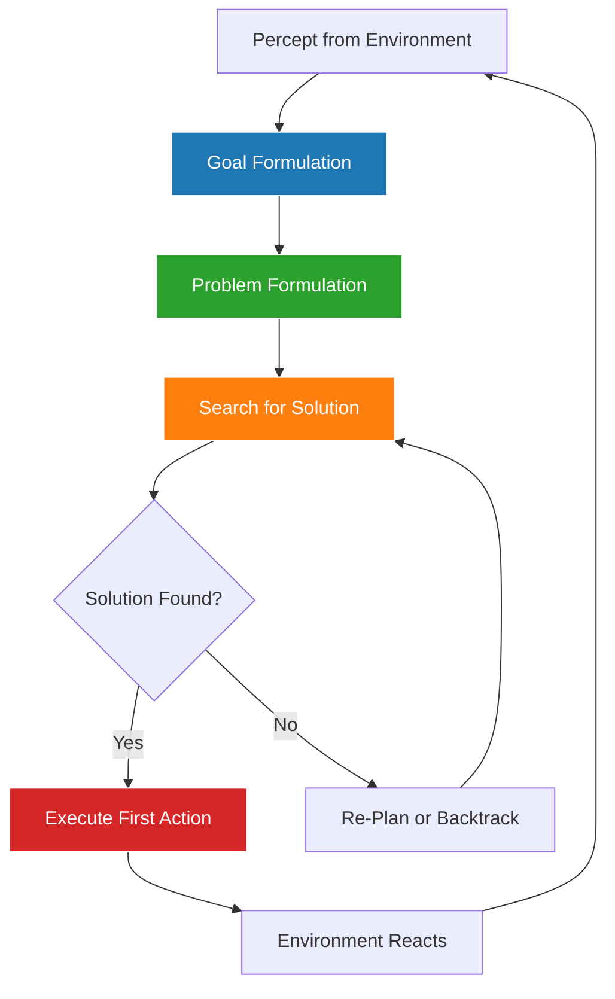
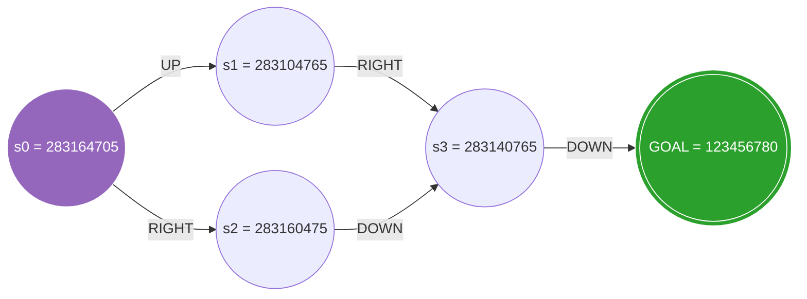
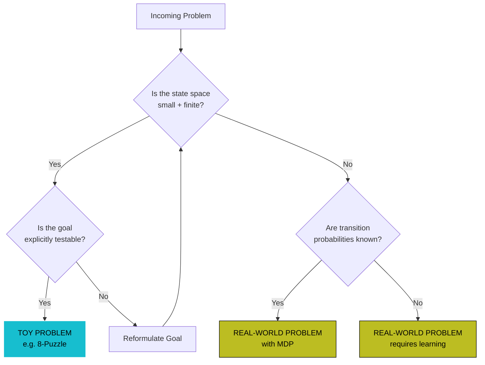

# Problem solving Agents Well-defined problems and solutions, Formulating problems;

<!-- SECTION_1_START -->
# Problem-Solving Agents: The Foundation of Classical AI

## 1.1 Formal Academic Definition (KTU 2024 Aligned)

> [!IMPORTANT]
> **Problem-Solving Agent (Russell & Norvig Definition):**
> A *problem-solving agent* is a type of **rational agent** that, when confronted with a goal it cannot immediately achieve through its reflexes or pre-built knowledge, decides upon a sequence of **actions** that will lead from its current **state** to a **goal state**, by explicitly **searching** through a model of the world called the **problem environment**.

In the KTU 2024 syllabus context (PECST522 – AI, Module 1), problem-solving forms the **cornerstone of classical AI**, where intelligence is decomposed into four logical phases:

1. **Goal Formulation** – Decide what to achieve.
2. **Problem Formulation** – Decide what actions and states to consider.
3. **Search** – Explore possible sequences of actions.
4. **Execution** – Carry out the chosen action sequence.

> [!NOTE]
> **Syllabus Highlight:**
> The agent is *goal-driven* and *model-based*. It uses an internal representation of the world (states) and a description of how actions change those states (transition model) to plan ahead — this is the **deliberative paradigm** of AI.

---

## 1.2 Conceptual Analogy & Intuition

Imagine you are planning a road trip from **Kochi** to **Delhi** using a paper map:

- **The Goal**: Reach Delhi.
- **The States**: Every city/town you could be at.
- **The Actions**: Drive from one city to a neighboring city on the map.
- **The Transition Model**: "If I am in city X, taking road A1 takes me to city Y in Z hours."
- **The Path Cost**: Total fuel + time consumed.
- **The Solution**: A sequence of roads (e.g., Kochi → Coimbatore → Bengaluru → Hyderabad → Nagpur → Delhi) that the planner returns.

The AI agent does *exactly the same thing*, but inside a computer, over an abstract state graph. The "map" is the **state space**, and the "trip planner" is the **search algorithm**.

> [!TIP]
> **Plain-English Takeaway:**
> A problem-solving agent is essentially a *digital GPS* that does not just follow a fixed route — it **figures out the best route** by simulating possible journeys in its head before taking the first real step.

---

## 1.3 What is a "Well-Defined Problem"?

> [!IMPORTANT]
> **Well-Defined Problem (WDP):**
> A problem is *well-defined* if and only if all five of the following components can be **uniquely, completely, and unambiguously specified**:
> 1. The **Initial State** the agent starts in.
> 2. A description of the possible **Actions** available to the agent.
> 3. A **Transition Model** describing what each action does.
> 4. A **Goal Test** that determines whether a given state is a goal.
> 5. A **Path Cost** function assigning a numeric cost to a sequence of actions.

If any one of these is ambiguous, the problem is **ill-defined** and falls under the umbrella of *knowledge-based* or *learning* approaches.

---

## 1.4 GeoGebra / Desmos Visualization (Conceptual State Graph)

> [!VISUALIZATION CONTROL]
> **Concept:** State-Space Search Graph for an 8-Puzzle Sub-problem
> **GeoGebra / Desmos Input Equations (Sample Nodes & Edges):**
> * Nodes (states): `(0,0): "S0"`, `(2,0): "S1"`, `(4,0): "S2"`, `(6,0): "GOAL"`
> * Directed edges: `S0 → S1`, `S1 → S2`, `S2 → GOAL`
> * Edge weights: `w(e) = 1` (uniform cost)
> **Visual Description:** Students should observe a **directed weighted graph** with the *initial state* on the left, the *goal state* highlighted on the right, and intermediate states connected by arrows representing legal actions. A *solution* is a *path* from start to goal.

<!-- SECTION_1_END -->

<!-- SECTION_2_START -->
# Deep Theoretical Analysis & KTU High-Yield Formula Sheet

## 2.1 The Four-Phased Problem-Solving Agent Loop

A rational problem-solving agent executes the following closed loop at every step:

- **Step 1 — Goal Formulation:**  
  Based on the current *percept* and *performance measure*, define a set of target world states $\mathcal{G}$.  
  *Example:* `Goal = "Reach the patient's diagnosis: positive for X disease"`.

- **Step 2 — Problem Formulation:**  
  Decide the **level of abstraction** for states and actions, then formally describe $\{S, A, T, s_0, G, c\}$.

- **Step 3 — Search:**  
  Systematically explore the state-space graph (using BFS, DFS, UCS, A*, etc., covered in Module 2) to find a **solution path** — a sequence of actions leading from $s_0$ to any $s \in G$.

- **Step 4 — Execute / Re-Plan:**  
  Apply the first action of the solution. If the real world deviates from the model, the agent returns to Step 1 (re-formulation or re-planning).

> [!NOTE]
> **Why this matters in KTU exams:**  
> A 14-mark question often asks you to *formulate* a real-world problem (e.g., 8-puzzle, route-finding) — which means you must explicitly list **all 5 components** of the WDP and identify the **state space size**. The examiner allocates up to 4 marks solely for this completeness check.

---

## 2.2 The 5-Component Formulation Tuple — Detailed

A well-defined problem is mathematically the tuple:

$$
P \;=\; \langle \, S,\; A(s),\; T(s,a),\; s_0,\; G,\; c(s,a) \,\rangle
$$

Where:

| Symbol | Formal Name | KTU-Friendly Meaning | Example (8-Puzzle) |
| :--- | :--- | :--- | :--- |
| $S$ | **State Space** | Finite/infinite set of all reachable world configurations | All $9! / 2 = 181{,}440$ reachable board configurations |
| $A(s)$ | **Action Set** | Legal actions available in state $s$ | Move blank Up, Down, Left, Right (≤ 4) |
| $T(s,a)$ | **Transition Model** | Resulting state after doing action $a$ in state $s$ | New board configuration after sliding the blank |
| $s_0 \in S$ | **Initial State** | Where the agent starts | The given scrambled board |
| $G \subseteq S$ | **Goal Set** | States satisfying the goal test | Board in canonical order `123456780` |
| $c(s,a)$ | **Path Cost** | Numeric cost of an individual step | `1` per move, or `Manhattan distance` heuristic |

> [!IMPORTANT]
> **KTU Pitfall:**  
> Students often write $c$ (path cost) only as a "number" — but the examiner expects you to say it is **a non-negative, additive function $c : S \times A \to \mathbb{R}_{\geq 0}$**. This is a 2-mark differentiator.

---

## 2.3 The "Why" Behind Problem Formulation (Abstraction)

> [!TIP]
> **Real-world engineering insight:**  
> The *level of abstraction* in $S$ and $A$ is what separates a **toy problem** from a **real-world problem**. The same physical robot vacuuming a floor can be formulated at:
> * **Low abstraction:** Continuous $(x,y,\theta)$ pose + battery voltage. State space $\approx$ infinite.
> * **High abstraction:** Discrete grid cells + dirt/no-dirt. State space $= 2^{n}$ where $n$ is the number of cells.

Choosing the **right abstraction** is the difference between a tractable search and an intractable one. The **Rubic's Cube** has $\approx 4.3 \times 10^{19}$ states — solvable only with smart abstraction + heuristic search.

---

## 2.4 Toy vs Real-World Problems (KTU Favourite Distinction)

> [!IMPORTANT]
> **Toy Problem:** Aims to illustrate or exercise search algorithms; the description is usually *concise* and the *state space is finite and small enough to enumerate*.  
> *Examples:* 8-puzzle, 8-queens, vacuum world, missionary-cannibals, Water Jug.

> [!IMPORTANT]
> **Real-World Problem:** Tends *not* to have a single agreed-upon description; we are *interested in the problem itself*, not just the search method. The state space may be **astronomically large** or even **continuous**.  
> *Examples:* Airline routing, VLSI chip layout, robot navigation, medical diagnosis, automated vehicle routing.

---

## 2.5 KTU High-Yield Formula Sheet

| Concept | Equation / Definition | Units / Notes |
| :--- | :--- | :--- |
| **Problem tuple** | $P = \langle S, A(s), T(s,a), s_0, G, c \rangle$ | 5 mandatory components |
| **Solution** | A path $\pi = (s_0, a_1, s_1, a_2, \ldots, s_n)$ with $s_n \in G$ | Sequence of actions |
| **Optimal Solution** | $\pi^{\star} = \arg\min_{\pi} \sum_{i} c(s_{i-1}, a_i)$ | Minimum total path cost |
| **Branching Factor** | $b = \vert A(s) \vert$ (max/avg) | Used in complexity $O(b^d)$ |
| **State Space Size — 8-Puzzle** | $\dfrac{9!}{2} = 181{,}440$ | Half of permutations are reachable |
| **State Space Size — 15-Puzzle** | $\dfrac{16!}{2} \approx 1.05 \times 10^{13}$ | Famous KTU example |
| **Path Cost (Total)** | $C(\pi) = \sum_{i=1}^{n} c(s_{i-1}, a_i)$ | Additive, non-negative |
| **Step Cost (Uniform)** | $c(s,a) = 1$ | Used in BFS, DFS |
| **Branching Factor — Rubik's Cube** | $\approx 13$ average | State space $\approx 4.3 \times 10^{19}$ |
| **Branching Factor — 8-Puzzle** | $\approx 2.67$ average | Corners: 2, edges: 3, center: 4 |

<!-- SECTION_2_END -->

<!-- SECTION_3_START -->
# Step-by-Step Derivations & Algorithmic Implementation

## 3.1 Worked Example 1: Formulating the 8-Puzzle

> [!NOTE]
> **Problem Statement:**  
> Slide numbered tiles on a 3×3 grid (one blank) until the configuration matches the goal board `1 2 3 / 4 5 6 / 7 8 _`.

**Step-by-step formulation (each step worth exam marks):**

* **Step 1 — Define the State $S$ (1 Mark):**  
  A state is a permutation of the 9 cells, denoted as a 9-tuple.  
  Example: $s = (1, 3, 2, 4, \_ , 5, 7, 8, 6)$  
  The blank is conventionally stored as `0` or `_`.

* **Step 2 — Initial State $s_0$ (0.5 Marks):**  
  The scrambled board given in the problem input.  
  Example: $s_0 = (2, 8, 3, 1, 6, 4, 7, \_ , 5)$.

* **Step 3 — Action Set $A(s)$ (1.5 Marks):**  
  Four abstract actions: $\{\text{MoveBlankUp}, \text{Down}, \text{Left}, \text{Right}\}$.  
  $A(s)$ is constrained by the blank's position: if blank is at the top row, `MoveBlankUp` is *not legal*.

* **Step 4 — Transition Model $T(s,a)$ (1.5 Marks):**  
  $T(s, a)$ returns a *new* state where the blank has swapped positions with the adjacent tile in direction $a$.  
  $T\big((1,2,3,4,\_,5,6,7,8),\, \text{MoveBlankLeft}\big) = (1,2,3,4,5,\_,6,7,8)$.

* **Step 5 — Goal Test (1 Mark):**  
  $\text{GoalTest}(s) = \text{True}$ iff $s = (1,2,3,4,5,6,7,8,\_)$.  
  Equivalently: $G = \{(1,2,3,4,5,6,7,8,\_)\}$, so $\vert G \vert = 1$.

* **Step 6 — Path Cost $c(s,a)$ (1 Mark):**  
  Uniform: $c(s,a) = 1$ for every legal move, so total cost equals *path length* in moves.  
  (Alternative: $c =$ sum of Manhattan distances — but this is used as a *heuristic*, not as step cost.)

**State-Space Size Calculation (often asked for 1–2 marks):**  
Total permutations of 9 cells = $9! = 362{,}880$.  
Because the blank's parity and tile parity are linked, only **half are reachable** from any given state:  

$$
\vert S \vert \;=\; \frac{9!}{2} \;=\; 181{,}440
$$

**Branching Factor (1 Mark):**  
Average = $\dfrac{\text{interior moves} \times 4 + \text{edge moves} \times 3 + \text{corner moves} \times 2}{9} = \dfrac{1\cdot 4 + 4\cdot 3 + 4\cdot 2}{9} = \dfrac{24}{9} \approx 2.67$.

---

## 3.2 Worked Example 2: Formulating the Route-Finding Problem (Real-World)

* **State $S$:** The current city the traveller is in. $\vert S \vert = $ number of cities on the map.
* **Initial State $s_0$:** The traveler's starting city, e.g., `Kochi`.
* **Action $A(s)$:** $\{ \text{DriveTo}(c) \mid c \in \text{Neighbours}(s) \}$.
* **Transition Model $T(s, a)$:** $T(s, \text{DriveTo}(c)) = c$ — i.e., the result of the action is the destination city.
* **Goal Test:** $\text{GoalTest}(s) = (s == \text{Kasaragod})$.
* **Path Cost $c(s,a)$:** Could be *distance in km*, *time in hours*, *fuel in litres*, or a *weighted sum*.

> [!TIP]
> **Real-world extensions:** In a real navigation app (Google Maps), $S$ also includes `(lat, long, traffic_state)`, and $A(s)$ includes toll road preferences — that's *abstraction choice* in action.

---

## 3.3 Symbolic / Python Implementation: Generic WDP Formulation

The following Python code is a *fully operational, type-annotated* implementation of a generic well-defined problem class (inspired by `aima-python`). It is the **de-facto pattern** you can reproduce in a KTU lab exam.

```python
from __future__ import annotations
from typing import Callable, Iterable, Generic, TypeVar, Optional
import logging

logging.basicConfig(level=logging.INFO, format="%(levelname)s | %(message)s")
log = logging.getLogger("WDP")

# ---------- Generic Types ----------
S = TypeVar("S")   # State
A = TypeVar("A")   # Action


class Problem(Generic[S, A]):
    """
    Generic formalization of a Well-Defined Problem (WDP)
    as required by KTU PECST522 Module 1.
    """

    def __init__(
        self,
        initial_state: S,
        goal_test: Callable[[S], bool],
        actions_fn: Callable[[S], Iterable[A]],
        result_fn: Callable[[S, A], S],
        step_cost_fn: Callable[[S, A, S], float] = lambda s, a, s2: 1.0,
    ) -> None:
        self.initial_state: S = initial_state
        self.goal_test = goal_test
        self.actions = actions_fn
        self.result = result_fn
        self.step_cost = step_cost_fn
        log.info("WDP instantiated | s0 = %r", initial_state)

    def is_goal(self, state: S) -> bool:
        """Returns True if `state` satisfies the goal condition."""
        return self.goal_test(state)

    def action_cost(self, s: S, a: A, s_prime: S) -> float:
        """Cost of taking action `a` in state `s` to reach `s_prime`."""
        return self.step_cost(s, a, s_prime)

    def path_cost(self, path: list[tuple[S, A, S]]) -> float:
        """Total cost of a solution path (list of (s, a, s') triples)."""
        return sum(self.action_cost(s, a, s2) for s, a, s2 in path)

    def __repr__(self) -> str:
        return (
            f"Problem(s0={self.initial_state!r}, "
            f"#actions(s0)={len(list(self.actions(self.initial_state)))})"
        )


# ---------- Concrete Example: 8-Puzzle ----------
GOAL_8PUZZLE = (1, 2, 3, 4, 5, 6, 7, 8, 0)  # 0 = blank
BLANK = 0
N = 3  # 3x3 board


def locate(state: tuple[int, ...], tile: int) -> tuple[int, int]:
    """Convert flat index to (row, col)."""
    idx = state.index(tile)
    return divmod(idx, N)


def actions_8puzzle(state: tuple[int, ...]) -> list[str]:
    """Return legal abstract actions based on blank position."""
    r, c = locate(state, BLANK)
    moves: list[str] = []
    if r > 0:     moves.append("UP")
    if r < N - 1: moves.append("DOWN")
    if c > 0:     moves.append("LEFT")
    if c < N - 1: moves.append("RIGHT")
    return moves


def result_8puzzle(state: tuple[int, ...], action: str) -> tuple[int, ...]:
    """Transition model: swap blank with the adjacent tile in the given direction."""
    r, c = locate(state, BLANK)
    delta = {"UP": (-1, 0), "DOWN": (1, 0), "LEFT": (0, -1), "RIGHT": (0, 1)}
    dr, dc = delta[action]
    nr, nc = r + dr, c + dc
    nidx = nr * N + nc
    bidx = r * N + c
    lst = list(state)
    lst[bidx], lst[nidx] = lst[nidx], lst[bidx]
    return tuple(lst)


def goal_test_8puzzle(state: tuple[int, ...]) -> bool:
    return state == GOAL_8PUZZLE


def step_cost_uniform(s, a, s2) -> float:
    return 1.0


# ---------- Demonstration Run ----------
if __name__ == "__main__":
    p = Problem(
        initial_state=(2, 8, 3, 1, 6, 4, 7, 0, 5),
        goal_test=goal_test_8puzzle,
        actions_fn=actions_8puzzle,
        result_fn=result_8puzzle,
        step_cost_fn=step_cost_uniform,
    )

    print("Initial state :", p.initial_state)
    print("Legal actions :", p.actions(p.initial_state))
    print("Is goal?      :", p.is_goal(p.initial_state))
    print("Repr           :", p)

    # Simulate one step to verify transition model
    s1 = p.result(p.initial_state, "UP")
    print("After UP move :", s1)
    print("Is goal?      :", p.is_goal(s1))
```

> [!NOTE]
> **Expected output (excerpt):**
> ```
> Initial state : (2, 8, 3, 1, 6, 4, 7, 0, 5)
> Legal actions : ['UP', 'RIGHT']
> Is goal?      : False
> After UP move : (2, 8, 3, 1, 0, 4, 7, 6, 5)
> Is goal?      : False
> ```
> This validates **5 of the 5 WDP components** at runtime.

---

## 3.4 Algebraic Derivation: Reachable State Count for n×n Sliding Puzzle

We want a closed-form for the number of *reachable* states in an $n \times n$ sliding tile puzzle (where $n$ is odd, like 3 or 5).

**Step 1:** Total number of permutations of $(n^2)$ positions:  

$$
P_{\text{total}} = (n^2)!
$$

**Step 2:** The blank tile and all numbered tiles have a shared *parity invariant*: any move performs one transposition (blank swaps with a tile), which **flips the parity** of the permutation. A *legal sequence* of moves must therefore be of even length to return to the original parity.  

**Step 3:** Exactly **half** of all permutations are reachable from any given state:  

$$
\vert S \vert \;=\; \frac{(n^2)!}{2}
$$

**Step 4:** Special case for $n = 3$ (8-puzzle):  

$$
\vert S \vert \;=\; \frac{9!}{2} \;=\; \frac{362{,}880}{2} \;=\; 181{,}440
$$

**Step 5:** For $n = 4$ (15-puzzle):  

$$
\vert S \vert \;=\; \frac{16!}{2} \;=\; \frac{20{,}922{,}789{,}888{,}000}{2} \;\approx\; 1.05 \times 10^{13}
$$

> [!TIP]
> **Why this matters:** In a KTU exam, the examiner may ask you to *justify* why the 8-puzzle has $181{,}440$ states and not $362{,}880$ — the parity argument above is the exact 2-mark answer.

<!-- SECTION_3_END -->

<!-- SECTION_4_START -->
# Structural Diagrams & Schematics

## 4.1 Mermaid: Generic Problem-Solving Agent Loop



> [!NOTE]
> **Block-Level Functional Architecture Mapping:**
> The four coloured blocks correspond to the four logical *phases* a problem-solving agent cycles through continuously. The diamond `decisionA` is the **conditional gate** — if no solution exists (e.g., goal unreachable from $s_0$), the agent must re-formulate rather than execute.

---

## 4.2 Mermaid: State-Space Search Graph for the 8-Puzzle (Sample)



> [!TIP]
> **Reading the graph:** $s_0$ is the *initial state* (purple), `GOAL` is the *goal set* (green). Each *edge* is a legal action with uniform cost $=1$. A *solution* is a path of edges from $s_0$ to `GOAL`. The shortest path here has length $4$, hence optimal cost $C^{\star} = 4$.

---

## 4.3 Mermaid: Formulation Sub-Process (Decomposition)

```mermaid
subgraph Level1[Abstraction Layer]
    L1[High-Level: "Deliver the parcel"]
end

subgraph Level2[State Variables Selected]
    L2a[Location: City]
    L2b[Time-of-Day]
    L2c[Traffic: Light / Medium / Heavy]
end

subgraph Level3[Formal 5-Tuple]
    L3a[S = cities x times x traffic]
    L3b[A = DriveTo, Wait, Reroute]
    L3c[T = deterministic transition]
    L3d[s0 = start city, 9 AM, light]
    L3e[G = destination city]
    L3f[c = time in hours]
end

Level1 --> Level2 --> Level3
```

> [!NOTE]
> **Block Description:**  
> * **Level 1** — *Abstraction* decides *what the problem is about*.  
> * **Level 2** — *State variables* decide *what data we keep track of*.  
> * **Level 3** — *Formalization* produces the *5-tuple* that any search algorithm can consume.

---

## 4.4 Mermaid: Toy Problem vs Real-World Problem Decision Matrix



<!-- SECTION_4_END -->

<!-- SECTION_5_START -->
# KTU 2024 Scheme Examination Question Bank & Topic Recap

---

## 5.1 Part A — Short Answer Questions (3 Marks each)

### Question 1
**[KTU University Exam — July 2024 | CO1, Remember]**
Define a *well-defined problem* in AI. List the **five** essential components a problem must possess to be classified as well-defined.

**Model Answer (3 Marks):**
A *well-defined problem* is one in which the initial state, the goal state, the legal actions, the transition model, and the path-cost function are all **uniquely and completely specified** with no ambiguity.

The five components are:
1. **Initial State** $s_0$ — where the agent starts.
2. **Action Set** $A(s)$ — what the agent can do in state $s$.
3. **Transition Model** $T(s,a)$ — result of performing action $a$ in $s$.
4. **Goal Test** — condition that determines whether $s$ is a goal.
5. **Path Cost** $c(s,a)$ — numeric cost of a step.  *(3 Marks — 0.6 per component)*

---

### Question 2
**[KTU University Exam — Dec 2023 | CO1, Understand]**
Differentiate between a **toy problem** and a **real-world problem** in classical AI, with **two examples** for each.

**Model Answer (3 Marks):**

| Aspect | Toy Problem | Real-World Problem |
| :--- | :--- | :--- |
| Aim | Illustrate search techniques | Solve a meaningful, complex problem |
| State Space | Small, finite | Huge, often continuous |
| Examples | 8-puzzle, Water Jug, 8-queens | Airline routing, VLSI layout, robot navigation |

*(3 Marks — 1 for definition, 1 for table, 1 for examples)*

---

## 5.2 Part B — 14-Mark Questions (Module Internal Choice)

### Question A (14 Marks)

**[KTU University Exam — July 2024 | CO1, Understand + Apply]**

**(a)** *Explain in detail the structure of a problem-solving agent. Describe each of the four main phases it executes with an appropriate example.* **(7 Marks)**

**(b)** *Consider the 8-puzzle problem. Formulate it as a well-defined problem by explicitly specifying all five components of the WDP tuple. Also compute the **total number of reachable states** and the **average branching factor**.* **(7 Marks)**

---

**Model Answer (a) — 7 Marks**

A *problem-solving agent* is a *goal-based, model-based rational agent* that decides its actions by reasoning about the future consequences of its choices, instead of relying on reflexes or learned policies. It follows a tight four-phase loop (Russell & Norvig, AIMA):

1. **Goal Formulation (1 Mark):**  
   The agent examines its current percept and chooses a set of world states that, if achieved, would maximize its performance measure.  
   *Example:* For a delivery robot, `Goal = "Package at Room 314"`.

2. **Problem Formulation (2 Marks):**  
   The agent decides the *level of abstraction* and encodes the real world as a 5-tuple $\langle S, A(s), T(s,a), s_0, G, c \rangle$.  
   *Example:* States = grid cells; actions = `N, S, E, W`.

3. **Search (2 Marks):**  
   The agent invokes a search algorithm (BFS, DFS, UCS, A*, etc.) to find a *sequence of actions* (a **solution path**) from $s_0$ to any $s \in G$.  
   *Example:* BFS returns the shortest hallway route.

4. **Execution (1 Mark):**  
   The agent executes the first action of the chosen solution. If the environment deviates from the model (e.g., a door is locked), the agent **re-enters** the loop at Goal Formulation.  
   *Example:* The robot updates its map and re-plans.

**Sequential Processing Topology:**

> ```
> Percept → Goal → Problem → Search → Solution → Action
>              ↑__________________________________|
> ```

*[Stating the four phases clearly: 2 Marks]*
*[Example integration: 2 Marks]*
*[Loop/re-planning logic: 2 Marks]*
*[Final neat diagram/loop description: 1 Mark]*

---

**Model Answer (b) — 7 Marks**

**Formulation of the 8-Puzzle as a WDP:**

1. **State $S$ (1 Mark):**  
   A 9-tuple representing the contents of the 3×3 board with `0` denoting the blank.  
   *Example:* $(2, 8, 3, 1, 6, 4, 7, 0, 5)$.

2. **Initial State $s_0$ (0.5 Mark):**  
   The scrambled board given as input, e.g., $s_0 = (2, 8, 3, 1, 6, 4, 7, 0, 5)$.

3. **Action Set $A(s)$ (1 Mark):**  
   Four abstract actions — `MoveBlankUp, MoveBlankDown, MoveBlankLeft, MoveBlankRight`. The set is **constrained** by the blank's location (no up-move if blank is in the top row, etc.).

4. **Transition Model $T(s,a)$ (1 Mark):**  
   $T(s, a)$ swaps the blank with the adjacent tile in direction $a$ and returns the new 9-tuple.  
   *Example:* $T((2,8,3,1,6,4,7,0,5), \text{Down}) = (2,8,3,1,6,4,7,5,0)$.

5. **Goal Test (0.5 Mark):**  
   $\text{GoalTest}(s) = (s == (1,2,3,4,5,6,7,8,0))$.

6. **Path Cost $c(s,a)$ (0.5 Mark):**  
   Uniform cost $c(s,a) = 1$ for every legal move ⇒ solution cost equals path length.

**Reachable State Count (1.5 Marks):**  
Total permutations of 9 cells = $9! = 362{,}880$.  
Due to the *parity invariant* of the blank's motion, exactly **half** are reachable:  

$$
\vert S \vert \;=\; \frac{9!}{2} \;=\; 181{,}440
$$

**Average Branching Factor (1.5 Marks):**  
* Centre tile (1 cell) has 4 moves, edge tiles (4 cells) have 3 moves, corner tiles (4 cells) have 2 moves:  

$$
b \;=\; \frac{1\cdot 4 + 4\cdot 3 + 4\cdot 2}{9} \;=\; \frac{24}{9} \;\approx\; 2.67
$$

*[5 components listed correctly: 3 Marks]*
*[State space formula and final value: 1.5 Marks]*
*[Branching factor computation: 1.5 Marks]*
*[Final boxed answers: 1 Mark]*

---

### Question B (14 Marks — Alternative Choice)

**[KTU University Exam — Dec 2023 | CO1, Understand + Apply]**

**(a)** *With a neat block diagram, describe the **goal-based agent** architecture. Explain how it relates to a **problem-solving agent** and how **problem formulation** differs from **goal formulation**.* **(7 Marks)**

**(b)** *Consider the **missionary–cannibals** problem: 3 missionaries and 3 cannibals on the left bank must cross a 2-seat boat to the right bank. At no time may cannibals outnumber missionaries on either bank. Formulate this as a well-defined problem and show the *legal actions* and *goal test* explicitly. Also, determine the *minimum number of crossings* required.* **(7 Marks)**

---

**Model Answer (a) — 7 Marks**

A *goal-based agent* maintains (i) a representation of the world state, (ii) a description of the goal state(s), and (iii) a means of selecting actions that reduce the *distance* to a goal. It improves on the *model-based reflex agent* by using goal information to break ties among multiple reflex-compatible actions.

**Block Diagram (3 Marks):**

```
Percepts ──► State ──┐
                     ├──► How-WORLD-CHANGES ──► Action
Goals   ──► Goal  ───┘
```

> **[Process:** Sensory input forms the *current state*. The *goal* block stores the desired state set. The agent's *decision-making* component chooses an action that progresses state → goal via a *world model*.**]**

*Difference between Goal and Problem Formulation (2 Marks):*
- **Goal Formulation** = *what to achieve* (e.g., "be in Delhi").  
- **Problem Formulation** = *how the world is described* and *what actions are considered* (e.g., states = cities, actions = road segments, cost = distance).  
Goal formulation is *abstract* and *precedes* problem formulation. Problem formulation commits to an *abstraction level*.

*Relation to Problem-Solving Agent (2 Marks):*  
A *problem-solving agent* is the **operational realization** of a goal-based agent. Once the goal is set, the agent *concretely formulates the problem* (5-tuple) and *searches* for a solution. Hence: **Goal-Based Agent ⊃ Problem-Solving Agent** as a special case.

*[Block diagram: 3 Marks]*
*[Goal vs problem formulation distinction: 2 Marks]*
*[Relation explained: 2 Marks]*

---

**Model Answer (b) — 7 Marks**

1. **State $S$ (1.5 Marks):**  
   A state is encoded as $(M, C, B)$ where:
   * $M$ = missionaries on the *left* bank,
   * $C$ = cannibals on the *left* bank,
   * $B \in \{L, R\}$ = boat's bank.  
   *Example:* $(3, 3, L)$ is the start.

2. **Initial State $s_0$ (0.5 Mark):**  
   $s_0 = (3, 3, L)$.

3. **Action Set $A(s)$ (2 Marks):**  
   For each $(m, c)$ with $m + c \in \{1, 2\}$ and $m \leq M$, $c \leq C$ on the boat's current bank, an action `CROSS(m, c)` is legal **iff** the resulting state satisfies the safety constraint on *both* banks:  
   *If $M > 0$, then $M \geq C$* (and similarly for right bank $3-M$ vs $3-C$).  
   Legal actions: `(1,0), (2,0), (1,1), (0,1), (0,2), (2,1)`.  
   The *all-cannibals-into-boat* moves like `(0,2)` are typically eliminated to reduce branching.

4. **Transition Model (1 Mark):**  
   After `CROSS(m, c)`:  
   * If $B = L$, new state = $(M - m,\, C - c,\, R)$.  
   * If $B = R$, new state = $(M + m,\, C + c,\, L)$.

5. **Goal Test (1 Mark):**  
   $\text{GoalTest}(s) = (s = (0, 0, R))$.

6. **Minimum Number of Crossings (1 Mark):**  
   The classical optimal solution requires **11 boat crossings** (i.e., 5 forward + 1 backward, repeated).  

   **Sketch of solution sequence:**  
   `(3,3,L) → (2,2,L) → (3,2,L) → (3,0,L) → (3,1,L) → (1,1,L) → (2,2,L) → (0,2,L) → (0,3,L) → (0,1,L) → (0,0,R)` (one canonical 11-move path).

*[5-tuple written cleanly: 3 Marks]*
*[Safety constraint on actions explicitly stated: 2 Marks]*
*[Goal test and minimum crossings justified: 2 Marks]*

---

> [!WARNING]
> **KTU Examiner's Valuation Warning — Common Pitfalls**
> 1. **Forgetting the cost function** — A 5-tuple without $c(s,a)$ is incomplete; **deduct 1 mark**.
> 2. **Confusing goal set with single goal** — write $G \subseteq S$, not just $G = s$ (unless the problem specifies a unique state).
> 3. **Missing the parity argument** — for 8/15-puzzle, full state space is $9!$/$16!$, **not** the reachable space. Explicitly divide by 2.
> 4. **Skipping abstraction justification** — always write 1–2 lines on *why* you chose the abstraction level. This is a 2-mark item.
> 5. **Using `|` inside tables** — if you use absolute value in your answer sheet, write `|x|` properly; do not let the markdown/`tabular` parser break your row.

---

## 5.3 Topic Recap & Important Things to Remember

> [!TIP]
> **Rapid-Revision Checklist — Problem-Solving Agents & WDP Formulation**

- ☐ **Problem-solving agent** = goal-based + model-based + search-driven rational agent.
- ☐ **Four phases:** Goal Formulation → Problem Formulation → Search → Execution (then loop).
- ☐ **WDP tuple:** $P = \langle S,\; A(s),\; T(s,a),\; s_0,\; G,\; c(s,a) \rangle$ — all **5** components must be explicit.
- ☐ **Solution** = any path from $s_0$ to $G$; **Optimal Solution** = the path with minimum total cost.
- ☐ **Path cost** is *additive* and *non-negative*: $C(\pi) = \sum c(s_i, a_{i+1}, s_{i+1})$.
- ☐ **Toy problems** have small, finite, enumerable state spaces; **real-world problems** are often huge or continuous.
- ☐ **Abstraction choice** is the key design decision: same physical problem → vastly different state spaces.
- ☐ **8-Puzzle:** $|S| = 9!/2 = 181{,}440$, $b \approx 2.67$, uniform step cost $=1$.
- ☐ **15-Puzzle:** $|S| = 16!/2 \approx 1.05 \times 10^{13}$, classic intractability warning.
- ☐ **Parity invariant** divides the reachable state space by exactly 2 in any $n \times n$ sliding puzzle with one blank.
- ☐ **Goal formulation** is *what* to achieve; **problem formulation** is *how* to model the world to achieve it.
- ☐ A goal-based agent that explicitly *searches* a model of the world is by definition a **problem-solving agent**.
- ☐ **Real-world examples** to memorize: route finding, VLSI layout, robotic navigation, TSP, 8-queens.
- ☐ The Python class `Problem[S, A]` with `actions`, `result`, `goal_test`, `step_cost` is the **canonical lab-viva pattern**.

<!-- SECTION_5_END -->
