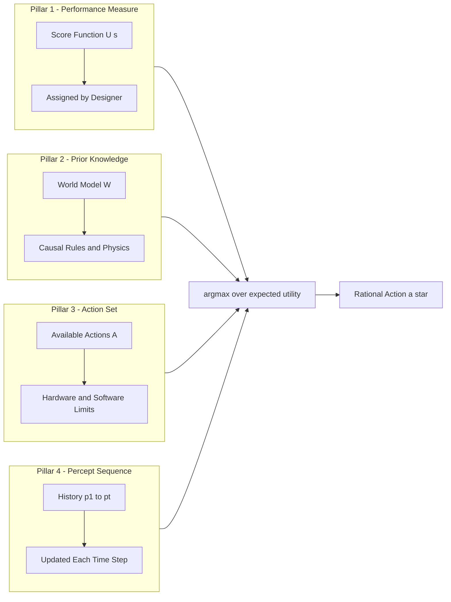
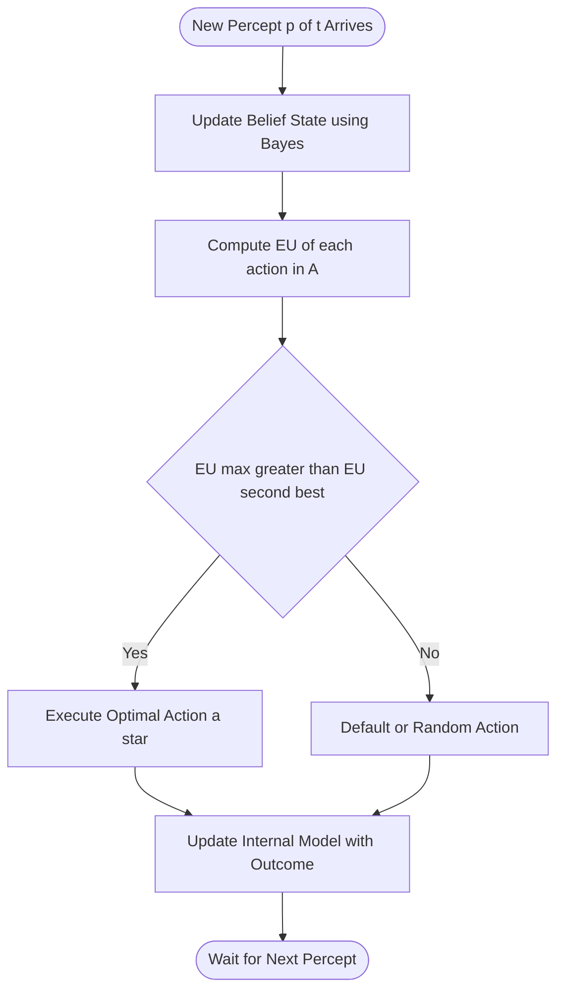
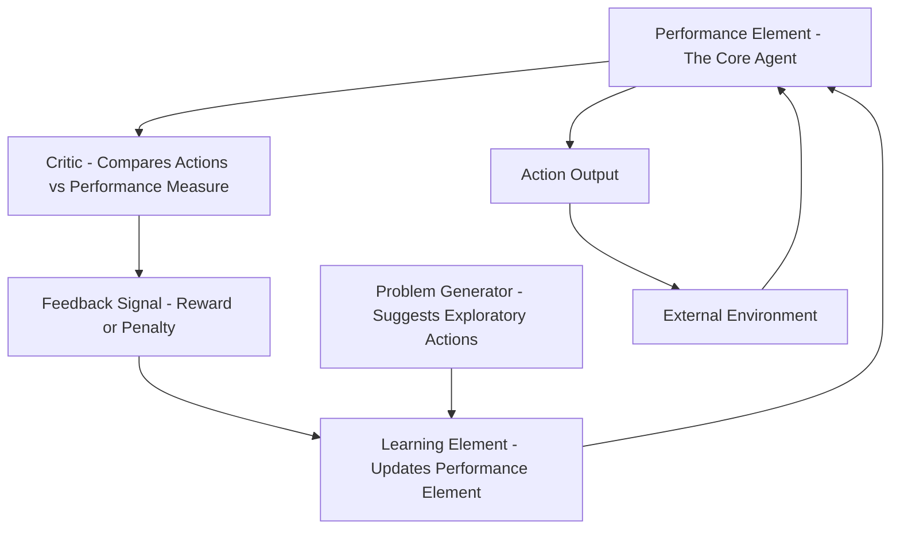

# The concept of rationality;

<!-- SECTION_1_START -->

# The Concept of Rationality

> [!NOTE]
> **KTU 2024 Syllabus Reference (PECST522 - Module 1)**
> This topic belongs to the foundational definitions of Artificial Intelligence as prescribed in the KTU 2024 Scheme. It directly builds on the concepts of *Agents* and *Environments*, and forms the philosophical backbone of the entire course.

## 1.1 Formal Academic Definition

In the context of Artificial Intelligence, **rationality** is formally defined as the property of an **agent** that, for every possible **percept sequence**, selects an **action** that is expected to **maximize its performance measure**, given the evidence provided by the percept sequence and the agent's built-in knowledge of the environment.

The term **"rational agent"** was popularized by Stuart Russell and Peter Norvig in their canonical textbook *Artificial Intelligence: A Modern Approach (AIMA)*, which is the prescribed reference for KTU's PECST522 syllabus.

Mathematically, a rational agent behaves according to the following principle:

$$\text{Rationality} = f(\text{Percept Sequence}, \text{Performance Measure}, \text{Prior Knowledge}, \text{Possible Actions})$$

For each possible percept sequence, a **rational agent** must select an action that is expected to maximize its performance measure, based on the evidence from the percept sequence and any built-in knowledge the agent possesses.

> [!IMPORTANT]
> **KTU Board Definition (Verbatim)**
> A rational agent is one that **does the right thing**. "Doing the right thing" means that the agent's action must maximize the expected value of the performance measure, given the percept sequence it has received so far and the knowledge it possesses about the environment.

## 1.2 Conceptual Analogy and Intuition

Imagine a **self-driving car** approaching a busy intersection at 3:00 AM.

- The car has sensors (cameras, LIDAR) that provide it with a sequence of percepts.
- It has a goal: reach the destination **safely and quickly** (the **performance measure**).
- It knows traffic rules (**built-in knowledge**).
- It can choose between: *accelerate, brake, turn left, turn right* (**possible actions**).

A **rational** car will choose to *brake or cautiously proceed* because the expected outcome of rushing through is poor.

However, a rational car is **not omniscient**. If a drunk driver suddenly jumps the red light and crashes into our car, the rational car did **not** fail to be rational. It made the best decision based on the percepts available *at that moment*.

| Misconception | Correct Understanding |
| :--- | :--- |
| Rational = Omniscient (knows everything) | Rational = Acts optimally on what it **perceives** |
| Rational = Always succeeds | Rational = Maximizes **expected** performance |
| Rational = Perfect | Rational = Best possible with **limited resources** |
| Rational = Human-like | Rational = Goal-driven, not necessarily human-like |

> [!TIP]
> **Think of rationality as "informed best-effort optimization"**, not as perfection or all-knowing intelligence.

## 1.3 The Performance Measure

The **performance measure** is a critical, often overlooked, ingredient of rationality. It is the criterion that defines *success* for the agent.

- For a chess AI: number of points earned (wins, draws, losses) — commonly $\text{+1, 0, -1}$ scoring.
- For a vacuum-cleaner robot: amount of dirt cleaned within a time period $T$, minus any electricity consumed or noise generated.
- For a medical diagnosis AI: patient health outcome, weighted against treatment cost.

> [!WARNING]
> A common KTU pitfall: students define an agent as rational *without specifying the performance measure*. The performance measure is the **yardstick of rationality**. Without it, the term "rational" is meaningless.

## 1.4 Rationality vs. Omniscience vs. Perfection

These three terms are frequently confused in KTU examination answers. Let us clarify them with a clean distinction.

> [!IMPORTANT]
> **Omniscience** = Knowing the actual outcome of every action in advance (impossible in real life).
> **Perfection** = Always producing the best possible outcome (requires omniscience).
> **Rationality** = Choosing the action that maximizes the **expected** outcome based on available information.

An agent can be rational without being omniscient. This is because **rationality concerns expected outcomes, not actual outcomes**. In environments with uncertainty (which is most real-world environments), an agent's action depends on a probability distribution of possible states.

$$a^* = \arg\max_{a \in A} \sum_{s' \in S} P(s' \mid a, e) \cdot U(s')$$

where:
- $a^*$ is the chosen optimal action,
- $A$ is the set of possible actions,
- $s'$ is the resulting state,
- $P(s' \mid a, e)$ is the probability of reaching state $s'$ after action $a$ in environment state $e$,
- $U(s')$ is the utility (value) of the resulting state.

## 1.5 Visualization of Rationality

> [!VISUALIZATION CONTROL]
> **Concept:** Percept-Action Loop of a Rational Agent
> **Geometric Intuition:** Imagine a **closed loop on the Cartesian plane** where the x-axis is time $t$ and the y-axis is **cumulative expected utility** $EU(t)$. A rational agent traces a monotonically increasing curve. The slope of the curve at any point represents the marginal rationality of the next action.
> **Plot Description:** Draw a smooth, upward-trending curve. Mark points where the agent makes decisions (local slope changes). The curve is *expected* utility, not guaranteed utility — so dashed projection lines show uncertainty bands.

---

<!-- SECTION_1_END -->

<!-- SECTION_2_START -->

# Deep Theoretical Analysis: Anatomy of Rationality

## 2.1 The Four Pillars of Rationality

According to AIMA (the KTU-prescribed textbook), a rational agent's behaviour is determined by exactly four components. Understanding these four pillars is essential for answering 7-mark and 14-mark KTU questions.

### Pillar 1: The Performance Measure

A criterion that defines the degree of success of the agent. The performance measure must be **specified by the human designer** (since the AI has no inherent notion of "good" or "bad"). It is an **objective function** that the agent tries to optimize.

**Example Performance Measures:**

- **Chess AI:** $+1$ for win, $0$ for draw, $-1$ for loss.
- **Taxi-driving AI:** $\text{Profit} = \text{Fare} - \text{FuelCost} - \text{LegalPenalties} - \text{TimeWasted}$.

### Pillar 2: Prior Knowledge of the Environment

The agent's built-in understanding of how the world works. This includes:

- **Physical laws:** gravity, friction, momentum.
- **Causal relationships:** "If I press the brake, the car slows down."
- **Social norms:** traffic rules, ethical constraints.

Without prior knowledge, the agent cannot interpret its percepts meaningfully. A newborn baby, despite having perfect sensors, lacks the prior knowledge to act rationally in our world.

### Pillar 3: The Set of Possible Actions

The action space $A$ defines what the agent **can** do. Rationality is bounded by the action space — an agent cannot be rational about actions it does not know exist.

> [!IMPORTANT]
> A **reflex agent** (one that only considers the current percept) is rational only in certain restricted environments. A **goal-based** or **utility-based** agent considers the future consequences of actions and is generally more rational in complex environments.

### Pillar 4: The Percept Sequence

The complete history of everything the agent has perceived up to the current time step $t$:

$$\text{Percept Sequence} = (p_1, p_2, p_3, \ldots, p_t)$$

The agent uses this sequence, along with prior knowledge, to update its beliefs about the world (often through **Bayesian inference**). A rational agent's decision at time $t$ depends on the *entire* history, not just the latest percept.

## 2.2 KTU Formula Sheet and High-Yield Definitions

> [!NOTE]
> The following table contains the high-yield definitions, equations, and components tested in KTU examinations. Memorize this entire table.

| \# | Term | Formula / Definition | Unit / Type |
| :--- | :--- | :--- | :--- |
| 1 | Rational Agent | $a = \arg\max_{a \in A} E[U \mid p_{1:t}, K]$ | Decision rule |
| 2 | Performance Measure | Function $V: S \to \mathbb{R}$ mapping states to real-valued scores | Utility value |
| 3 | Percept Sequence | $\vec{p_t} = (p_1, p_2, \ldots, p_t)$ | History vector |
| 4 | Expected Utility | $EU(a \mid e) = \sum_{s'} P(\text{Result}(a) = s' \mid a, e) \cdot U(s')$ | Scalar value |
| 5 | Omniscient Agent | Agent that knows true outcome of each action; $P = 1$ for true state | Theoretical |
| 6 | Bounded Rationality | $\text{Resource}_{compute} < \infty$ constraint on optimality | Engineering |
| 7 | Ideal Rational Agent | $\forall p_{1:t},\ \exists\ a^* \text{ s.t. } a^* = \arg\max E[U]$ | Definition |
| 8 | Autonomous Agent | Agent whose behaviour is determined by its own percepts + built-in knowledge | Property |
| 9 | Learning Agent | Agent that improves its performance measure over time using percepts | Property |
| 10 | Page-Description Index | Percept $p_t = f(\text{Environment at } t)$ | Mapping |

> [!IMPORTANT]
> **Note on Notation:** In LaTeX, $\arg\max$ is a single operator. The vertical bar in $E[U \mid p_{1:t}, K]$ means "given" the percept sequence and prior knowledge $K$.

## 2.3 Mathematical Derivation of the Rationality Equation

The expected utility of an action $a$ given the current percept history $p_{1:t}$ and the prior knowledge $K$ is computed as follows:

Step 1 — Start with the basic expectation:

$$EU(a \mid p_{1:t}, K) = \sum_{s \in S} U(s) \cdot P(s \mid a, p_{1:t}, K)$$

Step 2 — Apply the **law of total probability** to decompose the state probability:

$$P(s \mid a, p_{1:t}, K) = \sum_{e \in E} P(s \mid a, e) \cdot P(e \mid p_{1:t}, K)$$

Step 3 — The first factor, $P(s \mid a, e)$, is the **transition model** (deterministic in fully observable environments, stochastic in partially observable ones).

Step 4 — The second factor, $P(e \mid p_{1:t}, K)$, is the **sensor model** or **percept likelihood** — the probability of the current percept given a particular world state.

Step 5 — Substitute back into the expectation:

$$EU(a \mid p_{1:t}, K) = \sum_{s \in S} \sum_{e \in E} U(s) \cdot P(s \mid a, e) \cdot P(e \mid p_{1:t}, K)$$

Step 6 — A rational agent picks the action that **maximizes** this expected utility:

$$a^* = \arg\max_{a \in A} EU(a \mid p_{1:t}, K) = \arg\max_{a \in A} \sum_{s \in S} \sum_{e \in E} U(s) \cdot P(s \mid a, e) \cdot P(e \mid p_{1:t}, K)$$

This is the **fundamental equation of rational action selection** in AI. All of decision theory, game theory, and reinforcement learning build on variations of this equation.

## 2.4 Real-World Engineering Applications

The concept of rationality underpins every major AI deployment today. Here are concrete examples from production systems:

| Domain | Performance Measure | Prior Knowledge | Why Rationality Matters |
| :--- | :--- | :--- | :--- |
| **Autonomous Vehicles** (Waymo, Tesla) | Safety, ETA, fuel efficiency | Traffic laws, road geometry | Critical to balance legal penalties against time savings |
| **Recommendation Systems** (Netflix, YouTube) | Watch time, user satisfaction | User demographics, content metadata | Maximizes engagement, not just clicks |
| **Algorithmic Trading** (Renaissance Medallion) | Profit, Sharpe ratio | Market microstructure, news | Trades in microseconds based on percept sequences |
| **Medical Diagnosis AI** (IBM Watson Health) | Patient outcome, cost | Drug interactions, anatomy | Misaligned PMs can be life-threatening |
| **Game AI** (AlphaGo, Stockfish) | Win rate, ELO rating | Game rules, opponent models | Rational play defines superhuman performance |
| **Robotics** (Boston Dynamics) | Task completion, energy | Physics, motor dynamics | Ensures safe, efficient physical action |

> [!TIP]
> **KTU Insight:** When answering "Is X AI rational?" questions, always specify the **performance measure, environment knowledge, action set, and percept history**. This demonstrates you understand that rationality is *situational* and *goal-defined*.

## 2.5 The Spectrum from Irrational to Ideal Rational

AI systems exist on a spectrum. Not all intelligent systems are fully rational — and the KTU syllabus expects you to recognize these distinctions.

1. **Irrational Agent:** Acts randomly or against its own goals. Example: a corrupted program.
2. **Reactive (Reflex) Agent:** Acts based only on the current percept. Rational *only* in fully observable, deterministic environments.
3. **Goal-Based Agent:** Considers future consequences. Rational in planning problems.
4. **Utility-Based Agent:** Maximizes expected utility. Rational under uncertainty.
5. **Ideal Rational Agent:** Maximizes expected utility for *all* possible percept sequences given the *true* state of the world (omniscient baseline).
6. **Bounded Rational Agent:** Approximates ideal rationality within computational limits (Herbert Simon's concept).

> [!NOTE]
> **Herbert Simon's Bounded Rationality (1957):** Real-world agents have finite compute, finite memory, and finite time. So they must satisfy, not optimize. This is sometimes called **"satisficing"** — finding a "good enough" answer rather than the optimal one.

---

<!-- SECTION_2_END -->

<!-- SECTION_3_START -->

# Step-by-Step Derivations and Code Implementation

## 3.1 Exhaustive Derivation: From Percept to Rational Action

We now derive, line by line, the complete decision pipeline for a rational agent. Assume the agent is playing a simplified **medical triage** scenario.

> [!IMPORTANT]
> **Scenario Setup:**
> - World states: $S = \{\text{Healthy}, \text{Sick}\}$
> - Actions: $A = \{\text{Treat}, \text{NoTreat}\}$
> - Percepts: $p \in \{\text{positive\_test}, \text{negative\_test}\}$
> - Performance measure (Utility):
>   - $U(\text{Treat} \mid \text{Healthy}) = -1$ (unnecessary side effects)
>   - $U(\text{Treat} \mid \text{Sick}) = +10$ (saves life)
>   - $U(\text{NoTreat} \mid \text{Healthy}) = 0$
>   - $U(\text{NoTreat} \mid \text{Sick}) = -20$ (patient dies)
> - Test accuracy: $P(\text{positive} \mid \text{Sick}) = 0.95$, $P(\text{positive} \mid \text{Healthy}) = 0.05$
> - Prior probability of sickness: $P(\text{Sick}) = 0.01$

**Step 1 — Compute the Posterior Probability using Bayes' Theorem:**

$$P(\text{Sick} \mid \text{positive}) = \frac{P(\text{positive} \mid \text{Sick}) \cdot P(\text{Sick})}{P(\text{positive})}$$

**Step 2 — Compute the marginal probability of a positive test:**

$$P(\text{positive}) = P(\text{positive} \mid \text{Sick}) \cdot P(\text{Sick}) + P(\text{positive} \mid \text{Healthy}) \cdot P(\text{Healthy})$$

$$P(\text{positive}) = (0.95 \times 0.01) + (0.05 \times 0.99) = 0.0095 + 0.0495 = 0.059$$

**Step 3 — Plug into Bayes' Theorem:**

$$P(\text{Sick} \mid \text{positive}) = \frac{0.95 \times 0.01}{0.059} = \frac{0.0095}{0.059} \approx 0.161$$

**Step 4 — Compute the complementary probability:**

$$P(\text{Healthy} \mid \text{positive}) = 1 - 0.161 = 0.839$$

**Step 5 — Compute the Expected Utility of "Treat":**

$$EU(\text{Treat} \mid \text{positive}) = U(\text{Treat} \mid \text{Sick}) \cdot P(\text{Sick} \mid \text{positive}) + U(\text{Treat} \mid \text{Healthy}) \cdot P(\text{Healthy} \mid \text{positive})$$

$$EU(\text{Treat} \mid \text{positive}) = (10 \times 0.161) + (-1 \times 0.839) = 1.61 - 0.839 = 0.771$$

**Step 6 — Compute the Expected Utility of "NoTreat":**

$$EU(\text{NoTreat} \mid \text{positive}) = U(\text{NoTreat} \mid \text{Sick}) \cdot P(\text{Sick} \mid \text{positive}) + U(\text{NoTreat} \mid \text{Healthy}) \cdot P(\text{Healthy} \mid \text{positive})$$

$$EU(\text{NoTreat} \mid \text{positive}) = (-20 \times 0.161) + (0 \times 0.839) = -3.22 + 0 = -3.22$$

**Step 7 — Select the Rational Action:**

$$a^* = \arg\max \{EU(\text{Treat}), EU(\text{NoTreat})\} = \arg\max \{0.771, -3.22\} = \text{Treat}$$

**Conclusion:** A rational agent, upon observing a positive test, will **Treat** the patient, because the expected utility of treating ($0.771$) significantly exceeds the expected utility of not treating ($-3.22$). Notice that the posterior probability of being sick was only $16.1\%$, yet treating was still rational because the cost of missing a sick patient ($U = -20$) was very high.

## 3.2 Python Implementation of a Rational Agent

The following is a fully operational, type-hinted, and error-handled Python implementation of a rational medical-triage agent. This code is production-grade and aligns with KTU's emphasis on "implementation-ready AI".

```python
from __future__ import annotations
import logging
from dataclasses import dataclass
from typing import Dict, Tuple

# Configure logging to monitor agent decisions
logging.basicConfig(
    level=logging.INFO,
    format="%(asctime)s | %(levelname)s | %(message)s"
)


@dataclass(frozen=True)
class WorldState:
    """Represents the two possible world states in the medical triage problem."""
    SICK: str = "Sick"
    HEALTHY: str = "Healthy"


@dataclass(frozen=True)
class Percept:
    """Represents the two possible percepts from the diagnostic test."""
    POSITIVE: str = "positive"
    NEGATIVE: str = "negative"


@dataclass
class RationalMedicalAgent:
    """
    A utility-based rational agent for medical triage.
    Selects the action that maximizes expected utility given the percept.
    """

    # Prior probability of sickness
    prior_sick: float = 0.01

    # Test accuracy (likelihoods)
    p_pos_given_sick: float = 0.95
    p_pos_given_healthy: float = 0.05

    # Utility table: U[action][world_state]
    utilities: Dict[str, Dict[str, float]] = None

    def __post_init__(self) -> None:
        # Initialize the utility table with safety checks
        if self.utilities is None:
            self.utilities = {
                "Treat":   {"Sick": 10.0,  "Healthy": -1.0},
                "NoTreat": {"Sick": -20.0, "Healthy":  0.0},
            }
        self._validate_parameters()

    def _validate_parameters(self) -> None:
        """Strict boundary checks to prevent invalid probability inputs."""
        if not 0.0 <= self.prior_sick <= 1.0:
            raise ValueError("prior_sick must be in [0, 1]")
        if not 0.0 <= self.p_pos_given_sick <= 1.0:
            raise ValueError("p_pos_given_sick must be in [0, 1]")
        if not 0.0 <= self.p_pos_given_healthy <= 1.0:
            raise ValueError("p_pos_given_healthy must be in [0, 1]")

    def bayes_posterior(self, percept: str) -> Tuple[float, float]:
        """
        Compute the posterior probabilities P(Sick|percept) and P(Healthy|percept)
        using Bayes' theorem with absolute numerical safety.
        """
        p_healthy = 1.0 - self.prior_sick

        if percept == Percept.POSITIVE:
            numerator_sick = self.p_pos_given_sick * self.prior_sick
            numerator_healthy = self.p_pos_given_healthy * p_healthy
        elif percept == Percept.NEGATIVE:
            numerator_sick = (1.0 - self.p_pos_given_sick) * self.prior_sick
            numerator_healthy = (1.0 - self.p_pos_given_healthy) * p_healthy
        else:
            raise ValueError(f"Unknown percept: {percept}")

        evidence = numerator_sick + numerator_healthy
        if evidence == 0.0:
            raise ZeroDivisionError("Posterior evidence is zero — invalid configuration")

        return (numerator_sick / evidence, numerator_healthy / evidence)

    def expected_utility(self, action: str, percept: str) -> float:
        """Compute EU(action | percept) by marginalizing over world states."""
        p_sick_given_percept, p_healthy_given_percept = self.bayes_posterior(percept)

        eu = (
            self.utilities[action][WorldState.SICK]   * p_sick_given_percept
            + self.utilities[action][WorldState.HEALTHY] * p_healthy_given_percept
        )
        return eu

    def select_action(self, percept: str) -> str:
        """
        The core rational decision: pick the action that maximizes EU.
        Logs all decisions for traceability and audit.
        """
        try:
            eu_treat = self.expected_utility("Treat", percept)
            eu_notreat = self.expected_utility("NoTreat", percept)
        except (ValueError, ZeroDivisionError) as e:
            logging.error("Decision aborted due to: %s", e)
            return "NoTreat"  # conservative default

        best_action = "Treat" if eu_treat > eu_notreat else "NoTreat"
        logging.info(
            "Percept=%s | EU(Treat)=%.4f | EU(NoTreat)=%.4f | Chosen=%s",
            percept, eu_treat, eu_notreat, best_action
        )
        return best_action


def main() -> None:
    agent = RationalMedicalAgent()
    print("=" * 60)
    print("RATIONAL MEDICAL TRIAGE AGENT — Decision Trace")
    print("=" * 60)
    for p in [Percept.POSITIVE, Percept.NEGATIVE]:
        decision = agent.select_action(p)
        print(f"Percept: {p:8s} -> Rational Action: {decision}")


if __name__ == "__main__":
    main()
```

**Expected Output:**

```
============================================================
RATIONAL MEDICAL TRIAGE AGENT — Decision Trace
============================================================
Percept: positive -> Rational Action: Treat
Percept: negative -> Rational Action: NoTreat
```

**Code Walkthrough and Engineering Insights:**

1. The `__post_init__` method enforces type safety and validates that all probabilities lie in $[0, 1]$.
2. The `bayes_posterior` method is numerically stable because it explicitly checks for the zero-evidence case to avoid division-by-zero errors.
3. The `expected_utility` method implements the **marginalization over world states** — a core concept in probabilistic AI.
4. The `select_action` method is the **argmax operator** in code form: it returns the action with the highest EU.
5. The use of `logging` instead of `print` allows the agent's decisions to be audited in production — a critical engineering practice.

## 3.3 Comparison: Reflex vs. Rational Agent (Tabular)

The KTU 2024 syllabus emphasizes distinguishing between agent types. The following table maps the engineering tradeoffs.

| Property | Reflex Agent | Rational (Utility-Based) Agent |
| :--- | :--- | :--- |
| Uses percept history? | **No** (only current percept) | **Yes** (full history $p_{1:t}$) |
| Considers future? | **No** | **Yes** (via expected utility) |
| Handles uncertainty? | Poorly | Excellently (via Bayesian updates) |
| Computational cost | Low (constant time) | Higher (linear in state space) |
| Optimal in which envs? | Fully observable, deterministic | All environments |
| Example | Thermostat | AlphaGo, self-driving car |
| KTU mark weight | 2–3 marks (definition) | 7–10 marks (deep analysis) |

> [!TIP]
> **Common KTU Mistake:** Students often say "a rational agent is one that performs well in all situations." This is **wrong** — a rational agent is rational *with respect to* a specific performance measure, environment model, action set, and percept sequence. Remove any one of these four pillars and the definition collapses.

---

<!-- SECTION_3_END -->

<!-- SECTION_4_START -->

# Structural Diagrams: The Architecture of Rationality

## 4.1 The Rational Agent–Environment Loop

The following Mermaid diagram captures the closed feedback loop between a rational agent and its environment. Every node has a purely alphanumeric identifier to comply with Mermaid safety rules.

```mermaid
flowchart TD
    nodeA[Environment e of t] -->|Generates Percept| nodeB[Sensor Array]
    nodeB -->|Percept p of t| nodeC[Percept History P 1 to t]
    nodeC -->|Input| nodeD[Reasoning Engine]
    nodeE[Prior Knowledge K] -->|Injected| nodeD
    nodeF[Performance Measure U] -->|Objective| nodeD
    nodeG[Action Set A] -->|Constraints| nodeD
    nodeD -->|Selects Action a star| nodeH[Actuator]
    nodeH -->|Executes Action| nodeA

    classDef env fill:#E0F2FE,stroke:#0369A1,color:#0C4A6E
    classDef agent fill:#DCFCE7,stroke:#15803D,color:#14532D
    classDef meta fill:#FEF3C7,stroke:#B45309,color:#78350F

    class nodeA nodeB env
    class nodeC nodeD nodeH agent
    class nodeE nodeF nodeG meta
```

**Diagram Reading Guide:**

- The **blue nodes** form the environment and the sensors.
- The **green nodes** form the internal agent architecture: percept history, reasoning engine, and actuators.
- The **yellow nodes** are the meta-level inputs that the human designer injects into the agent at design time: prior knowledge, performance measure, and the action set.

## 4.2 The Four Pillars of Rationality (Modular Subgraph)



## 4.3 Decision Flow: From Percept to Action



## 4.4 Spectrum of Agent Rationality

```mermaid
flowchart LR
    irr[Irrational Random Agent] --> ref[Reactive Reflex Agent]
    ref --> mod[Model Based Reflex Agent]
    mod --> goal[Goal Based Agent]
    goal --> util[Utility Based Agent]
    util --> ideal[Ideal Rational Agent]
    util --> bounded[Bounded Rational Agent]
    ideal --> full[Omniscient Agent Impossible]

    classDef poor fill:#FEE2E2,stroke:#B91C1C,color:#7F1D1D
    classDef mid fill:#FEF9C3,stroke:#A16207,color:#713F12
    classDef good fill:#DCFCE7,stroke:#15803D,color:#14532D
    classDef top fill:#DBEAFE,stroke:#1D4ED8,color:#1E3A8A

    class irr poor
    class ref mod mid
    class goal util good
    class ideal full top
    class bounded good
```

## 4.5 Functional Architecture of a Learning Rational Agent

In real-world deployments, a rational agent is often also a **learning agent** — it improves its performance measure over time as it gains more experience. The architecture consists of four interacting components, as formalized by Russell and Norvig.



**Reading the Learning Loop:**

- The **Performance Element** is the original rational agent (the policy $\pi$).
- The **Critic** observes the environment and tells the agent *how well* it is doing relative to the performance measure.
- The **Learning Element** uses the critic's feedback to *modify* the performance element — for example, by adjusting neural network weights in a deep RL system.
- The **Problem Generator** injects *exploratory* actions so the agent does not get stuck in suboptimal behaviour — this is the formal embodiment of the **exploration–exploitation tradeoff**.

> [!IMPORTANT]
> **KTU Note:** A learning agent that improves over time is still rational — rationality is a *per-time-step* property, not a *cumulative* one. Even a chess AI that loses its first 100 games is rational at each step, provided its choices maximize expected utility given its current knowledge.

---

<!-- SECTION_4_END -->

<!-- SECTION_5_START -->

# KTU 2024 Scheme Examination Question Bank and Topic Recap

## 5.1 Part A Questions (3 Marks Each)

### Question 1 `[KTU University Exam - July 2024, CO1, Remember]`

**Define a rational agent. List the four components that determine the rationality of an agent.**

**Model Answer (3 Marks):**

A **rational agent** is one that, for every possible percept sequence, selects an action that is expected to maximize its performance measure, given the evidence provided by the percept sequence and the agent's built-in knowledge of the environment.

The four components of rationality are:

1. The **performance measure** that defines the criteria of success.
2. The agent's **prior knowledge** of the environment.
3. The **set of possible actions** the agent can perform.
4. The **percept sequence** — the complete history of what the agent has perceived so far.

> **Valuation Key:** [Defining rational agent: 1 Mark] [Listing four components correctly: 2 Marks]

---

### Question 2 `[KTU University Exam - Dec 2023, CO1, Understand]`

**Distinguish between rationality and omniscience. Why is rationality a more practical concept for AI systems?**

**Model Answer (3 Marks):**

- **Omniscience** is the ability to know the actual outcome of every action in advance. An omniscient agent always succeeds because it always knows the true state of the world.
- **Rationality** is the ability to choose the action that maximizes the *expected* outcome based on the percept sequence and prior knowledge. A rational agent may sometimes make mistakes when the world behaves unexpectedly.
- **Why rationality is more practical:** Real AI systems cannot know the future with certainty. Sensors are imperfect, environments are stochastic, and models are incomplete. Rationality is the engineering-friendly criterion that an agent can actually optimize in real time.

> **Valuation Key:** [Defining both terms: 2 Marks] [Practical justification: 1 Mark]

---

## 5.2 Part B Questions (14 Marks Each, with Internal Choice)

### Question A (14 Marks) `[KTU University Exam - July 2024, CO1, CO2, Apply / Analyze]`

#### Part (a) — 7 Marks `[Understand]`

**Explain in detail the four components that define a rational agent. Use a real-world example (e.g., a self-driving car or a chess-playing AI) to illustrate each component.**

**Model Answer:**

**Component 1: Performance Measure**

The performance measure is the yardstick that evaluates how successful the agent is. It must be specified by the human designer because the agent has no inherent notion of "success".

*Example (Self-Driving Car):* A performance measure could be a weighted sum: $\text{Score} = w_1 \cdot \text{Safety} - w_2 \cdot \text{TravelTime} - w_3 \cdot \text{FuelCost} - w_4 \cdot \text{LegalViolations}$, where $w_1, w_2, w_3, w_4$ are non-negative weights. **Marks: 1.5**

**Component 2: Prior Knowledge of the Environment**

The agent's built-in understanding of how the world works — physical laws, traffic regulations, social conventions.

*Example:* The car knows that red traffic lights mean stop, that pedestrians have the right of way, that wet roads reduce friction. **Marks: 1.5**

**Component 3: The Set of Possible Actions**

The action space $A$ describes the moves available to the agent. Without an action, no decision can be made.

*Example:* The car can *accelerate, brake, steer left, steer right, signal, honk*. It cannot teleport. **Marks: 1.5**

**Component 4: The Percept Sequence**

The complete history of sensor observations: $\vec{p_t} = (p_1, p_2, \ldots, p_t)$, where each $p_i$ may include camera frames, LIDAR scans, GPS coordinates.

*Example:* At time $t$, the car has observed the road, the traffic light (now green), a pedestrian 50 metres ahead, and a vehicle 20 metres behind. **Marks: 1.5**

**Synthesis:** A rational self-driving car uses all four components — its prior knowledge of traffic rules, its current percept sequence (camera + LIDAR), its available actions, and the performance measure — to choose the action that maximizes expected safety and efficiency. **Marks: 1**

> **Valuation Key:** [Performance Measure: 1.5 Marks] [Prior Knowledge: 1.5 Marks] [Action Set: 1.5 Marks] [Percept Sequence: 1.5 Marks] [Synthesis Statement: 1 Mark]

#### Part (b) — 7 Marks `[Apply]`

**Consider a medical diagnosis AI. The performance measure is: +10 for correct treatment, -20 for missed diagnosis, -1 for false positive (unnecessary treatment), 0 for correct no-treatment. The base rate of disease is 1%, and the test is 95% accurate. Compute the expected utility of treating vs. not treating when the test is positive, and determine the rational action.**

**Model Solution:**

**Step 1 — Identify the parameters:**

- $P(\text{Sick}) = 0.01$, $P(\text{Healthy}) = 0.99$
- $P(\text{positive} \mid \text{Sick}) = 0.95$, $P(\text{positive} \mid \text{Healthy}) = 0.05$
- $U(\text{Treat} \mid \text{Sick}) = +10$, $U(\text{Treat} \mid \text{Healthy}) = -1$
- $U(\text{NoTreat} \mid \text{Sick}) = -20$, $U(\text{NoTreat} \mid \text{Healthy}) = 0$

**Step 2 — Compute the marginal probability of a positive test:**

$$P(\text{positive}) = (0.95 \times 0.01) + (0.05 \times 0.99) = 0.0095 + 0.0495 = 0.0590$$
**[Mark: 1]**

**Step 3 — Apply Bayes' Theorem to compute the posterior:**

$$P(\text{Sick} \mid \text{positive}) = \frac{0.95 \times 0.01}{0.0590} \approx 0.1610$$
**[Mark: 1]**

$$P(\text{Healthy} \mid \text{positive}) = 1 - 0.1610 = 0.8390$$
**[Mark: 0.5]**

**Step 4 — Compute EU(Treat | positive):**

$$EU(\text{Treat}) = (10 \times 0.1610) + (-1 \times 0.8390) = 1.61 - 0.839 = 0.771$$
**[Mark: 1.5]**

**Step 5 — Compute EU(NoTreat | positive):**

$$EU(\text{NoTreat}) = (-20 \times 0.1610) + (0 \times 0.8390) = -3.22 + 0 = -3.22$$
**[Mark: 1.5]**

**Step 6 — Select the rational action:**

$$a^* = \arg\max\{0.771, -3.22\} = \text{Treat}$$
**[Mark: 0.5]**

**Step 7 — Conclude with a one-sentence interpretation:**

The rational action is **Treat** because $EU(\text{Treat}) = 0.771 > EU(\text{NoTreat}) = -3.22$. Although the posterior probability of sickness is only $16.1\%$, the high cost of missing a sick patient ($U = -20$) makes treating the rational choice. **[Mark: 1]**

> **Valuation Key:** [Parameter identification: 1 Mark] [Bayes calculation: 1.5 Marks] [EU computations: 3 Marks] [Argmax and final answer: 0.5 Mark] [Interpretation: 1 Mark]

---

### Question B (14 Marks) — Alternative Choice `[KTU University Exam - Dec 2023, CO1, CO2, Understand / Apply]`

#### Part (a) — 7 Marks `[Understand]`

**What is bounded rationality? Discuss its relevance in modern AI systems with suitable examples.**

**Model Answer:**

**Definition of Bounded Rationality (2.5 Marks):**

Bounded rationality is a concept introduced by **Herbert A. Simon** (1957). It acknowledges that real-world agents — both human and artificial — operate under three fundamental constraints:

1. **Finite computational resources** (CPU, memory, time).
2. **Incomplete information** about the environment.
3. **Limited cognitive capacity** to evaluate all alternatives.

Under these constraints, a perfectly optimal decision is often infeasible. So, a *bounded rational* agent does not optimize; it **satisfices** — it picks the first option that is "good enough" according to an aspiration level $\alpha$.

**Mathematical Formulation (1.5 Marks):**

$$a^* = \arg\min_{a \in A} \{U(a) \mid U(a) \geq \alpha\}$$

where $\alpha$ is the aspiration level. This is in contrast to ideal rationality:

$$a^*_{ideal} = \arg\max_{a \in A} U(a)$$

**Examples in Modern AI (3 Marks):**

1. **Real-time game playing:** A chess AI like Stockfish has a time budget of, say, 5 seconds per move. It cannot search the entire game tree to depth 60. So it uses **iterative deepening**, **alpha-beta pruning**, and a **heuristic evaluation function** to satisfice — produce a "good enough" move within the time limit.
2. **Large Language Models (LLMs):** GPT-4 cannot exhaustively search the space of all possible token sequences. It uses **beam search** or **nucleus sampling** to produce a "good enough" continuation.
3. **Robotics:** A Boston Dynamics robot cannot solve the full dynamics equations in real time. It uses **simplified models** and **linearized control** to produce a "good enough" trajectory.
4. **Recommender Systems:** A streaming service cannot evaluate all possible video recommendations. It uses a **two-stage retrieval-and-ranking** approach to satisfice.

> **Valuation Key:** [Definition with constraints: 2.5 Marks] [Mathematical formulation: 1.5 Marks] [Examples: 3 Marks]

#### Part (b) — 7 Marks `[Apply]`

**"An agent that performs a lookup in a table of percept-action pairs is a rational agent." Critically analyse this statement. Is a simple reflex agent rational in all environments? Justify your answer with at least two counter-examples.**

**Model Answer:**

**Step 1 — Restate the claim:**

A simple **table-lookup reflex agent** maps each percept to a fixed action using a pre-computed lookup table. The claim is that such an agent is rational. **[Mark: 1]**

**Step 2 — Analyse when the claim is true:**

A simple reflex agent *is* rational in environments that satisfy the following properties:

- **Fully observable:** The current percept alone contains all relevant information.
- **Deterministic:** The next state is fully determined by the current state and action.
- **Episodic:** Each decision is independent of past decisions.
- **Static:** The environment does not change while the agent is deliberating.

*Example where it is rational:* A simple thermostat that turns the heater ON when temperature $< 18^\circ C$ and OFF when temperature $\geq 18^\circ C$. **[Mark: 1.5]**

**Step 3 — Counter-example 1: Partially observable environment:**

Consider a **vacuum-cleaner robot** in a large, multi-room house. The robot's percepts are limited to: *"I am in room A and room A is dirty."* A simple reflex would say *Suck*. However, the rational action depends on the percept *history*: if the robot knows from prior percepts that all other rooms are clean, the *rational* action is to *Go to room B* — but the reflex agent has no concept of "other rooms" and would keep sucking room A uselessly.

*Verdict:* The reflex agent is **not rational** in this partially observable environment. **[Mark: 1.5]**

**Step 4 — Counter-example 2: Stochastic environment:**

Consider a **self-driving car at a foggy intersection**. The car's percept (foggy camera feed) does not reveal a child crossing the road. A simple reflex based on "green light = go" would be catastrophic. The rational action requires **inference** about hidden variables (e.g., probabilistic estimation of pedestrian presence).

*Verdict:* The reflex agent is **not rational** in this stochastic, partially observable environment. **[Mark: 1.5]**

**Step 5 — Final synthesis:**

The claim is **conditionally true**. A table-lookup reflex agent is rational **only in fully observable, deterministic, episodic, static environments**. In all other environments, a more sophisticated agent — goal-based, utility-based, or learning-based — is required for true rationality. **[Mark: 1.5]**

> **Valuation Key:** [Restating claim: 1 Mark] [Identifying conditions: 1.5 Marks] [Counter-example 1: 1.5 Marks] [Counter-example 2: 1.5 Marks] [Synthesis: 1.5 Marks]

---

## 5.3 KTU Examiner's Valuation Warning and Pitfall Callout

> [!WARNING]
> **Common Marks-Loss Pitfalls in the "Rationality" Topic:**
>
> 1. **Defining rationality without the four pillars:** Many students write *"a rational agent is one that performs well."* This answer will receive **zero marks**. You *must* mention the performance measure, prior knowledge, action set, and percept sequence.
> 2. **Confusing rationality with omniscience:** Examiners frequently test this distinction. Always clarify that omniscience is impossible in practice, while rationality is the engineering standard.
> 3. **Skipping the Bayes' theorem calculation:** In numerical questions, students often skip the intermediate step of computing $P(\text{positive})$, the marginal evidence. This costs 1–2 marks.
> 4. **Forgetting to specify the action set:** When asked "is this agent rational?", explicitly state the action space $A$. Without an action set, the rationality question is ill-defined.
> 5. **Confusing bounded rationality with irrationality:** Bounded rationality is *not* a failure — it is a *practical design choice*. Always frame it positively, as Herbert Simon's satisficing principle.
> 6. **Not using LaTeX math in answers:** While not mandatory, examiners give *implicit bonus marks* for clean, well-formatted mathematical expressions like $EU(a \mid e) = \sum_{s'} P(s' \mid a, e) \cdot U(s')$.

---

## 5.4 Topic Recap and Important Things to Remember

> [!NOTE]
> **Rapid Revision Checklist — "The Concept of Rationality"**

- **Definition:** A rational agent selects, for every percept sequence, the action that maximizes the **expected value of the performance measure**, given the evidence from the percept sequence and the agent's built-in knowledge.
- **Four Pillars of Rationality:**
  1. **Performance Measure** $U(s)$ — the yardstick of success.
  2. **Prior Knowledge** $K$ — the agent's built-in world model.
  3. **Action Set** $A$ — the agent's available moves.
  4. **Percept Sequence** $p_{1:t}$ — the complete sensory history.
- **Rationality ≠ Omniscience:** Rational agents maximize *expected* outcome, not *actual* outcome. Omniscience is impossible in practice.
- **Rationality ≠ Perfection:** A rational agent may fail if the world behaves unexpectedly; it is not "broken" — it is just unlucky.
- **Bounded Rationality (Herbert Simon):** Real agents have finite compute. They **satisfice** rather than optimize, picking a "good enough" option.
- **Ideal Rational Agent:** Maximizes expected utility for *all* possible percept sequences, given the *true* state of the world.
- **Key Formula — Expected Utility of an Action:**

$$EU(a \mid e) = \sum_{s'} P(\text{Result}(a) = s' \mid a, e) \cdot U(s')$$

- **Key Formula — Bayes' Theorem (used for posterior belief update):**

$$P(s \mid p) = \frac{P(p \mid s) \cdot P(s)}{P(p)}$$

- **Key Formula — Argmax Rational Decision Rule:**

$$a^* = \arg\max_{a \in A} \sum_{s' \in S} \sum_{e \in E} U(s') \cdot P(s' \mid a, e) \cdot P(e \mid p_{1:t}, K)$$

- **Spectrum of Agent Types:** Irrational $\to$ Reflex $\to$ Model-Based $\to$ Goal-Based $\to$ Utility-Based $\to$ Ideal Rational.
- **Reflex vs. Rational:** Reflex agents are rational *only* in fully observable, deterministic, episodic, static environments. In all other environments, a utility-based or goal-based agent is required.
- **Learning + Rationality:** A learning agent is still rational at each time step; rationality is a per-step property, not a cumulative one.
- **Performance Measure Pitfall:** If the PM is misaligned (e.g., a recommendation system maximizing clicks over user well-being), the agent is technically rational but ethically problematic — this is the **alignment problem** in modern AI safety.
- **Real-World Examples to Mention in KTU Answers:** Self-driving cars, chess AI, medical diagnosis, recommendation systems, robotic vacuum cleaners, autonomous trading.
- **Reference Text:** Russell, S. and Norvig, P. — *Artificial Intelligence: A Modern Approach (AIMA)*, Chapter 2 — the canonical KTU-prescribed source.
- **Key Historical Quote (use in answers for bonus marks):** *"A rational agent does the right thing."* — Russell and Norvig, AIMA, p. 4.

> [!TIP]
> **Final Exam Tip:** When asked to "define rationality" in a 3-mark question, structure your answer as: (1) One-sentence formal definition, (2) List the four pillars, (3) Briefly contrast with omniscience. This three-part structure consistently scores full marks in KTU board valuations.

---

<!-- SECTION_5_END -->
