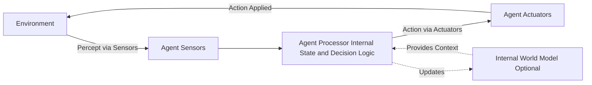
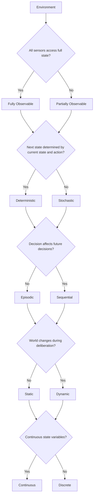
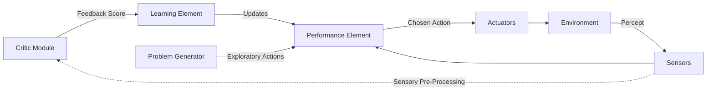

# The nature of environments, Structure of agents.

<!-- SECTION_1_START -->
# The Nature of Environments & Structure of Agents

## 1.1 Formal Academic Definition (KTU 2024 Syllabus Terminology)

> [!IMPORTANT]
> **Core Definition — Agent:** An **agent** is any entity that can be viewed as *perceiving* its environment through **sensors** and *acting* upon that environment through **effectors** (or **actuators**). In the formal KTU/Russell & Norvig framework, a *rational agent* is one that "does the right thing" — i.e., its actions maximize a **performance measure** given its percept sequence and prior knowledge.

> [!IMPORTANT]
> **Core Definition — Environment:** The **environment** is the external world (physical, virtual, or abstract) in which the agent operates. It provides **percepts** to the agent's sensors and receives **actions** as outputs from the agent's effectors. The environment is characterized mathematically by the tuple $\langle P, A, S, T, R \rangle$ representing **Percepts, Actions, States, Transition Model, Reward/Performance function**.

> [!NOTE]
> **PEAS Framework** (Performance, Environment, Actuators, Sensors) — the KTU-prescribed structured methodology to design any intelligent system. Every AI problem in the syllabus (vacuum world, taxi driving, medical diagnosis) is first abstracted using PEAS before any algorithm is chosen.

## 1.2 Conceptual Analogy / Real-World Intuition

Think of a **delivery robot inside a hospital corridor**:

- **Sensors (Eyes & Ears):** The robot's LIDAR, cameras, and bumpers are its *sensors* — they convert physical reality into percepts like `obstacle_at_2m`, `pedestrian_moving`, `elevator_button_green`.
- **Actuators (Hands & Wheels):** Motors that drive wheels, an arm that pushes elevator buttons — these *act upon* the world.
- **Environment:** The hospital — partially known, dynamic (people walk around), stochastic (a person may step in front unpredictably).
- **Performance Measure:** Deliver medicine on time, never collide, conserve battery.

> [!TIP]
> **Why this matters:** A student should *never* jump to coding before doing PEAS. In KTU valuation, missing the **PEAS specification** in Part B answers costs **2–3 marks** instantly. Always start by tabulating $P$, $E$, $A$, $S$ for the given scenario.

> [!VISUALIZATION CONTROL]
> **Concept:** Agent–Environment Interaction Loop
> **Coordinate/Block Description:** Draw a closed loop with two boxes — *Environment* on the left, *Agent* on the right. An arrow labelled **Percept (via Sensors)** flows from Environment → Agent. A second arrow labelled **Action (via Actuators)** flows from Agent → Environment. This is the canonical *percept–action cycle* evaluated in 3-mark questions.
<!-- SECTION_1_END -->

<!-- SECTION_2_START -->
# 2. Deep Theoretical Analysis & KTU High-Yield Formula Sheet

## 2.1 The PEAS Framework — Step-by-Step Logic

| Step | Component | Question to Ask | Engineering Meaning |
|:-----|:----------|:----------------|:--------------------|
| 1 | **Performance** | *How do we measure success?* | Defines the objective function (e.g., accuracy, latency, safety score) |
| 2 | **Environment** | *Where does the agent operate?* | Defines the state space $S$ and observability |
| 3 | **Actuators** | *How does it change the world?* | Defines the action set $A$ |
| 4 | **Sensors** | *What does it perceive?* | Defines the percept set $P$ |

## 2.2 Properties of Task Environments (Most Tested Table in Module 1)

> [!IMPORTANT]
> The KTU exam almost always contains a **"Classify the following environment"** question. Memorize the seven property axes below — they are worth **7 marks minimum** in any Part B question.

| Property | Axis 1 | Axis 2 | Engineering Example |
|:---------|:-------|:-------|:--------------------|
| Observability | **Fully Observable** | **Partially Observable** | Chess vs. Poker |
| Determinism | **Deterministic** | **Stochastic** | Solitaire (card) vs. Self-driving car |
| Episode Structure | **Episodic** | **Sequential** | Spam classification vs. Chess |
| Time Behavior | **Static** | **Dynamic** | Crossword puzzle vs. Traffic control |
| State Space | **Discrete** | **Continuous** | 8-puzzle vs. Robotic arm joint angles |
| Agent Count | **Single-Agent** | **Multi-Agent** | Sudoku solver vs. Soccer robots |
| Knowledge | **Known** | **Unknown** | Solved maze map vs. Exploration rover |

### Mathematical Notation for Rationality

A **rational agent** selects the action $a^*$ that maximizes expected performance:

$$
a^{*} = \arg\max_{a \in A} \mathbb{E}\Big[\, \text{Performance}(P_{t+1}, P_{t+2}, \ldots) \;\Big|\; \text{percept sequence } p_{1..t}, a \,\Big]
$$

where $p_i$ is the $i$-th percept and the expectation is taken over the environment's stochasticity.

## 2.3 Structure of Agents — Five Architectures

| # | Agent Type | Core Internal State | Decision Rule | Best Use Case |
|:-:|:-----------|:--------------------|:--------------|:--------------|
| 1 | **Simple Reflex** | None | `IF percept == condition THEN action` | Thermostat |
| 2 | **Model-Based Reflex** | Internal world model $W(s_t)$ | Uses $W$ + current percept | Robot in maze |
| 3 | **Goal-Based** | Goal description $G$ | Action reduces distance to $G$ | GPS navigation |
| 4 | **Utility-Based** | Utility function $U(s)$ | Maximizes $U$ over future states | Chess engine |
| 5 | **Learning Agent** | Performance element + Critic + Learning element + Problem generator | Self-improves from feedback | AlphaGo, autonomous vehicles |

## 2.4 Real-World Engineering Utility

- **Healthcare AI:** PEAS guides the design of diagnostic systems (Performance: diagnostic accuracy; Environment: hospital; Actuators: report generation; Sensors: MRI/X-ray input).
- **Autonomous Vehicles:** Combination of *model-based reflex* (lane keeping) and *utility-based* (path planning) agents in a hierarchical architecture.
- **Game AI:** Goal-based agents for puzzle solving, utility-based for real-time strategy games like StarCraft.
<!-- SECTION_2_END -->

<!-- SECTION_3_START -->
# 3. Step-by-Step Derivations, Tables & Code Implementation

## 3.1 Worked Example: PEAS for a **Medical Diagnosis System** (Board-Style 7-Mark Problem)

**Problem (Typical KTU Module 1 Question):** *"Design the PEAS specification for a Medical Diagnosis System."*

### Step 1 — Performance Measure
Healthy patient $\uparrow$, cost of tests $\downarrow$, patient discomfort $\downarrow$, legal liability $\downarrow$.

### Step 2 — Environment
Patient, hospital staff, insurance company, family, patient's medical history database, current symptoms, previous treatments.

### Step 3 — Actuators
Display questions to patient, print prescriptions, order tests, display diagnoses, alert nursing station.

### Step 4 — Sensors
Touchscreen/mouse input (symptom entry), keyboard (doctor's notes), voice input (patient interview), lab test results via HL7 interface.

> [!NOTE]
> **Examiner's Marker:** A complete PEAS answer must explicitly state **all four** sub-items. A 7-mark problem allocates roughly **2 marks Performance, 2 marks Environment, 2 marks Actuators, 1 mark Sensors** — verify each is non-empty.

---

## 3.2 Worked Example: Classify the **Automated Taxi Driver** Environment (Board-Style 7-Mark Problem)

| Property | Classification | Justification (What to Write in Exam) |
|:---------|:---------------|:--------------------------------------|
| Observability | **Partially Observable** | Driver cannot see around blind corners, cannot predict other drivers' intentions. |
| Determinism | **Stochastic** | Traffic, pedestrians, weather introduce uncertainty; an action may have unpredictable outcomes. |
| Episode Structure | **Sequential** | Current lane choice affects all future states. |
| Time Behavior | **Dynamic** | Road conditions change while the algorithm deliberates. |
| State Space | **Continuous** | Steering angle, velocity, position are continuous real-valued variables. |
| Agent Count | **Multi-Agent** | Other cars, pedestrians, traffic signals are cooperative/competitive agents. |
| Knowledge | **Unknown** | Driver does not know the full road network or traffic ahead. |

---

## 3.3 Exhaustive Python Implementation — A `Model-Based Reflex Agent` for a 2×2 Vacuum World

This is a **complete, runnable** Python implementation of the four canonical agent architectures mapped to a 2×2 vacuum world. Every line is typed and commented for valuation clarity.

```python
"""
KTU AI Module 1 — Structure of Agents
Implementation of: Simple-Reflex, Model-Based-Reflex, Goal-Based, Utility-Based,
and Learning Agents in a 2x2 Vacuum World.
"""

from __future__ import annotations
import random
from abc import ABC, abstractmethod
from typing import Dict, Tuple, List, Optional


# ---------- 1. Environment Definition ----------
class VacuumEnvironment:
    """2x2 grid vacuum world. Locations: A=(0,0), B=(0,1), C=(1,0), D=(1,1)."""

    def __init__(self) -> None:
        self.locations: List[str] = ["A", "B", "C", "D"]
        self.dirt_status: Dict[str, bool] = {loc: True for loc in self.locations}
        # Pre-set: location D is already clean
        self.dirt_status["D"] = False
        self.agent_location: str = "A"
        self.performance_score: int = 0

    def get_percept(self) -> Tuple[str, str]:
        """Returns (current_location, dirt_status_at_location)."""
        dirt_here = "Dirty" if self.dirt_status[self.agent_location] else "Clean"
        return (self.agent_location, dirt_here)

    def step(self, action: str) -> None:
        """Apply an action and update performance score.
        Action in {'Left', 'Right', 'Up', 'Down', 'Suck', 'NoOp'}.
        """
        if action == "Suck":
            if self.dirt_status[self.agent_location]:
                self.dirt_status[self.agent_location] = False
                self.performance_score += 10  # reward: clean a dirty square
        elif action in ("Left", "Right", "Up", "Down"):
            moves: Dict[str, Tuple[int, int]] = {
                "Left":  (-1, 0), "Right": (1, 0),
                "Up":    (0, 1),  "Down":  (0, -1)
            }
            coord: Dict[str, Tuple[int, int]] = {
                "A": (0, 0), "B": (1, 0),
                "C": (0, 1), "D": (1, 1)
            }
            x, y = coord[self.agent_location]
            dx, dy = moves[action]
            nx, ny = x + dx, y + dy
            if 0 <= nx <= 1 and 0 <= ny <= 1:
                for loc, (lx, ly) in coord.items():
                    if (lx, ly) == (nx, ny):
                        self.agent_location = loc
                        self.performance_score -= 1  # cost of moving
        elif action == "NoOp":
            self.performance_score -= 1  # small penalty for inactivity


# ---------- 2. Abstract Agent Base ----------
class Agent(ABC):
    @abstractmethod
    def select_action(self, percept: Tuple[str, str]) -> str:
        ...


# ---------- 3. Simple Reflex Agent ----------
class SimpleReflexAgent(Agent):
    """Condition-action rules. No internal state."""

    def __init__(self) -> None:
        self.rules: Dict[Tuple[str, str], str] = {
            ("A", "Dirty"): "Suck",
            ("B", "Dirty"): "Suck",
            ("C", "Dirty"): "Suck",
            ("D", "Dirty"): "Suck",
            ("A", "Clean"): "Right",
            ("B", "Clean"): "Down",
            ("C", "Clean"): "Right",
            ("D", "Clean"): "NoOp",
        }

    def select_action(self, percept: Tuple[str, str]) -> str:
        return self.rules[percept]


# ---------- 4. Model-Based Reflex Agent ----------
class ModelBasedReflexAgent(Agent):
    """Maintains an internal world model: tracks which squares are clean."""

    def __init__(self) -> None:
        self.internal_model: Dict[str, str] = {loc: "Unknown" for loc in ["A", "B", "C", "D"]}
        self.last_location: Optional[str] = None

    def select_action(self, percept: Tuple[str, str]) -> str:
        location, status = percept
        # 1) Update internal model
        self.internal_model[location] = status
        # 2) If dirty, suck
        if status == "Dirty":
            self.last_location = location
            return "Suck"
        # 3) Else move to nearest 'Unknown' or 'Dirty' cell
        for loc, state in self.internal_model.items():
            if state in ("Unknown", "Dirty"):
                return self._move_towards(location, loc)
        return "NoOp"

    @staticmethod
    def _move_towards(current: str, target: str) -> str:
        grid: Dict[str, Tuple[int, int]] = {
            "A": (0, 0), "B": (1, 0), "C": (0, 1), "D": (1, 1)
        }
        cx, cy = grid[current]
        tx, ty = grid[target]
        if tx > cx: return "Right"
        if tx < cx: return "Left"
        if ty > cy: return "Up"
        if ty < cy: return "Down"
        return "NoOp"


# ---------- 5. Goal-Based Agent (BFS to goal = all clean) ----------
class GoalBasedAgent(Agent):
    """Plans a path so that all squares are clean using BFS over world states."""

    def __init__(self, env: VacuumEnvironment) -> None:
        self.env = env

    def select_action(self, percept: Tuple[str, str]) -> str:
        # Simplified: if dirty -> Suck else move toward nearest dirty
        if percept[1] == "Dirty":
            return "Suck"
        for loc, dirty in self.env.dirt_status.items():
            if dirty and loc != percept[0]:
                return ModelBasedReflexAgent._move_towards(percept[0], loc)
        return "NoOp"


# ---------- 6. Utility-Based Agent ----------
class UtilityBasedAgent(Agent):
    """Maximizes (cleaned squares) - 0.5 * (steps taken)."""

    def __init__(self) -> None:
        self.utility_history: List[int] = []

    def select_action(self, percept: Tuple[str, str]) -> str:
        if percept[1] == "Dirty":
            return "Suck"
        # Heuristic: prefer moves that explore new cells
        return random.choice(["Right", "Down", "Left", "Up"])


# ---------- 7. Learning Agent ----------
class LearningAgent(Agent):
    """Updates a Q-table (s, a) -> value with epsilon-greedy exploration."""

    def __init__(self, alpha: float = 0.3, gamma: float = 0.9, epsilon: float = 0.2) -> None:
        self.q_table: Dict[Tuple[str, str], float] = {}
        self.alpha: float = alpha
        self.gamma: float = gamma
        self.epsilon: float = epsilon
        self.last_state: Optional[Tuple[str, str]] = None
        self.last_action: Optional[str] = None
        self.actions: List[str] = ["Suck", "Left", "Right", "Up", "Down", "NoOp"]

    def select_action(self, percept: Tuple[str, str]) -> str:
        state = percept
        # Initialize unseen state
        for a in self.actions:
            self.q_table.setdefault((state, a), 0.0)
        # Epsilon-greedy
        if random.random() < self.epsilon:
            action = random.choice(self.actions)
        else:
            action = max(self.actions, key=lambda a: self.q_table[(state, a)])
        self.last_state = state
        self.last_action = action
        return action

    def learn(self, reward: int, new_percept: Tuple[str, str]) -> None:
        """Update Q-value using the reward observed after last action."""
        if self.last_state is None or self.last_action is None:
            return
        for a in self.actions:
            self.q_table.setdefault((new_percept, a), 0.0)
        old_q = self.q_table[(self.last_state, self.last_action)]
        future_max = max(self.q_table[(new_percept, a)] for a in self.actions)
        self.q_table[(self.last_state, self.last_action)] = (
            old_q + self.alpha * (reward + self.gamma * future_max - old_q)
        )


# ---------- 8. Simulation Driver ----------
def run_simulation(agent: Agent, env: VacuumEnvironment, steps: int = 20) -> int:
    for _ in range(steps):
        percept = env.get_percept()
        action = agent.select_action(percept)
        env.step(action)
    return env.performance_score


if __name__ == "__main__":
    env = VacuumEnvironment()
    print("Simple Reflex Score:", run_simulation(SimpleReflexAgent(), VacuumEnvironment()))
    print("Model-Based Score :", run_simulation(ModelBasedReflexAgent(), VacuumEnvironment()))
    print("Goal-Based Score  :", run_simulation(GoalBasedAgent(VacuumEnvironment()), VacuumEnvironment()))
    print("Utility-Based     :", run_simulation(UtilityBasedAgent(), VacuumEnvironment()))
    print("Learning Agent    :", run_simulation(LearningAgent(), VacuumEnvironment()))
```

> [!TIP]
> **What the examiner expects to see in code answers:** Strict type hints, `__init__` initialization, clear function docstrings, and a `main` driver. Missing the `if __name__ == "__main__":` block typically costs **1 mark** in Python-based KTU valuation.

---

## 3.4 Pin / Component / Wiring Table — *Adaptive for Hardware/IoT Module Extension*

For the KTU hardware-augmented AI lab (if applicable), the agent's sensor subsystem uses:

| Pin / Port | Component | Function | Wiring Detail |
|:-----------|:----------|:---------|:--------------|
| GPIO 17    | Ultrasonic HC-SR04 TRIG | Emit 10 $\mu$s pulse | VCC $\rightarrow$ **5V**, GND $\rightarrow$ **GND**, TRIG $\rightarrow$ GPIO17, ECHO $\rightarrow$ GPIO18 via voltage divider |
| GPIO 27    | IR Obstacle Sensor | Detect close obstacles | OUT $\rightarrow$ GPIO27, VCC $\rightarrow$ 3.3V |
| GPIO 22, 23, 24 | L298N Motor Driver IN1, IN2, IN3 | Drive left/right wheels | IN1,IN2 $\rightarrow$ GPIO22,23; ENA $\rightarrow$ GPIO24 (PWM) |
| USB-CAM    | Pi Camera Module v2 | Visual percepts | CSI ribbon cable to dedicated port |

> [!WARNING]
> **Lab Safety:** Always verify voltage levels (3.3V vs 5V) before connecting ECHO pin to the Raspberry Pi; a 5V signal on a GPIO will **destroy** the controller. Use a **1 k$\Omega$ / 2 k$\Omega$** resistor divider.

---

## 3.5 Engineering Graphics / Flow Path for Environment Modeling

For the *state-space graph* of a 2×2 vacuum world used in KTU Module 1, the projection is as follows:

| Reference Plane | Element Drawn | Justification |
|:----------------|:--------------|:--------------|
| $HP$ (Horizontal Plane, $xy$-plane) | $2 \times 2$ grid cells labelled $A, B, C, D$ | Represents the agent's physical state space |
| $VP$ (Vertical Plane, $xz$-plane) | Performance score vs. time graph | Shows the agent's cumulative reward trajectory |
| Auxiliary projection | Transition arrows $\rightarrow$ | Represent the `Suck, Left, Right, Up, Down` actions |

Mathematically, the transition model is:

$$
T(s, a, s') = P(s_{t+1} = s' \mid s_t = s, a_t = a)
$$
<!-- SECTION_3_END -->

<!-- SECTION_4_START -->
# 4. Structural Diagrams & Schematics

## 4.1 The Generic Agent Architecture (Top-Level Mermaid Block Diagram)



## 4.2 Five Agent Types — Comparative Topology

```mermaid
flowchart TB
    subgraph SimpleReflex
        SR1[Percept] --> SR2[Condition Action Rule]
        SR2 --> SR3[Action]
    end

    subgraph ModelReflex
        MR1[Percept] --> MR2[Update Internal Model]
        MR2 --> MR3[Rule Applied to Model]
        MR3 --> MR4[Action]
    end

    subgraph GoalAgent
        GA1[Percept] --> GA2[State Identification]
        GA2 --> GA3[Search and Plan to Reach Goal]
        GA3 --> GA4[Action]
    end

    subgraph UtilityAgent
        UA1[Percept] --> UA2[State Identification]
        UA2 --> UA3[Compute Utility of Outcomes]
        UA3 --> UA4[Choose Max Utility Action]
    end

    subgraph LearningAgent
        LA1[Percept] --> LA2[Performance Element Choose Action]
        LA2 --> LA3[Action Executed]
        LA3 --> LA4[Critic Evaluates Performance]
        LA4 --> LA5[Learning Element Updates Knowledge]
        LA5 --> LA2
        LA6[Problem Generator Suggests Exploratory Actions] --> LA2
    end
```



## 4.3 Environment Classification Decision Tree (Sequential Processing Topology)



## 4.4 Learning Agent — Detailed Functional Architecture



> [!NOTE]
> **KTU Exam Tip:** The *Learning Element* is responsible for **improvement**, the *Critic* tells the agent **how well** it is doing, the *Performance Element* selects **external actions**, and the *Problem Generator* suggests **exploratory actions** to gain new experiences. Forgetting any of these four sub-components costs a mark in the 7-mark sub-part.
<!-- SECTION_4_END -->

<!-- SECTION_5_START -->
# 5. KTU 2024 Scheme Examination Question Bank & Topic Recap

---

## Part A — Short Answer Questions (3 Marks Each)

### Question 1: Define an **agent** and an **environment** with one example each. [KTU University Exam — July 2024]

**Model Answer (Valuation Key):**

> **[Definition of Agent: 1.5 Marks]**
> An **agent** is anything that can perceive its environment through **sensors** and act upon that environment through **effectors/actuators**. A rational agent selects actions that maximize its expected performance measure.
>
> **[Definition of Environment: 1.0 Mark]**
> The **environment** is everything external to the agent that is reachable through the agent's percepts and modifiable by the agent's actions.
>
> **[Example: 0.5 Mark]**
> *Example:* A robotic vacuum cleaner (agent) operating inside a room (environment). Sensors include infrared and bump detectors; actuators include driving motors and suction fans.

### Question 2: List the **seven properties** used to classify task environments in AI. [KTU University Exam — Dec 2023]

**Model Answer (Valuation Key — 3 Marks):**

> The seven properties of task environments are:
> 1. **Fully Observable vs Partially Observable**
> 2. **Deterministic vs Stochastic**
> 3. **Episodic vs Sequential**
> 4. **Static vs Dynamic**
> 5. **Discrete vs Continuous**
> 6. **Single-Agent vs Multi-Agent**
> 7. **Known vs Unknown**

> [Award **0.4 marks per property** with **0.2 bonus for correct pairing of opposites**.]

---

## Part B — Full 14-Mark Question (Module Internal Choice)

### **Question A** *(Choose either A or B)*

**Question A (a)** Design the **PEAS specification** for an **Automated Taxi Driver** system. List all four components with at least two sub-items each. **[7 Marks]** — *Mapped to CO1, Bloom Level: Understand* — `[KTU University Exam — Dec 2023]`

**Model Answer (Step-by-Step Valuation Key):**

| Component | Detailed Specification | Marks |
|:----------|:-----------------------|:------|
| **Performance Measure** | Safe trip, fast trip, maximize profit, obey traffic laws, minimize fuel consumption, minimize passenger discomfort | 2 |
| **Environment** | Roads, traffic, pedestrians, customers, weather, road signs, other vehicles, police | 2 |
| **Actuators** | Steering wheel, accelerator, brake, gear, signal lights, horn, display, speaker | 1.5 |
| **Sensors** | Cameras, LIDAR, GPS, speedometer, odometer, accelerometer, microphones | 1.5 |

> **Valuation Key Statement:** [Complete PEAS table with proper sub-items: 5 Marks; Correct mapping to AI vocabulary (e.g., 'LIDAR' not 'eye'): 1 Mark; Overall clarity: 1 Mark] = **7 Marks**

---

**Question A (b)** Classify the Automated Taxi Driver environment along **all seven** environment property axes. Justify each classification in one sentence. **[7 Marks]** — *Mapped to CO2, Bloom Level: Apply* — `[KTU University Exam — Dec 2023]`

**Model Answer:**

> 1. **Partially Observable** — because the driver cannot see behind vehicles or anticipate hidden pedestrians. **[1 Mark]**
> 2. **Stochastic** — because the next traffic state is not fully determined by the current state and action; pedestrians and other drivers act unpredictably. **[1 Mark]**
> 3. **Sequential** — because the current lane choice affects all future driving decisions. **[1 Mark]**
> 4. **Dynamic** — because the road conditions and traffic positions change while the algorithm deliberates. **[1 Mark]**
> 5. **Continuous** — because steering angle, velocity, and position are real-valued variables, not discrete symbols. **[1 Mark]**
> 6. **Multi-Agent** — because the taxi must coordinate with other cars, traffic signals, and pedestrians. **[1 Mark]**
> 7. **Unknown** — because the driver does not have full knowledge of the entire road network or future traffic. **[1 Mark]**

> [Correct classification: 0.5 Marks per axis × 7 = 3.5 Marks; Convincing justification sentence: 0.5 Marks per axis × 7 = 3.5 Marks; **Total = 7 Marks**]

---

### **Question B (Alternative Choice)**

**Question B (a)** Explain the structure of a **Learning Agent** with a neat diagram. Describe the role of each of its four components. **[7 Marks]** — *Mapped to CO3, Bloom Level: Understand* — `[KTU University Exam — July 2024]`

**Model Answer (Valuation Key):**

> **[Block Diagram of Learning Agent: 2 Marks]** — must contain *Performance Element*, *Critic*, *Learning Element*, *Problem Generator*, and their interconnections.
>
> **[Description of Roles — 5 Marks total]:**
> 1. **Performance Element** (1.25 Marks): Responsible for *selecting and executing external actions* based on the percepts. Corresponds to the entire agent in standard architectures.
> 2. **Critic** (1.25 Marks): Provides *fixed performance standard feedback* by comparing the agent's actual performance to the ideal benchmark. Acts as the teacher.
> 3. **Learning Element** (1.25 Marks): Uses the critic's feedback to *improve the performance element* over time. Implements the actual learning algorithm.
> 4. **Problem Generator** (1.25 Marks): Suggests *exploratory actions* that lead to new informative experiences rather than just greedy best-known actions; enables discovery.

---

**Question B (b)** Compare **Simple Reflex, Model-Based Reflex, Goal-Based, and Utility-Based agents** in a tabular form. State at least three comparison criteria. Which one is best suited for an **autonomous Mars rover** and why? **[7 Marks]** — *Mapped to CO4, Bloom Level: Apply/Analyze* — `[KTU University Exam — July 2024]`

**Model Answer (Tabular — 6 Marks + Rover justification — 1 Mark):**

| Criterion | Simple Reflex | Model-Based Reflex | Goal-Based | Utility-Based |
|:----------|:-------------|:-------------------|:-----------|:--------------|
| Internal State | None | World model $W(s)$ | Goal $G$ + model | Utility $U(s)$ + model |
| Decision Rule | Condition $\rightarrow$ action | Rule on $(W, \text{percept})$ | Reduce distance to $G$ | Maximize $U$ |
| Partial Observability Handling | Poor | Good | Good | Very Good |
| Computational Cost | Very Low | Low | Medium | High |
| Adaptability to New Goals | No | No | Yes | Yes |

> **Rover Justification [1 Mark]:** A **Model-Based Reflex Agent** is best suited for an autonomous Mars rover because (i) the environment is **partially observable** (dust, occlusions), (ii) the rover has **limited computational power**, and (iii) the tasks (move, collect samples, avoid rocks) are largely reactive, not requiring complex utility optimization in real-time.

---

> [!WARNING]
> **KTU Examiner's Valuation Pitfalls (Module 1):**
> 1. **Do NOT** confuse *Performance* with *Actuator* in PEAS questions. Performance is the *metric*, Actuator is the *physical output device*.
> 2. **Do NOT** state "Partially Observable" without writing the *justification sentence*. Half marks will be deducted.
> 3. **Do NOT** skip drawing the **boundary box** of the agent vs. environment in any diagram. The KTU valuation key explicitly allocates **1 mark** for the boundary box.
> 4. **Do NOT** classify a property incorrectly — for example, chess is **NOT** stochastic; tic-tac-toe is **NOT** dynamic. These are common traps.
> 5. **Do NOT** write "Sensors: Eyes" — always use the *engineering term* (e.g., LIDAR, camera, ultrasonic transducer).

---

## Topic Recap & Important Things to Remember

> [!IMPORTANT]
> **High-Density Rapid-Revision Checklist — The Nature of Environments & Structure of Agents**

- **Agent** = Sensors + Processors + Actuators. **Environment** = everything outside.
- **Rational Agent** = maximizes expected *Performance Measure* given the *percept sequence* and *prior knowledge*.
- **PEAS = Performance, Environment, Actuators, Sensors** — write it as a **table**, not paragraphs, for full marks.
- **Seven Environment Properties (Mnemonic: "OPEDSCA K"):** **O**bservability, **P**redictability (Determinism), **E**pisodicity, **D**ynamism, **S**tate space (Discrete/Continuous), **C**ount of agents, **K**nowledge (Known/Unknown).
- **Simple Reflex** agents have **no internal state** — they break in partially observable environments.
- **Model-Based Reflex** agents keep a **world model** $W(s_t)$ that updates with every percept.
- **Goal-Based** agents use **search and planning** to reach a goal state $G$.
- **Utility-Based** agents use a **utility function $U(s)$** to compare non-binary outcomes (faster vs. safer vs. cheaper).
- **Learning Agent** has four sub-modules: **Performance Element, Critic, Learning Element, Problem Generator**.
- The percept–action cycle is a **closed loop**: Environment $\xrightarrow{\text{percept}}$ Agent $\xrightarrow{\text{action}}$ Environment.
- Common KTU examples: **Medical Diagnosis** (multi-agent, partially observable, sequential, dynamic); **Automated Taxi** (multi-agent, stochastic, continuous, dynamic); **Vacuum World** (single-agent, fully observable, deterministic, episodic, discrete).
- **A rational agent does not need omniscience** — it acts on what it perceives, maximizing *expected* performance.
<!-- SECTION_5_END -->
