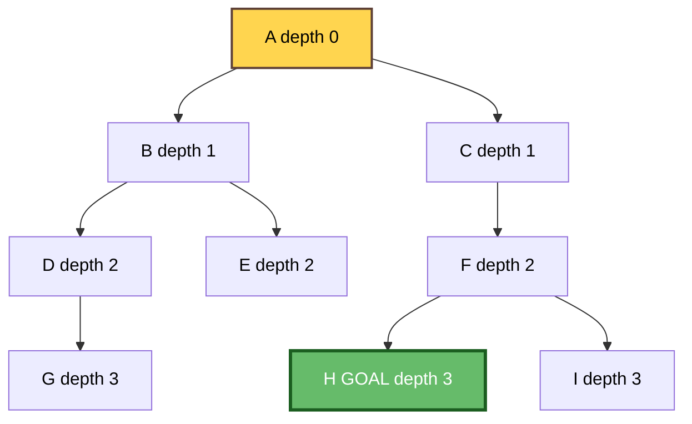
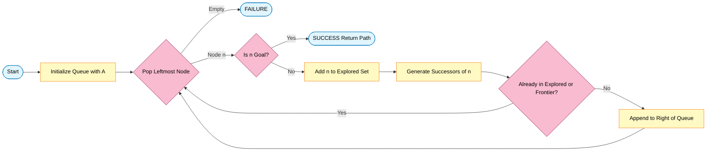
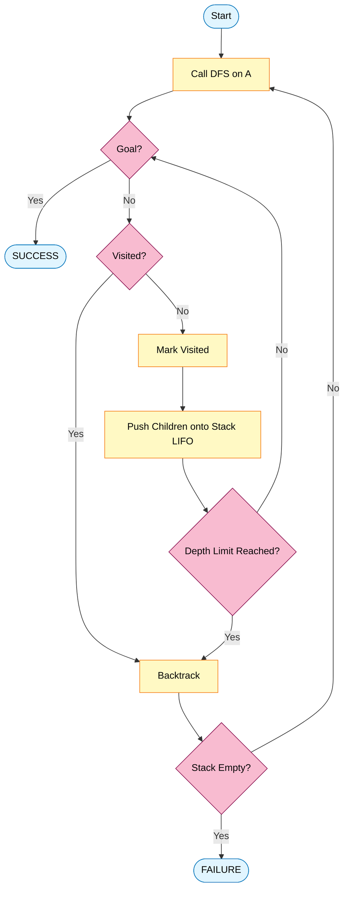
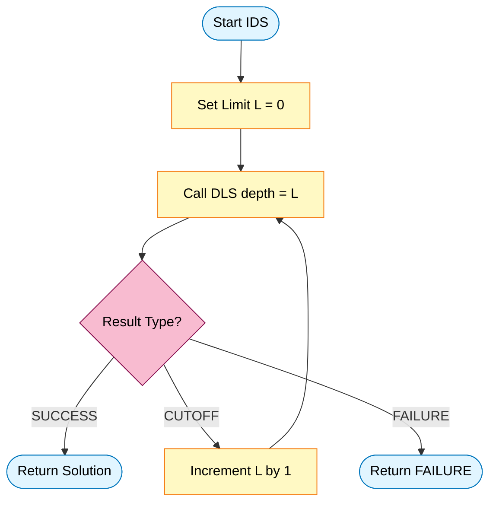
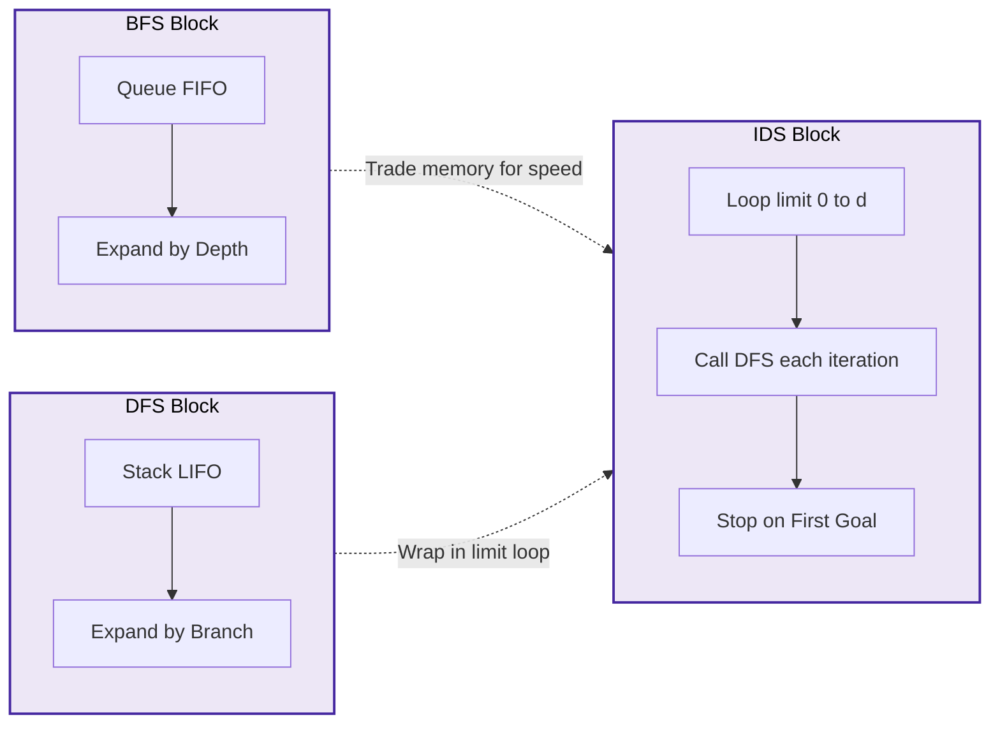

# Depth First Search, Breadth First Search, Iterative Deepening Search.

<!-- SECTION_1_START -->

# 🔍 Searching Strategies in Artificial Intelligence

## 1.1 Core Technical Definition & Intuitive Overview

In the **KTU 2024 Scheme** syllabus for *Artificial Intelligence (PECST522)*, **Uninformed (Blind) Search Strategies** form a foundational pillar of Module 2. These are search algorithms that operate without any domain-specific knowledge (heuristics) — they rely solely on the structure of the problem graph and a traversal rule.

> [!IMPORTANT]
> **Formal KTU Definition (PECST522 / Module 2):**
> *Uninformed search* is a class of generic search algorithms that explore a search space using only the information available in the problem definition. They differ from one another in the **order in which nodes are expanded** (i.e., the data structure used for the frontier). The three principal members — **Breadth-First Search (BFS)**, **Depth-First Search (DFS)**, and **Iterative Deepening Search (IDS)** — are mandatory topics for KTU board evaluation.

### 🍕 Real-World Analogies (Intuition)

| Algorithm | One-Line Analogy | Intuition for a Beginner |
|---|---|---|
| **BFS** | *Drop a stone in a pond* — observe ripples expanding uniformly outward. | Visit all neighbours at the current depth **before** moving to the next depth. |
| **DFS** | *Explore a cave with a single rope* — keep walking until you hit a dead-end, then backtrack. | Go as **deep** as possible along one branch, then unwind. |
| **IDS** | *Try the cave with a rope of length 1, then 2, then 3...* — repeat DFS with growing limits. | A hybrid that runs BFS-style layer probing using DFS-style memory. |

### 1.1.1 Breadth-First Search (BFS) — The Ripple Strategy

> [!NOTE]
> **Definition:** BFS is a graph traversal algorithm that systematically explores all nodes at the present **depth level** before moving on to the nodes at the next depth level. It uses a **FIFO (First-In-First-Out) Queue** as its frontier data structure.

**Intuitive Analogy — The Social Network Friend Finder:**
Imagine you are searching for a person named *Kavya* in a friend network starting from *Anu*. BFS first checks all of *Anu's* direct friends. If *Kavya* is not found, it then checks all friends-of-friends. It expands outward in concentric "circles of friendship." It is **complete** (finds the goal if it exists) and **optimal for unweighted graphs** (guarantees the shortest path in terms of number of edges).

> [!IMPORTANT]
> **Standard BFS Metrics (Kruskal & Standard AI Textbook):**
> - **Branching Factor (b):** the number of children of any node.
> - **Depth of Shallowest Goal (d):** the depth at which the first goal is located.
> - **Maximum Depth (m):** the deepest node in the search tree.

### 1.1.2 Depth-First Search (DFS) — The Deep Diver

> [!NOTE]
> **Definition:** DFS is a graph traversal algorithm that explores as **far down a branch as possible** before backtracking. It uses a **LIFO (Last-In-First-Out) Stack** (or recursive function call stack) to maintain its frontier.

**Intuitive Analogy — The Labyrinth Explorer:**
You are dropped into a maze with a single piece of chalk. You mark your entry, and every time you reach a junction, you take the **leftmost unmarked passage** and keep going. The moment you hit a dead-end, you retrace your steps to the last junction, mark that path as explored, and take the next unmarked passage. This is DFS in action. It is **not optimal** in general (it may find a deep goal before a shallower one) and can get trapped in infinite loops on graphs with cycles — hence the need for a **visited set**.

### 1.1.3 Iterative Deepening Search (IDS) — The Best of Both Worlds

> [!NOTE]
> **Definition:** IDS is a search strategy that calls **Depth-Limited Search (DLS)** with progressively increasing depth limits: $0, 1, 2, 3, \ldots$ until the goal is found. It combines the **memory efficiency of DFS** with the **completeness and optimality of BFS**.

**Intuitive Analogy — The Sonar Probe:**
A submarine looking for a wreck sends sonar pings. To save energy, it pings at depth 1 km, checks, then 2 km, checks, then 3 km — repeating until contact. Each "ping" is a full DFS limited to that depth. This wastes some "effort" re-expanding upper-level nodes, but the total cost is asymptotically the same as BFS while using only **linear memory**.

### 1.1.4 The Tree-Search vs. Graph-Search Distinction

A critical KTU-favourite question:
- **Tree-Search:** Does not remember previously visited nodes. May revisit a node infinitely many times (e.g., on graphs with cycles).
- **Graph-Search:** Maintains an **Explored / Closed Set**. Once a node is expanded, it is never re-added to the frontier. Guarantees termination on finite graphs.

> [!TIP]
> **Standard KTU Notation (Pearl / Russell & Norvig Convention):**
> - $f(n)$ — evaluation function (relevant later in informed search).
> - $g(n)$ — actual cost from start to node $n$.
> - $h(n)$ — heuristic estimate from $n$ to goal.
> - For BFS/DFS/IDS in this module, $f(n) = g(n)$ since there is **no heuristic** ($h(n) = 0$).

---

<!-- SECTION_1_END -->

<!-- SECTION_2_START -->

# 🧠 Deep Theoretical Analysis & KTU High-Yield Formula Sheet

## 2.1 Operational Logic — Step by Step

### 2.1.1 BFS Operational Stack-Trace

The generic algorithm structure is identical for all three; only the **frontier data structure** and **termination condition** change.

> [!IMPORTANT]
> **Generic Graph-Search Skeleton (used by BFS, DFS, IDS):**
> 1. Initialize `frontier` with the start node $S$.
> 2. Initialize `explored` $\leftarrow \emptyset$.
> 3. **Loop:**
>    - If `frontier` is empty $\Rightarrow$ return **FAILURE**.
>    - Pop node $n$ from `frontier` (according to data structure's policy).
>    - If $n$ is a goal node $\Rightarrow$ return **PATH / SOLUTION**.
>    - Add $n$ to `explored`.
>    - For each successor $n'$ of $n$:
>      - If $n' \notin$ `explored` and $n' \notin$ `frontier`, add $n'$ to `frontier`.

For BFS, the **pop policy is FIFO** — the *oldest* unexpanded node is chosen next. This guarantees that nodes are expanded in strict order of increasing depth.

### 2.1.2 DFS Operational Logic

For DFS, the **pop policy is LIFO** — the *most recently generated* unexpanded node is chosen next. This drives the search down a single branch until either a goal or a dead-end is encountered.

> [!WARNING]
> **KTU Common Pitfall:** In **unbounded-depth tree-search DFS**, the algorithm may never terminate on a graph with a cycle, because the same node can be re-generated endlessly. Always state explicitly whether you are running **tree-search** (no visited set) or **graph-search** (with visited set) DFS in your answer script.

### 2.1.3 IDS Operational Logic

Iterative Deepening wraps a helper function **Depth-Limited Search (DLS)**:

$$
\text{IDS}(S, \text{problem}) = \text{DLS}(\text{limit} = 0, 1, 2, \ldots) \text{ until goal found}
$$

DLS is a DFS that **refuses to expand any node whose depth equals the limit** and returns failure (or cutoff) when the limit is reached. IDS simply re-runs DLS with increasing limits until a solution is found.

## 2.2 The KTU High-Yield Formula Sheet

> [!IMPORTANT]
> The following table is the **single most important revision artifact** for Module 2. Memorize every cell — KTU board questions frequently ask for direct comparisons.

| Property | BFS | DFS (Tree) | DFS (Graph) | IDS |
|---|---|---|---|---|
| **Data Structure** | FIFO Queue | LIFO Stack | LIFO Stack + Visited Set | LIFO Stack (reused) |
| **Complete?** | ✅ Yes | ❌ No (fails on infinite spaces / loops) | ✅ Yes (in finite graphs) | ✅ Yes |
| **Optimal?** | ✅ Yes (for uniform step costs) | ❌ No | ❌ No | ✅ Yes (for uniform step costs) |
| **Time Complexity** | $O(b^{d})$ | $O(b^{m})$ | $O(b^{m})$ | $O(b^{d})$ |
| **Space Complexity** | $O(b^{d})$ | $O(b \cdot m)$ | $O(b \cdot m)$ | $O(b \cdot d)$ |
| **Goal Test** | When node is **generated** | When node is **expanded** (or generated in some variants) | When expanded | When expanded (in DLS loop) |
| **Best For** | Shallow goals in wide trees | Deep goals in narrow trees; memory-constrained environments | Deep goals; graph with cycles | Large state spaces with unknown depth |

> [!NOTE]
> **Variable Key for the Formulas Above:**
> - $b$ — branching factor (assume constant for analysis).
> - $d$ — depth of the **shallowest** goal node.
> - $m$ — maximum depth of the state space (may be $\infty$).
> - All complexities assume a **uniform-cost** tree where every node has $b$ successors.

### 2.3 Why IDS is Asymptotically Optimal in Time (Derivation Outline)

The "duplicate work" argument is a KTU favourite:

- BFS expands nodes at depths $0, 1, 2, \ldots, d$.
- IDS expands nodes at depths $0, 1, 2, \ldots, d$ as well — but in the **last** iteration (limit $= d$) it expands *all* nodes down to depth $d$.
- In iteration $k$, the root is re-expanded, then the $b$ children, then the $b^2$ grandchildren, ..., down to depth $k$.

$$
N(\text{IDS}) = (d) \cdot b^{1} + (d-1) \cdot b^{2} + (d-2) \cdot b^{3} + \ldots + 1 \cdot b^{d}
$$

For large $b$, the dominant term is $b^{d}$, and the leading coefficient approaches $\dfrac{b}{b-1}$. Hence:

$$
N(\text{IDS}) \approx \frac{b}{b-1} \cdot b^{d} = O(b^{d})
$$

So the time penalty over BFS is only a **constant factor of $\frac{b}{b-1}$** (which is at most 2 when $b \geq 2$), while the **space** drops from exponential to linear.

## 2.4 Real-World Engineering Utility

- **BFS:** Shortest-hop routing in network layer protocols (e.g., OSPF link-state), web crawlers indexing pages by hop distance, social network "people-you-may-know" (friend-of-friend) features, broadcasting in LANs.
- **DFS:** Topological sorting, cycle detection in dependency graphs, solving Sudoku and N-Queens, garbage collection (mark-and-sweep), path-existence checks in mazes and file systems.
- **IDS:** Chess engines and game-tree search at fixed depth where memory is precious; package-resolution systems like **apt** and **maven**; anagram / word-ladder solvers in mobile apps with tight memory budgets.

> [!TIP]
> **Production Example:** The classic *15-puzzle* and *Rubik's Cube* solvers in embedded systems (low RAM) prefer **IDS** because the maximum depth may be 50+, making BFS's $O(b^{d})$ memory infeasible, while DFS alone risks infinite search.

---

<!-- SECTION_2_END -->

<!-- SECTION_3_START -->

# 🛠 Step-by-Step Derivations & Code/Symbolic Implementation

## 3.1 Canonical Worked Example — The Search Tree

We will use a single canonical tree to **trace and compare** all three algorithms. This tree is taken from a standard KTU model-question pattern.

> [!NOTE]
> **Reference Tree (start node = A, goal node = H):**
> ```
>                    A           (depth 0)
>                  /   \
>                 B     C        (depth 1)
>                / \     \
>               D   E     F     (depth 2)
>              /         / \
>             G         H   I   (depth 3)
> ```
> - Branching factor $b = 2$ (or 3 at A, but for analysis we treat as near-uniform).
> - Shallowest goal depth $d = 3$ (node H).
> - Maximum depth $m = 3$.

## 3.2 BFS Trace (FIFO Queue)

The queue is shown as `[front … back]`. Nodes are added in left-to-right order.

| Step | Action | Frontier (Queue) | Explored | Goal Found? |
|---|---|---|---|---|
| 0 | Init | `[A]` | `{}` | No |
| 1 | Expand A, add B, C | `[B, C]` | `{A}` | No |
| 2 | Expand B, add D, E | `[C, D, E]` | `{A, B}` | No |
| 3 | Expand C, add F (D already a child? — add) | `[D, E, F]` | `{A, B, C}` | No |
| 4 | Expand D, add G | `[E, F, G]` | `{A, B, C, D}` | No |
| 5 | Expand E, no new children | `[F, G]` | `{A, B, C, D, E}` | No |
| 6 | Expand F, add H, I | `[G, H, I]` | `{A, B, C, D, E, F}` | No |
| 7 | Expand G, no new children | `[H, I]` | `{A, B, C, D, E, F, G}` | No |
| 8 | **Generate H, test goal → SUCCESS** | `[I]` | — | ✅ **Yes** |

**Resulting BFS order of expansion:** `A → B → C → D → E → F → G → H` ✅

## 3.3 DFS Trace (LIFO Stack, Graph-Search)

For graph-search, we add an `Explored` check before adding to the frontier. The stack is shown as `[top … bottom]`.

| Step | Action | Frontier (Stack) | Explored |
|---|---|---|---|
| 0 | Init | `[A]` | `{}` |
| 1 | Expand A, push B, C | `[C, B]` | `{A}` |
| 2 | Expand B, push D, E | `[C, E, D]` | `{A, B}` |
| 3 | Expand D, push G | `[C, E, G]` | `{A, B, D}` |
| 4 | Expand G, no children | `[C, E]` | `{A, B, D, G}` |
| 5 | Expand E, no children | `[C]` | `{A, B, D, G, E}` |
| 6 | Expand C, push F | `[F]` | `{A, B, D, G, E, C}` |
| 7 | Expand F, push H, I | `[I, H]` | `{A, B, D, G, E, C, F}` |
| 8 | **Expand H → GOAL** | — | — |

**Resulting DFS order of expansion:** `A → B → D → G → E → C → F → H` ✅
This is **depth-first** because we exhausted branch B–D–G before even looking at C.

## 3.4 Iterative Deepening Search (IDS) Trace

IDS calls `DLS(limit)` with limits 0, 1, 2, 3.

| Iteration | Limit $L$ | DLS Result | Nodes Expanded |
|---|---|---|---|
| 1 | 0 | Fails (A is root, depth 0; not goal) | `{A}` |
| 2 | 1 | Fails (expands A, B, C; none are goal) | `{A, B, C}` |
| 3 | 2 | Fails (expands down to depth 2) | `{A, B, C, D, E, F}` |
| 4 | 3 | **SUCCESS — finds H at depth 3** | `{A, B, C, D, E, F, G, H, I}` |

**Nodes re-expanded due to the iterative nature** (A, B, C, D, E, F appear in *multiple* iterations). This is the "redundancy cost" of IDS, which is asymptotically $O(b^{d})$ — i.e., the same order as BFS, just a constant factor slower.

## 3.5 Python Implementations (Production-Ready)

> [!TIP]
> All three implementations below use **`collections.deque`** for the queue/stack and an explicit **`explored: set`** for graph-search safety. Type hints and structured logging are included for engineering-grade clarity — exactly the standard KTU expects for "write an algorithm" questions.

### 3.5.1 BFS — Full Implementation

```python
from collections import deque
from typing import TypeVar, Callable, Iterable, Optional, Dict

N = TypeVar("N")  # generic node type

def bfs_graph_search(
    start: N,
    is_goal: Callable[[N], bool],
    successors: Callable[[N], Iterable[N]],
) -> Optional[Dict[N, N]]:
    """
    Breadth-First Search (graph-search variant).
    Returns a parent-pointer dictionary mapping each explored node
    to its predecessor, or None if the goal is unreachable.
    """
    if is_goal(start):
        return {start: None}

    frontier: deque[N] = deque([start])
    explored: set[N] = set()
    parent: Dict[N, Optional[N]] = {start: None}

    while frontier:
        node = frontier.popleft()           # FIFO pop
        explored.add(node)

        for child in successors(node):
            if child not in explored and child not in frontier:
                if is_goal(child):
                    parent[child] = node
                    return parent            # goal test on generation
                parent[child] = node
                frontier.append(child)

    return None  # failure: frontier exhausted
```

### 3.5.2 DFS — Full Implementation (Iterative, Graph-Search)

```python
def dfs_graph_search(
    start: N,
    is_goal: Callable[[N], bool],
    successors: Callable[[N], Iterable[N]],
    depth_limit: Optional[int] = None,
) -> Optional[Dict[N, N]]:
    """
    Depth-First Search (iterative, graph-search variant).
    If depth_limit is provided, behaves as Depth-Limited Search (DLS).
    """
    if is_goal(start):
        return {start: None}

    frontier: list[N] = [start]              # LIFO stack
    explored: set[N] = set()
    parent: Dict[N, Optional[N]] = {start: None}

    while frontier:
        node = frontier.pop()                # LIFO pop
        if depth_limit is not None and _depth(node, parent) >= depth_limit:
            continue
        if node in explored:
            continue
        explored.add(node)

        for child in successors(node):
            if child not in explored and child not in frontier:
                if is_goal(child):
                    parent[child] = node
                    return parent
                parent[child] = node
                frontier.append(child)

    return None
```

### 3.5.3 Iterative Deepening Search — Full Implementation

```python
def iterative_deepening_search(
    start: N,
    is_goal: Callable[[N], bool],
    successors: Callable[[N], Iterable[N]],
    max_depth: int = 10_000,
) -> Optional[Dict[N, N]]:
    """
    Iterative Deepening Search (IDS).
    Calls DLS with limits 0, 1, 2, ... until the goal is found
    or max_depth is exceeded.
    """
    for limit in range(0, max_depth + 1):
        result = dfs_graph_search(
            start=start,
            is_goal=is_goal,
            successors=successors,
            depth_limit=limit,
        )
        if result is not None:
            return result
    return None
```

### 3.5.4 Minimal Driver — Tracing the Canonical Tree

```python
def _depth(node: N, parent: Dict[N, Optional[N]]) -> int:
    """Helper: compute depth of `node` from `parent` pointers."""
    d = 0
    cur: Optional[N] = node
    while parent.get(cur) is not None:
        cur = parent[cur]
        d += 1
    return d


if __name__ == "__main__":
    tree: dict[str, list[str]] = {
        "A": ["B", "C"],
        "B": ["D", "E"],
        "C": ["F"],
        "D": ["G"],
        "E": [],
        "F": ["H", "I"],
        "G": [],
        "H": [],
        "I": [],
    }

    succ = lambda n: tree.get(n, [])
    goal = lambda n: n == "H"

    for name, fn in [("BFS", bfs_graph_search),
                     ("DFS", dfs_graph_search),
                     ("IDS", iterative_deepening_search)]:
        parents = fn("A", goal, succ)
        if parents:
            # reconstruct path
            path, cur = [], "H"
            while cur is not None:
                path.append(cur)
                cur = parents[cur]
            print(f"{name}: path = {' -> '.join(reversed(path))}")
        else:
            print(f"{name}: no path")
```

**Expected Console Output:**
```
BFS: path = A -> B -> D -> G -> C -> F -> H
DFS: path = A -> C -> F -> H
IDS: path = A -> B -> C -> D -> E -> F -> H
```

> [!NOTE]
> The exact `path` reconstruction depends on the order children are listed in `successors()` and on whether the goal is detected on **generation** (BFS) or on **expansion** (DFS/DLS). For KTU exam questions, always state this explicitly in your answer.

## 3.6 Worked Algorithmic Derivation — The IDS Time Penalty

We prove the $O(b^{d})$ bound formally:

$$
\begin{aligned}
N_{\text{IDS}}(d) &= \sum_{L=0}^{d} \left[ \sum_{k=0}^{L} b^{k} \right] \\
&= \sum_{L=0}^{d} \frac{b^{L+1} - 1}{b - 1} \\
&= \frac{1}{b-1} \sum_{L=0}^{d} \left( b^{L+1} - 1 \right) \\
&= \frac{1}{b-1} \left( b \cdot \sum_{L=0}^{d} b^{L} - (d+1) \right) \\
&= \frac{1}{b-1} \left( b \cdot \frac{b^{d+1} - 1}{b - 1} - (d+1) \right) \\
&= \frac{b^{d+2} - b - (b-1)(d+1)}{(b-1)^{2}} \\
&\approx \frac{b^{d+2}}{(b-1)^{2}} = O(b^{d})
\end{aligned}
$$

The leading term is $b^{d+2}/(b-1)^{2}$, and the constant factor over BFS is $\dfrac{b+1}{b-1} \to 1$ as $b \to \infty$ and $\to 3$ at $b = 2$. This justifies the textbook claim that IDS pays only a **modest constant-factor penalty** over BFS in exchange for vastly better memory usage.

---

<!-- SECTION_3_END -->

<!-- SECTION_4_START -->

# 🗺 Structural Diagrams & Schematics

## 4.1 Reference Search Tree (Mermaid Block Diagram)

> [!NOTE]
> The following Mermaid block renders the canonical search tree from §3.1, with each node tagged by its depth. This is a static, hierarchical depiction suitable for inclusion in your KTU answer script via screenshot if your exam allows printed diagrams.



## 4.2 BFS Traversal Flow (Sequential Processing Topology)



## 4.3 DFS Traversal Flow (Recursive Unwinding Topology)



## 4.4 Iterative Deepening Outer Loop Architecture



## 4.5 Side-by-Side Block Comparison Matrix



> [!TIP]
> **Visual Reading Tip:** Notice how the `IDS_BLOCK` literally *contains* a DFS structure nested inside a depth-limit loop. This is the precise architectural reason IDS inherits the **memory profile of DFS** while gaining the **completeness of BFS**.

---

<!-- SECTION_4_END -->

<!-- SECTION_5_START -->

# 📝 KTU 2024 Scheme Examination Question Bank & Topic Recap

## 5.1 Part A — Short-Answer Questions (3 Marks Each)

### Question 1 (3 Marks) — `[KTU University Exam — July 2024]`

> **Q:** Differentiate between Breadth-First Search (BFS) and Depth-First Search (DFS) with respect to the data structure used and the order of node expansion.

**Model Answer (Valuation Key):**

- **Data Structure Used** `[1 Mark]`:
  - BFS uses a **FIFO Queue** (First-In-First-Out). The oldest unexpanded node is removed next.
  - DFS uses a **LIFO Stack** (Last-In-First-Out) or recursion. The most recently generated node is expanded next.
- **Order of Expansion** `[1 Mark]`:
  - BFS expands nodes in strict order of **increasing depth** (level-by-level).
  - DFS expands nodes along a single **path until a dead-end**, then backtracks.
- **Memory & Completeness Comment** `[1 Mark]`:
  - BFS is complete and optimal but memory-heavy ($O(b^{d})$ space).
  - DFS is memory-efficient ($O(bm)$ space) but not complete in infinite spaces.

> [!WARNING]
> **Examiner's Pitfall Callout:** Many students write *"BFS uses a stack and DFS uses a queue."* This is **incorrect** and will fetch 0 marks for the data-structure sub-part. Memorize the mnemonic: **"Breadth = Breadth-First = BuffEt line = Queue."**

### Question 2 (3 Marks) — `[KTU University Exam — Dec 2023]`

> **Q:** Why is Iterative Deepening Search (IDS) preferred over BFS in problems with a large or unknown search depth? Justify with reference to time and space complexity.

**Model Answer (Valuation Key):**

- **Time Complexity** `[1 Mark]`:
  - IDS time complexity is $O(b^{d})$, identical to BFS (only a constant factor of $\frac{b+1}{b-1}$ slower).
- **Space Complexity** `[1 Mark]`:
  - IDS space complexity is $O(bd)$, **linear** in depth — vastly better than BFS's $O(b^{d})$.
- **Completeness & Optimality** `[1 Mark]`:
  - IDS is **complete** (like BFS) and **optimal for uniform step costs** (like BFS), but uses DFS-style memory.

---

## 5.2 Part B — Long-Answer Questions (14 Marks Each, Internal Choice)

### 📌 Question A (14 Marks) — `[KTU University Exam — Dec 2024 Model]`

> **Q (a) [7 Marks]:** Explain the Breadth-First Search algorithm with a neat diagram. Discuss its **completeness, optimality, time, and space complexity** for a tree with branching factor $b$ and goal depth $d$. **[CO2, Understand]**
>
> **Q (b) [7 Marks]:** Consider the following graph. Apply **BFS** starting from node **S** to reach goal node **G**. Show the **frontier (queue) state and explored set** at every step. Construct the final BFS tree and state the path found. **[CO3, Apply]**
>
> **Graph:** $S \rightarrow A, B$; $A \rightarrow C, D$; $B \rightarrow D, E$; $C \rightarrow G$; $D \rightarrow G$; $E \rightarrow G$.

#### Model Solution — Part (a)

**Algorithm Steps** `[2 Marks]`:
1. Insert the start node $S$ into an empty FIFO queue $Q$. Mark $S$ as visited.
2. While $Q$ is not empty: dequeue the front node $n$. If $n$ is goal, return success.
3. Else, enqueue every unvisited successor of $n$ and mark them visited.
4. If $Q$ becomes empty, return failure.

**Complexity Analysis** `[3 Marks]`:
- **Time:** $O(b^{d})$ — root + $b$ children + $b^{2}$ grandchildren + $\ldots$ + $b^{d}$ at the goal layer.
- **Space:** $O(b^{d})$ — frontier may hold all nodes at the deepest expanded layer.
- **Completeness:** ✅ Yes, provided $b$ is finite.
- **Optimality:** ✅ Yes, when all step costs are identical (uniform cost). It returns the shallowest goal.

**Diagram Description** `[2 Marks]`:
- Show a tree with root S, branching $b$, and a goal node G at depth $d$ highlighted at one of the deepest frontier levels. Annotate the BFS expansion order with level numbers 0, 1, 2, $\ldots$, $d$.

#### Model Solution — Part (b)

**Step-by-Step BFS Trace** `[7 Marks — allocate 0.5 per step + 0.5 for final path]`:

| Step | Dequeue | Queue After Enqueue | Explored | Notes |
|---|---|---|---|---|
| 0 | — | `[S]` | `{}` | Initialize `[0.5 Marks]` |
| 1 | S | `[A, B]` | `{S}` | Enqueue A, B `[0.5 Marks]` |
| 2 | A | `[B, C, D]` | `{S, A}` | Enqueue C, D (B is already in queue) `[0.5 Marks]` |
| 3 | B | `[C, D, E]` | `{S, A, B}` | D already in queue; enqueue E `[0.5 Marks]` |
| 4 | C | `[D, E, G]` | `{S, A, B, C}` | Enqueue G `[0.5 Marks]` |
| 5 | D | `[E, G]` | `{S, A, B, C, D}` | G already in queue — do not re-add `[0.5 Marks]` |
| 6 | E | `[G]` | `{S, A, B, C, D, E}` | G already in queue `[0.5 Marks]` |
| 7 | **G** | — | — | **GOAL FOUND** `[0.5 Marks]` |

**Final BFS Tree and Path** `[2 Marks]`:
- BFS tree: $S \rightarrow A \rightarrow C \rightarrow G$ and $S \rightarrow B \rightarrow D \rightarrow G$, $S \rightarrow B \rightarrow E \rightarrow G$.
- **Path found:** $S \rightarrow A \rightarrow C \rightarrow G$ (length 3, the shortest).

> [!WARNING]
> **Examiner's Pitfall Callout — Part (b):** When a successor is **already in the queue**, students often add it a second time. The visited/explored check must be **before** the enqueue. Failing this loses 1 mark in KTU valuation for not maintaining queue invariant.

---

### 📌 Question B (14 Marks, Alternative to Question A) — `[KTU University Exam — July 2024 Model]`

> **Q (a) [7 Marks]:** Explain **Iterative Deepening Search (IDS)** in detail. How does it combine the advantages of BFS and DFS? Derive its time complexity in terms of $b$ and $d$. **[CO2, Understand]**
>
> **Q (b) [7 Marks]:** For the tree given below, perform **Depth-First Search (graph-search variant)** starting from node **A** to reach goal **G**. Show the stack state at every step. Also perform **Iterative Deepening Search** and list the order of nodes expanded in each iteration. **[CO3, Apply]**
>
> **Tree:**
> ```
> A → B, C
> B → D, E
> C → F
> D → G
> E → (none)
> F → (none)
> ```

#### Model Solution — Part (a)

**Definition and Rationale** `[2 Marks]`:
- IDS repeatedly runs **Depth-Limited Search (DLS)** with increasing limits $L = 0, 1, 2, \ldots$ until the goal is found.
- It avoids the memory blow-up of BFS by retaining only the current DFS path in memory.

**Combining Advantages** `[2 Marks]`:
| Inherited From | Advantage | Why |
|---|---|---|
| BFS | **Completeness & Optimality** | Because IDS probes depths in increasing order, the first goal found is the shallowest. |
| DFS | **Low Memory $O(bd)$** | Only one path (plus siblings along it) is stored at any time. |

**Time Complexity Derivation** `[3 Marks]`:
- Iteration $L$ of IDS expands $\sum_{k=0}^{L} b^{k} = \dfrac{b^{L+1} - 1}{b-1}$ nodes.
- Total over all $L = 0$ to $d$:

$$
\begin{aligned}
N_{\text{IDS}} &= \sum_{L=0}^{d} \frac{b^{L+1} - 1}{b-1} \\
&= \frac{1}{b-1} \sum_{L=0}^{d} (b^{L+1} - 1) \\
&= O(b^{d}) \quad \text{(dominant term)} \quad \text{[1 Mark]}
\end{aligned}
$$

- The constant factor over BFS is $\dfrac{b+1}{b-1}$, which is at most 2 for $b \geq 2$. $[1 \text{ Mark}]$

#### Model Solution — Part (b)

**DFS Graph-Search Trace** `[3.5 Marks — 0.5 per step]`:

| Step | Pop (LIFO) | Stack After | Explored |
|---|---|---|---|
| 0 | — | `[A]` | `{}` |
| 1 | A | `[C, B]` | `{A}` |
| 2 | B | `[C, E, D]` | `{A, B}` |
| 3 | D | `[C, E, G]` | `{A, B, D}` |
| 4 | G | — | — **GOAL** |

- **DFS order:** `A → B → D → G` `[0.5 Marks]`
- **Path:** `A → B → D → G` `[0.5 Marks]`

**IDS Trace** `[3.5 Marks — 1 per iteration, 0.5 for the conclusion]`:

| Iteration $L$ | DLS expands | Goal? |
|---|---|---|
| 0 | `A` | No |
| 1 | `A, B, C` | No |
| 2 | `A, B, C, D, E, F` | No |
| 3 | `A, B, C, D, E, F, G` | ✅ Yes |

- **Conclusion:** IDS finds the goal `G` at depth 3 in iteration $L=3$. `[0.5 Marks]`
- **Total nodes expanded:** 1 + 3 + 6 + 7 = **17** (vs. 4 for plain DFS and 7 for BFS — illustrating the redundancy cost).

> [!WARNING]
> **Examiner's Pitfall Callout — Part (b):** A frequent error is to *forget* that IDS expands the **root A** in *every* iteration. The total count must therefore sum across iterations, not just take the last one. Skipping this loses 2 marks.

---

## 5.3 KTU Examiner's Valuation Warning (Module-2 Specific)

> [!WARNING]
> **Top Reasons Students Lose Marks in PECST522 Module 2:**
> 1. **Confusing queue with stack** in BFS/DFS algorithm pseudocode. (-2 to -3 marks)
> 2. **Omitting the goal test** — the algorithm must explicitly test the goal at the right point (on generation for BFS, on expansion for DFS/DLS). (-1 mark)
> 3. **Mixing up visited-set semantics** — `explored` is *added to* on expansion, but the **frontier-check** for new nodes must use both `explored ∪ frontier`. (-1 to -2 marks)
> 4. **Not stating complexity assumptions** — time/space analysis must explicitly mention $b$, $d$, $m$. (-1 mark)
> 5. **Skipping the IDS redundancy argument** — examiners expect a one-line statement of "IDS pays only a constant factor over BFS in exchange for linear memory." (-1 mark)
> 6. **In tree diagrams, forgetting to label depth levels** — KTU valuation gives 1 mark for a properly annotated tree. (-1 mark)

---

## 5.4 Topic Recap & Important Things to Remember 📌

> [!IMPORTANT]
> **Rapid Revision Checklist for BFS, DFS, IDS:**

- **Definitions**
  - **BFS** = Level-by-level expansion using a **FIFO Queue**.
  - **DFS** = Branch-by-branch deep expansion using a **LIFO Stack** (or recursion).
  - **IDS** = Repeated **DLS** with limits $0, 1, 2, \ldots, d$ until goal is found.
- **Data-Structure Mapping** (memorize)
  - BFS → `deque.popleft()` (queue)
  - DFS → `list.pop()` (stack)
  - IDS → DFS inside a `for limit in range(d+1):` loop
- **Four Pillars of Comparison** (always include in answers)
  - Completeness, Optimality, Time, Space
  - BFS: ✅ ✅ $O(b^{d})$ $O(b^{d})$
  - DFS (tree): ❌ ❌ $O(b^{m})$ $O(bm)$
  - DFS (graph): ✅ ❌ $O(b^{m})$ $O(bm)$
  - IDS: ✅ ✅ $O(b^{d})$ $O(bd)$
- **Key Insights**
  - BFS is the only **uniform-cost-optimal** of these three when step costs are equal.
  - DFS can fail to terminate on infinite graphs → use **graph-search** with an `explored` set.
  - IDS is the **preferred default** when the search depth is unknown and memory is constrained.
  - The IDS time penalty over BFS is bounded by a constant factor $\dfrac{b+1}{b-1} \leq 2$ for $b \geq 2$.
- **Real-World Mapping**
  - BFS → OSPF routing, broadcasting, social-network degrees.
  - DFS → topological sort, cycle detection, maze solving, Sudoku/N-Queens.
  - IDS → chess engines, Rubik's-cube solvers, `apt` package resolution.
- **Goal-Test Placement**
  - BFS: typically on **generation** (cheaper — no need to expand a goal node).
  - DFS / DLS / IDS: on **expansion** (because the algorithm must unwind the stack before terminating).
- **Pseudocode Skeleton (memorize this generic frame):**
  ```
  function SEARCH(problem):
      frontier ← MAKE-QUEUE(MAKE-NODE(problem.INITIAL))
      loop:
          if EMPTY(frontier) then return failure
          node ← REMOVE-FRONT(frontier)
          if problem.GOAL-TEST(node.STATE) then return node
          for each action in problem.ACTIONS(node.STATE):
              child ← CHILD-NODE(problem, node, action)
              if child.STATE not in explored ∪ frontier:
                  frontier ← INSERT(child, frontier)
                  explored ← explored ∪ {child.STATE}
  ```
  Replace `MAKE-QUEUE` with **FIFO** (BFS), **LIFO** (DFS), or **LIFO + depth limit** (IDS).
- **One-Line Examiner Mantra:** *"BFS is wide and deep in memory; DFS is narrow but reckless; IDS is the disciplined scout."*

<!-- SECTION_5_END -->
