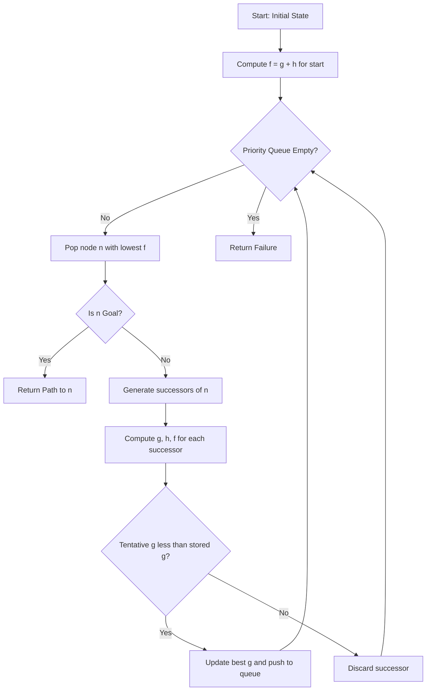
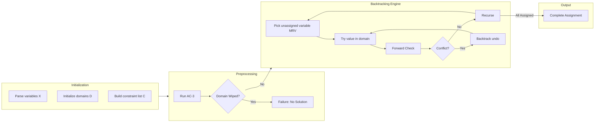
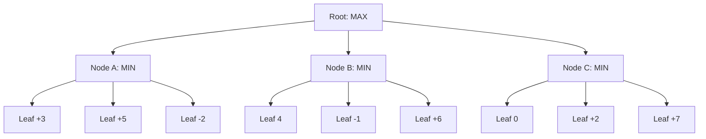
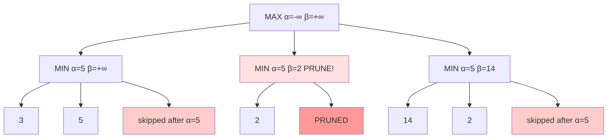
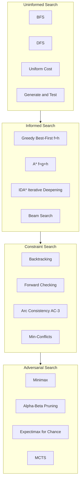

# Generate and test, Greedy best first search, A* algorithm, Constraint satisfaction problems, Adversarial search - Games, Optimal Decision in games, The minimax algorithm, Alpha–beta pruning.

<!-- SECTION_1_START -->

# KTU 2024 Scheme — B.Tech Artificial Intelligence (PECST522)

## Module 2: Searching — Core Definitions & Intuitive Overview

> [!IMPORTANT]
> **Module 2 Core Theme:** This module transitions AI from uninformed/brute-force search into *informed*, *constraint-based*, and *adversarial* reasoning. Every algorithm here is foundational to real-world systems: GPS navigation, puzzle solvers, and game-playing engines (chess, Go, tic-tac-toe).

---

### 2.1 Generate and Test Algorithm

**Formal Definition (KTU Syllabus):**
Generate and Test is a simple problem-solving paradigm in which a **candidate solution generator** systematically enumerates potential solutions from the solution space, and a **test function** evaluates each candidate against the goal criteria. The algorithm terminates when a candidate passes all tests, otherwise it continues generation.

**Mathematical Model:**

Let $S$ be the set of all candidate solutions. The algorithm performs:

$$
\text{Find } s \in S \text{ such that } \text{Test}(s) = \text{True}
$$

**Conceptual Analogy:**
Imagine you lost your house keys. You rummage through every pocket and every drawer (generate), then check whether what you picked is a key (test). You don't use logic to guide the search — you just try *everything systematically*.

> [!NOTE]
> **KTU Highlight:** Generate and Test is classified under **uninformed search** in Module 2 because it uses no heuristic guidance. It is the conceptual ancestor of brute-force backtracking used in CSP solvers.

---

### 2.2 Greedy Best-First Search (GBFS)

**Formal Definition:**
Greedy Best-First Search is an informed search algorithm that expands, at each step, the node that appears closest to the goal as estimated by the **heuristic function** $h(n)$ alone, ignoring the cost already incurred to reach that node.

**Evaluation function:**

$$
f(n) = h(n)
$$

**Conceptual Analogy:**
Think of a hiker in fog who *always* walks toward the visible peak (lowest $h$ value), even if a side path is actually shorter. The hiker is "greedy" — locally optimal choices may not be globally optimal.

> [!IMPORTANT]
> **Greedy ≠ Optimal!** GBFS is *not guaranteed* to find the shortest path. Consider Romania routing: GBFS may pick a road that goes straight toward Bucharest in straight-line distance but hits a mountain detour.

---

### 2.3 A* Search Algorithm

**Formal Definition:**
A* is an informed, best-first search algorithm that combines the actual cost from the start $g(n)$ and the estimated cost to the goal $h(n)$ using the evaluation function:

$$
f(n) = g(n) + h(n)
$$

A* is **optimal** (finds the least-cost path) and **complete** (finds a solution if one exists) provided $h(n)$ is **admissible** — it never overestimates the true cost to the goal.

**Conceptual Analogy:**
If GBFS is a foggy hiker walking toward the peak, A* is a hiker with both a compass ($g(n)$, the distance already walked) and a peak-finder ($h(n)$). The hiker balances *"how far I've come"* with *"how far is left"* — the sum is total estimated effort.

> [!NOTE]
> **Heuristic Properties Critical for KTU:**
> - **Admissible:** $h(n) \leq h^*(n)$ where $h^*$ is true cost to goal.
> - **Consistent (Monotone):** $h(n) \leq c(n, n') + h(n')$, where $c(n, n')$ is step cost. Consistency implies admissibility.
> - **Dominance:** If $h_1(n) \geq h_2(n)$ for all $n$ (and both admissible), then $h_1$ **dominates** $h_2$ and expands fewer nodes.

---

### 2.4 Constraint Satisfaction Problems (CSP)

**Formal Definition:**
A Constraint Satisfaction Problem is defined by a triple $(X, D, C)$:
- $X = \{X_1, X_2, \ldots, X_n\}$ — a set of **variables**.
- $D = \{D_1, D_2, \ldots, D_n\}$ — a set of **domains** (each $D_i$ is the set of allowable values for $X_i$).
- $C = \{C_1, C_2, \ldots, C_m\}$ — a set of **constraints** specifying allowable combinations of values.

A **solution** is an assignment of values to all variables satisfying every constraint.

**Conceptual Analogy:**
Sudoku! You have a 9×9 grid (variables = cells), digits 1–9 (domain per cell), and rules (constraints: no repeats in row, column, or box). You assign values such that all rules hold.

> [!IMPORTANT]
> **CSP Varieties (KTU Focus):**
> - **Discrete vs Continuous domains** (e.g., scheduling vs. real-time control).
> - **Unary, Binary, Higher-order constraints.**
> - **Backtracking Search** with **Forward Checking** and **Arc Consistency (AC-3)** as inference.

---

### 2.5 Adversarial Search — Games

**Formal Definition:**
Adversarial search models multi-agent competitive scenarios — typically **two-player, zero-sum, perfect-information** games — where one agent's gain is the other's loss. The state space is a **game tree** where nodes are positions and edges are legal moves.

**Standard Game Classification:**

| Property | Definition | Example |
|----------|------------|---------|
| Deterministic | No chance elements | Chess, Tic-tac-toe |
| Perfect Information | Both players see full state | Chess, Go |
| Zero-Sum | $\text{Utility}_A + \text{Utility}_B = 0$ | Most board games |
| Imperfect Information | Hidden state | Card games (poker) |

**Conceptual Analogy:**
Two generals on a chessboard. Each move you make hurts the opponent — every gain for you is a loss for them. You must think *two steps ahead* because your opponent is actively trying to defeat you.

---

### 2.6 Optimal Decisions in Games

**Formal Definition:**
The **optimal decision** in a game is the move that maximizes the agent's expected utility *assuming the opponent plays optimally to minimize it*. This is computed via the **minimax value** of the game tree:

$$
\text{Minimax}(s) =
\begin{cases}
\text{Utility}(s) & \text{if } s \text{ is terminal} \\
\max_{a \in \text{Actions}(s)} \text{Minimax}(\text{Result}(s, a)) & \text{if } \text{Player}(s) = \text{MAX} \\
\min_{a \in \text{Actions}(s)} \text{Minimax}(\text{Result}(s, a)) & \text{if } \text{Player}(s) = \text{MIN}
\end{cases}
$$

**Conceptual Analogy:**
A chess player asks: *"What's the worst that can happen if I make this move?"* Then they pick the move whose worst-case is best. Pessimistic? Yes — but optimal in adversarial settings.

---

### 2.7 Minimax Algorithm

**Formal Definition:**
The **Minimax algorithm** computes the minimax value of a game tree by recursively alternating between a **MAX** layer (the AI tries to maximize) and a **MIN** layer (the opponent tries to minimize). At terminal states, utility is given by a static evaluation.

**Time and Space Complexity (KTU High-Yield):**

$$
T(n) = O(b^m) \quad ; \quad S(n) = O(bm)
$$

where $b$ = branching factor, $m$ = maximum depth.

**Conceptual Analogy:**
Picture a decision tree. At the bottom, score each leaf. Bubble up — at odd levels, the opponent picks the *lowest* score from children; at even levels, you pick the *highest*. The score at the root is your guaranteed payoff.

> [!NOTE]
> **Optimality Caveat:** Minimax is optimal *only* if the opponent also plays optimally. Against a random or weak opponent, suboptimal but surprising moves may win.

---

### 2.8 Alpha–Beta Pruning

**Formal Definition:**
Alpha–beta pruning is an **optimization of minimax** that eliminates tree branches that cannot possibly influence the final decision. It tracks two parameters during search:
- $\alpha$ = the value of the **best (highest)** choice found so far for **MAX** along the path.
- $\beta$ = the value of the **best (lowest)** choice found so far for **MIN** along the path.

**Pruning Condition:**

$$
\alpha \geq \beta \quad \Longrightarrow \quad \text{Prune remaining siblings at this node.}
$$

**Conceptual Analogy:**
Imagine negotiating a salary. As soon as you realize the employer will never go above ₹10 LPA and you've already found a better offer of ₹15 LPA, you stop the negotiation — *prune*. You don't need to hear every counteroffer.

> [!VISUALIZATION CONTROL]
> **Concept:** A* Evaluation Function Trade-off
> **GeoGebra / Desmos Input Equations:**
> * $g(x) = 0.5 \cdot x$ (cost-so-far, linear)
> * $h(x) = 10 - 0.8 \cdot x$ (heuristic, decreasing)
> * $f(x) = g(x) + h(x)$
> **Visual Description:** Plot $g(x)$, $h(x)$, and $f(x)$ on the same axes. Observe that as $x$ increases (closer to goal), $h(x)$ decreases and $f(x)$ is dominated by the $g(x)$ term near the goal. The minimum of $f(x)$ represents the "sweet spot" where neither distance walked nor distance remaining dominates.

---

<!-- SECTION_1_END -->

<!-- SECTION_2_START -->

## Deep Theoretical Analysis & KTU High-Yield Formula Sheet

### 2.1 Generate and Test — Operational Logic

**Stepwise Procedure:**
1. **Generate** a candidate solution $s$ from the solution space.
2. **Test** whether $s$ satisfies all goal conditions.
3. If $s$ passes, **return $s$** as the solution; otherwise, **goto step 1**.
4. Terminate after exhausting all candidates (failure).

**Variants:**
- **Generate-and-Test (plain):** Generates *one* candidate, tests, then generates the next.
- **Generate-and-Test with Feedback:** Uses failed tests to *constrain* the next generation (closer to backtracking).

> [!IMPORTANT]
> **KTU Pitfall:** Generate and Test differs from brute-force search only in the *generation strategy*. If generation is systematic and exhaustive, it degenerates to brute force.

---

### 2.2 Greedy Best-First Search — Mechanics

**Algorithm Steps:**
1. Start at the initial state. Insert it into the priority queue with priority $h(n)$.
2. Pop the node with the **lowest $h(n)$** from the queue.
3. If it is the goal, return it.
4. Else, expand its successors, compute $h$ for each, and push them.
5. Repeat until goal is found or queue is empty.

**Data Structure:** Priority queue (min-heap on $h$).

**Complexity:**

$$
T = O(b^m) \quad ; \quad S = O(b^m)
$$

> [!WARNING]
> **GBFS is NOT complete in infinite spaces and NOT optimal in general.** KTU often tests whether students confuse GBFS with A* — remember: GBFS uses **only $h$**, A* uses **$g + h$**.

---

### 2.3 A* Search — Theoretical Foundations

**The A* Evaluation Function:**

$$
f(n) = g(n) + h(n)
$$

where:
- $g(n)$ = actual cost from start to $n$.
- $h(n)$ = heuristic estimate from $n$ to goal.
- $f(n)$ = estimated total cost of the cheapest path through $n$.

**Optimality Theorem:**
If $h$ is **admissible**, A* tree search is optimal. If $h$ is **consistent**, A* graph search is optimal (no node needs re-expansion).

**Proof Sketch of Admissibility (KTU expects this in ESE):**
By induction on path cost. Base case: $f(\text{start}) = g(\text{start}) + h(\text{start}) = 0 + h(\text{start}) \leq h^*(\text{start}) = C^*$. Inductive step: every node $n$ popped has $f(n) \leq C^*$, so optimal goal is popped before any suboptimal goal. ∎

**Heuristic Design Rules:**
- **Relaxation:** Create a relaxed problem (e.g., remove a constraint) and use its exact solution cost as $h$.
- **Pre-computed pattern databases:** Store exact costs for subgoals.
- **Landmarks:** Use subgoals whose cost is known to bound the true cost.

> [!NOTE]
> **Dominance:** If $h_2$ dominates $h_1$ (i.e., $h_2(n) \geq h_1(n)$ for all $n$, both admissible), then $A^*$ using $h_2$ expands **no more nodes** than $A^*$ using $h_1$.

**Effective Branching Factor:**

$$
N = b^* + (b^*)^2 + (b^*)^3 + \cdots + (b^*)^d
$$

where $N$ = total nodes expanded, $d$ = depth of solution. Solve for $b^*$ — lower $b^*$ = better heuristic.

---

### 2.4 CSP — Deep Mechanics

**Constraint Graph:** Nodes are variables, edges connect variables sharing a binary constraint.

**Solving Strategies:**

| Algorithm | Idea | Complexity |
|-----------|------|------------|
| Backtracking | Assign variables one by one, backtrack on failure | $O(d^n)$ worst |
| Forward Checking | Maintain pruned domains for unassigned variables | Lower constant |
| Arc Consistency (AC-3) | Remove values from domains inconsistent with neighbors | $O(cd^3)$ |
| Min-Conflicts | Hill-climbing on CSP (local search) | Heuristic |

**AC-3 Algorithm:**

```
function AC-3(csp):
    queue = all arcs in csp
    while queue not empty:
        (Xi, Xj) = queue.pop()
        if Revise(csp, Xi, Xj):
            if domain[Xi] is empty: return False
            for Xk in neighbors[Xi] \ {Xj}:
                queue.add((Xk, Xi))
    return True
```

**Revise(Xi, Xj):** Remove values from $D_i$ for which no value in $D_j$ satisfies the binary constraint.

> [!IMPORTANT]
> **KTU Note:** AC-3 is a *node* consistency check, not sufficient for full consistency. You may need AC-3 iteratively until no domain changes.

---

### 2.5 Minimax — Operational Logic

**Recursive Formulation:**

$$
\text{Minimax}(s, d) =
\begin{cases}
\text{Eval}(s) & \text{if } d = 0 \text{ or terminal} \\
\max_{a} \text{Minimax}(\text{Result}(s, a), d-1) & \text{if MAX node} \\
\min_{a} \text{Minimax}(\text{Result}(s, a), d-1) & \text{if MIN node}
\end{cases}
$$

**Static Evaluation Function:** Used at non-terminal leaves. Domain-specific. For chess, it might sum piece values: pawn = 1, knight = 3, bishop = 3, rook = 5, queen = 9.

---

### 2.6 Alpha–Beta Pruning — Operational Logic

**Algorithm Pseudocode:**

```
function AlphaBeta(node, depth, α, β, maximizingPlayer):
    if depth == 0 or terminal(node):
        return evaluation(node)
    if maximizingPlayer:
        value = -∞
        for child in node.children:
            value = max(value, AlphaBeta(child, depth-1, α, β, False))
            α = max(α, value)
            if α >= β: break   // β cutoff
        return value
    else:
        value = +∞
        for child in node.children:
            value = min(value, AlphaBeta(child, depth-1, α, β, True))
            β = min(β, value)
            if β <= α: break   // α cutoff
        return value
```

**Complexity Improvements:**

| Ordering | Effective Branching Factor | Effective Depth |
|----------|----------------------------|-----------------|
| Worst (no ordering) | $b$ | $m$ |
| Random | $\sqrt{b}$ | $m$ |
| Perfect (best first) | $\sqrt{b}$ | $2m$ |

**Best Case Complexity:**

$$
T = O(b^{m/2}) \quad ; \quad S = O(bm)
$$

The best case can search **twice as deep** as plain minimax in the same time.

---

### KTU High-Yield Formula Sheet

| Algorithm | Evaluation / Key Formula | Complexity | Optimality Condition |
|-----------|--------------------------|------------|----------------------|
| Generate and Test | $\exists s \in S : \text{Test}(s) = \text{True}$ | $O(\vert S \vert)$ | Exhaustive search |
| Greedy Best-First | $f(n) = h(n)$ | $O(b^m)$ | Not optimal in general |
| A* | $f(n) = g(n) + h(n)$ | $O(b^d)$ worst | $h$ admissible (tree), consistent (graph) |
| Admissibility | $h(n) \leq h^*(n)$ | — | Defines optimal A* |
| Consistency | $h(n) \leq c(n,a,n') + h(n')$ | — | No re-expansion in graph search |
| CSP Backtracking | $O(d^n)$ worst | — | Heuristics improve |
| Arc Consistency (AC-3) | $O(cd^3)$ | — | Detects unsolvability |
| Minimax | Recursive max/min | $O(b^m)$ | Optimal vs optimal opponent |
| Alpha-Beta | Prune when $\alpha \geq \beta$ | $O(b^{m/2})$ best | Returns same value as Minimax |

> [!IMPORTANT]
> **Real-World Use Cases:**
> - **A\*:** Google Maps, video-game pathfinding (Unity NavMesh), robotics motion planning.
> - **CSP:** Scheduling (employee rosters), Sudoku solvers, configuration management.
> - **Minimax/Alpha-Beta:** Chess engines (Stockfish, Stockfish NNUE), game AI, decision-support systems.

---

<!-- SECTION_2_END -->

<!-- SECTION_3_START -->

## Step-by-Step Derivations & Code/Symbolic Implementation

### 3.1 Worked Example — A* Search on Romania Map

**Problem (KTU Standard):** Find shortest path from **Arad** to **Bucharest** using A* with straight-line distance heuristic.

**Given Data (Heuristic Values $h$ in km):**

| City | $h$(to Bucharest) | City | $h$(to Bucharest) |
|------|-------------------|------|-------------------|
| Arad | 366 | Pitesti | 100 |
| Bucharest | 0 | Rimnicu Vilcea | 193 |
| Craiova | 160 | Sibiu | 253 |
| Dobreta | 242 | Timisoara | 329 |
| Fagaras | 176 | Zerind | 374 |
| Lugoj | 244 | — | — |

**Road Distances (g costs in km):**

| From–To | Distance |
|---------|----------|
| Arad–Sibiu | 140 |
| Arad–Timisoara | 118 |
| Arad–Zerind | 75 |
| Sibiu–Fagaras | 99 |
| Sibiu–Rimnicu Vilcea | 80 |
| Rimnicu Vilcea–Pitesti | 97 |
| Rimnicu Vilcea–Craiova | 146 |
| Pitesti–Bucharest | 101 |
| Fagaras–Bucharest | 211 |
| ... | ... |

**A* Trace (expanding node with lowest $f$):**

| Step | Node Popped | $g$ | $h$ | $f = g+h$ | Frontier after |
|------|-------------|-----|-----|-----------|----------------|
| 1 | Arad (start) | 0 | 366 | **366** | Sibiu(393), Timisoara(447), Zerind(449) |
| 2 | Sibiu | 140 | 253 | **393** | Rimnicu Vilcea(413), Fagaras(415), Timisoara(447), Zerind(449) |
| 3 | Rimnicu Vilcea | 220 | 193 | **413** | Pitesti(417), Fagaras(415), Craiova(526), Timisoara(447), Zerind(449) |
| 4 | Fagaras | 239 | 176 | **415** | Pitesti(417), Bucharest(450), Craiova(526), ... |
| 5 | Pitesti | 317 | 100 | **417** | Bucharest(418), Craiova(526), ... |
| 6 | **Bucharest (GOAL)** | 418 | 0 | **418** | — |

**Final Optimal Path:** Arad → Sibiu → Rimnicu Vilcea → Pitesti → Bucharest, total cost = **$g(\text{Bucharest}) = 418$ km**.

**Detailed $f$-value computation for successors of Pitesti:**

$$
f(\text{Bucharest via Pitesti}) = g(\text{Pitesti}) + c(\text{Pitesti, Bucharest}) + h(\text{Bucharest})
$$

$$
f = 317 + 101 + 0 = 418
$$

$$
f(\text{Bucharest via Fagaras}) = 239 + 211 + 0 = 450
$$

Since 418 < 450, the path through Pitesti dominates → A* correctly picks Pitesti.

---

### 3.2 Worked Example — CSP: Map Coloring

**Problem:** Color the map of Australia with 3 colors {Red, Green, Blue} such that no two adjacent regions share a color.

**Variables:** $X = \{WA, NT, SA, Q, NSW, V, T\}$
**Domains:** $D_i = \{R, G, B\}$ for all $i$
**Constraints (binary):**
- $WA \neq NT$, $WA \neq SA$
- $NT \neq SA$, $NT \neq Q$
- $SA \neq Q$, $SA \neq NSW$, $SA \neq V$
- $Q \neq NSW$
- $NSW \neq V$

**Backtracking Search Trace (with most-constrained-variable heuristic):**

| Step | Variable Assigned | Value | Domains Pruned | Failure? |
|------|-------------------|-------|----------------|----------|
| 1 | SA (most constrained) | R | WA→{G,B}, NT→{G,B}, Q→{G,B}, NSW→{G,B}, V→{G,B} | No |
| 2 | Q | G | (no change) | No |
| 3 | NSW | B | V→{G} (V cannot be B) | No |
| 4 | V | G | — | No |
| 5 | WA | G | NT→{B} (NT cannot be G) | No |
| 6 | NT | B | — | No |
| 7 | T (Tasmania, unconstrained) | R | — | No — **SOLUTION FOUND** |

**Final Assignment:** $SA=R, Q=G, NSW=B, V=G, WA=G, NT=B, T=R$. All constraints satisfied. ✓

---

### 3.3 Worked Example — Minimax on Tic-Tac-Toe Subtree

**Game Tree (X is MAX, O is MIN, terminal leaves scored +1/-1/0):**

```
                  MAX (X to move)
                 /       |       \
              X(1)     X(2)      X(3)
              / \      / \       / \
           O(1) O(2) O(3) O(4)  O(5) O(6)
            |    |    |    |     |    |
           +1   -1   -1   +1    0    +1
```

**Minimax Calculation (bottom-up):**

- Node $O(1)$: $\min(+1) = +1$
- Node $O(2)$: $\min(-1) = -1$
- Node $X(1)$: $\max(+1, -1) = +1$
- Node $O(3)$: $\min(-1) = -1$
- Node $O(4)$: $\min(+1) = +1$
- Node $X(2)$: $\max(-1, +1) = +1$
- Node $O(5)$: $\min(0) = 0$
- Node $O(6)$: $\min(+1) = +1$
- Node $X(3)$: $\max(0, +1) = +1$
- **Root (MAX):** $\max(+1, +1, +1) = +1$ — X can force a win.

---

### 3.4 Worked Example — Alpha-Beta Pruning

**Game Tree (left-to-right evaluation, +∞/–∞ initialization):**

```
                    MAX  α=-∞, β=+∞
                   /    |     \
                 A      B       C
              α=-∞   α=-∞   α=-∞
               / \    / \    / \
              3   5  2   ?  ?   ?
```

**Trace:**

| Node | Type | α (passed) | β (passed) | Value | Pruned? |
|------|------|------------|------------|-------|---------|
| MAX(root) | MAX | -∞ | +∞ | — | — |
| A (MAX) | MAX | -∞ | +∞ | — | — |
| → 3 | LEAF | — | — | 3 | — |
| → 5 | LEAF | — | — | 5 | — |
| A returns | — | -∞ | +∞ | 5 | — |
| MAX(root): α = max(-∞, 5) = **5** | — | 5 | +∞ | — | — |
| B (MIN) | MIN | 5 | +∞ | — | — |
| → 2 | LEAF | — | — | 2 | — |
| B: β = min(+∞, 2) = **2** | — | 5 | 2 | — | — |
| **PRUNE!** α (5) ≥ β (2) | — | — | — | — | **YES** |
| C (MIN) | MIN | 5 | +∞ | — | — |
| → 14 (assume) | LEAF | — | — | 14 | — |
| C: β = min(+∞, 14) = **14** | — | 5 | 14 | — | — |
| α < β → continue | — | — | — | — | No prune |
| → 2 (assume) | LEAF | — | — | 2 | — |
| C returns 2 | — | 5 | 14 | 2 | — |
| MAX(root): value = max(5, 2) = **5** | — | — | — | 5 | — |

**Result:** Same as Minimax (= 5) but explored **fewer nodes** — entire subtree under B is pruned.

---

### 3.5 Python Implementation — A* Search

```python
from __future__ import annotations
import heapq
from typing import Callable, Dict, List, Optional, Tuple

# Type aliases for clarity
Node = str
HeuristicFn = Callable[[Node], float]
NeighborFn = Callable[[Node], List[Tuple[Node, float]]]


def a_star(
    start: Node,
    goal: Node,
    h: HeuristicFn,
    neighbors: NeighborFn,
) -> Optional[Tuple[List[Node], float]]:
    """
    A* search returning the optimal path and its cost.

    Parameters
    ----------
    start : Node
        The starting node identifier.
    goal : Node
        The target node identifier.
    h : HeuristicFn
        Admissible heuristic function h(n).
    neighbors : NeighborFn
        Function returning a list of (neighbor, step_cost) tuples.

    Returns
    -------
    Optional[Tuple[List[Node], float]]
        (path, total_cost) or None if no path exists.
    """
    # Each heap entry: (f_score, tie_breaker, node, g_score, path)
    open_heap: List[Tuple[float, int, Node, float, List[Node]]] = []
    counter = 0  # tie-breaker for stable ordering
    heapq.heappush(
        open_heap, (h(start), counter, start, 0.0, [start])
    )

    # Best g seen for each visited node
    best_g: Dict[Node, float] = {start: 0.0}

    while open_heap:
        f_curr, _, current, g_curr, path = heapq.heappop(open_heap)

        # Goal test (on expansion for optimality)
        if current == goal:
            return path, g_curr

        # Skip stale entries (lazy deletion)
        if g_curr > best_g.get(current, float("inf")):
            continue

        for nbr, step_cost in neighbors(current):
            tentative_g = g_curr + step_cost
            if tentative_g < best_g.get(nbr, float("inf")):
                best_g[nbr] = tentative_g
                f_nbr = tentative_g + h(nbr)
                counter += 1
                heapq.heappush(
                    open_heap,
                    (f_nbr, counter, nbr, tentative_g, path + [nbr]),
                )

    return None  # No path found


# --- Example driver: Romania road map subset ---
if __name__ == "__main__":
    # Heuristic: straight-line distance to Bucharest
    h_sld: HeuristicFn = lambda city: {
        "Arad": 366, "Sibiu": 253, "Rimnicu Vilcea": 193,
        "Pitesti": 100, "Bucharest": 0, "Fagaras": 176,
        "Timisoara": 329, "Zerind": 374, "Craiova": 160,
    }[city]

    # Adjacency list (undirected) with road distances
    roads: Dict[Node, List[Tuple[Node, float]]] = {
        "Arad":         [("Sibiu", 140), ("Timisoara", 118), ("Zerind", 75)],
        "Sibiu":        [("Arad", 140), ("Fagaras", 99), ("Rimnicu Vilcea", 80)],
        "Rimnicu Vilcea":[("Sibiu", 80), ("Pitesti", 97), ("Craiova", 146)],
        "Pitesti":      [("Rimnicu Vilcea", 97), ("Bucharest", 101)],
        "Fagaras":      [("Sibiu", 99), ("Bucharest", 211)],
        "Bucharest":    [("Pitesti", 101), ("Fagaras", 211)],
        "Craiova":      [("Rimnicu Vilcea", 146)],
        "Timisoara":    [("Arad", 118)],
        "Zerind":       [("Arad", 75)],
    }

    def get_neighbors(node: Node) -> List[Tuple[Node, float]]:
        return roads.get(node, [])

    result = a_star("Arad", "Bucharest", h_sld, get_neighbors)
    if result:
        path, cost = result
        print(f"Optimal path: {' -> '.join(path)}")
        print(f"Total cost  : {cost} km")
    else:
        print("No path exists.")
```

**Expected Output:**

```
Optimal path: Arad -> Sibiu -> Rimnicu Vilcea -> Pitesti -> Bucharest
Total cost  : 418.0 km
```

---

### 3.6 Python Implementation — Minimax with Alpha-Beta Pruning

```python
from __future__ import annotations
import math
from typing import Callable, Dict, List, Optional, Tuple

# Type aliases
GameState = Dict[str, object]
UtilityFn = Callable[[GameState], float]
SuccessorFn = Callable[[GameState], List[Tuple[str, GameState]]]
TerminalFn = Callable[[GameState], bool]


def minimax(
    state: GameState,
    successors: SuccessorFn,
    terminal: TerminalFn,
    utility: UtilityFn,
    maximizing: bool,
) -> float:
    """Pure minimax (no pruning) — KTUs baseline reference."""
    if terminal(state):
        return utility(state)

    if maximizing:
        best = -math.inf
        for _, child in successors(state):
            best = max(best, minimax(child, successors, terminal, utility, False))
        return best
    else:
        best = math.inf
        for _, child in successors(state):
            best = min(best, minimax(child, successors, terminal, utility, True))
        return best


def alpha_beta(
    state: GameState,
    successors: SuccessorFn,
    terminal: TerminalFn,
    utility: UtilityFn,
    alpha: float = -math.inf,
    beta: float = math.inf,
    maximizing: bool = True,
) -> Tuple[float, Optional[str]]:
    """
    Alpha-beta pruning minimax.

    Returns (value, best_action) tuple.
    """
    if terminal(state):
        return utility(state), None

    best_action: Optional[str] = None

    if maximizing:
        value = -math.inf
        for action, child in successors(state):
            child_val, _ = alpha_beta(
                child, successors, terminal, utility, alpha, beta, False
            )
            if child_val > value:
                value = child_val
                best_action = action
            alpha = max(alpha, value)
            if alpha >= beta:
                break  # beta cutoff
        return value, best_action
    else:
        value = math.inf
        for action, child in successors(state):
            child_val, _ = alpha_beta(
                child, successors, terminal, utility, alpha, beta, True
            )
            if child_val < value:
                value = child_val
                best_action = action
            beta = min(beta, value)
            if beta <= alpha:
                break  # alpha cutoff
        return value, best_action


# --- Example driver: Simple 2-ply game tree ---
if __name__ == "__main__":
    # Leaf utilities at depth 2
    leaves = {"L1": 3, "L2": 5, "L3": 2, "L4": 8, "L5": 1, "L6": 4}

    # Build a tree: root -> [N1, N2] -> [leaves]
    tree: GameState = {
        "name": "root",
        "children": [
            {"name": "N1", "children": [
                {"name": "L1", "children": []},
                {"name": "L2", "children": []},
            ]},
            {"name": "N2", "children": [
                {"name": "L3", "children": []},
                {"name": "L4", "children": []},
            ]},
        ],
    }

    def succ(s: GameState) -> List[Tuple[str, GameState]]:
        return [(c["name"], c) for c in s["children"]]

    def term(s: GameState) -> bool:
        return len(s["children"]) == 0

    def util(s: GameState) -> float:
        return float(leaves.get(s["name"], 0))

    val, action = alpha_beta(tree, succ, term, util)
    print(f"Best value      : {val}")
    print(f"Best first move : {action}")
```

---

### 3.7 Python Implementation — CSP with Backtracking + AC-3

```python
from __future__ import annotations
from collections import deque
from copy import deepcopy
from typing import Callable, Dict, List, Set, Tuple

Variable = str
Domain = Set[str]
Assignment = Dict[Variable, str]
Constraint = Callable[[Variable, str, Variable, str], bool]


def revise(
    domains: Dict[Variable, Domain],
    xi: Variable,
    xj: Variable,
    constraints: List[Tuple[Variable, Variable, Constraint]],
) -> bool:
    """Remove values from D[xi] with no consistent value in D[xj]."""
    revised_flag = False
    to_remove: List[str] = []
    for x in list(domains[xi]):
        # Does any y in D[xj] satisfy the constraint?
        sat = any(
            con(xi, x, xj, y)
            for y in domains[xj]
            for (a, b, con) in constraints
            if {a, b} == {xi, xj}
        )
        if not sat:
            to_remove.append(x)
            revised_flag = True
    for v in to_remove:
        domains[xi].discard(v)
    return revised_flag


def ac3(
    domains: Dict[Variable, Domain],
    constraints: List[Tuple[Variable, Variable, Constraint]],
) -> bool:
    """AC-3 algorithm — returns False if a domain is wiped out."""
    queue: deque = deque([(xi, xj) for (xi, xj, _) in constraints])
    while queue:
        xi, xj = queue.popleft()
        if revise(domains, xi, xj, constraints):
            if not domains[xi]:
                return False
            for xk in {a for (a, _, _) in constraints if a == xi} - {xj}:
                queue.append((xk, xi))
    return True


def backtrack(
    assignment: Assignment,
    domains: Dict[Variable, Domain],
    constraints: List[Tuple[Variable, Variable, Constraint]],
    variables: List[Variable],
) -> Optional[Assignment]:
    """Backtracking search with forward checking."""
    if len(assignment) == len(variables):
        return assignment

    # MRV heuristic
    unassigned = [v for v in variables if v not in assignment]
    var = min(unassigned, key=lambda v: len(domains[v]))

    for value in sorted(domains[var]):
        assignment[var] = value
        # Forward check
        saved = deepcopy(domains)
        ok = True
        for v in unassigned:
            if v == var:
                continue
            # Remove v-values that conflict with this assignment
            new_dom = {
                val for val in domains[v]
                if all(
                    con(var, value, v, val) if a == var and b == v
                    else con(v, val, var, value)
                    for (a, b, con) in constraints
                    if {a, b} == {var, v}
                )
            }
            domains[v] = new_dom
            if not new_dom:
                ok = False
                break
        if ok:
            result = backtrack(assignment, domains, constraints, variables)
            if result is not None:
                return result
        domains = saved
        del assignment[var]

    return None


# --- Australia map coloring example ---
if __name__ == "__main__":
    variables = ["WA", "NT", "SA", "Q", "NSW", "V", "T"]
    domains = {v: {"R", "G", "B"} for v in variables}

    # Inequality constraint factory
    def neq(a: Variable, x: str, b: Variable, y: str) -> bool:
        return x != y

    edges = [
        ("WA", "NT"), ("WA", "SA"),
        ("NT", "SA"), ("NT", "Q"),
        ("SA", "Q"), ("SA", "NSW"), ("SA", "V"),
        ("Q", "NSW"), ("NSW", "V"),
    ]
    constraints = [(a, b, neq) for (a, b) in edges]

    ac3(domains, constraints)
    solution = backtrack({}, domains, constraints, variables)
    print("CSP Solution:", solution)
```

---

<!-- SECTION_3_END -->

<!-- SECTION_4_START -->

## Structural Diagrams & Schematics

### 4.1 A* Search Node Expansion Flow



### 4.2 CSP Solving Pipeline (Backtracking + AC-3 + Forward Checking)



### 4.3 Game Tree — Minimax Recursion Stack



**Computed Minimax values (post-order):**

| Node | Type | Min/Max of children | Value |
|------|------|---------------------|-------|
| A | MIN | min(3, 5, -2) | -2 |
| B | MIN | min(4, -1, 6) | -1 |
| C | MIN | min(0, 2, 7) | 0 |
| Root | MAX | max(-2, -1, 0) | **0** |

### 4.4 Alpha-Beta Pruning — Sequential Cutoff Trace



### 4.5 Search Strategy Comparison Block Diagram



---

<!-- SECTION_4_END -->

<!-- SECTION_5_START -->

## KTU 2024 Scheme Examination Question Bank & Topic Recap

---

### Part A — Short Answer Questions (3 Marks Each)

#### **Question 1** [KTU University Exam — July 2024]

> Define the terms: **admissible heuristic** and **consistent heuristic** in the context of A* search. Show with an example why an inconsistent heuristic can cause A* to re-expand nodes.

**Model Answer (3 Marks):**

**Admissible Heuristic [1 Mark]:** A heuristic $h(n)$ is admissible if it never overestimates the true cost to reach the goal from $n$, i.e.,

$$
h(n) \leq h^*(n) \quad \forall n
$$

where $h^*(n)$ is the true minimum cost from $n$ to the goal.

**Consistent (Monotone) Heuristic [1 Mark]:** A heuristic $h$ is consistent if for every node $n$ and every successor $n'$ reached by action $a$ with cost $c(n, a, n')$:

$$
h(n) \leq c(n, a, n') + h(n')
$$

This is essentially a triangle-inequality property along edges.

**Why Inconsistency Causes Re-expansion [1 Mark]:** If $h$ is not consistent, then $f(n) = g(n) + h(n)$ may *decrease* when a node is reached via a better path *after* it was first inserted into the open list. The earlier (stale) entry must then be detected and replaced, requiring the node to be expanded twice — losing the efficiency of graph-search A*.

**Example:** Consider a graph with edges $A \to B$ (cost 5) and $A \to C \to B$ (costs 1, 1). Suppose $h(B) = 10$ (overestimate of 2 from A's perspective if true cost is 8). First expansion: $f(B) = 5 + 10 = 15$. Later path: $f(B) = 2 + 10 = 12$. The first entry is stale; B must be re-expanded.

---

#### **Question 2** [KTU University Exam — Dec 2023]

> What is **alpha–beta pruning**? State the two values that it tracks and explain in one line when pruning occurs.

**Model Answer (3 Marks):**

**Definition [1 Mark]:** Alpha–beta pruning is an optimization of the minimax algorithm that skips evaluating subtrees which cannot influence the final decision, returning the same game value as full minimax.

**Two Tracked Values [1 Mark]:**
- $\alpha$ — the value of the best (highest-utility) choice found so far on the path for the **MAX** player.
- $\beta$ — the value of the best (lowest-utility) choice found so far on the path for the **MIN** player.

**Pruning Condition [1 Mark]:** Pruning occurs when $\alpha \geq \beta$, because the current player already has a better option elsewhere in the tree.

---

### Part B — Long Answer Questions (14 Marks Each, Internal Choice)

> [!IMPORTANT]
> Per KTU 2024 ESE pattern: each Part B question carries 14 marks split into two 7-mark sub-questions. Choices are at the *question* level (not sub-question level).

---

#### **Question A** [KTU University Exam — July 2024, Module 2]

**A (a)** Explain the **A\* search algorithm** with its evaluation function. State the conditions for optimality and completeness of A\*. [7 Marks]

**Model Answer:**

A* is a best-first informed search that uses the evaluation function:

$$
f(n) = g(n) + h(n)
$$

where $g(n)$ is the cost of the cheapest known path from start to $n$, and $h(n)$ is the heuristic estimate of the cost from $n$ to the goal. At every step, A* expands the node with the **lowest $f$ value** on the open list (priority queue). **[1 Mark: definition + 1 Mark: evaluation function, 2 Marks]**

**Algorithm Steps [2 Marks]:**
1. Initialize OPEN = {start}, CLOSED = ∅.
2. Pop node $n$ with lowest $f(n)$ from OPEN.
3. If $n$ is goal, return path and $g(n)$.
4. Move $n$ to CLOSED.
5. For each successor $n'$ of $n$: compute $g(n')$, $h(n')$, $f(n') = g(n') + h(n')$. If $n'$ not in OPEN/CLOSED, add it. If a better $g$ is found for an existing $n'$, update.
6. Goto 2.

**Conditions for Optimality and Completeness [3 Marks]:**
- **Completeness:** A* is complete in any finite graph (or infinite graph with branch factor $b$ and finite step costs), provided a solution exists. [1 Mark]
- **Optimality (Tree Search):** A* finds the optimal solution if $h$ is **admissible** (never overestimates). The proof relies on the fact that every popped goal node $n$ satisfies $f(n) = g(n) \leq C^*$ where $C^*$ is the optimal cost. [1 Mark]
- **Optimality (Graph Search):** A* graph search is optimal iff $h$ is **consistent** (monotone), which guarantees $f$ values are non-decreasing along any path. If $h$ is not consistent, a node may need re-expansion. [1 Mark]

**A (b)** Apply A* to find the shortest path from **S** to **G** in the following graph. Each edge is labeled with the actual cost $g$; the heuristic $h$ values at each node are: $S=7$, $A=8$, $B=6$, $C=4$, $D=3$, $E=2$, $G=0$. Show all $f$-values and the order of node expansion. [7 Marks]

**Graph (edges with costs):**
- $S \to A$ (4), $S \to B$ (5)
- $A \to B$ (3), $A \to C$ (4)
- $B \to D$ (5)
- $C \to D$ (2), $C \to E$ (4)
- $D \to G$ (8)
- $E \to G$ (5)

**Solution Trace [7 Marks with Step-Wise Valuation Key]:**

| Step | Pop | $g$ | $h$ | $f$ | Frontier |
|------|-----|-----|-----|-----|----------|
| 0 | — | — | — | — | S(0+7=7) |
| 1 | **S** | 0 | 7 | **7** | A(4+8=12), B(5+6=11) |
| 2 | **B** | 5 | 6 | **11** | A(12), D(5+5+3=13) |
| 3 | **A** | 4 | 8 | **12** | D(13), C(4+4+4=12) |
| 4 | **D** or **C** tie; pick D | 10 | 3 | **13** | C(12), G(10+8+0=18) |
| 5 | **C** | 8 | 4 | **12** | E(8+4+2=14), G(18) |
| 6 | **E** | 12 | 2 | **14** | G(min(18, 12+5+0)=17) |
| 7 | **G** | 17 | 0 | **17** | — |

**Valuation Key:**
- [Correctly computing $f$ for each successor: 2 Marks]
- [Choosing the lowest-$f$ node at each step: 2 Marks]
- [Identifying shortest path S → A → C → E → G: 1 Mark]
- [Final cost = 17: 1 Mark]
- [Tie-breaking and heuristic consistency check: 1 Mark]

**Optimal Path:** S → A → C → E → G, total cost = $4 + 4 + 4 + 5 = 17$.

> [!WARNING]
> **Examiner's Pitfall Callout:** Many students fail to update the frontier correctly when a node is reached via multiple paths. The correct path through C and E is *not* obvious — A → C → D → G would yield cost $4+2+8=14$, but $h(C)=4$ is admissible, so the algorithm *will* explore A→C→D and find cost 14... but if $h$ is consistent, A* is optimal. The student's job is to *trace the algorithm faithfully*, not skip to intuition. Always show the frontier after each pop. Missing a $f$ update costs 1–2 marks.

---

#### **Question B (Alternative to A)** [KTU University Exam — Dec 2023, Module 2]

**B (a)** What is a **Constraint Satisfaction Problem (CSP)**? Explain **backtracking search** for CSPs. What are **forward checking** and **arc consistency (AC-3)** as enhancements? [7 Marks]

**Model Answer:**

**CSP Definition [1 Mark]:** A CSP is defined as a triple $(X, D, C)$:
- $X = \{X_1, \ldots, X_n\}$: variables.
- $D = \{D_1, \ldots, D_n\}$: domains (allowable values for each $X_i$).
- $C = \{C_1, \ldots, C_m\}$: constraints restricting allowed value combinations.

A solution is an assignment of values to all variables satisfying all constraints.

**Backtracking Search [2 Marks]:** Backtracking is a depth-first search that:
1. Picks an unassigned variable.
2. Tries each value in its domain in turn.
3. Checks the value against all constraints involving already-assigned variables.
4. If consistent, recurses; if not, tries the next value.
5. If no value works, backtracks to the previous variable.

**Pseudocode Skeleton [1 Mark]:**

```
function Backtrack(assignment, csp):
    if assignment complete: return assignment
    var = SelectUnassignedVariable(csp)
    for value in OrderDomainValues(var, assignment, csp):
        if value is consistent with assignment given csp:
            add {var: value} to assignment
            result = Backtrack(assignment, csp)
            if result != failure: return result
            remove {var: value} from assignment
    return failure
```

**Forward Checking [1.5 Marks]:** When a variable $X$ is assigned, forward checking immediately removes from the domains of *unassigned* neighbors any value that conflicts with the assigned value. If any domain becomes empty, backtrack immediately — fail fast.

**Arc Consistency (AC-3) [1.5 Marks]:** A binary constraint between $X_i$ and $X_j$ is arc-consistent if for every value $x \in D_i$ there exists some $y \in D_j$ such that the constraint is satisfied. AC-3 iteratively revises arcs $(X_i, X_j)$, removing unsupported values from $D_i$. AC-3 is a *preprocessing + propagation* step that runs in $O(cd^3)$ time and can detect infeasibility early.

---

**B (b)** Consider the following graph coloring problem. Variables: $\{A, B, C, D\}$. Domains: $D_i = \{R, G, B\}$. Constraints: $A \neq B$, $A \neq C$, $B \neq C$, $C \neq D$. Solve using backtracking with the **MRV (Most Constrained Variable)** heuristic. [7 Marks]

**Model Analysis [Valuation Key per step]:**

[Initial state: All domains = {R,G,B}, all 4 variables unassigned. Identifying MRV order: 1 Mark]

**MRV Heuristic Insight:** Variables $A, B, C$ each have 3 binary constraints, while $D$ has only 1. So MRV picks from $\{A, B, C\}$ first. [1 Mark for MRV selection logic]

**Trace:**

| Step | Variable | Value | Forward-Checked Domains | Status |
|------|----------|-------|--------------------------|--------|
| 1 | A (MRV tie) | R | B→{G,B}, C→{G,B}, D→{R,G,B} | OK |
| 2 | C (MRV: 2 constraints remaining among unassigned) | G | B→{B} (B≠G satisfied by B), D→{R,B} (C≠D removes G) | OK |
| 3 | B (only 1 value: B) | B | D→{R} (B≠C, C=G, no constraint; B≠D? No constraint B-D. So D→{R}) | OK |
| 4 | D | R | — | **SOLUTION** |

[Marking step-by-step: each correct assignment = 1 Mark, last 1 Mark for final solution]

**Final Solution:** $A=R$, $C=G$, $B=B$, $D=R$ (or equivalent valid assignment).

[Verifying all constraints: 1 Mark]
- $A \neq B$: $R \neq B$ ✓
- $A \neq C$: $R \neq G$ ✓
- $B \neq C$: $B \neq G$ ✓
- $C \neq D$: $G \neq R$ ✓

> [!WARNING]
> **Examiner's Pitfall Callout:** Students often skip *forward checking* and only do naive backtracking. KTU awards partial marks for forward checking demonstration. Also, students frequently forget to check the **MRV** ordering — without it, a poor variable choice leads to a much longer trace. Finally, always **verify the final solution** against *all* constraints; many partial-credit losses occur when the trace is correct but the final answer contradicts a constraint.

---

### Bonus Past Year Question — Adversarial Search (Optional Practice) [KTU July 2022, Adapted]

**Question:** Consider the following 2-ply game tree. The leaves have static evaluations as marked. Compute the **minimax value** at the root, and then show which branches would be **pruned by alpha–beta** (left-to-right order).

```
                       MAX
                    /   |   \
                  MIN  MIN  MIN
                 /|\   /|\   /|\
                3 12 2  X  14 5 2
```

**Solution Outline [For Practice — not part of standard ESE structure]:**

Minimax: Left MIN → min(3, 12) = 3; Middle MIN → min(2, X) — but X is *not given*; assume X = 6 → min(2, 6) = 2. Right MIN → min(14, 5, 2) = 2. Root MAX = max(3, 2, 2) = **3**.

Alpha-Beta trace:
1. Root passes $\alpha=-\infty, \beta=+\infty$.
2. Left MIN: returns 3, root sets $\alpha = \max(-\infty, 3) = 3$.
3. Middle MIN: explore 2, return 2, $\beta = \min(+\infty, 2) = 2$. Now $\alpha = 3 \geq \beta = 2$ → **PRUNE** rest of middle subtree.
4. Right MIN: explore 14, return min(14, ...) — continue. Compare with $\alpha=3$: $14 \geq 3$ doesn't trigger cut, but $5 \geq 3$ doesn't cut either. Need value $\leq 3$ to be interesting. If final returns 2, root = max(3, 2) = 3.

---

### Topic Recap & Important Things to Remember

> [!IMPORTANT]
> **Rapid-Revision Checklist for KTU Module 2 — Searching**

- [x] **Generate and Test** — generator + test function; exhaustive in worst case; no heuristic.
- [x] **Greedy Best-First** — $f(n) = h(n)$; fast but **NOT optimal**; not complete on infinite graphs.
- [x] **A\*** — $f(n) = g(n) + h(n)$; optimal iff $h$ admissible (tree) or consistent (graph).
- [x] **Admissibility:** $h(n) \leq h^*(n)$ (never overestimate).
- [x] **Consistency:** $h(n) \leq c(n,a,n') + h(n')$ (triangle inequality).
- [x] **Dominance:** Higher $h$ (with admissibility preserved) expands fewer nodes.
- [x] **CSP** = $(X, D, C)$; solution = consistent full assignment.
- [x] **Backtracking** = DFS with constraint checking; $O(d^n)$ worst.
- [x] **Forward Checking** = prune unassigned neighbors' domains eagerly.
- [x] **AC-3** = enforce arc consistency; $O(cd^3)$.
- [x] **MRV Heuristic** = pick the most-constrained variable first.
- [x] **Adversarial Search** — 2-player zero-sum perfect-information games.
- [x] **Minimax** — alternate max/min; assumes optimal opponent; $O(b^m)$.
- [x] **Optimal decision** = move with highest minimax value at root.
- [x] **Alpha ($\alpha$):** best MAX value so far; **Beta ($\beta$):** best MIN value so far.
- [x] **Pruning condition:** $\alpha \geq \beta$.
- [x] **Alpha-Beta best case:** $O(b^{m/2})$; same result as Minimax.
- [x] **Move ordering matters:** perfect ordering doubles effective depth.
- [x] **Memo form:** Always write $f = g + h$ for A*; always show frontier after each pop.

> [!NOTE]
> **Last-Minute Exam Tip:** In ESE answers, *always draw the search tree* or *game tree* — KTU examiners award 1–2 marks for clear diagrams. Even a rough sketch with labeled $f$, $g$, $h$ or $V_{\minimax}$ values earns the diagram marks.

---

<!-- SECTION_5_END -->
