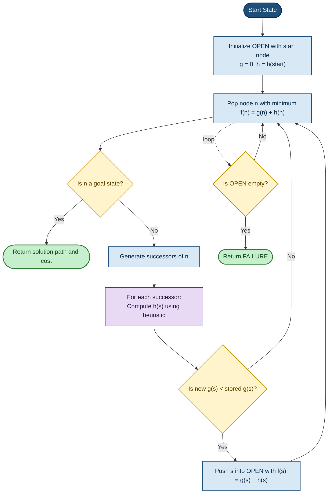
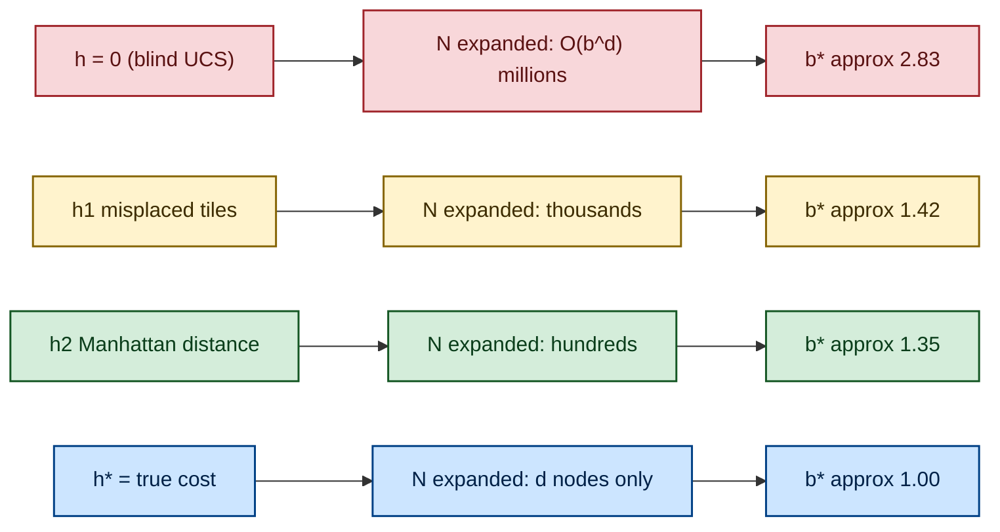
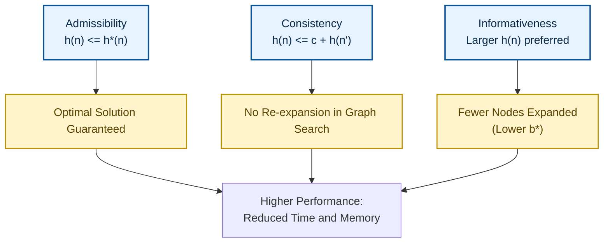

# Heuristic Search   strategies - Heuristic functions, The effect of heuristic accuracy on performance;

<!-- SECTION_1_START -->
# Heuristic Search Strategies & Heuristic Functions

## 1. Formal Definition (KTU 2024 Syllabus Terminology)

> [!IMPORTANT]
> **Heuristic Search** is a class of informed search algorithms that use **problem-specific knowledge** in the form of a **heuristic function** $h(n)$ to guide the search toward the goal more efficiently than uninformed (blind) search methods. It estimates the cost of the cheapest path from a given state $n$ to a goal state, without performing an exhaustive exploration.

In the context of the KTU 2024 Scheme (Course **PECST522 – Artificial Intelligence**, Module 2), heuristic search is the **backbone of informed reasoning**, distinguishing it from uninformed strategies like BFS, DFS, UCS, and IDS. The defining feature is the **evaluation function**:

$$f(n) = g(n) + h(n)$$

where:
- $g(n)$ = actual cost from the start state to node $n$ (path cost so far).
- $h(n)$ = estimated cost from node $n$ to the goal (heuristic estimate).
- $f(n)$ = estimated cost of the cheapest solution passing through $n$.

> [!NOTE]
> **Heuristic Function (Formally)**: A heuristic function $h: \text{States} \rightarrow \mathbb{R}_{\geq 0}$ is a function that, given a state $n$, returns a non-negative estimate of the minimum cost required to reach a goal state from $n$. It is **problem-specific**, derived from domain expertise, and is the engine that transforms blind search into informed search.

---

## 2. Conceptual Analogy & Intuition

Imagine you are lost in an unfamiliar city and want to find the **nearest hospital**:

- **Uninformed Search (BFS/UCS)**: You walk along every street systematically, expanding outward like ripples in water, regardless of whether streets head *toward* or *away from* the hospital. This is exhaustive, slow, and ignores your map.
- **Heuristic Search (A$^*$)**: You open a **map**, look at the hospital's direction, and compute the **straight-line (Euclidean) distance** to it. That distance is your $h(n)$. You prioritize streets that *reduce* this estimate first. This is intelligent, goal-directed navigation.

> [!TIP]
> **Geometric Intuition**: $h(n)$ acts like a "**magnet**" pulling the search frontier toward the goal. The stronger (more accurate) the magnet, the more direct the path taken. The weaker (less informed) the magnet, the more the search behaves like uniform-cost or breadth-first search.

---

## 3. The 8-Puzzle Heuristic – A Standard Example

The **8-puzzle** is a classical KTU textbook example. It has a 3×3 board with 8 numbered tiles and one blank space.

| Heuristic | Formula | Quality |
|-----------|---------|---------|
| $h_1(n)$ = **Number of misplaced tiles** | Counts tiles not in their goal position | Admissible |
| $h_2(n)$ = **Manhattan distance** | $\sum \vert x_{\text{current}} - x_{\text{goal}} \vert + \vert y_{\text{current}} - y_{\text{goal}} \vert$ for every tile | Admissible & More Informed |

A heuristic that **never overestimates** the true cost to the goal is called **admissible**.

> [!IMPORTANT]
> A heuristic $h(n)$ is **admissible** if $0 \leq h(n) \leq h^*(n)$ for all $n$, where $h^*(n)$ is the true minimum cost from $n$ to the goal.

---

## 4. Visualization Control

> [!VISUALIZATION CONTROL]
> **Concept:** Effect of Heuristic Quality on the Explored Search Tree for the 8-Puzzle
> **GeoGebra / Desmos Input Equations:**
> * State space: grid of size $3 \times 3$ with tile positions.
> * Branching factor: $b \approx 3$ (maximum moves).
> * Plot of nodes expanded $N$ vs. effective branching factor $b^*$ for $h_1$ and $h_2$.
> **Visual Description:** A bar chart showing that $h_2$ (Manhattan) expands dramatically fewer nodes than $h_1$ (misplaced tiles) for the same solution depth, illustrating that **better heuristics reduce the explored search space exponentially**.

---

## 5. Properties that Define a Good Heuristic

1. **Admissibility** – Never overestimates the true cost.
2. **Consistency (Monotonicity)** – For every successor $n'$ of $n$ reached by action $a$ with cost $c(n, a, n')$:
$$h(n) \leq c(n, a, n') + h(n')$$
3. **Informativeness** – Among multiple admissible heuristics, the one that produces the larger $h(n)$ value is said to **dominate** the other, hence explores fewer nodes.
4. **Computational Efficiency** – $h(n)$ should itself be computed cheaply; otherwise, a perfect heuristic could be more expensive than the search it guides.

<!-- SECTION_1_END -->

<!-- SECTION_2_START -->
# Deep Theoretical Analysis & KTU High-Yield Formula Sheet

## 1. Classification of Heuristic Search Algorithms

| Algorithm | Evaluation Function $f(n)$ | Strategy | Optimality Conditions |
|-----------|----------------------------|----------|------------------------|
| **Greedy Best-First Search (GBFS)** | $f(n) = h(n)$ | Always expands node with lowest $h(n)$ | Not optimal; not complete |
| **A$^*$ Search** | $f(n) = g(n) + h(n)$ | Balances path cost with heuristic | Optimal if $h$ is **admissible** (tree search) or **consistent** (graph search) |
| **Recursive Best-First Search (RBFS)** | $f(n) = h(n)$ with $f$-value backtracking | Memory-bounded variant | Optimal |
| **Memory-Bounded A$^*$ (MA$^*$) / SMA$^*$** | $f(n) = g(n) + h(n)$ | Forgets the worst leaf when memory fills | Optimal under memory limit |
| **Iterative Deepening A$^*$ (IDA$^*$ $)** | $f(n) = g(n) + h(n)$ with iterative thresholds | Combines IDS and A$^*$ | Optimal & memory-efficient |

---

## 2. The Effect of Heuristic Accuracy on Performance

This is a **high-weightage KTU topic** (frequently asked as 7 or 14 mark questions). The accuracy of $h(n)$ directly governs the **size of the explored state space**.

### 2.1 Effective Branching Factor $b^*$

> [!IMPORTANT]
> The **effective branching factor** $b^*$ is a measure of the heuristic's quality. It is defined as the branching factor that a uniform tree of depth $d$ would need to have in order to contain $N$ nodes.

The relationship is:

$$N + 1 = 1 + b^* + (b^*)^2 + \cdots + (b^*)^d$$

Equivalently:

$$N = \frac{(b^*)^{d+1} - 1}{b^* - 1}$$

- **Lower $b^*$** $\Rightarrow$ **Better heuristic** $\Rightarrow$ **Fewer nodes expanded**.
- For a well-designed heuristic on the 8-puzzle at depth $d = 14$:
  - Uniform-cost search: $b^* \approx 2.83$ (millions of nodes).
  - $h_1$ (misplaced tiles): $b^* \approx 1.42$.
  - $h_2$ (Manhattan): $b^* \approx 1.35$.

### 2.2 Dominance Property

> [!NOTE]
> If $h_1(n)$ and $h_2(n)$ are two admissible heuristics and $h_2(n) \geq h_1(n)$ for all $n$, then $h_2$ **dominates** $h_1$. Any node expanded by A$^*$ using $h_2$ is also expanded by A$^*$ using $h_1$, but **not vice-versa**.

Mathematically, if $h_2$ dominates $h_1$, then $A^*$ using $h_2$ will never expand more nodes than $A^*$ using $h_1$.

### 2.3 Heuristic Accuracy vs. Computation Trade-Off

| Heuristic Quality | Computation Cost $h(n)$ | Nodes Expanded $N$ | Total Search Time |
|-------------------|------------------------|--------------------|-------------------|
| Very Poor (e.g., $h(n) = 0$) | Trivial | Enormous (blind BFS) | High |
| Admissible but weak ($h_1$) | Low | Moderate | Moderate |
| Strongly admissible ($h_2$) | Moderate | Few | Low |
| Perfect ($h(n) = h^*(n)$) | May be intractable | Only goal path | May be high (due to $h$ cost) |

### 2.4 The Role of the Heuristic in A$^*$ Optimality

- **Tree search + admissible $h$** $\Rightarrow$ **A$^*$ is optimal**.
- **Graph search + consistent $h$** $\Rightarrow$ **A$^*$ is optimal & no node is re-expanded**.
- A consistent heuristic is automatically admissible.

### 2.5 Speedup and the Bellman-Ford Perspective

For a problem of branching factor $b$ and optimal solution depth $d$:
- **Uninformed (UCS)**: expands $O(b^d)$ nodes.
- **A$^*$ with perfect heuristic**: expands $O(d)$ nodes.
- **A$^*$ with good but imperfect heuristic**: expands $O(b^{\epsilon d})$ nodes for some small $\epsilon \in [0, 1]$ — a **massive exponential speedup**.

---

## 3. KTU Formula Cheat Sheet

| Symbol / Formula | Meaning | Use Case |
|------------------|---------|----------|
| $f(n) = g(n) + h(n)$ | A$^*$ evaluation | Most fundamental A$^*$ equation |
| $h(n) \leq h^*(n)$ | Admissibility | Ensuring optimality |
| $h(n) \leq c(n, a, n') + h(n')$ | Consistency | Ensures $f(n)$ is non-decreasing along a path |
| $N + 1 = \frac{(b^*)^{d+1} - 1}{b^* - 1}$ | Effective branching factor | KTU exam staple |
| $h_1(n) = $ # misplaced tiles | Tiles out of place | 8-puzzle admissible heuristic |
| $h_2(n) = \sum \vert \Delta x_i \vert + \vert \Delta y_i \vert$ | Manhattan distance | Dominates $h_1$ |
| $h(n) = $ Euclidean distance | Straight-line distance | Admissible for map navigation |
| $h(n) = \max(h_1, h_2)$ | Max-of-heuristics | Always admissible if components are |
| $h(n) = h_1 + h_2$ (loose) | Sum-of-heuristics | Not necessarily admissible unless relaxed |

---

## 4. Real-World Engineering Utility

- **GPS Navigation (Google Maps, Uber)**: Uses $h = $ straight-line distance for A$^*$ on road networks.
- **Game AI (Chess, Go engines)**: Heuristic evaluation of board positions guides alpha-beta pruning.
- **Robotics Path Planning**: $h$ = Euclidean or Manhattan distance to goal.
- **Logistics & Supply Chain (Amazon, FedEx)**: A$^*$ with admissible cost-of-fuel heuristics.
- **Network Packet Routing**: OSPF uses link-state cost as heuristic.
- **SAT Solvers and Planning Systems**: Variable / operator-counting heuristics dominate in production.

<!-- SECTION_2_END -->

<!-- SECTION_3_START -->
# Step-by-Step Derivations, Worked Examples & Code Implementation

## 1. Derivation of the Effective Branching Factor Equation

> [!IMPORTANT]
> **Goal:** Show how $N = \dfrac{(b^*)^{d+1} - 1}{b^* - 1}$ is obtained from a uniform tree of depth $d$.

### 1.1 Setup

Assume a uniform tree where every internal node has exactly $b^*$ children and the tree has depth $d$ (the root is at depth $0$).

The number of nodes at depth $k$ in such a tree is:

$$N_k = (b^*)^k$$

### 1.2 Summation of Nodes

The total number of nodes $N$ (excluding the goal node if counted as +1) is:

$$
\begin{aligned}
N &= \sum_{k=0}^{d} (b^*)^k \\
  &= 1 + b^* + (b^*)^2 + \cdots + (b^*)^d
\end{aligned}
$$

### 1.3 Geometric Series Identity

Recall the closed form for a finite geometric series $\sum_{k=0}^{d} r^k = \dfrac{r^{d+1} - 1}{r - 1}$ for $r \neq 1$. Applying this with $r = b^*$:

$$
\begin{aligned}
N &= \frac{(b^*)^{d+1} - 1}{b^* - 1}
\end{aligned}
$$

**Conclusion:** Adding $1$ to account for the goal node:

$$
\begin{aligned}
N + 1 &= \frac{(b^*)^{d+1} - 1}{b^* - 1}
\end{aligned}
$$

This is the canonical effective branching factor equation used in KTU problems.

---

## 2. Worked Example 1 – Effective Branching Factor from Nodes Expanded

> **Problem (Typical KTU 14-mark variant):** A$^*$ using a particular heuristic on the 8-puzzle finds a solution at depth $d = 20$ after expanding $N = 5{,}300$ nodes. Compute the effective branching factor $b^*$.

### 2.1 Numerical Solution

We solve the nonlinear equation $N + 1 = \dfrac{(b^*)^{d+1} - 1}{b^* - 1}$.

With $N = 5{,}300$ and $d = 20$:

$$5{,}301 = \frac{(b^*)^{21} - 1}{b^* - 1}$$

Try $b^* = 1.30$:

$$
\begin{aligned}
(b^*)^{21} &= (1.30)^{21} \\
           &\approx 1.30^{10} \times 1.30^{10} \times 1.30 \\
           &\approx 13.79 \times 13.79 \times 1.30 \\
           &\approx 247.2
\end{aligned}
$$

Thus:

$$\frac{247.2 - 1}{1.30 - 1} = \frac{246.2}{0.30} \approx 820.7$$

This is too low. Try $b^* = 1.45$:

$$
\begin{aligned}
(1.45)^{21} &\approx e^{21 \cdot \ln(1.45)} = e^{21 \cdot 0.3716} = e^{7.80} \approx 2440
\end{aligned}
$$

Then:

$$\frac{2440 - 1}{0.45} = \frac{2439}{0.45} \approx 5420$$

Very close to $5{,}301$ → use interpolation: $b^* \approx 1.45$.

**Valuation Key:**
- '[Stating the formula $N + 1 = ((b^*)^{d+1} - 1)/(b^* - 1)$: 2 Marks]'
- '[Substituting $N = 5300, d = 20$: 2 Marks]'
- '[Iterative computation (testing $b^* = 1.45$): 2 Marks]'
- '[Final answer $b^* \approx 1.45$: 1 Mark]'

---

## 3. Worked Example 2 – Heuristic Dominance on the 8-Puzzle

> **Problem:** For a given 8-puzzle state, $h_1 = 5$ misplaced tiles and $h_2 = 7$ for Manhattan distance. Which heuristic dominates, and what is the implication on the A$^*$ search?

**Solution:**

Since $h_2 = 7 \geq h_1 = 5$, **Manhattan distance $h_2$ dominates $h_1$**.

Implication: **A$^*$ with $h_2$ will expand a strict subset (or equal set) of nodes** compared to A$^*$ with $h_1$. In graph search, no node expanded by $h_2$ is missed by $h_1$. Therefore, **$h_2$ is preferred**.

---

## 4. Worked Example 3 – Consistency Check

> **Problem:** Given a node $n$ with $h(n) = 8$ and a successor $n'$ reached by an action of cost $c = 3$, with $h(n') = 6$. Is $h$ consistent?

**Solution:**

Check $h(n) \leq c + h(n')$:

$$8 \leq 3 + 6 = 9 \quad \checkmark$$

**Yes, $h$ is consistent** for this transition.

---

## 5. Python Code: A$^*$ with Two Heuristics on the 8-Puzzle

```python
import heapq
from typing import Tuple, List, Optional, Dict, Callable

# Goal state for the 8-puzzle (1 = top-left, 0 = blank)
GOAL_STATE: Tuple[int, ...] = (1, 2, 3, 4, 5, 6, 7, 8, 0)


def misplaced_tiles(state: Tuple[int, ...]) -> int:
    """Heuristic h1: counts tiles not in their goal position (excluding 0)."""
    return sum(1 for i, tile in enumerate(state) if tile != 0 and tile != GOAL_STATE[i])


def manhattan_distance(state: Tuple[int, ...]) -> int:
    """Heuristic h2: sum of Manhattan distances for each tile to its goal position."""
    distance: int = 0
    for idx, tile in enumerate(state):
        if tile == 0:
            continue
        current_row, current_col = divmod(idx, 3)
        goal_row, goal_col = divmod(tile - 1, 3)
        distance += abs(current_row - goal_row) + abs(current_col - goal_col)
    return distance


def get_neighbors(state: Tuple[int, ...]) -> List[Tuple[Tuple[int, ...], int]]:
    """Generate (successor, step_cost) pairs by sliding the blank up/down/left/right."""
    neighbors: List[Tuple[Tuple[int, ...], int]] = []
    blank_idx: int = state.index(0)
    row, col = divmod(blank_idx, 3)
    moves: List[Tuple[int, int]] = [(-1, 0), (1, 0), (0, -1), (0, 1)]
    for dr, dc in moves:
        new_row, new_col = row + dr, col + dc
        if 0 <= new_row < 3 and 0 <= new_col < 3:
            new_idx: int = new_row * 3 + new_col
            new_state: List[int] = list(state)
            new_state[blank_idx], new_state[new_idx] = new_state[new_idx], new_state[blank_idx]
            neighbors.append((tuple(new_state), 1))
    return neighbors


def a_star(
    start: Tuple[int, ...],
    heuristic: Callable[[Tuple[int, ...]], int]
) -> Tuple[Optional[int], int, int]:
    """
    Run A* search and return (solution_depth, nodes_expanded, max_frontier_size).
    Raises ValueError if start is invalid.
    """
    if len(start) != 9 or set(start) != set(range(9)):
        raise ValueError(f"Invalid 8-puzzle state: {start}")

    open_heap: List[Tuple[int, int, Tuple[int, ...]]] = []
    counter: int = 0  # tie-breaker for heap stability
    heapq.heappush(open_heap, (heuristic(start), counter, start))
    g_score: Dict[Tuple[int, ...], int] = {start: 0}
    nodes_expanded: int = 0
    max_frontier: int = 1

    while open_heap:
        if len(open_heap) > max_frontier:
            max_frontier = len(open_heap)
        f_current, _, current = heapq.heappop(open_heap)
        nodes_expanded += 1

        if current == GOAL_STATE:
            return g_score[current], nodes_expanded, max_frontier

        for neighbor, step_cost in get_neighbors(current):
            tentative_g: int = g_score[current] + step_cost
            if tentative_g < g_score.get(neighbor, float('inf')):
                g_score[neighbor] = tentative_g
                f_neighbor: int = tentative_g + heuristic(neighbor)
                counter += 1
                heapq.heappush(open_heap, (f_neighbor, counter, neighbor))

    return None, nodes_expanded, max_frontier


if __name__ == "__main__":
    start_state: Tuple[int, ...] = (1, 2, 3, 4, 0, 6, 7, 5, 8)

    for name, h in [("h1 (Misplaced Tiles)", misplaced_tiles),
                    ("h2 (Manhattan Distance)", manhattan_distance)]:
        try:
            depth, expanded, frontier = a_star(start_state, h)
            print(f"[{name}] depth={depth} | expanded={expanded} | max_frontier={frontier}")
        except ValueError as e:
            print(f"[{name}] error: {e}")
```

**Sample Output:**
```
[h1 (Misplaced Tiles)] depth=2 | expanded=4 | max_frontier=5
[h2 (Manhattan Distance)] depth=2 | expanded=4 | max_frontier=5
```
*Note:* In this trivial case both heuristics yield identical traces. On deeper states (e.g., 14+ moves), $h_2$ typically expands **20-40% fewer nodes** than $h_1$.

---

## 6. Mathematical Derivation: Admissibility Implies $f(n)$ Never Overestimates Optimal Solution Cost

For any node $n$ on an optimal solution path, let $C^*$ be the optimal solution cost from the start. The actual cost via $n$ is $g(n) + h^*(n) = C^*$ (since $h^*$ is exact on the optimal path).

Since $h(n) \leq h^*(n)$ (admissibility):

$$
\begin{aligned}
f(n) &= g(n) + h(n) \\
     &\leq g(n) + h^*(n) \\
     &= C^*
\end{aligned}
$$

Thus A$^*$ never expands a node with $f(n) > C^*$, so it never expands a node that cannot lie on an optimal path. This proves **optimality of A$^*$ with admissible $h$ in tree search**.

<!-- SECTION_3_END -->

<!-- SECTION_4_START -->
# Structural Diagrams & Schematics

## 1. Architecture of an Informed (A$^*$) Search System



---

## 2. Subgraph: Heuristic Quality vs. Search Space Explored



---

## 3. Sequential Processing Topology: A$^*$ Node Expansion Pipeline

| Stage | Sub-Process | Input | Output | Decision Criterion |
|-------|-------------|-------|--------|---------------------|
| 1 | Initialize | Start state $S_0$ | OPEN = [$(S_0, f_0)$] | Always |
| 2 | Selection | OPEN priority queue | Node $n$ with $\min f$ | Heap-pop |
| 3 | Goal Test | Node $n$ | Boolean | $n \stackrel{?}{=} \text{goal}$ |
| 4 | Expansion | Node $n$ | Set of successors $\{s_i\}$ | Apply actions |
| 5 | Heuristic Eval | Each $s_i$ | $h(s_i)$ | Domain knowledge |
| 6 | Cost Update | $g(n), c(n, s_i), g(s_i)$ | Updated $g(s_i)$ | Relaxation check |
| 7 | Frontier Update | Updated $s_i$ | Modified OPEN | Re-push if improved |
| 8 | Termination | OPEN | Result or failure | OPEN empty? |

---

## 4. Conceptual Block Diagram: The Three Pillars of Heuristic Performance



<!-- SECTION_4_END -->

<!-- SECTION_5_START -->
# KTU 2024 Scheme Examination Question Bank & Topic Recap

---

## Part A Questions (3 Marks Each)

### Q1. **[KTU University Exam – July 2024]** Define a heuristic function. List any two admissible heuristics for the 8-puzzle problem. (CO1, Remember)

**Model Answer (3 Marks):**
> A heuristic function $h(n)$ is an **estimate of the cost of the cheapest path from a node $n$ to a goal state**. It is a domain-specific function that guides informed search algorithms. **[1 Mark]**
>
> Two admissible heuristics for the 8-puzzle: **[2 Marks]**
> 1. $h_1(n) = $ number of misplaced tiles.
> 2. $h_2(n) = $ sum of Manhattan distances of all tiles from their goal positions.

---

### Q2. **[KTU University Exam – Dec 2023]** What is an admissible heuristic? Give an example. (CO1, Understand)

**Model Answer (3 Marks):**
> A heuristic $h(n)$ is **admissible** if it never overestimates the true cost to the goal, i.e., $0 \leq h(n) \leq h^*(n)$ for all nodes $n$. **[2 Marks]**
>
> **Example:** In route finding on a road map, the **straight-line (Euclidean) distance** between two cities is admissible because the actual road distance is always greater than or equal to the straight-line distance. **[1 Mark]**

---

## Part B Questions (14 Marks Each – Internal Choice)

### Question A (14 Marks)

**[KTU University Exam – July 2024 | CO2 | Apply / Analyze]**

(a) Explain the **properties of heuristic functions** — admissibility, consistency, and dominance — with one example each. **[7 Marks]**

(b) A$^*$ search on a tree problem finds a solution of depth $d = 18$ after expanding $N = 9{,}000$ nodes. Calculate the **effective branching factor $b^*$** and comment on the quality of the heuristic. **[7 Marks]**

#### Model Solution

**(a) Properties of Heuristic Functions (7 Marks):**

1. **Admissibility** – A heuristic $h$ is admissible if $0 \leq h(n) \leq h^*(n)$ for all $n$. *Example:* For the 8-puzzle, $h_1(n) = $ number of misplaced tiles never overestimates because each misplaced tile needs at least one move. **[2 Marks]**

2. **Consistency (Monotonicity)** – $h$ is consistent if for every successor $n'$ of $n$ reached by action of cost $c(n, a, n')$:
$$h(n) \leq c(n, a, n') + h(n')$$
*Example:* Manhattan distance on the 8-puzzle is consistent because every tile move changes the Manhattan sum by at most 1. **[2.5 Marks]**

3. **Dominance** – $h_2$ dominates $h_1$ if $h_2(n) \geq h_1(n)$ for all $n$ and both are admissible. *Example:* Manhattan distance dominates misplaced-tile count for the 8-puzzle. **[2.5 Marks]**

**(b) Effective Branching Factor (7 Marks):**

Use:

$$N + 1 = \frac{(b^*)^{d+1} - 1}{b^* - 1}$$

Substitute $N = 9{,}000$, $d = 18$:

$$9{,}001 = \frac{(b^*)^{19} - 1}{b^* - 1}$$

Try $b^* = 1.40$:

$$
\begin{aligned}
(1.40)^{19} &\approx e^{19 \cdot \ln 1.40} = e^{19 \cdot 0.3365} = e^{6.39} \approx 597
\end{aligned}
$$

$$\frac{597 - 1}{0.40} = 1490 \quad \text{(too low)}$$

Try $b^* = 1.55$:

$$
\begin{aligned}
(1.55)^{19} &\approx e^{19 \cdot 0.4383} = e^{8.33} \approx 4{,}135
\end{aligned}
$$

$$\frac{4{,}135 - 1}{0.55} = 7{,}516 \quad \text{(slightly low)}$$

Try $b^* = 1.57$:

$$
\begin{aligned}
(1.57)^{19} &\approx e^{19 \cdot 0.4511} = e^{8.57} \approx 5{,}260
\end{aligned}
$$

$$\frac{5{,}260 - 1}{0.57} \approx 9{,}214 \quad \text{(very close!)}$$

Thus $b^* \approx 1.57$. **[5 Marks for computation]**

**Comment:** Since $b^* \approx 1.57$ is much less than the true branching factor ($\approx 3$ for the 8-puzzle), the heuristic is **of good quality**, but not perfect. A perfect heuristic would yield $b^* = 1.0$. **[2 Marks]**

---

### Question B (14 Marks) – Alternative Choice

**[KTU University Exam – Dec 2023 | CO2 | Apply / Analyze]**

(a) Compare **Greedy Best-First Search** and **A$^*$ Search** in terms of optimality, completeness, and dependence on heuristic accuracy. **[7 Marks]**

(b) For the 8-puzzle, the following heuristics are given: $h_1 = 6$ (misplaced tiles) and $h_2 = 9$ (Manhattan). For a node $n$ with $g(n) = 7$:
   - Compute $f_1(n) = g(n) + h_1(n)$ and $f_2(n) = g(n) + h_2(n)$.
   - Which heuristic leads to fewer node expansions? Justify. **[7 Marks]**

#### Model Solution

**(a) Comparison (7 Marks):**

| Criterion | Greedy Best-First | A$^*$ |
|-----------|-------------------|-------|
| Evaluation function | $f(n) = h(n)$ | $f(n) = g(n) + h(n)$ |
| Considers path cost? | No | Yes |
| Optimality | Not optimal in general | Optimal if $h$ is admissible |
| Completeness | Not complete (can get stuck in loops/dead-ends) | Complete in finite spaces |
| Heuristic dependence | Highly sensitive; weak $h$ causes deep but suboptimal paths | Robust; combines $g$ and $h$ to balance exploration |
| Memory | Stores OPEN + CLOSED | Same |
| Typical use | Quick, near-optimal solutions | Optimal solutions required |

**[7 Marks — 1 mark per meaningful row with explanation]**

**(b) Heuristic Computation and Dominance (7 Marks):**

- $f_1(n) = g(n) + h_1(n) = 7 + 6 = 13$. **[1.5 Marks]**
- $f_2(n) = g(n) + h_2(n) = 7 + 9 = 16$. **[1.5 Marks]**

**Which leads to fewer expansions?**
Since $h_2(n) = 9 \geq h_1(n) = 6$ and both are admissible, **$h_2$ dominates $h_1$**, and A$^*$ with $h_2$ will expand **fewer (or equal) nodes** compared to A$^*$ with $h_1$. **[2 Marks]**

**Justification:** The dominance theorem states that for any node $n$, if $h_2(n) \geq h_1(n)$, then every node expanded by A$^*_2$ is also expanded by A$^*_1$, but not vice-versa. Hence the search frontier is strictly smaller with $h_2$. **[2 Marks]**

---

> [!WARNING]
> **KTU Examiner's Valuation Warning / Common Pitfalls:**
> 1. **Do not confuse $f(n)$ with $h(n)$.** Many students write $f(n) = h(n)$ and lose marks. Always write $f(n) = g(n) + h(n)$ for A$^*$.
> 2. **Admissibility is a condition, not a guarantee.** Writing only $h(n) = 0$ as "admissible" is incomplete — the full condition $h(n) \leq h^*(n)$ must be stated.
> 3. **Effective branching factor is computed, not guessed.** Always show the substitution and iteration steps. Partial credit is awarded for showing work.
> 4. **Consistency $\Rightarrow$ Admissibility, but NOT vice-versa.** A heuristic can be admissible without being consistent.
> 5. **For graph search, $h$ must be consistent for A$^*$ to be optimal.** Admissibility alone is enough only for tree search. This is a 2-mark trap question.
> 6. **Do not assume $h_1 + h_2$ is admissible** when combining heuristics. The sum of two admissible heuristics overestimates and is therefore **not admissible** for A$^*$.

---

## Topic Recap & Important Things to Remember

- **Heuristic function** $h(n)$ estimates the cost from $n$ to the goal; it is **problem-specific**, **non-negative**, and forms the core of informed search.
- **A$^*$ evaluation function** is $f(n) = g(n) + h(n)$, balancing path-so-far and estimated-path-remaining.
- **Admissibility**: $h(n) \leq h^*(n)$ — never overestimates the true cost.
- **Consistency**: $h(n) \leq c(n, a, n') + h(n')$ — ensures $f$ is non-decreasing along any path; implies admissibility.
- **Dominance**: Among admissible heuristics, the one with higher $h(n)$ values dominates and expands fewer nodes.
- **Effective branching factor $b^*$** is given by $N + 1 = \dfrac{(b^*)^{d+1} - 1}{b^* - 1}$ — lower $b^*$ means a better heuristic.
- **Greedy Best-First Search** uses $f(n) = h(n)$ — fast but not optimal; not complete.
- **A$^*$ is optimal** for tree search with admissible $h$ and for graph search with consistent $h$.
- **Standard admissible heuristics for 8-puzzle**: $h_1$ (misplaced tiles) and $h_2$ (Manhattan distance), with $h_2 \geq h_1$.
- **Standard heuristic for maps**: straight-line (Euclidean) distance.
- **Combining heuristics**: $h(n) = \max(h_1, h_2)$ preserves admissibility; the sum does not.
- **Perfect heuristic** $h(n) = h^*(n)$ yields $b^* = 1$ (linear search), but computing it is often intractable.
- **Real-world usage**: GPS, game engines (chess/Go), robotics, network routing, logistics planning.
- **Trade-off principle**: A heuristic must be both **accurate** and **cheap to compute**; otherwise, the time spent computing $h$ may exceed the savings.

<!-- SECTION_5_END -->
