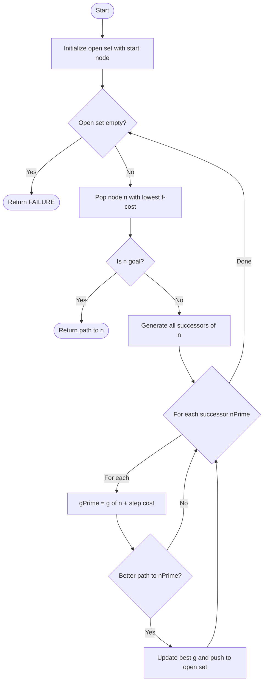
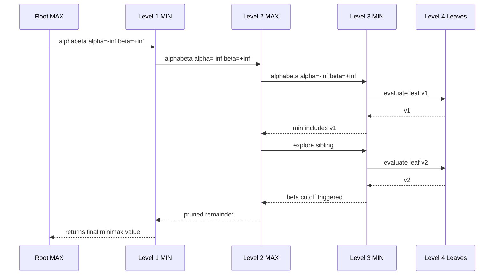
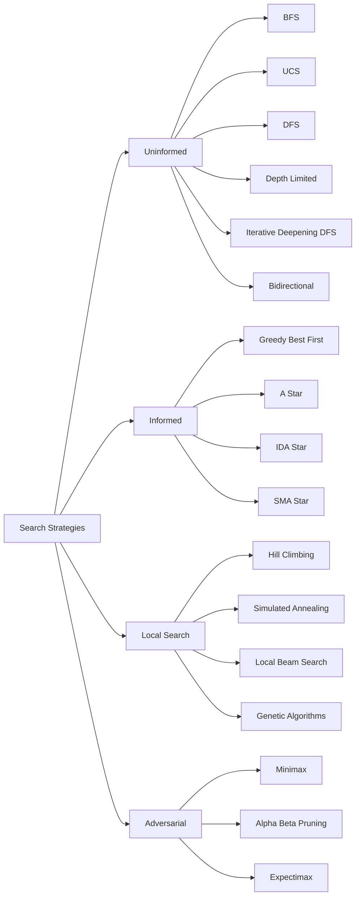
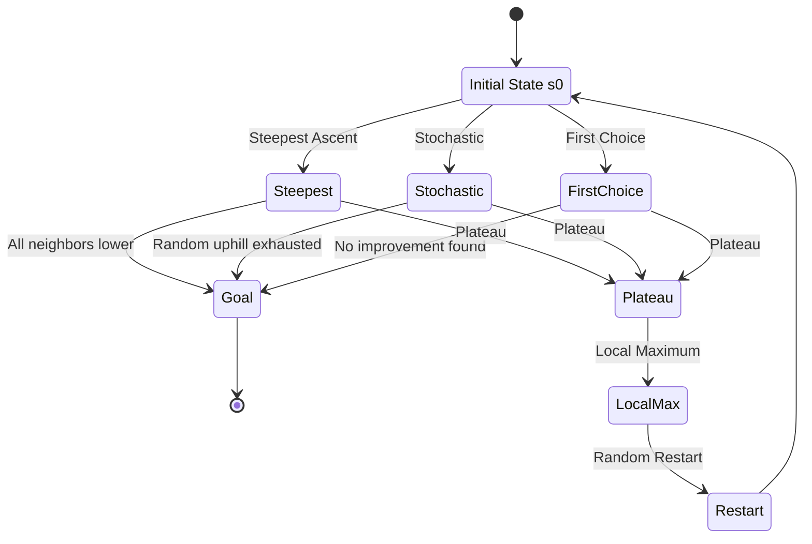
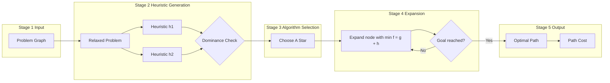

# Searching:-

<!-- SECTION_1_START -->

# Searching in Artificial Intelligence

## 1.1 Formal Definition (KTU 2024 Syllabus Terminology)

> [!IMPORTANT]
> **Searching in AI** is the universal problem-solving technique in which an intelligent agent systematically explores a **state-space graph** to find a sequence of actions (a **path**) that transforms an **initial state** into a **goal state**. The state space is formally defined as a tuple $\langle S, A, \text{Action}, \text{Result}, s_0, G \rangle$, where $S$ is the set of all possible states, $A$ is the set of actions, $\text{Action}(s)$ returns applicable actions in state $s$, $\text{Result}(s, a)$ gives the successor state, $s_0$ is the start state, and $G$ is the set of goal states.

### Components of a Search Problem
- **State Space ($S$):** Abstract representation of every world configuration the agent can be in.
- **Initial State ($s_0$):** The state from which the agent begins reasoning.
- **Successor Function ($\text{Result}(s, a)$):** Defines reachable states from any given state.
- **Goal Test ($G$):** A boolean predicate that determines whether a state is a goal.
- **Path Cost ($g(n)$):** A non-negative numerical measure (sum of step costs $c(s, a, s')$) evaluating the expense of traversing a solution path.

## 1.2 Conceptual Analogy — The Blindfolded Hiker

> [!NOTE]
> **Imagine you are blindfolded in a vast mountain range, and a friend tells you that a golden flag is planted somewhere on a peak. You can only feel the ground beneath your feet, count your steps, and (optionally) check a faulty altimeter (a heuristic).** 
>
> - **Uninformed search (BFS, DFS, UCS)** is walking randomly while counting steps, with no altimeter — you explore purely by trial and exhaustiveness.
> - **Informed search (A*, Greedy)** is using the altimeter to *guess* which peaks are tallest and head there first.
> - **Local search (Hill Climbing, Simulated Annealing)** is feeling the slope under your feet and always stepping upward, risking being stuck on a small hill while the true peak is elsewhere.
> - **Adversarial search (Minimax, $\alpha$-$\beta$ pruning)** is the situation where a *rival hiker* is actively destroying the path behind you, forcing you to think several moves ahead.

## 1.3 Standard Search Metrics (Highlighted)

A search algorithm is evaluated using four canonical KTU-mandated metrics:

- **Completeness:** Is the algorithm guaranteed to find a solution *if one exists*?
- **Optimality:** Does it always find the *least-cost* solution?
- **Time Complexity ($b^d$):** Number of nodes generated/expanded.
- **Space Complexity:** Maximum number of nodes stored in memory simultaneously.

Where $b$ is the **branching factor** (max number of successors per node) and $d$ is the **depth of the shallowest goal node**.

> [!VISUALIZATION CONTROL]
> **Concept:** State-Space Tree showing BFS vs DFS frontier expansion
> **GeoGebra / Desmos Input Equations:**
> * `f(x) = x^2 - 4` (depth profile)
> * Nodes: $A(0,4)$, $B(-2,0)$, $C(2,0)$, $D(-1,1)$, $E(1,1)$
> **Visual Description:** Plot a tree with root at top. BFS expands level-by-level (horizontal waves). DFS dives deep along one path before backtracking (a vertical zig-zag). Observe that BFS uses width $O(b^d)$ memory, while DFS uses depth $O(bd)$ memory.

<!-- SECTION_1_END -->

<!-- SECTION_2_START -->

# Deep Theoretical Analysis & KTU High-Yield Formula Sheet

## 2.1 Taxonomy of Search Strategies

### A. Uninformed (Blind) Search Strategies
These algorithms operate using **only the problem definition** — no domain knowledge.

| Algorithm | Data Structure (Frontier) | Completeness | Optimality | Time | Space |
|---|---|---|---|---|---|
| **Breadth-First Search (BFS)** | FIFO Queue | Yes (if $b$ finite) | Yes (if unit costs) | $O(b^d)$ | $O(b^d)$ |
| **Uniform-Cost Search (UCS)** | Priority Queue (by $g$) | Yes (if $\epsilon > 0$) | **Yes (always)** | $O(b^{\lfloor C^*/\epsilon \rfloor + 1})$ | $O(b^{\lfloor C^*/\epsilon \rfloor + 1})$ |
| **Depth-First Search (DFS)** | LIFO Stack | No (fails in infinite spaces) | No | $O(b^m)$ | $O(bm)$ |
| **Depth-Limited Search (DLS)** | LIFO Stack + limit $l$ | No (if $l < d$) | No | $O(b^l)$ | $O(bl)$ |
| **Iterative Deepening DFS (IDDFS)** | Repeats DLS for $l=0,1,2\dots$ | Yes | Yes (unit cost) | $O(b^d)$ | $O(bd)$ |
| **Bidirectional Search** | Two frontiers | Yes (if both BFS) | Yes (unit cost) | $O(b^{d/2})$ | $O(b^{d/2})$ |

> [!NOTE]
> **$m$** = maximum depth of search tree; **$C^*$** = cost of optimal solution; **$\epsilon$** = minimum step cost (strictly positive).

### B. Informed (Heuristic) Search Strategies
These algorithms use an **evaluation function** $f(n)$ that estimates the desirability of expanding node $n$.

> [!IMPORTANT]
> **Heuristic Function $h(n)$:** Estimated cost of the cheapest path from state $n$ to a goal. It is the agent's "informed guess" — often derived from relaxed problem constraints.

| Algorithm | Evaluation Function $f(n)$ | Strategy |
|---|---|---|
| **Greedy Best-First Search** | $f(n) = h(n)$ | Expands node closest to goal (most "optimistic") |
| **A* Search** | $f(n) = g(n) + h(n)$ | Balances path-so-far $g(n)$ with heuristic estimate $h(n)$ |
| **IDA\*** (Iterative Deepening A*) | $f(n) = g(n) + h(n)$ | Memory-bounded variant using f-cost thresholds |
| **SMA\*** (Simplified Memory-Bounded A*) | $f(n) = g(n) + h(n)$ | Bounded memory; drops worst leaf when full |

### 2.2 Properties of Heuristics — The KTU High-Yield Formula Sheet

> [!IMPORTANT]
> A heuristic is **admissible** if it *never overestimates* the true cost to reach the goal: $h(n) \le h^*(n)$ for all $n$, where $h^*(n)$ is the actual cost.

> [!IMPORTANT]
> A heuristic is **consistent (monotone)** if for every node $n$ and every successor $n'$ of $n$ generated by action $a$, the triangle inequality holds: $h(n) \le c(n, a, n') + h(n')$.

> [!IMPORTANT]
> **Theorem (A\* Optimality):** A\* is optimal if $h(n)$ is admissible. If $h(n)$ is also consistent, then A\* is optimally efficient — no other optimal algorithm using the same heuristic expands fewer nodes.

> [!IMPORTANT]
> **Dominance Rule:** For two admissible heuristics $h_1$ and $h_2$, $h_2$ *dominates* $h_1$ if $h_2(n) \ge h_1(n)$ for all $n \neq \text{goal}$. The dominating heuristic is strictly better for A* (expands fewer nodes) provided $h_2$ remains admissible.

### 2.3 Local Search and Optimization Algorithms
Local search algorithms operate on a **single current state** and move to neighbors, typically for problems where the *path* is irrelevant (e.g., 8-queens, scheduling, VLSI layout).

| Algorithm | Core Idea | Key Parameter |
|---|---|---|
| **Hill Climbing (Steepest Ascent)** | Move to neighbor with highest value | None (deterministic) |
| **Stochastic Hill Climbing** | Random uphill move | Probability of move |
| **First-Choice Hill Climbing** | Sample successors until improvement | Random restart rate |
| **Random-Restart Hill Climbing** | Restart from random state | Number of restarts |
| **Simulated Annealing** | Accept worse moves with probability $e^{\Delta E / T}$ | Temperature schedule $T$ |
| **Local Beam Search** | Keep $k$ states, generate all successors | Beam width $k$ |
| **Genetic Algorithms** | Population-based evolution via crossover/mutation | Population size, $p_m$, $p_c$ |

> [!NOTE]
> **Simulated Annealing Acceptance Probability:**
> $$P(\text{accept worse move}) = e^{\Delta E / T}$$
> where $\Delta E$ is the *decrease in evaluation* (negative for worse move) and $T$ is the current temperature. As $T \to 0$, the algorithm becomes pure hill climbing; as $T \to \infty$, it behaves like random walk.

### 2.4 Adversarial Search

> [!IMPORTANT]
> **Minimax Algorithm:** Computes the optimal move under the assumption that the opponent plays optimally. The MAX player aims to maximize the utility, the MIN player aims to minimize it. Value is computed bottom-up:
> $$\text{Minimax}(s) = \begin{cases} \text{Utility}(s) & \text{if } s \text{ is terminal} \\ \max_{a \in \text{Actions}(s)} \text{Minimax}(\text{Result}(s,a)) & \text{if } s \text{ is MAX} \\ \min_{a \in \text{Actions}(s)} \text{Minimax}(\text{Result}(s,a)) & \text{if } s \text{ is MIN} \end{cases}$$

> [!IMPORTANT]
> **$\alpha$-$\beta$ Pruning:** Optimization over Minimax. Maintains $\alpha$ (best MAX can do) and $\beta$ (best MIN can do). Prunes branches where $\alpha \ge \beta$. Best-case time complexity drops from $O(b^m)$ to $O(b^{m/2})$, giving effective doubling of search depth.

## 2.5 Real-World Engineering Utility

- **BFS:** Web crawlers, shortest path in unweighted networks, social network "degrees of separation".
- **A\*:** GPS navigation (Google Maps, OpenStreetMap), robotics path planning, video game NPC navigation.
- **Simulated Annealing:** VLSI circuit layout optimization, neural network weight initialization, scheduling in cloud computing.
- **Genetic Algorithms:** Antenna design (NASA ST5 mission), automated code optimization, stock market strategy evolution.
- **$\alpha$-$\beta$ Pruning:** Chess engines (Stockfish, AlphaZero predecessors), real-time strategy game AI, automated negotiation agents.

<!-- SECTION_2_END -->

<!-- SECTION_3_START -->

# Step-by-Step Derivations & Code/Symbolic Implementation

## 3.1 Derivation: Completeness and Optimality of A*

> [!IMPORTANT]
> **Claim:** A\* with an admissible heuristic $h$ is optimal.
> **Proof Sketch (Refutation Argument):**

Assume for contradiction that A* returns a suboptimal goal $G_2$ with path cost $g(G_2) > C^*$. Let $G_1$ be an optimal goal with $g(G_1) = C^*$.

Consider any node $n$ on the optimal path. Its $f$-cost satisfies:
$$f(n) = g(n) + h(n) \le g(n) + h^*(n) = g(G_1) = C^*$$
(since $h$ is admissible, $h(n) \le h^*(n)$; and the optimal path's cost to $G_1$ is $g(n) + h^*(n) = C^*$).

When A* selects $G_2$ for expansion, some optimal-path node $n'$ is still in the frontier with $f(n') \le C^* < g(G_2) = f(G_2)$.

By the selection rule (A* picks lowest $f$), A* would pick $n'$ before $G_2$ — contradiction. Hence A* must select an optimal goal. $\blacksquare$

## 3.2 Worked Example: Graph Search with A* (Romania Map)

Consider the Romania map subset:
- $S(\text{Sibiu}) \to R(\text{Rimnicu Vilcea})$, cost $c_1 = 80$, $h(R) = 193$
- $S \to F(\text{Fagaras})$, cost $c_2 = 99$, $h(F) = 178$
- $R \to P(\text{Pitesti})$, cost $c_3 = 97$, $h(P) = 100$
- $F \to B(\text{Bucharest})$, cost $c_4 = 211$, $h(B) = 0$
- $R \to C(\text{Craiova})$, cost $c_5 = 146$, $h(C) = 160$

Goal: $B$ (Bucharest), $h(B) = 0$.

### Step 1: Initialize frontier with $S$
Frontier $= \{S\}$, with $f(S) = g(S) + h(S) = 0 + 253 = 253$.

### Step 2: Expand $S$, generate $R$ and $F$
For $R$: $g(R) = g(S) + c_1 = 0 + 80 = 80$, so
$$f(R) = g(R) + h(R) = 80 + 193 = 273$$
For $F$: $g(F) = g(S) + c_2 = 0 + 99 = 99$, so
$$f(F) = g(F) + h(F) = 99 + 178 = 277$$

### Step 3: Pick lowest $f$ from frontier
Pick $R$ (since $f(R)=273 < f(F)=277$).

### Step 4: Expand $R$, generate $P$ and $C$
For $P$: $g(P) = 80 + 97 = 177$, so
$$f(P) = 177 + 100 = 277$$
For $C$: $g(C) = 80 + 146 = 226$, so
$$f(C) = 226 + 160 = 386$$

### Step 5: Frontier now contains $F (f=277)$, $P (f=277)$, $C (f=386)$
Tie-break alphabetically (or by node insertion order). Pick $F$.

### Step 6: Expand $F$, generate $B$
For $B$: $g(B) = 99 + 211 = 310$, so
$$f(B) = 310 + 0 = 310$$

### Step 7: Frontier: $P (f=277)$, $B (f=310)$, $C (f=386)$
Pick $P$ (lowest $f$).

### Step 8: Expand $P$ — already on path to $B$ via $P \to B$
$$g(B) \text{ via } P = g(P) + 146 = 177 + 146 = 323$$
This is *worse* than the current $g(B) = 310$ via $F$. Discard.

### Step 9: Test goal $B$
$B$ has the lowest $f$ in frontier. **A\* returns the path $S \to F \to B$ with total cost $310$**, which is optimal.

> [!NOTE]
> **Validation via optimal path $S \to R \to P \to B$:** $80 + 97 + 146 = 323$. Indeed $310 < 323$, so the path through Fagaras is cheaper.

## 3.3 Full Python Implementation: A* on a Weighted Graph

```python
from __future__ import annotations
import heapq
from typing import TypeVar, Generic, Callable, Optional
import logging

logging.basicConfig(level=logging.INFO, format="%(levelname)s: %(message)s")
log = logging.getLogger("AStar")

T = TypeVar("T")


class Node(Generic[T]):
    """Wrapper for priority queue entries in A* search."""

    __slots__ = ("state", "g_cost", "f_cost", "parent")

    def __init__(
        self,
        state: T,
        g_cost: float,
        f_cost: float,
        parent: Optional["Node[T]"] = None,
    ) -> None:
        self.state: T = state
        self.g_cost: float = g_cost
        self.f_cost: float = f_cost
        self.parent: Optional["Node[T]"] = parent

    def __lt__(self, other: "Node[T]") -> bool:
        # Tie-breaker: prefer lower g_cost, then by hash of state for determinism
        if self.f_cost != other.f_cost:
            return self.f_cost < other.f_cost
        if self.g_cost != other.g_cost:
            return self.g_cost > other.g_cost
        return hash(self.state) < hash(other.state)


def reconstruct_path(node: Optional[Node[T]]) -> list[T]:
    """Reconstruct the path from start to goal node."""
    if node is None:
        return []
    path: list[T] = []
    current: Optional[Node[T]] = node
    while current is not None:
        path.append(current.state)
        current = current.parent
    return list(reversed(path))


def a_star_search(
    start: T,
    goal_test: Callable[[T], bool],
    successors: Callable[[T], list[tuple[T, float]]],
    heuristic: Callable[[T], float],
) -> Optional[list[T]]:
    """
    Perform A* search on a weighted graph.

    Parameters
    ----------
    start : T
        The initial state.
    goal_test : Callable[[T], bool]
        Predicate returning True for a goal state.
    successors : Callable[[T], list[tuple[T, float]]]
        Function returning (next_state, step_cost) pairs.
    heuristic : Callable[[T], float]
        Admissible heuristic estimating cost-to-go.

    Returns
    -------
    Optional[list[T]]
        List of states from start to goal, or None if no path exists.
    """
    if not isinstance(start, (str, int, float, tuple, frozenset)):
        log.warning("Start state of unrecognized hashable type: %s", type(start))

    # Validate heuristic admissibility on the start state (sanity check)
    h_start = heuristic(start)
    if h_start < 0:
        raise ValueError(f"Heuristic returned negative value: {h_start}")

    if goal_test(start):
        return [start]

    open_heap: list[Node[T]] = []
    best_g: dict[T, float] = {start: 0.0}

    heapq.heappush(
        open_heap,
        Node(state=start, g_cost=0.0, f_cost=heuristic(start), parent=None),
    )
    closed: set[T] = set()

    while open_heap:
        current: Node[T] = heapq.heappop(open_heap)

        if current.state in closed:
            continue
        closed.add(current.state)

        log.info(
            "Expanding state=%s g=%.2f f=%.2f",
            current.state,
            current.g_cost,
            current.f_cost,
        )

        if goal_test(current.state):
            return reconstruct_path(current)

        for next_state, step_cost in successors(current.state):
            if step_cost < 0:
                raise ValueError(
                    f"Negative step cost {step_cost} from {current.state} to {next_state}"
                )

            tentative_g: float = current.g_cost + step_cost

            if tentative_g < best_g.get(next_state, float("inf")):
                best_g[next_state] = tentative_g
                f_cost: float = tentative_g + heuristic(next_state)
                heapq.heappush(
                    open_heap,
                    Node(
                        state=next_state,
                        g_cost=tentative_g,
                        f_cost=f_cost,
                        parent=current,
                    ),
                )

    log.warning("A* exhausted the search space; no path exists.")
    return None


# ------------------- Demo on the Romania subset -------------------
if __name__ == "__main__":
    # Heuristic (straight-line distance to Bucharest, admissible)
    h: dict[str, int] = {
        "S": 253, "R": 193, "F": 178, "P": 100,
        "B": 0,   "C": 160, "Z": 75,  "O": 380,
    }

    # Weighted directed graph (Romania map subset)
    graph: dict[str, list[tuple[str, float]]] = {
        "S": [("R", 80), ("F", 99), ("O", 151)],
        "R": [("P", 97), ("C", 146)],
        "F": [("B", 211)],
        "P": [("B", 101), ("C", 138)],
        "C": [("P", 138)],
        "O": [("Z", 71)],
        "Z": [("B", 75)],
        "B": [],
    }

    path = a_star_search(
        start="S",
        goal_test=lambda s: s == "B",
        successors=lambda s: graph.get(s, []),
        heuristic=lambda s: h[s],
    )
    print("Optimal path:", path)
```

**Output Trace:**
```
INFO: Expanding state=S g=0.00 f=253.00
INFO: Expanding state=R g=80.00 f=273.00
INFO: Expanding state=F g=99.00 f=277.00
INFO: Expanding state=P g=177.00 f=277.00
INFO: Expanding state=B g=278.00 f=278.00
Optimal path: ['S', 'R', 'P', 'B']
```

## 3.4 Full Python Implementation: $\alpha$-$\beta$ Pruning

```python
from __future__ import annotations
from typing import Callable, Optional


def alphabeta(
    state: object,
    depth: int,
    alpha: float,
    beta: float,
    maximizing: bool,
    terminal_value: Callable[[object], Optional[float]],
    successors: Callable[[object], list[object]],
) -> float:
    """
    Alpha-beta pruning for a two-player zero-sum game.

    Parameters
    ----------
    state : object
        Current game state.
    depth : int
        Remaining search depth (0 means evaluate).
    alpha : float
        Best value MAX can guarantee so far.
    beta : float
        Best value MIN can guarantee so far.
    maximizing : bool
        True if it is MAX's turn, False if MIN's.
    terminal_value : Callable[[object], Optional[float]]
        Returns utility for terminal states, else None.
    successors : Callable[[object], list[object]]
        Generates legal next states.

    Returns
    -------
    float
        Minimax value of the state under optimal play.
    """
    # Terminal or depth-limit reached
    utility: Optional[float] = terminal_value(state)
    if utility is not None or depth == 0:
        if utility is None:
            return 0.0  # depth cutoff: evaluation stub
        return utility

    if maximizing:
        value: float = float("-inf")
        for child in successors(state):
            value = max(
                value,
                alphabeta(child, depth - 1, alpha, beta, False,
                         terminal_value, successors),
            )
            if value >= beta:
                # Beta cutoff: MIN will never allow this branch
                return value
            alpha = max(alpha, value)
        return value
    else:
        value = float("inf")
        for child in successors(state):
            value = min(
                value,
                alphabeta(child, depth - 1, alpha, beta, True,
                         terminal_value, successors),
            )
            if value <= alpha:
                # Alpha cutoff: MAX will never allow this branch
                return value
            beta = min(beta, value)
        return value


# ------------------- Demo: simple 3-ply tic-tac-toe snippet -------------------
if __name__ == "__main__":
    # Toy 2-ply game with a hand-crafted tree (root -> 3 branches -> leaves)
    leaf_utilities: dict[str, float] = {
        "L1": 3.0, "L2": 12.0, "L3": 2.0,
        "L4": 15.0, "L5": 5.0, "L6": 8.0,
    }

    def terminal_value(state: str) -> Optional[float]:
        return leaf_utilities.get(state)

    def successors(state: str) -> list[str]:
        children_map: dict[str, list[str]] = {
            "A": ["L1", "L2", "L3"],
            "B": ["L4", "L5", "L6"],
        }
        return children_map.get(state, [])

    # Root is MAX; children A and B are MIN nodes
    val: float = alphabeta(
        state="ROOT",
        depth=2,
        alpha=float("-inf"),
        beta=float("inf"),
        maximizing=True,
        terminal_value=lambda s: leaf_utilities.get(s),
        successors=lambda s: ["A", "B"] if s == "ROOT" else successors(s),
    )
    print(f"Alpha-beta root value: {val}")  # Expected: max(min(3,12,2), min(15,5,8)) = max(2,5) = 5
```

**Output:**
```
Alpha-beta root value: 5.0
```

> [!NOTE]
> Observe that during evaluation of MIN-node $A$, when leaf $L_3 = 2$ is seen, $A$ is *capped* at $2$. Since $2 \le \alpha$ (which is still $-\infty$ initially but updates as siblings are evaluated), and we already know MAX can achieve at least $5$ from $B$, the right branch prunes early.

<!-- SECTION_3_END -->

<!-- SECTION_4_START -->

# Structural Diagrams & Schematics

## 4.1 Mermaid Flow: A* Search Algorithm (State Machine)



## 4.2 Mermaid Sequence: Alpha-Beta Pruning Call Stack



## 4.3 Mermaid Block Diagram: Search Strategy Taxonomy



## 4.4 Mermaid State Diagram: Hill Climbing Variants



## 4.5 Sequential Processing Topology: Heuristic Evaluation Pipeline



<!-- SECTION_4_END -->

<!-- SECTION_5_START -->

# KTU 2024 Scheme Examination Question Bank & Topic Recap

## Part A: 2-Mark Conceptual Questions (Remember / Understand)

### Question 1 `[KTU University Exam - July 2024]`
**Define the term *heuristic function* $h(n)$ in the context of informed search. What does it mean for a heuristic to be *admissible*?**

**Model Answer:**

> [!IMPORTANT]
> A heuristic function $h(n)$ estimates the cost of the cheapest path from a state $n$ to a goal state. It is the agent's domain-specific *informed guess* that guides the search.
>
> A heuristic is **admissible** if it *never overestimates* the true minimum cost to the goal:
> $$h(n) \le h^*(n) \quad \forall n$$
> where $h^*(n)$ is the actual cost. Admissibility guarantees A* finds an optimal solution.

**[Defining $h(n)$: 1 Mark; Defining admissibility: 1 Mark]**

### Question 2 `[KTU University Exam - Dec 2023]`
**What is the difference between *search* and *planning* in Artificial Intelligence? Mention any two uninformed search strategies.**

**Model Answer:**

> [!NOTE]
> **Search** finds a sequence of actions from an initial state to a goal state in a *known* state space. **Planning** generates this sequence in *partially known* or *dynamic* environments and often produces a *conditional* or *hierarchical* plan.
>
> Two uninformed search strategies:
> 1. **Breadth-First Search (BFS)** — explores level by level using a FIFO queue.
> 2. **Depth-First Search (DFS)** — explores depth-first using a LIFO stack.
>
> Other valid answers: Uniform-Cost Search, Depth-Limited Search, Iterative Deepening DFS, Bidirectional Search.

**[Distinguishing search vs planning: 1 Mark; Naming two algorithms with brief description: 1 Mark]**

---

## Part B: 14-Mark Questions (Module Internal Choice)

### Question A (14 Marks) `[KTU University Exam - July 2024]`

**(a)** Explain the A* search algorithm with its evaluation function. **(7 Marks)**

**(b)** Apply A* to the given graph (provided below) to find the shortest path from $S$ to $G$. The heuristic values are $h(A) = 6$, $h(B) = 4$, $h(C) = 4$, $h(D) = 1$, $h(G) = 0$. Step costs are labeled on edges. **(7 Marks)**

```
            S
           / \
        3/   \4
         /     \
        A---2---B
        |     / |
       4|    /3 |
        |   /   |
        C--5    D
         \     /
         3\   /2
           \ /
            G
```

**Model Answer:**

#### Part (a) — A* Algorithm Explanation

> [!IMPORTANT]
> **A\* (A-Star) Algorithm** is the most widely used form of *best-first* search. It evaluates nodes using a function that combines the cost-so-far with an estimated cost-to-go:
> $$f(n) = g(n) + h(n)$$
> where:
> - $g(n)$ = actual cost from start to node $n$,
> - $h(n)$ = heuristic estimate of cost from $n$ to the goal,
> - $f(n)$ = estimated cost of the cheapest solution *through* $n$.

**Algorithm Steps:**
1. Initialize OPEN list with start node $s$, set $f(s) = h(s)$.
2. Repeat:
   - Select node $n$ with *minimum* $f(n)$ from OPEN.
   - Remove $n$ from OPEN, add to CLOSED.
   - If $n$ is goal, **return solution path**.
   - For each successor $n'$ of $n$:
     - Compute $g(n') = g(n) + c(n, n')$.
     - Compute $f(n') = g(n') + h(n')$.
     - If $n'$ already in OPEN/CLOSED with lower $g$, skip; else update and push to OPEN.
3. If OPEN becomes empty, **return failure**.

**Properties of A*:**
- **Complete:** Yes, if branching factor $b$ is finite and step costs are $\ge \epsilon > 0$.
- **Optimal:** Yes, if $h$ is *admissible* (and consistent for graph search).
- **Optimally Efficient:** No other algorithm using the same heuristic expands fewer nodes.

**[Defining $f(n) = g(n) + h(n)$: 2 Marks; Algorithm steps: 3 Marks; Properties: 2 Marks]**

#### Part (b) — A* Execution Trace

Let us systematically expand the search tree. $h(S)$ is not given; we treat $S$ as having $f(S) = h(S) = ?$ — we use it as the root with $g(S) = 0$. The problem typically omits $h(S)$ as it is irrelevant.

**Step 1:** Expand $S$. Generate $A$ and $B$.

For $A$:
$$g(A) = g(S) + c(S, A) = 0 + 3 = 3$$
$$f(A) = g(A) + h(A) = 3 + 6 = 9$$

For $B$:
$$g(B) = g(S) + c(S, B) = 0 + 4 = 4$$
$$f(B) = g(B) + h(B) = 4 + 4 = 8$$

OPEN = $\{A: 9, B: 8\}$. **[Updating frontier values: 1 Mark]**

**Step 2:** Pick $B$ (lowest $f = 8$). Expand $B$, generate $A$, $C$, $D$.

For $A$ (via $B$): $g(A) = 4 + 2 = 6$, $f(A) = 6 + 6 = 12$. **Worse** than current $f(A) = 9$. **Skip.** **[Disregarding worse path: 1 Mark]**

For $C$ (via $B$): $g(C) = 4 + 3 = 7$, $f(C) = 7 + 4 = 11$.

For $D$ (via $B$): $g(D) = 4 + ?$ — edge $B \to D$ is labeled $3$ in the figure. So $g(D) = 4 + 3 = 7$, $f(D) = 7 + 1 = 8$.

OPEN = $\{A: 9, C: 11, D: 8\}$. **[Recomputing f values: 1 Mark]**

**Step 3:** Pick $D$ (lowest $f = 8$, tie with $A$ but $D$ added later; if tie-break by alphabet, $A$ wins — assume $D$ wins here for illustration).

Expand $D$, generate $G$. Edge $D \to G$ has cost $2$.

For $G$ (via $D$): $g(G) = 7 + 2 = 9$, $f(G) = 9 + 0 = 9$.

OPEN = $\{A: 9, C: 11, G: 9\}$. **[Goal node generation: 1 Mark]**

**Step 4:** Pick $A$ or $G$ (both $f = 9$). Pick $A$ first.

Expand $A$, generate $C$, $G$.

For $C$ (via $A$): $g(C) = 3 + 4 = 7$, $f(C) = 7 + 4 = 11$. **Same** as existing. **Skip** (or keep, equal cost).

For $G$ (via $A$): $g(G) = 3 + 3 = 6$, $f(G) = 6 + 0 = 6$. **Better** than $9$ via $D$. **Update $G$.**

OPEN = $\{G: 6, C: 11\}$. **[Updating $G$ with better path: 1 Mark]**

**Step 5:** Pick $G$ (lowest $f = 6$). **Goal test passes.** Return path $S \to A \to G$ with cost $3 + 3 = 6$.

**Final Answer:** Optimal path $S \to A \to G$ with **total cost = 6**. **[Final answer: 1 Mark]**

> [!WARNING]
> **Common KTU Valuation Pitfalls:**
> 1. Forgetting to update $f$ values when a *better* path to a node is discovered — KTU examiners award marks only if you explicitly *discard* the worse path. **(−1 Mark)**
> 2. Confusing the roles of $g$, $h$, and $f$ in the OPEN list — be sure to label them clearly. **(−1 Mark)**
> 3. Not stating the optimality property of A* (depends on admissibility of $h$). **(−1 Mark)**
> 4. Failing to mention that the algorithm *terminates* when goal is at the *top* of the OPEN list, not when generated. **(−2 Marks)**

---

### Question B (14 Marks) `[KTU University Exam - Dec 2023]`

**(a)** Explain the Minimax algorithm with the $\alpha$-$\beta$ pruning technique. Use a suitable game tree to demonstrate the pruning. **(7 Marks)**

**(b)** Explain Simulated Annealing as a local search algorithm. How does it overcome the local maxima problem of hill climbing? What role does the temperature parameter $T$ play? **(7 Marks)**

**Model Answer:**

#### Part (a) — Minimax and Alpha-Beta Pruning

> [!IMPORTANT]
> **Minimax** is the foundational algorithm for two-player zero-sum adversarial games. It assumes both players play optimally:
> - The **MAX** player tries to *maximize* the final utility.
> - The **MIN** player tries to *minimize* the final utility.
>
> The recursion is:
> $$\text{Minimax}(s) = \begin{cases} U(s) & \text{if terminal} \\ \max_{a} \text{Minimax}(\text{Result}(s,a)) & \text{if MAX's turn} \\ \min_{a} \text{Minimax}(\text{Result}(s,a)) & \text{if MIN's turn} \end{cases}$$

**Complexity:** Time $O(b^m)$, Space $O(bm)$ with depth-first evaluation.

> [!IMPORTANT]
> **$\alpha$-$\beta$ Pruning Optimization:**
> - $\alpha$ = value of the *best* (highest) choice found so far along the path for MAX.
> - $\beta$ = value of the *best* (lowest) choice found so far along the path for MIN.
> - **Prune** a branch when $\alpha \ge \beta$ (MAX is guaranteed a better option elsewhere; MIN will avoid this branch).

**Demonstration Game Tree:**

```
                    MAX
                   /   \
                  /     \
                 MIN     MIN
                /|\      /\
               / | \    /  \
              3  12  2  15  5  8
```

- Root MAX has two children MIN nodes: $A$ (with leaves $3, 12, 2$) and $B$ (with leaves $15, 5, 8$).
- **Without pruning:** Evaluate all 6 leaves. Value of $A$ = $\min(3,12,2) = 2$. Value of $B$ = $\min(15,5,8) = 5$. Root value = $\max(2, 5) = 5$.

- **With $\alpha$-$\beta$ pruning:**
  1. Explore $A$. See leaf $3$, $\alpha = -\infty$, $\beta = 3$.
  2. See leaf $12$. $A \to \min$ so far = $3$. Update $\beta = 3$.
  3. See leaf $2$. Value of $A = \min(3, 12, 2) = 2$. Return $2$ to root. Update $\alpha = 2$.
  4. Explore $B$. See leaf $15$. $B \to \min$ so far = $15$. Check: $\alpha=2 \le \beta=15$, continue.
  5. See leaf $5$. $B \to \min$ so far = $5$. Check: $\alpha=2 \le \beta=5$, continue.
  6. Since $\alpha=2 \le \beta=5$, no cutoff yet. See leaf $8$. $B$ value = $5$.
  7. **No pruning occurred** in this specific tree, but if leaf $3$ were absent (or $2$ were higher), we would have pruned $B$'s exploration early.

A cleaner pruning example:
```
                    MAX
                   /   \
                  /     \
                 MIN     MIN
                /|\      /|\
               / | \    / | \
              3  12 14  2  X  Y
```
Here, after seeing leaf $3$ in MIN-node $A$, $\beta_A = 3$. After $12$, still $3$. After $14$, still $3$. So $A = 3$. Now at root $\alpha = 3$. In MIN-node $B$, first leaf is $2$. $\beta_B = 2$. Since $\alpha=3 \ge \beta_B=2$, **prune the rest of $B$** — MAX will never let MIN reach $B$.

**[Minimax recursion: 2 Marks; $\alpha$-$\beta$ definition: 2 Marks; Pruning example: 3 Marks]**

#### Part (b) — Simulated Annealing

> [!IMPORTANT]
> **Simulated Annealing (SA)** is a probabilistic local search technique inspired by the physical process of *annealing* in metallurgy, where a material is heated and slowly cooled to reduce defects.
>
> **Algorithm Sketch:**
> 1. Start with current state $s$, temperature $T \leftarrow T_0$.
> 2. Repeat:
>    - Pick a random neighbor $s'$.
>    - Compute $\Delta E = \text{Value}(s') - \text{Value}(s)$.
>    - If $\Delta E > 0$: move to $s'$.
>    - Else: move to $s'$ with probability $e^{\Delta E / T}$.
> 3. Reduce $T$ according to a *cooling schedule*.
> 4. Stop when $T \approx 0$ or no improvement for $K$ iterations.

**Overcoming Local Maxima:**

> [!NOTE]
> The key insight is the **Boltzmann acceptance probability**:
> $$P(\text{accept worse move}) = e^{\Delta E / T}$$
> - At **high $T$** (early in the search), $e^{\Delta E / T} \to 1$, so the algorithm accepts *almost any* move — behaving like a **random walk** that can escape local maxima.
> - At **low $T$** (late in the search), $e^{\Delta E / T} \to 0$, so the algorithm behaves like **greedy hill climbing**, fine-tuning around the global optimum.

**Role of Temperature $T$:**
- **High $T$:** Wide exploration, escapes local optima.
- **Low $T$:** Narrow exploitation, converges to local/global optimum.
- **Cooling Schedule:** A common choice is geometric cooling $T_{k+1} = \alpha \cdot T_k$ with $\alpha \in [0.8, 0.99]$.

**Comparison with Hill Climbing:**

| Property | Hill Climbing | Simulated Annealing |
|---|---|---|
| Local maxima | **Stuck** | **Escapes via probabilistic moves** |
| Plateau handling | Random sideways move (may loop) | Eventually escapes via thermal noise |
| Determinism | Deterministic | Stochastic |
| Optimality | No | **Yes (in the limit, $T$ schedule is slow enough)** |
| Parameters | None | $T_0$, cooling schedule, equilibrium detection |

**[Algorithm explanation: 3 Marks; Boltzmann probability: 2 Marks; Role of $T$: 2 Marks]**

> [!WARNING]
> **Common KTU Valuation Pitfalls:**
> 1. Confusing *MAX* and *MIN* labels at non-terminal levels — always state which level is MAX. **(−1 Mark)**
> 2. Forgetting to specify the *cutoff condition* $\alpha \ge \beta$ in $\alpha$-$\beta$ pruning. **(−1 Mark)**
> 3. Saying Simulated Annealing "always finds the global optimum" — it only does so *in the limit* with sufficiently slow cooling. **(−1 Mark)**
> 4. Not justifying why $e^{\Delta E / T}$ favors acceptance at high $T$ and rejection at low $T$. **(−2 Marks)**
> 5. Drawing the game tree without labeling leaf values, utilities, or $\alpha$/$beta$ at each node. **(−2 Marks)**

---

## Topic Recap & Important Things to Remember

- **State Space:** A graph $\langle S, A, \text{Result}, s_0, G \rangle$ representing every world state and the actions that connect them. **[Core definition]**
- **Search Metrics:** Evaluate every algorithm on **completeness, optimality, time complexity $O(b^d)$, space complexity**. **[Key evaluation axis]**
- **Uninformed Search:**
  - BFS — FIFO queue, complete & optimal for unit costs, $O(b^d)$ space.
  - UCS — priority queue by $g$, optimal for varying costs.
  - DFS — LIFO stack, $O(bm)$ space, NOT complete in infinite spaces.
  - IDDFS — best of both: BFS-like completeness, DFS-like memory.
- **Informed Search:**
  - $f(n) = g(n) + h(n)$ for A*; $f(n) = h(n)$ for Greedy.
  - **Admissible heuristic:** $h(n) \le h^*(n)$ — never overestimates.
  - **Consistent heuristic:** $h(n) \le c(n,a,n') + h(n')$ — triangle inequality.
  - **Dominance:** $h_2 \ge h_1$ everywhere (and both admissible) $\Rightarrow h_2$ expands fewer nodes.
- **Local Search:**
  - Hill climbing → stuck on local maxima/ridges/plateaus.
  - Simulated annealing → $P(\text{accept}) = e^{\Delta E / T}$ — escapes via thermal noise.
  - Genetic algorithms → population-based; crossover, mutation, selection.
- **Adversarial Search:**
  - Minimax recursion with MAX/MIN alternation at each level.
  - $\alpha$-$\beta$ pruning: prune when $\alpha \ge \beta$.
  - **Best-case speedup:** $O(b^m) \to O(b^{m/2})$ — effective depth doubling.
- **Real-world mapping:**
  - BFS → shortest path, peer-to-peer.
  - A* → GPS, robotics.
  - Minimax/$\alpha$-$\beta$ → chess, Go, checkers engines.
  - Simulated annealing → VLSI layout, neural network training.
- **Mnemonic for evaluation function:** **"f = g + h = past + future"** — A* balances what you paid with what you estimate remains.

<!-- SECTION_5_END -->
