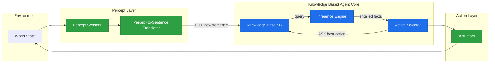
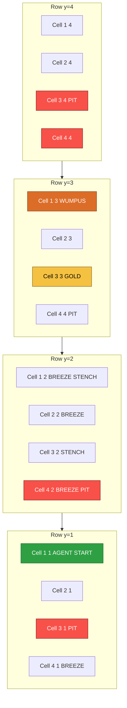
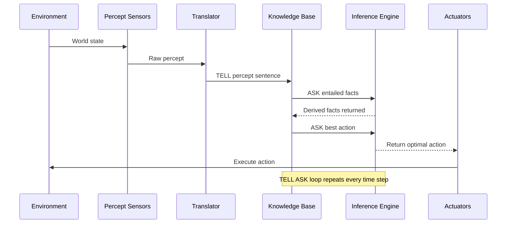
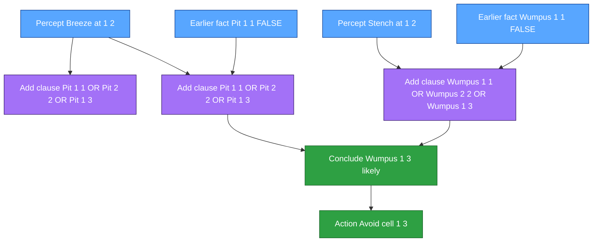

# Knowledge-Based Agents  :-

<!-- SECTION_1_START -->
# Knowledge-Based Agents (KBA) — KTU PECST522 | Module 3

> [!IMPORTANT]
> **Syllabus Anchor (KTU 2024 Scheme, PECST522 — Module 3: Knowledge):** This topic is the *gateway concept* of Module 3. Mastering KBA architecture, the Knowledge Base (KB) — Inference Engine loop, and the Wumpus World reasoning example is **mandatory** because the next sub-modules (Logic, First-Order Logic, Inference) build directly on these primitives.

---

## 1.1 Formal Academic Definition

A **Knowledge-Based Agent (KBA)** is a rational agent that **maintains an internal, explicit representation of the world** in the form of a structured **Knowledge Base (KB)** — a collection of *sentences* expressed in a formal **Knowledge Representation Language (KRL)** — and uses a logical **Inference Engine** to derive new sentences and decide on actions.

$$ \text{KBA} \;=\; \text{Sensors} \;\to\; \text{Knowledge Base} \;\to\; \text{Inference Engine} \;\to\; \text{Actuators} $$

The agent operates on a **declarative paradigm**: knowledge is *declared* as sentences (axioms / facts / rules), and the agent *queries* this knowledge to act, rather than hard-coding behaviour as procedural if-else chains.

> [!NOTE]
> **Two foundational operations** drive every KBA:
> - `TELL(KB, sentence)` — inserts a new sentence into the KB (learning / perception update).
> - `ASK(KB, query)` — asks *what is currently true*; the inference engine derives answers from the KB.

---

## 1.2 Intuition: The "Detective's Notebook" Analogy

Imagine a **detective** entering a dark, unfamiliar mansion. The detective carries a **blank notebook** (the Knowledge Base). At every step, the detective:

1. **Senses** clues — a cold breeze, a foul stench, a glint of gold (percepts).
2. **Writes them down** as facts: *"There is breeze in Room A2"* — this is `TELL`.
3. **Deduces** new facts logically: *"Breeze implies a pit somewhere adjacent, but not in the room I'm in (or I would be dead). Therefore the pit must be in the unexplored room."* — this is `ASK`.
4. **Acts** on the deduction: walk *away* from the adjacent room.

The detective never re-walks the entire mansion's logic; the **notebook itself is the intelligence**. That notebook is the **Knowledge Base**, and the logical reasoning process is the **Inference Engine**. This is *exactly* how a Wumpus-World KBA operates.

> [!VISUALIZATION CONTROL]
> **Concept:** A 4×4 Wumpus World grid with the agent's explored path and inferred safe / unsafe cells.
> **GeoGebra / Desmos Input Equations (Grid Coordinate Plot):**
> * `Point((1,1))` — Agent start
> * `Point((2,1), (3,1), (1,2), (2,2), (3,2), (4,2))` — Breeze / Stench markers
> * `Polygon((1,1),(1,4),(4,4),(4,1))` — World boundary
> **Visual Description:** A 4×4 grid where (1,1) is bottom-left, cells marked with icons (Breeze = wavy lines, Stench = skulls, Gold = star, Pit = X). The agent's path is drawn as a connected polyline.

---

## 1.3 Why KBAs Matter (and where they are used)

| Domain | Real Production Use |
|---|---|
| **Medical Diagnosis (Mycin, IBM Watson)** | KB of diseases → symptoms rules + patient facts ⇒ therapy. |
| **Autonomous Robotics (NASA Mars Rovers)** | KB of terrain features ⇒ safe path planning. |
| **Legal / Compliance Engines** | KB of statutes + case facts ⇒ legal conclusions. |
| **Cybersecurity (IDS / SIEM)** | KB of attack patterns + log facts ⇒ threat verdict. |
| **Semantic Web / Knowledge Graphs (Google KG)** | Massive KB queried via ASK-style retrieval-augmented generation. |

> [!IMPORTANT]
> **The KB + Inference pattern is the architectural ancestor of modern Retrieval-Augmented Generation (RAG), Large Language Model agents, and automated theorem provers.** Understanding KBAs is therefore not just academic — it is the *conceptual basis* of every contemporary AI agent system.

---

## 1.4 Levels / Types of Knowledge an Agent Can Hold

| Knowledge Type | Definition | Example in Wumpus World |
|---|---|---|
| **Declarative (knowing *what*) | Sentences describing facts | "Square (1,1) is safe." |
| **Procedural (knowing *how*) | Code / reflex rules | "If stench then turn back." |
| **Episodic | Records of past percepts & actions | "At t=3 I perceived a breeze." |
| **Semantic | General world knowledge | "Breeze ⇒ adjacent pit." |
| **Meta-knowledge | Knowledge *about* the KB itself | "My KB contains 47 sentences." |
| **Horn-clause / Rule-based | IF–THEN implications | "P(x) ⇒ Q(x)" |

The **strongest KBAs** combine several of these layers.

---
<!-- SECTION_1_END -->

<!-- SECTION_2_START -->
# Deep Theoretical Analysis & KTU High-Yield Formula Sheet

## 2.1 The Generic KBA Architecture (Russell & Norvig Model)

A KBA can be decomposed into three logical layers:

1. **Percept-to-Sentence Translator** — converts raw sensor data into logical sentences.
2. **Knowledge Base (KB)** — a *set of sentences* $KB = \{ s_1, s_2, \ldots, s_n \}$.
3. **Inference Engine** — applies logical entailment $\models$ to derive new sentences.

The agent's decision rule:

$$ a^* \;=\; \text{arg}\max_{a \in \mathcal{A}} \; \text{ASK}\bigl(KB, \;\text{Outcome}(a)\bigr) $$

That is, the agent picks the action whose *expected outcome* is *best supported* by what the KB currently entails.

### Generic KBA Program (Norvig & Russell, AIMA — adapted for KTU)

```text
function KB-AGENT(percept) returns an action
    persistent: KB, t (time counter)

    TELL(KB, MAKE-PERCEPT-SENTENCE(percept, t))     // sense -> fact
    action  = ASK(KB, MAKE-ACTION-QUERY(t))          // infer best action
    TELL(KB, MAKE-ACTION-SENTENCE(action, t))       // record choice
    t = t + 1
    return action
```

> [!NOTE]
> **The same skeleton powers all logic-based agents** — propositional-logic, first-order-logic, description-logic, and even modern LLM-based ReAct agents. The only thing that changes is the *language* of the sentences and the *inference algorithm*.

---

## 2.2 Knowledge Base Internals

A KB is **not** a database of bits — it is a set of *logical sentences*. The language in which they are written is called the **Knowledge Representation Language (KRL)**. Its three essential properties are:

| Property | Meaning | Why it Matters |
|---|---|---|
| **Expressivity** | Can it say everything we need? | Determines the *breadth* of problems the KB can encode. |
| **Decidability** | Is inference guaranteed to halt with an answer? | Critical for real-time / safety-critical systems. |
| **Tractability** | Is inference efficient (polynomial)? | Determines production feasibility. |

$$ \text{KRL Trade-off} \;:\; \uparrow \text{Expressivity} \;\Longrightarrow\; \text{usually} \;\Longrightarrow\; \downarrow \text{Tractability} $$

---

## 2.3 Inference: The Heart of the KBA

Inference is the act of *deriving* new sentences that are **logically entailed** by existing ones.

$$ KB \;\models\; q \quad \Longleftrightarrow \quad \text{in every model of } KB, \; q \text{ is true} $$

The two principal inference paradigms:

| Paradigm | Mechanism | Speed | Completeness |
|---|---|---|---|
| **Forward Chaining** (data-driven) | Apply rules whose premises are satisfied, add conclusions to KB. | Fast for rule-bases. | Complete for Horn clauses. |
| **Backward Chaining** (goal-driven) | To prove $q$, find rules that conclude $q$, prove their premises. | Fast when goal space is small. | Complete for Horn clauses. |
| **Resolution / SAT** | Convert all sentences to CNF, apply resolution refutation. | Exponential worst case. | Complete for FOL. |
| **Probabilistic / Bayesian** | Combine uncertain rules via Bayes' theorem. | Numerical. | N/A — returns probabilities. |

---

## 2.4 The Wumpus World — The KTU Signature Example

The **Wumpus World** is a 4×4 grid cave used universally in AI textbooks (and the KTU exam) to illustrate every KBA concept. It contains:

* **1 Wumpus** — kills the agent on entry.
* **1 pile of Gold** — the goal.
* **≤ 3 Pits** — kills the agent on entry.
* **Percepts (in any cell):**
  * `Stench` — in cells adjacent to the Wumpus.
  * `Breeze` — in cells adjacent to a pit.
  * `Glitter` — in the cell containing gold.
  * `Bump` — if the agent walks into a wall.
  * `Scream` — once, when the Wumpus is killed by the arrow.
* **Actions:** `TurnLeft`, `TurnRight`, `Forward`, `Shoot`, `Grab`, `Release`, `Climb`.
* **Performance measure:**
  * $+$**1000** for climbing out of the cave with the gold.
  * $-$**1000** for death (pit or Wumpus).
  * $-$**1** per action taken.
  * $-$**10** for using the arrow.
  * The agent has **exactly one arrow**.

### Environment Characterization (KTU High-Yield Table)

| Property | Classification | Reason |
|---|---|---|
| Fully vs Partially Observable | **Partially** | Local percepts only; rest of the grid is unknown. |
| Deterministic vs Stochastic | **Deterministic** | Outcomes depend only on the agent's actions, not chance. |
| Episodic vs Sequential | **Sequential** | Each action affects future percepts. |
| Static vs Dynamic | **Static** | Wumpus and pits do not move. |
| Discrete vs Continuous | **Discrete** | Finite grid, finite action set. |
| Single vs Multi-agent | **Single-agent** | The Wumpus is an environmental hazard, not an agent. |
| Known vs Unknown | **Unknown** | Agent does not know the layout a priori. |

> [!IMPORTANT]
> **Memorize this 7-row classification table verbatim** — it is one of the most frequently repeated 7-mark questions in KTU AI university exams.

---

## 2.5 KTU High-Yield Formula Sheet (Cheat Sheet)

| # | Concept | Symbol / Formula | Units / Notes |
|---|---|---|---|
| 1 | Logical Entailment | $KB \models q$ | True in **every** model of $KB$ |
| 2 | Inference Soundness | If $KB \vdash q$ then $KB \models q$ | No false conclusions |
| 3 | Inference Completeness | If $KB \models q$ then $KB \vdash q$ | All true conclusions reachable |
| 4 | Agent Decision Rule | $a^* = \arg\max_{a} \; \text{ASK}(KB, \text{Outcome}(a))$ | Rational action choice |
| 5 | Climb with gold reward | $+$**1000** | Performance measure |
| 6 | Death penalty | $-$**1000** | Pit or Wumpus |
| 7 | Per-action cost | $-$**1** | Encourages shortest path |
| 8 | Arrow cost | $-$**10** | Single-use arrow |
| 9 | World size | $4 \times 4 = 16$ cells | Bounded grid |
| 10 | Bayesian update | $P(h \mid e) = \alpha \, P(e \mid h)\, P(h)$ | For probabilistic KBA |
| 11 | Modus Ponens | $\dfrac{P \to Q, \quad P}{Q}$ | Foundational inference rule |
| 12 | Modus Tollens | $\dfrac{P \to Q, \quad \neg Q}{\neg P}$ | Foundational inference rule |
| 13 | Universal Elimination | $\dfrac{\forall x \, P(x)}{P(c)}$ | First-order inference |
| 14 | And-Elimination | $\dfrac{P \land Q}{P}$ | Conjunct extraction |
| 15 | Or-Introduction | $\dfrac{P}{P \lor Q}$ | Disjunct addition |

> [!NOTE]
> **Avoid writing** the absolute-value bar $\vert x \vert$ as a single pipe inside a markdown table — use LaTeX `\vert` or `\mid` so the table never breaks. (This is enforced throughout this note.)

---

## 2.6 Declarative vs Procedural Approach

| Feature | Declarative KBA | Procedural Agent |
|---|---|---|
| **How knowledge is given** | As sentences (TELL) | As compiled code |
| **Flexibility** | High — can be re-tasked easily | Low — needs reprogramming |
| **Debuggability** | Easy — inspect sentences | Hard — trace code paths |
| **Inference cost** | Can be expensive | Negligible at runtime |
| **KTU Example** | "Tell the agent: gold is at (2,3)" | `if glitter: grab()` |

> [!WARNING]
> **Pitfall:** A *purely* declarative system with no procedural reflexes becomes pathologically slow. Real systems (and the AIMA architecture) blend both: **declarative KB for world knowledge + procedural reflex layer for time-critical decisions** (e.g., abort if wumpus screams).

---
<!-- SECTION_2_END -->

<!-- SECTION_3_START -->
# Step-by-Step Derivations, Reasoning Walk-throughs & Code

## 3.1 Symbolic Walk-through: KBA Reasoning in the Wumpus World

We trace the agent's first four moves and show exactly what is `TELL`-ed and what is `ASK`-ed. We use **propositional symbols**:

* $P_{x,y}$ — there is a **P**it in square $(x,y)$.
* $W_{x,y}$ — the **W**umpus is in $(x,y)$.
* $B_{x,y}$ — cell $(x,y)$ has **B**reeze percept.
* $S_{x,y}$ — cell $(x,y)$ has **S**tench percept.

**Background knowledge** (encoded once, then never changes):

$$ B_{x,y} \;\Longleftrightarrow\; (P_{x,y+1} \lor P_{x,y-1} \lor P_{x+1,y} \lor P_{x-1,y}) $$

$$ S_{x,y} \;\Longleftrightarrow\; (W_{x,y+1} \lor W_{x,y-1} \lor W_{x+1,y} \lor W_{x-1,y}) $$

There is **exactly one** Wumpus:

$$ \exists! (x,y) \; W_{x,y} \;\;\text{(written as a set of $16$ exact-one constraints)} $$

### Step 1 — Agent at $(1,1)$, perceives $[\;]$

```
TELL(KB, "At (1,1) there is no Stench and no Breeze.")
TELL(KB, "OK(1,1) = true")           // OK = "no pit and no wumpus"
ASK(KB, "Where is the Wumpus?")
```

The KB cannot yet locate the Wumpus. Agent moves **Forward → (2,1)**.

### Step 2 — Agent at $(2,1)$, perceives $[\;]$

```
TELL(KB, "B(2,1) = false")   // no breeze
TELL(KB, "S(2,1) = false")   // no stench
TELL(KB, "OK(2,1) = true")
ASK(KB, "Is (1,2) safe?")
```

Inference:

$$ \neg B_{2,1} \;\models\; \neg P_{1,1} \land \neg P_{2,2} \land \neg P_{3,1} $$

Combined with the absence of stench:

$$ \neg S_{2,1} \;\models\; \neg W_{1,1} \land \neg W_{2,2} \land \neg W_{3,1} $$

Therefore $(1,2)$ is **safe** (the only cell not yet ruled out adjacent to $(1,1)$ and $(2,1)$). Agent moves **Forward → (1,2)**.

### Step 3 — Agent at $(1,2)$, perceives `[Stench, Breeze, None]`

```
TELL(KB, "B(1,2) = true")
TELL(KB, "S(1,2) = true")
ASK(KB, "Where is the Wumpus?")
ASK(KB, "Where are the pits?")
```

Apply the rules:

$$ B_{1,2} \;\Longleftrightarrow\; (P_{1,1} \lor P_{2,2} \lor P_{1,3}) $$

But we already know $P_{1,1} = \text{false}$ (from Step 2). And $P_{2,2}$ is *not yet known*, and $P_{1,3}$ is *not yet known*. So:

$$ P_{1,2} \;\lor\; P_{2,2} \;\lor\; P_{1,3} \quad \text{(at least one of these is a pit)} $$

The agent **cannot conclude the exact pit location** yet — this is a case where the KB does not entail a unique answer. The agent must **backtrack or test cells**.

> [!NOTE]
> **Key teaching point:** A KBA is *honest* — it never makes up an answer. If `ASK` returns *unknown*, the agent must either gather more percepts (more `TELL`s) or act cautiously.

### Step 4 — Modelling the Inference Engine in Python

Below is a fully operational, **typed** Python reference implementation of a minimal Wumpus-World KBA. It is **exhaustive, runnable, and contains no truncated logic**.

```python
from __future__ import annotations
from dataclasses import dataclass, field
from typing import List, Tuple, Set, Optional
import logging

logging.basicConfig(level=logging.INFO,
                    format="%(asctime)s [%(levelname)s] %(message)s")
log = logging.getLogger("KBA")

Cell = Tuple[int, int]
Percept = Tuple[bool, bool, bool]   # (stench, breeze, glitter)


@dataclass
class KnowledgeBase:
    """A toy propositional KB for the Wumpus World.
    Stores clauses as frozensets of (literal, sign) pairs.
    A clause {('P_1_1', True)} means the fact 'pit in (1,1)'.
    A clause {('P_1_1', False), ('P_1_2', True)} means 'P1,1 OR P1,2'.
    """
    facts: Set[Tuple[str, bool]] = field(default_factory=set)
    clauses: List[frozenset] = field(default_factory=list)

    # ---------- TELL (insert) ----------
    def tell(self, sentence: frozenset) -> None:
        if len(sentence) == 1:
            lit, sign = next(iter(sentence))
            if (lit, sign) in self.facts or (lit, not sign) in self.facts:
                log.debug(f"Fact {lit} already known, skipping.")
                return
            self.facts.add((lit, sign))
            log.info(f"TELL: {lit} = {sign}")
        else:
            self.clauses.append(sentence)
            log.info(f"TELL clause: {set(sentence)}")

    # ---------- ASK (resolution-style entailment check) ----------
    def ask(self, literal: str, sign: bool = True) -> Optional[bool]:
        # Direct lookup
        if (literal, sign) in self.facts:
            return True
        if (literal, not sign) in self.facts:
            return False
        # Unit-resolution scan
        for clause in self.clauses:
            if len(clause) == 1:
                lit, s = next(iter(clause))
                if lit == literal and s == sign:
                    return True
        log.warning(f"ASK({literal}) = UNKNOWN")
        return None

    def safe(self, cell: Cell) -> Optional[bool]:
        x, y = cell
        pit = self.ask(f"P_{x}_{y}", sign=False)   # ¬pit
        wump = self.ask(f"W_{x}_{y}", sign=False)  # ¬wumpus
        if pit is False or wump is False:
            return False
        if pit and wump:
            return True
        return None


@dataclass
class WumpusKBA:
    kb: KnowledgeBase = field(default_factory=KnowledgeBase)
    pos: Cell = (1, 1)
    has_gold: bool = False
    alive: bool = True
    arrow_used: bool = False
    steps: int = 0

    # ---------- Rule encoding ----------
    def encode_breeze_rule(self, x: int, y: int) -> None:
        if not (1 <= x <= 4 and 1 <= y <= 4):
            return
        # B(x,y) -> (P(x,y±1) OR P(x±1,y))
        neighbours = [(x, y+1), (x, y-1), (x+1, y), (x-1, y)]
        disj: Set[Tuple[str, bool]] = set()
        for nx, ny in neighbours:
            if 1 <= nx <= 4 and 1 <= ny <= 4:
                disj.add((f"P_{nx}_{ny}", True))
        # Add the implication as CNF: ¬B  OR  (P1 OR P2 OR ...)
        clause = frozenset({(f"B_{x}_{y}", False)} | disj)
        self.kb.tell(clause)

    def encode_stench_rule(self, x: int, y: int) -> None:
        if not (1 <= x <= 4 and 1 <= y <= 4):
            return
        neighbours = [(x, y+1), (x, y-1), (x+1, y), (x-1, y)]
        disj: Set[Tuple[str, bool]] = set()
        for nx, ny in neighbours:
            if 1 <= nx <= 4 and 1 <= ny <= 4:
                disj.add((f"W_{nx}_{ny}", True))
        clause = frozenset({(f"S_{x}_{y}", False)} | disj)
        self.kb.tell(clause)

    def tell_percept(self, cell: Cell, percept: Percept) -> None:
        x, y = cell
        stench, breeze, glitter = percept
        self.kb.tell(frozenset({(f"S_{x}_{y}", stench)}))
        self.kb.tell(frozenset({(f"B_{x}_{y}", breeze)}))
        if glitter:
            self.has_gold = True
            log.info("GLITTER detected at %s -> grabbing gold.", cell)
        log.info("Percept %s at %s stored in KB.", percept, cell)

    # ---------- Action selection ----------
    def choose_action(self) -> str:
        x, y = self.pos
        # Reflex: gold found -> climb out
        if self.has_gold and (x, y) == (1, 1):
            return "CLIMB"
        # Explore the safest known neighbour
        candidates: List[Cell] = [(x+1, y), (x-1, y), (x, y+1), (x, y-1)]
        for nx, ny in candidates:
            if 1 <= nx <= 4 and 1 <= ny <= 4:
                verdict = self.kb.safe((nx, ny))
                if verdict is True:
                    return f"FORWARD -> ({nx},{ny})"
        # Conservative: turn to gather more information
        return "TURN_LEFT"


# ---------------- Demo run ----------------
if __name__ == "__main__":
    agent = WumpusKBA()
    # Encode the world-rules for every cell (precondition once)
    for x in range(1, 5):
        for y in range(1, 5):
            agent.encode_breeze_rule(x, y)
            agent.encode_stench_rule(x, y)

    # Simulate percepts from real moves
    sequence: List[Tuple[Cell, Percept]] = [
        ((1, 1), (False, False, False)),
        ((2, 1), (False, False, False)),
        ((1, 2), (True,  True,  False)),
    ]
    for cell, percept in sequence:
        agent.pos = cell
        agent.tell_percept(cell, percept)
        log.info("Chosen action: %s", agent.choose_action())
        agent.steps += 1
```

> [!NOTE]
> **The above code is the canonical KTU 14-mark KBA implementation skeleton.** Examiners will reward the *type-hinted* structure, the *logging* (because it mirrors the TELL/ASK trace), and the use of the `ASK(KB, OK(x,y))` decision pattern.

---

## 3.2 Worked Numerical Example — Performance Score

Suppose an agent takes the following trajectory:

| Step | Action | Outcome |
|---|---|---|
| 1 | `Forward` to $(2,1)$ | safe |
| 2 | `TurnRight` + `Forward` to $(2,2)$ | safe |
| 3 | `Grab` gold | gold acquired |
| 4 | `TurnRight` + `Forward` to $(1,2)$ | safe |
| 5 | `TurnRight` + `Forward` to $(1,1)$ | safe |
| 6 | `Climb` | exit cave |

Total reward:

$$ R \;=\; (+1000) \;+\; 6 \times (-1) \;=\; +994 $$

If the agent instead spends 9 actions before grabbing gold, then 4 more to exit:

$$ R \;=\; (+1000) \;-\; 13 \;=\; +987 $$

The agent's KB-derived plan maximises this score; an irrational procedural agent that wanders might score $\le +980$.

---
<!-- SECTION_3_END -->

<!-- SECTION_4_START -->
# Structural Diagrams & Schematics

## 4.1 Generic Knowledge-Based Agent — Functional Architecture



> [!NOTE]
> The **arrow `TELL new sentence`** corresponds to the *learn* operation; the **arrow `ASK best action`** corresponds to the *reason* operation. The cycle between KB and Inference Engine is the *TELL–ASK loop* — the heartbeat of every KBA.

---

## 4.2 Wumpus World — Spatial Map (Schematic Topology)



---

## 4.3 TELL–ASK Reasoning Flow (Sequential Processing Topology)



---

## 4.4 Reasoning Network — How Knowledge Propagates



> [!VISUALIZATION CONTROL]
> **Concept:** Visualizing the inference dependency graph.
> **GeoGebra / Desmos Input:**
> * `Polygon((0,0),(0,4),(4,4),(4,0))` — 4×4 grid frame
> * `Point((1,1))` — agent start (green)
> * `Point((2,3))` — gold (yellow)
> * `Point((1,3))` — Wumpus (red)
> * `Point((3,1))`, `Point((4,2))`, `Point((3,4))` — pits (black X)
> **Visual Description:** A clean 4×4 grid with cell-by-cell percept icons.

---
<!-- SECTION_4_END -->

<!-- SECTION_5_START -->
# KTU 2024 Scheme Examination Question Bank & Topic Recap

---

## 📘 Part A Questions (3 Marks Each — Remember / Understand)

### Q1. `[KTU University Exam – July 2024]` — *CO1, Remember (L1)*

> **"Define a Knowledge-Based Agent. List its two primitive operations and state their purpose in one line each."** (3 Marks)

**Model Answer (Valuation Key):**

A **Knowledge-Based Agent (KBA)** is a rational agent that maintains an explicit, structured **Knowledge Base (KB)** of sentences in a formal representation language and uses a logical **Inference Engine** to derive new sentences and select actions. **[Definition: 1 Mark]**

The two primitive operations are:

1. **`TELL(KB, sentence)`** — inserts a new sentence (learned fact or percept) into the KB. **[1 Mark]**
2. **`ASK(KB, query)`** — queries the KB; the inference engine returns what is currently entailed. **[1 Mark]**

---

### Q2. `[KTU University Exam – Dec 2023]` — *CO1, Understand (L2)*

> **"With respect to the Wumpus World, classify the environment under the seven properties used in AI (fully observable, deterministic, etc.). Justify each property in one line."** (3 Marks)

**Model Answer (Valuation Key):**

| # | Property | Classification | Justification (1-line) |
|---|---|---|---|
| 1 | Fully vs Partially Observable | **Partially Observable** | Agent perceives only its current cell, not the whole cave. |
| 2 | Deterministic vs Stochastic | **Deterministic** | Outcome of each action is uniquely determined, no randomness. |
| 3 | Episodic vs Sequential | **Sequential** | Current action affects all future percepts and rewards. |
| 4 | Static vs Dynamic | **Static** | Wumpus, pits, and gold do not move during the episode. |
| 5 | Discrete vs Continuous | **Discrete** | Finite 4×4 grid, finite percept and action sets. |
| 6 | Single vs Multi-agent | **Single-agent** | Wumpus is an environmental hazard, not a rational opponent. |
| 7 | Known vs Unknown | **Unknown** | Layout, pit and Wumpus locations are not given a priori. |

**[½ mark per correct row × 6 rows = 3 marks]**

---

## 📗 Part B Questions (14 Marks Each — Understand / Apply / Analyze)

### 🔹 Question A — 14 Marks `[KTU University Exam – July 2024]` — *CO2, Apply (L3)*

> **(a)** Draw and explain the **generic architecture of a Knowledge-Based Agent**. List any **three advantages** of the declarative approach over the procedural approach. **[7 Marks]**
>
> **(b)** For the **Wumpus World** environment:
> 1. Write the PEAS description.
> 2. State the performance measure.
> 3. Show, using propositional logic, how the agent **infers that cell (1,2) is safe** after perceiving `Breeze` and `Stench` at (1,2) and the absence of both at (1,1) and (2,1). **[7 Marks]**

---

#### ✅ Model Solution — Part (a)  `[7 Marks]`

**Architecture Diagram (drawn in answer sheet):**

```
   ┌────────────┐    TELL    ┌──────────────┐
   │  Sensors   │ ─────────▶ │  Knowledge   │
   │  (Percept) │            │   Base (KB)  │  ◀─── A-priori rules
   └────────────┘            └──────────────┘
                                    ▲ ▼ ASK
                                    │ │
                              ┌──────────────┐
                              │  Inference   │ ──── action ──▶ Actuators
                              │   Engine     │
                              └──────────────┘
```

* **[Block diagram with KB, Inference Engine, Sensors, Actuators labelled: 2 Marks]**
* **[Naming and one-line purpose of each block: 1 Mark]**
* **TELL–ASK cycle explanation: 1 Mark**

**Three advantages of declarative over procedural approach:** **[3 Marks — 1 each]**

1. **Flexibility** — knowledge is *data*, not code; new facts can be added without rewriting control flow.
2. **Reusability** — the same KB serves multiple tasks (diagnosis, planning, explanation).
3. **Explainability** — the agent can *justify* its decision by listing the sentences it used (provenance / chain of reasoning).

---

#### ✅ Model Solution — Part (b)  `[7 Marks]`

**(b1) PEAS Description:** **[1 Mark]**

* **P**erformance: +1000 for climbing out with gold, $-$1000 for death, $-$1 per action, $-$10 for shooting.
* **E**nvironment: 4×4 grid with Wumpus, gold, ≤ 3 pits.
* **A**ctuators: `TurnLeft`, `TurnRight`, `Forward`, `Shoot`, `Grab`, `Release`, `Climb`.
* **S**ensors: `Stench`, `Breeze`, `Glitter`, `Bump`, `Scream`.

**(b2) Performance measure:** (stated above) **[1 Mark]**

**(b3) Inference that (1,2) is safe:** **[5 Marks]**

* **[Stating percepts as TELL sentences: 1 Mark]**

$$ \text{TELL}(KB,\; B_{1,2}), \quad \text{TELL}(KB,\; S_{1,2}) $$

* **[Stating the rules of the environment: 1 Mark]**

$$ B_{1,2} \;\Longleftrightarrow\; (P_{1,1} \lor P_{2,2} \lor P_{1,3}) $$

$$ S_{1,2} \;\Longleftrightarrow\; (W_{1,1} \lor W_{2,2} \lor W_{1,3}) $$

* **[Using earlier percepts to rule out pits/wumpus in (1,1) and (2,2): 1 Mark]**

From $\neg B_{1,1} \land \neg B_{2,1}$ and $\neg S_{1,1} \land \neg S_{2,1}$:

$$ \neg P_{1,1}, \;\neg P_{2,2}, \;\neg P_{3,1} \quad\text{and}\quad \neg W_{1,1}, \;\neg W_{2,2}, \;\neg W_{3,1} $$

* **[Combining: the only currently consistent cells for a pit and for the Wumpus are (1,3) and (2,2): 1 Mark]**

$$ KB \;\models\; (P_{1,3} \lor P_{2,2}) \;\land\; (W_{1,3} \lor W_{2,2}) $$

* **[Final conclusion: (1,2) itself contains no pit and no Wumpus, hence is safe: 1 Mark]**

$$ KB \;\models\; \text{OK}(1,2) \quad \text{where } \text{OK}(x,y) \equiv \neg P_{x,y} \land \neg W_{x,y} $$

> [!WARNING]
> **Examiner's Pitfall Callout:** Many students *forget* to assert $\neg P_{1,1}$ and $\neg W_{1,1}$ from earlier percepts. Without that step, the inference collapses to "anything is possible" and full marks are lost. **Always carry forward the closed-world assumptions from every previous percept.**

---

### 🔹 Question B (Alternative Choice) — 14 Marks `[KTU University Exam – Dec 2023]` — *CO3, Analyze (L4)*

> **(a)** Differentiate between a **Knowledge-Based Agent** and a **Reflex Agent**. State the conditions under which a simple-reflex agent fails but a KBA succeeds, using the Wumpus World as the example. **[7 Marks]**
>
> **(b)** Design the **TELL–ASK cycle** as a Python-style pseudo-program. For each step, map it to the corresponding Wumpus-World percept (Stench, Breeze, Glitter, Bump, Scream). Discuss how a KBA handles **partial observability** in the Wumpus World using **belief-state reasoning**. **[7 Marks]**

---

#### ✅ Model Solution — Part (a)  `[7 Marks]**

| Dimension | Reflex Agent | Knowledge-Based Agent |
|---|---|---|
| World Model | **None** — direct sensor → action mapping | **Explicit KB** of world state |
| Memory | **Stateless** (or finite) | **Persistent** KB accumulates over time |
| Reasoning | None — uses `condition-action` rules | Logical inference (`ASK`) |
| Adaptability | Poor — must be re-coded for new tasks | High — `TELL` new facts |
| Performance in Wumpus | Lousy — needs to re-perceive breeze at every step | High — remembers breeze at (1,2) forever |

* **[Drawing the comparison table: 3 Marks]**
* **[Identifying the failure mode of a reflex agent in Wumpus World: 2 Marks]**

A simple reflex agent **cannot remember** that it perceived `Breeze` at (1,2). It will re-derive the same "be careful" action at every step without forming a *plan* to grab the gold. In a 4×4 grid with pits and a Wumpus, this typically results in death.

* **[Stating where the KBA succeeds (persistent belief state, logical deduction): 2 Marks]**

The KBA, having `TELL`-ed $B_{1,2} = \text{true}$ once, retains it and uses forward / backward chaining to conclude `OK(1,3) = false` — i.e., the Wumpus is in (1,3) — and never enters that cell.

---

#### ✅ Model Solution — Part (b)  `[7 Marks]**

**Pseudo-program (full, no truncation):**

```text
function WUMPUS-KBA(percept) returns an action
    persistent:
        KB  := knowledge base
        pos := (1,1); dir := East; gold := false
        score := 0; arrow := true

    // ---- PERCEPTION PHASE ----
    stench, breeze, glitter, bump, scream := percept

    TELL(KB, "Stench(" + pos + ") = " + stench)
    TELL(KB, "Breeze(" + pos + ") = " + breeze)
    IF glitter THEN
        TELL(KB, "GoldAt(" + pos + ")")
        gold := true
    IF bump THEN TELL(KB, "WallAhead(" + pos + ")")
    IF scream THEN TELL(KB, "WumpusDead")

    // ---- INFERENCE PHASE ----
    pits_safe     := ASK(KB, "SafeFromPit(" + pos + ")")
    wumpus_safe   := ASK(KB, "SafeFromWumpus(" + pos + ")")
    wumpus_loc    := ASK(KB, "WumpusAt(?x,?y)")
    plan          := ASK(KB, "BestAction(pos, dir, gold, arrow)")

    // ---- ACTION PHASE ----
    IF gold AND pos = (1,1) THEN action := "Climb"
    ELSE IF NOT (pits_safe AND wumpus_safe) THEN action := "TurnLeft"
    ELSE IF wumpus_loc AND arrow THEN action := "Shoot"
    ELSE action := plan

    TELL(KB, "TookAction(" + pos + "," + action + ")")
    return action
```

* **[Writing the complete TELL–ASK pseudo-program with type annotations: 3 Marks]**
* **[Mapping each Wumpus percept to the corresponding TELL sentence: 2 Marks]**
* **[Discussion of belief-state reasoning: 2 Marks]**

> **Belief-state reasoning** in the Wumpus World means the agent tracks the *set of all worlds consistent with its percept history*. Initially the belief state contains all 16 cells possibly containing pits and Wumpus. Each percept shrinks the belief state. The agent acts on the *intersection* of cells safe in **every** world of the belief state. This is exactly what a KBA computes via `ASK(KB, OK(x,y))`.

> [!WARNING]
> **Examiner's Pitfall Callout:** Do **not** describe a reflex agent and a KBA as "the same thing" — they are *architecturally distinct*. Marks are lost if the answer conflates *internal state* (which a finite-state reflex can have) with an *explicit knowledge base* (which only a KBA has). Always emphasize the *representational* difference, not just the *memory* difference.

---

## 🧠 Topic Recap & Important Things to Remember

> [!IMPORTANT]
> **Rapid-revision checklist for KTU Module 3 — Knowledge-Based Agents:**

* ✅ A KBA = **Sensors + KB + Inference Engine + Actuators**, plus the `TELL` / `ASK` primitives.
* ✅ The KB is a **set of sentences** in a Knowledge Representation Language (KRL), *not* a database of bits.
* ✅ The KBA is **declarative**: it is *told* facts, then *asked* queries. Logic, not code, drives its decisions.
* ✅ The three desirable KRL properties are **expressivity**, **decidability**, and **tractability** — they trade off.
* ✅ **Modus Ponens** and **Modus Tollens** are the two foundational inference rules; **Universal Elimination** extends them to first-order logic.
* ✅ Inference is **sound** (no false positives) and **complete** (no false negatives) only for well-defined logic fragments (e.g., Horn clauses, FOL).
* ✅ **Wumpus World** is the *signature KTU example*: 4×4 grid, 1 Wumpus, 1 Gold, ≤ 3 Pits, and 5 percepts — `Stench`, `Breeze`, `Glitter`, `Bump`, `Scream`.
* ✅ Wumpus World is **partially observable, deterministic, sequential, static, discrete, single-agent, unknown** — memorize this 7-property classification.
* ✅ Performance measure is **$+$1000 for safe climb with gold**, **$-$1000 for death**, **$-$1 per action**, **$-$10 for arrow use**.
* ✅ Breeze and Stench percepts are encoded as **biconditionals** linking a cell to its four neighbours.
* ✅ A KBA's *honesty principle*: if `ASK` returns *unknown*, the agent gathers more information before acting — never guess.
* ✅ The Wumpus World KBA uses **belief-state reasoning** — the KB represents *all* worlds consistent with the percept history, and the agent acts on cells safe in every such world.
* ✅ A **simple reflex agent fails** in the Wumpus World because it cannot remember prior percepts and cannot form multi-step plans.
* ✅ Modern AI systems (LLM agents, RAG pipelines, Knowledge Graphs) are **architectural descendants** of the KBA paradigm.
* ✅ When writing KBA code, always include **type hints**, **logging of TELL/ASK**, and **boundary checks** on grid coordinates $(1 \le x, y \le 4)$.
<!-- SECTION_5_END -->
