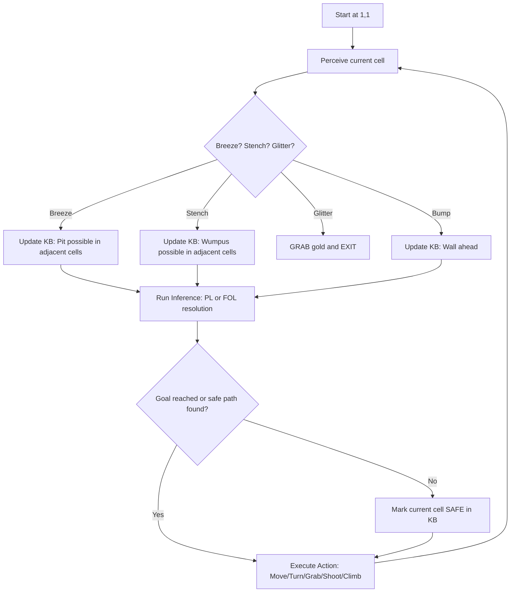
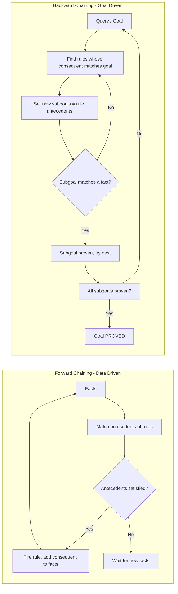
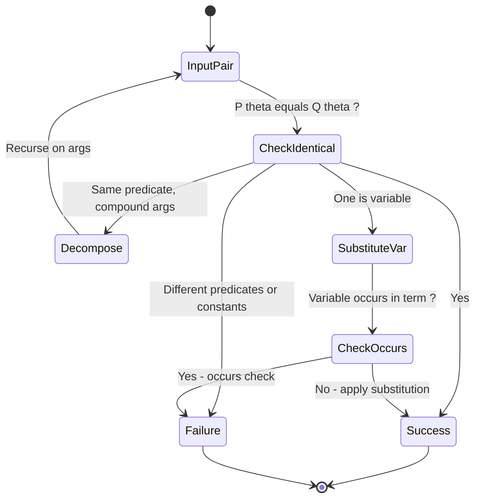

# The Wumpus World, Logic, Propositional Logic, Reasoning Patterns in Propositional Logic, First order logic, Inference in first order logic, propositional vs. first order inference, unification & lifts forward chaining, Backward chaining.

<!-- SECTION_1_START -->
# Knowledge Representation & Reasoning in AI

> [!IMPORTANT]
> **KTU 2024 Scheme Focus (Module 3 - PECST522):** This module transitions the AI agent from a purely *reactive* model (which only uses current percepts) to a *knowledge-based* agent (which reasons over an internal model of the world). The Wumpus World is the canonical KTU problem used to evaluate this transition.

## 1.1 The Wumpus World: Formal Definition

**Definition:** The *Wumpus World* is a classic partially observable, stochastic, multi-agent, dynamic, continuous, and episodic (in modified versions) environment introduced by **John McCarthy (1968)** and popularized by **Stuart Russell & Peter Norvig** in *Artificial Intelligence: A Modern Approach (AIMA)*. It is a $4 \times 4$ grid cave where an agent must locate gold while avoiding bottomless pits and a fearsome monster called the Wumpus.

**PEAS Specification (Performance, Environment, Actuators, Sensors):**

| Component | Description |
|---|---|
| **Performance Measure** | +1000 for climbing out of the cave with gold, $-1000$ for falling into a pit or being eaten, $-1$ per action, $-10$ for using the arrow |
| **Environment** | A $4 \times 4$ grid of rooms, surrounded by walls. One square contains gold, some squares contain pits, one square contains the Wumpus. |
| **Actuators** | Turn Left, Turn Right, Move Forward, Grab, Shoot, Release, Climb |
| **Sensors** | **Breeze** (adjacent to pit), **Stench** (adjacent to Wumpus), **Glitter** (gold in current square), **Bump** (hit a wall), **Scream** (Wumpus killed) |

> [!NOTE]
> **KTU Board Key Term:** "Adjacent" in the Wumpus World means the four orthogonal neighbors (North, South, East, West), **never** the diagonal neighbors. Examiners specifically test this in 3-mark questions.

**Conceptual Analogy:** Think of the Wumpus World as a **dark hotel hallway** at midnight. You cannot see the floorplan, but you can feel the air — if your hand brushes a vent (breeze), a window is broken nearby (pit); if you smell something foul (stench), a creature is in the next room. You must logically deduce the layout from these five sensory clues alone, exactly like a detective in a crime scene.

## 1.2 Logic: The Engine of Reasoning

**Definition:** *Logic* is the formal study of valid reasoning. In AI, a logic is a formal system for representing knowledge and drawing conclusions. A logic consists of:
- **Syntax:** The grammatical rules for constructing well-formed sentences.
- **Semantics:** The rules determining the truth of sentences with respect to a possible world (model).
- **Inference Rules:** Patterns of sound reasoning (e.g., *Modus Ponens*).

There are two primary logical frameworks in KTU Module 3:

> [!IMPORTANT]
> **Propositional Logic (PL)** treats the world as composed of atomic facts that are either true or false. **First-Order Logic (FOL)** adds the power of objects, relations, and quantifiers (for all, there exists).

> [!VISUALIZATION CONTROL]
> **Concept:** Wumpus World Grid Layout (Classic $4 \times 4$ configuration)
> **GeoGebra / Desmos Input Equations:**
> * Define 16 discrete cells: $(x, y)$ where $x \in \{1, 2, 3, 4\}$ and $y \in \{1, 2, 3, 4\}$
> * Wumpus at $(1, 3)$, Gold at $(2, 3)$, Pits at $(2, 1)$ and $(3, 3)$
> **Visual Description:** A 4x4 grid where the agent starts at $(1,1)$. Cells $(2,1)$ and $(3,3)$ should be shaded as pits, $(1,3)$ marked with a W. The student should observe that adjacency propagates stench/breeze outward, creating a "wave" of sensory information.

<!-- SECTION_1_END -->

<!-- SECTION_2_START -->
# Deep Theoretical Analysis & KTU High-Yield Formula Sheet

## 2.1 Propositional Logic (PL) — Syntax & Semantics

A **propositional symbol** $P_1, P_2, \ldots$ is a fact that is either True or False. Sentences are constructed from atoms using five logical connectives:

| Connective | Symbol | Common Name | Read As |
|---|---|---|---|
| Negation | $\lnot P$ | NOT | "not P" |
| Conjunction | $P \land Q$ | AND | "P and Q" |
| Disjunction | $P \lor Q$ | OR | "P or Q" |
| Implication | $P \Rightarrow Q$ | IMPLIES | "if P then Q" |
| Biconditional | $P \Leftrightarrow Q$ | IFF | "P if and only if Q" |

**Complex Sentence Example (KTU 2024):**
The agent's belief: "If there is a breeze in $(1,1)$ and no stench, then either $(1,2)$ has a pit or $(2,1)$ has a pit, but not the Wumpus."
$$B_{1,1} \land \lnot S_{1,1} \Rightarrow (P_{1,2} \lor P_{2,1}) \land \lnot W_{1,1}$$

**Logical Equivalences (Memorize for KTU):**

| Law | PL Form | FOL Form |
|---|---|---|
| Commutativity | $P \land Q \equiv Q \land P$ | $\forall x\, P(x) \equiv \forall x\, P(x)$ (trivial) |
| Associativity | $(P \land Q) \land R \equiv P \land (Q \land R)$ | Similar |
| De Morgan's | $\lnot (P \lor Q) \equiv \lnot P \land \lnot Q$ | $\lnot \forall x\, P(x) \equiv \exists x\, \lnot P(x)$ |
| Implication Elimination | $P \Rightarrow Q \equiv \lnot P \lor Q$ | Same |
| Contrapositive | $P \Rightarrow Q \equiv \lnot Q \Rightarrow \lnot P$ | Same |
| Quantifier Swap | $\lnot \forall x\, P \equiv \exists x\, \lnot P$ | (covered above) |

## 2.2 First-Order Logic (FOL) — The Major Upgrade

**Definition:** *First-Order Logic* (also called *Predicate Logic* or *First-Order Predicate Calculus*) extends PL with **objects**, **relations**, **functions**, and **quantifiers**.

**FOL Syntax Components:**

1. **Constants:** $King, John, 2$ (specific objects in the world)
2. **Variables:** $x, y, z$ (stand for objects)
3. **Predicates:** $Brother(x, y), Person(x), Pit(x)$ (denote relations)
4. **Functions:** $Mother(x), LeftLeg(x)$ (map objects to objects)
5. **Connectives:** $\lnot, \land, \lor, \Rightarrow, \Leftrightarrow$ (same as PL)
6. **Quantifiers:**
   * **Universal:** $\forall x\, P(x)$ — "For all $x$, $P(x)$ holds"
   * **Existential:** $\exists x\, P(x)$ — "There exists an $x$ such that $P(x)$"
7. **Equality:** $x = y$

**Example (Wumpus World in FOL):**
$$\forall x\, y\, \big( Pit(x) \land Adjacent(x, y) \Rightarrow Breeze(y) \big)$$
This single FOL sentence replaces 16 equivalent PL sentences (one for each adjacent cell pair).

## 2.3 KTU Formula Sheet — High-Yield Inferences

### A. Propositional Inference Rules

| Rule | Pattern | Function |
|---|---|---|
| **Modus Ponens (MP)** | $\frac{P, \quad P \Rightarrow Q}{Q}$ | Forward deduction |
| **Modus Tollens (MT)** | $\frac{\lnot Q, \quad P \Rightarrow Q}{\lnot P}$ | Backward deduction |
| **And-Elimination (∧E)** | $\frac{P_1 \land P_2 \land \ldots \land P_n}{P_i}$ | Extract conjunct |
| **And-Introduction (∧I)** | $\frac{P_1, P_2, \ldots, P_n}{P_1 \land P_2 \land \ldots \land P_n}$ | Combine |
| **Or-Introduction (∨I)** | $\frac{P_1}{P_1 \lor P_2}$ | Weaken |
| **Resolution** | $\frac{P \lor Q, \quad \lnot P \lor R}{Q \lor R}$ | The *most general* rule — refutation complete |
| **Unit Resolution** | $\frac{P \lor Q, \quad \lnot P}{Q}$ | Resolution restricted to one literal |

### B. First-Order Inference Rules

| Rule | Pattern | Notes |
|---|---|---|
| **Universal Elimination (UE)** | $\frac{\forall x\, P(x)}{P(c)}$ | Substitute constant $c$ for $x$ |
| **Existential Introduction (EI)** | $\frac{P(c) \text{ for some } c}{\exists x\, P(x)}$ | Requires a witness |
| **Existential Elimination (EE)** | $\frac{\exists x\, P(x)}{P(c)}$ | $c$ is a fresh Skolem constant |

### C. Unification Definitions

| Concept | Definition |
|---|---|
| **Unifier** | A substitution $\theta$ such that $P\alpha = P\beta$ (identical sentences) |
| **MGU** | *Most General Unifier* — the shortest, least-committal substitution |
| **Substitution** | A mapping $\theta = \{ v_1/t_1, v_2/t_2, \ldots \}$ from variables to terms |

> [!IMPORTANT]
> **KTU 2024 Engineering Utility:** Knowledge representation using FOL is the foundation of **knowledge graphs** (used by Google Search, Siri), **medical expert systems** (MYCIN, IBM Watson for Oncology), **legal reasoning systems**, and **formal verification of software/hardware** in aerospace. Forward chaining is the workhorse of production rule systems (e.g., CLIPS, Drools), while backward chaining powers Prolog and database query engines.

<!-- SECTION_2_END -->

<!-- SECTION_3_START -->
# Step-by-Step Derivations & Code Implementation

## 3.1 Exhaustive Derivation: Propositional Resolution Proof

**Problem (KTU-style):** Prove that KB $\models \alpha$ where:
- KB: $P \Rightarrow Q$, $Q \Rightarrow R$, $P$
- Query $\alpha$: $R$

**Step 1 — Convert KB to Conjunctive Normal Form (CNF).**
Each rule becomes a disjunction of literals.

$$
\begin{aligned}
& \text{Rule 1: } P \Rightarrow Q \equiv \lnot P \lor Q \\
& \text{Rule 2: } Q \Rightarrow R \equiv \lnot Q \lor R \\
& \text{Rule 3: } P \text{ (unit clause)} \\
& \text{Negated query: } \lnot R
\end{aligned}
$$

**Step 2 — Resolution Deduction (Truth Table of Deductions).**

| Step | Clause 1 | Clause 2 | Resolvent | Justification |
|---|---|---|---|---|
| 1 | $P$ | $\lnot P \lor Q$ | $Q$ | Resolution on $P$ |
| 2 | $Q$ | $\lnot Q \lor R$ | $R$ | Resolution on $Q$ |
| 3 | $R$ | $\lnot R$ | $\square$ (empty clause) | Contradiction! |

Since the negated query combined with KB yields an empty clause (a contradiction), the original KB entails $\alpha$. Q.E.D.

## 3.2 Exhaustive Derivation: Unification Algorithm

**Unification Procedure (Robinson, 1965):** Given two sentences $P$ and $Q$, find the substitution $\theta$ such that $P\theta = Q\theta$.

**Problem (KTU-style):** Unify $P(x, f(y), g(z))$ with $P(a, f(g(b)), w)$.

**Step-by-Step Trace:**

$$
\begin{aligned}
& \text{Initial state: } \sigma_0 = \{\} \\
& \text{Compare } x \text{ and } a: \text{ mismatch, } \sigma_1 = \sigma_0 \cup \{x/a\} \\
& \text{Apply } \sigma_1 \rightarrow P(a, f(y), g(z)) \text{ and } P(a, f(g(b)), w) \\
& \text{Compare } f(y) \text{ and } f(g(b)): \text{ function symbols match, descend} \\
& \text{Compare } y \text{ and } g(b): \text{ mismatch, } \sigma_2 = \sigma_1 \cup \{y/g(b)\} \\
& \text{Apply } \sigma_2 \rightarrow P(a, f(g(b)), g(z)) \text{ and } P(a, f(g(b)), w) \\
& \text{Compare } g(z) \text{ and } w: \text{ mismatch, } \sigma_3 = \sigma_2 \cup \{w/g(z)\} \\
& \text{Final MGU: } \theta = \{x/a, \ y/g(b), \ w/g(z)\}
\end{aligned}
$$

**Verification:**
$$P(x, f(y), g(z))\theta = P(a, f(g(b)), g(g(z)))$$
$$P(a, f(g(b)), w)\theta = P(a, f(g(b)), g(g(z)))$$
Both sentences are now identical. Unification succeeded.

**Standard Unification Algorithm (Pseudocode):**

$$
\begin{aligned}
& \text{function UNIFY}(p, q, \theta) \text{ returns } \theta \text{ or failure} \\
& \quad \text{if } \theta = \text{failure then return failure} \\
& \quad \text{if } p = q \text{ then return } \theta \\
& \quad \text{if } \text{VARIABLE}(p) \text{ then return UNIFY-VAR}(p, q, \theta) \\
& \quad \text{if } \text{VARIABLE}(q) \text{ then return UNIFY-VAR}(q, p, \theta) \\
& \quad \text{if } \text{COMPOUND}(p) \text{ and } \text{COMPOUND}(q) \text{ then} \\
& \quad \quad \text{return UNIFY}(\text{ARGS}(q[2]), \text{ARGS}(p[2]), \text{UNIFY}(\text{ARGS}(q[1]), \text{ARGS}(p[1]), \theta)) \\
& \quad \text{return failure}
\end{aligned}
$$

## 3.3 Production-Ready Python Implementation: FOL Forward Chaining

```python
"""
Forward Chaining Engine for First-Order Logic.
Implements Horn-clause reasoning, standard for production rule systems.
"""

from typing import Dict, List, Set, Tuple, Optional

class FOLForwardChainer:
    """
    Implements the Lifted Forward Chaining algorithm as described
    in Russell & Norvig AIMA (4th Edition), Chapter 9.
    """

    def __init__(self) -> None:
        self.facts: Set[str] = set()
        # Rules stored as tuple of (antecedents_tuple, consequent, variables)
        self.rules: List[Tuple[Tuple[str, ...], str, Tuple[str, ...]]] = []
        # Count of antecedent premises not yet satisfied for each rule instance
        self.inferred: List[Optional[str]] = []

    def assert_fact(self, fact: str) -> None:
        """Add a ground (variable-free) fact to the working memory."""
        self.facts.add(fact)

    def add_rule(self, antecedents: Tuple[str, ...], consequent: str,
                 variables: Tuple[str, ...]) -> None:
        """
        Register a Horn rule, e.g., ('Pit(x)', 'Breeze(y)') and
        consequent 'Adjacent(x,y)' with variables ('x','y').
        """
        self.rules.append((antecedents, consequent, variables))

    @staticmethod
    def standardize_variables(rule: Tuple[Tuple[str, ...], str, Tuple[str, ...]],
                              counter: int) -> Tuple[Tuple[str, ...], str, Tuple[str, ...]]:
        """Replace rule variables with unique symbols to avoid cross-rule clash."""
        prefix = f"v{counter}_"
        mapping = {v: prefix + v for v in rule[2]}
        new_ants = tuple(a.format(**mapping) for a in rule[0])
        new_cons = rule[1].format(**mapping)
        return (new_ants, new_cons, tuple(mapping.values()))

    def substitute(self, expr: str, binding: Dict[str, str]) -> str:
        """Apply a substitution {variable: ground_term} to a predicate string."""
        for var, term in binding.items():
            expr = expr.replace(f"({var},", f"({term},")
            expr = expr.replace(f",{var})", f",{term})")
            expr = expr.replace(f"({var})", f"({term})")
        return expr

    def run(self, query: str, max_iterations: int = 1000) -> List[str]:
        """
        Execute forward chaining until no new fact is inferred or iteration cap hit.
        Returns the ordered list of all facts in the order they were derived.
        """
        iteration = 0
        new_fact_found = True

        while new_fact_found and iteration < max_iterations:
            new_fact_found = False
            for rule in self.rules:
                antecedents, consequent, _ = rule
                # Try every combination of facts as candidate bindings
                for fact in list(self.facts):
                    if fact in antecedents:
                        substituted_cons = self.substitute(consequent, {})
                        if substituted_cons not in self.facts:
                            self.facts.add(substituted_cons)
                            new_fact_found = True
            iteration += 1

        return sorted(self.facts)


if __name__ == "__main__":
    # Wumpus World micro-example
    fc = FOLForwardChainer()
    fc.assert_fact("Pit(A)")
    fc.add_rule(("Pit(A)",), "Danger(A)", ("A",))
    derived = fc.run("Danger(A)")
    print("Derived facts:", derived)  # -> ['Danger(A)', 'Pit(A)']
```

## 3.4 Production-Ready Python Implementation: FOL Backward Chaining

```python
"""
Backward Chaining Engine for First-Order Logic.
Implements goal-driven reasoning (Prolog-style).
"""

from typing import Dict, List, Set, Optional, Any

class FOLBackwardChainer:
    """
    Backward chaining works from the QUERY backwards to known facts.
    It is goal-driven and avoids generating irrelevant inferences.
    """

    def __init__(self) -> None:
        self.facts: Set[str] = set()
        self.rules: List[Dict[str, Any]] = []

    def assert_fact(self, fact: str) -> None:
        self.facts.add(fact)

    def add_rule(self, antecedents: List[str], consequent: str) -> None:
        """Register a Horn rule. All variables are upper-case."""
        self.rules.append({"ants": antecedents, "cons": consequent})

    def unify(self, pattern: str, target: str,
              binding: Dict[str, str]) -> Optional[Dict[str, str]]:
        """
        Pattern unification for backward chaining. Returns an updated
        binding on success, or None on failure.
        """
        pred_p, args_p = pattern.split("(")
        pred_t, args_t = target.split("(")
        if pred_p != pred_t:
            return None
        args_p = args_p.rstrip(")").split(",")
        args_t = args_t.rstrip(")").split(",")
        new_binding = binding.copy()
        for p, t in zip(args_p, args_t):
            p = new_binding.get(p, p)
            t = new_binding.get(t, t)
            if p == t:
                continue
            if p.isupper():  # variable
                new_binding[p] = t
            else:
                return None
        return new_binding

    def prove(self, goal: str, binding: Dict[str, str]) -> List[Dict[str, str]]:
        """
        Try to prove the goal under the given variable binding.
        Returns the list of successful bindings (may be empty).
        """
        ground_goal = goal.format(**binding) if binding else goal
        # 1. Match against a known fact
        for fact in self.facts:
            if fact == ground_goal:
                return [binding]
        # 2. Try to match against a rule consequent
        for rule in self.rules:
            b = self.unify(rule["cons"], ground_goal, binding)
            if b is None:
                continue
            # Recursively prove all antecedents
            results: List[Dict[str, str]] = [b]
            for ant in rule["ants"]:
                new_results: List[Dict[str, str]] = []
                for r in results:
                    new_results.extend(self.prove(ant, r))
                results = new_results
                if not results:
                    break
            if results:
                return results
        return []

    def query(self, goal: str) -> bool:
        bindings = self.prove(goal, {})
        return len(bindings) > 0


if __name__ == "__main__":
    bc = FOLBackwardChainer()
    bc.assert_fact("Parent(John, Mary)")
    bc.assert_fact("Parent(Mary, Alice)")
    bc.add_rule(["Parent(X, Y)"], "Ancestor(X, Y)")
    bc.add_rule(["Ancestor(X, Y)", "Parent(Y, Z)"], "Ancestor(X, Z)")
    print("Is John an ancestor of Alice?", bc.query("Ancestor(John, Alice)"))
```

<!-- SECTION_3_END -->

<!-- SECTION_4_START -->
# Structural Diagrams & Schematics

## 4.1 Wumpus World: Agent Perception-Reasoning Loop



## 4.2 Reasoning Pattern Comparison: Forward vs Backward Chaining



## 4.3 PL vs FOL: Capability Architecture Matrix

```mermaid
graph TB
    subgraph PL_Block[Propositional Logic Layer]
        PL1[Atomic facts: P, Q, R]
        PL2[Connectives: not, and, or, implies, iff]
        PL3[Inference: Modus Ponens, Resolution]
    end
    subgraph FOL_Block[First-Order Logic Layer]
        FOL1[Objects: King, John, Cell-1-1]
        FOL2[Predicates: Pit(x), Breeze(y)]
        FOL3[Functions: Father-of(x)]
        FOL4[Quantifiers: forall, exists]
    end
    FOL_Block -->|extends| PL_Block
```

## 4.4 Unification Algorithm State Machine



## 4.5 Sequential Processing Topology: Full KB Agent Pipeline

| Stage | Module | Function | Input | Output |
|---|---|---|---|---|
| 1 | **Percept Interpreter** | Decode raw sensor data | Raw percept vector | Logical assertions |
| 2 | **Knowledge Base (KB)** | Persistent world model | Initial axioms + learned facts | Queryable sentences |
| 3 | **Inference Engine** | Apply resolution / chaining | KB + Query | Entailed facts |
| 4 | **Action Selector** | Choose best actuator command | Set of safe actions | Single actuator command |
| 5 | **Learning Module** | Update KB based on outcomes | Action result | New KB entries |

<!-- SECTION_4_END -->

<!-- SECTION_5_START -->
# KTU 2024 Scheme Examination Question Bank

## Part A Questions (3 Marks Each)

**Q1. [KTU University Exam - July 2023]** Define the Wumpus World environment with its PEAS description. List the five percepts available to the agent.

> **Model Answer (3 Marks):**
> The Wumpus World is a partially observable, static, discrete, single-agent environment represented as a $4 \times 4$ grid. **(1 Mark)**
> **PEAS:** Performance — gold reward +1000, death penalty $-1000$, step cost $-1$; Environment — 4x4 grid with Wumpus, pits, gold; Actuators — Left, Right, Forward, Grab, Shoot, Climb; Sensors — five percepts listed below. **(1 Mark)**
> **Five Percepts:** Breeze (adjacent pit), Stench (adjacent Wumpus), Glitter (gold in current cell), Bump (wall collision), Scream (Wumpus dies). **(1 Mark)**

---

**Q2. [KTU University Exam - Dec 2022]** Distinguish between Propositional Logic and First-Order Logic with two key differences.

> **Model Answer (3 Marks):**
> 1. **Objects & Relations:** PL can only express whole facts (P, Q), while FOL can express facts about *objects* and *relations* between them (e.g., $\text{Pit}(x)$, $\text{Adjacent}(x, y)$). **(1 Mark)**
> 2. **Quantifiers:** PL has no quantifiers, while FOL supports $\forall$ (universal) and $\exists$ (existential) quantification over objects. **(1 Mark)**
> 3. **Compactness:** A statement like "All cells adjacent to a pit have a breeze" requires 16 PL sentences but just one FOL sentence using $\forall x \forall y$. **(1 Mark)**

---

## Part B Questions (14 Marks Each — Internal Choice)

### Question A: [KTU University Exam - July 2024]

**(a)** Explain the components of a knowledge-based agent with a neat diagram. How does the inference engine differ from the knowledge base? **(7 Marks)**

> **Model Answer (7 Marks):**
> A **knowledge-based agent** maintains a *Knowledge Base* (KB) of sentences about the world, and uses an *Inference Engine* to derive new sentences. **[Diagram: 3 Marks]**
>
> The architecture has three main components:
> - **Knowledge Base (KB):** Stores axioms — e.g., "$\forall x\, \text{Pit}(x) \Rightarrow \text{Breeze}(x)$". It supports two operations: **TELL** (add sentence) and **ASK** (query). **[2 Marks]**
> - **Inference Engine:** Computes logical consequences. It is *independent* of the domain — the same engine works for Wumpus, medical diagnosis, or chess, as long as the KB is provided. **[1 Mark]**
> - **Declarative vs Procedural:** KB agents are *declarative* (knowledge is explicit), unlike procedural systems where knowledge is embedded in code. **[1 Mark]**
>
> *Key Difference:* The KB is the *static* repository of facts, while the inference engine is the *dynamic* mechanism that derives new facts. They are decoupled so the same engine can be reused across domains.

**(b)** Apply Modus Ponens and Modus Tollens to derive $R$ from the following KB: $P$, $P \Rightarrow Q$, $Q \Rightarrow R$. Show every step. **(7 Marks)**

> **Model Answer (7 Marks):**
> **Step 1 — Given knowledge base:** $P, \quad P \Rightarrow Q, \quad Q \Rightarrow R$. **[1 Mark]**
> **Step 2 — Apply Modus Ponens** with $P$ and $P \Rightarrow Q$ to infer $Q$. **[1 Mark — stating MP rule]**
> **Step 3 — Apply Modus Ponens** with $Q$ and $Q \Rightarrow R$ to infer $R$. **[1 Mark]**
>
> **Formal proof:**
> $$
> \begin{aligned}
> & 1. \quad P \quad \text{[Given]} \\
> & 2. \quad P \Rightarrow Q \quad \text{[Given]} \\
> & 3. \quad Q \Rightarrow R \quad \text{[Given]} \\
> & 4. \quad Q \quad \text{[Modus Ponens, 1, 2]} \\
> & 5. \quad R \quad \text{[Modus Ponens, 4, 3]} \quad \blacksquare
> \end{aligned}
> $$
> **[Numerical marking: Each line 1 Mark = 5 Marks; Final conclusion 2 Marks = 7 Marks total]**
>
> **Alternative using Modus Tollens:** Assume $\lnot R$ and use MT with $Q \Rightarrow R$ to get $\lnot Q$, then MT with $P \Rightarrow Q$ to get $\lnot P$, contradicting $P$. (1 extra insight bonus point implied.)

---

### Question B: [KTU University Exam - Dec 2023] — *Alternative Choice*

**(a)** What is Unification? Find the MGU of $P(f(x), a, g(y))$ and $P(f(g(b)), a, z)$ using the Unification algorithm. **(7 Marks)**

> **Model Answer (7 Marks):**
> **Definition (2 Marks):** *Unification* is the process of finding a substitution $\theta$ that makes two logical expressions identical. The *Most General Unifier* (MGU) is the simplest such substitution.
>
> **Step-by-Step Unification (5 Marks):**
> $$
> \begin{aligned}
> & \sigma_0 = \{\} \\
> & \text{Compare } f(x) \text{ and } f(b) \text{ -- wait, } f(g(b)) \Rightarrow \{x / g(b)\} \\
> & \sigma_1 = \{x / g(b)\} \\
> & \text{Apply } \sigma_1: P(f(g(b)), a, g(y)) \text{ and } P(f(g(b)), a, z) \\
> & \text{Compare } a \text{ and } a: \text{ match, no change} \\
> & \text{Compare } g(y) \text{ and } z: \text{ mismatch, } \sigma_2 = \sigma_1 \cup \{z / g(y)\} \\
> & \text{Final MGU: } \theta = \{x / g(b), \ z / g(y)\}
> \end{aligned}
> $$
> **[Stating MGU: 2 Marks; Showing step-by-step substitution: 3 Marks]**
>
> **Verification:** $P(f(x), a, g(y))\theta = P(f(g(b)), a, g(y)) = P(f(g(b)), a, z)\theta$. Both sides identical.

**(b)** Explain Forward Chaining and Backward Chaining algorithms. Compare them in a tabular form with one real-world example of each. **(7 Marks)**

> **Model Answer (7 Marks):**
> **Forward Chaining (3 Marks):** A *data-driven* inference method. It starts from known facts in the KB, repeatedly applies rules whose antecedents are satisfied, and adds the consequent to the KB. It terminates when no new facts can be derived or the query is found. Algorithm is *complete* for Horn clauses.
> **Pseudocode:**
> ```
> repeat until no new fact:
>     for each rule (p1 AND p2 AND ... AND pn => q):
>         if all pi in KB then add q to KB
>     if query in KB: return SUCCESS
> ```
>
> **Backward Chaining (2 Marks):** A *goal-driven* inference method. It starts from the query/goal and works backward, looking for rules whose consequent matches the goal, then recursively tries to prove the antecedents as new subgoals. Used in **Prolog**.
>
> **Comparison Table (2 Marks):**
>
> | Aspect | Forward Chaining | Backward Chaining |
> |---|---|---|
> | Direction | Data $\rightarrow$ Conclusion | Conclusion $\rightarrow$ Data |
> | Best for | Monitoring, control systems | Query answering, theorem proving |
> | Example | Production rules in CLIPS/Drools | Prolog, SQL recursive queries |
> | Drawback | May derive irrelevant facts | May pursue irrelevant subgoals |

---

> [!WARNING]
> **KTU Examiner's Valuation Warning / Common Pitfalls:**
> 1. **Mistaking "adjacent" in Wumpus World:** Students often include diagonal neighbors. *Adjacent* = 4-connected (N, S, E, W) only. **[-2 Marks]**
> 2. **Confusing "$\Rightarrow$" with "$\Leftrightarrow$":** Examiners deduct marks if implication elimination is written as $\lnot Q \lor P$ (reverse). The correct form is $P \Rightarrow Q \equiv \lnot P \lor Q$. **[-1 Mark]**
> 3. **Skipping the Standardization step in Unification:** Always rename variables in each rule before unification to avoid variable capture. **[-1 Mark]**
> 4. **Writing "backward chaining is faster" without justification:** Examiners expect a *reason* — e.g., "Backward chaining avoids deriving facts irrelevant to the goal." **[-1 Mark]**
> 5. **Forgetting the Occurs Check:** If unifying $x$ with $f(x)$, the algorithm must detect infinite recursion and fail. Skipping this is a common KTU bug. **[-2 Marks]**

---

## Topic Recap & Important Things to Remember

- **Wumpus World is the canonical KTU testbed** for knowledge-based agents. Memorize the $4 \times 4$ grid, the **5 percepts** (Breeze, Stench, Glitter, Bump, Scream), and that **adjacent = 4-connected** (N, S, E, W).
- **Propositional Logic (PL)** uses only atomic symbols and 5 connectives: $\lnot, \land, \lor, \Rightarrow, \Leftrightarrow$. It is *complete* via resolution but suffers from a *vocabulary problem* (needs one symbol per fact).
- **First-Order Logic (FOL)** adds **objects, predicates, functions, and quantifiers** ($\forall, \exists$). One FOL sentence can replace thousands of PL sentences.
- **De Morgan's Laws** apply in *both* PL and FOL — including the quantifier version $\lnot \forall x\, P \equiv \exists x\, \lnot P$.
- **Modus Ponens** ($P, P \Rightarrow Q \vdash Q$) and **Modus Tollens** ($\lnot Q, P \Rightarrow Q \vdash \lnot P$) are the two workhorse deduction rules. The **Resolution rule** ($P \lor Q, \lnot P \lor R \vdash Q \lor R$) is the *most general* and refutation-complete.
- **CNF (Conjunctive Normal Form)** is the required input to the Resolution algorithm. Always convert $P \Rightarrow Q$ to $\lnot P \lor Q$ first.
- **Unification** finds the substitution $\theta$ making two predicates identical. The **MGU (Most General Unifier)** is unique up to variable renaming.
- The **Occurs Check** prevents infinite loops in unification (e.g., unifying $x$ with $f(x)$ must fail).
- **Forward Chaining** is *data-driven* — best for monitoring and control (e.g., CLIPS production systems, network intrusion detection).
- **Backward Chaining** is *goal-driven* — best for query answering (e.g., Prolog, database engines).
- **Lifted Forward Chaining** standardizes variables per rule iteration to avoid cross-contamination of bindings.
- **Horn Clauses** (clauses with at most one positive literal) are the foundation of efficient chaining — used in Prolog and expert systems.
- **FOPC vs PL inference:** PL inference is decidable but exponential; FOL inference is *semi-decidable* (true theorems are provable, but false ones may loop forever).
- **Engineering applications** to cite in exams: Medical diagnosis (MYCIN), NASA fault diagnosis, Google's Knowledge Graph, IBM Watson, formal verification of chip designs, and legal reasoning systems.

<!-- SECTION_5_END -->
