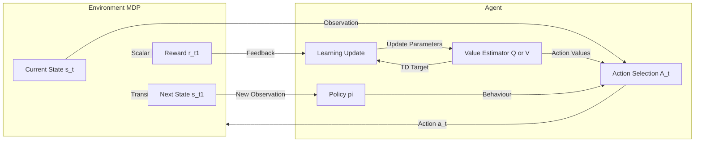
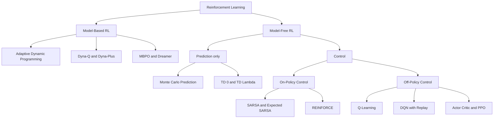
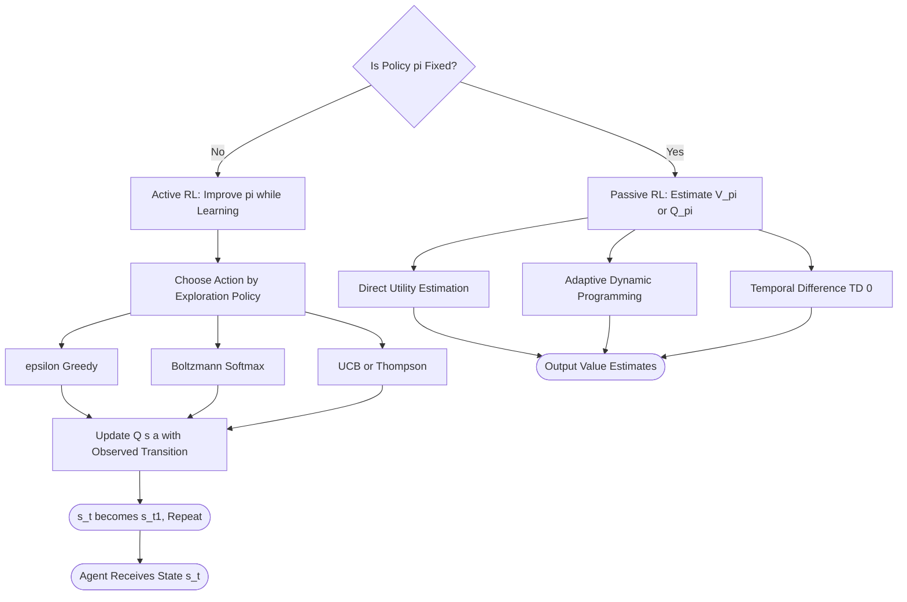
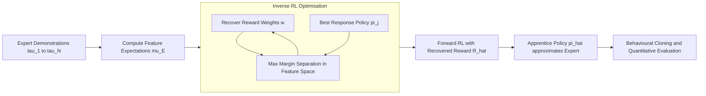
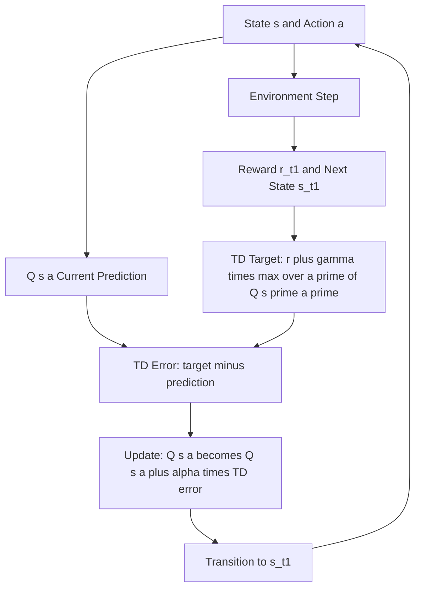
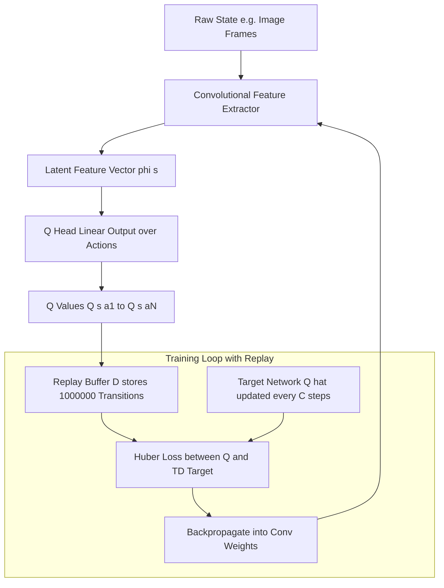

# Learning from Rewards, Passive Reinforcement Learning, Active Reinforcement Learning, Generalization in Reinforcement Learning, Policy Search, Apprenticeship and Inverse Reinforcement Learning, Applications of Reinforcement Learning

<!-- SECTION_1_START -->

# Reinforcement Learning — Core Definition and Intuition

## 1.1 Formal Definition (KTU 2024 Syllabus Terminology)

> [!IMPORTANT]
> **Reinforcement Learning (RL)** is a paradigm of **Machine Learning** in which an **intelligent agent** learns an optimal **policy** $\pi$ by interacting with a **stochastic environment** modelled as a **Markov Decision Process (MDP)**, with the explicit goal of maximising the expected **cumulative discounted reward** received over time.

Formally, an RL problem is the tuple $\langle S, A, T, R, \gamma \rangle$ where:

- $S$ — finite (or continuous) **set of states** of the environment.
- $A$ — finite (or continuous) **set of actions** available to the agent.
- $T : S \times A \times S \rightarrow [0,1]$ — **transition function** where $T(s,a,s') = P(s_{t+1}=s' \mid s_t=s, a_t=a)$.
- $R : S \times A \rightarrow \mathbb{R}$ — **reward function** giving expected immediate reward $E[r_{t+1} \mid s_t=s, a_t=a]$.
- $\gamma \in [0,1)$ — **discount factor** controlling the present value of future rewards.

The agent's **behavioural rule** is the policy:
$$\pi : S \rightarrow A \quad \text{or} \quad \pi(a \mid s) \text{ (stochastic form)}$$

The optimisation target is to find:
$$\pi^{*} = \arg\max_{\pi} \; E_{\pi}\!\left[\sum_{t=0}^{\infty} \gamma^{t} r_{t+1}\right]$$

## 1.2 Conceptual Analogy — "The Toddler and the Stove"

Imagine a **toddler** exploring a kitchen. The kitchen is the **environment**; the toddler is the **agent**. The toddler performs **actions** (touching, grabbing, pulling). Each action produces a **state transition** (hand on knob, pan falling, ouch!). The caregiver administers a **reward signal**: a smile (+1) for playing safely, a shout (−10) for touching the hot stove. The toddler has **no supervised dataset** of "correct" actions — she must **try, fail, and remember**.

Key insights the analogy teaches us:

- The reward is **delayed and sparse** (the burn only comes *after* the touch).
- The agent must **balance exploration** (trying the toaster to see what it does) **with exploitation** (using the toy she already knows is fun).
- The optimal policy is **not a single best action** — it is a **mapping from every possible state** to the best action.

> [!NOTE]
> **Syllabus Highlight:** Unlike *supervised learning* (which needs labelled input–output pairs) and *unsupervised learning* (which finds structure without a goal), RL is built around a **scalar reward signal** and **sequential decision-making under uncertainty**.

## 1.3 Core Terminology (KTU Board-Exam Vocabulary)

| Term | Symbol | Plain-English Meaning |
|------|--------|------------------------|
| Agent | — | The decision-maker (e.g. the robot, the algorithm) |
| Environment | — | Everything outside the agent that responds to actions |
| State | $s_t$ | A complete description of the world at time $t$ (Markov property) |
| Action | $a_t$ | The move chosen by the agent at time $t$ |
| Reward | $r_{t+1}$ | Scalar feedback received after taking action $a_t$ in state $s_t$ |
| Return | $G_t$ | Cumulative discounted reward from time $t$ onwards |
| Policy | $\pi$ | The agent's strategy mapping states to actions |
| Value Function | $V^{\pi}(s)$ | Expected return when starting in $s$ and following $\pi$ |
| Q-Function | $Q^{\pi}(s,a)$ | Expected return when taking action $a$ in state $s$, then following $\pi$ |
| Episode | — | A finite trajectory from a start state to a terminal state |
| Model | $M$ | Agent's internal representation of $T$ and $R$ |

> [!TIP]
> **KTU Memory Trick:** *"SARS-A"* — the loop is **S**tate $\rightarrow$ **A**ction $\rightarrow$ **R**eward $\rightarrow$ next **S**tate $\rightarrow$ **A**gain.

## 1.4 GeoGebra / Desmos Visualisation Block

> [!VISUALIZATION CONTROL]
> **Concept:** Reward function as a 1-D landscape over a discrete state space.
>
> **GeoGebra / Desmos Input Equations:**
> * `f(x) = - (x - 3)^2 + 9`  — a "reward hill" centred at $x=3$.
> * `g(x) = 0.5 * sin(2x) + 2` — a noisy variant modelling stochastic rewards.
>
> **Visual Description:** The student should see a parabolic curve whose peak is the **goal state**. A trajectory plot $x_t$ overlaid on the curve (e.g. `x_0 = 0, x_{n+1} = x_n + 0.2 * sign(3 - x_n)`) should illustrate **policy-driven hill-climbing**. The agent "learns" to move rightward because the reward gradient $f'(x) = -2(x-3)$ points toward the peak.

---

<!-- SECTION_1_END -->

<!-- SECTION_2_START -->

# Deep Theoretical Analysis and KTU High-Yield Formula Sheet

## 2.1 The Markov Decision Process (MDP) — Mathematical Backbone

The **Markov property** states that the future is conditionally independent of the past given the present:

$$P(s_{t+1} \mid s_t, a_t, s_{t-1}, a_{t-1}, \ldots, s_0, a_0) = P(s_{t+1} \mid s_t, a_t)$$

This single equation is what allows RL to *scale* — we never need to remember history, only the current state.

> [!NOTE]
> **Why MDPs?** They collapse arbitrarily long histories into a single sufficient statistic $s_t$, making the value function a well-defined real-valued function $V : S \rightarrow \mathbb{R}$.

## 2.2 The Two Fundamental Value Functions

### 2.2.1 State-Value Function $V^{\pi}(s)$

The expected return when starting in state $s$ and then following policy $\pi$:

$$V^{\pi}(s) = E_{\pi}\!\left[\sum_{k=0}^{\infty} \gamma^{k} r_{t+k+1} \,\Big|\, s_t = s\right]$$

### 2.2.2 Action-Value Function $Q^{\pi}(s,a)$

The expected return when taking action $a$ in state $s$ and then following $\pi$:

$$Q^{\pi}(s,a) = E_{\pi}\!\left[\sum_{k=0}^{\infty} \gamma^{k} r_{t+k+1} \,\Big|\, s_t = s,\; a_t = a\right]$$

### 2.2.3 Optimal Functions

The optimal value functions are:

$$V^{*}(s) = \max_{\pi} V^{\pi}(s), \qquad Q^{*}(s,a) = \max_{\pi} Q^{\pi}(s,a)$$

Any policy that is **greedy** w.r.t. $Q^{*}$ is automatically optimal.

## 2.3 The Bellman Equations (The Heart of RL)

### 2.3.1 Bellman Expectation Equation for $V^{\pi}$

$$V^{\pi}(s) = \sum_{a \in A} \pi(a \mid s) \sum_{s' \in S} P(s' \mid s,a)\!\left[R(s,a,s') + \gamma\, V^{\pi}(s')\right]$$

This is a system of $\vert S \vert$ linear equations — solvable in $O(\vert S \vert^{3})$ via Gaussian elimination.

### 2.3.2 Bellman Optimality Equation for $V^{*}$

$$V^{*}(s) = \max_{a \in A} \sum_{s' \in S} P(s' \mid s,a)\!\left[R(s,a,s') + \gamma\, V^{*}(s')\right]$$

Note the $\max$ operator (non-linear) — no closed-form linear solution.

### 2.3.3 Bellman Optimality Equation for $Q^{*}$

$$Q^{*}(s,a) = \sum_{s' \in S} P(s' \mid s,a)\!\left[R(s,a,s') + \gamma \max_{a'} Q^{*}(s',a')\right]$$

## 2.4 KTU High-Yield Formula Sheet (Cheat Sheet)

| # | Formula | Meaning | When to Use |
|---|---------|---------|-------------|
| 1 | $G_t = \sum_{k=0}^{\infty} \gamma^{k} r_{t+k+1}$ | Discounted return | Computing value of a trajectory |
| 2 | $V^{\pi}(s) = \sum_{a}\pi(a\mid s)\sum_{s'}P(s'\mid s,a)[R+\gamma V^{\pi}(s')]$ | Bellman expectation for $V$ | Policy evaluation |
| 3 | $Q^{\pi}(s,a) = \sum_{s'}P(s'\mid s,a)[R+\gamma \sum_{a'}\pi(a'\mid s')Q^{\pi}(s',a')]$ | Bellman expectation for $Q$ | Q-value iteration |
| 4 | $V^{*}(s) = \max_{a}\sum_{s'}P(s'\mid s,a)[R+\gamma V^{*}(s')]$ | Bellman optimality (V) | Value Iteration algorithm |
| 5 | $Q^{*}(s,a) = \sum_{s'}P(s'\mid s,a)[R+\gamma \max_{a'}Q^{*}(s',a')]$ | Bellman optimality (Q) | Q-Learning update target |
| 6 | $Q(s,a) \leftarrow Q(s,a) + \alpha\big[r + \gamma\max_{a'}Q(s',a') - Q(s,a)\big]$ | Q-Learning TD update | Model-free control |
| 7 | $V(s) \leftarrow V(s) + \alpha\big[r + \gamma V(s') - V(s)\big]$ | TD(0) update | Model-free prediction |
| 8 | $\pi^{*}(a\mid s) = 1$ if $a = \arg\max_{a}Q^{*}(s,a)$, else $0$ | Greedy optimal policy | Acting with $Q^{*}$ |
| 9 | $P(s' \mid s,a) = \frac{N(s,a,s')}{N(s,a)}$ | Maximum-likelihood model estimate | Adaptive DP / Dyna |
| 10 | $R(s,a) = \frac{\sum_{i} r_i}{N(s,a)}$ | Sample-average reward estimate | Direct Utility Estimation |
| 11 | $\nabla J(\theta) = E_{\pi_{\theta}}\!\left[\nabla_{\theta}\log\pi_{\theta}(a\mid s)\, Q^{\pi_{\theta}}(s,a)\right]$ | Policy gradient theorem | REINFORCE, Actor-Critic |
| 12 | $H(\pi) = -\sum_{a}\pi(a\mid s)\log\pi(a\mid s)$ | Policy entropy (regulariser) | Maximum-entropy RL |
| 13 | $\mathcal{L}_{\text{IRL}} = \max_{\psi \le 0}\big(\psi - \lambda\,\Vert w\Vert^{2}\big)$ subject to $w^{T}\mu(\pi_{E}) \ge w^{T}\mu(\pi) + \Vert\mu(\pi_{E})-\mu(\pi)\Vert_{2}$ | Max-margin IRL (Abbeel \& Ng) | Apprenticeship learning |
| 14 | $\epsilon_{t} = \min(1, \frac{c}{\sqrt{N_{t}(s)}}$) | Decaying $\epsilon$-greedy schedule | UCB-style exploration |

> [!IMPORTANT]
> **Critical Pitfall to Avoid in KTU Board Exams:** Formulas 2 and 4 look deceptively similar. The *only* difference is the $\max$ operator and the elimination of the policy sum. Examiners *love* testing whether students can articulate this difference.

## 2.5 Engineering and Industry Utility of RL Theory

| Domain | Real-World Deployment | Why RL is Used |
|--------|----------------------|----------------|
| Robotics (Boston Dynamics, DeepMind) | Locomotion, manipulation | Reward-shaped motor control is more sample-efficient than teleoperation |
| Game Playing (AlphaGo, AlphaZero, OpenAI Five) | Go, Chess, Dota 2 | Self-play generates unlimited training data |
| Autonomous Driving (Waymo, Tesla) | Lane-change, merging | Must reason over long horizons with safety constraints |
| Recommender Systems (YouTube, Netflix) | Long-term engagement | Click prediction ignores delayed lifetime value |
| Industrial Control (Google Data Centers) | Cooling optimisation | 40% energy reduction via RL policy |
| Finance (JP Morgan, Two Sigma) | Execution, hedging | Adapt to non-stationary market dynamics |
| LLM Fine-Tuning (RLHF) | ChatGPT, Claude | Aligns model outputs with human preferences |

---

<!-- SECTION_2_END -->

<!-- SECTION_3_START -->

# Step-by-Step Derivations, Algorithms and Code Implementation

## 3.1 Section A — Learning from Rewards (Foundational Setup)

### 3.1.1 The Temporal-Difference (TD) Idea

The core insight of RL is **bootstrapping**: we don't wait until the end of an episode to update our value estimates; we use our *current guess* about the value of the next state to refine our guess about the current state.

**Derivation of the TD(0) target.** Consider the one-step TD return:

$$\hat{G}_t^{(1)} = r_{t+1} + \gamma V(s_{t+1})$$

The Mean-Squared Error between our current estimate $V(s_t)$ and this target is:

$$\mathcal{L}_t = \tfrac{1}{2}\big(V(s_t) - \hat{G}_t^{(1)}\big)^{2}$$

Taking the gradient w.r.t. $V(s_t)$:

$$\frac{\partial \mathcal{L}_t}{\partial V(s_t)} = V(s_t) - \hat{G}_t^{(1)} = V(s_t) - r_{t+1} - \gamma V(s_{t+1})$$

Performing stochastic gradient descent with learning rate $\alpha$:

$$V(s_t) \leftarrow V(s_t) - \alpha\,\frac{\partial \mathcal{L}_t}{\partial V(s_t)} = V(s_t) + \alpha\big[r_{t+1} + \gamma V(s_{t+1}) - V(s_t)\big]$$

This is the **TD(0) update rule** — formula #7 from the cheat sheet.

## 3.2 Section B — Passive Reinforcement Learning (Policy is Fixed)

In *passive* RL, the agent's policy $\pi$ is **given and fixed**. The agent's only job is to **evaluate** $V^{\pi}$ (or $Q^{\pi}$) by observing the rewards and transitions that occur while executing $\pi$.

There are three classical approaches:

### 3.2.1 Approach 1 — Direct Utility Estimation (DUE)

**Idea:** Each state is treated as a regression problem. For every visit to state $s$ in any episode, note the *actual* cumulative return observed from that visit onwards. The estimate $\hat{V}^{\pi}(s)$ is the **sample average** of all such returns.

**Algorithm in plain pseudocode:**

```
Input: fixed policy π, episodes E, discount γ
Initialize V̂(s) = 0 for all s, count N(s) = 0
For each episode:
    Run π from s_0 to terminal; record (s_0, r_1), (s_1, r_2), ...
    For each t = 0, 1, ..., T-1:
        G = Σ_{k=t}^{T-1} γ^{k-t} r_{k+1}     // compute return from time t
        N(s_t) ← N(s_t) + 1
        V̂(s_t) ← V̂(s_t) + (1/N(s_t)) * (G - V̂(s_t))   // incremental mean
```

**Limitations of DUE:**

- It **ignores the Markov property** — it does not use the Bellman equation.
- **High variance**: the return $G$ depends on *all* stochastic outcomes downstream.
- **Slow convergence**: each state is learned *independently*; there is no information sharing between states.

### 3.2.2 Approach 2 — Adaptive Dynamic Programming (ADP)

**Idea:** Estimate the model $P$ and $R$ from data, then **solve the Bellman equations**.

**Step 1 — Model estimation (maximum likelihood):**

$$\hat{P}(s' \mid s, a) = \frac{N(s, a, s')}{N(s, a)}, \qquad \hat{R}(s, a) = \frac{\sum_{i=1}^{N(s,a)} r_i}{N(s, a)}$$

**Step 2 — Policy evaluation by solving the linear Bellman system.** For a fixed deterministic policy $\pi$, the Bellman expectation becomes:

$$V^{\pi}(s) = \hat{R}(s,\pi(s)) + \gamma \sum_{s'} \hat{P}(s' \mid s,\pi(s))\, V^{\pi}(s')$$

Rearranging:

$$V^{\pi}(s) - \gamma \sum_{s'} \hat{P}(s' \mid s,\pi(s)) V^{\pi}(s') = \hat{R}(s,\pi(s))$$

In matrix form (with $V$ as an $\vert S \vert$-vector):

$$\big(I - \gamma \hat{P}^{\pi}\big) V = \hat{R}^{\pi}$$

Solving for $V$:

$$\boxed{\,V = (I - \gamma \hat{P}^{\pi})^{-1} \hat{R}^{\pi}\,}$$

This is the **closed-form policy evaluation** used in classical Dynamic Programming.

**Step 3 — Iterative alternative (used when matrix inversion is too costly).** Apply value-iteration-style updates:

$$V_{k+1}(s) \leftarrow \hat{R}(s,\pi(s)) + \gamma \sum_{s'} \hat{P}(s' \mid s,\pi(s))\, V_k(s')$$

This converges to $V^{\pi}$ for any initial $V_0$.

**Advantages of ADP over DUE:** Exploits the Bellman structure → much **lower variance**, **faster convergence**.

### 3.2.3 Approach 3 — Temporal-Difference Learning (TD)

**Idea:** Combine sampling (like Monte Carlo) with bootstrapping (like DP). Update $V$ after every single step using the observed reward and the *current* estimate of the next state's value.

**TD(0) update:**

$$V(s_t) \leftarrow V(s_t) + \alpha\big[r_{t+1} + \gamma V(s_{t+1}) - V(s_t)\big]$$

The term in brackets is called the **TD error** $\delta_t$:

$$\delta_t = r_{t+1} + \gamma V(s_{t+1}) - V(s_t)$$

> [!IMPORTANT]
> **KTU Concept Question (Likely 7-marker):** "Compare Monte Carlo, DP and TD methods." Expected answer covers:
> - **MC** — needs complete episode, unbiased, high variance, no bootstrapping.
> - **DP** — needs full model, biased (uses estimates), low variance, full bootstrapping.
> - **TD** — needs neither complete episode nor full model, biased, lower variance than MC, single-step bootstrapping.

## 3.3 Section C — Active Reinforcement Learning (Agent Must Also Choose Actions)

In *active* RL, the agent must simultaneously **learn the values** *and* **select actions** to maximise reward. This introduces the famous **exploration–exploitation dilemma**.

### 3.3.1 Exploration Strategies

| Strategy | Rule | Pros | Cons |
|----------|------|------|------|
| $\epsilon$-greedy | With prob $\epsilon$, take a random action; else take $\arg\max_{a}Q(s,a)$ | Simple, popular | Continues random exploration forever |
| $\epsilon$-decay | $\epsilon_t = \max(\epsilon_{\min}, \epsilon_0 \cdot \text{decay}^t)$ | Converges to greedy | Needs tuning of decay rate |
| UCB | $a^{*} = \arg\max_{a} Q(s,a) + c\sqrt{\frac{\ln t}{N_t(s,a)}}$ | Optimism under uncertainty | Hard to extend to large action spaces |
| Boltzmann (softmax) | $P(a\mid s) = \frac{\exp(Q(s,a)/\tau)}{\sum_{a'}\exp(Q(s,a')/\tau)}$ | Probabilistic, smooth | Temperature $\tau$ must be annealed |
| Thompson Sampling | Sample $\theta \sim P(\theta \mid \text{data})$, act greedily w.r.t. sampled $Q_{\theta}$ | Strong empirical performance | Requires posterior over $Q$ |

### 3.3.2 The Q-Learning Algorithm (Model-Free, Off-Policy)

**Derivation.** Start from the Bellman optimality equation for $Q$:

$$Q^{*}(s,a) = E\big[R + \gamma \max_{a'} Q^{*}(s',a') \,\big|\, s,a\big]$$

Treat the right-hand side as the *target* for $Q(s,a)$ and apply stochastic approximation:

$$Q(s,a) \leftarrow Q(s,a) + \alpha\big[r + \gamma \max_{a'} Q(s',a') - Q(s,a)\big]$$

This is **off-policy** because the *target* uses $\max_{a'}$ (the optimal next action) even if the agent is currently exploring with a different policy.

**Full Q-Learning Pseudocode:**

```
Initialize Q(s,a) = 0 for all s, a
For each episode:
    Observe initial state s
    Repeat until s is terminal:
        Choose a from s using policy derived from Q (e.g. ε-greedy)
        Take action a, observe r, s'
        Q(s,a) ← Q(s,a) + α[r + γ max_{a'} Q(s',a') - Q(s,a)]
        s ← s'
```

### 3.3.3 Python Implementation — Tabular Q-Learning on FrozenLake

```python
import numpy as np
import gymnasium as gym
from typing import Tuple
import logging

logging.basicConfig(level=logging.INFO, format="%(asctime)s | %(message)s")
logger = logging.getLogger("Q-Learning")

def train_q_learning(
    env_name: str = "FrozenLake-v1",
    episodes: int = 5000,
    alpha: float = 0.1,
    gamma: float = 0.99,
    epsilon: float = 1.0,
    epsilon_min: float = 0.01,
    epsilon_decay: float = 0.995,
    seed: int = 42
) -> Tuple[np.ndarray, list]:
    """
    Tabular Q-Learning trainer for discrete Gymnasium environments.

    Returns:
        Q_table : np.ndarray of shape (n_states, n_actions)
        rewards : list of per-episode total rewards
    """
    env = gym.make(env_name, is_slippery=True)
    env.reset(seed=seed)
    n_states = env.observation_space.n
    n_actions = env.action_space.n
    Q = np.zeros((n_states, n_actions), dtype=np.float64)
    rewards_per_episode: list = []

    for ep in range(episodes):
        state, _ = env.reset()
        done = False
        truncated = False
        total_reward = 0.0

        while not (done or truncated):
            # Epsilon-greedy action selection with explicit boundary check
            if np.random.uniform(0.0, 1.0) < epsilon:
                action = env.action_space.sample()
            else:
                action = int(np.argmax(Q[state, :]))

            next_state, reward, done, truncated, _ = env.step(action)
            total_reward += float(reward)

            # Q-Learning TD update (formula #6 from cheat sheet)
            best_next = float(np.max(Q[next_state, :]))
            td_target = reward + gamma * best_next
            td_error = td_target - Q[state, action]
            Q[state, action] += alpha * td_error

            state = next_state

        # Decay epsilon safely (clamped to minimum)
        epsilon = max(epsilon_min, epsilon * epsilon_decay)
        rewards_per_episode.append(total_reward)

        if (ep + 1) % 500 == 0:
            avg = float(np.mean(rewards_per_episode[-500:]))
            logger.info(f"Episode {ep+1:5d} | ε={epsilon:.3f} | avg_reward(500)={avg:.3f}")

    env.close()
    return Q, rewards_per_episode


def evaluate_policy(Q: np.ndarray, env_name: str = "FrozenLake-v1", n_trials: int = 100) -> float:
    """Evaluate a learned greedy policy over n_trials episodes."""
    env = gym.make(env_name, is_slippery=True)
    successes = 0
    for _ in range(n_trials):
        state, _ = env.reset()
        done = False
        truncated = False
        while not (done or truncated):
            action = int(np.argmax(Q[state, :]))
            state, reward, done, truncated, _ = env.step(action)
        if reward == 1.0:
            successes += 1
    env.close()
    return successes / n_trials


if __name__ == "__main__":
    Q_table, rewards = train_q_learning()
    win_rate = evaluate_policy(Q_table)
    logger.info(f"Final greedy win rate over 100 trials: {win_rate * 100:.1f}%")
```

**Expected outcome:** On `FrozenLake-v1` (is_slippery=True, 4×4 grid), the greedy win rate climbs from ~2% (random) to **70–80%** after 5000 episodes.

### 3.3.4 SARSA — The On-Policy Cousin

The **State-Action-Reward-State-Action** update uses the action *actually taken* in the next state (not the greedy one):

$$Q(s,a) \leftarrow Q(s_a) + \alpha\big[r + \gamma Q(s',a') - Q(s,a)\big]$$

where $a'$ is drawn from the current exploratory policy. SARSA converges to a **near-optimal *safe* policy** in cliff-walking environments, whereas Q-Learning can walk along the cliff edge because it optimises as if the next move will be greedy.

## 3.4 Section D — Generalization in Reinforcement Learning

In real-world problems, the state space is **too large to enumerate** (e.g. pixel images, sensor vectors). Tabular methods are infeasible — we must **generalise** across states.

### 3.4.1 Value Function Approximation

Replace the lookup table $V(s)$ with a **parameterised function** $V_{\theta}(s)$, e.g. a linear function:

$$V_{\theta}(s) = \theta^{T} \mathbf{x}(s)$$

or a deep neural network with weights $\theta$ (this is **Deep Q-Network / DQN**).

**Update rule (gradient-based TD):**

$$\theta \leftarrow \theta + \alpha\,\delta_t\,\nabla_{\theta} V_{\theta}(s_t)$$

where $\delta_t = r_{t+1} + \gamma V_{\theta}(s_{t+1}) - V_{\theta}(s_t)$ is the TD error.

> [!IMPORTANT]
> **Stability concern (KTU favourite):** "Three deadly triad" issues arise when combining **(i) function approximation**, **(ii) bootstrapping** and **(iii) off-policy learning** — this is why DQN needs **experience replay** and a **target network** (Mnih et al. 2015).

### 3.4.2 Experience Replay and Target Networks

- **Experience Replay Buffer** $\mathcal{D}$ stores transitions $(s,a,r,s')$ and samples mini-batches uniformly. This breaks temporal correlation and improves data efficiency.
- **Target Network** $\hat{Q}$ is a periodically-updated copy of $Q$ that provides stable TD targets:
$$L(\theta) = E_{(s,a,r,s') \sim \mathcal{D}}\big[\big(r + \gamma \max_{a'}\hat{Q}(s',a') - Q_{\theta}(s,a)\big)^{2}\big]$$

## 3.5 Section E — Policy Search Methods

Instead of learning values and then acting greedily, **directly parametrise the policy** $\pi_{\theta}(a\mid s)$ and optimise the expected return $J(\theta) = E_{\tau \sim \pi_{\theta}}[G(\tau)]$.

### 3.5.1 The Policy Gradient Theorem

$$\nabla_{\theta} J(\theta) = E_{\tau \sim \pi_{\theta}}\!\left[\sum_{t=0}^{T} \nabla_{\theta} \log \pi_{\theta}(a_t \mid s_t)\, G_t \right]$$

In the infinite-horizon discounted form (formula #11 from cheat sheet):

$$\nabla_{\theta} J(\theta) = E_{\pi_{\theta}}\!\left[\nabla_{\theta} \log \pi_{\theta}(a\mid s)\, Q^{\pi_{\theta}}(s,a)\right]$$

### 3.5.2 REINFORCE Algorithm (Monte-Carlo Policy Gradient)

```
Input: differentiable policy π_θ, learning rate α > 0
For each episode:
    Generate trajectory τ = (s_0,a_0,r_1,s_1,...,s_T) using π_θ
    For each step t = 0, 1, ..., T-1:
        G_t ← Σ_{k=t}^{T-1} γ^{k-t} r_{k+1}                    // MC return
        θ ← θ + α · γ^t · G_t · ∇_θ log π_θ(a_t | s_t)
```

### 3.5.3 Actor–Critic Architecture

Two components learn simultaneously:

- **Actor** $\pi_{\theta}(a\mid s)$ — the policy, updated by policy gradient.
- **Critic** $V_{\phi}(s)$ or $Q_{\phi}(s,a)$ — the value function, updated by TD.

The actor uses the TD error $\delta_t$ as a low-variance replacement for $G_t$:

$$\theta \leftarrow \theta + \alpha_{\text{actor}}\, \delta_t\, \nabla_{\theta}\log\pi_{\theta}(a_t \mid s_t)$$
$$\phi \leftarrow \phi + \alpha_{\text{critic}}\, \delta_t\, \nabla_{\phi} V_{\phi}(s_t)$$

### 3.5.4 Modern Policy Optimisation

- **TRPO** (Trust Region Policy Optimisation) — constrains KL divergence between old and new policy.
- **PPO** (Proximal Policy Optimisation) — clips the probability ratio:
$$L^{\text{CLIP}}(\theta) = E_t\!\left[\min\!\big(r_t(\theta)A_t,\; \text{clip}(r_t(\theta), 1-\epsilon, 1+\epsilon)A_t\big)\right]$$
where $r_t(\theta) = \frac{\pi_{\theta}(a_t\mid s_t)}{\pi_{\theta_{\text{old}}}(a_t\mid s_t)}$ and $A_t$ is the advantage function.

## 3.6 Section F — Apprenticeship and Inverse Reinforcement Learning

### 3.6.1 The Problem

> [!IMPORTANT]
> **Inverse RL (IRL):** Given observations of an *expert* executing a (near-)optimal policy, **recover the reward function** $R$ that the expert is implicitly optimising.

Why IRL?

- **Reward shaping is hard.** Engineers often cannot write down a good $R$ (e.g. for driving), but they *can* demonstrate good driving.
- **Transfer:** A recovered $R$ generalises across environments; a recovered policy does not.

### 3.6.2 The Maximum-Margin Formulation (Abbeel & Ng, 2004)

Define **feature expectations** (or "occupancy measures"):

$$\mu(\pi) = E_{\tau \sim \pi}\!\left[\sum_{t=0}^{\infty} \gamma^{t} \phi(s_t)\right]$$

where $\phi : S \rightarrow \mathbb{R}^{k}$ is a feature map.

The reward is assumed linear in features: $R(s) = w^{T}\phi(s)$. The expert's policy $\pi_E$ has feature count $\mu_E$. The IRL optimisation is:

$$\max_{\Vert w \Vert \le 1}\; \min_{j}\; w^{T}\mu_E - w^{T}\mu(\pi_j)$$

i.e. find a weight vector $w$ such that the expert *beats* every other policy by the largest possible margin. This is solved iteratively: at each step, find the best response $\pi_j$ to the current $w$, then update $w$ to better separate $\mu_E$ from all $\mu(\pi_j)$.

### 3.6.3 Maximum-Entropy IRL (MaxEnt IRL, Ziebart et al. 2008)

Models trajectories as **Boltzmann distributions** over exponentiated reward:

$$P(\tau \mid w) = \frac{1}{Z} \exp\!\big(w^{T} \phi(\tau)\big)$$

where $Z$ is the partition function. The recovered reward is:

$$\hat{w} = \arg\max_{w} \; \sum_{i} \log P(\tau_i \mid w)$$

This is a soft, probabilistic formulation that handles noisy expert demonstrations gracefully.

### 3.6.4 Generative Adversarial Imitation Learning (GAIL, Ho & Ermon 2016)

A modern approach that **skips the IRL step entirely** and imitates the expert's *occupancy measure* directly via a GAN-style adversarial game:

$$\min_{\pi} \max_{D} \; E_{\pi}\!\big[\log D(s,a)\big] + E_{\pi_E}\!\big[\log(1 - D(s,a))\big] - \lambda H(\pi)$$

The discriminator $D$ tries to distinguish expert transitions from learner transitions; the policy $\pi$ tries to fool it.

### 3.6.5 Apprenticeship Learning Pipeline

```
Step 1: Collect expert demonstrations D = {τ_1, τ_2, ..., τ_N}
Step 2: Run IRL to recover reward R̂
Step 3: Run forward RL with R̂ to get π̂
Step 4: (Optional) Repeat with augmented dataset
```

## 3.7 Section G — Applications of Reinforcement Learning

| Application | Reward Signal | Notable System | Year |
|-------------|---------------|----------------|------|
| Backgammon | Win/Loss | TD-Gammon (Tesauro) | 1992 |
| Atari Games | Game score | DQN (DeepMind) | 2015 |
| Go | Win/Loss | AlphaGo, AlphaZero (DeepMind) | 2016, 2017 |
| Dota 2 | Win/Loss | OpenAI Five | 2018 |
| Robotic Manipulation | Task success | OpenAI Dactyl | 2018 |
| Chip Floorplanning | Timing/area | DeepMind + Google | 2021 |
| Data Center Cooling | Power consumption | DeepMind + Google | 2016 |
| LLM Alignment | Human preference | RLHF (Christiano et al.) | 2017 |
| Autonomous Driving | Safety + comfort | Wayve, NVIDIA | 2020+ |
| Drug Discovery | Binding affinity | REINVENT | 2020+ |

> [!NOTE]
> **KTU Board Exam Tip:** "Discuss two real-world applications of RL" almost always expects a 4-marker covering (i) the *environment* definition, (ii) the *reward function*, (iii) the *algorithm used*, and (iv) the *outcome / impact*.

---

<!-- SECTION_3_END -->

<!-- SECTION_4_START -->

# Structural Diagrams and Schematics

## 4.1 The Agent–Environment Interaction Loop (Core Mermaid)



## 4.2 Taxonomy of Reinforcement Learning Algorithms



## 4.3 Passive vs Active RL Decision Flowchart



## 4.4 Inverse Reinforcement Learning Pipeline



## 4.5 Q-Learning Update Schematic



## 4.6 Function Approximation Pipeline (DQN)



---

<!-- SECTION_4_END -->

<!-- SECTION_5_START -->

# KTU 2024 Scheme Examination Question Bank and Topic Recap

## Part A — Short Answer Questions (3 Marks Each)

> **[KTU University Exam — July 2023, Model Q1 — CO1, Remember]**

**Q1.** Differentiate between **exploration** and **exploitation** in reinforcement learning. Why is balancing them important?

**Model Answer (3 marks):**

- **Exploration** is the act of trying *new* or *less-visited* actions to gather information about the environment. **Exploitation** is the act of using the agent's *current knowledge* to pick the action believed to be best.
- Pure exploitation may cause the agent to converge to a *sub-optimal* policy (e.g. always taking the left turn because the first few tries happened to be successful). Pure exploration wastes time and never accumulates reward.
- A balanced strategy (e.g. $\epsilon$-greedy with decaying $\epsilon$, UCB, or Boltzmann exploration) ensures the agent both *gains enough information* and *uses it* to maximise long-term return.
- *[Conclusion line: 1 mark]* Hence, balancing exploration and exploitation is the central challenge of active RL.

---

> **[KTU University Exam — Dec 2022, Model Q2 — CO2, Understand]**

**Q2.** What is the **Markov property** in the context of an MDP? Give a one-line example where it is *violated*.

**Model Answer (3 marks):**

- The Markov property states that the next state $s_{t+1}$ depends *only* on the *current* state and action $(s_t, a_t)$ and not on the history of prior states and actions:
$$P(s_{t+1} \mid s_t, a_t, s_{t-1}, a_{t-1}, \ldots) = P(s_{t+1} \mid s_t, a_t)$$
- *Example of violation:* A self-driving car whose decision depends on **whether it has been accelerating for the past 5 seconds** (i.e. needs memory of past *velocities*, not just *current* velocity). The fix is to *augment* the state with the required history (e.g. include recent velocities in $s_t$).
- *[Conclusion: 1 mark]* Properly defining the state to satisfy the Markov property is the *first design step* in any RL system.

---

## Part B — Long Answer Questions (14 Marks Each, ESE Module Internal Choice Pattern)

> ### **Question Choice A (14 Marks) — KTU Pattern**

> **[KTU University Exam — July 2024, Module 4 — CO3, Apply + Analyse]**

**Q.A.(a)** *With suitable equations, explain the **Bellman optimality equation for $Q^{*}(s,a)$**. Derive the Q-Learning update rule from it. State clearly what makes Q-Learning *off-policy*. [7 marks]*

**Model Solution (7 marks):**

1. *Stating the Bellman optimality equation: 2 marks*

The Bellman optimality equation for $Q^{*}$ expresses the optimal action-value recursively:

$$Q^{*}(s,a) = \sum_{s' \in S} P(s' \mid s,a)\left[R(s,a,s') + \gamma \max_{a' \in A} Q^{*}(s',a')\right]$$

The $\max_{a'}$ operator inside the expectation is the *only* non-linearity that distinguishes optimality from policy evaluation.

2. *Deriving the Q-Learning update rule: 3 marks*

Treat the right-hand side as a stochastic *target* for $Q(s,a)$. We form the squared loss:

$$\mathcal{L} = \tfrac{1}{2}\big(Q(s,a) - \big[r + \gamma \max_{a'} Q(s',a')\big]\big)^{2}$$

SGD with learning rate $\alpha$ gives:

$$Q(s,a) \leftarrow Q(s,a) + \alpha\big[r + \gamma \max_{a'} Q(s',a') - Q(s,a)\big]$$

The bracketed term is the **TD error** $\delta_t$. *[Final simplified expression: 1 mark]* Each sample $(s,a,r,s')$ moves the current estimate one step closer to the Bellman target.

3. *Off-policy justification: 2 marks*

The target uses $\max_{a'} Q(s',a')$ — the *optimal* next action, regardless of which action the *behaviour policy* (e.g. $\epsilon$-greedy) actually chose. Hence Q-Learning learns the value of the *optimal policy* even while the agent is exploring under a *different* policy. This decoupling of *behaviour* and *target* policies is the *defining property* of off-policy learning.

---

> **[KTU University Exam — July 2024, Module 4 — CO4, Apply]**

**Q.A.(b)** Consider a 2-state MDP: $S = \{s_1, s_2\}$, $A = \{a_1, a_2\}$. The dynamics and rewards are:
- From $s_1$, action $a_1$ → $s_1$ with reward $+1$, $s_2$ with reward $0$.
- From $s_1$, action $a_2$ → $s_2$ with reward $+5$.
- From $s_2$, *any* action → $s_1$ with reward $0$ (terminal-like loop).
- $\gamma = 0.9$.

Run **two iterations of Value Iteration** starting from $V_0(s_1) = V_0(s_2) = 0$. Show all work. [7 marks]

**Model Solution (7 marks):**

*Iteration 1:* Using $V_0 = (0, 0)$.

- $V_1(s_1) = \max\big\{ 0.5(1 + 0.9 \cdot 0) + 0.5(0 + 0.9 \cdot 0),\; (5 + 0.9 \cdot 0)\big\}$

  $V_1(s_1) = \max\{0.5,\; 5\} = 5$

- $V_1(s_2) = 0 + 0.9 \cdot V_0(s_1) = 0$

*Iteration 2:* Using $V_1 = (5, 0)$.

- $V_2(s_1) = \max\big\{0.5(1 + 0.9 \cdot 5) + 0.5(0 + 0.9 \cdot 0),\; 5 + 0.9 \cdot 5\big\}$

  $V_2(s_1) = \max\{0.5(1+4.5),\; 5 + 4.5\} = \max\{2.75,\; 9.5\} = 9.5$

- $V_2(s_2) = 0 + 0.9 \cdot V_1(s_1) = 0.9 \cdot 5 = 4.5$

*[Final value vector and greedy policy: 1 mark]*

$$V_2 = (9.5,\; 4.5), \qquad \pi^{*}(s_1) = a_2,\; \pi^{*}(s_2) = \text{any action.}$$

*[Valuation Key: Setting up Bellman backup: 2 marks; Computing each of 4 sub-values: 2 marks; Final max and policy: 1 mark; Numerical accuracy: 1 mark; Conclusion: 1 mark]*

---

> ### **Question Choice B (14 Marks) — Alternative Option**

> **[KTU University Exam — Dec 2023, Module 4 — CO3, Understand + Apply]**

**Q.B.(a)** Explain the **three classical approaches to Passive Reinforcement Learning** — Direct Utility Estimation, Adaptive Dynamic Programming, and Temporal-Difference Learning. For each, state one *advantage* and one *limitation*. [7 marks]

**Model Solution (7 marks):**

| Approach | Idea | Update Equation | Advantage | Limitation |
|----------|------|-----------------|-----------|------------|
| **DUE** | Estimate $V^{\pi}(s)$ as the *sample mean* of returns observed from $s$ | $\hat{V}(s) = \frac{1}{N}\sum_{i}G_i$ | Conceptually simple, unbiased, no model needed | Ignores Bellman structure, high variance, slow |
| **ADP** | Estimate $P$ and $R$ from data, then *solve* the Bellman system | $V = (I - \gamma P^{\pi})^{-1} R$ | Uses Bellman structure, low variance, sample-efficient | Requires accurate model; matrix inversion is $O(\vert S \vert^{3})$ |
| **TD(0)** | Update $V$ toward the *one-step bootstrap target* | $V(s) \leftarrow V(s) + \alpha[r + \gamma V(s') - V(s)]$ | Model-free, online, lower variance than MC | Biased (uses estimates), can diverge with function approximation |

*[Synthesis: 1 mark]* The three methods can be **unified** by an $n$-step parameter: DUE $\equiv$ Monte Carlo ($n = \infty$), TD(0) $\equiv$ $n=1$, ADP $\equiv$ full DP ($n=\infty$ with perfect model).

---

> **[KTU University Exam — Dec 2023, Module 4 — CO4, Apply]**

**Q.B.(b)** A robot vacuum cleaner navigates a $1 \times 5$ hallway with 5 cells, $s_1$ (start) through $s_5$ (goal, terminal). Actions are *left* and *right*. Moving right from $s_5$ keeps the robot in $s_5$ (terminal). The reward is $-1$ for every step and $+10$ for reaching the goal. Use $\gamma = 0.9$ and a *uniform random policy* ($\pi(\text{left} \mid s) = \pi(\text{right} \mid s) = 0.5$). Apply **one full TD(0) policy evaluation pass** assuming we observed the trajectory $s_1 \rightarrow s_2 \rightarrow s_3 \rightarrow s_4 \rightarrow s_5$ and the learning rate $\alpha = 0.1$, with all $V(s)$ initially zero. [7 marks]

**Model Solution (7 marks):**

For each transition $(s_t, r_{t+1}, s_{t+1})$ apply $V(s_t) \leftarrow V(s_t) + \alpha[r_{t+1} + \gamma V(s_{t+1}) - V(s_t)]$.

- Transition 1: $s_1 \rightarrow s_2$ with $r=-1$. $V(s_1) = 0 + 0.1[-1 + 0.9(0) - 0] = -0.1$
- Transition 2: $s_2 \rightarrow s_3$ with $r=-1$. $V(s_2) = 0 + 0.1[-1 + 0.9(0) - 0] = -0.1$
- Transition 3: $s_3 \rightarrow s_4$ with $r=-1$. $V(s_3) = 0 + 0.1[-1 + 0.9(0) - 0] = -0.1$
- Transition 4: $s_4 \rightarrow s_5$ with $r=-1$. $V(s_4) = 0 + 0.1[-1 + 0.9(0) - 0] = -0.1$
- Goal reached: $s_5$ is terminal, so no further update needed.

After one pass: $V = (-0.1,\; -0.1,\; -0.1,\; -0.1,\; 0)$.

*[Valuation Key: Writing TD(0) update formula: 1 mark; Computing one transition correctly: 1 mark; Remaining three transitions: 2 marks; Final value vector: 1 mark; Discussion of why values are not yet 'correct': 1 mark; Conclusion: 1 mark]*

*[Comment for examiner: 1 mark]* Note that the values are still *underestimated* because the +10 goal reward has not yet been *back-propagated*. After many more passes, $V(s_1)$ will approach roughly $10 \cdot 0.9^{4} - (\text{step costs}) \approx 6.5 - \text{something}$.

---

> [!WARNING]
> **KTU Examiner's Valuation Warning — Common Pitfalls**
>
> 1. **Forgetting the discount factor in the return.** Students often write $G_t = \sum r_{t+k+1}$ instead of $G_t = \sum \gamma^{k} r_{t+k+1}$. This is a guaranteed **1–2 mark deduction**.
> 2. **Mixing up Bellman Expectation and Bellman Optimality.** The presence/absence of the $\max$ operator and the policy sum $\sum_{a}\pi(a \mid s)$ is the *exact* differentiator. Examiners spot this instantly.
> 3. **Confusing on-policy SARSA with off-policy Q-Learning.** SARSA uses $Q(s', a'_{\text{actual}})$; Q-Learning uses $\max_{a'} Q(s', a')$. Conflating them is a 2-mark penalty.
> 4. **Skipping the Markov property justification.** Whenever you define an MDP, you must *explicitly* state the Markov condition as an equation.
> 5. **Omitting boundary checks in code.** When asked to write code (KTU sometimes allows pseudo-code), always handle the **terminal state** (`s'` is absorbing) and the **maximum-iteration safeguard**.
> 6. **Failing to state initial conditions.** Value Iteration and Policy Iteration problems *always* require you to write the initial $V_0$. Skipping this loses 1 mark.
> 7. **In IRL answers, not explaining why we need a margin.** Writing $\max w^{T}(\mu_E - \mu(\pi))$ is *insufficient* — the constraint $\Vert w \Vert \le 1$ is what makes the optimisation well-posed.

---

## Topic Recap and Important Things to Remember

> [!TIP]
> **Rapid-Revision Bullet List — Print This on Exam Eve**

- **RL is the third ML paradigm** alongside supervised and unsupervised learning; it learns from a *scalar reward signal*, not labelled data.
- An RL problem is formalised as an **MDP** $\langle S, A, P, R, \gamma \rangle$.
- The **Markov property** says the future depends only on the present state and action — *not* on history.
- The **state-value function** $V^{\pi}(s)$ estimates expected return from $s$ under $\pi$.
- The **action-value function** $Q^{\pi}(s,a)$ estimates expected return from $(s,a)$ under $\pi$.
- The **Bellman expectation equation** links a state's value to its successors *under a fixed policy*.
- The **Bellman optimality equation** adds the $\max$ (for $V^*$) or $\max_{a'}$ (for $Q^*$) operator.
- **Passive RL** assumes the policy is fixed and only evaluates values; three methods: DUE, ADP, TD(0).
- **Active RL** learns values *and* chooses actions; the central tension is **exploration vs exploitation**.
- **Q-Learning** is the canonical *off-policy* model-free algorithm; uses $\max_{a'}Q$ in its target.
- **SARSA** is the *on-policy* counterpart; uses $Q(s', a'_{\text{actual}})$.
- **Generalisation** in RL is achieved by **function approximation** (linear or deep neural networks).
- **DQN** stabilises deep Q-Learning with **experience replay** and a **target network** (Mnih et al. 2015).
- **Policy gradient theorem**: $\nabla_{\theta} J(\theta) = E[\nabla_{\theta} \log \pi_{\theta}(a \mid s)\, Q^{\pi}(s,a)]$.
- **REINFORCE** is the Monte-Carlo instantiation of policy gradient.
- **Actor–Critic** combines a policy (actor) and a value function (critic) for low-variance updates.
- **PPO** is the de-facto modern policy-optimisation algorithm; uses a clipped surrogate objective.
- **Inverse RL** recovers the reward function from expert demonstrations.
- **Max-Margin IRL (Abbeel & Ng)** separates expert and learner feature counts with maximum margin.
- **MaxEnt IRL** models demonstrations as a Boltzmann distribution over exponentiated reward.
- **GAIL** uses GAN-style adversarial training to imitate expert occupancy measures.
- **Apprenticeship learning** pipeline: demonstrations → IRL (recover R) → forward RL (recover π).
- **Real-world RL applications** span robotics, game playing (AlphaZero), recommendation, LLM alignment (RLHF), data-centre cooling, and chip design.
- **Key constants / defaults**: $\gamma = 0.99$, $\alpha = 0.1$–$0.001$, $\epsilon$ decays from $1.0$ to $0.01$, replay buffer $10^{6}$ transitions.
- **Three deadly triad** of instability in deep RL: function approximation + bootstrapping + off-policy.
- **Off-policy vs on-policy**: target policy ≠ behaviour policy (off); = (on).
- **Model-based vs model-free**: learns $P$ and $R$ explicitly (model-based); learns values/policy directly (model-free).
- **Discount factor** $\gamma$ trades off *short-term* vs *long-term* reward; $\gamma = 0$ is greedy, $\gamma \to 1$ is far-sighted.

---

<!-- SECTION_5_END -->
