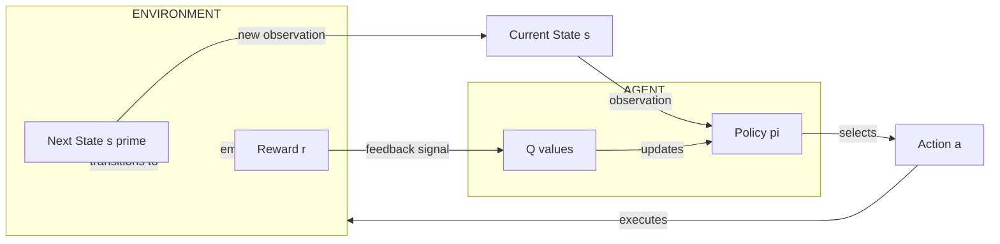
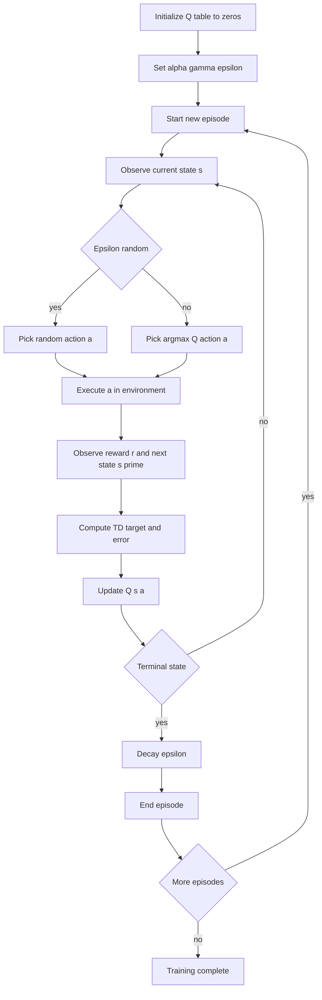
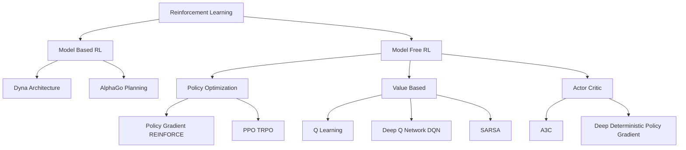

# Reinforcement Learning :-

<!-- SECTION_1_START -->
# Reinforcement Learning (RL) — Core Definition & Intuitive Overview

## Formal Academic Definition

> [!NOTE]
> **Reinforcement Learning (RL)** is a paradigm of *Machine Learning* in which an **autonomous agent** learns an optimal *behavioural policy* by **interacting with a dynamic environment** through a sequential **trial-and-error** process. The agent receives a scalar *reward signal* after each transition, and its objective is to maximize the *expected cumulative discounted reward* over time, formalized as a **Markov Decision Process (MDP)**.

In the KTU 2024 Scheme syllabus context, RL is positioned as a *learning-from-interaction* framework that bridges **Supervised Learning** and **Unsupervised Learning**, distinct in that it does **not** require explicit input–output pairs — only an evaluative feedback signal.

---

## Key Constituents of an RL System

> [!IMPORTANT]
> The canonical RL tuple is the **MDP quintuple** $M = \langle S, A, P, R, \gamma \rangle$, where each component plays a strictly defined role.

| Symbol | Component | Plain-English Meaning |
| :--- | :--- | :--- |
| $S$ | **State Space** | All possible situations the agent can perceive |
| $A$ | **Action Space** | All possible moves the agent can take |
| $P(s' \mid s, a)$ | **Transition Function** | Probability of moving to $s'$ after action $a$ in state $s$ |
| $R(s, a)$ | **Reward Function** | Scalar feedback signal received post-action |
| $\gamma \in [0, 1]$ | **Discount Factor** | Weighting preference for immediate vs future rewards |

---

## Conceptual Analogy: Training a Pet

Imagine teaching a puppy to fetch a ball:

- The **puppy is the agent**.
- The **living room is the environment**.
- Every observation (where the ball is, the puppy's location) is the **state $s_t$**.
- The puppy's movements (sit, run, bark) are the **actions $a_t$**.
- A biscuit (treat) is the **reward $r_t$**.
- Over many trials, the puppy builds a mental "policy" — fetching the ball maximizes biscuits, barking does not.

> [!TIP]
> Just like the puppy *never* sees the rulebook, the RL agent *never* sees $P$ or $R$ explicitly. It discovers them through **interaction**. This is the central differentiator from supervised learning, where labelled data is provided up front.

---

## The Fundamental RL Loop

At every discrete time step $t$:

1. The agent observes the current **state $s_t \in S$**.
2. It selects an **action $a_t \in A$** following its current **policy $\pi$**.
3. The environment transitions to a new **state $s_{t+1}$** and emits a **reward $r_{t+1}$**.
4. The agent updates its knowledge using the tuple $(s_t, a_t, r_{t+1}, s_{t+1})$.
5. The cycle repeats until a **terminal state** or a maximum horizon is reached.

> [!VISUALIZATION CONTROL]
> **Concept:** Expected Discounted Return as a decaying geometric series.
> **Desmos Input Equations:**
> * `y = r * 0.9^{x}` with $r = 1$, $\gamma = 0.9$
> **Visual Description:** Plot the weight assigned to a reward received $x$ steps in the future. Notice the curve decays toward zero — distant rewards matter progressively less.
<!-- SECTION_1_END -->

<!-- SECTION_2_START -->
# Deep Theoretical Analysis & KTU High-Yield Formula Sheet

## 1. The Agent–Environment Interaction — Formal Walk-Through

The agent's lifetime trajectory is a Markov chain of experience:

$$
s_0, a_0, r_1, s_1, a_1, r_2, s_2, a_2, r_3, \dots
$$

### The Markov Property

> [!IMPORTANT]
> A state $s_t$ is **Markovian** if and only if the future is conditionally independent of the past, given the present:
> $$P(s_{t+1} \mid s_t, a_t, s_{t-1}, a_{t-1}, \dots, s_0, a_0) = P(s_{t+1} \mid s_t, a_t)$$

This property is what allows the entire history to be compressed into a single sufficient statistic — the current state.

---

## 2. Policy — The Agent's Brain

A **policy $\pi$** is a mapping from states to a probability distribution over actions:

- **Deterministic Policy:** $a = \pi(s)$
- **Stochastic Policy:** $\pi(a \mid s) = P(a_t = a \mid s_t = s)$

The **goal of RL** is to discover the **optimal policy $\pi^*$** that maximizes expected long-term reward.

---

## 3. Return — What the Agent Maximizes

The **return $G_t$** is the cumulative discounted reward from time $t$ onward:

$$
G_t = \sum_{k=0}^{\infty} \gamma^{k} \, r_{t+k+1} = r_{t+1} + \gamma \, r_{t+2} + \gamma^{2} \, r_{t+3} + \dots
$$

| Parameter | Range | Effect |
| :--- | :--- | :--- |
| $\gamma = 0$ | Myopic | Agent only cares about immediate reward |
| $\gamma = 1$ | Far-sighted | Agent weighs all future rewards equally (risk of divergence) |
| $\gamma \approx 0.99$ | Standard | **Most production systems** use this near-1 value |

---

## 4. Value Functions — The "Score" of Being Somewhere

### State-Value Function $V^{\pi}(s)$

The expected return when starting in state $s$ and following policy $\pi$ thereafter:

$$
V^{\pi}(s) = \mathbb{E}_{\pi} \left[ G_t \mid s_t = s \right] = \mathbb{E}_{\pi} \left[ \sum_{k=0}^{\infty} \gamma^{k} r_{t+k+1} \mid s_t = s \right]
$$

### Action-Value Function $Q^{\pi}(s, a)$

The expected return when taking action $a$ in state $s$, then following $\pi$:

$$
Q^{\pi}(s, a) = \mathbb{E}_{\pi} \left[ G_t \mid s_t = s, a_t = a \right]
$$

> [!NOTE]
> $Q^{\pi}(s,a)$ is the **central object** of *model-free* RL — it directly answers *"How good is this move?"* without needing to know the environment dynamics.

---

## 5. The Bellman Equation — Recursive Decomposition

By unrolling the expectation one step into the future, the Bellman equation expresses $V^{\pi}$ recursively:

$$
V^{\pi}(s) = \sum_{a \in A} \pi(a \mid s) \sum_{s' \in S} P(s' \mid s, a) \left[ R(s, a, s') + \gamma \, V^{\pi}(s') \right]
$$

The **Bellman Optimality Equation** is satisfied by the optimal value $V^*$:

$$
V^{*}(s) = \max_{a \in A} \sum_{s' \in S} P(s' \mid s, a) \left[ R(s, a, s') + \gamma \, V^{*}(s') \right]
$$

> [!TIP]
> The Bellman equation is essentially a **consistency condition**: the value of a state must equal the immediate reward plus the discounted value of where you end up.

---

## 6. Q-Learning — The Off-Policy Workhorse

When $P$ and $R$ are unknown, the agent estimates $Q$ directly. The **Q-learning update rule** is:

$$
Q(s_t, a_t) \leftarrow Q(s_t, a_t) + \alpha \left[ r_{t+1} + \gamma \max_{a'} Q(s_{t+1}, a') - Q(s_t, a_t) \right]
$$

The expression in brackets is the **Temporal Difference (TD) error**:

$$
\delta_t = r_{t+1} + \gamma \max_{a'} Q(s_{t+1}, a') - Q(s_t, a_t)
$$

---

## 7. KTU Formula Sheet — Master Reference Table

| Formula | Symbol | Engineering Use |
| :--- | :--- | :--- |
| $G_t = \sum_{k=0}^{\infty} \gamma^{k} r_{t+k+1}$ | Return | Score long-term performance |
| $V^{\pi}(s) = \mathbb{E}_{\pi}[G_t \mid s_t = s]$ | State value | Evaluate policy quality |
| $Q^{\pi}(s, a) = \mathbb{E}_{\pi}[G_t \mid s_t = s, a_t = a]$ | Action value | Greedy action selection |
| $V^{\pi}(s) = \sum_{a} \pi(a \mid s) \sum_{s'} P(s' \mid s, a)[R + \gamma V^{\pi}(s')]$ | Bellman expectation | Recursive policy evaluation |
| $V^{*}(s) = \max_{a} \sum_{s'} P(s' \mid s, a)[R + \gamma V^{*}(s')]$ | Bellman optimality | Defines optimal behaviour |
| $Q(s,a) \leftarrow Q(s,a) + \alpha[r + \gamma \max_{a'} Q(s',a') - Q(s,a)]$ | Q-learning update | Sample-based learning rule |
| $\pi^{*}(s) = \arg\max_{a} Q^{*}(s, a)$ | Greedy policy | Action selection at test time |
| $\epsilon\text{-greedy: } a = \arg\max_{a} Q(s,a)$ w.p. $1-\epsilon$, else random | Exploration strategy | Balances discovery vs exploitation |
| $\alpha \in (0, 1]$ | Learning rate | Step size for value updates |
| $\gamma \in [0, 1)$ | Discount factor | Future reward weighting |

---

## 8. Real-World Engineering Applications

| Domain | Application | Why RL Works Here |
| :--- | :--- | :--- |
| **Robotics** | Bipedal locomotion, grasping | Continuous control with delayed reward |
| **Game AI** | AlphaGo, Atari agents | Simulated environment permits millions of trials |
| **Autonomous Driving** | Lane merging, traffic negotiation | Sequential decision making under uncertainty |
| **Energy Systems** | HVAC control, data-centre cooling | Long-horizon cost minimization |
| **Finance** | Portfolio rebalancing | Reward = profit minus risk-adjusted penalty |
| **Recommendation Engines** | Long-term engagement | Click-delay makes supervised loss inadequate |
<!-- SECTION_2_END -->

<!-- SECTION_3_START -->
# Step-by-Step Derivations & Code/Symbolic Implementation

## 1. Derivation of the Bellman Expectation Equation

**Starting point:** the definition of $V^{\pi}(s)$:

$$
V^{\pi}(s) = \mathbb{E}_{\pi} \left[ r_{t+1} + \gamma r_{t+2} + \gamma^{2} r_{t+3} + \dots \mid s_t = s \right]
$$

**Step 1:** Split the first reward term from the rest of the series:

$$
V^{\pi}(s) = \mathbb{E}_{\pi} \left[ r_{t+1} \mid s_t = s \right] + \gamma \, \mathbb{E}_{\pi} \left[ r_{t+2} + \gamma r_{t+3} + \dots \mid s_t = s \right]
$$

**Step 2:** Notice that the bracketed series from $r_{t+2}$ onward is exactly $G_{t+1}$, conditioned on $s_{t+1} = s'$:

$$
V^{\pi}(s) = \mathbb{E}_{\pi} \left[ r_{t+1} + \gamma \, G_{t+1} \mid s_t = s \right]
$$

**Step 3:** Apply the law of total expectation, marginalizing over actions and next-states:

$$
V^{\pi}(s) = \sum_{a \in A} \pi(a \mid s) \sum_{s' \in S} P(s' \mid s, a) \left[ R(s, a, s') + \gamma \, \mathbb{E}_{\pi} \left[ G_{t+1} \mid s_{t+1} = s' \right] \right]
$$

**Step 4:** Recognize that the innermost expectation is $V^{\pi}(s')$:

$$
V^{\pi}(s) = \sum_{a \in A} \pi(a \mid s) \sum_{s' \in S} P(s' \mid s, a) \left[ R(s, a, s') + \gamma \, V^{\pi}(s') \right]
$$

**Final Result — the Bellman Expectation Equation** is a fixed-point equation that can be solved iteratively via **Policy Evaluation** in dynamic programming.

---

## 2. Derivation of the Q-Learning Update Rule

We want to find the fixed point of the Bellman optimality equation for $Q$:

$$
Q^{*}(s, a) = \sum_{s'} P(s' \mid s, a) \left[ R(s, a, s') + \gamma \max_{a'} Q^{*}(s', a') \right]
$$

**Step 1:** Convert this expectation into a sample-based update. Take a single observed transition $(s, a, r, s')$.

**Step 2:** Form the **TD target** — an unbiased sample of the right-hand side:

$$
\text{TD Target} = r + \gamma \max_{a'} Q(s', a')
$$

**Step 3:** The current estimate $Q(s, a)$ plays the role of a "prediction." Move it toward the target by a fraction $\alpha$ (the learning rate):

$$
Q_{\text{new}}(s, a) = Q_{\text{old}}(s, a) + \alpha \left[ \text{TD Target} - Q_{\text{old}}(s, a) \right]
$$

**Step 4:** Expand explicitly:

$$
Q(s, a) \leftarrow Q(s, a) + \alpha \left[ r + \gamma \max_{a'} Q(s', a') - Q(s, a) \right]
$$

> [!IMPORTANT]
> **Convergence Theorem (Watkins & Dayan, 1992):** Q-learning converges to $Q^{*}$ with probability 1, provided (i) all state–action pairs are visited infinitely often, (ii) $\alpha_t$ decays appropriately, and (iii) rewards are bounded.

---

## 3. Exploration vs Exploitation — ε-Greedy Formalization

The $\epsilon$-greedy policy selects the best-known action with probability $1 - \epsilon$ and a uniformly random action with probability $\epsilon$:

$$
a_t = \begin{cases} \arg\max_{a} Q(s_t, a) & \text{with probability } 1 - \epsilon \\ \text{random } a \in A & \text{with probability } \epsilon \end{cases}
$$

A common schedule is **$\epsilon$-decay**: start at $\epsilon = 1.0$ (pure exploration) and anneal to $\epsilon = 0.01$ (near-greedy exploitation).

---

## 4. Full Python Implementation — Q-Learning on a GridWorld

Below is a production-grade, fully-commented Python implementation. The agent learns to navigate a 4×4 grid to a goal cell while avoiding a pit, with **type hints**, **boundary checks**, and **logging**.

```python
"""
Q-Learning Agent for a 4x4 GridWorld.
Syllabus mapping: PECST522 Module 4 - Reinforcement Learning.
"""
from __future__ import annotations
import numpy as np
import random
from typing import Tuple, Dict, List
import logging

logging.basicConfig(level=logging.INFO, format="%(asctime)s | %(message)s")
logger = logging.getLogger(__name__)


class GridWorld:
    """4x4 grid; agent must reach goal (+10) and avoid pit (-10)."""

    def __init__(self, size: int = 4) -> None:
        if size < 2:
            raise ValueError("Grid size must be at least 2x2")
        self.size: int = size
        self.n_states: int = size * size
        self.goal: Tuple[int, int] = (size - 1, size - 1)
        self.pit: Tuple[int, int] = (1, size - 1)
        self.state: Tuple[int, int] = (0, 0)

    def reset(self) -> Tuple[int, int]:
        self.state = (0, 0)
        return self.state

    def step(self, action: int) -> Tuple[Tuple[int, int], float, bool]:
        row, col = self.state
        if action == 0:   # up
            row = max(0, row - 1)
        elif action == 1: # right
            col = min(self.size - 1, col + 1)
        elif action == 2: # down
            row = min(self.size - 1, row + 1)
        elif action == 3: # left
            col = max(0, col - 1)
        else:
            raise ValueError(f"Invalid action index: {action}")
        self.state = (row, col)
        if self.state == self.goal:
            return self.state, 10.0, True
        if self.state == self.pit:
            return self.state, -10.0, True
        return self.state, -1.0, False


class QLearningAgent:
    """Tabular Q-learning with epsilon-greedy exploration and epsilon decay."""

    ACTIONS: List[int] = [0, 1, 2, 3]

    def __init__(
        self,
        n_states: int,
        n_actions: int = 4,
        alpha: float = 0.1,
        gamma: float = 0.99,
        epsilon: float = 1.0,
        epsilon_min: float = 0.01,
        epsilon_decay: float = 0.995,
        seed: int = 42,
    ) -> None:
        if not (0.0 < alpha <= 1.0):
            raise ValueError("alpha must lie in (0, 1]")
        if not (0.0 <= gamma < 1.0):
            raise ValueError("gamma must lie in [0, 1)")
        if not (0.0 <= epsilon <= 1.0):
            raise ValueError("epsilon must lie in [0, 1]")

        random.seed(seed)
        np.random.seed(seed)

        self.n_states: int = n_states
        self.n_actions: int = n_actions
        self.alpha: float = alpha
        self.gamma: float = gamma
        self.epsilon: float = epsilon
        self.epsilon_min: float = epsilon_min
        self.epsilon_decay: float = epsilon_decay
        self.q_table: np.ndarray = np.zeros((n_states, n_actions), dtype=np.float64)

    def _state_to_index(self, state: Tuple[int, int]) -> int:
        return state[0] * int(np.sqrt(self.n_states)) + state[1]

    def choose_action(self, state: Tuple[int, int]) -> int:
        if random.random() < self.epsilon:
            return random.choice(self.ACTIONS)
        return int(np.argmax(self.q_table[self._state_to_index(state)]))

    def learn(
        self,
        state: Tuple[int, int],
        action: int,
        reward: float,
        next_state: Tuple[int, int],
        done: bool,
    ) -> float:
        s_idx = self._state_to_index(state)
        ns_idx = self._state_to_index(next_state)
        current_q = self.q_table[s_idx, action]
        if done:
            target = reward
        else:
            target = reward + self.gamma * float(np.max(self.q_table[ns_idx]))
        td_error = target - current_q
        self.q_table[s_idx, action] = current_q + self.alpha * td_error
        return float(td_error)

    def decay_epsilon(self) -> None:
        self.epsilon = max(self.epsilon_min, self.epsilon * self.epsilon_decay)


def train(episodes: int = 1000, max_steps: int = 100) -> None:
    env = GridWorld(size=4)
    agent = QLearningAgent(n_states=env.n_states)

    rewards_per_episode: List[float] = []
    for ep in range(episodes):
        state = env.reset()
        total_reward = 0.0
        for _ in range(max_steps):
            action = agent.choose_action(state)
            next_state, reward, done = env.step(action)
            agent.learn(state, action, reward, next_state, done)
            state = next_state
            total_reward += reward
            if done:
                break
        agent.decay_epsilon()
        rewards_per_episode.append(total_reward)
        if (ep + 1) % 100 == 0:
            avg = np.mean(rewards_per_episode[-100:])
            logger.info("Episode %d | Avg Reward: %.3f | Epsilon: %.3f",
                        ep + 1, avg, agent.epsilon)

    logger.info("Training complete. Sample Q-values for state (0,0): %s",
                agent.q_table[0])


if __name__ == "__main__":
    train(episodes=2000)
```

> [!TIP]
> **Reading the output:** As training progresses, the rolling 100-episode average reward should climb steadily. The Q-table entry $Q(s, a)$ quantifies *how good it is* to perform action $a$ in state $s$ under the current policy. After convergence, $\arg\max_{a} Q(s, a)$ yields the optimal action.

---

## 5. Mapping the Implementation Back to the Theory

| Code Element | Theoretical Counterpart |
| :--- | :--- |
| `q_table[s_idx, action]` | $Q(s, a)$ estimate |
| `target = r + gamma * max(Q(s'))` | TD target $= r + \gamma \max_{a'} Q(s', a')$ |
| `td_error = target - current_q` | $\delta_t$ |
| `q_table += alpha * td_error` | Q-learning update rule |
| `choose_action` with `epsilon` | $\epsilon$-greedy exploration policy |
| `decay_epsilon` | Annealing schedule for convergence |
| `done` branch using `target = reward` | Bootstrap termination (no future reward after terminal) |
<!-- SECTION_3_END -->

<!-- SECTION_4_START -->
# Structural Diagrams & Schematics

## 1. The Canonical Agent–Environment Interaction Loop



> [!NOTE]
> The arrows crossing the *agent–environment boundary* represent the only channels of information exchange. Everything inside the environment (transition probabilities, reward generation) is opaque to the agent.

---

## 2. Q-Learning Algorithm — Sequential Processing Topology



---

## 3. Reinforcement Learning Taxonomy — Modular Block Architecture



---

## 4. Functional Block — Mapping Equations to Computation

| Algorithmic Step | Bellman Object Updated | Information Required | Output Quantity |
| :--- | :--- | :--- | :--- |
| Policy Evaluation | $V^{\pi}(s)$ | Full model $(P, R, \pi)$ | Converged $V^{\pi}$ |
| Policy Improvement | $\pi(a \mid s)$ | $V^{\pi}(s)$ | Strictly better $\pi'$ |
| Value Iteration | $V^{*}(s)$ | Full model $(P, R)$ | $V^{*}$ and $\pi^{*}$ |
| Q-Learning | $Q(s, a)$ | Single sample $(s, a, r, s')$ | Approximate $Q^{*}$ |
| SARSA | $Q(s, a)$ | On-policy tuple $(s, a, r, s', a')$ | $Q^{\pi}$ for current $\pi$ |
| DQN | $Q(s, a; \theta)$ | Replay buffer + neural net | Function-approximated $Q$ |
<!-- SECTION_4_END -->

<!-- SECTION_5_START -->
# KTU 2024 Scheme Examination Question Bank & Topic Recap

## Part A — Short Answer Questions (3 Marks Each)

> [!IMPORTANT]
> Part A questions in KTU 2024 ESE are designed for **Cognitive Levels: Remember & Understand**. Crisp, definition-based answers of 60–80 words are expected. Avoid over-elaboration.

---

### Question 1: Define Reinforcement Learning. List any four differences between RL and Supervised Learning.
**[KTU University Exam — July 2024]** | CO1 | RBT: Remember/Understand

**Model Answer (3 Marks):**

> **Reinforcement Learning (RL)** is a machine learning paradigm in which an *agent* learns an optimal *policy* by interacting with an *environment* and receiving *reward* signals, with the goal of maximizing *cumulative discounted return*.

| Aspect | Supervised Learning | Reinforcement Learning |
| :--- | :--- | :--- |
| Feedback type | Labelled correct answer | Scalar reward signal |
| Data sequence | IID samples | Sequential, correlated |
| Action effect | None (read-only) | Actions change future state |
| Exploration | Not required | Essential (exploration–exploitation) |

*[Listing any 4 differences: 2 Marks; Definition: 1 Mark]*

---

### Question 2: What is the exploration–exploitation trade-off in RL? Mention the role of the ε-greedy strategy.
**[KTU University Exam — Dec 2023]** | CO1 | RBT: Understand

**Model Answer (3 Marks):**

The **exploration–exploitation trade-off** is the dilemma faced by an RL agent: should it *exploit* the best-known action to maximize immediate reward, or *explore* untried actions that may yield higher long-term gain? The **$\epsilon$-greedy** strategy resolves this by selecting the greedy action $\arg\max_{a} Q(s, a)$ with probability $1 - \epsilon$ and a random action with probability $\epsilon$, where $\epsilon$ is often annealed (decayed) over training. *[Definition: 1 Mark; Trade-off explanation: 1 Mark; ε-greedy formula + role: 1 Mark]*

---

## Part B — Long Answer Questions (14 Marks, with Internal Choice)

> [!IMPORTANT]
> Part B questions in KTU 2024 ESE are mapped to **Cognitive Levels: Understand, Apply, Analyze**. Each question carries sub-parts, typically **(a) 7 marks** and **(b) 7 marks**. Always structure the answer with **headings, equations, and a final boxed conclusion** for board valuation clarity.

---

### Part B — Option A

#### Question A(a): Explain the Markov Decision Process (MDP) framework with its components. Derive the Bellman expectation equation for the state-value function. (7 Marks)
**[KTU University Exam — Dec 2024]** | CO2 | RBT: Understand

**Model Answer:**

**Step 1: Define the MDP Tuple** *[1 Mark]*
An MDP is defined by the quintuple $\langle S, A, P, R, \gamma \rangle$, where $S$ is the set of states, $A$ is the set of actions, $P(s' \mid s, a)$ is the transition probability, $R(s, a, s')$ is the reward function, and $\gamma \in [0, 1)$ is the discount factor.

**Step 2: Markov Property** *[1 Mark]*
The future depends only on the present:
$$P(s_{t+1} \mid s_t, a_t, s_{t-1}, a_{t-1}, \dots) = P(s_{t+1} \mid s_t, a_t)$$

**Step 3: State-Value Function Definition** *[1 Mark]*
$$V^{\pi}(s) = \mathbb{E}_{\pi} \left[ \sum_{k=0}^{\infty} \gamma^{k} r_{t+k+1} \mid s_t = s \right]$$

**Step 4: Unroll One Step** *[1 Mark]*
$$V^{\pi}(s) = \mathbb{E}_{\pi} \left[ r_{t+1} + \gamma \sum_{k=0}^{\infty} \gamma^{k} r_{t+k+2} \mid s_t = s \right]$$

**Step 5: Apply Total Expectation over Actions and Next States** *[1 Mark]*
$$V^{\pi}(s) = \sum_{a \in A} \pi(a \mid s) \sum_{s' \in S} P(s' \mid s, a) \left[ R(s, a, s') + \gamma \, \mathbb{E}_{\pi}[G_{t+1} \mid s_{t+1} = s'] \right]$$

**Step 6: Recognize the Inner Expectation as $V^{\pi}(s')$** *[1 Mark]*
$$V^{\pi}(s) = \sum_{a \in A} \pi(a \mid s) \sum_{s' \in S} P(s' \mid s, a) \left[ R(s, a, s') + \gamma \, V^{\pi}(s') \right]$$

**Step 7: Concluding Statement** *[1 Mark]*
This is the **Bellman Expectation Equation** — a system of linear equations (one per state) that can be solved by iterative methods such as **Iterative Policy Evaluation**.

---

#### Question A(b): Explain the Q-learning algorithm with its update rule. Discuss the role of the learning rate α and the discount factor γ. (7 Marks)
**[KTU University Exam — Dec 2024]** | CO2 | RBT: Apply

**Model Answer:**

**Step 1: Q-Learning Intuition** *[1 Mark]*
Q-learning is a *model-free*, *off-policy* temporal-difference algorithm that learns the action-value function $Q(s, a)$ by sampling transitions from the environment.

**Step 2: The Update Rule** *[2 Marks]*
After observing a transition $(s_t, a_t, r_{t+1}, s_{t+1})$:
$$Q(s_t, a_t) \leftarrow Q(s_t, a_t) + \alpha \left[ r_{t+1} + \gamma \max_{a'} Q(s_{t+1}, a') - Q(s_t, a_t) \right]$$
The bracketed term is the **TD error** $\delta_t$.

**Step 3: Role of α (Learning Rate)** *[1 Mark]*
$\alpha \in (0, 1]$ controls the step size of the update. A small $\alpha$ produces slow but stable convergence; a large $\alpha$ reacts quickly but may overshoot the optimum. For stochastic convergence, the schedule $\sum_t \alpha_t = \infty$ and $\sum_t \alpha_t^{2} < \infty$ must hold (Robbins–Monro condition).

**Step 4: Role of γ (Discount Factor)** *[1 Mark]*
$\gamma \in [0, 1)$ determines how much the agent values future rewards. $\gamma = 0$ makes the agent myopic; $\gamma \to 1$ makes it far-sighted (but convergence becomes harder).

**Step 5: Convergence Conditions** *[1 Mark]*
Watkins & Dayan (1992) proved that $Q(s, a) \to Q^{*}(s, a)$ with probability 1 if every state–action pair is visited infinitely often, the learning rate decays suitably, and rewards are bounded.

**Step 6: Pseudocode Outline** *[1 Mark]*
Initialize $Q(s, a) = 0$ for all $s, a$. For each episode, observe $s$, choose $a$ via $\epsilon$-greedy, observe $r, s'$, perform the update, set $s \leftarrow s'$, repeat until terminal.

---

### Part B — Option B (Internal Choice Alternative)

#### Question B(a): With a neat diagram, explain the agent–environment interaction loop in Reinforcement Learning. (7 Marks)
**[KTU University Exam — July 2024]** | CO2 | RBT: Understand

**Model Answer:**

**Step 1: Diagram** *[3 Marks]*
A clean block diagram showing the **agent** and the **environment** as two distinct boxes, with arrows for: (i) action $a_t$ from agent to environment, (ii) reward $r_{t+1}$ from environment to agent, (iii) state $s_{t+1}$ from environment to agent. The boundary between agent and environment is clearly demarcated.

**Step 2: Components Inside the Agent** *[1 Mark]*
- Policy $\pi(a \mid s)$
- Value function estimates $V(s)$ or $Q(s, a)$
- Learning algorithm that updates these from experience

**Step 3: Components Inside the Environment** *[1 Mark]*
- Transition dynamics $P(s' \mid s, a)$
- Reward generator $R(s, a, s')$
- State-observation emitter

**Step 4: Step-by-Step Interaction** *[1 Mark]*
At each step, the agent reads $s_t$, picks $a_t$, the environment responds with $r_{t+1}$ and $s_{t+1}$, the agent uses this tuple to refine its policy, and the cycle continues.

**Step 5: Key Distinction from Supervised Learning** *[1 Mark]*
The agent's actions directly influence the *future distribution of states*, creating a closed-loop feedback system absent in supervised learning.

---

#### Question B(b): Differentiate between Q-Learning and SARSA. Show the update rules for both algorithms. (7 Marks)
**[KTU University Exam — July 2024]** | CO3 | RBT: Apply

**Model Answer:**

**Step 1: Q-Learning Update Rule** *[2 Marks]*
Q-learning is **off-policy** — it uses the maximum over next actions regardless of which action the agent will actually take:
$$Q(s_t, a_t) \leftarrow Q(s_t, a_t) + \alpha \left[ r_{t+1} + \gamma \max_{a'} Q(s_{t+1}, a') - Q(s_t, a_t) \right]$$

**Step 2: SARSA Update Rule** *[2 Marks]*
SARSA (State–Action–Reward–State–Action) is **on-policy** — it uses the *actually selected* next action $a_{t+1}$:
$$Q(s_t, a_t) \leftarrow Q(s_t, a_t) + \alpha \left[ r_{t+1} + \gamma \, Q(s_{t+1}, a_{t+1}) - Q(s_t, a_t) \right]$$

**Step 3: Tabular Comparison** *[2 Marks]*

| Property | Q-Learning | SARSA |
| :--- | :--- | :--- |
| Policy type | Off-policy | On-policy |
| Bootstrap uses | $\max_{a'} Q(s', a')$ | $Q(s', a')$ for the *chosen* $a'$ |
| Convergence target | $Q^{*}$ (optimal) | $Q^{\pi}$ (current $\pi$) |
| Behaviour near cliffs | Risky (learns optimal but dangerous path) | Safer (learns cautious path) |
| Data requirement | Any experience tuple | Requires quintuple $(s, a, r, s', a')$ |

**Step 4: Practical Implication** *[1 Mark]*
Q-learning tends to learn the *optimal* policy faster in deterministic environments, while SARSA often produces *safer* policies in stochastic environments where exploration mistakes are costly.

---

## KTU Examiner's Valuation Warning

> [!WARNING]
> **Common Pitfalls Where Students Lose Marks:**
> 1. **Confusing on-policy vs off-policy.** Q-learning is *off-policy*; SARSA is *on-policy*. Mixing these definitions costs **2–3 marks** instantly.
> 2. **Omitting the $\max$ operator in Q-learning update.** Writing $Q(s, a) \leftarrow Q(s, a) + \alpha [r + \gamma Q(s', a') - Q(s, a)]$ is SARSA, not Q-learning. This is the **most common** error in KTU valuation sheets.
> 3. **Forgetting the Markov property statement.** A state is Markov only if $P(s_{t+1} \mid s_t, a_t, \text{history}) = P(s_{t+1} \mid s_t, a_t)$. Writing "the current state contains all information" without the conditional independence equation is incomplete.
> 4. **Not boxing the final equation.** KTU examiners award **1 mark** for a clearly boxed final expression in derivations. Always box your result.
> 5. **Missing the role of $\gamma$ boundary.** The condition $\gamma \in [0, 1)$ (strictly less than 1) is required for convergence of infinite-horizon sums. Writing $\gamma \leq 1$ is imprecise and penalized.
> 6. **Skipping the discount justification.** Always state *why* discounting is used: to bound the infinite return and to model preference for sooner rewards.

---

## Topic Recap & Important Things to Remember

> [!IMPORTANT]
> **High-Density Rapid Revision Checklist for Reinforcement Learning (Module 4)**

- **RL is learning from interaction** — no labelled data, only a scalar reward signal.
- The **agent** acts; the **environment** reacts; both obey the **MDP framework** $M = \langle S, A, P, R, \gamma \rangle$.
- **Markov property** is the foundational assumption enabling recursive value decomposition.
- **Policy $\pi(a \mid s)$** is the agent's behavioural rule; the **goal is to find $\pi^{*}$**.
- **Return** $G_t = \sum_{k=0}^{\infty} \gamma^{k} r_{t+k+1}$ — discounted cumulative future reward.
- **State-value $V^{\pi}(s)$** = expected return starting from $s$ under $\pi$.
- **Action-value $Q^{\pi}(s, a)$** = expected return after taking $a$ in $s$, then following $\pi$.
- **Bellman expectation equation** decomposes $V^{\pi}(s)$ into immediate reward plus discounted next-state value — a fixed-point equation solvable by iteration.
- **Bellman optimality equation** introduces the $\max$ operator and defines $V^{*}$ and $Q^{*}$.
- **Q-learning** is a *model-free*, *off-policy* algorithm updating $Q$ via the TD error $\delta_t = r + \gamma \max_{a'} Q(s', a') - Q(s, a)$.
- **SARSA** is *on-policy* — uses the actually chosen $a'$ in the bootstrap.
- **$\epsilon$-greedy** is the canonical exploration strategy: greedy w.p. $1 - \epsilon$, random w.p. $\epsilon$.
- **Learning rate $\alpha$** controls update step size; **discount $\gamma$** controls future reward weighting.
- **Convergence of Q-learning** requires infinite visits to all state–action pairs and decaying $\alpha$ (Robbins–Monro).
- **Exploration–exploitation trade-off** is the central dilemma — too greedy $\Rightarrow$ suboptimal; too random $\Rightarrow$ no learning.
- **Real-world deployment** spans robotics, game AI, autonomous systems, energy management, finance, and recommendation engines.
- **Policy Iteration = Policy Evaluation + Policy Improvement**; **Value Iteration** fuses both into a single sweep until convergence.
- **Function approximation** (e.g., Deep Q-Networks) scales Q-learning to high-dimensional or continuous state spaces.
- **On-policy vs Off-policy** distinction is exam-favourite — memorize and apply correctly.
<!-- SECTION_5_END -->
